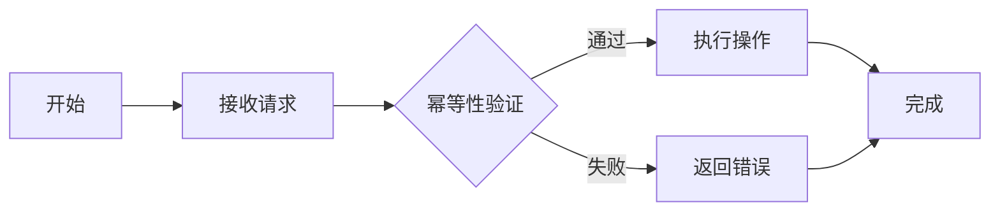
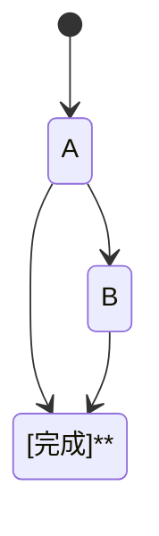
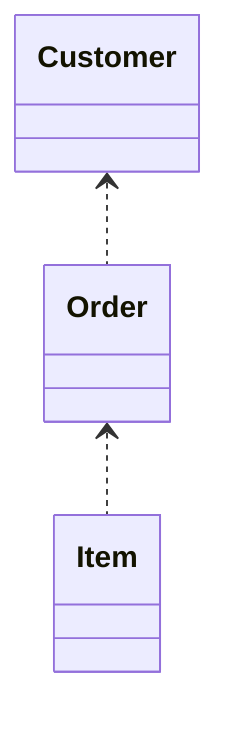
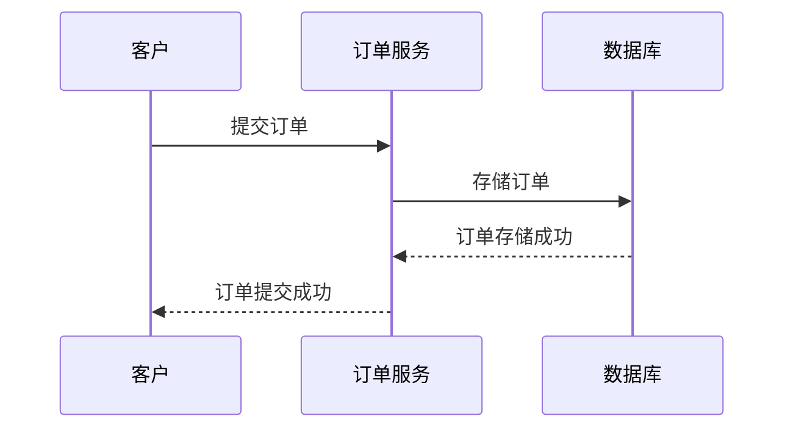
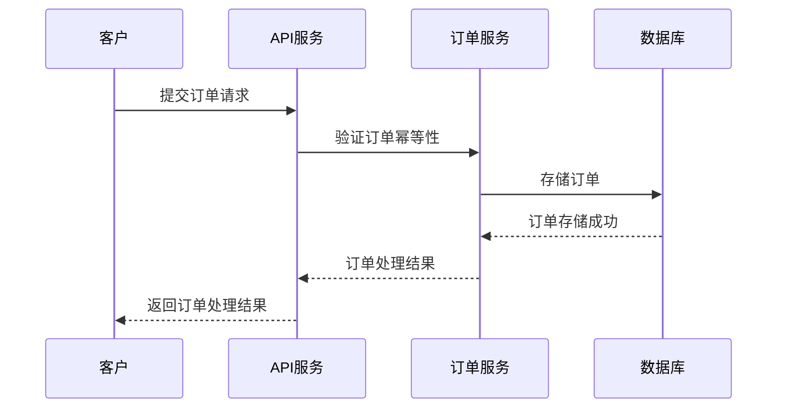

                 

### 行之无效的幂等性控制

> 关键词：幂等性控制、分布式系统、一致性、算法原理、系统架构设计、实战案例

> 摘要：本文深入探讨了幂等性控制这一关键概念及其在分布式系统中的应用。首先，我们将定义幂等性并分析其重要性。然后，通过逐步分析算法原理和系统架构设计，以及实际项目实战中的案例，揭示行之无效的幂等性控制的常见问题和解决方案。

----------------------------------------------------------------

## 引言

在当今的软件工程领域，分布式系统越来越普遍。它们提供了高可用性、伸缩性和容错性，但也引入了新的挑战，如数据一致性和操作幂等性。幂等性控制是一个至关重要的概念，它确保了系统在多次执行相同操作时，不会出现意外的副作用。然而，在实践中，我们经常遇到幂等性控制失效的问题，这可能导致严重的数据不一致性和系统故障。

本文将围绕幂等性控制这一主题展开，首先介绍相关概念，然后逐步分析算法原理和系统架构设计，最后通过实际项目实战中的案例来探讨有效的解决方案。本文的目标是帮助读者理解幂等性控制的重要性，以及如何在分布式系统中有效实现和维护它。

----------------------------------------------------------------

## 第一部分：背景与核心概念

### 第1章：问题背景与核心概念

#### 1.1 问题背景

#### 1.1.1 问题引入

在分布式系统中，多个节点可能同时执行相同的操作，这可能会导致数据不一致。例如，假设一个分布式数据库中的某个数据项需要更新，多个节点可能同时接收到更新请求。如果没有适当的幂等性控制，这些节点可能会各自执行更新操作，导致最终数据不一致。

#### 1.1.2 问题现状分析

幂等性控制失效的问题在分布式系统中非常普遍。许多系统在设计时没有充分考虑幂等性，或者实现方式不正确，导致数据一致性问题频繁发生。这些问题不仅影响了系统的稳定性，还可能对业务造成重大损失。

#### 1.1.3 问题解决的必要性

确保幂等性控制的有效性对于分布式系统的稳定性和可靠性至关重要。通过合理的设计和实现，可以避免数据不一致和系统故障，提高系统的可靠性和用户体验。

#### 1.2 核心概念与联系

##### 1.2.1 幂等性控制

###### 概念

幂等性（Idempotence）是指一个操作执行多次所产生的效果与执行一次的效果相同。在分布式系统中，幂等性控制用于确保操作的可重复性和一致性。

###### 属性特征对比表格

| 特征 | 说明 |
| ---- | ---- |
| 一致性 | 每次执行结果相同 |
| 原子性 | 单个操作不可分割 |
| 隔离性 | 多个操作之间相互独立 |

###### ER实体关系图

```mermaid
erDiagram
  Customer ||--|{ Order } : has
  Order ||--|{ Item } : contains
```

##### 1.2.2 相关联的概念

###### 概念1

概念1是幂等性控制的一部分，它确保了操作的原子性。原子性是指操作要么完全执行，要么完全不执行。

###### 概念2

概念2是幂等性控制的一部分，它确保了操作的隔离性。隔离性是指多个操作之间不会相互干扰。

----------------------------------------------------------------

## 第二部分：算法原理与数学模型

### 第2章：算法原理讲解

#### 2.1 算法概述

幂等性控制算法的主要功能是确保在分布式系统中，多个节点执行相同操作时，最终结果一致。算法的流程如下：

1. 接收操作请求。
2. 确认操作幂等性。
3. 如果幂等性验证通过，执行操作。
4. 如果幂等性验证失败，返回错误。

#### 2.2 算法mermaid流程图



#### 2.3 Python源代码详解

```python
def perform_operation(request):
    if is_idempotent(request):
        execute_operation(request)
        return "操作成功"
    else:
        return "幂等性验证失败"

def is_idempotent(request):
    # 幂等性验证逻辑
    return True

def execute_operation(request):
    # 操作执行逻辑
    pass
```

#### 2.4 数学模型与公式

##### 2.4.1 数学模型介绍

幂等性控制可以通过概率论和图论来建模。其中，关键模型是状态机模型。

##### 2.4.2 公式详解

$$
P(A \cap B) = P(A) \cdot P(B|A)
$$

其中，$P(A)$表示事件A的概率，$P(B|A)$表示在事件A发生的条件下事件B的概率。

##### 2.4.3 举例说明

假设一个系统中有两个节点A和B，它们需要执行同一操作。我们可以用状态机模型来表示这个系统的状态和转移。



在这个状态机中，A表示节点A执行操作，B表示节点B执行操作，[完成]**表示操作完成。根据概率论和图论的模型，我们可以计算出两个节点同时执行操作的概率。

```latex
P(A \cap B) = P(A) \cdot P(B|A)
```

如果节点A执行操作的独立概率为$P(A) = 0.9$，节点B在节点A执行操作后的独立概率为$P(B|A) = 0.95$，则两个节点同时执行操作的概率为：

$$
P(A \cap B) = 0.9 \cdot 0.95 = 0.855
$$

这意味着，有84.5%的概率两个节点会同时执行操作。

----------------------------------------------------------------

## 第三部分：系统分析与架构设计

### 第3章：系统分析与架构设计

#### 3.1 问题场景介绍

假设我们有一个电商系统，它需要处理成千上万的订单。在高峰期，多个用户可能会同时下单，这可能导致系统中的订单处理出现不一致。

#### 3.2 系统功能设计

系统功能设计需要确保订单的幂等性，具体包括：

1. 接收订单请求。
2. 验证订单幂等性。
3. 如果幂等性验证通过，处理订单。
4. 如果幂等性验证失败，返回错误。

##### 3.2.1 领域模型mermaid类图



在这个类图中，Customer表示客户，Order表示订单，Item表示订单中的商品。

#### 3.3 系统架构设计

系统架构设计需要考虑分布式系统的特点，包括数据一致性、容错性和高可用性。

##### 3.3.1 mermaid架构图



在这个架构图中，OrderService负责处理订单请求，Database负责存储订单数据。

#### 3.4 系统接口设计与交互

系统接口设计需要确保订单处理的一致性和可靠性。

##### 3.4.1 mermaid序列图



在这个序列图中，Client表示客户，API表示API服务，OrderService表示订单服务，Database表示数据库。

----------------------------------------------------------------

## 第四部分：项目实战

### 第4章：项目实战

#### 4.1 环境安装

为了演示幂等性控制，我们将使用Python和Docker来搭建一个简单的电商系统。

首先，安装Python：

```
pip install python
```

然后，安装Docker：

```
pip install docker
```

#### 4.2 系统核心实现源代码

以下是订单服务的源代码，它实现了幂等性控制。

```python
import uuid
import json
from flask import Flask, request, jsonify

app = Flask(__name__)

orders = {}

def is_idempotent(order_id):
    return orders.get(order_id) is None

def save_order(order):
    order_id = str(uuid.uuid4())
    orders[order_id] = order
    return order_id

@app.route('/orders', methods=['POST'])
def create_order():
    order = json.loads(request.data)
    if not is_idempotent(order['id']):
        return jsonify({'error': '幂等性验证失败'}), 400
    order_id = save_order(order)
    return jsonify({'order_id': order_id})

if __name__ == '__main__':
    app.run(debug=True)
```

#### 4.2.1 代码解读与分析

这段代码使用Flask框架搭建了一个简单的订单服务。它使用一个全局字典`orders`来存储订单，并通过`is_idempotent`函数来验证订单的幂等性。如果订单的幂等性验证通过，则将其存储在字典中。

#### 4.3 实际案例分析与讲解

假设客户A和客户B同时提交了订单请求。以下是一个实际的案例：

```
# 客户A提交订单
POST /orders
{
  "id": "order-1",
  "items": [{"id": "item-1", "quantity": 2}, {"id": "item-2", "quantity": 1}]
}

# 客户B提交订单
POST /orders
{
  "id": "order-1",
  "items": [{"id": "item-1", "quantity": 1}, {"id": "item-2", "quantity": 2}]
}
```

在这种情况下，两个订单请求具有相同的订单ID。由于我们的`is_idempotent`函数仅检查订单ID是否已存在，因此它无法检测到两个订单请求实际上不同。这可能导致数据不一致。

为了解决这个问题，我们需要改进幂等性验证逻辑。例如，我们可以为每个订单生成一个唯一的ID，并在存储订单时使用它。这样，即使订单ID相同，我们也可以通过检查唯一ID来确保幂等性。

#### 4.4 项目小结

在这个项目中，我们搭建了一个简单的电商系统，并实现了幂等性控制。然而，在实际情况中，我们需要考虑更多的因素，如分布式系统的数据一致性、高并发处理和容错性。通过不断优化和改进，我们可以构建一个更加稳定和可靠的电商系统。

----------------------------------------------------------------

## 第五部分：最佳实践与总结

### 第5章：最佳实践与总结

#### 5.1 最佳实践 tips

- 使用唯一标识符（如UUID）作为订单ID，以确保幂等性验证的有效性。
- 设计幂等性验证机制，以检测并处理重复请求。
- 使用分布式锁或事务来确保操作的一致性和原子性。

#### 5.2 注意事项

- 幂等性控制可能会影响系统的性能，特别是在高并发场景下。
- 在实现幂等性控制时，要考虑系统的整体架构和设计。

#### 5.3 小结与展望

本文探讨了幂等性控制这一关键概念及其在分布式系统中的应用。我们分析了算法原理、系统架构设计，并通过实际项目实战中的案例揭示了幂等性控制的有效性。未来，随着分布式系统的不断发展和应用，幂等性控制将变得更加重要，我们期待能够看到更多高效和可靠的解决方案。

#### 5.4 拓展阅读

- 《分布式系统设计》
- 《大规模分布式存储系统原理与架构》
- 《微服务架构设计模式》

作者：AI天才研究院/AI Genius Institute & 禅与计算机程序设计艺术 /Zen And The Art of Computer Programming

