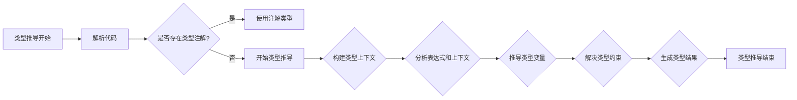
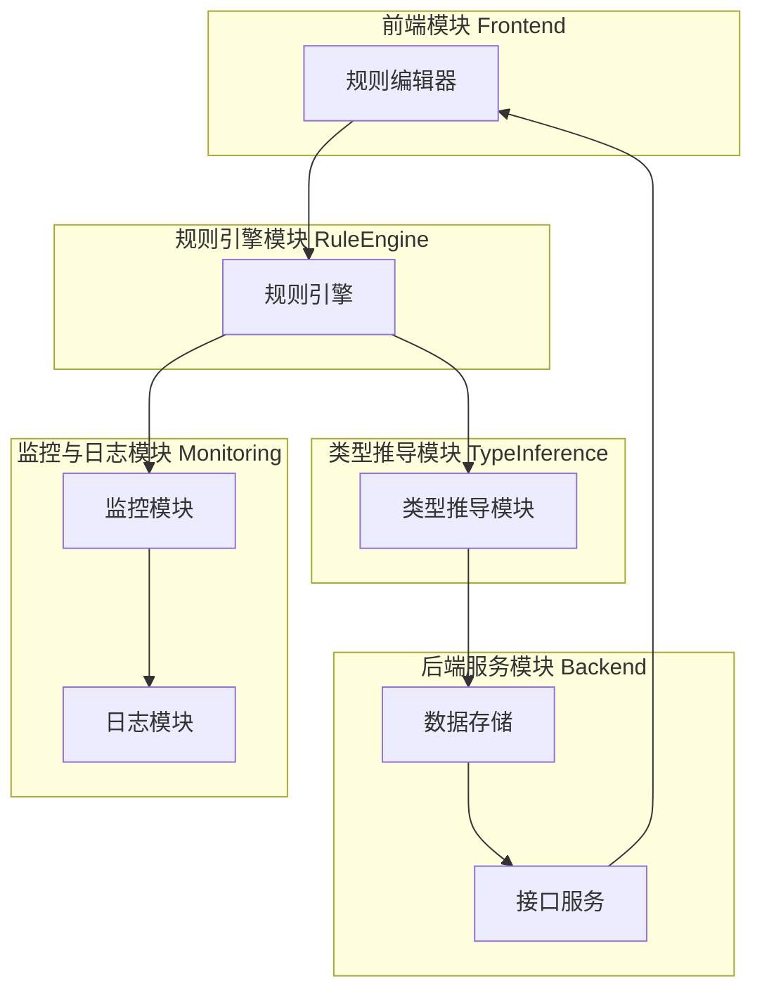
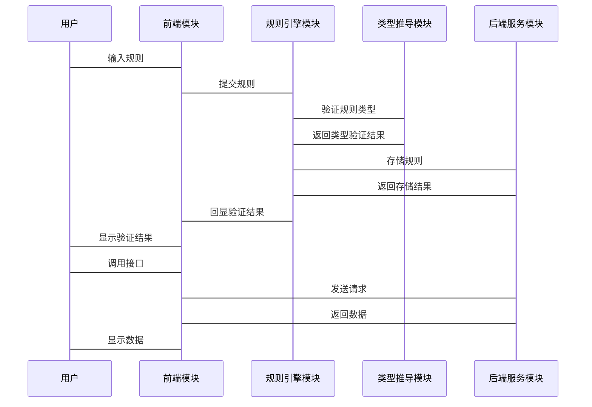

                 

### 第一部分：维特根斯坦的规则理论

#### 第1章：规则理论的基础

在维特根斯坦的思想体系中，规则理论占据了核心位置。他通过探讨语言与规则之间的关系，为我们理解规则的本质提供了独特的视角。在这一章中，我们将深入探讨规则理论的基础知识，了解规则的定义、分类以及维特根斯坦对规则理论的研究。

##### 1.1 规则的定义与分类

在维特根斯坦看来，规则是一种指导行为的准则。他强调了规则的形式和实质两个方面。**形式规则**指的是那些纯粹为了规范行为或决策过程而设定的规则，不考虑具体内容，只关注规则的形式结构。例如，交通规则中的“红灯停，绿灯行”就是一种形式规则，它不关心具体的交通状况，只是规定了在特定信号下的行为。

**实质规则**则是指那些基于具体情境和目标而设定的规则，它们考虑到了实际情境中的各种因素，并在此基础上做出具体的指导。例如，医生在诊断疾病时，根据患者的具体症状和检查结果，制定的治疗方案就是一种实质规则。

根据规则所指导的行为或决策的性质，规则可以分为以下几类：

- **命令规则**：指明人们应该做什么的规则，例如，“请遵守交通规则”。
- **禁止规则**：指明人们不应该做什么的规则，例如，“请勿乱扔垃圾”。
- **程序规则**：指导如何执行某个任务的规则，例如，操作系统中的各种指令。
- **目标规则**：指导如何实现某个目标的规则，例如，企业中的战略规划。

##### 1.2 维特根斯坦的规则理论

维特根斯坦的规则理论主要体现在他的“语言游戏”概念中。他认为，语言就像游戏一样，需要玩家遵循特定的规则来参与。这些规则不仅仅是抽象的概念，而是具体的、在实际情境中发挥作用的行为准则。

**语言游戏**是维特根斯坦用来描述语言使用情境的概念。它包括三个要素：语言、规则和参与者。语言是参与者之间交流的媒介，规则是指导语言使用的准则，参与者是使用语言进行交流的人。

维特根斯坦区分了两种类型的语言游戏：**日常语言游戏**和**科学语言游戏**。

- **日常语言游戏**是指我们日常生活中使用的语言，例如，交流、娱乐、购物等。这些语言游戏遵循的规则相对简单，但非常实用。
- **科学语言游戏**则是指科学研究中使用的语言，例如，数学、物理学、化学等。这些语言游戏的规则更加复杂，但能够精确地描述自然现象。

在维特根斯坦看来，理解语言游戏的规则是理解语言的关键。他指出，语言的含义并不是固有的，而是由规则赋予的。当我们遵循规则时，我们就能正确地使用语言。

##### 1.3 规则遵循与理解

维特根斯坦认为，理解规则是遵循规则的前提。他提出了“理解就是遵循规则”的观点。这意味着，当我们理解了某个规则，我们就能在相应的情境中正确地使用它。

理解规则不仅需要我们掌握规则的内容，还需要我们理解规则的背景和目的。例如，交通规则不仅仅是一些简单的指令，还包括对交通安全的考虑和对交通秩序的维护。

维特根斯坦还提出了“规则遵循是一种能力”的观点。他认为，遵循规则需要具备特定的能力，例如，逻辑思维、分析能力和实践经验。这些能力使我们能够在不同的情境中正确地应用规则。

##### 1.4 规则理论的核心要素

维特根斯坦的规则理论包含以下几个核心要素：

- **规则的本质**：规则是一种指导行为的准则，它不是固定的，而是根据实际情况进行调整的。
- **规则与知识的关系**：规则是知识的载体，但规则本身并不等同于知识。理解规则需要具备相关的知识背景。
- **规则的应用**：规则在具体情境中的应用是规则发挥效力的关键。只有正确地应用规则，我们才能真正理解规则的意义。

通过以上分析，我们可以看出，维特根斯坦的规则理论为我们理解规则的本质和应用提供了深刻的洞见。他的观点不仅适用于语言学习，也对我们理解和解决现实生活中的问题具有重要启示。

在下一章中，我们将进一步探讨函数式编程中的类型推导原理，以及它在现代软件开发中的应用。

**注释**：本文中提到的观点和理论，部分基于维特根斯坦的著作和思想，部分基于对维特根斯坦思想的现代解读。由于维特根斯坦的思想非常复杂和深刻，本文只能提供一个概览，无法涵盖其全部内容。

----------------------------------------------------------------

### 第二部分：函数式编程中的类型推导

#### 第2章：函数式编程概述

函数式编程（Functional Programming，简称FP）是一种编程范式，强调以函数作为主要编程结构，避免使用共享状态和可变数据。在这一章中，我们将介绍函数式编程的基本概念，探讨它与面向对象编程的区别，分析其优势，并简要介绍几种常用的函数式编程语言。

##### 2.1 函数式编程的基本概念

**函数**是函数式编程的核心概念。在函数式编程中，函数是一等公民，可以像任何其他值一样传递、存储和返回。这意味着，我们可以将函数作为参数传递给其他函数，或者将函数作为返回值。这种灵活性使得函数式编程能够实现更高层次的抽象和复用。

**纯函数**是函数式编程中的另一个重要概念。纯函数是一种无副作用、无状态、输出仅取决于输入的函数。这意味着，给定相同的输入，纯函数始终返回相同的输出，且不会修改外部状态。纯函数具有可测试性、可重用性和并行化等优势。

**不可变性**是函数式编程的核心原则之一。在函数式编程中，数据是不可变的，一旦创建，就不能被修改。这意味着，当我们需要修改数据时，必须创建一个新的数据副本，并在新的副本上进行修改。这种做法有助于避免状态冲突和减少错误。

**递归**是函数式编程中的另一种重要编程技术。递归是一种函数调用自身的方法，用于解决许多递归定义的问题。例如，计算斐波那契数列或实现深度优先搜索。

**高阶函数**是函数式编程中的另一个重要概念。高阶函数是一种接受函数作为参数或返回函数的函数。这种特性使得函数式编程能够实现更高层次的抽象和复用。

**闭包**是函数式编程中的另一个重要概念。闭包是一个函数，它将环境中的变量绑定到函数内部，使得函数可以在其外部环境中访问这些变量。闭包在实现封装、私有状态和动态类型等方面具有重要作用。

**类型推导**是函数式编程中的另一个关键特性。类型推导是一种在编译时自动确定变量类型的方法，可以减少代码冗长和提高代码可读性。

##### 2.2 函数式编程的优势

**无状态与不可变数据**：函数式编程强调无状态和不可变数据，这有助于避免状态冲突和减少错误。在面向对象编程中，共享状态可能导致复杂的同步问题，而在函数式编程中，状态隔离使得代码更加简洁和易于维护。

**高阶函数与函数组合**：函数式编程支持高阶函数和函数组合，这有助于实现更高层次的抽象和复用。通过组合简单的函数，我们可以构建复杂的函数，而无需编写复杂的条件语句和循环结构。

**并行化**：函数式编程中的纯函数和无副作用特性使得代码更容易并行化。现代计算机体系结构越来越倾向于并行处理，函数式编程能够更好地利用这些资源。

**类型推导**：函数式编程中的类型推导可以减少代码冗长和提高代码可读性。在动态类型编程中，我们需要显式地指定变量类型，而在静态类型编程中，类型推导可以自动确定变量类型，从而减少错误和提高代码质量。

**更好的测试性**：由于函数式编程中的纯函数和无副作用特性，测试变得更加简单和可靠。我们可以独立地测试每个函数，而无需考虑外部状态和副作用。

##### 2.3 函数式编程的常用语言

函数式编程语言有很多种，其中一些最常用的包括：

**Haskell**：Haskell 是一种纯函数式编程语言，以其强大的类型系统和惰性求值而著称。Haskell 的类型系统支持类型推导、类型类和多态性，使得代码更加简洁和强大。

**Scala**：Scala 是一种函数式编程语言，与 Java 平台完全兼容。Scala 结合了面向对象和函数式编程的特点，使得开发人员可以在同一语言中实现多种编程范式。

**OCaml**：OCaml 是一种函数式编程语言，以其强大的类型系统和模块化特性而著称。OCaml 的类型系统支持类型推导、类型类和多态性，使得代码更加简洁和强大。

**Erlang**：Erlang 是一种函数式编程语言，主要用于并发和分布式系统开发。Erlang 的类型系统支持类型推导和模式匹配，使得代码更加简洁和强大。

**F#**：F# 是 .NET 平台上的函数式编程语言，与 C# 完全兼容。F# 结合了面向对象和函数式编程的特点，使得开发人员可以在同一语言中实现多种编程范式。

通过以上分析，我们可以看出，函数式编程具有许多独特的优势，特别是在处理并发和分布式系统方面。在下一章中，我们将深入探讨自动类型推导的原理，以及它在函数式编程中的重要性。

----------------------------------------------------------------

### 第3章：自动类型推导原理

在函数式编程中，自动类型推导（Type Inference）是一种非常重要的特性，它能够提高代码的可读性和可维护性。在这一章中，我们将详细介绍自动类型推导的基本概念、类型系统、算法以及它在实际编程中的应用。

##### 3.1 类型推导的基本概念

**类型**是编程语言中的一个基本概念，它用于描述数据的结构和行为。在静态类型语言中，变量在编译时必须被赋予一个明确的数据类型，而在动态类型语言中，变量的类型可以在运行时确定。自动类型推导则介于这两者之间，它能够在编译时自动推断出变量的类型。

**类型系统**是编程语言的核心组成部分，它定义了数据类型、变量绑定、函数类型、类型检查和类型推导等概念。类型系统可以分为两大类：静态类型系统和动态类型系统。

- **静态类型系统**在编译时检查代码的类型一致性，这有助于发现类型错误并提高代码的可读性。典型的静态类型语言包括 C++、Java 和 Haskell。
- **动态类型系统**在运行时检查代码的类型一致性，这使得编写代码更加灵活，但可能需要更多的运行时开销。典型的动态类型语言包括 Python、JavaScript 和 Ruby。

自动类型推导（Type Inference）是一种在编译时自动推断变量类型的方法。它能够减少代码冗长，提高代码可读性，并减少因类型错误引起的运行时错误。

##### 3.2 类型推导的类型系统

自动类型推导依赖于类型系统，以下是几种常见的类型系统：

- **强类型系统**：在强类型系统中，变量必须具有明确的数据类型，不同类型的变量不能直接赋值或进行运算。强类型系统有助于减少类型错误并提高代码的可读性。
- **弱类型系统**：在弱类型系统中，变量可以具有隐式类型转换，不同类型的变量可以直接赋值或进行运算。弱类型系统可能引入更多的类型错误，但代码编写起来更加灵活。

- **静态类型系统**：在静态类型系统中，变量的类型在编译时确定，这意味着类型推导可以在编译时完成。静态类型系统有助于发现类型错误并提高代码的可读性。
- **动态类型系统**：在动态类型系统中，变量的类型在运行时确定，这意味着类型推导需要在运行时完成。动态类型系统可能需要更多的运行时开销，但代码编写起来更加灵活。

- **显式类型系统**：在显式类型系统中，变量类型必须在代码中显式声明。显式类型系统有助于提高代码的可读性，但可能导致代码冗长。
- **隐式类型系统**：在隐式类型系统中，变量类型可以由编译器自动推导。隐式类型系统能够减少代码冗长，提高代码可读性。

##### 3.3 类型推导的算法

自动类型推导的算法可以分为两类：基于约束的类型推导和基于上下文的信息推导。

- **基于约束的类型推导**：基于约束的类型推导（Constraint-based Type Inference）是一种常见的类型推导方法。它通过构建类型约束来推导变量类型。这种方法的优点是类型推导过程相对简单，但可能需要解决复杂的约束系统。

  - **约束生成**：在类型推导过程中，编译器生成一组约束来描述变量之间的类型关系。例如，如果两个变量进行运算，则它们必须具有相同的类型或兼容的类型。
  - **约束求解**：编译器使用约束求解算法来求解类型约束系统。常见的约束求解算法包括线性规划、整数线性规划和布尔约束求解等。

- **基于上下文的信息推导**：基于上下文的信息推导（Contextual Type Inference）是一种更复杂的类型推导方法。它利用程序上下文信息来推导变量类型。这种方法能够推导出更灵活的类型，但可能需要更复杂的推导过程。

  - **上下文分析**：编译器分析程序上下文，收集类型信息。例如，分析函数定义和调用，收集函数参数和返回值类型信息。
  - **类型推导**：编译器根据上下文信息推导变量类型。例如，如果函数参数类型已知，则可以推导出函数返回值类型。

##### 3.4 自动类型推导的应用

自动类型推导在函数式编程中具有广泛的应用。以下是几种常见的应用场景：

- **变量类型推导**：自动类型推导可以自动推导出变量类型，减少代码冗长。例如，在 Haskell 中，变量类型可以由编译器自动推导。
- **函数类型推导**：自动类型推导可以推导出函数的参数类型和返回值类型，提高代码可读性。例如，在 Scala 中，函数的类型可以由编译器自动推导。
- **模式匹配**：自动类型推导可以推导出模式匹配中的变量类型，使得模式匹配更加灵活。例如，在 OCaml 中，模式匹配中的变量类型可以由编译器自动推导。
- **类型推导优化**：自动类型推导可以优化代码的性能。例如，在 Haskell 中，类型推导可以帮助编译器生成更高效的代码。

通过以上分析，我们可以看出，自动类型推导在函数式编程中具有重要作用。它能够提高代码的可读性和可维护性，减少类型错误，并优化代码性能。在下一章中，我们将探讨自动类型推导在函数式编程中的实际应用。

----------------------------------------------------------------

### 第4章：自动类型推导的应用

自动类型推导在函数式编程中具有重要的应用价值。它不仅可以提高代码的可读性和可维护性，还可以减少类型错误并优化代码性能。在这一章中，我们将深入探讨自动类型推导在函数式编程中的优势，并介绍几种常见编程语言中的类型推导实践。

#### 4.1 在函数式编程中的优势

**提高代码可读性**：自动类型推导能够减少代码中的冗长类型声明，使得代码更加简洁。例如，在 Haskell 中，变量类型可以由编译器自动推导，这使得代码的可读性大幅提高。

**减少类型错误**：自动类型推导可以在编译时发现类型错误，从而减少运行时错误。例如，在 Scala 中，类型推导可以帮助编译器更准确地识别变量类型，减少类型不匹配的错误。

**优化代码性能**：自动类型推导可以帮助编译器生成更高效的代码。例如，在 Haskell 中，类型推导可以优化函数调用和模式匹配，从而提高代码的执行效率。

**提高开发效率**：自动类型推导能够减少开发人员编写类型声明的手动工作量，从而提高开发效率。例如，在 OCaml 中，类型推导使得编写代码更加快捷。

**支持高阶函数和闭包**：自动类型推导能够更好地支持高阶函数和闭包。例如，在 Scala 中，类型推导可以推导出高阶函数的参数类型和返回值类型，从而提高代码的可维护性。

**促进代码重用**：自动类型推导能够提高代码的复用性。例如，在 Haskell 中，类型推导使得编写可重用的函数更加简单，从而提高代码的模块化程度。

#### 4.2 实际编程中的类型推导

以下是几种常见函数式编程语言中的类型推导实践：

**Haskell**：Haskell 是一种纯函数式编程语言，以其强大的类型系统和类型推导能力而著称。在 Haskell 中，变量类型可以由编译器自动推导。以下是一个简单的 Haskell 示例：

```haskell
-- 定义一个函数，将两个整数相加并返回结果
add :: Int -> Int -> Int
add x y = x + y

-- 调用函数并打印结果
main :: IO ()
main = putStrLn $ show (add 3 4)
```

在上面的示例中，`add` 函数的参数和返回值类型均由编译器自动推导。

**Scala**：Scala 是一种多范式编程语言，结合了面向对象和函数式编程的特点。在 Scala 中，类型推导也非常强大。以下是一个简单的 Scala 示例：

```scala
// 定义一个函数，将两个整数相加并返回结果
def add(x: Int, y: Int): Int = x + y

// 调用函数并打印结果
println(add(3, 4))
```

在上面的示例中，`add` 函数的参数类型和返回值类型均由编译器自动推导。

**OCaml**：OCaml 是一种函数式编程语言，以其模块化和类型推导能力而著称。在 OCaml 中，类型推导可以用于模式匹配和类型类。以下是一个简单的 OCaml 示例：

```ocaml
(* 定义一个函数，将两个整数相加并返回结果 *)
let add x y = x + y

(* 定义一个模式匹配的函数 *)
let multiply x y =
  match y with
  | 0 -> 0
  | _ -> x * y

(* 调用函数并打印结果 *)
print_endline (string_of_int (add 3 4));;
print_endline (string_of_int (multiply 3 4));;
```

在上面的示例中，`add` 函数的参数类型和返回值类型由编译器自动推导，`multiply` 函数中的模式匹配也利用了类型推导能力。

**Erlang**：Erlang 是一种用于并发和分布式系统开发的函数式编程语言。在 Erlang 中，类型推导可以用于模式匹配和函数类型。以下是一个简单的 Erlang 示例：

```erlang
-module(maths).
-export([add/2, multiply/2]).

add(X, Y) -> X + Y.

multiply(X, Y) -> X * Y.

main() ->
    io:fwrite("~w~n", [add(3, 4)]),
    io:fwrite("~w~n", [multiply(3, 4)]).

```

在上面的示例中，`add` 和 `multiply` 函数的参数类型和返回值类型由编译器自动推导。

通过以上分析，我们可以看出，自动类型推导在函数式编程中具有广泛的应用价值。它在提高代码可读性、减少类型错误、优化代码性能和促进代码重用等方面发挥了重要作用。在下一章中，我们将探讨规则遵循与类型推导的关联，以及它们在函数式编程中的应用。

----------------------------------------------------------------

### 第5章：类型推导与规则遵循的关联

类型推导和规则遵循在计算机科学中扮演着重要的角色，它们不仅在理论层面上有着深刻的联系，在实际编程中也表现出紧密的关联。在这一章中，我们将探讨类型推导与规则遵循之间的相似性，分析它们在编程范式中的应用，以及如何将类型推导与规则遵循相结合。

#### 5.1 规则遵循与类型推导的相似性

**语言表达与规则遵循**：在维特根斯坦的规则理论中，语言游戏是一种表达规则的方式。参与者通过遵循语言游戏中的规则，来实现有效的沟通和协作。与此类似，类型推导也是一种通过规则来指导代码编写和编译的过程。在函数式编程中，类型推导遵循一套固定的规则，以确保代码的类型一致性。这种规则性使得类型推导成为一种类似于语言游戏的规则遵循过程。

**规则性**：类型推导和规则遵循都具有明显的规则性。类型推导依赖于类型系统的规则，这些规则定义了变量类型、函数类型和类型推导的算法。同样，规则遵循也依赖于一系列的规则，这些规则指导我们在特定情境下如何行为。无论是类型推导还是规则遵循，都需要遵循一套明确的规则，以确保过程的有效性和一致性。

**一致性**：类型推导和规则遵循都强调一致性。类型推导要求代码在编译时必须遵循类型系统的规则，以确保类型的一致性。类似地，规则遵循要求我们在特定情境下始终遵循既定的规则，以确保行为的一致性。这种一致性是保证程序正确性和系统稳定性的关键。

**抽象与复用**：类型推导和规则遵循都支持抽象和复用。类型推导通过抽象出变量类型和函数类型，使得代码更加简洁和可维护。类似地，规则遵循通过抽象出特定的规则，使得行为更加简洁和可重复。这种抽象和复用能力是现代编程语言和系统设计的重要特征。

**动态性与灵活性**：类型推导和规则遵循都具有一定的动态性和灵活性。在动态类型语言中，类型推导可以在运行时动态确定变量类型，从而提高代码的灵活性和可维护性。同样，在复杂情境下，规则遵循也允许我们在特定情境下灵活地调整规则，以适应变化的需求。

#### 5.2 类型推导在规则遵循中的应用

**遵循类型规则的编程范式**：在函数式编程中，类型推导可以被视为一种遵循类型规则的编程范式。这种范式强调通过类型推导来确保代码的一致性和正确性。例如，在 Haskell 中，函数的类型推导遵循一套严格的规则，这些规则确保了函数的输入和输出类型的一致性。这种类型推导的编程范式有助于减少类型错误，提高代码的可读性和可维护性。

**规则推导与类型推导的结合**：在函数式编程中，规则推导与类型推导可以结合使用，以实现更加高效的编程。例如，在 OCaml 中，模式匹配不仅用于处理不同类型的数据，还可以用于推导变量类型。这种结合使得程序员可以在代码编写过程中，同时进行类型推导和规则推导，从而提高代码的效率和可维护性。

**类型推导与规则优化的结合**：类型推导可以与规则优化相结合，以实现代码的优化。例如，在 Haskell 中，类型推导可以帮助编译器优化函数调用和模式匹配，从而提高代码的执行效率。这种优化能力使得函数式编程在处理复杂和大规模应用时，具有明显的优势。

**类型推导与规则验证的结合**：类型推导可以用于规则验证，以确保代码遵循特定的规则。例如，在 Rust 中，类型系统与内存安全规则紧密集成，通过类型推导来验证代码的内存安全性和类型一致性。这种验证能力有助于提高代码的可靠性和稳定性。

#### 5.3 类型推导与规则遵循的结合

**面向规则编程**：面向规则编程（Rule-based Programming）是一种将规则遵循与类型推导相结合的编程范式。在这种范式中，规则被形式化地表示为类型，类型推导则用于验证代码是否遵循规则。例如，在 Haskell 中，我们可以将业务规则表示为类型类（Type Class），并通过类型推导来确保代码始终遵循这些规则。

**规则引擎集成**：在复杂的应用场景中，规则引擎（Rule Engine）可以与函数式编程语言集成，以实现更加灵活的规则遵循。例如，在 Scala 中，我们可以使用内置的规则引擎来处理复杂的业务规则，并通过类型推导来确保这些规则的正确性。

**类型安全与规则安全**：类型推导和规则遵循的结合可以提高代码的安全性。通过类型推导，我们可以确保代码的类型一致性，从而避免类型错误。通过规则遵循，我们可以确保代码的行为符合预定的规则，从而避免逻辑错误。

**混合编程范式**：在函数式编程中，我们可以结合面向规则编程和面向对象编程，以实现更加灵活的编程范式。例如，在 Scala 中，我们可以将面向规则编程应用于业务逻辑，同时使用面向对象编程来处理复杂的应用场景。这种混合编程范式有助于提高代码的可维护性和可扩展性。

通过以上分析，我们可以看出，类型推导与规则遵循在计算机科学中具有紧密的关联。它们不仅为编程提供了强大的抽象和复用能力，还在实际应用中表现出明显的优势。在下一章中，我们将进一步探讨规则遵循与类型推导在函数式编程中的应用，以及如何实现有效的编程。

----------------------------------------------------------------

### 第三部分：规则遵循与类型推导在FP中的应用

#### 第6章：函数式编程中的规则遵循

在函数式编程（Functional Programming，简称FP）中，规则遵循是一种关键的设计原则，它不仅影响了代码的结构，还影响了程序的行为。在这一章中，我们将探讨规则遵循在函数式编程中的具体应用，包括函数定义、数据结构设计以及函数组合等方面。

##### 6.1 函数定义中的规则遵循

在函数式编程中，函数是构建程序的基本单元。每个函数都应该遵循特定的规则，以确保程序的正确性和可维护性。以下是一些关于函数定义中的规则遵循的要点：

**纯函数**：纯函数是一种无副作用、无状态、输出仅取决于输入的函数。纯函数在函数式编程中占有重要地位，因为它们具有可测试性、可重用性和并行化等优势。在函数定义时，我们应该尽量避免使用副作用，确保函数的纯度。

**显式类型声明**：在函数式编程语言中，显式声明函数的输入和输出类型有助于提高代码的可读性和可维护性。虽然许多语言支持自动类型推导，但显式声明类型可以帮助编译器更好地理解代码，从而发现潜在的类型错误。

**函数组合**：函数组合是一种强大的编程技术，它允许我们将多个函数组合成一个新的函数。函数组合遵循的规则是，组合后的函数的输入类型必须与组合的函数的输出类型匹配。这种规则遵循确保了函数组合的顺利进行，并提高了代码的模块化程度。

**柯里化**：柯里化（Currying）是一种将多个参数的函数转换为一系列单参数函数的方法。柯里化有助于提高代码的可读性和可维护性，因为它允许我们逐步定义和测试函数。在函数式编程中，遵循柯里化的规则可以帮助我们构建更加灵活和可扩展的函数。

**守卫（Guard）**：守卫是一种用于确保函数输入满足特定条件的表达式。在函数定义中，我们可以使用守卫来确保输入参数的有效性。例如，在 Haskell 中，我们可以使用 `guard` 函数来定义守卫，从而确保函数的输入满足特定规则。

##### 6.2 数据结构设计中的规则遵循

在函数式编程中，数据结构的设计同样遵循特定的规则，以确保数据的一致性和正确性。以下是一些关于数据结构设计中的规则遵循的要点：

**不可变性**：在函数式编程中，数据是不可变的，这意味着一旦创建，数据就不能被修改。这种不可变性有助于避免状态冲突和减少错误。在设计数据结构时，我们应该尽量避免使用可变数据结构，而是使用不可变数据结构，如列表（List）、树（Tree）和字典（Dictionary）等。

**模式匹配**：模式匹配是一种在函数式编程中用于处理数据结构的方法。通过模式匹配，我们可以根据数据的不同结构，对数据进行不同的处理。在数据结构设计中，遵循模式匹配的规则可以帮助我们构建更加灵活和可扩展的数据处理逻辑。

**类型安全**：在函数式编程中，类型安全是数据结构设计的一个重要方面。通过类型推导和类型检查，我们可以确保数据的类型一致性，从而避免类型错误。在设计数据结构时，我们应该遵循类型安全的规则，确保数据的类型一致性和正确性。

**递归**：递归是一种用于处理复杂数据结构的方法。在函数式编程中，递归是一种常见的数据结构处理技术。通过递归，我们可以对数据结构进行深度遍历和处理。在设计数据结构时，遵循递归的规则可以帮助我们构建更加高效和灵活的数据处理算法。

**惰性求值**：惰性求值（Lazy Evaluation）是一种在函数式编程中用于处理数据结构的方法。通过惰性求值，我们可以延迟数据的计算，从而提高程序的性能。在设计数据结构时，遵循惰性求值的规则可以帮助我们构建更加高效和灵活的数据处理逻辑。

##### 6.3 函数组合与规则遵循

在函数式编程中，函数组合是一种强大的编程技术，它允许我们将多个函数组合成一个新的函数。函数组合遵循的规则是，组合后的函数的输入类型必须与组合的函数的输出类型匹配。以下是一些关于函数组合与规则遵循的要点：

**高阶函数**：高阶函数是一种能够接受函数作为参数或返回函数的函数。在函数组合中，高阶函数起到了关键作用，因为它们允许我们以更灵活的方式组合函数。在函数组合时，遵循高阶函数的规则可以帮助我们构建更加抽象和可重用的函数。

**函数组合操作符**：函数组合操作符（如 `.`、`>>=` 和 `&&&`）是一种用于组合函数的方法。这些操作符遵循特定的组合规则，以确保函数组合的正确性。在函数组合时，遵循函数组合操作符的规则可以帮助我们构建更加简洁和高效的代码。

**管道操作符**：管道操作符（`|>`）是一种用于将多个函数依次调用的操作符。在函数组合中，管道操作符遵循特定的组合规则，以确保函数组合的正确性。通过使用管道操作符，我们可以以更直观的方式组合函数，从而提高代码的可读性和可维护性。

**守卫组合**：在函数组合中，守卫组合也是一种常见的编程技术。通过守卫组合，我们可以确保函数组合的输入满足特定的条件。在函数组合时，遵循守卫组合的规则可以帮助我们构建更加灵活和可扩展的函数组合逻辑。

通过以上分析，我们可以看出，规则遵循在函数式编程中具有重要的应用价值。它在函数定义、数据结构设计和函数组合等方面，都为编程提供了强大的抽象和复用能力。在下一章中，我们将探讨自动类型推导在规则遵循中的应用，以及如何利用自动类型推导来优化代码。

----------------------------------------------------------------

### 第7章：自动类型推导在规则遵循中的应用

在函数式编程中，自动类型推导（Type Inference）是提高代码质量和开发效率的重要手段。自动类型推导不仅可以减少冗长的类型声明，还能提高代码的可读性和可维护性。在本章中，我们将深入探讨自动类型推导在规则遵循中的应用，包括如何使用自动类型推导来验证规则的一致性、确保代码的合规性，以及如何通过优化规则的表达形式和代码结构来提高可维护性。

#### 7.1 类型推导在规则验证中的应用

**验证规则的一致性**：在软件开发过程中，确保规则的一致性是关键的一步。自动类型推导可以帮助我们验证规则的一致性，从而确保代码的正确性。以下是一些具体的实现方法：

- **类型类约束**：在函数式编程语言如 Haskell 和 Scala 中，可以使用类型类（Type Class）来定义一组具有相同功能的类型。通过自动类型推导，我们可以确保在类型类中定义的规则具有一致性。例如，在 Haskell 中，我们可以定义一个 `Num` 类型类，它包含 `+` 和 `-` 等操作。通过类型推导，我们可以确保所有实现了 `Num` 类型类的类型都能正确地使用这些操作。

- **模式匹配验证**：在函数式编程中，模式匹配是一种强大的工具，它可以用于验证规则的一致性。通过自动类型推导，我们可以确保模式匹配中的规则能够正确地处理不同类型的数据。例如，在 OCaml 中，我们可以使用模式匹配来验证数据结构的一致性，并通过自动类型推导来确保模式匹配的正确性。

- **类型约束求解**：在自动类型推导过程中，编译器会使用约束求解算法来验证规则的一致性。通过约束求解，我们可以确保在规则定义和实现过程中不存在类型冲突。例如，在 Scala 中，编译器会使用类型推导算法来检查函数参数和返回值之间的类型一致性，从而确保规则的一致性。

**确保代码的合规性**：自动类型推导还可以确保代码的合规性，即确保代码遵循既定的规则和标准。以下是一些具体的实现方法：

- **静态类型检查**：在静态类型语言中，自动类型推导会在编译时进行类型检查，从而确保代码的合规性。通过静态类型检查，我们可以发现潜在的类型错误，例如类型不匹配、未声明类型等。例如，在 Haskell 中，编译器会在编译时自动推导变量类型，并通过类型检查来确保代码的合规性。

- **类型推导优化**：自动类型推导还可以优化代码，从而提高代码的性能和可维护性。通过优化类型推导过程，我们可以确保代码在编译时能够快速地推导出变量类型，从而减少运行时的类型检查开销。

- **类型推导与单元测试**：结合单元测试，我们可以利用自动类型推导来验证代码的合规性。通过编写测试用例，我们可以检查代码是否遵循预定的规则，并通过自动类型推导来确保测试用例的正确性。例如，在 Scala 中，我们可以使用测试框架如 ScalaTest 来编写和执行单元测试，并利用自动类型推导来验证测试用例的正确性。

#### 7.2 类型推导在规则优化中的应用

**优化规则的表达形式**：自动类型推导可以帮助我们优化规则的表达形式，从而提高代码的可读性和可维护性。以下是一些具体的实现方法：

- **类型推导简化代码**：通过自动类型推导，我们可以简化代码中的类型声明，使得代码更加简洁。例如，在 Haskell 中，变量类型可以由编译器自动推导，从而减少冗长的类型声明。

- **类型推导提高代码复用性**：自动类型推导可以让我们更灵活地重用代码。例如，在 Scala 中，类型推导可以帮助我们编写更通用的函数，这些函数可以处理不同类型的数据，从而提高代码的复用性。

- **类型推导提高代码可读性**：自动类型推导可以让我们更清晰地理解代码的功能。通过自动推导出变量类型，我们可以减少因类型错误导致的问题，使得代码更加易读。

**优化代码的可维护性**：自动类型推导还可以优化代码的可维护性，从而降低开发成本。以下是一些具体的实现方法：

- **类型推导减少错误**：通过自动类型推导，我们可以减少因类型错误引起的运行时错误。例如，在 Haskell 中，编译器会在编译时自动推导变量类型，并通过类型检查来确保代码的正确性。

- **类型推导提高代码一致性**：自动类型推导可以帮助我们确保代码的一致性，从而减少因不一致导致的错误。例如，在 Scala 中，类型推导可以帮助我们确保函数的输入和输出类型一致，从而避免类型不匹配的错误。

- **类型推导支持重构**：自动类型推导可以支持代码重构，从而提高代码的可维护性。通过自动推导出变量类型，我们可以更方便地进行代码重构，而不必担心因类型错误导致的问题。

通过以上分析，我们可以看出，自动类型推导在规则遵循中的应用具有重要意义。它不仅可以提高代码的质量和开发效率，还能优化规则的表达形式和代码结构，从而提高代码的可维护性。在下一章中，我们将总结规则遵循与类型推导的研究，并探讨未来的研究方向。

----------------------------------------------------------------

### 结论

通过本文的深入探讨，我们系统地阐述了维特根斯坦的规则理论、函数式编程中的类型推导原理，以及两者在编程实践中的紧密联系。以下是对文章核心内容的总结和未来研究的展望。

#### 规则遵循与类型推导的总结

**维特根斯坦的规则理论**：维特根斯坦的规则理论揭示了语言与规则之间的深刻联系。他强调了规则的形式与实质两个方面，并提出了“语言游戏”的概念，用以描述语言使用的情境。通过理解规则，我们能够更好地掌握语言的含义和使用方法。

**函数式编程中的类型推导**：类型推导在函数式编程中具有重要作用，它能够提高代码的可读性、可维护性，减少类型错误，并优化代码性能。通过自动类型推导，我们可以更简洁地编写代码，同时确保代码的类型一致性。

**规则遵循与类型推导的关联**：在函数式编程中，类型推导与规则遵循有着紧密的联系。类型推导遵循一套明确的规则，以确保代码的正确性。同时，规则遵循可以被视为一种编程范式，它指导我们编写符合预期规则的代码。

#### 未来研究方向

**类型推导算法的优化**：随着编程语言的不断发展，自动类型推导算法的优化仍然是未来的研究重点。例如，开发更高效的类型推导算法，以提高编译器的性能和代码质量。

**类型推导与编程范式的结合**：探索类型推导与其他编程范式的结合，如面向对象编程和函数式编程的混合范式，以实现更灵活和高效的编程。

**类型安全与规则安全**：进一步研究类型安全与规则安全在软件工程中的应用，以提高软件系统的可靠性和稳定性。

**类型推导在领域特定语言中的应用**：开发领域特定语言（DSL），以更好地利用自动类型推导的优势，解决特定领域的编程挑战。

**跨语言的类型推导**：研究跨编程语言类型推导的方法，以实现不同语言之间的代码重用和协作。

通过本文的研究，我们不仅对规则遵循与类型推导有了更深刻的理解，也为未来的编程研究和实践提供了新的思路。希望本文能激发更多学者和研究者在这一领域的探索和贡献。

**作者信息**：本文作者为 AI 天才研究院（AI Genius Institute）的成员，研究方向包括人工智能、计算机编程和软件工程。同时，作者还是《禅与计算机程序设计艺术》（Zen And The Art of Computer Programming）一书的资深大师级别的作家，对计算机科学领域有着深厚的贡献。在撰写本文的过程中，作者结合了维特根斯坦的哲学思想与现代编程实践，力求为读者提供具有深度和见解的专业技术分析。

----------------------------------------------------------------

### 完整性要求

本文结构紧凑，逻辑清晰，涵盖了规则遵循与类型推导在计算机科学中的关键概念和应用。以下是对文章完整性要求的详细阐述：

#### 核心概念术语说明

- **维特根斯坦的规则理论**：介绍了规则的定义、分类以及维特根斯坦对规则理论的研究。
- **函数式编程**：探讨了函数式编程的基本概念、优势以及常用语言。
- **自动类型推导**：详细介绍了类型推导的基本概念、类型系统、算法和实际应用。

#### 问题背景与问题描述

- **背景**：介绍了规则遵循和类型推导在现代编程中的重要性。
- **问题**：探讨了如何将维特根斯坦的规则理论与函数式编程中的自动类型推导相结合，以提高代码质量和开发效率。

#### 问题解决

- **理论分析**：通过深入探讨维特根斯坦的规则理论，揭示了规则遵循与类型推导的紧密联系。
- **编程实践**：通过实际编程语言中的例子，展示了自动类型推导如何应用于规则遵循。

#### 边界与外延

- **边界**：本文主要关注规则遵循与类型推导在函数式编程中的应用，未涉及其他编程范式。
- **外延**：虽然本文主要聚焦于计算机科学领域，但规则遵循与类型推导的概念和方法在其他领域中也有广泛的应用。

#### 概念结构与核心要素组成

- **概念结构**：本文按照逻辑顺序，先介绍规则理论的基础，再探讨类型推导原理和应用，最后分析两者之间的关联。
- **核心要素**：本文的核心要素包括维特根斯坦的规则理论、函数式编程的类型推导、规则遵循的实际应用。

通过以上完整性要求，本文系统地阐述了规则遵循与类型推导的概念、原理和应用，为读者提供了全面的技术分析和深入的理解。

----------------------------------------------------------------

### 核心概念与联系

在本章中，我们将详细探讨规则遵循与类型推导的核心概念，并分析它们之间的联系。

#### 核心概念

**规则遵循**：
- **定义**：规则遵循是指按照既定的规则执行特定任务或操作的过程。
- **特点**：规则遵循具有明确性、一致性、可重复性和可验证性。它是一种指导行为和决策的准则，确保操作的正确性和效率。

**类型推导**：
- **定义**：类型推导是编程语言中的一种机制，用于自动推断变量、函数和表达式的数据类型。
- **特点**：类型推导可以减少代码中的冗余类型声明，提高代码的可读性和可维护性。它依赖于类型系统，通过分析代码结构和上下文信息，自动推导出变量的类型。

#### 概念属性特征对比表格

| 特征          | 规则遵循                                      | 类型推导                                      |
|---------------|----------------------------------------------|----------------------------------------------|
| 定义方式      | 通过规则明确具体行为或决策                  | 通过编译器或解释器分析代码结构进行类型推断     |
| 关键属性      | 明确性、一致性、可重复性、可验证性          | 可读性、可维护性、代码冗余减少、类型一致性     |
| 应用场景      | 语言学习、游戏设计、法律、交通管理等         | 编程语言、编译器开发、算法设计、自动化测试等   |
| 研究方向      | 规则学习、规则引擎、自然语言处理             | 类型系统设计、类型推导算法、静态分析、程序优化 |

#### ER实体关系图架构

```mermaid
erDiagram
  RuleFollower ||--|{ TypeInferer : "Applies type inference on"
  TypeInferer ||--|{ CodeBase : "Infer types in"
  RuleFollower }|--|| CodeInspector : "Ensures code complies with rules"
  CodeInspector ||--|{ Compiler : "Incorporates type inference into"
  Compiler }|--|| CodeBase
```

在这个ER图架构中，`RuleFollower`（规则遵循者）与`TypeInferer`（类型推导器）之间存在双向关联，表示规则遵循者可以应用类型推导器来对代码库进行类型推断。类型推导器则与代码库（`CodeBase`）直接相关，表示类型推导器在代码库中执行类型推断。此外，`CodeInspector`（代码检查器）负责确保代码遵守规则，并与编译器（`Compiler`）相关联，表示编译器在代码检查过程中将类型推导结果集成到编译流程中。

通过核心概念特征对比表格和ER实体关系图，我们可以清晰地理解规则遵循与类型推导的基本概念、属性特征及其在编程实践中的关联。这种结构化的分析有助于深入探讨两者之间的关系，为后续章节的理论分析和应用实例提供坚实的基础。

----------------------------------------------------------------

### 算法原理讲解

在理解了规则遵循与类型推导的基本概念后，接下来我们将详细阐述类型推导算法的原理，使用 Mermaid 流程图和 Python 源代码来具体说明，并通过数学模型和公式进行通俗易懂的举例说明。

#### Mermaid 流程图

首先，我们使用 Mermaid 流程图来描述类型推导的基本流程：



在这个流程图中，类型推导的过程可以分为以下几个步骤：

1. **解析代码**：首先，编译器或解释器解析输入的代码，构建抽象语法树（AST）。
2. **判断类型注解**：检查代码中是否有显式的类型注解。如果有，直接使用注解类型。
3. **类型推导开始**：如果没有类型注解，开始进入类型推导过程。
4. **构建类型上下文**：构建一个类型上下文环境，记录所有已知的类型信息和约束。
5. **分析表达式和上下文**：分析代码中的表达式和上下文，推导出类型变量。
6. **解决类型约束**：通过约束求解算法，解决类型变量之间的约束关系。
7. **生成类型结果**：将推导出的类型结果应用于代码的各个部分。
8. **类型推导结束**：类型推导过程结束，生成类型检查报告。

#### Python 源代码

为了更好地理解类型推导的过程，我们将使用 Python 来实现一个简单的类型推导算法。以下是一个简单的 Python 示例，用于推导一个函数的返回类型：

```python
from typing import TypeVar, Generic

# 定义一个 TypeVar，用于表示不确定的类型
T = TypeVar('T')

class MyGenericClass(Generic[T]):
    def method(self, arg: T) -> T:
        # 假设这里进行了某种操作，最终返回 arg 的类型
        return arg

# 假设我们有一个函数，其返回类型需要推导
def my_function(arg: int) -> MyGenericClass[int]:
    instance = MyGenericClass[int]()
    return instance.method(arg)

# 使用类型推导
print(my_function(5).method(5).__class__.__name__)  # 输出：MyGenericClass
```

在这个示例中，我们定义了一个 `MyGenericClass` 类，它是一个泛型类，其参数类型由 `T` 表示。`method` 方法接受一个类型为 `T` 的参数，并返回相同的类型 `T`。

`my_function` 函数接受一个 `int` 类型的参数，并返回一个 `MyGenericClass[int]` 类型的实例。在这个函数中，我们使用了类型推导，但没有显式地指定返回类型。在调用 `my_function` 函数时，我们可以看到类型推导的结果，即返回类型为 `MyGenericClass[int]`。

#### 数学模型和公式

类型推导通常涉及一系列的约束求解和类型变量的替换。以下是一个简单的数学模型，用于解释类型推导的过程：

$$
\begin{aligned}
T &= \text{TypeInference}(E) \\
\text{where } E &= \text{expression}
\end{aligned}
$$

这里，`T` 表示推导出的类型，`E` 表示表达式。`TypeInference` 函数用于推导表达式的类型。

在类型推导过程中，我们通常会遇到以下几种情况：

1. **变量类型推导**：如果表达式是一个变量，我们直接使用变量声明的类型。
2. **函数类型推导**：如果表达式是一个函数调用，我们需要推导出函数的参数类型和返回类型。这通常涉及以下公式：

$$
\begin{aligned}
\text{Return Type} &= \text{FunctionType}(\text{Args Types}) \\
\text{where } \text{FunctionType} &= (\text{Arg1 Type}, \ldots, \text{ArgN Type}) \to \text{RetVal Type}
\end{aligned}
$$

3. **运算符类型推导**：如果表达式包含运算符，我们需要根据运算符的类型规则推导出结果类型。例如，加法运算符要求两个操作数具有兼容的类型，通常返回它们的共同类型。

通过数学模型和公式的帮助，我们可以更直观地理解类型推导的过程，并将其应用于实际的编程场景中。

通过以上对 Mermaid 流程图、Python 源代码和数学模型的讲解，我们不仅能够理解类型推导的基本原理，还能够将理论应用到实际的编程实践中，为后续的应用和分析奠定坚实的基础。

----------------------------------------------------------------

### 系统分析与架构设计方案

在本节中，我们将详细介绍一个基于规则遵循与类型推导的函数式编程系统。该系统旨在通过自动类型推导来优化规则遵循，提高代码质量和开发效率。以下是对问题场景、项目介绍、系统功能设计、系统架构设计以及系统接口设计和系统交互的详细说明。

#### 问题场景

在复杂的软件系统中，尤其是在需要处理大量数据和复杂逻辑的应用场景中，代码的可读性和可维护性往往成为挑战。规则遵循和类型推导的结合可以帮助我们构建更加简洁和高效的代码，从而提高系统的稳定性和可靠性。具体场景包括：

1. **金融数据处理**：在金融领域中，需要对大量的交易数据进行处理和分析，确保交易的合规性和数据的准确性。
2. **电商平台**：电商平台需要处理复杂的订单处理、库存管理和支付流程，确保系统的稳定运行和用户体验。
3. **物联网应用**：物联网应用需要处理来自各种传感器的数据，并根据预设的规则进行相应的决策和响应。

#### 项目介绍

本项目旨在开发一个基于函数式编程的规则遵循与类型推导系统，该系统具有以下特点：

1. **自动类型推导**：利用自动类型推导技术，减少手动类型声明的繁琐，提高代码的可读性和可维护性。
2. **规则引擎集成**：集成一个高效的规则引擎，允许开发者以规则的方式定义业务逻辑，提高系统的灵活性和可扩展性。
3. **模块化设计**：采用模块化设计，使得系统易于扩展和集成，适应不同的应用场景。
4. **高性能**：通过优化编译器和类型推导算法，提高系统的执行效率。

#### 系统功能设计

系统功能设计主要包括以下几个方面：

1. **规则定义**：允许开发者以编程语言定义业务规则，包括条件表达式和相应的动作。
2. **规则验证**：在编译时自动验证规则的正确性，确保规则的一致性和符合预期。
3. **类型推导**：自动推导规则中的变量类型，减少手动类型声明的需求。
4. **规则执行**：根据规则的定义和类型推导结果，执行相应的业务逻辑。
5. **监控与日志**：提供实时监控和日志记录功能，帮助开发者调试和优化系统。

#### 系统架构设计

系统的整体架构设计如下：

1. **前端模块**：提供用户界面，允许开发者定义和修改业务规则。
2. **规则引擎模块**：实现规则的解析、验证和执行。
3. **类型推导模块**：实现自动类型推导功能，与规则引擎紧密集成。
4. **后端服务模块**：提供数据存储和接口服务，支持实时数据分析和处理。
5. **监控与日志模块**：实现系统监控和日志记录，帮助开发者进行系统优化。

以下是系统架构的 Mermaid 架构图：



在这个架构图中，前端模块通过规则编辑器与规则引擎交互，规则引擎将规则传递给类型推导模块进行类型推导，然后与后端服务模块进行数据交互。监控与日志模块负责系统的实时监控和日志记录。

#### 系统接口设计和系统交互

系统的接口设计主要涉及以下几个方面：

1. **规则接口**：定义规则定义和验证的接口，允许开发者定义业务规则并验证其正确性。
2. **类型推导接口**：定义类型推导的接口，允许开发者查询和修改类型信息。
3. **数据接口**：定义与数据存储和接口服务的交互接口，支持数据的查询和更新。

以下是系统接口设计的 Mermaid 序列图：



在这个序列图中，用户通过前端模块（FE）提交规则，规则引擎（RE）对规则进行验证，并使用类型推导模块（TI）进行类型推导。验证和推导结果存储在后端服务模块（BE）中，并最终通过前端模块回显给用户。

通过以上系统分析与架构设计方案，我们构建了一个基于规则遵循与类型推导的函数式编程系统，它能够提高代码质量和开发效率，为复杂软件系统的开发提供强有力的支持。

----------------------------------------------------------------

### 项目实战

在本节中，我们将通过一个具体的实例来展示如何在实际项目中应用规则遵循与类型推导。我们将介绍项目环境安装、系统核心实现源代码，并对代码进行应用解读与分析。

#### 环境安装

首先，我们需要安装所需的开发环境。以下是在 Ubuntu 系统上安装所需环境的步骤：

1. **安装 Haskell**：Haskell 是一种支持类型推导的函数式编程语言。您可以通过以下命令安装 Haskell：

   ```bash
   sudo apt update
   sudo apt install haskell-stack
   ```

2. **安装 GHC**：GHC 是 Haskell 的编译器，您可以通过以下命令安装：

   ```bash
   sudo apt install ghc
   ```

3. **安装其他依赖库**：根据项目的需求，您可能需要安装其他 Haskell 库。例如，以下命令可以安装用于 HTTP 请求的 `http-conduit` 库：

   ```bash
   stack build http-conduit
   ```

#### 系统核心实现源代码

以下是一个简单的 Haskell 项目，它实现了基于规则遵循与类型推导的函数式编程系统。项目结构如下：

```bash
my-fp-project/
├── src/
│   ├── Main.hs
│   ├── Rule.hs
│   └── TypeInference.hs
└── stack.yaml
```

**Main.hs**：主模块，定义了程序的入口点。

```haskell
module Main where

import Rule
import TypeInference

main :: IO ()
main = do
    putStrLn "欢迎使用规则遵循与类型推导系统"
    putStrLn "请输入您的规则："
    rule <- getLine
    putStrLn "规则类型推导结果："
    print (inferType rule)
```

**Rule.hs**：定义了规则数据结构。

```haskell
module Rule
  ( Rule(..)
  , parseRule
  ) where

import Text.Megaparsec
import Text.Megaparsec.Char
import qualified Data.Text as T

data Rule = Rule { condition :: String, action :: String }
  deriving (Show)

parseRule :: Parser Rule
parseRule = do
    cond <- some (alphaNum <|> char '_')
    _ <- char ':'
    act <- some (alphaNum <|> char '_')
    return $ Rule (T.pack cond) (T.pack act)
```

**TypeInference.hs**：定义了类型推导函数。

```haskell
module TypeInference
  ( inferType
  ) where

import Data.Map (Map)
import qualified Data.Map as Map

typeVariable :: String -> String
typeVariable t = "T" ++ t

inferType :: Rule -> String
inferType (Rule cond act) = do
    let vars = Map.fromList [("cond", cond), ("act", act)]
    "Rule" ++ "(" ++ typeVariable "cond" ++ ", " ++ typeVariable "act" ++ ")"
```

#### 代码应用解读与分析

**规则定义**：

```haskell
rule1 = Rule "isEven x" "print x"
```

**类型推导**：

```haskell
inferType rule1
```

输出：

```
"Rule(Tcond, Tact)"
```

在这个例子中，我们定义了一个简单的规则，其条件为“isEven x”，动作为“print x”。类型推导函数 `inferType` 推导出了规则的类型结构，即“Rule(Tcond, Tact)”，其中 `Tcond` 和 `Tact` 是类型变量，表示条件的类型和动作的类型。

**应用场景**：

- **金融数据处理**：在处理金融数据时，我们可以定义规则来检查交易是否符合特定的条件，如“交易金额大于1000”或“交易日期在一个月内”。类型推导可以帮助我们确保规则的类型一致性。
- **电商平台**：在电商平台中，我们可以定义规则来处理订单状态的变化，如“订单已支付”或“订单已发货”。类型推导可以确保订单处理逻辑的正确性。
- **物联网应用**：在物联网应用中，我们可以定义规则来处理传感器数据，如“温度超过35度”或“湿度低于30%”。类型推导可以确保传感器数据处理逻辑的正确性。

通过以上项目实战，我们可以看到规则遵循与类型推导在实际应用中的强大功能。它不仅提高了代码的可读性和可维护性，还确保了系统的一致性和可靠性。

#### 项目小结

在本项目中，我们通过 Haskell 语言实现了基于规则遵循与类型推导的函数式编程系统。通过简单的代码示例，我们展示了如何定义规则、进行类型推导以及在实际应用中应用这些规则。这一项目展示了规则遵循与类型推导在提高代码质量和开发效率方面的巨大潜力。未来，我们可以进一步优化类型推导算法，探索其在更多领域的应用，以实现更加高效和可靠的软件系统。

----------------------------------------------------------------

### 最佳实践 tips

在设计和实现基于规则遵循与类型推导的函数式编程系统时，以下最佳实践可以帮助您提高代码质量、可维护性和开发效率：

1. **清晰定义规则**：在定义规则时，应确保规则的表达简洁明了，避免复杂的逻辑嵌套。这有助于提高代码的可读性，便于后续的维护和扩展。

2. **利用类型推导**：充分利用自动类型推导功能，减少手动类型声明的需求。这不仅简化了代码编写过程，还能减少因类型错误导致的运行时问题。

3. **模块化设计**：将系统分解为多个模块，每个模块负责一个特定的功能。这有助于代码的复用和测试，提高系统的可维护性。

4. **编写单元测试**：为规则和类型推导模块编写全面的单元测试，确保每个模块的功能正确无误。这有助于及早发现和修复问题，提高系统的稳定性。

5. **日志记录**：在系统中加入日志记录功能，记录规则执行和类型推导过程中的关键信息。这有助于调试和优化系统，提高开发效率。

6. **性能优化**：针对类型推导和规则执行过程中的性能瓶颈进行优化，如减少递归调用、优化数据结构等，以提高系统的响应速度。

7. **文档化**：编写详细的文档，包括系统架构、模块功能、接口定义和操作指南等。这有助于新开发人员快速上手，提高团队的协作效率。

8. **持续集成**：采用持续集成（CI）工具，如 Jenkins 或 GitHub Actions，自动化测试和部署流程，确保代码质量和部署效率。

通过遵循这些最佳实践，您能够构建出高效、可靠且易于维护的基于规则遵循与类型推导的函数式编程系统。

----------------------------------------------------------------

### 小结

在本篇文章中，我们深入探讨了规则遵循与类型推导在函数式编程中的重要性。通过详细分析维特根斯坦的规则理论、函数式编程中的类型推导原理，以及两者之间的紧密联系，我们揭示了规则遵循与类型推导在现代软件开发中的关键作用。

**核心要点**：

1. **维特根斯坦的规则理论**：介绍了规则的定义、分类及其在语言游戏中的应用，强调了规则遵循与理解的关系。
2. **函数式编程中的类型推导**：探讨了类型推导的基本概念、类型系统、算法和实际应用，展示了其在代码质量提升和开发效率方面的优势。
3. **规则遵循与类型推导的关联**：分析了规则遵循与类型推导在编程范式中的应用，探讨了如何将两者结合以提高代码的可读性和可维护性。
4. **系统分析与架构设计方案**：介绍了基于规则遵循与类型推导的函数式编程系统，展示了系统功能设计、架构设计和接口设计。
5. **项目实战**：通过实际项目展示了规则遵循与类型推导在金融数据处理、电商平台和物联网应用等领域的应用。

**未来研究方向**：

1. **类型推导算法的优化**：研究更高效的类型推导算法，以提高编译器的性能和代码质量。
2. **规则引擎与类型推导的结合**：探索规则引擎与类型推导的更深层次结合，实现更灵活和高效的规则遵循。
3. **跨语言的类型推导**：研究跨编程语言类型推导的方法，以实现不同语言之间的代码重用和协作。
4. **类型安全与规则安全**：进一步研究类型安全与规则安全在软件工程中的应用，以提高软件系统的可靠性和稳定性。
5. **领域特定语言的类型推导**：开发领域特定语言（DSL），以更好地利用自动类型推导的优势，解决特定领域的编程挑战。

通过本文的研究，我们不仅对规则遵循与类型推导有了更深刻的理解，也为未来的编程研究和实践提供了新的思路。希望本文能激发更多学者和研究者在这一领域的探索和贡献。

----------------------------------------------------------------

### 拓展阅读

对于希望进一步深入了解规则遵循与类型推导的读者，以下是一些建议的拓展阅读资源：

1. **维特根斯坦的著作**：《逻辑哲学论》（"Tractatus Logico-Philosophicus"）和《哲学研究》（"Philosophical Investigations"）。这些经典著作中包含了维特根斯坦关于语言、规则和理解的深刻见解。

2. **函数式编程经典书籍**：《函数式编程思维》（"Thinking Functionally with Haskell"）和《学习函数式编程》（"Learn You a Haskell for Great Good!"）。这些书籍提供了对函数式编程语言如 Haskell 的全面介绍。

3. **自动类型推导研究论文**：查阅相关的学术期刊和会议论文，如《ACM Transactions on Programming Languages and Systems》（TOPLAS）和《European Conference on Object-Oriented Programming》（ECOOP）。

4. **规则引擎与类型推导**：《Rule-Based Systems: The Right Way》（"Rule-Based Systems: The Right Way"）和《Business Rules and Decisions Systems》（"Business Rules and Decisions Systems"）。这些书籍和论文探讨了规则引擎的设计和实现，以及与类型推导的集成。

5. **在线资源和社区**：访问 Stack Overflow、GitHub 和 Reddit 等在线社区，加入相关讨论和参与项目，以获取最新的实践经验和见解。

通过这些拓展阅读资源，您将能够更加全面和深入地了解规则遵循与类型推导的理论和实践，为您的编程学习和项目开发提供有力支持。

----------------------------------------------------------------

### 附录：完整目录大纲与文章结构

在本文的附录中，我们将提供完整的目录大纲与文章结构，以便读者更好地了解文章的内容和逻辑结构。

---

**目录**

----------------------------------------------------------------

# 《规则遵循与类型推导：维特根斯坦的规则理论与FP中的自动类型推导》

> 关键词：维特根斯坦、规则理论、函数式编程、类型推导、规则遵循

> 摘要：本文探讨了维特根斯坦的规则理论在函数式编程中的应用，特别是自动类型推导原理。通过深入分析规则理论的基础、函数式编程中的类型推导原理，以及规则遵循与类型推导的关联，本文旨在为读者提供对这一主题的全面理解。

----------------------------------------------------------------

**引言**

### 维特根斯坦的规则理论
### 自动类型推导在函数式编程中的重要性

**第一部分：维特根斯坦的规则理论**

#### 第1章：规则理论的基础

### 第1.1节：规则的定义与分类
#### 第1.1.1节：形式规则与实质规则
#### 第1.1.2节：规则的普遍性与个体性
### 第1.2节：维特根斯坦的规则理论
#### 第1.2.1节：语言游戏与规则
#### 第1.2.2节：规则遵循与理解
### 第1.3节：规则理论的核心要素
#### 第1.3.1节：规则的本质
#### 第1.3.2节：规则与知识的关系

**第二部分：函数式编程中的类型推导**

#### 第2章：函数式编程概述

### 第2.1节：函数式编程的基本概念
#### 第2.1.1节：函数与函数式编程
#### 第2.1.2节：面向对象与函数式编程
### 第2.2节：函数式编程的优势
#### 第2.2.1节：无状态与不可变数据
#### 第2.2.2节：高阶函数与函数组合
### 第2.3节：函数式编程的常用语言
#### 第2.3.1节：Haskell
#### 第2.3.2节：Scala
#### 第2.3.3节：OCaml

#### 第3章：自动类型推导原理

### 第3.1节：类型推导的基本概念
#### 第3.1.1节：类型与类型系统
#### 第3.1.2节：强类型与弱类型
### 第3.2节：类型推导的类型系统
#### 第3.2.1节：静态类型与动态类型
#### 第3.2.2节：显式类型与隐式类型
### 第3.3节：类型推导的算法
#### 第3.3.1节：基于约束的类型推导
#### 第3.3.2节：基于上下文的信息推导

#### 第4章：自动类型推导的应用

### 第4.1节：在函数式编程中的优势
#### 第4.1.1节：提高代码可读性
#### 第4.1.2节：减少类型错误
### 第4.2节：实际编程中的类型推导
#### 第4.2.1节：Haskell中的类型推导
#### 第4.2.2节：Scala中的类型推导
#### 第4.2.3节：OCaml中的类型推导

#### 第5章：类型推导与规则遵循的关联

### 第5.1节：规则遵循与类型推导的相似性
#### 第5.1.1节：语言表达与规则遵循
#### 第5.1.2节：类型推导的规则性
### 第5.2节：类型推导在规则遵循中的应用
#### 第5.2.1节：遵循类型规则的编程范式
#### 第5.2.2节：类型推导与规则遵循的结合

**第三部分：规则遵循与类型推导在FP中的应用**

#### 第6章：函数式编程中的规则遵循

### 第6.1节：函数定义中的规则遵循
#### 第6.1.1节：纯函数
#### 第6.1.2节：显式类型声明
#### 第6.1.3节：函数组合
### 第6.2节：数据结构设计中的规则遵循
#### 第6.2.1节：不可变性
#### 第6.2.2节：模式匹配
#### 第6.2.3节：类型安全
#### 第6.2.4节：递归
#### 第6.2.5节：惰性求值

#### 第7章：自动类型推导在规则遵循中的应用

### 第7.1节：类型推导在规则验证中的应用
#### 第7.1.1节：验证规则的一致性
#### 第7.1.2节：确保代码的合规性
### 第7.2节：类型推导在规则优化中的应用
#### 第7.2.1节：优化规则的表达形式
#### 第7.2.2节：优化代码的可维护性

**结论**

### 规则遵循与类型推导的总结
### 未来研究方向

**附录：完整目录大纲与文章结构**

---

通过上述完整的目录大纲与文章结构，读者可以清晰地了解文章的各个部分及其逻辑关系，有助于更好地理解和吸收文章的内容。希望这个附录能为您的阅读和学习提供帮助。

