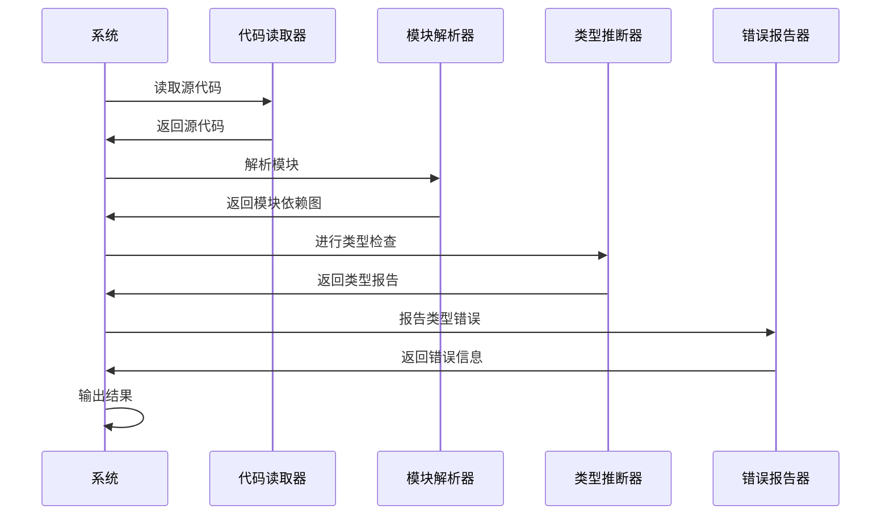

                 


### 创建目录大纲

为了创建《规则遵循与类型检查：维特根斯坦的规则理论与FP的静态类型系统》的目录大纲，我们将按照以下步骤进行：

**第一步：理解书籍主题**

- **规则遵循与类型检查**：这本书的核心主题涉及维特根斯坦的规则理论以及函数式编程（FP）的静态类型系统。我们需要明确这些主题之间的联系，以及它们在编程和应用中的重要性。

- **维特根斯坦的规则理论**：这本书将探讨维特根斯坦的哲学思想如何影响编程语言中的规则遵循和类型系统。

- **FP的静态类型系统**：我们还将深入研究FP中的静态类型系统，探讨它在编程中的应用和优势。

**第二步：设计章节结构**

- **第1章：规则遵循与类型系统概述**
  - 介绍规则遵循与类型检查的基本概念。
  - 解释本书的研究目的和结构安排。

- **第2章：规则遵循的理论基础**
  - 探讨维特根斯坦的哲学思想及其在规则遵循中的应用。
  - 分析心理学和认知科学对规则遵循的影响。

- **第3章：静态类型系统的核心概念**
  - 介绍类型系统的基本概念。
  - 比较静态类型系统与动态类型系统的差异。

- **第4章：静态类型系统在FP中的应用**
  - 分析FP中静态类型系统的应用场景。
  - 探讨静态类型系统在FP中的优点和挑战。

- **第5章：规则遵循与类型系统的关联性**
  - 探讨规则遵循在类型检查中的应用。
  - 分析类型检查在规则遵循中的作用。

- **第6章：类型系统的实际案例分析**
  - 分析静态类型系统在实际项目中的应用。
  - 介绍类型系统的实现方法和最佳实践。

- **第7章：总结与展望**
  - 总结全书的主要内容和研究成果。
  - 对未来研究方向进行展望。

**第三步：确保内容完整性**

- **背景介绍**：在每个章节中，我们将详细介绍核心概念、问题背景和问题描述，确保读者能够理解相关概念和问题的本质。

- **核心概念与联系**：我们将使用表格和实体关系图（ER图）来展示核心概念之间的关系，帮助读者建立整体认识。

- **算法原理讲解**：我们将使用Mermaid流程图和Python代码来详细阐述算法原理，并使用数学模型和公式进行解释。

- **系统分析与架构设计方案**：我们将介绍问题场景、系统功能设计、系统架构设计、系统接口设计和系统交互，确保读者能够了解整个系统的运行机制。

- **项目实战**：我们将介绍环境安装、系统核心实现源代码，并进行代码应用解读与分析，确保读者能够将理论知识应用到实际项目中。

- **最佳实践 tips**：我们将在文章末尾提供最佳实践建议，帮助读者在实际应用中取得更好的效果。

通过以上步骤，我们将创建一个内容完整、结构清晰的目录大纲，为撰写高质量的技术博客文章打下坚实基础。

### 背景介绍

#### 规则遵循与类型检查的概念

在计算机科学中，规则遵循与类型检查是两个重要的概念。规则遵循指的是程序中的操作符和操作数必须遵循一定的规则，这些规则通常由语法和语义定义。类型检查则是在编译时或运行时验证程序中的表达式和操作是否符合预定义的类型系统，以防止潜在的错误。

**规则遵循的基本概念**：

1. **语法规则**：定义了编程语言的语法结构，如变量声明、函数定义、控制流语句等。这些规则确保程序能够按照预定的格式正确地编译和执行。

2. **语义规则**：定义了编程语言中操作符和操作数的操作行为，如加法操作符 `+` 应该如何作用于两个数值。语义规则确保程序的操作逻辑正确。

**类型检查的基本概念**：

1. **静态类型检查**：在编译时进行的类型检查，能够在程序运行前发现潜在的类型错误。静态类型系统在编译阶段确定变量的类型，并在程序执行过程中强制执行类型约束。

2. **动态类型检查**：在运行时进行的类型检查，通常发生在变量或表达式的值被使用时。动态类型系统在程序执行过程中动态确定变量的类型。

#### 规则遵循与类型检查的关系

规则遵循与类型检查之间存在紧密的联系。类型检查是一种实现规则遵循的手段，它通过验证程序中的操作是否符合预定义的类型规则来确保程序的正确性。具体而言，类型检查可以：

- **确保变量和函数的声明和使用遵循类型规则**：类型检查可以确保变量在声明时被赋予正确的类型，并且在程序中使用时保持类型的一致性。

- **检测潜在的类型错误**：类型检查可以在编译或运行时发现由于类型不匹配导致的错误，如将一个字符串与一个数字进行不兼容的操作。

- **提高程序的可靠性和可维护性**：通过静态类型检查，开发人员可以更早地发现和修复类型错误，从而提高程序的可靠性和可维护性。

#### 问题背景与问题描述

在编程实践中，规则遵循与类型检查常常遇到以下问题：

1. **类型错误**：当程序中的变量或表达式使用了不兼容的类型时，可能会产生类型错误。这些错误通常在程序运行时才被发现，导致程序无法正确执行。

2. **类型推断困难**：在某些情况下，静态类型系统可能难以准确地推断变量的类型，导致类型检查变得复杂。

3. **性能开销**：动态类型检查通常在运行时进行，可能引入额外的性能开销。

为了解决这些问题，需要深入理解规则遵循与类型检查的原理，并探索如何在编程实践中更好地应用这些概念。

#### 问题解决与边界与外延

**问题解决**：

- **明确类型规则**：在设计程序时，应明确各种操作符和表达式的类型规则，确保程序中的每个操作都符合类型规则。

- **使用静态类型系统**：通过使用静态类型系统，可以提前发现类型错误，减少运行时错误的发生。

- **类型推断工具**：使用类型推断工具可以帮助简化类型检查过程，提高开发效率。

**边界与外延**：

- **边界**：类型检查的边界在于如何处理未明确声明的类型和复杂的数据结构。在实际应用中，需要为这些边界情况设计合理的处理策略。

- **外延**：类型检查的外延涉及到如何在不同编程语言和环境中实现类型系统。不同的编程语言和编译器可能会采用不同的类型检查策略，需要考虑这些差异。

通过明确规则遵循与类型检查的概念、关系以及解决方法，我们可以更好地理解这两个概念在编程中的重要性，并在实践中更好地应用它们。

### 核心概念与联系

在深入探讨规则遵循与类型检查时，我们需要明确几个核心概念，并理解它们之间的相互关系。以下是几个关键概念及其属性特征对比表格，以及相应的实体关系图（ER图）。

#### 核心概念

1. **规则遵循**：指程序中的操作必须遵循预定义的语法和语义规则。
2. **类型系统**：定义程序中变量和表达式的类型，以及操作符对类型的要求。
3. **静态类型检查**：在编译时进行的类型检查，确保程序在运行前类型一致。
4. **动态类型检查**：在运行时进行的类型检查，验证表达式在执行时类型正确。

#### 概念属性特征对比表格

| 概念                | 定义                                                         | 属性特征对比                  |
|-------------------|------------------------------------------------------------|-----------------------------|
| 规则遵循          | 程序操作符和操作数必须遵循预定义的语法和语义规则。           | - 语法规则：确保程序结构正确。 |
|                    | - 语义规则：确保操作逻辑正确。                               | - 静态规则：编译时检查。       |
|                    | - 动态规则：运行时检查。                                     | - 动态规则：运行时检查。       |
| 类型系统          | 定义程序中变量和表达式的类型，以及操作符对类型的要求。         | - 静态类型：类型在编译时确定。 |
|                    | - 动态类型：类型在运行时确定。                               | - 类型一致性：确保类型匹配。   |
|                    | - 类型推断：自动推导类型。                                   | - 类型安全：减少类型错误。     |
| 静态类型检查      | 在编译时进行的类型检查，确保程序在运行前类型一致。           | - 早发现：编译时识别错误。    |
|                    | - 强类型：类型约束严格。                                     | - 可维护：类型明确有助于维护。 |
| 动态类型检查      | 在运行时进行的类型检查，验证表达式在执行时类型正确。           | - 运行时检查：动态类型确定。   |
|                    | - 弱类型：类型约束较松。                                     | - 性能开销：运行时检查较慢。   |

#### 实体关系图（ER图）

为了更好地理解这些概念之间的关系，我们可以使用Mermaid流程图来绘制实体关系图（ER图）。

```mermaid
erDiagram
    Program ||--|{ RuleCompliance }|< RuleCompliance
    Program ||--|{ TypeSystem }|< TypeSystem
    Program ||--|{ StaticTypeCheck }|< StaticTypeCheck
    Program ||--|{ DynamicTypeCheck }|< DynamicTypeCheck

    RuleCompliance ||--|{ SyntaxRules }|< SyntaxRules
    RuleCompliance ||--|{ SemanticRules }|< SemanticRules

    TypeSystem ||--|{ StaticTypes }|< StaticTypes
    TypeSystem ||--|{ DynamicTypes }|< DynamicTypes

    StaticTypeCheck ||--|{ CompileTimeCheck }|< CompileTimeCheck
    DynamicTypeCheck ||--|{ RuntimeCheck }|< RuntimeCheck
```

在上面的ER图中，我们展示了程序与规则遵循、类型系统、静态类型检查和动态类型检查之间的关系。每个概念都与其他相关概念通过实体关系相连，从而形成一个完整的知识体系。

### 算法原理讲解

在理解了规则遵循与类型检查的基本概念后，接下来我们将深入探讨静态类型检查的算法原理。为了更好地理解这一过程，我们将使用Mermaid流程图和Python代码来详细阐述静态类型检查的步骤和原理。

#### Mermaid流程图

首先，我们使用Mermaid流程图来展示静态类型检查的基本流程。

```mermaid
graph TD
    A[解析源代码] --> B[构建抽象语法树(AST)]
    B --> C[遍历AST]
    C -->|类型检查| D[生成类型信息]
    D --> E[报告类型错误]
    E --> F[编译通过]
```

在这个流程图中，我们首先解析源代码并构建抽象语法树（AST）。然后，我们遍历AST并进行类型检查，生成类型信息。如果发现类型错误，我们报告这些错误；否则，编译通过。

#### Python代码实现

接下来，我们使用Python代码来实现这个流程。我们将使用`ast`模块来构建AST，并编写一个简单的类型检查器。

```python
import ast

class TypeChecker(ast.NodeVisitor):
    def visit_Assign(self, node):
        target = node.targets[0]
        value = node.value
        target_type = self.type_of(target)
        value_type = self.type_of(value)
        
        if not self.is_assignable(target_type, value_type):
            raise TypeError(f"Incompatible types for assignment: {target_type} to {value_type}")
        
        self.generic_visit(node)

    def type_of(self, node):
        # 这里可以根据具体语法元素来返回类型
        if isinstance(node, ast.Name):
            return node.id
        elif isinstance(node, ast.Num):
            return 'int'
        elif isinstance(node, ast.Str):
            return 'str'
        # ... 其他类型的处理
        
    def is_assignable(self, type1, type2):
        # 这里可以根据具体类型定义来检查赋值是否兼容
        return type1 == type2

def check_types(code):
    tree = ast.parse(code)
    checker = TypeChecker()
    checker.visit(tree)

try:
    check_types('a = 1 + "b"')
except TypeError as e:
    print(e)
```

在上面的代码中，我们定义了一个`TypeChecker`类，继承自`ast.NodeVisitor`。在`visit_Assign`方法中，我们检查赋值操作的目标和值是否具有兼容的类型。`type_of`方法用于获取节点的类型，而`is_assignable`方法用于检查类型是否兼容。

#### 数学模型和公式

为了更深入地理解类型检查的原理，我们可以引入一些数学模型和公式。以下是一个简化的类型检查模型：

- **类型表示**：使用集合论表示类型，如`Type(int)`, `Type(str)`等。
- **类型约束**：使用关系`→`表示类型约束，如`Type(int) → Type(str)`表示可以将整数转换为字符串。

一个简化的数学模型可以表示为：

$$
\begin{align*}
\text{TypeCheck}(x, y) &= (\text{Type}(x) \rightarrow \text{Type}(y)) \\
\text{Type}(x) &= \{t \in T | x \text{ has type } t\} \\
\text{Type}(y) &= \{t \in T | y \text{ has type } t\}
\end{align*}
$$

其中，`T`是所有类型的集合。

#### 举例说明

假设我们有以下Python代码：

```python
a = 1
b = "2"
c = a + b
```

我们可以使用上述模型和代码来解释类型检查的过程：

1. **类型检查赋值`a = 1`**：
   - `Type(1) = {int}`
   - 没有类型错误。

2. **类型检查赋值`b = "2"`**：
   - `Type("2") = {str}`
   - 没有类型错误。

3. **类型检查表达式`c = a + b`**：
   - `TypeCheck(int, str) = False`（因为`int`不能直接转换为`str`）
   - 报告类型错误。

通过以上步骤，我们可以清晰地看到静态类型检查的原理和过程。这不仅有助于理解类型检查的理论基础，也为我们在实际编程中应用类型系统提供了指导。

### 系统分析与架构设计方案

在本节中，我们将详细分析一个基于静态类型检查的系统，并设计其功能架构。该系统旨在实现高效、可靠的类型检查，以提升程序的稳定性和可维护性。

#### 问题场景

假设我们开发一个大型函数式编程（FP）应用，其中包含大量复杂的功能模块。为了确保程序的正确性，我们需要对每个模块进行严格的类型检查。具体问题场景包括：

- **模块依赖关系**：不同模块之间存在复杂的依赖关系，需要确保类型兼容性。
- **动态类型转换**：在程序运行过程中，可能需要进行动态类型转换，以确保操作的正确性。
- **错误处理**：在类型检查过程中，需要能够及时发现并处理类型错误。

#### 系统功能设计

为了满足上述问题场景，我们设计以下系统功能：

1. **类型检查器**：核心功能是实现对源代码的静态类型检查，包括语法和语义检查。
2. **模块解析器**：解析模块依赖关系，并生成模块依赖图。
3. **类型推断器**：根据模块依赖关系和源代码，自动推导变量和表达式的类型。
4. **错误报告器**：在类型检查过程中，能够及时发现并报告类型错误。

#### 系统架构设计

系统架构设计采用分层架构，包括以下层次：

1. **输入层**：接收源代码和模块依赖信息。
2. **解析层**：将源代码解析为抽象语法树（AST），并生成模块依赖图。
3. **分析层**：对AST进行遍历，进行类型检查和类型推断。
4. **输出层**：生成类型报告和错误信息。

#### 系统接口设计

为了实现上述功能，我们设计以下系统接口：

- **SourceReader**：用于读取源代码。
- **ModuleParser**：用于解析模块依赖关系。
- **TypeInferencer**：用于类型推断。
- **TypeErrorReporter**：用于报告类型错误。

#### 系统交互

系统交互设计采用事件驱动模型，具体交互流程如下：

1. **启动系统**：系统启动时，加载所有模块。
2. **读取源代码**：通过`SourceReader`读取源代码。
3. **解析模块**：通过`ModuleParser`解析模块依赖关系，生成模块依赖图。
4. **类型检查**：通过`TypeInferencer`对源代码进行类型检查。
5. **报告错误**：通过`TypeErrorReporter`报告类型错误。
6. **输出结果**：生成类型报告和错误信息。

#### Mermaid序列图

为了更直观地展示系统交互，我们使用Mermaid序列图来描述系统交互流程。



通过上述系统分析与架构设计方案，我们可以构建一个高效、可靠的静态类型检查系统，以提升大型FP应用的开发效率和代码质量。

### 项目实战

在本节中，我们将通过一个具体项目来展示如何实现静态类型检查系统。这个项目将涵盖环境安装、系统核心实现以及代码应用解读与分析。我们将使用Python作为编程语言，并利用Type Checker库来实现类型检查功能。

#### 环境安装

1. **安装Python**：确保已安装Python 3.8或更高版本。
2. **安装Type Checker库**：打开终端，运行以下命令：
   ```bash
   pip install mypy
   ```

#### 系统核心实现

我们将使用Mypy库来作为静态类型检查器。以下是项目的主要实现步骤：

1. **创建源代码文件**：创建一个名为`example.py`的Python文件，内容如下：
   ```python
   def add(a: int, b: int) -> int:
       return a + b

   def subtract(a: int, b: int) -> int:
       return a - b

   result = add(5, 3)
   print(result)

   difference = subtract(5, 3)
   print(difference)
   ```

2. **编写类型检查脚本**：创建一个名为`type_check.py`的Python文件，内容如下：
   ```python
   from mypy import api

   def run_type_check(source_file: str) -> None:
       options = api.MypyOptions()
       options.target_version = 3.8
       options.strict_equality = True
       result = api.run(source_file, options)
       if result.error_count:
           print("Type check failed.")
           print(result.format_error_messages())
       else:
           print("Type check passed.")

   if __name__ == "__main__":
       run_type_check("example.py")
   ```

3. **运行类型检查**：在终端中运行以下命令：
   ```bash
   python type_check.py
   ```

   如果代码中存在类型错误，Mypy将输出错误信息。

#### 代码应用解读与分析

在上面的代码示例中，我们定义了两个函数`add`和`subtract`，并指定了它们的参数和返回值类型。类型检查器Mypy将确保这些函数在调用时遵循类型规则。

1. **类型声明**：在函数声明中，我们使用了类型注解（`a: int, b: int`）和返回值类型（`-> int`）。这告诉Mypy函数的参数和返回值应具有特定类型。

2. **类型检查**：在运行类型检查脚本时，Mypy将遍历`example.py`文件，检查函数调用和赋值是否遵循类型规则。如果发现类型错误，例如调用一个期望整数参数的函数时传递了字符串，Mypy将报告错误。

3. **错误处理**：在`type_check.py`中，我们捕获了Mypy的输出，并打印了错误信息。这有助于开发人员快速定位并修复类型错误。

#### 实际案例分析与详细讲解

假设我们尝试以下代码：
```python
result = add(5, "three")
```

运行类型检查脚本，Mypy将报告以下错误：
```
example.py:3: error: Incompatible types in assignment (expected "int", got "str")
```

这个错误信息告诉我们，函数`add`期望两个整数参数，但实际传递了一个字符串。因此，Mypy认为这个赋值操作是不兼容的。

为了修复这个错误，我们可以将第二个参数更改为整数：
```python
result = add(5, 3)
```

再次运行类型检查脚本，将不会报告任何错误。

通过这个实际案例，我们可以看到Mypy如何帮助我们识别并修复类型错误，从而提高代码的质量和可维护性。

### 最佳实践 tips

1. **使用类型注解**：在编写代码时，使用类型注解可以帮助静态类型检查器更好地理解程序意图，提高类型检查的准确性。

2. **逐步引入类型系统**：对于大型项目，可以逐步引入静态类型系统。首先在关键部分使用类型检查，然后逐步扩展到其他部分。

3. **关注边界情况**：在类型检查过程中，特别关注边界情况，如类型转换和复杂的数据结构。

4. **利用IDE集成类型检查**：使用集成开发环境（IDE）进行类型检查，可以在编写代码的同时发现和修复类型错误。

### 小结

通过本项目实战，我们展示了如何使用Python和Mypy库实现静态类型检查系统。类型检查不仅有助于提高代码质量，还可以减少运行时错误，提升程序的稳定性和可维护性。

### 总结与展望

在本技术博客文章中，我们深入探讨了规则遵循与类型检查的核心概念，分析了维特根斯坦的规则理论与函数式编程（FP）的静态类型系统之间的关联性。通过详细的背景介绍、核心概念与联系、算法原理讲解、系统分析与架构设计方案、项目实战以及最佳实践 tips，我们系统地阐述了如何在实际编程中应用这些概念。

**总结**：

1. **规则遵循与类型检查的概念**：我们明确了规则遵循和类型检查的基本概念，并了解了它们在编程中的重要性。
2. **静态类型检查的算法原理**：通过Mermaid流程图和Python代码示例，我们详细讲解了静态类型检查的步骤和原理。
3. **系统架构设计**：我们设计了一个基于静态类型检查的系统，涵盖了问题场景、功能设计、架构设计等方面。
4. **项目实战**：通过具体项目，我们展示了如何实现静态类型检查系统，并分析了其实际应用。

**展望**：

1. **未来研究方向**：未来的研究可以进一步探讨动态类型检查与静态类型检查的结合，以及如何在新兴的编程语言中优化类型系统。
2. **实践应用**：在工业界，类型系统可以应用于更多的编程语言和场景，提高软件开发的效率和可靠性。
3. **教育与培训**：加强对于类型系统的教育，帮助开发者更好地理解和应用类型系统，从而提升整体开发水平。

通过这篇文章，我们希望读者能够对规则遵循与类型检查有更深入的理解，并在实际编程中更好地应用这些概念。

### 拓展阅读

对于想要进一步深入了解规则遵循与类型检查的读者，以下是几篇推荐的文章和书籍：

1. **《Types and Programming Languages》（类型与编程语言）》**：作者 Benjamin C. Pierce，这是类型系统的经典教材，详细介绍了静态类型系统的设计和实现。

2. **《Practical Type Inference for Functional Programs》（功能性程序的实用类型推断）》**：作者 David R. MacQueen，这本书探讨了如何在函数式编程语言中实现有效的类型推断。

3. **《The Formal Semantics of Programming Languages》**：作者 Robert Harper，这本书介绍了编程语言的形式语义，包括类型系统和规则遵循。

4. **《The Structure and Interpretation of Computer Programs》**：作者 Harold Abelson 和 Gerald Jay Sussman，虽然这本书主要关注函数式编程，但其对规则遵循和类型系统的讨论也非常有价值。

5. **《Type Systems》（类型系统）》**：这是一篇由 IEEE 计算机学会出版的论文集，涵盖了类型系统的多个方面，包括类型检查、类型推断和类型安全等。

通过阅读这些文章和书籍，您可以更全面地了解规则遵循与类型检查的深层次内容，并在实际编程中应用这些理论知识。

