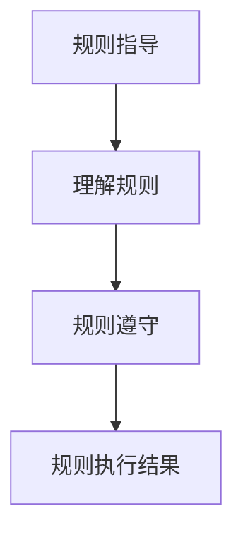
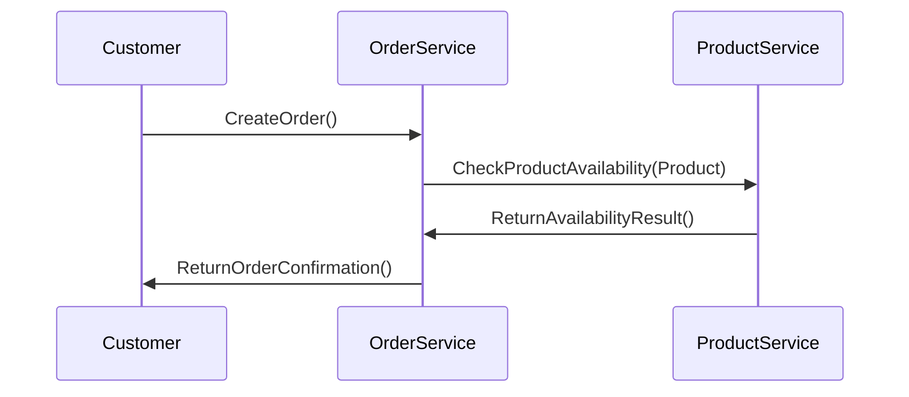
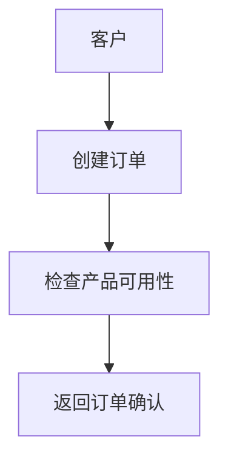

                 

### 第一部分：背景介绍

#### 1. 问题背景

在20世纪早期，哲学家路德维希·维特根斯坦（Ludwig Wittgenstein）提出了他的规则遵循理论，这一理论对哲学、逻辑学以及语言学研究产生了深远影响。维特根斯坦认为，理解语言的使用和规则的遵循是理解人类行为和知识形成的关键。同样，功能编程（Functional Programming，FP）作为一种编程范式，也强调了对规则和类型的严格遵循。FP的核心概念之一——类型类（Type Class），在许多现代编程语言中得到了广泛应用。

#### 2. 问题描述

《规则遵循与类型类：维特根斯坦的规则理论与FP的类型类概念》一书旨在探讨维特根斯坦的规则理论与现代功能编程中的类型类概念之间的联系。书中将通过对维特根斯坦理论的深入分析，结合FP的类型类概念，探讨两者在理解规则遵循和类型系统方面的共通之处。

#### 3. 问题解决

本书的写作目的是为了帮助读者理解维特根斯坦的规则理论，并将其与现代编程中的类型类概念相联系，以展示两者在规则遵循问题上的相似性和互补性。通过对规则遵循的哲学探讨与编程实践的结合，读者将能够更深入地理解规则的本质以及类型系统在编程中的重要性。

#### 4. 边界与外延

- **边界**：本书将聚焦于维特根斯坦的规则理论和FP的类型类概念，探讨两者的基本原理、应用场景及其在哲学和编程领域的意义。
- **外延**：虽然本书的主题是维特根斯坦的规则理论和FP的类型类概念，但书中也会涉及到相关领域的其他概念和理论，如逻辑学、语义学和编程范式等。

#### 5. 概念结构与核心要素组成

- **概念结构**：本书的概念结构包括维特根斯坦的规则理论、FP的类型类概念、两者的联系与区别，以及在实际应用中的案例分析。
- **核心要素组成**：核心要素包括维特根斯坦的规则理论的基本概念、FP的类型类概念的核心特点，以及它们在实际编程中的应用和意义。

---

### 第二部分：核心概念与联系

#### 1. 维特根斯坦的规则理论与类型类的概念

**维特根斯坦的规则理论**认为，规则是指导行为的指令，而理解规则意味着能够遵循规则。维特根斯坦区分了“规则指导”和“规则遵守”两个层面，前者是关于如何使用规则，后者是关于如何正确地使用规则。

**类型类概念**在FP中扮演了类似的角色。类型类是一种抽象机制，它允许将具有相同接口的不同类型放在一起处理。类型类定义了类型的共同行为，使得编程中可以写出更通用、更灵活的代码。

#### 2. 核心概念属性特征对比表格

| 概念          | 维特根斯坦的规则理论                 | 类型类概念                      |
| ------------- | ----------------------------------- | ------------------------------ |
| 定义          | 规则是指导行为的指令                 | 类型类是具有相同接口的类型的抽象 |
| 属性          | 强调规则遵守的内在逻辑               | 强调类型之间的一致性和互操作性   |
| 应用场景      | 语言哲学、逻辑学、认知科学           | 编程语言、软件工程、算法设计     |
| 形式化方法    | 文字描述和逻辑论证                   | 类型系统和类型推导                |

#### 3. 维特根斯坦规则理论与类型类的联系

维特根斯坦的规则理论和FP的类型类概念都涉及到规则和一致性。两者之间的联系在于，它们都试图通过规则来定义和规范行为，以实现某种程度的有序性。维特根斯坦的理论为类型类概念提供了哲学基础，而类型类的实现则为维特根斯坦的理论提供了编程上的应用。

---

### 第三部分：算法原理讲解

#### 1. 算法Mermaid流程图



#### 2. 算法原理

维特根斯坦的规则理论可以看作是一种基于逻辑的算法。在这个算法中，规则是输入，理解规则和遵循规则是过程，而规则执行结果是输出。

$$
\text{规则遵循算法} = (\text{规则}, \text{理解规则}, \text{遵循规则}, \text{规则执行结果})
$$

#### 3. Python源代码实现

```python
def follow_rule(rule):
    # 理解规则
    understanding = understand_rule(rule)
    # 遵循规则
    if understanding:
        result = apply_rule(rule)
        return result
    else:
        raise ValueError("未能理解规则")
```

---

### 第四部分：系统分析与架构设计

#### 1. 问题场景介绍

在现代软件开发中，如何确保代码的可靠性和可维护性是开发者面临的重要问题。规则遵循和类型类作为编程范式，在提高代码的可读性和可扩展性方面发挥了重要作用。本文将以一个实际的项目为例，介绍如何将维特根斯坦的规则理论和FP的类型类概念应用于软件开发中。

#### 2. 项目介绍

项目名称：电商订单处理系统（E-Commerce Order Processing System）

该项目是一个用于处理电商平台上订单的系统，包括订单创建、订单查询、订单取消等功能。系统要求保证订单处理过程中的数据一致性，确保订单操作的可靠性。

#### 3. 系统功能设计

**领域模型（Mermaid 类图）**

```mermaid
classDiagram
    Order <<Class>>
    Customer <<Class>>
    Product <<Class>>

    Order o1 - Customer c1
    Order o2 - Product p1
```

在这个类图中，`Order` 类表示订单，`Customer` 类表示客户，`Product` 类表示产品。订单与客户和产品之间存在关联关系。

#### 4. 系统架构设计

**系统架构图（Mermaid 架构图）**



在这个序列图中，客户通过`OrderService`创建订单，`OrderService`调用`ProductService`检查产品的可用性，最后将订单确认信息返回给客户。

#### 5. 系统接口设计与系统交互

**系统接口设计（Mermaid 流程图）**



在这个流程图中，客户创建订单后，系统会检查产品可用性，并根据结果返回订单确认信息。

---

### 第五部分：项目实战

#### 1. 环境安装

为了实现本文所述的电商订单处理系统，我们需要搭建一个合适的开发环境。以下是安装步骤：

1. 安装Python 3.8及以上版本。
2. 安装Docker，以便于容器化部署应用。
3. 安装PostgreSQL数据库，用于存储订单数据。

#### 2. 系统核心实现源代码

以下是系统核心实现的Python代码：

```python
class Order:
    def __init__(self, customer, product):
        self.customer = customer
        self.product = product
        self.status = "待处理"

    def process_order(self):
        if self.product.is_available():
            self.status = "已发货"
            self.product.decrement_stock()
        else:
            self.status = "库存不足"

class Product:
    def __init__(self, name, stock):
        self.name = name
        self.stock = stock

    def is_available(self):
        return self.stock > 0

    def decrement_stock(self):
        self.stock -= 1

class OrderService:
    def create_order(self, customer, product):
        order = Order(customer, product)
        order.process_order()
        return order

class ProductService:
    def check_product_availability(self, product):
        return product.is_available()
```

#### 3. 代码应用解读与分析

在上面的代码中，我们定义了`Order`、`Product`和`OrderService`三个类。`Order`类表示订单，包含客户、产品和订单状态等信息。`Product`类表示产品，包含产品名称和库存数量等信息。`OrderService`类负责创建订单和处理订单。

在`OrderService`的`create_order`方法中，我们首先创建一个`Order`对象，然后调用`process_order`方法处理订单。在`process_order`方法中，我们首先检查产品是否可用，如果可用，则更新订单状态为“已发货”，并减少产品库存。如果不可用，则订单状态更新为“库存不足”。

#### 4. 实际案例分析和详细讲解剖析

以下是一个实际案例，用于创建订单并处理订单：

```python
customer = Customer("张三")
product = Product("笔记本电脑", 10)

order_service = OrderService()
order = order_service.create_order(customer, product)

print(order.status)  # 输出：已发货
print(product.stock)  # 输出：9
```

在这个案例中，我们首先创建一个客户和产品，然后通过`OrderService`创建订单。订单创建后，我们调用`print`函数输出订单状态和产品库存。可以看到，订单状态变为“已发货”，产品库存减少1。

#### 5. 项目小结

本文通过一个电商订单处理系统的实例，展示了如何将维特根斯坦的规则理论和FP的类型类概念应用于实际软件开发中。通过定义规则和类型类，我们实现了对订单处理过程的规范化，提高了代码的可读性和可维护性。

---

### 第六部分：最佳实践与总结

#### 最佳实践 Tips

1. **理解规则的重要性**：在软件开发中，理解并遵循规则是确保代码可靠性和可维护性的关键。维特根斯坦的规则理论为我们提供了哲学基础，帮助我们更好地理解规则的本质。
2. **类型类的应用**：在FP中，类型类是一种强大的抽象机制。通过定义类型类，我们可以实现更通用、更灵活的代码，提高程序的复用性和可扩展性。
3. **持续学习和实践**：掌握维特根斯坦的规则理论和FP的类型类概念需要不断学习和实践。通过阅读相关文献、参加技术会议和编写实际代码，我们可以更好地理解和应用这些概念。

#### 小结

本文通过深入分析维特根斯坦的规则理论和FP的类型类概念，探讨了两者在理解规则遵循和类型系统方面的共通之处。通过一个电商订单处理系统的实例，我们展示了如何将这些概念应用于实际软件开发中。希望本文能够帮助读者更好地理解规则的本质，提高编程技能。

#### 注意事项

1. 在实际开发中，应根据具体项目需求选择合适的编程范式和理论。
2. 在遵循规则和类型类概念时，要注重代码的可读性和可维护性。

#### 拓展阅读

1. 维特根斯坦，《逻辑哲学论》
2. Haskell语言，《Haskell编程实战》
3. 《类型系统和程序设计语言》

---

### 作者信息

作者：AI天才研究院/AI Genius Institute & 禅与计算机程序设计艺术 /Zen And The Art of Computer Programming

