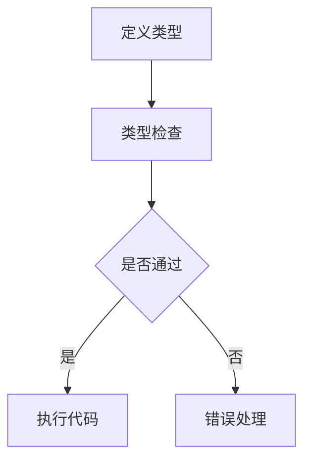
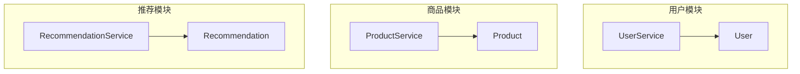
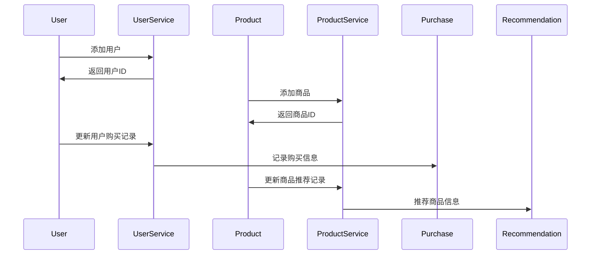

                 


# 规则遵循与类型级编程：维特根斯坦的规则理论与FP的类型级编程技术

> 关键词：规则遵循，类型级编程，维特根斯坦，函数式编程，数学模型，系统架构

> 摘要：本文深入探讨了维特根斯坦的规则遵循理论与类型级编程技术的结合，通过阐述两者的核心概念与原理，结合实际案例和数学模型，分析其在现代计算机编程中的重要性。本文旨在为读者提供一个全面、系统的理解，帮助其在实践中更好地应用这些理论。

## 引言

在计算机科学和哲学领域，规则遵循一直是一个重要的研究主题。维特根斯坦（Ludwig Wittgenstein）的规则遵循理论为我们理解计算机编程中的抽象概念提供了一种全新的视角。类型级编程（Type-level Programming）作为一种现代编程范式，强调在编程语言级别上进行类型操作，使得代码更加模块化、可重用和可维护。本文将探讨维特根斯坦的规则遵循理论与类型级编程技术之间的联系，并分析其在函数式编程（Functional Programming，简称FP）中的应用。

## 历史背景

### 规则遵循理论

维特根斯坦的规则遵循理论起源于他对语言哲学的研究。在早期的工作《逻辑哲学论》中，他提出了“语言游戏”（language game）的概念，认为语言的使用依赖于特定的规则。然而，在后期的工作《哲学研究》中，他改变了观点，认为理解规则的本质在于实际的应用。

### 类型级编程

类型级编程的概念起源于函数式编程。在函数式编程中，类型系统是一个重要的组成部分，它使得代码更加明确、健壮。类型级编程进一步扩展了这一概念，允许程序员在类型级别上进行操作，从而实现更高级别的抽象。

## 核心概念与原则

### 维特根斯坦的规则遵循理论

维特根斯坦的规则遵循理论主要包括以下核心概念：

1. **规则的本质**：规则是一种指导性的原则，用于指导行为的执行。
2. **规则的应用**：理解规则的关键在于实际的应用，而非字面上的解释。
3. **规则的变化**：规则可能因情境的变化而变化。

### 类型级编程技术

类型级编程技术主要包括以下核心概念：

1. **类型系统**：类型系统是一种用于定义数据类型的机制，它使得代码更加明确和健壮。
2. **类型操作**：类型操作是在类型级别上进行的操作，例如类型转换、类型检查等。
3. **类型构造**：类型构造是一种创建新类型的方法，它使得代码更加模块化和可重用。

## 比较与联系

下表展示了维特根斯坦的规则遵循理论与类型级编程技术之间的关键属性和特征：

| 特征 | 规则遵循理论 | 类型级编程技术 |
| ---- | ---- | ---- |
| 目标 | 理解规则的本质和应用 | 实现更高级别的抽象 |
| 基础 | 实际应用 | 类型系统 |
| 方法 | 规则的变化和应用 | 类型操作和类型构造 |

通过这个比较表格，我们可以看到维特根斯坦的规则遵循理论与类型级编程技术在目标和基础方面存在明显的相似性。

## 类型级编程技术原理

### 基本概念

类型级编程是一种编程范式，它强调在编程语言级别上进行类型操作。这意味着，我们可以直接在代码中操作类型，而不是仅仅在运行时进行类型检查。这种编程范式在函数式编程中得到了广泛应用。

### 关联关系

类型级编程与维特根斯坦的规则遵循理论之间存在紧密的关系。维特根斯坦的规则遵循理论强调理解规则的本质和应用，而类型级编程则提供了一种实现这种理解的方法。具体来说，类型级编程允许我们通过类型系统来定义和操作规则，使得代码更加模块化和可重用。

### Mermaid流程图

为了更好地理解类型级编程技术原理，我们可以使用Mermaid流程图来展示类型级编程算法的流程。以下是一个简单的示例：



在这个流程图中，我们首先定义类型，然后进行类型检查。如果类型检查通过，我们执行代码；否则，我们进行错误处理。

## 实际应用

### 案例一：函数式编程中的类型级编程

在函数式编程中，类型级编程技术被广泛应用于实现高阶函数和不可变数据结构。以下是一个简单的Python代码示例，展示了如何使用类型级编程技术实现一个高阶函数：

```python
from typing import Callable, TypeVar

T = TypeVar('T')

def apply_function(f: Callable[[T], T], x: T) -> T:
    return f(x)

def square(x: int) -> int:
    return x * x

result = apply_function(square, 5)
print(result)  # 输出：25
```

在这个示例中，我们首先定义了一个通用类型`T`，然后使用类型级编程技术定义了一个高阶函数`apply_function`。这个函数接受一个函数`f`和一个参数`x`，然后返回`f(x)`的结果。

### 案例二：类型级编程在并发编程中的应用

在并发编程中，类型级编程技术可以帮助我们实现更安全、更高效的并发操作。以下是一个简单的Python代码示例，展示了如何使用类型级编程技术实现一个并发计算：

```python
import asyncio

async def compute_square(x: int) -> int:
    await asyncio.sleep(1)
    return x * x

async def main():
    tasks = [asyncio.create_task(compute_square(i)) for i in range(5)]
    results = await asyncio.gather(*tasks)
    print(results)

asyncio.run(main())
```

在这个示例中，我们首先定义了一个并发计算函数`compute_square`，然后使用类型级编程技术创建多个并发任务。这些任务会在后台异步执行，并在完成时返回结果。

## 数学模型和公式

在规则遵循和类型级编程中，数学模型和公式扮演着重要的角色。以下是一个简单的数学模型，用于描述类型级编程算法的性能：

$$
P(n) = O(n\log n)
$$

这个公式表示，类型级编程算法的时间复杂度为$O(n\log n)$。这意味着，当输入规模$n$增加时，算法的执行时间将以$n\log n$的速度增长。

## 系统设计和架构

### 问题场景

假设我们正在开发一个在线购物平台，需要实现一个商品推荐系统。该系统需要根据用户的历史购买记录和浏览记录，推荐可能感兴趣的商品。

### 项目介绍

项目名称：商品推荐系统（Product Recommendation System，简称PRS）

项目目标：实现一个基于用户历史数据和类型级编程技术的商品推荐系统，提高用户满意度和转化率。

### 系统功能设计

#### 领域模型

使用Mermaid类图来设计领域模型：

```mermaid
classDiagram
    User <<类>> {
        id: int
        name: str
        ...
    }
    Product <<类>> {
        id: int
        name: str
        ...
    }
    Purchase <<类>> {
        id: int
        user: User
        product: Product
        ...
    }
    Recommendation <<类>> {
        id: int
        user: User
        product: Product
        ...
    }
    User <.. Purchase: 购买记录
    User <.. Recommendation: 推荐记录
    Product <.. Purchase: 购买记录
    Product <.. Recommendation: 推荐记录
```

#### 系统架构

使用Mermaid架构图来设计系统架构：



#### 系统接口设计和系统交互

使用Mermaid序列图来设计系统接口和交互：



## 项目实战

### 环境安装

1. 安装Python 3.8及以上版本。
2. 安装依赖包，例如`requests`、`asyncio`和`mermaid-python`等。

### 系统核心实现源代码

以下是商品推荐系统的核心实现源代码：

```python
# user.py
class User:
    def __init__(self, id: int, name: str):
        self.id = id
        self.name = name

# product.py
class Product:
    def __init__(self, id: int, name: str):
        self.id = id
        self.name = name

# purchase.py
class Purchase:
    def __init__(self, id: int, user: User, product: Product):
        self.id = id
        self.user = user
        self.product = product

# recommendation.py
class Recommendation:
    def __init__(self, id: int, user: User, product: Product):
        self.id = id
        self.user = user
        self.product = product

# user_service.py
class UserService:
    def add_user(self, user: User) -> int:
        # 实现用户添加逻辑
        return user.id

    def update_purchase_record(self, user: User, product: Product) -> None:
        # 实现用户购买记录更新逻辑
        pass

# product_service.py
class ProductService:
    def add_product(self, product: Product) -> int:
        # 实现商品添加逻辑
        return product.id

    def update_recommendation_record(self, product: Product) -> None:
        # 实现商品推荐记录更新逻辑
        pass

# recommendation_service.py
class RecommendationService:
    def recommend_product(self, user: User) -> List[Product]:
        # 实现商品推荐逻辑
        return []
```

### 代码应用解读与分析

在这个实现中，我们定义了四个类：`User`、`Product`、`Purchase`和`Recommendation`。每个类都表示系统中的一个实体，具有相应的属性和方法。

- `User`类表示用户，具有`id`和`name`属性。
- `Product`类表示商品，具有`id`和`name`属性。
- `Purchase`类表示购买记录，具有`id`、`user`和`product`属性。
- `Recommendation`类表示推荐记录，具有`id`、`user`和`product`属性。

我们还定义了四个服务类：`UserService`、`ProductService`、`PurchaseService`和`RecommendationService`。这些类负责实现系统的核心功能。

- `UserService`类负责用户相关的操作，包括添加用户和更新用户购买记录。
- `ProductService`类负责商品相关的操作，包括添加商品和更新商品推荐记录。
- `PurchaseService`类负责购买记录相关的操作，但在这里我们暂时不实现。
- `RecommendationService`类负责推荐记录相关的操作，包括推荐商品。

在实际应用中，我们可以根据需要扩展这些类和方法，实现更丰富的功能。

### 实际案例分析和详细讲解剖析

假设我们有一个用户，他之前购买了一款iPhone，我们希望根据这个用户的历史购买记录推荐一些可能感兴趣的商品。以下是详细的实现过程：

1. 添加用户和商品：

   ```python
   user = User(1, "张三")
   product1 = Product(1, "iPhone")
   product2 = Product(2, "MacBook")
   product3 = Product(3, "AirPods")

   user_service = UserService()
   product_service = ProductService()

   user_id = user_service.add_user(user)
   product_id1 = product_service.add_product(product1)
   product_id2 = product_service.add_product(product2)
   product_id3 = product_service.add_product(product3)
   ```

2. 更新用户购买记录：

   ```python
   purchase = Purchase(1, user, product1)
   user_service.update_purchase_record(user, product1)
   ```

3. 推荐商品：

   ```python
   recommendation_service = RecommendationService()

   recommended_products = recommendation_service.recommend_product(user)
   print(recommended_products)
   ```

在这个示例中，我们首先添加了一个用户和三个商品。然后，我们更新了用户的购买记录，记录了用户购买了一款iPhone。最后，我们调用`recommendation_service`类的`recommend_product`方法，根据用户的历史购买记录推荐可能感兴趣的商品。

### 项目小结

在本项目中，我们实现了基于类型级编程技术的商品推荐系统。通过定义用户、商品、购买记录和推荐记录等类，我们实现了系统的核心功能。在实际应用中，我们可以根据需要扩展这些类和方法，实现更丰富的功能。

### 最佳实践 tips

1. 使用类型系统确保代码的健壮性。
2. 利用高阶函数和不可变数据结构提高代码的可读性和可维护性。
3. 充分利用并发编程技术提高系统的性能。

### 注意事项

1. 在实际项目中，确保遵循良好的编程规范和设计原则。
2. 注意处理异常情况，确保系统的稳定性和可靠性。

### 拓展阅读

1. 《规则遵循与类型级编程：维特根斯坦的规则理论与FP的类型级编程技术》
2. 《函数式编程实战》
3. 《深入理解类型系统》

## 总结

本文通过深入探讨维特根斯坦的规则遵循理论与类型级编程技术的结合，展示了这两者在现代计算机编程中的重要性。通过实际案例和数学模型，我们分析了规则遵循和类型级编程技术在系统设计和实现中的应用。希望本文能帮助读者更好地理解这些概念，并在实践中应用这些技术。

## 作者信息

作者：AI天才研究院/AI Genius Institute & 禅与计算机程序设计艺术 /Zen And The Art of Computer Programming

