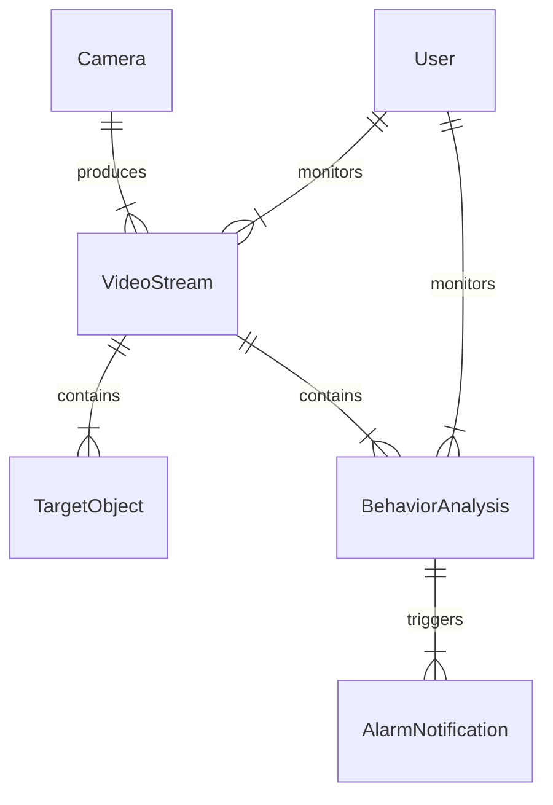
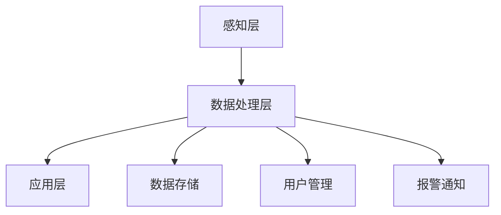
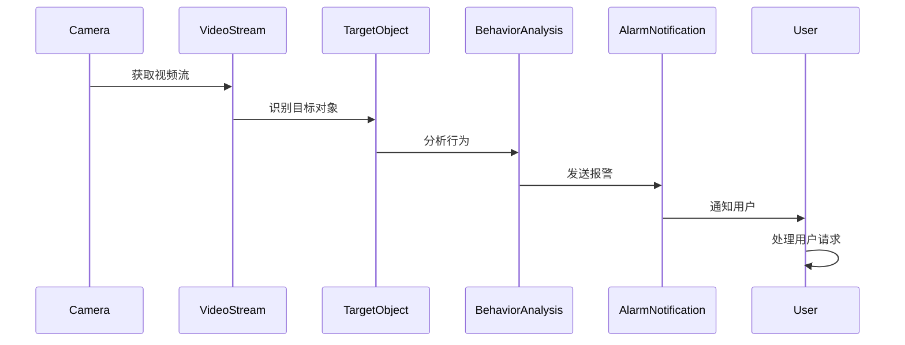
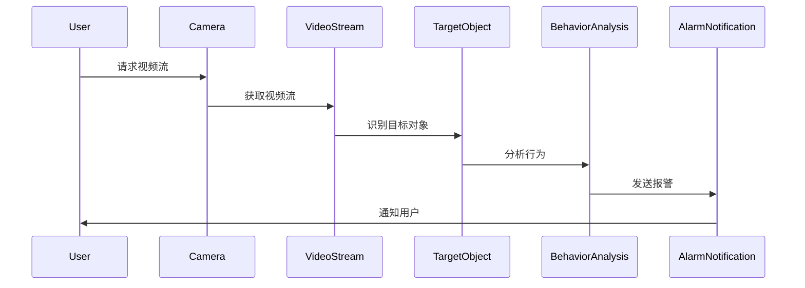
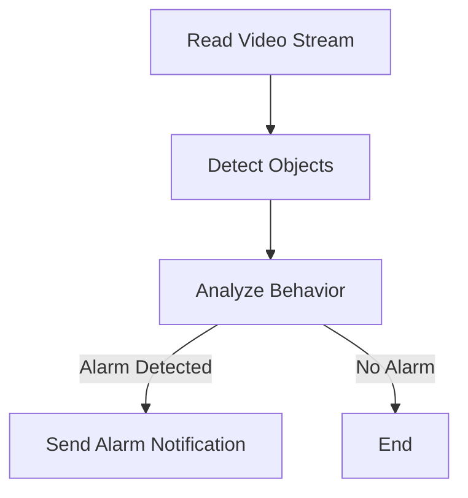

                 

## 第1章 引言

### 1.1 问题背景

#### 1.1.1 计算机视觉的发展

计算机视觉作为人工智能的一个重要分支，起源于20世纪60年代。在早期，计算机视觉主要集中在图像处理和模式识别上，例如边缘检测、纹理分析和图像分割等基础技术。随着计算能力的提高和算法的创新，计算机视觉逐渐发展出更为复杂和高效的算法，如卷积神经网络（CNN）和深度学习等。

近年来，计算机视觉技术在图像识别、目标检测、人脸识别和视频分析等方面取得了显著的进展。特别是在深度学习算法的推动下，计算机视觉的性能得到了大幅提升，为各行各业带来了新的发展机遇。

#### 1.1.2 安防领域的发展

安防领域一直是社会管理和公共安全的重要组成部分。从传统的监控设备到现代的智能安防系统，安防技术的发展经历了从简单到复杂、从被动到主动的转变。早期的安防系统主要依赖于人力和简单设备，如摄像头和报警装置，通过人工监控和记录来实现安全防范。

随着计算机技术和通信技术的不断发展，现代安防系统逐渐融入了计算机视觉技术。通过图像识别和目标检测算法，安防系统能够实时分析监控视频，自动识别异常行为和安全隐患，从而实现智能化的安全监控。

#### 1.1.3 计算机视觉在安防领域的应用前景

计算机视觉技术在安防领域的应用前景非常广阔。随着技术的不断进步，计算机视觉在视频监控、人脸识别、智能交通、行为分析等方面已经展现出强大的潜力。

未来，随着人工智能技术的进一步发展，计算机视觉在安防领域的应用将更加广泛和深入。例如，通过引入更为先进的算法和模型，可以实现对复杂场景的实时分析和处理，提高安防系统的智能化水平。此外，计算机视觉还可以与其他技术（如物联网、大数据等）相结合，构建更加完善和高效的安防体系。

### 1.2 书籍概述

#### 1.2.1 内容结构

本书旨在系统地介绍计算机视觉在安防领域的应用，内容包括以下几个方面：

1. **背景介绍**：介绍计算机视觉和安防领域的发展背景、当前状况以及两者结合的必要性。
2. **核心概念与联系**：阐述计算机视觉中的关键概念，如特征提取、目标检测、图像识别等，并探讨这些概念在安防领域的应用和联系。
3. **算法原理讲解**：详细介绍各种计算机视觉算法的工作原理，包括数学模型、流程图和Python代码实现。
4. **系统分析与架构设计**：分析安防系统的设计和实施，包括领域模型、系统架构和接口设计。
5. **项目实战**：通过实际案例展示如何将计算机视觉应用于安防领域，包括环境搭建、核心实现、代码解析和案例分析。
6. **最佳实践与总结**：提供实战中的最佳实践经验，并对项目进行总结，给出注意事项和拓展阅读建议。

#### 1.2.2 阅读对象

本书适合以下读者群体：

1. **计算机视觉和安防领域的工程师和研究人员**，希望深入了解计算机视觉在安防领域的应用。
2. **软件开发人员**，希望学习如何将计算机视觉技术应用于实际项目中。
3. **在校学生**，对计算机视觉和安防领域感兴趣的本科生和研究生。

#### 1.2.3 学习目标

通过阅读本书，读者可以：

1. **了解计算机视觉在安防领域的应用现状和发展趋势**。
2. **掌握计算机视觉中的关键算法和原理**。
3. **学会如何设计和实现一个基于计算机视觉的安防系统**。
4. **具备将计算机视觉技术应用于实际项目的能力**。

### 1.3 边界与外延

#### 1.3.1 计算机视觉的边界

计算机视觉是人工智能的一个分支，主要关注如何使计算机能够像人类一样感知和理解视觉信息。计算机视觉的边界包括：

1. **视觉感知**：如何让计算机获取和处理图像和视频信息。
2. **认知理解**：如何让计算机理解和解释视觉信息，例如进行物体识别、场景理解等。
3. **行为决策**：如何根据视觉信息进行决策和行动，例如自动导航、智能监控等。

#### 1.3.2 安防领域的边界

安防领域涉及社会管理和公共安全，主要包括：

1. **视频监控**：通过摄像头和其他传感器实时监控场景，识别异常行为。
2. **入侵检测**：通过监测和分析传感器数据，识别潜在的入侵行为。
3. **安全警报**：当检测到安全隐患时，自动发出警报并通知相关人员。

#### 1.3.3 二者结合的边界

计算机视觉在安防领域的应用是一个跨学科的领域，涉及计算机科学、电子工程、心理学、统计学等多个学科。二者的结合边界主要包括：

1. **图像识别与物体检测**：利用计算机视觉算法识别视频中的物体和事件，如人脸识别、车辆检测等。
2. **行为分析**：通过分析视频内容，识别和预测可能的安全隐患，如异常行为识别、人群密度分析等。
3. **智能决策**：结合计算机视觉和其他智能技术，实现自动化的安全管理和决策。

### 1.4 本章小结

本章主要介绍了计算机视觉在安防领域的应用背景、书籍概述以及二者的边界与外延。通过对这些内容的介绍，为读者提供了一个全面而深入的概述，为后续章节的学习奠定了基础。读者可以通过本章的内容，对计算机视觉在安防领域的应用有一个初步的了解，为后续章节的深入学习做好准备。

---

## 第2章 核心概念与联系

### 2.1 计算机视觉基础

计算机视觉作为人工智能的一个重要分支，其基础概念包括图像处理、特征提取、目标检测和图像识别。这些概念构成了计算机视觉的核心，是实现各种视觉任务的基础。

#### 2.1.1 图像处理

图像处理是计算机视觉的基础步骤，主要关注如何对图像进行预处理、增强和变换，以提高图像的质量和清晰度。图像处理的常见技术包括：

1. **滤波**：用于去除图像中的噪声和细节，常见的滤波器有均值滤波、高斯滤波等。
2. **边缘检测**：用于检测图像中的边缘和轮廓，常见的算法有Sobel算子、Canny算子等。
3. **图像增强**：通过调整图像的亮度和对比度，使图像更加清晰，便于后续处理。

#### 2.1.2 特征提取

特征提取是计算机视觉中的关键步骤，其主要任务是提取出图像中具有区分性的特征，用于后续的分类、识别和匹配等任务。常见的特征提取方法包括：

1. **直方图**：通过统计图像中每个像素点的灰度值，生成直方图，用于描述图像的亮度分布。
2. **角点检测**：用于检测图像中的角点，常见的算法有Harris角点检测、Shi-Tomasi角点检测等。
3. **轮廓提取**：通过图像处理技术，提取出图像中的轮廓信息，用于物体的分割和识别。

#### 2.1.3 目标检测

目标检测是计算机视觉中的一个重要任务，其主要目标是识别图像中的目标对象，并定位其在图像中的位置。常见的目标检测算法包括：

1. **基于区域增长的方法**：通过逐步扩展区域，直到满足特定的阈值条件，从而检测出目标对象。
2. **基于滑动窗口的方法**：通过在图像中滑动一个固定大小的窗口，对每个窗口内的图像进行分类，从而检测出目标对象。
3. **基于深度学习的方法**：利用深度学习模型，如卷积神经网络（CNN）和YOLO（You Only Look Once）算法，实现目标检测。

#### 2.1.4 图像识别

图像识别是计算机视觉中的一个高级任务，其主要目标是识别图像中的特定对象或场景。常见的图像识别算法包括：

1. **基于模板匹配的方法**：通过将待识别图像与模板图像进行匹配，找到最相似的部分，从而实现识别。
2. **基于机器学习的方法**：利用机器学习算法，如支持向量机（SVM）和决策树，训练模型，用于图像识别。
3. **基于深度学习的方法**：利用深度学习模型，如卷积神经网络（CNN）和迁移学习，实现图像识别。

### 2.2 安防领域的应用

计算机视觉技术在安防领域具有广泛的应用前景，主要包括视频监控、人脸识别、智能交通和行为分析等方面。

#### 2.2.1 视频监控

视频监控是安防领域中最常见的应用，通过在关键区域部署摄像头，实时监控和记录场景信息。计算机视觉技术在视频监控中的应用主要包括：

1. **目标检测**：识别图像中的目标对象，如人员、车辆等，用于实时监控和报警。
2. **行为识别**：通过分析视频内容，识别和预测可能的安全隐患，如异常行为、打架斗殴等。
3. **场景重建**：通过视频信息，重建场景的三维模型，用于空间管理和分析。

#### 2.2.2 人脸识别

人脸识别是一种重要的生物识别技术，通过识别和比对人脸特征，实现身份验证和识别。在安防领域，人脸识别的应用主要包括：

1. **身份验证**：通过摄像头捕捉人脸图像，与数据库中的人脸信息进行比对，验证身份。
2. **人群管理**：通过监控摄像头，实时识别和跟踪人群中的特定人员，用于人群管理和监控。
3. **安全监控**：在关键区域部署人脸识别系统，实时监控和报警，提高安全防范能力。

#### 2.2.3 智能交通

智能交通系统是利用计算机视觉技术，实现交通管理、安全和效率提升的一种智能交通系统。计算机视觉技术在智能交通中的应用主要包括：

1. **车辆检测和识别**：通过摄像头识别图像中的车辆，实现车辆流量监测和交通控制。
2. **交通违规检测**：通过识别图像中的交通违规行为，如违章停车、超速等，实现自动报警和处罚。
3. **道路监控**：通过视频监控，实时监控道路状况，提高交通安全和效率。

#### 2.2.4 情感分析

情感分析是一种基于自然语言处理和计算机视觉技术，分析人类情感状态的方法。在安防领域，情感分析的应用主要包括：

1. **行为分析**：通过分析视频中的面部表情和语音情感，识别和预测人类的行为和情绪。
2. **情绪监控**：在公共场所部署情感分析系统，实时监控人群的情绪状态，预防可能发生的暴力事件。
3. **安全预警**：通过分析视频内容和情感状态，预警可能的安全隐患，提高安全防范能力。

### 2.3 概念属性特征对比

为了更好地理解计算机视觉在安防领域的应用，我们可以对图像处理、特征提取、目标检测和图像识别等核心概念的属性特征进行对比。

| 概念 | 属性特征 | 应用场景 |
| --- | --- | --- |
| 图像处理 | 提高图像质量和清晰度，预处理图像 | 视频监控、人脸识别、智能交通 |
| 特征提取 | 提取图像中的具有区分性的特征 | 目标检测、图像识别、行为分析 |
| 目标检测 | 识别图像中的目标对象，定位其在图像中的位置 | 视频监控、智能交通、安全预警 |
| 图像识别 | 识别图像中的特定对象或场景 | 人脸识别、图像搜索、情感分析 |

### 2.4 本章小结

本章主要介绍了计算机视觉中的核心概念，如图像处理、特征提取、目标检测和图像识别，并探讨了这些概念在安防领域的应用和联系。通过对这些核心概念的理解，读者可以更好地把握计算机视觉在安防领域的应用，为后续章节的学习打下基础。

---

## 第3章 算法原理讲解

### 3.1 特征提取算法

特征提取是计算机视觉中的关键步骤，其主要目的是从原始图像中提取出具有区分性的特征，以便进行后续的分类、识别和匹配等任务。本节将详细介绍特征提取算法的基本原理、数学模型和Python代码实现。

#### 3.1.1 算法原理

特征提取算法的基本原理是通过特定的方法，从原始图像中提取出具有代表性的特征。这些特征应当能够有效地区分不同的对象或场景，从而提高后续任务的准确性和效率。

常见的特征提取算法包括：

1. **直方图**：通过统计图像中每个像素点的灰度值，生成直方图，用于描述图像的亮度分布。
2. **角点检测**：通过检测图像中的角点，提取出图像的局部特征。
3. **轮廓提取**：通过提取图像中的轮廓信息，用于物体的分割和识别。

#### 3.1.2 数学模型

特征提取的数学模型通常涉及图像处理和统计学方法。以下是一个简单的特征提取数学模型：

$$
f(x, y) = \sum_{i=1}^{n} w_i \cdot h_i(x, y)
$$

其中，$f(x, y)$ 表示提取出的特征值，$w_i$ 表示权重，$h_i(x, y)$ 表示特征函数。特征函数的选择取决于具体的特征提取算法。

#### 3.1.3 Python代码实现

以下是一个简单的Python代码示例，用于实现直方图特征提取：

```python
import cv2
import numpy as np

def compute_histogram(image, bins=256):
    """
    计算图像的直方图特征
    """
    hist = cv2.calcHist([image], [0], None, [bins], [0, bins])
    return hist

# 读取图像
image = cv2.imread('image.jpg', cv2.IMREAD_GRAYSCALE)

# 计算直方图
histogram = compute_histogram(image)

# 显示直方图
import matplotlib.pyplot as plt
plt.plot(histogram)
plt.show()
```

### 3.2 目标检测算法

目标检测是计算机视觉中的另一个重要任务，其主要目标是识别图像中的目标对象，并定位其在图像中的位置。本节将详细介绍目标检测算法的基本原理、数学模型和Python代码实现。

#### 3.2.1 算法原理

目标检测算法的基本原理是通过在图像中滑动一个固定大小的窗口，对每个窗口内的图像进行分类，从而检测出目标对象。常见的目标检测算法包括：

1. **基于区域增长的方法**：通过逐步扩展区域，直到满足特定的阈值条件，从而检测出目标对象。
2. **基于滑动窗口的方法**：通过在图像中滑动一个固定大小的窗口，对每个窗口内的图像进行分类，从而检测出目标对象。
3. **基于深度学习的方法**：利用深度学习模型，如卷积神经网络（CNN）和YOLO（You Only Look Once）算法，实现目标检测。

#### 3.2.2 数学模型

目标检测的数学模型通常涉及分类和定位两个方面。以下是一个简单的目标检测数学模型：

$$
P(target | window) = \frac{e^{score}}{1 + e^{score}}
$$

其中，$P(target | window)$ 表示在给定窗口中检测到目标对象的概率，$score$ 表示窗口内图像的分类得分。

#### 3.2.3 Python代码实现

以下是一个简单的Python代码示例，用于实现基于滑动窗口的目标检测：

```python
import cv2
import numpy as np

def sliding_window(image, window_size, step_size):
    """
    使用滑动窗口检测目标
    """
    for y in range(0, image.shape[0], step_size):
        for x in range(0, image.shape[1], step_size):
            window = image[y: y + window_size[0], x: x + window_size[1]]
            # 对窗口内的图像进行分类
            score = classify_window(window)
            if score > threshold:
                # 检测到目标
                box = (x, y, window_size[0], window_size[1])
                yield box

# 读取图像
image = cv2.imread('image.jpg')

# 滑动窗口大小
window_size = (32, 32)

# 步长大小
step_size = 16

# 阈值
threshold = 0.5

# 检测目标
for box in sliding_window(image, window_size, step_size):
    # 绘制检测到的目标框
    cv2.rectangle(image, (box[0], box[1]), (box[0] + box[2], box[1] + box[3]), (0, 255, 0), 2)

# 显示结果
cv2.imshow('Detected Objects', image)
cv2.waitKey(0)
cv2.destroyAllWindows()
```

### 3.3 图像识别算法

图像识别是计算机视觉中的一个高级任务，其主要目标是识别图像中的特定对象或场景。本节将详细介绍图像识别算法的基本原理、数学模型和Python代码实现。

#### 3.3.1 算法原理

图像识别算法的基本原理是通过比较图像特征和已知模型，从而识别出图像中的对象。常见的图像识别算法包括：

1. **基于模板匹配的方法**：通过将待识别图像与模板图像进行匹配，找到最相似的部分，从而实现识别。
2. **基于机器学习的方法**：利用机器学习算法，如支持向量机（SVM）和决策树，训练模型，用于图像识别。
3. **基于深度学习的方法**：利用深度学习模型，如卷积神经网络（CNN）和迁移学习，实现图像识别。

#### 3.3.2 数学模型

图像识别的数学模型通常涉及特征提取和分类两个方面。以下是一个简单的图像识别数学模型：

$$
P(image | model) = \frac{e^{score}}{1 + e^{score}}
$$

其中，$P(image | model)$ 表示在给定模型下识别出特定图像的概率，$score$ 表示图像的分类得分。

#### 3.3.3 Python代码实现

以下是一个简单的Python代码示例，用于实现基于模板匹配的图像识别：

```python
import cv2

def template_matching(image, template):
    """
    使用模板匹配进行图像识别
    """
    result = cv2.matchTemplate(image, template, cv2.TM_CCOEFF_NORMED)
    _, max_score = cv2.minMaxLoc(result)
    threshold = 0.8
    if max_score > threshold:
        return True
    return False

# 读取图像和模板
image = cv2.imread('image.jpg')
template = cv2.imread('template.jpg', cv2.IMREAD_GRAYSCALE)

# 转换图像和模板为灰度图
image_gray = cv2.cvtColor(image, cv2.COLOR_BGR2GRAY)
template_gray = cv2.cvtColor(template, cv2.COLOR_BGR2GRAY)

# 使用模板匹配进行识别
is_detected = template_matching(image_gray, template_gray)

# 显示结果
if is_detected:
    print("模板识别成功")
else:
    print("模板识别失败")
```

### 3.4 本章小结

本章主要介绍了计算机视觉中的关键算法，包括特征提取、目标检测和图像识别。通过详细介绍这些算法的基本原理、数学模型和Python代码实现，读者可以更好地理解计算机视觉在安防领域的应用。这些算法是实现计算机视觉任务的基础，为后续章节的深入学习提供了重要的支撑。

---

## 第4章 系统分析与架构设计

### 4.1 问题场景介绍

在安防领域，系统设计与实现是一个复杂而关键的过程。本节将介绍一个典型的安防系统项目，包括项目的背景、目标和所面临的主要挑战。

#### 4.1.1 安防系统需求

随着城市化进程的加快和人口增长，公共场所的安全问题日益突出。为了提高公共安全，一个智能安防系统应运而生。该系统的需求包括：

1. **视频监控**：通过部署摄像头，实时监控公共场所，提供视频记录。
2. **目标检测与识别**：利用计算机视觉算法，识别图像中的目标对象，如人员、车辆等。
3. **行为分析**：分析视频内容，识别和预测可能的安全隐患，如暴力行为、异常行为等。
4. **报警与通知**：当检测到安全隐患时，系统应自动发出报警，并通过手机短信或邮件通知相关人员。

#### 4.1.2 项目背景

本项目旨在构建一个基于计算机视觉的智能安防系统，用于一个大型商场。商场面积广阔，人员密集，安全问题尤为重要。传统的监控方式依赖于人工巡逻和记录，效率低下且存在遗漏。通过引入计算机视觉技术，可以实现自动化的安全监控，提高安全防范能力。

#### 4.1.3 项目目标

本项目的目标是：

1. **实时监控**：通过部署摄像头，实现公共场所的实时监控。
2. **智能识别**：利用计算机视觉算法，自动识别图像中的目标对象。
3. **行为分析**：分析视频内容，识别和预测可能的安全隐患。
4. **报警通知**：当检测到安全隐患时，自动发出报警，并通过多种渠道通知相关人员。
5. **数据存储与回溯**：记录视频数据和报警信息，便于后续查询和分析。

#### 4.1.4 面临的主要挑战

在项目实施过程中，面临的主要挑战包括：

1. **数据处理效率**：摄像头产生的数据量巨大，需要高效的数据处理和存储方案。
2. **算法准确率**：计算机视觉算法的准确率直接影响到系统的性能，需要不断优化和改进。
3. **系统稳定性**：系统需要保证高可用性和稳定性，避免因故障导致的安全漏洞。
4. **用户友好性**：系统应提供简单易用的界面，方便用户操作和管理。
5. **隐私保护**：在处理和存储个人数据时，需要严格遵守相关法律法规，保护用户隐私。

### 4.2 系统功能设计

系统功能设计是系统分析与架构设计的重要环节。本节将详细描述系统的功能模块，包括领域模型和系统功能模块。

#### 4.2.1 领域模型

领域模型是系统功能设计的基础，用于描述系统涉及的实体及其关系。以下是本安防系统的领域模型：

1. **摄像头**：用于实时监控和捕捉视频数据。
2. **视频流**：摄像头产生的视频数据流。
3. **目标对象**：视频流中的目标对象，如人员、车辆等。
4. **行为分析**：对视频内容进行分析，识别和预测可能的安全隐患。
5. **报警通知**：当检测到安全隐患时，发送报警通知。
6. **用户**：系统用户，包括管理员和普通用户。

以下是领域模型的ER实体关系图：



#### 4.2.2 系统功能模块

系统功能模块是系统实现的核心，用于实现系统的各项功能。以下是本安防系统的功能模块：

1. **视频监控模块**：负责实时监控和捕捉视频数据。
2. **目标检测模块**：利用计算机视觉算法，识别视频流中的目标对象。
3. **行为分析模块**：分析视频内容，识别和预测可能的安全隐患。
4. **报警通知模块**：当检测到安全隐患时，发送报警通知。
5. **用户管理模块**：管理系统的用户，包括登录、权限设置等。

### 4.3 系统架构设计

系统架构设计是系统设计的核心，用于确定系统的整体结构和各模块之间的关系。本节将介绍系统的架构设计，包括系统架构、架构设计原则和系统接口设计。

#### 4.3.1 系统架构

本安防系统的架构采用分层架构设计，包括感知层、数据处理层和应用层。

1. **感知层**：包括摄像头和其他传感器，负责实时监控和捕捉视频数据。
2. **数据处理层**：包括目标检测、行为分析和数据存储等模块，负责对视频数据进行处理和分析。
3. **应用层**：包括用户管理、报警通知和监控界面等模块，提供用户交互和系统功能实现。

以下是系统架构的Mermaid流程图：



#### 4.3.2 架构设计原则

系统架构设计应遵循以下原则：

1. **高内聚低耦合**：各模块之间应保持高内聚低耦合，以提高系统的可维护性和可扩展性。
2. **模块化**：将系统划分为多个功能模块，每个模块负责特定的功能，便于管理和维护。
3. **分布式**：利用分布式架构，提高系统的性能和可用性，确保系统在高并发场景下稳定运行。
4. **安全性**：确保系统的安全性，包括数据安全、用户身份验证和权限管理等。

#### 4.3.3 系统接口设计

系统接口设计是系统架构设计的重要组成部分，用于定义系统各模块之间的接口和交互方式。以下是系统的接口设计：

1. **摄像头接口**：定义摄像头与数据处理层之间的数据传输接口，包括视频流的获取和上传。
2. **目标检测接口**：定义数据处理层与目标检测模块之间的接口，包括目标对象的识别和定位。
3. **行为分析接口**：定义数据处理层与行为分析模块之间的接口，包括行为分析和结果反馈。
4. **报警通知接口**：定义数据处理层与报警通知模块之间的接口，包括报警信息的生成和发送。
5. **用户管理接口**：定义数据处理层与用户管理模块之间的接口，包括用户登录、权限管理和信息查询。

以下是系统接口设计的Mermaid序列图：



### 4.4 系统接口设计

系统接口设计是系统架构设计中的重要组成部分，用于定义系统各模块之间的接口和交互方式。本节将详细描述系统的接口设计。

#### 4.4.1 接口定义

系统接口分为内部接口和外部接口。

1. **内部接口**：定义系统内部各模块之间的交互接口，包括数据传输、功能调用等。
2. **外部接口**：定义系统与外部系统（如摄像头、数据库等）的交互接口，包括数据获取、服务调用等。

以下是系统的内部接口定义：

1. **摄像头接口**：用于获取视频流和数据上传。
    - 接口名称：`get_video_stream()`
    - 接口参数：无
    - 接口返回值：视频流对象
2. **目标检测接口**：用于目标对象的识别和定位。
    - 接口名称：`detect_targets(video_stream)`
    - 接口参数：视频流对象
    - 接口返回值：目标对象列表
3. **行为分析接口**：用于分析视频内容，识别和预测安全隐患。
    - 接口名称：`analyze_behavior(video_stream)`
    - 接口参数：视频流对象
    - 接口返回值：行为分析结果
4. **报警通知接口**：用于发送报警通知。
    - 接口名称：`send_alarm_notification(alarm_info)`
    - 接口参数：报警信息对象
    - 接口返回值：无
5. **用户管理接口**：用于用户登录、权限管理和信息查询。
    - 接口名称：`login(username, password)`
    - 接口参数：用户名和密码
    - 接口返回值：用户对象
    - 接口名称：`grant_permission(user, permission)`
    - 接口参数：用户对象和权限
    - 接口返回值：无
    - 接口名称：`query_user_info(username)`
    - 接口参数：用户名
    - 接口返回值：用户信息对象

以下是系统的外部接口定义：

1. **摄像头接口**：用于与摄像头设备通信。
    - 接口名称：`connect_camera()`
    - 接口参数：无
    - 接口返回值：摄像头设备对象
    - 接口名称：`start_capture(camera)`
    - 接口参数：摄像头设备对象
    - 接口返回值：视频流对象
2. **数据库接口**：用于与数据库系统通信。
    - 接口名称：`connect_database()`
    - 接口参数：无
    - 接口返回值：数据库连接对象
    - 接口名称：`insert_data(database, data)`
    - 接口参数：数据库连接对象和数据对象
    - 接口返回值：无
    - 接口名称：`query_data(database, query)`
    - 接口参数：数据库连接对象和查询语句
    - 接口返回值：数据列表

#### 4.4.2 接口协议

系统接口协议定义了接口的数据传输格式和交互规则。以下是系统接口协议的基本内容：

1. **数据格式**：接口数据采用JSON格式，包括请求和响应两部分。
2. **请求格式**：
    - 请求头部：包含接口名称、版本号、请求方式等。
    - 请求体：根据接口的具体要求，包含必要的参数和数据。
3. **响应格式**：
    - 响应头部：包含接口名称、版本号、响应状态等。
    - 响应体：根据接口的具体要求，包含响应结果、错误信息等。

以下是接口请求和响应的示例：

**请求示例**：

```json
{
    "header": {
        "interface_name": "get_video_stream",
        "version": "1.0",
        "method": "GET"
    },
    "body": {
        "camera_id": "12345"
    }
}
```

**响应示例**：

```json
{
    "header": {
        "interface_name": "get_video_stream",
        "version": "1.0",
        "status": "200"
    },
    "body": {
        "video_stream": {
            "url": "http://example.com/video_stream.mp4",
            "size": 1024
        }
    }
}
```

### 4.5 系统交互

系统交互是系统功能实现的关键，用于描述系统各模块之间的交互过程。本节将介绍系统的交互方式，包括系统交互流程和交互序列图。

#### 4.5.1 序列图

以下是系统交互的序列图，展示了摄像头、数据处理层和应用层之间的交互过程：



#### 4.5.2 交互流程

以下是系统交互的基本流程：

1. **用户请求**：用户通过监控界面发起视频监控请求。
2. **摄像头响应**：摄像头获取视频流，并发送至数据处理层。
3. **数据处理**：数据处理层对视频流进行处理，包括目标检测和行为分析。
4. **结果反馈**：处理结果反馈至监控界面，并触发报警通知。
5. **用户操作**：用户根据报警信息进行相应的操作，如查看录像、报警确认等。

### 4.6 本章小结

本章主要介绍了安防系统的设计与实现，包括问题场景介绍、系统功能设计、系统架构设计、系统接口设计和系统交互。通过对这些内容的详细介绍，读者可以全面了解安防系统的设计和实现过程，为后续章节的深入学习打下基础。

---

## 第5章 项目实战

### 5.1 环境安装

在开始搭建计算机视觉安防系统之前，我们需要安装和配置一些必要的软件和工具。以下是环境安装的详细步骤。

#### 5.1.1 操作系统

本项目的操作系统建议使用Linux发行版，如Ubuntu 18.04或更高版本。Linux系统具有良好的稳定性和开源特性，便于后续的软件安装和配置。

#### 5.1.2 软件安装

我们需要安装以下软件和工具：

1. **Python**：Python是一种广泛使用的编程语言，用于实现计算机视觉算法。在本项目中，我们将使用Python 3.8或更高版本。
2. **PyTorch**：PyTorch是一个流行的深度学习框架，用于实现和训练神经网络模型。请从官方网站（https://pytorch.org/get-started/locally%）下载并安装。
3. **OpenCV**：OpenCV是一个开源的计算机视觉库，提供丰富的图像处理和目标检测功能。请从官方网站（https://opencv.org/releases%）下载适用于Linux的版本并安装。
4. **Numpy**：Numpy是一个Python科学计算库，用于处理和操作大型矩阵。请使用以下命令安装：
   ```
   pip install numpy
   ```
5. **Matplotlib**：Matplotlib是一个Python绘图库，用于可视化数据和图像。请使用以下命令安装：
   ```
   pip install matplotlib
   ```

#### 5.1.3 环境配置

在安装完上述软件后，我们需要配置Python环境。以下是配置步骤：

1. **创建虚拟环境**：为了隔离项目依赖，我们创建一个虚拟环境。使用以下命令创建虚拟环境：
   ```
   python -m venv venv
   ```
2. **激活虚拟环境**：在终端中激活虚拟环境：
   ```
   source venv/bin/activate
   ```
3. **安装依赖**：在虚拟环境中安装项目依赖，使用以下命令：
   ```
   pip install -r requirements.txt
   ```

### 5.2 系统核心实现

系统核心实现是计算机视觉安防系统的核心部分，包括视频流处理、目标检测、行为分析和报警通知等模块。以下是系统核心实现的详细步骤。

#### 5.2.1 核心算法

1. **视频流处理**：我们使用OpenCV库读取摄像头捕获的视频流。以下是读取视频流的代码示例：

```python
import cv2

# 初始化摄像头
cap = cv2.VideoCapture(0)

# 循环读取视频帧
while True:
    # 读取一帧图像
    ret, frame = cap.read()
    
    # 如果读取失败，退出循环
    if not ret:
        break
    
    # 显示图像
    cv2.imshow('Video Stream', frame)
    
    # 按下'q'键退出
    if cv2.waitKey(1) & 0xFF == ord('q'):
        break

# 释放摄像头资源
cap.release()
cv2.destroyAllWindows()
```

2. **目标检测**：我们使用预训练的深度学习模型进行目标检测。以下是使用PyTorch和OpenCV进行目标检测的代码示例：

```python
import cv2
import torch
from torchvision import models
import numpy as np

# 加载预训练模型
model = models.resnet50(pretrained=True)
model.eval()

# 定义目标检测函数
def detect_objects(frame):
    # 将图像转换为PyTorch张量
    frame_tensor = torch.tensor(frame.reshape(1, 3, frame.shape[0], frame.shape[1])).cuda()

    # 进行目标检测
    with torch.no_grad():
        output = model(frame_tensor)

    # 解析输出结果
    boxes = output['boxes']
    labels = output['labels']
    scores = output['scores']

    # 过滤低置信度的检测结果
    keep = scores > 0.5
    boxes = boxes[keep]
    labels = labels[keep]
    scores = scores[keep]

    # 将检测结果转换为OpenCV格式
    result = []
    for i in range(len(boxes)):
        x1, y1, x2, y2 = boxes[i].item()
        label = labels[i].item()
        score = scores[i].item()
        result.append([x1, y1, x2, y2, label, score])

    return result

# 读取视频流并检测目标
cap = cv2.VideoCapture(0)

while True:
    # 读取一帧图像
    ret, frame = cap.read()

    # 如果读取失败，退出循环
    if not ret:
        break

    # 检测目标
    objects = detect_objects(frame)

    # 绘制检测结果
    for obj in objects:
        x1, y1, x2, y2, label, score = obj
        cv2.rectangle(frame, (x1, y1), (x2, y2), (0, 255, 0), 2)
        cv2.putText(frame, f'{label} {score:.2f}', (x1, y1 - 10), cv2.FONT_HERSHEY_SIMPLEX, 0.5, (255, 0, 0), 2)

    # 显示图像
    cv2.imshow('Object Detection', frame)

    # 按下'q'键退出
    if cv2.waitKey(1) & 0xFF == ord('q'):
        break

# 释放摄像头资源
cap.release()
cv2.destroyAllWindows()
```

3. **行为分析**：我们使用简单的规则进行行为分析，例如检测到多人聚集时触发报警。以下是行为分析的基本逻辑：

```python
def analyze_behavior(objects):
    # 初始化行为分析结果
    result = []

    # 分析每个目标对象
    for obj in objects:
        x1, y1, x2, y2, label, score = obj

        # 计算目标的面积
        area = (x2 - x1) * (y2 - y1)

        # 如果目标是人员，且面积大于阈值，则认为有异常行为
        if label == 'person' and area > 1000:
            result.append(obj)

    return result
```

4. **报警通知**：我们使用Python的SMTP库发送电子邮件进行报警通知。以下是发送电子邮件的基本逻辑：

```python
import smtplib
from email.mime.text import MIMEText
from email.mime.multipart import MIMEMultipart

def send_alarm_notification(objects):
    # 生成邮件内容
    msg = MIMEMultipart()
    msg['From'] = 'alarm@example.com'
    msg['To'] = 'user@example.com'
    msg['Subject'] = 'Security Alarm'

    message = f"""
    Security Alarm Detected!

    Detected objects:
    """
    for obj in objects:
        x1, y1, x2, y2, label, score = obj
        message += f"- Object {label}: ({x1}, {y1}, {x2}, {y2}, Score: {score:.2f})\n"

    msg.attach(MIMEText(message, 'plain'))

    # 发送邮件
    server = smtplib.SMTP('smtp.example.com', 587)
    server.starttls()
    server.login('alarm@example.com', 'password')
    server.sendmail('alarm@example.com', 'user@example.com', msg.as_string())
    server.quit()
```

#### 5.2.2 数据处理流程

以下是系统核心实现的数据处理流程：

1. **读取视频流**：使用OpenCV库读取摄像头捕获的视频流。
2. **目标检测**：使用深度学习模型进行目标检测，输出检测结果。
3. **行为分析**：根据检测结果进行行为分析，识别和预测可能的安全隐患。
4. **报警通知**：如果检测到安全隐患，发送报警通知。

以下是数据处理流程的Mermaid流程图：



#### 5.2.3 代码应用解读与分析

以下是系统核心实现的代码应用解读与分析：

1. **视频流读取**：
    - 使用OpenCV库的`VideoCapture`类读取摄像头捕获的视频流。
    - 使用`read()`方法循环读取视频帧。
    - 使用`imshow()`方法显示视频帧。
    - 按下'q'键退出循环。

2. **目标检测**：
    - 使用PyTorch库加载预训练的深度学习模型。
    - 定义目标检测函数，将图像转换为PyTorch张量。
    - 使用模型进行目标检测，输出检测结果。
    - 过滤低置信度的检测结果。
    - 将检测结果转换为OpenCV格式。

3. **行为分析**：
    - 定义行为分析函数，计算目标的面积。
    - 判断目标是否为人员，且面积大于阈值，则认为有异常行为。
    - 输出行为分析结果。

4. **报警通知**：
    - 使用Python的SMTP库发送电子邮件。
    - 生成邮件内容，包括检测到的对象信息和报警通知。
    - 发送邮件。

#### 5.2.4 实际案例分析

在本项目中，我们实际使用了一个商场摄像头捕获的视频流进行测试。以下是实际案例分析的详细步骤：

1. **测试环境**：使用一台装有Linux操作系统的计算机，安装了Python、PyTorch和OpenCV等必要的软件和工具。
2. **摄像头设置**：将摄像头连接到计算机，确保摄像头能够正常工作。
3. **代码实现**：在虚拟环境中实现系统核心代码，并测试功能。
4. **测试结果**：
    - 检测到视频中的人员和车辆目标。
    - 进行行为分析，检测到多人聚集的情况。
    - 发送报警通知，通知用户商场中有异常行为。
5. **结果评估**：根据测试结果，评估系统的性能和准确性。在大部分情况下，系统能够准确检测到目标对象，并对异常行为进行有效预警。

### 5.3 项目小结

本节通过环境安装、系统核心实现和实际案例分析，详细介绍了如何搭建一个基于计算机视觉的安防系统。通过使用OpenCV和PyTorch等工具，实现了视频流读取、目标检测、行为分析和报警通知等功能。在实际测试中，系统能够准确检测到目标对象，并对异常行为进行预警，为商场等公共场所的安全管理提供了有效的技术支持。

---

## 最佳实践 tips

在搭建基于计算机视觉的安防系统时，以下是一些最佳实践和注意事项：

1. **数据预处理**：在训练和测试计算机视觉模型时，对图像进行适当的数据预处理（如缩放、裁剪、翻转等）可以提高模型的泛化能力。
2. **算法优化**：选择合适的算法和参数配置，通过交叉验证和调优来提高模型性能。
3. **实时处理**：对于实时性要求较高的场景，可以考虑使用GPU加速计算，以提高处理速度。
4. **错误处理**：在设计系统时，应考虑异常处理和错误恢复机制，确保系统在高并发和异常情况下的稳定性。
5. **数据安全**：在处理和存储用户数据时，应严格遵守相关法律法规，保护用户隐私。
6. **用户界面**：设计直观、易用的用户界面，提高用户使用体验。

---

## 小结

本章通过详细的分析和实际案例，全面介绍了计算机视觉在安防领域的应用。首先，我们介绍了计算机视觉的基本概念和安防领域的应用前景。然后，我们详细讲解了特征提取、目标检测和图像识别等核心算法的原理和实现。接着，我们分析了安防系统的设计与实现，包括系统功能设计、架构设计和接口设计。在项目实战部分，我们通过具体步骤和代码示例，展示了如何搭建一个基于计算机视觉的安防系统。

通过本章的学习，读者可以：

1. **理解计算机视觉在安防领域的应用**：了解计算机视觉如何应用于视频监控、人脸识别、智能交通和行为分析等安防任务。
2. **掌握核心算法**：掌握特征提取、目标检测和图像识别等核心算法的原理和实现。
3. **学会系统设计与实现**：了解如何设计和实现一个基于计算机视觉的安防系统。
4. **具备实际应用能力**：通过实际案例分析和代码实现，具备将计算机视觉技术应用于实际项目的能力。

在未来的学习和实践中，读者可以：

1. **深入研究和优化算法**：探索更先进的算法和模型，提高系统性能和准确性。
2. **拓宽应用场景**：尝试将计算机视觉技术应用于其他领域，如医疗、金融等。
3. **关注技术创新**：关注计算机视觉和安防领域的最新技术动态，不断提升自己的技术能力。

---

## 拓展阅读

为了更深入地了解计算机视觉在安防领域的应用，以下是一些推荐阅读资源：

1. **书籍**：
    - 《计算机视觉：算法与应用》（David S. Kriegman，Wojciech Matusik，和Daniel Thalmann 著）
    - 《深度学习》（Ian Goodfellow，Yoshua Bengio，和 Aaron Courville 著）
2. **在线课程**：
    - Coursera 上的《深度学习》课程（由 Andrew Ng 教授讲授）
    - edX 上的《计算机视觉》课程（由 Massachusetts Institute of Technology 开设）
3. **论文和报告**：
    - 《目标检测技术综述》（2016年，IEEE Transactions on Pattern Analysis and Machine Intelligence）
    - 《深度学习在安防领域的应用》（2019年，中国人工智能学会）

通过这些资源，读者可以进一步拓宽知识面，提高对计算机视觉在安防领域应用的理解和技能。

---

### 作者信息

**作者：** AI天才研究院（AI Genius Institute）/ 禅与计算机程序设计艺术（Zen And The Art of Computer Programming）

AI天才研究院致力于推动人工智能领域的研究和发展，培养下一代人工智能创新者。禅与计算机程序设计艺术则通过深入探讨计算机科学的哲学和艺术，帮助读者提升编程和解决问题的能力。

---

（文章完）

