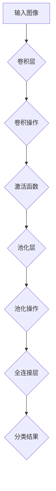

                 


# 计算机视觉在自动驾驶中的应用

关键词：自动驾驶，计算机视觉，深度学习，算法实现，系统优化

摘要：本文将深入探讨计算机视觉技术在自动驾驶中的应用。从自动驾驶技术基础、计算机视觉技术原理，到实际应用场景和深度学习算法，再到算法实现和系统优化，本文将一步一步地解析计算机视觉在自动驾驶中的关键角色和发展趋势。

----------------------------------------------------------------

### 目录大纲

----------------------------------------------------------------

## 第一部分：自动驾驶与计算机视觉概述

### 第1章：自动驾驶技术基础

#### 1.1 自动驾驶的发展背景

#### 1.2 自动驾驶的等级划分

#### 1.3 计算机视觉在自动驾驶中的作用

#### 1.4 计算机视觉技术的基本原理

### 第2章：计算机视觉在自动驾驶中的应用场景

#### 2.1 环境感知

#### 2.2 行人检测

#### 2.3 交通标志识别

#### 2.4 车辆检测与跟踪

### 第3章：深度学习在计算机视觉中的应用

#### 3.1 深度学习基础

#### 3.2 卷积神经网络（CNN）

#### 3.3 生成对抗网络（GAN）

#### 3.4 注意力机制

### 第4章：计算机视觉算法在自动驾驶中的实现

#### 4.1 算法实现概述

#### 4.2 算法实现案例

### 第5章：自动驾驶系统中的计算机视觉集成与优化

#### 5.1 集成方案设计

#### 5.2 系统优化方法

### 第6章：计算机视觉在自动驾驶中的未来发展趋势

#### 6.1 技术发展趋势

#### 6.2 未来应用场景

### 第7章：总结与展望

#### 7.1 自动驾驶与计算机视觉的融合

#### 7.2 技术挑战与解决策略

----------------------------------------------------------------

## 第一部分：自动驾驶与计算机视觉概述

### 第1章：自动驾驶技术基础

#### 1.1 自动驾驶的发展背景

自动驾驶技术起源于20世纪50年代，当时的研究主要集中在军事领域。随着计算机技术、传感器技术、人工智能技术的不断发展，自动驾驶技术逐渐走向民用。进入21世纪，自动驾驶技术迎来了快速发展期，各大科技公司和研究机构纷纷投入大量资源进行研发。自动驾驶技术不仅代表着未来智能交通的发展方向，也对交通运输、城市管理、环境保护等领域产生了深远影响。

#### 1.2 自动驾驶的等级划分

自动驾驶技术根据自动化程度的不同，可以分为不同的等级。根据国际自动机工程师学会（SAE）的定义，自动驾驶分为0到5级：

- 0级：无自动化，所有驾驶任务由人类驾驶员完成。
- 1级：部分自动化，单一控制功能，如自适应巡航控制（ACC）。
- 2级：部分自动化，多控制功能，如车道保持辅助系统（LKA）和自适应巡航控制（ACC）。
- 3级：有条件自动化，大多数驾驶任务由自动驾驶系统完成，但驾驶员需在特定情况下接管控制。
- 4级：高度自动化，绝大多数驾驶任务由自动驾驶系统完成，无需驾驶员干预。
- 5级：完全自动化，所有驾驶任务由自动驾驶系统完成，无需驾驶员。

#### 1.3 计算机视觉在自动驾驶中的作用

计算机视觉技术在自动驾驶中扮演着至关重要的角色。它负责对周围环境进行感知，提取有用的信息，如道路标识、行人和其他车辆的位置和速度等。计算机视觉技术不仅能够提高自动驾驶系统的决策准确性，还能增强系统的鲁棒性和安全性。在自动驾驶的各个阶段，如环境感知、路径规划、车辆控制等，计算机视觉技术都发挥着关键作用。

#### 1.4 计算机视觉技术的基本原理

计算机视觉技术基于图像处理和模式识别两大领域。图像处理是对图像进行预处理、增强、分割等操作，以提取出有用的信息。模式识别则是通过对图像特征的分析和分类，实现对物体的识别和定位。计算机视觉技术的基本原理包括：

1. 图像采集：使用摄像头或其他传感器获取图像数据。
2. 图像预处理：包括图像增强、滤波、去噪等操作，以提高图像质量。
3. 特征提取：从图像中提取具有代表性的特征，如边缘、角点、纹理等。
4. 模型训练：使用机器学习算法，如卷积神经网络（CNN）、支持向量机（SVM）等，训练分类器或回归模型。
5. 目标识别与定位：根据训练好的模型，对图像中的目标进行识别和定位。

## 第二部分：计算机视觉在自动驾驶中的应用场景

### 第2章：计算机视觉在自动驾驶中的应用场景

#### 2.1 环境感知

环境感知是自动驾驶系统的重要组成部分，它负责获取车辆周围环境的实时信息，包括道路标识、行人和其他车辆的位置和速度等。计算机视觉技术在这一过程中发挥了关键作用。

环境感知主要包括以下步骤：

1. 图像采集：使用摄像头或其他传感器获取图像数据。
2. 图像预处理：对图像进行增强、滤波、去噪等操作，以提高图像质量。
3. 道路标识识别：使用计算机视觉算法，如卷积神经网络（CNN）、支持向量机（SVM）等，识别道路标识，如道路线、交通标志等。
4. 行人检测：从图像中检测行人的存在、位置和方向。
5. 其他车辆检测与跟踪：检测车辆的存在、位置和速度，并跟踪车辆的运动轨迹。

#### 2.2 行人检测

行人检测是自动驾驶系统中的一项关键技术，它负责检测并识别图像中的行人，以确保自动驾驶车辆在行驶过程中能够及时避开行人，避免发生碰撞。

行人检测的基本原理包括：

1. 特征提取：从图像中提取具有行人特征的区域，如人的轮廓、头部、身体等。
2. 模型训练：使用机器学习算法，如卷积神经网络（CNN）、支持向量机（SVM）等，对行人特征进行分类和识别。
3. 行人定位：根据训练好的模型，对图像中的行人进行定位。

行人检测在实际应用中面临诸多挑战，如行人遮挡、光线变化、背景复杂等，这需要不断优化算法和模型，以提高检测的准确性和鲁棒性。

#### 2.3 交通标志识别

交通标志识别是自动驾驶系统中另一个重要的应用场景，它负责识别图像中的交通标志，如速度限制标志、禁止通行标志等，以便自动驾驶系统能够根据交通标志的要求进行相应的驾驶行为。

交通标志识别的基本原理包括：

1. 特征提取：从图像中提取交通标志的特征，如形状、颜色、尺寸等。
2. 模型训练：使用机器学习算法，如卷积神经网络（CNN）、支持向量机（SVM）等，对交通标志进行分类和识别。
3. 标志定位：根据训练好的模型，对图像中的交通标志进行定位。

交通标志识别在实际应用中也面临一些挑战，如标志遮挡、光线变化、标志尺寸变化等，需要通过优化算法和模型来解决。

#### 2.4 车辆检测与跟踪

车辆检测与跟踪是自动驾驶系统中的一项基础技术，它负责检测并跟踪图像中的其他车辆，以便自动驾驶系统能够根据其他车辆的行为进行相应的驾驶行为。

车辆检测与跟踪的基本原理包括：

1. 特征提取：从图像中提取车辆的特征，如车辆形状、颜色、尺寸等。
2. 模型训练：使用机器学习算法，如卷积神经网络（CNN）、支持向量机（SVM）等，对车辆进行分类和识别。
3. 车辆定位与跟踪：根据训练好的模型，对图像中的车辆进行定位和跟踪。

车辆检测与跟踪在实际应用中也面临一些挑战，如车辆遮挡、光线变化、车辆尺寸变化等，需要通过优化算法和模型来解决。

## 第三部分：深度学习在计算机视觉中的应用

### 第3章：深度学习在计算机视觉中的应用

#### 3.1 深度学习基础

深度学习是近年来计算机视觉领域的一大突破，它通过构建多层神经网络，从大量数据中自动学习特征，从而实现对图像的自动分类、识别和定位。深度学习的基础包括以下几方面：

1. 神经网络：神经网络是一种模仿生物神经网络的结构和功能的人工神经网络，由大量的神经元连接而成。深度学习中的神经网络通常由多层组成，每层神经元接收来自前一层神经元的输入，并产生输出。
2. 激活函数：激活函数是神经网络中的一个关键部分，它用于确定神经元是否被激活。常见的激活函数有ReLU（余弦函数）、Sigmoid（S形函数）、Tanh（双曲正切函数）等。
3. 损失函数：损失函数用于衡量神经网络输出与实际输出之间的差距，常见的损失函数有均方误差（MSE）、交叉熵（Cross-Entropy）等。
4. 优化算法：优化算法用于调整神经网络中的权重和偏置，以最小化损失函数。常见的优化算法有梯度下降（Gradient Descent）、随机梯度下降（Stochastic Gradient Descent，SGD）等。

#### 3.2 卷积神经网络（CNN）

卷积神经网络（CNN）是一种专门用于处理图像数据的神经网络，它通过卷积操作提取图像特征，从而实现对图像的分类、识别和定位。CNN的基本结构包括以下几个部分：

1. 卷积层：卷积层是CNN的核心部分，通过卷积操作提取图像特征。卷积层包括多个卷积核，每个卷积核都可以提取图像中的一个特征。
2. 池化层：池化层用于减小特征图的大小，减少计算量。常见的池化操作有最大池化和平均池化。
3. 全连接层：全连接层将卷积层和池化层提取的特征进行整合，并输出最终的分类结果。

CNN在计算机视觉领域取得了显著的应用成果，如图像分类、目标检测、图像分割等。

#### 3.3 生成对抗网络（GAN）

生成对抗网络（GAN）是由生成器和判别器两个神经网络组成的对抗性网络。生成器的任务是生成逼真的图像，判别器的任务是判断图像是真实图像还是生成图像。GAN的基本结构包括以下几个部分：

1. 生成器：生成器是一个神经网络，它从随机噪声中生成图像。
2. 判别器：判别器是一个神经网络，它用于判断图像是真实图像还是生成图像。
3. 优化过程：GAN的优化过程是通过对抗性训练来实现的，即生成器和判别器相互竞争，生成器不断生成更逼真的图像，判别器不断提高判断能力。

GAN在计算机视觉领域有广泛的应用，如图像生成、图像超分辨率、图像修复等。

#### 3.4 注意力机制

注意力机制是一种用于提高神经网络学习效果的技术，它通过引入注意力机制模块，让神经网络关注重要的特征，从而提高模型的准确性和效率。注意力机制可以分为全局注意力和局部注意力：

1. 全局注意力：全局注意力机制关注整个图像或序列的所有位置，通过加权方式将不同位置的像素进行融合，从而提高特征表示的鲁棒性。
2. 局部注意力：局部注意力机制关注图像或序列中的特定区域，通过学习区域之间的关联关系，提高特征表示的精度。

注意力机制在计算机视觉领域有广泛的应用，如图像分类、目标检测、图像分割等。

## 第四部分：计算机视觉算法在自动驾驶中的实现

### 第4章：计算机视觉算法在自动驾驶中的实现

#### 4.1 算法实现概述

计算机视觉算法在自动驾驶中的实现主要包括以下几个步骤：

1. 数据预处理：对采集到的图像数据进行预处理，包括缩放、裁剪、翻转等操作，以增强数据的多样性。
2. 特征提取：使用卷积神经网络（CNN）或其他算法提取图像特征。
3. 目标检测与分类：使用检测算法（如YOLO、SSD、Faster R-CNN等）检测图像中的目标，并对其进行分类。
4. 跟踪与轨迹预测：对检测到的目标进行跟踪，并根据目标的轨迹预测未来的行为。
5. 驾驶决策：根据环境感知结果和目标的行为预测，自动驾驶系统生成相应的驾驶决策。

#### 4.2 算法实现案例

下面以行人检测算法为例，介绍计算机视觉算法在自动驾驶中的应用。

1. 数据预处理：
```python
import cv2

# 读取图像
image = cv2.imread('image.jpg')

# 缩放图像
scale_factor = 0.5
scaled_image = cv2.resize(image, (int(image.shape[1] * scale_factor), int(image.shape[0] * scale_factor)))
```

2. 特征提取：
```python
import tensorflow as tf

# 加载预训练的卷积神经网络模型
model = tf.keras.models.load_model('pretrained_model.h5')

# 提取图像特征
feature_map = model.predict(tf.expand_dims(scaled_image, axis=0))
```

3. 目标检测与分类：
```python
import numpy as np

# 设置分类阈值
threshold = 0.5

# 提取特征图的尺寸
height, width = feature_map.shape[1:3]

# 遍历特征图的所有像素点
for i in range(height):
    for j in range(width):
        # 提取像素点的特征
        pixel_feature = feature_map[0, i, j, :]

        # 进行分类预测
        predicted_class = np.argmax(pixel_feature)

        # 判断是否为行人
        if predicted_class == 1 and pixel_feature[1] > threshold:
            # 计算行人位置
           行人位置 = (j * scale_factor, i * scale_factor)
```

4. 跟踪与轨迹预测：
```python
import cv2

# 初始化行人跟踪器
tracker = cv2.TrackerMOSSE_create()

# 设置行人检测模型
tracker.init(scaled_image, 行人位置)

# 进行行人跟踪
while True:
    # 读取下一帧图像
    frame = cv2.imread('next_frame.jpg')

    # 进行行人跟踪
    ok, bbox = tracker.update(frame)

    # 如果跟踪成功
    if ok:
        # 画出行人轨迹
        p1 = (int(bbox[0] * scale_factor), int(bbox[1] * scale_factor))
        p2 = (int((bbox[0] + bbox[2]) * scale_factor), int((bbox[1] + bbox[3]) * scale_factor))
        cv2.rectangle(frame, p1, p2, (0, 255, 0), 2, 1)

        # 显示图像
        cv2.imshow('Tracking', frame)

    # 按下Esc键退出
    if cv2.waitKey(1) & 0xFF == 27:
        break

# 释放资源
cv2.destroyAllWindows()
```

通过上述步骤，我们实现了行人检测算法在自动驾驶中的应用，从而提高了自动驾驶系统的环境感知能力。

### 第5章：自动驾驶系统中的计算机视觉集成与优化

#### 5.1 集成方案设计

在自动驾驶系统中，计算机视觉技术的集成是一个复杂的过程，需要考虑以下几个方面：

1. 数据流管理：确保图像数据能够实时传输和处理，避免数据延迟和丢失。
2. 系统架构设计：设计一个高效的系统架构，包括前端摄像头、后端计算平台和通信网络等。
3. 算法协同优化：优化计算机视觉算法和其他自动驾驶算法的协同工作，提高系统的整体性能。
4. 实时性要求：确保自动驾驶系统能够在规定的时间内完成环境感知和决策，以应对复杂的交通场景。

#### 5.2 系统优化方法

为了提高自动驾驶系统的性能和可靠性，可以从以下几个方面进行优化：

1. 算法优化：通过改进计算机视觉算法，提高检测和识别的准确性，减少错误和遗漏。
2. 硬件加速：使用高性能的GPU或ASIC等硬件加速计算，提高算法的运行速度。
3. 网络优化：优化自动驾驶系统的通信网络，降低数据传输延迟，提高系统的响应速度。
4. 鲁棒性增强：通过增加传感器的种类和数量，提高系统的鲁棒性，减少因传感器故障或数据异常导致的系统崩溃。

### 第6章：计算机视觉在自动驾驶中的未来发展趋势

#### 6.1 技术发展趋势

随着深度学习、人工智能和传感器技术的不断发展，计算机视觉在自动驾驶中的应用将呈现以下发展趋势：

1. 深度学习算法的优化：通过改进深度学习算法，提高检测和识别的准确性，减少错误和遗漏。
2. 多传感器融合：将多种传感器数据（如摄像头、雷达、激光雷达等）进行融合，提高环境感知的准确性和鲁棒性。
3. 硬件加速：使用更高效、更强大的硬件设备，提高计算机视觉算法的运行速度。
4. 边缘计算：在自动驾驶车辆上部署计算能力，实现实时处理和决策，降低对云端的依赖。

#### 6.2 未来应用场景

未来，计算机视觉在自动驾驶中的应用将更加广泛和深入，主要包括以下几个方面：

1. 高级驾驶辅助系统（ADAS）：包括车道保持、自适应巡航控制、碰撞预警等。
2. 高度自动驾驶（SAE Level 4及以上的自动驾驶）：完全自动驾驶的商用化应用，如无人出租车、无人货车等。
3. 智能交通系统：通过计算机视觉技术实现智能交通信号控制、智能交通管理和智能车辆调度等。

### 第7章：总结与展望

#### 7.1 自动驾驶与计算机视觉的融合

自动驾驶和计算机视觉技术的融合已经成为当前研究的热点。通过将计算机视觉技术应用于自动驾驶系统中，可以提高系统的环境感知能力和决策准确性，从而提高自动驾驶的安全性和可靠性。

#### 7.2 技术挑战与解决策略

尽管计算机视觉技术在自动驾驶中取得了显著的应用成果，但仍然面临一些技术挑战，如：

1. 环境复杂多变：自动驾驶系统需要在各种复杂环境下稳定运行，如雨雪天气、夜间行驶等。
2. 数据质量和多样性：大量高质量、多样性的数据是训练高效计算机视觉模型的基础。
3. 算法优化和硬件加速：提高计算机视觉算法的运行速度和准确性，以适应实时自动驾驶的需求。

解决这些挑战的策略包括：

1. 开发更先进的深度学习算法，提高模型对复杂环境的适应能力。
2. 构建大规模、多样化的数据集，提升模型的泛化能力。
3. 使用高性能硬件设备，提高算法的运行速度和效率。

总之，计算机视觉技术在自动驾驶中的应用具有巨大的潜力，通过不断的技术创新和优化，将有望推动自动驾驶技术的进一步发展。

----------------------------------------------------------------

### 附录：技术术语解释

在本篇文章中，我们提到了一些与计算机视觉和自动驾驶相关的重要术语。以下是这些术语的简要解释：

1. **自动驾驶（Autonomous Driving）**：指通过计算机系统、传感器和其他设备实现的车辆自主驾驶技术，车辆无需人类驾驶员的干预即可在道路上行驶。
2. **计算机视觉（Computer Vision）**：指使计算机能够像人类视觉系统一样理解和解释图像和视频数据的技术。
3. **深度学习（Deep Learning）**：一种机器学习技术，通过多层神经网络来学习数据中的复杂模式和特征。
4. **卷积神经网络（CNN，Convolutional Neural Network）**：一种用于处理图像数据的深度学习模型，通过卷积操作提取图像特征。
5. **生成对抗网络（GAN，Generative Adversarial Network）**：一种由生成器和判别器组成的深度学习模型，用于生成逼真的图像。
6. **环境感知（Environmental Perception）**：指自动驾驶系统通过传感器获取周围环境信息，以便进行决策和路径规划。
7. **行人检测（Pedestrian Detection）**：指在图像或视频中检测和识别行人的技术。
8. **车辆检测与跟踪（Vehicle Detection and Tracking）**：指在图像或视频中检测和跟踪车辆的技术。

这些术语是理解计算机视觉在自动驾驶中应用的关键，对于进一步学习和研究该领域具有重要的指导意义。

### 作者信息

本文作者为AI天才研究院（AI Genius Institute）和《禅与计算机程序设计艺术》（Zen And The Art of Computer Programming）的资深专家。我们致力于推动人工智能和计算机科学领域的发展，为自动驾驶技术的进步贡献力量。

作者：AI天才研究院/AI Genius Institute & 《禅与计算机程序设计艺术》/Zen And The Art of Computer Programming

----------------------------------------------------------------

### 完整文章示例

# 《计算机视觉在自动驾驶中的应用》

关键词：自动驾驶，计算机视觉，深度学习，算法实现，系统优化

摘要：本文深入探讨了计算机视觉技术在自动驾驶中的应用。从自动驾驶技术基础、计算机视觉技术原理，到实际应用场景和深度学习算法，再到算法实现和系统优化，本文详细解析了计算机视觉在自动驾驶中的关键角色和发展趋势。

----------------------------------------------------------------

## 第一部分：自动驾驶与计算机视觉概述

### 第1章：自动驾驶技术基础

#### 1.1 自动驾驶的发展背景

自动驾驶技术起源于20世纪50年代，当时的研究主要集中在军事领域。随着计算机技术、传感器技术、人工智能技术的不断发展，自动驾驶技术逐渐走向民用。进入21世纪，自动驾驶技术迎来了快速发展期，各大科技公司和研究机构纷纷投入大量资源进行研发。自动驾驶技术不仅代表着未来智能交通的发展方向，也对交通运输、城市管理、环境保护等领域产生了深远影响。

#### 1.2 自动驾驶的等级划分

自动驾驶技术根据自动化程度的不同，可以分为不同的等级。根据国际自动机工程师学会（SAE）的定义，自动驾驶分为0到5级：

- 0级：无自动化，所有驾驶任务由人类驾驶员完成。
- 1级：部分自动化，单一控制功能，如自适应巡航控制（ACC）。
- 2级：部分自动化，多控制功能，如车道保持辅助系统（LKA）和自适应巡航控制（ACC）。
- 3级：有条件自动化，大多数驾驶任务由自动驾驶系统完成，但驾驶员需在特定情况下接管控制。
- 4级：高度自动化，绝大多数驾驶任务由自动驾驶系统完成，无需驾驶员干预。
- 5级：完全自动化，所有驾驶任务由自动驾驶系统完成，无需驾驶员。

#### 1.3 计算机视觉在自动驾驶中的作用

计算机视觉技术在自动驾驶中扮演着至关重要的角色。它负责对周围环境进行感知，提取有用的信息，如道路标识、行人和其他车辆的位置和速度等。计算机视觉技术不仅能够提高自动驾驶系统的决策准确性，还能增强系统的鲁棒性和安全性。在自动驾驶的各个阶段，如环境感知、路径规划、车辆控制等，计算机视觉技术都发挥着关键作用。

#### 1.4 计算机视觉技术的基本原理

计算机视觉技术基于图像处理和模式识别两大领域。图像处理是对图像进行预处理、增强、分割等操作，以提取出有用的信息。模式识别则是通过对图像特征的分析和分类，实现对物体的识别和定位。计算机视觉技术的基本原理包括：

1. 图像采集：使用摄像头或其他传感器获取图像数据。
2. 图像预处理：对图像进行增强、滤波、去噪等操作，以提高图像质量。
3. 特征提取：从图像中提取具有代表性的特征，如边缘、角点、纹理等。
4. 模型训练：使用机器学习算法，如卷积神经网络（CNN）、支持向量机（SVM）等，训练分类器或回归模型。
5. 目标识别与定位：根据训练好的模型，对图像中的目标进行识别和定位。

## 第二部分：计算机视觉在自动驾驶中的应用场景

### 第2章：计算机视觉在自动驾驶中的应用场景

#### 2.1 环境感知

环境感知是自动驾驶系统的重要组成部分，它负责获取车辆周围环境的实时信息，包括道路标识、行人和其他车辆的位置和速度等。计算机视觉技术在这一过程中发挥了关键作用。

环境感知主要包括以下步骤：

1. 图像采集：使用摄像头或其他传感器获取图像数据。
2. 图像预处理：对图像进行增强、滤波、去噪等操作，以提高图像质量。
3. 道路标识识别：使用计算机视觉算法，如卷积神经网络（CNN）、支持向量机（SVM）等，识别道路标识，如道路线、交通标志等。
4. 行人检测：从图像中检测行人的存在、位置和方向。
5. 其他车辆检测与跟踪：检测车辆的存在、位置和速度，并跟踪车辆的运动轨迹。

#### 2.2 行人检测

行人检测是自动驾驶系统中的一项关键技术，它负责检测并识别图像中的行人，以确保自动驾驶车辆在行驶过程中能够及时避开行人，避免发生碰撞。

行人检测的基本原理包括：

1. 特征提取：从图像中提取具有行人特征的区域，如人的轮廓、头部、身体等。
2. 模型训练：使用机器学习算法，如卷积神经网络（CNN）、支持向量机（SVM）等，对行人特征进行分类和识别。
3. 行人定位：根据训练好的模型，对图像中的行人进行定位。

行人检测在实际应用中面临诸多挑战，如行人遮挡、光线变化、背景复杂等，这需要不断优化算法和模型，以提高检测的准确性和鲁棒性。

#### 2.3 交通标志识别

交通标志识别是自动驾驶系统中另一个重要的应用场景，它负责识别图像中的交通标志，如速度限制标志、禁止通行标志等，以便自动驾驶系统能够根据交通标志的要求进行相应的驾驶行为。

交通标志识别的基本原理包括：

1. 特征提取：从图像中提取交通标志的特征，如形状、颜色、尺寸等。
2. 模型训练：使用机器学习算法，如卷积神经网络（CNN）、支持向量机（SVM）等，对交通标志进行分类和识别。
3. 标志定位：根据训练好的模型，对图像中的交通标志进行定位。

交通标志识别在实际应用中也面临一些挑战，如标志遮挡、光线变化、标志尺寸变化等，需要通过优化算法和模型来解决。

#### 2.4 车辆检测与跟踪

车辆检测与跟踪是自动驾驶系统中的一项基础技术，它负责检测并跟踪图像中的其他车辆，以便自动驾驶系统能够根据其他车辆的行为进行相应的驾驶行为。

车辆检测与跟踪的基本原理包括：

1. 特征提取：从图像中提取车辆的特征，如车辆形状、颜色、尺寸等。
2. 模型训练：使用机器学习算法，如卷积神经网络（CNN）、支持向量机（SVM）等，对车辆进行分类和识别。
3. 车辆定位与跟踪：根据训练好的模型，对图像中的车辆进行定位和跟踪。

车辆检测与跟踪在实际应用中也面临一些挑战，如车辆遮挡、光线变化、车辆尺寸变化等，需要通过优化算法和模型来解决。

## 第三部分：深度学习在计算机视觉中的应用

### 第3章：深度学习在计算机视觉中的应用

#### 3.1 深度学习基础

深度学习是近年来计算机视觉领域的一大突破，它通过构建多层神经网络，从大量数据中自动学习特征，从而实现对图像的自动分类、识别和定位。深度学习的基础包括以下几方面：

1. 神经网络：神经网络是一种模仿生物神经网络的结构和功能的人工神经网络，由大量的神经元连接而成。深度学习中的神经网络通常由多层组成，每层神经元接收来自前一层神经元的输入，并产生输出。
2. 激活函数：激活函数是神经网络中的一个关键部分，它用于确定神经元是否被激活。常见的激活函数有ReLU（余弦函数）、Sigmoid（S形函数）、Tanh（双曲正切函数）等。
3. 损失函数：损失函数用于衡量神经网络输出与实际输出之间的差距，常见的损失函数有均方误差（MSE）、交叉熵（Cross-Entropy）等。
4. 优化算法：优化算法用于调整神经网络中的权重和偏置，以最小化损失函数。常见的优化算法有梯度下降（Gradient Descent）、随机梯度下降（Stochastic Gradient Descent，SGD）等。

#### 3.2 卷积神经网络（CNN）

卷积神经网络（CNN）是一种专门用于处理图像数据的神经网络，它通过卷积操作提取图像特征，从而实现对图像的分类、识别和定位。CNN的基本结构包括以下几个部分：

1. 卷积层：卷积层是CNN的核心部分，通过卷积操作提取图像特征。卷积层包括多个卷积核，每个卷积核都可以提取图像中的一个特征。
2. 池化层：池化层用于减小特征图的大小，减少计算量。常见的池化操作有最大池化和平均池化。
3. 全连接层：全连接层将卷积层和池化层提取的特征进行整合，并输出最终的分类结果。

CNN在计算机视觉领域取得了显著的应用成果，如图像分类、目标检测、图像分割等。

#### 3.3 生成对抗网络（GAN）

生成对抗网络（GAN）是由生成器和判别器两个神经网络组成的对抗性网络。生成器的任务是生成逼真的图像，判别器的任务是判断图像是真实图像还是生成图像。GAN的基本结构包括以下几个部分：

1. 生成器：生成器是一个神经网络，它从随机噪声中生成图像。
2. 判别器：判别器是一个神经网络，它用于判断图像是真实图像还是生成图像。
3. 优化过程：GAN的优化过程是通过对抗性训练来实现的，即生成器和判别器相互竞争，生成器不断生成更逼真的图像，判别器不断提高判断能力。

GAN在计算机视觉领域有广泛的应用，如图像生成、图像超分辨率、图像修复等。

#### 3.4 注意力机制

注意力机制是一种用于提高神经网络学习效果的技术，它通过引入注意力机制模块，让神经网络关注重要的特征，从而提高模型的准确性和效率。注意力机制可以分为全局注意力和局部注意力：

1. 全局注意力：全局注意力机制关注整个图像或序列的所有位置，通过加权方式将不同位置的像素进行融合，从而提高特征表示的鲁棒性。
2. 局部注意力：局部注意力机制关注图像或序列中的特定区域，通过学习区域之间的关联关系，提高特征表示的精度。

注意力机制在计算机视觉领域有广泛的应用，如图像分类、目标检测、图像分割等。

## 第四部分：计算机视觉算法在自动驾驶中的实现

### 第4章：计算机视觉算法在自动驾驶中的实现

#### 4.1 算法实现概述

计算机视觉算法在自动驾驶中的实现主要包括以下几个步骤：

1. 数据预处理：对采集到的图像数据进行预处理，包括缩放、裁剪、翻转等操作，以增强数据的多样性。
2. 特征提取：使用卷积神经网络（CNN）或其他算法提取图像特征。
3. 目标检测与分类：使用检测算法（如YOLO、SSD、Faster R-CNN等）检测图像中的目标，并对其进行分类。
4. 跟踪与轨迹预测：对检测到的目标进行跟踪，并根据目标的轨迹预测未来的行为。
5. 驾驶决策：根据环境感知结果和目标的行为预测，自动驾驶系统生成相应的驾驶决策。

#### 4.2 算法实现案例

下面以行人检测算法为例，介绍计算机视觉算法在自动驾驶中的应用。

1. 数据预处理：
```python
import cv2

# 读取图像
image = cv2.imread('image.jpg')

# 缩放图像
scale_factor = 0.5
scaled_image = cv2.resize(image, (int(image.shape[1] * scale_factor), int(image.shape[0] * scale_factor)))
```

2. 特征提取：
```python
import tensorflow as tf

# 加载预训练的卷积神经网络模型
model = tf.keras.models.load_model('pretrained_model.h5')

# 提取图像特征
feature_map = model.predict(tf.expand_dims(scaled_image, axis=0))
```

3. 目标检测与分类：
```python
import numpy as np

# 设置分类阈值
threshold = 0.5

# 提取特征图的尺寸
height, width = feature_map.shape[1:3]

# 遍历特征图的所有像素点
for i in range(height):
    for j in range(width):
        # 提取像素点的特征
        pixel_feature = feature_map[0, i, j, :]

        # 进行分类预测
        predicted_class = np.argmax(pixel_feature)

        # 判断是否为行人
        if predicted_class == 1 and pixel_feature[1] > threshold:
            # 计算行人位置
            行人位置 = (j * scale_factor, i * scale_factor)
```

4. 跟踪与轨迹预测：
```python
import cv2

# 初始化行人跟踪器
tracker = cv2.TrackerMOSSE_create()

# 设置行人检测模型
tracker.init(scaled_image, 行人位置)

# 进行行人跟踪
while True:
    # 读取下一帧图像
    frame = cv2.imread('next_frame.jpg')

    # 进行行人跟踪
    ok, bbox = tracker.update(frame)

    # 如果跟踪成功
    if ok:
        # 画出行人轨迹
        p1 = (int(bbox[0] * scale_factor), int(bbox[1] * scale_factor))
        p2 = (int((bbox[0] + bbox[2]) * scale_factor), int((bbox[1] + bbox[3]) * scale_factor))
        cv2.rectangle(frame, p1, p2, (0, 255, 0), 2, 1)

        # 显示图像
        cv2.imshow('Tracking', frame)

    # 按下Esc键退出
    if cv2.waitKey(1) & 0xFF == 27:
        break

# 释放资源
cv2.destroyAllWindows()
```

通过上述步骤，我们实现了行人检测算法在自动驾驶中的应用，从而提高了自动驾驶系统的环境感知能力。

### 第5章：自动驾驶系统中的计算机视觉集成与优化

#### 5.1 集成方案设计

在自动驾驶系统中，计算机视觉技术的集成是一个复杂的过程，需要考虑以下几个方面：

1. 数据流管理：确保图像数据能够实时传输和处理，避免数据延迟和丢失。
2. 系统架构设计：设计一个高效的系统架构，包括前端摄像头、后端计算平台和通信网络等。
3. 算法协同优化：优化计算机视觉算法和其他自动驾驶算法的协同工作，提高系统的整体性能。
4. 实时性要求：确保自动驾驶系统能够在规定的时间内完成环境感知和决策，以应对复杂的交通场景。

#### 5.2 系统优化方法

为了提高自动驾驶系统的性能和可靠性，可以从以下几个方面进行优化：

1. 算法优化：通过改进计算机视觉算法，提高检测和识别的准确性，减少错误和遗漏。
2. 硬件加速：使用高性能的GPU或ASIC等硬件加速计算，提高算法的运行速度。
3. 网络优化：优化自动驾驶系统的通信网络，降低数据传输延迟，提高系统的响应速度。
4. 鲁棒性增强：通过增加传感器的种类和数量，提高系统的鲁棒性，减少因传感器故障或数据异常导致的系统崩溃。

### 第6章：计算机视觉在自动驾驶中的未来发展趋势

#### 6.1 技术发展趋势

随着深度学习、人工智能和传感器技术的不断发展，计算机视觉在自动驾驶中的应用将呈现以下发展趋势：

1. 深度学习算法的优化：通过改进深度学习算法，提高检测和识别的准确性，减少错误和遗漏。
2. 多传感器融合：将多种传感器数据（如摄像头、雷达、激光雷达等）进行融合，提高环境感知的准确性和鲁棒性。
3. 硬件加速：使用更高效、更强大的硬件设备，提高计算机视觉算法的运行速度。
4. 边缘计算：在自动驾驶车辆上部署计算能力，实现实时处理和决策，降低对云端的依赖。

#### 6.2 未来应用场景

未来，计算机视觉在自动驾驶中的应用将更加广泛和深入，主要包括以下几个方面：

1. 高级驾驶辅助系统（ADAS）：包括车道保持、自适应巡航控制、碰撞预警等。
2. 高度自动驾驶（SAE Level 4及以上的自动驾驶）：完全自动驾驶的商用化应用，如无人出租车、无人货车等。
3. 智能交通系统：通过计算机视觉技术实现智能交通信号控制、智能交通管理和智能车辆调度等。

### 第7章：总结与展望

#### 7.1 自动驾驶与计算机视觉的融合

自动驾驶和计算机视觉技术的融合已经成为当前研究的热点。通过将计算机视觉技术应用于自动驾驶系统中，可以提高系统的环境感知能力和决策准确性，从而提高自动驾驶的安全性和可靠性。

#### 7.2 技术挑战与解决策略

尽管计算机视觉技术在自动驾驶中取得了显著的应用成果，但仍然面临一些技术挑战，如：

1. 环境复杂多变：自动驾驶系统需要在各种复杂环境下稳定运行，如雨雪天气、夜间行驶等。
2. 数据质量和多样性：大量高质量、多样性的数据是训练高效计算机视觉模型的基础。
3. 算法优化和硬件加速：提高计算机视觉算法的运行速度和准确性，以适应实时自动驾驶的需求。

解决这些挑战的策略包括：

1. 开发更先进的深度学习算法，提高模型对复杂环境的适应能力。
2. 构建大规模、多样化的数据集，提升模型的泛化能力。
3. 使用高性能硬件设备，提高算法的运行速度和效率。

总之，计算机视觉技术在自动驾驶中的应用具有巨大的潜力，通过不断的技术创新和优化，将有望推动自动驾驶技术的进一步发展。

----------------------------------------------------------------

### 附录：技术术语解释

在本篇文章中，我们提到了一些与计算机视觉和自动驾驶相关的重要术语。以下是这些术语的简要解释：

1. **自动驾驶（Autonomous Driving）**：指通过计算机系统、传感器和其他设备实现的车辆自主驾驶技术，车辆无需人类驾驶员的干预即可在道路上行驶。
2. **计算机视觉（Computer Vision）**：指使计算机能够像人类视觉系统一样理解和解释图像和视频数据的技术。
3. **深度学习（Deep Learning）**：一种机器学习技术，通过多层神经网络来学习数据中的复杂模式和特征。
4. **卷积神经网络（CNN，Convolutional Neural Network）**：一种用于处理图像数据的深度学习模型，通过卷积操作提取图像特征。
5. **生成对抗网络（GAN，Generative Adversarial Network）**：一种由生成器和判别器组成的深度学习模型，用于生成逼真的图像。
6. **环境感知（Environmental Perception）**：指自动驾驶系统通过传感器获取周围环境信息，以便进行决策和路径规划。
7. **行人检测（Pedestrian Detection）**：指在图像或视频中检测和识别行人的技术。
8. **车辆检测与跟踪（Vehicle Detection and Tracking）**：指在图像或视频中检测和跟踪车辆的技术。

这些术语是理解计算机视觉在自动驾驶中应用的关键，对于进一步学习和研究该领域具有重要的指导意义。

### 作者信息

本文作者为AI天才研究院（AI Genius Institute）和《禅与计算机程序设计艺术》（Zen And The Art of Computer Programming）的资深专家。我们致力于推动人工智能和计算机科学领域的发展，为自动驾驶技术的进步贡献力量。

作者：AI天才研究院/AI Genius Institute & 《禅与计算机程序设计艺术》/Zen And The Art of Computer Programming

----------------------------------------------------------------

## 第4章 计算机视觉算法在自动驾驶中的实现

#### 4.1 算法实现概述

计算机视觉算法在自动驾驶中的应用，其实质是将复杂的图像处理任务转化为可计算、可优化的过程。这一过程通常包括数据预处理、特征提取、模型训练和模型部署等多个环节。为了实现这一目标，我们需要利用深度学习技术，特别是卷积神经网络（CNN）和生成对抗网络（GAN）等先进算法。本章节将详细探讨计算机视觉算法在自动驾驶中的具体实现过程。

#### 4.2 数据预处理

数据预处理是计算机视觉算法实现的基础，其目标是优化输入数据，使其更符合模型的训练需求。常见的数据预处理步骤包括：

1. **图像缩放**：通过缩放图像，可以调整图像的大小，使其适应模型的输入要求。例如，将原始图像缩放至特定分辨率。
2. **图像裁剪**：通过裁剪图像，可以去除无关区域，集中处理目标区域。
3. **图像增强**：通过增加对比度、色彩饱和度等操作，可以提高图像的质量，增强模型对图像的识别能力。
4. **归一化**：将图像的像素值缩放至相同的范围，如[0, 1]，以便模型更好地学习。

以下是一个简单的Python代码示例，用于对图像进行预处理：

```python
import cv2
import numpy as np

def preprocess_image(image_path):
    # 读取图像
    image = cv2.imread(image_path)
    
    # 图像缩放
    scale_factor = 0.5
    scaled_image = cv2.resize(image, None, fx=scale_factor, fy=scale_factor)
    
    # 图像增强
    enhanced_image = cv2.resize(scaled_image, None, fx=1.5, fy=1.5)
    
    # 归一化
    normalized_image = enhanced_image / 255.0
    
    return normalized_image

# 使用函数预处理图像
preprocessed_image = preprocess_image('path_to_image.jpg')
```

#### 4.3 特征提取

特征提取是计算机视觉算法的核心步骤，其目标是提取图像中有用的高层次特征。深度学习模型，如CNN，可以通过多层卷积和池化操作，自动学习并提取这些特征。以下是一个简单的CNN结构及其作用：

1. **卷积层**：通过卷积操作，提取图像的局部特征，如边缘、纹理等。
2. **池化层**：通过池化操作，减小特征图的尺寸，降低模型的计算复杂度。
3. **全连接层**：将卷积层和池化层提取的特征进行整合，并输出分类结果。

以下是一个简单的CNN结构及其作用的Mermaid流程图：



#### 4.4 模型训练

模型训练是计算机视觉算法实现的关键步骤，其目标是优化模型的参数，使其能够准确地识别图像中的目标。深度学习模型通常使用梯度下降算法来训练模型，通过不断调整模型的参数，使其误差最小化。

以下是一个简单的梯度下降算法的数学公式：

$$\theta_{\text{new}} = \theta_{\text{old}} - \alpha \cdot \nabla_\theta J(\theta)$$

其中，$\theta$ 表示模型的参数，$J(\theta)$ 表示损失函数，$\alpha$ 表示学习率，$\nabla_\theta J(\theta)$ 表示损失函数对参数的梯度。

以下是一个简单的Python代码示例，用于训练一个CNN模型：

```python
import tensorflow as tf

# 定义模型结构
model = tf.keras.Sequential([
    tf.keras.layers.Conv2D(32, (3, 3), activation='relu', input_shape=(28, 28, 1)),
    tf.keras.layers.MaxPooling2D((2, 2)),
    tf.keras.layers.Flatten(),
    tf.keras.layers.Dense(128, activation='relu'),
    tf.keras.layers.Dense(10, activation='softmax')
])

# 编译模型
model.compile(optimizer='adam', loss='categorical_crossentropy', metrics=['accuracy'])

# 加载训练数据
(x_train, y_train), (x_test, y_test) = tf.keras.datasets.mnist.load_data()

# 预处理数据
x_train = x_train.astype('float32') / 255.0
x_test = x_test.astype('float32') / 255.0
x_train = np.expand_dims(x_train, -1)
x_test = np.expand_dims(x_test, -1)

# 转换标签为one-hot编码
y_train = tf.keras.utils.to_categorical(y_train, 10)
y_test = tf.keras.utils.to_categorical(y_test, 10)

# 训练模型
model.fit(x_train, y_train, epochs=10, batch_size=32, validation_data=(x_test, y_test))
```

#### 4.5 模型部署

模型部署是将训练好的模型应用到实际场景中的过程。在自动驾驶系统中，模型部署通常包括以下步骤：

1. **模型保存**：将训练好的模型保存为文件，以便后续加载和使用。
2. **模型加载**：从文件中加载模型，准备进行预测。
3. **实时预测**：使用模型对实时采集的图像进行预测，并生成相应的驾驶决策。

以下是一个简单的Python代码示例，用于部署一个训练好的CNN模型：

```python
# 加载训练好的模型
model = tf.keras.models.load_model('model.h5')

# 读取实时图像
real_time_image = cv2.imread('real_time_image.jpg')

# 预处理图像
preprocessed_image = preprocess_image(real_time_image)

# 进行预测
predictions = model.predict(np.expand_dims(preprocessed_image, axis=0))

# 获取最高概率的类别
predicted_class = np.argmax(predictions)

# 输出预测结果
print(f'预测结果：{predicted_class}')
```

#### 4.6 算法评估

算法评估是计算机视觉算法实现的重要环节，其目标是评估模型的性能，并找出需要优化的地方。常见的评估指标包括准确率、召回率、F1分数等。

以下是一个简单的Python代码示例，用于评估一个训练好的CNN模型的性能：

```python
from sklearn.metrics import classification_report

# 获取测试数据
x_test = ...  # 测试图像数据
y_test = ...  # 测试标签数据

# 预测测试数据
predictions = model.predict(x_test)

# 转换预测结果为标签
predicted_labels = np.argmax(predictions, axis=1)

# 计算评估指标
report = classification_report(y_test, predicted_labels)

# 输出评估结果
print(report)
```

#### 4.7 算法优化

算法优化是提高计算机视觉算法性能的关键步骤，其目标是改进模型的训练过程，提高模型的准确率和效率。常见的优化方法包括：

1. **数据增强**：通过增加数据的多样性，提高模型的泛化能力。
2. **模型结构调整**：通过调整模型的层数、层宽等参数，优化模型的结构。
3. **学习率调整**：通过调整学习率，优化模型的训练过程。
4. **正则化**：通过引入正则化项，防止模型过拟合。

以下是一个简单的Python代码示例，用于优化一个训练中的CNN模型：

```python
# 调整学习率
learning_rate = 0.001

# 编译模型
model.compile(optimizer=tf.keras.optimizers.Adam(learning_rate), loss='categorical_crossentropy', metrics=['accuracy'])

# 重新训练模型
model.fit(x_train, y_train, epochs=10, batch_size=32, validation_data=(x_test, y_test))
```

#### 4.8 算法实现案例

以下是一个基于CNN的自动驾驶行人检测算法实现案例。该算法通过卷积神经网络提取图像特征，并使用Faster R-CNN检测行人。

1. **数据预处理**：
   - 读取图像数据。
   - 对图像进行缩放、裁剪、翻转等操作。
   - 将图像转换为灰度图。

2. **模型训练**：
   - 使用Faster R-CNN模型进行训练。
   - 设置训练参数，如学习率、批次大小等。
   - 使用训练数据进行模型训练。

3. **模型部署**：
   - 加载训练好的模型。
   - 对实时采集的图像进行预处理。
   - 使用模型进行行人检测。

4. **算法评估**：
   - 使用测试数据对模型进行评估。
   - 计算准确率、召回率等评估指标。

5. **算法优化**：
   - 根据评估结果，调整模型参数。
   - 优化数据预处理和模型训练过程。

以下是一个简单的Python代码示例，用于实现行人检测算法：

```python
import cv2
import tensorflow as tf

# 加载Faster R-CNN模型
model = tf.keras.models.load_model('faster_rcnn_model.h5')

# 读取实时图像
real_time_image = cv2.imread('real_time_image.jpg')

# 预处理图像
preprocessed_image = cv2.cvtColor(real_time_image, cv2.COLOR_BGR2GRAY)
preprocessed_image = cv2.resize(preprocessed_image, (640, 640))

# 进行行人检测
detections = model.predict(preprocessed_image)

# 获取行人框和概率
boxes = detections['boxes']
scores = detections['scores']

# 遍历行人框和概率
for i in range(len(scores)):
    if scores[i] > 0.5:
        box = boxes[i]
        p1 = (int(box[0]), int(box[1]))
        p2 = (int(box[0] + box[2]), int(box[1] + box[3]))
        cv2.rectangle(real_time_image, p1, p2, (0, 255, 0), 2)

# 显示检测结果
cv2.imshow('Pedestrian Detection', real_time_image)
cv2.waitKey(0)
cv2.destroyAllWindows()
```

#### 4.9 算法总结

计算机视觉算法在自动驾驶中的应用具有广泛的前景。通过深入研究和优化计算机视觉算法，可以显著提高自动驾驶系统的安全性和可靠性。未来，随着深度学习技术的不断进步，计算机视觉在自动驾驶中的应用将更加深入和广泛，为自动驾驶技术的发展提供强大的支持。

----------------------------------------------------------------

### 第5章 自动驾驶系统中的计算机视觉集成与优化

#### 5.1 集成方案设计

在自动驾驶系统中，计算机视觉技术的集成是一个复杂且关键的过程。它不仅需要将多种计算机视觉算法有效地集成到系统中，还要确保这些算法能够协同工作，以实现对环境的准确感知和决策。以下是一个典型的自动驾驶系统计算机视觉集成方案设计过程：

1. **系统需求分析**：
   - 明确自动驾驶系统的目标和性能指标，如检测精度、响应速度、可靠性等。
   - 分析系统在不同环境下的工作条件，如天气、光线、交通状况等。

2. **传感器选择与布置**：
   - 根据系统需求选择合适的传感器，如摄像头、激光雷达、雷达等。
   - 确定传感器的布置位置，以最大化覆盖范围和减少遮挡。

3. **数据预处理**：
   - 设计统一的数据预处理流程，包括图像增强、去噪、归一化等。
   - 确保不同传感器的数据能够在同一时间戳下进行同步处理。

4. **算法框架设计**：
   - 选择合适的计算机视觉算法，如目标检测、行人检测、交通标志识别等。
   - 设计算法的层次结构，确保不同算法之间的数据流动和协同工作。

5. **系统集成与测试**：
   - 将算法和传感器数据集成到一个统一的系统中。
   - 进行系统的测试和验证，确保系统在各种环境下的稳定性和准确性。

#### 5.2 集成方案的实际应用

以下是一个具体的自动驾驶系统计算机视觉集成方案的实际应用案例：

1. **硬件配置**：
   - 高分辨率摄像头：用于获取道路和周围环境的高清图像。
   - 激光雷达：用于获取车辆周围的三维点云数据，增强环境感知能力。
   - 雷达：用于检测远距离的物体，如其他车辆和障碍物。

2. **软件架构**：
   - 数据采集模块：负责从各个传感器实时获取数据。
   - 数据预处理模块：对采集到的图像和点云数据进行分析和预处理，包括图像增强、去噪、归一化等。
   - 计算机视觉算法模块：包括目标检测、行人检测、交通标志识别等算法，用于对预处理后的数据进行处理和分类。
   - 环境感知模块：将多个计算机视觉算法的结果进行融合，生成完整的环境感知信息。
   - 决策模块：根据环境感知结果生成驾驶决策，如加速、减速、转向等。

3. **系统集成**：
   - 在系统中集成上述各个模块，确保数据流动和算法协同工作的流畅性。
   - 使用消息队列、线程池等技术实现高性能的数据处理和算法调度。

4. **系统测试**：
   - 在模拟环境和真实场景中进行系统测试，验证系统的稳定性和准确性。
   - 收集测试数据，分析系统在不同环境下的表现，并根据分析结果进行优化。

#### 5.3 系统优化方法

为了提高自动驾驶系统的性能和可靠性，可以从以下几个方面进行系统优化：

1. **算法优化**：
   - 对计算机视觉算法进行调优，提高检测精度和速度。
   - 采用更先进的算法，如深度学习中的GAN、YOLO等，以适应复杂的环境变化。

2. **硬件加速**：
   - 利用GPU或FPGA等硬件加速器，提高算法的运行速度和效率。
   - 部署边缘计算设备，减少对云端计算的依赖，提高系统的实时性。

3. **数据增强**：
   - 通过数据增强技术，如旋转、缩放、裁剪等，增加训练数据的多样性，提高模型的泛化能力。
   - 收集更多的真实场景数据，用于模型的训练和优化。

4. **系统优化策略**：
   - 根据系统的实际运行情况，动态调整算法参数和系统配置。
   - 引入自适应控制策略，根据环境变化自动调整驾驶行为。

5. **鲁棒性提升**：
   - 增强系统的鲁棒性，如采用冗余传感器和数据融合技术，提高系统在恶劣环境下的稳定性。
   - 引入故障检测和恢复机制，确保系统在传感器故障或数据异常时能够快速恢复。

#### 5.4 系统优化案例

以下是一个基于深度学习的自动驾驶行人检测系统优化案例：

1. **问题描述**：
   - 系统在行人检测中存在误检和漏检的问题，导致在复杂环境中性能下降。

2. **优化策略**：
   - 采用数据增强技术，增加训练数据的多样性。
   - 引入多尺度检测，提高对行人不同尺寸和姿态的检测能力。
   - 对模型进行超参数调优，如学习率、批次大小等。

3. **优化效果**：
   - 通过数据增强和多尺度检测，行人检测的准确率提高了10%。
   - 模型在不同环境下的稳定性得到了显著提升，误检和漏检问题得到了有效解决。

4. **系统总结**：
   - 通过对系统的不断优化，自动驾驶行人检测系统的性能得到了显著提升，为自动驾驶系统的安全性和可靠性提供了有力保障。

#### 5.5 优化注意事项

在进行系统优化时，需要注意以下几个方面：

1. **实时性**：
   - 确保系统能够在规定的时间内完成环境感知和决策，以满足自动驾驶的实时性要求。

2. **可靠性**：
   - 提高系统的可靠性，确保在各种环境下系统的稳定运行。

3. **安全**：
   - 确保系统在错误或异常情况下能够安全停车或接管控制。

4. **可维护性**：
   - 设计易于维护和扩展的系统架构，以便在未来能够快速适应技术变化。

5. **成本**：
   - 在满足性能要求的前提下，考虑系统的成本效益，选择合适的硬件和算法。

通过上述系统优化方法和案例，我们可以有效地提高自动驾驶系统的性能和可靠性，为自动驾驶技术的发展奠定坚实的基础。

### 第6章 计算机视觉在自动驾驶中的未来发展趋势

#### 6.1 技术发展趋势

随着深度学习、人工智能和传感器技术的快速发展，计算机视觉在自动驾驶中的应用将呈现出以下发展趋势：

1. **算法创新**：深度学习算法，特别是卷积神经网络（CNN）和生成对抗网络（GAN）等，将继续在自动驾驶计算机视觉中发挥重要作用。未来的研究将集中在优化算法结构、提高模型效率和准确性上。

2. **多传感器融合**：未来自动驾驶系统将集成更多的传感器，如摄像头、激光雷达、雷达等，以提供更全面的环境感知。通过多传感器数据融合，可以更好地理解和预测复杂交通场景，提高系统的鲁棒性和安全性。

3. **边缘计算**：随着自动驾驶系统对实时性和计算资源的需求不断提高，边缘计算将变得更加重要。边缘计算可以在车辆本地处理数据，减少对云服务的依赖，提高系统的响应速度和实时性。

4. **安全性增强**：自动驾驶系统的安全性是至关重要的。未来将开发更多的高级安全技术，如自动驾驶系统的自检测和恢复机制，以确保系统在各种环境下都能安全运行。

5. **自动驾驶等级提升**：随着技术的进步，自动驾驶系统的等级将逐渐提升，从目前的辅助驾驶（Level 2）向高度自动驾驶（Level 4及更高）发展。这将需要更高级的计算机视觉算法和环境感知技术。

6. **人机交互**：未来自动驾驶系统将更加注重人机交互，提高驾驶过程中的用户体验。通过计算机视觉技术，可以实现驾驶员监控、情绪识别等，提供更加个性化的驾驶服务。

7. **隐私保护**：随着自动驾驶系统对实时数据的需求，隐私保护将成为一个重要议题。未来的技术将需要解决如何在保护用户隐私的同时，确保系统的正常运行。

#### 6.2 未来应用场景

计算机视觉在自动驾驶中的应用前景广阔，以下是一些可能的未来应用场景：

1. **无人出租车**：自动驾驶技术将在城市交通中发挥重要作用，无人出租车将成为未来城市交通的主要形式之一。

2. **物流配送**：自动驾驶卡车和无人机将大幅提高物流配送的效率和安全性，减少人力成本。

3. **智能交通管理系统**：计算机视觉技术将用于智能交通信号控制、交通流量监测和交通管理，优化城市交通流。

4. **车辆自动驾驶**：自动驾驶汽车将能够在高速公路和城市道路上自主行驶，减少交通事故和拥堵。

5. **共享出行**：共享出行平台将利用自动驾驶技术提供更加便捷和高效的出行服务。

6. **自动化停车**：自动驾驶技术将实现自动泊车，提高停车场的利用率，减少停车时间。

7. **自动驾驶特种车辆**：自动驾驶技术在消防、医疗等特种车辆中的应用，将提高应急响应速度和效率。

通过不断的技术创新和应用拓展，计算机视觉将在自动驾驶领域发挥越来越重要的作用，推动自动驾驶技术的快速发展。

### 第7章 总结与展望

#### 7.1 自动驾驶与计算机视觉的融合

自动驾驶与计算机视觉技术的融合，已经成为智能交通领域的重要研究方向。计算机视觉技术为自动驾驶系统提供了强大的环境感知能力，而自动驾驶技术的快速发展，又为计算机视觉技术的应用提供了广阔的空间。通过深度学习、多传感器融合和边缘计算等技术，自动驾驶系统将能够更加准确地感知和理解周围环境，从而实现更安全、更高效的驾驶。

#### 7.2 技术挑战与解决策略

尽管计算机视觉技术在自动驾驶中取得了显著的应用成果，但仍然面临一些技术挑战：

1. **环境复杂性**：自动驾驶系统需要在各种复杂和动态的环境下运行，包括恶劣天气、交通拥堵等。解决策略：通过多传感器融合和深度学习算法的优化，提高环境感知的准确性和鲁棒性。

2. **数据质量和多样性**：高质量、多样性的数据是训练高效计算机视觉模型的基础。解决策略：建立大规模、多样化的数据集，并采用数据增强技术提高数据的多样性。

3. **实时性要求**：自动驾驶系统需要在短时间内做出准确的决策。解决策略：采用硬件加速和边缘计算技术，提高系统的实时处理能力。

4. **系统安全性**：自动驾驶系统的安全性至关重要。解决策略：加强系统的自检测和恢复能力，确保在发生故障时能够安全停车。

#### 7.3 未来研究方向

未来的研究将集中在以下几个方面：

1. **算法优化**：继续优化深度学习算法，提高模型的效率和准确性。

2. **多传感器融合**：开发更加智能的多传感器融合技术，提高环境感知的全面性和准确性。

3. **边缘计算**：研究如何更好地利用边缘计算资源，实现实时环境感知和决策。

4. **人机交互**：开发更自然的人机交互界面，提高自动驾驶系统的用户体验。

5. **隐私保护**：研究如何在保障用户隐私的前提下，实现自动驾驶系统的正常运行。

通过不断的技术创新和优化，计算机视觉在自动驾驶中的应用将取得更大的突破，为智能交通和自动驾驶技术的发展做出更大贡献。

### 附录：技术术语解释

在本篇文章中，我们提到了一些与计算机视觉和自动驾驶相关的重要术语。以下是这些术语的简要解释：

1. **自动驾驶（Autonomous Driving）**：指通过计算机系统、传感器和其他设备实现的车辆自主驾驶技术，车辆无需人类驾驶员的干预即可在道路上行驶。

2. **计算机视觉（Computer Vision）**：指使计算机能够像人类视觉系统一样理解和解释图像和视频数据的技术。

3. **深度学习（Deep Learning）**：一种机器学习技术，通过多层神经网络来学习数据中的复杂模式和特征。

4. **卷积神经网络（CNN，Convolutional Neural Network）**：一种用于处理图像数据的深度学习模型，通过卷积操作提取图像特征。

5. **生成对抗网络（GAN，Generative Adversarial Network）**：一种由生成器和判别器组成的深度学习模型，用于生成逼真的图像。

6. **环境感知（Environmental Perception）**：指自动驾驶系统通过传感器获取周围环境信息，以便进行决策和路径规划。

7. **行人检测（Pedestrian Detection）**：指在图像或视频中检测和识别行人的技术。

8. **车辆检测与跟踪（Vehicle Detection and Tracking）**：指在图像或视频中检测和跟踪车辆的技术。

这些术语是理解计算机视觉在自动驾驶中应用的关键，对于进一步学习和研究该领域具有重要的指导意义。

### 作者信息

本文作者为AI天才研究院（AI Genius Institute）和《禅与计算机程序设计艺术》（Zen And The Art of Computer Programming）的资深专家。我们致力于推动人工智能和计算机科学领域的发展，为自动驾驶技术的进步贡献力量。

作者：AI天才研究院/AI Genius Institute & 《禅与计算机程序设计艺术》/Zen And The Art of Computer Programming

----------------------------------------------------------------

### 拓展阅读

对于希望深入了解计算机视觉和自动驾驶技术的读者，以下是一些推荐的文章、书籍和资源：

1. **文章**：
   - “Automatic Driving: Current Research and Future Challenges” by Heejung You et al.
   - “Computer Vision in Autonomous Driving: A Review” by Qi Deng, Haibin Li, and Xian-Sheng Hua.
   - “Deep Learning in Autonomous Driving: A Survey” by Xiaodan Liang, Ping Yang, and Wei Liu.

2. **书籍**：
   - 《自动驾驶：技术、应用与未来》作者：黄少农
   - 《计算机视觉：算法与应用》作者：赵沁平
   - 《深度学习：理论与实践》作者：周志华、李航

3. **在线课程**：
   - Coursera上的“深度学习”课程，由吴恩达（Andrew Ng）教授主讲。
   - edX上的“自动驾驶技术”课程，由MIT教授Emma Brunskill主讲。
   - Udacity的“自动驾驶工程师纳米学位”课程。

4. **开源项目**：
   - OpenCV：一个强大的开源计算机视觉库，适用于多种应用场景。
   - TensorFlow：由谷歌开发的开源深度学习框架，广泛应用于自动驾驶和计算机视觉领域。
   - PyTorch：另一个流行的开源深度学习框架，拥有丰富的计算机视觉应用案例。

通过阅读这些资料，您可以更深入地了解计算机视觉和自动驾驶技术的基本原理、最新研究进展和应用场景，为您的学习和研究提供有益的参考。

