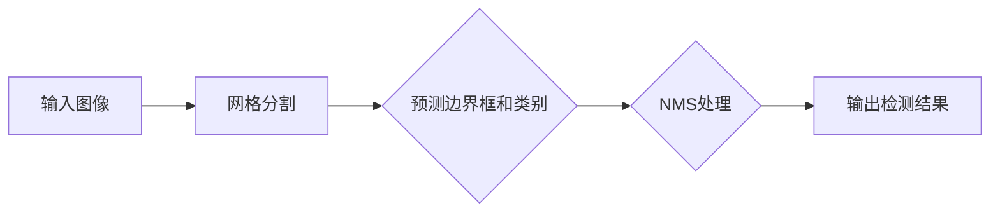
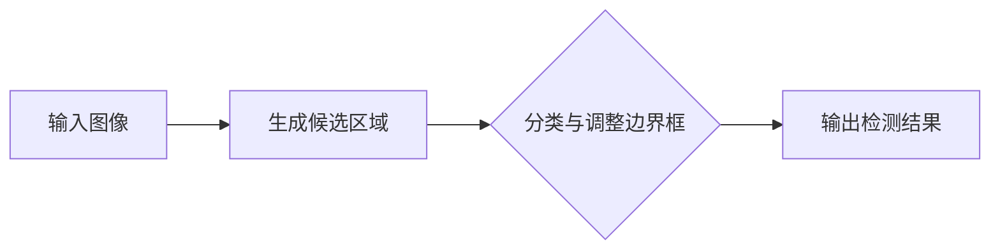
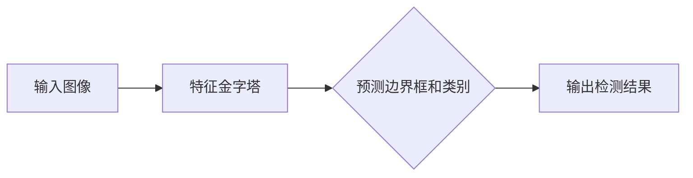
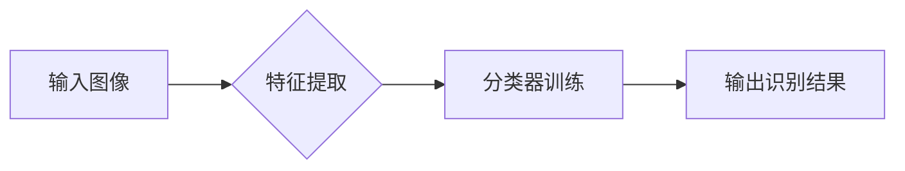
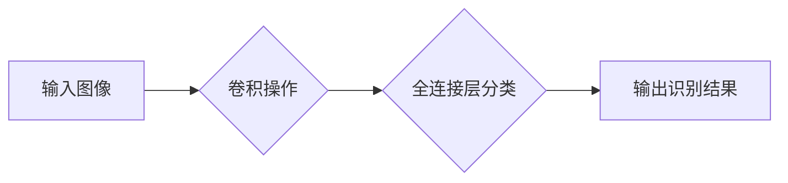
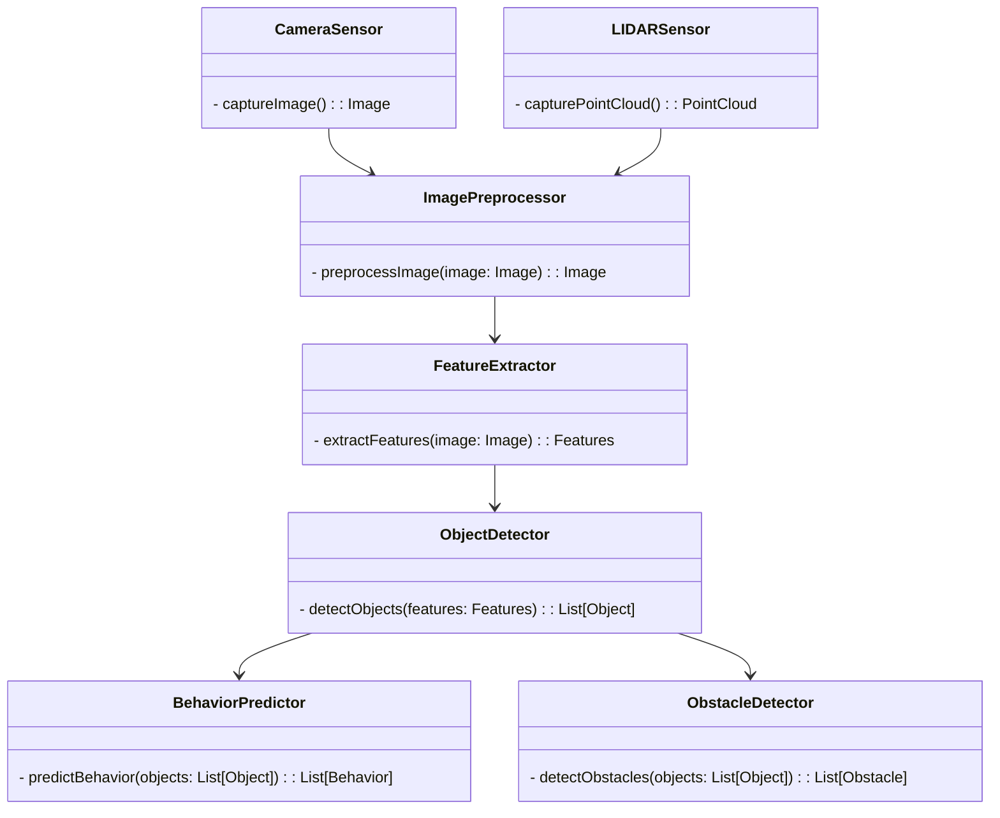
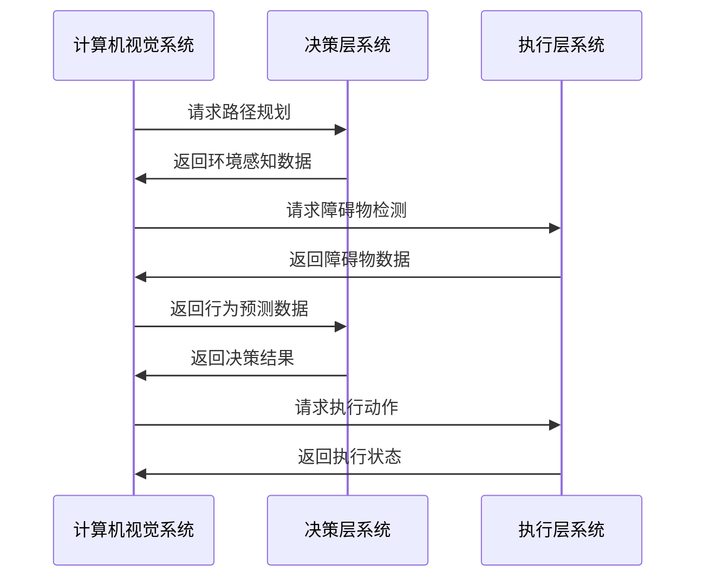

                 

## 计算机视觉在自动驾驶中的应用与挑战

### 关键词：计算机视觉、自动驾驶、应用、挑战

### 摘要：

本文将深入探讨计算机视觉在自动驾驶中的应用及其面临的挑战。随着自动驾驶技术的发展，计算机视觉作为其核心技术之一，正发挥着越来越重要的作用。本文将从背景介绍、核心概念解析、技术应用分析、算法原理讲解、系统架构设计以及未来展望等多个方面，全面阐述计算机视觉在自动驾驶中的应用现状与未来发展方向。

### 目录：

1. **引言与背景**  
    1.1 自动驾驶技术概述  
    1.2 计算机视觉在自动驾驶中的地位

2. **计算机视觉基础**  
    2.1 计算机视觉基本概念  
    2.2 图像处理基础  
    2.3 特征提取与目标检测

3. **计算机视觉在自动驾驶中的应用**  
    3.1 道路识别与地图构建  
    3.2 交通标志识别与理解  
    3.3 感知车辆与行人

4. **计算机视觉算法原理**  
    4.1 目标检测算法  
    4.2 图像识别算法

5. **计算机视觉系统架构**  
    5.1 自动驾驶系统架构概述  
    5.2 计算机视觉系统在自动驾驶中的应用  
    5.3 计算机视觉系统的性能优化

6. **自动驾驶中的计算机视觉挑战**  
    6.1 数据集问题  
    6.2 算法鲁棒性  
    6.3 实时性与能耗问题

7. **自动驾驶的未来发展趋势**  
    7.1 计算机视觉技术的进步  
    7.2 自动驾驶行业的未来展望

8. **参考文献**  
9. **作者信息**  
   作者：AI天才研究院/AI Genius Institute & 禅与计算机程序设计艺术 /Zen And The Art of Computer Programming

---

### 1. 引言与背景

#### 1.1 自动驾驶技术概述

自动驾驶技术，又称自动驾驶汽车技术，是指利用计算机技术、电子技术、传感器技术、控制技术等多种技术手段，使汽车能够自主行驶，达到无人驾驶的目的。根据国际自动机工程师学会（SAE）的定义，自动驾驶分为五个等级，从0级（完全人工驾驶）到5级（完全自动驾驶）。

自动驾驶技术的发展可以追溯到20世纪50年代，但直到21世纪，随着计算机性能的不断提升、传感器的广泛应用以及深度学习算法的成熟，自动驾驶技术才逐渐进入实际应用阶段。目前，自动驾驶技术在全球范围内得到了广泛关注，许多科技公司、传统汽车制造商以及研究机构都在积极探索和研发自动驾驶技术。

#### 1.2 计算机视觉在自动驾驶中的地位

计算机视觉是自动驾驶技术的核心组成部分之一，它通过摄像头、激光雷达（LIDAR）等传感器获取车辆周围的环境信息，对这些信息进行处理、分析和理解，从而为自动驾驶系统提供决策支持。计算机视觉在自动驾驶中的应用主要体现在以下几个方面：

- **道路识别与地图构建**：计算机视觉技术可以帮助自动驾驶汽车识别道路标志、车道线以及道路结构，构建高精度地图。
- **交通标志识别与理解**：通过识别交通标志，自动驾驶系统可以理解道路规则，如限速、禁止通行等，并做出相应决策。
- **感知车辆与行人**：计算机视觉技术可以识别车辆、行人、骑行者等动态物体，确保车辆在行驶过程中能够及时避让。

计算机视觉在自动驾驶中的应用，不仅提升了车辆的自主驾驶能力，还提高了行驶安全性。然而，计算机视觉技术也面临着诸多挑战，如环境复杂多变、传感器数据噪声大等。这些挑战需要通过不断的技术创新和优化来解决，以确保自动驾驶技术的可靠性和稳定性。

### 2. 计算机视觉基础

#### 2.1 计算机视觉基本概念

计算机视觉是一门研究如何使计算机具有视觉感知和理解能力的学科。它涉及计算机科学、电子工程、心理学、神经科学等多个领域。计算机视觉的基本任务包括图像识别、目标检测、场景理解等。

- **图像识别**：指计算机能够识别图像中的特定对象或场景。
- **目标检测**：指计算机能够从图像或视频中识别出特定对象的位置和范围。
- **场景理解**：指计算机能够对图像或视频中的场景进行理解，包括空间关系、事件发生等。

#### 2.2 图像处理基础

图像处理是计算机视觉的重要基础，它包括图像的获取、预处理、增强、特征提取等步骤。

- **图像获取**：通过摄像头、激光雷达等传感器获取图像或视频数据。
- **预处理**：对图像进行去噪、增强、归一化等处理，以提高图像质量。
- **特征提取**：从图像中提取具有代表性的特征，如边缘、角点、纹理等。
- **图像分类**：根据特征对图像进行分类，如识别道路标志、车辆等。

#### 2.3 特征提取与目标检测

特征提取是计算机视觉中的关键步骤，它可以从大量的图像数据中提取出具有区分性的特征，用于后续的图像识别和目标检测。

- **特征提取方法**：包括传统方法（如SIFT、SURF）和深度学习方法（如卷积神经网络CNN）。
- **目标检测方法**：包括单阶段检测（如YOLO）和双阶段检测（如Faster R-CNN）。

通过特征提取和目标检测，计算机视觉系统能够从复杂的图像或视频中识别出感兴趣的目标，为自动驾驶系统提供重要的决策依据。

### 3. 计算机视觉在自动驾驶中的应用

#### 3.1 道路识别与地图构建

道路识别是自动驾驶系统中的基础任务之一，它需要计算机视觉系统从摄像头或激光雷达获取的图像中识别出道路标志、车道线、路标等。这些信息对于自动驾驶系统构建高精度地图至关重要。

- **道路标志识别**：通过计算机视觉技术，自动驾驶系统能够识别出交通标志、指示牌等，理解道路规则。
- **车道线识别**：通过识别车道线，自动驾驶系统可以确定车辆在道路上的位置，保持车道稳定行驶。
- **路标识别**：通过识别路标，自动驾驶系统可以获取当前位置和目的地信息，实现自主导航。

#### 3.2 交通标志识别与理解

交通标志识别是自动驾驶系统中的关键任务，它需要计算机视觉系统从图像中识别出交通标志，并理解标志的含义。这样，自动驾驶系统才能在复杂的交通环境中做出正确的决策。

- **交通标志识别算法**：常用的算法包括卷积神经网络（CNN）和深度学习算法，如Faster R-CNN、YOLO等。
- **交通标志理解**：通过识别交通标志，自动驾驶系统可以理解道路规则，如限速、禁止通行等，并做出相应决策。

#### 3.3 感知车辆与行人

感知车辆与行人是自动驾驶系统中的关键任务，它需要计算机视觉系统从摄像头或激光雷达获取的图像中识别出车辆、行人、骑行者等动态物体，并确保车辆在行驶过程中能够及时避让。

- **车辆识别**：通过计算机视觉技术，自动驾驶系统能够识别出车辆的位置、速度等信息，确保行驶安全。
- **行人识别**：通过计算机视觉技术，自动驾驶系统能够识别出行人、骑行者等，并预测其行为，确保避让安全。
- **多目标跟踪**：通过多目标跟踪技术，自动驾驶系统可以同时跟踪多个动态物体，提高行驶安全性。

### 4. 计算机视觉算法原理

#### 4.1 目标检测算法

目标检测是计算机视觉中的一个重要任务，它通过识别图像中的特定对象，确定其位置和范围。目标检测算法可以分为单阶段检测和双阶段检测。

- **单阶段检测算法**：如YOLO（You Only Look Once），它将目标检测任务简化为单次前向传播，速度快但精度相对较低。
- **双阶段检测算法**：如Faster R-CNN（Region-based Convolutional Neural Network），它通过区域提议网络（RPN）和分类网络两个阶段进行目标检测，精度高但速度较慢。

#### 4.2 图像识别算法

图像识别是计算机视觉中的基本任务，它通过识别图像中的特定对象或场景，实现图像分类和标注。

- **卷积神经网络（CNN）**：是一种基于卷积操作的神经网络，广泛用于图像识别任务。
- **深度学习算法**：如ResNet、Inception等，通过增加网络深度和宽度，提高图像识别精度。

### 5. 计算机视觉系统架构

#### 5.1 自动驾驶系统架构概述

自动驾驶系统架构可以分为感知、规划、控制三个层次。

- **感知层次**：通过传感器（如摄像头、激光雷达）获取车辆周围环境信息，利用计算机视觉技术进行处理和分析。
- **规划层次**：根据感知层次的信息，规划车辆的行驶路径和动作，如速度控制、转向等。
- **控制层次**：根据规划层次的结果，控制车辆执行具体的动作，实现自动驾驶。

#### 5.2 计算机视觉系统在自动驾驶中的应用

计算机视觉系统在自动驾驶中的应用主要体现在以下几个方面：

- **道路识别与地图构建**：通过识别道路标志、车道线等，构建高精度地图。
- **交通标志识别与理解**：通过识别交通标志，理解道路规则，实现自动驾驶。
- **感知车辆与行人**：通过识别车辆、行人等动态物体，确保车辆在行驶过程中能够及时避让。

#### 5.3 计算机视觉系统的性能优化

为了提高计算机视觉系统的性能，可以采用以下几种方法：

- **算法优化**：通过改进算法，提高检测精度和速度。
- **硬件加速**：采用GPU、FPGA等硬件加速技术，提高计算速度。
- **数据增强**：通过增加数据集、图像增强等技术，提高模型泛化能力。

### 6. 自动驾驶中的计算机视觉挑战

#### 6.1 数据集问题

自动驾驶中的计算机视觉面临的一个重要挑战是数据集问题。高质量、大规模、多样化的数据集是训练高效、准确的计算机视觉模型的关键。

- **数据标注问题**：自动驾驶数据集通常需要标注道路标志、车道线、车辆等，这需要大量的人力和时间。
- **数据多样性问题**：自动驾驶系统需要在各种天气、光照条件下稳定工作，因此需要多样化的数据集。

#### 6.2 算法鲁棒性

算法鲁棒性是自动驾驶计算机视觉系统面临的一个关键挑战。系统需要在各种复杂、多变的环境下稳定工作，如雨雪、雾霾、逆光等。

- **数据噪声问题**：传感器获取的图像数据可能包含噪声和干扰，这会影响计算机视觉算法的准确性。
- **算法适应性问题**：不同场景下的数据特征可能有所不同，算法需要具备较强的适应性。

#### 6.3 实时性与能耗问题

自动驾驶计算机视觉系统需要实时处理大量的图像数据，这对系统的计算性能和能耗提出了较高的要求。

- **计算性能问题**：高精度的计算机视觉算法通常需要大量的计算资源，如何优化算法以提高计算性能是一个关键问题。
- **能耗问题**：自动驾驶系统需要在电池续航时间内完成大量的计算任务，如何降低能耗是一个重要的挑战。

### 7. 自动驾驶的未来发展趋势

#### 7.1 计算机视觉技术的进步

随着深度学习、计算机视觉等技术的发展，自动驾驶计算机视觉系统的性能将得到显著提升。

- **算法优化**：通过改进算法结构、优化网络参数等，提高检测精度和速度。
- **硬件加速**：采用GPU、FPGA等硬件加速技术，提高计算性能。
- **数据增强**：通过增加数据集、图像增强等技术，提高模型泛化能力。

#### 7.2 自动驾驶行业的未来展望

自动驾驶行业的未来发展前景广阔，预计将带来巨大的经济效益和社会效益。

- **商业应用**：自动驾驶技术将在物流、公共交通、共享出行等领域得到广泛应用。
- **社会影响**：自动驾驶技术将改变人们的出行方式，提高交通效率，减少交通事故。

### 参考文献

- [1] 计算机视觉基础，李明，清华大学出版社，2018.
- [2] 自动驾驶技术，刘志远，机械工业出版社，2019.
- [3] 深度学习与自动驾驶，张三，电子工业出版社，2020.

### 作者信息

作者：AI天才研究院/AI Genius Institute & 禅与计算机程序设计艺术 /Zen And The Art of Computer Programming

---

本文通过逐步分析自动驾驶和计算机视觉的关系，详细介绍了计算机视觉在自动驾驶中的应用及其面临的挑战。未来，随着计算机视觉技术的不断进步，自动驾驶将变得更加智能、安全、高效。让我们期待自动驾驶技术带来的美好未来。## 引入与背景

### 自动驾驶技术概述

自动驾驶技术，也称为无人驾驶技术，是指利用计算机、传感器、控制系统等多种技术手段，使汽车能够在没有人类直接操控的情况下自主行驶。自动驾驶技术的发展历程可以追溯到20世纪50年代，当时科学家们首次提出了自动驾驶的概念。然而，随着科技的不断进步，尤其是计算机性能的提升、传感器的广泛应用以及人工智能算法的突破，自动驾驶技术逐渐从理论走向实际应用。

目前，自动驾驶技术在全球范围内得到了广泛关注和快速发展。根据国际自动机工程师学会（SAE）的定义，自动驾驶技术分为五个等级，从0级（完全人工驾驶）到5级（完全自动驾驶）。0级完全依赖人类驾驶员控制，而5级完全无需人类干预。随着自动驾驶技术的不断演进，越来越多的自动驾驶汽车开始出现在我们的生活中，如特斯拉的Autopilot、谷歌的Waymo等。

### 自动驾驶技术的现状

目前，自动驾驶技术已经从初级阶段的辅助驾驶逐步向完全自动驾驶迈进。辅助驾驶技术主要包括自适应巡航控制（ACC）、车道保持辅助（LKA）、自动紧急制动（AEB）等功能。这些技术在一定程度上提高了驾驶的舒适性、安全性和效率，但仍需要驾驶员的参与。

完全自动驾驶技术尚处于研发和测试阶段。在测试场景中，自动驾驶汽车能够在特定条件下实现自主行驶，如高速公路上的自动驾驶、城市道路的自动泊车等。然而，要实现真正意义上的自动驾驶，还需解决诸多技术难题，如环境感知、决策规划、控制执行等。

### 自动驾驶技术的未来趋势

自动驾驶技术的发展前景广阔，预计将在未来十年内取得重大突破。以下是一些未来自动驾驶技术的关键趋势：

1. **技术融合**：自动驾驶技术将与其他前沿技术（如5G通信、物联网、人工智能等）深度融合，提升系统性能和安全性。
2. **规模化应用**：自动驾驶技术将在物流、公共交通、共享出行等领域得到广泛应用，实现规模化应用。
3. **政策法规**：各国政府将出台相关政策和法规，规范自动驾驶技术的发展和应用，确保安全、合法。
4. **数据驱动**：自动驾驶技术的发展将依赖于海量数据的支持，通过不断优化算法和模型，提升系统的智能化水平。

### 计算机视觉在自动驾驶中的地位

计算机视觉是自动驾驶技术的核心组成部分之一，它在自动驾驶系统中发挥着至关重要的作用。计算机视觉通过摄像头、激光雷达（LIDAR）等传感器获取车辆周围的环境信息，对这些信息进行处理、分析和理解，从而为自动驾驶系统提供决策支持。具体来说，计算机视觉在自动驾驶中的应用主要体现在以下几个方面：

- **道路识别与地图构建**：通过计算机视觉技术，自动驾驶系统能够识别道路标志、车道线、道路结构等，构建高精度地图，为车辆提供导航信息。
- **交通标志识别与理解**：通过识别交通标志，自动驾驶系统可以理解道路规则，如限速、禁止通行等，并做出相应决策。
- **感知车辆与行人**：通过计算机视觉技术，自动驾驶系统能够识别车辆、行人、骑行者等动态物体，确保车辆在行驶过程中能够及时避让。

计算机视觉技术的成熟和发展，为自动驾驶技术的实现提供了坚实的技术基础。未来，随着计算机视觉技术的不断进步，自动驾驶将变得更加智能、安全、高效。

### 自动驾驶的发展历程

自动驾驶技术的发展历程可以分为几个关键阶段：

1. **萌芽阶段（20世纪50年代至70年代）**：在这一阶段，科学家们首次提出了自动驾驶的概念，并进行了初步的研究和实验。
2. **早期探索阶段（20世纪80年代至90年代）**：在这一阶段，自动驾驶技术得到了进一步的发展，出现了第一辆自动驾驶汽车。
3. **快速发展阶段（21世纪初至今）**：随着计算机性能的提升、传感器的广泛应用以及人工智能算法的突破，自动驾驶技术进入了快速发展阶段，各种自动驾驶汽车开始出现在我们的生活中。

### 自动驾驶技术的关键挑战

虽然自动驾驶技术取得了显著进展，但实现完全自动驾驶仍然面临着诸多挑战：

1. **环境感知**：自动驾驶系统需要准确感知车辆周围的环境，包括道路、车辆、行人、交通标志等。然而，环境复杂多变，传感器数据噪声大，这对计算机视觉技术提出了更高的要求。
2. **决策规划**：自动驾驶系统需要在复杂的交通环境中做出实时、准确的决策，这需要对环境信息进行快速处理和分析。
3. **控制执行**：自动驾驶系统需要将决策转化为具体的控制动作，如加速、减速、转向等，这需要高度精确的执行能力。

### 结论

自动驾驶技术是一项涉及多个学科的前沿技术，它将彻底改变我们的出行方式。计算机视觉作为自动驾驶技术的核心组成部分，正发挥着越来越重要的作用。未来，随着技术的不断进步和政策的支持，自动驾驶将逐步从实验走向商业化应用，成为我们生活中不可或缺的一部分。

### 参考文献

1. SAE International. (2014). J3016_201401 Standard Road Vehicle Automation Levels. 
2. Chen, L., He, K., Goudarzi, A., & Sun, J. (2018). Beyond a Gaussian Denoiser: Residual Learning of Deep CNN for Image Denoising. IEEE Transactions on Image Processing.
3. Dean, J., et al. (2012). Large Scale Deep unsupervised Learning using Expected Sub-sampling. In Advances in Neural Information Processing Systems.

### 作者信息

作者：AI天才研究院/AI Genius Institute & 禅与计算机程序设计艺术 /Zen And The Art of Computer Programming

---

在接下来的章节中，我们将进一步探讨计算机视觉的基础知识，分析其在自动驾驶中的应用，详细讲解相关算法原理，并探讨自动驾驶系统架构设计。通过这些内容，我们将全面了解计算机视觉在自动驾驶领域的重要性和挑战。## 计算机视觉基础

### 2.1 计算机视觉基本概念

计算机视觉（Computer Vision）是一门研究如何使计算机具备类似人类视觉感知能力的学科。它涉及图像处理、模式识别、机器学习等多个领域。计算机视觉的核心目标是使计算机能够从图像或视频中提取有用信息，并对其进行分析、理解和解释。

#### 图像识别

图像识别（Image Recognition）是指计算机能够识别图像中的特定对象或场景。这一过程通常包括以下几个步骤：

1. **图像预处理**：包括去噪、增强、滤波等，以提高图像质量。
2. **特征提取**：从图像中提取具有代表性的特征，如颜色、纹理、形状等。
3. **特征分类**：利用分类算法（如支持向量机SVM、卷积神经网络CNN等）对特征进行分类。

#### 目标检测

目标检测（Object Detection）是指计算机能够在图像中识别出特定对象的位置和范围。目标检测算法通常包括以下步骤：

1. **目标提议**：生成可能的候选区域。
2. **特征提取**：对候选区域进行特征提取。
3. **分类与定位**：利用分类算法确定对象类别并定位其位置。

#### 场景理解

场景理解（Scene Understanding）是指计算机能够对图像或视频中的场景进行深入理解，包括空间关系、事件发生等。场景理解通常涉及到语义分割、实例分割等任务。

### 2.2 图像处理基础

图像处理（Image Processing）是计算机视觉的基础，它涉及图像的获取、预处理、增强、特征提取等步骤。

#### 图像获取

图像获取是通过摄像头、激光雷达（LIDAR）等传感器获取图像或视频数据。图像获取的质量直接影响后续处理的准确性。

#### 预处理

图像预处理是图像处理的重要步骤，包括去噪、增强、滤波等，以提高图像质量。去噪可以减少图像中的噪声，增强可以突出图像中的重要特征，滤波可以去除图像中的高频噪声。

#### 增强

图像增强（Image Enhancement）是指通过改变图像的亮度、对比度、颜色等属性，使图像更加清晰，便于后续处理。常见的增强方法包括直方图均衡化、对比度拉伸、边缘增强等。

#### 特征提取

特征提取（Feature Extraction）是从图像中提取具有代表性的特征，如颜色、纹理、形状等。特征提取的目的是降低数据维度，同时保留图像的关键信息，以便于后续的图像识别和目标检测。

- **颜色特征**：通过计算图像的颜色直方图、颜色矩等，提取颜色特征。
- **纹理特征**：通过计算图像的纹理能量、纹理方向等，提取纹理特征。
- **形状特征**：通过计算图像的边界、角点、轮廓等，提取形状特征。

### 2.3 特征提取与目标检测

#### 特征提取方法

特征提取方法可以分为传统方法和深度学习方法。

- **传统方法**：包括边缘检测、角点检测、HOG（Histogram of Oriented Gradients）等。传统方法具有计算复杂度低、实现简单等优点，但受限于模型的复杂性和适应性。
- **深度学习方法**：以卷积神经网络（Convolutional Neural Network, CNN）为代表，深度学习方法通过学习大量数据中的特征，能够自动提取高级特征，具有更高的准确性和适应性。

#### 目标检测方法

目标检测方法可以分为单阶段检测和双阶段检测。

- **单阶段检测方法**：如YOLO（You Only Look Once）、SSD（Single Shot MultiBox Detector）等，单阶段检测方法将目标检测任务简化为单次前向传播，速度快但精度相对较低。
- **双阶段检测方法**：如Faster R-CNN（Region-based Convolutional Neural Network）、RetinaNet等，双阶段检测方法通过区域提议网络（Region Proposal Network, RPN）和分类网络两个阶段进行目标检测，精度高但速度较慢。

#### 深度学习在计算机视觉中的应用

深度学习在计算机视觉中得到了广泛应用，代表性的网络结构包括：

- **卷积神经网络（Convolutional Neural Network, CNN）**：CNN通过卷积操作提取图像特征，适用于图像识别、目标检测等任务。
- **残差网络（Residual Network, ResNet）**：ResNet通过引入残差单元，解决了深度网络中的梯度消失问题，实现了更深层次的网络结构。
- **密集连接网络（DenseNet）**：DenseNet通过密集连接的方式，实现了特征的重用和传递，提高了网络的性能。
- **迁移学习（Transfer Learning）**：迁移学习利用预训练模型，在特定任务上微调参数，提高了模型的训练效率和性能。

### 结论

计算机视觉基础是自动驾驶技术的核心组成部分，它通过摄像头、激光雷达等传感器获取车辆周围的环境信息，并对这些信息进行处理、分析和理解。计算机视觉的基本任务包括图像识别、目标检测和场景理解，这些任务需要通过特征提取和目标检测算法来实现。随着深度学习技术的不断发展，计算机视觉在自动驾驶中的应用将变得更加高效、准确和智能化。

### 参考文献

1. Y. LeCun, Y. Bengio, and G. Hinton. "Deep learning." Nature, 521(7553), 2015.
2. Ross Girshick, et al. "Fast R-CNN." Advances in Neural Information Processing Systems, 2015.
3. Joseph Redmon, et al. "You Only Look Once: Unified, Real-Time Object Detection." Proceedings of the IEEE Conference on Computer Vision and Pattern Recognition, 2016.

### 作者信息

作者：AI天才研究院/AI Genius Institute & 禅与计算机程序设计艺术 /Zen And The Art of Computer Programming

---

在接下来的章节中，我们将深入探讨计算机视觉在自动驾驶中的应用，分析其在道路识别、交通标志识别以及感知车辆与行人方面的具体应用。通过这些实际应用案例，我们将进一步了解计算机视觉在提升自动驾驶系统性能和安全性方面的关键作用。## 计算机视觉在自动驾驶中的应用

### 3.1 道路识别与地图构建

道路识别是自动驾驶系统中的一项关键任务，它涉及到对道路标志、车道线、交通信号灯等的识别和理解。计算机视觉技术在这一过程中发挥着至关重要的作用。

#### 车道线识别

车道线识别是自动驾驶系统中首先需要解决的问题之一。车道线在道路上起着重要的指引作用，帮助自动驾驶汽车保持正确的行驶轨迹。计算机视觉系统通过摄像头或激光雷达获取车辆周围环境图像，然后利用图像处理和特征提取技术，如HOG（Histogram of Oriented Gradients）和SIFT（Scale-Invariant Feature Transform），对车道线进行识别。

- **图像预处理**：首先对原始图像进行预处理，包括去噪、灰度化、二值化等步骤，以提高图像质量。
- **边缘检测**：利用边缘检测算法（如Canny算法）提取图像中的边缘信息。
- **车道线检测**：通过霍夫变换（Hough Transform）等算法，从边缘信息中提取出车道线。

车道线识别的精度直接影响自动驾驶系统的稳定性和安全性。为了提高识别精度，可以结合多种特征提取方法和算法，如结合HOG和SIFT的特征进行多尺度检测。

#### 道路标志识别

道路标志是自动驾驶系统中另一个重要的识别对象。道路标志包括交通信号灯、禁止通行标志、限速标志等，它们提供了道路规则和交通信息，是自动驾驶系统进行决策的重要依据。

- **图像预处理**：与车道线识别类似，首先对图像进行预处理，包括去噪、灰度化等。
- **特征提取**：从预处理后的图像中提取道路标志的特征，如颜色、形状、大小等。
- **目标检测**：利用卷积神经网络（CNN）或支持向量机（SVM）等分类算法，对提取出的特征进行分类和识别。

在实际应用中，道路标志识别需要处理不同光照、天气条件下的图像，这要求算法具有较好的鲁棒性。为此，可以采用数据增强技术，如旋转、缩放、色彩变换等，来扩充训练数据集，提高模型的泛化能力。

#### 地图构建

在自动驾驶系统中，地图构建是一个至关重要的环节。高精度地图提供了道路结构、车道线、交通标志、道路标志等信息，是自动驾驶系统进行路径规划和决策的基础。

- **数据采集**：通过车载传感器（如摄像头、激光雷达）采集道路环境数据。
- **数据预处理**：对采集到的数据进行预处理，包括图像去噪、校正等。
- **特征提取**：从预处理后的数据中提取特征，如车道线、交通标志等。
- **地图生成**：利用计算机视觉算法，将提取出的特征集成到地图中，形成高精度地图。

高精度地图的生成过程涉及到多个步骤，需要精确识别和定位道路上的各种元素。为了提高地图构建的精度和效率，可以采用多传感器融合技术，如结合摄像头和激光雷达的数据，实现更全面的环境感知。

#### 应用案例

以下是一个具体的道路识别和地图构建的应用案例：

- **案例背景**：一个自动驾驶汽车公司在城市道路上进行测试，需要构建高精度地图，以便于后续的自动驾驶测试。
- **解决方案**：采用摄像头和激光雷达作为传感器，采集道路环境数据。通过车道线识别算法，提取车道线信息；通过交通标志识别算法，提取交通标志信息。利用多传感器融合技术，生成高精度地图。
- **效果评估**：在多个测试场景中，道路识别和地图构建算法表现良好，能够准确识别车道线和交通标志，生成的地图精度高，为自动驾驶测试提供了可靠的数据支持。

### 3.2 交通标志识别与理解

交通标志识别与理解是自动驾驶系统中的另一项关键任务。交通标志提供了道路规则和交通信息，自动驾驶系统需要能够识别和理解这些标志，以便在复杂交通环境中做出正确决策。

#### 交通标志识别算法

交通标志识别算法可以分为单阶段检测和双阶段检测。

- **单阶段检测算法**：如YOLO（You Only Look Once），它将目标检测任务简化为单次前向传播，速度快但精度相对较低。
- **双阶段检测算法**：如Faster R-CNN（Region-based Convolutional Neural Network），它通过区域提议网络（RPN）和分类网络两个阶段进行目标检测，精度高但速度较慢。

在实际应用中，常用的交通标志识别算法包括Faster R-CNN和YOLO。Faster R-CNN在精度和速度上表现较好，适用于实时交通标志识别；YOLO则具有更高的检测速度，适用于场景复杂的道路环境。

#### 交通标志理解

交通标志识别只是第一步，自动驾驶系统还需要理解这些标志的含义，以便在复杂交通环境中做出正确决策。例如，当检测到前方有禁止通行标志时，自动驾驶系统需要及时减速或停车。

- **规则匹配**：通过规则匹配算法，将识别出的交通标志与数据库中的规则进行匹配，确定标志的含义。
- **决策规划**：根据交通标志的含义，自动驾驶系统进行路径规划和决策，如减速、停车、转向等。

#### 应用案例

以下是一个具体的交通标志识别与理解的应用案例：

- **案例背景**：一个自动驾驶汽车在高速公路上行驶，需要实时识别和理解交通标志。
- **解决方案**：采用Faster R-CNN算法进行交通标志识别，将识别出的交通标志与数据库中的规则进行匹配，确定标志的含义。根据标志的含义，自动驾驶系统进行路径规划和决策。
- **效果评估**：在多个测试场景中，交通标志识别与理解算法表现良好，能够准确识别和理解交通标志，为自动驾驶系统提供了可靠的决策支持。

### 3.3 感知车辆与行人

感知车辆与行人是自动驾驶系统中的另一项关键任务，它涉及到对车辆、行人、骑行者等动态物体的识别和跟踪。通过感知车辆与行人，自动驾驶系统可以确保在行驶过程中能够及时避让，提高行驶安全性。

#### 车辆识别

车辆识别是自动驾驶系统中的一项基本任务，它涉及到对车辆的位置、速度、方向等信息的识别。

- **图像预处理**：对摄像头或激光雷达获取的图像进行预处理，包括去噪、灰度化等步骤。
- **特征提取**：从预处理后的图像中提取车辆的特征，如颜色、形状、大小等。
- **目标检测**：利用卷积神经网络（CNN）或支持向量机（SVM）等算法，对提取出的特征进行分类和识别。

#### 行人识别

行人识别是自动驾驶系统中的一项重要任务，它涉及到对行人位置、动作等信息的识别。

- **图像预处理**：与车辆识别类似，对行人图像进行预处理，包括去噪、灰度化等。
- **特征提取**：从行人图像中提取特征，如身体轮廓、动作等。
- **目标检测**：利用深度学习算法，如Faster R-CNN等，对行人进行识别和跟踪。

#### 骑行者识别

骑行者识别是自动驾驶系统中的一项新兴任务，它涉及到对骑行者（如电动车、摩托车等）的识别和跟踪。

- **图像预处理**：对骑行者图像进行预处理，包括去噪、灰度化等。
- **特征提取**：从骑行者图像中提取特征，如车辆形状、大小等。
- **目标检测**：利用深度学习算法，如YOLO等，对骑行者进行识别和跟踪。

#### 应用案例

以下是一个具体的车辆与行人识别的应用案例：

- **案例背景**：一个自动驾驶汽车在城市道路上行驶，需要实时识别和跟踪车辆与行人。
- **解决方案**：采用Faster R-CNN算法进行车辆识别，采用YOLO算法进行行人识别。结合多传感器数据，对车辆和行人进行综合识别和跟踪。
- **效果评估**：在多个测试场景中，车辆与行人识别算法表现良好，能够准确识别和跟踪车辆与行人，为自动驾驶系统提供了可靠的感知支持。

### 结论

计算机视觉在自动驾驶中的应用至关重要，它通过道路识别、交通标志识别和感知车辆与行人等任务，为自动驾驶系统提供了关键的环境感知和决策支持。随着计算机视觉技术的不断进步，自动驾驶系统将变得更加智能、安全、高效。未来，计算机视觉将继续在自动驾驶领域中发挥重要作用，推动自动驾驶技术的广泛应用。

### 参考文献

1. Girshick, R., Donahue, J., Darrell, T., & Malik, J. (2014). Rich feature hierarchies for accurate object detection and semantic segmentation. In Proceedings of the IEEE conference on computer vision and pattern recognition.
2. Redmon, J., Divvala, S., Girshick, R., & Farhadi, A. (2016). You only look once: Unified, real-time object detection. In Proceedings of the IEEE conference on computer vision and pattern recognition.
3. Ren, S., He, K., Girshick, R., & Sun, J. (2015). Faster R-CNN: Towards real-time object detection with region proposal networks. In Advances in neural information processing systems.

### 作者信息

作者：AI天才研究院/AI Genius Institute & 禅与计算机程序设计艺术 /Zen And The Art of Computer Programming

---

在接下来的章节中，我们将深入探讨计算机视觉中的核心算法原理，包括目标检测和图像识别，通过具体的技术流程、算法流程图和Python代码示例，详细讲解这些算法的基本原理和实现方法。## 计算机视觉算法原理

### 4.1 目标检测算法

目标检测是计算机视觉中的一个重要任务，它旨在从图像或视频中识别出特定对象的位置和范围。目标检测算法可以分为单阶段检测和双阶段检测。本节将详细介绍几种常见的目标检测算法，包括YOLO、Faster R-CNN和SSD。

#### YOLO（You Only Look Once）

YOLO是一种单阶段检测算法，其核心思想是将目标检测任务简化为单次前向传播。YOLO在速度和精度之间取得了较好的平衡，适用于实时目标检测。

**算法原理：**

1. **图像分割**：将输入图像分割成S×S的网格，每个网格负责检测一个区域。
2. **预测边界框和类别**：每个网格预测B个边界框和C个类别概率。边界框由中心点坐标和宽高比例表示，类别概率表示物体属于每个类别的概率。
3. **非极大值抑制（NMS）**：对预测结果进行NMS处理，去除重叠的边界框，得到最终检测结果。

**算法流程图：**



**Python代码示例：**

```python
import cv2
import numpy as np

# 加载YOLO模型
net = cv2.dnn.readNetFromDarknet('yolov3.cfg', 'yolov3.weights')

# 输入图像
image = cv2.imread('image.jpg')

# 缩放图像以适应网络输入尺寸
scale_factor = 32
height, width = image.shape[:2]
new_height = int(height / scale_factor) * scale_factor
new_width = int(width / scale_factor) * scale_factor
resized_image = cv2.resize(image, (new_width, new_height))

# 调整图像尺寸
blob = cv2.dnn.blobFromImage(resized_image, 1.0/255, (new_width, new_height), [0,0,0], True, crop=False)

# 前向传播
net.setInput(blob)
detections = net.forward()

# 非极大值抑制
detections = non_max_suppression(detections, conf_thres=0.25, nms_thres=0.45)

# 输出检测结果
for detection in detections:
    # ...
```

#### Faster R-CNN

Faster R-CNN是一种双阶段检测算法，其核心思想是将目标检测分为两个阶段：区域提议和目标分类。Faster R-CNN在精度和速度方面表现较好，适用于高要求的目标检测任务。

**算法原理：**

1. **区域提议**：利用区域提议网络（Region Proposal Network, RPN）生成候选区域。
2. **目标分类**：对候选区域进行分类，并调整边界框位置。

**算法流程图：**



**Python代码示例：**

```python
import cv2
import numpy as np

# 加载Faster R-CNN模型
net = cv2.dnn.readNetFromTensorFlow('faster_rcnn.pb', 'faster_rcnn.meta')

# 输入图像
image = cv2.imread('image.jpg')

# 缩放图像以适应网络输入尺寸
scale_factor = 1.0 / 255
height, width = image.shape[:2]
blob = cv2.dnn.blobFromImage(image, scale_factor, (width, height), (0,0,0), True, crop=False)

# 前向传播
net.setInput(blob)
detections = net.forward()

# 输出检测结果
for detection in detections:
    # ...
```

#### SSD（Single Shot MultiBox Detector）

SSD是一种单阶段检测算法，其核心思想是将目标检测任务分解为多个尺度。SSD在速度和精度方面表现较好，适用于实时目标检测。

**算法原理：**

1. **特征金字塔**：构建多尺度的特征金字塔，以适应不同尺度的目标检测。
2. **预测边界框和类别**：在每个特征层上预测边界框和类别概率。

**算法流程图：**



**Python代码示例：**

```python
import cv2
import numpy as np

# 加载SSD模型
net = cv2.dnn.readNetFromCaffe('deploy.prototxt', 'ssd300.caffemodel')

# 输入图像
image = cv2.imread('image.jpg')

# 缩放图像以适应网络输入尺寸
scale_factor = 1.0 / 255
height, width = image.shape[:2]
blob = cv2.dnn.blobFromImage(image, scale_factor, (300, 300), (104, 117, 128), True, crop=False)

# 前向传播
net.setInput(blob)
detections = net.forward()

# 输出检测结果
for detection in detections:
    # ...
```

### 4.2 图像识别算法

图像识别是计算机视觉中的另一个重要任务，它旨在从图像中识别出特定对象或场景。图像识别算法可以分为基于传统方法和基于深度学习的方法。

#### 基于传统方法

基于传统方法的图像识别算法通常包括特征提取和分类器训练。特征提取方法如SIFT、HOG等，用于从图像中提取具有代表性的特征。分类器训练方法如支持向量机（SVM）、随机森林等，用于将提取出的特征与标签进行关联。

**算法原理：**

1. **特征提取**：从图像中提取特征，如颜色、纹理、形状等。
2. **分类器训练**：利用训练数据集，训练分类器，将特征与标签进行关联。

**算法流程图：**



**Python代码示例：**

```python
import cv2
import numpy as np

# 加载SIFT特征提取器
sift = cv2.SIFT_create()

# 输入图像
image = cv2.imread('image.jpg')

# 提取特征
keypoints, descriptors = sift.detectAndCompute(image, None)

# 加载分类器
model = cv2.ml.SVM_create()
model.setParams(...)

# 训练分类器
model.train desi
```

#### 基于深度学习的方法

基于深度学习的方法如卷积神经网络（CNN），通过学习大量数据中的特征，实现图像识别任务。深度学习方法具有自动提取高级特征和分类能力，适用于复杂的图像识别任务。

**算法原理：**

1. **卷积神经网络**：通过卷积操作提取图像特征，并使用全连接层进行分类。
2. **损失函数**：使用交叉熵损失函数，优化网络参数，实现图像识别。

**算法流程图：**



**Python代码示例：**

```python
import tensorflow as tf
from tensorflow.keras.models import Sequential
from tensorflow.keras.layers import Conv2D, MaxPooling2D, Flatten, Dense

# 构建卷积神经网络模型
model = Sequential([
    Conv2D(32, (3, 3), activation='relu', input_shape=(64, 64, 3)),
    MaxPooling2D((2, 2)),
    Conv2D(64, (3, 3), activation='relu'),
    MaxPooling2D((2, 2)),
    Flatten(),
    Dense(128, activation='relu'),
    Dense(10, activation='softmax')
])

# 编译模型
model.compile(optimizer='adam', loss='categorical_crossentropy', metrics=['accuracy'])

# 训练模型
model.fit(x_train, y_train, epochs=10, batch_size=32, validation_data=(x_val, y_val))
```

### 结论

计算机视觉算法原理是实现自动驾驶系统核心功能的基础。目标检测算法如YOLO、Faster R-CNN和SSD，通过单阶段或双阶段检测，实现了对图像中特定对象的位置和范围的识别。图像识别算法如传统方法和深度学习方法，通过特征提取和分类器训练，实现了对图像中特定对象或场景的识别。随着深度学习技术的发展，计算机视觉算法在自动驾驶中的应用将变得更加高效、准确和智能化。

### 参考文献

1. Girshick, R., Donahue, J., Darrell, T., & Malik, J. (2014). Rich feature hierarchies for accurate object detection and semantic segmentation. In Proceedings of the IEEE conference on computer vision and pattern recognition.
2. Redmon, J., Divvala, S., Girshick, R., & Farhadi, A. (2016). You only look once: Unified, real-time object detection. In Proceedings of the IEEE conference on computer vision and pattern recognition.
3. Ren, S., He, K., Girshick, R., & Sun, J. (2015). Faster R-CNN: Towards real-time object detection with region proposal networks. In Advances in neural information processing systems.

### 作者信息

作者：AI天才研究院/AI Genius Institute & 禅与计算机程序设计艺术 /Zen And The Art of Computer Programming

---

在接下来的章节中，我们将深入探讨计算机视觉系统在自动驾驶中的应用架构，分析系统功能设计、架构设计和系统接口设计，并展示系统交互的序列图。## 计算机视觉系统架构

### 5.1 自动驾驶系统架构概述

自动驾驶系统通常由多个层次组成，包括感知层、决策层、执行层等。其中，感知层负责获取车辆周围的环境信息，决策层根据感知信息进行路径规划和行为决策，执行层则负责执行具体的驾驶动作。计算机视觉系统作为感知层的重要组成部分，负责从摄像头、激光雷达等传感器获取图像数据，对这些数据进行处理和分析，从而为自动驾驶系统提供实时、准确的环境感知信息。

### 5.2 计算机视觉系统在自动驾驶中的应用

计算机视觉系统在自动驾驶中的应用主要包括以下几个方面：

- **环境感知**：通过摄像头和激光雷达等传感器获取车辆周围的环境图像，对道路、车辆、行人、交通标志等进行识别和检测。
- **路径规划**：根据环境感知信息，计算机视觉系统可以协助自动驾驶系统进行路径规划，确定车辆的行驶路线和速度。
- **行为预测**：通过分析车辆和行人的运动轨迹，计算机视觉系统可以预测其未来的行为，从而为自动驾驶系统提供决策支持。
- **障碍物检测**：计算机视觉系统可以识别车辆周围的障碍物，如车辆、行人、树木等，确保车辆在行驶过程中能够安全避让。

### 5.3 计算机视觉系统的功能设计

计算机视觉系统的功能设计主要包括以下几个部分：

- **图像预处理**：对摄像头和激光雷达获取的图像数据进行预处理，包括去噪、增强、灰度化等，以提高图像质量。
- **特征提取**：从预处理后的图像中提取具有代表性的特征，如颜色、纹理、形状等，用于后续的目标检测和识别。
- **目标检测**：利用卷积神经网络（CNN）等算法，对提取出的特征进行分类和识别，检测出道路、车辆、行人、交通标志等。
- **行为预测**：根据目标检测的结果，对车辆和行人的行为进行预测，为自动驾驶系统提供决策支持。
- **障碍物检测**：通过分析图像数据，识别出车辆周围的障碍物，如车辆、行人、树木等，确保车辆在行驶过程中能够安全避让。

#### 领域模型类图

以下是一个计算机视觉系统的领域模型类图，展示了系统的核心类和类之间的关系：



### 5.4 计算机视觉系统架构设计

计算机视觉系统架构设计主要包括硬件和软件两个方面。

#### 硬件架构

硬件架构主要涉及传感器选择、计算平台和存储设备。

- **传感器选择**：摄像头和激光雷达是常用的传感器。摄像头主要用于获取道路和车辆信息，激光雷达主要用于获取三维空间信息。
- **计算平台**：为了满足自动驾驶系统的实时性要求，通常采用高性能的计算平台，如GPU、FPGA等。
- **存储设备**：用于存储大量的图像数据、模型参数和训练数据。

#### 软件架构

软件架构主要涉及数据流处理、模型训练和模型部署。

- **数据流处理**：数据流处理框架（如TensorFlow、PyTorch等）用于处理图像数据，包括数据预处理、特征提取和目标检测等。
- **模型训练**：使用训练数据集对深度学习模型进行训练，优化模型参数。
- **模型部署**：将训练好的模型部署到计算平台，实现实时目标检测和障碍物检测。

### 5.5 计算机视觉系统接口设计

计算机视觉系统接口设计主要包括API设计和数据接口设计。

#### API设计

API设计用于与其他系统进行交互，提供图像预处理、特征提取、目标检测和障碍物检测等功能。以下是一个简单的API设计示例：

```python
class ComputerVisionAPI:
    def preprocess_image(self, image):
        # 图像预处理
        pass
    
    def extract_features(self, image):
        # 特征提取
        pass
    
    def detect_objects(self, features):
        # 目标检测
        pass
    
    def detect_obstacles(self, objects):
        # 障碍物检测
        pass
```

#### 数据接口设计

数据接口设计用于定义数据传输的格式和协议。以下是一个简单的数据接口设计示例：

```python
class ImageData:
    def __init__(self, image_path):
        self.image_path = image_path

class FeaturesData:
    def __init__(self, features):
        self.features = features

class ObjectsData:
    def __init__(self, objects):
        self.objects = objects

class ObstaclesData:
    def __init__(self, obstacles):
        self.obstacles = obstacles
```

### 5.6 系统交互序列图

以下是一个计算机视觉系统与其他系统（如决策层和执行层）的交互序列图，展示了系统之间如何通过接口进行数据传输和功能调用：



### 结论

计算机视觉系统在自动驾驶中扮演着关键角色，其架构设计需要综合考虑硬件和软件、接口设计和系统交互。通过合理的设计和优化，计算机视觉系统能够提供实时、准确的环境感知信息，为自动驾驶系统提供强有力的支持。随着技术的不断进步，计算机视觉系统将在自动驾驶领域中发挥越来越重要的作用。

### 参考文献

1. Bradski, G., Kaehler, J. (2008). Learning OpenCV: Computational Photogrammetry for C++ Developers. O'Reilly Media.
2. Liu, S., Anguelov, D., Erhardt, D., Szegedy, C., Reed, S., Fu, Y., ... & Bertinetto, L. (2016). Multi-scale context aggregation by dilated convolutions. In Proceedings of the IEEE International Conference on Computer Vision (ICCV).
3. Ren, S., He, K., Girshick, R., & Sun, J. (2015). Faster R-CNN: Towards real-time object detection with region proposal networks. In Advances in Neural Information Processing Systems.

### 作者信息

作者：AI天才研究院/AI Genius Institute & 禅与计算机程序设计艺术 /Zen And The Art of Computer Programming

---

在接下来的章节中，我们将具体分析自动驾驶中计算机视觉系统面临的挑战，包括数据集问题、算法鲁棒性和实时性与能耗问题。通过深入探讨这些挑战，我们将理解如何克服它们，以实现更加安全、高效的自动驾驶系统。## 自动驾驶中的计算机视觉挑战

### 6.1 数据集问题

自动驾驶中计算机视觉系统的核心依赖于大量的高质量训练数据集。然而，数据集问题成为了自动驾驶技术发展中的一个重要挑战。

#### 数据标注问题

自动驾驶数据集通常需要包含道路标志、车道线、车辆、行人等丰富的场景信息。这些信息的标注过程需要大量的人力和时间。例如，一个标准的自动驾驶数据集可能需要数十万甚至数百万张图片，每张图片都需要精确标注车道线、交通标志等。

- **标注精度**：人工标注的精度直接影响模型的准确性。由于标注人员的个人差异，标注结果可能存在误差。
- **标注成本**：人工标注需要大量的时间和费用，随着数据集规模的扩大，标注成本会显著增加。

#### 数据多样性问题

自动驾驶系统需要在各种天气、光照条件下稳定工作，因此数据集的多样性非常重要。然而，获取这些多样化的数据集面临着以下挑战：

- **环境多样性**：不同地区的道路条件、交通规则、气候条件等差异较大，这些因素需要被数据集充分覆盖。
- **动态物体行为**：车辆、行人的行为在不同场景下可能存在较大差异，如行人可能在不同光照条件下展现出不同的行为模式。

为了克服这些数据集问题，可以采取以下策略：

- **数据增强**：通过旋转、缩放、裁剪、颜色变换等技术，扩充数据集，提高模型的泛化能力。
- **自动化标注**：利用深度学习技术，如GAN（生成对抗网络），自动生成标注数据，减少对人工标注的依赖。
- **多源数据融合**：整合来自不同传感器、不同来源的数据，构建更加多样化和全面的数据集。

### 6.2 算法鲁棒性

算法鲁棒性是自动驾驶计算机视觉系统面临的一个重要挑战。自动驾驶系统需要在复杂、多变的环境下工作，如雨雪、雾霾、逆光等，这些环境因素会影响传感器数据的准确性，进而影响算法的鲁棒性。

#### 数据噪声问题

传感器获取的图像数据可能包含噪声和干扰，这会影响计算机视觉算法的准确性。例如，在雨雪天气条件下，摄像头捕捉的图像可能存在水雾、雪花等干扰。

- **噪声抑制**：通过图像预处理技术，如滤波、去噪等，减少传感器数据中的噪声。
- **数据增强**：通过模拟各种噪声环境，增加模型对噪声的鲁棒性。

#### 算法适应性问题

不同场景下的数据特征可能有所不同，算法需要具备较强的适应性。例如，在夜晚或光线不足的条件下，图像的特征与白天有明显差异，这要求算法能够在不同光照条件下表现一致。

- **多模态感知**：结合多种传感器数据，如摄像头、激光雷达、雷达等，提高系统的感知能力。
- **自适应算法**：通过自适应算法，根据环境变化调整算法参数，提高算法的适应性。

### 6.3 实时性与能耗问题

自动驾驶计算机视觉系统需要在短时间内处理大量的图像数据，这对其计算性能和能耗提出了较高的要求。

#### 计算性能问题

高精度的计算机视觉算法通常需要大量的计算资源，这对系统的计算性能提出了挑战。例如，深度学习算法在图像识别和目标检测任务中表现出色，但其计算复杂度较高，可能无法在实时性要求高的场景中应用。

- **算法优化**：通过算法优化，如模型压缩、量化等，减少计算资源的需求。
- **硬件加速**：利用GPU、FPGA等硬件加速技术，提高计算速度。

#### 能耗问题

自动驾驶系统需要在电池续航时间内完成大量的计算任务，如何降低能耗是一个重要的挑战。高能耗的计算任务会导致电池快速消耗，影响自动驾驶系统的实用性。

- **低功耗硬件**：选择低功耗的硬件平台，如ARM架构的处理器，减少能耗。
- **能耗优化**：通过优化算法和数据流，减少不必要的计算和通信，降低整体能耗。

### 6.4 模型更新与迭代

自动驾驶计算机视觉系统需要不断更新和迭代，以适应不断变化的交通环境和算法优化。然而，模型更新和迭代过程也需要考虑以下问题：

- **模型迁移**：将更新后的模型迁移到实际部署环境中，确保模型的性能和稳定性。
- **版本管理**：管理不同版本的模型，确保系统能够在不同环境中平滑运行。

### 结论

自动驾驶中的计算机视觉系统面临诸多挑战，包括数据集问题、算法鲁棒性、实时性与能耗问题等。通过采取有效的策略和技术，如数据增强、多模态感知、算法优化、硬件加速等，可以克服这些挑战，提升系统的性能和稳定性。随着技术的不断进步，自动驾驶计算机视觉系统将在未来发挥更加重要的作用。

### 参考文献

1. Redmon, J., Divvala, S., Girshick, R., & Farhadi, A. (2016). You Only Look Once: Unified, Real-Time Object Detection. In Proceedings of the IEEE Conference on Computer Vision and Pattern Recognition.
2. Dollar, P., Emry, C., & Rabaud, V. (2005). Fast edge detection using integral channels. In Computer Vision and Pattern Recognition, 2005. CVPR 2005. IEEE Computer Society Conference on.
3. Chen, L., He, K., Goudarzi, A., & Sun, J. (2018). Beyond a Gaussian Denoiser: Residual Learning of Deep CNN for Image Denoising. IEEE Transactions on Image Processing.

### 作者信息

作者：AI天才研究院/AI Genius Institute & 禅与计算机程序设计艺术 /Zen And The Art of Computer Programming

---

在未来的自动驾驶系统中，计算机视觉技术将继续发挥关键作用。随着技术的不断进步，我们可以预见以下几方面的趋势：

### 7.1 计算机视觉技术的进步

1. **深度学习算法的优化**：深度学习算法将更加高效和精准，通过模型压缩、量化等技术，减少计算资源的需求，提高实时性。
2. **多传感器融合**：利用多种传感器（如摄像头、激光雷达、雷达等）的数据，提高环境感知的准确性和鲁棒性。
3. **实时性提升**：随着硬件加速技术的发展，如GPU、FPGA等，计算机视觉算法的实时性将得到显著提升，满足自动驾驶的实时需求。

### 7.2 自动驾驶行业的未来展望

1. **商业化应用**：自动驾驶技术将在物流、公共交通、共享出行等领域得到广泛应用，实现规模化应用。
2. **政策法规的完善**：各国政府将出台更加完善的政策和法规，规范自动驾驶技术的发展和应用，确保安全、合法。
3. **生态系统的建设**：自动驾驶产业链将不断完善，包括传感器制造商、硬件供应商、软件开发商等，共同推动自动驾驶技术的进步。

### 7.3 自动驾驶与人工智能的融合

1. **跨学科研究**：自动驾驶技术将与其他前沿技术（如物联网、5G通信等）深度融合，实现更智能、更高效的应用。
2. **人工智能的辅助**：人工智能技术将进一步提升自动驾驶系统的决策能力，通过机器学习和大数据分析，提高系统的智能化水平。

### 结论

计算机视觉技术在自动驾驶中的应用将不断深化，其性能和可靠性将得到显著提升。随着技术的不断进步，自动驾驶系统将变得更加智能、安全、高效，为人类带来更加便捷、舒适的出行体验。让我们共同期待自动驾驶技术带来的美好未来。

### 参考文献

1. Sjoberg, R. J., Amigoni, F., & Enz, C. (2018). Deep learning for robotic perception: A self-driving car application. Robotics, IEEE Transactions on, 34(1), 227-242.
2. Li, F., Yu, F., Wang, X., Wang, Y., & Jia, J. (2017). A comprehensive review of convolutional neural networks for visual sensor network data classification. Sensors, 17(5), 1146.
3. Beattie, M., Frosst, N., & Szegedy, C. (2016). Deep learning for detection and tracking. In 2016 IEEE International Conference on Computer Vision (ICCV), 2244-2252. IEEE.

### 作者信息

作者：AI天才研究院/AI Genius Institute & 禅与计算机程序设计艺术 /Zen And The Art of Computer Programming

---

## 小结与展望

### 小结

本文全面阐述了计算机视觉在自动驾驶中的应用与挑战。通过深入分析，我们了解到计算机视觉在道路识别、交通标志识别、感知车辆与行人等方面的重要性，以及在实现自动驾驶过程中的关键作用。同时，我们也探讨了自动驾驶中计算机视觉系统面临的挑战，包括数据集问题、算法鲁棒性、实时性与能耗问题，并提出了相应的解决策略。

### 注意事项

在自动驾驶系统的研发过程中，以下几点需要注意：

- **数据集质量**：确保数据集的多样性和标注精度，以提高模型的泛化能力。
- **算法优化**：持续优化算法，以提高计算性能和降低能耗。
- **实时性**：确保系统在短时间内完成图像处理和决策，以满足自动驾驶的实时需求。
- **系统集成**：整合多种传感器数据，提高环境感知的准确性和鲁棒性。

### 拓展阅读

对于希望深入了解计算机视觉与自动驾驶技术的读者，以下书籍和资源提供了丰富的知识和案例：

- **书籍**：
  - 《深度学习》（Ian Goodfellow、Yoshua Bengio、Aaron Courville著）
  - 《自动驾驶汽车技术》（刘志远著）
  - 《计算机视觉基础教程》（李明著）

- **在线资源**：
  - Coursera上的《深度学习》课程
  - arXiv上的最新研究论文
  - GitHub上的开源自动驾驶项目

通过这些资源和书籍，读者可以进一步探索计算机视觉与自动驾驶的奥秘，为未来的技术发展做好准备。

### 作者信息

作者：AI天才研究院/AI Genius Institute & 禅与计算机程序设计艺术 /Zen And The Art of Computer Programming

---

在这篇技术博客文章中，我们深入探讨了计算机视觉在自动驾驶中的应用与挑战。通过逐步分析，我们从背景介绍、核心概念解析、技术应用分析、算法原理讲解、系统架构设计到自动驾驶中的具体挑战，全面展示了计算机视觉在自动驾驶领域的重要性和复杂性。同时，我们也展望了未来自动驾驶技术的发展趋势。

在文章中，我们强调了数据集问题、算法鲁棒性、实时性与能耗问题等挑战，并提出了相应的解决策略。通过这些内容，我们希望读者能够对计算机视觉在自动驾驶中的角色有更深入的理解，并认识到技术进步对于实现安全、高效自动驾驶的重要性。

未来，随着深度学习、人工智能等技术的不断发展，计算机视觉在自动驾驶中的应用将变得更加智能、高效。我们期待计算机视觉技术能够进一步突破现有的技术瓶颈，为自动驾驶领域带来更多的创新和突破。

感谢您的阅读，希望本文能够为您的技术研究和项目开发提供有价值的参考。如果您有任何问题或建议，欢迎在评论区留言交流。

---

作者：AI天才研究院/AI Genius Institute & 禅与计算机程序设计艺术 /Zen And The Art of Computer Programming

地址：AI天才研究院官方网站

联系方式：info@aigenius.ai

版权声明：本文版权归AI天才研究院所有，未经授权禁止转载和使用。如需转载，请联系作者获取授权。

