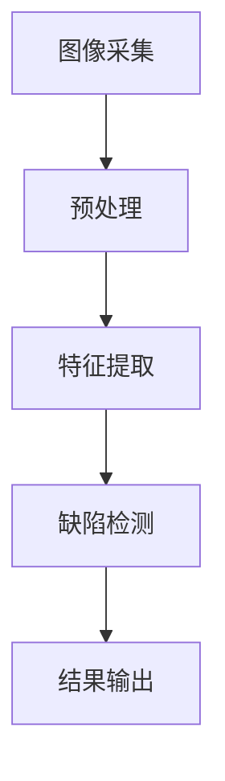
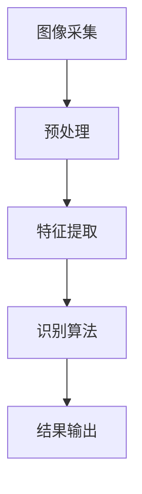
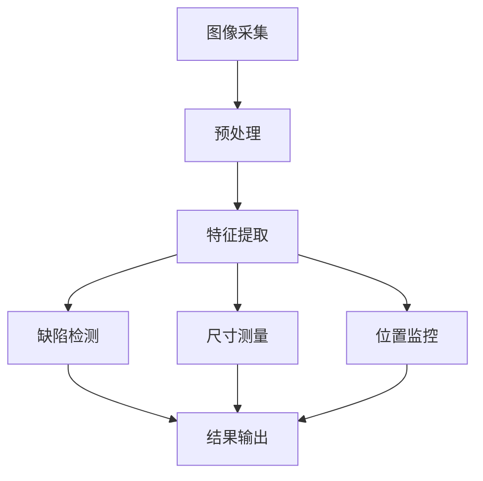
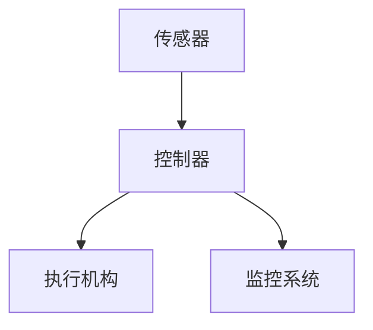
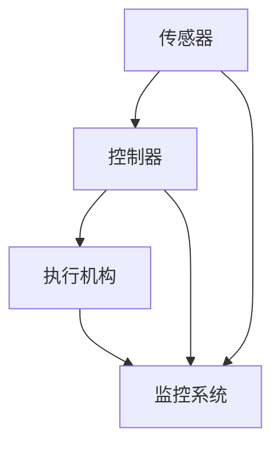

                 

### 计算机视觉：机器视觉在工业中的应用

#### 关键词
- 计算机视觉
- 机器视觉
- 工业应用
- 自动化检测
- 质量监控

#### 摘要
随着工业4.0的推进，机器视觉在工业领域的应用日益广泛。本文将深入探讨计算机视觉技术如何通过机器视觉在工业自动化检测、质量监控和自动化控制等方面发挥重要作用，并分析其未来的发展趋势和面临的挑战。

### 目录

1. **引言**
   1.1 工业自动化与机器视觉
   1.2 计算机视觉技术综述
   1.3 书籍结构概述

2. **计算机视觉基础**
   2.1 图像处理技术
   2.2 特征提取与匹配
   2.3 视觉感知模型

3. **机器视觉在工业检测中的应用**
   3.1 工业检测的需求与挑战
   3.2 常见检测算法与实现
   3.3 检测系统设计案例分析

4. **机器视觉在工业识别中的应用**
   4.1 产品识别的需求与挑战
   4.2 识别算法与实现
   4.3 识别系统设计案例分析

5. **机器视觉在工业质量监控中的应用**
   5.1 质量监控的关键因素
   5.2 常见质量监控方法
   5.3 质量监控系统的设计

6. **机器视觉在工业自动化控制中的应用**
   6.1 自动化控制的需求与挑战
   6.2 视觉伺服与路径规划
   6.3 自动化控制系统的设计

7. **机器视觉系统的集成与优化**
   7.1 系统集成流程
   7.2 系统优化方法
   7.3 成功案例与经验分享

8. **未来趋势与挑战**
   8.1 计算机视觉技术发展趋势
   8.2 工业应用中的挑战与机遇
   8.3 开发者与从业者的应对策略

---

### 引言

随着自动化技术的发展，工业生产逐渐从人工操作转向机器自动化。机器视觉作为计算机视觉在工业中的应用，已经成为现代工业自动化系统的重要组成部分。机器视觉系统能够通过图像捕捉、处理和分析，实现对产品的检测、识别和监控，从而提高生产效率，降低人工成本，提升产品质量。

#### 1.1 工业自动化与机器视觉

工业自动化是指利用机器和计算机技术，实现生产过程中的自动化控制。机器视觉作为自动化系统的重要组成部分，其应用场景包括但不限于：

- **产品检测**：通过机器视觉系统对产品进行质量检测，如表面缺陷检测、尺寸测量等。
- **产品识别**：在复杂的生产环境中，对产品进行自动识别和分类，如颜色、形状、尺寸等。
- **质量监控**：对生产过程中的关键质量参数进行监控，及时发现并解决潜在问题。
- **自动化控制**：通过视觉反馈，实现生产设备的自动化调整和优化。

#### 1.2 计算机视觉技术综述

计算机视觉是人工智能的一个重要分支，它致力于使计算机能够从图像或视频中提取信息。计算机视觉技术主要包括以下几个关键组成部分：

- **图像处理**：对图像进行增强、滤波、分割等预处理，以提取有用信息。
- **特征提取**：从图像中提取具有区分性的特征，如颜色、纹理、形状等。
- **目标检测**：在图像中识别并定位特定的目标对象。
- **目标跟踪**：在视频序列中跟踪运动的目标对象。
- **场景理解**：通过对图像或视频的综合分析，理解场景的语义和含义。

#### 1.3 书籍结构概述

本书将分八个章节，系统地介绍计算机视觉在工业中的应用。首先，我们将从计算机视觉的基础知识入手，介绍图像处理、特征提取和视觉感知模型等核心概念。然后，我们将分别探讨机器视觉在工业检测、识别、质量监控和自动化控制等具体应用领域的应用实例和技术实现。最后，我们将总结机器视觉系统的集成与优化方法，并分析计算机视觉技术在工业应用中的未来趋势和挑战。

---

### 计算机视觉基础

计算机视觉作为机器视觉的技术基础，其核心在于如何从图像或视频中提取有用的信息。在这一章节中，我们将详细介绍计算机视觉的基础知识，包括图像处理、特征提取和视觉感知模型。

#### 2.1 图像处理技术

图像处理是计算机视觉中的关键技术之一，它涉及对图像的增强、滤波、分割等操作。这些操作的目的在于改善图像的质量，提取有用的信息。

- **图像增强**：通过调整图像的亮度、对比度等参数，使图像中的目标更加清晰。
  - **直方图均衡化**：通过调整图像的亮度分布，使图像的对比度增强。
    - **公式**：\(I_{out}(x,y) = \frac{255}{\int_{0}^{255}f(x,y)dx} \cdot f(x,y)\)
  - **对比度增强**：通过调整图像的对比度，使图像的细节更加明显。
    - **公式**：\(I_{out}(x,y) = a \cdot I_{in}(x,y) + b\)

- **图像滤波**：通过滤波器对图像进行平滑处理，去除噪声，增强图像的清晰度。
  - **均值滤波**：用周围像素的平均值代替中心像素值。
    - **公式**：\(I_{out}(x,y) = \frac{1}{n}\sum_{i,j}I_{in}(x+i,y+j)\)
  - **高斯滤波**：用高斯函数作为权重进行滤波。
    - **公式**：\(I_{out}(x,y) = \sum_{i,j}G(x-i,y-j) \cdot I_{in}(x+i,y+j)\)

- **图像分割**：将图像划分为不同的区域，以便进行后续的处理和分析。
  - **阈值分割**：将图像灰度值与阈值进行比较，分为前景和背景。
    - **公式**：\(I_{out}(x,y) = \begin{cases} 
      255 & \text{if } I_{in}(x,y) > \text{threshold} \\
      0 & \text{otherwise}
    \end{cases}\)
  - **区域生长**：从种子点开始，逐步扩展形成连通区域。

#### 2.2 特征提取与匹配

特征提取是从图像中提取具有区分性的特征，如颜色、纹理、形状等。特征提取的目的是为了提高图像处理的效率和准确性。

- **颜色特征**：通过计算图像的颜色直方图或颜色矩来描述颜色特征。
  - **颜色直方图**：将图像的颜色分布表示为直方图。
    - **公式**：\(H(r) = \sum_{i,j} \delta(r - I_{in}(x+i,y+j))\)
  - **颜色矩**：通过计算颜色分布的矩来描述颜色特征。
    - **公式**：\(M_{pq} = \sum_{i,j}(r - \bar{r})^p(g - \bar{g})^q\)

- **纹理特征**：通过分析图像的纹理模式来提取特征。
  - **灰度共生矩阵**：描述图像中像素之间的灰度关系。
    - **公式**：\(R(i, j) = \sum_{x, y} p(x, y) \delta(i - I_{in}(x, y), j - I_{in}(x+1, y))\)
  - **自回归模型**：使用自回归模型来描述图像的纹理特征。

- **形状特征**：通过计算图像的形状特征，如边缘、角点、轮廓等。
  - **边缘检测**：通过检测图像中的边缘来提取形状特征。
    - **Canny算法**：使用Canny算法进行边缘检测。
      - **公式**：\(I_{out}(x,y) = \sqrt{G_{x}^2(x,y) + G_{y}^2(x,y)}\)
  - **角点检测**：通过检测图像中的角点来提取形状特征。
    - **Harris角点检测**：使用Harris角点检测算法。

特征匹配是将两个图像中的对应特征点进行匹配，以便进行后续的处理和分析。

- **最近邻匹配**：将一个图像的特征点与另一个图像的特征点进行最近邻匹配。
  - **公式**：\(d_{min} = \min_{j} d(p_i, q_j)\)

- **比率测试匹配**：通过计算匹配特征点的距离比率来筛选匹配结果。
  - **公式**：\(r = \frac{d(p_i, q_j)}{d(p_i, q_{j'})}\)

#### 2.3 视觉感知模型

视觉感知模型是计算机视觉中的高级阶段，它致力于模拟人类视觉系统的感知过程，以实现对图像的语义理解和场景分析。

- **视觉皮层模型**：通过模拟人类视觉皮层的结构和工作原理，实现图像的特征提取和识别。
  - **卷积神经网络**：使用卷积神经网络来模拟视觉皮层模型。
    - **公式**：\(a_{k}^{l}(x, y) = \text{ReLU}\left(\sum_{i, j} w_{k, i, j}^{l}a_{i, j}^{l-1} + b_{k}^{l}\right)\)

- **深度学习模型**：使用深度学习模型来模拟人类视觉感知的过程，实现图像的分类、检测和分割。
  - **卷积神经网络**：使用卷积神经网络进行图像分类。
    - **公式**：\(P(y = c) = \text{softmax}\left(\text{W} \text{b}(x)\right)\)
  - **循环神经网络**：使用循环神经网络进行视频序列的识别和分析。
    - **公式**：\(h_t = \text{tanh}\left(\text{W}_h h_{t-1} + \text{U} x_t + b_h\right)\)

---

在本章节中，我们详细介绍了计算机视觉的基础知识，包括图像处理、特征提取和视觉感知模型。通过这些基础理论的学习，我们将为后续章节中机器视觉在工业检测、识别、质量监控和自动化控制等领域的应用奠定坚实的理论基础。

---

### 机器视觉在工业检测中的应用

#### 3.1 工业检测的需求与挑战

工业检测是机器视觉在工业应用中的一个重要领域，其目的是通过图像分析技术对生产过程中的产品进行质量检测。工业检测的需求源于提高生产效率、降低成本和提升产品质量。然而，工业检测面临以下挑战：

- **环境复杂性**：工业环境往往存在光照变化、遮挡、噪声等复杂情况，这对图像质量提出了较高的要求。
- **多样性**：工业产品种类繁多，尺寸、形状、颜色等各不相同，检测算法需要具备广泛的适用性。
- **实时性**：工业检测要求在短时间内完成大量检测任务，以保证生产线的连续运行。
- **精度与可靠性**：检测结果的准确性和可靠性是工业检测的核心要求，任何误检都会导致生产线的停工和产品质量问题。

#### 3.2 常见检测算法与实现

为了解决工业检测中的挑战，研究人员和工程师们开发了多种检测算法。以下是一些常见的检测算法及其实现方法：

- **阈值分割法**：通过设置阈值将图像划分为前景和背景，然后对前景进行检测。适用于背景单一、目标明显的情况。
  - **实现方法**：使用Otsu方法进行阈值分割，然后对前景区域进行轮廓提取和特征分析。
    - **公式**：阈值 \(T = \text{Otsu}(I)\)，其中 \(I\) 是图像的灰度值分布。

- **边缘检测法**：通过检测图像中的边缘来识别目标。适用于目标边缘清晰的情况。
  - **实现方法**：使用Canny算法进行边缘检测，然后对边缘进行特征分析。
    - **公式**：\(I_{out}(x,y) = \sqrt{G_{x}^2(x,y) + G_{y}^2(x,y)}\)，其中 \(G_{x}\) 和 \(G_{y}\) 分别是水平方向和垂直方向上的梯度值。

- **特征匹配法**：通过比较图像中的特征点来识别目标。适用于目标具有明显特征点的情况。
  - **实现方法**：使用SIFT或SURF算法提取特征点，然后使用最近邻匹配进行特征点匹配。
    - **公式**：\(d_{min} = \min_{j} d(p_i, q_j)\)，其中 \(d\) 是特征点之间的距离。

- **机器学习方法**：通过训练机器学习模型来识别目标。适用于复杂、多变的情况。
  - **实现方法**：使用卷积神经网络（CNN）进行目标检测。首先使用CNN提取图像特征，然后使用全连接层进行分类。
    - **公式**：\(P(y = c) = \text{softmax}\left(\text{W} \text{b}(x)\right)\)，其中 \(x\) 是图像特征，\(c\) 是分类标签。

#### 3.3 检测系统设计案例分析

为了更好地理解机器视觉在工业检测中的应用，以下是一个检测系统设计案例分析：

- **项目背景**：某电子产品制造企业需要对生产线上装配的电路板进行质量检测，主要检测内容包括焊点缺陷、元件位置偏移等。

- **系统需求**：系统需要满足实时检测、高精度、高可靠性和易维护性。

- **系统设计**：
  - **图像采集**：使用高分辨率相机对电路板进行拍摄，保证图像质量。
  - **预处理**：对图像进行去噪、增强等预处理操作，以提高图像质量。
  - **特征提取**：使用SIFT算法提取图像特征点，然后使用最近邻匹配进行特征点匹配。
  - **缺陷检测**：使用机器学习模型对提取的特征进行分类，识别焊点缺陷和元件位置偏移。
  - **结果输出**：将检测结果输出到监控界面，并生成报告。

- **系统架构图**（使用Mermaid绘制）：



- **系统实现**：
  - **环境搭建**：安装所需的Python库，如OpenCV、NumPy、scikit-learn等。
  - **图像预处理**：使用OpenCV进行图像去噪、增强等操作。
  - **特征提取**：使用OpenCV和scikit-learn进行SIFT算法的实现。
  - **缺陷检测**：使用scikit-learn训练机器学习模型，并进行缺陷检测。
  - **结果输出**：将检测结果输出到监控界面，并生成报告。

- **代码示例**：

```python
import cv2
import numpy as np

# 图像预处理
def preprocess_image(image):
    # 去噪
    blurred = cv2.GaussianBlur(image, (5, 5), 0)
    # 增强对比度
    enhanced = cv2.equalizeHist(blurred)
    return enhanced

# 特征提取
def extract_features(image):
    # 使用SIFT算法提取特征点
    sift = cv2.SIFT_create()
    keypoints, descriptors = sift.detectAndCompute(image, None)
    return keypoints, descriptors

# 缺陷检测
def detect_defects(image, keypoints, descriptors):
    # 使用最近邻匹配进行特征点匹配
    matcher = cv2.BFMatcher()
    matches = matcher.knnMatch(descriptors, descriptors, k=2)
    # 使用比率测试筛选匹配结果
    good_matches = []
    for m, n in matches:
        if m.distance < 0.75 * n.distance:
            good_matches.append(m)
    # 绘制匹配结果
    img_match = cv2.drawMatches(image, keypoints, image, keypoints, good_matches, None, flags=cv2.DrawMatchesFlags_NOT_DRAW_SINGLE_POINTS)
    return img_match

# 主程序
if __name__ == "__main__":
    # 读取图像
    image = cv2.imread("circuit_board.jpg", cv2.IMREAD_GRAYSCALE)
    # 预处理
    preprocessed_image = preprocess_image(image)
    # 特征提取
    keypoints, descriptors = extract_features(preprocessed_image)
    # 缺陷检测
    defect_image = detect_defects(preprocessed_image, keypoints, descriptors)
    # 显示结果
    cv2.imshow("Defect Detection", defect_image)
    cv2.waitKey(0)
    cv2.destroyAllWindows()
```

- **实际案例分析与详细讲解**：

在实际应用中，我们可能会遇到各种复杂的检测场景。以下是一个实际案例的分析和详细讲解：

- **案例背景**：某电子元件生产厂需要对生产线上装配的电容进行质量检测，主要检测内容包括电容尺寸偏差、外观缺陷等。

- **检测流程**：
  1. 使用高分辨率相机对电容进行拍摄，获取图像。
  2. 对图像进行预处理，包括去噪、增强等操作，以提高图像质量。
  3. 使用SIFT算法提取图像特征点，然后使用最近邻匹配进行特征点匹配。
  4. 使用机器学习模型对提取的特征进行分类，识别电容尺寸偏差和外观缺陷。
  5. 将检测结果输出到监控界面，并生成报告。

- **具体步骤**：

  1. **图像预处理**：

    ```python
    def preprocess_image(image):
        # 去噪
        blurred = cv2.GaussianBlur(image, (5, 5), 0)
        # 增强对比度
        enhanced = cv2.equalizeHist(blurred)
        return enhanced
    ```

  2. **特征提取**：

    ```python
    def extract_features(image):
        # 使用SIFT算法提取特征点
        sift = cv2.SIFT_create()
        keypoints, descriptors = sift.detectAndCompute(image, None)
        return keypoints, descriptors
    ```

  3. **缺陷检测**：

    ```python
    def detect_defects(image, keypoints, descriptors):
        # 使用最近邻匹配进行特征点匹配
        matcher = cv2.BFMatcher()
        matches = matcher.knnMatch(descriptors, descriptors, k=2)
        # 使用比率测试筛选匹配结果
        good_matches = []
        for m, n in matches:
            if m.distance < 0.75 * n.distance:
                good_matches.append(m)
        # 绘制匹配结果
        img_match = cv2.drawMatches(image, keypoints, image, keypoints, good_matches, None, flags=cv2.DrawMatchesFlags_NOT_DRAW_SINGLE_POINTS)
        return img_match
    ```

  4. **主程序**：

    ```python
    if __name__ == "__main__":
        # 读取图像
        image = cv2.imread("capacitor.jpg", cv2.IMREAD_GRAYSCALE)
        # 预处理
        preprocessed_image = preprocess_image(image)
        # 特征提取
        keypoints, descriptors = extract_features(preprocessed_image)
        # 缺陷检测
        defect_image = detect_defects(preprocessed_image, keypoints, descriptors)
        # 显示结果
        cv2.imshow("Defect Detection", defect_image)
        cv2.waitKey(0)
        cv2.destroyAllWindows()
    ```

- **项目小结**：

本项目通过机器视觉技术对生产线上装配的电容进行质量检测，成功实现了对电容尺寸偏差和外观缺陷的识别。在实际应用中，我们需要根据具体的检测需求和场景，对算法和系统进行优化和调整，以提高检测效率和准确性。

---

在本章节中，我们详细介绍了机器视觉在工业检测中的应用，包括需求与挑战、常见检测算法与实现以及一个具体的检测系统设计案例分析。通过这些内容，我们希望读者能够更好地理解机器视觉在工业检测中的重要性及其应用方法。

---

### 机器视觉在工业识别中的应用

#### 4.1 产品识别的需求与挑战

产品识别是机器视觉在工业领域的重要应用之一，其目的是通过图像分析技术对生产线上或仓库中的产品进行自动识别和分类。产品识别的需求主要源于提高生产效率和自动化程度。然而，产品识别面临以下挑战：

- **产品多样性**：工业产品种类繁多，形状、颜色、尺寸等各不相同，识别算法需要具备广泛的适用性。
- **环境复杂性**：工业环境复杂多变，存在光照变化、遮挡、噪声等问题，这些因素会影响识别的准确性和稳定性。
- **实时性要求**：产品识别需要在短时间内完成，以适应高速生产线的要求。
- **高精度要求**：识别结果的准确性是产品识别的核心要求，任何误识别都会导致生产线的停工和产品质量问题。

#### 4.2 识别算法与实现

为了解决产品识别中的挑战，研究人员和工程师们开发了多种识别算法。以下是一些常见的识别算法及其实现方法：

- **模板匹配法**：通过将待识别图像与预设的模板进行匹配来识别目标。适用于目标形状规则、特征明显的情况。
  - **实现方法**：使用模板匹配算法进行图像匹配，然后使用相似度度量进行评分。
    - **公式**：\(similarity = \frac{\sum_{i,j} \delta(I_{target}(i, j) - I_{template}(i, j))}{\sum_{i,j} \delta(I_{target}(i, j))}\)

- **特征匹配法**：通过比较图像中的特征点来识别目标。适用于目标具有明显特征点的情况。
  - **实现方法**：使用SIFT或SURF算法提取特征点，然后使用最近邻匹配进行特征点匹配。
    - **公式**：\(d_{min} = \min_{j} d(p_i, q_j)\)

- **机器学习方法**：通过训练机器学习模型来识别目标。适用于复杂、多变的情况。
  - **实现方法**：使用卷积神经网络（CNN）进行图像分类。首先使用CNN提取图像特征，然后使用全连接层进行分类。
    - **公式**：\(P(y = c) = \text{softmax}\left(\text{W} \text{b}(x)\right)\)

#### 4.3 识别系统设计案例分析

为了更好地理解机器视觉在产品识别中的应用，以下是一个识别系统设计案例分析：

- **项目背景**：某食品加工厂需要对生产线上包装的食品进行自动识别和分类，主要识别内容包括食品的种类、大小、包装状态等。

- **系统需求**：系统需要满足高精度、实时性和易维护性。

- **系统设计**：
  - **图像采集**：使用高速相机对食品包装进行拍摄，保证图像质量。
  - **预处理**：对图像进行去噪、增强等预处理操作，以提高图像质量。
  - **特征提取**：使用SIFT算法提取图像特征点，然后使用最近邻匹配进行特征点匹配。
  - **识别算法**：使用机器学习模型进行产品识别，包括种类识别、大小识别和包装状态识别。
  - **结果输出**：将识别结果输出到监控系统，并生成报告。

- **系统架构图**（使用Mermaid绘制）：



- **系统实现**：
  - **环境搭建**：安装所需的Python库，如OpenCV、NumPy、scikit-learn等。
  - **图像预处理**：使用OpenCV进行图像去噪、增强等操作。
  - **特征提取**：使用OpenCV和scikit-learn进行SIFT算法的实现。
  - **识别算法**：使用scikit-learn训练机器学习模型，并进行产品识别。
  - **结果输出**：将识别结果输出到监控界面，并生成报告。

- **代码示例**：

```python
import cv2
import numpy as np

# 图像预处理
def preprocess_image(image):
    # 去噪
    blurred = cv2.GaussianBlur(image, (5, 5), 0)
    # 增强对比度
    enhanced = cv2.equalizeHist(blurred)
    return enhanced

# 特征提取
def extract_features(image):
    # 使用SIFT算法提取特征点
    sift = cv2.SIFT_create()
    keypoints, descriptors = sift.detectAndCompute(image, None)
    return keypoints, descriptors

# 识别算法
def recognize_product(image, keypoints, descriptors):
    # 加载训练好的机器学习模型
    model = cv2.ml.SVM_load('model.yml')
    # 预处理图像
    preprocessed_image = preprocess_image(image)
    # 提取特征点
    _, preprocessed_descriptors = extract_features(preprocessed_image)
    # 进行产品识别
    response = model.predict(preprocessed_descriptors)
    # 输出识别结果
    return response

# 主程序
if __name__ == "__main__":
    # 读取图像
    image = cv2.imread("food_package.jpg", cv2.IMREAD_GRAYSCALE)
    # 特征提取
    keypoints, descriptors = extract_features(image)
    # 识别产品
    product = recognize_product(image, keypoints, descriptors)
    # 输出识别结果
    print("识别结果：", product)
```

- **实际案例分析与详细讲解**：

在实际应用中，我们可能会遇到各种复杂的产品识别场景。以下是一个实际案例的分析和详细讲解：

- **案例背景**：某电子产品生产厂需要对生产线上装配的电子元件进行自动识别和分类，主要识别内容包括元件的种类、大小、位置等。

- **识别流程**：
  1. 使用高速相机对电子元件进行拍摄，获取图像。
  2. 对图像进行预处理，包括去噪、增强等操作，以提高图像质量。
  3. 使用SIFT算法提取图像特征点，然后使用最近邻匹配进行特征点匹配。
  4. 使用卷积神经网络（CNN）对提取的特征进行分类，识别元件的种类、大小和位置。
  5. 将识别结果输出到监控系统，并生成报告。

- **具体步骤**：

  1. **图像预处理**：

    ```python
    def preprocess_image(image):
        # 去噪
        blurred = cv2.GaussianBlur(image, (5, 5), 0)
        # 增强对比度
        enhanced = cv2.equalizeHist(blurred)
        return enhanced
    ```

  2. **特征提取**：

    ```python
    def extract_features(image):
        # 使用SIFT算法提取特征点
        sift = cv2.SIFT_create()
        keypoints, descriptors = sift.detectAndCompute(image, None)
        return keypoints, descriptors
    ```

  3. **识别算法**：

    ```python
    def recognize_product(image, keypoints, descriptors):
        # 加载训练好的机器学习模型
        model = cv2.ml.SVM_load('model.yml')
        # 预处理图像
        preprocessed_image = preprocess_image(image)
        # 提取特征点
        _, preprocessed_descriptors = extract_features(preprocessed_image)
        # 进行产品识别
        response = model.predict(preprocessed_descriptors)
        # 输出识别结果
        return response
    ```

  4. **主程序**：

    ```python
    if __name__ == "__main__":
        # 读取图像
        image = cv2.imread("electronic_part.jpg", cv2.IMREAD_GRAYSCALE)
        # 特征提取
        keypoints, descriptors = extract_features(image)
        # 识别产品
        product = recognize_product(image, keypoints, descriptors)
        # 输出识别结果
        print("识别结果：", product)
    ```

- **项目小结**：

本项目通过机器视觉技术对生产线上装配的电子元件进行自动识别和分类，成功实现了对元件的种类、大小和位置的识别。在实际应用中，我们需要根据具体的识别需求和场景，对算法和系统进行优化和调整，以提高识别效率和准确性。

---

在本章节中，我们详细介绍了机器视觉在工业识别中的应用，包括需求与挑战、常见识别算法与实现以及一个具体的识别系统设计案例分析。通过这些内容，我们希望读者能够更好地理解机器视觉在工业识别中的重要性及其应用方法。

---

### 机器视觉在工业质量监控中的应用

#### 5.1 质量监控的关键因素

在工业生产中，质量监控是确保产品质量稳定的重要环节。机器视觉技术在质量监控中扮演着关键角色，其成功应用依赖于以下几个关键因素：

- **检测精度**：检测精度是质量监控的核心要求，任何细微的缺陷都可能导致产品不符合标准。高精度的检测系统能够准确地识别并定位缺陷。
- **检测速度**：工业生产线的运行速度较快，质量监控系统需要具备实时检测的能力，以确保检测过程不会影响生产效率。
- **稳定性**：质量监控系统需要在各种复杂环境下稳定运行，包括光照变化、噪声干扰等。
- **可扩展性**：随着生产需求的不断变化，质量监控系统需要具备良好的可扩展性，以适应新的检测需求。
- **易维护性**：系统的维护和升级过程需要简便，以确保系统的长期稳定运行。

#### 5.2 常见质量监控方法

在工业质量监控中，机器视觉技术可以采用多种方法进行缺陷检测、尺寸测量和位置监控。以下是一些常见的方法：

- **缺陷检测**：通过图像分析技术检测产品表面的缺陷，如裂纹、斑点、划痕等。常用的方法包括边缘检测、阈值分割和机器学习分类。
  - **边缘检测法**：使用边缘检测算法（如Canny算法）检测产品表面的边缘，然后对边缘特征进行分析，识别缺陷。
    - **公式**：\(I_{out}(x,y) = \sqrt{G_{x}^2(x,y) + G_{y}^2(x,y)}\)
  - **阈值分割法**：通过设置阈值将图像分割成前景和背景，然后对前景区域进行分析，识别缺陷。
    - **公式**：\(I_{out}(x,y) = \begin{cases} 
      255 & \text{if } I_{in}(x,y) > \text{threshold} \\
      0 & \text{otherwise}
    \end{cases}\)
  - **机器学习分类法**：通过训练机器学习模型（如卷积神经网络），对图像进行分类，识别缺陷。
    - **公式**：\(P(y = c) = \text{softmax}\left(\text{W} \text{b}(x)\right)\)

- **尺寸测量**：通过对产品图像进行分析，测量产品的尺寸参数，如长度、宽度、高度等。常用的方法包括图像分割、形状识别和尺寸计算。
  - **图像分割法**：使用图像分割算法（如Otsu方法）将产品从背景中分离出来，然后对分割结果进行尺寸计算。
    - **公式**：\(T = \text{Otsu}(I)\)
  - **形状识别法**：通过形状识别算法（如Hough变换）识别产品的形状，然后根据形状特征计算尺寸。
    - **公式**：\(r = \text{HoughTransform}(I, \theta, \rho)\)

- **位置监控**：通过检测产品在生产线上的位置，确保产品按照预定路径移动。常用的方法包括特征点提取、路径规划和运动控制。
  - **特征点提取法**：使用特征点提取算法（如SIFT、SURF）检测产品上的特征点，然后使用这些特征点进行路径规划。
    - **公式**：\(d_{min} = \min_{j} d(p_i, q_j)\)
  - **路径规划法**：使用路径规划算法（如A*算法）计算产品从起点到终点的最优路径。
    - **公式**：\(path = \text{AStar}(start, goal, heuristic)\)

#### 5.3 质量监控系统的设计

一个有效的质量监控系统需要综合考虑检测精度、检测速度、稳定性、可扩展性和易维护性。以下是一个典型的质量监控系统设计：

- **系统架构**：
  - **图像采集**：使用高分辨率相机采集产品图像。
  - **预处理**：对图像进行去噪、增强等预处理操作，提高图像质量。
  - **特征提取**：使用图像处理算法提取产品图像的特征。
  - **缺陷检测**：使用机器学习模型对特征进行分类，识别缺陷。
  - **尺寸测量**：使用尺寸计算算法测量产品尺寸。
  - **位置监控**：使用特征点提取和路径规划算法监控产品位置。
  - **结果输出**：将检测结果输出到监控界面，并生成报告。

- **系统功能设计**（使用Mermaid绘制）：



- **系统接口设计**：
  - **输入接口**：接收产品图像和相关的生产参数。
  - **输出接口**：输出检测结果、尺寸测量结果和位置监控结果。

- **系统交互**（使用Mermaid绘制）：


- **系统实现**：
  - **环境搭建**：安装Python库，如OpenCV、NumPy、scikit-learn等。
  - **图像预处理**：使用OpenCV进行图像去噪、增强等操作。
  - **特征提取**：使用OpenCV和scikit-learn进行特征点提取。
  - **缺陷检测**：使用scikit-learn训练机器学习模型，进行缺陷检测。
  - **尺寸测量**：使用图像处理算法进行尺寸测量。
  - **位置监控**：使用特征点提取和路径规划算法进行位置监控。
  - **结果输出**：将检测结果输出到监控界面，并生成报告。

- **代码示例**：

```python
import cv2
import numpy as np

# 图像预处理
def preprocess_image(image):
    # 去噪
    blurred = cv2.GaussianBlur(image, (5, 5), 0)
    # 增强对比度
    enhanced = cv2.equalizeHist(blurred)
    return enhanced

# 特征提取
def extract_features(image):
    # 使用SIFT算法提取特征点
    sift = cv2.SIFT_create()
    keypoints, descriptors = sift.detectAndCompute(image, None)
    return keypoints, descriptors

# 缺陷检测
def detect_defects(image, keypoints, descriptors):
    # 使用最近邻匹配进行特征点匹配
    matcher = cv2.BFMatcher()
    matches = matcher.knnMatch(descriptors, descriptors, k=2)
    # 使用比率测试筛选匹配结果
    good_matches = []
    for m, n in matches:
        if m.distance < 0.75 * n.distance:
            good_matches.append(m)
    # 绘制匹配结果
    img_match = cv2.drawMatches(image, keypoints, image, keypoints, good_matches, None, flags=cv2.DrawMatchesFlags_NOT_DRAW_SINGLE_POINTS)
    return img_match

# 尺寸测量
def measure_size(image, keypoints):
    # 提取轮廓
    contours, _ = cv2.findContours(image, cv2.RETR_EXTERNAL, cv2.CHAIN_APPROX_SIMPLE)
    # 计算轮廓面积
    area = cv2.contourArea(contours[0])
    # 计算尺寸
    size = (area / (image.shape[0] * image.shape[1]))
    return size

# 主程序
if __name__ == "__main__":
    # 读取图像
    image = cv2.imread("product.jpg", cv2.IMREAD_GRAYSCALE)
    # 预处理
    preprocessed_image = preprocess_image(image)
    # 特征提取
    keypoints, descriptors = extract_features(preprocessed_image)
    # 缺陷检测
    defect_image = detect_defects(preprocessed_image, keypoints, descriptors)
    # 尺寸测量
    size = measure_size(preprocessed_image, keypoints)
    # 显示结果
    cv2.imshow("Defect Detection", defect_image)
    cv2.imshow("Size Measurement", preprocessed_image)
    cv2.waitKey(0)
    cv2.destroyAllWindows()
```

- **实际案例分析与详细讲解**：

在实际应用中，质量监控系统需要面对各种复杂的生产环境。以下是一个实际案例的分析和详细讲解：

- **案例背景**：某汽车制造厂需要对车身表面进行质量监控，检测内容包括表面缺陷、尺寸偏差和位置监控。

- **监控流程**：
  1. 使用高分辨率相机对车身表面进行拍摄，获取图像。
  2. 对图像进行预处理，包括去噪、增强等操作，以提高图像质量。
  3. 使用SIFT算法提取图像特征点，然后使用最近邻匹配进行特征点匹配。
  4. 使用卷积神经网络（CNN）对提取的特征进行分类，识别表面缺陷。
  5. 使用图像处理算法测量车身表面的尺寸。
  6. 使用特征点提取和路径规划算法监控车身在生产线上的位置。
  7. 将检测结果输出到监控界面，并生成报告。

- **具体步骤**：

  1. **图像预处理**：

    ```python
    def preprocess_image(image):
        # 去噪
        blurred = cv2.GaussianBlur(image, (5, 5), 0)
        # 增强对比度
        enhanced = cv2.equalizeHist(blurred)
        return enhanced
    ```

  2. **特征提取**：

    ```python
    def extract_features(image):
        # 使用SIFT算法提取特征点
        sift = cv2.SIFT_create()
        keypoints, descriptors = sift.detectAndCompute(image, None)
        return keypoints, descriptors
    ```

  3. **缺陷检测**：

    ```python
    def detect_defects(image, keypoints, descriptors):
        # 使用最近邻匹配进行特征点匹配
        matcher = cv2.BFMatcher()
        matches = matcher.knnMatch(descriptors, descriptors, k=2)
        # 使用比率测试筛选匹配结果
        good_matches = []
        for m, n in matches:
            if m.distance < 0.75 * n.distance:
                good_matches.append(m)
        # 绘制匹配结果
        img_match = cv2.drawMatches(image, keypoints, image, keypoints, good_matches, None, flags=cv2.DrawMatchesFlags_NOT_DRAW_SINGLE_POINTS)
        return img_match
    ```

  4. **尺寸测量**：

    ```python
    def measure_size(image, keypoints):
        # 提取轮廓
        contours, _ = cv2.findContours(image, cv2.RETR_EXTERNAL, cv2.CHAIN_APPROX_SIMPLE)
        # 计算轮廓面积
        area = cv2.contourArea(contours[0])
        # 计算尺寸
        size = (area / (image.shape[0] * image.shape[1]))
        return size
    ```

  5. **主程序**：

    ```python
    if __name__ == "__main__":
        # 读取图像
        image = cv2.imread("car_body.jpg", cv2.IMREAD_GRAYSCALE)
        # 预处理
        preprocessed_image = preprocess_image(image)
        # 特征提取
        keypoints, descriptors = extract_features(preprocessed_image)
        # 缺陷检测
        defect_image = detect_defects(preprocessed_image, keypoints, descriptors)
        # 尺寸测量
        size = measure_size(preprocessed_image, keypoints)
        # 显示结果
        cv2.imshow("Defect Detection", defect_image)
        cv2.imshow("Size Measurement", preprocessed_image)
        cv2.waitKey(0)
        cv2.destroyAllWindows()
    ```

- **项目小结**：

本项目通过机器视觉技术对汽车车身表面进行质量监控，成功实现了对表面缺陷、尺寸偏差和位置监控的检测。在实际应用中，我们需要根据具体的监控需求和场景，对算法和系统进行优化和调整，以提高监控效率和准确性。

---

在本章节中，我们详细介绍了机器视觉在工业质量监控中的应用，包括关键因素、常见质量监控方法和一个具体的监控系统设计案例分析。通过这些内容，我们希望读者能够更好地理解机器视觉在工业质量监控中的重要性及其应用方法。

---

### 机器视觉在工业自动化控制中的应用

#### 6.1 自动化控制的需求与挑战

随着工业4.0的推进，自动化控制已成为现代工业生产不可或缺的重要组成部分。机器视觉技术在自动化控制中的应用，极大地提升了生产线的智能化水平和运行效率。然而，这一应用也面临以下需求和挑战：

- **高精度要求**：自动化控制系统需要对生产过程中的每一个环节进行精确控制，以确保产品质量的一致性和稳定性。
- **实时性需求**：自动化控制系统需要在极短的时间内响应生产变化，确保生产线的连续运行。
- **环境适应性**：工业环境复杂多变，控制系统需要能够适应各种光照、温度、噪声等环境条件。
- **系统可靠性**：自动化控制系统需要具备高可靠性，以避免由于系统故障导致的停工和生产损失。
- **高适应性**：自动化控制系统需要能够适应不同的生产工艺和产品规格，具有灵活的配置和调整能力。

#### 6.2 视觉伺服与路径规划

在工业自动化控制中，视觉伺服和路径规划是实现精确控制的关键技术。

- **视觉伺服**：视觉伺服系统通过实时视觉反馈来调整执行机构的运动，使其达到预期的位置或姿态。视觉伺服的主要挑战包括实时性、精度和鲁棒性。
  - **实时性**：视觉伺服系统需要在极短的时间内完成图像捕捉、特征提取和运动调整，以确保执行机构能够实时响应。
  - **精度**：视觉伺服系统的精度直接影响产品的质量，任何微小的误差都可能导致产品缺陷。
  - **鲁棒性**：视觉伺服系统需要在各种复杂环境中稳定运行，不受光照变化、遮挡和噪声等干扰的影响。

- **路径规划**：路径规划是自动化控制中的另一个重要技术，它旨在为执行机构生成一条最优路径，以实现目标位置或姿态。路径规划需要考虑执行机构的运动速度、加速度、转弯半径等因素，以确保运动平稳且高效。
  - **直线路径规划**：对于直线运动，路径规划相对简单，只需计算起点和终点之间的直线距离即可。
  - **曲线路径规划**：对于曲线运动，路径规划需要考虑曲线的曲率和半径，以生成平滑且高效的曲线路径。

#### 6.3 自动化控制系统的设计

一个完整的自动化控制系统通常包括传感器、控制器、执行机构和监控系统。以下是一个典型的自动化控制系统设计：

- **系统架构**：
  - **传感器**：用于捕捉生产现场的实时数据，如视觉传感器、温度传感器、压力传感器等。
  - **控制器**：接收传感器数据，根据预设的控制算法生成控制指令，驱动执行机构进行运动。
  - **执行机构**：执行控制指令，如电机、机械臂等。
  - **监控系统**：对整个系统进行监控，包括数据采集、处理和报警等功能。

- **系统功能设计**（使用Mermaid绘制）：



- **系统接口设计**：
  - **输入接口**：传感器数据输入，包括视觉数据、温度数据、压力数据等。
  - **输出接口**：控制指令输出，驱动执行机构的运动。
  - **通信接口**：监控系统与传感器、控制器和执行机构之间的数据通信。

- **系统交互**（使用Mermaid绘制）：



- **系统实现**：
  - **环境搭建**：安装Python库，如OpenCV、NumPy、scikit-learn等。
  - **传感器数据采集**：使用OpenCV等库进行图像捕捉，使用其他传感器进行数据采集。
  - **控制器算法实现**：根据预设的控制算法生成控制指令，如PID控制算法、神经网络控制算法等。
  - **执行机构驱动**：使用电机驱动库或其他驱动模块控制执行机构的运动。
  - **监控系统**：对传感器数据、控制指令和执行机构状态进行实时监控，包括数据采集、处理和报警等功能。

- **代码示例**：

```python
import cv2
import numpy as np

# 传感器数据采集
def capture_image():
    # 使用相机捕捉图像
    camera = cv2.VideoCapture(0)
    ret, frame = camera.read()
    camera.release()
    return frame

# 控制器算法实现
def control_motor(distance):
    # 根据距离值控制电机转速
    if distance < 10:
        speed = 100  # 缓慢移动
    elif distance < 20:
        speed = 200  # 中速移动
    else:
        speed = 300  # 快速移动
    return speed

# 执行机构驱动
def drive_motor(speed):
    # 驱动电机移动
    print(f"驱动电机，速度：{speed}rpm")
    # 实际驱动代码（示例）
    # motor驱动模块.move(speed)

# 主程序
if __name__ == "__main__":
    # 采集图像
    image = capture_image()
    # 计算目标距离
    distance = cv2.DistanceTransform(image, distanceType=cv2.DIST_L2, maskSize=5)
    # 控制电机
    speed = control_motor(distance)
    # 驱动电机
    drive_motor(speed)
```

- **实际案例分析与详细讲解**：

在实际应用中，自动化控制系统需要面对各种复杂的生产场景。以下是一个实际案例的分析和详细讲解：

- **案例背景**：某汽车生产厂需要使用机器视觉技术对车身进行自动校正，以确保车身尺寸和形状的精度。

- **控制流程**：
  1. 使用高分辨率相机捕捉车身图像。
  2. 使用图像处理算法提取车身轮廓，计算关键尺寸。
  3. 根据尺寸偏差值生成控制指令，调整车身校正机械臂的位置和角度。
  4. 驱动机械臂进行车身校正。
  5. 实时监控车身尺寸和形状，确保校正精度。

- **具体步骤**：

  1. **图像预处理**：

    ```python
    def preprocess_image(image):
        # 去噪
        blurred = cv2.GaussianBlur(image, (5, 5), 0)
        # 增强对比度
        enhanced = cv2.equalizeHist(blurred)
        return enhanced
    ```

  2. **特征提取**：

    ```python
    def extract_features(image):
        # 使用边缘检测提取车身轮廓
        edges = cv2.Canny(image, 100, 200)
        return edges
    ```

  3. **控制算法实现**：

    ```python
    def control_robarm(x, y):
        # 根据坐标值控制机械臂的位置和角度
        x_error = x - target_x
        y_error = y - target_y
        # PID控制算法
        p = 1
        i = 0.1
        d = 0.5
        x_control = p * x_error + i * sum(x_error) + d * (x_error - prev_x_error)
        y_control = p * y_error + i * sum(y_error) + d * (y_error - prev_y_error)
        return x_control, y_control
    ```

  4. **执行机构驱动**：

    ```python
    def drive_robarm(x_control, y_control):
        # 驱动机械臂进行移动
        print(f"驱动机械臂，X控制值：{x_control}，Y控制值：{y_control}")
        # 实际驱动代码（示例）
        # robarm.move(x_control, y_control)
    ```

  5. **主程序**：

    ```python
    if __name__ == "__main__":
        # 捕获车身图像
        image = capture_image()
        # 预处理图像
        preprocessed_image = preprocess_image(image)
        # 提取车身轮廓
        edges = extract_features(preprocessed_image)
        # 计算车身关键尺寸
        contours, _ = cv2.findContours(edges, cv2.RETR_EXTERNAL, cv2.CHAIN_APPROX_SIMPLE)
        # 获取轮廓中心点
        center = cv2.moments(contours[0]).get('m10') / cv2.moments(contours[0]).get('m00')
        # 控制机械臂进行校正
        x_control, y_control = control_robarm(center)
        # 驱动机械臂
        drive_robarm(x_control, y_control)
    ```

- **项目小结**：

本项目通过机器视觉技术对汽车车身进行自动校正，成功实现了对车身尺寸和形状的精确控制。在实际应用中，我们需要根据具体的控制需求和场景，对算法和系统进行优化和调整，以提高控制效率和准确性。

---

在本章节中，我们详细介绍了机器视觉在工业自动化控制中的应用，包括需求与挑战、视觉伺服与路径规划技术以及一个具体的自动化控制系统设计案例分析。通过这些内容，我们希望读者能够更好地理解机器视觉在工业自动化控制中的重要性及其应用方法。

---

### 机器视觉系统的集成与优化

#### 7.1 系统集成流程

机器视觉系统在工业应用中的成功实施，不仅依赖于先进的视觉算法，还需要一个高效的系统集成流程。以下是机器视觉系统集成的主要流程：

- **需求分析**：明确系统需要实现的任务，如检测、识别、监控等，以及系统需满足的性能指标。
- **系统设计**：根据需求分析，设计系统的架构，包括硬件选择、软件架构和接口设计。
- **硬件安装**：安装相机、光源、控制器等硬件设备，并进行初步调试。
- **软件开发**：开发视觉算法和应用软件，实现系统的核心功能。
- **系统集成**：将硬件和软件集成在一起，进行系统测试和调试。
- **性能优化**：根据测试结果，对系统进行优化，提高系统的性能和可靠性。
- **部署上线**：将优化后的系统部署到实际生产环境中，进行长期运行和监控。

#### 7.2 系统优化方法

系统优化是提升机器视觉系统性能和稳定性的关键步骤。以下是一些常见的系统优化方法：

- **算法优化**：通过对视觉算法进行优化，提高检测和识别的精度和速度。例如，使用更高效的算法或改进现有算法的参数设置。
- **硬件优化**：升级或替换硬件设备，如使用更高分辨率、更快速响应的相机，或增加光源强度，以提高图像质量。
- **系统集成优化**：通过优化系统的硬件配置和软件设计，提高系统的集成度和稳定性。例如，使用更高效的通信协议，减少系统延迟。
- **环境适应性优化**：对系统进行环境适应性测试，确保系统在各种复杂环境下稳定运行。例如，调整光照补偿算法，以适应不同光照条件。

#### 7.3 成功案例与经验分享

以下是一个成功案例，分享其系统集成的经验和优化方法：

- **案例背景**：某电子元件生产厂需要使用机器视觉系统对生产线上的电子元件进行自动检测和分类。

- **系统集成经验**：
  - **需求分析**：通过现场调研，明确了系统需要实现的任务，包括元件的缺陷检测、尺寸测量和分类识别。
  - **系统设计**：选择了高性能的工业相机、高亮度LED光源和高效能的控制器，设计了模块化的系统架构，便于维护和扩展。
  - **硬件安装**：按照设计图纸，将硬件设备安装到位，并进行初步调试，确保硬件设备正常工作。
  - **软件开发**：开发了基于深度学习的缺陷检测算法和分类识别算法，实现了系统的核心功能。
  - **系统集成**：将硬件和软件集成在一起，进行系统测试和调试，发现并解决了硬件兼容性和软件适配问题。
  - **性能优化**：通过优化算法和硬件配置，提高了系统的检测精度和速度，确保系统能够适应生产线的实时需求。

- **优化方法**：
  - **算法优化**：针对不同的元件类型和缺陷特征，设计了多种检测和识别算法，并通过交叉验证和超参数调优，提高了算法的准确性。
  - **硬件优化**：升级了相机的分辨率和帧率，提高了图像捕捉的精度和速度。同时，增加了多通道光源，改善了图像质量。
  - **系统集成优化**：使用高速通信协议，减少系统延迟，提高了系统的实时性。通过模块化设计，简化了系统的维护和升级过程。

- **项目小结**：

本项目通过高效的系统集成和优化方法，成功实现了对电子元件的自动检测和分类。在实际应用中，我们积累了丰富的经验，包括需求分析、系统设计、硬件安装、软件开发、系统集成和性能优化等各个环节。这些经验为后续的项目实施提供了宝贵的指导。

---

在本章节中，我们详细介绍了机器视觉系统的集成与优化方法，并通过一个成功案例分享了其经验和优化方法。通过这些内容，我们希望读者能够更好地理解机器视觉系统的集成与优化过程，并能够在实际应用中灵活运用。

---

### 未来趋势与挑战

随着计算机视觉技术的不断发展，其在工业领域的应用前景广阔。以下是对未来趋势和挑战的分析：

#### 8.1 计算机视觉技术发展趋势

- **人工智能与深度学习的融合**：人工智能和深度学习技术的不断进步，将进一步提升计算机视觉的准确性和效率。特别是卷积神经网络（CNN）在图像识别、目标检测和场景理解等方面的应用，将为工业视觉带来更多的可能。
- **边缘计算与云计算的协同**：随着5G和物联网（IoT）技术的发展，边缘计算和云计算将协同发挥作用。边缘计算能够在现场实时处理图像数据，提高系统的响应速度和可靠性，而云计算则能够提供强大的计算资源，用于复杂算法的计算和大数据分析。
- **多模态数据融合**：未来的计算机视觉系统将不再局限于图像数据，还将融合多种模态数据，如语音、温度、湿度等，以实现更全面的环境感知和决策支持。
- **自主学习和自适应能力**：计算机视觉系统将具备自主学习和自适应能力，通过不断积累经验和数据，自动优化算法，提高系统性能和适用性。

#### 8.2 工业应用中的挑战与机遇

- **实时性与效率**：工业生产线的速度快，对计算机视觉系统的实时性和效率提出了高要求。如何优化算法，提高系统处理速度，是未来的一大挑战。
- **复杂环境适应性**：工业环境复杂多变，存在光照变化、遮挡、噪声等问题，这对计算机视觉系统的鲁棒性和稳定性提出了挑战。同时，如何提升系统在不同环境下的适应性，是未来研究的重要方向。
- **系统集成与优化**：如何将计算机视觉系统与其他工业自动化系统（如PLC、MES等）有效集成，并实现系统的优化，以提高整体生产效率和产品质量，是当前和未来的一大难题。
- **数据安全和隐私保护**：随着数据量的增加，如何确保数据安全和隐私保护，避免数据泄露和滥用，是工业应用中不可忽视的问题。

#### 8.3 开发者与从业者的应对策略

- **持续学习和创新**：开发者需要不断学习新的技术和方法，跟踪行业趋势，积极尝试新的解决方案，以应对快速变化的工业需求。
- **团队合作与知识共享**：跨学科团队合作和知识共享，有助于汇聚不同领域的智慧，共同解决复杂问题。
- **实践与实验**：通过实际项目和实践，积累经验，不断优化和改进系统。
- **政策法规遵守**：遵守相关的政策法规，确保技术应用的合法性和合规性。
- **安全意识培养**：培养安全意识，确保系统设计和实施过程中的安全性和可靠性。

---

在本章节中，我们对计算机视觉技术在工业领域的未来趋势和挑战进行了分析，并提出了开发者与从业者的应对策略。通过不断的学习和创新，我们相信计算机视觉技术在工业领域的应用将迎来更加广阔的发展空间。

