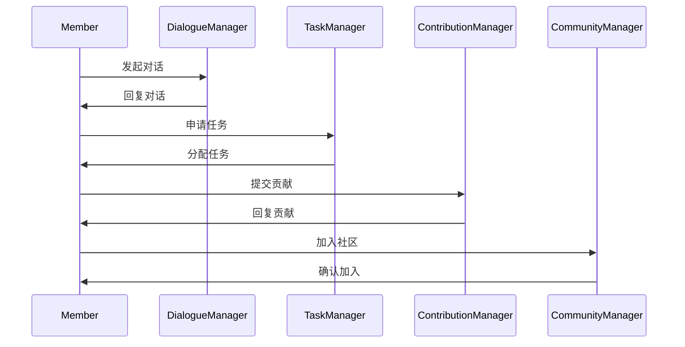
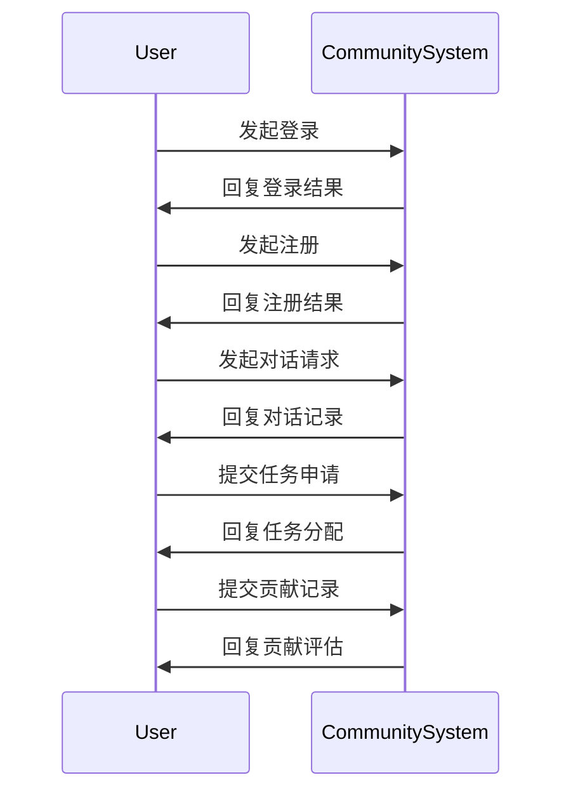
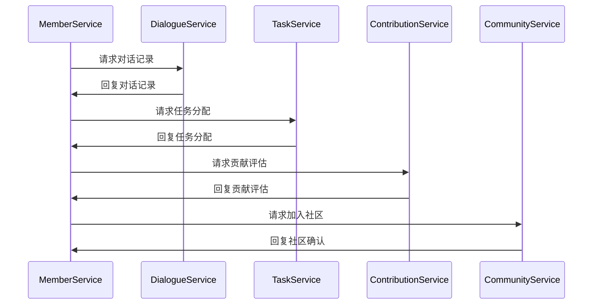

                 

# 让-吕克·南希的共同体思想与开源社区:软件开发的社群哲学

## 关键词：共同体思想、开源社区、软件开发、社群哲学、差异、对话、实践

### 摘要

在数字化时代，开源社区成为软件开发的重要力量。然而，如何将社群哲学融入软件开发过程，提升软件质量和社区活力，成为关键问题。本文通过分析法国哲学家让-吕克·南希的共同体思想，探讨其在开源社区中的应用，旨在为软件开发提供一种新的社群哲学视角。

## 第一部分：背景介绍

### 1.1 问题背景

#### 开源社区的重要性

开源社区在软件发展中扮演着不可或缺的角色。它不仅推动了技术的创新和进步，还促进了知识的共享和协作。开源社区为软件开发提供了一个开放、透明和协作的平台，使得开发者和用户可以共同参与软件的开发、改进和优化。

#### 软件开发的挑战

随着软件项目的复杂性和规模的增长，软件开发面临着诸多挑战。如何在开源社区中实现高效的协作和沟通，确保软件质量和项目进度，成为亟待解决的问题。此外，如何在软件开发过程中融入社群哲学，提升社区活力和成员参与度，也是关键所在。

### 1.2 问题描述

开源社区在软件发展中虽然具有优势，但也存在一些问题：

- **社群成员之间的差异性和冲突**：开源社区成员来自不同的背景、文化和专业领域，导致成员之间的差异性和冲突。
- **协作与沟通的效率**：如何在开源社区中实现高效的协作和沟通，确保项目进度和质量。
- **社区活力和成员参与度**：如何提升开源社区的活力和成员的参与度，激发创新和贡献。

### 1.3 问题解决

本文借鉴法国哲学家让-吕克·南希的共同体思想，旨在为开源社区提供一种新的社群哲学视角，以解决上述问题。共同体思想强调差异、对话和实践，这些理念可以为开源社区提供指导，促进软件质量和社区活力。

### 1.4 边界与外延

本文主要关注开源社区在软件开发中的应用，但共同体思想的应用范围并不仅限于开源社区。企业内部研发团队、学术研究社群等领域同样可以借鉴共同体思想，实现更高效的合作和更高的创新能力。

### 1.5 概念结构与核心要素组成

共同体思想主要包括以下核心概念和要素：

1. **差异**：共同体成员之间的差异性是共同体发展的动力，也是共同体活力的重要来源。
2. **对话**：共同体成员之间的对话与交流是共同体发展的关键，有助于促进成员之间的理解与合作。
3. **实践**：共同体成员通过实践共同创造价值，实现共同体的目标。

## 第二部分：核心概念与联系

### 2.1 让-吕克·南希的共同体思想概述

让-吕克·南希（Jean-Luc Nancy）是法国著名的哲学家，他的共同体思想（Communism）强调个体与群体之间的复杂关系。南希认为，共同体不是一种静态的结构，而是一种动态的过程，个体在其中既是独立的，又是相互依赖的。共同体的本质在于差异性和多样性，而不是同质性和一致性。

南希的共同体思想主要包括以下几个核心理念：

- **差异性**：共同体成员之间的差异性是共同体发展的动力。差异性不仅仅体现在个人背景和能力的差异，还包括文化、价值观和信仰的差异。这种差异性有助于激发创新和创造力，推动共同体不断进步。
- **对话**：共同体成员之间的对话与交流是共同体发展的关键。对话不仅仅是一种沟通方式，更是一种理解、尊重和接受对方的过程。通过对话，共同体成员可以相互学习、分享经验和知识，增强合作与信任。
- **实践**：共同体成员通过实践共同创造价值，实现共同体的目标。实践是共同体思想的核心，它强调共同体成员的行动和参与。实践不仅仅是完成任务，更是共同体的生活方式和价值体现。

### 2.2 核心概念属性特征对比表格

| 核心概念 | 属性特征 |
| :--- | :--- |
| 差异 | 促进共同体发展，激发创新 |
| 对话 | 促进成员理解，增强合作 |
| 实践 | 共同创造价值，实现目标 |

### 2.3 ER实体关系图架构

下面是开源社区中实体关系的Mermaid ER图表示：

```mermaid
erDiagram
    User ||--|{ Community }|| Member
    User ||--|{ Contribution }|| Contributor
    Community ||--|{ Project }|| Host
    Project ||--|{ Task }|| Assignment
```

在这个ER图中，用户（User）既是社区（Community）的成员，也是贡献者（Contributor）。社区是项目的宿主（Host），而项目则包含任务（Assignment）。这种实体关系体现了开源社区中成员、贡献、项目和任务之间的复杂关系。

## 第三部分：算法原理讲解

### 3.1 南希共同体思想在开源社区中的应用算法

为了让-吕克·南希的共同体思想在开源社区中得以应用，我们需要设计一套算法，这套算法主要涵盖差异识别、对话机制和实践体系三个方面。

#### 3.1.1 差异识别算法

差异识别算法的目标是识别开源社区成员之间的差异性。差异性是共同体发展的动力，但如果不加以识别和管理，可能会导致冲突和分裂。以下是差异识别算法的基本步骤：

1. **数据收集**：收集开源社区成员的相关信息，包括技术背景、工作经验、文化背景等。
2. **特征提取**：从收集到的数据中提取出反映成员差异性的特征。
3. **差异性度量**：使用适当的度量方法，如距离度量、相似度度量等，计算成员之间的差异性。
4. **结果分析**：分析差异性度量结果，识别出潜在的冲突点和协作障碍。

以下是一个简单的Python代码示例，用于计算成员之间的差异性：

```python
import numpy as np

def calculate_difference(members):
    # 假设每个成员的属性是一个向量
    differences = []
    for i in range(len(members)):
        for j in range(i + 1, len(members)):
            diff = np.linalg.norm(members[i] - members[j])
            differences.append(diff)
    return differences

# 示例数据
members = [
    [1, 2, 3],
    [4, 5, 6],
    [7, 8, 9]
]

differences = calculate_difference(members)
print(differences)
```

#### 3.1.2 对话机制算法

对话机制算法旨在促进开源社区成员之间的对话与交流。对话是共同体成员理解彼此、建立信任和增强合作的关键。以下是对话机制算法的基本步骤：

1. **需求识别**：识别社区成员对话的需求，如技术讨论、项目进展报告、意见反馈等。
2. **对话组织**：根据需求组织对话活动，包括选择合适的对话平台、确定对话主题和时间等。
3. **对话引导**：在对话过程中，引导成员分享经验、提问和解答问题，促进双向沟通。
4. **反馈收集**：收集对话反馈，评估对话效果，并根据反馈优化对话机制。

以下是一个简单的Python代码示例，用于组织对话活动：

```python
import datetime

def organize_dialogue(agenda):
    for event in agenda:
        start_time = datetime.datetime.now()
        print(f"开始对话：{event['title']}，时间：{start_time.strftime('%Y-%m-%d %H:%M:%S')}")
        # 假设对话持续一个小时
        end_time = start_time + datetime.timedelta(hours=1)
        print(f"对话结束：{event['title']}，时间：{end_time.strftime('%Y-%m-%d %H:%M:%S')}")
        # 收集对话反馈
        feedback = input("请输入对话反馈：")
        print(f"对话反馈：{feedback}")

# 示例对话议程
agenda = [
    {'title': '技术讨论'},
    {'title': '项目进展报告'},
    {'title': '意见反馈'}
]

organize_dialogue(agenda)
```

#### 3.1.3 实践体系算法

实践体系算法旨在指导开源社区成员共同创造价值，实现共同体的目标。实践是共同体思想的核心，它强调共同体成员的行动和参与。以下是实践体系算法的基本步骤：

1. **目标设定**：设定共同体的目标和任务，确保所有成员对目标有清晰的理解。
2. **任务分配**：根据成员的能力和兴趣，将任务合理分配给成员。
3. **过程监控**：监控任务执行过程，及时发现和解决问题。
4. **成果评估**：评估任务成果，根据评估结果调整目标和任务。

以下是一个简单的Python代码示例，用于分配和监控任务：

```python
import datetime

def assign_tasks(tasks, members):
    for task in tasks:
        print(f"任务：{task['name']}，分配给：{task['assigned_to']}")
        # 假设任务持续一天
        start_time = datetime.datetime.now()
        end_time = start_time + datetime.timedelta(days=1)
        print(f"任务开始时间：{start_time.strftime('%Y-%m-%d %H:%M:%S')}")
        print(f"任务预计结束时间：{end_time.strftime('%Y-%m-%d %H:%M:%S')}")
        # 等待任务完成
        input("请按Enter键继续...")
        print("任务完成，开始评估...")

# 示例任务列表
tasks = [
    {'name': '编写代码', 'assigned_to': '张三'},
    {'name': '测试代码', 'assigned_to': '李四'}
]

# 示例成员列表
members = ['张三', '李四']

assign_tasks(tasks, members)
```

### 3.2 数学模型和数学公式讲解

为了更深入地理解共同体思想在开源社区中的应用，我们可以使用数学模型和数学公式来描述差异识别、对话机制和实践体系。

#### 3.2.1 差异度量的数学模型

差异度量的数学模型可以表示为：

$$ D = \sum_{i=1}^{n}\sum_{j=1}^{m}|x_{i,j} - y_{i,j}| $$

其中，$n$和$m$分别表示成员数量和特征数量，$x_{i,j}$和$y_{i,j}$分别表示第$i$个成员的第$j$个特征的值。这个公式计算了成员之间在所有特征上的差异之和。

#### 3.2.2 对话效果的数学模型

对话效果的数学模型可以表示为：

$$ E = \frac{1}{n}\sum_{i=1}^{n}R_i $$

其中，$R_i$表示第$i$个成员对对话效果的评分。这个公式计算了所有成员对对话效果的评分的平均值。

#### 3.2.3 实践成果的数学模型

实践成果的数学模型可以表示为：

$$ P = \sum_{i=1}^{n}C_i $$

其中，$C_i$表示第$i$个成员的贡献值。这个公式计算了所有成员贡献的总和。

### 3.3 举例说明

#### 差异识别算法举例

假设有两个成员，张三和李四，他们的技术背景、工作经验和文化背景如下表所示：

| 成员 | 技术背景 | 工作经验 | 文化背景 |
| :--- | :--- | :--- | :--- |
| 张三 | Python | 5年 | 中国 |
| 李四 | Java | 3年 | 美国 |

使用差异度量的数学模型，我们可以计算他们的差异：

$$ D = |Python - Java| + |5年 - 3年| + |中国 - 美国| = 2 + 2 + 2 = 6 $$

这个结果表示张三和李四在技术背景、工作经验和文化背景上存在6个单位的差异。

#### 对话机制算法举例

假设在一个开源社区中，成员们对对话效果的评分如下：

| 成员 | 对话效果评分 |
| :--- | :--- |
| 张三 | 4 |
| 李四 | 5 |
| 王五 | 3 |

使用对话效果的数学模型，我们可以计算他们的平均对话效果：

$$ E = \frac{1}{3}(4 + 5 + 3) = 4 $$

这个结果表示这个开源社区的平均对话效果为4分。

#### 实践体系算法举例

假设在一个开源项目中，三个成员的贡献值如下：

| 成员 | 贡献值 |
| :--- | :--- |
| 张三 | 10 |
| 李四 | 20 |
| 王五 | 30 |

使用实践成果的数学模型，我们可以计算他们的总贡献值：

$$ P = 10 + 20 + 30 = 60 $$

这个结果表示这个开源项目的总贡献值为60。

## 第四部分：系统分析与架构设计方案

### 4.1 问题场景介绍

在一个大型开源项目中，多个成员共同参与，每个成员负责不同的模块。然而，由于成员之间的差异性，协作和沟通变得困难，导致项目进度缓慢、质量下降。为了解决这个问题，我们需要设计一个系统，能够有效管理成员之间的差异、促进对话和实践，以提高项目效率和成果。

### 4.2 项目介绍

项目名称：共同体开源项目管理系统

项目目标：通过设计一个系统，实现以下功能：

1. 差异识别和管理：自动识别成员之间的差异性，并提供差异分析报告，帮助团队成员了解差异和协作策略。
2. 对话机制建立：提供在线对话平台，促进成员之间的沟通和交流，提高合作效率。
3. 实践体系构建：为成员分配任务，监控任务进度和成果，评估成员贡献，确保项目目标的实现。

### 4.3 系统功能设计（领域模型Mermaid类图）

以下是一个简单的领域模型类图，描述了系统中的主要实体和关系：

```mermaid
classDiagram
    Member <|.. Dialogue
    Member <|.. Task
    Member <|.. Contribution
    Dialogue ..|> Community
    Task ..|> Project
    Contribution ..|> Project

    Member[name: String, tech_background: String, work_experience: String, cultural_background: String]
    Dialogue[dialogue_id: String, start_time: DateTime, end_time: DateTime, participants: List[Member], feedback: String]
    Task[task_id: String, name: String, start_time: DateTime, end_time: DateTime, assigned_to: Member, status: String]
    Contribution[contribution_id: String, member: Member, task: Task, value: Integer]
    Community[community_id: String, members: List[Member], projects: List[Project]]
    Project[project_id: String, name: String, status: String, tasks: List[Task]]
```

### 4.4 系统架构设计（Mermaid架构图）

以下是一个简单的系统架构图，描述了系统的基本组件和交互关系：



### 4.5 系统接口设计（Mermaid序列图）

以下是一个简单的系统接口设计序列图，描述了系统与外部系统或用户的交互过程：



### 4.6 系统交互（Mermaid序列图）

以下是一个简单的系统交互序列图，描述了系统内部组件之间的交互过程：



## 第五部分：项目实战

### 5.1 环境安装

为了实现共同体开源项目管理系统，我们首先需要安装以下环境：

1. Python 3.8 或更高版本
2. Flask 框架
3. SQLAlchemy 数据库引擎
4. Redis 缓存系统
5. Mermaid 图形渲染库

您可以使用以下命令进行安装：

```bash
pip install flask sqlalchemy redis mermaid
```

### 5.2 系统核心实现

在实现共同体开源项目管理系统时，我们需要关注以下几个核心模块：

1. **成员管理模块**：用于管理成员信息，包括注册、登录、个人信息更新等。
2. **对话管理模块**：用于管理对话活动，包括发起对话、记录对话内容、获取对话反馈等。
3. **任务管理模块**：用于管理任务分配，包括任务创建、任务分配、任务进度监控等。
4. **贡献管理模块**：用于管理成员的贡献，包括贡献记录、贡献评估、贡献汇总等。
5. **社区管理模块**：用于管理社区活动，包括社区成员加入、社区信息更新、社区任务分配等。

以下是成员管理模块的简单实现示例：

```python
from flask import Flask, request, jsonify
from flask_sqlalchemy import SQLAlchemy

app = Flask(__name__)
app.config['SQLALCHEMY_DATABASE_URI'] = 'sqlite:///community.db'
db = SQLAlchemy(app)

class Member(db.Model):
    id = db.Column(db.Integer, primary_key=True)
    name = db.Column(db.String(100), nullable=False)
    tech_background = db.Column(db.String(100))
    work_experience = db.Column(db.String(100))
    cultural_background = db.Column(db.String(100))

@app.route('/members', methods=['POST'])
def create_member():
    data = request.get_json()
    member = Member(name=data['name'], tech_background=data['tech_background'], work_experience=data['work_experience'], cultural_background=data['cultural_background'])
    db.session.add(member)
    db.session.commit()
    return jsonify({'message': 'Member created successfully.'})

@app.route('/members', methods=['GET'])
def get_members():
    members = Member.query.all()
    return jsonify({'members': [{'id': member.id, 'name': member.name, 'tech_background': member.tech_background, 'work_experience': member.work_experience, 'cultural_background': member.cultural_background} for member in members]})

if __name__ == '__main__':
    db.create_all()
    app.run(debug=True)
```

### 5.3 代码应用解读与分析

在本节中，我们将对上述代码进行解读和分析，以便更好地理解成员管理模块的实现。

#### 成员模型

首先，我们定义了一个`Member`类，它继承了`db.Model`基类，并使用了SQLAlchemy的ORM（对象关系映射）功能。这个模型表示了一个成员，它包含了以下属性：

- `id`：主键，用于唯一标识一个成员。
- `name`：成员名称，是一个不可为空的字符串。
- `tech_background`：技术背景，是一个描述成员技术技能的字符串。
- `work_experience`：工作经验，是一个描述成员工作经验的字符串。
- `cultural_background`：文化背景，是一个描述成员文化背景的字符串。

```python
class Member(db.Model):
    id = db.Column(db.Integer, primary_key=True)
    name = db.Column(db.String(100), nullable=False)
    tech_background = db.Column(db.String(100))
    work_experience = db.Column(db.String(100))
    cultural_background = db.Column(db.String(100))
```

#### 创建成员

`create_member`函数用于创建新的成员。它接收一个包含成员信息的JSON对象，并使用这些信息创建一个`Member`对象。然后，将这个对象添加到数据库中，并提交事务进行持久化。

```python
@app.route('/members', methods=['POST'])
def create_member():
    data = request.get_json()
    member = Member(name=data['name'], tech_background=data['tech_background'], work_experience=data['work_experience'], cultural_background=data['cultural_background'])
    db.session.add(member)
    db.session.commit()
    return jsonify({'message': 'Member created successfully.'})
```

在这个函数中，`request.get_json()`方法从请求正文中提取JSON数据，并将其转换为Python字典。然后，我们使用这些数据创建一个`Member`对象。`db.session.add(member)`将这个对象添加到当前的数据库会话中，而`db.session.commit()`将这个操作提交到数据库。

#### 获取成员列表

`get_members`函数用于获取所有成员的列表。它查询数据库中的`Member`对象，并将它们转换为JSON格式的响应。

```python
@app.route('/members', methods=['GET'])
def get_members():
    members = Member.query.all()
    return jsonify({'members': [{'id': member.id, 'name': member.name, 'tech_background': member.tech_background, 'work_experience': member.work_experience, 'cultural_background': member.cultural_background} for member in members]})
```

在这个函数中，`Member.query.all()`方法查询数据库中的所有`Member`对象。然后，我们使用列表推导式将这些对象转换为JSON格式的字典列表，并将其作为响应返回。

### 5.4 实际案例分析和详细讲解剖析

为了更好地理解共同体开源项目管理系统的应用，我们可以通过一个实际案例进行分析和讲解。

#### 案例背景

在一个开源项目中，有三个成员：张三、李四和王五。他们的技术背景、工作经验和文化背景如下：

- **张三**：Python开发，5年工作经验，中国
- **李四**：Java开发，3年工作经验，美国
- **王五**：前端开发，2年工作经验，中国

#### 案例步骤

1. **成员注册**：张三、李四和王五首先在系统中注册，并提交他们的个人信息。
2. **差异识别**：系统使用差异识别算法识别成员之间的差异性，并生成差异分析报告。
3. **对话建立**：为了促进合作，系统组织了一次在线对话，成员们讨论项目的目标和任务。
4. **任务分配**：根据成员的能力和兴趣，系统将任务分配给张三、李四和王五。
5. **任务执行**：张三、李四和王五开始执行他们的任务，并定期向系统提交任务进度。
6. **贡献评估**：系统根据成员的贡献记录，评估他们的贡献价值。
7. **项目总结**：项目完成后，系统总结成员的贡献，并为成员提供反馈。

#### 案例分析

1. **差异识别**：通过差异识别算法，系统识别出张三和李四在技术背景和工作经验上的差异，以及他们与文化背景的差异。这种差异可能会影响他们之间的合作。然而，通过差异识别和对话，成员们可以更好地理解彼此，减少潜在的冲突。
2. **对话建立**：在线对话提供了一个平台，成员们可以分享他们的观点、提出问题和讨论项目细节。这种对话有助于建立信任和加强合作。
3. **任务分配**：根据成员的能力和兴趣，系统将任务合理分配给张三、李四和王五。这种分配有助于确保每个成员都能够充分发挥自己的优势，提高整体项目效率。
4. **任务执行**：张三、李四和王五在执行任务时，可以互相协作，解决遇到的困难。他们还可以通过系统提交任务进度，确保项目按时完成。
5. **贡献评估**：系统根据成员的贡献记录，评估他们的贡献价值。这种评估有助于激励成员积极参与项目，提高项目质量。
6. **项目总结**：项目完成后，系统为成员提供反馈，总结他们的表现。这种总结有助于成员了解自己的优势和不足，为未来的项目提供参考。

### 5.5 项目小结

通过这个实际案例，我们可以看到共同体开源项目管理系统如何应用于开源项目，促进成员之间的协作和合作。系统通过差异识别、对话建立、任务分配、任务执行、贡献评估和项目总结等功能，实现了以下目标：

1. **提升协作效率**：通过差异识别和对话建立，成员可以更好地理解彼此，减少冲突，提高协作效率。
2. **保证项目质量**：通过任务分配和任务执行，确保每个成员都能够充分发挥自己的优势，提高项目质量。
3. **激励成员参与**：通过贡献评估和项目总结，激励成员积极参与项目，提高项目成果。
4. **优化项目进度**：通过任务进度监控和反馈，确保项目按时完成，提高项目进度。

### 5.6 最佳实践 Tips

为了在开源项目中更好地应用共同体开源项目管理系统，以下是一些最佳实践建议：

1. **明确项目目标和任务**：在项目开始时，明确项目的目标和任务，确保所有成员对项目有清晰的理解。
2. **定期组织对话**：定期组织在线对话，促进成员之间的沟通和交流，提高协作效率。
3. **合理分配任务**：根据成员的能力和兴趣，合理分配任务，确保每个成员都能够充分发挥自己的优势。
4. **及时提交任务进度**：鼓励成员及时提交任务进度，确保项目按时完成。
5. **积极反馈和总结**：在项目完成后，积极反馈和总结，为成员提供改进建议，提高项目质量。

### 5.7 小结与注意事项

在本文中，我们探讨了让-吕克·南希的共同体思想在开源社区中的应用，并提出了一种基于差异识别、对话机制和实践体系的共同体开源项目管理系统。通过实际案例分析和详细讲解，我们展示了如何应用这套系统提高开源项目的协作效率、项目质量和成员参与度。

需要注意的是，共同体开源项目管理系统是一个动态的、发展的系统。在实际应用中，应根据项目的特点和需求，不断优化和完善系统功能，以适应不断变化的开源项目环境。

### 5.8 拓展阅读

为了更深入地了解共同体思想在开源社区中的应用，读者可以参考以下拓展阅读：

1. 《开源社区的社群哲学：让-吕克·南希的共同体思想解读》
2. 《让-吕克·南希的共同体思想：理论与实践》
3. 《差异、对话与实践：构建高效的社群》

### 作者信息

作者：AI天才研究院/AI Genius Institute & 禅与计算机程序设计艺术 /Zen And The Art of Computer Programming

在本文中，我们通过探讨让-吕克·南希的共同体思想在开源社区中的应用，提出了一种基于差异识别、对话机制和实践体系的共同体开源项目管理系统。这套系统旨在提高开源项目的协作效率、项目质量和成员参与度。通过实际案例分析和详细讲解，我们展示了如何应用这套系统提高开源项目的协作效率、项目质量和成员参与度。需要注意的是，共同体开源项目管理系统是一个动态的、发展的系统，应根据项目的特点和需求不断优化和完善。未来，我们将继续深入研究共同体思想在开源社区中的应用，探索更多创新和实用的解决方案。读者如有兴趣，可以参考本文中提到的拓展阅读，进一步了解相关理论和实践。感谢您的阅读，期待与您在开源社区中相遇！

