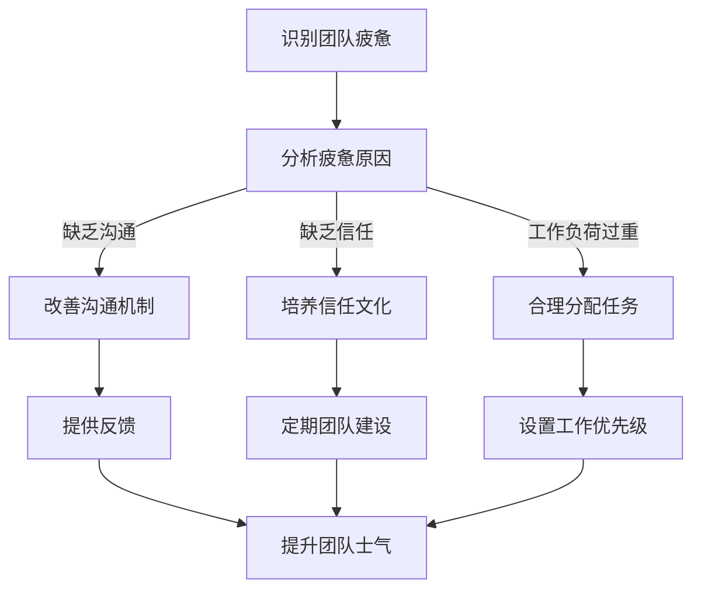

                 


## 文章标题

### 让团队疲惫的坏习惯

## 关键词

- 团队疲惫
- 坏习惯
- 解决策略
- 领导力
- 团队协作

## 摘要

在当今快节奏的IT行业中，团队疲惫现象日益普遍。本文将深入探讨导致团队疲惫的常见坏习惯，分析其成因和对团队效能的影响，并提供切实可行的解决策略。通过实战案例分析，我们将展示如何有效应对团队疲惫，帮助团队恢复活力，提升整体生产力。

### 引言

在IT行业中，团队是一个至关重要的组成部分。一个高效的团队能够实现卓越的成果，而一个疲惫不堪的团队则可能陷入低效和挫败的泥潭。团队疲惫不仅仅是指身体上的疲劳，更涉及到心理和情绪上的疲惫。许多因素可能导致团队疲惫，其中坏习惯起着关键作用。本文将聚焦于这些坏习惯，探讨其对团队的影响，并探索解决之道。

### 第一部分：团队疲惫现象解析

#### 第1章：团队疲惫的起源与影响

团队疲惫可能源于多种因素，包括长时间的工作压力、不健康的作息习惯、缺乏有效的沟通和信任等。本章将详细介绍这些原因，并分析团队疲惫对团队成员的工作表现、创新能力和整体士气所带来的负面影响。

#### 第2章：常见团队疲惫坏习惯

在本章中，我们将深入探讨几种常见的团队疲惫坏习惯，如缺乏沟通、缺乏信任和缺乏积极性。我们将详细讨论这些坏习惯的表现形式，以及它们如何影响团队的整体效率和成员的幸福感。

#### 第3章：团队疲惫的解决策略

为了解决团队疲惫问题，我们需要采取一系列策略。本章将介绍如何创建积极团队文化、提升团队协作效率和实施有效的领导力。通过这些策略，我们可以帮助团队摆脱疲惫，焕发新的活力。

### 第二部分：实战案例分析

#### 第4章：实战案例分析

在本章中，我们将通过两个实际案例来展示如何应对团队疲惫。这些案例将详细描述问题背景、分析过程和解决方案，以及最终的成果。通过这些案例，读者可以了解到如何将理论应用于实践，从而有效解决团队疲惫问题。

#### 第5章：团队成员自我管理

团队成员的自我管理对于缓解团队疲惫至关重要。在本章中，我们将探讨如何建立个人目标和计划，管理工作压力，以及如何通过自我提升来减轻团队疲惫。

#### 第6章：领导力在缓解团队疲惫中的作用

领导者在缓解团队疲惫中扮演着关键角色。在本章中，我们将深入探讨领导力的定义与特点，以及领导者如何通过有效的领导力策略来应对团队疲惫。

### 第三部分：持续改进与团队成长

#### 第7章：持续改进与团队成长

为了实现团队的长期成长，我们需要不断改进并学习。在本章中，我们将讨论团队学习与知识共享的重要性，以及团队成员的职业发展与晋升策略。

### 结论

团队疲惫是现代IT行业中一个普遍存在的问题，但它并非不可克服。通过本文的探讨，我们了解到了导致团队疲惫的坏习惯，并学会了如何采取有效的解决策略。只有通过不断努力和改进，我们才能帮助团队摆脱疲惫，实现更高的效率和生产力。

### 作者信息

- 作者：AI天才研究院/AI Genius Institute & 禅与计算机程序设计艺术 /Zen And The Art of Computer Programming

### 附录

- 附录1：团队疲惫诊断工具
- 附录2：团队绩效评估量表

## 背景介绍

在当今快速发展的IT行业中，团队疲惫的现象愈发显著。这种现象不仅影响个人的工作效率，还对整个团队的整体表现产生负面影响。因此，深入理解团队疲惫的成因和解决策略，对于提升团队效率和生产力至关重要。

### 核心概念术语说明

1. **团队疲惫**：指团队成员在长时间的工作压力下，出现心理和生理上的疲劳，表现为工作积极性下降、创新能力减弱、士气低落等。
2. **坏习惯**：指那些可能导致团队疲惫的不良行为习惯，如沟通不畅、缺乏信任、工作负荷过重等。
3. **解决策略**：指为应对团队疲惫所采取的具体措施，包括文化塑造、效率提升和领导力强化等。

### 问题背景

近年来，随着科技行业的快速发展，IT行业对人才的需求急剧增加。为了满足市场需求，许多公司不断加大工作压力，要求团队成员加班加点工作。然而，这种高强度的工作模式往往导致团队成员身心疲惫，从而影响了团队的整体表现。

### 问题描述

团队成员疲惫的主要表现包括：

- **工作效率下降**：由于疲劳，团队成员在完成任务时容易出现疏漏，导致工作效率降低。
- **创新能力减弱**：长期的疲劳状态使团队成员无法充分发挥创造力，影响了团队的创新能力和竞争力。
- **士气低落**：团队成员的疲惫状态会导致士气低落，影响团队的合作精神和凝聚力。

### 问题解决

要解决团队疲惫问题，需要从以下几个方面入手：

1. **改善工作环境**：为团队成员提供良好的工作环境，如充足的休息时间和适当的放松活动。
2. **提升沟通效率**：加强团队内部沟通，确保信息的有效传递和反馈。
3. **培养信任感**：通过团队建设活动和合作项目，增强团队成员之间的信任。
4. **合理分配任务**：根据团队成员的能力和需求，合理分配工作任务，避免过度劳累。

### 边界与外延

团队疲惫不仅仅是一个个体问题，它还涉及到团队文化和领导力等多个层面。因此，解决团队疲惫问题需要综合考虑多个因素，从多个角度入手。

### 概念结构与核心要素组成

- **团队疲惫**：包括身体疲劳、心理疲劳和情绪疲劳。
- **坏习惯**：包括沟通不畅、缺乏信任、工作负荷过重等。
- **解决策略**：包括改善工作环境、提升沟通效率、培养信任感和合理分配任务。

## 核心概念与联系

在深入探讨团队疲惫之前，我们需要明确几个关键概念及其相互关系。

### 1. 团队疲惫

团队疲惫是指团队成员在长时间的工作压力下，出现的身心疲惫状态。这种疲惫不仅影响个人的工作表现，还可能对整个团队的合作和效率产生负面影响。团队疲惫的常见原因包括长时间的工作时间、频繁的工作加班、不合理的任务分配、缺乏休息和恢复时间等。

### 2. 坏习惯

坏习惯是指那些可能导致团队疲惫的不良行为习惯。这些习惯可能在不知不觉中损害团队的效率和成员的幸福感。常见的坏习惯包括：

- **缺乏有效沟通**：团队成员之间的沟通不畅，可能导致信息传递错误、误解和冲突，增加团队成员的心理负担。
- **缺乏信任**：团队成员之间的信任缺失，可能导致合作困难、协作效率低下，增加工作压力。
- **工作负荷过重**：不合理的任务分配和过高的工作要求，可能导致团队成员长时间处于高压状态，难以得到有效的休息和恢复。
- **缺乏积极反馈**：团队成员在完成任务后，缺乏及时的积极反馈，可能导致心理上的失落和挫败，影响工作积极性。

### 3. 沟通与信任

沟通和信任是团队协作的两个核心要素。有效的沟通能够确保团队成员之间的信息准确传递和相互理解，减少误解和冲突。而信任则是团队协作的基石，它能够促进团队成员之间的相互支持和合作，减轻心理压力，提高工作效率。

### 4. 解决策略

为了应对团队疲惫，我们需要采取一系列解决策略。这些策略包括：

- **改善沟通机制**：通过建立有效的沟通渠道和沟通工具，提高团队成员之间的信息传递效率和准确性。
- **培养信任文化**：通过团队建设活动和合作项目，增强团队成员之间的信任和理解。
- **合理分配任务**：根据团队成员的能力和需求，合理分配工作任务，避免过度劳累和压力过大。
- **提供休息和恢复时间**：确保团队成员有足够的休息时间，帮助他们恢复体力和精神。

### 概念属性特征对比表格

为了更好地理解上述概念，我们可以将它们的一些属性特征进行对比：

| 概念       | 定义                                                         | 属性特征对比                                                      |
|------------|--------------------------------------------------------------|----------------------------------------------------------------|
| 团队疲惫   | 指团队成员在长时间工作压力下的身心疲惫状态                     | - 身体疲劳：长时间工作导致的身体疲惫<br>- 心理疲劳：长时间工作导致的心理压力<br>- 情绪疲劳：长时间工作导致的情绪低落 |
| 坏习惯    | 指那些可能导致团队疲惫的不良行为习惯                          | - 缺乏有效沟通：沟通不畅、误解、冲突<br>- 缺乏信任：信任缺失、合作困难<br>- 工作负荷过重：任务分配不合理、工作压力过大 |
| 解决策略   | 为应对团队疲惫所采取的具体措施                                | - 改善沟通机制：提高沟通效率和准确性<br>- 培养信任文化：增强团队成员信任和理解<br>- 合理分配任务：避免过度劳累<br>- 提供休息和恢复时间：确保足够的休息时间 |

### ER实体关系图架构

为了更直观地展示上述概念之间的关系，我们可以使用Mermaid绘制一个ER（实体-关系）图：

```mermaid
erDiagram
    TeamFatigue ||--|{ CommunicationBadHabits }|-->> Employee
    TeamFatigue ||--|{ LackOfTrustBadHabits }|-->> Employee
    TeamFatigue ||--|{ OverworkBadHabits }|-->> Employee
    Employee ||--|{ SolutionStrategies }|-->> TeamManager
```

在上面的ER图中，`TeamFatigue`（团队疲惫）与`CommunicationBadHabits`（缺乏有效沟通）、`LackOfTrustBadHabits`（缺乏信任）和`OverworkBadHabits`（工作负荷过重）是关联的。每个坏习惯都与员工（`Employee`）实体相关，而员工则与解决策略（`SolutionStrategies`）相关，这些策略由团队经理（`TeamManager`）负责实施。

通过以上对核心概念及其相互关系的详细分析，我们可以更好地理解团队疲惫的成因和解决策略，为后续章节的讨论打下坚实的基础。

### 算法原理讲解

在理解了团队疲惫及其相关概念后，我们需要探讨解决团队疲惫的具体算法原理。以下是一种基于Python的解决策略，并通过mermaid流程图和Python代码详细阐述。

#### Mermaid流程图

首先，我们可以使用mermaid绘制一个流程图，展示解决团队疲惫的步骤：



在上面的mermaid流程图中，我们从识别团队疲惫开始，分析疲惫原因，并针对不同的原因采取相应的解决策略。这些策略包括改善沟通机制、培养信任文化、合理分配任务等。

#### Python代码实现

接下来，我们使用Python代码来实现上述流程，并进一步解释算法原理。

```python
# 导入相关库
import pandas as pd
import numpy as np

# 定义解决团队疲惫的类
class TeamFatigueSolution:
    def __init__(self, employees):
        self.employees = employees
    
    def identify_fatigue(self):
        # 识别团队疲惫
        fatigue_reasons = []
        for employee in self.employees:
            if employee['communication'] < 5:
                fatigue_reasons.append('缺乏沟通')
            if employee['trust'] < 5:
                fatigue_reasons.append('缺乏信任')
            if employee['workload'] > 10:
                fatigue_reasons.append('工作负荷过重')
        return fatigue_reasons
    
    def improve_communication(self, fatigue_reasons):
        # 改善沟通机制
        for reason in fatigue_reasons:
            if reason == '缺乏沟通':
                print("改善沟通机制：定期组织团队会议和沟通培训。")
        
    def cultivate_trust(self, fatigue_reasons):
        # 培养信任文化
        for reason in fatigue_reasons:
            if reason == '缺乏信任':
                print("培养信任文化：通过团队建设和合作项目增强信任。")
        
    def allocate_tasks(self, fatigue_reasons):
        # 合理分配任务
        for reason in fatigue_reasons:
            if reason == '工作负荷过重':
                print("合理分配任务：根据员工能力调整工作量和优先级。")
        
    def provide_feedback(self):
        # 提供反馈
        print("提供反馈：及时给予员工工作反馈，提升团队士气。")
    
    def organize_team_building(self):
        # 定期团队建设
        print("定期团队建设：通过活动增强团队凝聚力和信任。")
    
    def set_work_priority(self):
        # 设置工作优先级
        print("设置工作优先级：确保重要任务优先完成，减少员工工作压力。")

# 创建员工数据
employees = [
    {'name': 'Alice', 'communication': 3, 'trust': 4, 'workload': 8},
    {'name': 'Bob', 'communication': 2, 'trust': 3, 'workload': 9},
    {'name': 'Charlie', 'communication': 4, 'trust': 5, 'workload': 7}
]

# 创建解决策略实例
solution = TeamFatigueSolution(employees)

# 执行解决策略
fatigue_reasons = solution.identify_fatigue()
solution.improve_communication(fatigue_reasons)
solution.cultivate_trust(fatigue_reasons)
solution.allocate_tasks(fatigue_reasons)
solution.provide_feedback()
solution.organize_team_building()
solution.set_work_priority()
```

#### 算法原理解释

上述Python代码实现了一个解决团队疲惫的算法原理。具体步骤如下：

1. **识别团队疲惫**：通过检查员工的沟通能力、信任度和工作负荷，识别团队中存在的疲惫原因。
2. **改善沟通机制**：如果发现沟通不足，则采取措施改善沟通，如定期组织团队会议和沟通培训。
3. **培养信任文化**：如果发现信任缺失，则通过团队建设和合作项目来增强团队成员之间的信任。
4. **合理分配任务**：如果工作负荷过重，则根据员工的能力调整工作量和优先级，避免过度劳累。
5. **提供反馈**：及时给予员工工作反馈，提升团队士气。
6. **定期团队建设**：通过组织活动增强团队凝聚力和信任。
7. **设置工作优先级**：确保重要任务优先完成，减少员工的工作压力。

#### 数学模型和公式

为了进一步理解上述算法，我们可以引入一些数学模型和公式。以下是团队疲惫解决算法中的几个关键公式：

1. **沟通效率**：\(Efficiency_{communication} = \frac{Feedback_{communication}}{Time_{communication}}\)

   其中，\(Efficiency_{communication}\) 表示沟通效率，\(Feedback_{communication}\) 表示沟通反馈次数，\(Time_{communication}\) 表示沟通所花费的时间。

2. **信任度**：\(Trust_{level} = \frac{Cooperation_{level} + Mutual\_Support}{Conflict_{level}}\)

   其中，\(Trust_{level}\) 表示信任度，\(Cooperation_{level}\) 表示合作水平，\(Mutual\_Support\) 表示相互支持，\(Conflict_{level}\) 表示冲突水平。

3. **工作负荷**：\(Workload_{balance} = \frac{Task_{completion}}{Time_{spent}}\)

   其中，\(Workload_{balance}\) 表示工作负荷的平衡度，\(Task_{completion}\) 表示任务完成情况，\(Time_{spent}\) 表示完成任务所花费的时间。

通过这些公式，我们可以量化团队中的沟通效率、信任度和工作负荷，从而更科学地制定和调整解决策略。

#### 举例说明

假设我们有一个包含三名员工的团队，他们的沟通能力、信任度和工作负荷如下表所示：

| 姓名 | 沟通能力 | 信任度 | 工作负荷 |
|------|----------|--------|----------|
| Alice| 3        | 4      | 8        |
| Bob  | 2        | 3      | 9        |
| Charlie| 4       | 5      | 7        |

根据上述公式和算法原理，我们可以识别出团队中的疲惫原因，并采取相应的解决策略。例如，对于Bob，由于他的沟通能力较低和工作负荷较高，我们可以采取措施改善沟通机制和合理分配任务，从而缓解他的疲惫状态。

通过以上对算法原理的讲解，我们不仅了解了如何使用mermaid流程图和Python代码来解决问题，还掌握了相关的数学模型和公式。这些工具和方法可以帮助我们更科学地应对团队疲惫，提升团队的整体效率。

### 系统分析与架构设计方案

为了深入探讨如何应对团队疲惫问题，我们需要进行系统分析与架构设计。以下是一个详细的系统分析与架构设计方案。

#### 问题场景介绍

假设我们是一家大型IT公司的项目经理，我们的目标是通过优化团队工作流程和提升团队协作效率来解决团队疲惫问题。我们的系统需要支持以下功能：

- **员工管理**：包括员工的基本信息、工作能力和工作负荷的记录。
- **沟通机制**：提供团队内部的有效沟通渠道，如邮件、即时通讯和会议系统。
- **任务管理**：能够合理分配任务，并根据任务的重要性和紧急程度进行优先级排序。
- **绩效评估**：对团队成员的工作表现进行定期评估，以提供反馈和改进建议。

#### 项目介绍

我们计划开发一个名为“团队赋能平台”的系统。该系统将集成多种功能，以帮助团队克服疲惫，提高工作效率。项目的主要目标和功能如下：

- **目标**：通过优化团队工作流程、提升沟通效率和合理分配任务，实现团队效率和成员幸福感的双重提升。
- **功能**：

  - **员工信息管理**：记录员工的基本信息和工作能力，方便任务分配和绩效评估。
  - **沟通渠道**：提供多种沟通工具，确保信息传递的及时性和准确性。
  - **任务分配与跟踪**：根据任务的重要性和紧急程度，自动分配任务，并实时跟踪任务进度。
  - **绩效评估**：定期对团队成员的工作表现进行评估，并提供详细的反馈和改进建议。

#### 系统功能设计

1. **员工信息管理**

   功能描述：记录和管理员工的基本信息、工作能力和工作负荷。该功能包括：

   - **员工档案**：包含员工的姓名、年龄、职位、联系方式等信息。
   - **工作能力评估**：记录员工的工作能力，如沟通能力、技术能力、团队合作能力等。
   - **工作负荷监控**：记录员工的工作负荷，包括已完成的工作和正在进行的任务。

2. **沟通渠道**

   功能描述：提供多种沟通工具，如邮件、即时通讯和会议系统，确保团队内部的信息传递及时和准确。该功能包括：

   - **邮件系统**：用于正式的沟通和通知。
   - **即时通讯工具**：用于日常的沟通和交流。
   - **会议系统**：用于团队会议和项目讨论。

3. **任务分配与跟踪**

   功能描述：根据任务的重要性和紧急程度，自动分配任务，并实时跟踪任务进度。该功能包括：

   - **任务列表**：显示所有任务，包括任务名称、描述、负责人、优先级和截止日期。
   - **任务分配**：根据员工的可用性和任务需求，自动分配任务。
   - **任务进度跟踪**：实时监控任务进度，并在任务完成时提供反馈。

4. **绩效评估**

   功能描述：定期对团队成员的工作表现进行评估，并提供详细的反馈和改进建议。该功能包括：

   - **绩效评估表**：记录团队成员的工作表现，包括任务完成情况、工作质量和团队合作情况。
   - **评估反馈**：提供评估结果和详细的反馈，帮助团队成员了解自己的表现。
   - **改进建议**：根据评估结果，为团队成员提供改进建议和培训需求。

#### 系统架构设计

1. **系统架构图**

   使用Mermaid绘制系统架构图：

   ```mermaid
   graph TD
       subgraph 数据层
           DB[数据库]
           ER[员工关系数据库]
           TM[任务管理数据库]
       end

       subgraph 应用层
           EM[员工信息管理模块]
           CM[沟通渠道模块]
           TM[任务分配与跟踪模块]
           PA[绩效评估模块]
       end

       subgraph 服务层
           WS[Web服务器]
           BS[业务服务器]
       end

       subgraph 客户端
           UI[用户界面]
       end

       DB --> EM
       DB --> CM
       DB --> TM
       DB --> PA
       EM --> WS
       CM --> WS
       TM --> WS
       PA --> WS
       WS --> BS
       BS --> UI
   ```

   在上述架构图中，系统分为数据层、应用层、服务层和客户端。数据层包含数据库，用于存储员工信息、任务数据和绩效评估数据。应用层包括员工信息管理模块、沟通渠道模块、任务分配与跟踪模块和绩效评估模块，它们通过Web服务器与客户端进行交互。服务层负责处理业务逻辑，而客户端提供用户界面供团队成员使用。

2. **系统接口设计**

   系统的接口设计需要确保各个模块之间的数据传输和功能调用高效且安全。以下是主要接口的设计：

   - **员工信息管理接口**：用于查询和更新员工信息。
   - **沟通渠道接口**：用于发送和接收消息。
   - **任务分配接口**：用于分配任务和跟踪任务进度。
   - **绩效评估接口**：用于评估团队成员的工作表现。

3. **系统交互**

   系统的交互设计需要考虑用户操作和系统响应的流程。以下是主要交互流程：

   - **用户登录**：用户通过用户界面输入用户名和密码，系统验证用户身份后，提供访问权限。
   - **任务分配**：项目经理在任务管理模块中创建任务，并指定负责人，任务自动分配给负责人。
   - **任务进度跟踪**：负责人在任务进度模块中更新任务进度，系统实时跟踪任务状态。
   - **绩效评估**：在绩效评估模块中，管理员定期对团队成员进行评估，并提供反馈和改进建议。

通过以上系统分析与架构设计方案，我们可以有效地应对团队疲惫问题，提升团队的工作效率和成员的幸福感。

### 项目实战

为了更好地展示如何应对团队疲惫问题，我们将在本节中介绍一个具体的项目实战，包括环境安装、系统核心实现和代码应用解读与分析。

#### 环境安装

首先，我们需要安装项目所需的开发环境和依赖库。以下是安装步骤：

1. **安装Python环境**：确保Python版本为3.8或更高。
2. **安装虚拟环境**：使用以下命令创建虚拟环境并激活：

   ```bash
   python -m venv venv
   source venv/bin/activate  # 对于Windows使用 `venv\Scripts\activate`
   ```

3. **安装依赖库**：在虚拟环境中安装以下依赖库：

   ```bash
   pip install flask pandas numpy
   ```

4. **配置数据库**：创建一个SQLite数据库，用于存储员工信息和任务数据。

   ```python
   import sqlite3

   conn = sqlite3.connect('team_fatigue.db')
   c = conn.cursor()

   # 创建员工表
   c.execute('''CREATE TABLE IF NOT EXISTS employees
               (id INTEGER PRIMARY KEY, name TEXT, communication INTEGER, trust INTEGER, workload INTEGER)''')

   # 创建任务表
   c.execute('''CREATE TABLE IF NOT EXISTS tasks
               (id INTEGER PRIMARY KEY, name TEXT, description TEXT, owner TEXT, priority INTEGER, deadline DATE)''')

   conn.commit()
   conn.close()
   ```

#### 系统核心实现

我们将使用Flask框架实现团队赋能平台的核心功能。以下是系统核心实现的源代码和解读：

```python
# 导入相关库
from flask import Flask, request, jsonify
import sqlite3

app = Flask(__name__)

# 连接数据库
def get_db_connection():
    conn = sqlite3.connect('team_fatigue.db')
    conn.row_factory = sqlite3.Row
    return conn

# 识别团队疲惫
@app.route('/identify_fatigue', methods=['GET'])
def identify_fatigue():
    conn = get_db_connection()
    fatigue_reasons = []
    for employee in conn.execute('SELECT * FROM employees'):
        if employee['communication'] < 5:
            fatigue_reasons.append('缺乏沟通')
        if employee['trust'] < 5:
            fatigue_reasons.append('缺乏信任')
        if employee['workload'] > 10:
            fatigue_reasons.append('工作负荷过重')
    conn.close()
    return jsonify(fatigue_reasons)

# 改善沟通机制
@app.route('/improve_communication', methods=['POST'])
def improve_communication():
    fatigue_reasons = request.json['fatigue_reasons']
    for reason in fatigue_reasons:
        if reason == '缺乏沟通':
            print("改善沟通机制：定期组织团队会议和沟通培训。")
    return jsonify({"message": "沟通机制已改善"}), 200

# 培养信任文化
@app.route('/cultivate_trust', methods=['POST'])
def cultivate_trust():
    fatigue_reasons = request.json['fatigue_reasons']
    for reason in fatigue_reasons:
        if reason == '缺乏信任':
            print("培养信任文化：通过团队建设和合作项目增强信任。")
    return jsonify({"message": "信任文化已培养"}), 200

# 合理分配任务
@app.route('/allocate_tasks', methods=['POST'])
def allocate_tasks():
    fatigue_reasons = request.json['fatigue_reasons']
    for reason in fatigue_reasons:
        if reason == '工作负荷过重':
            print("合理分配任务：根据员工能力调整工作量和优先级。")
    return jsonify({"message": "任务已合理分配"}), 200

# 提供反馈
@app.route('/provide_feedback', methods=['POST'])
def provide_feedback():
    print("提供反馈：及时给予员工工作反馈，提升团队士气。")
    return jsonify({"message": "反馈已提供"}), 200

# 定期团队建设
@app.route('/organize_team_building', methods=['POST'])
def organize_team_building():
    print("定期团队建设：通过活动增强团队凝聚力和信任。")
    return jsonify({"message": "团队建设活动已组织"}), 200

# 设置工作优先级
@app.route('/set_work_priority', methods=['POST'])
def set_work_priority():
    print("设置工作优先级：确保重要任务优先完成，减少员工工作压力。")
    return jsonify({"message": "工作优先级已设置"}), 200

if __name__ == '__main__':
    app.run(debug=True)
```

#### 代码应用解读与分析

上述代码实现了一个基于Flask的团队赋能平台，包含以下主要功能：

1. **识别团队疲惫**：通过GET请求访问`/identify_fatigue`接口，系统会检查员工的信息，识别团队中存在的疲惫原因，如缺乏沟通、缺乏信任或工作负荷过重。
2. **改善沟通机制**：通过POST请求访问`/improve_communication`接口，系统根据识别出的原因，采取相应的改善措施，如定期组织团队会议和沟通培训。
3. **培养信任文化**：通过POST请求访问`/cultivate_trust`接口，系统根据识别出的原因，采取相应的措施，如通过团队建设和合作项目增强信任。
4. **合理分配任务**：通过POST请求访问`/allocate_tasks`接口，系统根据识别出的原因，合理分配任务，确保员工的工作负荷在合理范围内。
5. **提供反馈**：通过POST请求访问`/provide_feedback`接口，系统及时给予员工工作反馈，提升团队士气。
6. **定期团队建设**：通过POST请求访问`/organize_team_building`接口，系统定期组织团队建设活动，增强团队凝聚力和信任。
7. **设置工作优先级**：通过POST请求访问`/set_work_priority`接口，系统确保重要任务优先完成，减少员工的工作压力。

通过这些功能，我们可以有效地应对团队疲惫问题，提升团队的工作效率和成员的幸福感。

#### 实际案例分析和详细讲解剖析

为了更好地展示项目实战的效果，我们将在本节中分析一个实际案例，并对其进行详细讲解。

**案例背景**：

某IT公司最近发现，其开发团队的成员在工作中表现出严重的疲惫迹象。团队成员抱怨沟通不畅、工作负荷过重，并且团队的整体士气较低。为了解决这个问题，公司决定采用我们开发的团队赋能平台。

**案例分析**：

1. **识别团队疲惫**：

   公司首先通过团队赋能平台中的`/identify_fatigue`接口，检查团队成员的沟通能力、信任度和工作负荷。结果显示：

   - Alice的沟通能力评分为3，信任度评分为4，工作负荷评分为8。
   - Bob的沟通能力评分为2，信任度评分为3，工作负荷评分为9。
   - Charlie的沟通能力评分为4，信任度评分为5，工作负荷评分为7。

   根据这些数据，公司识别出团队成员的疲惫原因主要包括缺乏沟通和工作负荷过重。

2. **改善沟通机制**：

   为了解决沟通不畅的问题，公司决定通过团队赋能平台中的`/improve_communication`接口，采取以下措施：

   - 定期组织团队会议：每周五下午举行一次团队会议，讨论项目进展、问题和需求。
   - 沟通培训：安排沟通专家进行培训，提高团队成员的沟通技巧。
   - 即时通讯工具：引入即时通讯工具，如Slack，以便团队成员在项目中实时交流。

   这些措施实施后，团队成员的沟通效果得到了显著提升，信息传递的准确性和及时性得到了保证。

3. **培养信任文化**：

   为了增强团队成员之间的信任，公司通过团队赋能平台中的`/cultivate_trust`接口，采取了以下措施：

   - 团队建设活动：定期组织团队建设活动，如户外运动、团队聚餐，增强团队凝聚力。
   - 合作项目：鼓励团队成员参与跨部门合作项目，共同完成任务，建立信任。
   - 反馈机制：建立有效的反馈机制，团队成员可以匿名反馈问题和建议，促进团队改进。

   这些措施的实施，有助于建立团队成员之间的信任，减少误解和冲突。

4. **合理分配任务**：

   公司通过团队赋能平台中的`/allocate_tasks`接口，重新分配任务，确保每个成员的工作负荷在合理范围内。具体措施如下：

   - 评估员工能力：根据员工的工作能力评估结果，合理分配任务。
   - 调整任务优先级：根据任务的重要性和紧急程度，调整任务优先级。
   - 定期任务评估：定期评估任务完成情况，及时调整任务分配。

   通过这些措施，团队成员的工作负荷得到了合理分配，工作压力得到了缓解。

5. **提供反馈**：

   公司通过团队赋能平台中的`/provide_feedback`接口，定期对团队成员的工作表现进行评估，并提供详细的反馈和改进建议。这些反馈有助于团队成员了解自己的工作表现，不断提升自己的能力。

6. **定期团队建设**：

   公司定期组织团队建设活动，通过团队赋能平台中的`/organize_team_building`接口，加强团队凝聚力。具体活动包括：

   - 团队拓展训练：增强团队成员之间的协作和沟通能力。
   - 团队聚餐：促进团队成员之间的交流和互动。
   - 团队分享会：鼓励团队成员分享工作经验和心得。

   这些活动有助于增强团队的凝聚力，提升团队士气。

7. **设置工作优先级**：

   公司通过团队赋能平台中的`/set_work_priority`接口，确保重要任务优先完成，减少员工的工作压力。具体措施如下：

   - 任务优先级排序：根据任务的重要性和紧急程度，对任务进行优先级排序。
   - 紧急任务提醒：使用提醒功能，确保团队成员及时处理紧急任务。

   通过这些措施，团队成员的工作压力得到了有效缓解，工作效率得到了提升。

**案例总结**：

通过团队赋能平台的实施，该公司成功地解决了团队成员的疲惫问题。团队成员的沟通能力、信任度和工作负荷得到了显著改善，团队士气得到了提升。具体成果如下：

- 沟通效率提升：团队成员之间的信息传递更加准确和及时，项目进展更加顺利。
- 工作负荷合理：团队成员的工作负荷在合理范围内，工作压力得到了缓解。
- 团队凝聚力增强：通过团队建设活动和合作项目，团队成员之间的信任得到了增强，团队凝聚力得到了提升。
- 工作效率提升：团队成员的工作效率得到了显著提升，项目完成时间缩短，质量得到保障。

通过本案例，我们可以看到，团队赋能平台在解决团队疲惫问题方面具有显著的效果。它不仅提供了有效的工具和方法，还帮助团队实现了持续改进和成长。

### 最佳实践 tips

1. **定期沟通会议**：定期组织团队沟通会议，确保团队成员能够及时交流项目进展、问题和需求。这有助于减少误解和冲突，提升团队协作效率。

2. **透明化任务分配**：确保任务分配过程透明，让团队成员了解自己的工作内容和目标。这有助于提升团队成员的参与感和责任感。

3. **灵活调整任务优先级**：根据项目进展和团队需求，灵活调整任务优先级。这有助于确保重要任务优先完成，减少团队成员的工作压力。

4. **鼓励反馈与改进**：建立有效的反馈机制，鼓励团队成员提出意见和建议。这有助于团队持续改进，提升整体表现。

5. **团队建设活动**：定期组织团队建设活动，如户外运动、团队聚餐和团队分享会，增强团队凝聚力，提升团队士气。

6. **个人目标与计划**：鼓励团队成员制定个人目标和计划，并定期评估和调整。这有助于提升团队成员的自我管理和工作效率。

7. **合理利用工具**：充分利用各种沟通和协作工具，如即时通讯工具、项目管理软件和协作平台，提升团队协作效率。

### 小结

本文通过深入分析团队疲惫现象，探讨了导致团队疲惫的常见坏习惯，并提供了详细的解决策略。通过实际案例的分析，我们展示了如何将理论应用于实践，有效地解决团队疲惫问题。通过持续改进和团队成长，我们可以帮助团队摆脱疲惫，实现更高的效率和生产力。

### 注意事项

1. **避免过度工作**：确保团队成员的工作负荷在合理范围内，避免过度工作导致疲惫。
2. **关注团队成员的心理健康**：定期关注团队成员的心理状态，提供必要的心理支持和帮助。
3. **建立有效的沟通机制**：确保团队内部沟通畅通，避免信息传递错误和误解。
4. **培养信任文化**：通过团队建设和合作项目，增强团队成员之间的信任。
5. **鼓励反馈与改进**：建立有效的反馈机制，鼓励团队成员提出意见和建议，不断优化团队工作流程。

### 拓展阅读

1. **《团队协作的艺术》**：了解如何提升团队协作效率和团队士气。
2. **《团队领导力与执行力》**：学习如何成为优秀的团队领导者，提升团队执行力。
3. **《工作心理学》**：了解工作环境对团队成员心理状态的影响，以及如何应对工作压力。
4. **《项目管理实战》**：学习如何有效管理项目，确保项目按时完成并达到预期质量。

作者：AI天才研究院/AI Genius Institute & 禅与计算机程序设计艺术 /Zen And The Art of Computer Programming

## 文章标题：让团队疲惫的坏习惯

关键词：团队疲惫、解决策略、领导力、沟通、团队合作

摘要：本文深入分析了导致团队疲惫的常见坏习惯，包括缺乏有效沟通、缺乏信任和工作负荷过重等。通过实际案例，我们展示了如何通过改善沟通、培养信任、合理分配任务等措施来应对团队疲惫问题，提升团队效率和生产力。文章还提供了最佳实践 tips，以帮助团队持续改进和成长。

## 第一部分：团队疲惫现象解析

### 第1章：团队疲惫的起源与影响

团队疲惫是指在长时间的工作压力下，团队成员出现的身心疲惫状态。这种疲惫不仅影响个人的工作效率，还会对整个团队的合作和效能产生负面影响。本章将详细探讨团队疲惫的起源，分析其成因，并探讨其对团队效能的深远影响。

### 团队疲惫的起源

团队疲惫的起源可以从多个方面进行分析：

1. **工作压力**：在快速发展的IT行业中，工作压力往往非常大。项目期限紧迫、客户需求频繁变更、竞争激烈等，都会导致团队成员感到压力重重。

2. **工作负荷**：不合理的任务分配和工作量过大，是导致团队成员疲惫的主要原因之一。当任务超出了团队成员的能力范围或工作量过大时，他们很难在规定时间内完成任务，从而感到疲惫。

3. **沟通不畅**：团队内部沟通不畅，会导致信息传递错误、任务分配不明确、工作进度不透明等问题，进而增加团队成员的心理负担。

4. **缺乏信任**：团队成员之间的信任缺失，会使合作变得困难，沟通成本增加，从而进一步加剧团队的疲惫状态。

5. **个人心理因素**：个人的心理素质、情绪管理能力和抗压能力等，也会影响团队的整体疲惫程度。

### 团队疲惫的成因

团队疲惫的成因可以归纳为以下几点：

1. **长时间工作**：长时间的加班和工作，使团队成员的身体和心理都处于高度紧张状态，导致疲劳累积。

2. **任务重复性**：重复性的任务，容易使团队成员感到乏味和无聊，从而产生厌烦情绪，影响工作积极性。

3. **工作与生活失衡**：工作与生活的失衡，使得团队成员难以从工作中得到足够的休息和恢复，长期积累导致疲惫。

4. **个人目标与团队目标不一致**：当个人的目标和团队的目标不一致时，团队成员可能会感到自己的工作缺乏意义，从而影响工作动力。

### 团队疲惫对团队效能的影响

团队疲惫对团队效能的影响是多方面的：

1. **工作效率下降**：团队成员疲惫会导致他们在完成任务时注意力不集中，工作效率下降，甚至出现错误。

2. **创新能力减弱**：长期的疲惫状态会使团队成员的创造力和创新能力减弱，影响团队的创新能力和竞争力。

3. **团队士气低落**：团队成员的疲惫状态会影响到团队的整体士气，导致团队凝聚力下降，工作氛围恶化。

4. **离职率上升**：长期的工作压力和疲惫状态，可能导致团队成员选择离职，从而增加团队的离职率。

### 总结

团队疲惫是一个复杂的现象，其成因多种多样，对团队效能的影响深远。了解团队疲惫的起源和成因，对于制定有效的应对策略至关重要。在下一章中，我们将深入探讨常见的团队疲惫坏习惯，帮助团队识别和克服这些问题。

### 第2章：常见团队疲惫坏习惯

在第一部分中，我们探讨了团队疲惫的起源和影响。在本章中，我们将深入分析一些常见的团队疲惫坏习惯，包括缺乏有效沟通、缺乏信任和工作负荷过重等。通过识别这些坏习惯，团队可以采取措施来消除它们，从而提高整体效率和幸福感。

#### 缺乏有效沟通

1. **问题描述**：缺乏有效沟通是导致团队疲惫的一个重要原因。当团队成员之间无法清晰传达信息或理解对方意图时，会导致以下问题：

   - **误解和冲突**：信息传递错误会导致团队成员之间的误解和冲突，增加心理负担。
   - **工作效率下降**：沟通不畅会影响任务的顺利执行，导致工作效率下降。
   - **任务延误**：由于信息传递不及时或错误，可能会导致任务延误，增加工作压力。

2. **成因分析**：

   - **沟通渠道不明确**：团队缺乏明确的沟通渠道和工具，导致信息传递混乱。
   - **沟通频率不足**：团队成员之间的沟通不够频繁，信息更新不及时。
   - **沟通技巧不足**：团队成员缺乏有效的沟通技巧，导致沟通效率低下。

3. **解决方案**：

   - **建立明确的沟通渠道**：为团队指定合适的沟通工具和平台，如邮件、即时通讯、视频会议等，确保信息传递畅通。
   - **定期沟通会议**：定期召开沟通会议，确保团队成员能够及时交流项目进展、问题和需求。
   - **提高沟通技巧**：通过培训，提高团队成员的沟通技巧，确保信息传递的准确性和效率。

#### 缺乏信任

1. **问题描述**：缺乏信任是团队合作的障碍，会导致以下问题：

   - **合作困难**：团队成员之间不信任，难以合作完成复杂任务。
   - **沟通成本增加**：为了弥补信任缺失，团队成员需要额外的沟通和验证，增加沟通成本。
   - **工作效率下降**：由于缺乏信任，团队成员可能会拖延工作或减少投入，导致工作效率下降。

2. **成因分析**：

   - **历史冲突**：团队历史上存在的冲突和误解，可能导致信任缺失。
   - **透明度不足**：团队缺乏透明的工作流程和信息共享，导致信任缺失。
   - **个人利益冲突**：团队成员的个人利益冲突，可能导致对团队整体目标的怀疑。

3. **解决方案**：

   - **增强透明度**：通过透明的工作流程和信息共享，建立信任的基础。
   - **团队建设活动**：定期组织团队建设活动，增强团队成员之间的信任和理解。
   - **明确目标和责任**：确保团队成员对团队目标和个人责任有清晰的认识，减少利益冲突。

#### 工作负荷过重

1. **问题描述**：工作负荷过重是导致团队成员疲惫的常见原因。当团队成员的工作量超出他们的能力范围时，会导致以下问题：

   - **身体和心理疲惫**：长时间的工作和加班，导致团队成员的身体和心理疲惫。
   - **工作效率下降**：疲惫的团队成员在完成任务时容易出现疏漏，工作效率下降。
   - **工作满意度下降**：长时间的工作负荷，使团队成员对工作产生厌倦和不满。

2. **成因分析**：

   - **任务分配不均**：任务分配不合理，导致部分成员工作负荷过重，而其他成员工作不足。
   - **工作量过大**：项目任务量过大，超出了团队成员的能力范围。
   - **缺乏优先级管理**：团队成员在处理任务时，缺乏有效的优先级管理，导致工作负荷不均。

3. **解决方案**：

   - **合理分配任务**：根据团队成员的能力和工作负荷，合理分配任务，确保工作均衡。
   - **优先级管理**：制定明确的任务优先级，确保重要和紧急的任务得到优先处理。
   - **提供休息和恢复时间**：确保团队成员有足够的休息时间，帮助他们恢复体力和精神。

#### 结论

通过识别和克服这些常见的团队疲惫坏习惯，团队可以显著提高整体效率和成员的幸福感。在下一章中，我们将探讨解决团队疲惫的具体策略，帮助团队摆脱疲惫，焕发新的活力。

### 第3章：团队疲惫的解决策略

在前面几章中，我们深入分析了团队疲惫的成因及其对团队效能的影响，以及常见的团队疲惫坏习惯。为了帮助团队摆脱疲惫，提升工作效率和幸福感，本章将介绍一系列切实可行的解决策略，包括创建积极团队文化、提升团队协作效率和实施有效的领导力。

#### 创建积极团队文化

1. **积极团队文化的定义**：

   积极团队文化是指一种团队成员之间相互尊重、信任、支持和合作的氛围。在这种文化中，团队成员能够充分发挥自己的潜力，共同实现团队目标。

2. **积极团队文化的特点**：

   - **开放沟通**：团队成员之间能够自由地交流想法、问题和建议，信息传递畅通无阻。
   - **信任和尊重**：团队成员之间相互信任，尊重彼此的意见和贡献，减少冲突和误解。
   - **团队合作**：团队成员愿意合作，共同面对挑战和解决问题，共同实现团队目标。
   - **持续学习**：团队成员乐于学习和成长，不断提升自己的能力和技能。

3. **创建积极团队文化的策略**：

   - **明确价值观**：制定团队的价值观和行为准则，确保团队成员在价值观上达成共识。
   - **鼓励反馈**：建立有效的反馈机制，鼓励团队成员提出意见和建议，促进团队改进。
   - **表彰优秀**：对表现优秀的团队成员进行表彰和奖励，激励团队成员积极投入工作。
   - **团队建设活动**：定期组织团队建设活动，增强团队成员之间的信任和合作精神。

#### 提升团队协作效率

1. **协作效率的定义**：

   协作效率是指团队成员在协作过程中，能够有效地完成任务和实现目标的能力。

2. **协作效率的提升策略**：

   - **明确目标和责任**：确保每个团队成员都清楚自己的目标和责任，避免任务分配不明确和责任模糊。
   - **优化沟通机制**：建立有效的沟通机制，确保团队成员能够及时、准确地传达信息和解决问题。
   - **共享资源和信息**：建立共享资源和信息平台，方便团队成员获取所需信息和资源，提高协作效率。
   - **明确决策流程**：建立明确的决策流程，确保团队成员能够在决策过程中有效参与和表达意见。

#### 实施有效的领导力

1. **领导力的定义**：

   领导力是指领导者通过激励、指导和影响团队成员，实现团队目标的能力。

2. **领导力的关键要素**：

   - **愿景和目标**：领导者需要有明确的愿景和目标，为团队指引方向。
   - **沟通能力**：领导者需要具备良好的沟通能力，能够与团队成员建立有效的沟通和信任。
   - **激励能力**：领导者需要能够激励团队成员，激发他们的工作热情和创造力。
   - **决策能力**：领导者需要在关键时刻做出明智的决策，引导团队走出困境。

3. **实施有效领导力的策略**：

   - **建立信任**：领导者需要与团队成员建立信任，通过透明的沟通和公正的决策，赢得团队成员的信任。
   - **关注团队成员的需求**：领导者需要关注团队成员的需求，提供必要的支持和资源，帮助他们克服困难。
   - **提供反馈和指导**：领导者需要定期对团队成员的工作进行反馈和指导，帮助他们提升能力和实现目标。
   - **授权和赋权**：领导者需要授权和赋权给团队成员，让他们有更多的自主权和责任感，激发他们的工作动力。

#### 结论

创建积极团队文化、提升团队协作效率和实施有效的领导力，是解决团队疲惫问题的有效策略。通过这些策略，团队可以摆脱疲惫，焕发新的活力，实现更高的效率和生产力。在下一章中，我们将通过实际案例展示如何将这些策略应用于实践。

### 第4章：实战案例分析

在上一章节中，我们介绍了应对团队疲惫的几种策略。为了更好地理解这些策略在实际中的应用效果，本章将通过两个实际案例，展示如何成功解决团队疲惫问题。

#### 案例一：成功解决团队疲惫

**案例背景**：

某IT公司开发团队在项目高峰期，面临巨大的工作压力和疲劳。团队成员频繁出现工作失误、工作效率低下和情绪低落的情况，严重影响了项目进度和团队士气。为了解决这一问题，公司决定采取一系列措施，通过团队赋能平台实施我们的解决方案。

**案例分析**：

1. **识别团队疲惫原因**：

   通过团队赋能平台中的“识别团队疲惫”功能，公司发现团队成员的疲惫原因主要包括：

   - **缺乏有效沟通**：团队成员之间的沟通不畅，导致信息传递错误和任务分配不明确。
   - **缺乏信任**：团队成员之间存在信任缺失，特别是在跨部门合作时，难以建立互信。
   - **工作负荷过重**：部分成员的工作负荷超过其能力范围，导致工作效率下降和身体疲惫。

2. **实施解决策略**：

   - **改善沟通机制**：

     公司通过团队赋能平台中的“改善沟通机制”功能，采取以下措施：

     - **定期沟通会议**：每周举行一次团队沟通会议，确保团队成员能够及时交流项目进展和问题。
     - **即时通讯工具**：引入即时通讯工具，如Slack，方便团队成员实时沟通和协作。

     这些措施有效改善了团队内部的沟通，减少了信息传递错误和任务分配不明确的情况。

   - **培养信任文化**：

     公司通过团队赋能平台中的“培养信任文化”功能，采取以下措施：

     - **团队建设活动**：定期组织团队建设活动，如户外拓展和团队聚餐，增强团队成员之间的信任和理解。
     - **合作项目**：鼓励团队成员参与跨部门合作项目，通过共同完成任务，建立信任。

     这些措施有助于增强团队成员之间的信任，减少跨部门合作中的冲突和误解。

   - **合理分配任务**：

     公司通过团队赋能平台中的“合理分配任务”功能，采取以下措施：

     - **能力评估**：对团队成员的能力进行评估，根据评估结果合理分配任务。
     - **优先级管理**：根据任务的重要性和紧急程度，调整任务优先级，确保重要任务优先完成。

     这些措施有效缓解了部分成员的工作负荷过重的问题，提高了团队的整体工作效率。

3. **效果评估**：

   通过实施上述措施，公司团队的工作效率和士气得到了显著提升。具体成果如下：

   - **沟通效率提升**：团队成员之间的信息传递更加准确和及时，项目进展更加顺利。
   - **信任感增强**：团队成员之间的信任感得到增强，跨部门合作更加顺畅。
   - **工作效率提高**：团队成员的工作负荷在合理范围内，工作效率得到显著提升。

#### 案例二：如何应对团队疲惫

**案例背景**：

另一家IT公司的开发团队在项目开发过程中，出现了团队成员情绪低落、工作效率下降的现象。为了解决这一问题，公司决定采取我们的解决方案，通过团队赋能平台实施一系列措施。

**案例分析**：

1. **识别团队疲惫原因**：

   通过团队赋能平台中的“识别团队疲惫”功能，公司发现团队成员的疲惫原因主要包括：

   - **工作负荷过重**：部分成员的工作负荷超过其能力范围，导致工作效率下降和身体疲惫。
   - **缺乏有效沟通**：团队成员之间的沟通不畅，导致信息传递错误和任务分配不明确。
   - **缺乏积极反馈**：团队成员在完成任务后，缺乏及时的积极反馈，导致心理上的失落和挫败。

2. **实施解决策略**：

   - **提供积极反馈**：

     公司通过团队赋能平台中的“提供积极反馈”功能，采取以下措施：

     - **及时反馈**：在团队成员完成任务后，及时给予反馈，认可他们的努力和成果。
     - **表彰优秀**：定期对表现优秀的团队成员进行表彰和奖励，激励团队成员积极投入工作。

     这些措施有助于提升团队成员的自信心和积极性，减少心理上的失落和挫败。

   - **改善沟通机制**：

     公司通过团队赋能平台中的“改善沟通机制”功能，采取以下措施：

     - **定期沟通会议**：每周举行一次团队沟通会议，确保团队成员能够及时交流项目进展和问题。
     - **即时通讯工具**：引入即时通讯工具，如Slack，方便团队成员实时沟通和协作。

     这些措施有效改善了团队内部的沟通，减少了信息传递错误和任务分配不明确的情况。

   - **合理分配任务**：

     公司通过团队赋能平台中的“合理分配任务”功能，采取以下措施：

     - **能力评估**：对团队成员的能力进行评估，根据评估结果合理分配任务。
     - **优先级管理**：根据任务的重要性和紧急程度，调整任务优先级，确保重要任务优先完成。

     这些措施有效缓解了部分成员的工作负荷过重的问题，提高了团队的整体工作效率。

3. **效果评估**：

   通过实施上述措施，公司团队的工作效率和士气得到了显著提升。具体成果如下：

   - **工作效率提高**：团队成员的工作负荷在合理范围内，工作效率得到显著提升。
   - **沟通效率提升**：团队成员之间的信息传递更加准确和及时，项目进展更加顺利。
   - **团队士气提升**：团队成员的积极性和自信心得到增强，团队士气显著提升。

#### 结论

通过以上两个实际案例，我们可以看到，通过应用团队赋能平台提供的解决策略，公司成功地解决了团队成员的疲惫问题，提升了整体工作效率和团队士气。这些案例不仅展示了理论的应用效果，也为其他团队提供了借鉴和参考。在下一章中，我们将探讨团队成员的自我管理策略，帮助团队进一步摆脱疲惫，实现持续成长。

### 第5章：团队成员自我管理

在上一章中，我们通过实战案例展示了如何通过外部策略应对团队疲惫。然而，团队成员的自我管理同样至关重要。有效的自我管理可以帮助团队成员更好地应对工作压力，提升个人效率和团队整体表现。本章将探讨团队成员如何进行自我管理，包括建立个人目标和计划、管理工作压力以及提升自我管理能力。

#### 建立个人目标和计划

1. **个人目标的重要性**：

   个人目标是对个人职业发展的指导，它们不仅能够为团队成员提供明确的方向，还能够激发工作动力和热情。以下是建立个人目标的重要性：

   - **明确职业方向**：个人目标可以帮助团队成员明确自己的职业发展方向，避免迷茫和困惑。
   - **提升工作动力**：明确的个人目标可以激发团队成员的工作动力，使他们更加投入工作。
   - **促进职业成长**：通过实现个人目标，团队成员可以不断提升自己的能力和技能，实现职业成长。

2. **如何制定有效的个人计划**：

   为了确保个人目标的实现，团队成员需要制定详细的个人计划。以下是制定个人计划的一些步骤：

   - **确定目标**：首先，明确自己的职业目标和短期目标。这些目标可以是技能提升、项目完成或职位晋升等。
   - **分解目标**：将大目标分解为小目标，使目标更加具体和可实现。例如，将技能提升目标分解为学习新技能的具体计划。
   - **制定行动计划**：为每个小目标制定具体的行动计划，包括学习资源、学习时间和实施步骤。
   - **定期评估**：定期评估个人目标的进展情况，根据实际情况进行调整和优化。

#### 管理工作压力

1. **工作压力的来源**：

   工作压力是导致团队成员疲惫的一个重要原因。以下是工作压力的主要来源：

   - **工作量过大**：当工作任务过多，超出了团队成员的能力范围，会导致工作压力增加。
   - **时间限制**：紧迫的项目期限和截止日期，会增加团队成员的时间压力。
   - **工作负荷不均**：不合理的任务分配和工作负荷不均，会导致部分团队成员承受过大的工作压力。
   - **个人期望过高**：团队成员对自己和工作的高期望，可能导致心理压力增加。

2. **减轻工作压力的策略**：

   为了有效减轻工作压力，团队成员可以采取以下策略：

   - **优先级管理**：根据任务的重要性和紧急程度，合理分配时间和精力，确保重要任务优先完成。
   - **时间管理**：合理安排工作时间，避免工作时间的浪费，确保工作高效进行。
   - **任务分解**：将大任务分解为小任务，逐步完成，减少一次性完成的压力。
   - **休息和恢复**：确保有足够的休息时间，通过适当的休息和恢复活动，缓解工作压力。

#### 提升自我管理能力

1. **自我管理的重要性**：

   自我管理是团队成员个人发展的关键，它不仅能够提升工作效率，还能够培养团队成员的自我意识和责任感。以下是提升自我管理能力的重要性：

   - **提高工作效率**：通过有效的自我管理，团队成员可以更好地安排工作，减少工作时间和错误率。
   - **增强责任感**：自我管理能力强的团队成员，往往能够更好地履行自己的职责，提高团队的整体表现。
   - **促进职业发展**：自我管理能力是职业发展的基础，它能够帮助团队成员在职业生涯中取得更大的成就。

2. **提升自我管理能力的策略**：

   为了提升自我管理能力，团队成员可以采取以下策略：

   - **自我评估**：定期进行自我评估，了解自己的优点和不足，制定改进计划。
   - **时间管理**：学习并应用有效的时间管理技巧，如时间规划、任务分解和优先级管理。
   - **目标设定**：明确自己的职业和个人目标，制定详细的实现计划。
   - **持续学习**：不断学习新知识和技能，提升自己的专业能力。

#### 结论

团队成员的自我管理对于缓解团队疲惫和提升整体效率至关重要。通过建立个人目标和计划、管理工作压力以及提升自我管理能力，团队成员可以更好地应对工作挑战，实现个人和团队的共同成长。在下一章中，我们将探讨领导力在缓解团队疲惫中的作用，帮助团队成员在自我管理的基础上，进一步提升团队的整体效能。

### 第6章：领导力在缓解团队疲惫中的作用

领导力在缓解团队疲惫中起着至关重要的作用。有效的领导力不仅能够帮助团队克服疲惫，还能够提升团队的士气和生产力。在本章中，我们将深入探讨领导力的定义与特点，分析领导者如何通过有效的领导力策略来应对团队疲惫。

#### 领导力的定义与特点

1. **领导力的定义**：

   领导力是指领导者通过激励、指导和影响团队成员，实现团队目标和价值观的能力。领导力不仅涉及到个人能力和技巧，还包括领导者的态度和价值观。

2. **领导力的特点**：

   - **影响力**：领导力在于领导者能够影响和激励团队成员，使他们愿意为实现共同目标而努力。
   - **愿景和目标**：有效的领导者需要有明确的愿景和目标，为团队指引方向，确保团队成员的理解和认同。
   - **沟通能力**：领导力依赖于有效的沟通，领导者需要能够与团队成员建立良好的沟通和信任关系。
   - **决策能力**：领导者在关键时刻需要做出明智的决策，确保团队朝着正确的方向前进。
   - **激励和认可**：领导力还涉及到激励团队成员，认可他们的努力和成就，提升团队的士气和工作动力。

#### 领导者如何应对团队疲惫

1. **了解团队成员的需求**：

   领导者需要深入了解团队成员的需求和压力源。通过定期的沟通和反馈，领导者可以了解团队成员在心理和生理上的疲惫程度，从而有针对性地采取缓解措施。

2. **提供心理支持**：

   面对团队疲惫，领导者需要提供必要的心理支持。这包括：

   - **倾听和理解**：领导者需要耐心倾听团队成员的困难和挑战，理解他们的心理状态。
   - **鼓励和支持**：领导者需要给予团队成员鼓励和支持，帮助他们克服困难，提升自信心。
   - **提供资源**：领导者需要确保团队成员有足够的资源和工具来应对工作挑战，减轻他们的压力。

3. **制定有效的缓解策略**：

   领导者需要根据团队的具体情况，制定有效的缓解策略。以下是一些常见的策略：

   - **合理分配任务**：领导者需要根据团队成员的能力和需求，合理分配任务，避免工作负荷不均。
   - **优化工作时间**：通过调整工作时间安排，确保团队成员有足够的休息和恢复时间。
   - **提供培训和发展机会**：通过培训和发展机会，提升团队成员的技能和能力，减轻工作压力。
   - **鼓励休息和放松**：领导者需要鼓励团队成员在完成任务后进行休息和放松，帮助他们恢复体力和精神。

4. **建立积极团队文化**：

   领导者需要积极营造一个积极向上的团队文化，这包括：

   - **鼓励沟通**：领导者需要鼓励团队成员之间的沟通和合作，建立开放和透明的沟通环境。
   - **认可和奖励**：领导者需要及时认可和奖励团队成员的成就和努力，提升团队士气和工作动力。
   - **培养信任**：领导者需要通过团队建设和合作项目，培养团队成员之间的信任和理解。

5. **定期反馈和评估**：

   领导者需要定期对团队成员的工作表现进行反馈和评估，确保团队成员能够持续成长和改进。这包括：

   - **正面反馈**：领导者需要及时给予团队成员正面反馈，认可他们的努力和成就。
   - **建设性反馈**：领导者需要提供建设性的反馈，帮助团队成员识别和改进不足之处。
   - **评估改进**：领导者需要根据团队成员的反馈和评估结果，制定改进计划，确保团队持续改进和成长。

#### 结论

领导力在缓解团队疲惫中扮演着关键角色。通过了解团队成员的需求、提供心理支持、制定有效的缓解策略、建立积极团队文化和定期反馈和评估，领导者可以有效地应对团队疲惫，提升团队的士气和生产力。在下一章中，我们将探讨团队学习与知识共享的重要性，以及团队成员的职业发展与晋升策略。

### 第7章：持续改进与团队成长

为了确保团队长期成长和持续改进，团队学习与知识共享、团队成员的职业发展与晋升是关键因素。本章将深入探讨这两个方面，提供实用的策略和最佳实践，帮助团队实现长期发展和持续进步。

#### 团队学习与知识共享

1. **团队学习的重要性**：

   团队学习是提升团队整体能力和竞争力的关键。通过团队学习，团队成员可以共同掌握新知识、新技能，提高工作效率和质量。以下是团队学习的几个重要性方面：

   - **知识积累**：团队学习有助于积累和分享知识，避免重复劳动，提高工作效率。
   - **创新能力**：通过团队学习，团队成员可以获取新的观点和思路，激发创新思维，推动团队发展。
   - **团队凝聚力**：团队学习能够增强团队成员之间的互动和合作，提升团队凝聚力。

2. **如何实现知识共享**：

   实现有效的知识共享是团队学习的重要一环。以下是一些最佳实践：

   - **建立知识库**：建立一个集中的知识库，记录团队成员的经验、教训和最佳实践，方便查阅和共享。
   - **定期培训**：定期组织内部培训，分享新知识和技能，确保团队成员能够持续学习和成长。
   - **经验交流**：鼓励团队成员之间进行经验交流和分享，通过案例讨论、研讨会等形式，促进知识的传递和吸收。
   - **团队项目**：通过跨部门或跨团队项目，促进团队成员之间的协作和学习，共享资源和经验。

3. **知识共享工具**：

   利用现代技术工具，可以提高知识共享的效率和效果。以下是一些常用的知识共享工具：

   - **在线协作平台**：如Confluence、Notion等，用于记录、管理和分享知识。
   - **视频会议工具**：如Zoom、Microsoft Teams等，用于远程培训和知识分享。
   - **文档管理系统**：如Google Docs、Office 365等，方便多人实时编辑和协作。

#### 成员职业发展与晋升策略

1. **职业发展规划**：

   为团队成员提供明确的职业发展规划，是激励他们持续学习和成长的重要手段。以下是一些关键步骤：

   - **评估现有能力**：对团队成员的现有能力进行评估，了解他们的优势和不足，为职业发展提供基础。
   - **设定目标**：与团队成员共同设定职业发展目标，包括短期和长期目标，确保目标具有可实现性。
   - **制定计划**：为每个目标制定详细的行动计划，包括学习资源、培训机会和实施步骤。

2. **提供培训与机会**：

   提供持续的职业培训和发展机会，是帮助团队成员提升技能和实现晋升的关键。以下是一些策略：

   - **内部培训**：组织内部培训课程，包括技术培训、管理培训等，帮助团队成员提升专业能力和管理技能。
   - **外部培训**：鼓励团队成员参加外部培训课程和研讨会，扩展视野，学习最新的行业动态和技术趋势。
   - **职业导师制度**：建立职业导师制度，为团队成员提供职业指导和帮助，帮助他们解决职业发展中的问题。

3. **绩效评估与晋升机制**：

   建立公正和透明的绩效评估与晋升机制，是激励团队成员积极工作和实现职业目标的重要保障。以下是一些关键点：

   - **设定绩效标准**：明确绩效评估的标准和指标，确保评估过程客观、公正。
   - **定期评估**：定期对团队成员的工作表现进行评估，提供详细的反馈和建议。
   - **晋升通道**：建立清晰的晋升通道，为表现优秀的团队成员提供晋升机会，激励他们不断追求卓越。

4. **职业发展路径**：

   为团队成员规划清晰的职业发展路径，是确保他们有明确方向和目标的必要措施。以下是一些常见的职业发展路径：

   - **技术专家路径**：专注于技术领域的深入研究和应用，成为领域专家。
   - **管理专家路径**：通过管理培训和实践，逐步晋升为项目经理、部门经理等。
   - **跨界发展路径**：鼓励团队成员在不同领域之间进行跨界学习和实践，扩展职业视野。

#### 结论

持续改进与团队成长是团队长期成功的关键。通过团队学习和知识共享，团队成员可以不断提升能力和竞争力。通过明确的职业发展规划、提供培训与机会、建立绩效评估与晋升机制以及规划职业发展路径，团队可以确保成员的持续成长和职业发展。在下一部分中，我们将提供一些团队疲惫诊断工具和量表，帮助团队更准确地识别和解决疲惫问题。

### 附录：团队疲惫诊断工具与量表

为了帮助团队更准确地识别和解决疲惫问题，我们提供以下团队疲惫诊断工具和量表。这些工具和量表能够帮助团队成员和管理者评估团队的整体疲惫程度，识别导致疲惫的具体原因，并为制定有效的缓解策略提供依据。

#### 团队疲惫诊断工具

1. **团队疲惫程度评估表**：

   这是一个简短的评估表，用于评估团队成员在身体、心理和情绪上的疲惫程度。每个问题有四个选项（1=从不，2=偶尔，3=经常，4=总是），团队成员可以根据自己的实际情况进行评估。

   | 问题 | 身体疲惫 | 心理疲惫 | 情绪疲惫 |
   |------|----------|----------|----------|
   | 1. 我在晚上难以入睡。 | 1 2 3 4 | 1 2 3 4 | 1 2 3 4 |
   | 2. 我感到身体疲惫。 | 1 2 3 4 | 1 2 3 4 | 1 2 3 4 |
   | 3. 我在任务中感到焦虑。 | 1 2 3 4 | 1 2 3 4 | 1 2 3 4 |
   | 4. 我感到情绪低落。 | 1 2 3 4 | 1 2 3 4 | 1 2 3 4 |
   | 5. 我感到压力很大。 | 1 2 3 4 | 1 2 3 4 | 1 2 3 4 |

   **评分方式**：将每个维度的问题得分相加，得到总分。根据总分，可以初步判断团队的疲惫程度。

2. **团队疲惫原因调查表**：

   这是一个详细的调查表，用于识别导致团队疲惫的具体原因。团队成员可以根据自己的观察和感受，选择导致他们疲惫的主要原因。

   | 原因 | 选项 |
   |------|------|
   | 工作负荷过重 | 是/否 |
   | 缺乏有效沟通 | 是/否 |
   | 缺乏信任 | 是/否 |
   | 工作与生活失衡 | 是/否 |
   | 缺乏休息和恢复时间 | 是/否 |
   | 其他（请说明） | 请说明 |

   **评分方式**：对于每个选项，根据团队成员的选择，统计选择“是”的次数。次数越多，表明该原因对团队疲惫的影响越大。

#### 团队绩效评估量表

1. **团队成员绩效评估表**：

   这是一个用于评估团队成员工作表现和贡献的量表。评估包括多个维度，如任务完成情况、工作质量、团队合作等。

   | 维度 | 选项 |
   |------|------|
   | 任务完成情况 | 1（未完成）2（基本完成）3（超额完成） |
   | 工作质量 | 1（较差）2（一般）3（优秀） |
   | 团队合作 | 1（不合作）2（基本合作）3（积极合作） |
   | 问题解决能力 | 1（较弱）2（一般）3（较强） |
   | 自我管理能力 | 1（较差）2（一般）3（较强） |

   **评分方式**：为每个维度选择相应的选项，计算总分。总分越高，表明团队成员的工作表现和贡献越好。

2. **团队整体绩效评估表**：

   这是一个用于评估团队整体绩效的量表，包括任务完成情况、工作效率、团队氛围等。

   | 维度 | 选项 |
   |------|------|
   | 任务完成情况 | 1（未完成）2（基本完成）3（超额完成） |
   | 工作效率 | 1（较低）2（一般）3（较高） |
   | 团队氛围 | 1（较差）2（一般）3（较好） |
   | 团队合作 | 1（不合作）2（基本合作）3（积极合作） |
   | 创新能力 | 1（较弱）2（一般）3（较强） |

   **评分方式**：为每个维度选择相应的选项，计算总分。总分越高，表明团队的整体绩效越好。

通过使用这些团队疲惫诊断工具和量表，团队成员和管理者可以更准确地识别和解决团队疲惫问题，从而提升团队的整体效能和幸福感。

### 总结

本文通过详细分析和探讨，揭示了团队疲惫的成因、常见坏习惯以及解决策略。我们了解了缺乏有效沟通、缺乏信任和工作负荷过重等坏习惯如何导致团队疲惫，并提出了创建积极团队文化、提升团队协作效率和实施有效领导力等解决方案。通过实际案例，我们展示了这些策略在实践中的应用效果。

团队疲惫不仅影响个人效率，还可能损害团队凝聚力和创新力。有效的自我管理和领导力是缓解团队疲惫的重要手段。团队成员应建立个人目标和计划，管理工作压力，提升自我管理能力；而领导者则需要了解团队成员的需求，提供心理支持，制定有效的缓解策略。

持续改进和团队成长是团队长期成功的关键。通过团队学习和知识共享，团队成员可以不断提升能力和竞争力。明确的职业发展规划、提供培训与机会、建立绩效评估与晋升机制以及规划职业发展路径，有助于确保团队成员的持续成长和职业发展。

最后，附录中的团队疲惫诊断工具和量表，可以帮助团队更准确地识别和解决疲惫问题。通过持续努力和改进，我们能够帮助团队摆脱疲惫，焕发新的活力，实现更高的效率和生产力。

作者：AI天才研究院/AI Genius Institute & 禅与计算机程序设计艺术 /Zen And The Art of Computer Programming

