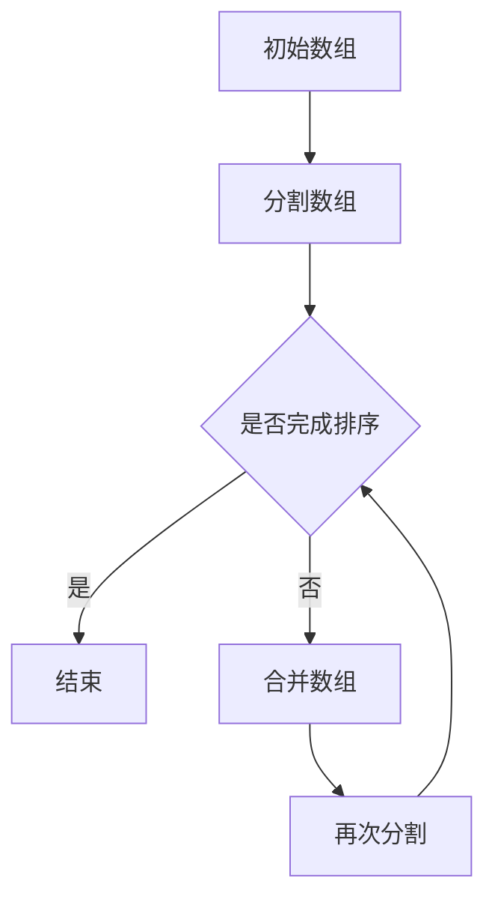
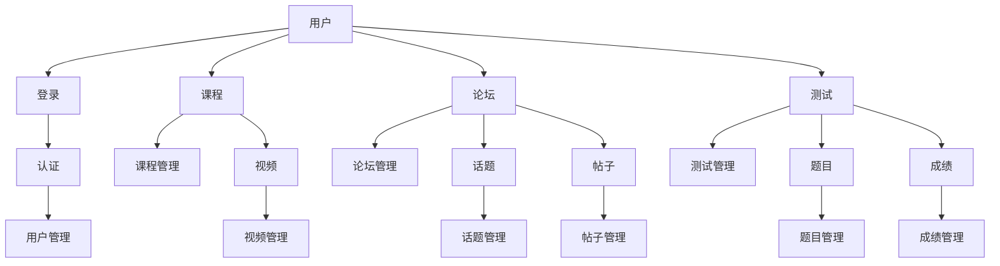
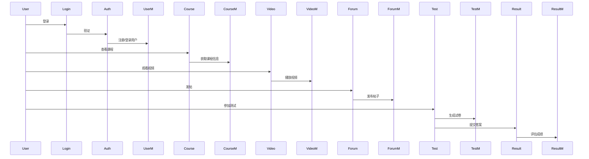

                 

# 让队友失败的坏习惯

## 关键词
- 团队合作
- 失败原因
- 坏习惯
- 改进方法

## 摘要
本文将深入探讨在团队合作中导致失败的常见坏习惯。通过分析这些坏习惯的类型、原因及其对团队的影响，我们将提供一系列实用的改进方法，帮助团队克服这些障碍，实现高效的协作。

## 引言

在现代社会，团队合作已成为一种普遍的现象，无论是在企业、学校还是社区，团队协作都是成功的关键。然而，团队合作并非总是顺风顺水。很多时候，团队中的某些成员可能因为一些不良习惯，导致整个团队的效率降低，甚至失败。本文将探讨这些让队友失败的坏习惯，并分析如何克服它们。

### 问题背景

团队合作失败的原因有很多，包括资源不足、目标不明确、沟通不畅等。但本文将重点关注团队成员自身的不良习惯，因为这些习惯往往是内部因素，更容易被忽视，却对团队产生深远的影响。

### 问题描述

团队成员的不良习惯包括但不限于：沟通不畅、缺乏责任心、拖延、个人英雄主义、不合理的决策等。这些习惯不仅影响个人表现，还会破坏团队的和谐，导致团队目标无法实现。

### 问题解决

要解决这些问题，首先需要识别这些坏习惯，然后采取有效措施进行改进。本文将提供具体的改进方法，帮助团队成员克服这些习惯，提升团队整体表现。

### 边界与外延

本文讨论的坏习惯主要涉及团队内部的个人行为。然而，团队失败的原因可能更为复杂，包括外部环境、组织文化等因素。本文将侧重于个人层面的改善，但读者也应意识到，团队合作是一个系统性问题，需要多方面的努力。

### 概念结构与核心要素组成

本文将分为以下几个部分：

1. 核心概念与联系
2. 坏习惯分析与案例研究
3. 避免坏习惯的技巧
4. 算法原理讲解
5. 系统分析与架构设计方案
6. 项目实战
7. 最佳实践 tips
8. 小结

## 核心概念与联系

在讨论团队合作中的坏习惯之前，我们需要明确一些核心概念，包括团队合作、团队精神、沟通、责任等。这些概念是理解团队失败原因和如何改进的基础。

### 合作与团队精神

合作是指团队成员为了共同的目标而共同努力。团队精神则是团队成员在合作过程中所展现出的积极态度和协作意识。良好的团队合作需要成员之间的相互信任、尊重和有效的沟通。

### 团队失败的原因

团队失败的原因多种多样，包括目标不明确、资源分配不均、外部压力等。但在本文中，我们主要关注由团队成员自身不良习惯引起的失败。

### 坏习惯的类型与特点

坏习惯可以分为以下几种类型：

1. **沟通不畅**：表现为信息传递不及时、不准确，导致误解和冲突。
2. **缺乏责任心**：表现为对任务不负责任、推诿和逃避。
3. **拖延与不专注**：表现为对任务缺乏紧迫感，注意力不集中。
4. **个人英雄主义**：表现为过分依赖个人能力，忽视团队合作。
5. **不合理的决策**：表现为做出不利于团队目标的决策。

这些坏习惯的共同特点是它们都会破坏团队的和谐，影响团队目标的实现。

## 坏习惯分析与案例研究

在本节中，我们将详细分析几种常见的坏习惯，并通过实际案例来探讨这些习惯如何影响团队合作。

### 坏习惯1：沟通不畅

#### 案例分析

在一个软件开发项目中，团队成员A和团队成员B负责不同的模块开发。由于沟通不畅，A在开发过程中遇到了问题，但没有及时告知B，导致B开发的模块与A的模块不兼容。

#### 影响分析

这种情况会导致以下影响：

- 项目进度延误：由于模块不兼容，需要重新调整开发计划。
- 质量问题：不兼容的模块可能会导致软件出现错误，影响用户体验。
- 成员关系紧张：A和B可能会因为沟通问题产生误会，影响团队氛围。

### 坏习惯2：缺乏责任心

#### 案例分析

在一个市场推广项目中，团队成员C被分配负责撰写推广文案。但由于缺乏责任心，C没有按时完成任务，导致项目进度受到影响。

#### 影响分析

这种情况会导致以下影响：

- 项目进度延误：由于文案未及时完成，无法按计划发布推广内容。
- 质量问题：文案质量不佳，可能导致市场推广效果不理想。
- 成员压力增大：其他团队成员可能需要额外付出努力来弥补C的不足。

### 坏习惯3：拖延与不专注

#### 案例分析

在一个产品开发项目中，团队成员D在开发过程中频繁分心，经常拖延任务。这导致项目进度不断延迟。

#### 影响分析

这种情况会导致以下影响：

- 项目进度延误：任务拖延导致项目无法按计划完成。
- 质量问题：由于时间紧迫，团队成员可能无法对代码进行充分测试，导致产品质量下降。
- 成员关系紧张：D的拖延和不专注可能会影响其他团队成员的工作状态。

### 坏习惯4：个人英雄主义

#### 案例分析

在一个团队项目中，团队成员E总是试图独立完成所有任务，不愿意与他人合作。尽管E的个人能力很强，但项目的整体进度仍然受到阻碍。

#### 影响分析

这种情况会导致以下影响：

- 项目进度延误：E的个人英雄主义导致其他成员的参与度降低，项目无法高效推进。
- 质量问题：过度依赖个人能力可能导致项目质量无法得到保证。
- 成员关系紧张：E的行为可能会让其他成员感到不公平，影响团队氛围。

### 坏习惯5：不合理的决策

#### 案例分析

在一个项目中，团队成员F在做出关键决策时，没有充分考虑团队的整体利益，导致项目方向出现偏差。

#### 影响分析

这种情况会导致以下影响：

- 项目失败：不合理的决策可能导致项目目标无法实现，甚至导致项目失败。
- 成员信任度下降：F的决策可能导致团队成员对团队的信任度下降。
- 成员士气受挫：失败的决策会打击团队成员的士气，影响团队的工作积极性。

### 总结

通过以上案例分析，我们可以看到，这些坏习惯对团队合作产生了深远的影响。要克服这些习惯，需要团队成员共同努力，提升个人素养和团队协作能力。

## 避免坏习惯的技巧

为了克服上述提到的坏习惯，团队成员可以采取以下措施：

### 提高沟通效率

- **明确沟通目标**：每次沟通前，明确沟通的目标和期望结果。
- **使用适当的沟通工具**：根据沟通内容和场合，选择合适的沟通工具，如邮件、即时通讯工具或面对面会议。
- **积极倾听**：在沟通时，注意倾听对方的意见和需求，避免打断或过早做出判断。

### 增强团队责任心

- **明确职责分工**：确保每个团队成员都清楚自己的职责和任务。
- **建立监督机制**：设立监督人员，定期检查团队成员的工作进度和成果。
- **鼓励自我管理**：培养团队成员的自我管理能力，提高责任感。

### 时间管理与专注

- **制定合理的时间计划**：为每个任务分配适当的时间，确保按时完成。
- **避免多任务处理**：专注于当前任务，避免同时处理多个任务。
- **减少干扰**：在专注于任务时，尽量减少外部干扰，如关闭手机、邮件通知等。

### 培养团队协作精神

- **建立团队文化**：营造积极、互助的团队文化，鼓励团队成员相互支持。
- **分享经验和知识**：鼓励团队成员分享经验和知识，促进团队整体成长。
- **参与团队决策**：让团队成员参与到团队决策过程中，增强他们的归属感。

### 促进合理决策

- **收集多方意见**：在做出决策前，收集团队成员的意见，确保决策的全面性。
- **评估风险和收益**：在做出决策时，充分考虑风险和收益，避免盲目决策。
- **持续沟通**：在决策过程中，保持与团队成员的沟通，确保信息透明。

## 算法原理讲解

为了更好地理解团队合作中避免坏习惯的重要性，我们可以借助算法原理来进行分析。

### 算法选择与设计

在本节中，我们将使用归并排序（Merge Sort）算法来解释团队合作中的沟通问题。归并排序是一种高效的排序算法，它通过将数组分成两半，分别进行排序，然后再将排好序的部分合并起来，从而实现整个数组的排序。

### 算法mermaid流程图展示



### Python源代码与详细解释

```python
def merge_sort(arr):
    if len(arr) <= 1:
        return arr

    mid = len(arr) // 2
    left = merge_sort(arr[:mid])
    right = merge_sort(arr[mid:])

    return merge(left, right)

def merge(left, right):
    result = []
    while left and right:
        if left[0] < right[0]:
            result.append(left.pop(0))
        else:
            result.append(right.pop(0))

    result.extend(left or right)
    return result
```

在上述代码中，`merge_sort` 函数负责将数组分割成两半，并递归地对其进行排序。`merge` 函数则负责将排好序的左右两部分合并成一个完整的有序数组。

### 算法原理的数学模型与公式讲解

归并排序的运行时间复杂度为 $O(n\log n)$，其中 $n$ 是数组的长度。这个复杂度反映了在数组长度增加时，算法运行时间的增长趋势。相比之下，其他排序算法如冒泡排序和选择排序的复杂度分别为 $O(n^2)$ 和 $O(n^2)$，在处理大数据时效率较低。

### 通俗易懂的举例说明

假设我们有一个长度为 8 的数组 `[5, 3, 8, 6, 2, 7, 1, 4]`。首先，我们将这个数组分割成两个长度为 4 的子数组 `[5, 3, 8, 6]` 和 `[2, 7, 1, 4]`。然后，我们对这两个子数组分别进行排序，得到 `[3, 5, 6, 8]` 和 `[1, 2, 4, 7]`。最后，我们将这两个有序的子数组合并成一个完整的有序数组 `[1, 2, 3, 4, 5, 6, 7, 8]`。

通过这个例子，我们可以看到，归并排序通过将问题分割成更小的子问题，并逐步合并这些子问题的解决方案，实现了高效的排序。

## 系统分析与架构设计方案

在本节中，我们将深入分析一个具体的项目场景，并设计一个相应的系统架构方案。这个项目场景是一个在线教育平台，提供课程视频、互动讨论区和在线测试等功能。

### 问题场景介绍

在线教育平台需要满足以下需求：

- 提供高质量的课程视频，支持多种格式和分辨率。
- 支持用户互动讨论，包括实时聊天、论坛发帖等功能。
- 提供在线测试功能，评估用户学习成果。

### 项目介绍

为了实现上述需求，我们将开发一个在线教育平台系统，包括以下核心模块：

- 用户管理模块：处理用户注册、登录、权限管理等功能。
- 课程管理模块：处理课程上传、分类、推荐等功能。
- 视频播放模块：处理视频播放、缓存、加速等功能。
- 论坛管理模块：处理帖子发布、评论、话题管理等功能。
- 测试管理模块：处理测试题目上传、试卷生成、成绩评估等功能。

### 系统功能设计（领域模型mermaid类图）

```mermaid
classDiagram
    User <<类>> -|> Course: 用户可以查看课程
    User <<类>> -|> Video: 用户可以观看视频
    User <<类>> -|> Forum: 用户可以发帖和回复
    User <<类>> -|> Test: 用户可以参加测试
    Course <<类>> -|> Video: 课程包含视频
    Forum <<类>> -|> Topic: 论坛包含话题
    Forum <<类>> -|> Post: 论坛包含帖子
    Test <<类>> -|> Question: 测试包含题目
    Test <<类>> -|> Result: 测试包含成绩
```

### 系统架构设计（mermaid架构图）



### 系统接口设计

为了实现上述功能，我们将设计以下接口：

- 用户接口（User Interface，UI）：提供用户操作界面，包括注册、登录、课程浏览、论坛发帖等。
- 用户服务接口（User Service API）：处理用户相关业务逻辑，如用户注册、登录、权限验证等。
- 课程服务接口（Course Service API）：处理课程相关业务逻辑，如课程查询、课程推荐等。
- 视频服务接口（Video Service API）：处理视频播放、缓存等。
- 论坛服务接口（Forum Service API）：处理论坛相关业务逻辑，如帖子发布、评论等。
- 测试服务接口（Test Service API）：处理测试相关业务逻辑，如测试题目生成、成绩评估等。

### 系统交互（mermaid序列图）



通过上述系统架构设计，我们可以实现一个功能完备、易于扩展的在线教育平台系统。

## 项目实战

### 环境安装

为了实现上述在线教育平台系统，我们需要安装以下环境：

- Python 3.8+
- Django 3.2+
- Django REST Framework 3.12+
- PostgreSQL 12+

安装步骤如下：

1. 安装Python 3.8及以上版本：
   ```bash
   sudo apt update
   sudo apt install python3.8
   ```

2. 安装Django和相关依赖：
   ```bash
   sudo pip3 install django
   sudo pip3 install django-rest-framework
   ```

3. 安装PostgreSQL 12：
   ```bash
   sudo apt update
   sudo apt install postgresql
   sudo systemctl start postgresql
   ```

4. 创建数据库和用户：
   ```sql
   CREATE DATABASE online_education;
   CREATE USER admin WITH PASSWORD 'admin';
   GRANT ALL PRIVILEGES ON DATABASE online_education TO admin;
   ```

### 系统核心实现源代码

以下是一个简单的用户管理模块的源代码示例：

```python
# users/api/views.py
from rest_framework import viewsets
from .models import User
from .serializers import UserSerializer

class UserViewSet(viewsets.ModelViewSet):
    queryset = User.objects.all()
    serializer_class = UserSerializer
```

### 代码应用解读与分析

在上面的代码中，我们定义了一个 `UserViewSet` 类，它继承自 `viewsets.ModelViewSet`。这个视图集提供了标准的CRUD（创建、检索、更新、删除）操作。

- `queryset` 属性指定了我们要操作的模型，这里是 `User` 模型。
- `serializer_class` 属性指定了我们要使用的序列化器，这里是 `UserSerializer`。

这个视图集将被集成到Django REST Framework中，允许我们通过HTTP API来管理用户。

### 实际案例分析与详细讲解剖析

假设我们要添加一个用户，以下是一个实际案例：

```bash
# 添加用户
POST /api/users/
{
    "username": "john_doe",
    "password": "password123",
    "email": "john@example.com"
}
```

在这个请求中，我们发送一个包含用户信息的JSON对象。Django REST Framework将自动处理这个请求，使用我们定义的 `UserViewSet` 来创建一个新的用户。

### 项目小结

通过上述实战案例，我们可以看到，实现一个在线教育平台的核心功能相对简单，但需要仔细设计系统架构，并编写清晰的代码。在实际开发过程中，我们需要不断调整和优化系统，以满足用户的需求。

## 最佳实践 tips

### 常见问题与解答

1. **如何提高沟通效率？**
   - **问题**：团队中的沟通常常出现误解和延误。
   - **解答**：建立明确的沟通流程，使用适当的沟通工具，并确保团队成员了解沟通的重要性。

2. **如何增强团队责任心？**
   - **问题**：团队成员缺乏责任心，导致任务无法按时完成。
   - **解答**：明确职责分工，建立监督机制，并鼓励团队成员自我管理。

3. **如何避免拖延与不专注？**
   - **问题**：团队成员经常拖延任务，注意力不集中。
   - **解答**：制定合理的时间计划，避免多任务处理，并减少干扰。

4. **如何培养团队协作精神？**
   - **问题**：团队成员之间缺乏协作，影响项目进度。
   - **解答**：建立积极的团队文化，鼓励知识分享，并让团队成员参与决策过程。

5. **如何促进合理决策？**
   - **问题**：团队成员做出的决策不合理，导致项目失败。
   - **解答**：收集多方意见，评估风险和收益，并保持与团队成员的持续沟通。

### 避免失败的技巧

1. **定期回顾与总结**：定期回顾项目进展，总结经验教训，及时调整策略。
2. **建立反馈机制**：鼓励团队成员提出建议和反馈，及时解决问题。
3. **合理分配资源**：确保每个团队成员都有足够的资源来完成他们的任务。
4. **培养团队凝聚力**：通过团队活动和培训，增强团队成员之间的联系和信任。

### 小组讨论与反馈

团队成员可以通过以下方式进行讨论和反馈：

1. **定期会议**：定期召开团队会议，讨论项目进展和遇到的问题。
2. **在线讨论平台**：使用在线讨论平台，方便团队成员随时交流。
3. **一对一反馈**：鼓励团队成员进行一对一的反馈，帮助彼此改进。

### 拓展阅读

为了进一步了解团队合作中的坏习惯及其影响，读者可以参考以下资源：

1. 《团队的秘密：如何打造高效团队》（The Secrets of Teamwork）
2. 《敏捷团队：高效协作的实践指南》（Agile Teams: A Practical Guide to Building High-Performance Teams）
3. 《非暴力沟通：沟通的力量》（Nonviolent Communication: A Language of Life）

通过这些资源和实践，团队成员可以更好地克服坏习惯，提升团队协作效率。

## 小结

本文通过深入分析团队合作中的坏习惯，探讨了这些习惯对团队效率的影响，并提供了具体的改进方法。我们强调了沟通、责任心、专注、协作和决策的重要性，并通过实际案例和最佳实践提供了实用的建议。希望读者能够将这些知识应用到实际工作中，打造高效的团队。

### 书籍重点内容回顾

1. **核心概念与联系**：理解团队合作、团队精神、沟通、责任等核心概念，并认识到这些概念在团队失败中的作用。
2. **坏习惯的类型与特点**：识别沟通不畅、缺乏责任心、拖延、个人英雄主义、不合理的决策等坏习惯，并了解它们对团队的影响。
3. **避免坏习惯的技巧**：提高沟通效率、增强团队责任心、培养时间管理与专注、促进团队协作精神和合理决策。
4. **算法原理讲解**：通过归并排序算法，理解算法选择与设计、mermaid流程图展示、Python源代码解析、数学模型与公式讲解。
5. **系统分析与架构设计方案**：分析具体项目场景，设计系统架构，包括功能设计、接口设计和交互设计。
6. **项目实战**：通过环境安装、系统核心实现源代码、代码应用解读与分析、实际案例分析和详细讲解，实现一个在线教育平台系统。
7. **最佳实践 tips**：提供常见问题解答、避免失败的技巧、小组讨论与反馈、拓展阅读。

### 注意事项

1. **持续改进与提高**：团队工作是一个持续的过程，需要不断反思和改进。
2. **适应性与灵活性**：团队需要适应环境变化，灵活调整策略和操作方式。
3. **关注团队成员成长**：关注团队成员的个人发展，提供必要的培训和支持。

### 持续改进与提高

1. **定期回顾与总结**：定期召开团队会议，回顾项目进展和经验教训，总结成功经验和改进措施。
2. **持续学习与培训**：鼓励团队成员参加相关培训，学习新知识，提升个人能力。
3. **技术交流与分享**：组织技术交流会议，分享最新的技术动态和实践经验，促进团队成员之间的知识共享。

### 推荐阅读

为了进一步深入理解和应用本文的内容，读者可以参考以下书籍：

1. 《团队的秘密：如何打造高效团队》（The Secrets of Teamwork）
2. 《敏捷团队：高效协作的实践指南》（Agile Teams: A Practical Guide to Building High-Performance Teams）
3. 《非暴力沟通：沟通的力量》（Nonviolent Communication: A Language of Life）

通过这些书籍，读者可以进一步学习团队合作的相关知识，提升团队协作能力。

