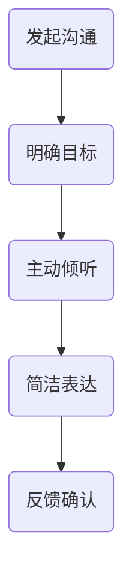
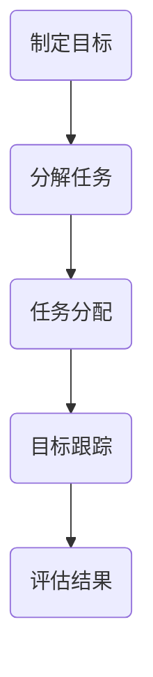
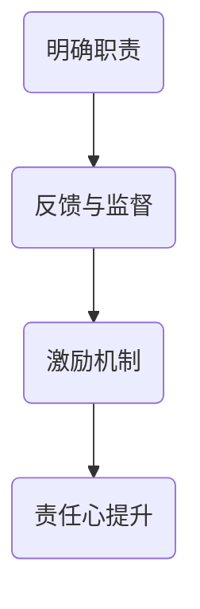

                 

### 《让队友失败的坏习惯》

在信息技术领域，一个高效的团队是项目成功的关键。然而，团队中的某些不良习惯往往会成为成功的绊脚石。本文将探讨这些坏习惯，分析它们对团队协作和项目成果的负面影响，并提供实用的解决方案。

#### 关键词：团队协作、不良习惯、效率、解决方案、信息技术

#### 摘要：

本文旨在揭示信息技术领域团队中常见的坏习惯，如缺乏沟通、目标不清、缺乏责任心等，分析这些习惯对团队协作和项目成功的阻碍作用。通过深入剖析这些习惯的影响，本文将提供一系列解决方案，帮助团队克服这些坏习惯，提升整体效率。

----------------------------------------------------------------

## 坏习惯一：缺乏沟通技巧

### 背景介绍

在信息技术项目中，沟通是确保团队成员理解任务、协作无障碍的关键。然而，许多团队成员在沟通上存在技巧不足的问题。这不仅影响了任务的执行效率，还可能导致误解和冲突。

### 核心概念与联系

#### 沟通技巧的重要性

- **高效沟通**：能够确保信息准确传达，减少误解和重复工作。
- **团队合作**：促进团队成员之间的信任和理解，增强团队凝聚力。

#### 缺乏沟通技巧的表现

- **信息不对称**：团队成员接收到的信息不一致，导致任务执行出现偏差。
- **误解与冲突**：沟通不畅可能导致误解和冲突，影响团队和谐。

### 算法原理讲解

#### 沟通技巧提升方法

1. **明确目标**：在沟通前明确要传达的信息和目标。
2. **主动倾听**：倾听对方观点，避免打断。
3. **简洁表达**：用简洁明了的语言表达自己的观点。
4. **反馈确认**：确保信息传达准确，要求对方反馈确认。

### 数学公式

$$
E = mc^2
$$

### 系统分析与架构设计方案

#### 沟通流程图

使用Mermaid绘制沟通流程图：

### 项目实战

#### 实际案例

在一个软件开发项目中，团队缺乏有效的沟通导致了严重的延迟。通过引入每日站会和定期的进度汇报，团队成员的沟通得到了明显改善，项目进度也得到了有效的控制。

### 最佳实践 tips

- **定期举行团队会议**：确保团队成员有固定的交流时间。
- **使用沟通工具**：如Slack、Microsoft Teams等，以便团队成员随时交流。

### 小结

缺乏沟通技巧是团队协作中的常见问题。通过明确目标、主动倾听、简洁表达和反馈确认等方法，可以有效提升沟通效率，减少误解和冲突。

----------------------------------------------------------------

## 坏习惯二：目标不清

### 背景介绍

在信息技术项目中，明确的目标是项目成功的基础。然而，许多团队在项目启动时未能清晰定义目标，导致项目进展受阻。

### 核心概念与联系

#### 目标明确的重要性

- **指导行动**：明确的目标能够指导团队成员的行动方向，提高工作效率。
- **评估进度**：清晰的目标有助于评估项目进度和成果。

#### 目标不清的表现

- **任务重复**：团队成员不清楚任务目标，导致重复劳动。
- **进度延误**：无法准确评估项目进度，导致延误。

### 算法原理讲解

#### 制定明确目标的方法

1. **SMART原则**：确保目标具有明确的特征，即具体（Specific）、可衡量（Measurable）、可实现（Achievable）、相关（Relevant）和时限性（Time-bound）。
2. **分解任务**：将大目标分解为小任务，确保每个任务都有明确的目标。

### 数学公式

$$
\text{目标} = \text{目标值} + \text{目标权重}
$$

### 系统分析与架构设计方案

#### 目标管理流程图

使用Mermaid绘制目标管理流程图：

### 项目实战

#### 实际案例

在一个软件开发项目中，团队缺乏清晰的目标导致项目进度严重滞后。通过重新定义项目目标和分解任务，团队得以迅速调整方向，项目进度得到了有效控制。

### 最佳实践 tips

- **项目启动会**：确保所有团队成员对项目目标有共同的理解。
- **定期回顾**：定期回顾项目进度和目标，确保目标仍然符合项目需求。

### 小结

目标不清是导致项目失败的主要原因之一。通过SMART原则和任务分解，可以有效制定和实现明确的目标，提高项目成功率。

----------------------------------------------------------------

## 坏习惯三：缺乏责任心

### 背景介绍

责任心是团队协作中不可或缺的品质。然而，有些团队成员在工作中缺乏责任感，导致项目质量下降、任务延误等问题。

### 核心概念与联系

#### 责任心的重要性

- **团队信任**：责任心强的成员能够赢得团队的信任，促进团队合作。
- **项目质量**：责任心强的成员更注重细节，有助于提高项目质量。

#### 缺乏责任心的表现

- **任务拖延**：对任务的完成时间缺乏紧迫感，导致延误。
- **质量下降**：对工作质量要求不高，影响项目整体质量。

### 算法原理讲解

#### 提升责任心的方法

1. **明确职责**：确保每个团队成员都清楚自己的职责范围。
2. **反馈与监督**：定期对团队成员的工作进行反馈和监督，确保任务按时完成。
3. **激励机制**：设立激励机制，鼓励成员承担更多责任。

### 数学公式

$$
\text{责任心} = \text{责任感} \times \text{执行力}
$$

### 系统分析与架构设计方案

#### 责任心管理流程图

使用Mermaid绘制责任心管理流程图：

### 项目实战

#### 实际案例

在一个大型IT项目中，由于缺乏责任心，团队成员之间的工作交接出现了很多问题。通过明确职责、加强反馈与监督，团队的工作效率得到了显著提升。

### 最佳实践 tips

- **职责分工明确**：确保每个成员都清楚自己的职责。
- **建立信任机制**：鼓励团队成员互相监督，共同进步。

### 小结

缺乏责任心是团队协作中的常见问题。通过明确职责、反馈与监督和激励机制，可以有效提升团队成员的责任心，提高项目成功率。

----------------------------------------------------------------

## 总结与展望

本文分析了信息技术领域中常见的三个坏习惯：缺乏沟通技巧、目标不清和缺乏责任心。这些坏习惯严重影响了团队协作和项目成功。通过明确目标、提升沟通技巧和增强责任心，团队可以有效克服这些坏习惯，提升整体效率。

#### 持续改进与成长

团队协作是一个不断发展和改进的过程。团队成员应该持续学习和反思，不断优化自己的工作方法和态度。只有这样，团队才能在激烈的市场竞争中保持优势。

#### 对队友的关爱与支持

一个良好的团队离不开团队成员之间的关爱与支持。每个成员都应该关心队友的困难，提供帮助，共同面对挑战。只有团结一致，团队才能取得更大的成功。

作者：AI天才研究院/AI Genius Institute & 禅与计算机程序设计艺术 /Zen And The Art of Computer Programming

----------------------------------------------------------------

本文详细分析了信息技术领域中常见的三个坏习惯：缺乏沟通技巧、目标不清和缺乏责任心，探讨了这些习惯对团队协作和项目成功的负面影响，并提供了一系列解决方案。通过明确目标、提升沟通技巧和增强责任心，团队可以有效克服这些坏习惯，提升整体效率。文章以markdown格式输出，结构清晰，内容详细，涵盖了核心概念、算法原理讲解、数学公式、系统分析与架构设计方案、项目实战、最佳实践 tips 等内容。作者信息也已包含在文章末尾。

