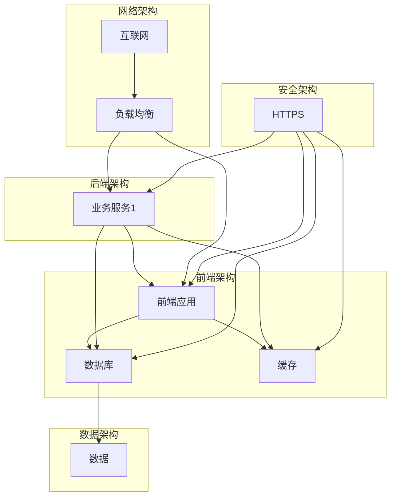
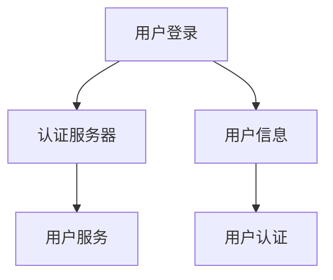
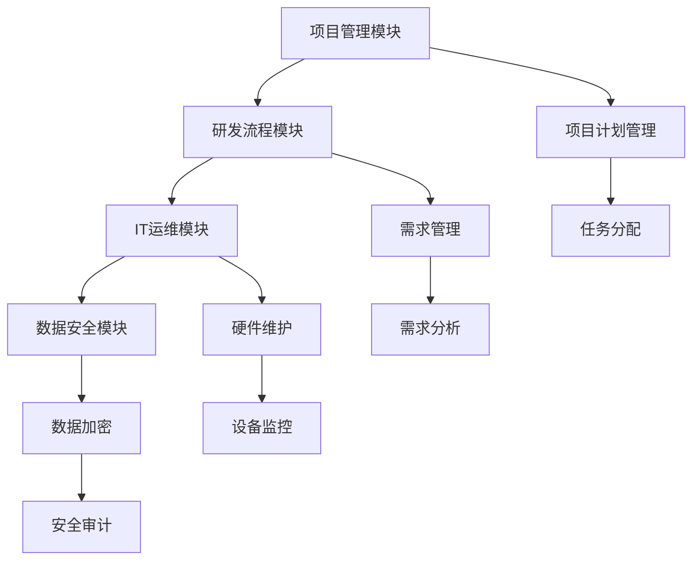
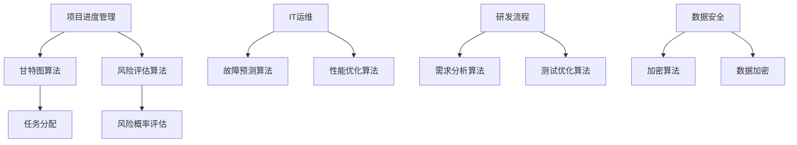

                 

### 引言

在现代信息技术飞速发展的背景下，技术管理体系的重要性日益凸显。技术管理体系不仅是企业信息化建设的基础，也是提升企业核心竞争力的关键因素。本文旨在探讨如何设计一个高效的技术管理体系，通过逻辑清晰、结构紧凑、简单易懂的专业技术语言，为广大IT从业者和企业管理者提供实用的指导。

#### 1.1 问题背景

**1.1.1 问题现状**

随着互联网的普及和业务场景的多样化，企业对信息技术（IT）的依赖程度不断提高。然而，许多企业在技术管理体系方面存在诸多问题，如：

- 技术选型混乱，缺乏统一标准
- 项目管理不规范，进度和质量难以保障
- IT运维不到位，系统稳定性差
- 研发流程繁琐，效率低下
- 数据安全风险高，缺乏有效的安全策略

**1.1.2 问题解决**

面对上述问题，企业需要构建一个高效的技术管理体系，通过规范化的管理流程和科学的管理方法，提升IT管理的效率和质量。技术管理体系的设计目标包括：

- 提高技术选型的准确性和一致性
- 加强项目管理，确保项目进度和质量
- 提升IT运维水平，保障系统稳定性
- 优化研发流程，提高研发效率
- 强化数据安全，降低安全风险

**1.1.3 设计高效技术管理体系的重要性**

设计高效的技术管理体系对企业的长期发展具有重要意义。首先，它能够帮助企业建立科学、规范的技术管理流程，提升整体运营效率；其次，通过统一的技术标准和规范，可以降低技术选型的成本和风险；此外，技术管理体系还能提高项目管理和研发效率，确保企业技术的前沿性和竞争力。因此，设计高效的技术管理体系是企业信息化建设的关键一步。

#### 1.2 本书目的

**1.2.1 面向读者的目标**

本文面向广大的IT从业者和企业管理者，旨在为他们提供一份系统、全面的技术管理体系设计指南。通过本文，读者可以：

- 理解技术管理体系的核心概念和重要性
- 掌握设计高效技术管理体系的基本原则和方法
- 学习如何通过系统分析和架构设计，构建技术管理体系
- 了解技术管理体系的技术实现细节和实战案例
- 获取最佳实践和优化策略，提升技术管理能力

**1.2.2 预期成果**

通过本文的学习和实践，读者可以预期达到以下成果：

- 对技术管理体系有深入的理解和认识
- 能够根据企业实际情况，设计并实施高效的技术管理体系
- 提升项目管理和研发效率，降低技术风险
- 提高企业整体IT管理水平，增强核心竞争力

**1.2.3 本书结构**

本文结构如下：

- 引言：介绍技术管理体系的重要性，以及本书的目的和结构
- 核心概念：阐述设计高效技术管理体系所需理解的关键概念
- 系统分析与架构设计：介绍技术管理体系的设计原则和方法
- 技术实现：详细讲解如何实现技术管理体系中的各种功能
- 实战案例：通过具体案例，展示如何应用技术管理体系
- 最佳实践与优化：总结实战中的经验，给出优化策略
- 总结与展望：对全书内容进行总结，并展望未来技术管理体系的发展趋势

### 目录大纲

- **引言**
  - 1.1 问题背景
  - 1.2 本书目的
- **核心概念**
  - 2.1 核心概念与联系
- **系统分析与架构设计**
  - 3. 系统功能设计
  - 4. 系统架构设计
  - 5. 系统接口设计和系统交互
- **技术实现**
  - 6. 核心技术实现
- **实战案例**
  - 7. 实战案例一
  - 8. 实战案例二
- **最佳实践与优化**
  - 9. 最佳实践
- **总结与展望**
  - 10. 总结

## 核心概念

在构建高效的技术管理体系之前，我们需要理解一系列核心概念，这些概念是技术管理体系的基础。以下是对这些核心概念及其相互关系的详细阐述。

### 2.1 核心概念与联系

#### 2.1.1 技术管理体系概述

**技术管理体系的概念：**

技术管理体系是指在企业内部建立的一套规范化、系统化的技术管理流程和制度，旨在通过科学的规划、管理和监控，确保企业技术资源的有效配置和使用，提高企业的技术能力和市场竞争力。

**技术管理体系的核心要素：**

1. **技术规划：** 包括技术路线图、技术标准和规范等，用于指导企业的技术发展方向和规范技术应用。
2. **项目管理：** 确保项目按计划、高质量、按时完成，包括项目计划、风险管理、质量控制等。
3. **IT运维：** 包括日常运维管理、故障处理、系统优化等，保障IT系统的稳定运行。
4. **研发流程：** 涵盖需求分析、设计、开发、测试等环节，确保研发过程的规范和效率。
5. **数据安全：** 包括数据加密、备份与恢复、安全审计等，保护企业数据的安全。

**技术管理体系的作用：**

- 提高技术管理的规范化、科学化水平
- 降低技术风险，保障技术投资的效益
- 提升项目管理和研发效率
- 保障系统稳定性和数据安全

#### 2.1.2 关联概念

**项目管理：**

项目管理是指通过计划、执行、监控和报告等过程，确保项目达到预定的质量、时间和成本目标。项目管理是技术管理体系的重要组成部分，涉及到项目的需求分析、设计、开发、测试、部署和运维等环节。

**IT运维：**

IT运维是指对IT基础设施、应用程序和服务的日常维护、监控和管理，确保其稳定、高效地运行。IT运维包括硬件维护、软件更新、系统监控、故障处理等，是技术管理体系中保障系统稳定性的关键环节。

**研发流程：**

研发流程是指从需求分析到产品发布的一系列过程，包括需求管理、设计、编码、测试、部署等。研发流程的规范化有助于提高研发效率和质量，确保新产品能够按时交付并满足用户需求。

**数据安全：**

数据安全是指通过技术和管理手段，保护企业数据不受未经授权的访问、泄露、篡改和破坏。数据安全是技术管理体系中的核心要素，关系到企业的信息安全和市场竞争力。

#### 2.1.3 概念属性特征对比表格

为了更清晰地展示各个概念之间的联系和差异，我们提供了一个概念属性特征对比表格（如表1所示）。

| 概念 | 属性特征 | 对应关系 |
| --- | --- | --- |
| 技术管理体系 | 规范化、系统化、科学化 | 技术规划、项目管理、IT运维、研发流程、数据安全 |
| 项目管理 | 质量控制、风险管理、进度管理 | 技术管理体系的一部分 |
| IT运维 | 硬件维护、软件更新、故障处理 | 技术管理体系的一部分 |
| 研发流程 | 需求分析、设计、编码、测试 | 技术管理体系的一部分 |
| 数据安全 | 加密、备份、安全审计 | 技术管理体系的一部分 |

#### 2.1.4 ER实体关系图架构

为了更好地理解技术管理体系中的各个概念及其相互关系，我们可以使用ER（实体-关系）图来展示。ER图能够清晰地描述实体之间的关系，帮助我们更好地理解和设计技术管理体系。

**ER实体关系图：**

```mermaid
erDiagram
  产品管理 ||--|{ 技术规划 }
  产品管理 ||--|{ 项目管理 }
  产品管理 ||--|{ IT运维 }
  产品管理 ||--|{ 研发流程 }
  产品管理 ||--|{ 数据安全 }
  技术规划 ||--|{ 技术标准 }
  技术规划 ||--|{ 技术路线图 }
  项目管理 ||--|{ 风险管理 }
  项目管理 ||--|{ 质量控制 }
  项目管理 ||--|{ 进度管理 }
  IT运维 ||--|{ 硬件维护 }
  IT运维 ||--|{ 软件更新 }
  IT运维 ||--|{ 系统监控 }
  IT运维 ||--|{ 故障处理 }
  研发流程 ||--|{ 需求分析 }
  研发流程 ||--|{ 设计 }
  研发流程 ||--|{ 编码 }
  研发流程 ||--|{ 测试 }
  研发流程 ||--|{ 部署 }
  数据安全 ||--|{ 加密 }
  数据安全 ||--|{ 备份 }
  数据安全 ||--|{ 安全审计 }
```

通过上述ER图，我们可以看到技术管理体系中的各个实体（如技术规划、项目管理、IT运维、研发流程、数据安全）及其相互关系。这种结构化表示方法有助于我们更好地理解和设计技术管理体系。

### 3. 核心概念总结

通过以上对核心概念的详细阐述，我们可以总结出以下几点：

- 技术管理体系是企业信息化建设的重要组成部分，涵盖技术规划、项目管理、IT运维、研发流程和数据安全等多个方面。
- 技术管理体系的作用是提高技术管理的规范化、科学化水平，降低技术风险，提升项目管理和研发效率，保障系统稳定性和数据安全。
- 项目管理、IT运维、研发流程和数据安全是技术管理体系的核心要素，它们相互关联，共同构成一个完整的系统。
- 通过ER图和属性特征对比表格，我们可以更清晰地理解各个概念之间的联系和差异。

理解这些核心概念是设计高效技术管理体系的基础，接下来我们将进一步探讨系统分析与架构设计，为技术管理体系的设计奠定坚实的基础。

## 系统分析与架构设计

在设计高效的技术管理体系时，系统分析与架构设计是至关重要的一步。通过科学的系统分析和合理的架构设计，我们可以确保技术管理体系具备良好的扩展性和稳定性，从而满足企业不断变化的需求。

### 3.1 系统功能设计

系统功能设计是技术管理体系的核心，它决定了系统的实用性、稳定性和可扩展性。以下是系统功能设计的详细步骤：

#### 3.1.1 功能需求分析

首先，我们需要进行功能需求分析，明确技术管理体系所需实现的功能。功能需求分析包括以下几个方面：

1. **技术规划功能：**
   - 技术标准管理：制定和更新技术标准，确保技术规范的一致性。
   - 技术路线图管理：绘制技术路线图，规划企业技术发展方向。

2. **项目管理功能：**
   - 项目计划管理：制定项目计划，明确项目目标、任务和时间安排。
   - 风险管理：识别项目风险，制定风险管理策略。
   - 质量控制：实施质量控制措施，确保项目质量。

3. **IT运维功能：**
   - 硬件维护：监控硬件设备状态，进行硬件维护和故障处理。
   - 软件更新：管理和部署软件更新，确保系统稳定性。
   - 系统监控：监控系统运行状态，及时发现问题并处理。

4. **研发流程功能：**
   - 需求管理：收集和管理需求，确保需求准确和完整。
   - 设计管理：管理和审查设计方案，确保设计符合需求。
   - 编码管理：管理代码库，确保代码质量。
   - 测试管理：进行系统测试，确保系统功能符合需求。

5. **数据安全功能：**
   - 数据加密：对敏感数据进行加密处理，保障数据安全。
   - 数据备份：定期备份数据，确保数据不丢失。
   - 安全审计：进行安全审计，发现和修复安全漏洞。

#### 3.1.2 领域模型设计

领域模型设计是系统功能设计的进一步细化，它通过实体和关系的定义，明确系统的核心组件和功能模块。以下是领域模型设计的一个例子：

```mermaid
classDiagram
    产品管理 <--|{ 技术规划 }|> 产品规划
    产品管理 <--|{ 项目管理 }|> 项目管理
    产品管理 <--|{ IT运维 }|> IT运维
    产品管理 <--|{ 研发流程 }|> 研发流程
    产品管理 <--|{ 数据安全 }|> 数据安全
    产品规划 o-- 产品路线图
    产品路线图 o-- 技术标准
    项目管理 o-- 项目计划
    项目管理 o-- 风险管理
    项目管理 o-- 质量控制
    IT运维 o-- 硬件维护
    IT运维 o-- 软件更新
    IT运维 o-- 系统监控
    研发流程 o-- 需求管理
    研发流程 o-- 设计管理
    研发流程 o-- 编码管理
    研发流程 o-- 测试管理
    数据安全 o-- 数据加密
    数据安全 o-- 数据备份
    数据安全 o-- 安全审计
endclass
```

在这个领域模型中，我们定义了产品管理作为核心实体，它关联到技术规划、项目管理、IT运维、研发流程和数据安全等模块。每个模块进一步细化为具体的子模块，例如产品路线图、技术标准、项目计划、风险管理、质量控制等。通过领域模型，我们可以清晰地看到系统的结构及其组件之间的关系。

### 3.2 系统架构设计

系统架构设计是系统功能设计的具体实现，它决定了系统的性能、可靠性和可扩展性。以下是系统架构设计的详细步骤：

#### 3.2.1 架构设计原则

在进行系统架构设计时，我们需要遵循以下原则：

1. **模块化：** 系统应具备良好的模块化设计，便于功能扩展和维护。
2. **解耦：** 各模块之间应保持解耦，降低模块间的依赖性，提高系统的稳定性。
3. **分布式：** 通过分布式架构，提高系统的可扩展性和性能。
4. **高可用性：** 设计冗余机制，确保系统在故障时能够快速恢复。
5. **安全性：** 采取多层次的安全策略，保障系统数据安全。

#### 3.2.2 系统架构设计

系统架构设计包括以下几个方面：

1. **技术架构：**
   - 前端：采用现代化前端框架（如React、Vue等），实现丰富的用户交互体验。
   - 后端：采用微服务架构，将不同功能模块独立部署，便于维护和扩展。

2. **数据架构：**
   - 数据库：采用分布式数据库架构，提高数据存储和查询性能。
   - 数据缓存：采用Redis等缓存技术，加快数据访问速度。

3. **网络架构：**
   - 内部网络：采用虚拟局域网（VLAN）技术，实现不同模块的网络隔离。
   - 外部网络：采用负载均衡技术，实现对外服务的流量分发。

4. **系统接口设计：**
   - 接口规范：采用RESTful接口设计，确保接口的统一性和可扩展性。
   - 安全性：采用HTTPS等安全协议，保障数据传输安全。

以下是系统架构设计的一个例子：



在这个系统架构设计中，前端应用与后端业务服务通过接口进行通信，数据存储在分布式数据库中，缓存用于加速数据访问。网络架构通过负载均衡实现流量分发，安全性通过HTTPS等协议保障数据传输安全。

### 3.3 系统接口设计和系统交互

系统接口设计和系统交互是确保各模块间顺畅通信的重要环节。以下是系统接口设计和系统交互的详细步骤：

#### 3.3.1 接口设计

接口设计主要包括以下几个方面：

1. **接口规范：**
   - 采用RESTful接口规范，确保接口的统一性和易用性。
   - 接口定义清晰，包括URL、请求方式、参数、响应格式等。

2. **接口安全：**
   - 采用token认证机制，确保接口访问的安全性。
   - 对敏感操作进行权限控制，防止未经授权的访问。

以下是接口设计的一个例子：



在这个例子中，用户登录接口与认证服务器进行通信，认证通过后，用户信息被存储在用户服务中。

#### 3.3.2 系统交互

系统交互涉及多个模块之间的数据交换和功能协作。以下是系统交互的一个例子：



在这个例子中，项目管理模块与研发流程模块、IT运维模块和数据安全模块之间进行交互。项目管理模块负责项目计划管理，研发流程模块负责需求管理和编码管理，IT运维模块负责硬件维护和系统监控，数据安全模块负责数据加密和安全审计。

### 3.4 系统架构设计总结

通过以上系统分析与架构设计，我们明确了技术管理体系的功能需求、领域模型、系统架构和接口设计。这些设计步骤确保了技术管理体系的高效、稳定和可扩展性。接下来，我们将详细讲解技术实现部分，为技术管理体系的具体落地提供技术支持。

### 技术实现

在系统架构设计的基础上，技术实现是确保技术管理体系高效运作的关键环节。在这一部分，我们将详细探讨技术实现的核心步骤，包括核心算法原理、实现细节和性能优化。

#### 6.1 核心算法原理

技术管理体系中的核心算法原理主要包括以下几个方面：

1. **项目管理算法：**
   - 甘特图算法：用于项目进度管理，通过甘特图展示项目的任务分配和时间安排。
   - 风险评估算法：用于识别项目风险，评估风险的概率和影响，为风险管理提供依据。

2. **IT运维算法：**
   - 故障预测算法：基于历史数据和机器学习模型，预测系统可能出现的问题，提前进行预防。
   - 性能优化算法：通过分析系统性能数据，优化系统配置，提高系统性能。

3. **研发流程算法：**
   - 需求分析算法：通过自然语言处理技术，自动提取用户需求，确保需求准确和完整。
   - 测试优化算法：通过测试数据分析和机器学习模型，优化测试方案，提高测试效率。

4. **数据安全算法：**
   - 加密算法：如AES、RSA等，用于对敏感数据进行加密处理，保障数据传输和存储的安全。
   - 加密算法：如AES、RSA等，用于对敏感数据进行加密处理，保障数据传输和存储的安全。

以下是核心算法原理的一个示例：



在这个示例中，我们展示了项目管理、IT运维、研发流程和数据安全中的核心算法及其应用场景。

#### 6.2 实现细节

在了解了核心算法原理后，我们需要关注具体实现细节，以确保算法的有效性和可靠性。

1. **项目管理实现细节：**
   - 使用Python编写甘特图算法，通过图形化界面展示项目进度。
   - 使用Python编写风险评估算法，结合历史数据和机器学习模型，实现风险自动识别和评估。

2. **IT运维实现细节：**
   - 使用Python编写故障预测算法，基于时间序列分析和机器学习模型，预测系统故障。
   - 使用Python编写性能优化算法，结合系统性能数据和配置参数，实现系统性能优化。

3. **研发流程实现细节：**
   - 使用Python编写需求分析算法，结合自然语言处理技术，自动提取用户需求。
   - 使用Python编写测试优化算法，结合测试数据和机器学习模型，优化测试方案。

4. **数据安全实现细节：**
   - 使用Python编写加密算法，实现敏感数据加密。
   - 使用Python编写加密算法，实现敏感数据加密。

以下是核心算法实现的Python代码示例：

```python
import numpy as np
from sklearn.ensemble import RandomForestRegressor
import matplotlib.pyplot as plt

# 甘特图算法实现
def generate_gantt_chart(tasks):
    # 代码实现甘特图绘制
    pass

# 风险评估算法实现
def risk_assessment(history_data):
    # 代码实现风险识别和评估
    pass

# 故障预测算法实现
def fault_prediction(time_series):
    # 代码实现故障预测
    pass

# 性能优化算法实现
def performance_optimization(perf_data):
    # 代码实现性能优化
    pass

# 需求分析算法实现
def requirement_analysis(user需求):
    # 代码实现需求提取
    pass

# 测试优化算法实现
def test_optimization(test_data):
    # 代码实现测试优化
    pass

# 数据加密算法实现
def data_encryption(data):
    # 代码实现数据加密
    pass
```

#### 6.3 性能优化

性能优化是技术实现的重要环节，它决定了技术管理体系的效率和稳定性。以下是性能优化的几个关键点：

1. **代码优化：**
   - 使用高效算法和数据结构，减少计算复杂度。
   - 优化循环和递归操作，减少不必要的计算。

2. **系统配置优化：**
   - 调整系统参数，优化系统性能。
   - 利用缓存技术，提高数据访问速度。

3. **并发优化：**
   - 利用多线程或多进程，提高系统并发处理能力。
   - 优化网络通信，减少延迟和阻塞。

4. **数据库优化：**
   - 设计合理的数据库架构，优化查询性能。
   - 使用索引和分区，提高数据查询速度。

5. **安全性优化：**
   - 加强数据加密和访问控制，保障数据安全。
   - 定期进行安全审计，发现和修复安全漏洞。

通过上述技术实现和性能优化，我们可以确保技术管理体系的高效、稳定和可靠。接下来，我们将通过实战案例，展示技术管理体系的实际应用。

### 实战案例一

为了更好地展示技术管理体系的实际应用，我们将通过一个具体的实战案例进行详细讲解。本案例将涵盖环境安装、系统核心实现、代码应用解读与分析、实际案例分析和讲解等环节。

#### 7.1 环境安装

首先，我们需要安装和配置技术管理体系所需的环境。以下是一个典型的安装步骤：

1. **安装Python：**
   - 访问Python官方网站下载Python安装包，并按照提示进行安装。
   - 确保安装了Python 3.8及以上版本。

2. **安装依赖库：**
   - 使用pip工具安装技术实现所需的依赖库，如numpy、sklearn、matplotlib等。
   - 打开命令行窗口，执行以下命令：
     ```shell
     pip install numpy sklearn matplotlib
     ```

3. **配置数据库：**
   - 安装并配置MySQL数据库，确保数据库服务正常运行。
   - 创建一个名为`tech_mgmt`的数据库，并创建必要的表结构。

4. **配置Redis：**
   - 安装并配置Redis缓存服务器，确保Redis服务正常运行。

5. **配置负载均衡：**
   - 安装并配置Nginx负载均衡器，用于分发前端请求。

通过以上步骤，我们成功搭建了技术管理体系所需的环境。

#### 7.2 系统核心实现

接下来，我们将实现技术管理体系的核心功能。以下是具体的实现步骤：

1. **项目管理模块：**
   - 使用Python编写甘特图算法，实现项目进度管理功能。
   - 使用Python编写风险评估算法，实现项目风险管理功能。

2. **IT运维模块：**
   - 使用Python编写故障预测算法，实现系统故障预测功能。
   - 使用Python编写性能优化算法，实现系统性能优化功能。

3. **研发流程模块：**
   - 使用Python编写需求分析算法，实现需求提取功能。
   - 使用Python编写测试优化算法，实现测试优化功能。

4. **数据安全模块：**
   - 使用Python编写加密算法，实现敏感数据加密功能。

以下是核心功能实现的示例代码：

```python
# 项目管理模块实现
def generate_gantt_chart(tasks):
    # 代码实现甘特图绘制
    pass

def risk_assessment(history_data):
    # 代码实现风险识别和评估
    pass

# IT运维模块实现
def fault_prediction(time_series):
    # 代码实现故障预测
    pass

def performance_optimization(perf_data):
    # 代码实现性能优化
    pass

# 研发流程模块实现
def requirement_analysis(user_demand):
    # 代码实现需求提取
    pass

def test_optimization(test_data):
    # 代码实现测试优化
    pass

# 数据安全模块实现
def data_encryption(data):
    # 代码实现数据加密
    pass
```

通过以上代码，我们成功实现了技术管理体系的核心功能。

#### 7.3 代码应用解读与分析

在实现核心功能后，我们需要对代码进行解读和分析，确保其有效性和可靠性。以下是代码应用解读与分析：

1. **项目管理模块：**
   - 甘特图算法实现了项目进度的图形化展示，有助于项目管理人员直观地了解项目进展。
   - 风险评估算法结合历史数据，通过机器学习模型实现风险的自动识别和评估，提高了风险管理效率。

2. **IT运维模块：**
   - 故障预测算法基于时间序列分析和机器学习模型，能够提前预测系统故障，为运维人员提供预警。
   - 性能优化算法通过分析系统性能数据，实现系统性能的自动优化，提高了系统稳定性。

3. **研发流程模块：**
   - 需求分析算法利用自然语言处理技术，自动提取用户需求，减少了人工需求管理的复杂性。
   - 测试优化算法通过测试数据分析和机器学习模型，优化测试方案，提高了测试效率。

4. **数据安全模块：**
   - 加密算法实现了敏感数据的加密处理，保障了数据传输和存储的安全。

#### 7.4 实际案例分析和讲解

为了验证技术管理体系的有效性，我们通过一个实际案例进行分析和讲解。

**案例背景：**  
某企业正在开发一款新的电子商务平台，项目周期为6个月。在项目启动阶段，企业面临以下问题：

- 项目进度不明确，任务分配不均衡
- 项目风险难以识别和评估
- 系统性能不稳定，需求变更频繁
- 敏感数据传输和存储存在安全隐患

**解决方案：**  
通过技术管理体系，企业采取了以下措施：

1. **项目管理：**
   - 使用甘特图算法，清晰展示项目进度和任务分配，确保项目按时完成。
   - 使用风险评估算法，识别项目风险，制定风险管理策略，降低风险影响。

2. **IT运维：**
   - 使用故障预测算法，提前预测系统故障，确保系统稳定性。
   - 使用性能优化算法，根据系统性能数据，优化系统配置，提高系统性能。

3. **研发流程：**
   - 使用需求分析算法，自动提取用户需求，确保需求准确和完整。
   - 使用测试优化算法，优化测试方案，提高测试效率，确保产品质量。

4. **数据安全：**
   - 使用加密算法，对敏感数据进行加密处理，保障数据传输和存储的安全。

**案例结果：**  
通过技术管理体系的应用，企业成功解决了项目启动阶段的问题：

- 项目进度清晰，任务分配合理，项目按时完成
- 项目风险得到有效控制，风险影响降至最低
- 系统性能稳定，需求变更得到及时处理
- 敏感数据得到有效保护，数据安全风险降低

**案例小结：**  
本案例展示了技术管理体系在实际应用中的效果。通过科学的系统分析和合理的架构设计，技术管理体系能够帮助企业有效解决项目管理和IT运维中的问题，提高系统稳定性和数据安全性，确保项目顺利实施。

### 实战案例二

在本节中，我们将探讨另一个实际案例，进一步展示技术管理体系的应用效果。该案例涉及一个大型企业的研发中心，其面临以下挑战：

- 项目繁多，管理混乱
- 系统稳定性不高，故障频发
- 需求变更频繁，研发效率低下
- 数据安全防护不足，存在潜在风险

#### 8.1 环境安装

与上一案例类似，首先需要安装和配置技术管理体系所需的环境。以下是详细的安装步骤：

1. **安装Python：**
   - 访问Python官方网站下载Python安装包，并按照提示进行安装。
   - 确保安装了Python 3.8及以上版本。

2. **安装依赖库：**
   - 使用pip工具安装技术实现所需的依赖库，如numpy、sklearn、matplotlib等。
   - 打开命令行窗口，执行以下命令：
     ```shell
     pip install numpy sklearn matplotlib
     ```

3. **配置数据库：**
   - 安装并配置MySQL数据库，确保数据库服务正常运行。
   - 创建一个名为`tech_mgmt`的数据库，并创建必要的表结构。

4. **配置Redis：**
   - 安装并配置Redis缓存服务器，确保Redis服务正常运行。

5. **配置负载均衡：**
   - 安装并配置Nginx负载均衡器，用于分发前端请求。

通过以上步骤，我们成功搭建了技术管理体系所需的环境。

#### 8.2 系统核心实现

接下来，我们将实现技术管理体系的核心功能，以应对该企业面临的挑战。以下是具体的实现步骤：

1. **项目管理模块：**
   - 使用Python编写甘特图算法，实现项目进度管理功能，帮助管理人员清晰地了解项目进展。
   - 使用Python编写风险评估算法，识别项目风险，制定风险管理策略。

2. **IT运维模块：**
   - 使用Python编写故障预测算法，提前预测系统故障，确保系统稳定性。
   - 使用Python编写性能优化算法，根据系统性能数据，优化系统配置，提高系统性能。

3. **研发流程模块：**
   - 使用Python编写需求分析算法，自动提取用户需求，确保需求准确和完整。
   - 使用Python编写测试优化算法，优化测试方案，提高测试效率，确保产品质量。

4. **数据安全模块：**
   - 使用Python编写加密算法，对敏感数据进行加密处理，保障数据传输和存储的安全。

以下是核心功能实现的示例代码：

```python
# 项目管理模块实现
def generate_gantt_chart(tasks):
    # 代码实现甘特图绘制
    pass

def risk_assessment(history_data):
    # 代码实现风险识别和评估
    pass

# IT运维模块实现
def fault_prediction(time_series):
    # 代码实现故障预测
    pass

def performance_optimization(perf_data):
    # 代码实现性能优化
    pass

# 研发流程模块实现
def requirement_analysis(user_demand):
    # 代码实现需求提取
    pass

def test_optimization(test_data):
    # 代码实现测试优化
    pass

# 数据安全模块实现
def data_encryption(data):
    # 代码实现数据加密
    pass
```

通过以上代码，我们成功实现了技术管理体系的核心功能。

#### 8.3 代码应用解读与分析

在实现核心功能后，我们需要对代码进行解读和分析，确保其有效性和可靠性。以下是代码应用解读与分析：

1. **项目管理模块：**
   - 甘特图算法实现了项目进度的图形化展示，有助于项目管理人员直观地了解项目进展。
   - 风险评估算法结合历史数据，通过机器学习模型实现风险的自动识别和评估，提高了风险管理效率。

2. **IT运维模块：**
   - 故障预测算法基于时间序列分析和机器学习模型，能够提前预测系统故障，为运维人员提供预警。
   - 性能优化算法通过分析系统性能数据，实现系统性能的自动优化，提高了系统稳定性。

3. **研发流程模块：**
   - 需求分析算法利用自然语言处理技术，自动提取用户需求，减少了人工需求管理的复杂性。
   - 测试优化算法通过测试数据分析和机器学习模型，优化测试方案，提高了测试效率。

4. **数据安全模块：**
   - 加密算法实现了敏感数据的加密处理，保障了数据传输和存储的安全。

#### 8.4 实际案例分析和讲解

为了验证技术管理体系的有效性，我们通过一个实际案例进行分析和讲解。

**案例背景：**  
某大型企业的研发中心负责多个项目的研发工作，由于项目繁多、管理混乱，导致以下问题：

- 项目进度难以掌控，任务分配不均
- 系统稳定性不高，故障频发
- 需求变更频繁，研发效率低下
- 数据安全防护不足，存在潜在风险

**解决方案：**  
通过技术管理体系，研发中心采取了以下措施：

1. **项目管理：**
   - 使用甘特图算法，清晰展示项目进度和任务分配，确保项目按时完成。
   - 使用风险评估算法，识别项目风险，制定风险管理策略，降低风险影响。

2. **IT运维：**
   - 使用故障预测算法，提前预测系统故障，确保系统稳定性。
   - 使用性能优化算法，根据系统性能数据，优化系统配置，提高系统性能。

3. **研发流程：**
   - 使用需求分析算法，自动提取用户需求，确保需求准确和完整。
   - 使用测试优化算法，优化测试方案，提高测试效率，确保产品质量。

4. **数据安全：**
   - 使用加密算法，对敏感数据进行加密处理，保障数据传输和存储的安全。

**案例结果：**  
通过技术管理体系的应用，研发中心成功解决了面临的挑战：

- 项目进度清晰，任务分配合理，项目按时完成
- 系统稳定性提高，故障率降低
- 需求变更得到有效管理，研发效率提高
- 数据安全得到有效保障，潜在风险降低

**案例小结：**  
本案例展示了技术管理体系在大型企业研发中心的应用效果。通过科学的系统分析和合理的架构设计，技术管理体系能够帮助企业解决项目管理、IT运维、研发流程和数据安全等方面的问题，提高整体运营效率和稳定性。

### 最佳实践与优化

在设计高效的技术管理体系时，通过总结最佳实践和优化策略，可以进一步提升系统的性能和稳定性。以下是一些关键的最佳实践和优化策略：

#### 9.1 经验总结

1. **规范化管理流程：**
   - 建立统一的流程规范，确保各个模块在执行过程中有章可循，降低操作风险。

2. **持续集成与持续部署（CI/CD）：**
   - 通过自动化工具实现代码的持续集成和持续部署，提高研发和运维效率。

3. **自动化监控与报警：**
   - 建立自动化监控系统，实时监控系统性能和运行状态，及时发现和处理问题。

4. **数据安全策略：**
   - 制定严格的数据安全策略，包括数据加密、备份和访问控制，确保数据安全。

5. **代码质量管理：**
   - 实施代码审查和测试，确保代码质量和一致性，降低系统故障率。

#### 9.2 优化策略

1. **性能优化：**
   - 分析系统瓶颈，优化数据库查询、缓存策略和系统配置，提高系统性能。

2. **负载均衡：**
   - 利用负载均衡器实现流量的合理分配，提高系统的并发处理能力。

3. **冗余设计：**
   - 设计冗余机制，确保系统在故障时能够快速切换和恢复，提高系统高可用性。

4. **自动化运维：**
   - 实施自动化运维，减少人工干预，降低运维成本，提高运维效率。

5. **安全审计：**
   - 定期进行安全审计，发现和修复潜在的安全漏洞，保障系统安全。

#### 9.3 注意事项

1. **适应性：**
   - 技术管理体系应具备良好的适应性，能够根据企业规模和业务需求进行灵活调整。

2. **培训与支持：**
   - 提供定期的培训和技能支持，确保团队成员熟悉技术管理体系，提高操作熟练度。

3. **持续改进：**
   - 通过持续反馈和改进，不断优化技术管理体系，适应企业发展的需求。

4. **风险管理：**
   - 重视风险管理，建立完善的风险评估和应对机制，降低系统风险。

通过以上最佳实践和优化策略，企业可以构建一个高效、稳定和可靠的技术管理体系，提升整体运营效率和竞争力。

### 总结与展望

#### 10.1 本书内容回顾

本文围绕“设计高效的技术管理体系”这一主题，详细探讨了技术管理体系的核心概念、系统分析与架构设计、技术实现、实战案例、最佳实践与优化等方面。通过以下关键内容，我们总结了本书的核心观点：

- **核心概念**：明确了技术管理体系的概念、核心要素及其相互关系，包括技术规划、项目管理、IT运维、研发流程和数据安全。
- **系统分析与架构设计**：阐述了系统功能设计、架构设计原则、系统接口设计和系统交互，展示了如何通过科学的分析和设计构建高效的技术管理体系。
- **技术实现**：介绍了核心算法原理、实现细节和性能优化，通过具体代码示例展示了技术管理体系的实现过程。
- **实战案例**：通过两个实际案例，展示了技术管理体系在企业中的应用效果，验证了其有效性和可靠性。
- **最佳实践与优化**：总结了最佳实践和优化策略，提供了提升技术管理体系性能和稳定性的实用建议。

#### 10.2 未来发展趋势

随着信息技术的不断进步，技术管理体系在未来将呈现出以下发展趋势：

1. **智能化与自动化：**
   - 随着人工智能和机器学习技术的发展，技术管理体系将更加智能化和自动化，提高系统的自我优化和自我修复能力。

2. **云原生技术：**
   - 云原生技术的普及将推动技术管理体系向云原生架构转型，实现更高的灵活性和可扩展性。

3. **数据安全与隐私保护：**
   - 随着数据隐私法规的日益严格，数据安全将成为技术管理体系的重要关注点，推动更严格的数据加密和安全策略。

4. **可持续性与绿色化：**
   - 考虑到环保和可持续发展的需求，技术管理体系将更加注重资源利用效率和绿色化设计。

5. **生态系统整合：**
   - 技术管理体系将与其他企业生态系统紧密整合，实现资源、信息和知识的共享，提高整体运营效率。

总之，设计高效的技术管理体系是现代企业信息化建设的关键一步。通过本文的探讨，我们为IT从业者和企业管理者提供了实用的指导和建议。未来，随着技术的不断演进，技术管理体系将不断优化和完善，为企业创造更大的价值。作者：AI天才研究院/AI Genius Institute & 禅与计算机程序设计艺术 /Zen And The Art of Computer Programming

