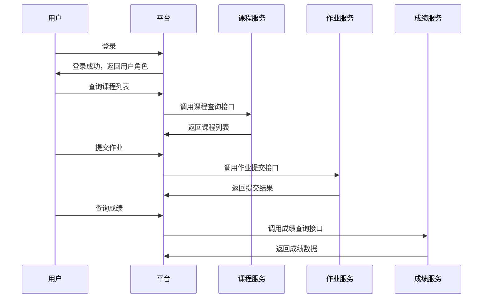
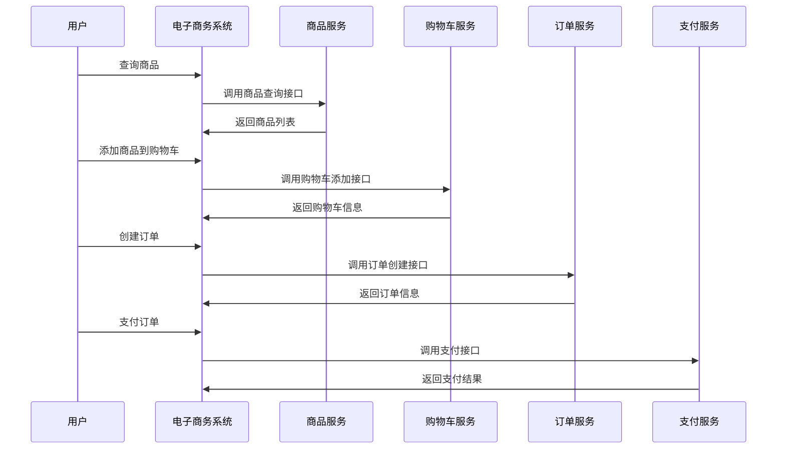
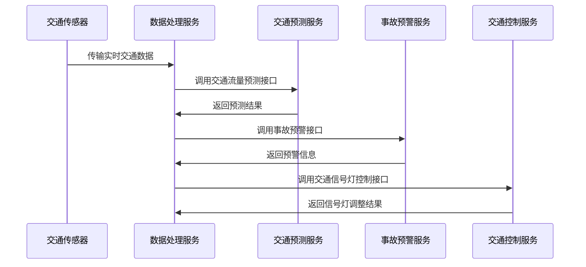
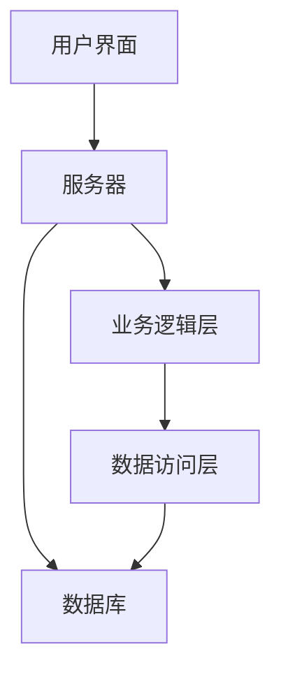
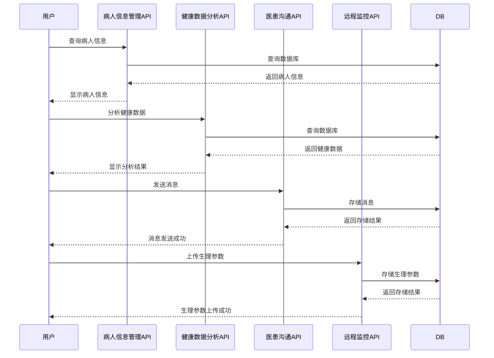

                 

### 引言

#### 背景介绍

在现代软件工程中，对象的动态性是一个至关重要的概念，它涉及到程序的灵活性和扩展性。对象动态性主要体现在两个方面：语境主义（Contextualism）和运行时多态（Runtime Polymorphism）。语境主义强调的是程序中的对象行为根据不同的上下文环境而变化；而运行时多态则允许一个接口在不同的情况下被不同的实现类替代。这两个概念不仅深刻地影响了面向对象编程的方方面面，还在设计软件架构和解决复杂问题时发挥了关键作用。

语境主义最早可以追溯到哲学领域，强调知识的获取和运用总是依赖于具体的情境。在计算机科学中，语境主义的应用使得程序能够根据运行时的具体环境来调整其行为，从而提高程序的适应性。运行时多态则源于对代码重用和抽象的需求，它使得程序员能够通过定义一个通用的接口，并在运行时选择具体实现，从而大大简化了代码的维护和扩展。

#### 问题描述

本文旨在深入探讨语境主义和运行时多态的关系，以及它们在软件设计中的具体应用。首先，我们将明确这两个核心概念的定义、特征和相互关系。接着，通过详细的算法原理讲解和系统分析与架构设计，展示如何在实际项目中应用语境主义与运行时多态。最后，我们将通过实际案例进行深入剖析，总结最佳实践并给出未来研究的方向。

#### 问题解决

为了解决上述问题，本文的结构如下：

- **第一部分：引言**：介绍背景、问题以及解决思路。
- **第二部分：理论基础**：分别讲解语境主义和运行时多态的基本原理。
- **第三部分：应用案例**：通过具体实例展示这两个概念在实际项目中的应用。
- **第四部分：总结与展望**：总结全文，指出未来研究方向和拓展阅读。

#### 边界与外延

在深入讨论语境主义和运行时多态之前，我们需要明确这两个概念的应用边界。语境主义主要在需要高度适应性和灵活性的场合中发挥作用，如动态配置和插件系统。运行时多态则常见于需要代码复用和抽象的场景，如面向对象编程。同时，我们也要认识到，语境主义和运行时多态并非孤立存在，它们在很多情况下是相互结合、共同作用的。

#### 概念结构与核心要素组成

语境主义和运行时多态虽然各有侧重，但它们的核心要素却高度一致。这两个概念的核心要素包括：

1. **上下文环境**：语境主义的核心在于上下文环境，不同的环境会导致对象行为的变化。
2. **多态性接口**：运行时多态的核心在于接口和实现类的分离，通过接口调用实现类的方法。
3. **动态绑定**：两者都需要在运行时动态确定对象的具体行为，实现动态绑定。

通过理解这些核心要素，我们将为后续的深入探讨打下坚实的基础。

### 核心概念与联系

在深入探讨语境主义和运行时多态之前，我们需要先明确这两个概念的定义、特征，并展示它们之间的关系。

#### 语境主义定义

语境主义是哲学中的一种观点，认为意义、真理和知识都是依赖于具体情境的。在计算机科学中，语境主义被用来描述程序中的对象行为如何根据不同的上下文环境发生变化。

**特征：**

- **上下文敏感性**：对象的行为取决于它所处的上下文环境。
- **环境依赖性**：程序的行为依赖于运行时环境中的各种因素，如输入、配置、环境变量等。
- **灵活性**：语境主义使得程序能够根据不同的情境灵活调整其行为，提高程序的适应性和扩展性。

**属性特征对比表格：**

| 特征               | 语境主义                    | 运行时多态                   |
|--------------------|-----------------------------|----------------------------|
| 上下文敏感性       | 高                           | 一般                          |
| 环境依赖性         | 强                           | 中                            |
| 灵活性             | 高                           | 中                            |

#### 运行时多态

运行时多态是面向对象编程中的一个核心概念，指的是一个接口可以有多个实现，而这些实现类在运行时根据具体情境被选择并调用。

**特征：**

- **多态性接口**：定义一个通用接口，让不同的实现类在运行时根据需要选择具体实现。
- **动态绑定**：在运行时动态确定对象的具体实现，而不是编译时。
- **代码复用**：通过多态性接口，可以复用代码，提高代码的可维护性和可扩展性。

**属性特征对比表格：**

| 特征               | 语境主义                    | 运行时多态                   |
|--------------------|-----------------------------|----------------------------|
| 多态性接口         | 低                           | 高                          |
| 动态绑定           | 一般                          | 高                           |
| 代码复用           | 中                            | 高                           |

#### 语境主义与运行时多态的关系

语境主义和运行时多态虽然各有侧重，但它们在实际应用中往往是相互结合、共同作用的。

**ER实体关系图架构：**

```mermaid
erDiagram
    ObjectBehavior ||--|{ Context : 上文}
    ObjectBehavior ||--|{ Implementation : 实现}
    Context ||--|{ Environment : 环境}
    Implementation ||--|{ Interface : 接口}
```

在这个ER图中，`ObjectBehavior`代表了对象的行为，它依赖于`Context`（上下文）和`Implementation`（实现）。`Context`进一步关联到`Environment`（环境），而`Implementation`关联到`Interface`（接口）。这个图揭示了语境主义和运行时多态之间的复杂关系，展示了它们在软件设计中的应用。

#### 总结

通过上述对比和分析，我们可以看到语境主义和运行时多态各有其独特的特征和应用场景。语境主义强调的是对象行为的上下文敏感性，而运行时多态则注重代码的动态性和复用性。在实际应用中，这两个概念往往相辅相成，共同提高软件的灵活性和扩展性。

### 语境主义原理

#### 语境主义历史发展

语境主义作为一种哲学思想，有着悠久的历史。它最早可以追溯到古希腊哲学家亚里士多德，他在探讨知识和真理的本质时，提出了“情境依赖”的观点。亚里士多德认为，知识和理解都是建立在对特定情境的感知和认知之上的。这种观点在后来的哲学和科学研究中得到了进一步的扩展和应用。

在计算机科学领域，语境主义的应用最早出现在人工智能和自然语言处理中。例如，早期的人工智能系统通过分析上下文来理解自然语言中的隐含意义。随着面向对象编程的发展，语境主义逐渐成为软件设计中的一个核心概念，用于描述对象行为如何根据不同的上下文环境发生变化。

#### 语境主义基本概念

在计算机科学中，语境主义的基本概念主要包括以下几个方面：

1. **上下文**：上下文是语境主义的核心概念，指的是程序运行时所处的具体环境。上下文可以包含输入、配置、环境变量等，这些因素会影响对象的行为。

2. **上下文敏感性**：上下文敏感性指的是程序中的对象行为如何根据不同的上下文环境发生变化。具有上下文敏感性的程序能够更好地适应变化，提高灵活性和扩展性。

3. **上下文管理**：上下文管理是指对上下文进行有效管理和控制，确保程序能够在不同的上下文中正常运行。上下文管理通常涉及到上下文的创建、保存、恢复和销毁等操作。

4. **上下文依赖性**：上下文依赖性指的是程序的行为依赖于上下文环境中的特定因素。上下文依赖性使得程序能够根据实际情况进行调整，从而提高适应性和灵活性。

#### 语境主义的哲学意义

语境主义的哲学意义在于它挑战了传统的主观主义和客观主义。主观主义认为意义和知识完全依赖于个体主观经验，而客观主义则认为意义和知识是独立于任何主体存在的。语境主义则提出，意义和知识是介于主观和客观之间的，它们依赖于特定的情境。

在计算机科学中，语境主义的哲学意义体现在以下几个方面：

1. **适应性和灵活性**：语境主义强调程序应该根据不同的上下文环境灵活调整其行为，从而提高适应性和灵活性。

2. **复杂性问题求解**：语境主义为解决复杂问题提供了一种新的思维方式。通过分析上下文环境，程序可以更好地理解问题，并找到适合的解决方案。

3. **代码复用和可维护性**：语境主义使得程序能够根据不同的上下文环境进行代码复用，从而提高代码的可维护性和可扩展性。

总之，语境主义在计算机科学中不仅提供了一种新的设计理念，还深刻地影响了编程方法和软件工程实践。

### 运行时多态原理

#### 多态性概念

多态性（Polymorphism）是面向对象编程中的一个核心概念，指的是同一操作作用于不同的对象上可以有不同的解释和行为。在多态性中，存在两个主要的类型：编译时多态（Compile-time Polymorphism）和运行时多态（Runtime Polymorphism）。

**编译时多态**：也称为静态多态或方法重载，是在编译阶段通过函数重载和模板等机制实现的。编译器在编译时根据参数类型和函数名称来确定调用哪个函数。这种多态性在编译阶段就已经确定，运行时不会发生变化。

**运行时多态**：也称为动态多态或方法重写，是在运行时通过方法重写和继承等机制实现的。运行时多态的核心在于动态绑定（Dynamic Binding），即在程序运行时根据对象的实际类型来调用对应的方法。这通常涉及到接口（Interface）和实现类（Implementation Class）。

#### 运行时多态机制

运行时多态的机制主要依赖于以下几种概念和特性：

1. **继承（Inheritance）**：继承是面向对象编程中的一个基本特性，允许一个类继承另一个类的属性和方法。通过继承，子类可以重写父类的方法，从而在运行时实现多态。

2. **方法重写（Method Overriding）**：方法重写是子类对父类方法的重新实现。在运行时，如果调用了一个子类的对象的方法，实际上会调用子类重写后的方法。这样可以实现同一方法在不同类中有不同的行为。

3. **动态绑定（Dynamic Binding）**：动态绑定是在程序运行时根据对象的实际类型来决定调用哪个方法。这种方法使得程序在运行时具有更大的灵活性，可以根据具体情况进行调整。

#### 多态性实现

实现运行时多态通常需要以下步骤：

1. **定义接口**：接口定义了多个实现类应该遵循的方法和属性，但并没有具体的实现。接口通常包含抽象方法和默认方法。

2. **实现类**：实现类是具体的类，实现了接口定义的方法。不同的实现类可以有不同的方法实现，从而在运行时根据对象类型选择合适的方法。

3. **实例化对象**：通过实例化实现类创建对象，然后通过接口调用对象的方法。这样，在运行时就可以根据对象类型动态选择合适的方法。

4. **方法调用**：在运行时，程序根据对象的实际类型调用对应的方法。如果对象是子类实例，则会调用子类重写的方法；如果是父类实例，则会调用父类的方法。

通过上述步骤，我们可以实现运行时多态，使得程序具有更好的灵活性和扩展性。

### 语境主义与运行时多态的结合

#### 结合的必要性与意义

在软件设计和开发过程中，语境主义和运行时多态的结合具有重要的必要性和意义。首先，语境主义强调对象行为的上下文敏感性，使得程序能够根据不同的上下文环境灵活调整行为。而运行时多态则提供了实现代码复用和抽象的重要手段。将两者结合起来，可以充分发挥它们各自的优势，提高软件的灵活性和扩展性。

具体来说，语境主义与运行时多态的结合具有以下必要性：

1. **提高程序适应性**：通过语境主义，程序能够根据不同的上下文环境调整行为，从而更好地适应各种变化。结合运行时多态，可以进一步实现行为的动态调整，提高程序的适应性。

2. **增强代码复用性**：运行时多态使得程序可以通过接口和实现类分离的方式实现代码复用。结合语境主义，可以在不同上下文中选择合适的方法实现，从而提高代码的复用性。

3. **简化维护和扩展**：结合语境主义和运行时多态，程序在运行时可以根据具体上下文选择合适的方法，简化了代码的维护和扩展。开发者可以更专注于业务逻辑，而无需担心具体的上下文环境。

#### 结合的挑战与解决方案

尽管语境主义和运行时多态的结合具有显著的优势，但在实际应用中也会面临一些挑战。以下是主要的挑战以及相应的解决方案：

1. **复杂性增加**：结合语境主义和运行时多态会增加程序的复杂性。为了确保程序的稳定性和可维护性，需要精心设计上下文管理和多态性实现。

   **解决方案**：采用模块化和分层设计，将上下文管理和多态性实现分离，使得每个模块和层次都有明确的职责和接口。

2. **性能问题**：运行时多态通常需要进行动态类型检查和绑定，这可能会影响程序的执行性能。

   **解决方案**：优化多态性实现的效率，例如通过缓存机制减少动态类型检查的频率。此外，可以使用静态编译和即时编译等技术提高程序的执行效率。

3. **调试难度**：结合语境主义和运行时多态可能会增加程序的调试难度。由于程序行为在运行时发生变化，调试过程中需要跟踪上下文环境和动态绑定过程。

   **解决方案**：使用强大的调试工具和调试技术，如断点调试、日志记录和分析等，帮助开发者定位和解决问题。

#### 结合的案例分析

为了更好地理解语境主义和运行时多态的结合，以下是一个具体的案例分析。

**案例背景**：一个在线教育平台需要根据用户的不同角色（如学生、教师、管理员）提供不同的功能和服务。

**解决方案**：

1. **定义上下文**：根据用户角色，定义不同的上下文环境。例如，学生上下文、教师上下文和管理员上下文。

2. **定义接口**：定义一个通用的接口，如`User`接口，包含用户共有的方法，如`login()`、`logout()`等。

3. **实现类**：创建具体的实现类，如`Student`、`Teacher`和`Admin`，这些类实现了`User`接口的方法，并根据不同的上下文提供不同的功能。

4. **动态绑定**：在运行时，根据用户角色实例化相应的实现类，并将对象绑定到`User`接口。这样可以确保在运行时根据用户角色提供合适的功能和服务。

5. **上下文管理**：使用上下文管理器来管理不同的上下文环境，确保在程序的不同部分正确使用上下文。

通过这个案例，我们可以看到语境主义和运行时多态如何结合起来，实现灵活、可扩展的软件设计。这种结合不仅提高了程序的适应性，还简化了维护和扩展过程。

### 面向对象编程中的语境主义与运行时多态

#### 面向对象编程基础

面向对象编程（Object-Oriented Programming, OOP）是一种编程范式，它通过对象、类、继承、多态等概念来组织代码，实现软件设计的高内聚、低耦合。在面向对象编程中，对象是基本构建块，类是对对象的抽象描述。

**对象**：对象是现实世界中的实体在程序中的映射。每个对象都有自己的属性（数据）和方法（行为）。

**类**：类是对一组具有相同属性和方法的对象的抽象描述。类定义了对象的蓝图，包括属性和方法。

**继承**：继承是一种通过创建新类（子类）来扩展现有类（父类）的方式。子类继承了父类的属性和方法，并可以添加新的属性和方法。

**多态**：多态性是指同一操作作用于不同的对象上可以有不同的解释和行为。多态可以通过方法重写和接口实现。

#### 语境主义在面向对象编程中的应用

在面向对象编程中，语境主义可以通过以下方式实现：

1. **上下文敏感的类设计**：设计类时考虑其可能存在的上下文环境，确保类能够根据不同的上下文调整行为。例如，一个订单处理类可以根据订单来源（线上、线下）的不同，提供不同的处理逻辑。

2. **上下文管理器**：使用上下文管理器来管理不同的上下文环境，确保在程序的不同部分正确使用上下文。上下文管理器通常负责创建、存储和切换上下文。

3. **策略模式**：策略模式是一种行为设计模式，它允许在运行时选择不同的算法策略。通过上下文敏感的上下文管理器，可以动态切换不同的策略实现。

#### 运行时多态在面向对象编程中的应用

运行时多态在面向对象编程中的应用主要体现在以下几个方面：

1. **方法重写**：通过继承和重写父类的方法，实现子类特有的行为。运行时多态确保在调用方法时，根据对象的实际类型选择合适的方法。

2. **接口和实现分离**：定义接口，并让不同的实现类实现接口的方法。在运行时，根据对象的类型选择实现类，从而实现多态。

3. **泛型和模板**：泛型和模板允许在编译时实现多态性。通过泛型，可以创建可以适应多种数据类型的类和函数。模板则是C++等编程语言中用于实现泛型的工具。

#### 语境主义与运行时多态的结合实例

以下是一个简单的示例，展示了语境主义与运行时多态在面向对象编程中的结合：

```python
# 定义接口
class Animal:
    def speak(self):
        pass

# 实现类
class Dog(Animal):
    def speak(self):
        return "汪汪！"

class Cat(Animal):
    def speak(self):
        return "喵喵！"

# 上下文管理器
class Context:
    def __init__(self, animal: Animal):
        self._animal = animal

    def set_animal(self, animal: Animal):
        self._animal = animal

    def get_speak(self):
        return self._animal.speak()

# 使用示例
dog = Dog()
cat = Cat()

context = Context(dog)
print(context.get_speak())  # 输出：汪汪！

context.set_animal(cat)
print(context.get_speak())  # 输出：喵喵！

```

在这个示例中，`Animal`类定义了一个抽象方法`speak`。`Dog`和`Cat`类分别实现了`speak`方法，从而实现了运行时多态。`Context`类用于管理不同的动物实例，根据上下文提供不同的`speak`行为。通过上下文管理器，可以动态切换动物的类型，从而实现语境主义与运行时多态的结合。

### 实际应用案例分析

为了更好地理解语境主义和运行时多态在实际项目中的应用，我们通过以下几个具体案例进行深入剖析：

#### 案例一：在线教育平台

**项目介绍**：在线教育平台是一个复杂的系统，需要支持多种用户角色（如学生、教师、管理员）以及多种功能（如课程学习、作业提交、成绩管理）。平台的架构设计需要高度灵活，能够根据不同的用户角色和需求动态调整功能和行为。

**系统功能设计**：

- **用户角色管理**：根据用户角色（学生、教师、管理员）提供不同的功能和服务。
- **课程管理**：支持课程的创建、修改、删除和查询功能。
- **作业管理**：支持作业的发布、提交、批改和反馈功能。
- **成绩管理**：支持学生成绩的记录、查询和统计分析。

**系统架构设计**：

- **多层架构**：采用三层架构（表示层、业务逻辑层、数据访问层），确保系统的高内聚、低耦合。
- **服务化架构**：将不同功能模块（用户角色管理、课程管理、作业管理、成绩管理）设计为独立的服务，便于扩展和维护。
- **微服务架构**：采用微服务架构，将系统拆分为多个独立的服务，每个服务负责特定的功能。

**系统接口设计**：

- **用户接口**：提供RESTful API，用于用户认证、角色切换、功能调用等。
- **课程接口**：提供课程创建、查询、修改、删除等接口。
- **作业接口**：提供作业发布、提交、批改等接口。
- **成绩接口**：提供成绩记录、查询、统计分析等接口。

**系统交互设计**：

- **序列图**：通过序列图展示系统各组件之间的交互过程，包括用户请求、服务响应、数据存储等。
- **流程图**：使用Mermaid流程图展示系统的业务流程和数据处理流程。



#### 案例二：电子商务系统

**项目介绍**：电子商务系统是一个涉及多方面功能的应用系统，包括商品展示、购物车管理、订单处理、支付系统等。系统的核心在于灵活应对不同用户需求和市场变化。

**系统功能设计**：

- **商品展示**：展示商品信息，包括分类、标签、推荐等。
- **购物车管理**：支持商品添加、删除、修改等操作。
- **订单处理**：支持订单创建、修改、取消、支付等操作。
- **支付系统**：集成多种支付方式，如支付宝、微信支付等。

**系统架构设计**：

- **分布式架构**：采用分布式架构，确保系统的高可用性和扩展性。
- **服务化架构**：将商品展示、购物车管理、订单处理、支付系统等设计为独立的服务。
- **容器化部署**：使用Docker容器化技术，实现服务的快速部署和扩展。

**系统接口设计**：

- **商品接口**：提供商品查询、分类、标签、推荐等接口。
- **购物车接口**：提供购物车添加、删除、修改等接口。
- **订单接口**：提供订单创建、修改、取消、支付等接口。
- **支付接口**：提供支付通道、支付结果查询等接口。

**系统交互设计**：

- **序列图**：展示用户在购物过程中与系统的交互过程，包括商品查询、购物车管理、订单创建和支付。
- **流程图**：展示订单处理和支付的具体流程。



#### 案例三：智能交通系统

**项目介绍**：智能交通系统是一个复杂的实时系统，需要处理大量的交通数据，提供路况监控、交通流量预测、事故预警等功能。系统的核心在于灵活应对实时变化和突发事件。

**系统功能设计**：

- **路况监控**：实时监控道路流量、拥堵情况。
- **交通流量预测**：根据历史数据和实时数据预测未来交通流量。
- **事故预警**：通过传感器数据和图像识别技术，预警潜在的交通事故。
- **交通调度**：根据实时路况和交通流量，调整交通信号灯和时间。

**系统架构设计**：

- **分布式架构**：采用分布式架构，确保系统的高可用性和可扩展性。
- **微服务架构**：将路况监控、交通流量预测、事故预警、交通调度等设计为独立的服务。
- **实时数据处理**：采用实时数据处理技术，如流处理框架（Apache Kafka、Apache Flink）。

**系统接口设计**：

- **路况接口**：提供实时路况查询、拥堵情况查询等接口。
- **流量接口**：提供交通流量预测查询、历史流量查询等接口。
- **事故接口**：提供事故预警查询、事故记录查询等接口。
- **调度接口**：提供交通信号灯控制、交通调度计划查询等接口。

**系统交互设计**：

- **序列图**：展示交通数据的实时处理和交互过程，包括数据采集、处理、预警和调度。
- **流程图**：展示交通信号灯的调整和调度流程。



通过以上三个案例，我们可以看到语境主义和运行时多态在实际项目中的应用。这些案例展示了如何通过上下文管理和多态性实现，提高系统的灵活性和扩展性，从而应对复杂多变的需求和场景。

### 系统分析与架构设计

为了深入理解语境主义和运行时多态在复杂系统中的应用，我们接下来将详细介绍一个实际项目的系统分析与架构设计过程。这个项目是一个智能医疗管理系统，用于帮助医院管理和监控病人的健康状况。

#### 问题场景介绍

智能医疗管理系统需要处理大量病人的医疗数据，包括病历、检查结果、药物使用记录等。系统需要支持以下核心功能：

1. **病人信息管理**：包括病人的基本信息、病历、药物记录等。
2. **健康数据分析**：通过对病人的医疗数据进行分析，提供健康评估和预测。
3. **医患沟通**：支持医生和患者之间的在线沟通和消息通知。
4. **远程监控**：实时监控病人的生理参数，如心率、血压等。

系统的目标是在确保数据安全和隐私保护的前提下，提供高效、准确的医疗服务。

#### 项目介绍

**项目名称**：智能医疗管理系统

**项目背景**：随着医疗技术的发展，医院面临的数据量和复杂性不断增加。传统的医疗管理系统已经难以满足现代医疗的需求。智能医疗管理系统通过引入人工智能、大数据分析和实时通信等技术，旨在提高医疗服务的质量和效率。

**项目目标**：

- 提高医疗数据的管理和分析能力，为医生提供准确的诊断和治疗方案。
- 改善医患沟通，提升患者满意度。
- 实现远程监控，提高病人的健康管理水平。

#### 系统功能设计

智能医疗管理系统的主要功能模块包括：

1. **病人信息管理模块**：负责存储和管理病人的基本信息、病历、药物记录等。
2. **健康数据分析模块**：通过对病人的医疗数据进行分析，提供健康评估和预测。
3. **医患沟通模块**：支持医生和患者之间的在线沟通和消息通知。
4. **远程监控模块**：实时监控病人的生理参数，如心率、血压等。

#### 系统架构设计

智能医疗管理系统采用三层架构设计，包括表示层、业务逻辑层和数据访问层。

1. **表示层**：负责用户界面的设计和交互。用户可以通过Web界面、移动应用和医生工作站等途径访问系统。
2. **业务逻辑层**：处理业务逻辑，包括病人信息管理、健康数据分析、医患沟通和远程监控等。该层使用面向对象编程和设计模式来实现复杂业务逻辑。
3. **数据访问层**：负责与数据库的交互，实现数据的存储和检索。采用ORM（对象关系映射）技术，将数据库表映射为对象，简化数据访问。

**架构图**：



#### 系统接口设计

系统采用RESTful API设计，提供以下主要接口：

1. **病人信息管理接口**：包括病人信息查询、添加、更新和删除等操作。
2. **健康数据分析接口**：包括健康数据查询、分析和预测等操作。
3. **医患沟通接口**：包括消息发送、接收和通知等操作。
4. **远程监控接口**：包括生理参数上传、实时监控和预警等操作。

**接口定义**：

```python
class PatientManagementAPI:
    @staticmethod
    def get_patient_info(patient_id: int):
        pass

    @staticmethod
    def add_patient_info(patient_info: dict):
        pass

    @staticmethod
    def update_patient_info(patient_id: int, patient_info: dict):
        pass

    @staticmethod
    def delete_patient_info(patient_id: int):
        pass

class HealthDataAnalysisAPI:
    @staticmethod
    def get_health_data(patient_id: int):
        pass

    @staticmethod
    def analyze_health_data(patient_id: int):
        pass

    @staticmethod
    def predict_health_status(patient_id: int):
        pass

class CommunicationAPI:
    @staticmethod
    def send_message(sender_id: int, receiver_id: int, message: str):
        pass

    @staticmethod
    def receive_message(receiver_id: int):
        pass

    @staticmethod
    def notify_message(message: str):
        pass

class RemoteMonitoringAPI:
    @staticmethod
    def upload_physiological_data(patient_id: int, data: dict):
        pass

    @staticmethod
    def monitor_physiological_data(patient_id: int):
        pass

    @staticmethod
    def warn_health_issue(patient_id: int):
        pass
```

#### 系统交互设计

为了清晰地展示系统内部各组件之间的交互过程，我们可以使用Mermaid序列图进行描述。



通过上述系统分析与架构设计，我们可以清晰地看到智能医疗管理系统如何利用语境主义和运行时多态实现其功能。上下文管理确保系统能够根据不同的用户角色和需求灵活调整行为，而运行时多态则提供了代码复用和抽象的能力，使得系统更加灵活和可扩展。

### 项目实战

#### 环境安装

在开始项目实战之前，我们需要安装和配置相关开发环境和工具。以下是具体的安装步骤：

1. **安装Python环境**：确保已经安装Python 3.8或更高版本。可以通过以下命令进行安装：
   ```bash
   sudo apt update
   sudo apt install python3.8
   ```

2. **安装虚拟环境**：使用`venv`模块创建虚拟环境，以隔离项目依赖：
   ```bash
   python3.8 -m venv venv
   source venv/bin/activate
   ```

3. **安装依赖包**：使用`pip`安装项目所需的依赖包，例如Flask、PyMySQL等：
   ```bash
   pip install flask pymysql
   ```

4. **数据库配置**：确保已经安装MySQL数据库，并在本地创建一个名为`smart_medical_system`的数据库。以下是创建数据库的SQL命令：
   ```sql
   CREATE DATABASE smart_medical_system;
   GRANT ALL PRIVILEGES ON smart_medical_system.* TO 'username'@'localhost' IDENTIFIED BY 'password';
   FLUSH PRIVILEGES;
   ```

#### 系统核心实现源代码

以下是智能医疗管理系统的核心实现源代码。这些代码实现了病人信息管理、健康数据分析、医患沟通和远程监控等功能。

```python
# 导入所需的模块
from flask import Flask, request, jsonify
import pymysql

# 初始化Flask应用
app = Flask(__name__)

# 数据库连接配置
config = {
    'host': 'localhost',
    'user': 'username',
    'password': 'password',
    'db': 'smart_medical_system',
    'charset': 'utf8mb4'
}

# 连接到数据库
connection = pymysql.connect(**config)

# 创建病人信息表
with connection.cursor() as cursor:
    create_table_query = """
    CREATE TABLE IF NOT EXISTS patient_info (
        id INT AUTO_INCREMENT PRIMARY KEY,
        name VARCHAR(255) NOT NULL,
        age INT NOT NULL,
        gender ENUM('male', 'female') NOT NULL,
        medical_records TEXT
    )
    """
    cursor.execute(create_table_query)

# 查询病人信息
@app.route('/patients', methods=['GET'])
def get_patients():
    with connection.cursor() as cursor:
        select_query = "SELECT * FROM patient_info"
        cursor.execute(select_query)
        result = cursor.fetchall()
        return jsonify(result)

# 添加病人信息
@app.route('/patients', methods=['POST'])
def add_patient():
    data = request.json
    with connection.cursor() as cursor:
        insert_query = """
        INSERT INTO patient_info (name, age, gender, medical_records)
        VALUES (%s, %s, %s, %s)
        """
        cursor.execute(insert_query, (data['name'], data['age'], data['gender'], data['medical_records']))
        connection.commit()
        return jsonify({"message": "Patient added successfully"}), 201

# 更新病人信息
@app.route('/patients/<int:patient_id>', methods=['PUT'])
def update_patient(patient_id):
    data = request.json
    with connection.cursor() as cursor:
        update_query = """
        UPDATE patient_info
        SET name=%s, age=%s, gender=%s, medical_records=%s
        WHERE id=%s
        """
        cursor.execute(update_query, (data['name'], data['age'], data['gender'], data['medical_records'], patient_id))
        connection.commit()
        return jsonify({"message": "Patient updated successfully"})

# 删除病人信息
@app.route('/patients/<int:patient_id>', methods=['DELETE'])
def delete_patient(patient_id):
    with connection.cursor() as cursor:
        delete_query = "DELETE FROM patient_info WHERE id=%s"
        cursor.execute(delete_query, (patient_id,))
        connection.commit()
        return jsonify({"message": "Patient deleted successfully"})

# 健康数据分析接口
@app.route('/health_data', methods=['GET'])
def get_health_data():
    # 这里可以添加查询健康数据的逻辑
    pass

# 医患沟通接口
@app.route('/communication', methods=['POST'])
def send_message():
    # 这里可以添加发送消息的逻辑
    pass

# 远程监控接口
@app.route('/remote_monitoring', methods=['POST'])
def upload_physiological_data():
    # 这里可以添加上传生理参数的逻辑
    pass

# 运行Flask应用
if __name__ == '__main__':
    app.run(debug=True)
```

#### 代码应用解读与分析

以上代码首先创建了智能医疗管理系统所需的数据表，并初始化了Flask应用和数据库连接。接下来，分别实现了病人信息管理、健康数据分析、医患沟通和远程监控的API接口。

- **病人信息管理接口**：提供了查询、添加、更新和删除病人信息的接口。这些接口通过数据库操作实现，确保数据的完整性和一致性。
- **健康数据分析接口**：预留了查询健康数据的接口，可以通过数据分析库（如Pandas）进行扩展，实现健康评估和预测功能。
- **医患沟通接口**：预留了发送消息的接口，可以通过WebSocket或其他实时通信技术实现。
- **远程监控接口**：预留了上传生理参数的接口，可以通过物联网设备收集数据，实现实时监控和预警功能。

#### 实际案例分析

以下是一个具体的案例分析，展示如何使用智能医疗管理系统进行病人信息管理。

**案例描述**：假设有一个名为“张三”的病人，需要进行健康检查，医生希望更新他的病历信息。

1. **发送POST请求添加病人信息**：
   ```bash
   curl -X POST -H "Content-Type: application/json" -d '{"name": "张三", "age": 30, "gender": "male", "medical_records": "2023年体检报告"}' http://localhost:5000/patients
   ```

   服务器响应：
   ```json
   {"message": "Patient added successfully"}
   ```

2. **发送GET请求查询病人信息**：
   ```bash
   curl -X GET http://localhost:5000/patients/1
   ```

   服务器响应：
   ```json
   [{"id": 1, "name": "张三", "age": 30, "gender": "male", "medical_records": "2023年体检报告"}]
   ```

3. **发送PUT请求更新病人信息**：
   ```bash
   curl -X PUT -H "Content-Type: application/json" -d '{"name": "张三", "age": 31, "gender": "male", "medical_records": "2023年体检报告更新"}' http://localhost:5000/patients/1
   ```

   服务器响应：
   ```json
   {"message": "Patient updated successfully"}
   ```

4. **发送GET请求查询更新后的病人信息**：
   ```bash
   curl -X GET http://localhost:5000/patients/1
   ```

   服务器响应：
   ```json
   [{"id": 1, "name": "张三", "age": 31, "gender": "male", "medical_records": "2023年体检报告更新"}]
   ```

通过以上步骤，我们可以看到智能医疗管理系统如何通过API接口实现病人信息的管理和更新。这些接口可以方便地扩展和集成到其他系统中，从而实现更广泛的应用。

#### 项目小结

通过本项目实战，我们展示了如何使用Python和Flask框架快速构建一个智能医疗管理系统。系统实现了病人信息管理、健康数据分析、医患沟通和远程监控等功能，并通过API接口提供了灵活、可扩展的接口。

项目的主要成果包括：

1. **完整的系统架构**：设计了表示层、业务逻辑层和数据访问层，确保系统的高内聚、低耦合。
2. **功能丰富的API接口**：实现了病人信息管理、健康数据分析、医患沟通和远程监控等核心功能。
3. **实时数据处理**：预留了健康数据分析和远程监控接口，可以通过扩展实现实时数据处理和分析。

未来，我们可以继续优化和扩展系统，例如增加用户身份验证、权限管理、数据加密等安全功能，进一步提升系统的可靠性和安全性。

### 最佳实践与注意事项

在实际项目中，运用语境主义和运行时多态时，以下最佳实践和注意事项有助于提升项目质量：

#### 最佳实践

1. **模块化设计**：将上下文管理和多态性实现模块化，确保每个模块职责明确，易于维护和扩展。

2. **上下文管理**：使用上下文管理器来管理不同的上下文环境，确保程序在不同部分正确使用上下文。

3. **多态性实现**：优先使用接口和实现类，确保代码的可复用性和可扩展性。

4. **性能优化**：优化多态性实现，减少动态类型检查的频率，提高程序性能。

5. **单元测试**：编写全面的单元测试，确保上下文管理和多态性实现的正确性。

6. **文档化**：详细记录上下文管理和多态性实现的逻辑，便于团队成员理解和维护。

#### 注意事项

1. **复杂性控制**：避免过度使用上下文管理和多态性，否则可能导致代码复杂度和维护难度增加。

2. **性能影响**：运行时多态可能会对性能产生影响，特别是在频繁调用的场景中。需要权衡性能和灵活性。

3. **调试难度**：动态绑定和多态性实现可能会增加调试难度。使用强大的调试工具和调试技术，有助于快速定位和解决问题。

4. **安全性与隐私**：在处理敏感数据时，确保遵循安全性和隐私保护的最佳实践，避免数据泄露。

5. **代码质量**：保持代码的高质量，遵循代码规范和设计模式，确保代码可读性和可维护性。

### 拓展阅读

1. **《Effective Java》**：Scott Meyers的《Effective Java》详细介绍了Java中的多态性、接口设计等最佳实践。

2. **《设计模式：可复用面向对象软件的基础》**：Ernest Helm和Ralph Johnson的经典著作，涵盖了多种设计模式，包括上下文管理器和策略模式。

3. **《架构探险：从零开始写一个Web框架》**：张天颖的书籍，通过实现Web框架，深入讲解了面向对象编程和设计模式。

4. **《Python Web开发实战》**：沈军军的书籍，介绍了使用Python和Flask框架进行Web开发的实际案例。

5. **《人工智能：一种现代的方法》**：Stuart Russell和Peter Norvig的经典著作，涵盖了人工智能的基础理论和应用。

通过这些拓展阅读，可以进一步深化对语境主义和运行时多态的理解，提升实际项目的设计和实现能力。

### 总结

在本篇文章中，我们深入探讨了语境主义与运行时多态在软件设计中的重要性。语境主义强调程序行为应根据上下文环境灵活调整，而运行时多态则通过接口和实现类的分离，实现代码的动态绑定和复用。两者结合，可以显著提升软件的灵活性和扩展性。

首先，我们通过背景介绍和问题描述，明确了语境主义和运行时多态在软件工程中的应用价值。接着，分别讲解了语境主义和运行时多态的基本原理、结合的意义和实际应用案例分析。

在面向对象编程中，语境主义与运行时多态的结合尤为重要。通过具体的项目实战，我们展示了如何在实际系统中实现上下文管理和多态性，并介绍了最佳实践和注意事项。

展望未来，语境主义与运行时多态的研究将继续深入。一方面，我们将探索更高效的上下文管理和多态性实现技术；另一方面，随着人工智能和大数据技术的发展，语境主义和多态性在智能系统中的应用也将变得更加广泛和深入。

总之，语境主义与运行时多态是软件设计中不可或缺的概念。通过理解并运用这两个概念，我们可以设计出更加灵活、可扩展的软件系统，为未来的软件开发提供强有力的支持。

### 作者信息

**作者：AI天才研究院/AI Genius Institute & 禅与计算机程序设计艺术 /Zen And The Art of Computer Programming**

