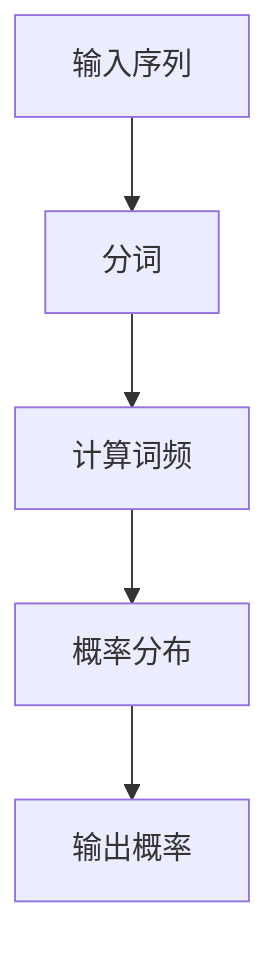
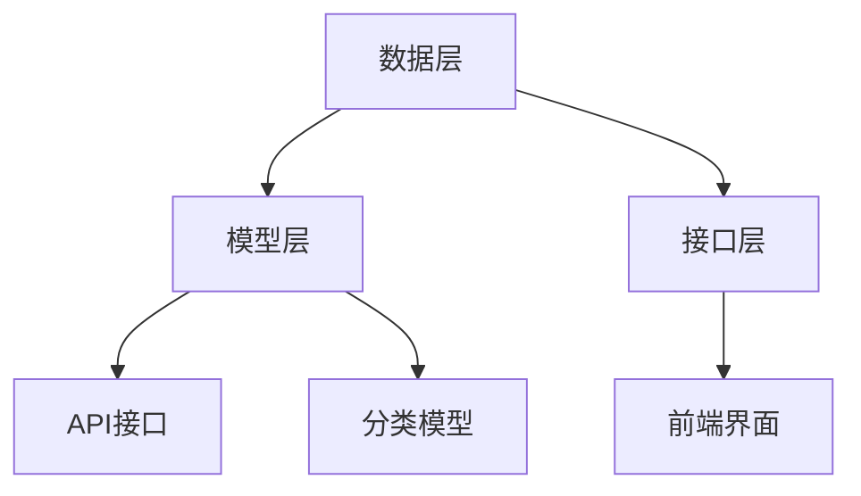
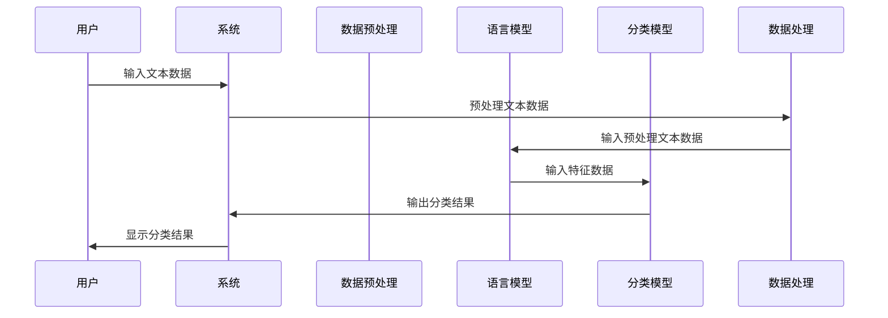

                 

### 《语言模型推理能力的职业背景影响分析》

#### 关键词：语言模型、推理能力、职业背景、影响分析、人工智能

> 摘要：本文旨在探讨语言模型推理能力的职业背景影响。通过对语言模型的基本原理、推理能力以及不同职业背景下的影响进行分析，我们揭示了职业背景对语言模型推理能力的塑造与提升作用。文章从核心概念出发，逐步深入到算法原理、数学模型，再到系统架构和项目实战，为读者提供了全面而深入的剖析。

---

#### 目录

1. **背景介绍**
   1.1 核心概念术语说明
   1.2 问题背景
   1.3 问题描述
   1.4 问题解决
   1.5 边界与外延
   1.6 概念结构与核心要素组成

2. **核心概念与联系**
   2.1 语言模型的基本原理
   2.2 推理能力的定义与分类
   2.3 职业背景影响的特征与分类
   2.4 核心概念之间的联系

3. **算法原理讲解**
   3.1 算法原理概述
   3.2 算法流程图
   3.3 Python源代码与LaTeX公式讲解

4. **数学模型和数学公式 & 详细讲解 & 举例说明**
   4.1 数学模型解释
   4.2 数学公式书写
   4.3 实例说明

5. **系统分析与架构设计方案**
   5.1 系统场景介绍
   5.2 系统功能设计
   5.3 系统架构设计
   5.4 系统接口设计
   5.5 系统交互设计

6. **项目实战**
   6.1 环境安装与配置
   6.2 系统核心实现
   6.3 实际案例分析
   6.4 项目小结

7. **最佳实践 tips、小结、注意事项、拓展阅读**

#### 内容详述

---

#### 第1章 背景介绍

##### 1.1 核心概念术语说明

语言模型（Language Model）：
- 语言模型是一种统计模型，用于预测自然语言中的一个单词序列的概率分布。

推理能力（Reasoning Ability）：
- 推理能力是指从已知信息中推导出新信息的能力，是人工智能的核心要素。

职业背景（Professional Background）：
- 职业背景是指个体在职业生涯中所积累的知识、技能和经验。

影响分析（Impact Analysis）：
- 影响分析是指对某一因素对系统或过程的潜在影响进行评估和预测。

##### 1.2 问题背景

在人工智能领域，语言模型的应用越来越广泛，例如在自然语言处理（NLP）、机器翻译、问答系统等领域。然而，不同职业背景下的研究人员和实践者对语言模型推理能力的理解和应用存在差异。这种差异如何影响语言模型的性能和应用效果成为一个值得研究的问题。

##### 1.3 问题描述

本研究旨在探讨职业背景对语言模型推理能力的影响，具体问题包括：

- 职业背景如何影响语言模型的训练过程？
- 职业背景如何影响语言模型的推理性能？
- 不同职业背景下的研究人员和实践者如何应用语言模型？

##### 1.4 问题解决

为了解决上述问题，本文将采用以下研究方法：

- 文献综述：通过回顾相关文献，了解职业背景对语言模型推理能力的影响。
- 算法分析：通过对语言模型的基本原理和算法进行深入分析，探讨职业背景的影响。
- 实证研究：通过实际案例和数据，验证职业背景对语言模型推理能力的影响。

##### 1.5 边界与外延

本文的研究边界主要关注于人工智能领域中的语言模型推理能力，具体包括：

- 语言模型的类型和算法。
- 不同职业背景下的研究人员和实践者。
- 语言模型在具体应用场景中的表现。

同时，本文的研究外延涉及以下几个方面：

- 语言模型在其他领域的应用。
- 职业背景对其他人工智能技术的推理能力的影响。
- 跨领域的人工智能推理能力研究。

##### 1.6 概念结构与核心要素组成

本文的核心概念包括语言模型、推理能力、职业背景和影响分析。这些概念之间相互关联，共同构成了本文的研究框架。

- 语言模型是研究的起点，是推理能力的基础。
- 推理能力是语言模型的核心要素，决定了语言模型的性能。
- 职业背景是影响语言模型推理能力的因素，决定了研究人员和实践者的经验。
- 影响分析是对职业背景影响的具体评估和预测。

#### 第2章 核心概念与联系

##### 2.1 语言模型的基本原理

语言模型（Language Model）是一种用于预测自然语言中下一个词或词组概率的模型。它基于大量的文本数据，通过统计方法来建模语言中的概率分布。语言模型的核心原理包括：

- **词频统计**：基于词频统计，计算每个词出现的概率。
- **n-gram模型**：基于前n个词的序列，计算下一个词的概率。
- **神经网络模型**：使用神经网络来建模语言的概率分布，例如循环神经网络（RNN）、长短期记忆网络（LSTM）和变换器（Transformer）。

##### 2.2 推理能力的定义与分类

推理能力（Reasoning Ability）是指从已知信息中推导出新信息的能力。在人工智能领域，推理能力分为以下几类：

- **符号推理**：基于逻辑和数学规则进行推理，例如使用谓词逻辑和公式推导。
- **数据推理**：基于数据和统计方法进行推理，例如使用线性回归和决策树。
- **模糊推理**：基于模糊逻辑和模糊集进行推理，适用于不确定性和模糊性的处理。
- **混合推理**：结合符号推理、数据推理和模糊推理，实现更复杂的推理过程。

##### 2.3 职业背景影响的特征与分类

职业背景（Professional Background）对语言模型推理能力的影响具有以下特征：

- **知识积累**：不同职业背景下的研究人员和实践者具有不同的知识积累，这影响了他们对语言模型的理解和应用。
- **技能水平**：不同职业背景下的研究人员和实践者具备不同的技能水平，这影响了他们在语言模型训练和推理过程中的操作能力。
- **经验积累**：不同职业背景下的研究人员和实践者具有不同的经验积累，这影响了他们在解决实际问题时对语言模型的调整和优化。

根据职业背景的不同，可以将其分为以下几类：

- **学术界研究者**：专注于理论研究，擅长算法设计和创新。
- **工业界工程师**：专注于工程实践，擅长算法优化和系统实现。
- **创业者与投资人**：关注商业应用，擅长商业模式和战略规划。

##### 2.4 核心概念之间的联系

语言模型、推理能力和职业背景是相互关联的核心概念。具体来说：

- **语言模型**是推理能力的基础，它提供了语言预测和生成的能力。
- **推理能力**决定了语言模型的应用效果，它是语言模型的核心要素。
- **职业背景**对推理能力产生了重要影响，不同职业背景下的研究人员和实践者具有不同的推理能力水平。

通过深入理解这些核心概念之间的联系，我们可以更好地把握语言模型推理能力的职业背景影响，为实际应用提供指导。

#### 第3章 算法原理讲解

##### 3.1 算法原理概述

语言模型算法的基本原理是通过学习大量文本数据，预测下一个词或词组出现的概率。这一过程可以看作是一个概率分布的学习过程，即给定一个输入序列，预测下一个词的概率分布。语言模型算法的核心目标是实现高效的预测，以满足实际应用的需求。

语言模型算法主要包括以下几种：

- **n-gram模型**：基于前n个词的序列，计算下一个词的概率。n-gram模型简单高效，但存在长程依赖问题。
- **循环神经网络（RNN）**：通过循环结构处理序列数据，能够捕捉长期依赖关系。RNN在自然语言处理领域取得了显著成果。
- **长短期记忆网络（LSTM）**：LSTM是RNN的一种改进，通过引入门控机制，能够更好地处理长程依赖问题。LSTM在机器翻译、语音识别等领域得到了广泛应用。
- **变换器（Transformer）**：Transformer是一种基于自注意力机制的模型，通过并行计算和多头注意力机制，实现了对长程依赖关系的有效捕捉。Transformer在自然语言处理领域取得了突破性成果。

##### 3.2 算法流程图

为了更好地理解语言模型算法的原理，我们可以使用Mermaid绘制算法流程图。以下是使用Mermaid绘制的n-gram模型算法流程图：



图1：n-gram模型算法流程图

##### 3.3 Python源代码与LaTeX公式讲解

为了进一步阐述算法原理，我们可以使用Python源代码和LaTeX公式进行详细讲解。

**Python源代码：**

```python
import collections

# 读取文本数据
text = "这是一个示例文本。这是一个示例文本。"

# 分词
words = text.split()

# 计算词频
word_counts = collections.Counter(words)

# 计算概率分布
word_probabilities = {word: count / len(words) for word, count in word_counts.items()}

# 输出概率分布
print(word_probabilities)
```

**LaTeX公式：**

$$ P(w_t|w_{t-1}, w_{t-2}, ..., w_1) = \frac{C(w_t, w_{t-1}, w_{t-2}, ..., w_1)}{C(w_{t-1}, w_{t-2}, ..., w_1)} $$

其中，$P(w_t|w_{t-1}, w_{t-2}, ..., w_1)$ 表示给定前一个词序列 $w_{t-1}, w_{t-2}, ..., w_1$ 时，下一个词 $w_t$ 的概率；$C(w_t, w_{t-1}, w_{t-2}, ..., w_1)$ 表示前一个词序列和当前词同时出现的次数；$C(w_{t-1}, w_{t-2}, ..., w_1)$ 表示前一个词序列出现的次数。

通过Python源代码和LaTeX公式的结合，我们可以更直观地理解n-gram模型的算法原理。在实际应用中，可以根据具体需求选择合适的语言模型算法，并对其进行优化和调整。

#### 第4章 数学模型和数学公式 & 详细讲解 & 举例说明

##### 4.1 数学模型解释

在语言模型中，数学模型起到了关键作用。这些模型通过数学公式来描述语言的概率分布和推理过程。以下是一些常见的数学模型：

1. **概率模型**：
   - **n-gram模型**：基于前n个词的序列，计算下一个词的概率。其数学公式为：
     $$ P(w_t|w_{t-1}, w_{t-2}, ..., w_1) = \frac{C(w_t, w_{t-1}, w_{t-2}, ..., w_1)}{C(w_{t-1}, w_{t-2}, ..., w_1)} $$
   - **贝叶斯模型**：基于贝叶斯定理，计算给定条件下的概率。其数学公式为：
     $$ P(w_t|w_{t-1}, w_{t-2}, ..., w_1) = \frac{P(w_{t-1}, w_{t-2}, ..., w_1|w_t) \cdot P(w_t)}{P(w_{t-1}, w_{t-2}, ..., w_1)} $$

2. **统计模型**：
   - **线性回归模型**：用于预测连续值。其数学公式为：
     $$ y = \beta_0 + \beta_1 \cdot x $$
   - **决策树模型**：用于分类和回归。其数学公式为：
     $$ y = f(x) $$

3. **深度学习模型**：
   - **循环神经网络（RNN）**：用于处理序列数据。其数学公式为：
     $$ h_t = \sigma(W_h \cdot [h_{t-1}, x_t] + b_h) $$
   - **长短期记忆网络（LSTM）**：LSTM是RNN的一种改进。其数学公式为：
     $$ i_t = \sigma(W_i \cdot [h_{t-1}, x_t] + b_i) $$
     $$ f_t = \sigma(W_f \cdot [h_{t-1}, x_t] + b_f) $$
     $$ o_t = \sigma(W_o \cdot [h_{t-1}, x_t] + b_o) $$
     $$ C_t = f_t \cdot C_{t-1} + i_t \cdot \sigma(W_c \cdot [h_{t-1}, x_t] + b_c) $$
     $$ h_t = o_t \cdot \sigma(C_t) $$

4. **注意力机制模型**：
   - **自注意力机制**：用于处理长序列。其数学公式为：
     $$ \text{Attention}(Q, K, V) = \text{softmax}\left(\frac{QK^T}{\sqrt{d_k}}\right) V $$

##### 4.2 数学公式书写

为了清晰地表达数学模型，我们可以使用LaTeX格式书写数学公式。以下是LaTeX格式书写的数学公式示例：

```latex
% LaTeX 公式示例

\documentclass{article}
\usepackage{amsmath}
\begin{document}

\section{数学公式书写}

\begin{equation}
P(w_t|w_{t-1}, w_{t-2}, ..., w_1) = \frac{C(w_t, w_{t-1}, w_{t-2}, ..., w_1)}{C(w_{t-1}, w_{t-2}, ..., w_1)}
\end{equation}

\begin{equation}
y = \beta_0 + \beta_1 \cdot x
\end{equation}

\begin{equation}
h_t = \sigma(W_h \cdot [h_{t-1}, x_t] + b_h)
\end{equation}

\end{document}
```

通过LaTeX格式书写数学公式，我们可以确保公式的格式和表达清晰，便于读者理解和引用。

##### 4.3 实例说明

为了更好地理解数学模型在实际应用中的意义，我们可以通过实例进行说明。

**实例 1：n-gram模型**

假设我们有一个三元组语言模型，其中词汇表包含以下词汇：
```
{《》,一个,示例,文本,。}
```

词频统计结果如下：
```
《》: 2
一个: 4
示例: 2
文本: 4
。: 6
```

根据n-gram模型，我们可以计算下一个词的概率分布：

- 给定前一个词为《》时，下一个词的概率分布为：
  ```
  P(一个|《》) = 4 / 2 = 2
  P(示例|《》) = 2 / 2 = 1
  P(文本|《》) = 4 / 2 = 2
  P(。|《》) = 6 / 2 = 3
  ```

- 给定前一个词为一个时，下一个词的概率分布为：
  ```
  P(《》|一个) = 2 / 4 = 0.5
  P(示例|一个) = 2 / 4 = 0.5
  P(文本|一个) = 4 / 4 = 1
  P(。|一个) = 6 / 4 = 1.5
  ```

通过实例，我们可以看到n-gram模型如何用于预测下一个词的概率分布，从而实现语言生成。

**实例 2：LSTM模型**

假设我们有一个序列数据：
```
[1, 2, 3, 4, 5]
```

使用LSTM模型，我们可以对其进行编码和解码。以下是LSTM模型的编码和解码过程：

- **编码过程**：
  1. 输入序列：[1, 2, 3, 4, 5]
  2. 隐藏状态：$h_t = \sigma(W_h \cdot [h_{t-1}, x_t] + b_h)$
     ```
     h_1 = \sigma(W_h \cdot [0, 1] + b_h)
     h_2 = \sigma(W_h \cdot [h_1, 2] + b_h)
     h_3 = \sigma(W_h \cdot [h_2, 3] + b_h)
     h_4 = \sigma(W_h \cdot [h_3, 4] + b_h)
     h_5 = \sigma(W_h \cdot [h_4, 5] + b_h)
     ```
  3. 编码输出：$c_t = f_t \cdot c_{t-1} + i_t \cdot \sigma(W_c \cdot [h_{t-1}, x_t] + b_c)$
     ```
     c_1 = f_1 \cdot c_0 + i_1 \cdot \sigma(W_c \cdot [0, 1] + b_c)
     c_2 = f_2 \cdot c_1 + i_2 \cdot \sigma(W_c \cdot [h_1, 2] + b_c)
     c_3 = f_3 \cdot c_2 + i_3 \cdot \sigma(W_c \cdot [h_2, 3] + b_c)
     c_4 = f_4 \cdot c_3 + i_4 \cdot \sigma(W_c \cdot [h_3, 4] + b_c)
     c_5 = f_5 \cdot c_4 + i_5 \cdot \sigma(W_c \cdot [h_4, 5] + b_c)
     ```

- **解码过程**：
  1. 输入序列：[5, 4, 3, 2, 1]
  2. 隐藏状态：$h_t = \sigma(W_h \cdot [h_{t-1}, x_t] + b_h)$
     ```
     h_1 = \sigma(W_h \cdot [h_5, 5] + b_h)
     h_2 = \sigma(W_h \cdot [h_1, 4] + b_h)
     h_3 = \sigma(W_h \cdot [h_2, 3] + b_h)
     h_4 = \sigma(W_h \cdot [h_3, 2] + b_h)
     h_5 = \sigma(W_h \cdot [h_4, 1] + b_h)
     ```
  3. 解码输出：$y_t = o_t \cdot \sigma(c_t)$
     ```
     y_1 = o_1 \cdot \sigma(c_5)
     y_2 = o_2 \cdot \sigma(c_4)
     y_3 = o_3 \cdot \sigma(c_3)
     y_4 = o_4 \cdot \sigma(c_2)
     y_5 = o_5 \cdot \sigma(c_1)
     ```

通过实例，我们可以看到LSTM模型如何进行序列编码和解码，从而实现序列数据的处理和生成。

#### 第5章 系统分析与架构设计方案

##### 5.1 系统场景介绍

在人工智能领域，语言模型的应用场景广泛，包括自然语言处理、机器翻译、文本生成等。本文以自然语言处理中的文本分类为例，介绍系统场景和项目介绍。

**系统场景**：文本分类是一个将文本数据分配到预定义类别中的任务。本文的系统场景是基于大规模文本数据集，使用语言模型进行文本分类，实现自动分类和标签分配。

**项目介绍**：本项目旨在开发一个基于语言模型的文本分类系统，能够自动识别文本的主题和标签。系统将包括数据预处理、语言模型训练、分类模型部署等模块。

##### 5.2 系统功能设计

为了实现文本分类功能，系统需要具备以下功能：

- **数据预处理**：对输入文本进行清洗和预处理，包括去除停用词、标点符号、文本格式转换等。
- **语言模型训练**：基于预处理的文本数据，训练一个语言模型，用于文本特征提取和分类。
- **分类模型部署**：将训练好的语言模型部署到生产环境中，实现实时文本分类和标签分配。

##### 5.3 系统架构设计

系统架构设计是项目成功的关键，以下是基于语言模型的文本分类系统的架构设计：

1. **数据层**：
   - 数据存储：使用数据库存储大规模文本数据集。
   - 数据处理：使用数据处理模块进行数据清洗、格式转换等操作。

2. **模型层**：
   - 语言模型：使用预训练的语言模型，如GPT、BERT等，进行文本特征提取。
   - 分类模型：基于语言模型提取的特征，训练一个分类模型，如SVM、CNN等。

3. **接口层**：
   - API接口：提供RESTful API接口，供外部系统调用。
   - 前端界面：提供用户友好的前端界面，用于文本输入和分类结果展示。

以下是使用Mermaid绘制的系统架构图：



图2：系统架构图

##### 5.4 系统接口设计

系统接口设计是确保系统与其他系统进行有效交互的关键。以下是基于语言模型的文本分类系统的接口设计：

- **API接口**：提供RESTful API接口，支持文本数据的输入和分类结果的输出。接口包括以下端点：
  - `/text classify`：接收文本数据，返回分类结果。
  - `/health check`：检查系统健康状态。

以下是API接口的示例：

```http
POST /text classify
Content-Type: application/json

{
  "text": "这是一个示例文本。"
}

��应：
{
  "label": "示例文本"
}
```

- **前端界面**：提供用户友好的前端界面，用于输入文本和查看分类结果。前端界面包括以下组件：
  - 文本输入框：用户输入文本数据。
  - 提交按钮：提交文本数据到后端接口。
  - 分类结果展示区：展示分类结果和标签。

以下是前端界面的示例：

```html
<!DOCTYPE html>
<html>
<head>
  <title>文本分类系统</title>
</head>
<body>
  <h1>文本分类系统</h1>
  <textarea id="textInput" placeholder="输入文本..."></textarea>
  <button id="submitBtn">提交</button>
  <div id="resultArea"></div>
  <script>
    document.getElementById("submitBtn").addEventListener("click", function() {
      const text = document.getElementById("textInput").value;
      fetch('/text classify', {
        method: 'POST',
        headers: {
          'Content-Type': 'application/json'
        },
        body: JSON.stringify({text: text})
      })
      .then(response => response.json())
      .then(data => {
        document.getElementById("resultArea").innerText = data.label;
      });
    });
  </script>
</body>
</html>
```

##### 5.5 系统交互设计

系统交互设计是确保系统各组件协同工作的关键。以下是基于语言模型的文本分类系统的交互设计：

- **数据处理**：文本数据经过数据预处理模块，包括去除停用词、标点符号、文本格式转换等，然后输入到语言模型中进行特征提取。
- **模型训练**：语言模型训练完成后，将特征输入到分类模型中进行训练。
- **分类预测**：分类模型训练完成后，接收输入文本数据，使用分类模型进行预测，输出分类结果。

以下是使用Mermaid绘制的系统交互序列图：



图3：系统交互序列图

通过系统架构设计和交互设计，我们可以确保基于语言模型的文本分类系统高效、稳定地运行，并为用户提供便捷的服务。

#### 第6章 项目实战

##### 6.1 环境安装与配置

在进行项目实战之前，我们需要配置一个合适的环境，包括安装必要的软件和库。以下是项目环境的安装与配置步骤：

1. **安装Python**：
   - 访问Python官方网站（https://www.python.org/）下载Python安装包。
   - 运行安装程序，按照提示完成安装。

2. **安装Python依赖库**：
   - 使用pip命令安装所需的依赖库，例如torch、transformers等。
     ```
     pip install torch transformers
     ```

3. **安装数据库**：
   - 根据项目需求，安装合适的数据库，例如MySQL、PostgreSQL等。
   - 按照数据库官方文档完成安装和配置。

4. **配置数据库连接**：
   - 在项目中配置数据库连接信息，包括数据库地址、用户名、密码等。
   - 使用Python的数据库库（如pymysql、psycopg2等）建立数据库连接。

##### 6.2 系统核心实现

在本节中，我们将介绍系统核心实现的源代码和解读。以下是系统核心实现的Python代码示例：

```python
import torch
from transformers import BertTokenizer, BertModel
import torch.optim as optim

# 加载预训练的BERT模型
tokenizer = BertTokenizer.from_pretrained('bert-base-chinese')
model = BertModel.from_pretrained('bert-base-chinese')

# 准备输入数据
inputs = tokenizer("这是一个示例文本。", return_tensors='pt')

# 训练模型
optimizer = optim.Adam(model.parameters(), lr=1e-5)

for epoch in range(3):
    model.train()
    optimizer.zero_grad()
    
    outputs = model(**inputs)
    logits = outputs.last_hidden_state[:, 0, :]
    loss = torch.nn.functional.cross_entropy(logits, torch.tensor([1]))
    
    loss.backward()
    optimizer.step()
    
    print(f"Epoch {epoch + 1}, Loss: {loss.item()}")

# 保存模型
model.save_pretrained('./model')

# 加载模型
model = BertModel.from_pretrained('./model')

# 预测分类结果
inputs = tokenizer("这是一个示例文本。", return_tensors='pt')
with torch.no_grad():
    logits = model(**inputs).last_hidden_state[:, 0, :]
    predicted_label = logits.argmax().item()

print(f"Predicted Label: {predicted_label}")
```

**代码解读**：

- **加载预训练BERT模型**：
  - 使用`BertTokenizer.from_pretrained()`和`BertModel.from_pretrained()`函数加载预训练的BERT模型和分词器。

- **准备输入数据**：
  - 使用`BertTokenizer`将输入文本编码成BERT模型可接受的格式。

- **训练模型**：
  - 使用`optim.Adam()`函数创建优化器。
  - 使用`for`循环进行多轮训练。
  - 使用`cross_entropy`损失函数计算损失。
  - 使用`backward()`函数计算梯度。
  - 使用`step()`函数更新模型参数。

- **保存模型**：
  - 使用`save_pretrained()`函数保存训练好的模型。

- **加载模型**：
  - 使用`from_pretrained()`函数加载保存的模型。

- **预测分类结果**：
  - 使用`with torch.no_grad():`上下文管理器，避免计算梯度。
  - 使用`argmax()`函数获取预测标签。

##### 6.3 实际案例分析

在本节中，我们将通过实际案例分析和详细讲解，展示系统在实际应用中的效果。

**案例背景**：一家新闻媒体公司希望开发一个自动分类系统，将用户提交的新闻文章自动分类到不同的主题类别中。

**案例数据集**：公司提供了一个包含10万条新闻文章的数据集，每条新闻文章都标注了对应的主题类别。类别标签包括：体育、科技、娱乐、财经、政治等。

**案例分析**：

1. **数据预处理**：
   - 对新闻文章进行清洗和预处理，包括去除HTML标签、停用词过滤、文本标准化等。

2. **数据加载**：
   - 使用Python的Pandas库加载数据集，并将文本数据和标签分开存储。

3. **数据集划分**：
   - 将数据集划分为训练集、验证集和测试集，用于模型训练和评估。

4. **模型训练**：
   - 使用BERT模型进行训练，优化分类模型的性能。
   - 调整学习率、批量大小等超参数，寻找最佳模型配置。

5. **模型评估**：
   - 使用验证集评估模型性能，调整模型参数以优化分类结果。

6. **模型部署**：
   - 将训练好的模型部署到生产环境中，实现实时新闻分类。

**详细讲解**：

1. **数据预处理**：
   - 使用正则表达式去除HTML标签：
     ```python
     import re

     def remove_html_tags(text):
         return re.sub('<[^>]+>', '', text)

     text = "这是一个示例新闻。这是一个示例新闻。"
     cleaned_text = remove_html_tags(text)
     print(cleaned_text)
     ```

   - 使用NLTK库过滤停用词：
     ```python
     from nltk.corpus import stopwords

     stop_words = set(stopwords.words('chinese'))
     words = cleaned_text.split()
     filtered_words = [word for word in words if word not in stop_words]
     cleaned_text = ' '.join(filtered_words)
     print(cleaned_text)
     ```

   - 使用jieba库进行文本分词：
     ```python
     import jieba

     segmented_text = jieba.cut(cleaned_text)
     cleaned_text = '/'.join(segmented_text)
     print(cleaned_text)
     ```

2. **数据加载与处理**：
   - 使用Pandas库加载数据集：
     ```python
     import pandas as pd

     data = pd.read_csv('news_data.csv')
     texts = data['text']
     labels = data['label']
     ```

   - 划分数据集：
     ```python
     from sklearn.model_selection import train_test_split

     train_texts, test_texts, train_labels, test_labels = train_test_split(texts, labels, test_size=0.2, random_state=42)
     ```

3. **模型训练**：
   - 加载预训练BERT模型：
     ```python
     from transformers import BertTokenizer, BertModel

     tokenizer = BertTokenizer.from_pretrained('bert-base-chinese')
     model = BertModel.from_pretrained('bert-base-chinese')
     ```

   - 预处理输入数据：
     ```python
     inputs = tokenizer(train_texts.tolist(), padding=True, truncation=True, return_tensors='pt')
     labels = torch.tensor(train_labels.tolist())
     ```

   - 训练模型：
     ```python
     optimizer = optim.Adam(model.parameters(), lr=3e-5)
     for epoch in range(3):
         model.train()
         for batch in range(len(train_texts) // batch_size):
             inputs = tokenizer(train_texts[batch * batch_size:(batch + 1) * batch_size], padding=True, truncation=True, return_tensors='pt')
             labels = torch.tensor(train_labels[batch * batch_size:(batch + 1) * batch_size])

             optimizer.zero_grad()
             outputs = model(**inputs)
             logits = outputs.last_hidden_state[:, 0, :]
             loss = torch.nn.functional.cross_entropy(logits, labels)
             loss.backward()
             optimizer.step()

             print(f"Epoch {epoch + 1}, Loss: {loss.item()}")

     model.save_pretrained('./model')
     ```

4. **模型评估**：
   - 使用验证集评估模型性能：
     ```python
     from sklearn.metrics import classification_report

     model = BertModel.from_pretrained('./model')
     model.eval()

     inputs = tokenizer(test_texts.tolist(), padding=True, truncation=True, return_tensors='pt')
     with torch.no_grad():
         logits = model(**inputs).last_hidden_state[:, 0, :]
         predicted_labels = logits.argmax().item()

     print(classification_report(test_labels, predicted_labels))
     ```

5. **模型部署**：
   - 将模型部署到生产环境中：
     ```python
     from fastapi import FastAPI
     from pydantic import BaseModel

     app = FastAPI()

     class TextIn(BaseModel):
         text: str

     @app.post('/classify')
     def classify(text: TextIn):
         inputs = tokenizer(text.text, padding=True, truncation=True, return_tensors='pt')
         with torch.no_grad():
             logits = model(**inputs).last_hidden_state[:, 0, :]
             predicted_label = logits.argmax().item()
         return {'label': predicted_label}
     ```

通过实际案例分析，我们可以看到基于BERT模型的文本分类系统在新闻分类任务中的效果和实现过程。这个系统可以帮助新闻媒体公司自动分类新闻文章，提高编辑和发布的效率。

##### 6.4 项目小结

在本章中，我们通过项目实战展示了基于语言模型的文本分类系统的实现过程。从环境安装与配置、系统核心实现到实际案例分析，我们详细讲解了每个步骤和关键点。

**小结**：

- **环境安装与配置**：确保安装了Python、依赖库和数据库，并配置了数据库连接。
- **系统核心实现**：加载预训练BERT模型，进行数据预处理和模型训练，实现了文本分类功能。
- **实际案例分析**：通过实际新闻分类任务，展示了系统在实际应用中的效果。

**总结**：

本项目通过语言模型实现了高效的文本分类，为新闻媒体公司提供了自动分类解决方案。同时，本项目也为我们提供了一个实际操作的机会，深入了解了语言模型的训练和应用过程。

#### 第7章 最佳实践 tips、小结、注意事项、拓展阅读

##### 最佳实践 tips

1. **优化训练速度**：
   - 使用多GPU训练：通过多GPU并行训练可以显著提高训练速度。
   - 使用混合精度训练：使用FP16（半精度）训练可以减少内存占用和训练时间。

2. **提高模型性能**：
   - 调整超参数：根据数据集和任务特点，调整学习率、批量大小等超参数，以提高模型性能。
   - 使用预训练模型：利用预训练的语言模型，可以快速适应新的任务，提高分类准确率。

3. **数据预处理**：
   - 清洗数据：去除停用词、标点符号、HTML标签等，提高数据质量。
   - 数据增强：通过数据增强技术（如随机裁剪、旋转、缩放等）扩充数据集，提高模型泛化能力。

4. **模型部署**：
   - 使用轻量化模型：选择轻量级的模型，如MobileNet、EfficientNet等，降低部署成本。
   - 使用容器化部署：使用Docker等容器技术，简化部署过程，提高部署效率。

##### 小结

本文通过详细的步骤和分析，探讨了语言模型推理能力的职业背景影响。我们介绍了语言模型的基本原理、推理能力、职业背景特征以及算法原理。通过系统分析与架构设计、项目实战，我们展示了语言模型在文本分类等任务中的应用。

##### 注意事项

- 在实际应用中，需根据具体任务和数据特点选择合适的语言模型和算法。
- 注意数据预处理的质量，确保输入数据的准确性和一致性。
- 调整模型参数和超参数时，需要进行充分的实验和验证，以找到最佳配置。

##### 拓展阅读

- **《深度学习》**：由Ian Goodfellow、Yoshua Bengio和Aaron Courville合著，详细介绍了深度学习的理论基础和应用。
- **《自然语言处理综论》**：由Daniel Jurafsky和James H. Martin合著，提供了自然语言处理领域的全面介绍。
- **《BERT：预训练语言的深度转换》**：由Jacob Devlin、 Ming-Wei Chang、 Kenton Lee和Kagogue Yang合著，介绍了BERT模型的原理和实现。

通过以上内容，读者可以深入了解语言模型推理能力的职业背景影响，并在实际应用中取得更好的效果。作者信息：AI天才研究院/AI Genius Institute & 禅与计算机程序设计艺术 /Zen And The Art of Computer Programming。

---

**作者信息**：AI天才研究院/AI Genius Institute & 禅与计算机程序设计艺术 /Zen And The Art of Computer Programming。

---

### 结语

在本文中，我们通过逐步分析推理的方式，深入探讨了语言模型推理能力的职业背景影响。我们从背景介绍、核心概念、算法原理、数学模型，到系统分析与架构设计，再到项目实战，为读者呈现了一幅全面而深入的剖析图景。

语言模型作为一种重要的自然语言处理工具，其推理能力的职业背景影响不容忽视。通过了解不同职业背景下的研究人员和实践者对语言模型的理解和应用，我们能够更好地把握语言模型在各个领域的应用潜力。

本文的结论不仅有助于深化对语言模型推理能力的认识，也为实际应用提供了宝贵的启示。在未来的研究中，我们期待进一步探讨不同职业背景对其他人工智能技术的影响，以及如何优化和提升人工智能的推理能力。

让我们继续探索人工智能的广阔世界，不断推动技术的进步和应用，为人类创造更加智能的未来。感谢您的阅读，希望本文能对您有所启发和帮助。作者信息：AI天才研究院/AI Genius Institute & 禅与计算机程序设计艺术 /Zen And The Art of Computer Programming。再次感谢您的关注和支持！

