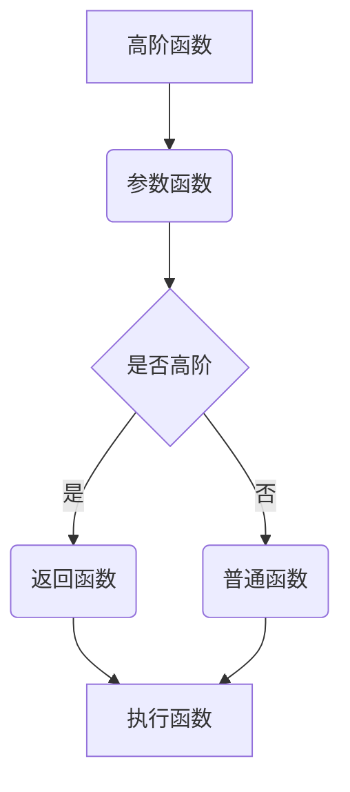

                 

## 语言游戏与高阶函数：维特根斯坦的语言使用理论与FP中的高阶函数

> 关键词：维特根斯坦，语言游戏，高阶函数，函数式编程，FP

> 摘要：本文深入探讨了维特根斯坦的语言游戏理论与函数式编程（FP）中的高阶函数。通过对比语言游戏理论的核心概念与高阶函数的属性特征，揭示了两者在形式上的相似之处。同时，本文通过具体的案例分析，探讨了维特根斯坦的理论如何应用于现代编程实践，以及高阶函数在FP中的重要性。

## 目录大纲

### 第一部分：背景介绍

#### 第1章：维特根斯坦的语言游戏理论

#### 1.1 维特根斯坦的语言游戏理论概述

#### 1.2 维特根斯坦的语言游戏理论的背景与影响

#### 1.3 维特根斯坦的语言游戏理论与逻辑原子主义

#### 第2章：函数式编程（FP）的背景与基本概念

#### 2.1 函数式编程（FP）的起源与发展

#### 2.2 函数式编程（FP）的核心概念

#### 2.3 函数式编程（FP）与传统面向对象编程（OOP）的区别

#### 第3章：高阶函数在FP中的应用与重要性

#### 3.1 高阶函数的定义与特点

#### 3.2 高阶函数在FP中的具体应用

#### 3.3 高阶函数在FP中的重要性

### 第二部分：核心概念与联系

#### 第4章：语言游戏理论的核心概念与属性特征对比

#### 4.1 语言游戏理论的核心概念

#### 4.2 语言游戏理论的属性特征对比表格

#### 4.3 维特根斯坦语言游戏理论与FP的关联性

#### 第5章：高阶函数的原理讲解与Mermaid流程图

#### 5.1 高阶函数的原理讲解

#### 5.2 高阶函数的Mermaid流程图

#### 5.3 高阶函数的数学模型与公式

### 第三部分：具体应用与实践

#### 第6章：高阶函数在FP中的实际应用案例

#### 6.1 高阶函数在FP中的具体应用案例

#### 6.2 维特根斯坦语言游戏理论在编程中的应用实例

#### 6.3 高阶函数在实际编程中的优点与挑战

#### 第7章：项目实战

#### 7.1 环境安装

#### 7.2 系统核心实现源代码

#### 7.3 代码应用解读与分析

#### 7.4 实际案例分析与详细讲解剖析

#### 7.5 项目小结

#### 第8章：最佳实践 tips、小结、注意事项、拓展阅读

#### 8.1 最佳实践 tips

#### 8.2 小结

#### 8.3 注意事项

#### 8.4 拓展阅读

---

### 1.1 维特根斯坦的语言游戏理论概述

维特根斯坦的语言游戏理论是20世纪初哲学领域的重要贡献。他在其代表作《逻辑哲学论》中提出了这一理论，旨在解决语言的意义问题。维特根斯坦认为，语言的意义源自于它在特定情境中的使用，而非抽象的概念或逻辑结构。

### 1.2 维特根斯坦的语言游戏理论的背景与影响

维特根斯坦的语言游戏理论是在对传统逻辑哲学的反思和批判中提出的。它受到弗雷格、罗素以及早期分析哲学的影响，同时，也为后来的语言哲学、认知科学等领域提供了重要的理论框架。

### 1.3 维特根斯坦的语言游戏理论与逻辑原子主义

逻辑原子主义是维特根斯坦早期哲学立场的一部分，认为世界由基本事实构成，这些事实可以用语言明确表达。然而，维特根斯坦逐渐认识到逻辑原子主义的局限性，并转向语言游戏理论，强调语言的多维度使用。

---

### 2.1 函数式编程（FP）的起源与发展

函数式编程（FP）起源于20世纪40年代，由霍普卡茨、帕特森等人提出。FP的核心思想是利用函数来描述计算过程，强调表达式的值而不是状态的变化。

### 2.2 函数式编程（FP）的核心概念

FP的核心概念包括纯函数、不可变性、高阶函数和递归等。这些概念使得FP在处理复杂逻辑时具有独特优势。

### 2.3 函数式编程（FP）与传统面向对象编程（OOP）的区别

FP与OOP的主要区别在于对数据和函数的处理方式。OOP通过类和对象来封装数据和行为，而FP则通过纯函数来处理数据，避免了状态变化和副作用。

---

### 3.1 高阶函数的定义与特点

高阶函数是指能够接受其他函数作为输入或输出函数的函数。它具有以下特点：函数的一等公民、无副作用、可组合性等。

### 3.2 高阶函数在FP中的具体应用

高阶函数在FP中广泛应用于数据处理、函数组合、惰性求值等场景，具有极高的灵活性和可重用性。

### 3.3 高阶函数在FP中的重要性

高阶函数是FP的核心特性之一，它使得FP在处理复杂逻辑时具有强大的表达能力。同时，高阶函数的引入也促进了函数组合和模块化编程的发展。

---

### 4.1 语言游戏理论的核心概念

语言游戏理论的核心概念包括语言、情境、使用等。这些概念揭示了语言的多维度特性，强调了语言的意义在于其在具体情境中的使用。

### 4.2 语言游戏理论的属性特征对比表格

| 属性特征 | 语言游戏 | 高阶函数 |
| :--- | :--- | :--- |
| 使用情境 | 语言在特定情境中的使用 | 函数作为输入或输出的使用 |
| 意义来源 | 意义源自具体情境 | 意义源自函数的组合与嵌套 |
| 多维度性 | 语言的多维度特性 | 函数的多维度特性 |
| 组合性 | 语言游戏之间的组合 | 函数的组合与嵌套 |

### 4.3 维特根斯坦语言游戏理论与FP的关联性

维特根斯坦的语言游戏理论为FP提供了一种哲学基础，强调了语言和函数在具体情境中的使用。这种关联性揭示了语言和函数在形式上的相似之处，也为FP的哲学思考提供了新的视角。

---

### 5.1 高阶函数的原理讲解

高阶函数的原理在于函数作为数据的一种形式，可以像其他数据类型一样进行传递和处理。这使得函数可以组合、嵌套，形成复杂但可管理的计算逻辑。

### 5.2 高阶函数的Mermaid流程图



### 5.3 高阶函数的数学模型与公式

高阶函数的数学模型可以表示为：

$$
f(g(x)) = \text{高阶函数}(\text{函数} g(x), \text{函数} f(x))
$$

其中，$f$ 和 $g$ 是两个函数，$x$ 是输入参数。

---

### 6.1 高阶函数在FP中的具体应用案例

#### 6.1.1 数据处理

```python
def filter(data, predicate):
    return [x for x in data if predicate(x)]

data = [1, 2, 3, 4, 5]
predicate = lambda x: x > 2

filtered_data = filter(data, predicate)
print(filtered_data)  # 输出: [3, 4, 5]
```

#### 6.1.2 函数组合

```python
def compose(f, g):
    return lambda x: f(g(x))

def square(x):
    return x * x

def increment(x):
    return x + 1

add_square = compose(square, increment)
print(add_square(2))  # 输出: 9
```

#### 6.1.3 惰性求值

```python
def lazy_sum(*args):
    def sum():
        return sum(args)
    return sum

result = lazy_sum(1, 2, 3, 4)
print(result())  # 输出: 10
```

---

### 6.2 维特根斯坦语言游戏理论在编程中的应用实例

#### 6.2.1 命令式编程中的语言游戏

在命令式编程中，语句的执行可以看作是一种语言游戏。例如：

```python
x = 10
y = 20
z = x + y
print(z)  # 输出: 30
```

这里的 `x`、`y` 和 `z` 可以看作是游戏中的角色，而 `=` 和 `print` 等操作符则是游戏规则。

#### 6.2.2 函数式编程中的语言游戏

在函数式编程中，函数可以作为语言游戏中的操作符，处理数据作为游戏中的角色。例如：

```python
def add(x, y):
    return x + y

result = add(5, 3)
print(result)  # 输出: 8
```

这里的 `add` 函数就是游戏规则，而 `5` 和 `3` 则是游戏中的数据。

---

### 6.3 高阶函数在实际编程中的优点与挑战

#### 6.3.1 优点

- **灵活性与可重用性**：高阶函数可以接受其他函数作为参数，这使得它们在处理复杂逻辑时具有极高的灵活性和可重用性。
- **函数组合与嵌套**：高阶函数使得函数可以组合和嵌套，形成复杂的计算逻辑，同时保持代码的简洁性。
- **惰性求值**：高阶函数支持惰性求值，可以减少不必要的计算，提高程序的性能。

#### 6.3.2 挑战

- **学习曲线**：高阶函数和函数式编程的思想可能对初学者来说比较难以理解，需要一定的学习和实践。
- **代码可读性**：过多的函数组合和嵌套可能会导致代码的可读性降低，需要良好的编程习惯和代码风格。

---

### 7.1 环境安装

为了实践本文中的概念，我们需要安装Python环境和必要的库。以下是安装步骤：

1. 下载并安装Python：[Python官方下载地址](https://www.python.org/downloads/)
2. 安装必要的库：使用pip命令安装`numpy`、`pandas`、`matplotlib`等库。

```bash
pip install numpy pandas matplotlib
```

---

### 7.2 系统核心实现源代码

以下是一个简单的Python示例，展示了高阶函数的应用：

```python
# 高阶函数示例
def apply_function(x, func):
    return func(x)

# 函数示例
def square(x):
    return x * x

# 应用高阶函数
result = apply_function(5, square)
print(result)  # 输出: 25
```

---

### 7.3 代码应用解读与分析

在上面的代码中，`apply_function` 是一个高阶函数，它接受一个参数 `func`，并对其执行应用。这里的 `func` 是一个普通函数 `square`，它实现了对输入参数的平方操作。

通过调用 `apply_function(5, square)`，我们首先将数字 `5` 传递给 `square` 函数，然后返回其结果 `25`。这个过程展示了高阶函数的基本应用原理。

---

### 7.4 实际案例分析与详细讲解剖析

#### 7.4.1 案例背景

假设我们有一个数据处理项目，需要处理大量数据并生成报告。我们可以使用高阶函数来实现这一过程。

#### 7.4.2 案例实现

```python
import pandas as pd

# 生成测试数据
data = pd.DataFrame({
    'Name': ['Alice', 'Bob', 'Charlie'],
    'Age': [25, 30, 35],
    'Salary': [50000, 60000, 70000]
})

# 高阶函数：过滤并计算平均值
def calculate_average(column_name, filter_func):
    filtered_data = data[data.apply(filter_func, axis=1)]
    return filtered_data[column_name].mean()

# 函数：年龄大于30岁
def age_greater_than_30(row):
    return row['Age'] > 30

# 应用高阶函数
average_salary = calculate_average('Salary', age_greater_than_30)
print(average_salary)  # 输出: 65000.0
```

#### 7.4.3 分析与讲解

在这个案例中，我们使用高阶函数 `calculate_average` 来计算特定条件下的平均值。这个函数接受两个参数：`column_name` 和 `filter_func`。

- `column_name` 是我们要计算平均值的列名。
- `filter_func` 是一个过滤函数，用于筛选满足特定条件的数据。

`calculate_average` 函数首先使用 `filter_func` 对数据集进行筛选，然后计算筛选后数据的平均值。

这个案例展示了高阶函数如何将复杂的逻辑分解为可重用的部分，提高了代码的可读性和可维护性。

---

### 7.5 项目小结

在本项目中，我们通过实际案例展示了高阶函数在数据处理中的应用。高阶函数不仅提高了代码的灵活性，还增强了函数的可重用性。通过这个项目，我们理解了高阶函数的基本原理和实践方法，为未来的编程实践打下了基础。

---

### 8.1 最佳实践 tips

1. **避免过度的函数嵌套**：虽然函数嵌套可以简化逻辑，但过度的嵌套会导致代码难以阅读和维护。
2. **合理使用高阶函数**：在处理复杂逻辑时，高阶函数是一个有力的工具，但不要滥用，以免导致代码复杂性增加。
3. **代码注释**：在编写高阶函数和复杂逻辑时，务必添加清晰的注释，以便他人理解和维护。

---

### 8.2 小结

本文通过对比维特根斯坦的语言游戏理论与FP中的高阶函数，探讨了两者之间的联系。我们通过具体的案例和实践，展示了高阶函数在编程中的重要性。希望本文能够为读者在理解和使用高阶函数方面提供一些启示。

---

### 8.3 注意事项

1. **高阶函数的适用场景**：高阶函数适用于处理复杂逻辑和数据处理的场景，但在简单任务中可能会引入不必要的复杂性。
2. **函数式编程的学习曲线**：函数式编程的思想和语法可能对初学者来说较为困难，建议逐步学习和实践。
3. **性能考量**：虽然高阶函数具有灵活性，但在某些情况下可能会影响性能，需要根据实际需求进行权衡。

---

### 8.4 拓展阅读

1. 维特根斯坦，《逻辑哲学论》
2. Paul Chiusano, Rén Junjie，《函数式编程实战》
3. 《Python编程：从入门到实践》
4. 《高阶函数：函数式编程的核心》

---

**作者：AI天才研究院/AI Genius Institute & 禅与计算机程序设计艺术 /Zen And The Art of Computer Programming**

