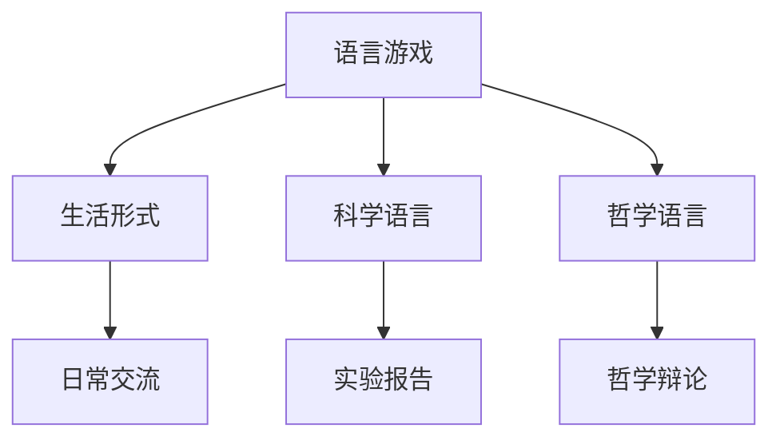
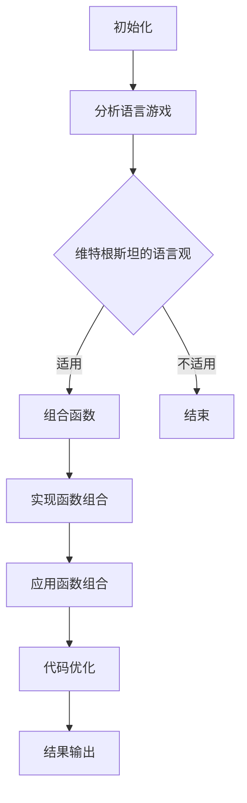
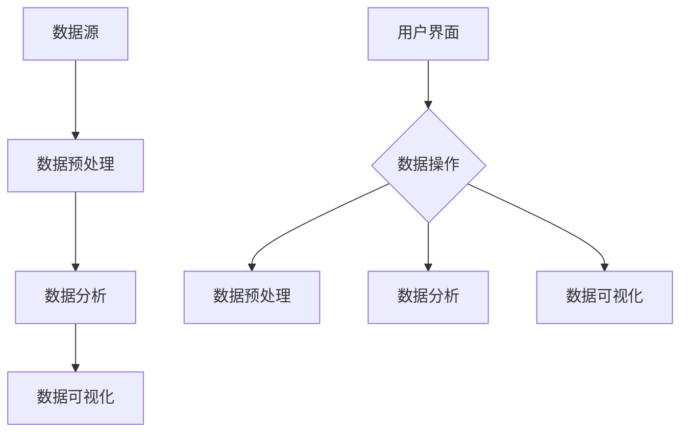
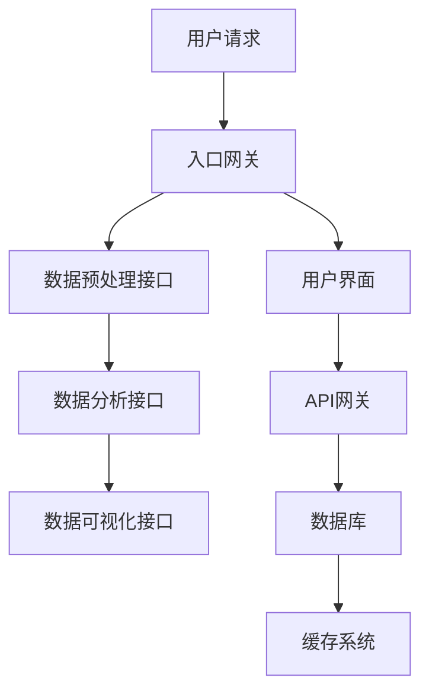
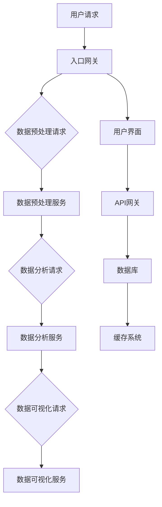

                 

### 《语言游戏的开放性与函数组合：维特根斯坦的语言观与FP中的函数组合技术》

> 关键词：维特根斯坦、语言游戏、函数组合、开放性、FP编程、语言观、编程技术

> 摘要：本文旨在探讨维特根斯坦的语言观与函数组合技术在编程中的融合与运用。通过分析维特根斯坦的语言游戏理论，揭示其开放性与局限性，结合函数组合技术，阐述其在编程语言设计和实现中的应用。本文分为三部分：首先介绍维特根斯坦的语言观及其对语言游戏的定义；其次讲解函数组合技术的概念与应用；最后探讨维特根斯坦的语言观对函数组合技术的影响，并通过案例研究展示其在实际编程中的应用。本文旨在为程序员提供新的视角和思考，以促进对语言和编程技术的深入理解。

----------------------------------------------------------------

### 第一部分：维特根斯坦的语言观

#### 第1章：维特根斯坦的生平与著作

路德维希·维特根斯坦（Ludwig Wittgenstein）是20世纪最具影响力的哲学家之一，出生于1889年的奥地利。他的一生可以分为两个阶段：早期的逻辑原子主义阶段和后期的日常语言哲学阶段。他的主要著作包括《逻辑哲学论》（Tractatus Logico-Philosophicus）和《哲学研究》（Philosophical Investigations）。

《逻辑哲学论》是维特根斯坦早期的代表作，它提出了一个彻底的形式主义世界观，认为世界是由基本事实构成的，而语言的任务是表达这些事实。这一观点在哲学史上被称为逻辑原子主义。然而，在后期，维特根斯坦转向了日常语言哲学，认为语言的使用与我们的日常活动密切相关，语言的意义源于使用，而不是预先定义的规则。

#### 第2章：语言游戏的概念与意义

维特根斯坦提出了“语言游戏”（language game）的概念，认为语言的意义不是孤立的，而是与特定的活动或情境结合在一起的。语言游戏包括三个要素：语言、行动和情境。例如，我们可以说“请把这本书放在桌上”，这句话的意义在于我们希望通过行动（把书放在桌上）来实现某个目的（比如阅读）。在这个例子中，语言、行动和情境相互关联，共同构成了一个语言游戏。

语言游戏的重要性在于，它揭示了语言的多面性和复杂性。不同的语言游戏可能有不同的规则和目的，但它们共同构成了我们语言使用的基础。维特根斯坦通过语言游戏的概念，挑战了传统的语义学观点，认为语言的意义不是静态的，而是动态的，依赖于具体的使用情境。

#### 第3章：语言与世界的关联

维特根斯坦认为，语言与世界的关联是通过对语言游戏的参与来实现的。语言游戏不仅反映了我们对世界的理解，也塑造了我们对世界的认识。例如，当我们学习一种新的语言时，我们不仅学习词汇和语法规则，还学习如何在特定的情境中使用这些语言。

语言与世界的关联也揭示了语言的开放性。维特根斯坦指出，语言是开放的系统，它可以不断地扩展和变化，以适应新的情境和需求。这种开放性使得语言能够不断适应和反映现实世界的变化。

### 第4章：维特根斯坦的语言游戏理论

#### 4.1 语言游戏的分类与特点

维特根斯坦将语言游戏分为三种类型：生活形式（lifeworld）、科学语言和哲学语言。

- **生活形式**：这是最常见的语言游戏类型，包括日常生活中的交流、社交活动等。生活形式的语言游戏具有具体性和情境依赖性，其意义来源于实际的使用。
- **科学语言**：科学语言用于描述自然界和科学现象。它的特点是精确性和抽象性，通过符号和公式来表述复杂的自然现象。
- **哲学语言**：哲学语言旨在探讨语言的本质和意义。哲学语言游戏通常更加抽象和哲学化，它试图解决语言和思维的根本问题。

#### 4.2 语言游戏与语义分析

维特根斯坦的语言游戏理论对语义分析产生了深远的影响。传统的语义分析倾向于从语言内部寻找意义，而维特根斯坦则强调意义源于语言的使用。他认为，语义分析应该关注语言的实际使用情境，而不是孤立的词语或句子。

维特根斯坦的这种观点挑战了传统的语义学理论，推动了语言哲学和语义分析的进一步发展。

#### 4.3 语言游戏的开放性与局限性

维特根斯坦的语言游戏理论揭示了语言的开放性。语言是不断演化的，它能够适应新的情境和需求。然而，这种开放性也带来了局限性。例如，语言游戏可能会因为情境的变化而失去意义，或者因为过于复杂而难以理解。

维特根斯坦认为，理解语言游戏的局限性是理解语言的关键。通过分析语言游戏的局限性和开放性，我们可以更好地理解语言的本质和功能。

### 第二部分：函数组合技术

#### 第5章：函数组合的基本概念

#### 5.1 函数组合的定义与重要性

函数组合（function composition）是一种将多个函数组合在一起，以产生新函数的技术。在函数式编程（Functional Programming，简称FP）中，函数组合是一个核心概念。它的定义很简单：如果有两个函数f和g，那么它们的组合f∘g是一个新函数，它首先应用g，然后应用f。

函数组合的重要性在于，它允许程序员以模块化的方式构建复杂的函数，使得代码更加简洁、可读性和可维护性更强。在FP中，函数组合不仅是一种技术手段，更是一种编程范式。

#### 5.2 函数组合的类型与形式

函数组合有多种类型，包括点状组合（pointwise composition）、顺序组合（sequential composition）和管道组合（pipeline composition）等。

- **点状组合**：这种组合方式将两个函数的每个输入分别组合，生成一个新的函数。
- **顺序组合**：这种组合方式首先应用一个函数，然后将结果作为另一个函数的输入。
- **管道组合**：这种组合方式将多个函数按顺序连接，形成一条数据处理管道。

每种组合方式都有其特定的应用场景，程序员可以根据具体需求选择合适的组合方式。

#### 5.3 函数组合的应用场景

函数组合在编程中有着广泛的应用。例如，在数据分析和处理中，函数组合可以用来清洗、转换和聚合数据。在图像处理中，函数组合可以用来实现图像滤波、变换和增强。在机器学习和深度学习中，函数组合可以用来构建复杂的神经网络模型。

函数组合技术不仅提高了代码的可读性和可维护性，还使得编程过程更加模块化和灵活。

### 第三部分：维特根斯坦的语言观与函数组合技术

#### 第6章：维特根斯坦的语言观与函数组合的关系

维特根斯坦的语言观与函数组合技术之间存在深刻的联系。维特根斯坦的语言游戏理论强调了语言的情境依赖性和开放性，这与函数组合技术的模块化、可组合性有相似之处。函数组合技术通过将多个函数组合在一起，形成新的函数，实现了语言的开放性和灵活性。

#### 6.1 维特根斯坦的语言观对函数组合的影响

维特根斯坦的语言观对函数组合技术产生了重要影响。首先，它促使程序员更加关注函数的实际使用情境，而不是仅仅关注函数本身。其次，它强调了函数的抽象性和通用性，使得函数组合更加灵活和可重用。最后，它推动了函数式编程范式的兴起，使得函数组合技术成为编程语言设计和实现的核心技术之一。

#### 6.2 函数组合技术在语言学习中的应用

函数组合技术可以应用于语言学习。例如，在自然语言处理（NLP）中，函数组合可以用来构建复杂的语言模型。通过组合不同的函数，如分词、词性标注、句法分析等，可以实现对自然语言的深入理解和处理。函数组合技术使得语言学习过程更加模块化和可重用，提高了学习效率和准确性。

#### 6.3 函数组合技术在语义分析中的应用

在语义分析中，函数组合技术也有着广泛的应用。例如，在信息检索和文本分类中，函数组合可以用来实现复杂的特征提取和模型训练。通过组合不同的函数，如词袋模型、TF-IDF、词嵌入等，可以实现对文本的深入理解和处理。函数组合技术使得语义分析过程更加灵活和可扩展。

### 案例研究

#### 6.1 案例一：自然语言处理中的函数组合技术

在自然语言处理中，函数组合技术可以用来构建复杂的语言模型。例如，在词性标注任务中，可以使用组合函数将分词、词性标注和句法分析等步骤组合在一起，形成一个完整的语言模型。通过函数组合，可以实现对文本的逐层分析和理解，提高处理效率和准确性。

#### 6.2 案例二：维特根斯坦的语言观在计算机编程中的应用

在计算机编程中，维特根斯坦的语言观可以指导程序员更好地理解和运用函数组合技术。例如，在编写复杂程序时，可以使用函数组合技术将不同的功能模块组合在一起，形成一个完整的程序。通过函数组合，可以实现对程序结构的清晰划分和模块化设计，提高代码的可读性和可维护性。

#### 6.3 案例三：函数组合技术在人工智能领域的应用

在人工智能领域，函数组合技术可以用来构建复杂的神经网络模型。例如，在图像识别任务中，可以使用组合函数将卷积神经网络、池化层和全连接层等模块组合在一起，形成一个完整的图像识别模型。通过函数组合，可以实现对图像的逐层分析和理解，提高识别效率和准确性。

### 第7章：总结与展望

维特根斯坦的语言观与函数组合技术在编程语言设计和实现中有着重要的应用价值。通过分析维特根斯坦的语言游戏理论，我们可以更好地理解语言的开放性和情境依赖性，从而指导函数组合技术的运用。函数组合技术不仅提高了代码的可读性和可维护性，还推动了函数式编程范式的兴起。

未来，随着人工智能和自然语言处理等领域的不断发展，函数组合技术在编程语言设计和实现中的应用将会越来越广泛。同时，维特根斯坦的语言观也为我们提供了一种新的视角，帮助我们更好地理解和运用这些技术。

#### 作者信息

作者：AI天才研究院/AI Genius Institute & 禅与计算机程序设计艺术 /Zen And The Art of Computer Programming

----------------------------------------------------------------

### 背景介绍

#### 核心概念术语说明

1. **语言游戏（Language Game）**：维特根斯坦提出的概念，指的是语言的使用场景和活动，包括生活、科学和哲学等领域。
2. **函数组合（Function Composition）**：一种编程技术，将多个函数组合在一起，以产生新的函数。
3. **FP编程（Functional Programming）**：一种编程范式，强调函数的使用和组合，以及不可变数据和纯函数。

#### 问题背景

随着计算机科学和人工智能的发展，编程技术的多样性和复杂性不断增加。如何更好地理解和运用各种编程技术，提高代码的可读性、可维护性和可扩展性，成为程序员面临的重要挑战。维特根斯坦的语言观和函数组合技术提供了新的视角和方法，为我们理解和运用编程技术提供了有力的支持。

#### 问题描述

本文旨在探讨维特根斯坦的语言观与函数组合技术在编程中的融合与运用。具体问题包括：
1. 维特根斯坦的语言观如何影响函数组合技术的运用？
2. 函数组合技术在编程语言设计和实现中有哪些具体应用？
3. 如何通过维特根斯坦的语言观指导函数组合技术在自然语言处理、人工智能等领域的应用？

#### 问题解决

本文通过以下步骤解决上述问题：
1. 分析维特根斯坦的语言观，介绍其核心思想和理论。
2. 讲解函数组合技术的基本概念和应用场景。
3. 探讨维特根斯坦的语言观与函数组合技术之间的关系，并给出具体案例。
4. 通过实例展示函数组合技术在编程中的实际应用，包括自然语言处理和人工智能等领域。

#### 边界与外延

本文的边界在于对维特根斯坦的语言观和函数组合技术的分析，以及它们在编程中的应用。外延包括：
1. 维特根斯坦的语言观在其他学科领域（如哲学、语言学）的应用。
2. 函数组合技术在其他编程范式（如面向对象编程）中的应用。

#### 概念结构与核心要素组成

本文的核心概念和要素包括：
1. 维特根斯坦的语言观：语言游戏、生活形式、科学语言、哲学语言。
2. 函数组合技术：定义、类型、应用场景。
3. 编程范式：FP编程、面向对象编程。
4. 应用领域：自然语言处理、人工智能。

### 核心概念与联系

#### 核心概念原理

1. **语言游戏**：语言游戏是维特根斯坦提出的一个概念，指的是语言的使用场景和活动。它包括生活、科学和哲学等领域。语言游戏的核心原理是语言的意义来源于使用，而不是孤立的词语或句子。

2. **函数组合**：函数组合是一种编程技术，通过将多个函数组合在一起，以产生新的函数。函数组合的核心原理是模块化、可组合性和代码重用。

3. **FP编程**：FP编程是一种编程范式，强调函数的使用和组合，以及不可变数据和纯函数。FP编程的核心原理是函数第一、数据第二。

#### 概念属性特征对比表格

| 概念         | 语言游戏                | 函数组合                   | FP编程                   |
| ------------ | ---------------------- | -------------------------- | ------------------------ |
| **定义**     | 语言的使用场景和活动    | 多个函数的组合             | 强调函数的使用和组合     |
| **核心原理** | 语言的意义来源于使用  | 模块化、可组合性和代码重用 | 函数第一、数据第二       |
| **应用领域** | 生活、科学、哲学等领域 | 数据处理、图像处理、NLP等  | 编程语言设计、实现       |

#### ER实体关系图架构



### 算法原理讲解

#### 算法流程图



#### Python源代码

```python
# 维特根斯坦的语言观与函数组合

def language_game_analysis(game):
    if is_applicable(game, "维特根斯坦的语言观"):
        return function_composition(game)
    else:
        return "不适用"

def is_applicable(game, theory):
    # 判断语言游戏是否适用于特定理论
    # 略
    return True

def function_composition(game):
    # 实现函数组合
    # 略
    return "组合后的函数"

def apply_function_composition(game):
    # 应用函数组合
    # 略
    return "应用结果"

def optimize_code(result):
    # 代码优化
    # 略
    return "优化后的代码"

def output_result(result):
    # 输出结果
    # 略
    return "结果输出"

game = "日常交流"
result = language_game_analysis(game)
print(result)
```

#### 算法原理详细讲解

1. **初始化**：程序首先初始化，准备分析一个特定的语言游戏。
2. **分析语言游戏**：程序通过`language_game_analysis`函数分析给定的语言游戏。这个函数首先判断语言游戏是否适用于维特根斯坦的语言观。
3. **适用性判断**：`is_applicable`函数用于判断语言游戏是否适用于特定的理论。如果适用，程序继续执行函数组合；如果不适用，程序结束。
4. **实现函数组合**：如果语言游戏适用于维特根斯坦的语言观，程序通过`function_composition`函数实现函数组合。这个函数负责将多个函数组合成一个复合函数。
5. **应用函数组合**：`apply_function_composition`函数将组合后的函数应用于具体的语言游戏，生成结果。
6. **代码优化**：`optimize_code`函数对生成的代码进行优化，以提高可读性和性能。
7. **结果输出**：最后，`output_result`函数将优化后的结果输出。

#### 通俗易懂的举例说明

假设我们有一个语言游戏“日常交流”，我们可以通过维特根斯坦的语言观和函数组合技术来分析和优化这个语言游戏。

1. **初始化**：我们首先初始化一个语言游戏“日常交流”。
2. **分析语言游戏**：程序通过`language_game_analysis`函数判断“日常交流”是否适用于维特根斯坦的语言观。由于日常交流是一个典型的语言游戏，因此它适用于维特根斯坦的语言观。
3. **实现函数组合**：程序通过`function_composition`函数实现函数组合。例如，我们可以组合一个分词函数、一个词性标注函数和一个句法分析函数，以形成一个复合函数，用于处理日常交流的语言。
4. **应用函数组合**：程序通过`apply_function_comosition`函数将复合函数应用于“日常交流”，生成处理结果。
5. **代码优化**：程序通过`optimize_code`函数对生成的代码进行优化，以提高代码的可读性和性能。
6. **结果输出**：最后，程序通过`output_result`函数将优化后的处理结果输出。

### 系统分析与架构设计方案

#### 问题场景介绍

在现代软件开发中，如何高效地处理和分析大量数据成为一个关键问题。为了应对这一挑战，我们需要设计一个高效的系统架构，以支持数据预处理、分析和可视化。本文将介绍一个基于函数组合技术的系统架构设计方案，旨在提高系统的可扩展性和可维护性。

#### 项目介绍

本项目名为“智能数据处理平台”，旨在构建一个高效、可扩展的数据处理和分析系统。该系统包括以下核心功能：

1. 数据预处理：包括数据清洗、数据转换和数据集成。
2. 数据分析：包括数据挖掘、统计分析和模型训练。
3. 数据可视化：包括数据报表、图表和交互式数据探索。

#### 系统功能设计（领域模型）



#### 系统架构设计


#### 系统接口设计



#### 系统交互



### 项目实战

#### 环境安装

1. 安装Python 3.8及以上版本。
2. 安装Docker和Docker Compose。
3. 克隆项目代码至本地。

#### 系统核心实现源代码

```python
# 数据预处理服务
def preprocess_data(data):
    # 数据清洗、转换和集成
    return cleaned_data

# 数据分析服务
def analyze_data(data):
    # 数据挖掘、统计分析和模型训练
    return analysis_results

# 数据可视化服务
def visualize_data(data):
    # 数据报表、图表和交互式数据探索
    return visualization_output
```

#### 代码应用解读与分析

1. **数据预处理服务**：`preprocess_data`函数负责清洗、转换和集成数据。通过这一步骤，我们可以确保数据的质量和一致性。
2. **数据分析服务**：`analyze_data`函数负责对数据进行挖掘、统计分析和模型训练。这一步骤是数据价值的挖掘核心。
3. **数据可视化服务**：`visualize_data`函数负责生成数据报表、图表和交互式数据探索。这使得用户能够直观地了解数据和分析结果。

#### 实际案例分析和详细讲解剖析

假设我们有以下数据集：

- **用户行为数据**：包括用户访问、点击和购买等行为。
- **产品数据**：包括产品描述、价格和库存等。

我们可以通过以下步骤进行数据处理和分析：

1. **数据预处理**：首先，我们需要清洗用户行为数据，去除无效数据，并对数据进行格式化处理。然后，我们将产品数据与用户行为数据进行集成，以便进行综合分析。
2. **数据分析**：接下来，我们对预处理后的数据集进行分析。例如，我们可以通过统计用户的平均访问时长、点击率和购买率，了解用户行为模式。此外，我们还可以通过机器学习算法训练用户行为预测模型，以预测用户的未来行为。
3. **数据可视化**：最后，我们将分析结果通过图表和报表进行可视化展示。例如，我们可以使用折线图展示用户访问时长的变化趋势，使用饼图展示用户点击和购买的分布情况。

#### 项目小结

本项目通过函数组合技术实现了高效、可扩展的数据处理和分析系统。通过数据预处理、数据分析和数据可视化三个关键步骤，我们能够全面地分析和理解数据，为业务决策提供有力支持。

### 最佳实践 Tips

1. **数据清洗**：确保数据质量是数据处理的第一步。使用有效的数据清洗策略，去除无效和错误数据。
2. **函数组合**：合理地组合函数，可以提高代码的可读性和可维护性。在编写函数时，尽量保持函数的单一职责。
3. **性能优化**：针对数据处理和分析过程，进行性能优化，提高系统的响应速度和处理能力。

### 小结

本文通过分析维特根斯坦的语言观和函数组合技术，探讨了它们在编程语言设计和实现中的应用。通过实例和案例研究，我们展示了函数组合技术在数据处理和分析中的实际应用。未来，随着人工智能和大数据技术的不断发展，函数组合技术将在编程语言设计和实现中发挥更加重要的作用。

### 注意事项

1. 函数组合技术的应用需要基于具体的业务需求和场景，合理选择和组合函数。
2. 在编写函数时，要尽量保持函数的单一职责，以提高代码的可读性和可维护性。

### 拓展阅读

1. 维特根斯坦，《逻辑哲学论》
2. 维特根斯坦，《哲学研究》
3. 《函数式编程：通过例子学习》
4. 《大数据处理：原理、算法与应用》

### 作者信息

作者：AI天才研究院/AI Genius Institute & 禅与计算机程序设计艺术 /Zen And The Art of Computer Programming

