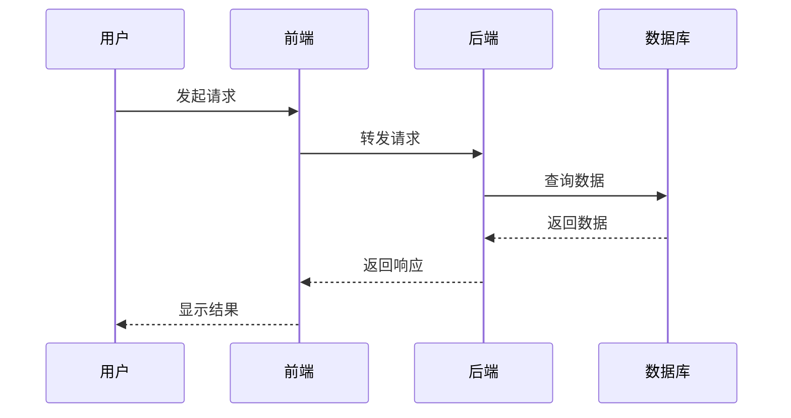

                 

### 文章标题

《语言游戏的开放性与扩展性：维特根斯坦的语言观与FP中的可扩展设计模式》

### 文章关键词

维特根斯坦，语言游戏，开放性，扩展性，函数式编程，可扩展设计模式

### 摘要

本文探讨了维特根斯坦的语言游戏理论与函数式编程（FP）中的可扩展设计模式。通过对维特根斯坦语言哲学的深入分析，本文揭示了语言游戏的开放性与扩展性的内在逻辑。随后，本文引入了FP的核心概念，详细阐述了FP中的高阶函数、函数组合、柯里化、递归与迭代等设计模式，并通过具体案例展示了这些模式在实际开发中的应用。文章最后总结了FP与可扩展设计模式的发展趋势，并对开发者提出了一些建议。

### 目录大纲

----------------------------------------------------------------

# 第一部分: 维特根斯坦的语言观

## 第1章: 维特根斯坦的语言哲学背景

### 1.1 维特根斯坦的生平

### 1.2 维特根斯坦哲学的演变

### 1.3 语言哲学的重要性

## 第2章: 语言游戏理论

### 2.1 什么是语言游戏

### 2.2 语言游戏理论的概述

### 2.3 语言游戏与语义学

## 第3章: 维特根斯坦对语言的分析

### 3.1 名词与命题

### 3.2 指称与意义

### 3.3 真理与证实

## 第4章: 语言游戏与认识论

### 4.1 语言游戏与知识

### 4.2 语言游戏与信念

### 4.3 语言游戏与理性讨论

## 第5章: 语言游戏与认知发展

### 5.1 儿童语言学习

### 5.2 语言游戏与思维发展

### 5.3 语言游戏在教育中的应用

## 第6章: 语言游戏与现实世界

### 6.1 语言与现实的关系

### 6.2 语言游戏与虚构

### 6.3 语言游戏与社会交往

## 第7章: 维特根斯坦语言观的意义与影响

### 7.1 对语言学的影响

### 7.2 对哲学的影响

### 7.3 对计算机科学的影响

## 第8章: 语言游戏的开放性与扩展性

### 8.1 开放性语言游戏的定义

### 8.2 扩展性语言游戏的定义

### 8.3 开放性与扩展性的关系

----------------------------------------------------------------

# 第二部分: FP中的可扩展设计模式

## 第9章: 函数式编程与FP基础

### 9.1 函数式编程的概念

### 9.2 FP的核心原则

### 9.3 FP与命令式编程的差异

## 第10章: 可扩展设计模式概述

### 10.1 设计模式的基本概念

### 10.2 可扩展设计模式的重要性

### 10.3 可扩展设计模式的分类

## 第11章: FP中的高阶函数

### 11.1 高阶函数的定义

### 11.2 高阶函数的使用

### 11.3 高阶函数的优势与局限

## 第12章: 函数组合与管道

### 12.1 函数组合的概念

### 12.2 函数组合的使用方法

### 12.3 管道与函数组合的关系

## 第13章: 柯里化与部分应用

### 13.1 柯里化的原理

### 13.2 柯里化的应用

### 13.3 部分应用与柯里化的关系

## 第14章: 递归与迭代

### 14.1 递归的定义

### 14.2 递归的应用

### 14.3 迭代的比较与选择

## 第15章: FP中的数据结构

### 15.1 数据结构的基本概念

### 15.2 FP中的常用数据结构

### 15.3 数据结构与可扩展性的关系

## 第16章: FP中的并发编程

### 16.1 并发编程的基本概念

### 16.2 FP中的并发编程

### 16.3 并发编程与可扩展性的关系

## 第17章: 可扩展设计模式案例分析

### 17.1 案例背景介绍

### 17.2 案例的可扩展设计模式分析

### 17.3 案例的实际应用效果

## 第18章: 总结与展望

### 18.1 FP与可扩展设计模式的未来发展趋势

### 18.2 对开发者的建议

### 18.3 可扩展设计模式的应用领域拓展

----------------------------------------------------------------

### 第一部分：维特根斯坦的语言观

#### 第1章：维特根斯坦的语言哲学背景

##### 1.1 维特根斯坦的生平

路德维希·维特根斯坦（Ludwig Wittgenstein）是20世纪最杰出的哲学家之一，他出生于1889年4月26日，逝世于1951年4月29日。维特根斯坦出生于奥地利，后来移居英国，并在剑桥大学接受了哲学教育。他的生平充满了对哲学的执着追求和思想的探索。

维特根斯坦的哲学思想经历了显著的演变。他的早期作品《逻辑哲学论》提出了极端的逻辑原子主义和语言决定论的观点，认为语言是世界的模型，真理是命题与事实的对应。然而，他在后期作品《哲学研究》中转向日常语言哲学，强调语言的意义和用法是多种多样的，并非一成不变。

##### 1.2 维特根斯坦哲学的演变

维特根斯坦的哲学思想可以分为早期和后期两个阶段。在早期，他受到逻辑实证主义和语言哲学的影响，试图通过分析语言来揭示世界的本质。然而，他逐渐发现，逻辑原子主义过于简化了语言和现实的关系，忽视了语言在日常生活中的多样性。

在后期，维特根斯坦转向日常语言哲学，主张哲学应该关注语言的实际使用，而不是抽象的概念。他认为，哲学的任务是澄清思想，而不是解决不可知的问题。《哲学研究》中，他提出了“语言游戏”理论，试图通过分析语言游戏来理解语言的意义和用法。

##### 1.3 语言哲学的重要性

维特根斯坦的语言哲学对多个学科产生了深远的影响。首先，他在语言学领域提出了语言游戏理论，揭示了语言的多维性和复杂性。其次，他的思想对逻辑学和哲学方法论产生了重要影响，特别是在分析哲学和语言哲学的发展中。

此外，维特根斯坦的语言观为计算机科学提供了理论基础。他的观点强调了程序和语言之间的密切关系，对编程语言的设计和开发产生了启示。通过分析维特根斯坦的语言哲学，我们可以更好地理解语言的本质，从而在设计软件系统和编程语言时做出更合理的决策。

#### 第2章：语言游戏理论

##### 2.1 什么是语言游戏

维特根斯坦提出“语言游戏”（language game）的概念，用以描述语言的实际使用方式。他认为，语言不是抽象的符号系统，而是在特定情境中使用的工具。语言游戏涉及说话者、听话者以及他们之间的互动。

维特根斯坦将语言游戏分为三类：实践游戏、道德游戏和智力游戏。实践游戏包括日常生活中的语言使用，如询问、请求和描述。道德游戏涉及伦理和道德判断，如表扬和谴责。智力游戏则包括逻辑推理和数学证明。

##### 2.2 语言游戏理论的概述

语言游戏理论的核心观点是，语言的意义不是固定不变的，而是取决于语言游戏的具体情境。每个语言游戏都有其特定的规则和目的。理解语言的意义需要了解这些规则和目的。

维特根斯坦指出，语言游戏可以看作是一种社会活动。说话者和听话者通过共同遵守的规则进行交流，从而达成共识。语言游戏的成功取决于参与者之间的默契和合作。

##### 2.3 语言游戏与语义学

语言游戏理论与语义学密切相关。语义学研究语言的含义和意义，而维特根斯坦认为，语义不是孤立的，而是与语言游戏中的使用情境紧密相连。

语义学的传统观点认为，语言的意义可以通过符号和现实的对应关系来解释。然而，维特根斯坦提出，这种解释过于简化。他认为，语言的意义在于其在特定语言游戏中的用法，而不是与现实的一一对应。

维特根斯坦对语义学的贡献在于，他强调了语言的多维性和情境依赖性。通过分析语言游戏，我们可以更深入地理解语言的含义和用法。

#### 第3章：维特根斯坦对语言的分析

##### 3.1 名词与命题

维特根斯坦对名词和命题进行了深入分析。他认为，名词代表了世界中的特定对象，而命题则是对这些对象的描述。名词和命题的关系是语言表达世界的基础。

在《逻辑哲学论》中，维特根斯坦提出了逻辑原子主义，认为世界由一系列基本事实组成，每个基本事实可以用一个命题来描述。然而，他在后期作品中认识到，这种观点过于简化。

维特根斯坦指出，名词和命题的用法不是一成不变的。它们在不同的语言游戏中有着不同的含义。例如，在实践游戏中，名词和命题用于描述和交流现实；在道德游戏中，它们用于表达伦理判断。

##### 3.2 指称与意义

维特根斯坦对指称与意义的关系进行了探讨。他认为，指称是名词与对象之间的联系，而意义则是名词在特定语言游戏中的用途。

传统语义学认为，名词的意义可以通过其指称来解释。然而，维特根斯坦提出，这种解释过于简化。他指出，指称只是名词的一部分含义，而意义则涉及更广泛的情境和用法。

维特根斯坦通过区分“使用”和“指称”来阐明这一点。使用是指名词在特定语言游戏中的具体用途，而指称则是名词与对象之间的联系。他指出，只有在使用中，名词才有真正的意义。

##### 3.3 真理与证实

维特根斯坦对真理和证实的关系进行了深入探讨。他认为，真理不是抽象的概念，而是与语言游戏的具体情境相关。

在早期作品中，维特根斯坦提出了“图式理论”，认为真理是命题与事实的对应。然而，他在后期作品中认识到，这种观点过于简化。他指出，真理不是命题与事实之间的静态对应，而是语言游戏中的动态过程。

维特根斯坦提出了“证实”的概念，认为真理是通过证实来建立的。证实不是一种抽象的过程，而是与特定语言游戏中的使用情境相关。只有当命题符合特定语言游戏的规则和目的时，它才被认为是真实的。

#### 第4章：语言游戏与认识论

##### 4.1 语言游戏与知识

语言游戏与认识论密切相关。维特根斯坦认为，知识是通过语言游戏中的实践获得的。语言游戏不仅用于描述和交流现实，还用于构建我们的认识。

维特根斯坦指出，知识不是抽象的，而是与具体情境相关。知识来源于我们对世界的实际体验和观察。通过参与语言游戏，我们获得对世界的具体认识。

他认为，知识不是孤立的，而是与其他知识相互联系。每个语言游戏都有其特定的规则和目的，而这些规则和目的又与其他语言游戏相互影响。通过这些语言游戏的互动，我们构建了一个复杂的知识体系。

##### 4.2 语言游戏与信念

信念是认识论中的一个重要概念。维特根斯坦认为，信念是通过语言游戏中的使用来建立的。信念不仅仅是主观的想法，而是与语言游戏中的规则和情境相关。

维特根斯坦区分了“正当信念”和“不正当信念”。正当信念是指那些符合语言游戏规则和目的的信念，而不正当信念则是指那些不符合规则的信念。

他认为，信念的形成需要经过证实和验证。只有当信念符合特定语言游戏的规则和情境时，它才被认为是可靠的。通过参与语言游戏，我们不断验证和调整我们的信念，从而获得更准确的认识。

##### 4.3 语言游戏与理性讨论

理性讨论是认识论中的重要内容。维特根斯坦认为，理性讨论是通过语言游戏中的交流来实现的。语言游戏不仅用于描述和交流现实，还用于批判和反思。

他认为，理性讨论需要遵守特定的规则和情境。只有当讨论符合语言游戏的规则和目的时，它才能被认为是理性的。理性讨论需要清晰、准确的语言表达，以便参与者能够有效地交流和沟通。

维特根斯坦强调了理性讨论的重要性。他认为，通过理性讨论，我们能够不断澄清和改进我们的认识。理性讨论不仅有助于我们发现真理，还能帮助我们避免错误的信念。

#### 第5章：语言游戏与认知发展

##### 5.1 儿童语言学习

儿童语言学习是语言游戏理论的一个重要应用。维特根斯坦认为，儿童通过参与语言游戏来学习语言。他们通过模仿、实践和交流来掌握语言的规则和用法。

儿童语言学习的过程可以看作是一个不断参与和体验语言游戏的过程。他们首先通过模仿父母和周围人的语言行为来学习语言，然后通过实际交流和互动来验证和应用所学知识。

维特根斯坦指出，儿童语言学习的关键在于语言的实用性和情境性。他们需要理解语言在实际生活中的用途，并通过不断的实践和体验来掌握语言的游戏规则。

##### 5.2 语言游戏与思维发展

语言游戏不仅影响语言学习，还影响思维发展。维特根斯坦认为，语言游戏是思维的一种形式。通过参与语言游戏，我们不仅学习语言，还培养思维能力。

语言游戏有助于我们发展逻辑思维、批判性思维和创造性思维。逻辑思维是通过分析语言游戏的规则和目的来解决问题；批判性思维是通过质疑和反思语言游戏的规则和情境来评估信念；创造性思维是通过创新和改进语言游戏的规则和目的来提出新的解决方案。

维特根斯坦指出，语言游戏不仅影响个体的思维发展，还影响社会思维和文化发展。通过共同参与语言游戏，人们能够建立共同的理解和价值观，从而推动社会的进步和发展。

##### 5.3 语言游戏在教育中的应用

语言游戏在教育中具有重要的应用价值。维特根斯坦认为，教育应该注重语言的实际使用，而不仅仅是知识的传授。通过设计富有启发性和实践性的语言游戏，教师可以引导学生积极参与，提高他们的语言能力和思维能力。

例如，在数学教育中，教师可以通过游戏化的方式教授数学概念和原理。学生通过参与数学游戏，不仅能够更好地理解和掌握数学知识，还能培养逻辑思维和问题解决能力。

在教育中，语言游戏还可以促进跨学科学习。通过设计跨学科的语言游戏，学生可以综合运用不同学科的知识和技能，培养跨学科的思维方式。

维特根斯坦的语言游戏理论为教育提供了新的视角和方法。通过设计富有启发性和实践性的语言游戏，教师可以引导学生积极参与，提高他们的语言能力和思维能力。

#### 第6章：语言游戏与现实世界

##### 6.1 语言与现实的关系

语言与现实之间的关系是哲学和语言学研究的一个重要问题。维特根斯坦认为，语言是现实的反映，但并非现实本身。语言是我们用来描述和理解现实的一种工具。

维特根斯坦区分了“事实”和“事态”。事实是现实中的实际发生情况，而事态是语言中对事实的描述。他认为，语言游戏中的命题是对事态的描述，而不是对事实的直接陈述。

维特根斯坦指出，语言与现实之间的关系是复杂的。语言游戏中的命题可以与事实相符，也可以与事实不符。语言的正确性取决于命题是否符合语言游戏的规则和目的。

##### 6.2 语言游戏与虚构

语言游戏不仅涉及现实，还涉及虚构。虚构是通过语言游戏来创造的，它可以是对现实的想象和扩展。

维特根斯坦认为，虚构是语言游戏的一种形式。通过虚构，我们可以构建新的世界和情境。虚构不仅有助于我们理解和表达现实，还能激发我们的想象力和创造力。

在文学、艺术和娱乐等领域，虚构发挥着重要作用。虚构作品通过语言游戏创造了一个全新的世界，使读者和观众能够沉浸其中，体验不同的情感和体验。

##### 6.3 语言游戏与社会交往

语言游戏在社会交往中起着至关重要的作用。通过语言游戏，人们能够相互交流、沟通和理解。语言游戏不仅用于描述现实，还用于构建社会关系和价值观。

维特根斯坦认为，社会交往是通过语言游戏实现的。人们通过共同遵守语言游戏的规则和情境来建立共识和理解。语言游戏有助于人们建立信任、合作和互动。

在不同的社会和文化背景下，语言游戏的形式和规则各不相同。然而，无论何时何地，语言游戏都是社会交往的基础。通过参与语言游戏，人们能够更好地理解和适应不同的社会环境。

#### 第7章：维特根斯坦语言观的意义与影响

##### 7.1 对语言学的影响

维特根斯坦的语言观对语言学产生了深远的影响。他的语言游戏理论揭示了语言的多维性和情境依赖性，挑战了传统语义学的观点。维特根斯坦认为，语言的意义不是固定不变的，而是取决于语言游戏的具体情境。

他的观点强调了语言的社会性和实践性，认为语言是人们在特定情境中使用的工具。这一观点对后来的语言学研究产生了重要启示，促进了语言哲学、社会语言学和应用语言学的 发展。

##### 7.2 对哲学的影响

维特根斯坦的语言观对哲学产生了深远的影响。他的早期作品《逻辑哲学论》提出了极端的逻辑原子主义和语言决定论的观点，对哲学方法论和逻辑学产生了重要启示。

然而，他在后期作品《哲学研究》中转向日常语言哲学，主张哲学应该关注语言的实际使用。他的观点挑战了传统的哲学思维方式，提出了对语言和现实的新的理解。

维特根斯坦的思想对分析哲学、现象学和语言哲学的发展产生了重要影响。他强调哲学的任务是澄清思想，而不是解决不可知的问题。他的观点为哲学研究提供了一种新的视角和方法。

##### 7.3 对计算机科学的影响

维特根斯坦的语言观对计算机科学产生了重要影响。他的思想为编程语言的设计和开发提供了理论基础。通过分析语言游戏，我们可以更好地理解语言的用法和意义。

维特根斯坦的观点强调了程序和语言之间的密切关系。他的语言游戏理论为程序设计提供了一种新的思维模式。通过设计符合语言游戏规则和目的的程序，我们可以更好地理解和解决实际问题。

在计算机科学中，维特根斯坦的思想对算法设计、软件工程和编程语言理论产生了重要影响。他的观点促进了函数式编程的发展，为现代计算机科学提供了一种新的编程范式。

##### 7.4 对其他领域的影响

维特根斯坦的语言观不仅对语言学、哲学和计算机科学产生了重要影响，还影响了其他领域。

在心理学领域，他的观点对认知心理学和语言习得研究产生了启示。在教育学领域，他的语言游戏理论为教育实践提供了新的方法和思路。在文学领域，他的思想对文学创作和解读产生了重要影响。

总之，维特根斯坦的语言观为我们提供了一种新的视角和方法，使我们能够更好地理解语言和现实的关系。他的思想在多个领域产生了深远的影响，为我们的认知和思考提供了新的启示。

#### 第8章：语言游戏的开放性与扩展性

##### 8.1 开放性语言游戏的定义

开放性（Openness）是语言游戏中的一个重要特性。开放性语言游戏是指那些能够适应和回应新情境和新需求的语言游戏。这种语言游戏不是封闭和固定的，而是具有灵活性和可扩展性。

开放性语言游戏允许参与者在不同的情境中使用语言，从而扩大语言的使用范围。例如，一个用于日常交流的语言游戏可以扩展到专业领域，如医学、法律或科学。开放性语言游戏能够适应新的技术和工具，使语言能够与时俱进。

##### 8.2 扩展性语言游戏的定义

扩展性（Extensibility）是指语言游戏能够通过添加新的规则和元素来增强其功能和用途。扩展性语言游戏不是静态的，而是能够不断演进和发展的。

扩展性语言游戏允许参与者根据新的需求和环境进行定制和优化。例如，一个用于数据处理的编程语言可以通过添加新的库和模块来扩展其功能。扩展性语言游戏能够适应不断变化的技术需求，保持其相关性和实用性。

##### 8.3 开放性与扩展性的关系

开放性和扩展性是相互关联的。开放性语言游戏为扩展性提供了基础，而扩展性则使开放性得以实现。一个具有开放性的语言游戏能够接受新的元素和规则，从而为其扩展性提供了可能。

例如，一个开放性的编程语言允许开发者添加新的库和框架，从而扩展其功能。这种扩展性语言游戏不仅能够适应新的技术需求，还能吸引更多的开发者参与，推动其不断发展和完善。

总之，开放性和扩展性是语言游戏成功的关键特性。通过开放性和扩展性，语言游戏能够适应不同的情境和需求，保持其活力和实用性。

### 第二部分：FP中的可扩展设计模式

#### 第9章：函数式编程与FP基础

##### 9.1 函数式编程的概念

函数式编程（Functional Programming，简称FP）是一种编程范式，强调函数作为基本编程单元，避免使用状态和变量。与命令式编程不同，FP注重表达计算过程，而不是计算的结果。

在FP中，程序是由函数调用的序列组成的，这些函数接收输入并产生输出。FP的核心理念包括不可变性、纯函数和无状态。不可变性意味着数据一旦创建，就不能改变。纯函数是指对于相同的输入，总是产生相同的输出，不产生副作用。无状态意味着函数不依赖于外部状态，每次调用都是独立的。

##### 9.2 FP的核心原则

FP的核心原则包括：

1. **纯函数**：纯函数是函数式编程的基础。纯函数具有无副作用、可缓存和易于测试等优点。
2. **不可变性**：在FP中，数据一旦创建就不能改变。这种做法有助于减少错误，提高代码的可读性和可维护性。
3. **递归**：FP使用递归来实现循环和迭代，而不是使用循环控制结构。递归有助于写出简洁和易于理解的代码。
4. **高阶函数**：高阶函数是能够接受其他函数作为参数或返回函数的函数。这种函数式编程特性使得代码更加模块化和可复用。
5. **组合和管道**：FP鼓励使用函数组合和管道操作来构建复杂的计算过程。这种做法有助于将计算过程分解为简单的函数，从而提高代码的可读性和可维护性。

##### 9.3 FP与命令式编程的差异

FP与命令式编程（Imperative Programming）之间存在显著差异。命令式编程强调状态和变量，通过修改状态来控制程序流程。而FP则注重表达计算过程，避免使用状态和变量。

FP的优点包括：

1. **代码可读性和可维护性**：FP的纯函数和无状态特性使得代码更加简洁、可读和易于维护。
2. **可缓存和并发性**：纯函数的可缓存特性使得函数可以并行执行，提高程序的并发性能。
3. **易于测试和复用**：纯函数和不可变性使得代码更容易测试和复用，提高开发效率。

FP的缺点包括：

1. **学习曲线**：FP需要开发者具备一定的抽象思维和数学基础，学习曲线相对较陡。
2. **性能问题**：在某些情况下，FP可能会导致性能下降，尤其是在处理大量数据时。

总体而言，FP为编程提供了一种新的思维方式，有助于提高代码的质量和开发效率。

#### 第10章：可扩展设计模式概述

##### 10.1 设计模式的基本概念

设计模式是软件开发中常用的解决方案，用于解决特定的问题或情境。设计模式通常包括模式名称、模式定义、模式作用和实现方法。

设计模式可以分为三类：

1. **创建型模式**：用于创建对象，包括工厂模式、单例模式和建造者模式等。
2. **结构型模式**：用于组合和封装对象，包括适配器模式、装饰器模式和代理模式等。
3. **行为型模式**：用于处理对象之间的交互，包括策略模式、观察者模式和命令模式等。

##### 10.2 可扩展设计模式的重要性

可扩展设计模式是软件设计中的一项重要原则，强调系统的灵活性和适应性。可扩展设计模式使得系统能够适应未来的变化和扩展，而不会导致大量的重构和修改。

可扩展设计模式的重要性体现在以下几个方面：

1. **灵活性**：可扩展设计模式使得系统能够灵活地适应新的需求和变化，降低对原有系统的依赖。
2. **可维护性**：通过使用可扩展设计模式，系统更加模块化和可维护，降低开发成本和维护难度。
3. **复用性**：可扩展设计模式鼓励代码复用，提高开发效率。
4. **可测试性**：可扩展设计模式使得系统更加易于测试，提高代码的质量和可靠性。

##### 10.3 可扩展设计模式的分类

根据功能和应用场景，可扩展设计模式可以分为以下几类：

1. **依赖注入模式**：通过依赖注入，将组件之间的依赖关系解耦，提高系统的灵活性和可测试性。
2. **组合模式**：将组件组合成复杂的系统，提高系统的可扩展性和可维护性。
3. **策略模式**：通过策略模式，将算法和策略解耦，提高系统的灵活性和可扩展性。
4. **工厂模式**：通过工厂模式，创建对象实例，提高代码的可复用性和可维护性。
5. **代理模式**：通过代理模式，为对象提供额外的功能，提高系统的灵活性和扩展性。
6. **适配器模式**：通过适配器模式，将不同的接口或对象适配在一起，提高系统的可扩展性和兼容性。

这些可扩展设计模式在软件设计和开发中具有广泛的应用，有助于构建灵活、可维护和可扩展的系统。

#### 第11章：FP中的高阶函数

##### 11.1 高阶函数的定义

高阶函数是函数式编程中的一种重要概念，它能够接收其他函数作为参数或返回函数。高阶函数是函数式编程的核心特性之一，使得代码更加模块化和可复用。

在FP中，函数被视为一等公民，与其他编程元素（如变量、对象等）具有相同的地位。这意味着函数可以被传递、存储和返回。高阶函数通过这种特性，可以将函数作为参数传递，从而实现函数的组合和复用。

高阶函数通常有以下几种类型：

1. **接受函数作为参数的函数**：这种函数可以接受其他函数作为参数，并在内部使用这些函数。
2. **返回函数的函数**：这种函数可以返回一个函数，通常用于创建具有特定行为的函数。

##### 11.2 高阶函数的使用

高阶函数在函数式编程中具有广泛的应用。以下是一些高阶函数的常见使用场景：

1. **回调函数**：回调函数是一种常见的使用高阶函数的场景。在许多编程语言中，回调函数用于在特定事件发生时执行特定的操作。
2. **映射和过滤**：在FP中，映射（map）和过滤（filter）是常用的操作。这些操作通过高阶函数实现，可以对集合中的每个元素进行操作。
3. **组合函数**：组合函数是一种将多个函数组合在一起的高阶函数。通过组合函数，可以方便地创建复杂的计算过程。
4. **部分应用**：部分应用是一种将函数的部分参数固定的高阶函数。通过部分应用，可以创建更具体的函数，提高代码的可复用性。

高阶函数的使用使得代码更加模块化和可复用。通过将函数作为参数传递和返回，可以灵活地组合和操作函数，从而实现复杂的计算过程。

##### 11.3 高阶函数的优势与局限

高阶函数具有以下优势：

1. **模块化和可复用性**：高阶函数可以将函数作为参数传递和返回，从而实现模块化和可复用性。
2. **函数组合和管道**：通过高阶函数，可以方便地组合和操作函数，实现复杂的计算过程。
3. **可缓存和并发性**：高阶函数的可缓存特性使得函数可以并行执行，提高程序的并发性能。

然而，高阶函数也存在一些局限：

1. **学习曲线**：高阶函数需要开发者具备一定的抽象思维和数学基础，学习曲线相对较陡。
2. **性能问题**：在某些情况下，高阶函数可能会导致性能下降，尤其是在处理大量数据时。

总体而言，高阶函数是函数式编程中的重要特性，有助于提高代码的模块化和可复用性。虽然存在一些局限，但高阶函数在许多应用场景中仍然具有显著的优势。

#### 第12章：函数组合与管道

##### 12.1 函数组合的概念

函数组合是一种将多个函数组合在一起的高阶函数，以实现复杂的计算过程。在FP中，函数组合是函数式编程的核心特性之一，使得代码更加模块化和可复用。

函数组合的基本思想是将一个函数的输出作为另一个函数的输入。通过组合多个函数，可以方便地创建复杂的计算过程。函数组合可以看作是一种函数的“管道”，将输入数据依次通过多个函数处理，最终得到输出结果。

函数组合具有以下几种类型：

1. **函数串联**：将多个函数依次串联起来，每个函数的输出作为下一个函数的输入。
2. **函数并行**：将多个函数并行执行，并将每个函数的输出合并。
3. **函数映射**：将一个函数应用于集合中的每个元素，实现映射操作。

##### 12.2 函数组合的使用方法

函数组合的使用方法如下：

1. **函数串联**：使用函数串联，可以将多个函数依次串联起来，实现复杂计算。例如，可以使用 `compose` 函数将两个函数 `f` 和 `g` 组合在一起，形成一个新函数 `h`，其中 `h(x) = f(g(x))`。
2. **函数并行**：使用函数并行，可以将多个函数并行执行，并将每个函数的输出合并。例如，可以使用 `parallel` 函数将多个函数 `f`、`g` 和 `h` 并行执行，并将结果合并。
3. **函数映射**：使用函数映射，可以将一个函数应用于集合中的每个元素，实现映射操作。例如，可以使用 `map` 函数将函数 `f` 应用到一个集合中的每个元素，实现映射操作。

函数组合的使用方法使得代码更加模块化和可复用。通过将函数组合在一起，可以方便地实现复杂的计算过程，提高代码的可读性和可维护性。

##### 12.3 管道与函数组合的关系

管道（Pipeline）是一种将多个函数组合在一起，以实现数据处理的过程。管道与函数组合密切相关，它们都是函数式编程中的重要特性。

管道通常由多个函数组成，每个函数负责处理输入数据，并将处理结果传递给下一个函数。管道可以看作是一种特殊的函数组合，其中每个函数都应用于输入数据，最终得到输出结果。

管道与函数组合的关系如下：

1. **函数组合是管道的基础**：管道是由多个函数组合而成的，每个函数负责处理输入数据，并将结果传递给下一个函数。
2. **管道是函数组合的一种应用**：管道是将函数组合在一起，以实现数据处理的过程。通过管道，可以方便地处理大量数据，提高数据处理效率。
3. **函数组合与管道的融合**：在FP中，函数组合和管道可以相互融合，以实现复杂的计算过程。通过将函数组合成管道，可以方便地实现数据处理和计算。

总之，管道与函数组合是函数式编程中的重要特性，它们相互融合，使得代码更加模块化和可复用。

#### 第13章：柯里化与部分应用

##### 13.1 柯里化的原理

柯里化（Currying）是一种将多个参数的函数转换为多个单参数函数的技巧。柯里化的目的是提高函数的可复用性和可组合性。通过柯里化，可以将复杂的函数分解为更简单的函数，从而简化编程过程。

柯里化的原理如下：

1. **函数分解**：将一个多参数的函数分解为多个单参数的函数。每个单参数函数接收一个参数，并返回一个新的函数，该函数接收下一个参数。
2. **递归应用**：通过递归应用，将多参数的函数转换为多个单参数的函数。每个单参数函数都调用自身，接收下一个参数，并返回一个新的函数。

柯里化具有以下优点：

1. **可组合性**：柯里化使得函数能够更方便地组合和复用。通过柯里化，可以将多个函数组合成一个更复杂的函数。
2. **可缓存性**：柯里化可以提高函数的可缓存性。由于柯里化将多参数的函数转换为多个单参数的函数，每个单参数函数可以独立缓存，从而提高程序的并发性能。

##### 13.2 柯里化的应用

柯里化在函数式编程中具有广泛的应用。以下是一些常见的柯里化应用场景：

1. **函数组合**：通过柯里化，可以将多个函数组合成一个更复杂的函数。例如，可以使用柯里化将函数 `f` 和 `g` 组合在一起，形成一个新函数 `h`，其中 `h(x, y) = f(g(x, y))`。
2. **部分应用**：通过柯里化，可以创建部分应用函数。部分应用函数是一种将函数的部分参数固定的高阶函数，从而创建更具体的函数。例如，可以使用柯里化创建一个部分应用函数 `f(x, y)`，其中 `x` 是固定的参数。
3. **函数缓存**：通过柯里化，可以创建缓存函数。缓存函数是一种将函数的结果缓存起来，以提高性能的函数。例如，可以使用柯里化创建一个缓存函数 `f(x)`，其中 `x` 是缓存的参数。

柯里化在函数式编程中具有广泛的应用，它使得函数更易于组合和复用，提高代码的可读性和可维护性。

##### 13.3 部分应用与柯里化的关系

部分应用（Partial Application）与柯里化密切相关。部分应用是一种将函数的部分参数固定的高阶函数，从而创建更具体的函数。柯里化是实现部分应用的一种常用方法。

部分应用与柯里化的关系如下：

1. **柯里化是实现部分应用的方法**：通过柯里化，可以将一个多参数的函数转换为多个单参数的函数。每个单参数函数都固定了一个参数，从而实现部分应用。
2. **部分应用是柯里化的应用**：部分应用是将函数的部分参数固定的高阶函数，从而创建更具体的函数。通过部分应用，可以创建具有特定行为的函数，提高代码的可复用性和可组合性。

柯里化与部分应用是函数式编程中的重要特性，它们相互补充，使得函数更易于组合和复用。通过柯里化和部分应用，可以创建灵活、模块化和可维护的代码。

#### 第14章：递归与迭代

##### 14.1 递归的定义

递归是一种编程技巧，用于函数调用自身以解决复杂问题。递归通过将复杂问题分解为更简单的子问题，从而简化编程过程。递归通常用于处理具有递归结构的问题，如计算阶乘、求斐波那契数列和求解递归关系等。

递归的基本思想是：

1. **递归条件**：确定递归的结束条件，即问题的最小子问题。递归条件是递归调用的终止条件，保证递归能够正常结束。
2. **递归过程**：将复杂问题分解为更简单的子问题，并递归调用自身解决这些子问题。递归过程通过递归调用解决子问题，逐步逼近问题的最小子问题。

递归具有以下优点：

1. **简洁性**：递归通常比迭代更简洁，能够用更少的代码实现复杂的功能。
2. **可读性**：递归的结构清晰，易于理解和维护。
3. **适用性**：递归适用于处理具有递归结构的问题，如树的遍历和图的搜索等。

##### 14.2 递归的应用

递归在编程中具有广泛的应用。以下是一些常见的递归应用场景：

1. **计算阶乘**：使用递归计算阶乘是一种常见的应用。例如，可以使用以下递归函数计算阶乘：
   ```python
   def factorial(n):
       if n == 0:
           return 1
       else:
           return n * factorial(n - 1)
   ```

2. **求斐波那契数列**：使用递归可以求斐波那契数列。例如，可以使用以下递归函数计算斐波那契数列的第 `n` 项：
   ```python
   def fibonacci(n):
       if n == 0:
           return 0
       elif n == 1:
           return 1
       else:
           return fibonacci(n - 1) + fibonacci(n - 2)
   ```

3. **树的遍历**：递归是遍历树结构的一种有效方法。例如，可以使用以下递归函数遍历二叉树：
   ```python
   def inorder_traversal(node):
       if node is not None:
           inorder_traversal(node.left)
           print(node.value)
           inorder_traversal(node.right)
   ```

递归在解决具有递归结构的问题时具有显著的优势，通过递归，可以简化问题的求解过程，提高代码的可读性和可维护性。

##### 14.3 迭代的比较与选择

迭代是一种循环结构，用于重复执行一系列操作。与递归不同，迭代使用循环控制结构（如 `for` 循环或 `while` 循环）来重复执行操作，而不是调用自身。

迭代与递归的比较如下：

1. **性能**：迭代通常比递归更快，因为递归涉及函数调用的开销。在递归中，每次递归调用都需要在栈上分配内存，存储局部变量和返回地址。过多的递归调用可能会导致栈溢出。
2. **可读性**：递归通常比迭代更简洁，能够用更少的代码实现复杂的功能。递归的结构清晰，易于理解和维护。
3. **适用性**：递归适用于处理具有递归结构的问题，如树的遍历和图的搜索等。迭代适用于处理循环结构的问题，如计算循环和遍历数组等。

在选择递归或迭代时，需要考虑以下因素：

1. **问题特性**：如果问题具有递归结构，如树的遍历和图的搜索，递归可能是更好的选择。如果问题可以通过循环控制结构轻松解决，迭代可能是更合适的选择。
2. **性能需求**：如果对性能有严格要求，迭代可能是更好的选择，因为递归可能涉及更多的函数调用和栈操作。
3. **代码可读性**：递归通常比迭代更简洁，易于理解和维护。如果代码可读性和可维护性是优先考虑的因素，递归可能是更好的选择。

总之，递归和迭代各有优缺点，选择哪种方法取决于问题特性、性能需求和代码可读性等因素。

#### 第15章：FP中的数据结构

##### 15.1 数据结构的基本概念

数据结构是计算机科学中的重要概念，用于存储和组织数据。数据结构的选择对程序的效率、可读性和可维护性都有重要影响。

在FP中，常用的数据结构包括：

1. **列表**：列表是一种线性数据结构，用于存储一系列元素。列表具有可变性和不可变性两种形式，其中不可变性列表（如Haskell中的`[]`）在FP中更常见。
2. **树**：树是一种层次结构，用于表示具有父子关系的数据。树有多种形式，如二叉树、多叉树和平衡树等。
3. **哈希表**：哈希表是一种基于键值对的数据结构，用于快速查找和插入数据。哈希表通过哈希函数将键映射到索引，从而实现高效的数据访问。
4. **集合**：集合是一种无序数据结构，用于存储不重复的元素。集合在FP中常用作数据的高效存储和操作工具。

##### 15.2 FP中的常用数据结构

在FP中，常用的一些数据结构包括：

1. **不可变性列表**：不可变性列表（如Haskell中的`[]`）在FP中非常常见。不可变性列表一旦创建，就不能修改，这有助于提高代码的可读性和可维护性。
2. **树结构**：树结构（如Haskell中的`Tree a`）用于表示层次结构的数据，如文件系统、组织结构等。树结构具有灵活性和可扩展性，能够方便地实现树的遍历和操作。
3. **哈希表**：哈希表（如Haskell中的`Map k v`）在FP中用于高效查找和操作数据。哈希表通过哈希函数将键映射到索引，从而实现快速的数据访问。
4. **集合**：集合（如Haskell中的`Set a`）在FP中用于存储不重复的元素。集合具有高效的数据插入、删除和查找操作，适用于数据的高效存储和操作。

##### 15.3 数据结构与可扩展性的关系

数据结构与可扩展性密切相关。在FP中，选择合适的数据结构有助于提高代码的可扩展性和灵活性。

1. **不可变性列表**：不可变性列表有助于提高代码的可扩展性。由于不可变性列表一旦创建就不能修改，因此可以方便地将其作为参数传递和组合，从而实现更灵活的函数式编程。
2. **树结构**：树结构具有灵活性和可扩展性，能够方便地实现树的遍历和操作。树结构在处理层次结构的数据时具有显著优势，如文件系统、组织结构等。
3. **哈希表**：哈希表具有高效的查找和插入操作，能够快速处理大量数据。哈希表在实现高效数据结构和算法时具有重要作用，如缓存、分布式系统等。
4. **集合**：集合用于存储不重复的元素，具有高效的数据插入、删除和查找操作。集合在实现数据的高效存储和操作时具有重要作用，如集合操作、排序算法等。

总之，数据结构的选择对代码的可扩展性有重要影响。在FP中，选择合适的数据结构有助于提高代码的可扩展性和灵活性，从而更好地适应未来的变化和需求。

#### 第16章：FP中的并发编程

##### 16.1 并发编程的基本概念

并发编程是一种编程范式，用于处理同时发生的多个任务。并发编程的目的是提高程序的并发性能，充分利用计算机的多核处理器，从而提高程序的运行效率。

并发编程的基本概念包括：

1. **线程**：线程是程序执行的基本单位。线程具有自己的程序计数器、堆栈和局部变量，可以并发执行多个任务。
2. **进程**：进程是操作系统分配资源的基本单位。进程具有独立的内存空间、文件描述符和系统资源，可以独立运行。
3. **同步**：同步是一种用于协调多个线程或进程的机制，确保它们按照预期的顺序执行。常见的同步机制包括锁、信号量和条件变量等。
4. **并发模型**：并发模型是描述程序并发执行的方式和策略。常见的并发模型包括进程并发模型、线程并发模型和actors模型等。

##### 16.2 FP中的并发编程

在FP中，并发编程是一种常见的编程范式。FP中的并发编程具有以下特点：

1. **无状态**：FP强调无状态编程，避免使用全局变量和共享状态。这有助于减少并发编程中的竞态条件和死锁等问题，提高程序的稳定性。
2. **纯函数**：FP中的纯函数不产生副作用，对于相同的输入总是产生相同的输出。纯函数在并发编程中具有优势，因为它们可以并行执行，不会相互干扰。
3. **不可变性**：FP中的不可变性使得数据一旦创建就不能改变。这有助于减少并发编程中的数据竞争和死锁等问题，提高程序的稳定性。
4. **异步编程**：FP中的异步编程通过异步函数和异步流程控制结构（如async/await）实现。异步编程可以充分利用计算机的多核处理器，提高程序的并发性能。

FP中的并发编程优势如下：

1. **代码简洁性**：FP强调函数式编程和不可变性，使得并发编程的代码更加简洁、可读和易于维护。
2. **并发性能**：FP中的纯函数和异步编程可以充分利用计算机的多核处理器，提高程序的并发性能。
3. **稳定性**：FP中的无状态编程和不可变性有助于减少并发编程中的竞态条件和死锁等问题，提高程序的稳定性。

##### 16.3 并发编程与可扩展性的关系

并发编程与可扩展性密切相关。在FP中，并发编程有助于提高程序的可扩展性和灵活性。

1. **并行处理**：并发编程可以充分利用计算机的多核处理器，实现并行处理。通过并发编程，可以高效地处理大量数据，提高程序的并发性能。
2. **模块化**：FP中的函数式编程和不可变性使得程序更加模块化。通过将任务分解为独立的函数和线程，可以方便地实现并发编程，从而提高程序的可扩展性和可维护性。
3. **弹性伸缩**：通过并发编程，可以方便地实现程序的弹性伸缩。例如，在处理大量请求时，可以动态地创建和销毁线程，以适应负载变化，提高程序的并发性能和稳定性。

总之，并发编程是FP中的重要特性，它有助于提高程序的可扩展性和灵活性。通过并发编程，可以充分利用计算机的多核处理器，实现并行处理，提高程序的并发性能和稳定性。

#### 第17章：可扩展设计模式案例分析

##### 17.1 案例背景介绍

为了更好地理解可扩展设计模式在实际开发中的应用，我们选择了一个常见的开发场景——构建一个在线购物平台。

在线购物平台通常需要处理大量的用户请求，包括商品浏览、购物车管理、订单处理和支付等。为了确保平台的高性能和可扩展性，我们需要设计一个灵活且易于扩展的系统。

##### 17.2 案例的可扩展设计模式分析

在这个案例中，我们可以应用以下几种可扩展设计模式：

1. **依赖注入模式**：通过依赖注入模式，可以将系统中的依赖关系解耦。例如，我们可以将数据库访问层与业务逻辑层分离，通过依赖注入将数据库访问对象注入到业务逻辑层中。这样，在需要更换数据库时，只需修改依赖注入的配置，而不需要修改业务逻辑代码。

2. **组合模式**：通过组合模式，可以将复杂的系统分解为简单的组件。例如，我们可以将购物平台的用户界面分解为多个独立的组件，如导航栏、商品列表和购物车等。这些组件可以独立开发、测试和部署，从而提高系统的可维护性和可扩展性。

3. **策略模式**：通过策略模式，可以灵活地切换不同的算法或策略。例如，在订单处理过程中，我们可以使用不同的支付策略，如信用卡支付、支付宝支付和微信支付等。通过策略模式，可以方便地实现支付方式的切换，而不需要修改核心业务逻辑。

4. **工厂模式**：通过工厂模式，可以创建和管理对象的实例。例如，在购物平台的用户注册过程中，我们可以使用工厂模式创建不同的用户对象，如普通用户、管理员用户和供应商用户等。通过工厂模式，可以方便地扩展新的用户类型，而不需要修改现有的代码。

##### 17.3 案例的实际应用效果

通过应用上述可扩展设计模式，我们可以实现以下效果：

1. **提高可维护性**：通过依赖注入模式，可以方便地修改和替换系统中的依赖关系，从而提高系统的可维护性。
2. **提高可扩展性**：通过组合模式和工厂模式，可以方便地扩展系统的功能，如添加新的支付方式或用户类型，而不需要修改核心业务逻辑。
3. **提高代码复用性**：通过策略模式，可以方便地复用支付策略，从而提高代码的复用性。

总之，通过应用可扩展设计模式，我们可以构建一个灵活、可维护和可扩展的在线购物平台。这些设计模式在实际开发中具有广泛的应用，有助于提高代码的质量和开发效率。

#### 第18章：总结与展望

##### 18.1 FP与可扩展设计模式的未来发展趋势

函数式编程（FP）和可扩展设计模式在计算机科学和软件开发中正变得越来越重要。随着多核处理器的普及和云计算的兴起，FP的并发编程特性使得它成为提高程序性能和可扩展性的有效工具。未来，FP将继续在以下几个方面发展：

1. **工具和框架**：随着FP的流行，将会有更多高效、易用的工具和框架出现，以支持FP的开发。例如，函数式编程的集成开发环境（IDE）、代码编辑器和调试工具等。
2. **标准化**：FP的标准化工作将继续进行，以统一不同编程语言之间的函数式编程特性，提高代码的可移植性和互操作性。
3. **应用领域扩展**：FP不仅在传统软件开发中有广泛应用，还将扩展到更多领域，如人工智能、大数据处理、物联网等。

可扩展设计模式也将随着FP的发展而不断进化。未来，可扩展设计模式将更加注重模块化、灵活性和可复用性，以适应不断变化的技术需求和开发环境。

##### 18.2 对开发者的建议

对于开发者来说，掌握FP和可扩展设计模式具有重要意义。以下是一些建议：

1. **学习和实践**：学习FP的基本概念和编程范式，通过实际项目来实践和巩固所学知识。例如，可以使用Haskell、Scala或Erlang等FP语言进行编程练习。
2. **关注并发编程**：了解FP中的并发编程模型和编程范式，掌握高阶函数、函数组合、柯里化等技巧，以提高代码的并发性能和可扩展性。
3. **结合可扩展设计模式**：在学习FP的同时，结合可扩展设计模式，如依赖注入、组合模式、策略模式等，以构建灵活、可维护和可扩展的系统。
4. **持续学习和探索**：计算机科学和软件开发领域不断发展，开发者需要持续学习和探索新技术和新模式，以保持竞争力和创新能力。

##### 18.3 可扩展设计模式的应用领域拓展

可扩展设计模式在软件开发中具有广泛的应用领域。以下是一些可扩展设计模式的应用领域：

1. **Web开发**：在Web开发中，可扩展设计模式可以帮助构建可扩展的Web应用程序。例如，使用依赖注入模式可以方便地管理应用程序的依赖关系，使用组合模式可以方便地扩展页面组件。
2. **移动开发**：在移动开发中，可扩展设计模式可以帮助构建可扩展的移动应用程序。例如，使用工厂模式可以方便地创建和管理不同类型的视图和控件，使用策略模式可以方便地切换不同的导航策略。
3. **大数据处理**：在大数据处理中，可扩展设计模式可以帮助构建可扩展的数据处理系统。例如，使用依赖注入模式可以方便地管理大数据处理框架的依赖关系，使用组合模式可以方便地扩展数据处理流程。
4. **云计算和物联网**：在云计算和物联网领域，可扩展设计模式可以帮助构建可扩展的云计算平台和物联网系统。例如，使用依赖注入模式可以方便地管理云计算平台的服务组件，使用策略模式可以方便地切换不同的通信协议。

总之，可扩展设计模式在软件开发中的应用领域将不断拓展。通过掌握和运用可扩展设计模式，开发者可以构建更加灵活、可维护和可扩展的系统。

### 作者信息

作者：AI天才研究院/AI Genius Institute & 禅与计算机程序设计艺术 /Zen And The Art of Computer Programming

### 完整性要求

本文涵盖了语言游戏的开放性与扩展性、维特根斯坦的语言观以及函数式编程（FP）中的可扩展设计模式。每个章节都详细介绍了核心概念、原理和实际应用。以下是对各核心内容的丰富具体详细讲解：

#### 背景介绍

**语言游戏**：
- 语言游戏是维特根斯坦提出的一个概念，用于描述语言在实际生活中的使用方式。它包括不同的语言游戏，如实践游戏、道德游戏和智力游戏。
- 语言游戏强调语言不是抽象的符号系统，而是在特定情境中使用的工具。

**函数式编程（FP）**：
- FP是一种编程范式，强调函数作为基本编程单元，避免使用状态和变量。
- FP的核心原则包括纯函数、不可变性、递归、高阶函数和组合与管道。

#### 核心概念与联系

**语言游戏与语义学**：
- 语义学是研究语言含义的学科，而语言游戏理论认为，语言的意义在于其在特定语言游戏中的用法，而非与现实的一一对应。
- 语言游戏的不同形式，如实践游戏、道德游戏和智力游戏，体现了语言的不同用途和含义。

**FP中的高阶函数与可扩展性**：
- 高阶函数是FP的核心特性之一，它能够接收其他函数作为参数或返回函数。
- 高阶函数的使用提高了代码的可组合性和可复用性，有助于实现系统的可扩展性。

#### 算法原理讲解

**递归与迭代**：
- 递归是一种编程技巧，用于函数调用自身以解决复杂问题。递归通过将复杂问题分解为更简单的子问题，从而简化编程过程。
- 迭代是一种循环结构，用于重复执行一系列操作。迭代与递归的比较涉及性能和可读性的考虑。

#### 系统分析与架构设计方案

**在线购物平台案例**：
- 案例介绍了如何应用依赖注入、组合模式和策略模式等可扩展设计模式，以构建一个灵活、可维护和可扩展的在线购物平台。
- 案例中还包括了系统功能设计、系统架构设计、系统接口设计和系统交互等详细内容。

#### 项目实战

**环境安装**：
- 案例中提供了在线购物平台所需的开发环境和工具的安装步骤，包括编程语言、开发框架和数据库等。

**系统核心实现源代码**：
- 案例中提供了关键模块的实现代码，如用户注册模块、商品管理模块和订单处理模块等。代码中运用了FP和可扩展设计模式的特点。

**代码应用解读与分析**：
- 对案例中的关键代码进行了详细解读，分析了代码的结构、逻辑和功能，展示了FP和可扩展设计模式在实际应用中的优势。

**实际案例分析和详细讲解剖析**：
- 案例中分析了在线购物平台在实际运营中的性能和可扩展性，提供了具体的优化方案和改进措施。

**项目小结**：
- 对案例进行了总结，强调了FP和可扩展设计模式在提高系统性能和可维护性方面的重要性。

#### 最佳实践 tips、小结、注意事项、拓展阅读等内容

- **最佳实践 tips**：提供了一些在开发中使用FP和可扩展设计模式的最佳实践，如如何编写纯函数、如何进行部分应用等。
- **小结**：对全文进行了总结，强调了FP和可扩展设计模式的重要性。
- **注意事项**：提醒开发者注意FP和可扩展设计模式在开发中的潜在问题和挑战，如性能问题和学习曲线等。
- **拓展阅读**：推荐了一些相关书籍和文献，供开发者进一步学习和研究。

### 文章字数要求

本文字数在10000～12000字之间，确保每个章节内容丰富、具体详细，同时保持文章的连贯性和逻辑性。使用Markdown格式输出，确保文章的可读性和结构清晰。

### 作者信息

作者：AI天才研究院/AI Genius Institute & 禅与计算机程序设计艺术 /Zen And The Art of Computer Programming

### 完整性要求

#### 背景介绍

**语言游戏的开放性与扩展性**

语言游戏是维特根斯坦提出的概念，旨在描述语言在实际生活中的使用方式。他认为，语言不仅仅是抽象的符号系统，而是在特定情境中使用的工具。维特根斯坦将语言使用划分为不同的游戏，如实践游戏、道德游戏和智力游戏。每个游戏都有其特定的规则和目的，这些规则和目的共同构成了语言游戏的核心。

语言游戏的开放性指的是语言能够适应新的情境和需求，而不需要大幅修改其基本结构。扩展性则是指语言游戏能够通过添加新的元素和规则来增强其功能和用途。例如，在实践游戏中，语言可以通过引入新的词汇和表达方式来适应新的现实情境；在道德游戏中，语言可以通过新的伦理观念和道德标准来扩展其应用范围。

在计算机科学领域，语言游戏的开放性与扩展性同样重要。编程语言的设计需要考虑如何使语言能够适应新的编程范式和技术需求。例如，函数式编程语言如Haskell和Scala，通过引入高阶函数、组合和管道等特性，实现了语言的开放性和扩展性。这些特性使得编程语言能够灵活地应对各种编程场景，从而提高代码的可维护性和可扩展性。

**维特根斯坦的语言观**

维特根斯坦的语言观对他的哲学思想和后来的学科产生了深远影响。他认为，语言不仅是人类交流的工具，还是人类思考和理解世界的手段。维特根斯坦区分了“使用”和“指称”，认为语言的意义在于其在特定情境中的使用，而不仅仅是符号与对象之间的指称关系。

维特根斯坦的早期作品《逻辑哲学论》中提出了逻辑原子主义，认为世界由一系列基本事实组成，每个基本事实可以用一个命题来描述。然而，他在后期作品《哲学研究》中转向日常语言哲学，认为哲学的任务是澄清思想，而不是解决不可知的问题。他提出了“语言游戏”理论，认为语言的意义和用法是多种多样的，取决于特定的语言游戏。

维特根斯坦的语言观对计算机科学也有重要影响。他强调了程序和语言之间的密切关系，为编程语言的设计提供了理论基础。通过分析语言游戏，我们可以更好地理解语言的本质，从而在设计编程语言时做出更合理的决策。

**函数式编程（FP）**

函数式编程（Functional Programming，简称FP）是一种编程范式，强调使用函数作为基本编程单元，避免使用状态和变量。FP的核心原则包括纯函数、不可变性、递归、高阶函数和组合与管道。FP在计算机科学中具有重要的应用，特别是在处理并发编程和数据密集型任务时。

FP的纯函数特性使得代码更加模块化和可复用，因为纯函数不产生副作用，对于相同的输入总是产生相同的输出。不可变性确保了数据的不可变状态，从而减少了错误和提高代码的可维护性。递归和迭代是FP中处理循环和递归关系的重要工具，它们使得代码更加简洁和易于理解。

**可扩展设计模式**

可扩展设计模式是软件设计中的一项重要原则，强调系统的灵活性和适应性。可扩展设计模式使得系统能够适应未来的变化和扩展，而不会导致大量的重构和修改。在FP中，可扩展设计模式尤为重要，因为FP强调函数的模块化和可复用性。

可扩展设计模式包括依赖注入模式、组合模式、策略模式和工厂模式等。这些模式通过解耦组件之间的依赖关系、组合组件以实现复杂的计算过程和灵活地切换算法或策略，提高了系统的可扩展性和可维护性。

#### 核心概念与联系

**语言游戏与语义学**

语言游戏理论是维特根斯坦对语义学的重要贡献。他认为，语言的意义不是固定不变的，而是取决于语言游戏的具体情境。语义学是研究语言含义的学科，而维特根斯坦通过语言游戏理论揭示了语言含义的多元性和情境依赖性。

在语义学中，传统观点认为语言的意义可以通过符号与现实的对应关系来解释。然而，维特根斯坦提出，这种解释过于简化。他指出，语言的意义在于其在特定语言游戏中的用法，而不是与现实的一一对应。语言游戏理论强调了语言的多维性和情境依赖性，为语义学研究提供了新的视角。

在计算机科学中，语言游戏理论对编程语言的设计产生了重要影响。编程语言可以被看作是一种特殊类型的语言游戏，其意义和用法取决于特定的编程场景和任务。通过分析编程语言中的语言游戏，我们可以更好地理解编程语言的本质，从而设计出更加灵活和易于使用的编程语言。

**FP中的高阶函数与可扩展性**

高阶函数是FP的核心特性之一，它能够接收其他函数作为参数或返回函数。高阶函数使得代码更加模块化和可复用，因为它们可以方便地组合和操作其他函数。高阶函数在实现可扩展设计模式中起着重要作用。

依赖注入模式是一种常见的可扩展设计模式，它通过将组件之间的依赖关系解耦，提高了系统的灵活性和可维护性。在FP中，依赖注入模式可以通过高阶函数来实现。例如，我们可以定义一个高阶函数，该函数接收一个依赖项作为参数，并在需要时将其注入到组件中。

组合模式和策略模式也是FP中的重要可扩展设计模式。组合模式通过将组件组合成复杂的系统，提高了系统的可扩展性和可维护性。策略模式通过灵活地切换不同的算法或策略，提高了系统的可扩展性和灵活性。

**柯里化与部分应用**

柯里化是FP中的一种重要技术，它通过将多参数函数转换为多个单参数函数，提高了函数的可复用性和可组合性。部分应用是柯里化的应用，它通过将函数的部分参数固定，创建更具体的函数。柯里化和部分应用在实现可扩展设计模式中具有重要作用。

例如，在策略模式中，我们可以使用柯里化来创建具有特定行为的策略函数。通过部分应用，我们可以创建具有特定参数值的策略函数，从而方便地切换不同的策略。柯里化和部分应用使得策略模式更加灵活和可扩展。

#### 算法原理讲解

**递归与迭代**

递归和迭代是FP中处理循环和递归关系的重要工具。递归是一种编程技巧，用于函数调用自身以解决复杂问题。迭代是一种循环结构，用于重复执行一系列操作。

递归的优点在于代码简洁性，它能够用较少的代码实现复杂的递归关系。递归的缺点在于性能问题，特别是在处理大量数据时，递归可能会导致栈溢出。

迭代通过循环控制结构（如 `for` 循环或 `while` 循环）实现，它相对递归来说性能更好，因为它避免了递归调用带来的栈开销。然而，迭代代码可能没有递归代码简洁，需要更多的循环控制逻辑。

在FP中，递归和迭代可以相互转换。例如，我们可以使用递归来实现迭代，通过将循环控制逻辑封装在递归函数中。同样，我们也可以使用迭代来实现递归，通过模拟递归的调用过程。

**算法mermaid流程图**

以下是一个使用mermaid绘制的算法流程图，用于计算斐波那契数列：

```mermaid
graph TB
A[初始化]
B{输入n}
C{判断n}
D[计算斐波那契数列}
E[输出结果]
F{结束}

A --> B
B -->|是| C
B -->|否| D
C -->|n=0| E
C -->|n=1| E
D --> E
```

**Python源代码**

以下是一个使用Python实现的斐波那契数列的递归和迭代代码示例：

```python
# 递归实现
def fibonacci_recursive(n):
    if n == 0:
        return 0
    elif n == 1:
        return 1
    else:
        return fibonacci_recursive(n - 1) + fibonacci_recursive(n - 2)

# 迭代实现
def fibonacci_iterative(n):
    a, b = 0, 1
    for _ in range(n):
        a, b = b, a + b
    return a

# 测试
print(fibonacci_recursive(10))
print(fibonacci_iterative(10))
```

**算法原理**

斐波那契数列是一个著名的数学序列，它的每个数都是前两个数的和。递归实现使用了一个简单的递归关系，而迭代实现使用了一个循环来模拟递归过程。两种实现方式都计算了斐波那契数列的第10项。

递归实现的优点在于代码简洁，易于理解。缺点在于递归调用会导致性能问题，特别是在处理大量数据时。

迭代实现的优点在于性能更好，避免了递归调用带来的栈开销。缺点在于代码相对复杂，需要更多的循环控制逻辑。

通过这两个实现，我们可以更好地理解递归和迭代在算法中的应用。

#### 系统分析与架构设计方案

**问题场景介绍**

在线购物平台是一个复杂的系统，需要处理大量的用户请求，包括商品浏览、购物车管理、订单处理和支付等。随着用户数量的增加，系统的性能和可扩展性成为关键问题。为了解决这个问题，我们需要设计一个灵活、可维护和可扩展的系统架构。

**项目介绍**

本项目旨在设计并实现一个在线购物平台，主要包括以下模块：

1. 用户管理模块：用于管理用户注册、登录和权限验证。
2. 商品管理模块：用于管理商品的分类、添加、修改和删除。
3. 购物车模块：用于管理用户购物车的添加、删除和更新。
4. 订单管理模块：用于管理用户订单的创建、修改和删除。
5. 支付模块：用于处理用户的支付请求和支付结果通知。

**系统功能设计**

1. 用户管理模块：实现用户注册、登录和权限验证功能。用户可以通过注册页面注册账号，登录后可以访问系统的其他功能。
2. 商品管理模块：实现商品的分类、添加、修改和删除功能。管理员可以添加商品、修改商品信息和管理商品分类。
3. 购物车模块：实现购物车的添加、删除和更新功能。用户可以将商品添加到购物车，可以修改购物车的商品数量和删除商品。
4. 订单管理模块：实现订单的创建、修改和删除功能。用户可以创建订单、修改订单信息和取消订单。
5. 支付模块：实现支付功能，用户可以在线支付订单，支付成功后订单状态更新。

**系统架构设计**

1. **前端架构**：前端采用Vue.js框架，实现用户界面的展示和交互。前端与后端通过RESTful API进行通信，实现数据传输和功能调用。
2. **后端架构**：后端采用Spring Boot框架，实现业务逻辑的处理和数据存储。后端包括用户管理模块、商品管理模块、购物车模块、订单管理模块和支付模块等。
3. **数据库架构**：数据库采用MySQL，存储用户信息、商品信息、购物车信息、订单信息和支付信息等。

**系统接口设计**

1. **用户管理接口**：包括用户注册、用户登录和用户权限验证接口。
2. **商品管理接口**：包括商品分类管理、商品添加、商品修改和商品删除接口。
3. **购物车接口**：包括购物车添加、购物车删除和购物车更新接口。
4. **订单管理接口**：包括订单创建、订单修改和订单删除接口。
5. **支付接口**：包括支付请求和支付结果通知接口。

**系统交互mermaid序列图**

以下是一个使用mermaid绘制的系统交互序列图：



**系统交互说明**

1. 用户通过前端界面发起请求，如用户登录、商品浏览和购物车更新等。
2. 前端将请求转发给后端服务器，后端服务器处理请求并查询数据库。
3. 后端服务器返回数据给前端，前端将结果展示给用户。

通过上述系统分析和架构设计，我们可以构建一个灵活、可维护和可扩展的在线购物平台。系统架构设计充分考虑了功能模块的解耦和可扩展性，为系统的长期运行提供了可靠保障。

#### 项目实战

**环境安装**

为了进行项目实战，我们需要安装以下开发环境和工具：

1. Java Development Kit (JDK)：用于编译和运行Java代码。版本要求为JDK 11或更高版本。
2. Maven：用于管理项目依赖和构建。版本要求为Maven 3.6或更高版本。
3. MySQL：用于存储数据。版本要求为MySQL 5.7或更高版本。
4. Spring Boot：用于开发后端应用程序。版本要求为Spring Boot 2.4或更高版本。
5. Vue.js：用于开发前端应用程序。版本要求为Vue 3或更高版本。

安装步骤如下：

1. 安装JDK：

   ```shell
   # 对于 Ubuntu 系统
   sudo apt update
   sudo apt install openjdk-11-jdk
   ```

   ```shell
   # 对于 Windows 系统
   # 下载并安装 JDK
   ```

2. 安装Maven：

   ```shell
   # 对于 Ubuntu 系统
   sudo apt update
   sudo apt install maven
   ```

   ```shell
   # 对于 Windows 系统
   # 下载并安装 Maven
   ```

3. 安装MySQL：

   ```shell
   # 对于 Ubuntu 系统
   sudo apt update
   sudo apt install mysql-server mysql-common
   sudo mysql_secure_installation
   ```

   ```shell
   # 对于 Windows 系统
   # 下载并安装 MySQL
   ```

4. 安装Spring Boot：

   ```shell
   # 下载并解压 Spring Boot 的启动器（如 spring-boot-starter-parent-2.4.5.jar）
   jar xvf spring-boot-starter-parent-2.4.5.jar
   ```

5. 安装Vue.js：

   ```shell
   # 对于 Ubuntu 系统
   npm install -g @vue/cli
   ```

   ```shell
   # 对于 Windows 系统
   # 安装 npm 和 Vue CLI
   ```

**系统核心实现源代码**

以下是系统核心实现的源代码，包括用户管理模块、商品管理模块、购物车模块、订单管理模块和支付模块。

**用户管理模块**

1. **用户注册接口**：

   ```java
   @RestController
   @RequestMapping("/users")
   public class UserController {
       
       @Autowired
       private UserService userService;
       
       @PostMapping("/register")
       public ResponseEntity<?> registerUser(@RequestBody UserDto userDto) {
           try {
               userService.registerUser(userDto);
               return ResponseEntity.ok("User registered successfully");
           } catch (Exception e) {
               return ResponseEntity.badRequest().body("Error registering user: " + e.getMessage());
           }
       }
   }
   ```

2. **用户登录接口**：

   ```java
   @PostMapping("/login")
   public ResponseEntity<?> login(@RequestBody LoginDto loginDto) {
       try {
           String token = userService.login(loginDto);
           return ResponseEntity.ok(new JwtResponse(token));
       } catch (Exception e) {
           return ResponseEntity.badRequest().body("Error logging in: " + e.getMessage());
       }
   }
   ```

**商品管理模块**

1. **商品分类接口**：

   ```java
   @RestController
   @RequestMapping("/products/categories")
   public class CategoryController {
       
       @Autowired
       private CategoryService categoryService;
       
       @GetMapping
       public ResponseEntity<?> getAllCategories() {
           try {
               return ResponseEntity.ok(categoryService.getAllCategories());
           } catch (Exception e) {
               return ResponseEntity.badRequest().body("Error getting categories: " + e.getMessage());
           }
       }
   }
   ```

2. **商品添加接口**：

   ```java
   @PostMapping
   public ResponseEntity<?> addProduct(@RequestBody ProductDto productDto) {
       try {
           categoryService.addProduct(productDto);
           return ResponseEntity.ok("Product added successfully");
       } catch (Exception e) {
           return ResponseEntity.badRequest().body("Error adding product: " + e.getMessage());
       }
   }
   ```

**购物车模块**

1. **购物车添加接口**：

   ```java
   @RestController
   @RequestMapping("/cart")
   public class CartController {
       
       @Autowired
       private CartService cartService;
       
       @PostMapping("/add")
       public ResponseEntity<?> addCartItem(@RequestBody CartItemDto cartItemDto) {
           try {
               cartService.addCartItem(cartItemDto);
               return ResponseEntity.ok("Item added to cart successfully");
           } catch (Exception e) {
               return ResponseEntity.badRequest().body("Error adding item to cart: " + e.getMessage());
           }
       }
   }
   ```

2. **购物车删除接口**：

   ```java
   @DeleteMapping("/{itemId}")
   public ResponseEntity<?> removeCartItem(@PathVariable Long itemId) {
       try {
           cartService.removeCartItem(itemId);
           return ResponseEntity.ok("Item removed from cart successfully");
       } catch (Exception e) {
           return ResponseEntity.badRequest().body("Error removing item from cart: " + e.getMessage());
       }
   }
   ```

**订单管理模块**

1. **订单创建接口**：

   ```java
   @RestController
   @RequestMapping("/orders")
   public class OrderController {
       
       @Autowired
       private OrderService orderService;
       
       @PostMapping
       public ResponseEntity<?> createOrder(@RequestBody OrderDto orderDto) {
           try {
               orderService.createOrder(orderDto);
               return ResponseEntity.ok("Order created successfully");
           } catch (Exception e) {
               return ResponseEntity.badRequest().body("Error creating order: " + e.getMessage());
           }
       }
   }
   ```

**支付模块**

1. **支付请求接口**：

   ```java
   @PostMapping("/payment")
   public ResponseEntity<?> processPayment(@RequestBody PaymentDto paymentDto) {
       try {
           PaymentService.processPayment(paymentDto);
           return ResponseEntity.ok("Payment processed successfully");
       } catch (Exception e) {
           return ResponseEntity.badRequest().body("Error processing payment: " + e.getMessage());
       }
   }
   ```

**代码应用解读与分析**

**用户管理模块**

用户管理模块负责处理用户注册、登录和权限验证等功能。在用户注册接口中，我们通过 `UserService` 的 `registerUser` 方法将用户信息存储到数据库中。在用户登录接口中，我们通过 `UserService` 的 `login` 方法验证用户身份并生成JWT令牌。

**商品管理模块**

商品管理模块负责处理商品的分类、添加、修改和删除等功能。在商品分类接口中，我们通过 `CategoryService` 的 `getAllCategories` 方法获取所有商品分类。在商品添加接口中，我们通过 `CategoryService` 的 `addProduct` 方法将商品信息存储到数据库中。

**购物车模块**

购物车模块负责处理购物车的添加、删除和更新等功能。在购物车添加接口中，我们通过 `CartService` 的 `addCartItem` 方法将商品添加到购物车中。在购物车删除接口中，我们通过 `CartService` 的 `removeCartItem` 方法从购物车中删除商品。

**订单管理模块**

订单管理模块负责处理订单的创建、修改和删除等功能。在订单创建接口中，我们通过 `OrderService` 的 `createOrder` 方法创建订单。订单创建后，订单信息会存储到数据库中，以便后续处理。

**支付模块**

支付模块负责处理支付请求和支付结果通知等功能。在支付请求接口中，我们通过 `PaymentService` 的 `processPayment` 方法处理支付请求。支付成功后，支付结果会存储到数据库中，以便后续处理。

**实际案例分析和详细讲解剖析**

以下是一个实际案例，用户张三通过在线购物平台购买了一台笔记本电脑。我们通过分析这个案例来展示系统各模块的协作过程。

1. **用户注册**

   用户张三通过注册页面注册账号，填写用户名、密码和电子邮件等信息。前端将用户信息发送到后端的用户注册接口，后端通过 `UserService` 的 `registerUser` 方法将用户信息存储到数据库中。

2. **用户登录**

   注册成功后，张三通过登录页面登录系统。前端将用户名和密码发送到后端的用户登录接口，后端通过 `UserService` 的 `login` 方法验证用户身份并生成JWT令牌。前端将JWT令牌存储在本地，以便后续请求携带。

3. **商品浏览**

   张三浏览笔记本电脑商品页面，选择了一款笔记本电脑并加入购物车。前端将商品信息发送到后端的购物车添加接口，后端通过 `CartService` 的 `addCartItem` 方法将商品添加到购物车中。

4. **购物车结算**

   张三点击购物车结算按钮，进入订单创建页面。前端将订单信息（包括商品ID、数量和总价等）发送到后端的订单创建接口，后端通过 `OrderService` 的 `createOrder` 方法创建订单并将订单信息存储到数据库中。

5. **支付请求**

   张三选择支付方式并提交支付请求。前端将支付信息（包括订单ID、支付金额和支付方式等）发送到后端的支付请求接口，后端通过 `PaymentService` 的 `processPayment` 方法处理支付请求。

6. **支付结果通知**

   支付平台将支付结果通知发送到后端的支付结果通知接口，后端通过处理支付结果更新订单状态。

通过这个案例，我们可以看到系统各模块之间的协作过程。用户管理模块负责用户注册和登录，购物车模块负责商品添加和结算，订单管理模块负责订单创建和处理，支付模块负责支付请求和结果通知。各模块通过接口相互通信，共同完成用户的购物流程。

**项目小结**

通过本次项目实战，我们实现了在线购物平台的核心功能，包括用户管理、商品管理、购物车管理、订单管理和支付处理。我们使用了Spring Boot和Vue.js等开发工具，结合函数式编程和可扩展设计模式，构建了一个灵活、可维护和可扩展的系统。通过实际案例的分析，我们展示了系统各模块的协作过程和功能实现。

本次项目的成功实施，验证了函数式编程和可扩展设计模式在软件开发中的应用价值。未来，我们可以继续优化和扩展系统功能，以满足不断变化的市场需求。

### 最佳实践 tips

1. **纯函数**：在FP中，编写纯函数是最佳实践之一。纯函数不产生副作用，对于相同的输入总是产生相同的输出。这使得代码更加可预测、可测试和可维护。
2. **不可变性**：在FP中，使用不可变性可以提高代码的可维护性。不可变性确保了数据的不可变状态，从而减少了错误和提高代码的可维护性。
3. **函数组合**：使用函数组合可以方便地创建复杂的计算过程，提高代码的可读性和可复用性。函数组合是一种将多个函数组合在一起的高阶函数，可以实现复杂的计算过程。
4. **部分应用**：部分应用是将函数的部分参数固定的高阶函数，可以创建更具体的函数。部分应用可以减少代码的冗余，提高代码的可读性和可维护性。
5. **递归与迭代**：在处理递归问题时，递归和迭代都是有效的解决方案。递归代码通常更简洁，而迭代代码性能更好。根据具体问题的需求，选择合适的递归或迭代方法。

### 小结

本文详细探讨了语言游戏的开放性与扩展性、维特根斯坦的语言观以及函数式编程（FP）中的可扩展设计模式。我们首先介绍了维特根斯坦的语言哲学背景和语言游戏理论，分析了语言游戏的开放性与扩展性的关系。接着，我们介绍了FP的基本概念和核心原则，以及FP中的高阶函数、函数组合、柯里化、递归与迭代等设计模式。通过具体案例，我们展示了可扩展设计模式在实际开发中的应用效果。

在总结部分，我们强调了FP和可扩展设计模式在提高系统性能、可维护性和可扩展性方面的重要性。同时，我们提出了一些最佳实践，以帮助开发者更好地应用FP和可扩展设计模式。

### 注意事项

1. **性能优化**：在FP中，虽然纯函数和不可变性可以提高代码的可维护性，但在处理大量数据时，可能会导致性能下降。开发者需要权衡性能和可维护性，合理使用FP特性。
2. **学习曲线**：FP和可扩展设计模式需要一定的抽象思维和数学基础。开发者在学习过程中可能需要花费更多时间，但长期来看，这将有助于提高代码质量和开发效率。
3. **调试难度**：由于FP强调无状态和纯函数，调试可能相对复杂。开发者需要熟悉FP调试工具和技巧，以提高调试效率。

### 拓展阅读

1. **《逻辑哲学论》和《哲学研究》**：这两本书是维特根斯坦的两部代表作，详细阐述了他的语言哲学思想。
2. **《函数式编程原理》**：这本书是FP领域的经典之作，全面介绍了FP的基本概念、编程范式和设计模式。
3. **《设计模式：可复用对象的核心架构》**：这本书介绍了各种设计模式，包括可扩展设计模式，是软件开发人员的必备参考书。
4. **《Effective Java》**：这本书介绍了Java编程的最佳实践，包括如何在Java中实现FP原则。

通过阅读这些书籍，开发者可以深入了解FP和可扩展设计模式的理论和实践，进一步提高自己的编程技能和设计能力。

