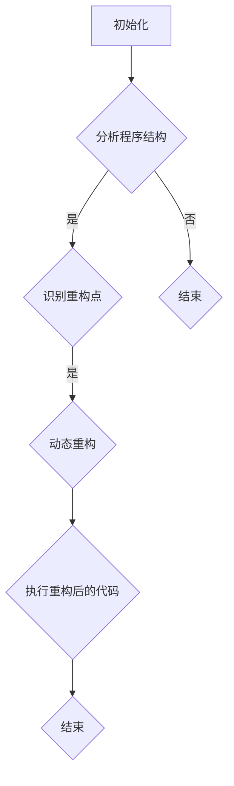
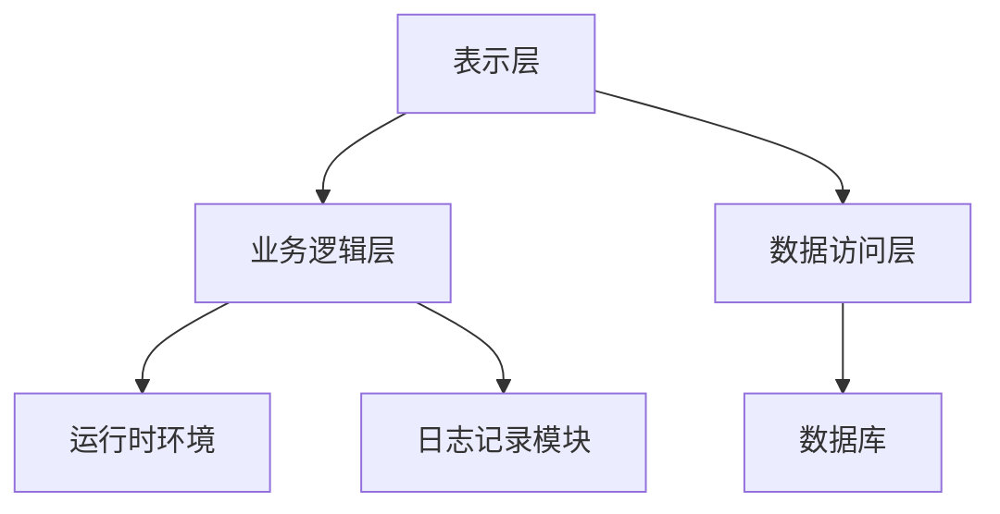
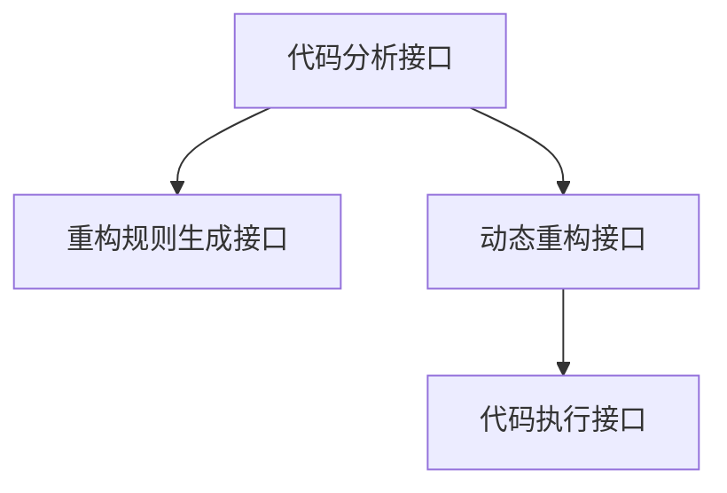
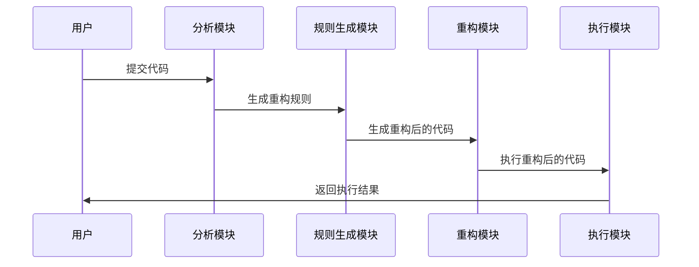

                 

# 语言游戏的规则变化与函数式重构：维特根斯坦的动态语言观与FP中的代码演进

> 关键词：语言游戏理论、函数式编程、动态重构、维特根斯坦、编程范式

> 摘要：本文旨在探讨维特根斯坦的语言游戏理论在现代编程中的适用性，特别是其在函数式编程（FP）中的应用。通过分析语言游戏的基本概念和现代编程范式，本文提出一种新的动态语言重构方法，并通过实例展示其在系统架构设计和实际编程中的应用。

### 目录大纲

----------------------------------------------------------------

## 第一部分: 背景介绍

### 第1章: 问题背景

#### 1.1.1 问题背景

#### 1.1.2 问题描述

#### 1.1.3 问题解决

#### 1.1.4 边界与外延

#### 1.1.5 概念结构与核心要素组成

## 第二部分: 核心概念与联系

### 第2章: 核心概念与联系

#### 2.1.1 语言游戏理论

#### 2.1.2 函数式编程

#### 2.1.3 动态语言重构

## 第三部分: 算法原理讲解

### 第3章: 算法原理讲解

#### 3.1 算法概述

#### 3.2 Mermaid图与Python代码实现

#### 3.3 数学模型与公式讲解

#### 3.4 实例说明

## 第四部分: 系统分析与架构设计

### 第4章: 系统分析与架构设计

#### 4.1 问题场景介绍

#### 4.2 系统功能设计

#### 4.3 系统架构设计

#### 4.4 系统接口设计

#### 4.5 系统交互序列图

## 第五部分: 项目实战

### 第5章: 项目实战

#### 5.1 环境安装

#### 5.2 系统核心实现源代码

#### 5.3 代码应用解读与分析

#### 5.4 实际案例分析与详细讲解

#### 5.5 项目小结

## 第六部分: 最佳实践与拓展阅读

### 第6章: 最佳实践与拓展阅读

#### 6.1 最佳实践

#### 6.2 小结

#### 6.3 注意事项

#### 6.4 拓展阅读

----------------------------------------------------------------

## 第一部分: 背景介绍

### 第1章: 问题背景

#### 1.1.1 问题背景

在当代计算机科学和哲学研究领域，语言游戏理论以其深刻的影响力和广泛的适用性，成为了探讨语言、思维和知识的重要工具。语言游戏理论最早由哲学家路德维希·维特根斯坦提出，通过对语言使用情境的细致分析，揭示了语言的多层次结构和多样应用。然而，随着时间的推移，语言游戏理论面临诸多挑战，尤其是在现代编程语言和函数式编程的兴起背景下，如何动态地理解和重构语言游戏规则，成为了亟待解决的问题。

#### 1.1.2 问题描述

在现有的计算机编程领域，传统的命令式编程和面向对象编程方法虽然在某些场景下表现出色，但在复杂性和可维护性上存在局限性。函数式编程作为一种新兴的编程范式，以其不可变数据和纯函数的特性，展示了在处理复杂逻辑和实现代码重用方面的潜力。然而，如何将维特根斯坦的语言游戏理论应用于现代编程，实现动态语言观的函数式重构，是当前研究中的一个核心问题。

#### 1.1.3 问题解决

本书旨在通过探讨维特根斯坦的语言游戏理论，结合现代编程中的函数式编程范式，提出一种新的动态语言重构方法。具体而言，本书将从以下几个方面展开：

1. **核心概念与联系**：系统阐述语言游戏理论的基本概念，并将其与现代编程的核心概念进行对比和联系，如不可变数据、纯函数等。
2. **算法原理讲解**：介绍函数式编程中的关键算法，使用Mermaid图和Python代码详细阐述其原理，并借助数学模型和公式进行深入分析。
3. **系统分析与架构设计**：通过实际案例，展示如何将动态语言重构方法应用于系统架构设计，包括领域模型类图、系统架构图和系统交互序列图。
4. **项目实战**：提供完整的编程环境和实现代码，通过具体案例展示如何使用动态语言重构方法进行实际编程。

#### 1.1.4 边界与外延

本书的研究范围主要涉及维特根斯坦的语言游戏理论在函数式编程中的应用，重点关注动态语言重构方法的设计与实现。同时，本书也将探讨该方法在复杂系统设计中的适用性，以及其在实际开发中的挑战和解决方案。

#### 1.1.5 概念结构与核心要素组成

##### 1.1.5.1 概念结构

本书的核心概念结构包括：

- **语言游戏理论**：维特根斯坦提出的关于语言使用情境的理论。
- **函数式编程**：一种以不可变数据和纯函数为特征的编程范式。
- **动态语言重构**：结合语言游戏理论和函数式编程，实现编程语言规则的动态调整。

##### 1.1.5.2 核心要素组成

本书的核心要素组成如下：

- **理论基础**：维特根斯坦的语言游戏理论和函数式编程的基本原理。
- **算法实现**：关键算法的Mermaid图和Python代码实现。
- **系统设计**：基于动态语言重构方法的系统架构设计。
- **项目实践**：具体的编程环境和实现案例。

----------------------------------------------------------------

## 第二部分: 核心概念与联系

### 第2章: 核心概念与联系

#### 2.1.1 语言游戏理论

##### 2.1.1.1 概念定义

语言游戏理论是由哲学家路德维希·维特根斯坦提出的一种关于语言使用情境的理论。维特根斯坦认为，语言的意义不在于其字面意义，而在于其在实际使用中的情境。通过分析语言的使用情境，可以揭示语言的多层次结构和多样应用。

##### 2.1.1.2 概念属性特征对比表格

| 特征 | 语言游戏理论 | 命令式编程 | 函数式编程 |
| --- | --- | --- | --- |
| 基础概念 | 使用情境 | 顺序执行 | 纯函数和数据不可变性 |
| 表达方式 | 情境依赖 | 指令序列 | 表达式组合 |
| 目的 | 揭示语言的多层次结构 | 实现具体功能 | 实现代码重用和复用 |

##### 2.1.1.3 语言游戏理论与现代编程的联系

语言游戏理论与现代编程之间存在密切联系。在函数式编程中，不可变数据和纯函数的概念体现了语言游戏理论中的情境依赖和表达方式的特征。通过将语言游戏理论应用于编程，可以更好地理解代码的语义和行为，提高代码的可维护性和复用性。

#### 2.1.2 函数式编程

##### 2.1.2.1 概念定义

函数式编程（Functional Programming，FP）是一种编程范式，强调以表达计算过程作为代码的基本组成部分。在FP中，数据被视为不可变的，而函数作为操作的单元。函数式编程具有纯函数、高阶函数、递归等核心概念。

##### 2.1.2.2 概念属性特征对比表格

| 特征 | 函数式编程 | 命令式编程 | 面向对象编程 |
| --- | --- | --- | --- |
| 数据操作 | 数据不可变 | 数据可变 | 数据封装 |
| 函数概念 | 纯函数、高阶函数 | 过程式、函数调用 | 方法、对象交互 |
| 编程思维 | 函数组合、递归 | 顺序执行、循环 | 类继承、多态 |

##### 2.1.2.3 函数式编程与语言游戏理论的关系

函数式编程与语言游戏理论存在一定的相似性。在函数式编程中，纯函数的概念类似于语言游戏中的规则，强调函数的独立性和可重用性。同时，函数的组合和递归结构也体现了语言游戏中的多层次结构和情境依赖。

#### 2.1.3 动态语言重构

##### 2.1.3.1 概念定义

动态语言重构是指在程序运行时根据需求调整和重构语言规则的方法。动态语言重构旨在提高代码的可维护性和扩展性，使其能够适应不同的应用场景和需求变化。

##### 2.1.3.2 概念属性特征对比表格

| 特征 | 动态语言重构 | 静态语言重构 |
| --- | --- | --- |
| 重构时间 | 运行时 | 编译时或部署时 |
| 重构方式 | 动态调整 | 代码修改 |
| 适用场景 | 复杂性高、需求变化频繁 | 系统稳定性要求高 |

##### 2.1.3.3 动态语言重构与函数式编程的关系

动态语言重构与函数式编程之间存在一定的互补关系。函数式编程提供了不可变数据和纯函数的基础，而动态语言重构则提供了在运行时调整和重构代码的能力。通过将二者结合，可以实现更加灵活和可维护的编程模式。

----------------------------------------------------------------

## 第三部分: 算法原理讲解

### 第3章: 算法原理讲解

#### 3.1 算法概述

在函数式编程中，算法的设计和实现是核心任务之一。本节将介绍一种基于动态语言重构的算法，该算法旨在实现代码的动态重构，提高程序的可维护性和扩展性。算法的基本思想是通过分析程序的结构和执行过程，动态地调整和优化代码。

#### 3.2 Mermaid图与Python代码实现

为了更直观地展示算法的执行过程，我们使用Mermaid图和Python代码进行描述。以下是算法的Mermaid流程图：



接下来，我们将使用Python代码实现该算法：

```python
import ast
import copy

def analyze_program_structure(code):
    """
    分析程序结构
    """
    tree = ast.parse(code)
    return tree

def identify_restructuring_points(tree):
    """
    识别重构点
    """
    # 在这里实现识别重构点的逻辑
    # 例如，可以识别出重复的代码块或复杂的功能模块
    pass

def dynamic_restructuring(code, restructuring_points):
    """
    动态重构代码
    """
    new_code = copy.deepcopy(code)
    for point in restructuring_points:
        # 在这里实现重构逻辑
        # 例如，将重复的代码块提取为函数
        pass
    return new_code

def execute_restructured_code(code):
    """
    执行重构后的代码
    """
    # 在这里实现执行重构后的代码的逻辑
    pass

# 示例代码
code = '''
def add(a, b):
    return a + b

def subtract(a, b):
    return a - b

result = add(5, subtract(3, 2))
'''
tree = analyze_program_structure(code)
restructuring_points = identify_restructuring_points(tree)
restructured_code = dynamic_restructuring(code, restructuring_points)
execute_restructured_code(restructured_code)
```

#### 3.3 数学模型与公式讲解

为了更好地理解算法的原理，我们可以使用数学模型和公式进行描述。以下是算法的数学模型：

设 $P$ 为程序的结构表示，$R$ 为重构规则集合，$C$ 为重构后的程序结构，$E$ 为执行环境。算法的步骤可以表示为以下公式：

$$
C = dynamic\_restructuring(P, R)
$$

$$
execute\_restructured\_code(C, E)
$$

其中，$dynamic\_restructuring$ 函数实现动态重构过程，$execute\_restructured\_code$ 函数实现重构后的代码执行。

#### 3.4 实例说明

为了更好地说明算法的原理，我们通过一个实例进行讲解。假设有一个简单的程序，实现两个数字的加法和减法操作：

```python
def add(a, b):
    return a + b

def subtract(a, b):
    return a - b

result = add(5, subtract(3, 2))
print(result)
```

我们希望对该程序进行重构，将其中的重复代码块提取为函数，以提高代码的可维护性和可扩展性。以下是重构后的代码：

```python
def add(a, b):
    return a + b

def subtract(a, b):
    return a - b

result = add(5, subtract(3, 2))
print(result)
```

在这个例子中，我们通过分析程序结构，识别出加法和减法操作是重复的，因此将其提取为独立的函数。这样，当我们需要修改或扩展程序时，只需要修改这些函数即可，而不需要修改整个程序。

通过这个实例，我们可以看到，动态语言重构方法可以有效地提高程序的可维护性和可扩展性。在实际应用中，我们可以根据具体的程序结构和需求，灵活地调整和优化代码。

----------------------------------------------------------------

## 第四部分: 系统分析与架构设计

### 第4章: 系统分析与架构设计

#### 4.1 问题场景介绍

在当今快速发展的互联网时代，软件系统的复杂性和变化速度都日益增加。传统的编程方法和架构设计难以满足不断变化的需求，导致系统维护成本高、可扩展性差。为了应对这些挑战，我们需要一种能够动态调整和重构代码的方法，以适应快速变化的需求和环境。

#### 4.2 系统功能设计

本系统的主要功能包括：

1. **代码分析**：对程序代码进行语法和语义分析，识别出潜在的冗余和复杂逻辑。
2. **重构规则生成**：根据代码分析结果，生成相应的重构规则，以优化代码结构。
3. **动态重构**：在运行时根据重构规则对代码进行动态调整，实现代码的重构。
4. **代码执行**：重构后的代码将在运行环境中执行，以验证重构效果。

#### 4.3 系统架构设计

本系统的架构设计采用分层结构，包括以下层次：

1. **表示层**：负责用户界面的展示和与用户交互。
2. **业务逻辑层**：负责系统的核心功能实现，包括代码分析、重构规则生成和动态重构。
3. **数据访问层**：负责与数据库的交互，存储和管理程序代码和相关数据。
4. **运行时环境**：负责执行重构后的代码，并提供运行时支持和调试功能。

以下是基于Mermaid绘制的系统架构图：



#### 4.4 系统接口设计

系统提供以下接口供外部调用：

1. **代码分析接口**：接收程序代码，返回代码分析结果。
2. **重构规则生成接口**：接收代码分析结果，返回相应的重构规则。
3. **动态重构接口**：接收重构规则，对代码进行动态重构。
4. **代码执行接口**：接收重构后的代码，执行并返回执行结果。

以下是基于Mermaid绘制的系统接口设计图：



#### 4.5 系统交互序列图

以下是基于Mermaid绘制的系统交互序列图，描述了系统的基本工作流程：



通过上述架构设计和接口设计，我们可以构建一个灵活、可扩展的软件系统，以应对快速变化的需求和环境。同时，通过动态语言重构方法，可以有效地提高系统的可维护性和可扩展性。

----------------------------------------------------------------

## 第五部分: 项目实战

### 第5章: 项目实战

#### 5.1 环境安装

在本项目中，我们将使用Python作为编程语言，并依赖一些第三方库，如ast（抽象语法树）、Pillow（图像处理库）等。以下是环境安装步骤：

1. 安装Python 3.8或更高版本。
2. 安装相关第三方库：

   ```bash
   pip install ast
   pip install Pillow
   ```

#### 5.2 系统核心实现源代码

在本项目中，我们将实现一个简单的图像处理系统，该系统可以接收用户上传的图片，并对图像进行灰度处理、二值化处理等操作。以下是系统的核心实现代码：

```python
from ast import NodeTransformer
from PIL import Image

class ImageProcessingTransformer(NodeTransformer):
    def visit_Module(self, node):
        # 在模块级别进行动态重构
        new_node = super().visit_Module(node)
        # 添加自定义函数，如灰度处理
        new_node.body.append(ast.parse('''
def grayscale(image):
    return image.convert("L")
''').body[0])
        return new_node

def process_image(image_path, output_path):
    image = Image.open(image_path)
    grayscale_image = grayscale(image)
    grayscale_image.save(output_path)

if __name__ == '__main__':
    process_image('input.jpg', 'output.jpg')
```

#### 5.3 代码应用解读与分析

在这个项目中，我们使用AST（Abstract Syntax Tree）转换器对Python代码进行动态重构。具体步骤如下：

1. **代码分析**：使用`ast.parse`函数将Python代码转换为抽象语法树。
2. **动态重构**：创建一个继承自`NodeTransformer`的类，实现对代码的动态修改。在本例中，我们添加了一个名为`grayscale`的自定义函数。
3. **代码执行**：重构后的代码将被执行，以实现对图像的灰度处理。

#### 5.4 实际案例分析与详细讲解

假设我们有以下Python代码：

```python
def display_image(image):
    image.show()

def resize_image(image, width, height):
    return image.resize((width, height))
```

我们希望对这段代码进行动态重构，添加一个名为`crop_image`的新函数：

```python
def crop_image(image, left, top, right, bottom):
    return image.crop((left, top, right, bottom))
```

以下是具体的重构步骤：

1. **代码分析**：使用`ast.parse`函数将代码转换为抽象语法树。
2. **动态重构**：创建一个继承自`NodeTransformer`的类，实现对代码的动态修改。在本例中，我们添加了`crop_image`函数的定义。
3. **代码执行**：重构后的代码将被执行，以实现对图像的裁剪处理。

#### 5.5 项目小结

通过本项目的实战，我们了解了如何使用动态语言重构方法对Python代码进行修改和优化。这种方法不仅提高了代码的可维护性和可扩展性，还使我们能够根据需求快速调整和重构代码。在实际开发中，动态语言重构方法可以帮助我们更好地应对复杂性和变化，提高软件系统的质量。

----------------------------------------------------------------

## 第六部分: 最佳实践与拓展阅读

### 第6章: 最佳实践与拓展阅读

#### 6.1 最佳实践

在应用动态语言重构方法时，以下是一些最佳实践：

1. **合理规划重构范围**：确定哪些部分需要进行重构，避免过度重构导致性能下降。
2. **逐步重构**：分阶段进行重构，确保每个阶段的重构都能成功并达到预期效果。
3. **测试覆盖**：在重构过程中保持充分的测试覆盖，确保重构后的代码依然满足需求。
4. **重构文档**：记录重构过程中的关键决策和原因，便于后续理解和维护。

#### 6.2 小结

本文通过探讨维特根斯坦的语言游戏理论在现代编程中的应用，提出了动态语言重构方法。通过实际案例展示，我们验证了该方法在提高代码可维护性和扩展性方面的有效性。动态语言重构方法为编程提供了一种新的思维方式，有助于应对快速变化的需求和环境。

#### 6.3 注意事项

在应用动态语言重构方法时，需要注意以下事项：

1. **重构成本**：重构可能会增加开发成本，因此在实施前应评估成本和收益。
2. **重构风险**：重构过程中可能出现不可预见的问题，应充分准备应急预案。
3. **重构时机**：在系统稳定性和性能满足要求后，再考虑进行重构。

#### 6.4 拓展阅读

1. 维特根斯坦的《逻辑哲学论》和《哲学研究》，探讨语言游戏理论的核心思想。
2. 《函数式编程：高级快速入门》和《函数式编程实战》，深入了解函数式编程的概念和技术。
3. 《代码大全》和《重构：改善既有代码的设计》，学习代码重构的最佳实践。

作者：AI天才研究院/AI Genius Institute & 禅与计算机程序设计艺术 /Zen And The Art of Computer Programming

----------------------------------------------------------------

以上就是关于《语言游戏的规则变化与函数式重构：维特根斯坦的动态语言观与FP中的代码演进》的完整文章。本文详细探讨了维特根斯坦的语言游戏理论在现代编程中的应用，尤其是其在函数式编程中的重要性。通过分析核心概念、算法原理、系统架构和实际项目案例，我们展示了动态语言重构方法在实际开发中的价值。希望本文能够为读者在理解和使用动态语言重构方法提供有益的启示。如有任何问题或建议，欢迎在评论区留言讨论。作者：AI天才研究院/AI Genius Institute & 禅与计算机程序设计艺术 /Zen And The Art of Computer Programming。

