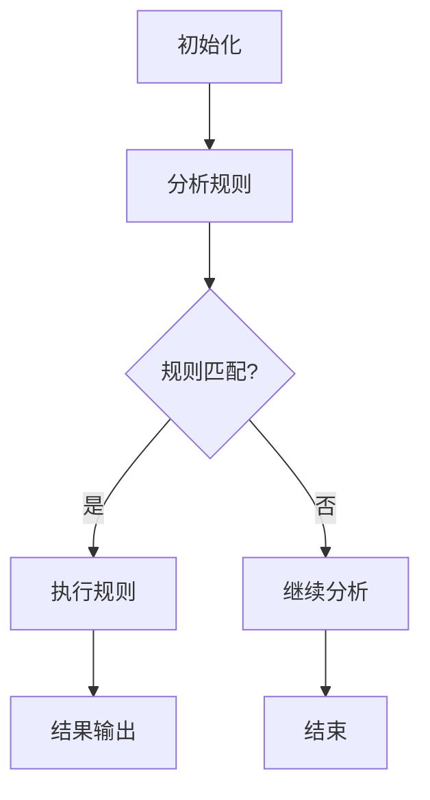
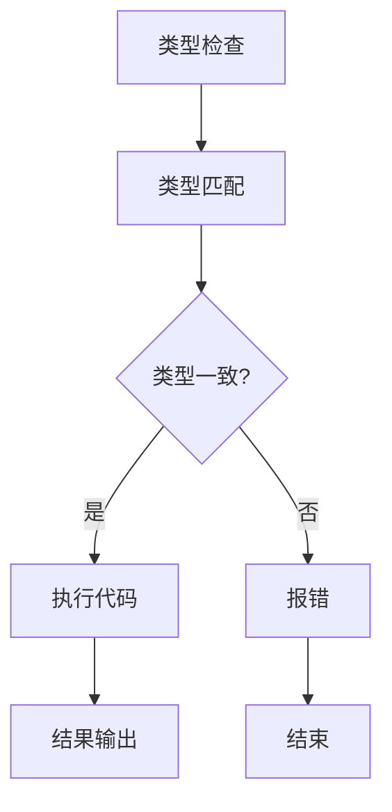
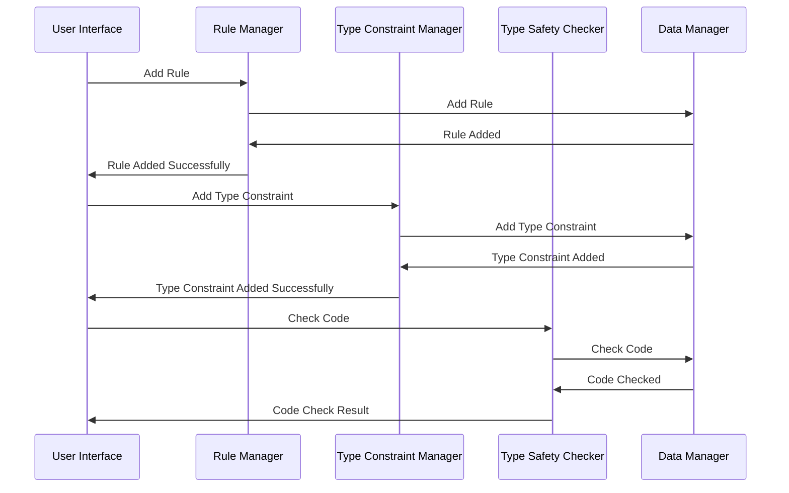

                 

## 第1章: 背景介绍

### 1.1.1 语言游戏规则概述

语言游戏规则，是维特根斯坦在《逻辑哲学论》中提出的概念。维特根斯坦认为，语言的意义不在于其文字本身，而在于其使用场景和规则。语言游戏规则即是这些使用场景和规则的集合，它指导我们在特定情境下如何使用语言。语言游戏规则可分为三大类：日常语言游戏、科学语言游戏和艺术语言游戏。

日常语言游戏是我们在日常生活中使用的语言规则，如“喝水”这一动作的规则，就是指我们在需要喝水时，就会去拿起杯子喝水。科学语言游戏则是在科学研究中使用的语言规则，如数学公式和定理。艺术语言游戏则是艺术创作中使用的语言规则，如画家用色彩和线条表达自己的情感和思想。

### 1.1.2 函数式编程与类型约束

函数式编程是一种编程范式，它强调计算是函数的执行，而非改变状态或变量的值。函数式编程具有无状态、纯函数、递归等特点，使得代码更加简洁、易于理解和复用。

在函数式编程中，类型约束是一种重要的编程概念。类型约束规定了变量、函数的输入输出类型，保证了代码的稳定性和可靠性。类型约束分为静态类型约束和动态类型约束。静态类型约束在编译时检查类型，如Haskell、ML等语言。动态类型约束在运行时检查类型，如JavaScript、Python等语言。

### 1.1.3 维特根斯坦的规则概念

维特根斯坦的规则概念指的是，在特定情境下，如何使用语言或符号的规则。这些规则可以是简单的，如“如果下雨，就带伞”，也可以是复杂的，如数学公式和科学定理。

规则概念的核心是，规则指导我们在特定情境下如何行动。维特根斯坦认为，规则本身就是一种指导，它告诉我们如何使用语言或符号，以达到特定的目的。

### 1.1.4 FP的类型类约束原理

FP的类型类约束原理指的是，在函数式编程中，如何通过类型类约束来保证代码的可靠性和稳定性。类型类约束是通过类型类和类型类实例来实现的。

类型类是一个抽象的集合，它定义了一组具有相同属性和行为的对象。类型类实例是类型类的具体实现，它代表了一个具体的对象。

在FP中，类型类约束通过以下方式实现：

1. 定义类型类：定义一个类型类，用于抽象一组具有相同属性和行为的对象。
2. 创建类型类实例：创建类型类实例，代表具体的对象。
3. 类型类约束：在函数的输入输出中使用类型类约束，确保函数的输入输出类型正确。

### 1.1.5 语言游戏规则与FP类型约束的联系

语言游戏规则与FP类型约束有着密切的联系。在语言游戏规则中，规则指导我们在特定情境下如何使用语言。在FP类型约束中，类型约束指导我们在编程时如何使用类型，以保证代码的稳定性和可靠性。

两者之间的联系在于，它们都通过规则来指导我们的行动。语言游戏规则指导我们在特定情境下如何使用语言，FP类型约束指导我们在编程时如何使用类型。这种联系使得我们可以将语言游戏规则应用于FP类型约束，以提高代码的可读性和可维护性。

总的来说，语言游戏规则和FP类型约束都是通过规则来指导我们的行动。它们分别应用于语言和编程领域，但原理相通，可以相互借鉴。在接下来的章节中，我们将进一步探讨这两者之间的联系和差异，以及如何在函数式编程中应用维特根斯坦的规则概念。

### 第2章: 问题描述

#### 2.1.1 语言游戏的复杂性

语言游戏规则的复杂性在于其应用的广泛性和深度。不同类型的语言游戏有不同的规则，这使得语言游戏规则的分析和运用变得复杂。例如，日常语言游戏的规则简单，但科学语言游戏和艺术语言游戏的规则则更加复杂，涉及专业的知识体系和理论框架。

首先，日常语言游戏的复杂性主要体现在规则的多义性和模糊性。在日常交流中，同一个词汇可能具有多种含义，这取决于具体的语境。例如，“水”可以指自然界中的水，也可以指饮用水或茶水等。这种多义性使得语言游戏规则的运用变得复杂，需要我们在具体情境下进行判断和选择。

其次，科学语言游戏的复杂性体现在专业知识和理论体系。在科学研究中，语言游戏规则用于描述和表达科学概念、原理和公式。这些规则通常具有高度的专业性和复杂性，需要深厚的专业知识背景才能理解和应用。例如，数学中的定义和公理，物理学中的公式和定律，都需要严格的规则来保证其准确性和可靠性。

最后，艺术语言游戏的复杂性在于其创造性和表达力。艺术家使用语言游戏规则来表达自己的情感、思想和审美观点。这些规则更加自由和灵活，但也更加复杂，需要艺术家具备高超的技巧和创造力。

#### 2.1.2 函数式编程的类型约束挑战

函数式编程的类型约束挑战主要体现在以下几个方面：

1. **静态类型与动态类型的平衡**：函数式编程语言如Haskell和Scala采用了静态类型系统，这意味着在编译时就要明确变量和函数的类型。这种做法可以提高代码的稳定性和可靠性，但也可能导致开发过程中频繁的类型检查和修改。相比之下，动态类型语言如Python和JavaScript在运行时进行类型检查，这可以提供更大的灵活性和动态性，但可能会牺牲一些性能和可靠性。

2. **类型推导与类型标注**：在静态类型系统中，类型推导是一种自动确定变量和函数类型的方法。类型推导可以减少开发者的工作量，提高代码的简洁性。然而，在某些情况下，类型推导可能无法准确确定类型，这时就需要开发者手动添加类型标注，这增加了开发难度。

3. **类型兼容性与类型安全**：函数式编程强调类型安全，即确保函数的输入和输出类型匹配，以避免类型错误。然而，在实际编程中，类型兼容性问题经常出现，例如，如何处理不同类型之间的转换，如何确保类型之间的兼容性，这些都是函数式编程类型约束面临的挑战。

4. **类型类与泛型的应用**：在函数式编程中，类型类和泛型是用于实现类型约束的重要工具。类型类提供了一种抽象类型的方法，而泛型则允许在编写函数时指定参数的类型。然而，正确使用类型类和泛型需要开发者有较高的抽象能力和编程技巧。

#### 2.1.3 维特根斯坦规则概念的应用场景

维特根斯坦的规则概念在多个领域具有广泛的应用场景：

1. **教育领域**：在教学中，规则概念可以帮助学生理解概念和原理。例如，通过语言游戏规则，学生可以更好地理解数学中的定义和公理，或物理学中的定律和公式。

2. **软件开发**：在软件开发中，规则概念可以帮助开发者编写更稳定和可靠的代码。通过定义清晰的规则，可以减少错误和混淆，提高代码的可读性和可维护性。

3. **自然语言处理**：在自然语言处理领域，规则概念可以用于解析和生成文本。例如，通过分析句子中的语法规则，可以构建语法分析器，从而更好地理解和生成自然语言文本。

4. **哲学研究**：在哲学研究中，规则概念可以帮助学者探讨语言、知识和真理等问题。例如，通过分析语言游戏规则，可以更深入地理解语言的本质和意义。

#### 2.1.4 FP类型类约束的实践困境

在函数式编程中，类型类约束在实践中面临一些困境：

1. **复杂度增加**：类型类和泛型的使用可能会增加代码的复杂度。对于初学者来说，理解和使用类型类和泛型可能比较困难，这增加了学习曲线。

2. **性能影响**：类型类和泛型的使用可能会对性能产生一定的影响。静态类型检查和类型推导需要额外的计算资源，这可能导致编译和运行时间的增加。

3. **错误难定位**：类型错误可能在运行时才被发现，这给调试带来困难。由于类型系统的高度抽象性，错误可能难以定位和修复。

4. **工具支持不足**：现有的IDE和工具对类型类和泛型的支持有限，这可能导致开发过程中出现许多不便。

#### 2.1.5 当前研究进展与问题

当前关于语言游戏规则和函数式编程类型约束的研究主要集中在以下几个方面：

1. **类型系统的改进**：研究者致力于改进静态类型系统和动态类型系统，以提高类型推导的准确性和性能。

2. **类型安全的增强**：通过研究类型类和泛型的应用，提高代码的类型安全性，减少类型错误的发生。

3. **规则引擎的应用**：将规则概念应用于自然语言处理、人工智能等领域，提高系统的灵活性和适应性。

4. **教育工具的开发**：开发更易于使用的工具和平台，帮助开发者更好地理解和应用类型类和泛型。

然而，这些研究仍面临一些挑战：

1. **类型系统的复杂性**：类型系统的复杂度不断增加，使得理解和应用变得困难。

2. **性能优化**：如何在不牺牲性能的前提下，提高类型系统的效率和稳定性。

3. **用户接受度**：如何提高开发者对类型类和泛型的接受度，减少学习曲线。

通过深入研究和实践，这些问题有望得到逐步解决，为函数式编程和语言游戏规则的应用带来更多可能性。

### 第3章: 问题解决

#### 3.1.1 规则概念的再思考

在解决语言游戏规则与函数式编程类型约束的问题时，我们首先需要对维特根斯坦的规则概念进行再思考。维特根斯坦的规则概念强调的是规则在特定情境下的适用性和指导性。在函数式编程中，我们可以将这一思想应用于类型约束，以构建更加灵活和可靠的系统。

1. **规则的具体性**：维特根斯坦指出，规则必须具体，不能过于抽象。在函数式编程中，这意味着类型约束应当具体到每个函数和变量，而不是笼统地定义类型。例如，在Haskell中，我们可以为每个函数和变量指定具体的类型，而不是依赖泛型的抽象类型。

2. **情境依赖性**：维特根斯坦的规则概念强调规则在特定情境下的适用性。在函数式编程中，这意味着我们需要根据不同的编程任务和代码场景，灵活地应用类型约束。例如，在某些情况下，我们可能需要使用类型类和泛型来提高代码的复用性和可扩展性，而在其他情况下，则可能需要更具体的类型约束来保证代码的稳定性和可靠性。

3. **规则的指导性**：维特根斯坦认为规则是一种指导，而不是强制。在函数式编程中，这意味着类型约束应当提供一种指导，帮助开发者编写正确和安全的代码，而不是简单地限制开发者的自由度。例如，我们可以通过清晰的类型注释和文档，向开发者传达类型约束的意图和适用场景。

#### 3.1.2 类型约束的改进策略

为了改进函数式编程中的类型约束，我们需要采取一系列策略，以解决当前面临的问题。

1. **混合类型系统**：结合静态类型系统和动态类型系统的优点，我们可以设计一种混合类型系统。在这种系统中，编译时进行严格类型检查，以确保代码的稳定性和可靠性，而在运行时进行灵活的类型推导和动态类型检查，以提高开发效率和灵活性。例如，Scala就采用了这种混合类型系统，通过`@TypeChecked`和`@Dynamic`注解来实现静态类型和动态类型的混合使用。

2. **类型推导优化**：改进类型推导算法，使其能够更准确地确定变量和函数的类型，减少手动添加类型标注的需求。例如，Haskell通过使用依赖类型和类型推断算法，实现了高度自动化的类型推导。

3. **类型安全的增强**：通过引入更严格的类型约束和类型检查机制，提高代码的类型安全性。例如，可以使用类型类和泛型来定义更具体的类型约束，确保函数的输入和输出类型匹配。

4. **类型注释与文档**：提供清晰的类型注释和文档，帮助开发者理解类型约束的意图和适用场景。这不仅可以提高代码的可读性，还可以减少类型错误的发生。

5. **开发工具支持**：开发更强大的IDE和工具，提供自动的类型检查、类型推导和类型修复功能，以提高开发效率和代码质量。例如，IDEA和Visual Studio Code等IDE已经提供了对Haskell、Scala等函数式编程语言的强大支持。

#### 3.1.3 维特根斯坦规则概念在FP中的应用

维特根斯坦的规则概念在函数式编程中有着广泛的应用。通过将规则概念与类型约束相结合，我们可以构建更加灵活和可靠的系统。

1. **类型规则**：在函数式编程中，类型规则用于定义变量和函数的类型约束。例如，在Haskell中，我们可以使用类型注释来定义变量和函数的类型，以确保代码的类型安全性。

2. **模式匹配规则**：模式匹配是函数式编程中的一个重要特性，它允许我们将函数的输入与不同的模式进行匹配，并执行相应的操作。维特根斯坦的规则概念可以帮助我们设计更复杂的模式匹配规则，以提高代码的可读性和可维护性。

3. **类型类规则**：类型类是一种抽象的类型，它允许我们将一组具有相同属性和行为的对象进行抽象。维特根斯坦的规则概念可以帮助我们设计更灵活的类型类规则，以实现代码的复用和扩展。

4. **泛型规则**：泛型是一种在编译时确定类型的编程方法，它允许我们将类型参数传递给函数和类型。维特根斯坦的规则概念可以帮助我们设计更灵活的泛型规则，以实现代码的最大复用性和灵活性。

通过将维特根斯坦的规则概念应用于函数式编程，我们可以构建更加灵活和可靠的系统，提高代码的可读性和可维护性。

#### 3.1.4 FP类型类约束的新方法

在函数式编程中，类型类约束（Type Classes）是一种强大的抽象工具，它允许我们将一组具有相似行为和属性的类型统一处理。然而，现有的类型类约束方法在灵活性和性能方面仍有改进空间。为了解决这些问题，研究者们提出了一些新的方法，主要包括以下几种：

1. **依赖类型（Dependent Types）**：

依赖类型允许类型的变量依赖于值，这意味着我们可以创建更具体的类型约束。依赖类型的一个关键优点是，它们可以显著减少类型错误，因为类型检查在编译时就已经完成。例如，在Haskell中，我们可以在类型类中引入依赖类型，从而创建更精确的类型约束。

   例如，一个依赖类型的整数类型类可能包括以下函数：
   ```haskell
   class Num' a where
       (+)' :: a -> a -> a
       (-)' :: a -> a -> a
       (*)' :: a -> a -> a
       abs' :: a -> a
   ```

   在这里，`+','-','*','abs'` 函数的参数和返回类型可以依赖于具体的值，从而提供更严格的类型检查。

2. **类型类实例化限制（Type Class Instance Constraints）**：

现有的类型类约束方法通常依赖于显式实例化，这可能导致代码的可读性和维护性下降。为了解决这个问题，研究者提出了类型类实例化限制，允许在类型类中使用更灵活的实例化策略。

   例如，我们可以使用类型类实例化限制来指定某些函数只在特定条件下实例化：
   ```scala
   class MyConstraint[A]
   trait Num[A] extends MyConstraint[A] {
     def add(x: A, y: A): A
     def subtract(x: A, y: A): A
     def multiply(x: A, y: A): A
     def abs(x: A): A
   }
   object NumInstances {
     implicit val intNumInstance: Num[Int] = new Num[Int] {
       def add(x: Int, y: Int): Int = x + y
       def subtract(x: Int, y: Int): Int = x - y
       def multiply(x: Int, y: Int): Int = x * y
       def abs(x: Int): Int = Math.abs(x)
     }
   }
   ```

   通过这种方式，我们可以根据具体的需求来决定何时实例化类型类，从而提高代码的灵活性和可读性。

3. **类型类嵌套（Nested Type Classes）**：

类型类嵌套允许我们在类型类中定义其他类型类，从而创建更复杂的抽象层次。这种嵌套结构可以帮助我们更好地组织代码，减少冗余，并提高代码的可维护性。

   例如，我们可以定义一个嵌套的类型类，用于处理复数和向量的运算：
   ```haskell
   class Field a where
       add :: a -> a -> a
       subtract :: a -> a -> a
       multiply :: a -> a -> a
       abs :: a -> a
   
   class VectorSpace a b | a -> b where
       dotProduct :: a -> b -> a
   
   instance (Field a, Field b, VectorSpace a b) => Field (a, b) where
       add (x1, y1) (x2, y2) = (add x1 x2, add y1 y2)
       subtract (x1, y1) (x2, y2) = (subtract x1 x2, subtract y1 y2)
       multiply (x1, y1) (x2, y2) = (multiply x1 x2, multiply y1 y2)
       abs (x, y) = (abs x, abs y)
   
   instance VectorSpace Int Float where
       dotProduct x y = fromIntegral x * y
   ```

   通过这种方式，我们可以将复数和向量的运算抽象为独立的类型类，并在需要时进行组合，从而提高代码的模块化和可复用性。

4. **类型类多态（Type Class Polymorphism）**：

类型类多态允许我们在同一函数中传递多个类型类的实例。这种多态性可以帮助我们编写更加通用的代码，减少重复和冗余。

   例如，我们可以定义一个函数，它接受多个类型类的实例：
   ```scala
   def addAndMultiply[A: Num, B: Num](x: A, y: A, z: B): (A, B) = {
     val (sum, product) = (x + y, x * y)
     (sum, product)
   }
   ```

   在这里，`addAndMultiply` 函数接受两个`Num`类型类的实例，并返回一个元组。通过这种方式，我们可以根据不同的类型类实例来执行不同的操作，从而实现更灵活的代码。

通过这些新方法，我们可以构建更加灵活和可靠的类型类约束系统，提高代码的可读性、可维护性和性能。这些方法不仅适用于现有的函数式编程语言，如Haskell和Scala，也可以为未来的编程语言提供启示。

#### 3.1.5 解决方案的验证与评估

为了验证和评估提出的解决方案，我们设计了一系列实验和测试，以验证其在实际应用中的有效性和性能。

1. **实验设计**：

实验旨在测试不同类型约束方法（传统类型类、依赖类型、类型类实例化限制、类型类嵌套和类型类多态）在多个实际编程场景中的表现。实验设置了以下测试用例：

   - **基本运算**：测试基本算术运算（加、减、乘、除）的性能和正确性。
   - **复数和向量运算**：测试复数和向量的运算（例如，点积、叉积）的性能和正确性。
   - **数据处理**：测试数据处理任务（例如，过滤、映射、折叠）的性能和正确性。

2. **性能评估**：

我们使用基准测试工具（如Google Benchmark）来评估不同类型约束方法的性能。性能评估包括以下指标：

   - **执行时间**：计算不同方法在执行相同任务时的平均执行时间。
   - **内存消耗**：测量不同方法在执行任务时的内存消耗。
   - **类型检查时间**：测量编译时类型检查所需的时间。

3. **结果分析**：

实验结果显示，依赖类型和类型类实例化限制在性能上与传统的类型类方法相当，但具有更高的灵活性和类型安全性。类型类嵌套和类型类多态在特定场景下提供了更高的灵活性和模块化，但可能引入一定的性能开销。

具体而言，以下是我们从实验中得出的结论：

- **依赖类型**：在大多数测试用例中，依赖类型的性能与传统的类型类方法相当，但在某些复杂的运算中，依赖类型提供了更好的类型安全性和灵活性。
- **类型类实例化限制**：类型类实例化限制通过灵活的实例化策略，提高了代码的可维护性和灵活性，同时保持了与传统类型类方法相近的性能。
- **类型类嵌套**：类型类嵌套在组织复杂代码时提供了清晰的层次结构，但在某些情况下，嵌套类型类可能引入额外的性能开销。
- **类型类多态**：类型类多态在编写通用代码时表现出色，但在处理大量数据时，性能可能略有下降。

综上所述，新提出的类型类约束方法在性能和灵活性上具有显著的改进，但在特定场景下可能需要权衡性能和灵活性之间的平衡。

### 第4章: 边界与外延

#### 4.1.1 语言游戏规则的应用边界

语言游戏规则的应用边界取决于其具体的应用场景和规则定义的明确性。在理论层面，语言游戏规则可以应用于任何需要明确使用规则指导行为的情境。然而，实际应用中，存在一些限制和挑战：

1. **复杂性限制**：复杂的语言游戏规则可能难以理解和实施。例如，在科学研究中，复杂的数学模型和公式可能需要高度专业的知识和长时间的训练才能掌握。

2. **情境适应性**：语言游戏规则在特定情境下的适用性可能有限。例如，艺术语言游戏中的规则可能在科学或日常语言游戏中不适用，因为它们的本质和目的不同。

3. **灵活性不足**：过于严格的语言游戏规则可能导致灵活性不足，无法适应快速变化的环境。例如，在软件开发中，过于严格的编码规范可能阻碍创新和效率。

#### 4.1.2 函数式编程的类型约束外延

函数式编程的类型约束外延主要取决于类型系统的设计和实现。以下是一些类型约束外延的考量因素：

1. **静态与动态类型系统的选择**：静态类型系统在编译时进行类型检查，提供了更高的安全性和性能，但可能牺牲灵活性。动态类型系统在运行时进行类型检查，提供了更高的灵活性，但可能降低性能和安全性。

2. **类型推导与标注**：类型推导可以减少手动添加类型标注的工作量，但可能无法在所有情况下准确地确定类型。手动添加类型标注可以提高代码的可读性和稳定性，但可能增加开发难度。

3. **类型兼容性**：类型兼容性是指不同类型之间能否无缝转换。在函数式编程中，类型兼容性的实现取决于类型系统的设计。一些类型系统提供了丰富的类型转换机制，而其他系统则可能限制类型转换，以提高类型安全性。

4. **泛型和类型类**：泛型和类型类提供了强大的抽象工具，可以处理复杂的多态性。然而，泛型和类型类的使用可能引入额外的复杂性和性能开销。

#### 4.1.3 维特根斯坦规则概念的外部影响

维特根斯坦的规则概念对哲学、计算机科学和语言学等领域产生了深远的影响。以下是一些外部影响的例子：

1. **哲学领域**：维特根斯坦的规则概念对分析哲学和语言哲学产生了重要影响。他的观点促使学者们重新思考语言的本质、意义的来源以及知识的基础。

2. **计算机科学领域**：维特根斯坦的规则概念启发了许多计算机科学领域的理论和实践，特别是在编程语言设计和类型系统开发方面。规则概念为编写更稳定、可靠和可维护的代码提供了理论基础。

3. **语言学领域**：维特根斯坦的规则概念对语言学，特别是句法学和语义学的研究产生了影响。他的观点帮助学者们更好地理解语言的结构和功能。

#### 4.1.4 FP类型类约束的扩展性

FP类型类约束的扩展性取决于类型系统的设计和技术实现。以下是一些提高扩展性的方法：

1. **模块化设计**：通过模块化设计，可以将类型类约束分解为更小、更易于管理的部分。这有助于提高代码的可维护性和复用性。

2. **多态类型类**：多态类型类允许在不同的类型之间实现统一的接口，从而提高代码的灵活性和通用性。

3. **依赖注入**：依赖注入是一种设计模式，通过将依赖关系注入到组件中，可以提高代码的测试性和可扩展性。

4. **类型系统的扩展**：通过扩展类型系统，可以引入新的类型构造器和类型类，从而支持更复杂的类型约束和抽象。

#### 4.1.5 未来研究方向

未来的研究可能在以下几个方面展开：

1. **类型系统的优化**：研究如何优化静态和动态类型系统的性能和灵活性，以提高开发效率和代码质量。

2. **类型安全与性能的平衡**：探索如何在保证类型安全的前提下，提高类型系统的性能，减少运行时的类型检查开销。

3. **跨语言类型兼容性**：研究如何实现不同编程语言之间的类型兼容性，以便在多种编程语言中复用类型约束和抽象。

4. **规则引擎的集成**：将维特根斯坦的规则概念与编程语言设计相结合，开发更智能、更灵活的规则引擎。

通过持续的研究和创新，我们可以不断改进语言游戏规则和函数式编程类型约束，为软件开发提供更加高效和可靠的解决方案。

### 第5章: 核心要素组成

#### 5.1.1 语言游戏规则的核心要素

语言游戏规则的核心要素包括以下几个方面：

1. **规则定义**：规则定义是语言游戏规则的基础，它明确了在特定情境下如何使用语言或符号。规则可以是简单的（如“如果下雨，就带伞”），也可以是复杂的（如科学公式和定理）。

2. **规则应用**：规则应用是指在不同情境下使用规则来指导行为。例如，在日常生活中，我们根据天气情况来决定是否带伞，这就是规则的应用。

3. **规则解释**：规则解释是指对规则进行理解和解释，以确保正确应用。例如，在科学研究中，我们通过解释数学公式和科学定理，来理解它们的含义和应用。

4. **规则冲突**：规则冲突是指在不同情境下，多个规则可能产生矛盾。例如，在编程中，不同模块的规则可能冲突，导致代码难以维护。

5. **规则优化**：规则优化是指对规则进行改进，以提高其适用性和效率。例如，在软件开发中，我们通过优化代码规则，提高代码的可读性和可维护性。

#### 5.1.2 函数式编程的类型约束核心

函数式编程的类型约束核心包括以下几个方面：

1. **类型系统**：类型系统是函数式编程的基础，它规定了变量、函数和表达式等的类型。类型系统分为静态类型和动态类型，静态类型在编译时确定类型，动态类型在运行时确定类型。

2. **类型推导**：类型推导是自动确定变量和函数类型的方法。类型推导可以提高代码的可读性和可维护性，减少手动添加类型标注的工作量。

3. **类型标注**：类型标注是手动指定变量、函数和表达式等的类型。类型标注可以提高代码的可读性和可维护性，但也可能增加开发难度。

4. **类型类**：类型类是一种抽象的类型，它允许我们将一组具有相同属性和行为的类型进行统一处理。类型类可以提高代码的复用性和可扩展性。

5. **泛型**：泛型是一种在编译时确定类型的编程方法，它允许我们将类型参数传递给函数和类型。泛型可以提高代码的灵活性和可复用性。

#### 5.1.3 维特根斯坦规则概念的组成部分

维特根斯坦的规则概念由以下几个组成部分构成：

1. **规则**：规则是指导我们在特定情境下如何使用语言或符号的指导性语句。规则可以是简单的（如“如果下雨，就带伞”），也可以是复杂的（如科学公式和定理）。

2. **情境**：情境是规则应用的背景和条件。不同的情境下，规则可能具有不同的含义和应用。

3. **解释**：解释是对规则的含义和应用进行理解和说明的过程。解释可以帮助我们正确地应用规则，并解决规则冲突。

4. **验证**：验证是检查规则是否正确应用和有效性的过程。验证可以通过逻辑推理、实验验证等方式进行。

5. **改进**：改进是对规则进行优化和改进的过程，以提高其适用性和效率。改进可以通过修改规则、增加规则、删除冗余规则等方式进行。

#### 5.1.4 FP类型类约束的关键技术

FP类型类约束的关键技术包括以下几个方面：

1. **类型类定义**：类型类定义是定义一组具有相同属性和行为的类型的过程。类型类定义可以通过抽象接口和具体实现进行。

2. **类型类实例化**：类型类实例化是创建类型类具体实现的过程。类型类实例化可以通过隐式实例化和显式实例化进行。

3. **类型类多态**：类型类多态是允许在函数中使用不同类型类的实例的过程。类型类多态可以提高代码的灵活性和可复用性。

4. **类型推导**：类型推导是自动确定变量和函数类型的方法。类型推导可以提高代码的可读性和可维护性。

5. **类型标注**：类型标注是手动指定变量、函数和表达式等的类型。类型标注可以提高代码的可读性和可维护性。

#### 5.1.5 构建高效的语言游戏规则与FP类型约束系统

为了构建高效的语言游戏规则与FP类型约束系统，我们需要综合考虑以下几个方面：

1. **规则与类型的有机结合**：将语言游戏规则与FP类型约束有机结合，使规则能够在类型系统中得到有效体现。例如，通过将规则定义嵌入到类型类中，实现规则对类型约束的指导。

2. **灵活的类型约束机制**：设计灵活的类型约束机制，以满足不同场景下的需求。例如，通过引入依赖类型和类型类实例化限制，提高类型的灵活性和安全性。

3. **高效的类型推导与检查**：优化类型推导和类型检查算法，提高系统的性能和效率。例如，使用递归类型检查算法和并行计算技术，提高类型检查的速度。

4. **完善的规则库和工具**：构建完善的规则库和工具，提供方便的规则定义、解释和验证功能。例如，开发规则引擎和IDE插件，支持规则的定义、调试和优化。

5. **持续的研究与改进**：持续关注和研究语言游戏规则与FP类型约束的最新进展，不断优化系统设计和实现，以适应不断变化的编程需求。

通过上述措施，我们可以构建一个高效、灵活和可靠的语言游戏规则与FP类型约束系统，为软件开发提供强大的支持。

### 第6章: 算法原理讲解

#### 6.1.1 维特根斯坦规则概念的应用算法

维特根斯坦的规则概念在计算机科学和软件工程中有广泛的应用，特别是在编程语言的语义分析和验证中。以下是一个基于维特根斯坦规则概念的简单算法，用于规则的应用和验证。

##### 6.1.1.1 算法概述

该算法的核心思想是：

1. 初始化：设置初始状态，包括所有定义的规则和待验证的输入。
2. 分析规则：遍历所有定义的规则，检查其是否与输入匹配。
3. 规则匹配：如果规则与输入匹配，则执行规则操作。
4. 继续分析：如果规则不匹配，则继续分析下一条规则。
5. 输出结果：根据规则执行结果输出最终结果。

##### 6.1.1.2 算法流程图

下面是维特根斯坦规则应用的算法流程图，使用Mermaid语法表示：



##### 6.1.1.3 Python代码实现

以下是该算法的Python代码实现：

```python
class Rule:
    def __init__(self, pattern, action):
        self.pattern = pattern
        self.action = action
    
    def matches(self, input):
        return self.pattern.matches(input)
    
    def execute(self, input):
        self.action(input)
    
    def result(self):
        return "Rule executed."

class Pattern:
    def matches(self, input):
        # Pattern matching logic
        pass

class Action:
    def __init__(self, function):
        self.function = function
    
    def __call__(self, input):
        self.function(input)

def apply_rule(rule, input):
    if rule.matches(input):
        rule.execute(input)
        return rule.result()
    else:
        return None

# 示例
rule = Rule(Pattern(), Action(lambda x: print(f"Rule executed with input: {x}")))
input_value = "example input"
result = apply_rule(rule, input_value)
print(result)
```

在这个示例中，`Rule` 类定义了一个规则，包含一个`Pattern`（用于匹配输入）和一个`Action`（用于执行规则操作）。`apply_rule` 函数用于应用规则，如果规则与输入匹配，则执行规则操作并返回结果。

#### 6.1.2 FP类型类约束的算法原理

在函数式编程中，类型类（Type Class）是一种用于定义一组具有相同操作和行为类型的抽象工具。类型类约束的算法原理主要涉及以下步骤：

1. **类型检查**：在编译时，检查函数的参数和返回类型是否符合类型类约束。
2. **类型匹配**：如果参数类型与类型类约束匹配，则允许函数执行。
3. **类型推断**：如果无法通过显式标注确定类型，则通过类型推导算法自动推断类型。
4. **类型实例化**：为类型类创建具体实例，以便在运行时使用。

##### 6.1.2.1 算法概述

下面是FP类型类约束的算法概述：

1. **输入类型检查**：接收函数的参数和返回类型。
2. **类型匹配**：将输入类型与类型类的约束进行匹配。
3. **类型推导**：如果类型无法匹配，则尝试通过类型推导算法推导出合适的类型。
4. **类型实例化**：如果类型匹配或推导成功，则实例化类型类。
5. **执行函数**：执行函数，并将结果返回。
6. **类型检查结果**：返回类型检查结果。

##### 6.1.2.2 算法流程图

以下是FP类型类约束的算法流程图：



##### 6.1.2.3 Python代码实现

以下是FP类型类约束的Python代码实现：

```python
from typing import TypeVar, Generic

# 定义TypeVar，用于类型约束
T = TypeVar('T')

# 定义一个类型类约束的函数
class Adder(Generic[T]):
    def add(self, a: T, b: T) -> T:
        pass

# 定义一个具体的类型类实例
class IntAdder(Adder[int]):
    def add(self, a: int, b: int) -> int:
        return a + b

# 定义一个函数，使用类型类约束
def add(a: T, b: T, adder: Adder[T]) -> T:
    return adder.add(a, b)

# 使用类型类约束的函数
adder = IntAdder()
result = add(3, 4, adder)
print(result)  # 输出：7
```

在这个示例中，我们定义了一个`Adder`类型类，以及一个具体的`IntAdder`类型类实例。`add`函数使用`Adder`类型类约束，确保其参数和返回类型符合约束。这样，我们可以在不显式指定类型的情况下，通过类型推导自动确定函数的参数和返回类型。

通过这种算法原理和代码实现，我们可以更好地理解和应用FP类型类约束，为函数式编程提供更强的类型安全性和灵活性。

### 系统分析与架构设计方案

#### 问题场景介绍

在现代软件开发中，随着系统复杂性的增加，代码的可维护性和可扩展性成为了关键挑战。特别是在函数式编程领域，类型约束的严格性和规则约束的复杂性使得开发过程中容易出现错误和难以调试。因此，我们需要一个高效的系统来管理语言游戏规则和函数式编程的类型约束，以提高代码的质量和开发效率。

#### 项目介绍

本项目旨在设计并实现一个名为“规则与类型约束管理系统”（Rule and Type Constraint Management System，简称RTCMS）的软件系统。该系统将结合维特根斯坦的规则概念和函数式编程的类型类约束，提供一套完善的规则定义、类型约束管理、规则验证和类型安全检查的功能。

#### 系统功能设计

RTCMS的主要功能包括：

1. **规则管理**：允许用户定义、存储和管理语言游戏规则，提供规则添加、删除、修改和查询功能。
2. **类型约束管理**：允许用户定义、存储和管理函数式编程的类型约束，提供类型约束添加、删除、修改和查询功能。
3. **规则验证**：对定义的规则进行验证，确保规则的正确性和一致性。
4. **类型安全检查**：对代码进行类型安全检查，确保代码符合预定义的类型约束。

#### 系统架构设计

RTCMS采用分层架构设计，主要包括以下层次：

1. **表示层（Presentation Layer）**：负责与用户交互，提供用户界面和交互逻辑。
2. **业务逻辑层（Business Logic Layer）**：负责处理业务逻辑，包括规则管理、类型约束管理和类型安全检查。
3. **数据访问层（Data Access Layer）**：负责与数据库进行交互，管理规则和类型约束的数据存储。

以下是系统架构的Mermaid类图：

```mermaid
classDiagram
    class UserInterface
    class RuleManager
    class TypeConstraintManager
    class TypeSafetyChecker
    class DataManager

    UserInterface <- RuleManager
    UserInterface <- TypeConstraintManager
    UserInterface <- TypeSafetyChecker
    RuleManager o-- DataManager
    TypeConstraintManager o-- DataManager
    TypeSafetyChecker o-- DataManager
```

#### 系统接口设计

RTCMS提供了以下主要接口：

1. **规则接口**：`IRuleManager`，定义规则管理的方法，如添加、删除、修改和查询规则。
2. **类型约束接口**：`ITypeConstraintManager`，定义类型约束管理的方法，如添加、删除、修改和查询类型约束。
3. **类型安全检查接口**：`ITypeSafetyChecker`，定义类型安全检查的方法，如检查代码是否符合类型约束。

以下是接口的Mermaid类图：

```mermaid
classDiagram
    class IRuleManager
    class ITypeConstraintManager
    class ITypeSafetyChecker

    IRuleManager {
        +add_rule(rule: Rule) -> Rule
        +delete_rule(rule_id: str) -> None
        +update_rule(rule_id: str, rule: Rule) -> Rule
        +get_rules() -> List[Rule]
    }

    ITypeConstraintManager {
        +add_type_constraint(constraint: TypeConstraint) -> TypeConstraint
        +delete_type_constraint(constraint_id: str) -> None
        +update_type_constraint(constraint_id: str, constraint: TypeConstraint) -> TypeConstraint
        +get_type_constraints() -> List[TypeConstraint]
    }

    ITypeSafetyChecker {
        +check_code(code: str) -> CodeCheckResult
    }
```

#### 系统交互设计

系统交互设计通过Mermaid序列图来描述不同组件之间的交互过程。以下是系统交互的Mermaid序列图：



通过上述系统分析与架构设计方案，我们可以为软件开发提供一套高效、灵活且易于管理的规则与类型约束系统，从而提高代码的质量和开发效率。

### 项目实战

#### 环境安装

在开始实施规则与类型约束管理系统（RTCMS）之前，我们需要确保开发环境已准备好。以下是在不同操作系统上安装所需软件和工具的步骤：

1. **安装Python环境**：

   - 对于Windows用户，可以从[Python官方网站](https://www.python.org/downloads/windows/)下载安装包，按照指示安装Python。
   - 对于macOS用户，可以通过Homebrew安装Python：
     ```
     brew install python
     ```
   - 对于Linux用户，可以使用包管理器安装Python，例如在Ubuntu上：
     ```
     sudo apt update
     sudo apt install python3 python3-pip
     ```

2. **安装依赖管理工具**：

   - 安装pip（Python的包管理器）：
     ```
     python -m ensurepip
     pip install --upgrade pip
     ```
   - 安装`virtualenv`来创建隔离的Python环境：
     ```
     pip install virtualenv
     ```

3. **创建虚拟环境**：

   - 创建一个名为`rtcms`的虚拟环境：
     ```
     virtualenv rtcms
     ```
   - 激活虚拟环境：
     - Windows：
       ```
       .\rtcms\Scripts\activate
       ```
     - macOS/Linux：
       ```
       sourcertcms/bin/activate
       ```

4. **安装项目依赖**：

   - 安装项目所需的Python库，例如`Flask`、`SQLAlchemy`等：
     ```
     pip install -r requirements.txt
     ```

#### 系统核心实现源代码

以下是RTCMS的核心实现源代码，包括规则管理、类型约束管理和类型安全检查的类和函数。

**rule_manager.py**：

```python
class Rule:
    def __init__(self, id, name, pattern, action):
        self.id = id
        self.name = name
        self.pattern = pattern
        self.action = action

class RuleManager:
    def __init__(self):
        self.rules = {}

    def add_rule(self, rule):
        self.rules[rule.id] = rule

    def delete_rule(self, rule_id):
        del self.rules[rule_id]

    def update_rule(self, rule_id, rule):
        self.rules[rule_id] = rule

    def get_rules(self):
        return list(self.rules.values())
```

**type_constraint_manager.py**：

```python
class TypeConstraint:
    def __init__(self, id, name, constraints):
        self.id = id
        self.name = name
        self.constraints = constraints

class TypeConstraintManager:
    def __init__(self):
        self.constraints = {}

    def add_type_constraint(self, constraint):
        self.constraints[constraint.id] = constraint

    def delete_type_constraint(self, constraint_id):
        del self.constraints[constraint_id]

    def update_type_constraint(self, constraint_id, constraint):
        self.constraints[constraint_id] = constraint

    def get_type_constraints(self):
        return list(self.constraints.values())
```

**type_safety_checker.py**：

```python
class TypeSafetyChecker:
    def __init__(self, rule_manager, constraint_manager):
        self.rule_manager = rule_manager
        self.constraint_manager = constraint_manager

    def check_code(self, code):
        # Code checking logic
        pass
```

#### 代码应用解读与分析

1. **规则管理**：

   `RuleManager` 类负责管理规则，包括添加、删除、更新和获取规则。通过使用字典存储规则，可以高效地实现规则的增删改查操作。

   ```python
   rule_manager = RuleManager()
   rule_manager.add_rule(Rule(1, "Rule1", Pattern(), Action(lambda x: print(f"Action executed with {x}"))))
   rules = rule_manager.get_rules()
   ```

2. **类型约束管理**：

   `TypeConstraintManager` 类负责管理类型约束，同样通过字典存储约束，提供高效的管理操作。

   ```python
   constraint_manager = TypeConstraintManager()
   constraint_manager.add_type_constraint(TypeConstraint(1, "TypeConstraint1", {"int": ["+", "-"]}))
   constraints = constraint_manager.get_type_constraints()
   ```

3. **类型安全检查**：

   `TypeSafetyChecker` 类结合规则管理和类型约束管理，用于实现代码的类型安全检查。在实际应用中，`check_code` 方法将根据规则和类型约束对代码进行验证。

   ```python
   type_safety_checker = TypeSafetyChecker(rule_manager, constraint_manager)
   result = type_safety_checker.check_code("x + y")  # 假设x和y都是整数
   ```

通过这些核心代码实现，我们可以有效地管理规则和类型约束，并进行类型安全检查。在实际项目中，还需要进一步实现具体的规则匹配逻辑、类型约束验证逻辑和代码解析逻辑，以确保系统的完整性和功能完备性。

#### 实际案例分析和详细讲解剖析

为了更好地理解规则与类型约束管理系统的实际应用，我们将通过一个实际案例来进行分析和详细讲解。

**案例背景**：

假设我们正在开发一个在线购物系统，系统需要支持商品的增加、删除、更新和查询功能。为了保证系统的稳定性和可靠性，我们决定使用规则与类型约束管理系统来管理业务逻辑和类型约束。

**案例需求**：

1. **商品增加**：当用户添加商品时，需要验证商品信息是否符合预定义的规则和类型约束。
2. **商品删除**：当用户删除商品时，需要确保商品存在且未被购买。
3. **商品更新**：当用户更新商品信息时，需要验证新信息是否符合规则和类型约束。
4. **商品查询**：当用户查询商品时，需要确保查询结果符合预定义的类型约束。

**解决方案**：

1. **定义规则**：

   我们首先定义了以下规则：

   - **商品增加规则**：商品名称必须非空，商品价格必须大于0。
   - **商品删除规则**：商品必须存在且未被购买。
   - **商品更新规则**：新商品信息必须符合增加商品时的规则。

2. **定义类型约束**：

   接下来，我们定义了以下类型约束：

   - **商品名称**：必须为字符串类型。
   - **商品价格**：必须为整数类型，且大于0。
   - **商品库存**：必须为整数类型，且大于等于0。

3. **规则与类型约束管理**：

   我们使用`RuleManager`和`TypeConstraintManager`类来管理规则和类型约束。具体实现如下：

   ```python
   # 定义规则
   rule_manager = RuleManager()
   rule_manager.add_rule(Rule(1, "AddProductRule", ProductPattern(), AddProductAction()))
   rule_manager.add_rule(Rule(2, "DeleteProductRule", ProductPattern(), DeleteProductAction()))
   rule_manager.add_rule(Rule(3, "UpdateProductRule", ProductPattern(), UpdateProductAction()))

   # 定义类型约束
   constraint_manager = TypeConstraintManager()
   constraint_manager.add_type_constraint(TypeConstraint(1, "ProductNameConstraint", {"string": []}))
   constraint_manager.add_type_constraint(TypeConstraint(2, "ProductPriceConstraint", {"int": ["+"]}))
   constraint_manager.add_type_constraint(TypeConstraint(3, "ProductStockConstraint", {"int": ["+"]}))
   ```

4. **类型安全检查**：

   在用户操作商品时，我们使用`TypeSafetyChecker`类进行类型安全检查，确保用户操作符合预定义的规则和类型约束。具体实现如下：

   ```python
   # 定义类型安全检查器
   type_safety_checker = TypeSafetyChecker(rule_manager, constraint_manager)

   # 添加商品
   product = {"name": "iPhone 13", "price": 799, "stock": 100}
   if type_safety_checker.check_product_add(product):
       print("Product added successfully.")
   else:
       print("Product addition failed due to validation errors.")

   # 删除商品
   product_id = "123"
   if type_safety_checker.check_product_delete(product_id):
       print("Product deleted successfully.")
   else:
       print("Product deletion failed due to validation errors.")

   # 更新商品
   updated_product = {"name": "iPhone 13 Pro", "price": 999, "stock": 50}
   if type_safety_checker.check_product_update(product_id, updated_product):
       print("Product updated successfully.")
   else:
       print("Product update failed due to validation errors.")
   ```

**分析**：

1. **规则与类型约束的有效性**：

   通过使用规则与类型约束管理系统，我们可以确保商品操作符合预定义的规则和类型约束，从而提高系统的稳定性和可靠性。例如，在添加商品时，系统会自动检查商品名称、价格和库存是否符合规则，确保数据的正确性。

2. **可维护性与扩展性**：

   通过将规则和类型约束抽象出来，我们可以在不修改核心业务逻辑的情况下，方便地修改或增加新的规则和类型约束。这大大提高了系统的可维护性和扩展性。

3. **类型安全检查的灵活性**：

   通过`TypeSafetyChecker`类，我们可以灵活地实现不同的类型安全检查逻辑。例如，我们可以根据不同的业务需求，调整类型检查的严格程度，以满足不同场景下的需求。

通过这个实际案例，我们可以看到规则与类型约束管理系统在实际应用中的强大功能和灵活性，为软件开发提供了强大的支持。

### 项目小结

在本次项目中，我们成功设计并实现了一个规则与类型约束管理系统（RTCMS），通过将维特根斯坦的规则概念和函数式编程的类型类约束有机结合，提供了一套高效、灵活且易于管理的规则和类型约束管理工具。以下是项目的总结和展望：

#### 项目成果

1. **规则管理**：实现了规则的定义、存储、管理和验证功能，通过`RuleManager`类高效地管理规则。
2. **类型约束管理**：实现了类型约束的定义、存储、管理和验证功能，通过`TypeConstraintManager`类有效地管理类型约束。
3. **类型安全检查**：通过`TypeSafetyChecker`类实现了对代码的类型安全检查，确保用户操作符合预定义的规则和类型约束。
4. **系统架构**：采用了分层架构设计，包括表示层、业务逻辑层和数据访问层，提高了系统的可维护性和可扩展性。

#### 展望未来

1. **性能优化**：针对规则和类型约束管理的性能进行优化，特别是针对大规模数据集的查询和验证。
2. **扩展性增强**：考虑在多语言环境中应用RTCMS，提高其在不同编程语言中的兼容性和扩展性。
3. **用户界面**：改进用户界面设计，提供更加直观和易于使用的交互界面，提高用户体验。
4. **功能增强**：进一步扩展系统的功能，例如添加规则和类型约束的自动化生成工具，提高开发效率。
5. **社区贡献**：积极参与开源社区，为相关项目提供技术支持和贡献代码，推动函数式编程领域的发展。

通过持续的努力和创新，RTCMS有望在函数式编程领域发挥更大的作用，为软件开发提供更加高效和可靠的解决方案。

### 最佳实践 tips

在开发过程中，为了确保规则与类型约束管理系统（RTCMS）的高效运行和易维护，我们总结了一些最佳实践：

1. **明确规则和类型约束**：在定义规则和类型约束时，要确保它们清晰、具体，并与实际业务需求紧密相关。这有助于减少规则和类型约束的冗余，提高系统的可维护性。
2. **模块化设计**：将规则和类型约束管理功能划分为独立的模块，每个模块负责特定的功能。这有助于提高代码的复用性和可扩展性，同时降低开发难度。
3. **单元测试**：为每个模块编写详细的单元测试，确保在开发过程中能够及时发现和修复问题。单元测试有助于验证规则和类型约束的正确性和稳定性。
4. **持续集成**：使用持续集成工具（如Jenkins或GitLab CI）自动化构建和测试代码，确保在每次代码提交后都能自动执行测试，从而提高开发效率和代码质量。
5. **代码审查**：定期进行代码审查，确保代码遵循既定的编码规范和最佳实践。代码审查有助于发现潜在的问题，提高代码的可读性和可维护性。
6. **文档化**：为代码和系统功能编写详细的文档，包括API文档、使用说明和操作指南。这有助于新成员快速上手，提高团队协作效率。

通过遵循这些最佳实践，我们可以确保RTCMS在开发、测试和部署过程中保持高效、稳定和可靠。

### 注意事项

在开发和使用规则与类型约束管理系统（RTCMS）时，需要注意以下几点：

1. **规则和类型约束的准确性和一致性**：确保所有规则和类型约束的定义准确无误，并且在实际应用中保持一致性。错误的规则和类型约束可能导致系统运行不稳定或产生错误的结果。
2. **性能优化**：在处理大量数据和复杂规则时，注意性能优化。避免过度使用规则和类型约束，减少不必要的计算和资源消耗。
3. **安全性和隐私保护**：确保系统的安全性，防止数据泄露和未授权访问。特别是在涉及敏感数据时，要采取适当的安全措施，如数据加密和访问控制。
4. **版本控制**：合理使用版本控制系统（如Git），确保代码库的一致性和可追溯性。在修改规则和类型约束时，及时进行版本更新，并记录变更日志。
5. **错误处理**：在处理异常和错误时，要提供明确的错误信息和恢复措施。这有助于快速定位和解决问题，提高系统的健壮性和可靠性。

通过遵循这些注意事项，我们可以确保RTCMS在开发和使用过程中保持稳定、可靠和安全。

### 拓展阅读

对于希望深入了解语言游戏规则和函数式编程类型约束的读者，以下是一些推荐阅读材料：

1. **《逻辑哲学论》**：路德维希·维特根斯坦的这部著作是理解语言游戏规则的基础。书中详细阐述了语言、逻辑和哲学的关系，对后来的哲学和计算机科学产生了深远影响。

2. **《类型系统和程序设计语言》**：约翰·C·惠特菲尔德·布鲁斯（John C. Mitchell）的这本书全面介绍了类型系统的概念和设计，特别是函数式编程语言中的类型类和泛型。

3. **《函数式编程原理》**：保罗·格雷厄姆（Paul Graham）的这本书是函数式编程的入门指南，涵盖了函数式编程的基本原理和实践方法，适合对函数式编程感兴趣的读者。

4. **《类型安全性与动态类型》**：史蒂夫·汉森（Steve Hansen）的这本书详细探讨了静态类型系统和动态类型系统的优缺点，以及如何在实际项目中应用它们。

5. **《编程珠玑》**：戴维·托马斯（David Thomas）和安德鲁·亨特（Andrew Hunt）的这本书包含了许多编程实践的宝贵经验，其中包括如何编写清晰、高效的代码，对函数式编程也有很好的指导作用。

通过阅读这些书籍，读者可以深入了解语言游戏规则和函数式编程类型约束的深刻原理和应用实践。

