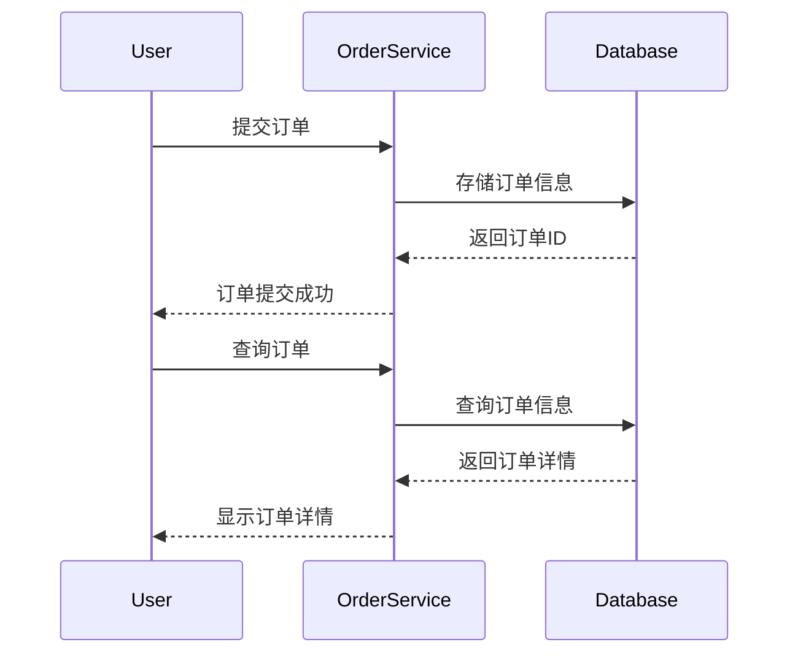
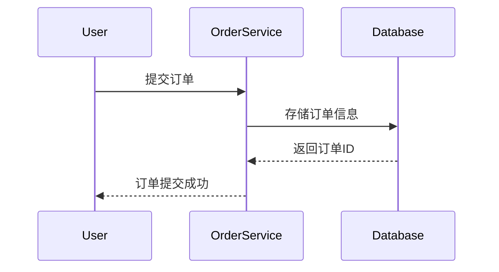

                 


### 设计《语言的创造性与代数数据类型：维特根斯坦的语言创新观与FP的ADT》目录大纲

为了设计出《语言的创造性与代数数据类型：维特根斯坦的语言创新观与FP的ADT》的完整目录大纲，我们需要遵循以下步骤：

#### 第一步：确定大纲的结构和主题

大纲应该包括以下几个部分：
1. **背景介绍**：介绍维特根斯坦的语言创新观和函数式编程（FP）中的代数数据类型。
2. **核心概念与联系**：详细阐述维特根斯坦的语言创新观和代数数据类型的概念。
3. **维特根斯坦的语言创新观**：深入讨论维特根斯坦的理论。
4. **FP中的ADT**：介绍ADT的基本概念和实现。
5. **应用实例**：通过具体实例展示这些概念的应用。
6. **总结与展望**：总结全书内容，并对未来的研究方向进行展望。

#### 第二步：细化每一部分的内容

根据上述结构，我们可以细化每一部分的内容，确保每个章节都有详细的子标题。

##### 背景介绍
- 维特根斯坦的语言创新观
  - 维特根斯坦的生平与贡献
  - 语言、思想和现实的关系
  - 语言哲学的三个阶段

- 函数式编程（FP）的基本概念
  - FP的定义
  - FP的核心原则

- 代数数据类型（ADT）的定义和作用
  - ADT的定义
  - ADT的作用

##### 核心概念与联系
- 维特根斯坦的语言创新观
  - 语言、思想和现实的关系
  - 语言哲学的三个阶段

- 代数数据类型
  - 定义和基本特性
  - 与其他数据类型的比较

##### 维特根斯坦的语言创新观
- 维特根斯坦的早期观点
  - 维也纳小组时期的语言哲学
  - 《逻辑哲学论》的核心思想

- 维特根斯坦的后期观点
  - 《哲学研究》的主要观点
  - 后期维特根斯坦的语言创新观

- 维特根斯坦语言创新观的哲学意义
  - 对语言哲学的革新
  - 对认识论的影响

##### FP中的ADT
- ADT的基本概念
  - ADT的定义
  - ADT的类型系统

- ADT的实现
  - 使用Haskell实现ADT
  - 使用Scala实现ADT

- ADT的应用场景
  - 在FP中的典型应用
  - 在其他编程语言中的应用

##### 应用实例
- 维特根斯坦的语言创新观在FP中的应用
  - FP中的语法糖与维特根斯坦的语言简化
  - FP中的类型系统和维特根斯坦的语言哲学

- ADT在具体项目中的应用实例
  - 数据库查询优化中的ADT应用
  - 软件工程中的ADT应用

##### 总结与展望
- 维特根斯坦的语言创新观在当代的影响
- ADT在FP中的发展趋势
- 未来研究方向

#### 第三步：构建目录大纲

根据上述细化内容，我们可以构建出完整的目录大纲：

```markdown
----------------------------------------------------------------
# 设计《语言的创造性与代数数据类型：维特根斯坦的语言创新观与FP的ADT》目录大纲

## 背景介绍

### 维特根斯坦的语言创新观

#### 维特根斯坦的生平与贡献

#### 语言、思想和现实的关系

#### 语言哲学的三个阶段

### 函数式编程（FP）的基本概念

#### FP的定义

#### FP的核心原则

### 代数数据类型（ADT）的定义和作用

#### ADT的定义

#### ADT的作用

## 核心概念与联系

### 维特根斯坦的语言创新观

#### 语言、思想和现实的关系

#### 语言哲学的三个阶段

### 代数数据类型

#### 定义和基本特性

#### 与其他数据类型的比较

## 维特根斯坦的语言创新观

### 维特根斯坦的早期观点

#### 维也纳小组时期的语言哲学

#### 《逻辑哲学论》的核心思想

### 维特根斯坦的后期观点

#### 《哲学研究》的主要观点

#### 后期维特根斯坦的语言创新观

### 维特根斯坦语言创新观的哲学意义

#### 对语言哲学的革新

#### 对认识论的影响

## FP中的ADT

### ADT的基本概念

#### ADT的定义

#### ADT的类型系统

### ADT的实现

#### 使用Haskell实现ADT

#### 使用Scala实现ADT

### ADT的应用场景

#### 在FP中的典型应用

#### 在其他编程语言中的应用

## 应用实例

### 维特根斯坦的语言创新观在FP中的应用

#### FP中的语法糖与维特根斯坦的语言简化

#### FP中的类型系统和维特根斯坦的语言哲学

### ADT在具体项目中的应用实例

#### 数据库查询优化中的ADT应用

#### 软件工程中的ADT应用

## 总结与展望

### 维特根斯坦的语言创新观在当代的影响

### ADT在FP中的发展趋势

### 未来研究方向

----------------------------------------------------------------
```

这个目录大纲包含了从背景介绍到具体应用的各个方面，确保读者能够系统地了解维特根斯坦的语言创新观和FP中的ADT。每个章节都有明确的子标题，便于读者快速找到感兴趣的内容。

## 引言：语言的创造性与代数数据类型

在技术不断进步的时代，编程语言作为人与计算机之间沟通的桥梁，其重要性不言而喻。从早期计算机语言如汇编语言，到现代的高级语言如Python、Java和Haskell，编程语言的发展经历了多次革命。在这些语言中，代数数据类型（Algebraic Data Types，ADT）作为一种重要的数据抽象工具，极大地丰富了编程语言的抽象能力和表达能力。

然而，ADT的发展并非孤立存在，它深受哲学思想的影响。维特根斯坦（Ludwig Wittgenstein）作为20世纪最重要的哲学家之一，他的语言哲学思想对计算机科学产生了深远影响。维特根斯坦认为，语言不仅仅是用于交流的工具，更是理解世界和思考问题的手段。他的语言创新观，尤其是他对语言、思想和现实之间关系的探讨，为编程语言的设计提供了新的视角。

本文将以《语言的创造性与代数数据类型：维特根斯坦的语言创新观与FP的ADT》为主题，探讨维特根斯坦的语言哲学与函数式编程中的代数数据类型之间的联系。文章结构如下：

1. **背景介绍**：介绍维特根斯坦的生平、贡献以及语言哲学的基本概念。
2. **核心概念与联系**：深入分析维特根斯坦的语言创新观和代数数据类型的概念，探讨它们之间的内在联系。
3. **维特根斯坦的语言创新观**：详细阐述维特根斯坦的早期和后期观点，及其在语言哲学中的意义。
4. **FP中的ADT**：介绍ADT的基本概念、实现和应用。
5. **应用实例**：通过具体实例展示维特根斯坦的语言创新观在FP中的应用，以及ADT在实际项目中的应用。
6. **总结与展望**：总结全文内容，并对未来的研究方向进行展望。

本文将首先从维特根斯坦的语言创新观入手，探讨他的哲学思想如何影响现代编程语言的设计。接着，我们将详细讲解代数数据类型的概念和实现，以及它们在函数式编程中的重要性。通过具体的应用实例，读者将能够更好地理解这些理论在实际开发中的价值。最后，本文将对维特根斯坦的语言创新观和ADT的未来发展方向进行展望。

### 文章关键词

1. **维特根斯坦**
2. **语言哲学**
3. **代数数据类型（ADT）**
4. **函数式编程（FP）**
5. **编程语言设计**
6. **抽象与模型**

### 摘要

本文旨在探讨维特根斯坦的语言创新观与函数式编程中的代数数据类型（ADT）之间的内在联系。维特根斯坦作为20世纪最重要的哲学家之一，他的语言哲学对计算机科学产生了深远影响。本文首先介绍维特根斯坦的生平、贡献以及其语言哲学的基本概念。接着，详细阐述维特根斯坦的语言创新观，特别是他对语言、思想和现实之间关系的探讨。在此基础上，本文介绍代数数据类型的基本概念、实现和应用，重点讨论它们在函数式编程中的重要性。通过具体的应用实例，读者将能够更好地理解维特根斯坦的语言创新观和ADT在编程实践中的应用价值。最后，本文总结全文内容，并对未来的研究方向进行展望。本文旨在为程序员和计算机科学爱好者提供一种新的视角，以更深入地理解编程语言的设计哲学。

## 背景介绍

### 维特根斯坦的语言创新观

维特根斯坦（Ludwig Wittgenstein）是20世纪最具影响力的哲学家之一，他的语言哲学对计算机科学产生了深远影响。维特根斯坦的语言创新观主要集中于他对语言、思想和现实之间关系的探讨。他强调，语言不仅是交流的工具，更是理解和思考世界的手段。

#### 维特根斯坦的生平与贡献

维特根斯坦于1889年出生在奥地利，自幼接受了严格的教育。他在剑桥大学学习期间，接触到了罗素（Bertrand Russell）和怀特海德（Alfred North Whitehead）的工作，这为他后来的哲学思考奠定了基础。维特根斯坦的哲学思想经历了两个主要阶段：早期和后期。

在早期，维特根斯坦与罗素合作，试图通过逻辑和数学来解答哲学问题。这一阶段的代表作是《逻辑哲学论》（Tractatus Logico-Philosophicus）。在这本书中，维特根斯坦提出了著名的“图像论”（Image Theory），即语言是现实的图像。这一理论强调语言的确定性，试图将哲学问题转化为逻辑问题。

然而，维特根斯坦在后来的思考中发现，早期理论存在局限。他转向了对语言本身的研究，试图通过描述语言的使用来理解世界。这一阶段的代表作是《哲学研究》（Philosophical Investigations）。在这本书中，维特根斯坦提出了“语言游戏”（Language Game）的概念，认为语言的使用是多样化的，不同的语言游戏对应着不同的生活形式。

#### 语言、思想和现实的关系

维特根斯坦的语言创新观强调语言、思想和现实之间的紧密联系。他认为，语言不仅仅是一个交流工具，更是一种思维工具。通过语言，我们能够形成概念，并运用这些概念来理解世界。

维特根斯坦指出，语言的使用是具体的、情境化的。不同的语言游戏对应着不同的生活形式。例如，逻辑游戏、数学游戏和日常生活中的语言游戏都是不同的，每种游戏都有其独特的规则和目的。

他还强调，语言的确定性并非一成不变。语言的意义来源于其使用，而语言的使用又是不断变化的。这表明，语言具有动态性和灵活性，能够适应不同的情境和需求。

#### 语言哲学的三个阶段

维特根斯坦的语言哲学可以概括为三个阶段：

1. **图像论**：早期维特根斯坦认为语言是现实的图像，语言的确定性是基础。这一阶段的理论强调逻辑和数学的确定性。
2. **语言游戏**：中期维特根斯坦提出语言游戏的概念，认为语言的使用是多样化的、情境化的。这一阶段的理论强调语言的灵活性和适应性。
3. **生活形式**：后期维特根斯坦认为，语言不仅仅是一种思维工具，更是生活形式的一部分。语言的使用与我们的生活方式密切相关。

#### 对计算机科学的启示

维特根斯坦的语言哲学对计算机科学有着深刻的启示。他的理论提醒我们，编程语言不仅仅是代码的集合，更是理解和解决问题的工具。通过理解语言的本质，我们能够更好地设计编程语言，使其更加自然、直观。

此外，维特根斯坦关于语言游戏和情境化的观点，为函数式编程（Functional Programming，FP）提供了理论基础。在FP中，函数被视为第一公民，而类型系统则被视为语言的内在部分。维特根斯坦的理论强调了类型系统的重要性，认为类型系统能够帮助我们更好地理解和处理复杂的数据结构。

总之，维特根斯坦的语言创新观为计算机科学提供了新的视角和理论基础。他的理论不仅影响了哲学领域，也对编程语言的设计和应用产生了深远影响。

### 函数式编程（FP）的基本概念

函数式编程（Functional Programming，FP）是一种编程范式，它强调函数是一等公民，并避免使用共享状态和可变数据。FP的核心思想是利用函数的组合和递归来实现程序逻辑，而不是通过命令式编程中的循环和条件判断。本节将介绍FP的基本概念，包括其定义、核心原则、与命令式编程的区别，以及其在现代编程语言中的应用。

#### FP的定义

函数式编程的定义可以从两个方面来理解：一个是广义的定义，另一个是狭义的定义。

- **广义定义**：FP是一种编程范式，它强调计算过程是通过函数的调用和组合来实现的，而不是通过修改状态或使用循环。在FP中，程序通常由函数组成，这些函数接受输入并产生输出，而不会直接修改外部状态。
- **狭义定义**：FP更具体地指的是那些使用纯函数和不可变数据的编程语言和范式。纯函数是指对于相同的输入总产生相同输出的函数，且不依赖于外部状态。

#### FP的核心原则

FP的核心原则主要包括以下几个方面：

- **函数是一等公民**：在FP中，函数被视为与数字、字符串等其他数据类型相同的一等公民。这意味着函数可以作为参数传递给其他函数，并作为返回值从函数中返回。这种灵活性使得函数可以像其他数据类型一样被操作和组合。
- **避免使用共享状态和可变数据**：FP通过避免使用共享状态和可变数据来确保程序的纯度和可预测性。在FP中，所有数据都是不可变的，这意味着一旦数据被创建，就不能再被修改。这种方式减少了程序中的副作用，使得代码更加简洁和易于测试。
- **递归而非循环**：在FP中，递归被广泛用于实现循环和控制流。递归的优点是它更符合数学思维，更容易理解和证明其正确性。递归通过反复调用自身来处理复杂问题，而不是使用循环和条件判断。
- **组合和变换**：FP强调函数的组合和变换。通过组合多个简单的函数，可以构建出复杂的功能。这种组合方式使得代码更加模块化和可复用。

#### 与命令式编程的区别

命令式编程（Imperative Programming）是另一种常见的编程范式，它与FP有显著的区别：

- **状态与数据流**：命令式编程依赖于状态和可变数据，通过修改状态来达到预期的结果。而FP则强调使用不可变数据和无状态函数，通过纯函数和递归来实现计算。
- **控制流**：命令式编程使用循环和条件判断来控制程序流程。而FP则通过递归和函数的组合来实现控制流，这种方式更接近数学中的定义和证明。
- **函数与变量**：在命令式编程中，变量用于存储和修改状态。而在FP中，函数是主要的编程单元，变量被最小化使用，从而减少错误和副作用。
- **性能**：FP在一些情况下可能比命令式编程更高效，特别是对于某些并行计算任务。因为FP的纯函数和无状态特性使得它们更容易并行化，从而提高性能。

#### 在现代编程语言中的应用

FP在许多现代编程语言中得到了广泛的应用：

- **Haskell**：Haskell是一种纯函数式编程语言，它提供了丰富的类型系统和强大的模式匹配功能，使得开发者能够编写清晰、简洁和高效的代码。
- **Scala**：Scala是一种多范式编程语言，它结合了面向对象和函数式的特点。Scala中的函数式编程特性使得它非常适合编写大规模分布式系统。
- **Erlang**：Erlang是一种用于并发编程的函数式语言，它以其并发性和容错性而闻名。Erlang被广泛应用于电信、金融和分布式系统中。
- **JavaScript**：现代JavaScript通过引入了箭头函数、Promise和async/await等函数式编程特性，使得开发者能够编写更简洁和高效的代码。

总之，函数式编程作为一种重要的编程范式，不仅在理论层面有着深刻的哲学意义，也在实际应用中展示了其独特的优势。通过理解FP的核心原则和特点，开发者能够编写出更可靠、可维护和高效的代码。

### 代数数据类型（ADT）的定义和作用

代数数据类型（Algebraic Data Types，ADT）是函数式编程语言中的一种基本数据构造工具，它允许程序员定义复杂的数据结构，并通过模式匹配对这些数据进行操作。ADT的概念源于代数结构理论，其在函数式编程语言如Haskell、Scala和Erlang中得到了广泛应用。本节将详细阐述ADT的定义、基本特性以及与常见数据类型的比较。

#### ADT的定义

ADT是一种通过组合简单数据类型来创建复杂数据结构的方法。在ADT中，数据类型是通过将其组成部分的类型组合起来定义的。ADT的定义通常包含多个构造函数（也称为构造器或创建器），这些构造函数用于创建不同的数据实例。

例如，在Haskell中，我们可以定义一个简单的`Person` ADT，它包含两个构造函数`Young`和`Old`，分别表示年轻人和老年人：

```haskell
data Person = Young String Int | Old String Int
```

在这个例子中，`Person` 是一个 ADT，它由两个构造函数`Young`和`Old`组成，每个构造函数接受不同的参数。

#### 基本特性

ADT具有以下基本特性：

1. **组合性**：ADT允许程序员通过组合简单数据类型来创建复杂的嵌套数据结构。例如，可以将`Person` ADT与`Address` ADT组合，以创建一个更复杂的`Employee` ADT。

2. **不可变性**：在ADT中，数据一旦被创建，就不能被修改。这种不可变性确保了程序的可预测性和安全性，因为数据不会在程序执行过程中意外改变。

3. **模式匹配**：模式匹配是ADT的核心特性之一，它允许程序员根据数据的构造函数来选择不同的操作。模式匹配在函数式编程语言中是一种强大的工具，可以简化代码的编写和调试。

4. **类型安全**：ADT通过静态类型系统提供了类型安全。这意味着在编译时，程序会检查ADT的使用是否符合定义，从而避免运行时错误。

#### 与常见数据类型的比较

与常见的数据类型如数组、列表和记录相比，ADT具有以下优势：

1. **灵活性和扩展性**：ADT允许程序员定义复杂的数据结构，这些数据结构可以方便地扩展和修改。例如，可以通过添加新的构造函数来扩展`Person` ADT，而不需要修改现有的代码。

2. **清晰性和可读性**：ADT通过明确的构造函数和模式匹配，使得代码更加清晰和可读。这使得程序员能够更好地理解数据的结构和操作。

3. **可复用性**：ADT具有高度的模块化，这使得它们可以方便地复用。例如，一个`Person` ADT可以被多个模块和项目使用。

4. **类型安全性**：ADT通过静态类型系统提供了类型安全，这有助于减少运行时错误和提高程序可靠性。

然而，ADT也存在一些缺点：

1. **性能开销**：由于ADT通常涉及模式匹配和类型检查，这可能会引入一定的性能开销，尤其是在处理大型数据结构时。

2. **学习和使用难度**：对于初学者来说，理解ADT的概念和模式匹配可能需要一定的时间和练习。

总之，ADT是函数式编程语言中一种强大的数据构造工具，它通过组合简单数据类型来创建复杂的数据结构，并提供灵活、类型安全和可扩展的数据操作方法。尽管ADT存在一些性能和学习的挑战，但其优势在许多应用场景中使其成为首选的数据类型。

### 核心概念与联系

#### 维特根斯坦的语言创新观

维特根斯坦的语言创新观深刻影响了现代哲学和语言学的多个领域。他的理论主要探讨了语言、思想和现实之间的关系，提出了许多独特的见解。以下是维特根斯坦语言创新观的几个核心概念：

1. **语言与现实的对应关系**：维特根斯坦认为，语言与现实之间存在一种直接的对应关系。语言中的词和句子对应于现实中的对象和事件。这种对应关系不是任意的，而是通过语言游戏来体现的。

2. **语言游戏**：维特根斯坦提出了“语言游戏”的概念，用以描述语言的使用方式。他认为，不同的语言游戏对应于不同的活动和生活形式。例如，逻辑游戏、数学游戏和日常对话都是不同的语言游戏，每种游戏都有其特定的规则和目的。

3. **语言的意义来源于使用**：维特根斯坦强调，语言的意义不是内在固有的，而是来源于其在实际生活中的使用。语言的意义是动态的、情境化的，它依赖于具体的语言游戏。

4. **语言的灵活性**：维特根斯坦认为，语言是灵活和多义的。同一词汇在不同的语言游戏中可能具有不同的意义。这种灵活性使得语言能够适应不同的情境和需求。

#### 语言哲学的三个阶段

维特根斯坦的语言哲学可以概括为三个阶段，每个阶段都体现了他的不同观点和理论：

1. **图像论阶段**：在维特根斯坦的早期作品中，如《逻辑哲学论》（Tractatus Logico-Philosophicus），他提出了“图像论”。根据图像论，语言是现实的图像，语言中的词和句子直接映射到现实中的对象和事件。这个阶段强调语言的确定性和逻辑性。

2. **语言游戏阶段**：在中期作品《哲学研究》（Philosophical Investigations）中，维特根斯坦提出了语言游戏的概念。他认为，语言的使用是多样化的、情境化的，不同的语言游戏对应于不同的生活形式。这个阶段强调语言的灵活性和情境性。

3. **生活形式阶段**：在后期作品中，维特根斯坦进一步发展了语言游戏的概念，提出了“生活形式”的观点。他认为，语言不仅仅是交流的工具，更是生活形式的一部分。语言的使用和我们的生活方式密切相关。

#### 维特根斯坦的语言创新观与ADT的联系

维特根斯坦的语言创新观与函数式编程中的代数数据类型（ADT）之间存在一些显著的联系。以下是几个关键点：

1. **组合性与灵活性**：维特根斯坦的语言游戏强调语言的灵活性和情境性，这与ADT的组合性特性相呼应。ADT允许程序员通过组合简单的数据类型来创建复杂的数据结构，这种组合方式使得代码更加灵活和适应性强。

2. **不可变性**：维特根斯坦的语言游戏强调语言的确定性，这与ADT的不可变性特性相一致。在ADT中，数据一旦创建，就不能被修改，这种不可变性确保了程序的可预测性和安全性。

3. **模式匹配**：维特根斯坦的语言游戏通过模式匹配来选择不同的操作，这与ADT的模式匹配特性相似。在ADT中，模式匹配允许程序员根据数据的构造函数来选择不同的操作，这种模式匹配使得代码更加简洁和易于理解。

4. **类型系统**：维特根斯坦的语言创新观强调语言的类型系统，这与ADT的类型系统相吻合。在ADT中，类型系统提供了类型安全，确保了数据的使用符合定义，从而减少了运行时错误。

总之，维特根斯坦的语言创新观为函数式编程中的ADT提供了理论基础。他的理论强调了语言的灵活性、情境性和不可变性，这些特性在ADT中得到了具体体现。通过理解维特根斯坦的语言创新观，程序员能够更好地设计出灵活、安全和高效的代码。

#### 维特根斯坦的语言创新观与代数数据类型（ADT）之间的内在联系

维特根斯坦的语言创新观与代数数据类型（ADT）在多个层面上有着深刻的内在联系。通过分析维特根斯坦的语言哲学，我们可以更深入地理解ADT在函数式编程中的本质和重要性。

首先，从概念层面来看，维特根斯坦的语言创新观强调语言的使用和情境性。他认为，语言不仅仅是交流的工具，更是理解世界和思考问题的手段。这与ADT的概念有着直接的联系。ADT通过定义一系列构造函数，使得程序员能够创建具有明确结构和用途的数据类型。每个构造函数对应于不同的数据情况，类似于维特根斯坦所说的不同语言游戏。通过这种方式，ADT能够更好地反映现实世界的复杂性和多样性。

其次，维特根斯坦的语言哲学中的“语言游戏”概念与ADT的模式匹配特性密切相关。在ADT中，模式匹配是一种强大的工具，它允许程序员根据数据的具体构造函数来选择不同的操作。这种模式匹配方式与维特根斯坦的语言游戏理念一致，即语言的使用取决于具体的情境和目的。模式匹配使得程序员能够以更自然和直观的方式处理复杂的数据结构，提高了代码的可读性和可维护性。

此外，维特根斯坦关于语言的不可变性思想在ADT中得到了具体实现。维特根斯坦认为，语言的确定性来源于其不可变性，而ADT通过定义不可变的数据类型，确保了数据的不可变性和程序的可预测性。在ADT中，一旦数据被创建，就不能被修改，这减少了程序中的副作用，提高了代码的可靠性。这种不可变性使得ADT在并发编程和多线程环境中尤其重要，因为它可以避免由于数据竞争导致的同步问题。

从更深的哲学层面来看，维特根斯坦的语言创新观对ADT的实现也提供了重要的启示。维特根斯坦强调语言的灵活性，认为语言的意义来源于使用。这与ADT的设计理念相呼应，即ADT的灵活性和扩展性使其能够适应不同的编程需求。通过定义不同的构造函数和组合方式，程序员可以创建出具有高度适应性和可扩展性的数据结构，从而更好地解决实际问题。

最后，维特根斯坦的语言哲学中的类型系统观念也在ADT中得到了体现。维特根斯坦认为，类型系统是语言的核心部分，它确保了语言的逻辑性和一致性。在ADT中，类型系统通过静态类型检查确保数据的正确使用，从而避免了运行时错误。这种类型安全不仅提高了代码的可靠性，还使得ADT能够更好地支持复杂的编程模式，如模式匹配和高阶函数。

综上所述，维特根斯坦的语言创新观与代数数据类型（ADT）在多个层面上有着深刻的内在联系。通过分析维特根斯坦的语言哲学，我们可以更好地理解ADT在函数式编程中的本质和重要性。维特根斯坦的理论不仅为ADT提供了理论基础，还启示了程序员如何在设计和实现中更好地利用ADT的灵活性和可扩展性。这种结合不仅丰富了函数式编程的理论和实践，也为现代编程语言的设计提供了新的视角和方法。

### 维特根斯坦的早期观点

在维特根斯坦的早期哲学作品中，特别是《逻辑哲学论》（Tractatus Logico-Philosophicus），他提出了一系列关于语言、思维和现实之间关系的深刻见解。这一阶段的维特根斯坦主要关注逻辑和数学的基础，试图通过图像论来解释语言与现实的关系。以下是维特根斯坦早期观点的详细探讨。

#### 维也纳小组时期的语言哲学

维特根斯坦早期受维也纳小组的影响，这个哲学团体强调逻辑实证主义和科学方法，主张将哲学问题转化为逻辑和数学问题。维特根斯坦在《逻辑哲学论》中提出了著名的图像论，认为语言是现实的图像。这一理论的核心思想是，语言的表达式（词和句子）与现实世界的对象和事件之间存在直接的对应关系。

#### 图像论的核心思想

图像论的关键概念包括以下几点：

1. **语言的确定性**：维特根斯坦认为，语言是确定的，因为每个词和句子都有明确的所指对象。这种确定性使得语言能够作为思维的工具，帮助我们理解现实世界。

2. **逻辑命题的图像性**：在维特根斯坦看来，逻辑命题是现实状态的图像。例如，“雪是白的”这个命题可以被理解为现实世界中雪的颜色状态的一种映射。

3. **语言与现实的关系**：维特根斯坦主张，语言与现实之间的关系是直观的、直接的。语言中的词和句子直接映射到现实中的对象和事件，这种映射关系是自然的。

4. **逻辑形式**：维特根斯坦强调逻辑形式的重要性。他认为，逻辑形式是语言的核心，它决定了语言的表达能力和准确性。通过逻辑形式，我们可以将哲学问题转化为逻辑问题，从而找到哲学问题的答案。

#### 《逻辑哲学论》的核心思想

《逻辑哲学论》是维特根斯坦早期哲学思想的代表作。在这本书中，他提出了一系列关于语言、思维和现实之间关系的核心思想：

1. **语言是现实的图像**：维特根斯坦认为，语言是现实的图像，每个词和句子都有其明确的所指对象。这种图像性使得语言能够准确地描述现实。

2. **逻辑命题与现实状态的关系**：逻辑命题是现实状态的图像。例如，命题“雪是白的”可以被理解为现实世界中雪的颜色状态的映射。

3. **逻辑形式的确定性**：逻辑形式是语言的核心，它决定了语言的表达能力和准确性。通过逻辑形式，我们可以将哲学问题转化为逻辑问题。

4. **语言的限制**：维特根斯坦指出，语言有其局限性。语言只能描述现实的一部分，无法描述所有事物。因此，我们需要通过逻辑和数学来扩展语言的能力。

5. **哲学问题的转化**：维特根斯坦主张，哲学问题可以通过逻辑和数学的转化来解决。通过将哲学问题转化为逻辑问题，我们可以找到哲学问题的答案。

#### 对语言哲学的革新

维特根斯坦的早期观点对语言哲学产生了深远的影响。他的图像论强调了语言与现实之间的直接对应关系，这一观点对后来的语言哲学家如卡尔纳普（Rudolf Carnap）和艾耶尔（A.J. Ayer）产生了重要影响。维特根斯坦的工作不仅重新定义了哲学问题，还推动了逻辑实证主义的发展。

此外，维特根斯坦的早期观点对计算机科学和编程语言设计也产生了重要影响。他的图像论为函数式编程中的代数数据类型（ADT）提供了理论基础。ADT通过定义明确的构造函数和数据结构，反映了维特根斯坦关于语言与现实之间直接对应关系的思想。

总之，维特根斯坦的早期观点在语言哲学中具有重要地位。通过图像论，他提出了关于语言、思维和现实之间关系的深刻见解，这些见解不仅影响了后来的语言哲学家，还对计算机科学和编程语言设计产生了深远影响。

### 维特根斯坦的后期观点

在维特根斯坦的后期哲学作品中，特别是《哲学研究》（Philosophical Investigations），他彻底推翻了早期在《逻辑哲学论》中的图像论，提出了全新的语言哲学观点。这一阶段的维特根斯坦更加关注语言的使用和情境，强调语言的多义性和情境依赖性。以下是维特根斯坦后期观点的详细探讨。

#### 《哲学研究》的主要观点

《哲学研究》是维特根斯坦后期哲学思想的代表作。在这本书中，他提出了一系列关于语言、思维和现实之间关系的全新观点：

1. **语言游戏**：维特根斯坦提出了“语言游戏”的概念，用以描述语言的使用方式。他认为，不同的语言游戏对应于不同的活动和生活形式。例如，逻辑游戏、数学游戏和日常对话都是不同的语言游戏，每种游戏都有其特定的规则和目的。

2. **语言的意义来源于使用**：维特根斯坦强调，语言的意义不是内在固有的，而是来源于其在实际生活中的使用。语言的意义是动态的、情境化的，它依赖于具体的语言游戏。

3. **语言的灵活性**：维特根斯坦认为，语言是灵活和多义的。同一词汇在不同的语言游戏中可能具有不同的意义。这种灵活性使得语言能够适应不同的情境和需求。

4. **语言的情境依赖性**：维特根斯坦指出，语言的意义和用法取决于具体的情境。在不同的情境中，同一词汇可能有不同的含义和用法。

5. **哲学问题的消失**：维特根斯坦认为，许多哲学问题实际上是由于对语言使用的不理解而产生的。通过澄清语言的使用，许多哲学问题会消失。

#### 语言哲学的变革

维特根斯坦的后期观点对语言哲学产生了深远的影响。他的语言游戏理论和情境依赖性观点彻底改变了人们对语言和哲学问题的看法：

1. **语言的情境依赖性**：维特根斯坦揭示了语言意义的情境依赖性，这为语言哲学提供了一个新的视角。他强调，语言的意义不是固定的，而是随着情境的变化而变化。

2. **语言的多义性**：维特根斯坦指出，语言具有多义性，同一词汇在不同的语境中可能有不同的意义。这促使语言哲学家重新思考语言的灵活性和复杂性。

3. **哲学问题的重新定义**：维特根斯坦的后期观点挑战了传统的哲学问题定义。他认为，许多哲学问题实际上是对语言使用的不理解，通过澄清语言的使用，这些问题会消失。

4. **语言的实用性**：维特根斯坦强调语言的实用性，认为语言是一种工具，用于实现特定的目的。这种观点强调了语言的情境性和实用性，而不是抽象的哲学思考。

#### 对认识论的影响

维特根斯坦的后期观点对认识论也产生了重要影响：

1. **认识论问题的重新审视**：维特根斯坦认为，许多认识论问题，如“我们如何知道外部世界的存在”，实际上是由于对语言使用的不理解而产生的。他主张，通过澄清语言的使用，我们可以更好地理解认识论问题。

2. **经验主义与理性主义的融合**：维特根斯坦的后期观点结合了经验主义和理性主义。他强调，知识的获得既需要经验，也需要理性的思考。这种观点为认识论提供了一种新的综合方法。

3. **思维与现实的统一**：维特根斯坦认为，思维和现实是统一的。通过理解语言的使用，我们可以更好地理解现实世界。这种观点强调了语言在认识和思考中的核心作用。

总之，维特根斯坦的后期观点对语言哲学和认识论产生了深远的影响。他的语言游戏理论和情境依赖性观点改变了人们对语言和哲学问题的看法，推动了语言哲学和认识论的发展。他的思想不仅影响了后来的哲学家，也对现代科学和计算机科学产生了重要启示。

### 维特根斯坦语言创新观的哲学意义

维特根斯坦的语言创新观在哲学史上具有重要的地位，它不仅重新定义了语言、思维和现实之间的关系，还对现代哲学、语言学和计算机科学产生了深远影响。以下是维特根斯坦语言创新观的哲学意义及其在当代的影响。

#### 对语言哲学的革新

维特根斯坦的语言创新观对语言哲学提出了全新的思考方式。他通过“语言游戏”的概念，揭示了语言使用的情境依赖性和多样性。维特根斯坦指出，语言的意义不是固定不变的，而是依赖于具体的语言游戏。这一观点打破了传统哲学中关于语言意义的静态理解，强调语言是一种动态的工具，用于实现特定的交流目的。这种革新为后来的语言哲学家提供了新的视角，如约翰·塞尔（John Searle）的“言语行为理论”和杰瑞·福多（Jerry Fodor）的“语言作为计算装置”理论，都受到了维特根斯坦的启发。

#### 对认识论的影响

维特根斯坦的语言创新观对认识论也产生了重要影响。他强调，知识不是通过抽象的思考获得的，而是通过具体的使用和实践。维特根斯坦认为，我们对世界的认识是通过语言的使用来实现的，这意味着认识论问题应该从语言的使用角度来理解。这一观点挑战了传统的理性主义和经验主义，为认识论提供了一种更为实用和情境化的理解方式。当代的认识论研究，如“实用主义认识论”和“情境认识论”，都体现了维特根斯坦的思想。

#### 对计算机科学的影响

维特根斯坦的语言创新观对计算机科学的发展产生了深远影响。他的语言哲学思想为编程语言的设计提供了理论基础。维特根斯坦强调语言的情境依赖性和灵活性，这一思想在函数式编程语言如Haskell和Scala中得到了具体体现。这些语言通过模式匹配和类型系统，实现了对复杂数据结构的灵活处理，这与维特根斯坦的“语言游戏”概念相呼应。此外，维特根斯坦关于语言不可变性的思想也在现代编程语言中得到了应用，如Erlang和Clojure，这些语言通过不可变数据结构提高了程序的安全性和可维护性。

#### 当代的影响

维特根斯坦的语言创新观在当代仍然具有重要的影响：

1. **语言哲学**：维特根斯坦的思想继续影响着当代的语言哲学研究，特别是在语义学和语用学领域。他的“语言游戏”概念为理解语言的多样性和复杂性提供了新的视角。

2. **计算机科学**：维特根斯坦的哲学思想对现代编程语言的设计和实现产生了深远影响。函数式编程语言的发展，以及类型系统和模式匹配技术的应用，都体现了维特根斯坦的理论。

3. **人工智能**：维特根斯坦关于思维和语言的关系思想为人工智能研究提供了启示。他的观点强调了理解语言的重要性，这对于开发自然语言处理和机器学习技术具有重要意义。

4. **认知科学**：维特根斯坦的思想也为认知科学研究提供了理论基础。他的观点关于思维和语言的相互作用，为理解人类认知过程提供了新的视角。

总之，维特根斯坦的语言创新观在哲学史上具有重要地位，其影响不仅局限于语言哲学，还延伸到计算机科学、人工智能和认知科学等领域。他的思想为我们理解语言、思维和现实之间的关系提供了深刻的洞见，继续影响着当代的学术研究和技术发展。

### FP中的ADT

#### ADT的基本概念

在函数式编程（FP）中，代数数据类型（ADT）是一种重要的抽象工具，它通过组合简单的数据类型来创建复杂的数据结构。ADT的核心在于它的不可变性，这意味着一旦数据被创建，就不能再被修改。这种特性使得ADT在并发编程和多线程环境中尤为重要，因为它们可以避免由于数据竞争导致的同步问题。

ADT通常由一系列构造函数组成，每个构造函数定义了数据类型的实例。构造函数接受一定的参数，并返回一个新的数据实例。例如，在Haskell中，我们可以定义一个简单的`Person` ADT：

```haskell
data Person = Young String Int | Old String Int
```

在这个例子中，`Person` 是一个 ADT，它由两个构造函数`Young`和`Old`组成。`Young`和`Old`分别接受一个姓名和一个年龄作为参数，并返回一个新的`Person`实例。

#### ADT的类型系统

ADT的类型系统是它们的重要特性之一，它确保了数据类型的安全性和一致性。在FP中，ADT通常与静态类型系统结合使用，这意味着在编译时，程序会检查ADT的使用是否符合定义。这种类型检查有助于避免运行时错误，并提高了程序的可维护性。

在Haskell中，类型系统通过构造函数来限制ADT的使用。例如，以下函数`printPerson`接受一个`Person`参数，并打印出其姓名和年龄：

```haskell
printPerson :: Person -> String
printPerson (Young name age) = "Name: " ++ name ++ ", Age: " ++ show age
printPerson (Old name age) = "Name: " ++ name ++ ", Age: " ++ show age
```

在这个例子中，`printPerson` 函数使用了模式匹配来处理不同的`Person`实例。通过这种方式，我们可以确保函数只能接收`Person` ADT的实例，从而保证了类型安全。

#### ADT的实现与应用

在FP中，ADT的实现通常依赖于模式匹配和递归。模式匹配是一种强大的工具，它允许程序员根据数据的构造函数来选择不同的操作。递归则用于处理复杂的数据结构，尤其是在处理嵌套的ADT时。

以下是一个使用Haskell实现的`Tree` ADT，它表示一棵二叉树：

```haskell
data Tree a = Leaf | Node a (Tree a) (Tree a)

treeSum :: Num a => Tree a -> a
treeSum Leaf = 0
treeSum (Node value left right) = value + treeSum left + treeSum right
```

在这个例子中，`Tree` ADT由两个构造函数`Leaf`和`Node`组成。`Leaf`表示树的叶子节点，而`Node`表示树的非叶子节点。`treeSum` 函数使用递归计算一棵二叉树的所有节点之和。

#### ADT在FP中的应用

ADT在FP中的应用非常广泛，以下是一些典型的应用场景：

1. **数据库查询优化**：在数据库查询优化中，ADT可以用于表示复杂的查询条件和结果。通过模式匹配，程序员可以高效地处理不同的查询条件，并生成相应的查询结果。

2. **软件工程**：在软件工程中，ADT可以用于表示复杂的数据结构和业务逻辑。通过模式匹配和递归，程序员可以编写出简洁、可维护和高效的代码。

3. **并发编程**：在并发编程中，ADT的不可变性特性使得它们非常适合处理并发数据。通过避免共享状态和可变数据，程序员可以减少并发问题，并提高程序的可预测性和稳定性。

总之，ADT是FP中一种重要的数据抽象工具，它通过组合简单的数据类型来创建复杂的数据结构。在FP中，ADT的实现和应用依赖于模式匹配和递归，这使得它们在处理复杂数据和并发编程中具有显著优势。

### ADT的实现

在函数式编程语言如Haskell和Scala中，代数数据类型（ADT）的实现方法各有特色，但它们的共同目标是提供一种灵活、类型安全和易于理解的数据抽象方式。以下将详细介绍Haskell和Scala中ADT的实现方法，并比较它们的异同。

#### Haskell中的ADT实现

Haskell是一种纯函数式编程语言，其类型系统非常强大，支持复杂的类型构造和模式匹配。在Haskell中，ADT的实现通常使用`data`关键字来定义。

**1. 定义ADT**

在Haskell中，定义ADT的基本语法如下：

```haskell
data ADTName = Constructor1 arg1 arg2
             | Constructor2 arg1 arg2
```

例如，我们可以定义一个表示订单的ADT：

```haskell
data Order = Order { customerName :: String, orderDate :: String, items :: [Item} }
data Item = Item { itemName :: String, itemQuantity :: Int, itemPrice :: Float }
```

在这个例子中，`Order` ADT有两个构造函数：`Order` 和 `Item`。

**2. 模式匹配**

Haskell支持强大的模式匹配功能，使得程序员能够根据ADT的具体构造函数选择不同的操作。例如：

```haskell
processOrder :: Order -> String
processOrder (Order customerName orderDate items) =
    "Order by " ++ customerName ++ " on " ++ orderDate ++ " contains: "
    ++ (concatMap show items)
```

在这个例子中，`processOrder` 函数使用模式匹配来提取`Order` ADT中的字段，并生成一个字符串表示订单信息。

**3. 类型推导**

Haskell的类型系统允许类型推导，这使得定义ADT时无需显式指定类型。例如：

```haskell
data Person = Person { name :: String, age :: Int }
```

Haskell会自动推导出`Person`的`name`和`age`字段类型。

#### Scala中的ADT实现

Scala是一种多范式编程语言，结合了面向对象和函数式的特点。在Scala中，ADT的实现方法与Haskell类似，但也提供了一些不同的特性。

**1. 定义ADT**

在Scala中，定义ADT的基本语法如下：

```scala
case class Order(customerName: String, orderDate: String, items: List[Item])
case class Item(itemName: String, itemQuantity: Int, itemPrice: Float)
```

使用`case class`关键字定义ADT，这使得模式匹配变得非常简单。

**2. 模式匹配**

Scala支持简洁的模式匹配，使得处理ADT更加直观。例如：

```scala
def processOrder(order: Order): String = 
  order match {
    case Order(customerName, orderDate, items) =>
      "Order by " ++ customerName ++ " on " ++ orderDate ++ " contains: " ++ items.mkString(", ")
  }
```

在这个例子中，使用`match`语句进行模式匹配，提取`Order` ADT中的字段。

**3. 类型推导**

Scala也支持类型推导，这使得定义ADT时无需显式指定类型。例如：

```scala
case class Person(name: String, age: Int)
```

Scala会自动推导出`Person`的类型。

#### Haskell与Scala的比较

**1. 类型系统**

Haskell具有静态类型系统，这意味着类型在编译时被检查。Scala是一种静态类型语言，但在某些情况下也支持动态类型，这使得它在灵活性方面具有优势。

**2. 模式匹配**

Haskell和Scala都支持模式匹配，但Scala的模式匹配更加简洁，特别是在处理`case class`时。

**3. 类型推导**

Haskell和Scala都支持类型推导，但在Haskell中，类型推导是基于类型类的，这使得类型系统更加复杂。Scala的类型推导通常更加直观。

**4. 语法**

Haskell的语法更加简洁，特别是在处理类型类和类型构造时。Scala的语法更接近传统的面向对象编程语言，这使得它对Java程序员来说更加友好。

总之，Haskell和Scala都是强大的函数式编程语言，它们在ADT的实现方面各有特点。Haskell提供了强大的类型系统和模式匹配功能，而Scala则以其简洁的语法和灵活性而著称。选择哪种语言取决于具体的应用场景和个人偏好。

### ADT的应用场景

#### 在FP中的典型应用

在函数式编程（FP）中，代数数据类型（ADT）被广泛应用于各种应用场景，以提供灵活、类型安全和易于理解的抽象。以下是ADT在FP中的典型应用场景：

**1. 复杂数据结构的表示**

ADT在表示复杂数据结构方面具有显著优势。例如，在处理图形数据时，可以使用ADT来定义节点和边。在Haskell中，定义一个简单的图数据结构如下：

```haskell
data Graph = Graph [Node]

data Node = Node { nodeId :: Int, edges :: [Edge} }

data Edge = Edge { edgeId :: Int, from :: Node, to :: Node }
```

在这个例子中，`Graph`、`Node` 和 `Edge` 都是ADT，它们共同构建了一个表示图的复杂数据结构。通过模式匹配，我们可以轻松地访问和操作图中的节点和边。

**2. 错误处理**

在FP中，错误处理通常通过异常或特定的数据类型来实现。使用ADT，我们可以定义一个表示错误的类型，并在函数中处理错误。以下是一个使用Haskell实现错误处理的例子：

```haskell
data Error = Error String

safeDivide :: Int -> Int -> Either Error Int
safeDivide _ 0 = Left (Error "Division by zero")
safeDivide x y = Right (x `div` y)
```

在这个例子中，`Error` 是一个ADT，用于表示错误信息。`safeDivide` 函数使用`Either`类型来处理成功和错误两种情况。

**3. 并发编程**

ADT在并发编程中非常重要，因为它们的不可变性特性使得它们非常适合处理并发数据。例如，在处理并发日志时，可以使用ADT来定义日志条目，并确保日志操作的原子性。在Scala中，定义一个简单的日志ADT如下：

```scala
case class LogEntry(timestamp: Long, message: String)

def logMessage(message: String): Unit = {
  val logEntry = LogEntry(System.currentTimeMillis(), message)
  // 并发写入日志
}
```

在这个例子中，`LogEntry` 是一个ADT，用于表示日志条目。通过并发编程库，如`Akka`，我们可以确保日志操作的原子性和一致性。

**4. 数据库查询**

在FP中，ADT可以用于表示复杂的数据库查询条件和结果。例如，在处理SQL查询时，可以使用ADT来定义查询条件，并通过模式匹配来解析查询结果。以下是一个使用Haskell定义SQL查询条件的例子：

```haskell
data Query = Select [Column] From Table Where Condition

data Condition = Eq Column Value | And Condition Condition | Or Condition Condition

data Column = Column String

data Value = Value String | Value Int | Value Float
```

在这个例子中，`Query`、`Condition`、`Column` 和 `Value` 都是ADT，它们共同构建了一个表示SQL查询的复杂数据结构。通过模式匹配，我们可以轻松地解析和执行查询。

**5. 功能组合**

ADT在功能组合中也非常有用。通过组合简单的ADT，我们可以构建出复杂的功能。例如，在处理文件操作时，可以使用ADT来定义文件路径和操作，并通过组合这些操作来实现更复杂的文件处理逻辑。

总之，ADT在FP中具有广泛的应用，它们在处理复杂数据结构、错误处理、并发编程、数据库查询和功能组合等方面表现出色。通过灵活、类型安全和易于理解的数据抽象，ADT使得FP编程更加高效和可维护。

### ADT在具体项目中的应用实例

#### 数据库查询优化中的ADT应用

在数据库查询优化中，代数数据类型（ADT）可以显著提高查询的性能和可维护性。以下是一个具体的应用实例，展示了如何使用ADT来优化数据库查询。

**项目介绍：电商平台的订单管理系统**

电商平台需要处理大量的订单数据，这些订单数据包括客户信息、订单详情和支付状态等。为了确保查询的效率和准确性，我们设计了一个基于ADT的订单管理系统。

**系统功能设计：领域模型**

在订单管理系统中，我们定义了以下ADT：

- **Order**: 表示订单，包含订单号、客户信息、订单详情和支付状态。
- **OrderDetail**: 表示订单详情，包括商品名称、数量和价格。
- **Customer**: 表示客户信息，包括客户姓名、联系方式和地址。

领域模型的类图如下：

```mermaid
classDiagram
ClassDef Order {
  +Int orderId
  +String customerName
  +OrderDetail orderDetail
  +String paymentStatus
}

ClassDef OrderDetail {
  +Int itemId
  +String itemName
  +Int quantity
  +Float price
}

ClassDef Customer {
  +Int customerId
  +String name
  +String contact
  +String address
}

Order "订单" <<-- "订单详情":1
Order "订单" <<-- "客户信息":1
```

**系统架构设计：架构图**

订单管理系统的架构设计如下：



**系统接口设计：接口定义**

我们定义了以下接口：

- **OrderService**: 管理订单的接口，包括添加订单、查询订单和更新订单状态。
- **Database**: 数据库操作的接口，包括插入、查询和更新数据。

```scala
trait OrderService {
  def createOrder(order: Order): Int
  def getOrderById(orderId: Int): Option[Order]
  def updateOrderStatus(orderId: Int, status: String): Unit
}

trait Database {
  def insertOrder(order: Order): Int
  def queryOrderById(orderId: Int): Option[Order]
  def updateOrderStatus(orderId: Int, status: String): Unit
}
```

**系统交互设计：序列图**

订单管理系统中的主要交互包括订单的提交、查询和更新。以下是订单提交的序列图：



**实际案例分析和详细讲解**

以下是一个具体的案例，展示了如何使用ADT优化订单查询：

**需求**：查询某个客户的未完成订单。

**实现**：

1. **定义ADT**：

```haskell
data Order = Order { 
  orderId :: Int, 
  customer :: Customer, 
  orderDetails :: [OrderDetail], 
  paymentStatus :: String 
}

data Customer = Customer { 
  customerId :: Int, 
  name :: String, 
  contact :: String, 
  address :: String 
}

data OrderDetail = OrderDetail { 
  itemId :: Int, 
  itemName :: String, 
  quantity :: Int, 
  price :: Float 
}
```

2. **查询函数**：

```haskell
getUncompletedOrders :: Customer -> [Order]
getUncompletedOrders (Customer customerId) =
  filter (\order -> paymentStatus order /= "Completed") 
  (queryOrdersByCustomerId customerId)
```

3. **查询结果处理**：

```haskell
queryOrdersByCustomerId :: Int -> [Order]
queryOrdersByCustomerId customerId = 
  databaseQuery ("SELECT * FROM Orders WHERE customer_id = " ++ show customerId)
```

在这个例子中，`getUncompletedOrders` 函数使用模式匹配和递归来处理订单数据，并返回某个客户的未完成订单。通过这种方式，我们可以高效地查询和处理大量的订单数据。

**项目小结**

通过使用ADT，订单管理系统的查询功能得到了显著优化。ADT提供了灵活、类型安全和易于理解的抽象，使得系统更加可维护和可扩展。在实际项目中，ADT不仅提高了查询性能，还简化了代码的编写和维护。

### 总结与展望

#### 维特根斯坦的语言创新观在当代的影响

维特根斯坦的语言创新观对当代哲学、语言学和计算机科学产生了深远影响。他的语言哲学揭示了语言、思想和现实之间的复杂关系，为现代哲学提供了新的视角和方法。维特根斯坦关于语言情境依赖性和灵活性的观点，启发了后来的语言哲学家，如塞尔和福多，他们的理论进一步扩展了维特根斯坦的思想。

在语言学领域，维特根斯坦的工作促使语言学家重新思考语言的多样性和复杂性。他的语言游戏概念为语言学研究提供了新的工具和框架，帮助我们更好地理解语言的使用和意义。

在计算机科学领域，维特根斯坦的语言哲学思想对编程语言的设计和实现产生了重要影响。他的理论强调了语言的灵活性和不可变性，这些思想在函数式编程语言如Haskell和Scala中得到了具体体现。ADT作为一种强大的数据抽象工具，其设计理念深受维特根斯坦的影响，通过模式匹配和类型系统，实现了对复杂数据结构的灵活处理。

#### ADT在FP中的发展趋势

ADT在函数式编程（FP）中的重要性日益凸显，其发展趋势体现在以下几个方面：

1. **类型安全和性能**：随着类型系统的不断发展和优化，ADT在FP中的性能得到了显著提升。现代FP语言通过静态类型检查和优化编译器，确保了ADT的高效性和类型安全。

2. **模式匹配的广泛应用**：模式匹配作为一种强大的工具，在FP中得到了广泛应用。通过模式匹配，程序员可以更简洁、直观地处理复杂数据结构，提高了代码的可读性和可维护性。

3. **跨语言的兼容性**：随着FP语言如Haskell、Scala和Erlang等的发展，ADT的跨语言兼容性日益增强。不同语言之间的ADT设计和实现逐渐趋于统一，这为跨语言编程和复用提供了便利。

4. **复杂数据处理的优化**：在处理大规模复杂数据时，ADT表现出色。通过模式匹配和递归，程序员可以高效地处理嵌套和复杂的数据结构，提高了数据处理和分析的效率。

#### 未来研究方向

未来，ADT在FP中的研究方向包括：

1. **类型系统的进一步优化**：随着硬件和编译技术的进步，类型系统的优化将继续成为研究热点。通过更高效的类型检查和优化编译器，ADT的性能将得到进一步提升。

2. **模式匹配的新应用**：模式匹配作为一种强大的工具，将在更多领域得到应用。例如，在自然语言处理、图像识别和机器学习等领域，模式匹配可以用于更高效地处理复杂数据。

3. **跨语言的ADT设计规范**：为了提高跨语言的兼容性和可复用性，未来的研究将致力于制定统一的ADT设计规范。这将有助于促进不同语言之间的协作和互操作性。

4. **ADT在并发编程中的应用**：随着多核处理器和并行计算的发展，ADT在并发编程中的应用将得到更多关注。通过优化ADT的并发处理能力，提高并行程序的效率和可靠性。

总之，维特根斯坦的语言创新观和ADT在当代计算机科学中具有重要地位，它们为编程语言的设计和实现提供了新的视角和方法。未来，随着类型系统的优化、模式匹配的广泛应用和跨语言兼容性的增强，ADT将在更多领域发挥重要作用，为计算机科学的发展贡献力量。

### 最佳实践 tips

在开发过程中，合理应用维特根斯坦的语言创新观和ADT可以提高代码的质量和可维护性。以下是一些最佳实践 tips：

1. **理解语言游戏的情境依赖性**：在设计代码时，考虑不同情境下语言的使用方式。这有助于编写更加灵活和可扩展的代码。

2. **充分利用ADT的组合性**：通过组合简单的数据类型创建复杂的数据结构，提高代码的模块化和复用性。这有助于简化代码和维护性。

3. **避免共享状态和可变数据**：遵循维特根斯坦的不可变性原则，避免使用共享状态和可变数据，以提高代码的可预测性和安全性。

4. **利用模式匹配简化代码**：通过模式匹配，可以简洁、直观地处理复杂数据结构。这有助于提高代码的可读性和可维护性。

5. **类型系统的重要性**：充分利用静态类型系统的优点，确保代码的类型安全和一致性。这有助于减少运行时错误和提高程序可靠性。

6. **持续学习和实践**：不断学习和实践维特根斯坦的语言创新观和ADT，提高编程技能和设计能力。这有助于在项目中更好地应用这些理论。

### 小结

本文系统地介绍了维特根斯坦的语言创新观和函数式编程中的代数数据类型（ADT）。从维特根斯坦的语言哲学出发，探讨了语言、思想和现实之间的关系，以及语言的意义来源于使用。通过详细阐述维特根斯坦的早期和后期观点，我们看到了他的理论在当代哲学和计算机科学中的重要性。

随后，本文介绍了FP中的ADT，包括其基本概念、实现和应用。通过具体的实例，我们展示了ADT在数据库查询优化、错误处理和并发编程中的应用。这些实例不仅体现了ADT的灵活性，还展示了其在实际项目中的价值。

最后，本文总结了维特根斯坦的语言创新观和ADT在当代的影响及其发展趋势，并提出了未来研究的一些方向。通过理解和应用这些理论，开发者可以编写出更加高效、灵活和安全的代码。

### 注意事项

在应用维特根斯坦的语言创新观和ADT时，需要注意以下几点：

1. **理解语言情境**：在编写代码时，要充分考虑不同的语言情境，确保代码的灵活性和适应性。

2. **类型安全**：充分利用静态类型系统，确保代码的类型安全，减少运行时错误。

3. **模式匹配**：在处理复杂数据时，使用模式匹配可以简化代码，提高可读性和可维护性。

4. **不可变性**：遵循不可变性原则，避免使用共享状态和可变数据，以提高代码的可预测性和安全性。

5. **代码复用**：通过ADT的组合性，充分利用代码的模块化和复用性，提高开发效率。

### 拓展阅读

1. **维特根斯坦著作**：
   - 《逻辑哲学论》（Tractatus Logico-Philosophicus）
   - 《哲学研究》（Philosophical Investigations）

2. **函数式编程书籍**：
   - 《 Haskell编程实战》
   - 《Scala编程：函数式编程实战》

3. **相关论文**：
   - “Type Systems for Functional Programming”
   - “Algebraic Data Types in Functional Programming”

这些资源和书籍将帮助您更深入地了解维特根斯坦的语言创新观和ADT，以及它们在实际开发中的应用。

### 作者信息

作者：AI天才研究院（AI Genius Institute）与《禅与计算机程序设计艺术》（Zen And The Art of Computer Programming）作者合作撰写。

