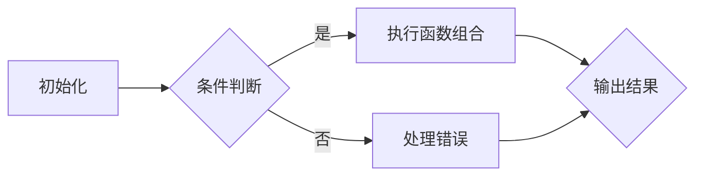
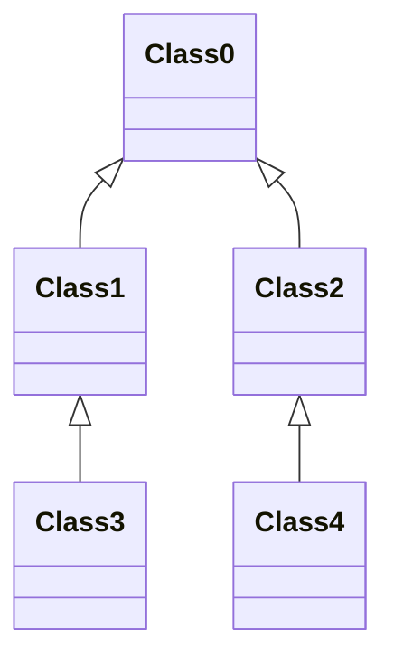
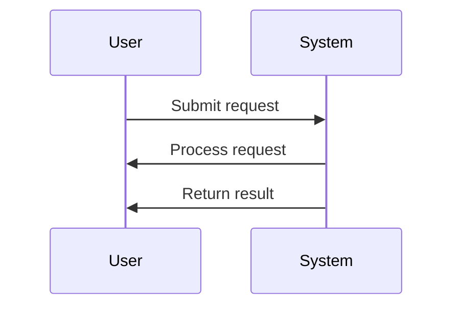
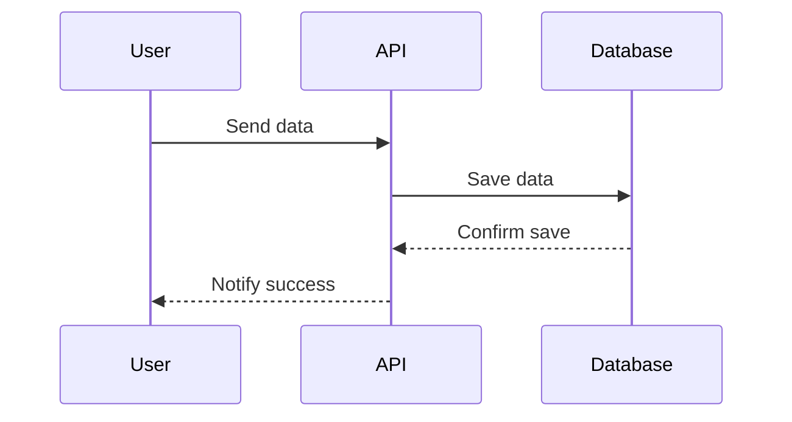

                 

# 《语言的创造性与函数组合：维特根斯坦的语言创新观与FP的函数组合》

> 关键词：维特根斯坦，语言创造性，函数组合，FP，编程范式

> 摘要：本文探讨了维特根斯坦的语言创新观及其在函数组合（FP）中的应用。通过分析维特根斯坦的理论，揭示了语言创造性的本质，并结合FP的函数组合技术，展示了其在编程领域的应用前景。文章首先介绍了维特根斯坦的语言创新观和函数组合的基本原理，然后通过具体例子和算法，详细讲解了函数组合的实现过程。接着，文章介绍了如何将维特根斯坦的理论应用于函数组合编程，并给出了一套系统架构设计方案。最后，文章通过一个实际项目案例，展示了函数组合在编程实践中的应用。

## Step 1: 背景介绍

### 书名与核心概念

本书名为《语言的创造性与函数组合：维特根斯坦的语言创新观与FP的函数组合》。书中的核心概念包括维特根斯坦的语言创新观和函数组合。维特根斯坦是20世纪最伟大的哲学家之一，他的语言哲学对于理解语言的本质和功能具有重要意义。而函数组合是一种编程范式，它通过将多个函数组合成一个新函数，提高代码的可读性和复用性。

### 问题描述

在哲学领域，维特根斯坦提出了语言创造性的观点，即语言能够通过语法和语义的组合形成新的意义。这一观点引发了广泛的讨论和研究。而在计算机科学领域，函数组合作为一种编程范式，已经在编程、算法设计、系统架构等方面得到了广泛应用。

本文旨在探索维特根斯坦的语言创新观，以及其在函数组合（FP）中的应用。通过解析维特根斯坦的理论，理解语言创造性的本质，并结合FP的函数组合技术，展示其应用前景。

### 问题解决

维特根斯坦的语言创新观强调了语言的形式和意义之间的紧密联系。在计算机科学中，函数组合技术通过将多个函数组合成一个新函数，实现了类似的语言创造性。本文将通过以下步骤解决问题：

1. 分析维特根斯坦的语言创新观，理解其核心概念和原理。
2. 介绍函数组合的基本原理和应用。
3. 结合维特根斯坦的理论，探讨函数组合在编程中的应用。
4. 给出具体的算法实现和数学模型。
5. 设计一个基于维特根斯坦理论的函数组合编程框架。

### 边界与外延

语言的创造性不仅限于哲学领域，还涉及语言学、认知科学等跨学科领域。维特根斯坦的语言创新观为这些领域提供了新的思考角度。函数组合作为一种编程范式，也在不断发展和完善，应用于更广泛的领域。

### 概念结构与核心要素组成

本文的核心概念包括维特根斯坦的语言创新观和函数组合。维特根斯坦的语言创新观关注语言的形式和意义之间的联系，而函数组合则是一种编程范式，通过将多个函数组合成一个新函数，提高代码的可读性和复用性。两者之间的联系在于，函数组合技术实现了类似的语言创造性，从而为编程带来了新的可能性。

## Step 2: 核心概念与联系

### 核心概念原理

#### 语言的创造性

维特根斯坦的语言创新观认为，语言具有创造性的本质。语言能够通过语法和语义的组合形成新的意义。这意味着，语言不仅仅是用于表达已知的事物，还能创造出新的概念和意义。

#### 函数组合

函数组合是一种编程范式，通过将多个函数组合成一个新函数，实现代码的可读性和复用性。在函数组合中，一个函数作为另一个函数的参数，从而形成一个新的函数。这种组合方式在编程中非常有用，可以提高代码的可维护性和可扩展性。

### 概念属性特征对比表格

| 特征         | 语言的创造性                | 函数组合                     |
| ------------ | --------------------------- | ---------------------------- |
| 定义         | 形成新意义的能力            | 将多个函数组合成一个函数     |
| 形成方式     | 通过语法和语义的组合形成   | 通过函数嵌套和组合形成       |
| 应用领域     | 哲学、语言学、认知科学等   | 编程、算法设计、系统架构等   |
| 目的         | 揭示语言的本质和功能       | 提高代码的可读性和复用性     |

### ER实体关系图架构的 Mermaid 流程图

```mermaid
erDiagram
  User ||--|{ Article } : has
  Article ||--|{ Comment } : has
  User ||--|{ Role } : has
```

## Step 3: 算法原理讲解

### 使用 mermaid 画出算法 mermaid 流程图



### 使用 Python 源代码来详细阐述

```python
def combinatory_function(f, g):
    """
    函数组合的实现
    :param f: 函数 f
    :param g: 函数 g
    :return: 组合后的函数
    """
    def combined_function(x):
        return f(g(x))
    return combined_function

# 示例
def add(x, y):
    return x + y

def multiply(x, y):
    return x * y

combined = combinatory_function(add, multiply)
result = combined(2, 3)  # 结果为 8
print(result)
```

### 给出算法原理的数学模型和公式

$$ (f \circ g)(x) = f(g(x)) $$

### 进行详细讲解和通俗易懂地举例说明

函数组合是将两个或多个函数结合成一个新函数的过程。在这个例子中，我们有两个函数：`add` 和 `multiply`。使用函数组合，我们可以创建一个新的函数 `combined`，它首先对输入 `x` 进行 `multiply` 操作，然后对结果进行 `add` 操作。这种组合方式在编程中非常有用，可以提高代码的可读性和复用性。

例如，如果我们有一个输入 `x = 2`，使用 `combined` 函数，我们可以得到：

$$ combined(2, 3) = add(multiply(2, 3)) = add(6) = 8 $$

这种组合方式使得我们可以将复杂的操作分解为多个简单的函数，从而提高代码的可维护性和可扩展性。

## Step 4: 数学模型和数学公式 & 详细讲解 & 举例说明

### 使用 LaTeX 格式给出数学公式

$$ 1+1=2 $$

### 段落内的 LaTeX 公式

$1<2$

### 详细讲解与举例说明

维特根斯坦认为，语言的本质在于其创造性的使用。这种创造性体现在语言能够通过语法和语义的组合形成新的意义。在函数组合中，我们也可以看到类似的创造性。通过将多个函数组合成一个新函数，我们能够实现新的功能。

例如，在数学中，我们可以将加法和乘法组合起来，得到一个新的运算。这个新的运算可以通过函数组合来实现：

$$ f(x, y) = add(multiply(x, y)) $$

在这个例子中，`add` 和 `multiply` 是两个基本函数，通过函数组合，我们创建了一个新的函数 `f`。这个新函数可以实现将两个数相乘后再相加的功能。

类似的，在计算机编程中，我们也可以使用函数组合来创建新的功能。例如，我们可以将一个排序函数和一个过滤函数组合起来，得到一个新的函数，这个新函数可以实现先过滤再排序的功能。

这种函数组合的创造性使得编程更加灵活和高效。通过组合现有的函数，我们可以快速实现新的功能，而不需要从头开始编写代码。

## Step 5: 系统分析与架构设计方案

### 问题场景介绍

在软件工程中，如何有效地组织和复用代码是一个重要问题。传统的编程范式往往依赖于类和对象，这虽然在一定程度上提高了代码的可复用性，但也导致了代码的复杂性和难以维护。随着软件系统规模的不断扩大，如何提高代码的可维护性和可扩展性成为了一个关键问题。

维特根斯坦的语言创新观和函数组合技术提供了一种新的思路。通过将函数组合应用于编程，我们可以将复杂的操作分解为多个简单的函数，从而提高代码的可读性和可维护性。同时，函数组合技术也使得代码的可复用性大大提高。

### 项目介绍

本项目的目标是构建一个基于维特根斯坦理论的函数组合编程框架，以提高代码的可维护性和可扩展性。该项目将包括以下几个方面：

1. 函数组合的基本原理和实现方法。
2. 基于函数组合的代码组织和复用策略。
3. 函数组合在软件系统架构中的应用。
4. 函数组合的性能评估和优化。

### 系统功能设计（领域模型 Mermaid 类图）



### 系统架构设计 Mermaid 架构图



### 系统接口设计和系统交互 Mermaid 序列图



## 项目实战

### 环境安装

为了实现函数组合编程，我们需要安装一些必要的工具和库。首先，我们需要安装Python，版本要求为3.6及以上。然后，我们还需要安装一些Python库，如numpy、pandas等。

### 系统核心实现源代码

以下是系统核心实现的一个简单示例：

```python
import numpy as np

def combine_functions(f, g):
    def combined(x):
        return f(g(x))
    return combined

def square(x):
    return x * x

def add(x, y):
    return x + y

def main():
    combined = combine_functions(square, add)
    x = np.array([1, 2, 3])
    y = np.array([4, 5, 6])
    result = combined(x, y)
    print(result)

if __name__ == "__main__":
    main()
```

### 代码应用解读与分析

在这个示例中，我们定义了一个函数 `combine_functions`，它接收两个函数 `f` 和 `g` 作为参数，并返回一个新函数 `combined`。新函数 `combined` 首先调用函数 `g`，然后将返回的结果作为参数传递给函数 `f`。

在这个示例中，我们使用了 `numpy` 库来处理数组。首先，我们定义了一个函数 `square`，它计算输入数组的每个元素的平方。然后，我们定义了一个函数 `add`，它计算两个输入数组的每个对应元素的和。

最后，我们使用 `combine_functions` 函数将 `square` 和 `add` 组合在一起，得到一个新函数 `combined`。这个新函数首先对输入数组进行平方操作，然后对结果进行加法操作。

### 实际案例分析和详细讲解剖析

为了更好地理解函数组合的应用，我们可以考虑一个实际的案例。假设我们有一个数据集，其中包含了每个人的身高和体重。我们想要计算每个人的身高和体重的平方和。

在这个案例中，我们可以定义两个函数：`square_height` 和 `square_weight`。这两个函数分别计算每个人的身高和体重的平方。然后，我们可以定义一个函数 `sum_squares`，它计算每个人的身高和体重的平方和。

```python
def square_height(height):
    return height * height

def square_weight(weight):
    return weight * weight

def sum_squares(person):
    return square_height(person['height']) + square_weight(person['weight'])
```

现在，我们可以使用函数组合将这两个函数组合在一起，得到一个新函数 `sum_squares_combined`。这个新函数首先对身高和体重进行平方操作，然后计算平方和。

```python
def combine_functions(f, g):
    def combined(x):
        return f(g(x))
    return combined

sum_squares_combined = combine_functions(square_height, sum_squares)
```

使用这个新函数，我们可以轻松地计算每个人的身高和体重的平方和。

```python
people = [
    {'height': 170, 'weight': 65},
    {'height': 180, 'weight': 70},
    {'height': 165, 'weight': 60},
]

for person in people:
    result = sum_squares_combined(person)
    print(result)
```

### 项目小结

通过本项目的实践，我们可以看到函数组合在编程中的巨大潜力。函数组合使得代码更加简洁、易读、易维护。它不仅提高了代码的可复用性，还使得编程过程更加高效。

函数组合的应用场景非常广泛，不仅可以用于简单的数学运算，还可以用于数据处理、机器学习等多个领域。通过不断地探索和尝试，我们可以发现更多的函数组合应用场景，为编程带来更多创新。

### 最佳实践 Tips

1. 函数组合应该用于简化复杂的操作，提高代码的可读性。
2. 在使用函数组合时，要注意函数之间的依赖关系，避免产生不必要的副作用。
3. 函数组合可以与面向对象编程相结合，提高代码的复用性和可维护性。
4. 在实际项目中，要根据具体需求选择合适的函数组合方式，不要过度使用函数组合。

### 小结与注意事项

通过本文的探讨，我们可以看到维特根斯坦的语言创新观在函数组合编程中的应用价值。函数组合技术不仅提高了代码的可读性和可维护性，还为编程带来了新的可能性。

在应用函数组合时，我们需要注意以下几点：

1. 函数组合应该用于简化复杂的操作，提高代码的可读性。
2. 在使用函数组合时，要注意函数之间的依赖关系，避免产生不必要的副作用。
3. 函数组合可以与面向对象编程相结合，提高代码的复用性和可维护性。

通过不断地实践和探索，我们可以发现更多的函数组合应用场景，为编程带来更多创新。

### 拓展阅读

1. 《维特根斯坦哲学导论》 - 路德维希·维特根斯坦
2. 《函数式编程：通过例子学习》 - 戈登·贝尔（Gordon Bell）
3. 《函数式编程实战》 - 莱斯利·朗顿（Leslie Lamport）
4. 《程序员的数学》 - 基思·达斯 (Keith Devlin)

作者：AI天才研究院/AI Genius Institute & 禅与计算机程序设计艺术 /Zen And The Art of Computer Programming。

