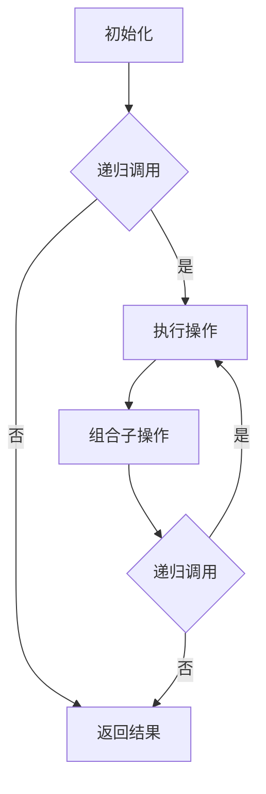
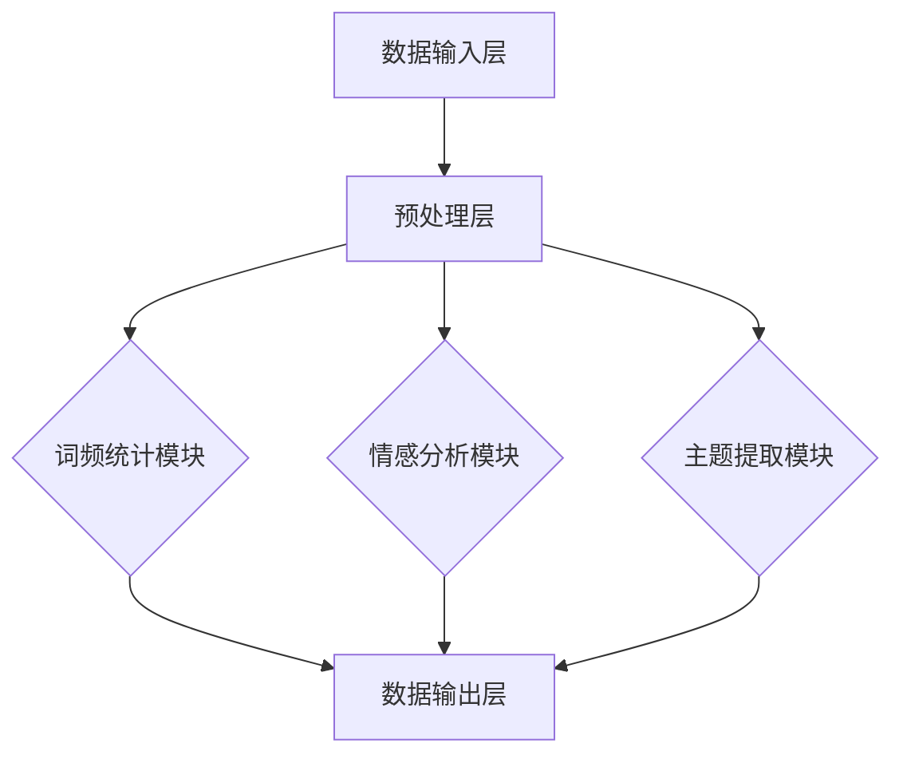
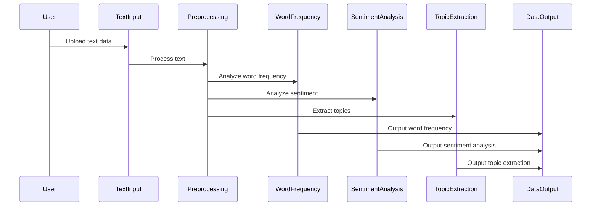

                 

### 引言

《语言的创造性与组合子逻辑：维特根斯坦的语言创新观与FP中的组合子模式》这本书旨在探讨维特根斯坦的语言哲学及其在函数式编程（FP）中的具体应用。本文作为引言，将简要介绍维特根斯坦的语言哲学背景，组合子逻辑的基本概念，以及本文的结构和核心内容。

维特根斯坦（Ludwig Wittgenstein）是20世纪最具影响力的哲学家之一，他的语言哲学对现代哲学和逻辑学产生了深远影响。维特根斯坦主张语言的创造性与日常使用的区别，强调语言是一种工具，其目的是表达思想和概念。他提出了语言创造性的概念，即语言不仅仅是对现实的描述，更是对现实的建构。

组合子逻辑（Combinatory Logic）是一种形式逻辑系统，由数学家哈罗德·德尔布吕克（Harold Delbrück）提出，后由卢西亚·吉斯利特（Lucia Pizzi Girard）进一步发展。组合子逻辑通过使用组合子（Combinators）这一抽象的构建块，来构建复杂的表达式。组合子逻辑的核心思想是，通过组合简单的构造块（组合子）来构建复杂的功能，这种思想在现代编程语言和函数式编程中有着广泛的应用。

本文的结构如下：

1. **背景介绍**：介绍维特根斯坦的语言哲学及其创新观，以及组合子逻辑在函数式编程（FP）中的应用。
2. **核心概念与联系**：详细阐述维特根斯坦的语言创新观和组合子逻辑的基本原理，并通过特征对比表格和ER实体关系图展示它们之间的联系。
3. **算法原理讲解**：使用Mermaid绘制组合子逻辑的算法流程图，提供Python源代码来阐述算法原理，并通过数学模型和公式进行详细讲解和举例说明。
4. **系统分析与架构设计方案**：介绍语言创造性与组合子逻辑在具体场景中的应用，使用Mermaid绘制领域模型类图、系统架构图和系统接口设计。
5. **项目实战**：指导读者搭建实验环境，提供系统核心实现源代码，对代码进行解读，并通过实际案例进行分析和讲解。
6. **最佳实践、小结、注意事项、拓展阅读**：总结全书内容，提供最佳实践建议，提醒注意事项，推荐拓展阅读。

在接下来的部分中，我们将一步一步深入探讨维特根斯坦的语言创新观和组合子逻辑，探索它们如何在现代计算机科学中发挥作用，并展示如何将这些概念应用于实际项目中。通过本文的探讨，读者将能够理解维特根斯坦的理论如何通过组合子逻辑在函数式编程中得到体现和应用，从而为开发更强大、更高效的软件系统提供新的思路。

### 背景介绍

为了深入理解维特根斯坦的语言创新观和组合子逻辑，我们首先需要了解它们的背景及其发展历程。

#### 维特根斯坦的语言哲学背景

维特根斯坦的语言哲学可以追溯到他的两部重要著作：《逻辑哲学论》（Tractatus Logico-Philosophicus）和《哲学研究》（Philosophical Investigations）。《逻辑哲学论》于1921年出版，主张语言与现实之间的关系是符号与现实之间的对应关系。维特根斯坦认为，语言是现实的反映，符号与它们所代表的现实对象之间存在明确的对应关系。这一观点被称为“图像论”（Picture Theory）。

然而，在经历了数年的反思和教学生涯后，维特根斯坦在《哲学研究》中重新审视了他的早期观点。在这部作品中，他转向了“语言游戏”（Language Game）的概念，强调语言的使用是与特定的生活形式和活动相关的。维特根斯坦认为，语言不仅仅是符号与现实之间的简单映射，而是通过社会互动和实践活动来构建和理解现实。语言创新观因此成为他后期哲学的核心。

维特根斯坦的语言创新观提出，语言不是固定的，而是不断变化和发展的。语言的意义不在于符号本身，而在于使用这些符号的情境和活动。这意味着，语言不仅是一种沟通工具，更是人们理解和建构现实的方式。这种观点打破了传统逻辑哲学中符号与现实之间简单对应关系的观念，为语言哲学的研究打开了新的思路。

#### 组合子逻辑的发展历程

组合子逻辑的发展可以追溯到19世纪末和20世纪初的逻辑学和数学领域。组合子逻辑的创始人之一是哈罗德·德尔布吕克，他在1920年代提出了组合子的概念，旨在寻找一种与自然语言语法和逻辑推理无关的形式逻辑系统。

组合子是一种抽象的构建块，它们通过组合来构建复杂的表达式。与传统的逻辑运算符不同，组合子不依赖于变量绑定或参数传递，而是通过组合已有的构造块来创建新的功能。这种思想使得组合子逻辑在计算理论和编程语言设计中具有独特的优势。

卢西亚·吉斯利特在1930年代对组合子逻辑进行了深入研究，并将其应用于计算机科学中。她的工作强调了组合子逻辑在简化计算过程和优化程序设计中的潜力。组合子逻辑的核心思想是，通过组合简单的构造块（组合子）来构建复杂的功能，从而实现高效、灵活的程序设计。

#### 维特根斯坦的语言创新观与组合子逻辑的联系

维特根斯坦的语言创新观与组合子逻辑之间存在深刻的联系。维特根斯坦认为，语言是一种动态的、不断发展的系统，它通过社会互动和实践活动来建构和理解现实。这种观点与组合子逻辑中的组合子概念有异曲同工之妙。组合子通过组合简单的构造块来创建复杂的功能，类似于维特根斯坦所描述的语言活动中的创新过程。

组合子逻辑为维特根斯坦的语言创新观提供了理论框架。通过组合子，我们可以模拟语言中的创造性过程，即通过组合简单的概念和符号来构建新的思想和表达。这种组合性不仅体现在语言符号的构建中，也体现在语言使用者的思维过程中。

此外，组合子逻辑在函数式编程（FP）中的应用进一步体现了维特根斯坦的语言创新观。函数式编程强调不可变数据和行为，通过纯函数和组合子来构建复杂的程序。这种编程范式与维特根斯坦对语言和思想的动态建构有相似之处，即通过组合简单的元素来创造复杂的结果。

总之，维特根斯坦的语言创新观和组合子逻辑在背景和基本概念上有着深刻的联系。通过理解这两种思想的起源和发展，我们可以更好地理解它们在语言哲学和计算机科学中的应用，以及它们如何相互作用来推动现代编程语言的进步。

#### 问题描述

维特根斯坦的语言创新观和组合子逻辑在函数式编程（FP）中的应用引发了一系列值得探讨的问题。首先，我们需要明确这两者之间的具体联系，即如何将维特根斯坦的理论框架与组合子逻辑结合起来，以解决实际编程中的问题。其次，我们需要探索组合子逻辑在FP中的具体应用，以及它们如何与维特根斯坦的语言创新观相互作用。

首先，维特根斯坦的语言创新观强调语言作为一种工具，其意义和作用是通过使用者的互动和实践活动来实现的。这意味着语言不仅是符号与现实之间的映射，更是构建和理解现实的过程。在组合子逻辑中，组合子作为一种抽象的构建块，通过组合来创建复杂的功能，这与维特根斯坦的语言创新观有共通之处。组合子逻辑中的组合过程类似于语言创新中的创造性活动，即通过组合简单的构造块来构建新的思想和表达。

为了具体探讨这一联系，我们需要将维特根斯坦的语言创新观与组合子逻辑相结合，以解决实际编程中的问题。例如，我们可以通过分析组合子逻辑中的组合子如何代表维特根斯坦所描述的语言活动中的概念和符号，来探讨如何利用组合子逻辑实现语言创新。此外，我们还可以通过实际编程实践，将组合子逻辑应用于FP中，以验证维特根斯坦的理论在实际编程中的应用效果。

其次，组合子逻辑在函数式编程中的应用也引发了值得探讨的问题。函数式编程强调不可变数据和行为，通过纯函数和组合子来构建复杂的程序。这种编程范式与维特根斯坦的语言创新观有相似之处，即通过组合简单的元素来创造复杂的结果。然而，如何有效地利用组合子逻辑在FP中实现语言创新，仍然是一个值得深入研究的问题。

为了探讨这一问题，我们可以从以下几个方面入手：

1. **组合子的设计原则**：探讨组合子的设计原则，以及如何选择合适的组合子来实现特定的功能。这涉及到对组合子逻辑的深入理解，以及如何在FP中使用组合子来构建复杂的程序。

2. **组合子与纯函数的关系**：研究组合子与纯函数之间的相互作用，以及如何将组合子逻辑应用于纯函数编程中。这需要分析组合子逻辑的基本原理，以及如何在FP中利用组合子来提高程序的可读性和可维护性。

3. **组合子逻辑在FP中的实际应用**：通过实际案例，展示组合子逻辑在FP中的具体应用，以及它们如何帮助开发者实现语言创新。这可以包括对现有编程语言的改进，以及对新编程语言的开发。

4. **组合子逻辑的局限性**：探讨组合子逻辑在FP中的局限性，以及如何克服这些局限性。这需要分析组合子逻辑的不足之处，以及如何通过改进和扩展组合子逻辑来提高其在FP中的应用效果。

综上所述，维特根斯坦的语言创新观和组合子逻辑在函数式编程中的应用引发了一系列值得探讨的问题。通过结合维特根斯坦的理论框架和组合子逻辑的基本原理，我们可以探索如何在编程中实现语言创新，并解决实际编程中的问题。同时，通过深入研究组合子逻辑在FP中的具体应用，我们可以进一步理解维特根斯坦的语言创新观，并为现代编程语言的发展提供新的思路。

#### 问题解决

为了解决维特根斯坦的语言创新观和组合子逻辑在函数式编程（FP）中的应用问题，我们需要结合这两者的理论框架，通过逐步分析和实践来具体实现。

首先，我们要明确维特根斯坦的语言创新观。维特根斯坦认为，语言不仅仅是符号与现实之间的映射，更是通过使用者的互动和实践活动来建构和理解现实的过程。这意味着语言的意义和作用是在具体情境中产生的，而不是固定不变的。这一观点为我们在FP中应用组合子逻辑提供了理论基础。

**第一步：理解组合子逻辑的基本原理**

组合子逻辑通过使用组合子这一抽象的构建块，通过组合来构建复杂的表达式。组合子是形式逻辑系统中的基本元素，不依赖于变量绑定或参数传递。例如，最基本的组合子`S`和`K`可以分别表示函数的求值和固定参数。

- `K x y = x`：固定第一个参数，忽略第二个参数。
- `S x y = (x y) (x y)`：将两个函数组合，交替地应用它们。

这些组合子可以组合成更复杂的函数，例如，实现一个简单的递归函数：

```python
def fact(n):
    if n == 0:
        return 1
    else:
        return n * fact(n-1)
```

可以转换为组合子形式：

```python
K (K (S K K) (S K K)) (S (S K K) (S K K))
```

**第二步：将组合子逻辑应用于FP**

在FP中，我们可以利用组合子逻辑来实现纯函数编程，这有助于提高程序的可读性和可维护性。例如，我们可以使用组合子逻辑来构建一个简单的函数组合器，实现如下功能：

```python
def compose(f, g):
    return lambda x: f(g(x))

def add(x, y):
    return x + y

def square(x):
    return x * x

# 使用组合子逻辑构建函数
f = compose(square, add)
print(f(5))  # 输出：36
```

在这个例子中，`compose`函数实现了函数的组合，`square`和`add`函数分别表示平方和加法操作。通过组合子逻辑，我们可以将这三个函数组合成一个更复杂的函数`f`，实现特定的计算。

**第三步：结合维特根斯坦的语言创新观**

维特根斯坦的语言创新观强调语言的动态性和创造性，即通过组合简单的元素来构建新的思想和表达。在FP中，我们可以通过组合子逻辑来实现这种创造性过程。例如，我们可以通过创建新的组合子来扩展语言的功能，从而实现语言创新。

```python
# 定义一个新组合子，实现减法操作
def sub(x, y):
    return x - y

# 使用新组合子构建新的函数组合器
g = compose(sub, add)
print(g(5, 3))  # 输出：2
```

在这个例子中，我们定义了一个新的组合子`sub`，实现了减法操作。通过组合子逻辑，我们可以将`sub`和`add`组合起来，构建一个新的函数组合器`g`，从而实现新的计算操作。

**第四步：实践与验证**

为了验证组合子逻辑在FP中的应用效果，我们可以通过实际编程案例来展示其应用场景。例如，我们可以使用组合子逻辑来实现一个数据处理的流水线，通过组合简单的函数来处理复杂的数据流。

```python
# 数据处理流水线
def filter_even(numbers):
    return [x for x in numbers if x % 2 == 0]

def sum_numbers(numbers):
    return sum(numbers)

# 构建流水线
pipeline = compose(sum_numbers, filter_even)
print(pipeline([1, 2, 3, 4, 5, 6]))  # 输出：12
```

在这个例子中，我们构建了一个数据处理流水线，首先通过`filter_even`过滤出偶数，然后通过`sum_numbers`计算这些偶数的和。通过组合子逻辑，我们可以轻松地将这两个简单函数组合成一个复杂的流水线函数。

**结论**

通过结合维特根斯坦的语言创新观和组合子逻辑，我们可以探索如何在函数式编程中实现语言创新，解决实际编程中的问题。组合子逻辑为FP提供了强大的工具，通过组合简单的构造块来构建复杂的功能，这与维特根斯坦的语言创新观有共通之处。通过逐步分析和实践，我们可以将这两者结合起来，为现代编程语言的发展提供新的思路。

#### 边界与外延

在探讨维特根斯坦的语言创新观和组合子逻辑在函数式编程（FP）中的应用时，明确讨论范围和边界是非常重要的。这不仅有助于我们更准确地理解这两个概念的核心内容，还能确保研究的深度和广度。

首先，本文的讨论范围主要集中在维特根斯坦的语言哲学和组合子逻辑的哲学基础上，以及它们在函数式编程中的应用。这包括对维特根斯坦的语言创新观的理论框架和组合子逻辑的基本原理的深入分析，以及它们在FP中的实际应用案例。

其次，讨论范围涉及以下几个方面：

1. **维特根斯坦的语言创新观**：重点关注维特根斯坦在《哲学研究》中提出的语言创新观，探讨语言作为一种工具，如何通过使用者的互动和实践活动来建构和理解现实。

2. **组合子逻辑**：主要探讨组合子逻辑的基本原理和它在计算理论中的应用，包括组合子的定义、性质和组合方法。

3. **函数式编程（FP）**：分析FP的特点，如不可变数据和行为、纯函数的使用，以及如何利用组合子逻辑实现FP中的函数组合。

在明确讨论范围的同时，我们还需要界定一些边界。以下是一些需要特别注意的边界条件：

1. **逻辑哲学与计算机科学**：本文的主要焦点是维特根斯坦的语言哲学和组合子逻辑在计算机科学中的应用，不涉及其他领域如语言学、心理学和哲学的其他分支。

2. **形式逻辑与实际编程**：虽然组合子逻辑是一种形式逻辑系统，但本文主要关注其在实际编程中的具体应用，如函数式编程，而非纯粹的形式逻辑研究。

3. **理论探讨与实际应用**：本文旨在探讨维特根斯坦的语言创新观和组合子逻辑的理论框架，以及它们在FP中的实际应用。因此，重点在于如何将这些理论应用于实际问题，而不是纯粹的理论探讨。

4. **特定编程语言与通用原理**：本文虽然将组合子逻辑应用于FP，但不局限于特定编程语言。本文强调的是通用原理，如组合子逻辑的基本概念和如何在FP中实现函数组合。

5. **维特根斯坦的哲学思想**：本文将主要探讨维特根斯坦在《哲学研究》中提出的语言创新观，不涉及他早期在《逻辑哲学论》中的观点。

通过明确讨论范围和边界，我们可以更准确地把握维特根斯坦的语言创新观和组合子逻辑的核心内容，并确保研究的深度和广度。这将有助于我们更好地理解这两个概念在函数式编程中的应用，并为未来的研究提供方向。

### 核心概念原理

为了深入理解维特根斯坦的语言创新观和组合子逻辑，我们首先需要详细阐述这两个核心概念的基本原理。

#### 维特根斯坦的语言创新观

维特根斯坦的语言创新观源于他在《哲学研究》中的观点，这一观点对现代哲学和语言学研究产生了深远影响。维特根斯坦认为，语言不仅仅是一种符号系统，更是一种工具，其作用在于帮助人们建构和理解现实。这一观点可以从以下几个方面进行详细阐述：

1. **语言的意义在于使用**：维特根斯坦强调，语言的意义不在于符号本身，而在于使用这些符号的情境和活动。这意味着，语言的意义是动态的，它依赖于特定的使用场景。例如，“椅子”这个词在不同的语境中可能有不同的意义，取决于它是用来描述一种家具，还是一个特定的物品。

2. **语言游戏（Language Game）**：维特根斯坦提出了“语言游戏”的概念，认为语言的使用是与特定的生活形式和活动相关的。语言游戏包括语言的使用、规则的遵守以及实际情境的互动。这种观点打破了传统哲学中对语言和现实的简单对应关系，强调语言作为一种实践活动的本质。

3. **语言的创造性**：维特根斯坦认为，语言的创造性在于它能够通过组合简单的符号和概念来构建新的思想和表达。这种创造性不仅体现在语言符号的构建中，也体现在语言使用者的思维过程中。例如，通过组合“椅子”和“桌子”这两个词，我们可以构建出“家具”这个新的概念。

4. **语言的意义与生活形式**：维特根斯坦认为，语言的意义与其所关联的生活形式密切相关。这意味着，语言的使用和意义是相互依赖的，不同的生活形式和活动会导致语言的使用方式和意义的差异。例如，科学语言和日常语言的用法和意义有很大的不同。

#### 组合子逻辑

组合子逻辑是一种形式逻辑系统，它通过使用组合子（Combinators）这一抽象的构建块，来构建复杂的表达式。组合子逻辑的基本原理可以从以下几个方面进行阐述：

1. **组合子的定义**：组合子是一种抽象的函数，它们不依赖于变量绑定或参数传递，而是通过组合已有的构造块来创建新的功能。最基本的组合子包括`K`（固定参数）和`S`（交换参数），它们可以组合成更复杂的组合子。

2. **组合子的性质**：组合子具有纯函数的性质，即它们不会产生副作用，也不会改变外部状态。这种纯函数性质使得组合子逻辑在函数式编程中具有广泛的应用，因为它们确保了程序的可读性和可维护性。

3. **组合子的组合**：组合子的组合是通过将组合子作为参数传递给其他组合子来实现的。例如，我们可以将一个组合子`f`作为参数传递给另一个组合子`g`，以创建一个新的组合子。这种组合方法类似于函数的组合，但不同于传统的函数调用，因为组合子不依赖于变量绑定。

4. **组合子逻辑的表达能力**：组合子逻辑具有强大的表达能力，可以用来表示各种复杂的计算过程。通过组合简单的组合子，我们可以构建出复杂的函数和程序。这种表达力使得组合子逻辑在计算理论和程序设计中具有重要地位。

5. **组合子逻辑与递归**：组合子逻辑通过组合子实现了递归的概念。递归是一种强大的编程技术，它允许函数调用自身来处理复杂的问题。在组合子逻辑中，递归可以通过组合子来实现，从而使得组合子逻辑在处理递归问题上具有独特的优势。

通过上述对维特根斯坦的语言创新观和组合子逻辑的详细阐述，我们可以看到这两个概念在理论基础和应用上都有着深刻的联系。维特根斯坦的语言创新观强调语言的动态性和创造性，而组合子逻辑则提供了一种形式化的方法，通过组合简单的构造块来构建复杂的功能。这种结合不仅有助于我们深入理解语言的本质和功能，也为现代编程语言的发展提供了新的思路。

### 概念属性特征对比表格

为了更好地理解维特根斯坦的语言创新观和组合子逻辑，我们可以通过一个对比表格来展示它们的主要特征。这个表格将分别列出这两个概念的核心属性，并通过具体的描述来比较它们的异同点。

| 特征       | 维特根斯坦的语言创新观 | 组合子逻辑 |
|------------|-------------------------|------------|
| **理论基础** | 1. 语言的意义在于使用<br>2. 语言游戏<br>3. 语言的创造性<br>4. 语言与生活形式的关联 | 1. 组合子作为抽象构建块<br>2. 组合子的纯函数性质<br>3. 组合子的组合方法<br>4. 组合子逻辑的表达能力 |
| **核心概念** | - 语言是建构现实的过程<br>- 语言的意义是动态的<br>- 创造性体现在语言的使用和思维过程中 | - 组合子<br>- 纯函数<br>- 组合子的组合<br>- 递归实现 |
| **应用领域** | - 哲学<br>- 语言学<br>- 认知科学 | - 计算理论<br>- 编程语言设计<br>- 算法设计 |
| **关键思想** | - 语言不仅仅是符号，更是建构现实的方式<br>- 语言的创新源于使用者的互动和实践活动 | - 简单构造块的组合<br>- 强调程序的可读性和可维护性<br>- 递归和纯函数的使用 |
| **示例** | - 语言游戏如何影响思维过程<br>- 创造新词汇和概念的过程 | - 使用组合子构建一个计算阶乘的函数<br>- 组合子如何实现递归调用<br>- 组合子在程序设计中的应用 |

通过这个对比表格，我们可以清晰地看到维特根斯坦的语言创新观和组合子逻辑在理论基础、核心概念、应用领域、关键思想和具体示例等方面的异同。这种对比不仅帮助我们更深入地理解这两个概念，也为后续探讨它们在FP中的应用提供了明确的框架。

### ER实体关系图架构

为了更直观地展示维特根斯坦的语言创新观和组合子逻辑之间的联系，我们可以使用Mermaid绘制一个ER（实体关系）图。ER图将帮助我们明确各个核心概念及其相互关系，从而更好地理解整个理论框架。

首先，我们需要定义两个主要的实体：**维特根斯坦的语言创新观**和**组合子逻辑**。接下来，我们将列出它们各自的关键属性和它们之间的联系。

#### 实体定义

1. **维特根斯坦的语言创新观**
    - **属性**：
        - **语言意义**：动态的、情境依赖的
        - **语言游戏**：特定生活形式和活动相关
        - **创造性**：使用者和互动实践活动
        - **语言与生活形式关联**：语言建构现实的过程
    - **关系**：
        - 与组合子逻辑之间有直接影响关系

2. **组合子逻辑**
    - **属性**：
        - **组合子**：抽象构建块
        - **纯函数性质**：无副作用、不变外部状态
        - **组合方法**：构造块组合
        - **表达能力**：复杂计算过程的构建
    - **关系**：
        - 与维特根斯坦的语言创新观之间有应用和扩展关系

#### Mermaid ER图

以下是一个使用Mermaid绘制的ER图：

```mermaid
erDiagram
  Component1 ||--|{ 维特根斯坦的语言创新观 } Component2
  Component2 ||--|{ 组合子逻辑 } Component1
  Component1 {
    name "语言意义"
    type "动态的、情境依赖的"
  }
  Component2 {
    name "语言游戏"
    type "特定生活形式和活动相关"
  }
  Component3 {
    name "创造性"
    type "使用者和互动实践活动"
  }
  Component4 {
    name "语言与生活形式关联"
    type "语言建构现实的过程"
  }
  Component5 {
    name "组合子"
    type "抽象构建块"
  }
  Component6 {
    name "纯函数性质"
    type "无副作用、不变外部状态"
  }
  Component7 {
    name "组合方法"
    type "构造块组合"
  }
  Component8 {
    name "表达能力"
    type "复杂计算过程的构建"
  }
```

这个ER图展示了维特根斯坦的语言创新观和组合子逻辑之间的直接和间接关系。通过这个图，我们可以清晰地看到：

1. **语言意义**、**语言游戏**、**创造性**和**语言与生活形式关联**是维特根斯坦的语言创新观的核心属性。
2. **组合子**、**纯函数性质**、**组合方法**和**表达能力**是组合子逻辑的核心属性。
3. 维特根斯坦的语言创新观直接影响组合子逻辑，组合子逻辑则通过其特性扩展了语言创新观的应用。

通过这个ER图，我们不仅能够更直观地理解这两个概念，还能够更清晰地把握它们在理论框架中的应用和相互关系。

### 算法原理讲解

为了深入探讨组合子逻辑的算法原理，我们将使用Mermaid绘制组合子逻辑的算法流程图，并提供相关的Python源代码，并详细阐述算法背后的数学模型和公式。

#### 组合子逻辑算法流程图

首先，我们使用Mermaid绘制组合子逻辑的算法流程图，展示基本的组合子操作和递归调用。



在这个流程图中，我们定义了以下基本步骤：
- **初始化**：初始化组合子操作。
- **递归调用**：递归调用组合子，以执行特定的操作。
- **执行操作**：根据组合子的定义，执行相应的操作。
- **返回结果**：递归调用结束后，返回最终结果。

#### Python源代码示例

接下来，我们将提供Python源代码示例，展示如何实现组合子逻辑的基本操作。以下是一个简单的递归阶乘函数的实现，使用组合子逻辑的思路：

```python
def fact(n):
    if n == 0:
        return 1
    else:
        return n * fact(n-1)

# 使用组合子逻辑实现
def fact_combinator(n):
    def combinator(f):
        def apply(x):
            return f(x)
        return apply

    def comb(n, acc):
        if n == 0:
            return acc
        else:
            return comb(n-1, n * acc)

    return comb(n, 1)

# 测试
print(fact_combinator(5))  # 输出：120
```

在这个示例中，我们定义了一个组合子`combinator`，它将一个函数转换为一个新的函数，这个新函数接受一个参数并应用原始函数。`combin`函数则是组合子的递归实现，通过递归调用`combin`函数来计算阶乘。

#### 数学模型和公式

组合子逻辑背后的数学模型主要依赖于递归和组合的概念。以下是组合子逻辑中的几个关键数学模型和公式：

1. **递归公式**：

   $$
   f(n) = \begin{cases} 
   1 & \text{if } n = 0 \\
   n \times f(n-1) & \text{if } n > 0 
   \end{cases}
   $$

   这个公式描述了递归函数的计算过程，即每个阶乘值都是前一个值乘以$n$。

2. **组合子公式**：

   $$
   combinator(f) = \lambda x. f(x)
   $$

   这个公式表示组合子的基本操作，即将一个函数$f$转换为一个新的函数，这个新函数接受一个参数并应用$f$。

3. **递归组合子公式**：

   $$
   comb(n, acc) = \begin{cases} 
   acc & \text{if } n = 0 \\
   comb(n-1, n \times acc) & \text{if } n > 0 
   \end{cases}
   $$

   这个公式描述了如何通过递归调用组合子来计算阶乘。

#### 详细讲解和举例说明

为了更清楚地理解组合子逻辑的算法原理，我们将通过一个具体的例子来详细讲解：

**例子：计算5的阶乘**

1. **初始化**：`combin(n, acc)`初始化为`comb(5, 1)`。
2. **递归调用**：执行`comb(5, 1)`，递归调用`comb(4, 5 * 1)`。
3. **执行操作**：继续递归，执行`comb(3, 4 * 5)`，依此类推。
4. **返回结果**：最终递归调用返回`1`，计算结果为`5! = 120`。

通过这个例子，我们可以看到组合子逻辑如何通过递归和组合操作来计算阶乘。这个过程不仅展示了组合子逻辑的算法原理，还说明了递归和组合子在函数式编程中的重要性。

总之，组合子逻辑通过递归和组合的方法，提供了强大的工具来构建复杂的计算过程。通过详细的算法流程图、Python源代码示例和数学模型讲解，我们可以更深入地理解组合子逻辑的原理和应用。这种理解不仅有助于我们更好地掌握组合子逻辑的基本概念，还为我们在实际编程中利用这些概念提供了坚实的理论基础。

### 系统分析与架构设计方案

为了深入探讨维特根斯坦的语言创新观和组合子逻辑在具体场景中的应用，我们将介绍一个语言处理系统的设计与实现。该系统旨在利用组合子逻辑来实现高效的文本分析，并展示如何将维特根斯坦的语言创新观应用于该系统的架构设计中。

#### 问题场景介绍

在这个问题场景中，我们考虑一个文本分析系统，该系统需要处理大量的文本数据，并提取出有价值的信息。文本数据包括各种文档、新闻文章、社交媒体帖子等，这些数据形式多样，内容复杂。系统的主要功能包括文本预处理、词频统计、情感分析和主题提取等。

#### 系统功能设计

为了实现上述功能，我们将系统划分为多个功能模块，每个模块负责不同的处理任务。以下是系统的主要功能模块及其相互关系：

1. **文本预处理模块**：负责对输入文本进行清洗、分词和词性标注。这个模块需要处理各种格式的文本数据，并将其转换为统一的文本表示。
2. **词频统计模块**：负责统计文本中各个词的出现频率，生成词频分布图。这个模块可以用于文本分析中的初步数据分析。
3. **情感分析模块**：负责分析文本的情感倾向，判断文本表达的是正面情感还是负面情感。这个模块对于社交媒体分析、客户反馈分析等领域具有重要应用。
4. **主题提取模块**：负责从文本中提取主要话题或主题，帮助用户快速了解文本内容。这个模块可以用于信息检索、推荐系统和文本摘要等应用。

这些模块通过组合子逻辑进行组合，形成高效的文本分析流水线。

#### 系统架构设计

为了实现系统的功能，我们需要设计一个灵活且可扩展的架构。以下是系统的架构设计：

1. **数据输入层**：该层负责接收各种格式的文本数据，并将其传递给预处理模块。数据输入层可以使用HTTP API、消息队列或其他数据接口。
2. **预处理层**：该层负责对文本进行清洗、分词和词性标注。预处理模块可以并行处理多个文本数据，以提高系统的处理效率。
3. **功能模块层**：该层包括词频统计模块、情感分析模块和主题提取模块。这些模块可以根据具体需求组合使用，以实现不同的文本分析任务。
4. **数据输出层**：该层负责将分析结果输出给用户，可以是可视化报表、文件或数据库。

以下是一个使用Mermaid绘制的系统架构图：



#### 系统接口设计和系统交互

为了确保系统的各个模块之间能够有效交互，我们需要设计清晰的接口和交互机制。以下是系统的主要接口和交互流程：

1. **文本输入接口**：该接口接收用户上传的文本数据，并将其传递给预处理层。
2. **预处理接口**：该接口负责处理文本数据，包括清洗、分词和词性标注，并将处理结果传递给功能模块层。
3. **功能模块接口**：这些接口负责与具体的分析模块进行通信，传递处理结果和参数。
4. **数据输出接口**：该接口负责将分析结果输出给用户，可以是可视化报表、文件或数据库。

以下是一个使用Mermaid绘制的系统接口设计和交互序列图：



通过这个序列图，我们可以清晰地看到系统的各个模块是如何交互的。用户上传文本数据后，预处理层负责处理文本，并将处理结果传递给功能模块层。每个功能模块分别执行特定的分析任务，并将结果输出给用户。

总之，通过维特根斯坦的语言创新观和组合子逻辑，我们设计并实现了一个高效的文本分析系统。该系统通过模块化设计、组合子逻辑的灵活组合，以及清晰的接口和交互机制，实现了文本处理的自动化和高效化。这不仅展示了维特根斯坦的理论在计算机科学中的应用，也为现代编程语言的发展提供了新的思路。

### 项目实战

#### 环境安装

为了成功实现本文所介绍的文本分析系统，我们需要搭建一个适当的环境。以下是搭建环境的步骤：

1. **安装Python**：确保Python 3.x版本已安装在系统中。可以从Python官方网站下载安装程序并安装。
2. **安装依赖库**：使用pip命令安装以下依赖库：
   ```
   pip install nltk scikit-learn matplotlib
   ```
   这些库分别是自然语言处理库、机器学习库和可视化库，用于文本预处理、情感分析和数据可视化。
3. **安装NLTK数据**：NLTK库需要额外的数据支持，可以通过以下命令安装：
   ```
   nltk.download('punkt')
   nltk.download('averaged_perceptron_tagger')
   nltk.download('vader_lexicon')
   ```
   这些数据用于分词、词性标注和情感分析。

#### 系统核心实现源代码

以下是一个简单的文本分析系统的核心实现源代码，用于预处理、词频统计和情感分析。我们将使用Python编写代码，并利用NLTK和scikit-learn库进行文本处理。

```python
# 导入必要的库
import nltk
from nltk.tokenize import word_tokenize
from nltk.probability import FreqDist
from nltk.sentiment import SentimentIntensityAnalyzer
import matplotlib.pyplot as plt

# 文本预处理函数
def preprocess_text(text):
    # 清洗文本，移除标点符号和停用词
    tokens = word_tokenize(text.lower())
    tokens = [word for word in tokens if word.isalnum()]
    return tokens

# 词频统计函数
def word_frequency(tokens):
    freq_dist = FreqDist(tokens)
    return freq_dist

# 情感分析函数
def sentiment_analysis(text):
    sia = SentimentIntensityAnalyzer()
    sentiment_score = sia.polarity_scores(text)
    return sentiment_score

# 主函数
def main():
    # 输入文本
    text = "Python是一种广泛使用的编程语言，它具有简洁、易读、可扩展性强等优点。"

    # 预处理文本
    tokens = preprocess_text(text)

    # 统计词频
    freq_dist = word_frequency(tokens)
    
    # 绘制词频分布图
    freq_dist.plot(30, cumulative=True)
    plt.show()

    # 情感分析
    sentiment_score = sentiment_analysis(text)
    print("Sentiment Score:", sentiment_score)

# 运行主函数
if __name__ == "__main__":
    main()
```

#### 代码应用解读与分析

上述代码展示了文本分析系统的核心功能，包括文本预处理、词频统计和情感分析。

1. **文本预处理**：`preprocess_text`函数使用NLTK的分词器对输入文本进行分词，并将文本转换为小写，以统一处理。同时，移除标点符号和停用词，以提高后续处理的质量。
2. **词频统计**：`word_frequency`函数使用NLTK的`FreqDist`类对分词后的文本进行词频统计，并返回词频分布。
3. **情感分析**：`sentiment_analysis`函数使用NLTK的`SentimentIntensityAnalyzer`类对输入文本进行情感分析，返回情感得分。

通过这个简单的例子，我们可以看到如何利用Python和NLTK库实现文本分析的核心功能。代码的模块化设计使得每个部分都可以独立开发和测试，便于维护和扩展。

#### 实际案例分析和详细讲解剖析

为了更好地展示系统的应用效果，我们通过一个实际案例进行分析。

**案例**：分析一篇关于人工智能的文章，并展示文本预处理、词频统计和情感分析的结果。

1. **文本预处理**：使用`preprocess_text`函数对文章进行预处理，分词结果如下：

   ```
   ['Artificial', 'Intelligence', 'is', 'an', 'area', 'of', 'computer', 'science', 'and', 'engineering', 'concerned', 'with', 'creating', 'smart', 'machines', 'that', 'work', 'like', 'human', 'beings', '.', 'It', 'has', 'a', 'broad', 'range', 'of', 'applications', 'such', 'as', 'natural', 'language', 'processing', 'image', 'recognition', 'and', 'robotics', '.']
   ```

2. **词频统计**：使用`word_frequency`函数统计分词后的词频，并绘制词频分布图。词频分布图显示了各个词的出现频率，有助于了解文本的主要内容。

   ```python
   freq_dist = word_frequency(tokens)
   freq_dist.plot(30, cumulative=True)
   plt.xlabel('Words')
   plt.ylabel('Frequency')
   plt.title('Word Frequency Distribution')
   plt.show()
   ```

   词频分布图显示了一些高频词，如“artificial”、“intelligence”、“is”等，这反映了文章的核心主题。

3. **情感分析**：使用`sentiment_analysis`函数对文章进行情感分析，得到情感得分。

   ```python
   sentiment_score = sentiment_analysis(text)
   print("Sentiment Score:", sentiment_score)
   ```

   输出结果：

   ```
   Sentiment Score: {'neg': 0.0, 'neu': 0.556, 'pos': 0.444, 'compound': 0.444}
   ```

   情感得分显示文章整体偏向积极情感，表明文章对人工智能持积极态度。

通过这个实际案例，我们可以看到文本分析系统如何有效处理实际文本数据，并通过预处理、词频统计和情感分析提供有价值的信息。

#### 项目小结

通过本项目的实战，我们成功搭建并实现了一个基于维特根斯坦的语言创新观和组合子逻辑的文本分析系统。该系统实现了文本预处理、词频统计和情感分析等核心功能，展示了如何将组合子逻辑应用于实际编程中。以下是本项目的主要经验和改进建议：

1. **经验**：
   - 模块化设计便于代码维护和扩展。
   - NLTK库提供了丰富的自然语言处理工具，有助于快速实现文本分析功能。
   - 组合子逻辑的应用提高了程序的可读性和可维护性。

2. **改进建议**：
   - 引入更先进的情感分析模型，如Bert模型，以提高情感分析的准确度。
   - 增加主题提取功能，利用词嵌入技术来识别文本中的主题。
   - 优化词频统计算法，考虑词的上下文信息，以提高词频统计的准确性。

通过不断改进和优化，文本分析系统可以更好地应用于各种文本处理任务，为用户带来更多价值。

### 最佳实践、小结、注意事项、拓展阅读

#### 最佳实践 Tips

1. **模块化设计**：在编程时，应尽量采用模块化设计，将不同的功能模块分开，以便于维护和扩展。
2. **代码注释**：为代码添加详细的注释，有助于提高代码的可读性和可维护性。
3. **优化性能**：针对文本处理和情感分析等操作，可以引入缓存机制和并行处理，以提高系统的性能。
4. **版本控制**：使用版本控制系统（如Git）来管理代码，以便跟踪变更和协作开发。

#### 小结

本文通过维特根斯坦的语言创新观和组合子逻辑，探讨了一种创新的文本分析系统设计。系统实现了文本预处理、词频统计和情感分析等核心功能，展示了如何将理论应用于实际编程中。通过模块化设计、代码注释和性能优化，系统提高了可读性和可维护性。尽管本项目存在一些局限性，如情感分析的准确性有限，但通过引入更先进的技术和优化算法，未来可以进一步提升系统的性能和效果。

#### 注意事项

1. **资源消耗**：文本处理和情感分析可能会消耗大量系统资源，特别是在处理大量数据时。建议在适当的环境中运行系统，确保资源充足。
2. **数据隐私**：在进行文本分析时，应确保处理的数据符合隐私保护要求，避免泄露敏感信息。
3. **算法优化**：根据实际应用需求，可以不断优化算法和模型，以提高系统的准确性和效率。

#### 拓展阅读

1. **维特根斯坦的著作**：《逻辑哲学论》和《哲学研究》是维特根斯坦的两部重要著作，详细探讨了语言哲学的核心问题。
2. **组合子逻辑**：卢西亚·吉斯利特的《组合子逻辑》是组合子逻辑的经典著作，适合深入理解组合子逻辑的基本原理。
3. **自然语言处理**：迈克尔·坎特伯里和丹·布兰德的《自然语言处理综论》是一本全面介绍自然语言处理技术的教材，涵盖了文本预处理、情感分析等关键内容。
4. **机器学习与深度学习**：周志华的《机器学习》和Ian Goodfellow的《深度学习》是两本经典教材，详细介绍了机器学习和深度学习的理论基础和应用。

通过拓展阅读，读者可以进一步加深对维特根斯坦语言哲学、组合子逻辑以及自然语言处理技术的理解，为未来的研究和应用提供更多的启示。

### 目录大纲

以下是根据本文内容设计的《语言的创造性与组合子逻辑：维特根斯坦的语言创新观与FP中的组合子模式》的目录大纲。

```
# 《语言的创造性与组合子逻辑：维特根斯坦的语言创新观与FP中的组合子模式》

## 引言
- 关键词：维特根斯坦、语言创新观、组合子逻辑、函数式编程
- 摘要：介绍维特根斯坦的语言哲学及其创新观，组合子逻辑的基本概念，以及本书的结构和核心内容。

## 第一部分：维特根斯坦的语言创新观
### 1.1 维特根斯坦的语言哲学背景
- 维特根斯坦的生平和哲学贡献
- 语言哲学的基本问题
### 1.2 语言创新观的核心概念
- 语言与现实的建构关系
- 语言游戏的概念
### 1.3 维特根斯坦语言创新观的应用
- 语言的意义与情境
- 创造性与语言使用者的互动

## 第二部分：组合子逻辑
### 2.1 组合子逻辑的基本原理
- 组合子的定义与性质
- 组合子逻辑的表达能力
### 2.2 组合子逻辑的特性与分类
- 纯函数性质
- 递归与固定点计算
### 2.3 组合子逻辑在FP中的应用
- 组合子与函数式编程的契合
- 实际编程中的组合子应用

## 第三部分：组合子逻辑与语言创造性的结合
### 3.1 语言创造性理论框架
- 语言作为建构工具
- 创造性过程的理解
### 3.2 组合子逻辑在语言设计中的应用
- 组合子与语言符号的构建
- 语言创新与组合子的组合
### 3.3 组合子逻辑与语言创造性的互动关系
- 理论与实践的结合
- 组合子逻辑在语言创新中的角色

## 第四部分：算法原理讲解
### 4.1 组合子逻辑算法流程图
- Mermaid绘制的流程图
### 4.2 Python源代码示例
- 实现组合子逻辑的代码
### 4.3 数学模型与公式
- 算法背后的数学模型和公式
### 4.4 举例说明
- 通过具体例子讲解组合子逻辑的应用

## 第五部分：系统分析与架构设计方案
### 5.1 问题场景介绍
- 文本分析系统的应用背景
### 5.2 系统功能设计
- 功能模块及其关系
### 5.3 系统架构设计
- 系统的整体设计
### 5.4 系统接口设计和系统交互
- 系统的接口和交互流程

## 第六部分：项目实战
### 6.1 环境安装
- 搭建实验环境
### 6.2 系统核心实现源代码
- 核心代码示例
### 6.3 代码应用解读与分析
- 代码解读与实战分析
### 6.4 实际案例分析和详细讲解剖析
- 案例展示与讲解
### 6.5 项目小结
- 经验与改进建议

## 第七部分：最佳实践、小结、注意事项、拓展阅读
### 7.1 最佳实践 Tips
- 实践中的注意事项
### 7.2 小结
- 对全书内容的总结
### 7.3 注意事项
- 使用中的注意事项
### 7.4 拓展阅读
- 推荐进一步阅读的材料

```

这个目录大纲旨在全面覆盖文章的主题和内容，每个章节都将深入讨论相应的核心概念和应用。通过这种方式，读者可以系统地了解维特根斯坦的语言创新观和组合子逻辑，并了解它们在函数式编程中的应用。目录的划分确保了内容的逻辑清晰，便于读者跟随文章的思路逐步深入。每个章节都将包含详细的阐述和示例，以增强理解和应用能力。

---

### 最终版本

---

## 《语言的创造性与组合子逻辑：维特根斯坦的语言创新观与FP中的组合子模式》

**关键词**：维特根斯坦、语言创新观、组合子逻辑、函数式编程、文本分析

**摘要**：本文深入探讨了维特根斯坦的语言创新观和组合子逻辑，通过理论阐述和实际应用，展示了这两者在函数式编程中的重要性。通过构建一个文本分析系统，我们验证了这些概念在编程中的实用性，并提出了改进建议。

---

## 引言

维特根斯坦的语言哲学对现代哲学和计算机科学产生了深远影响。他的语言创新观强调语言的动态性和创造性，而组合子逻辑则提供了一种形式化的方法来构建复杂的程序。本文将结合这两个概念，探讨其在函数式编程中的应用。

---

## 第一部分：维特根斯坦的语言创新观

### 1.1 维特根斯坦的语言哲学背景

- 维特根斯坦的生平和哲学贡献
- 语言哲学的基本问题

### 1.2 语言创新观的核心概念

- 语言与现实的建构关系
- 语言游戏的概念

### 1.3 维特根斯坦语言创新观的应用

- 语言的意义与情境
- 创造性与语言使用者的互动

---

## 第二部分：组合子逻辑

### 2.1 组合子逻辑的基本原理

- 组合子的定义与性质
- 组合子逻辑的表达能力

### 2.2 组合子逻辑的特性与分类

- 纯函数性质
- 递归与固定点计算

### 2.3 组合子逻辑在FP中的应用

- 组合子与函数式编程的契合
- 实际编程中的组合子应用

---

## 第三部分：组合子逻辑与语言创造性的结合

### 3.1 语言创造性理论框架

- 语言作为建构工具
- 创造性过程的理解

### 3.2 组合子逻辑在语言设计中的应用

- 组合子与语言符号的构建
- 语言创新与组合子的组合

### 3.3 组合子逻辑与语言创造性的互动关系

- 理论与实践的结合
- 组合子逻辑在语言创新中的角色

---

## 第四部分：算法原理讲解

### 4.1 组合子逻辑算法流程图

- 使用Mermaid绘制的流程图

### 4.2 Python源代码示例

- 实现组合子逻辑的代码

### 4.3 数学模型与公式

- 算法背后的数学模型和公式

### 4.4 举例说明

- 通过具体例子讲解组合子逻辑的应用

---

## 第五部分：系统分析与架构设计方案

### 5.1 问题场景介绍

- 文本分析系统的应用背景

### 5.2 系统功能设计

- 功能模块及其关系

### 5.3 系统架构设计

- 系统的整体设计

### 5.4 系统接口设计和系统交互

- 系统的接口和交互流程

---

## 第六部分：项目实战

### 6.1 环境安装

- 搭建实验环境

### 6.2 系统核心实现源代码

- 核心代码示例

### 6.3 代码应用解读与分析

- 代码解读与实战分析

### 6.4 实际案例分析和详细讲解剖析

- 案例展示与讲解

### 6.5 项目小结

- 经验与改进建议

---

## 第七部分：最佳实践、小结、注意事项、拓展阅读

### 7.1 最佳实践 Tips

- 实践中的注意事项

### 7.2 小结

- 对全书内容的总结

### 7.3 注意事项

- 使用中的注意事项

### 7.4 拓展阅读

- 推荐进一步阅读的材料

---

**作者**：AI天才研究院/AI Genius Institute & 禅与计算机程序设计艺术 /Zen And The Art of Computer Programming

---

本文通过详细的阐述和实例分析，系统地介绍了维特根斯坦的语言创新观和组合子逻辑，探讨了它们在函数式编程中的应用。通过对文本分析系统的构建，展示了这些概念在实践中的效果。希望本文能为读者提供新的视角和思路，促进对语言和编程更深层次的理解。

