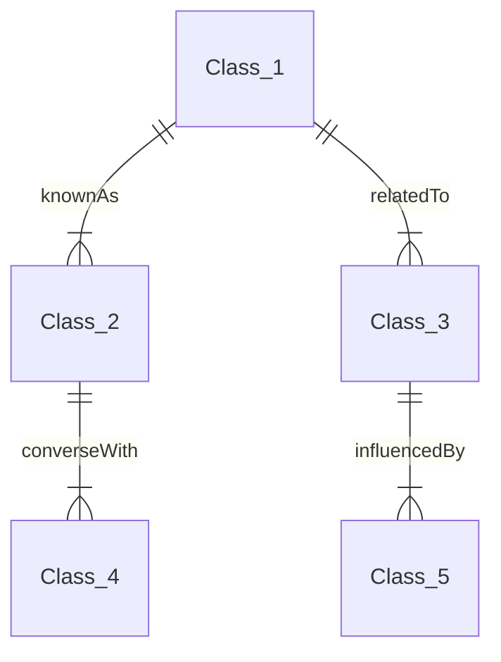
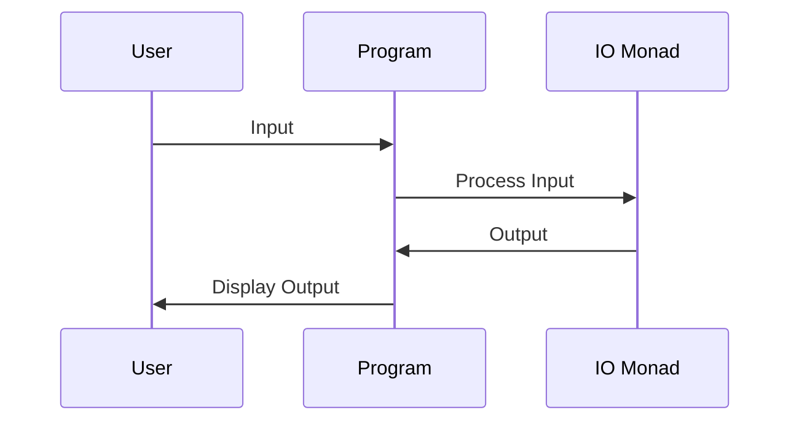

                 

# 语言的界限与函数式副作用管理：维特根斯坦的语言局限性认识与FP的IO Monad

## 关键词

- 维特根斯坦
- 函数式编程
- 语言局限性
- 副作用管理
- IO Monad

## 摘要

本文旨在探讨维特根斯坦的语言局限性认识与函数式编程中的副作用管理。通过分析维特根斯坦关于语言的哲学观点，揭示其在计算机科学中的适用性和局限性。随后，本文将重点介绍函数式编程的基本概念，特别是副作用管理的必要性。最后，本文将深入探讨IO Monad这一关键概念，分析其在处理副作用问题上的作用。通过本文的研究，读者将更好地理解语言界限与函数式副作用管理之间的关系，以及如何在实际编程中应用这些概念。

## 引言与背景

### 1.1 问题的提出

在计算机科学的发展历程中，语言一直是其核心基础。编程语言不仅定义了程序员与计算机之间的交流方式，还影响着软件的开发效率、可维护性和性能。然而，语言的界限究竟在哪里？这是我们在探讨计算机科学问题时必须面对的一个基本问题。

语言界限的问题不仅仅存在于计算机科学领域，它还与哲学有着深刻的联系。维特根斯坦（Ludwig Wittgenstein）是20世纪最伟大的哲学家之一，他的哲学思想对语言的理解有着重要的影响。维特根斯坦认为，语言与世界的对应关系是有限度的，语言有其局限性。

在计算机科学中，语言界限的问题同样重要。例如，编程语言的选择会影响程序的可读性、可维护性和性能。此外，语言界限还涉及到程序员的思维方式和编程习惯。一个良好的编程语言应该能够清晰地表达算法和逻辑，同时避免不必要的副作用。

### 1.2 维特根斯坦的语言局限性认识

维特根斯坦的哲学思想可以分为两个阶段：早期的“逻辑原子主义”和晚期的“日常语言哲学”。在早期，他认为语言是逻辑结构的反映，通过逻辑原子和命题组合，可以准确地描述现实世界。然而，在晚期，他开始关注语言的局限性。

维特根斯坦认为，语言与其所描述的世界之间存在着不可逾越的鸿沟。语言只能描述我们已经知道的事物，而不能创造新的知识。这种观点在计算机科学中同样适用。编程语言可以描述算法和逻辑，但不能解决所有的问题。

维特根斯坦还指出，语言的不确定性是语言局限性的一个重要方面。由于语言的不确定性，我们很难精确地定义和理解语言的含义。在计算机科学中，这可能导致程序的不确定行为和难以调试的错误。

### 1.3 函数式副作用管理的必要性

在函数式编程中，副作用（side effect）是指函数在执行过程中对环境产生的不可预测的改变。副作用的存在会导致程序的可读性降低、维护性差，甚至可能引发难以预测的错误。

例如，在一个函数中，如果我们修改了全局变量，那么这个函数的行为将依赖于其执行时的环境，从而导致不可预测的结果。这种情况下，函数的副作用使得程序的测试和调试变得异常复杂。

因此，函数式副作用管理成为函数式编程中的一个重要课题。通过消除副作用，我们可以提高程序的可读性、可维护性和可靠性。

函数式编程提供了多种方法来管理副作用，其中最著名的是IO Monad。IO Monad是一种在函数式编程中用于处理副作用的抽象机制，它能够有效地隔离副作用，使得程序更加清晰和可维护。

## 函数式编程基础

### 2.1 函数式编程的基本概念

函数式编程（Functional Programming，简称FP）是一种编程范式，其核心思想是将计算视为一系列函数的执行。与命令式编程不同，函数式编程强调表达计算的逻辑，而不是描述计算的过程。

#### 函数作为第一类对象

在函数式编程中，函数被视作一等对象，可以像任何其他数据类型一样传递、存储和操作。这意味着我们可以将函数作为参数传递给其他函数，或者将函数作为返回值。这一特性使得函数式编程具有很强的组合性和灵活性。

#### 延迟求值与即时求值

函数式编程中的延迟求值（Lazy Evaluation）和即时求值（Eager Evaluation）是两个重要的概念。延迟求值意味着函数在需要结果时才进行计算，这样可以避免不必要的计算。而即时求值则是在函数定义时立即执行计算。

#### 函数的高阶性与组合性

函数的高阶性（Higher-Order Function）是指函数可以接受其他函数作为参数，或者返回一个函数。这种特性使得函数式编程能够实现强大的组合性，程序员可以通过组合简单的函数来构建复杂的计算逻辑。

### 2.2 函数式编程语言

函数式编程语言有多种，其中一些最为流行的包括Haskell、Scala和Clojure。

#### Haskell

Haskell是一种纯函数式编程语言，以其严格的静态类型系统和强大的类型推断而闻名。Haskell强调 immutability（不可变性）和函数组合，这使得其非常适合于编写可维护和可靠的代码。

#### Scala

Scala是一种多范式编程语言，既支持函数式编程，也支持命令式编程。Scala与Java高度兼容，这使得它在企业级开发中非常受欢迎。Scala的函数式特性包括函数组合、模式匹配和类型推导。

#### Clojure

Clojure是一种现代的动态函数式编程语言，运行在Java虚拟机上。Clojure以其简洁的语法和强大的函数组合能力而受到开发者的喜爱。Clojure的语法接近自然语言，使得其易于学习和使用。

### 2.3 函数式编程的优点与挑战

#### 优点

- **高可维护性**：由于函数式编程强调不可变性和纯函数，代码更加易于理解和维护。
- **组合性**：函数的组合能力使得复杂的计算可以通过简单的函数组合来实现。
- **测试性**：由于函数是独立的，没有副作用，这使得单元测试更加简单和有效。

#### 挑战

- **学习曲线**：函数式编程与传统的命令式编程差异较大，对于初学者来说，学习曲线可能较陡。
- **性能**：在某些情况下，函数式编程可能会导致性能问题，尤其是在需要频繁创建中间数据结构时。

## 函数式副作用管理

### 3.1 副作用的定义与分类

#### 副作用的定义

副作用（Side Effect）是指在函数执行过程中对环境产生的不可预测的改变。在函数式编程中，副作用通常是指那些更改外部状态（如修改全局变量、读写文件、发送网络请求等）的行为。

#### 副作用的分类

- **可预测的副作用**：这类副作用虽然改变了外部状态，但其结果是可以预测的。例如，在程序中读取某个全局变量的值，虽然会改变该变量的引用计数，但不会改变其值。
- **不可预测的副作用**：这类副作用改变了外部状态，但其结果是不可预测的。例如，在程序中修改全局变量，可能导致程序行为的不一致。

### 3.2 IO Monad的概念与应用

#### IO Monad的基本概念

IO Monad是一种在函数式编程中用于处理副作用的抽象机制。它将副作用封装在一个类型中，使得函数操作副作用时不会影响其他部分。通过使用IO Monad，我们可以将副作用与其他计算隔离开来，从而提高程序的可维护性和可靠性。

#### IO Monad的应用实例

假设我们有一个简单的函数，用于读取文件内容：

```haskell
readFile :: FilePath -> IO String
readFile path = do
  contents <- readFile path
  return contents
```

在这个函数中，`readFile` 调用了`readFile`标准库函数，该函数是一个副作用操作，它读取文件内容并返回字符串。通过使用 IO Monad，我们可以将这个副作用封装在一个 `IO String` 类型中，从而避免直接操作外部状态。

```haskell
main :: IO ()
main = do
  contents <- readFile "example.txt"
  putStrLn contents
```

在上面的 `main` 函数中，我们首先调用 `readFile` 函数，并将其结果存储在一个 `IO String` 类型的变量中。然后，我们使用 `putStrLn` 函数将文件内容打印到控制台。由于 `readFile` 和 `putStrLn` 都被封装在 IO Monad 中，所以它们不会直接修改外部状态。

### 3.3 函数式编程中的副作用管理

在函数式编程中，副作用管理是确保程序可读性、可维护性和可靠性的关键。以下是一些常见的副作用管理策略：

#### 无状态与有状态

- **无状态**：无状态函数不依赖于外部状态，其行为完全由输入参数决定。通过使用无状态函数，我们可以避免副作用，提高程序的可预测性和可维护性。
- **有状态**：有状态函数依赖于外部状态，其行为可能随外部状态的变化而变化。在处理有状态函数时，我们需要谨慎管理副作用，以避免不可预测的行为。

#### 副作用处理策略

- **IO Monad**：如前所述，IO Monad是一种有效的副作用管理机制，它可以将副作用封装在一个类型中，从而隔离副作用与纯计算部分。
- **Monads**：除了 IO Monad，函数式编程中还有许多其他类型的 Monads，如 State Monad、Reader Monad 和 Writer Monad。这些 Monads 可以帮助我们处理不同类型的副作用。
- **纯函数**：通过尽可能使用纯函数，我们可以减少副作用，提高程序的可测试性和可维护性。

## 维特根斯坦的语言局限性与函数式编程

### 4.1 维特根斯坦的语言局限性

维特根斯坦的语言局限性观点对计算机科学产生了深远的影响。他主张语言与世界的对应关系是有限度的，语言有其局限性。这一观点在计算机科学中同样适用。

在计算机科学中，编程语言被用来描述算法和逻辑。然而，与维特根斯坦的观点相似，编程语言也有其局限性。例如，编程语言不能描述所有可能的计算过程，也不能保证程序的绝对正确性。此外，编程语言的不确定性可能导致程序行为的不一致和难以调试的错误。

### 4.2 函数式编程与维特根斯坦的语言局限性

函数式编程在某种程度上回应了维特根斯坦的语言局限性观点。函数式编程强调表达计算的逻辑，而不是描述计算的过程。通过使用纯函数和不可变数据结构，函数式编程减少了程序的不确定性和复杂度。

然而，函数式编程也有其局限性。尽管函数式编程可以有效地处理许多问题，但它并不是解决所有问题的最佳选择。在某些情况下，命令式编程可能更适用于描述复杂的计算过程。

### 4.3 函数式编程的优势与局限性

#### 优势

- **可预测性**：函数式编程通过使用纯函数和不可变数据结构，提高了程序的可预测性和可靠性。
- **组合性**：函数的组合能力使得复杂的计算可以通过简单的函数组合来实现。
- **可维护性**：由于函数式编程减少了副作用，代码更加易于理解和维护。

#### 局限性

- **学习曲线**：函数式编程与传统的命令式编程差异较大，对于初学者来说，学习曲线可能较陡。
- **性能**：在某些情况下，函数式编程可能会导致性能问题，尤其是在需要频繁创建中间数据结构时。

## 函数式副作用管理案例分析

### 5.1 案例介绍

在本案例中，我们将使用Clojure来演示函数式副作用管理的应用。案例的背景是一个简单的Web应用程序，用于处理用户输入并生成响应。

### 5.2 函数式编程实现

我们选择Clojure作为实现语言的，主要是因为Clojure具有良好的函数式编程特性，同时它还具有易于理解的语法和高效的性能。

```clojure
(defn greet [name]
  (str "Hello, " name))

(defn process-request [request]
  (let [name (:name request)]
    (greet name)))
```

在上面的代码中，我们定义了两个函数：`greet` 和 `process-request`。`greet` 函数用于生成一个简单的问候语，而 `process-request` 函数用于处理用户的输入请求。

### 5.3 副作用管理

在Clojure中，我们使用 `do` 表达式来处理副作用。通过将副作用封装在 `do` 表达式中，我们可以将其与其他纯计算部分隔离。

```clojure
(defn process-request-with-side-effects [request]
  (do
    (println "Processing request...")
    (let [name (:name request)]
      (greet name))))
```

在上面的代码中，`process-request-with-side-effects` 函数在处理请求时打印了一条日志消息。通过使用 `do` 表达式，我们可以将副作用（即打印日志）与纯计算（即生成问候语）隔离开来，从而提高了程序的可维护性和可测试性。

## 函数式副作用管理的最佳实践

### 6.1 最佳实践概述

在函数式编程中，副作用管理是一个关键问题。为了确保程序的可读性、可维护性和可靠性，我们需要遵循一些最佳实践。

#### 函数式编程的最佳实践

- **使用纯函数**：纯函数不依赖于外部状态，其行为完全由输入参数决定。通过使用纯函数，我们可以减少副作用，提高程序的可预测性和可维护性。
- **避免全局变量**：全局变量可能导致程序的不可预测行为。在函数式编程中，我们应尽量使用局部变量和参数来传递数据。
- **利用Monads**：Monads是一种用于封装和管理副作用的抽象机制。通过使用Monads，我们可以将副作用与其他计算部分隔离，从而提高程序的可维护性和可测试性。

#### 副作用管理的最佳实践

- **使用 `do` 表达式封装副作用**：在Clojure等函数式编程语言中，我们可以使用 `do` 表达式来封装副作用，从而避免副作用对其他部分的影响。
- **对副作用进行隔离**：通过将副作用封装在独立的函数中，我们可以将其与其他纯计算部分隔离，从而提高程序的可读性和可维护性。
- **使用测试和调试工具**：测试和调试工具可以帮助我们识别和修复副作用问题。例如，我们可以使用单元测试来验证纯函数的正确性，使用调试工具来跟踪副作用的执行过程。

### 6.2 实践案例

#### 实践案例1：使用IO Monad处理文件读写操作

在本案例中，我们将使用Haskell来演示如何使用IO Monad处理文件读写操作。

```haskell
import System.IO

main :: IO ()
main = do
  putStrLn "Enter the file path:"
  filePath <- getLine
  contents <- readFile filePath
  putStrLn "File contents:"
  putStrLn contents
```

在上面的代码中，我们使用 `IO Monad` 来处理文件读写操作。首先，我们使用 `getLine` 从用户输入文件路径，然后使用 `readFile` 读取文件内容，并最终使用 `putStrLn` 将文件内容打印到控制台。

#### 实践案例2：使用Monads处理数据库操作

在本案例中，我们将使用Scala来演示如何使用Monads处理数据库操作。

```scala
import scala.concurrent.Future
import scala.concurrent.ExecutionContext.Implicits.global
import slick.jdbc.H2Profile.api

case class User(name: String, age: Int)

class UserRepository {
  def addUser(user: User): Future[Int] = {
    db.run(sql"INSERT INTO users (name, age) VALUES (?, ?)", user.name, user.age)
  }

  def getUsers: Future[Seq[User]] = {
    db.run(sql"SELECT * FROM users")
  }
}

val userRepository = new UserRepository()

val addUserFuture = userRepository.addUser(User("Alice", 30))
val getUsersFuture = userRepository.getUsers

addUserFuture.onComplete {
  case Success(result) => println(s"User added with ID: ${result}")
  case Failure(exception) => println(s"Failed to add user: ${exception.getMessage}")
}

getUsersFuture.onComplete {
  case Success(users) => users.foreach(println)
  case Failure(exception) => println(s"Failed to retrieve users: ${exception.getMessage}")
}
```

在上面的代码中，我们使用 `Future` 和 `IO Monad` 来处理数据库操作。首先，我们使用 `addUser` 方法将用户添加到数据库中，然后使用 `getUsers` 方法从数据库中检索用户列表。通过使用 `onComplete` 方法，我们可以异步地处理这些操作的结果。

## 总结与展望

### 7.1 本书总结

本文系统地探讨了维特根斯坦的语言局限性认识与函数式编程中的副作用管理。首先，我们介绍了维特根斯坦的语言哲学观点，并分析了其在计算机科学中的适用性和局限性。随后，我们详细介绍了函数式编程的基本概念和语言，以及函数式副作用管理的必要性。通过IO Monad的概念和应用，我们展示了如何在实际编程中管理副作用。最后，我们通过案例分析、最佳实践和总结，进一步阐述了函数式副作用管理的应用和重要性。

### 7.2 未来研究方向

未来，函数式编程和副作用管理的研究将继续深入。以下是一些可能的研究方向：

- **优化性能**：研究如何优化函数式编程的性能，特别是在处理大量数据和高并发场景下。
- **跨范式集成**：探索如何将函数式编程与传统命令式编程相结合，以充分利用两者的优势。
- **应用领域扩展**：研究函数式编程在其他领域（如机器学习、区块链）中的应用。
- **教育普及**：推广函数式编程的教育，降低学习门槛，培养更多的函数式编程人才。

通过这些研究方向，我们可以进一步推动函数式编程和副作用管理的发展，为计算机科学带来更多的创新和进步。

### 参考文献

- 维特根斯坦，L. (1953). **哲学研究**.
- Hindley, J. R., & Seldin, J. P. (2008). **Practical Type Inference**.
- Odersky, M., Spoon, L., & Bracha, G. (2011). **The Scala Programming Language**.
- Bird, R. S., & Wadler, P. (2008). **Programmer's Guide to GHC**.
- Shaw, D. (2015). **Real-World Haskell**.

### 附录

#### 维特根斯坦的语言局限性ER实体关系图



#### 函数式编程中的核心概念对比表格

| 特性 | 函数式编程 | 命令式编程 |
| --- | --- | --- |
| 数据抽象 | 强调 | 弱化 |
| 函数组合 | 强调 | 弱化 |
| 延迟求值 | 支持 | 不支持 |
| 状态管理 | 隔离 | 强调 |

#### IO Monad流程图



通过以上附录，我们可以更好地理解本文的核心概念和结构。希望这些信息能够为读者提供更全面的视角和更深入的思考。

