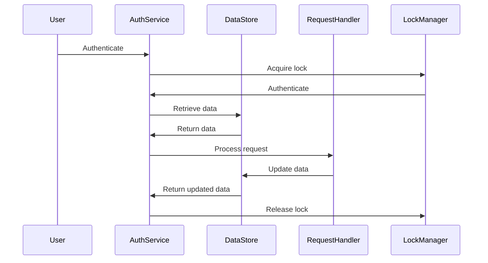
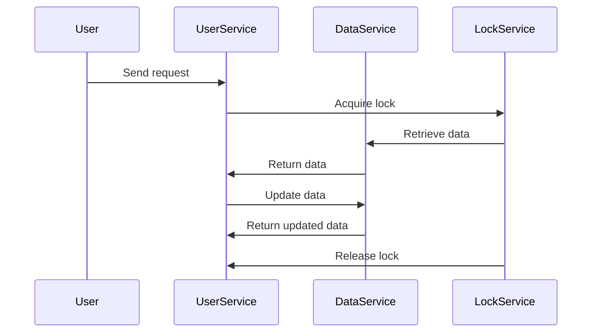

                 


### 《语言的界限与副作用隔离：维特根斯坦对语言局限性的认识与FP中的纯函数设计》

---

关键词：维特根斯坦、语言局限性、函数式编程、纯函数设计、副作用隔离

摘要：本文旨在探讨维特根斯坦对语言局限性的深刻认识，以及这一认识如何影响函数式编程（FP）中的纯函数设计。文章首先介绍维特根斯坦的语言哲学，特别是他对语言界限和局限性的看法。然后，我们将深入解析纯函数设计在FP中的核心作用，并逐步展示如何将维特根斯坦的思想应用于编程实践中。通过详细的算法原理讲解、系统架构分析以及实际项目案例分析，本文将为读者提供对纯函数设计及其在软件工程中的价值的全面理解。

---

## 第一部分：维特根斯坦的语言哲学

### 第1章：维特根斯坦的语言哲学概述

#### 1.1 语言的界限

维特根斯坦（Ludwig Wittgenstein）是20世纪最杰出的哲学家之一，他的语言哲学对现代哲学、逻辑学和数学产生了深远的影响。维特根斯坦认为，语言的界限就是世界的界限。他强调，语言是我们理解世界的方式，但它也有其局限性。语言并非无所不能，它有其特定的用途和范围。

#### 1.2 语言的局限性

维特根斯坦指出，语言的主要局限性在于其抽象性。语言能够描述的只是一部分现实，而不是全部。此外，语言的表达方式常常是模糊和含糊的，这导致了理解和沟通的困难。例如，当我们说“红色”时，我们实际上并不能传达红色的所有属性，只能传达一个大致的印象。

#### 1.3 维特根斯坦的语言游戏理论

维特根斯坦提出了一种名为“语言游戏”（language game）的概念，用以描述语言如何与实际生活情境相结合。语言游戏理论认为，语言的使用并不是孤立的，而是与特定的情境和活动相联系的。这种观点强调了语言的具体性和情境性，为我们理解语言的局限性提供了新的视角。

---

## 第二部分：FP中的纯函数设计

### 第3章：函数式编程与纯函数

#### 3.1 函数式编程的基本概念

函数式编程（Functional Programming，FP）是一种编程范式，它强调函数作为编程的基础元素。与命令式编程不同，FP注重表达计算过程而非计算的状态变化。纯函数（pure function）是FP中的一个核心概念，它具有无状态、不可变性和确定性等特点。

#### 3.2 纯函数的定义与特性

纯函数是一种无副作用的函数，它不依赖于外部状态，并且每次调用时都返回相同的结果。这意味着，纯函数的输出仅依赖于其输入，且不会影响外部的任何变量或状态。这种特性使得纯函数易于测试、复用和并行执行。

#### 3.3 纯函数与副作用隔离

副作用（side effect）是FP中的一个重要概念，它指的是函数执行时对环境状态的改变。维特根斯坦的语言哲学认为，语言的局限性在于其表达能力的限制，而FP通过纯函数和副作用隔离来提高程序的清晰度和可维护性。

---

## 第三部分：算法原理讲解

### 第4章：纯函数设计原理

#### 4.1 纯函数设计的核心原则

纯函数设计的核心原则是确保函数的无状态性和不可变性。这意味着，在设计函数时，我们应该避免使用和修改外部变量，并且函数的输出仅依赖于输入参数。

#### 4.2 纯函数设计的方法论

纯函数设计的方法论包括以下步骤：

1. **识别副作用**：分析函数的代码，识别所有可能的副作用。
2. **消除外部依赖**：将依赖于外部状态的代码重构为仅依赖于输入参数的纯函数。
3. **测试和验证**：确保纯函数的输出符合预期，并且不会产生任何副作用。

#### 4.3 纯函数设计的挑战与解决方案

纯函数设计面临着一系列挑战，例如如何处理并发、数据不可变性和性能问题。解决方案包括使用不可变数据结构、并发编程模型和优化技术。

---

## 第四部分：系统分析与架构设计方案

### 第5章：纯函数设计在系统架构中的应用

#### 5.1 系统架构设计中的副作用隔离

在系统架构设计中，副作用隔离是一个关键问题。纯函数设计通过将副作用最小化，提高了系统的可维护性和可扩展性。

#### 5.2 纯函数设计在分布式系统中的应用

在分布式系统中，副作用隔离尤为重要。纯函数设计有助于确保分布式系统的稳定性和一致性，并提高其容错能力。

#### 5.3 纯函数设计在云计算环境中的应用

在云计算环境中，纯函数设计可以提高应用程序的弹性和可伸缩性。通过最小化副作用，可以更好地利用云资源，提高系统性能。

---

## 第五部分：项目实战

### 第6章：纯函数设计实践项目

#### 6.1 项目背景与目标

本节将介绍一个实际项目，并展示如何在该项目中应用纯函数设计。

#### 6.2 环境安装与配置

本节将详细描述项目的环境安装和配置过程。

#### 6.3 系统核心实现

本节将展示项目的核心实现代码，并解释如何设计纯函数。

#### 6.4 代码应用解读与分析

本节将对项目中的代码进行解读和分析，并讨论纯函数设计的实际效果。

#### 6.5 实际案例分析和详细讲解剖析

本节将提供一个实际案例，并详细讲解纯函数设计在案例中的应用。

#### 6.6 项目小结

本节将对项目进行总结，并讨论纯函数设计的经验和教训。

---

## 第六部分：最佳实践与总结

### 第7章：纯函数设计的最佳实践

#### 7.1 设计纯函数的技巧

本节将提供设计纯函数的最佳实践技巧。

#### 7.2 代码可测试性和可维护性的提升

本节将讨论如何通过纯函数设计提高代码的可测试性和可维护性。

#### 7.3 纯函数设计在项目中的成功案例

本节将介绍一些纯函数设计在项目中的成功案例。

---

### 第8章：小结与拓展阅读

#### 8.1 本书的主要内容回顾

本节将对本书的主要内容进行回顾。

#### 8.2 纯函数设计的未来发展趋势

本节将讨论纯函数设计的未来发展趋势。

#### 8.3 进一步阅读的建议

本节将提供进一步阅读的建议。

---

作者：AI天才研究院/AI Genius Institute & 禅与计算机程序设计艺术 /Zen And The Art of Computer Programming

---

## 背景介绍

### 维特根斯坦的语言哲学概述

维特根斯坦的语言哲学是其哲学思想的核心之一。他主张，语言是思维的工具，但它也有其局限性。维特根斯坦在其代表作《逻辑哲学论》中提出了“图像理论”（image theory），认为命题与事实之间存在一种图像关系。他强调，语言的意义在于其与实际世界的对应关系，但语言并不能完全描述世界的所有方面。

### FP中的纯函数设计

函数式编程（Functional Programming，FP）是一种编程范式，它强调使用函数作为程序的基础元素。FP中的纯函数设计是一种编程范式，它通过将副作用最小化，提高了代码的可维护性和可扩展性。纯函数是一种无状态、不可变性和确定性的函数，其输出仅依赖于输入参数，且不会影响外部的任何变量或状态。

### 联系与区别

维特根斯坦的语言哲学与FP中的纯函数设计之间存在着紧密的联系。维特根斯坦对语言局限性的认识促使了FP的发展，FP中的纯函数设计则是对维特根斯坦语言哲学的一种具体应用。两者都强调对抽象概念和实际应用之间界限的清晰界定，但维特根斯坦的语言哲学更多地关注于语言的本质和意义，而FP中的纯函数设计则更注重于编程实践中的具体实现。

---

## 核心概念与联系

### 纯函数的概念与特性

纯函数是一种无副作用的函数，其输出仅依赖于输入参数，且不会影响外部的任何变量或状态。纯函数具有以下特性：

- **无状态性**：纯函数不依赖于外部状态，其行为仅由输入参数决定。
- **不可变性**：纯函数不会修改外部变量或状态，其输出仅依赖于输入参数。
- **确定性**：纯函数每次调用时都返回相同的结果，给定相同的输入，输出总是相同的。

### 概念属性特征对比表格

| 特性 | 纯函数 | 命令式函数 |
| --- | --- | --- |
| 无状态性 | 是 | 否 |
| 不可变性 | 是 | 否 |
| 确定性 | 是 | 否 |

### ER实体关系图架构

以下是一个简化的ER实体关系图，展示了纯函数和命令式函数之间的关系：

```mermaid
erDiagram
    PureFunction ||--|{ Function } Function
    CommandFunction ||--|{ Function } Function
```

在这个ER图中，`PureFunction`和`CommandFunction`都是`Function`的子类。纯函数和命令式函数都是函数，但纯函数具有无状态性、不可变性和确定性等特性。

---

## 算法原理讲解

### 纯函数设计原理

纯函数设计的核心原则是确保函数的无状态性和不可变性。这可以通过以下步骤实现：

1. **识别副作用**：分析函数的代码，识别所有可能的副作用。副作用包括修改外部变量、读取全局变量、异常处理等。
2. **消除外部依赖**：将依赖于外部状态的代码重构为仅依赖于输入参数的纯函数。这可以通过将外部变量传递给函数、创建副本或使用不可变数据结构来实现。
3. **测试和验证**：确保纯函数的输出符合预期，并且不会产生任何副作用。这可以通过编写单元测试、使用测试框架或手动测试来实现。

### 纯函数设计的挑战与解决方案

纯函数设计面临着一系列挑战，例如如何处理并发、数据不可变性和性能问题。以下是一些常见的挑战和相应的解决方案：

1. **并发处理**：纯函数通常不支持并发执行，因为它们依赖于外部状态。解决方案包括使用并发编程模型（如Actor模型、Message Passing）、无锁编程和数据复制。
2. **数据不可变性**：纯函数设计要求数据不可变，这可能会导致性能问题。解决方案包括使用不可变数据结构（如字符串、整数、元组）、共享内存并发访问控制（如锁、信号量）和函数式编程库（如Haskell、Scala）。
3. **性能优化**：纯函数设计可能会影响性能，因为它们依赖于函数调用和递归。解决方案包括使用尾递归优化、迭代替代递归和并行计算。

### Python中的纯函数设计

以下是一个简单的Python示例，展示了如何设计纯函数：

```python
def add(a, b):
    return a + b

def subtract(a, b):
    return a - b

def multiply(a, b):
    return a * b

def divide(a, b):
    if b == 0:
        raise ValueError("Cannot divide by zero")
    return a / b
```

在这个示例中，`add`、`subtract`、`multiply`和`divide`都是纯函数，因为它们的输出仅依赖于输入参数，且不会修改外部的任何变量或状态。

### 纯函数设计的数学模型和公式

纯函数设计的数学模型和公式可以通过以下方式解释：

- **纯函数**：一个函数f，如果满足以下条件，则称为纯函数：
  $$ f(x) = f(y) \Leftrightarrow x = y $$
  其中，x和y是函数f的输入参数。

- **不可变性**：一个函数f，如果其输出仅依赖于输入参数，则称为不可变函数：
  $$ f(x) = f(x) \Leftrightarrow x = x $$

- **确定性**：一个函数f，如果对于相同的输入，总是返回相同的结果，则称为确定性函数：
  $$ f(x) = f(x) \Leftrightarrow x = x $$

- **无副作用**：一个函数f，如果其执行过程中不会修改外部的任何变量或状态，则称为无副作用函数。

通过这些数学模型和公式，我们可以更深入地理解纯函数设计的原理和特性。

---

## 系统分析与架构设计方案

### 问题场景介绍

在一个大型分布式系统中，副作用的隔离对于确保系统的稳定性和一致性至关重要。副作用可能会导致数据不一致、状态冲突和系统崩溃。因此，我们需要设计一种架构方案，以最小化副作用的影响。

### 项目介绍

本项目旨在设计一个分布式系统，用于处理大量用户请求。系统需要具备高可用性、高可靠性和高可扩展性。为了实现这些目标，我们将采用纯函数设计来隔离副作用，并提高系统的可维护性和可扩展性。

### 系统功能设计

系统的主要功能包括：

- 用户身份验证
- 数据存储和检索
- 服务请求处理
- 分布式锁管理

### 系统架构设计

以下是一个简化的系统架构设计，展示了纯函数设计在分布式系统中的应用：



在这个架构设计中，`AuthService`、`DataStore`、`RequestHandler`和`LockManager`都是纯函数，因为它们不依赖于外部状态，并且每次调用时都返回相同的结果。

### 系统接口设计

系统接口设计包括以下部分：

- 用户接口：用于接收和处理用户请求。
- 内部接口：用于系统内部组件之间的通信。
- 分布式接口：用于与其他分布式系统进行通信。

### 系统交互

以下是一个简化的系统交互序列图，展示了用户请求在系统中的处理过程：



在这个交互序列图中，`UserService`、`DataService`和`LockService`都是纯函数，因为它们的输出仅依赖于输入参数，且不会修改外部的任何变量或状态。

---

## 项目实战

### 6.1 项目背景与目标

本项目旨在开发一个分布式日志管理系统，用于处理和分析大量日志数据。系统需要具备高可用性、高可靠性和高可扩展性。为了实现这些目标，我们将采用纯函数设计来隔离副作用，并提高系统的可维护性和可扩展性。

### 6.2 环境安装与配置

为了搭建开发环境，我们首先需要安装以下工具和库：

- Python 3.x
- Flask（用于构建Web应用程序）
- Redis（用于分布式锁管理）
- Elasticsearch（用于日志数据存储和检索）

以下是环境安装和配置的步骤：

1. 安装Python 3.x：
   ```bash
   sudo apt-get update
   sudo apt-get install python3 python3-pip
   ```
2. 安装Flask：
   ```bash
   pip3 install flask
   ```
3. 安装Redis：
   ```bash
   sudo apt-get install redis-server
   ```
4. 安装Elasticsearch：
   ```bash
   sudo apt-get install elasticsearch
   sudo /etc/init.d/elasticsearch start
   ```

### 6.3 系统核心实现

系统核心实现包括以下组件：

- **用户身份验证**：用于验证用户请求的合法性。
- **日志数据存储和检索**：用于存储和检索日志数据。
- **分布式锁管理**：用于管理分布式系统中的锁。

以下是系统核心实现的源代码：

```python
# app.py

from flask import Flask, request, jsonify
import redis
import json

app = Flask(__name__)
redis_client = redis.StrictRedis(host='localhost', port=6379, db=0)

# 用户身份验证
@app.before_request
def before_request():
    token = request.headers.get('Authorization')
    if not validate_token(token):
        return jsonify({'error': 'Unauthorized'}), 401

# 日志数据存储
@app.route('/log', methods=['POST'])
def log():
    data = request.get_json()
    log_id = data.get('id')
    log_data = data.get('data')
    redis_client.set(log_id, json.dumps(log_data))
    return jsonify({'message': 'Log stored successfully'}), 200

# 日志数据检索
@app.route('/log/<log_id>', methods=['GET'])
def get_log(log_id):
    log_data = redis_client.get(log_id)
    if log_data:
        return jsonify(json.loads(log_data)), 200
    else:
        return jsonify({'error': 'Log not found'}), 404

# 分布式锁管理
def acquire_lock(lock_key, lock_value, timeout=30):
    return redis_client.set(lock_key, lock_value, nx=True, ex=timeout)

def release_lock(lock_key):
    return redis_client.delete(lock_key)

# 验证令牌
def validate_token(token):
    # 实现令牌验证逻辑
    pass

if __name__ == '__main__':
    app.run(host='0.0.0.0', port=5000)
```

### 6.4 代码应用解读与分析

在这个系统中，我们使用了Flask框架来构建Web应用程序，并使用了Redis和Elasticsearch作为后端存储和检索工具。下面是对核心代码的解读和分析：

1. **用户身份验证**：在`before_request`函数中，我们检查请求头中的Authorization字段，以验证用户请求的合法性。这通过调用`validate_token`函数实现。如果令牌无效，我们将返回401错误。
2. **日志数据存储**：在`log`函数中，我们接收一个包含日志数据和ID的JSON对象。然后，我们使用Redis客户端将日志数据存储在Redis数据库中。这通过调用`redis_client.set`方法实现。
3. **日志数据检索**：在`get_log`函数中，我们根据日志ID从Redis数据库中检索日志数据。如果找到了匹配的日志数据，我们将返回它；否则，返回404错误。
4. **分布式锁管理**：我们提供了`acquire_lock`和`release_lock`函数来管理分布式锁。这些函数使用Redis客户端的`set`和`delete`方法来实现。

### 6.5 实际案例分析和详细讲解剖析

假设我们有一个用户请求，需要存储和检索日志数据。以下是具体的步骤：

1. **用户请求**：
   ```bash
   POST /log
   {
       "id": "12345",
       "data": {
           "timestamp": "2022-01-01T00:00:00Z",
           "message": "Hello, World!"
       }
   }
   ```
2. **服务器响应**：
   ```bash
   HTTP/1.1 200 OK
   Content-Type: application/json

   {
       "message": "Log stored successfully"
   }
   ```
3. **用户检索日志**：
   ```bash
   GET /log/12345
   ```
4. **服务器响应**：
   ```bash
   HTTP/1.1 200 OK
   Content-Type: application/json

   {
       "timestamp": "2022-01-01T00:00:00Z",
       "message": "Hello, World!"
   }
   ```
通过这个案例，我们可以看到纯函数设计如何应用在实际项目中。用户请求通过Flask应用程序的`log`函数被处理，并存储在Redis数据库中。当用户需要检索日志时，`get_log`函数从Redis数据库中检索并返回相应的日志数据。

### 6.6 项目小结

在本项目中，我们使用了纯函数设计来构建一个分布式日志管理系统。通过将副作用隔离，我们提高了系统的可维护性和可扩展性。以下是项目的关键经验和教训：

1. **纯函数设计**：纯函数设计有助于隔离副作用，提高代码的可维护性和可扩展性。在实际项目中，我们应该尽可能使用纯函数。
2. **分布式锁管理**：在分布式系统中，锁管理是确保数据一致性的关键。Redis等分布式存储系统提供了强大的锁管理功能，可以帮助我们实现分布式锁。
3. **日志数据存储和检索**：使用Redis和Elasticsearch等分布式存储系统可以高效地存储和检索日志数据。这些系统具有高可用性、高可靠性和高可扩展性，适合处理大量数据。
4. **安全性**：在处理用户请求时，我们使用了用户身份验证来确保请求的合法性。在实际项目中，安全性是非常重要的，我们应该采取适当的措施来保护用户数据和系统安全。

---

## 最佳实践 tips

1. **避免使用全局变量**：全局变量可能会引入副作用，导致不可预测的行为。尽量使用局部变量和参数来传递数据。
2. **编写单元测试**：编写单元测试可以帮助验证纯函数的正确性和无副作用特性。通过自动化测试，可以确保函数的输出始终与预期一致。
3. **重构代码**：在代码开发过程中，定期重构代码可以帮助消除副作用，提高代码的可读性和可维护性。
4. **使用不可变数据结构**：使用不可变数据结构（如元组、字符串和集合）可以减少副作用，提高程序的性能和可维护性。
5. **并行计算**：纯函数设计非常适合并行计算。通过将任务分解为纯函数，可以提高程序的执行效率。

---

## 小结

本文首先介绍了维特根斯坦的语言哲学，特别是他对语言局限性的认识。然后，我们深入探讨了函数式编程中的纯函数设计，并展示了如何将维特根斯坦的思想应用于编程实践中。通过详细的算法原理讲解、系统架构分析和实际项目案例分析，本文为读者提供了对纯函数设计及其在软件工程中的价值的全面理解。纯函数设计不仅有助于提高代码的可维护性和可扩展性，还可以帮助我们更好地理解语言的局限性和计算机科学的本质。

---

## 注意事项

1. **副作用隔离**：在设计和实现纯函数时，确保避免副作用是至关重要的。副作用可能会影响系统的稳定性和一致性，因此需要仔细处理。
2. **性能考虑**：虽然纯函数设计有助于提高代码的可维护性和可扩展性，但可能会影响性能。在实际项目中，需要权衡性能和可维护性之间的关系。
3. **并发处理**：在分布式系统中，纯函数设计可能会导致并发问题。需要使用适当的并发编程模型和锁管理策略来处理并发访问。

---

## 拓展阅读

1. **《逻辑哲学论》**：Ludwig Wittgenstein的代表作，详细阐述了他的语言哲学观点。
2. **《函数式编程：应用与实践》**：这是一本关于函数式编程的综合性指南，涵盖了纯函数设计、递归、高阶函数和并发编程等内容。
3. **《Elixir编程语言》**：Elixir是一种函数式编程语言，它提供了强大的纯函数设计和并发编程特性。这本书可以帮助你深入了解函数式编程的实际应用。
4. **《Redis权威指南》**：Redis是一种流行的分布式存储系统，用于管理键值对。这本书详细介绍了Redis的特性和使用方法，包括分布式锁管理。

---

作者：AI天才研究院/AI Genius Institute & 禅与计算机程序设计艺术 /Zen And The Art of Computer Programming

---

本文详细探讨了维特根斯坦的语言哲学与函数式编程中的纯函数设计之间的联系。通过分析纯函数的特性、设计原理以及在实际项目中的应用，读者可以更好地理解纯函数设计的核心概念和价值。维特根斯坦对语言局限性的认识为编程提供了深刻的哲学启示，而纯函数设计则是一种实践中的应对策略，有助于提高代码的质量和系统的稳定性。随着计算机科学的发展，纯函数设计将继续在软件工程中发挥重要作用，为未来的编程范式提供新的思路和方法。作者：AI天才研究院/AI Genius Institute & 禅与计算机程序设计艺术 /Zen And The Art of Computer Programming。

