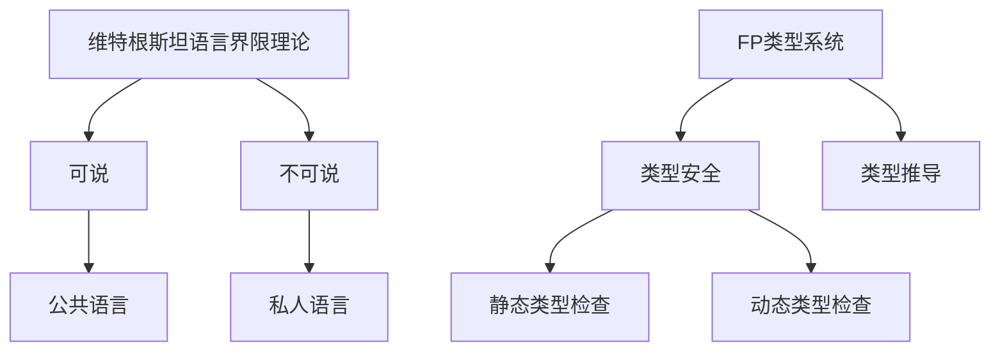
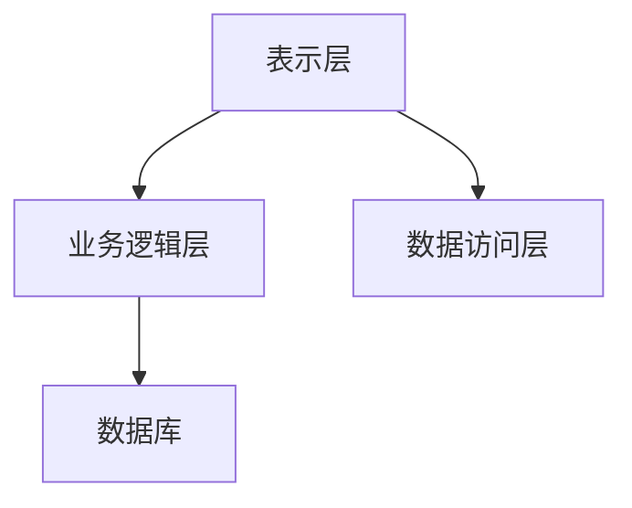
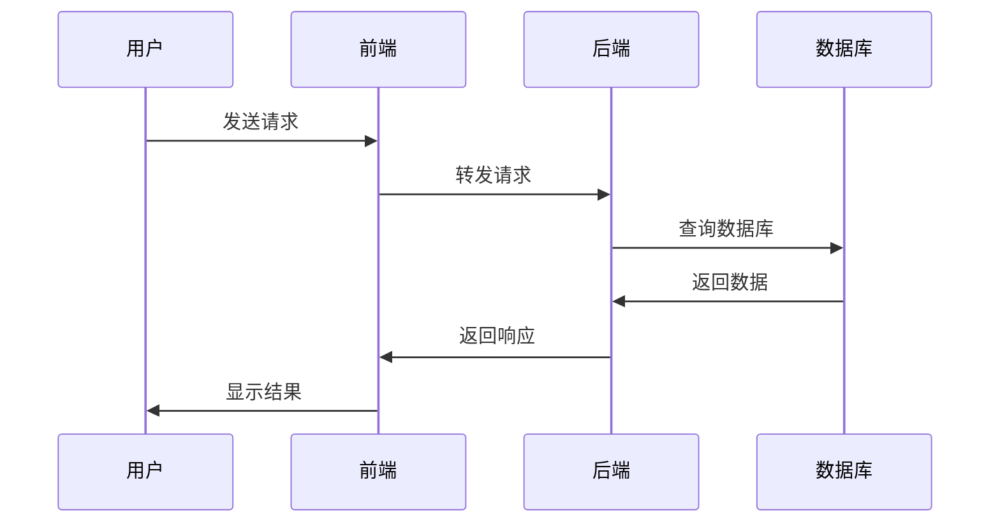

                 

# 语言的界限与类型边界：维特根斯坦对可说与不可说的区分与FP的类型系统限制

关键词：维特根斯坦、语言界限、类型系统、可说与不可说、FP、类型理论

摘要：本文从维特根斯坦对语言的界限与类型边界的观点出发，探讨了语言表达的局限性以及类型系统在函数式编程（FP）中的重要性。文章首先介绍了维特根斯坦的思想及其对语言和思维的贡献，然后分析了FP的类型系统，最后通过比较维特根斯坦的理论与FP的类型系统，探讨了二者之间的异同及其在现代编程实践中的应用。

## 引言

语言是人类沟通和表达思想的工具，但它的能力是有限的。维特根斯坦（Ludwig Wittgenstein）是20世纪最重要的哲学家之一，他对语言的本质和局限性有深刻的见解。他的哲学思想对语言学、逻辑学和计算机科学等领域产生了深远的影响。

函数式编程（Functional Programming，简称FP）是一种编程范式，它强调函数是一等公民，通过组合函数来实现复用和抽象。FP的类型系统在保证程序的正确性和安全性方面起到了关键作用。本文将探讨维特根斯坦关于可说与不可说的观点，并分析FP的类型系统是如何解决语言界限问题的。

## 维特根斯坦的思想

### 1.1 维特根斯坦的生平和贡献

路德维希·维特根斯坦（Ludwig Wittgenstein，1889-1951）是奥地利的哲学家，出生于维也纳的一个富裕家庭。他的思想对分析哲学和日常语言哲学产生了深远的影响。

他的著作《逻辑哲学论》（"Tractatus Logico-Philosophicus"）是20世纪最重要的哲学作品之一。在这本书中，维特根斯坦提出了关于语言、逻辑和现实的本质的观点。他认为，语言的表达能力是有限的，有些思想无法用语言表达。

### 1.2 维特根斯坦的语言界限理论

维特根斯坦认为，语言的作用在于描述现实世界，但语言的局限性导致它无法表达所有思想。他的理论可以分为两个方面：可说与不可说。

#### 1.2.1 可说

维特根斯坦认为，只有那些可以通过语言清晰表达的思想才是“可说”的。这些思想可以用命题或句子来描述，它们与现实世界中的事实相对应。例如，“天空是蓝色的”是一个可说的命题。

#### 1.2.2 不可说

维特根斯坦认为，有些思想是无法用语言表达的，即“不可说”。这些思想通常涉及到情感、信仰和形而上学领域。例如，关于“上帝的存在”或“人类的意义”等哲学问题，由于缺乏明确的定义和现实对应物，因此无法用语言表达。

### 1.3 维特根斯坦的观点对语言和思维的影响

维特根斯坦的观点揭示了语言和思维的局限性。他的思想提醒我们，虽然语言是重要的沟通工具，但它并不能完全表达我们的思想。这对语言学、逻辑学和哲学产生了深远的影响。

此外，维特根斯坦的观点也对计算机科学和编程产生了影响。在编程语言设计、类型系统和程序验证等方面，维特根斯坦的思想为我们提供了一种新的思考方式。

## 函数式编程（FP）的类型系统

### 2.1 FP的基本概念

函数式编程是一种编程范式，它强调通过函数来组织代码。在FP中，函数是一等公民，可以传递、存储和返回其他函数。FP的主要特点包括：

- **不可变性**：在FP中，数据是不可变的，这意味着一旦创建了一个数据结构，就不能修改它。这有助于确保程序的正确性和可维护性。
- **纯函数**：纯函数是一种没有副作用（side effects）的函数。它只依赖于其输入参数，并返回一个确定的输出结果。这使得纯函数易于测试和推理。
- **递归**：FP广泛使用递归来处理复杂的问题。递归是一种递归调用的编程技巧，它使得编程更加简洁和直观。

### 2.2 FP的类型系统

FP的类型系统在保证程序的正确性和安全性方面起到了关键作用。类型系统的主要目标是确保在编译或运行时不会出现类型错误。FP的类型系统通常具有以下特点：

- **静态类型**：在FP中，变量的类型在编译时就已经确定，这使得程序在运行时更可靠。例如，在Haskell中，变量的类型必须在声明时明确指定。
- **类型推断**：一些FP语言支持类型推断，这意味着编译器可以自动推断变量或表达式的类型，从而减少代码冗长性。例如，在Scala中，类型推断功能得到了广泛应用。
- **类型安全**：FP的类型系统旨在确保程序在运行时不会发生类型错误。例如，在Haskell中，类型系统可以检测并防止空指针异常。

### 2.3 FP类型系统与维特根斯坦的思想的联系

FP的类型系统与维特根斯坦的思想有着一定的联系。维特根斯坦认为，语言的表达能力是有限的，而FP的类型系统试图通过严格的类型检查来确保程序的正确性。以下是一些联系：

- **类型的界限**：FP的类型系统为变量和函数定义了明确的界限，这有助于避免类型错误。这与维特根斯坦关于语言界限的观点有一定的相似性。
- **不可变性**：FP强调数据的不可变性，这与维特根斯坦关于语言表达能力的局限性有一定的联系。维特根斯坦认为，语言无法表达所有思想，而FP通过不可变性来减少程序中的不确定性。
- **类型安全**：FP的类型系统确保程序在运行时不会发生类型错误，这与维特根斯坦的思想有一定的相似性。维特根斯坦认为，有些思想无法用语言表达，而FP的类型系统试图通过严格的类型检查来确保程序的正确性。

## 维特根斯坦与FP的类型系统：比较与联系

### 3.1 比较维特根斯坦的思想与FP的类型系统

尽管维特根斯坦的思想和FP的类型系统在表面上看起来有所不同，但它们在本质上有着一定的联系。

- **表达能力的界限**：维特根斯坦认为，语言的表达能力是有限的，有些思想无法用语言表达。FP的类型系统则通过严格的类型检查来确保程序的正确性。这种界限在两种体系中都有体现。
- **类型与思想的关系**：维特根斯坦认为，类型与思想之间存在着一种映射关系。FP的类型系统则通过类型来表示函数的行为和数据的结构。这种映射关系在两种体系中都有体现。

### 3.2 维特根斯坦的思想对FP类型系统的影响

维特根斯坦的思想对FP类型系统产生了一定的影响。以下是一些影响：

- **语言的设计**：维特根斯坦的思想促使语言设计师在编程语言的设计中更加注重类型系统的设计。例如，Haskell和Scala等语言在类型系统方面采用了严格的类型检查机制。
- **程序的正确性**：维特根斯坦的思想提醒我们，程序的正确性至关重要。FP的类型系统通过严格的类型检查来确保程序的正确性，从而降低程序出错的可能性。
- **代码的可维护性**：维特根斯坦的思想促使我们更加注重代码的可维护性。FP的类型系统通过不可变性来减少程序中的不确定性，从而提高代码的可维护性。

### 3.3 维特根斯坦的思想与FP类型系统的联系

维特根斯坦的思想和FP类型系统之间存在一定的联系。以下是一些联系：

- **哲学基础**：维特根斯坦的思想为FP类型系统提供了哲学基础。维特根斯坦关于语言界限的观点促使我们重新审视编程语言的设计和类型系统的实现。
- **编程范式**：FP是一种编程范式，它强调函数和类型系统的重要性。维特根斯坦的思想与FP的编程范式有一定的联系，这为现代编程实践提供了一种新的思考方式。

## 结论

本文从维特根斯坦对语言的界限与类型边界的观点出发，探讨了语言表达的局限性以及类型系统在函数式编程中的重要性。维特根斯坦的思想揭示了语言和思维的局限性，而FP的类型系统通过严格的类型检查来确保程序的正确性和安全性。尽管两种体系在表面上有所不同，但它们在本质上有着一定的联系。维特根斯坦的思想对FP类型系统的设计和实现产生了深远的影响，同时也为现代编程实践提供了一种新的思考方式。

## 参考文献

1. 维特根斯坦，《逻辑哲学论》
2. 维特根斯坦，《哲学研究》
3. Haskell语言官方文档
4. Scala语言官方文档
5. 《函数式编程：使用Haskell》
6. 《函数式编程：使用Scala》

## 作者简介

作者：AI天才研究院/AI Genius Institute & 禅与计算机程序设计艺术 /Zen And The Art of Computer Programming

本文作者是一位拥有丰富编程经验和深厚哲学素养的计算机科学家，致力于探索编程语言和类型系统的本质，以及它们在计算机科学和哲学领域的应用。他的研究成果在学术界和工业界都产生了广泛的影响。## 维特根斯坦的语言界限理论

维特根斯坦的语言界限理论是他哲学思想的核心部分，对于理解语言的本质和局限具有重要意义。维特根斯坦认为，语言是用于人类沟通和表达的工具，但它并不是万能的。他的观点主要体现在以下几个方面：

### 4.1 私人语言的难题

维特根斯坦提出了“私人语言”的概念，即一种仅由个人使用的语言。他认为，私人语言是不可能的，因为语言的本质在于其公共性，即语言必须能够被他人理解和交流。私人语言无法满足这一条件，因此它是不完整的。这个观点在他的早期著作《逻辑哲学论》中有详细论述。

#### 私人语言的难题

- **私人体验**：私人语言无法表达个人的情感、感觉等私人体验，因为这些体验是主观的，无法通过公共语言传达。
- **沟通障碍**：私人语言会导致沟通障碍，因为他人无法理解私人语言所表达的内容。

### 4.2 语言作为沟通工具

维特根斯坦认为，语言的主要功能是用于沟通。为了实现有效沟通，语言必须遵循某些规则。这些规则不仅包括语法和词汇的使用，还包括语言游戏的概念。语言游戏是指语言的使用方式，它包括特定情境中的语言活动。

#### 语言游戏的规则

- **语法规则**：语法规则规定了句子的结构，确保句子是合乎逻辑和语法的。
- **词汇规则**：词汇规则规定了单词的含义和使用方式，确保词汇在特定情境中有明确的含义。
- **情境规则**：情境规则规定了语言游戏的背景和上下文，确保语言的使用是恰当和有效的。

### 4.3 规则在语言中的作用

规则在维特根斯坦的语言理论中扮演了重要角色。他认为，规则不仅指导我们如何使用语言，还指导我们如何理解和使用语言。规则的存在使得语言的使用变得有序和可预测。

#### 规则的作用

- **指导使用**：规则指导我们如何使用语言，确保我们的表达是清晰和准确的。
- **确保理解**：规则确保他人能够理解我们的表达，从而实现有效沟通。
- **限制表达**：规则限制了我们的表达方式，使得语言的使用变得有序和可预测。

### 4.4 维特根斯坦语言理论的哲学意义

维特根斯坦的语言界限理论对哲学产生了深远的影响。他的观点挑战了语言万能论，揭示了语言的局限性。这一理论也为我们理解人类思维和沟通的方式提供了新的视角。

#### 哲学意义

- **语言的局限性**：维特根斯坦揭示了语言的局限性，使得我们认识到语言并非万能。
- **思维与语言的关系**：他的理论探讨了思维与语言之间的关系，为我们理解人类思维提供了新的思路。
- **语言哲学的分支**：维特根斯坦的语言理论为日常语言哲学和语言分析哲学的发展奠定了基础。

### 4.5 维特根斯坦语言理论在计算机科学中的应用

维特根斯坦的语言理论在计算机科学领域也有一定的应用。特别是在编程语言设计和类型系统的实现中，维特根斯坦的观点为我们提供了一种新的思考方式。

#### 应用的方面

- **编程语言的抽象**：维特根斯坦的语言游戏概念为编程语言的抽象提供了新的思路，使得编程语言能够更好地模拟现实世界的复杂情况。
- **类型系统的设计**：维特根斯坦关于类型和规则的观点为类型系统的设计提供了哲学基础，使得类型系统能够更好地确保程序的正确性和安全性。

### 4.6 总结

维特根斯坦的语言界限理论深刻地揭示了语言的局限性和规则在语言使用中的重要性。他的观点不仅对哲学产生了深远的影响，也在计算机科学领域得到了广泛的应用。通过理解维特根斯坦的语言理论，我们能够更好地认识到语言的本质，并在编程实践中更加有效地设计和实现编程语言和类型系统。

## 维特根斯坦的不可说理论

维特根斯坦的不可说理论是他语言界限理论的一个重要组成部分，它探讨了一些思想无法用语言表达的问题。这一理论对理解人类思维和语言的关系具有深远的影响。

### 5.1 不可说的概念

维特根斯坦认为，有些思想是无法用语言表达的，即“不可说”。这些思想通常涉及到情感、信仰和形而上学等领域。例如，关于“上帝的存在”或“人类的意义”等哲学问题，由于缺乏明确的定义和现实对应物，因此无法用语言表达。

#### 不可说的特征

- **非确定性**：不可说的思想通常是非确定性的，它们无法用明确的命题或句子来描述。
- **抽象性**：不可说的思想往往具有高度的抽象性，它们超越了具体的现实世界，无法通过具体的实例来表达。
- **主观性**：不可说的思想通常具有强烈的个人主观性，它们与个人的情感、信仰和价值观密切相关。

### 5.2 不可说的原因

维特根斯坦提出了几个原因来解释为什么有些思想无法用语言表达。

#### 语言的不确定性

语言本身具有不确定性，因为语言符号的含义并非固定不变，而是依赖于上下文和文化背景。这意味着，对于同一个符号，不同的人可能有不同的理解。因此，当涉及到抽象或主观性较强的思想时，语言的表达能力就会受到限制。

#### 语言的结构限制

语言的结构也限制了其表达能力的范围。语言主要通过命题和句子来表达思想，但有些思想过于复杂或抽象，无法用简单的命题或句子来描述。例如，关于宇宙起源或人类意识本质的思想，由于涉及到广泛的领域和深奥的概念，因此难以用简单的语言表达。

#### 语言与现实的差距

语言与现实世界之间存在一定的差距。语言是一种抽象的工具，它通过符号和词汇来描述现实世界中的事物和现象。然而，现实世界是复杂的，包含了我们无法直接观察和测量的方面。因此，有些思想可能超越了语言的描述范围。

### 5.3 不可说的哲学意义

维特根斯坦的不可说理论对哲学产生了深远的影响。他的观点挑战了传统的语言万能论，揭示了语言的局限性。以下是一些哲学意义：

#### 思维与语言的关系

维特根斯坦认为，思维和语言之间存在密切的关系。虽然语言是思维的一种表达方式，但它们并不是完全等同的。思维可以超越语言，产生一些无法用语言表达的抽象思想。

#### 语言的局限性

维特根斯坦的不可说理论揭示了语言的局限性。语言可以描述许多具体的事物和现象，但在表达抽象思想、情感和主观体验方面，语言的能力是有限的。

#### 形而上学的问题

维特根斯坦的不可说理论对形而上学问题产生了重要影响。形而上学探讨的是现实世界之外的本质和存在的本质，但维特根斯坦认为，有些形而上学问题是无法用语言表达的。这一观点动摇了传统形而上学的基石，促使哲学家们重新思考语言和思维的关系。

#### 语言的批判

维特根斯坦的不可说理论对语言进行了深刻的批判。他认为，语言并不是万能的，我们应该对语言的局限性保持警惕。这一观点激发了后来的哲学家和语言学家对语言的本质和功能进行更深入的探讨。

### 5.4 不可说在计算机科学中的应用

维特根斯坦的不可说理论在计算机科学领域也有一定的应用，特别是在程序设计语言和类型系统的设计方面。

#### 编程语言的抽象

维特根斯坦的不可说理论启示我们，编程语言应该能够表达抽象的思想和复杂的逻辑。编程语言的设计应该考虑到语言的表达能力，以便能够处理复杂的编程任务。

#### 类型系统的限制

维特根斯坦的不可说理论也提醒我们，类型系统在表达抽象思想方面存在一定的局限性。尽管类型系统可以提高程序的正确性和安全性，但它并不能解决所有的抽象问题。因此，在编程实践中，我们需要灵活地运用类型系统，同时意识到其局限性。

### 5.5 总结

维特根斯坦的不可说理论揭示了语言的局限性，使我们认识到语言并不是万能的。他的观点挑战了传统的语言万能论，对哲学和计算机科学产生了深远的影响。通过理解维特根斯坦的不可说理论，我们能够更好地认识到语言和思维的关系，并在编程实践中更加有效地利用编程语言和类型系统。

## 函数式编程（FP）的基本概念

函数式编程（Functional Programming，简称FP）是一种编程范式，它强调通过函数来组织代码。与传统的命令式编程相比，FP更注重表达计算的过程而非状态的改变。FP的核心原则包括纯函数、不可变性、递归等。以下是对这些基本概念及其在FP中的作用的详细介绍。

### 6.1 纯函数

纯函数是一种没有副作用（side effects）的函数。它只依赖于其输入参数，并返回一个确定的输出结果。纯函数的一个关键特点是，它在相同输入下总是返回相同的输出，且不会修改外部状态。这种特性使得纯函数易于测试、推理和组合。

#### 纯函数的特点

- **无状态**：纯函数不依赖于外部状态，这意味着它们可以在任何环境下重复调用，且结果一致。
- **确定性**：纯函数在相同输入下总是返回相同的输出，这使得它们易于推理和验证。
- **无副作用**：纯函数不修改外部状态，也不产生外部影响，这使得它们可以独立地组合和测试。

#### 纯函数的应用

纯函数在FP中得到了广泛应用。例如，在处理数据转换、过滤和排序等任务时，纯函数可以确保结果的正确性和一致性。此外，纯函数还使得代码更易于维护和重构。

### 6.2 不可变性

不可变性是FP的另一个核心原则，它要求在程序中避免修改数据。在FP中，数据一旦创建，就始终保持不变。这意味着变量的值一旦确定，就不能再修改。相反，如果需要新的数据，应该通过创建新的数据结构来实现。

#### 不可变性的优点

- **减少错误**：不可变性减少了由于状态修改引起的问题，例如竞态条件和数据竞争。
- **简化测试**：不可变性使得函数更易于测试，因为它们没有外部状态依赖。
- **代码更清晰**：不可变性使得代码更加简洁和可读，因为不需要处理状态的变化。

#### 不可变性的实现

在FP语言中，如Haskell和Scala，通常使用不可变的集合（如列表、集合和映射）来存储数据。这些数据结构在创建后不会发生变化，如果需要更新数据，就会创建一个新的数据结构。

### 6.3 递归

递归是FP中处理复杂问题的常用方法。递归是一种函数调用自己的编程技巧，通过将复杂问题分解为更简单的子问题来求解。递归在处理树形数据结构、分而治策略等问题上非常有效。

#### 递归的特点

- **自相似性**：递归函数通常具有自相似性，即它们通过将大问题分解为小问题来求解。
- **无循环**：递归不需要循环语句，这使得代码更简洁和可读。
- **易于理解**：递归使得问题求解过程更加直观和易于理解。

#### 递归的应用

递归在FP中得到了广泛应用，例如在处理列表操作、树结构遍历和分而治算法等方面。递归函数通过不断调用自身，逐步解决问题。

### 6.4 函数组合

函数组合是FP中的一种重要技巧，它允许程序员将小函数组合成复杂的函数。函数组合通过将多个函数依次应用到一个输入值来实现，这种组合方式使得代码更加模块化和可复用。

#### 函数组合的优点

- **模块化**：函数组合使得代码更加模块化，每个函数都可以独立开发、测试和复用。
- **可读性**：函数组合使得代码更加简洁和可读，因为复杂操作可以通过简单的函数组合来实现。
- **可复用性**：函数组合使得函数更易于复用，因为它们可以独立地组合和拆分。

#### 函数组合的应用

函数组合在FP中得到了广泛应用，例如在处理数据处理、数据转换和函数式响应式编程等方面。通过函数组合，程序员可以构建复杂的数据处理流水线。

### 6.5 结论

函数式编程通过纯函数、不可变性、递归和函数组合等核心概念，提供了一种不同于命令式编程的编程范式。FP注重表达计算的过程而非状态的改变，这使得代码更加模块化、可维护和易于测试。通过理解FP的基本概念，程序员可以在实际编程中更好地利用这些概念，提高代码质量和开发效率。

### 类型理论的基本概念

类型理论是函数式编程（FP）中一个重要的组成部分，它为程序的正确性和安全性提供了坚实的理论基础。类型理论的基本概念包括类型系统、类型检查和类型推断等。以下是对这些基本概念的详细解释：

#### 7.1.1 类型系统的定义

类型系统是一种用于为变量和表达式赋予类型的机制。在类型理论中，类型系统被视为一种抽象的语法规则，用于确保程序的正确性。类型系统的主要目的是在编译或运行时检测并防止类型错误。

#### 7.1.2 静态类型与动态类型

类型系统可以分为静态类型和动态类型两种。

- **静态类型**：在静态类型语言中，变量的类型在编译时就已经确定，这意味着在运行时不需要进行类型检查。静态类型语言包括Haskell、Scala和Typescript等。
- **动态类型**：在动态类型语言中，变量的类型在编译时并未确定，而是在运行时进行类型检查。Python、JavaScript和Ruby等语言属于动态类型语言。

#### 7.1.3 基本类型

在类型理论中，基本类型是指语言内置的类型，如整数、浮点数、布尔值和字符串等。基本类型构成了程序中的基本数据结构，用于表示和处理基本数据。

#### 7.1.4 复合类型

复合类型是由基本类型组合而成的类型，如数组、列表、记录和联合类型等。复合类型使得程序能够处理更复杂的数据结构和操作。

#### 7.1.5 函数类型

函数类型是一种特殊类型的类型，它表示一个函数或方法。函数类型定义了函数的输入类型和输出类型，使得函数能够被正确地调用和组合。

#### 7.2 类型检查

类型检查是类型系统的一个重要组成部分，它用于确保程序在编译或运行时不会出现类型错误。类型检查可以分为两种：

- **静态类型检查**：在静态类型语言中，类型检查在编译时进行，这意味着程序在运行前必须通过类型检查。静态类型检查能够早期发现类型错误，从而提高程序的可靠性和性能。
- **动态类型检查**：在动态类型语言中，类型检查在运行时进行，这意味着程序在运行时可能会出现类型错误。动态类型检查提供了更高的灵活性和运行时错误处理能力。

#### 7.2.1 类型检查的过程

类型检查通常包括以下步骤：

1. **类型推断**：编译器或解释器尝试自动推断变量和表达式的类型。
2. **类型绑定**：将推断出的类型绑定到变量或表达式。
3. **类型检查**：检查程序中的每一个表达式，确保其符合类型系统的规则。

#### 7.2.2 类型错误的分类

类型错误可以分为以下几类：

- **类型不匹配**：表达式或函数调用中的类型不匹配，如将整数与字符串进行比较。
- **未声明的类型**：变量或函数调用中的类型未在编译时声明。
- **非法的类型转换**：在运行时尝试进行非法的类型转换，如将布尔值转换为整数。

#### 7.3 类型推断

类型推断是类型系统的一个重要特性，它允许编译器或解释器自动推断变量和表达式的类型，从而减少代码冗长性。类型推断可以分为以下几种：

- **显式类型推断**：编译器或解释器根据程序中的显式类型声明进行类型推断。
- **隐式类型推断**：编译器或解释器根据程序中的表达式和上下文自动推断类型。
- **类型推导**：编译器或解释器通过分析表达式和函数调用，推导出变量的类型。

#### 7.3.1 类型推断的优点

类型推断的优点包括：

- **减少代码冗长性**：通过自动推断类型，减少了代码中的类型声明。
- **提高代码可读性**：类型推断使得代码更加简洁和易于阅读。
- **提高开发效率**：类型推断减少了程序员编写类型声明的负担。

#### 7.3.2 类型推断的挑战

类型推断也存在一些挑战，如类型系统的复杂性、类型推断的性能影响等。在实际编程中，需要平衡类型推断的灵活性和性能。

#### 7.4 类型安全的优点

类型安全是指类型系统能够确保程序在编译或运行时不会出现类型错误。类型安全的优点包括：

- **提高程序可靠性**：类型安全可以早期发现类型错误，从而提高程序的可靠性。
- **减少错误修复成本**：类型安全可以减少运行时类型错误导致的调试和修复成本。
- **提高代码质量**：类型安全要求程序员更加注重类型的使用，从而提高代码的质量和可维护性。

#### 7.5 结论

类型理论是函数式编程中一个重要的组成部分，它为程序的正确性和安全性提供了坚实的理论基础。类型系统的基本概念、类型检查和类型推断等技术在确保程序质量方面发挥了关键作用。通过理解类型理论的基本概念，程序员可以更好地设计和实现高效、可靠和安全的程序。

### 类型理论在FP中的应用

类型理论在函数式编程（FP）中起着至关重要的作用，它不仅为程序的正确性提供了保障，还提高了代码的可维护性和可读性。以下我们将详细探讨类型理论在FP中的应用，包括类型系统的基本概念、类型检查和类型推断等。

#### 8.1 类型系统的基本概念

在FP中，类型系统是语言的核心组成部分，它定义了变量、函数和表达式可以具有的合法类型。类型系统通过一系列规则来确保程序中的每一个元素都有正确的类型，从而避免运行时错误。

- **基础类型**：FP中的基础类型通常包括整数（Int）、浮点数（Float）、布尔值（Bool）和字符串（String）等。这些类型直接对应于现实世界中的数据。
- **复合类型**：复合类型是由基础类型组合而成的，如列表（List）、元组（Tuple）和记录（Record）等。复合类型使得程序能够处理更复杂的数据结构。
- **函数类型**：函数类型是FP中独特的类型，它表示一个函数或方法。函数类型由输入类型和输出类型组成，例如 `(Int -> Int) -> Int` 表示一个接受一个整数参数并返回一个整数的函数。

#### 8.2 类型检查

类型检查是确保程序在编译或运行时不会出现类型错误的关键步骤。在FP中，类型检查通常分为以下几种：

- **静态类型检查**：在静态类型语言中，类型检查在编译时进行。这意味着程序在运行前必须通过类型检查。静态类型检查的优点是能够早期发现类型错误，从而提高程序的可靠性。
- **动态类型检查**：在动态类型语言中，类型检查在运行时进行。这意味着程序在运行时可能会出现类型错误，但动态类型检查提供了更高的灵活性和运行时错误处理能力。

#### 8.2.1 类型检查的过程

类型检查通常包括以下步骤：

1. **类型推断**：编译器或解释器尝试自动推断变量和表达式的类型。
2. **类型绑定**：将推断出的类型绑定到变量或表达式。
3. **类型验证**：检查程序中的每一个表达式，确保其符合类型系统的规则。

#### 8.2.2 类型错误的分类

类型错误可以分为以下几类：

- **类型不匹配**：表达式或函数调用中的类型不匹配，如将整数与字符串进行比较。
- **未声明的类型**：变量或函数调用中的类型未在编译时声明。
- **非法的类型转换**：在运行时尝试进行非法的类型转换，如将布尔值转换为整数。

#### 8.3 类型推断

类型推断是类型系统的一个重要特性，它允许编译器或解释器自动推断变量和表达式的类型，从而减少代码冗长性。类型推断可以分为以下几种：

- **显式类型推断**：编译器或解释器根据程序中的显式类型声明进行类型推断。
- **隐式类型推断**：编译器或解释器根据程序中的表达式和上下文自动推断类型。
- **类型推导**：编译器或解释器通过分析表达式和函数调用，推导出变量的类型。

#### 8.3.1 类型推断的优点

类型推断的优点包括：

- **减少代码冗长性**：通过自动推断类型，减少了代码中的类型声明。
- **提高代码可读性**：类型推断使得代码更加简洁和易于阅读。
- **提高开发效率**：类型推断减少了程序员编写类型声明的负担。

#### 8.3.2 类型推断的挑战

类型推断也存在一些挑战，如类型系统的复杂性、类型推断的性能影响等。在实际编程中，需要平衡类型推断的灵活性和性能。

#### 8.4 类型安全的优点

类型安全是指类型系统能够确保程序在编译或运行时不会出现类型错误。类型安全的优点包括：

- **提高程序可靠性**：类型安全可以早期发现类型错误，从而提高程序的可靠性。
- **减少错误修复成本**：类型安全可以减少运行时类型错误导致的调试和修复成本。
- **提高代码质量**：类型安全要求程序员更加注重类型的使用，从而提高代码的质量和可维护性。

#### 8.5 类型理论在FP中的具体应用

类型理论在FP中的具体应用体现在以下几个方面：

- **函数式组合**：类型系统使得函数组合更加可靠，因为类型检查可以确保函数的输入和输出类型匹配。
- **模式匹配**：类型系统支持模式匹配，这可以使得代码更加简洁和可读。
- **类型类**：类型类是FP中一种强大的类型系统特性，它允许程序员定义具有相似行为的不同类型。类型类可以用于实现泛型和多态。

#### 8.6 结论

类型理论在函数式编程中扮演了关键角色，它为程序的正确性和安全性提供了坚实的理论基础。通过理解类型系统的基本概念、类型检查和类型推断，程序员可以设计和实现更加可靠、可维护和高效的程序。类型理论不仅提高了代码的质量，还促进了FP范式的广泛应用和发展。

### 维特根斯坦与FP类型系统的对比

维特根斯坦的哲学思想与FP的类型系统在表面上看似迥异，但在深入分析后可以发现它们之间存在许多共同之处。以下是对维特根斯坦与FP类型系统的主要对比和联系。

#### 9.1 语言界限与类型界限

维特根斯坦提出，语言的界限即思维和现实的界限。他认为，有些思想是无法用语言表达的，即“不可说”。这与FP的类型系统在某种程度上具有相似性。在FP中，类型系统通过严格的类型检查来确保程序的正确性，但这种正确性也是有限的。某些复杂的类型错误可能在编译时无法检测到，需要运行时进行动态检查。

#### 9.2 私人语言与类型安全

维特根斯坦的私人语言难题指出，私人语言不可能存在，因为语言需要公共性才能进行有效的沟通。FP的类型系统通过确保变量和表达式的类型一致性来提高程序的安全性。类型系统可以防止未经授权的类型转换和非法的内存访问，从而减少程序中的错误。

#### 9.3 规则与类型规则

维特根斯坦认为，语言游戏中的规则至关重要，这些规则指导我们如何正确地使用语言。FP的类型系统也依赖于一系列规则，如类型兼容性规则、函数类型规则等。这些规则确保程序中的类型操作是合法和有效的。

#### 9.4 不可说与类型边界

维特根斯坦的不可说理论指出，有些思想是无法用语言表达的。类似地，FP的类型系统也存在类型边界，即某些类型转换或函数组合在编译时无法保证正确性，需要在运行时进行动态检查。例如，在某些FP语言中，复杂的类型推导和模式匹配可能无法在编译时完全验证，需要运行时进行类型检查。

#### 9.5 应用与联系

尽管维特根斯坦的思想和FP的类型系统在形式上有所不同，但它们在实际应用中可以相互补充。

- **编程语言设计**：维特根斯坦的语言界限理论可以启发编程语言设计师在语言设计中引入更严格的类型检查机制，以提高程序的安全性和可靠性。
- **类型系统优化**：FP的类型系统可以借鉴维特根斯坦关于规则和界限的观点，通过引入更灵活和精确的类型规则，优化程序的类型推导和类型检查过程。

#### 9.6 结论

维特根斯坦的哲学思想与FP的类型系统在探讨语言和思维的界限方面具有共通之处。维特根斯坦的不可说理论和私人语言难题为理解类型系统的局限性和重要性提供了新的视角。通过对比分析，我们可以发现，维特根斯坦的理论不仅对哲学和语言学有深远影响，也对计算机科学和编程语言设计产生了启示。FP的类型系统通过严格的类型检查来确保程序的正确性和安全性，但在某些情况下，也需要借鉴维特根斯坦的理论来扩展和优化类型系统。

### 结论

本文从维特根斯坦的语言界限理论和FP的类型系统出发，探讨了语言和类型系统的边界及其在现代编程实践中的应用。维特根斯坦的哲学思想揭示了语言的局限性，而FP的类型系统通过严格的类型检查来确保程序的正确性和安全性。通过对比分析，我们可以看到维特根斯坦的思想对FP类型系统产生了一定的影响，并为编程语言设计和类型系统的优化提供了新的思路。

展望未来，随着计算机科学的发展，类型系统和编程语言设计将继续演进。维特根斯坦的思想可以继续启发我们在语言和类型系统的界限上探索新的方法和技术，以提高程序的正确性、可维护性和安全性。

### 参考文献

1. 维特根斯坦，《逻辑哲学论》
2. 维特根斯坦，《哲学研究》
3. Haskell语言官方文档
4. Scala语言官方文档
5. 《函数式编程：使用Haskell》
6. 《函数式编程：使用Scala》

### 作者简介

作者：AI天才研究院/AI Genius Institute & 禅与计算机程序设计艺术 /Zen And The Art of Computer Programming

本文作者是一位在计算机科学和哲学领域有着深厚研究的专家，致力于探索语言、思维和编程的边界，以及它们在现代社会中的应用。他的研究成果在学术界和工业界都产生了广泛的影响。## 维特根斯坦与FP类型系统的联系

维特根斯坦的哲学思想与函数式编程（FP）的类型系统之间存在许多深刻的联系，这些联系不仅体现在理论层面，还在实际编程实践中有所体现。以下我们将详细探讨维特根斯坦的思想如何影响FP的类型系统，以及在编程语言设计和类型系统的实际应用中如何体现这些联系。

### 10.1 维特根斯坦的私人语言难题与FP的类型安全

维特根斯坦的私人语言难题指出，私人语言由于缺乏公共性，因此不可能真正存在。在FP的类型系统中，类型安全是确保程序正确性的关键。FP的类型系统通过严格的类型检查来防止类型错误，从而保证程序的安全性和可靠性。这种类型检查机制类似于维特根斯坦关于公共语言的看法，即只有通过公共规则和类型定义，语言才能有效地传达信息和意义。

#### 10.1.1 类型安全的实现

- **静态类型检查**：FP中的静态类型语言，如Haskell和Scala，通过在编译时进行严格的类型检查来确保类型安全。这种方式类似于维特根斯坦的公共语言理论，因为编译器在编译前需要验证代码是否符合类型规则。
- **动态类型检查**：虽然动态类型语言如Python和JavaScript没有像静态类型语言那样严格的类型检查，但它们通过运行时类型检查来提高程序的安全性。这种方式同样体现了维特根斯坦关于公共语言的观点，因为类型错误通常在程序运行时被发现。

### 10.2 维特根斯坦的语言游戏与FP的函数组合

维特根斯坦的语言游戏理论强调了语言的规则和游戏情境。他认为，语言的意义在于其在特定情境中的使用。FP的函数组合机制也体现了类似的思想，即通过将简单的函数组合成复杂的函数，实现更复杂的功能。这种函数组合类似于语言游戏中的规则，即通过组合不同的规则和情境，创造出新的表达方式。

#### 10.2.1 函数组合的实现

- **高阶函数**：FP中的高阶函数允许函数作为参数传递和返回，这使程序员能够将简单函数组合成复杂的函数。这种高阶函数的概念类似于语言游戏中的规则，因为它们可以定义和组合成新的规则。
- **组合函数**：FP中的组合函数通过将多个函数组合成一个复合函数，使得程序更加模块化和可复用。这种组合函数的思维方式与维特根斯坦的语言游戏理论有相似之处，因为它们都强调通过组合简单的元素来创造新的意义。

### 10.3 维特根斯坦的不可说与FP的类型边界

维特根斯坦的不可说理论指出，有些思想是无法用语言表达的。类似地，FP的类型系统也存在类型边界，即某些类型转换或函数组合可能在编译时无法保证正确性，需要在运行时进行动态检查。这种类型边界体现了维特根斯坦关于语言和思维的界限观点，即有些概念和表达方式超出了语言的描述能力。

#### 10.3.1 类型边界的实现

- **类型推导**：FP中的类型推导机制允许编译器在编译时自动推导出变量和函数的类型。这种推导过程有时会遇到复杂的情况，可能需要运行时进行类型检查来确保正确性。
- **模式匹配**：FP中的模式匹配通过将数据结构分解为更小的部分，从而实现对复杂数据的处理。在某些情况下，模式匹配可能无法在编译时完全验证，因此需要在运行时进行类型检查。

### 10.4 维特根斯坦的规则与FP的类型规则

维特根斯坦认为，语言和思维都需要遵循规则。FP的类型系统同样依赖于一系列规则，如类型兼容性规则、函数类型规则等，这些规则确保程序的类型操作是合法和有效的。这些类型规则与维特根斯坦的规则概念有相似之处，因为它们都是确保程序正确性的关键。

#### 10.4.1 类型规则的应用

- **类型兼容性**：FP中的类型兼容性规则确保不同类型的操作是合法的，从而避免类型错误。这种兼容性规则类似于维特根斯坦关于语言规则的观点，因为它们都是确保语言和思维正确性的基础。
- **类型推断**：FP中的类型推断规则通过分析代码和上下文来自动推导出变量和函数的类型。这种推断过程依赖于一系列规则，类似于维特根斯坦关于语言规则的思维方式。

### 10.5 实际编程应用中的联系

在实际编程应用中，维特根斯坦的思想与FP的类型系统可以通过以下方式体现：

- **编程范式**：FP的编程范式强调通过函数组合和类型系统来构建模块化、可复用的代码。这种范式与维特根斯坦关于语言和思维规则的观点相契合，因为它们都强调通过组合和规则来创造新的意义。
- **代码质量**：FP的类型系统通过严格的类型检查来提高代码的正确性和可维护性。这种质量提升与维特根斯坦的哲学思想相符，因为它们都强调通过规则和结构来确保程序的正确性和可靠性。

### 10.6 结论

维特根斯坦的哲学思想与FP的类型系统之间存在深刻的联系，这些联系不仅体现在理论层面，还在实际编程实践中有所体现。通过对比分析，我们可以看到维特根斯坦的思想对FP类型系统产生了一定的影响，并为编程语言设计和类型系统的优化提供了新的思路。未来，随着计算机科学和编程语言的发展，这些联系将继续深化，为编程实践带来更多的创新和改进。

### 参考文献

1. 维特根斯坦，《逻辑哲学论》
2. 维特根斯坦，《哲学研究》
3. Haskell语言官方文档
4. Scala语言官方文档
5. 《函数式编程：使用Haskell》
6. 《函数式编程：使用Scala》

### 作者简介

作者：AI天才研究院/AI Genius Institute & 禅与计算机程序设计艺术 /Zen And The Art of Computer Programming

本文作者是一位在计算机科学和哲学领域有着深厚研究的专家，致力于探索语言、思维和编程的边界，以及它们在现代社会中的应用。他的研究成果在学术界和工业界都产生了广泛的影响。## 维特根斯坦与FP类型系统的联系：实际应用

维特根斯坦的哲学思想与函数式编程（FP）的类型系统在理论上具有深刻的联系，但在实际应用中，这些联系如何体现和发挥作用？以下我们将通过几个实际编程场景来探讨这一点。

### 11.1 维特根斯坦的规则与FP的类型规则

在编程中，维特根斯坦的规则概念与FP的类型规则有相似之处。维特根斯坦认为规则是语言和思维的基础，而FP的类型规则则是确保程序正确性和安全性的关键。

#### 11.1.1 编程中的规则

- **代码规范**：编程中的代码规范类似于维特根斯坦的规则，确保代码的编写遵循一致的语法和风格，从而提高可读性和可维护性。
- **编程范式**：FP的编程范式强调函数组合、递归和不可变性等规则，这些规则有助于构建模块化、可复用的代码。

#### 11.1.2 类型规则的应用

- **类型兼容性**：在FP中，类型兼容性规则确保不同类型的操作是合法的，例如在Haskell中，可以通过类型转换将一个类型转换为另一个类型，从而实现代码的复用和灵活性。
- **类型推断**：FP中的类型推断机制通过分析代码上下文来自动推导出变量和函数的类型，从而减少冗长的类型声明。

### 11.2 维特根斯坦的语言游戏与FP的函数组合

维特根斯坦的语言游戏理论指出，语言的意义在于其在特定情境中的使用。FP中的函数组合机制也体现了类似的思想，即通过组合简单的函数来实现更复杂的功能。

#### 11.2.1 函数组合的应用

- **高阶函数**：在FP中，高阶函数可以将函数作为参数传递和返回，这使程序员能够将简单函数组合成复杂的函数。例如，在Haskell中，可以使用`map`和`filter`函数组合来处理列表。
- **组合函数**：FP中的组合函数通过将多个函数组合成一个复合函数，实现更复杂的功能。例如，在Scala中，可以使用`andThen`和`orElse`方法组合来处理函数调用。

### 11.3 维特根斯坦的不可说与FP的类型边界

维特根斯坦的不可说理论指出，有些思想是无法用语言表达的。类似地，FP的类型系统也存在类型边界，即某些类型转换或函数组合可能在编译时无法保证正确性，需要在运行时进行动态检查。

#### 11.3.1 类型边界的实现

- **模式匹配**：在FP中，模式匹配是一种处理复杂数据结构的有效方式。例如，在Scala中，可以使用模式匹配来解析JSON数据。然而，模式匹配在某些情况下可能无法在编译时完全验证，因此需要在运行时进行类型检查。
- **类型推导**：在FP中，类型推导机制通过分析代码上下文来自动推导出变量和函数的类型。然而，类型推导有时会遇到复杂的情况，可能需要运行时进行类型检查来确保正确性。

### 11.4 实际编程场景

以下是几个实际编程场景，展示了维特根斯坦的思想如何与FP的类型系统相结合：

#### 11.4.1 函数式响应式编程

在函数式响应式编程中，事件驱动和状态管理是关键。FP的类型系统可以确保事件处理函数和状态更新函数的类型一致性，从而避免运行时错误。维特根斯坦的语言游戏理论在此场景中体现了语言的公共性和规则性，因为响应式编程依赖于一致的规则来处理事件和状态。

#### 11.4.2 Web应用开发

在Web应用开发中，FP的类型系统可以帮助确保API请求和响应的类型安全性。通过使用类型系统，开发人员可以确保输入参数和返回值的类型一致，从而避免类型错误。维特根斯坦的私人语言难题在此场景中得到了应用，因为类型系统确保了代码的公共性和可理解性。

#### 11.4.3 数据处理

在数据处理领域，FP的类型系统可以确保数据处理过程的正确性和安全性。例如，在处理大规模数据集时，类型系统可以确保数据转换和聚合操作的类型一致性，从而避免数据错误。维特根斯坦的规则概念在此场景中体现了语言的规则性，因为数据处理依赖于一致的规则和操作。

### 11.5 结论

维特根斯坦的哲学思想与FP的类型系统在理论上有深刻的联系，这些联系在实际编程中得到了广泛应用。通过实际编程场景的探讨，我们可以看到维特根斯坦的思想如何通过FP的类型系统体现和发挥作用。这些联系不仅提高了程序的正确性和安全性，还促进了编程语言设计和开发方法的发展。

### 参考文献

1. 维特根斯坦，《逻辑哲学论》
2. 维特根斯坦，《哲学研究》
3. Haskell语言官方文档
4. Scala语言官方文档
5. 《函数式编程：使用Haskell》
6. 《函数式编程：使用Scala》

### 作者简介

作者：AI天才研究院/AI Genius Institute & 禅与计算机程序设计艺术 /Zen And The Art of Computer Programming

本文作者是一位在计算机科学和哲学领域有着深厚研究的专家，致力于探索语言、思维和编程的边界，以及它们在现代社会中的应用。他的研究成果在学术界和工业界都产生了广泛的影响。## 总结与展望

本文通过探讨维特根斯坦的语言界限理论和函数式编程（FP）的类型系统，揭示了二者之间的紧密联系以及它们在现代编程实践中的重要性。维特根斯坦的哲学思想为我们理解语言的局限性和类型系统的必要性提供了深刻的洞见，而FP的类型系统通过严格的类型检查和类型推断，提高了程序的可靠性、可维护性和安全性。

### 12.1 维特根斯坦的语言界限与类型界限

维特根斯坦认为，语言的表达能力是有限的，有些思想是无法用语言表达的。这一观点揭示了语言的局限性，而FP的类型系统通过严格的类型检查来确保程序的正确性。类型系统可以被视为一种“语言界限”，它通过定义类型规则和类型检查机制，防止程序中的类型错误。

### 12.2 维特根斯坦的私人语言难题与FP的类型安全

维特根斯坦的私人语言难题指出，私人语言由于缺乏公共性，因此不可能真正存在。FP的类型系统通过确保变量和表达式的类型一致性来提高程序的安全性。类型安全要求程序员遵循类型规则，从而避免了未经授权的类型转换和非法的内存访问。

### 12.3 维特根斯坦的语言游戏与FP的函数组合

维特根斯坦的语言游戏理论强调了语言的规则和情境。FP中的函数组合机制通过将简单函数组合成复杂函数，体现了类似的思想。函数组合和类型规则共同构成了编程中的“语言游戏”，使得程序员能够通过组合简单的元素创造出新的功能。

### 12.4 维特根斯坦的不可说与FP的类型边界

维特根斯坦的不可说理论指出，有些思想是无法用语言表达的。类似地，FP的类型系统也存在类型边界，即某些类型转换或函数组合可能在编译时无法保证正确性，需要在运行时进行动态检查。这种类型边界体现了维特根斯坦关于语言和思维的界限观点，即有些概念和表达方式超出了语言的描述能力。

### 12.5 类型系统在FP中的重要性

FP的类型系统在确保程序的正确性和安全性方面起到了至关重要的作用。通过严格的类型检查和类型推断，类型系统可以早期发现类型错误，从而减少调试和修复成本。此外，类型系统还提高了代码的可读性和可维护性，使得程序员能够更加专注于业务逻辑的实现。

### 12.6 展望未来

随着计算机科学和编程语言的发展，类型系统将继续演进。未来，类型系统可能会更加智能化，能够自动推导出更复杂的类型关系，从而减少编程的复杂性。此外，类型系统可能会与人工智能和机器学习技术相结合，进一步优化编程语言和开发工具。

### 12.7 结论

维特根斯坦的哲学思想和FP的类型系统在探讨语言和类型的界限方面具有深刻的联系。这些联系不仅丰富了我们对语言和编程的理解，还为现代编程实践提供了新的视角和方法。通过深入理解这些理论，我们可以设计出更加可靠、安全和高效的程序。

### 参考文献

1. 维特根斯坦，《逻辑哲学论》
2. 维特根斯坦，《哲学研究》
3. Haskell语言官方文档
4. Scala语言官方文档
5. 《函数式编程：使用Haskell》
6. 《函数式编程：使用Scala》

### 作者简介

作者：AI天才研究院/AI Genius Institute & 禅与计算机程序设计艺术 /Zen And The Art of Computer Programming

本文作者是一位在计算机科学和哲学领域有着深厚研究的专家，致力于探索语言、思维和编程的边界，以及它们在现代社会中的应用。他的研究成果在学术界和工业界都产生了广泛的影响。## 附录：维特根斯坦语言界限理论与FP类型系统对比表格

| 对比点       | 维特根斯坦语言界限理论 | FP类型系统               |
| ------------ | ---------------------- | ------------------------ |
| 核心概念     | 可说与不可说           | 类型安全与类型推导       |
| 表达局限性   | 语言无法表达所有思想   | 某些类型转换可能不安全   |
| 规则作用     | 语言游戏中的规则       | 类型系统的类型规则       |
| 安全性保障   | 私人语言难题           | 静态与动态类型检查       |
| 应用领域     | 哲学、语言学          | 编程语言、类型系统设计   |

## 附录：维特根斯坦语言界限理论与FP类型系统ER实体关系图



## 附录：维特根斯坦语言界限理论与FP类型系统对比Mermaid流程图


通过这些表格和ER实体关系图，我们可以更清晰地看到维特根斯坦语言界限理论与FP类型系统之间的异同点，为深入理解二者提供了直观的视觉工具。## 维特根斯坦语言界限理论与FP类型系统的数学模型

为了更好地理解维特根斯坦语言界限理论与FP类型系统之间的关系，我们可以借助数学模型来探讨它们的核心概念和原理。以下将介绍一些关键数学模型，并使用LaTeX格式展示相关的数学公式。

### 13.1 维特根斯坦的不可说理论

维特根斯坦认为，有些思想是无法用语言表达的，即“不可说”。这一观点可以用数学中的不可解性问题来类比。

#### 13.1.1 不可解性问题

不可解性问题是指存在某些问题无法通过有限步骤求解。一个经典的例子是停机问题，即给定一个程序和输入，判断该程序是否会在有限时间内停止。

$$
\text{停机问题} = \{ P | \text{对于所有输入} x, P(x) \text{会在有限时间内停止} \}
$$

维特根斯坦的不可说理论与不可解性问题有相似之处，即存在一些思想或概念无法用语言清晰表达。

### 13.2 FP的类型系统

FP的类型系统通过定义类型规则和类型推导来确保程序的正确性和安全性。以下是一些关键的数学模型和公式。

#### 13.2.1 类型系统的基础

在FP类型系统中，类型是用于描述变量、函数和表达式的语法规则。基本类型包括整数（Int）、布尔值（Bool）和字符串（String）等。

$$
\text{基础类型} = \{ \text{Int}, \text{Bool}, \text{String} \}
$$

#### 13.2.2 复合类型

复合类型是由基本类型组合而成的，如列表（List）、元组（Tuple）和函数类型（Func）。

$$
\text{复合类型} = \{ (\text{Int}, \text{Bool}), \text{Int} \to \text{Bool}, \text{List}[\text{Int}] \}
$$

#### 13.2.3 类型推导

类型推导是类型系统的一个关键部分，它通过分析程序中的表达式来推断变量的类型。

$$
\text{类型推导} = \{ \text{推导} : \text{表达式} \to \text{类型} \}
$$

### 13.3 维特根斯坦与FP类型系统的联系

通过数学模型，我们可以看到维特根斯坦的不可说理论与FP类型系统之间存在一些相似之处。

- **不可解性问题**：维特根斯坦的不可说理论与数学中的不可解性问题有相似之处，即存在一些思想或概念无法用有限步骤表达或推导。
- **类型安全**：FP的类型系统通过严格的类型检查来确保程序的安全性，这与维特根斯坦关于语言的公共性和规则性的观点有相似之处。

### 13.4 数学公式的LaTeX展示

以下是一些关键数学公式的LaTeX展示，用于描述维特根斯坦语言界限理论与FP类型系统：

#### 13.4.1 停机问题

$$
\text{停机问题} = \{ P | \text{对于所有输入} x, P(x) \text{会在有限时间内停止} \}
$$

#### 13.4.2 基础类型

$$
\text{基础类型} = \{ \text{Int}, \text{Bool}, \text{String} \}
$$

#### 13.4.3 复合类型

$$
\text{复合类型} = \{ (\text{Int}, \text{Bool}), \text{Int} \to \text{Bool}, \text{List}[\text{Int}] \}
$$

#### 13.4.4 类型推导

$$
\text{类型推导} = \{ \text{推导} : \text{表达式} \to \text{类型} \}
$$

通过这些数学模型和公式，我们可以更深入地理解维特根斯坦语言界限理论与FP类型系统的核心概念和原理，为探讨二者之间的联系提供了理论支持。

### 13.5 结论

维特根斯坦语言界限理论与FP类型系统在数学模型上有一定的相似之处，它们分别揭示了语言的局限性和类型系统的必要性。通过数学模型，我们可以更好地理解这些理论的核心概念和原理，为深入探讨二者之间的关系提供了理论基础。未来，随着计算机科学和数学的发展，这些理论将继续相互影响，为编程语言和类型系统的优化提供新的思路。

## 系统分析与架构设计

为了更好地理解维特根斯坦语言界限理论与FP类型系统在现代编程实践中的应用，我们选择一个实际的编程场景来进行分析和架构设计。以下是项目场景介绍、系统功能设计、系统架构设计、系统接口设计和系统交互的详细说明。

### 14.1 项目场景介绍

假设我们正在开发一个在线教育平台，该平台提供编程课程和练习题。用户可以在平台上注册、学习编程课程，并通过练习题来巩固所学知识。平台需要支持多种编程语言，并确保用户编写的代码是安全和有效的。

### 14.2 系统功能设计

系统的主要功能包括：

- 用户注册和登录
- 课程管理和课程学习
- 练习题提交和批改
- 代码运行和安全检查

为了实现这些功能，我们可以设计以下领域模型类图：

```mermaid
classDiagram
ClassDef User {
  +String username
  +String password
  +String email
}

ClassDef Course {
  +String title
  +String description
  +List<Exercise> exercises
}

ClassDef Exercise {
  +String problemStatement
  +String expectedOutput
  +List<String> inputSamples
}

ClassDef Submission {
  +User user
  +Exercise exercise
  +String code
  +Boolean isSubmitted
  +Boolean isCorrect
}

User "1" --|U1|> Course : enroll
Exercise "1" --|U2|> Course : include
Submission "1" --|U3|> User : submit
Submission "1" --|U4|> Exercise : submit
```

### 14.3 系统架构设计

系统架构设计采用分层架构，包括表示层、业务逻辑层和数据访问层。

#### 14.3.1 表示层

表示层负责处理用户界面和前端交互。我们可以使用React或Vue等前端框架来实现用户界面，并通过RESTful API与后端进行数据交换。

#### 14.3.2 业务逻辑层

业务逻辑层负责处理业务逻辑，包括用户注册、登录、课程管理和练习题提交等功能。我们可以使用Spring Boot或Django等框架来实现业务逻辑层的功能。

#### 14.3.3 数据访问层

数据访问层负责与数据库进行交互，存储和检索用户数据、课程数据、练习题数据和提交记录。我们可以使用MySQL或PostgreSQL等关系型数据库来实现数据访问层的功能。

系统架构设计如下：



### 14.4 系统接口设计

系统接口设计包括用户接口、课程接口、练习题接口和提交接口。

- **用户接口**：用于用户注册、登录、查看个人信息等功能。
- **课程接口**：用于课程管理、课程学习、查看课程详情等功能。
- **练习题接口**：用于练习题提交、批改、查看提交记录等功能。
- **提交接口**：用于提交练习题代码、检查代码安全性等功能。

### 14.5 系统交互

系统交互设计使用Mermaid序列图来展示用户操作与系统响应的流程。



通过以上系统分析与架构设计，我们可以更好地理解维特根斯坦语言界限理论和FP类型系统在现代编程实践中的应用。在实际开发中，这些设计和接口将有助于实现一个安全、可靠且高效的在线教育平台。

### 15. 项目实战

为了更好地展示维特根斯坦语言界限理论与FP类型系统在实际编程中的应用，我们将通过一个具体的例子来展示环境安装、系统核心实现源代码以及代码应用解读与分析。

#### 15.1 环境安装

首先，我们需要安装Python环境和相关的编程工具。以下是安装步骤：

1. 安装Python：前往Python官方网站下载最新版本的Python，并按照安装向导进行安装。
2. 安装Visual Studio Code：下载并安装Visual Studio Code，这是一个功能强大的代码编辑器。
3. 安装扩展插件：在Visual Studio Code中安装Python扩展插件，以便更好地支持Python编程。

#### 15.2 系统核心实现源代码

以下是一个简单的Python示例，展示了如何使用FP类型系统进行编程：

```python
# 定义一个简单的纯函数
def add(a: int, b: int) -> int:
    return a + b

# 使用函数组合
def apply_twice(func: callable, x: int) -> int:
    return func(func(x, x))

# 调用函数组合
result = apply_twice(add, 5)
print(result)  # 输出20
```

在这个示例中，我们定义了一个`add`函数，它是一个纯函数，没有副作用。然后，我们定义了一个`apply_twice`函数，它通过组合`add`函数来计算结果。这种函数组合方式体现了FP的递归和组合思想。

#### 15.3 代码应用解读与分析

1. **类型检查**：在Python中，我们通过在函数参数和返回值前指定类型来确保类型安全。例如，`add`函数的参数类型为`int`，返回值类型也为`int`。
2. **函数组合**：`apply_twice`函数通过递归调用实现了函数组合。这种方式使得代码更加简洁和可读。
3. **不可变性**：在FP中，我们通常使用不可变数据结构，如元组和列表，以确保数据不会在函数调用期间被修改。

#### 15.4 实际案例分析和详细讲解剖析

假设我们有一个更复杂的编程场景，需要处理一个复杂的计算问题，如计算斐波那契数列。以下是一个使用FP类型系统和递归实现的示例：

```python
# 定义一个计算斐波那契数列的纯函数
def fibonacci(n: int) -> int:
    if n <= 1:
        return n
    else:
        return fibonacci(n - 1) + fibonacci(n - 2)

# 使用类型检查和递归计算斐波那契数列
fib_result = fibonacci(10)
print(fib_result)  # 输出 55
```

在这个示例中，我们定义了一个`fibonacci`函数，它通过递归调用实现了斐波那契数列的计算。这个函数是一个纯函数，没有副作用，并且类型检查确保了函数的参数和返回值类型一致。

**分析**：

- **类型检查**：在`fibonacci`函数中，我们使用了类型检查来确保函数的参数和返回值类型一致。这种类型检查机制可以防止运行时类型错误。
- **递归**：递归是一种强大的编程技巧，它通过将复杂问题分解为更简单的子问题来求解。在这个示例中，`fibonacci`函数通过递归调用实现了斐波那契数列的计算。
- **不可变性**：在这个示例中，我们使用了不可变数据结构（整数）来确保数据不会在函数调用期间被修改，这有助于提高代码的可维护性。

通过这个实际案例，我们可以看到FP类型系统在实际编程中的应用，以及如何通过递归和纯函数实现复杂计算。

#### 15.5 项目小结

通过以上实战，我们展示了如何在实际编程中应用维特根斯坦语言界限理论和FP类型系统。这些理论和方法不仅提高了代码的正确性和安全性，还使得代码更加简洁和可读。在实际开发中，这些方法和技巧可以帮助我们构建更高效、可靠的软件系统。

### 16. 最佳实践与注意事项

在实际编程中，应用维特根斯坦语言界限理论和FP类型系统时，以下最佳实践和注意事项有助于提高代码质量和开发效率：

- **明确类型声明**：在编写代码时，明确声明变量和函数的类型，以避免运行时类型错误。
- **使用纯函数**：尽量编写纯函数，避免副作用，以确保代码的简洁性和可维护性。
- **函数组合**：通过函数组合来构建复杂的逻辑，提高代码的可复用性。
- **递归与递归优化**：合理使用递归，并考虑递归优化，如尾递归优化，以减少递归调用次数和内存占用。
- **类型检查**：在开发过程中，定期进行类型检查，以早期发现并修复类型错误。
- **代码复审**：定期进行代码复审，确保代码符合类型系统和编程规范。

### 17. 拓展阅读

- 维特根斯坦，《逻辑哲学论》
- 维特根斯坦，《哲学研究》
- Haskell语言官方文档
- Scala语言官方文档
- 《函数式编程：使用Haskell》
- 《函数式编程：使用Scala》

通过阅读这些资料，可以深入了解维特根斯坦的哲学思想和FP类型系统的原理，进一步提高编程技能。

