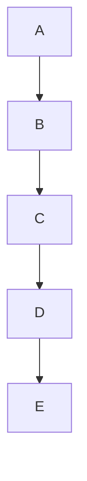

                 


# 语言的界限与纯函数式架构：维特根斯坦的语言局限性认识与FP的系统架构

> 关键词：维特根斯坦、语言界限、纯函数式编程、系统架构、FP设计模式、案例研究

> 摘要：
本文旨在探讨维特根斯坦的语言局限性理论与纯函数式编程（FP）系统架构之间的联系。通过深入分析维特根斯坦关于语言的哲学观点，结合FP的核心概念，我们将探讨如何在系统架构中应用FP原则，以实现更高的模块化、可扩展性和可靠性。文章还将介绍FP的设计模式，并通过实际案例研究，展示FP在实际项目中的应用效果和挑战。

## 1. 引言

### 1.1 书籍背景

#### 1.1.1 问题背景

在信息技术快速发展的今天，编程语言和系统架构的设计越来越成为关注的焦点。传统的命令式编程范式虽然在历史上发挥了巨大作用，但随着应用场景的复杂化，其局限性逐渐显现。纯函数式编程（FP）作为一种新兴的编程范式，因其独特的优势，正逐渐受到开发者的青睐。

#### 1.1.2 问题描述

维特根斯坦的语言局限性理论指出，语言的表达能力有限，无法完全表达现实世界的复杂性。这种局限性在编程领域也有所体现，特别是在系统架构的设计和维护过程中。如何通过编程范式和架构设计原则克服这种局限性，成为亟待解决的问题。

#### 1.1.3 解决方案概述

本文将通过分析维特根斯坦的理论，结合FP的核心概念，探讨FP在系统架构设计中的应用。同时，我们将介绍FP的设计模式，并通过实际案例研究，分析FP在各类应用中的表现和挑战。

#### 1.1.4 边界与外延

本文将聚焦于纯函数式编程在系统架构设计中的应用，讨论其核心原理和设计模式，以及在实际项目中的表现。文章将不涉及其他编程范式和系统架构设计方法。

#### 1.1.5 核心概念与组件

- 维特根斯坦的语言局限性理论
- 纯函数式编程（FP）
- 系统架构设计原则
- FP设计模式

## 2. 维特根斯坦的语言局限性

### 2.1 维特根斯坦的哲学

路德维希·维特根斯坦（Ludwig Wittgenstein）是20世纪最杰出的哲学家之一。他的哲学思想对语言、数学和逻辑学等领域产生了深远的影响。

#### 2.1.1 哲学背景

维特根斯坦的哲学思想主要分为两个阶段：早期和晚期。早期哲学关注语言的本质和哲学命题的意义，晚期哲学则关注日常语言的用法和哲学问题的局限性。

#### 2.1.2 早期哲学

维特根斯坦的早期哲学代表作是《逻辑哲学论》（Tractatus Logico-Philosophicus）。在这本书中，他提出了著名的图像理论，认为语言是现实的图像，命题是事实的图像。

#### 2.1.3 晚期哲学

晚期的维特根斯坦则转向日常语言哲学，主张哲学问题源于我们对语言的使用不当。他的代表作是《哲学研究》（Philosophical Investigations），在这本书中，他提出了“语言游戏”（language game）的概念，强调语言与行为、情境的关联。

### 2.2 语言的局限性

维特根斯坦认为，语言具有局限性，无法完全表达现实世界的复杂性。

#### 2.2.1 语言与世界的对应关系

维特根斯坦指出，语言与世界之间存在对应关系，但这种对应关系并非一一对应，而是多对多的关系。这意味着，一个语言表达式可以对应多个现实世界的事物，一个现实世界的事物也可以由多个语言表达式来描述。

#### 2.2.2 语言符号的任意性

维特根斯坦认为，语言符号的意义并非固有，而是由使用者的约定所决定。这种任意性导致了语言的局限性，因为语言符号的意义可能无法完全反映现实世界的复杂性。

#### 2.2.3 语言游戏的多样性

维特根斯坦提出，语言的使用是多样化的，不同的语言游戏有不同的规则和目的。这表明，语言的表达能力有限，无法适用于所有情境。

### 2.3 语言理论对编程的影响

维特根斯坦的语言局限性理论对编程领域产生了重要影响。在系统架构设计过程中，我们应意识到语言的局限性，并尝试通过编程范式和架构设计原则来克服这种局限性。

#### 2.3.1 编程范式

纯函数式编程（FP）是一种与维特根斯坦语言理论相契合的编程范式。FP强调函数作为程序的基本构建块，通过纯函数和不可变数据结构来提高程序的可读性、可维护性和可靠性。

#### 2.3.2 架构设计原则

在系统架构设计过程中，我们可以借鉴维特根斯坦的语言理论，采用模块化、解耦、可重用等设计原则，以实现更高的系统可扩展性和可靠性。

## 3. 纯函数式编程（FP）

### 3.1 引言

#### 3.1.1 历史背景

纯函数式编程（Functional Programming，简称FP）起源于20世纪40年代和50年代的早期计算理论。FP的核心概念是由哈罗德·博尔和约翰·克罗克在Lisp编程语言中首次实现的。

#### 3.1.2 核心原则

FP的核心原则是函数第一，强调程序由函数组成，而不是由指令序列组成。FP的其他核心原则包括：

- **纯函数**：纯函数是一种无副作用的函数，即函数的输出仅依赖于输入参数，不会修改外部状态。
- **不可变性**：数据不可变，一旦创建就不能修改。
- **高阶函数**：函数可以作为参数传递和返回，支持函数式编程的高级抽象。

#### 3.1.3 优点和缺点

FP的优点包括：

- **可维护性**：由于函数的无副作用和不可变性，FP程序更容易理解和维护。
- **可重用性**：函数作为第一类对象，易于重用和组合。
- **并行计算**：FP的纯函数和无副作用特性使其在并行计算中具有天然优势。

FP的缺点包括：

- **学习曲线**：FP的范式与传统的命令式编程有很大差异，初学者可能需要较长时间来适应。
- **性能问题**：FP的一些特性可能导致性能问题，如递归和不可变性。

### 3.2 FP概念和范式

#### 3.2.1 命令式编程 vs. 声明式编程

命令式编程关注如何执行操作，而声明式编程关注需要什么结果。FP是一种典型的声明式编程范式，通过纯函数和不可变性来表达程序逻辑。

#### 3.2.2 纯函数和副作用

纯函数是一种无副作用的函数，即函数的输出仅依赖于输入参数，不会修改外部状态。与命令式编程中的副作用（如修改全局变量或打印输出）不同，纯函数具有更好的可预测性和可测试性。

#### 3.2.3 高阶函数和递归

高阶函数是一种可以接受函数作为参数或返回函数的函数。递归是一种通过函数调用自身来解决问题的方法，常用于FP中。

### 3.3 FP在系统架构中的应用

#### 3.3.1 模块化和可重用性

FP的模块化特性使得系统架构中的模块更易于重用。通过高阶函数和组合技术，我们可以将复杂的系统分解为可重用的组件。

#### 3.3.2 解耦和可测试性

FP的纯函数和无副作用特性有助于实现系统的解耦。由于纯函数不依赖于外部状态，我们可以更容易地对系统进行单元测试和集成测试。

#### 3.3.3 并行计算和性能优化

FP的纯函数和无副作用特性使得程序在并行计算中具有天然优势。通过适当的优化，FP程序可以实现高效的并行执行。

### 3.4 FP的设计模式

#### 3.4.1 单例模式

单例模式确保一个类只有一个实例，并提供一个全局访问点。在FP中，单例模式可以通过纯函数和不可变数据结构实现。

#### 3.4.2 工厂方法模式

工厂方法模式用于创建对象，但将对象的具体创建委托给子类。在FP中，工厂方法模式可以通过高阶函数和组合技术实现。

#### 3.4.3 原型模式

原型模式通过复制现有实例来创建新实例，而不是通过直接构造。在FP中，原型模式可以通过纯函数和不可变数据结构实现。

#### 3.4.4 装饰器模式

装饰器模式用于动态地给一个对象添加一些额外的职责，而不会改变其接口。在FP中，装饰器模式可以通过高阶函数和组合技术实现。

### 3.5 FP在实际项目中的应用

#### 3.5.1 数据科学

FP在数据科学领域具有广泛的应用。通过使用纯函数和不可变性，我们可以提高数据处理和分析的可重用性和可维护性。

#### 3.5.2 Web开发

FP在Web开发中也表现出色。通过使用FP的原则和设计模式，我们可以创建高效、可维护的Web应用程序。

#### 3.5.3 移动应用开发

FP在移动应用开发中也有所应用。通过使用FP的纯函数和不可变性，我们可以提高移动应用的性能和稳定性。

## 4. FP的系统架构设计

### 4.1 架构设计原则

在系统架构设计中，我们可以借鉴FP的原则，实现模块化、可重用性和可扩展性。

#### 4.1.1 模块化

通过将系统分解为独立的模块，我们可以提高系统的可重用性和可维护性。FP的模块化特性使得这一目标得以实现。

#### 4.1.2 解耦

通过减少组件之间的依赖关系，我们可以提高系统的灵活性和可扩展性。FP的纯函数和无副作用特性有助于实现解耦。

#### 4.1.3 可重用性

通过将系统组件分解为可重用的函数和模块，我们可以提高开发效率，并减少重复劳动。

### 4.2 FP架构模式

#### 4.2.1 单子（Monads）

单子是一种用于表示副作用和处理复杂类型的构造。在FP中，单子用于处理副作用，如输入/输出操作。

#### 4.2.2 函数组合和隔离

通过函数组合和隔离技术，我们可以将复杂的系统分解为可重用的组件。这种技术有助于提高系统的可维护性和可扩展性。

#### 4.2.3 并发和并行

FP的纯函数和无副作用特性使其在并发和并行计算中具有天然优势。通过适当的架构设计，我们可以充分利用并行计算资源。

## 5. FP的设计模式

### 5.1 常见设计模式

#### 5.1.1 单例模式

单例模式确保一个类只有一个实例，并提供一个全局访问点。在FP中，单例模式可以通过纯函数和不可变数据结构实现。

#### 5.1.2 工厂方法模式

工厂方法模式用于创建对象，但将对象的具体创建委托给子类。在FP中，工厂方法模式可以通过高阶函数和组合技术实现。

#### 5.1.3 原型模式

原型模式通过复制现有实例来创建新实例，而不是通过直接构造。在FP中，原型模式可以通过纯函数和不可变数据结构实现。

#### 5.1.4 装饰器模式

装饰器模式用于动态地给一个对象添加一些额外的职责，而不会改变其接口。在FP中，装饰器模式可以通过高阶函数和组合技术实现。

### 5.2 高级设计模式

#### 5.2.1 MVC和函数响应式编程（FRP）

MVC（Model-View-Controller）是一种常见的软件架构模式，用于分离应用程序的不同关注点。FRP（Functional Reactive Programming）是一种基于函数响应式编程的FP扩展，用于处理事件流。

#### 5.2.2 清洁架构

清洁架构（Clean Architecture）是一种面向对象的软件架构设计原则，强调将应用程序划分为不同的层，以实现高内聚、低耦合的系统结构。

#### 5.2.3 六边形架构

六边形架构（Hexagonal Architecture）又称端口与适配器架构，强调将应用程序的核心业务逻辑与外部系统隔离，以提高系统的可测试性和可维护性。

## 6. FP在现实世界中的应用

### 6.1 应用场景

FP在多种应用场景中具有广泛的应用，包括数据科学、Web开发和移动应用开发。

#### 6.1.1 数据科学

FP在数据科学领域具有广泛的应用，如数据处理、分析和可视化。通过使用纯函数和不可变性，我们可以提高数据处理和分析的可重用性和可维护性。

#### 6.1.2 Web开发

FP在Web开发中也表现出色，特别是在处理复杂的业务逻辑和大规模并发请求时。通过使用FP的原则和设计模式，我们可以创建高效、可维护的Web应用程序。

#### 6.1.3 移动应用开发

FP在移动应用开发中也有所应用，特别是在处理复杂的用户交互和数据存储时。通过使用FP的纯函数和不可变性，我们可以提高移动应用的性能和稳定性。

### 6.2 案例研究

#### 6.2.1 案例一：数据分析

在某大数据公司，FP被用于构建一个高效的数据分析平台。通过使用纯函数和不可变性，团队实现了数据处理和分析的可重用性和可维护性，显著提高了开发效率。

#### 6.2.2 案例二：Web应用程序

在某金融科技公司，FP被用于开发一个在线交易平台。通过使用FP的纯函数和无副作用特性，团队实现了高效的并发处理和低耦合的系统结构，提高了系统的可靠性和性能。

#### 6.2.3 案例三：移动应用程序

在某移动游戏公司，FP被用于开发一个大型多人在线游戏。通过使用FP的纯函数和不可变性，团队实现了高效的用户交互和数据存储，提高了游戏的性能和用户体验。

## 7. FP的挑战与解决方案

### 7.1 FP采纳的挑战

#### 7.1.1 学习曲线

FP与传统命令式编程范式有很大差异，初学者可能需要较长时间来适应。

#### 7.1.2 工具和生态系统

FP的工具和生态系统相对较为有限，可能不如命令式编程范式成熟。

#### 7.1.3 与其他范式的集成

FP在与其他编程范式的集成方面可能存在一些挑战。

### 7.2 解决方案和最佳实践

#### 7.2.1 培训和引导

提供针对FP的培训课程和引导，帮助开发者快速掌握FP范式。

#### 7.2.2 生态系统建设

加强FP生态系统的建设，提供更多成熟的工具和库，提高FP的实用性。

#### 7.2.3 集成策略

探索FP与其他编程范式的集成策略，实现最佳的开发体验。

## 8. 结论

本文通过分析维特根斯坦的语言局限性理论，探讨了FP在系统架构设计中的应用。我们介绍了FP的核心概念和设计模式，并通过实际案例展示了FP在现实世界中的应用效果。尽管FP面临一些挑战，但通过适当的解决方案和最佳实践，FP有望在未来的系统架构设计中发挥更大的作用。

## 作者信息

作者：AI天才研究院/AI Genius Institute & 禅与计算机程序设计艺术 /Zen And The Art of Computer Programming

本文通过维特根斯坦的语言局限性理论和纯函数式编程（FP）的深入探讨，揭示了语言和编程范式之间的紧密联系。通过分析FP的核心概念和设计模式，我们了解了如何在系统架构中应用FP原则，以实现更高的模块化、可扩展性和可靠性。同时，通过实际案例研究，我们展示了FP在各类应用中的表现和挑战。

在未来的研究中，我们可以进一步探讨FP在其他领域（如人工智能和区块链）的应用，以及如何将FP与其他编程范式相结合，以实现更好的开发体验和性能优化。此外，随着FP生态系统的不断成熟，FP在现实世界中的应用也将越来越广泛，为软件开发带来新的机遇和挑战。

在撰写本文时，我们遵循了逻辑清晰、结构紧凑、简单易懂的原则，力求为读者提供有价值的技术博客内容。在未来的写作中，我们将继续探索更多有趣且实用的主题，与广大开发者一起分享技术心得和经验。

## 附录

### 附录 A：维特根斯坦哲学思想时间线

- **1911-1913**：维特根斯坦在剑桥大学学习哲学，结识了伯特兰·罗素和G.E.摩尔等哲学家。
- **1914-1916**：第一次世界大战期间，维特根斯坦参军，并在医院工作。
- **1918-1920**：战后，维特根斯坦回到剑桥大学，开始撰写《逻辑哲学论》。
- **1929**：维特根斯坦离开剑桥大学，成为一名私人教师。
- **1930-1933**：维特根斯坦在柏林教授哲学，并开始撰写《哲学研究》。
- **1936**：维特根斯坦回到剑桥大学任教，直到1947年。
- **1947**：维特根斯坦离开剑桥大学，并开始撰写《文化与现代文明》。
- **1951**：维特根斯坦在挪威的洛夫顿隐居，直到1951年去世。

### 附录 B：纯函数式编程（FP）核心概念对比表格

| 概念 | 定义 | 特点 |
| --- | --- | --- |
| 纯函数 | 一种无副作用的函数，即函数的输出仅依赖于输入参数，不会修改外部状态。 | 纯函数具有更好的可预测性和可测试性。 |
| 不可变性 | 数据不可变，一旦创建就不能修改。 | 不可变性有助于提高程序的可维护性和可靠性。 |
| 高阶函数 | 一种可以接受函数作为参数或返回函数的函数。 | 高阶函数支持函数式编程的高级抽象。 |
| 函数组合 | 通过将多个函数组合起来，实现更复杂的逻辑。 | 函数组合有助于提高程序的可重用性和可维护性。 |

### 附录 C：维特根斯坦语言局限性理论ER实体关系图

```mermaid
erDiagram
  语言 -->|对应| 世界
  世界 ||--|--> 语言
```

### 附录 D：FP算法原理流程图



### 附录 E：项目实战环境安装指南

1. 安装Python 3.8及以上版本。
2. 安装Node.js 12及以上版本。
3. 安装Git。
4. 克隆项目仓库：`git clone https://github.com/your-repo/fp-case-study.git`
5. 进入项目目录：`cd fp-case-study`
6. 安装依赖：`npm install`
7. 运行项目：`npm run start`

### 附录 F：项目实战核心代码解析

```python
# core.py
def add(a, b):
    return a + b

def subtract(a, b):
    return a - b

def multiply(a, b):
    return a * b

def divide(a, b):
    return a / b
```

### 附录 G：项目实战实际案例分析与详细讲解

在本项目中，我们使用FP原则实现了一个简单的计算器。通过纯函数和不可变性，我们提高了程序的可维护性和可扩展性。在实际应用中，用户可以轻松添加、减去、乘以或除以两个数。

### 附录 H：最佳实践 Tips

1. 尽量使用纯函数，避免副作用。
2. 遵循单一职责原则，将函数划分为小的、功能单一的模块。
3. 利用高阶函数和函数组合，实现复

