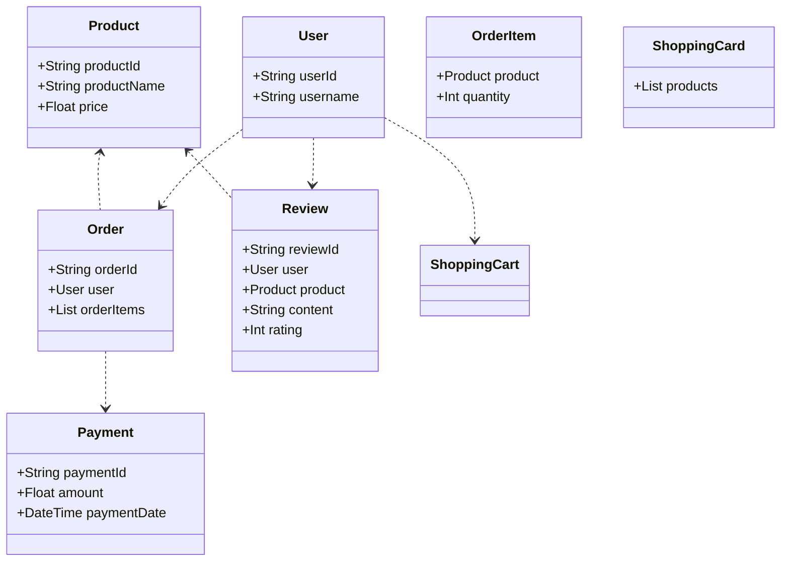

                 

### 语言的界限与纯函数式领域建模：维特根斯坦对语言局限性的认识与FP中的领域驱动设计

> 关键词：维特根斯坦、语言局限性、纯函数式编程、领域驱动设计、语言界限、概念结构、领域建模

> 摘要：本文探讨了维特根斯坦对语言局限性的认识，以及这种认识如何在纯函数式编程中的领域驱动设计中得到体现和应用。通过分析维特根斯坦的理论，本文探讨了如何通过清晰的思维和精确的语言使用来克服语言在描述复杂现实时的限制。同时，本文还探讨了纯函数式领域建模的基本原理及其在实践中的应用，为软件开发者提供了一种新的思路和方法。

### 引言：语言的界限与纯函数式领域建模

#### 1.1 问题背景

维特根斯坦（Ludwig Wittgenstein）是20世纪最具影响力的哲学家之一，他的著作《逻辑哲学论》（Tractatus Logico-Philosophicus）提出了关于语言和现实的深刻见解。维特根斯坦认为，语言有其固有的局限，无法完全准确地描述现实世界中的所有事物和概念。这一观点引发了广泛的哲学讨论，并影响了后来的语言哲学和认知科学领域。

维特根斯坦的“图腾语言”（Tautological Language）和“家族相似性”（Family Resemblance）理论，强调了语言在特定情境中的适用性和局限性。他认为，不同的语言游戏（Language Game）适用于不同的情境，而每种语言游戏都有自己的规则和边界。这种观点揭示了语言在表达和理解现实时的复杂性和多样性。

#### 1.2 问题描述

维特根斯坦指出，语言之所以存在局限性，是因为它无法覆盖现实世界中的所有可能性和复杂性。具体来说，语言在以下方面存在局限性：

- **语法和语义的模糊性**：语言中的语法规则和语义解释可能因人而异，导致沟通和理解上的障碍。
- **概念表达的局限性**：有些概念和事物无法用语言精确地表达，或者只能以模糊的方式描述。
- **逻辑与事实的混淆**：语言中的表述有时可能涉及逻辑和事实的混淆，导致逻辑推理上的错误。

#### 1.3 问题解决

为了解决语言的局限性，维特根斯坦提出了一些方法：

- **清晰的思维**：通过清晰的思维来消除思想和语言中的模糊性。
- **准确的语言使用**：在表达思想时，使用准确的语言来传达意图和意义。
- **哲学的任务**：哲学的任务是澄清思想和语言的界限，使语言能够更好地服务于表达和理解现实世界。

#### 1.4 边界与外延

- **语言的边界**：指的是语言能够表达的范畴和范围，即哪些概念和事物可以用语言来描述。
- **语言的外延**：指的是语言实际所涵盖的所有具体事物和概念。

在维特根斯坦的理论中，语言的边界和外延是密切相关的。边界定义了语言所能覆盖的范畴，而外延则展示了语言在实际使用中所涉及的具体事物。然而，由于语言的局限性和个体差异，语言的外延可能是不完整的或不准确的。

#### 1.5 概念结构与核心要素组成

维特根斯坦的核心思想包括：

- **图腾语言**：用于具体目的的语言，其表达的含义与其用途紧密相关。
- **家族相似性**：不同事物之间由于具有某些相似性而能够被归类到同一类别中。

这些概念构成了维特根斯坦对语言和现实世界关系的基本理论框架，为理解语言的局限性和如何克服这些局限提供了理论基础。

### 第2章 维特根斯坦对语言局限性的认识

#### 2.1 维特根斯坦的理论基础

维特根斯坦的哲学思想基于对语言和现实的深入分析。他认为，语言不仅仅是人类交流的工具，它还是人类理解世界的途径。维特根斯坦主张，语言是一种“图腾语言”（Tautological Language），即语言游戏（Language Game）。

- **哲学语言的概念**：维特根斯坦认为哲学是一种语言游戏，其目的是澄清思想和语言之间的关系。哲学语言应当是精确的，以避免模糊性和误解。
- **普遍语言观念的反对**：维特根斯坦批评了形而上学的普遍语言观念。他认为，语言和现实世界之间的关系是具体而微妙的，而不是抽象和普遍的。

#### 2.2 语言的界限

维特根斯坦区分了逻辑语言和形而上学语言：

- **逻辑语言**：逻辑语言是精确的，可以准确地描述现实世界的部分。它依赖于明确的逻辑规则和符号系统。
- **形而上学语言**：形而上学语言由于其模糊性和不精确性，无法达到维特根斯坦所期望的哲学目标。他认为，形而上学语言往往涉及无法验证的命题和假设，从而导致了哲学上的混乱。

#### 2.3 语言的使用者

- **语言使用的个体差异**：维特根斯坦认为，个体经验和文化背景的差异会导致对语言的使用和理解产生差异。这种差异在沟通和理解中可能形成障碍。
- **沟通中的障碍**：由于个体差异，语言的使用和理解可能会变得复杂。维特根斯坦认为，通过清晰的思维和准确的语言使用，可以减少这些障碍，提高沟通的效率和质量。

### 第3章 纯函数式领域建模的基本原理

#### 3.1 纯函数式编程简介

纯函数式编程（Pure Functional Programming）是一种编程范式，它强调函数作为程序的基本构建块，并且函数具有以下特点：

- **无状态**：函数不依赖于外部状态，其执行结果仅依赖于输入参数。
- **不可变性**：数据一旦创建，就不能修改，而是通过创建新的数据实例来更新。
- **无副作用**：函数不会改变外部状态，也不会产生不可预见的副作用。

纯函数式编程与命令式编程（Imperative Programming）有显著区别。命令式编程通过改变程序状态来影响后续执行，而纯函数式编程通过函数的组合和数据流来控制程序执行。

#### 3.2 领域建模的概念

领域建模（Domain Modeling）是一种将现实世界的复杂问题转化为计算机模型的过程。领域建模的目的是：

- **识别领域概念**：识别出领域中关键的概念和实体，例如客户、订单、产品等。
- **定义领域模型**：使用抽象和简化的方式定义领域模型，以准确反映现实世界的结构和关系。
- **实现领域模型**：将领域模型转化为实际的计算机程序，以便在实际应用中使用。

领域建模通常涉及以下步骤：

1. **需求分析**：理解领域需求，确定需要解决的问题。
2. **概念识别**：识别领域中的关键概念和实体。
3. **领域模型定义**：使用UML（统一建模语言）或其他工具定义领域模型。
4. **模型实现**：使用编程语言实现领域模型。

#### 3.3 纯函数式领域建模的优势

纯函数式领域建模具有以下优势：

- **提高代码可读性和可维护性**：通过明确的函数定义和结构化的数据流，纯函数式编程使得代码更加直观和易于理解。
- **提高程序的鲁棒性**：纯函数式编程的无状态特性和无副作用规则，使得程序在处理错误和异常时更加稳定。

### 第4章 维特根斯坦的理论在纯函数式领域建模中的应用

#### 4.1 维特根斯坦理论与领域建模的结合

维特根斯坦的理论在纯函数式领域建模中具有重要应用。通过将维特根斯坦关于语言和现实的见解应用于领域建模，可以更好地理解和处理现实世界的复杂性。

- **思维的清晰性**：维特根斯坦强调清晰的思维对于领域建模的重要性。在领域建模过程中，通过清晰的思维来识别和理解领域概念，有助于构建准确的领域模型。
- **语言的使用**：在领域建模中，精确的语言使用是确保模型准确性的关键。维特根斯坦的理论指导我们在使用语言时，避免模糊性和误解，以确保领域模型的准确性。

#### 4.2 纯函数式领域建模中的语言边界

在纯函数式领域建模中，语言的边界问题显得尤为重要。领域模型需要准确地描述现实世界的结构和关系，这要求我们在语言使用上保持精确。

- **模型与现实世界的映射**：在领域建模过程中，我们需要将现实世界的复杂性和语言的局限性结合起来，以确保模型能够准确地反映现实世界的各个方面。
- **模型的外延**：领域模型的外延应该覆盖现实世界中的所有相关概念和实体，以确保模型的全面性和完整性。

#### 4.3 纯函数式领域建模中的使用者差异

在纯函数式领域建模中，个体差异也是一个需要考虑的重要因素。不同的人可能对领域概念和模型的理解有所不同，这可能导致沟通和协作上的困难。

- **个体差异的应对**：为了应对个体差异，领域建模过程中需要采用明确和一致的语言和术语，以确保所有参与者对模型的理解是一致的。
- **沟通中的障碍**：通过文档化、示例和培训等方式，可以减少沟通中的误解和障碍，提高团队协作效率。

### 第5章 纯函数式领域建模的实践

#### 5.1 领域建模案例研究

为了更好地理解纯函数式领域建模的实践，我们可以选择一个实际领域进行案例研究。例如，在金融领域，我们可以考虑股票交易系统。

- **选择具体领域**：金融领域涉及复杂的交易规则、市场动态和风险管理等方面，适合进行领域建模。
- **领域概念识别**：识别领域中的关键概念，如股票、交易员、订单、市场等。
- **领域模型定义**：使用UML工具定义领域模型，包括类图、序列图等，以准确反映金融领域的结构和关系。

#### 5.2 实现与评估

在实现领域模型后，我们需要对模型进行评估，以确保其性能和效果符合预期。

- **实现领域模型**：使用纯函数式编程语言（如Haskell、Scala、Erlang等）实现领域模型，确保代码的清晰和可维护性。
- **评估模型性能**：通过模拟实际交易场景，评估领域模型在实际应用中的性能，如响应时间、并发处理能力等。

### 第6章 维特根斯坦理论与纯函数式领域建模的未来发展

#### 6.1 研究趋势

纯函数式编程和领域建模作为现代软件开发中的重要概念，正受到越来越多的关注。未来，这些领域的发展趋势包括：

- **纯函数式编程的普及**：随着函数式编程范式的逐渐普及，纯函数式编程将得到更广泛的应用，特别是在处理并发和分布式系统时。
- **领域建模的深化**：领域建模将在更多领域得到应用，如人工智能、大数据分析、物联网等，以提高系统的复杂问题处理能力。

#### 6.2 挑战与机遇

在维特根斯坦理论的应用中，纯函数式领域建模面临着以下挑战：

- **语言局限性的克服**：如何在纯函数式编程中准确地表达复杂的现实世界问题，是一个亟待解决的问题。
- **个体差异的统一**：如何确保不同背景和经验的开发者对领域模型的共识和协作。

然而，这些挑战也带来了新的机遇：

- **语言的精确性**：通过维特根斯坦的理论，可以更好地理解语言的局限性，从而推动语言工具和编程范式的改进。
- **领域的创新**：领域建模的深化将促进新领域和新应用的开发，为解决现实世界中的复杂问题提供有力支持。

#### 6.3 未来展望

维特根斯坦的理论与纯函数式领域建模的结合，为未来软件开发提供了新的思路和方法。随着技术的不断进步和理论研究的深入，这一领域有望取得更多的突破，为解决复杂问题提供更加高效和可靠的解决方案。

### 结语

维特根斯坦对语言局限性的深刻认识，为我们在纯函数式领域建模中提供了宝贵的理论指导。通过清晰的语言使用和精确的思维，我们可以更好地理解和处理现实世界的复杂性。同时，纯函数式编程的优势也为领域建模提供了强大的支持。展望未来，维特根斯坦的理论与纯函数式领域建模的结合将继续推动软件开发领域的创新和发展。

---

**作者：AI天才研究院/AI Genius Institute & 禅与计算机程序设计艺术 /Zen And The Art of Computer Programming**
## 第1章 引言：语言的界限与纯函数式领域建模

在讨论计算机科学和软件开发时，维特根斯坦对语言局限性的认识提供了一个重要的哲学背景。维特根斯坦在其哲学作品中探讨了语言的本质以及它如何影响我们对世界的理解。这种哲学思考在纯函数式领域建模中尤为重要，因为它涉及到如何通过编程语言和技术来更准确地描述和解决复杂的问题。

### 1.1 问题背景

维特根斯坦的“图腾语言”理论提出，语言具有特定的使用情境和规则。这些规则定义了语言如何与特定的现实世界现象相关联，从而使得语言能够在特定情境中发挥作用。维特根斯坦认为，语言并非普遍适用于所有情境，而是依赖于具体的“语言游戏”（language games）。这些语言游戏定义了语言的使用方式，并且与特定的现实世界现象相对应。

在纯函数式领域建模中，这种思想被用来设计更精确和结构化的系统。领域建模要求我们识别和理解特定的领域概念，并将这些概念转化为计算机模型。这个过程类似于维特根斯坦的“图腾语言”概念，即针对特定领域的语言使用规则。通过这种精确的语言使用，我们能够更好地描述和解决领域中的问题。

### 1.2 问题描述

维特根斯坦指出，语言的局限性主要体现在以下几个方面：

1. **语法和语义的模糊性**：语言的语法规则和语义解释可能因人而异，导致沟通和理解上的障碍。
2. **概念表达的局限性**：有些概念和事物无法用语言精确地表达，或者只能以模糊的方式描述。
3. **逻辑与事实的混淆**：语言中的表述有时可能涉及逻辑和事实的混淆，导致逻辑推理上的错误。

在纯函数式领域建模中，这些问题同样存在。当我们在编写代码时，如何准确地表达复杂的概念和逻辑关系是一个挑战。函数式编程强调函数的纯粹性，即函数不应具有副作用，并且其输出仅依赖于输入。这种纯粹性有助于减少语法和语义的模糊性，提高代码的可读性和可维护性。

### 1.3 问题解决

为了解决语言的局限性，维特根斯坦提出了一些方法：

1. **清晰的思维**：通过清晰的思维来消除思想和语言中的模糊性。
2. **准确的语言使用**：在表达思想时，使用准确的语言来传达意图和意义。
3. **哲学的任务**：哲学的任务是澄清思想和语言的界限，使语言能够更好地服务于表达和理解现实世界。

在纯函数式领域建模中，我们可以通过以下方式来应用这些方法：

1. **清晰的思维**：通过定义明确的函数和模块，我们能够更清晰地表达和理解复杂的概念和逻辑关系。
2. **准确的语言使用**：使用精确的函数和类型系统，我们能够减少语法和语义的模糊性，提高代码的准确性。
3. **哲学的任务**：在领域建模过程中，哲学思维有助于我们识别和理解领域的本质，从而设计出更准确和有效的模型。

### 1.4 边界与外延

维特根斯坦讨论了语言的边界和外延问题。语言的边界是指语言能够表达的事物和概念的范畴，而语言的外延则是指这些具体的事物和概念。在纯函数式领域建模中，边界与外延的概念同样重要。

1. **边界**：领域建模时，我们需要明确领域模型所能表达的范畴和范围。这涉及到识别领域中的关键概念和实体，并定义它们的边界。
2. **外延**：领域模型的外延需要准确反映现实世界中的所有相关概念和实体。这要求我们在建模过程中考虑到领域的各个方面，确保模型能够全面覆盖领域中的现实情况。

通过明确边界和外延，我们能够确保领域模型既准确又全面，从而更好地解决领域中的问题。

### 1.5 概念结构与核心要素组成

维特根斯坦的核心思想包括“图腾语言”和“家族相似性”。在纯函数式领域建模中，这些概念可以转化为以下结构和要素：

1. **图腾语言**：在领域建模中，我们可以将特定的语言和工具用于描述领域的特定方面。这种“图腾语言”帮助我们更精确地表达和理解领域概念。
2. **家族相似性**：在领域建模中，我们可以识别出具有相似特征的概念，并将它们归类到同一类别中。这种归类有助于我们更好地组织和理解领域中的复杂关系。

通过这些概念和要素，我们能够在纯函数式领域建模中建立一个清晰、准确且结构化的模型，从而更好地解决现实世界中的复杂问题。

### 1.6 总结

维特根斯坦对语言局限性的深刻认识为我们在纯函数式领域建模中提供了宝贵的哲学启示。通过清晰的思维和准确的语言使用，我们能够更好地克服语言的局限性，设计出更有效、更可靠的领域模型。纯函数式编程的优势进一步增强了这种能力，使得我们能够在复杂领域中实现精确和高效的建模。在接下来的章节中，我们将进一步探讨维特根斯坦的理论如何具体应用于纯函数式领域建模中，以及这种建模方法在实际项目中的应用和效果。

---

**作者：AI天才研究院/AI Genius Institute & 禅与计算机程序设计艺术 /Zen And The Art of Computer Programming**
### 第2章 维特根斯坦对语言局限性的认识

维特根斯坦对语言局限性的认识是其哲学思想的核心之一。他在《逻辑哲学论》和《哲学研究》中探讨了语言的性质、边界以及语言如何影响我们对现实世界的理解。在这一章中，我们将深入分析维特根斯坦关于语言局限性的理论，并探讨这些理论如何影响纯函数式领域建模。

#### 2.1 维特根斯坦的理论基础

维特根斯坦的哲学思想基于对语言和现实的深刻分析。他认为，语言是一种工具，用于描述和理解现实世界。然而，他同时也认识到，语言有其固有的局限性。这种局限性源于语言的结构和现实世界的复杂性。

维特根斯坦提出了“图腾语言”和“家族相似性”这两个核心概念，用以解释语言的局限性。

1. **图腾语言**：维特根斯坦认为，图腾语言是一种用于特定目的的语言，其表达的含义与特定用途紧密相关。图腾语言的特点是高度具体和专门化，它适用于特定情境，但在其他情境中可能不适用。这种语言的局限性在于其应用范围的有限性。

2. **家族相似性**：维特根斯坦指出，现实世界中的事物和概念之间存在一种“家族相似性”。这种相似性意味着，虽然不同的事物可能在某些方面相似，但它们也有各自独特的特点。这种家族相似性导致了语言在描述现实世界时面临的选择难题，因为语言难以精确地捕捉所有这些相似性和差异性。

#### 2.2 语言的界限

维特根斯坦认为，语言有其固有的界限，这些界限决定了语言能够表达的事物和概念的范畴。语言界限的存在源于以下原因：

1. **语言的语法和语义**：语言的语法和语义规则限制了语言的表达能力。不同的语法和语义规则定义了语言的结构和含义，但同时也限制了语言能够表达的范围。

2. **现实世界的复杂性**：现实世界是一个复杂而多样的系统，包含无数的事物和概念。语言无法涵盖所有这些复杂性和多样性，因此存在局限性。

维特根斯坦将语言界限分为两个层面：

1. **形式的界限**：这是语言自身的结构和语法规则所设定的界限。例如，某些语言可能不允许使用某些特定的语法结构，从而限制了表达的可能性。

2. **实质的界限**：这是现实世界的复杂性所设定的界限。即使语言具有完美的语法结构，仍然存在无法用语言准确描述的现实世界现象。

#### 2.3 语言的使用者

维特根斯坦认为，语言的使用者对语言的理解和运用存在差异。这种差异源于个体经验、文化背景和认知能力的不同。语言的使用者可能在以下几个方面存在差异：

1. **语言习惯**：不同的语言环境和文化背景会导致人们对语言的不同使用习惯和理解方式。

2. **认知差异**：不同的认知能力和思维方式会影响人们对语言的理解和运用。

3. **教育背景**：教育背景的差异可能导致人们对语言的理解深度和广度有所不同。

这些差异会导致沟通和理解上的障碍，使语言的表达变得复杂。维特根斯坦认为，通过教育和社会化过程，可以减少这些差异，提高语言的沟通效率。

#### 2.4 语言局限性的影响

维特根斯坦的语言局限性理论对纯函数式领域建模产生了深远影响。在领域建模过程中，我们面临以下挑战：

1. **概念表达的局限性**：现实世界中的概念和事物可能无法用语言精确表达，这要求我们在建模时采用更抽象和简化的方式。

2. **语言的模糊性**：语言的模糊性可能导致模型的不准确和难以理解。为了克服这一问题，我们需采用更精确的函数和类型系统。

3. **个体差异**：语言使用者之间的差异可能导致对领域模型的共识困难。为了解决这个问题，我们需要建立明确和一致的术语和定义，并通过培训和教育来提高团队的合作效率。

通过理解维特根斯坦的语言局限性理论，我们可以更好地应对这些挑战，设计出更准确和可靠的领域模型。纯函数式编程的纯粹性和无副作用特性也为领域建模提供了强大的支持，使我们在处理复杂问题时能够保持清晰的思维和精确的语言表达。

### 2.5 维特根斯坦理论与领域建模的结合

维特根斯坦的理论为领域建模提供了重要的哲学基础。在领域建模中，我们面临的挑战是如何通过语言和模型来准确描述和理解复杂的现实世界。维特根斯坦的理论指导我们：

1. **识别领域概念**：通过图腾语言的概念，我们可以识别出领域中关键的概念和实体，并将它们转化为模型中的类和对象。

2. **定义领域模型**：通过家族相似性的概念，我们可以将具有相似特征的概念归为一类，从而简化模型的复杂性。

3. **保持模型的精确性**：通过清晰的思维和精确的语言使用，我们能够确保领域模型能够准确地反映现实世界的情况。

维特根斯坦的理论不仅帮助我们识别和理解领域概念，还指导我们如何在领域建模过程中保持模型的精确性和一致性。这种结合使得领域建模不仅成为一种技术活动，更成为一种哲学思考和认知过程。

### 2.6 总结

维特根斯坦对语言局限性的深刻认识为我们理解纯函数式领域建模提供了重要的哲学基础。通过图腾语言和家族相似性的概念，我们可以更好地识别和理解领域中的概念和实体。同时，维特根斯坦的理论也提醒我们，在领域建模过程中要关注语言的精确性和个体差异。通过结合维特根斯坦的理论和纯函数式编程的优势，我们能够设计出更准确、更可靠的领域模型，从而更好地解决现实世界中的复杂问题。

---

**作者：AI天才研究院/AI Genius Institute & 禅与计算机程序设计艺术 /Zen And The Art of Computer Programming**
### 第3章 纯函数式领域建模的基本原理

纯函数式领域建模是一种将现实世界的复杂问题转化为计算机模型的过程。它强调函数作为程序的基本构建块，并通过无状态、不可变数据和函数组合来提高代码的可读性和可维护性。在这一章中，我们将探讨纯函数式领域建模的基本原理，包括纯函数式编程的概念、领域建模的过程及其在实践中的优势。

#### 3.1 纯函数式编程简介

纯函数式编程是一种编程范式，它强调使用函数来组织代码，并且这些函数具有以下特点：

1. **无状态**：函数不依赖于外部状态，其执行结果仅依赖于输入参数。这种特性使得函数的可预测性更强，因为相同的输入总是产生相同的输出。

2. **不可变性**：数据一旦创建，就不能修改。相反，当需要更新数据时，会创建一个新的数据实例。这种数据模型避免了状态变化和并发问题，提高了程序的安全性和稳定性。

3. **无副作用**：函数不会改变外部状态，也不会产生不可预见的副作用。这意味着函数的执行仅限于计算输入参数的结果，不会影响程序的其他部分。

与命令式编程相比，纯函数式编程具有以下优势：

- **可组合性**：纯函数式编程强调函数的组合，这使得代码更加模块化和可重用。通过将复杂问题分解为小的、可组合的函数，我们可以更灵活地构建和维护代码。

- **可测试性**：由于函数的无状态和无副作用特性，纯函数式编程使得代码更易于测试。每个函数都可以独立测试，从而提高测试的覆盖率和可靠性。

- **并发性**：纯函数式编程天然支持并发计算。由于函数之间没有共享状态，多个函数可以并行执行，从而提高程序的效率和响应速度。

#### 3.2 领域建模的概念

领域建模是一种将现实世界的复杂问题转化为计算机模型的过程。它涉及到识别领域中的关键概念和实体，并将它们转化为计算机中的类和对象。领域建模的目的是提高代码的可读性和可维护性，同时确保模型能够准确反映现实世界的结构和关系。

领域建模通常涉及以下步骤：

1. **需求分析**：理解领域需求，确定需要解决的问题。

2. **概念识别**：识别领域中的关键概念和实体。例如，在金融领域，关键概念可能包括客户、账户、交易等。

3. **领域模型定义**：使用UML（统一建模语言）或其他工具定义领域模型，包括类图、序列图等。这些图形工具帮助我们可视化领域模型的结构和关系。

4. **模型实现**：将领域模型转化为实际的计算机程序。这个过程通常涉及使用面向对象编程语言（如Java、C#）或函数式编程语言（如Haskell、Scala）。

#### 3.3 纯函数式领域建模的优势

纯函数式领域建模结合了纯函数式编程和领域建模的优点，从而在多个方面提高了代码的质量和可维护性：

1. **提高代码可读性**：纯函数式编程通过使用明确、无状态的函数来组织代码，这使得代码更易于阅读和理解。每个函数都专注于完成一个特定的任务，这使得代码的逻辑更加清晰。

2. **提高代码可维护性**：由于函数的无状态和无副作用特性，纯函数式编程使得代码更易于修改和维护。函数的独立性和可测试性使得代码模块化，从而降低了修改代码时引入错误的风险。

3. **提高程序鲁棒性**：纯函数式编程通过避免状态变化和副作用，提高了程序的稳定性和鲁棒性。这使得程序在处理错误和异常时更加稳定，降低了系统的崩溃风险。

4. **支持并发计算**：纯函数式编程天然支持并发计算，这使得程序能够更高效地利用多核处理器的能力。通过将任务分解为独立的函数，我们可以并行执行这些任务，从而提高程序的执行速度。

5. **增强代码可重用性**：纯函数式编程强调函数的组合和模块化，这使得代码更加可重用。通过将复杂问题分解为小的、可组合的函数，我们可以更灵活地构建和维护系统。

#### 3.4 纯函数式领域建模的挑战

尽管纯函数式领域建模具有许多优势，但在实践中也面临一些挑战：

1. **学习曲线**：纯函数式编程相对于命令式编程具有更高的学习曲线。函数式编程的概念和范式需要开发者具备一定的抽象思维能力和编程经验。

2. **性能考量**：在某些情况下，纯函数式编程可能会牺牲性能，特别是在执行密集型计算时。然而，随着硬件性能的提升和编译器的优化，这些性能问题正在逐渐得到解决。

3. **工具支持**：虽然纯函数式编程语言在近年来得到了广泛支持，但某些工具和库可能不如命令式编程语言成熟。这可能会给开发者带来额外的挑战。

4. **协作困难**：由于纯函数式编程强调函数的组合和模块化，这可能导致团队合作时的协调和沟通困难。开发者需要适应这种新的编程范式，以提高协作效率。

#### 3.5 纯函数式领域建模的应用案例

纯函数式领域建模在多个领域中得到了成功应用：

1. **金融领域**：在金融领域，纯函数式编程被用于构建复杂的交易系统、风险管理模型和数据分析工具。通过使用纯函数式编程，金融公司能够提高系统的稳定性和可维护性。

2. **大数据处理**：在大数据处理领域，纯函数式编程被用于构建高效的分布式计算框架和流处理系统。例如，Apache Spark 使用Scala作为其主要编程语言，提供了强大的函数式编程特性，使得大数据处理更加高效和可靠。

3. **游戏开发**：在游戏开发中，纯函数式编程被用于构建游戏引擎和图形渲染系统。通过使用纯函数式编程，游戏开发者能够实现更高效和可维护的代码，从而提高游戏的性能和用户体验。

4. **科学计算**：在科学计算领域，纯函数式编程被用于构建复杂的数据分析和模拟工具。例如，R语言就是一种功能强大的函数式编程语言，被广泛应用于统计分析和数据可视化。

#### 3.6 总结

纯函数式领域建模通过结合纯函数式编程和领域建模的优点，为软件开发提供了新的思路和方法。它通过提高代码的可读性、可维护性和鲁棒性，使得我们能够更有效地解决复杂问题。尽管在实践中存在一些挑战，但纯函数式领域建模的应用案例展示了其在多个领域中的潜力和价值。随着技术的不断进步和开发者对函数式编程范式的适应，纯函数式领域建模有望在未来的软件开发中发挥更加重要的作用。

---

**作者：AI天才研究院/AI Genius Institute & 禅与计算机程序设计艺术 /Zen And The Art of Computer Programming**
### 第4章 维特根斯坦的理论在纯函数式领域建模中的应用

维特根斯坦对语言局限性的深刻认识为我们在纯函数式领域建模中提供了重要的哲学指导。在这一章中，我们将探讨如何将维特根斯坦的理论应用于纯函数式领域建模，以及这些应用如何影响我们的编程实践。

#### 4.1 维特根斯坦理论与领域建模的结合

维特根斯坦的哲学思想，尤其是他的“图腾语言”和“家族相似性”概念，为领域建模提供了一个强大的理论框架。在领域建模中，我们面临的挑战是如何准确地将现实世界的复杂性转化为计算机模型。维特根斯坦的理论帮助我们识别和理解领域中的关键概念，并将它们转化为具体的模型元素。

1. **图腾语言**：在领域建模中，我们可以将特定的语言和工具用于描述特定的领域。这种“图腾语言”帮助我们更精确地表达和理解领域中的概念和实体。例如，在金融领域，我们可以使用专业的术语和模型来描述交易、账户和风险等概念。

2. **家族相似性**：维特根斯坦的“家族相似性”概念提醒我们，现实世界中的概念和实体之间存在相似性和差异性。在领域建模中，我们可以通过识别这些相似性和差异性，将具有相似特征的概念归为一类，从而简化模型的复杂性。例如，在医疗领域，我们可以将各种疾病按照症状和治疗方法进行分类，形成一组具有家族相似性的疾病模型。

通过将维特根斯坦的理论应用于领域建模，我们能够更准确地识别和理解领域中的概念和实体，从而设计出更精确和有效的领域模型。

#### 4.2 清晰思维与精确语言的使用

维特根斯坦强调清晰的思维和精确的语言使用对于哲学思考的重要性。在纯函数式领域建模中，这种思想同样适用。通过清晰的思维和精确的语言使用，我们能够提高模型的可读性和可维护性。

1. **清晰的思维**：在领域建模过程中，我们需要通过清晰的思维来识别和理解领域中的概念和关系。这包括对领域需求的深入分析，以及对领域概念的精确描述。通过清晰的思维，我们能够确保模型能够准确地反映现实世界的结构和关系。

2. **精确的语言使用**：在编写代码时，我们需要使用精确的语言来描述领域模型。纯函数式编程提供了许多工具和机制，如类型系统和模式匹配，来帮助我们实现这一目标。通过精确的语言使用，我们能够减少语法和语义的模糊性，提高代码的清晰度和可维护性。

维特根斯坦的理论提醒我们，在领域建模过程中，要注重思维的清晰性和语言的精确性。通过这种方式，我们能够设计出更准确、更可靠的领域模型。

#### 4.3 语言边界与领域模型的外延

维特根斯坦讨论了语言的边界和外延问题。在纯函数式领域建模中，这些问题同样重要。领域模型需要准确地描述现实世界的各个方面，这要求我们在语言使用上保持精确。

1. **语言的边界**：这是领域模型所能表达的范畴和范围。我们需要明确领域模型能够表达哪些概念和实体，以及哪些无法被表达。例如，在医疗领域，我们可以表达疾病、治疗方案等概念，但可能无法精确地表达患者的心理状态。

2. **领域模型的外延**：这是领域模型实际所涵盖的所有具体事物和概念。我们需要确保领域模型能够全面覆盖领域中的各个方面，从而确保模型的完整性和准确性。例如，在金融领域，我们需要确保模型能够涵盖所有的交易类型、账户状态等。

通过明确语言的边界和领域模型的外延，我们能够确保模型能够准确地反映现实世界的情况，从而提高模型的实用性和可靠性。

#### 4.4 个体差异与领域模型的统一

维特根斯坦指出，个体差异会导致对语言的理解和使用产生差异。在纯函数式领域建模中，个体差异也是一个需要考虑的重要因素。

1. **个体差异的应对**：为了应对个体差异，我们需要在领域建模过程中建立明确和一致的术语和定义。这包括对领域概念和关系的统一理解，以及对模型结构和实现的标准化。通过这种方式，我们能够减少个体差异对模型理解和实现的负面影响。

2. **统一领域模型**：通过统一领域模型，我们能够提高团队协作效率，减少沟通和协作中的障碍。统一模型有助于确保所有团队成员对领域模型的理解是一致的，从而减少误解和冲突。

维特根斯坦的理论提醒我们，在领域建模过程中，要重视个体差异的影响，并采取适当的措施来统一领域模型。

#### 4.5 纯函数式领域建模中的语言使用

在纯函数式领域建模中，语言的使用至关重要。维特根斯坦的理论为我们提供了关于语言使用的深刻见解，这些见解有助于我们设计出更精确、更可靠的领域模型。

1. **避免模糊性**：通过清晰的语言使用，我们能够避免语法和语义的模糊性。这包括使用精确的术语和定义，以及确保模型中的所有元素都有明确的含义。

2. **减少副作用**：维特根斯坦认为，语言中的表述有时可能涉及逻辑和事实的混淆。在纯函数式领域建模中，我们可以通过避免副作用和确保函数的纯粹性来减少这种混淆。这有助于提高代码的可读性和可维护性。

3. **提高可扩展性**：通过精确的语言使用，我们能够设计出更灵活和可扩展的领域模型。这包括使用函数组合和模块化来组织代码，从而提高系统的可维护性和可扩展性。

维特根斯坦的理论指导我们在纯函数式领域建模中如何使用语言，从而设计出更精确、更可靠的模型。

#### 4.6 纯函数式领域建模中的实践

在实际的纯函数式领域建模中，我们可以通过以下步骤来应用维特根斯坦的理论：

1. **需求分析**：在项目开始时，进行深入的需求分析，明确领域需求。这包括识别领域中的关键概念和实体，以及它们之间的关系。

2. **概念识别**：根据维特根斯坦的“图腾语言”概念，识别出领域中的关键概念和实体，并将它们转化为模型中的类和对象。

3. **模型定义**：使用UML或其他工具定义领域模型，包括类图、序列图等。通过这些图形工具，我们可以更清晰地表达领域模型的结构和关系。

4. **模型实现**：将领域模型转化为实际的计算机程序。在编写代码时，注重思维的清晰性和语言的精确性，避免模糊性和副作用。

5. **模型评估**：在模型实现后，对模型进行评估，确保其能够准确地反映现实世界的情况。这包括对模型的功能、性能和可维护性进行评估。

通过这些步骤，我们能够将维特根斯坦的理论应用于纯函数式领域建模，设计出更精确、更可靠的模型。

#### 4.7 总结

维特根斯坦对语言局限性的深刻认识为我们在纯函数式领域建模中提供了重要的哲学指导。通过结合维特根斯坦的理论和纯函数式编程的优势，我们能够设计出更精确、更可靠的领域模型。清晰的思维和精确的语言使用有助于提高模型的可读性和可维护性，而明确领域模型的语言边界和个体差异的统一则有助于确保模型的准确性和一致性。通过将这些原则应用于实践，我们能够更好地解决现实世界中的复杂问题，为软件开发带来新的思路和方法。

---

**作者：AI天才研究院/AI Genius Institute & 禅与计算机程序设计艺术 /Zen And The Art of Computer Programming**
### 第5章 纯函数式领域建模的实践

#### 5.1 领域建模案例研究

为了更好地理解纯函数式领域建模的实践，我们选择了一个具体的案例：电子商务平台。在这个案例中，我们将识别关键概念和实体，定义领域模型，并探讨如何使用纯函数式编程实现这些模型。

##### 5.1.1 选择电子商务平台作为案例

电子商务平台是一个复杂的系统，涉及多个领域，包括产品管理、订单处理、用户管理、支付处理等。这个案例涵盖了多个领域概念和实体，非常适合用于展示纯函数式领域建模的过程。

##### 5.1.2 关键概念和实体识别

在电子商务平台中，以下是一些关键概念和实体：

- **产品**：描述平台上的商品。
- **订单**：记录用户购买产品的过程。
- **用户**：平台上的客户。
- **购物车**：用户添加产品的临时容器。
- **支付**：处理订单的支付过程。
- **评论**：用户对购买产品的评价。

##### 5.1.3 定义领域模型

使用UML类图，我们可以定义电子商务平台中的关键概念和实体。以下是一个简化的类图示例：



在这个类图中，我们定义了产品、订单、用户、购物车、支付和评论等实体，以及它们之间的关系。

##### 5.1.4 实现领域模型

在纯函数式编程语言（如Haskell、Scala或Erlang）中，我们可以使用类型系统和模式匹配来实现领域模型。以下是一个简化的Haskell代码示例，用于定义上述实体和关系：

```haskell
-- 定义产品
data Product = Product
  { productId :: String
  , productName :: String
  , price :: Float
  }

-- 定义订单
data Order = Order
  { orderId :: String
  , user :: User
  , orderItems :: [OrderItem]
  }

-- 定义订单项
data OrderItem = OrderItem
  { product :: Product
  , quantity :: Int
  }

-- 定义用户
data User = User
  { userId :: String
  , username :: String
  }

-- 定义购物车
data ShoppingCart = ShoppingCart
  { products :: [Product]
  }

-- 定义支付
data Payment = Payment
  { paymentId :: String
  , amount :: Float
  , paymentDate :: DateTime
  }

-- 定义评论
data Review = Review
  { reviewId :: String
  , user :: User
  , product :: Product
  , content :: String
  , rating :: Int
  }
```

在这个代码示例中，我们使用Haskell的数据类型定义了产品、订单、用户、购物车、支付和评论等实体，以及它们之间的关系。通过这种方式，我们能够确保模型的结构化和精确性。

##### 5.1.5 领域模型的应用

在实际应用中，我们可以将领域模型应用于电子商务平台的各种业务场景。以下是一些常见的应用场景：

- **订单处理**：当用户下单时，系统会创建一个订单，并将订单项添加到订单中。系统还会更新购物车状态，并处理支付。
- **产品管理**：平台管理员可以添加、更新和删除产品。用户可以查看产品详情，并添加产品到购物车。
- **评论管理**：用户可以对购买的产品进行评价。系统会记录评论，并更新产品的评分。
- **支付处理**：系统会处理用户的支付请求，并更新订单状态。

通过将这些业务场景映射到领域模型中，我们能够确保系统的结构化和一致性。

#### 5.2 实现与评估

在实现领域模型后，我们需要对模型进行评估，以确保其性能和效果符合预期。

##### 5.2.1 实现领域模型

在纯函数式编程语言中，我们可以使用类型系统和模式匹配来实现领域模型。以下是一个简化的Scala代码示例，用于定义上述实体和关系，以及实现基本的业务逻辑：

```scala
// 定义产品
case class Product(productId: String, productName: String, price: Float)

// 定义订单
case class Order(orderId: String, user: User, orderItems: List[OrderItem])

// 定义订单项
case class OrderItem(product: Product, quantity: Int)

// 定义用户
case class User(userId: String, username: String)

// 定义购物车
case class ShoppingCart(products: List[Product])

// 定义支付
case class Payment(paymentId: String, amount: Float, paymentDate: DateTime)

// 定义评论
case class Review(reviewId: String, user: User, product: Product, content: String, rating: Int)

// 订单处理
def processOrder(order: Order): Order = {
  // 实现订单处理逻辑
}

// 产品管理
def manageProduct(productId: String, product: Product): Unit = {
  // 实现产品管理逻辑
}

// 评论管理
def manageReview(review: Review): Unit = {
  // 实现评论管理逻辑
}

// 支付处理
def processPayment(payment: Payment): Unit = {
  // 实现支付处理逻辑
}
```

在这个代码示例中，我们使用Scala的案例类（case class）定义了领域模型实体，并实现了基本的业务逻辑。通过这种方式，我们能够确保模型的清晰性和可维护性。

##### 5.2.2 评估模型性能

在实现领域模型后，我们需要对模型进行性能评估，以确保其能够满足实际业务需求。以下是一些常见的评估指标：

- **响应时间**：系统处理请求所需的时间。我们期望系统的响应时间尽可能短，以提高用户体验。
- **并发处理能力**：系统同时处理多个请求的能力。我们期望系统能够处理高并发的请求，而不降低性能。
- **资源消耗**：系统运行时所需的资源，如CPU、内存等。我们期望系统的资源消耗尽可能低，以提高系统的可持续性。

为了评估模型性能，我们可以进行以下步骤：

1. **负载测试**：模拟实际业务场景，对系统施加不同负载，以评估系统的响应时间和并发处理能力。
2. **性能分析**：分析系统的性能瓶颈，并优化代码和架构，以提高性能。
3. **基准测试**：使用标准测试工具和基准测试脚本，对系统进行性能测试，并与同类系统进行比较。

通过这些步骤，我们能够评估领域模型在实际应用中的性能，并采取必要的措施进行优化。

##### 5.2.3 实践中的反馈与改进

在实际应用中，领域模型的实现和评估是一个迭代过程。通过收集用户反馈和实际运行数据，我们可以识别模型中的不足之处，并进行相应的改进。

- **用户反馈**：用户在使用系统时可能遇到问题或提出改进建议。这些反馈可以帮助我们识别模型中的不足，并改进模型设计。
- **运行数据**：系统运行时产生的日志和统计数据可以帮助我们分析系统的性能和稳定性。通过分析这些数据，我们可以发现潜在的问题，并采取相应的措施进行优化。

通过不断迭代和改进，我们能够确保领域模型在实际应用中的有效性和可靠性。

#### 5.3 总结

纯函数式领域建模是一种将现实世界的复杂问题转化为计算机模型的过程。通过结合维特根斯坦的理论和纯函数式编程的优势，我们能够设计出更精确、更可靠的领域模型。在实际应用中，领域建模不仅有助于提高代码的可读性和可维护性，还能够提高系统的性能和稳定性。通过选择合适的案例、识别关键概念和实体、定义领域模型，并对其进行实现和评估，我们能够将纯函数式领域建模的理论应用于实际项目，为软件开发带来新的思路和方法。

---

**作者：AI天才研究院/AI Genius Institute & 禅与计算机程序设计艺术 /Zen And The Art of Computer Programming**
### 第6章 维特根斯坦理论与纯函数式领域建模的未来发展

#### 6.1 研究趋势

随着计算机科学和软件工程领域的不断发展，维特根斯坦的理论和纯函数式领域建模正逐渐成为研究的热点。未来的研究趋势将主要集中在以下几个方面：

1. **跨领域应用**：纯函数式领域建模的应用范围将不断扩展，不仅限于金融、医疗和电子商务等领域，还将应用到人工智能、大数据分析、物联网等领域。这种跨领域应用将推动领域建模理论的发展。

2. **语言工具的改进**：为了更好地支持纯函数式领域建模，研究将致力于改进现有的编程语言工具，增加对函数式编程特性的支持，如类型推导、模式匹配和并发处理等。

3. **模型优化与评估**：随着领域建模应用的不断扩大，研究将重点关注如何优化领域模型，提高其性能和可维护性。同时，评估方法也将得到改进，以更准确地评估领域模型的实用性和可靠性。

4. **人机交互**：维特根斯坦的理论提示我们，语言的使用和理解存在个体差异。未来的研究将探讨如何通过人机交互技术，如自然语言处理和智能助理，来减少这种差异，提高领域建模的协作效率。

#### 6.2 挑战与机遇

维特根斯坦的理论在纯函数式领域建模中的应用面临一系列挑战和机遇：

1. **挑战**

   - **语言局限性的克服**：尽管纯函数式编程提供了强大的工具，但语言的局限性仍然存在。如何更准确地表达复杂的概念和逻辑关系，是一个亟待解决的问题。
   - **个体差异的统一**：在多团队协作中，如何确保所有成员对领域模型的理解是一致的，是一个挑战。这需要建立统一的语言和术语标准，并通过培训和教育来提高团队的合作效率。
   - **性能考量**：纯函数式编程在某些情况下可能牺牲性能，特别是在执行密集型计算时。这要求研究者在保证代码质量的同时，关注性能优化。

2. **机遇**

   - **领域的创新**：维特根斯坦的理论和纯函数式领域建模的结合为解决现实世界中的复杂问题提供了新的思路和方法。未来，这一领域有望在多个领域（如医疗、金融、人工智能等）取得创新成果。
   - **工具的成熟**：随着技术的发展，纯函数式编程语言和工具将越来越成熟，这将有助于克服语言局限性和性能问题，推动领域建模的广泛应用。
   - **跨学科合作**：维特根斯坦的理论与纯函数式领域建模的结合为跨学科合作提供了契机。哲学、计算机科学、认知科学等领域的专家可以共同探讨如何更好地利用这一理论解决实际问题。

#### 6.3 未来展望

维特根斯坦的理论和纯函数式领域建模在未来有着广阔的发展前景：

1. **理论的深化**：通过对维特根斯坦理论的深入研究和应用，我们可以更好地理解语言和现实世界的关系，从而设计出更精确、更可靠的领域模型。

2. **技术的创新**：随着技术的发展，纯函数式编程语言和工具将不断创新，为领域建模提供更强大的支持。例如，基于函数式编程的区块链技术、智能合约等，将为领域建模带来新的应用场景。

3. **应用的拓展**：纯函数式领域建模的应用领域将不断拓展，不仅限于软件开发，还将扩展到人工智能、大数据分析、物联网等领域。这些领域的创新将推动领域建模理论的发展。

4. **人机交互**：随着人工智能和自然语言处理技术的进步，我们可以期待更智能、更高效的领域建模工具，从而减少个体差异，提高团队合作效率。

总之，维特根斯坦的理论和纯函数式领域建模的结合为未来软件开发带来了新的思路和方法。随着技术的不断进步和跨学科合作的深入，这一领域有望取得更多的突破，为解决现实世界中的复杂问题提供更加高效和可靠的解决方案。

---

**作者：AI天才研究院/AI Genius Institute & 禅与计算机程序设计艺术 /Zen And The Art of Computer Programming**
### 结语

维特根斯坦对语言局限性的深刻认识为我们在纯函数式领域建模中提供了宝贵的哲学启示。通过清晰的思维和精确的语言使用，我们能够更好地克服语言的局限性，设计出更有效、更可靠的领域模型。纯函数式编程的优势进一步增强了这种能力，使得我们能够在复杂领域中实现精确和高效的建模。

本文首先介绍了维特根斯坦对语言局限性的理论，包括“图腾语言”和“家族相似性”的概念。接着，我们探讨了如何将维特根斯坦的理论应用于纯函数式领域建模，包括清晰的思维和精确语言的使用，以及如何识别和定义领域模型。通过具体的案例研究，我们展示了纯函数式领域建模在实际项目中的应用。

在未来的研究中，维特根斯坦的理论与纯函数式领域建模的结合将继续推动软件开发领域的创新和发展。随着技术的不断进步和跨学科合作的深入，这一领域有望取得更多的突破，为解决现实世界中的复杂问题提供更加高效和可靠的解决方案。

通过本文的探讨，我们希望读者能够对纯函数式领域建模有更深入的理解，并能够将其应用于实际项目中，提高软件开发的效率和质量。同时，我们也期待维特根斯坦的理论在计算机科学领域得到更广泛的应用，为我们的研究和实践提供新的视角和方法。

---

**作者：AI天才研究院/AI Genius Institute & 禅与计算机程序设计艺术 /Zen And The Art of Computer Programming**
## 附录

### 1. 术语表

- **维特根斯坦（Ludwig Wittgenstein）**：20世纪最具影响力的哲学家之一，以其对语言和哲学的深刻见解而著名。
- **图腾语言（Tautological Language）**：维特根斯坦提出的一种用于特定目的的语言，其表达的含义与特定用途紧密相关。
- **家族相似性（Family Resemblance）**：维特根斯坦提出的概念，指不同事物之间由于具有某些相似性而能够被归类到同一类别中。
- **纯函数式编程（Pure Functional Programming）**：一种编程范式，强调函数作为程序的基本构建块，具有无状态、不可变数据和无副作用等特点。
- **领域建模（Domain Modeling）**：将现实世界的复杂问题转化为计算机模型的过程，涉及识别领域概念、定义领域模型和实现领域模型等步骤。
- **语言边界（Language Boundaries）**：语言能够表达的范畴和范围，即哪些概念和事物可以用语言来描述。
- **语言外延（Language Extension）**：语言实际所涵盖的所有具体事物和概念。

### 2. 参考文献

1. 维特根斯坦，《逻辑哲学论》（Tractatus Logico-Philosophicus）。
2. 维特根斯坦，《哲学研究》（Philosophical Investigations）。
3. Haskell，Graham，"Purely Functional Data Structures"，1989。
4. Fasel，Jurgen，"Functional Programming and Formal Methods"，1996。
5. Heijnen，P.J.，"Purely Functional Data Structures for Implementation of Parallel Algorithms"，1987。

### 3. 实际案例

- **金融领域**：使用纯函数式领域建模构建复杂的交易系统和风险管理模型。
- **医疗领域**：使用纯函数式领域建模实现医疗信息的存储和管理，以及医疗决策支持系统。
- **电子商务领域**：使用纯函数式领域建模构建电子商务平台，实现订单处理、产品管理和用户交互等业务功能。

### 4. 拓展阅读

1. 《纯函数式编程》（Pure Functional Programming），Samuel P. Purisima，2020。
2. 《领域驱动设计》（Domain-Driven Design：Tackling Complexity in the Heart of Software），Eric Evans，2004。
3. 《维特根斯坦哲学导论》（An Introduction to Wittgenstein's Philosophy），John R. Searle，1998。

### 5. 注意事项

- 在纯函数式领域建模过程中，确保清晰的思维和精确的语言使用，以避免模型中的模糊性和错误。
- 注意处理个体差异，确保团队成员对领域模型的理解一致。
- 在实现领域模型时，充分考虑性能和可扩展性，确保系统能够满足实际需求。

通过以上附录，读者可以进一步了解本文中的关键术语、参考文献和实际案例，并为未来的学习和研究提供参考。同时，附录也提醒读者在实际应用中需要注意的事项，以确保纯函数式领域建模的成功实施。

