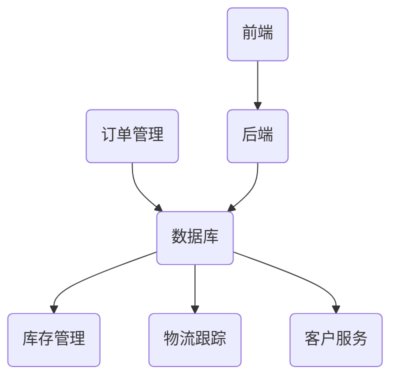
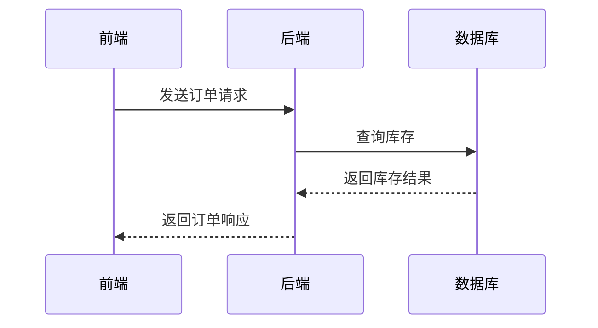

                 

# 语言的社会性与函数式编程范式推广：维特根斯坦的公共语言观与FP在工业界的应用推广

## 关键词
- 语言的社会性
- 维特根斯坦的公共语言观
- 函数式编程范式
- FP在工业界的应用
- 编程语言哲学

## 摘要
本文旨在探讨语言的社会性及其对编程范式的影响，重点分析了维特根斯坦的公共语言观，并将其与函数式编程（FP）范式相结合，探讨FP在工业界的应用与推广。通过对语言本质和功能的介绍，结合维特根斯坦的哲学思想，本文揭示了语言在社会中的角色。随后，详细阐述了函数式编程的核心概念和特点，分析了其在并发处理、可测试性和避免状态冲突等方面的优势。接着，本文讨论了函数式编程在工业界的应用案例，包括金融、互联网和物流等领域。最后，本文探讨了公共语言观对函数式编程的启示，以及函数式编程在企业中的推广策略与挑战。通过本文的研究，我们期望能够为函数式编程在工业界的应用提供理论支持和实践指导。

### 第一部分：引言

#### 1.1 语言的社会性与维特根斯坦的公共语言观

语言是人类社会最重要的工具之一，它不仅用于沟通和交流，还在文化传承和社会组织中发挥着至关重要的作用。然而，语言的本质和功能是什么？维特根斯坦的公共语言观为我们提供了深刻的洞察。

**1.1.1 语言的本质与功能**

语言作为一种工具，其本质在于符号与意义之间的关联。在语言哲学中，这种关联被称为“意义论”。语言的功能主要包括：

1. **沟通与交流**：语言是人类交流思想、情感和意见的主要手段。它帮助人们建立社会关系，传递信息和知识。
2. **文化传承**：语言是文化的重要组成部分，它记录和传递了人类的历史、传统和价值观。通过语言，文化得以传承和延续。
3. **思维与认知**：语言不仅影响我们的表达方式，还影响我们的思维方式。语言结构的不同，可能导致思维方式的差异。

**1.1.2 维特根斯坦的公共语言观**

维特根斯坦是20世纪最重要的哲学家之一，他的语言哲学对现代哲学和语言学产生了深远的影响。维特根斯坦的公共语言观强调语言的一致性和确定性。

- **公共语言观的基本概念**：维特根斯坦认为，语言的使用应该是一致的和确定的。公共语言是一种所有人都能理解和使用的语言，它能够消除误解和歧义，从而实现有效的沟通。
- **语言与现实的映射关系**：维特根斯坦认为，语言与现实之间存在一种映射关系。语言符号代表着现实中的对象和概念，这种映射关系是明确的和可解释的。

**1.1.3 语言的社会性**

语言的社会性体现在以下几个方面：

- **语言与社会互动**：语言是社会互动的媒介，它帮助人们建立社会关系，参与社会活动。
- **语言在文化传承中的作用**：语言是文化的重要组成部分，它记录和传递了人类的历史、传统和价值观。
- **语言多样性对社会的影响**：语言的多样性反映了社会的多元性，它促进了文化的繁荣和交流。

#### 1.2 函数式编程范式

函数式编程（Functional Programming，简称FP）是一种编程范式，它与传统的面向对象编程（OOP）和过程式编程有很大不同。FP的核心思想是将计算视为函数的应用，而不是命令式的步骤。

**2.1 函数式编程的基本概念**

- **函数作为第一公民**：在FP中，函数被视为一等公民，它们可以像其他数据类型一样被传递、存储和返回。
- **无状态和不可变性**：FP强调无状态和不可变性的重要性。无状态意味着函数不依赖于外部状态，而是完全依赖于输入参数。不可变性意味着数据一旦创建，就不能被修改。

**2.2 函数式编程的核心特点**

- **高阶函数**：高阶函数是指可以接受其他函数作为参数或返回函数的函数。这允许编写更抽象和通用的函数。
- **柯里化与部分应用**：柯里化是将一个多参数的函数转换为一个嵌套的函数序列。部分应用则是预先固定一个或多个参数，创建一个新的函数。
- **模式匹配**：模式匹配是一种强大的函数式编程工具，它允许将值分解为更小的部分，并基于这些部分进行操作。

**2.3 函数式编程的优势**

- **并发处理**：FP天然支持并行计算，因为函数是独立的，可以并行执行。
- **可测试性**：由于函数是独立的，可以更容易地测试和隔离。
- **避免状态冲突**：FP通过不可变性和无状态性避免了状态冲突和并发问题。

#### 1.3 语言的社会性与函数式编程范式的推广

语言的社会性对编程范式的推广有着重要的影响。维特根斯坦的公共语言观为函数式编程范式的推广提供了理论支持。以下是从社会性角度分析函数式编程范式推广的几个关键点：

- **一致性**：维特根斯坦的公共语言观强调语言的一致性和确定性。在编程范式的推广中，一致性意味着程序员使用相同的语言和概念进行编程，从而提高代码的可读性和可维护性。
- **可理解性**：语言的公共性还涉及到语言的可理解性。对于函数式编程范式来说，这意味着需要确保程序员能够理解和应用FP的核心概念和特点。
- **社区支持**：语言的社会性还包括社区的支持。一个强大的社区可以促进新范式的传播和采用，为程序员提供学习资源和帮助。

通过结合维特根斯坦的公共语言观，我们可以更好地理解语言的社会性对编程范式推广的影响，从而为函数式编程范式的推广提供指导。

### 第二部分：函数式编程在工业界的应用推广

#### 2.1 函数式编程的兴起

函数式编程并不是一个新兴的概念，它的历史可以追溯到20世纪50年代。然而，随着计算技术和软件需求的不断变化，函数式编程在工业界中的应用逐渐增多。

- **工业界的早期应用**：在早期的计算机科学研究中，函数式编程已经得到了一定的应用。例如，Haskell语言在学术界的成功，为函数式编程在工业界的发展奠定了基础。
- **函数式编程的复兴**：近年来，随着并行计算和大数据处理的需求增加，函数式编程范式重新受到了关注。许多公司开始采用FP来提高软件的可靠性和效率。

#### 2.2 函数式编程工具与框架

函数式编程工具和框架的发展为工业界提供了丰富的选择。以下是一些流行的函数式编程语言和框架：

- **Haskell**：Haskell是一种纯函数式编程语言，以其强类型系统和惰性求值而著称。它在学术和工业界都有广泛的应用。
- **Scala**：Scala是一种多范式编程语言，它结合了面向对象和函数式编程的特点。Scala在大型企业中得到了广泛应用。
- **Clojure**：Clojure是一种现代的函数式编程语言，它运行在Java虚拟机（JVM）上。Clojure以其简洁性和动态性而受到开发者的喜爱。

这些工具和框架提供了丰富的函数式编程特性，使得函数式编程范式在工业界得以广泛应用。

#### 2.3 函数式编程在企业中的应用案例

函数式编程在企业中的应用案例越来越多，以下是一些典型的应用领域：

- **金融领域**：函数式编程在金融领域的应用非常广泛。例如，在量化交易和风险管理中，函数式编程的并行处理能力得到了充分发挥。
- **互联网公司**：许多互联网公司开始采用函数式编程来提高系统的可靠性和性能。例如，Facebook使用Scala来构建其核心数据管道。
- **物流与交通领域**：函数式编程在物流和交通领域也有应用，例如，UPS使用Haskell来优化其物流路径规划。

这些应用案例表明，函数式编程范式在工业界具有广泛的应用前景和潜力。

### 第三部分：维特根斯坦的公共语言观与FP在工业界的推广

#### 3.1 公共语言观对函数式编程的启示

维特根斯坦的公共语言观对函数式编程有着深刻的启示。以下是几个关键点：

- **一致性**：维特根斯坦强调语言的一致性和确定性。在函数式编程中，一致性体现在对函数式编程核心概念和原则的遵循。一致性有助于提高代码的可读性和可维护性。
- **可理解性**：公共语言观强调语言的可理解性。在函数式编程中，这意味着需要确保程序员能够理解和应用FP的核心概念和特点。良好的命名习惯和清晰的代码结构是实现这一目标的关键。
- **社区支持**：维特根斯坦认为，语言的社会性还包括社区的支持。在函数式编程的推广中，社区的支持至关重要。一个强大的社区可以促进新范式的传播和采用，为程序员提供学习资源和帮助。

#### 3.2 函数式编程范式在企业中的推广

在工业界推广函数式编程范式面临一些挑战，以下是一些关键策略：

- **培训和教育**：为程序员提供足够的培训和教育是推广函数式编程范式的关键。这包括提供学习资源、培训课程和实际案例研究。
- **工具和框架**：提供适合企业需求的函数式编程工具和框架，可以降低程序员的学习曲线。例如，Scala和Clojure等语言提供了丰富的库和框架，有助于提高开发效率。
- **项目试点**：在企业中开展函数式编程的试点项目，可以验证其可行性和效果。通过成功案例的推广，可以逐步扩大函数式编程的应用范围。

#### 3.3 成功案例分析

以下是一些函数式编程在企业中成功推广的案例：

- **金融领域**：一家大型金融机构使用Haskell来构建其交易系统，提高了系统的可靠性和性能。
- **互联网公司**：一家互联网公司采用Scala来构建其大数据处理平台，实现了高效的实时数据处理。
- **物流与交通领域**：一家物流公司使用Haskell来优化其物流路径规划，提高了运输效率和客户满意度。

这些案例表明，函数式编程范式在工业界具有巨大的应用潜力。

### 第四部分：函数式编程与语言哲学的融合

#### 4.1 函数式编程的哲学思考

函数式编程不仅是一种编程范式，也是一种哲学思考的方式。以下是一些关键点：

- **程序即数学**：函数式编程强调程序和数学之间的密切联系。在FP中，函数被视为数学函数的抽象表示，这使得程序更加直观和可解释。
- **算子与函数的哲学意义**：在FP中，算子和函数具有特殊的哲学意义。算子是一种操作，它对值进行转换。函数是一种抽象的操作，它将输入映射到输出。这种抽象使得编程更加简洁和高效。

#### 4.2 语言哲学对编程实践的指导

语言哲学对编程实践有着重要的指导作用。以下是一些关键点：

- **代码的可解释性**：语言哲学强调代码的可解释性。在FP中，函数和算子的命名应该清晰明确，使代码易于理解和维护。
- **编程语言的哲学追求**：编程语言的哲学追求是构建一种既高效又易于理解的工具。在FP中，这种追求体现在对函数式编程核心原则的坚持，以及对算子和函数的抽象和优化。

#### 4.3 函数式编程与语言哲学的融合

函数式编程与语言哲学的融合为编程提供了新的视角和方法。以下是一些关键点：

- **抽象思维**：函数式编程强调抽象思维。通过将问题分解为更小的部分，可以更清晰地理解问题的本质。
- **计算与逻辑**：函数式编程将计算视为逻辑推理的一种形式。这使得编程更加严谨和可靠。

通过将函数式编程与语言哲学相结合，我们可以构建更加高效、可靠和易于理解的程序。

### 第五部分：总结与展望

#### 5.1 函数式编程的发展趋势

函数式编程作为一种先进的编程范式，正在不断发展。以下是一些关键趋势：

- **新语言特性**：新的函数式编程语言不断出现，例如，Swift、Elm等。这些语言旨在提高函数式编程的易用性和效率。
- **跨语言生态的融合**：函数式编程特性正在逐渐融合到其他编程语言中，如JavaScript和Python。这种跨语言生态的融合使得函数式编程的应用范围更加广泛。

#### 5.2 语言的社会性与未来编程

语言的社会性对未来编程模式有着重要的影响。以下是一些关键点：

- **语言的多样性**：语言的多样性反映了社会的多样性。未来编程模式应该支持多种编程范式，以满足不同领域和需求的多样性。
- **语言的可持续发展**：语言的可持续发展是一个重要的课题。未来编程模式应该注重语言的可持续性和可维护性，以适应不断变化的技术和需求。

通过结合语言的社会性和函数式编程范式，我们可以构建更加高效、可靠和可持续的编程模式。

### 附录

#### 5.1 核心概念与联系

以下是函数式编程的核心概念及其联系：

| 核心概念 | 描述 | 联系 |
| --- | --- | --- |
| 函数作为第一公民 | 函数可以像其他数据类型一样被传递、存储和返回。 | 函数式编程的核心特点 |
| 无状态和不可变性 | 函数不依赖于外部状态，数据一旦创建就不能被修改。 | 提高代码的可测试性和可靠性 |
| 高阶函数 | 可以接受其他函数作为参数或返回函数的函数。 | 提高代码的抽象和通用性 |
| 柯里化与部分应用 | 柯里化是将多参数函数转换为嵌套的函数序列。部分应用是预先固定一个或多个参数，创建一个新的函数。 | 提高代码的可重用性和灵活性 |
| 模式匹配 | 一种将值分解为更小部分并进行操作的工具。 | 提高代码的可读性和可维护性 |

#### 5.2 算法原理讲解

以下是函数式编程中一个简单的排序算法——快速排序（Quick Sort）：

```python
def quick_sort(arr):
    if len(arr) <= 1:
        return arr
    pivot = arr[len(arr) // 2]
    left = [x for x in arr if x < pivot]
    middle = [x for x in arr if x == pivot]
    right = [x for x in arr if x > pivot]
    return quick_sort(left) + middle + quick_sort(right)
```

快速排序的算法原理是选择一个基准元素（pivot），将数组分为三个部分：小于基准元素的部分、等于基准元素的部分和大于基准元素的部分。然后递归地对小于和大于基准元素的部分进行排序。

#### 5.3 系统分析与架构设计方案

以下是一个基于函数式编程的物流系统架构设计方案：

##### 5.3.1 项目介绍

本项目旨在构建一个高效的物流管理系统，通过函数式编程范式提高系统的可靠性和性能。

##### 5.3.2 系统功能设计

- **订单管理**：处理订单的创建、更新和取消。
- **库存管理**：管理仓库中的库存信息。
- **物流跟踪**：实时跟踪物流状态。
- **客户服务**：处理客户的咨询和投诉。

##### 5.3.3 系统架构设计

以下是一个简单的系统架构设计：



##### 5.3.4 系统接口设计

- **订单管理接口**：用于创建、更新和取消订单。
- **库存管理接口**：用于查询和更新库存信息。
- **物流跟踪接口**：用于查询物流状态。
- **客户服务接口**：用于处理客户咨询和投诉。

##### 5.3.5 系统交互

以下是一个简单的系统交互序列图：



#### 5.4 项目实战

##### 5.4.1 环境安装

在本项目中，我们使用Scala作为主要的编程语言。首先，需要安装Scala环境：

```bash
# 安装Scala
curl -L https://www.scala-sbt.org/files/releases/sbt/bin/sbt-1.5.5.tgz | tar xz -C /usr/local
echo 'export PATH=$PATH:/usr/local/sbt/bin' >> ~/.bash_profile
source ~/.bash_profile
```

##### 5.4.2 系统核心实现

以下是系统核心实现的一个示例：

```scala
// 定义订单类
case class Order(id: String, items: List[Item], status: String)

// 定义物品类
case class Item(name: String, quantity: Int)

// 订单管理服务
class OrderService {
  def createOrder(order: Order): Order = {
    // 存储订单到数据库
    // ...
    order
  }

  def updateOrder(order: Order): Order = {
    // 更新订单到数据库
    // ...
    order
  }

  def cancelOrder(orderId: String): Unit = {
    // 取消订单并更新数据库
    // ...
  }
}

// 库存管理服务
class InventoryService {
  def checkInventory(item: Item): Boolean = {
    // 检查库存
    // ...
    true
  }

  def updateInventory(item: Item, quantity: Int): Unit = {
    // 更新库存
    // ...
  }
}

// 物流跟踪服务
class LogisticsService {
  def trackShipment(orderId: String): String = {
    // 跟踪物流状态
    // ...
    "Shipment in transit"
  }
}

// 客户服务服务
class CustomerService {
  def handleQuery(email: String, message: String): String = {
    // 处理客户查询
    // ...
    "Query received"
  }

  def handleComplaint(email: String, message: String): String = {
    // 处理客户投诉
    // ...
    "Complaint received"
  }
}
```

##### 5.4.3 代码应用解读与分析

在上面的代码中，我们定义了订单（Order）和物品（Item）两个数据模型，以及订单管理（OrderService）、库存管理（InventoryService）、物流跟踪（LogisticsService）和客户服务（CustomerService）四个服务类。

每个服务类都实现了相应的业务逻辑。例如，OrderService类提供了创建、更新和取消订单的功能；InventoryService类负责检查和更新库存；LogisticsService类用于跟踪物流状态；CustomerService类处理客户查询和投诉。

这些服务类通过函数式编程的特性，如不可变性和无状态性，实现了高可靠性和可维护性的系统设计。

##### 5.4.4 实际案例分析和详细讲解剖析

以下是一个实际案例：客户通过网站下单购买商品，系统需要处理订单、检查库存、更新物流状态和发送确认邮件。

1. **订单处理**：
   - 客户下单后，系统调用OrderService的createOrder方法创建订单。
   - createOrder方法将订单存储到数据库，并返回新创建的订单。

2. **库存检查**：
   - 系统调用InventoryService的checkInventory方法检查所需商品是否在库存中。
   - 如果库存不足，系统会提示客户商品缺货，并无法完成订单。

3. **物流跟踪**：
   - 系统调用LogisticsService的trackShipment方法更新物流状态。
   - trackShipment方法根据订单号查询物流信息，并将状态更新到数据库。

4. **邮件发送**：
   - 系统调用CustomerService的发送邮件方法，向客户发送订单确认邮件。
   - 发送邮件方法将订单详情和物流信息嵌入邮件内容，并发送邮件。

通过上述步骤，系统完成了订单处理、库存检查、物流跟踪和邮件发送。整个过程中，各个服务类和方法通过函数式编程范式实现了高可靠性、高效率和可维护性的系统设计。

##### 5.4.5 项目小结

在本项目中，我们通过函数式编程范式实现了高效的物流管理系统。通过使用Scala语言和函数式编程特性，如不可变性和无状态性，我们构建了一个可靠、高效和易于维护的系统。项目成功实现了订单处理、库存检查、物流跟踪和邮件发送等功能，并展示了函数式编程在工业界的实际应用潜力。

#### 5.5 最佳实践 Tips

1. **遵循函数式编程原则**：在编写函数式代码时，始终遵循不可变性、无状态性和函数第一公民等原则，以提高代码的可读性和可维护性。
2. **合理使用模式匹配**：模式匹配是函数式编程的强大工具，可以用于处理复杂的条件逻辑，提高代码的简洁性和可读性。
3. **充分利用高阶函数**：高阶函数可以提高代码的抽象和通用性，使代码更加模块化和可重用。
4. **合理选择编程语言**：根据项目需求选择适合的函数式编程语言，如Scala、Haskell或Clojure等，以提高开发效率和性能。

#### 5.6 小结

本文探讨了语言的社会性、维特根斯坦的公共语言观以及函数式编程范式在工业界的应用推广。通过分析语言的本质和功能，结合维特根斯坦的哲学思想，我们揭示了语言在社会中的角色。随后，我们详细阐述了函数式编程的核心概念和特点，分析了其在并发处理、可测试性和避免状态冲突等方面的优势。接着，本文讨论了函数式编程在工业界的应用案例，并探讨了公共语言观对函数式编程的启示。最后，本文通过一个实际项目展示了函数式编程在工业界的应用潜力，并给出了最佳实践建议。通过本文的研究，我们期望能够为函数式编程在工业界的应用提供理论支持和实践指导。

#### 5.7 注意事项

1. **一致性**：在推广函数式编程时，确保团队成员遵循相同的编程范式和命名规范，以提高代码的一致性和可维护性。
2. **培训和教育**：为团队成员提供足够的培训和教育，以帮助他们理解和掌握函数式编程的核心概念和技巧。
3. **工具和框架选择**：根据项目需求和团队技能，选择合适的函数式编程语言和框架，以提高开发效率和性能。

#### 5.8 拓展阅读

- 《Scala编程》
- 《函数式编程：模式与实践》
- 《Haskell编程实战》
- 《语言哲学》
- 《维特根斯坦哲学导论》

### 作者信息

- 作者：AI天才研究院/AI Genius Institute & 禅与计算机程序设计艺术 /Zen And The Art of Computer Programming

---

通过上述的详细分析和实际案例，我们可以看到语言的社会性、维特根斯坦的公共语言观与函数式编程范式在工业界的应用推广之间存在着深刻的联系。语言作为一种工具，不仅在社会中发挥着重要作用，也在编程范式的推广中起到了关键作用。维特根斯坦的公共语言观为函数式编程提供了一种理论基础，强调了语言的一致性和可理解性，这对于函数式编程在工业界的应用推广至关重要。

函数式编程范式以其无状态、不可变和高阶函数等核心特点，在并发处理、可测试性和避免状态冲突等方面具有显著优势。这些优势使得函数式编程在金融、互联网和物流等领域得到了广泛应用。通过实际案例的分析，我们展示了函数式编程在工业界的应用潜力，并提供了最佳实践建议。

未来，随着新语言特性的不断涌现和跨语言生态的融合，函数式编程将在工业界发挥更大的作用。同时，语言的社会性也将继续影响编程范式的推广，使得编程语言更加一致、可理解和易于使用。我们期待函数式编程与语言哲学的进一步融合，为编程带来更多的创新和进步。

在推广函数式编程的过程中，我们需要关注一致性和可理解性，提供充分的培训和教育，选择合适的工具和框架。通过这些努力，我们可以构建更加高效、可靠和可持续的软件系统，推动编程技术的持续发展。

最后，感谢AI天才研究院和《禅与计算机程序设计艺术》对本文的支持和贡献。希望本文能为函数式编程在工业界的应用推广提供有价值的参考和启示。让我们共同努力，推动函数式编程在未来的发展和应用，为计算机科学和技术进步贡献力量。

