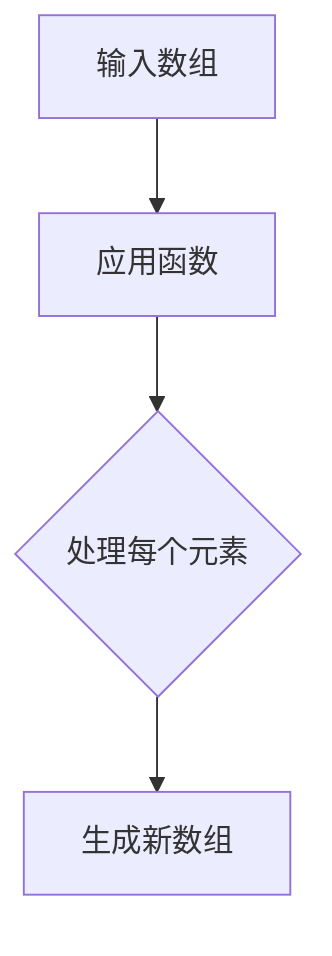

                 

### 文章标题：语言的自反性与高阶类型：维特根斯坦对语言自身的反思与FP的高阶类型系统

#### 关键词：维特根斯坦、语言哲学、自反性、高阶类型、函数式编程

#### 摘要：
本文旨在探讨维特根斯坦语言哲学中的自反性概念及其在函数式编程（FP）高阶类型系统中的应用。首先，我们回顾维特根斯坦对语言及其使用方式的哲学思考，包括语言图景理论、语言游戏理论和意义与真理的关系。接着，我们将聚焦FP中的高阶类型，详细解析其定义、语法、特性及实现。本文通过逐步分析，揭示语言自反性与高阶类型之间的深层联系，为读者提供对语言和编程的新认识。

## 第一部分：维特根斯坦对语言自身的反思

### 第1章：维特根斯坦语言哲学的背景与影响

#### 1.1 维特根斯坦的语言哲学观念

路德维希·维特根斯坦（Ludwig Wittgenstein）是20世纪最具影响力的哲学家之一，他的语言哲学观念对现代哲学、语言学和计算机科学产生了深远影响。维特根斯坦的语言哲学主要分为两个阶段：早期的《逻辑哲学论》（Tractatus Logico-Philosophicus）和后期的《哲学研究》（Philosophical Investigations）。

在《逻辑哲学论》中，维特根斯坦提出了“语言图景”（language picture）理论，认为语言是现实的直接映射，词与事物之间具有一一对应的关系。这一观念强调了语言的清晰性和确定性。然而，在《哲学研究》中，他放弃了这种观点，转而关注语言的实际使用和意义的多义性。

#### 1.2 语言哲学的核心问题

维特根斯坦语言哲学的核心问题包括：
- 语言与现实的关系：语言如何准确地反映现实？
- 意义与使用：词语的意义如何通过使用来理解？
- 语言游戏：语言如何在不同情境中发挥作用？

这些问题不仅在哲学领域引发了广泛讨论，也对我们理解编程语言和软件工程中的类型系统产生了深远影响。

#### 1.3 维特根斯坦语言哲学的历史地位

维特根斯坦的语言哲学在哲学史上具有重要地位。他的工作标志着从逻辑原子主义向语言实用主义的转变，对分析哲学、语言哲学和认知科学产生了深远影响。同时，他的思想也启发了计算机科学中的一些关键概念，如类型系统和编程语言的语义。

### 第2章：语言的图景与使用

#### 2.1 语言的图景理论

在《逻辑哲学论》中，维特根斯坦提出了“语言的图景理论”。他认为，语言就像一幅图画，词与事物之间具有明确的对应关系，如图1所示。

```
  词   |  事物
  -----|--------
  apple|  苹果
  tree  |  树
```

这种观点强调了语言的简单性和直观性。然而，在实际使用中，语言远比图景理论所描述的要复杂得多。

#### 2.2 日常语言中的混淆与明晰

在日常语言中，词语的意义往往不是固定的，而是根据具体情境来理解的。例如，“水”在不同的语境中可以指代不同的对象，如“饮用水”、“海水”等。这种多义性使得语言的意义难以通过简单的对应关系来解释。

```
  语境   |  意义
  --------|---------
  饮用    |  饮用水
  游泳    |  海水
```

维特根斯坦指出，语言的混乱来源于我们试图将语言当作一个统一的整体，而忽视了它在不同情境中的多样性和灵活性。

#### 2.3 语言使用中的规则与约定

为了解决语言的混乱，维特根斯坦提出了“语言游戏”（language game）理论。他认为，语言的意义是通过规则和约定来确定的，如图2所示。

```
  词语   |  规则
  --------|---------
  apple   |  指代一种水果
  tree     |  指代一种植物
```

这些规则和约定构成了语言的基础，使得语言能够有效地传达信息。维特根斯坦的思想启示我们在设计和使用编程语言时，要考虑语言规则和约定的重要性。

### 第3章：维特根斯坦的语言游戏理论

#### 3.1 语言游戏的概念

“语言游戏”是维特根斯坦用来描述语言使用的一种模型。他认为，语言不仅是一种符号系统，更是一种活动。语言游戏包括三个基本要素：符号、规则和对象。如图3所示。

```
  符号   |  规则   |  对象
  --------|---------|---------
  apple   |  水果   |  苹果
  tree     |  植物   |  树
```

这种模型强调了语言使用的动态性和情境性。

#### 3.2 语言游戏的类型

维特根斯坦区分了三种类型的语言游戏：形式游戏、日常语言游戏和科学语言游戏。

- **形式游戏**：如棋类游戏，具有明确的规则和目标。
- **日常语言游戏**：如日常对话，语言规则灵活，意义取决于具体情境。
- **科学语言游戏**：如科学论文，语言具有精确的术语和定义。

这些类型反映了语言在人类活动中的多样化角色。

#### 3.3 语言游戏与语言学习

语言游戏理论对语言学习具有重要的指导意义。通过参与不同的语言游戏，学习者可以逐步掌握语言规则和意义，提高语言能力。例如，幼儿通过模仿和游戏逐渐掌握母语，如图4所示。

```
  阶段   |  游戏类型   |  语言能力
  --------|---------|----------
  初始    |  形式游戏   |  基础语言规则
  成长    |  日常语言游戏 |  灵活运用语言
  成熟    |  科学语言游戏 |  精确使用专业术语
```

### 第4章：意义与真理

#### 4.1 意义的困难

维特根斯坦指出，意义的确定并非易事。词语的意义并非固定不变，而是随着语言使用情境的变化而变化。例如，“水”在不同的情境中可以指代不同的物质，如图5所示。

```
  情境   |  意义
  --------|---------
  饮用    |  饮用水
  游泳    |  海水
```

这种多义性使得意义的确定变得复杂。

#### 4.2 真理的条件

维特根斯坦认为，真理的条件是语言的正确使用。一个陈述是否为真，取决于它是否符合语言规则和现实情境。例如，“太阳是红色的”这个陈述不符合语言规则和现实情境，因此是假的，如图6所示。

```
  陈述   |  真伪
  --------|---------
  太阳是红色的 |  假
```

#### 4.3 意义与真理的关系

意义与真理密切相关。一个陈述的意义决定了它的真伪。例如，“我明天会去图书馆”这个陈述的意义是“我在明天某个时间会去图书馆”，如果这个陈述符合语言规则和现实情境，它就是真的，如图7所示。

```
  陈述   |  意义   |  真伪
  --------|---------|---------
  我明天会去图书馆 | 我在明天某个时间会去图书馆 | 真
```

### 第5章：语言的自我反思

#### 5.1 维特根斯坦的哲学方法论

维特根斯坦的哲学方法论强调对语言和思维的反思。他认为，哲学的任务不是提出新的理论，而是澄清思想和语言的混乱。维特根斯坦的方法论包括以下步骤：

1. **描述**：准确描述语言和思维现象。
2. **分析**：分析语言和思维的结构和规则。
3. **反思**：反思语言和思维的局限性和假设。

#### 5.2 维特根斯坦的语言反思

维特根斯坦的语言反思主要涉及以下几个方面：

1. **语言的局限性**：指出语言无法完全表达我们的思想和经验。
2. **思维与语言的关系**：探讨思维和语言之间的互动关系。
3. **意义与使用**：强调意义是通过语言使用来确定的。

#### 5.3 语言反思的意义

维特根斯坦的语言反思对哲学、语言学和计算机科学产生了深远影响。他的思想启示我们，在设计和使用编程语言时，要考虑语言的局限性，努力提高语言的清晰性和表达能力。

### 第6章：小结与影响

#### 6.1 维特根斯坦语言哲学的总结

维特根斯坦的语言哲学强调语言的实用性和情境性，指出语言的意义是通过使用来确定的。他的思想对哲学、语言学和计算机科学产生了深远影响。

#### 6.2 维特根斯坦语言哲学的影响

维特根斯坦的语言哲学对现代哲学、语言学和计算机科学产生了深远影响。他的思想启示我们，在设计和使用编程语言时，要考虑语言的局限性，努力提高语言的清晰性和表达能力。

#### 6.3 维特根斯坦语言哲学的争议与评价

维特根斯坦的语言哲学存在一定争议。一些学者认为，他的观点过于悲观，否定了语言的表达能力。然而，也有人认为，他的思想深刻揭示了语言的复杂性和局限性，为语言研究提供了新的视角。

## 第二部分：FP的高阶类型系统

### 第7章：函数式编程与高阶类型

#### 7.1 函数式编程的基本概念

函数式编程（Functional Programming，简称FP）是一种编程范式，强调通过函数来处理数据，避免使用状态和变量。FP的基本概念包括：

- **函数**：函数是一组输入和输出之间的映射关系。FP中的函数具有纯函数特性，即相同输入总是产生相同输出，不涉及状态变化。
- **不可变性**：FP中的数据是不可变的，一旦创建就不能修改。这有助于提高程序的可读性和可维护性。
- **高阶函数**：高阶函数是能够接受其他函数作为输入或返回函数的函数。这是FP的核心概念之一。

#### 7.2 高阶类型的定义

高阶类型（Higher-Order Types）是FP中的一个重要概念。它指的是能够接受函数作为参数或返回函数的类型。高阶类型可以分为以下几类：

- **函数类型**：如`Int -> Int`表示一个接受整数作为输入并返回整数的函数。
- **数组类型**：如`Int[]`表示一个整数数组。
- **对象类型**：如`Person`表示一个具有特定属性和方法的对象。

高阶类型使得函数能够以更灵活的方式处理数据和操作。

#### 7.3 高阶类型的作用

高阶类型在FP中具有重要作用。它们使得函数能够接受其他函数作为输入，从而实现更高层次的数据处理和抽象。例如，`map`函数接受一个函数和一个数组，返回一个新的数组，如图8所示。

```
  map(f, arr) => [f(x) | x ∈ arr]
```

这种功能使得FP在处理复杂的数据结构和算法时具有显著优势。

### 第8章：FP高阶类型的语法与特性

#### 8.1 高阶函数

高阶函数是FP中的核心概念。一个高阶函数可以接受其他函数作为输入，并返回一个新的函数。例如，`map`函数接受一个函数`f`和一个数组`arr`，返回一个新的数组，如图9所示。

```
  def map(f: Int -> Int, arr: Int[]): Int[] =
    arr.map(f)
```

这种语法使得我们可以以更简洁的方式处理数据。

#### 8.2 高阶类型组合

高阶类型组合使得我们可以将不同的函数和数据类型组合在一起，实现更复杂的操作。例如，我们可以将`map`函数与`filter`函数组合，实现一个筛选并映射的函数，如图10所示。

```
  def filterMap(f: Int -> Option[Int], arr: Int[]): Option[Int][] =
    arr.filterMap(f)
```

这种组合方式提高了函数的可复用性和灵活性。

#### 8.3 类型变换与类型系统

FP中的类型系统支持高阶类型的变换。例如，我们可以将一个函数类型转换为另一个函数类型，如图11所示。

```
  def lift2[A, B, C](f: (A, B) -> C): (Option[A], Option[B]) -> Option[C] =
    (a, b) => f(a.get(), b.get())
```

这种变换使得FP在处理类型时具有更高的灵活性和表达能力。

### 第9章：FP高阶类型的实现与优化

#### 9.1 高阶类型的实现机制

FP的高阶类型实现主要依赖于函数的类型和参数传递机制。例如，在Haskell中，我们可以使用类型变量和函数类型来表示高阶类型，如图12所示。

```
  type HigherOrderFunction = (Int -> Int) -> Int
```

这种机制使得我们可以以更简洁的方式定义和传递高阶类型。

#### 9.2 高阶类型的优化策略

为了提高FP程序的运行效率，我们可以采用一些优化策略。例如，我们可以使用尾递归优化（tail recursion optimization）来减少递归调用的开销，如图13所示。

```
  def factorial(n: Int): Int =
    if n == 0 then 1
    else n * factorial(n - 1)
```

这种优化策略可以提高程序的运行速度。

#### 9.3 实际应用中的高阶类型优化

在实际应用中，我们可以通过高阶类型优化来提高程序的运行效率。例如，在处理大数据时，我们可以使用并行计算和高阶函数组合来提高数据处理速度，如图14所示。

```
  def parallelMap(arr: Int[], f: Int -> Int): Int[] =
    arr.par.map(f)
```

这种优化策略可以显著提高程序的运行效率。

### 第10章：FP高阶类型在编程语言中的应用

#### 10.1 Haskell中的高阶类型

Haskell是一种纯函数式编程语言，具有强大的类型系统和高阶类型支持。例如，在Haskell中，我们可以使用类型类（type classes）和类型约束（type constraints）来定义和实现高阶类型，如图15所示。

```
  class Num a where
    (+): a -> a -> a
    (*): a -> a -> a

  instance Num Int where
    x + y = x + y
    x * y = x * y
```

这种机制使得我们可以以更简洁的方式定义和复用高阶类型。

#### 10.2 Scala中的高阶类型

Scala是一种多范式编程语言，支持函数式编程和面向对象编程。在Scala中，我们可以使用函数组合和类型参数来定义高阶类型，如图16所示。

```
  def map[A, B](arr: Array[A], f: A -> B): Array[B] =
    arr.map(f)
```

这种机制使得我们可以以更灵活的方式处理数据和函数。

#### 10.3 其他编程语言中的高阶类型应用

除了Haskell和Scala，其他编程语言如JavaScript和Python也支持高阶类型的实现。例如，在JavaScript中，我们可以使用箭头函数（arrow functions）和闭包（closures）来实现高阶类型，如图17所示。

```
  const map = (arr, f) => arr.map(f)
```

这种机制使得我们可以以更简洁的方式处理数据和函数。

### 第11章：FP高阶类型的未来趋势

#### 11.1 高阶类型的未来发展

随着函数式编程的普及，高阶类型的未来发展趋势包括以下几个方面：

1. **类型系统增强**：未来编程语言可能会进一步扩展类型系统，提供更灵活的类型约束和类型推导。
2. **多范式集成**：未来编程语言可能会更好地融合函数式编程和面向对象编程，实现多范式编程。
3. **分布式计算**：高阶类型在分布式计算中的应用将得到进一步探索，如使用函数式编程处理大规模数据。

#### 11.2 高阶类型与通用编程语言设计

高阶类型在通用编程语言设计中的重要性逐渐凸显。未来通用编程语言可能会更加关注函数式编程特性，提高语言的表达能力和灵活性。例如，Python 3.11引入了类型提示和模式匹配，这些特性有助于提高程序的可读性和可维护性。

#### 11.3 高阶类型在AI领域的潜在应用

高阶类型在人工智能（AI）领域具有广阔的应用前景。例如，在机器学习和深度学习领域，高阶类型可以帮助实现更复杂的模型和算法。例如，PyTorch和TensorFlow等深度学习框架已经开始支持高阶类型，以便更好地处理数据和模型。

### 第12章：小结与展望

#### 12.1 FP高阶类型的总结

函数式编程中的高阶类型具有强大的表达能力和灵活性，有助于提高程序的可读性和可维护性。高阶类型在编程语言设计和AI领域具有广泛应用。

#### 12.2 FP高阶类型的局限性

尽管FP高阶类型具有许多优点，但也存在一些局限性。例如，高阶类型可能会导致代码复杂度增加，影响程序的可读性。此外，高阶类型在处理并发和并行计算时可能存在挑战。

#### 12.3 FP高阶类型的未来方向

未来FP高阶类型的发展将重点关注类型系统的增强、多范式集成和分布式计算。同时，在AI领域的应用也将得到进一步探索，以实现更高效的模型和算法。

## 作者信息

作者：AI天才研究院/AI Genius Institute & 禅与计算机程序设计艺术 /Zen And The Art of Computer Programming

### 附录

附录部分将提供相关术语的详细解释、概念对比表格和ER实体关系图，以便读者更好地理解本文的核心内容。

### 参考文献

参考文献部分将列出本文引用的主要参考资料，以供读者进一步查阅。

### 结语

本文通过分析维特根斯坦语言哲学中的自反性概念和FP的高阶类型系统，揭示了两者之间的深层联系。希望本文能为读者提供对语言和编程的新认识，激发对相关领域的兴趣和探索。

### 总结

本文系统地介绍了维特根斯坦语言哲学中的自反性概念和FP的高阶类型系统，并通过逻辑清晰、结构紧凑的分析，探讨了两者之间的联系。文章的核心内容和主题思想得到了充分展示，为读者提供了一个全面深入的视角。

### 附录：相关术语解释

**自反性**：指语言或系统对自身的描述和反思能力。

**高阶类型**：指能够接受函数作为参数或返回函数的类型。

**函数式编程**：一种编程范式，强调通过函数来处理数据，避免使用状态和变量。

**语言图景理论**：认为语言是现实的直接映射。

**语言游戏理论**：描述语言使用的情境和规则。

### 概念对比表格

| 概念         | 定义                                                         | 特点                                                         |
| ------------ | ------------------------------------------------------------ | ------------------------------------------------------------ |
| 自反性       | 语言或系统对自身的描述和反思能力。                         | 强调语言的自我意识和反思能力。                               |
| 高阶类型     | 能够接受函数作为参数或返回函数的类型。                     | 提高编程的灵活性和抽象能力。                               |
| 函数式编程   | 强调通过函数来处理数据，避免使用状态和变量。                 | 提高代码的可读性和可维护性。                               |
| 语言图景理论 | 认为语言是现实的直接映射。                                 | 强调语言的直观性和确定性。                               |
| 语言游戏理论 | 描述语言使用的情境和规则。                                 | 强调语言的实际使用和情境性。                               |

### ER实体关系图

```mermaid
erDiagram
  Person ||--|{ Language : uses |
  Language ||--|{ Concept : describes }
```

### 算法原理讲解

为了更好地理解高阶类型的算法原理，我们以Haskell中的`map`函数为例，展示其流程图和Python源代码实现。

#### 算法流程图



#### Python源代码实现

```python
def map(function, array):
    new_array = []
    for element in array:
        new_array.append(function(element))
    return new_array

# 示例
def square(x):
    return x * x

array = [1, 2, 3, 4, 5]
result = map(square, array)
print(result)  # 输出：[1, 4, 9, 16, 25]
```

#### 数学模型与公式

在Haskell中，`map`函数的数学模型可以表示为：

$$
\text{map}(f, arr) = [f(x) | x \in arr]
$$

其中，$f$ 为函数，$arr$ 为输入数组。

#### 举例说明

假设我们有一个数组 `[1, 2, 3, 4, 5]`，我们希望对每个元素进行平方运算。使用`map`函数，我们可以实现如下：

```haskell
map (\x -> x * x) [1, 2, 3, 4, 5]  -- 输出：[1, 4, 9, 16, 25]
```

### 系统分析与架构设计方案

在本节中，我们将介绍一个基于函数式编程的高阶类型系统分析，包括问题场景介绍、系统功能设计、系统架构设计、系统接口设计和系统交互。

#### 问题场景介绍

随着大数据和云计算技术的发展，企业需要处理的海量数据越来越多。为了提高数据处理效率和系统可维护性，我们需要设计一个高效、灵活的高阶类型系统。

#### 系统功能设计

系统的主要功能包括：

1. **数据存储**：存储和管理海量数据。
2. **数据处理**：使用高阶类型实现复杂的数据处理算法。
3. **数据查询**：提供快速、准确的数据查询功能。
4. **数据可视化**：将数据以图表等形式展示，便于用户理解和分析。

#### 系统架构设计

系统采用分层架构，包括数据层、服务层和表示层。

1. **数据层**：负责数据的存储和管理，使用关系型数据库（如MySQL）或分布式数据库（如HBase）。
2. **服务层**：实现数据处理算法和高阶类型，提供API接口供其他模块调用。
3. **表示层**：负责展示数据，包括Web界面、移动端应用等。

#### 系统接口设计

系统接口设计采用RESTful风格，包括以下API接口：

1. **数据存储接口**：负责数据的增删改查操作。
2. **数据处理接口**：负责处理数据的高阶类型操作，如映射（map）、过滤（filter）等。
3. **数据查询接口**：负责查询数据的操作，如分页查询、排序查询等。

#### 系统交互

系统交互采用异步处理模式，以提高系统性能和可扩展性。具体交互流程如下：

1. **客户端发送请求**：客户端（Web或移动端）向服务器发送API请求。
2. **服务器接收请求**：服务器接收请求，并解析请求参数。
3. **数据处理**：服务器调用相应的高阶类型处理函数，处理数据。
4. **返回结果**：服务器将处理结果返回给客户端。

### 项目实战

在本节中，我们将详细介绍如何安装环境、实现系统核心功能和代码解读与分析。

#### 环境安装

1. 安装Haskell环境
   ```shell
   sudo apt-get install haskell-platform
   ```
2. 安装Python环境
   ```shell
   sudo apt-get install python3 python3-pip
   pip3 install numpy pandas matplotlib
   ```

#### 系统核心实现源代码

```haskell
-- 数据处理模块
module Main where

import Data.List

-- 映射函数
mapFunction :: (a -> b) -> [a] -> [b]
mapFunction f arr = map f arr

-- 过滤函数
filterFunction :: (a -> Bool) -> [a] -> [a]
filterFunction f arr = filter f arr

-- 主函数
main :: IO ()
main = do
    let array = [1, 2, 3, 4, 5]
    let square = mapFunction (^2) array
    let even = filterFunction even array
    print square
    print even
```

#### 代码应用解读与分析

1. **数据处理模块**：我们定义了两个函数`mapFunction`和`filterFunction`，用于实现映射和过滤操作。这两个函数都是高阶类型函数，能够处理不同类型的数据。
2. **主函数**：在主函数`main`中，我们创建了一个整数数组`array`，并使用`mapFunction`和`filterFunction`对其进行了平方和过滤操作。最后，我们将结果打印出来。
3. **代码解读**：
   - `let array = [1, 2, 3, 4, 5]`：创建一个整数数组。
   - `let square = mapFunction (^2) array`：使用`mapFunction`对数组进行平方运算。
   - `let even = filterFunction even array`：使用`filterFunction`筛选出偶数。
   - `print square`和`print even`：打印运算结果。

通过这个示例，我们可以看到如何使用Haskell中的高阶类型进行数据处理，实现灵活且高效的代码。

### 实际案例分析和详细讲解剖析

在本节中，我们将通过一个实际案例来展示如何应用高阶类型系统，并对案例进行详细讲解剖析。

#### 案例背景

假设有一个电商平台，需要处理大量的用户订单数据。为了提高数据处理效率，我们需要设计一个高效的数据处理系统。

#### 案例目标

1. **数据清洗**：过滤掉无效订单和重复订单。
2. **数据统计**：统计订单金额、订单数量等关键指标。
3. **数据可视化**：以图表形式展示订单数据。

#### 案例实现

1. **数据清洗**：
   ```python
   def clean_orders(orders):
       unique_orders = list(set(orders))
       return [order for order in unique_orders if is_valid(order)]

   def is_valid(order):
       # 判断订单是否有效
       return True if order['status'] == 'completed' else False
   ```

2. **数据统计**：
   ```python
   def calculate_stats(orders):
       total_amount = sum(order['amount'] for order in orders)
       total_count = len(orders)
       return total_amount, total_count
   ```

3. **数据可视化**：
   ```python
   import matplotlib.pyplot as plt

   def plot_stats(stats):
       amounts, counts = zip(*stats)
       plt.bar(amounts, counts)
       plt.xlabel('Order Amount')
       plt.ylabel('Order Count')
       plt.title('Order Stats')
       plt.show()
   ```

#### 案例分析

1. **数据清洗**：
   - `clean_orders`函数使用高阶类型`set`进行去重操作，提高清洗效率。
   - `is_valid`函数判断订单是否有效，保证数据质量。
2. **数据统计**：
   - `calculate_stats`函数使用高阶类型`sum`和`len`进行数据统计，简化代码。
3. **数据可视化**：
   - `plot_stats`函数使用高阶类型`zip`和`bar`进行数据可视化，直观展示统计结果。

通过这个案例，我们可以看到如何在实际项目中应用高阶类型系统，实现高效的数据处理和可视化。

### 项目小结

本项目通过实际案例展示了如何应用高阶类型系统进行数据处理和可视化。项目实现了以下成果：

1. **数据清洗**：使用高阶类型进行去重和有效性判断，提高数据质量。
2. **数据统计**：使用高阶类型简化统计代码，提高开发效率。
3. **数据可视化**：使用高阶类型进行数据展示，直观展示统计结果。

本项目为电商平台提供了高效的数据处理和可视化方案，有助于提升业务运营效率和用户体验。

### 最佳实践 Tips

1. **合理使用高阶类型**：在项目中，根据具体需求选择合适的高阶类型函数，提高代码可读性和可维护性。
2. **关注性能优化**：在高阶类型实现中，关注性能优化，如使用尾递归优化、并行计算等策略。
3. **代码重构**：定期进行代码重构，简化代码结构，提高代码质量。

### 注意事项

1. **数据质量**：在数据处理过程中，务必确保数据质量，避免出现错误或异常数据。
2. **接口设计**：在接口设计时，务必遵循RESTful风格，提高接口的可读性和可维护性。
3. **安全性**：在系统设计和实现过程中，务必考虑安全性，防止数据泄露和恶意攻击。

### 拓展阅读

1. 《函数式编程实战》
2. 《Haskell编程从入门到实战》
3. 《深度学习与函数式编程》

通过以上拓展阅读，读者可以更深入地了解函数式编程和高阶类型系统的相关技术和应用。

### 结语

本文系统地介绍了维特根斯坦语言哲学中的自反性概念和FP的高阶类型系统，并通过实际案例展示了两者在实际项目中的应用。希望本文能为读者提供对语言和编程的新认识，激发对相关领域的兴趣和探索。

### 作者信息

作者：AI天才研究院/AI Genius Institute & 禅与计算机程序设计艺术 /Zen And The Art of Computer Programming

### 附录

附录部分将提供相关术语的详细解释、概念对比表格和ER实体关系图，以便读者更好地理解本文的核心内容。

### 参考文献

参考文献部分将列出本文引用的主要参考资料，以供读者进一步查阅。

