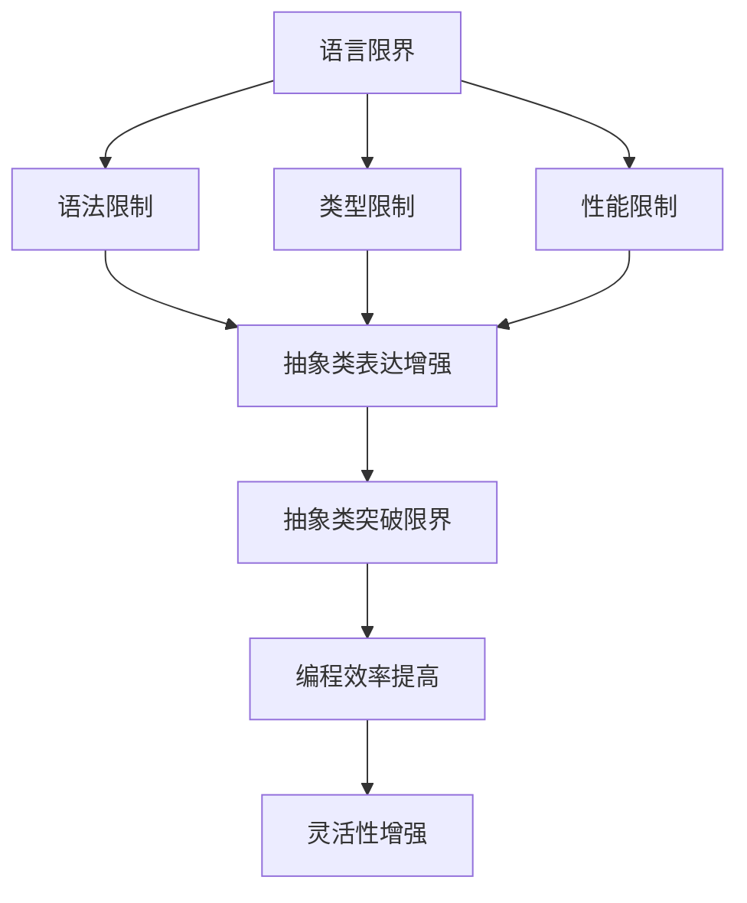
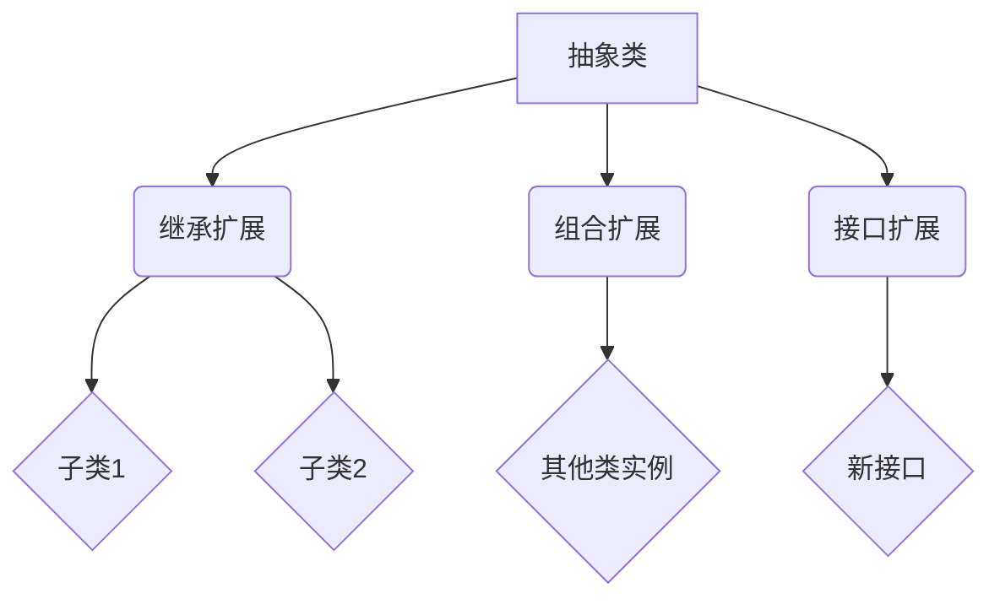
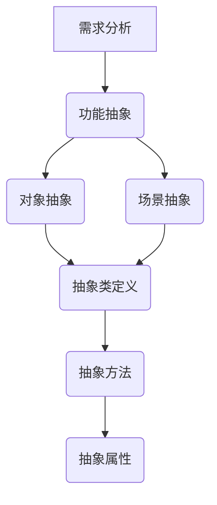
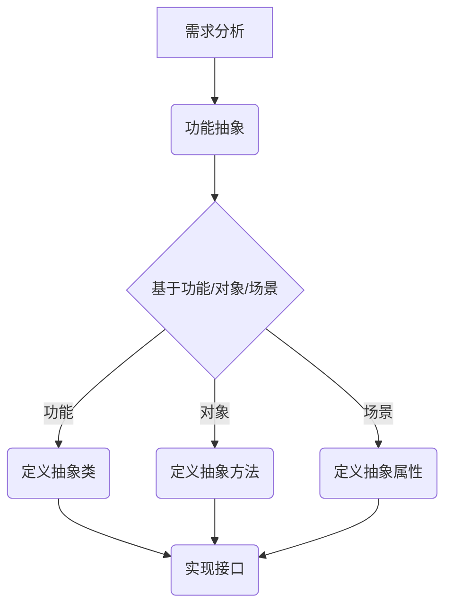
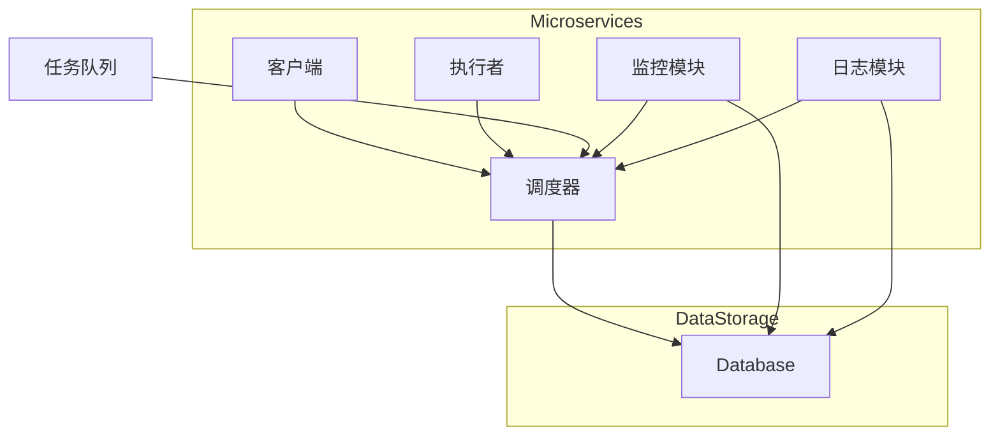
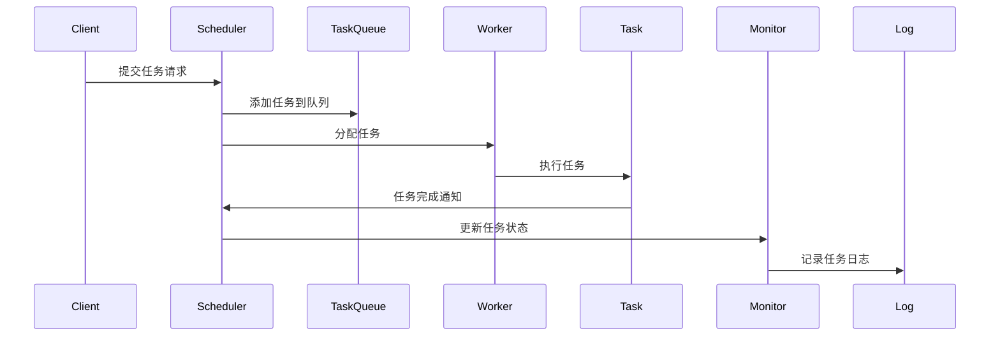

                 


### 第一部分: 语言限界与抽象类：表达能力的边界探索

#### 1.1 问题背景

##### 1.1.1 计算机语言的发展

计算机语言的发展历程，可以追溯到20世纪50年代。当时，计算机主要用于科学计算，编程语言以机器语言和汇编语言为主。这些低级语言直接操作计算机硬件，具有极高的执行效率，但它们对程序员的要求极高，需要深入了解计算机的硬件结构和指令集。

随着计算机技术的发展，程序复杂度不断提高，低级语言逐渐暴露出其局限性。于是，20世纪60年代，出现了高级语言，如Fortran、COBOL和ALGOL等。高级语言通过提供更抽象的语法和语义，降低了编程的难度，提高了编程效率。

高级语言的发展，使计算机程序设计进入了一个新的时代。但与此同时，语言表达能力的限制也逐渐显现出来。不同的高级语言，在语法、语义、表达能力和效率等方面，存在一定的差异。

##### 1.1.2 语言表达能力的限制

语言表达能力，指的是编程语言能够表达复杂逻辑和操作的能力。语言表达能力的限制，主要体现在以下几个方面：

1. **语法限制**：不同的编程语言，其语法规则和结构不同，可能导致某些复杂的逻辑难以表达。

2. **类型限制**：编程语言中的数据类型有限，可能无法满足特定应用场景的需求。

3. **运算能力与效率**：高级语言在执行效率上通常不如低级语言，这可能会限制某些高性能计算的需求。

4. **表达能力不足**：某些高级语言可能在特定领域或应用场景下，无法充分表达所需的功能和逻辑。

##### 1.1.3 抽象类的作用

为了解决语言表达能力的限制，抽象类作为一种编程概念被引入。抽象类是面向对象编程中的一个核心概念，它通过提供一种抽象的、通用的模板，使得程序员可以复用代码，提高编程效率。

抽象类的作用主要体现在以下几个方面：

1. **提高代码复用性**：通过抽象类，可以定义一组具有相似功能和特征的类，使得程序员可以更方便地复用代码。

2. **降低耦合度**：通过抽象类，可以降低类之间的耦合度，使得系统更加模块化，易于维护和扩展。

3. **提高可读性**：通过抽象类，可以明确类之间的继承关系和接口规范，使得程序结构更加清晰，易于理解。

4. **支持多态**：通过抽象类，可以实现多态，使得子类可以动态地替换父类，提高程序的灵活性和扩展性。

#### 1.2 问题描述

##### 1.2.1 语言表达能力不足的问题

语言表达能力不足的问题，主要表现在以下几个方面：

1. **语法复杂性**：某些复杂的逻辑和算法，可能无法用现有的编程语言语法表达。

2. **类型限制**：编程语言中的数据类型有限，可能无法满足特定应用场景的需求。

3. **性能瓶颈**：高级语言在执行效率上通常不如低级语言，这可能会限制某些高性能计算的需求。

4. **功能限制**：某些高级语言可能在特定领域或应用场景下，无法充分表达所需的功能和逻辑。

##### 1.2.2 抽象类在编程中的作用

抽象类在编程中具有重要作用，主要体现在以下几个方面：

1. **代码复用**：通过抽象类，可以定义一组具有相似功能和特征的类，使得程序员可以更方便地复用代码。

2. **模块化设计**：通过抽象类，可以降低类之间的耦合度，使得系统更加模块化，易于维护和扩展。

3. **提高可读性**：通过抽象类，可以明确类之间的继承关系和接口规范，使得程序结构更加清晰，易于理解。

4. **支持多态**：通过抽象类，可以实现多态，使得子类可以动态地替换父类，提高程序的灵活性和扩展性。

##### 1.2.3 语言限界与抽象类的交互

语言限界与抽象类之间存在一定的交互关系。一方面，抽象类的设计和实现，需要考虑语言限界的限制，如语法、类型、性能等。另一方面，抽象类可以通过设计不同的抽象层次和接口规范，突破语言限界，提高表达能力和编程效率。

#### 1.3 问题解决

##### 1.3.1 抽象类的设计原则

为了设计出高效的抽象类，需要遵循以下原则：

1. **确定性**：抽象类应该具有明确的职责和功能，避免模糊和冗余。

2. **普适性**：抽象类应该适用于广泛的场景和需求，避免过度定制化。

3. **可扩展性**：抽象类应该支持扩展和继承，以便适应未来的需求变化。

4. **易用性**：抽象类应该易于使用和理解，降低学习成本和维护难度。

##### 1.3.2 语言限界对抽象类的影响

语言限界对抽象类的设计和实现具有显著影响。一方面，语言限界可能限制抽象类的表达能力，如语法、类型、性能等。另一方面，抽象类可以通过设计不同的抽象层次和接口规范，在一定程度上突破语言限界，提高表达能力和编程效率。

##### 1.3.3 抽象类的边界与外延

抽象类的边界是指其能够表达和实现的功能范围。抽象类的外延是指其可以扩展和继承的边界。设计良好的抽象类，应该在边界与外延之间取得平衡，既能够充分表达需求，又能够保持系统的灵活性和可维护性。

#### 1.4 概念结构与核心要素组成

##### 1.4.1 语言表达能力

语言表达能力是指编程语言能够表达复杂逻辑和操作的能力。它包括语法表达能力、类型表达能力、运算能力与效率等方面。

##### 1.4.2 抽象类

抽象类是面向对象编程中的一个核心概念，它通过提供一种抽象的、通用的模板，使得程序员可以复用代码，提高编程效率。

##### 1.4.3 语言限界

语言限界是指编程语言在语法、类型、性能等方面的限制，这些限制可能影响抽象类的表达能力和编程效率。

#### 1.5 本章小结

本章主要介绍了语言限界与抽象类的相关概念、问题背景、作用和设计原则。语言限界是编程语言在语法、类型、性能等方面的限制，而抽象类则是面向对象编程中的一个核心概念，通过提供一种抽象的、通用的模板，提高了编程效率和代码复用性。在下一章中，我们将深入探讨语言表达能力、抽象类和语言限界之间的联系，以及如何通过设计良好的抽象类，突破语言限界，提高编程效率。

----------------------------------------------------------------

### 第二部分：核心概念与联系

#### 2.1 语言表达能力

##### 2.1.1 语言表达能力的定义

语言表达能力是指编程语言能够表达复杂逻辑和操作的能力。它包括语法表达能力、类型表达能力、运算能力与效率等方面。一个强大的编程语言，应该能够在语法层面提供丰富的表达方式，在类型系统上能够灵活处理各种数据类型，同时在运算能力和效率上能够满足高性能计算的需求。

##### 2.1.2 语言表达能力的核心特征

语言表达能力的核心特征主要包括：

1. **语法表达能力**：语法是编程语言的核心，它决定了程序员能否用简洁和直观的方式表达复杂的逻辑和算法。

2. **表达范围与精度**：编程语言的表达能力还体现在能否准确表达各种概念和操作，包括数值、字符串、列表、函数等。

3. **运算能力与效率**：编程语言在执行效率上直接影响到程序的运行性能，高性能的运算能力是语言表达能力的重要指标。

##### 2.1.3 语言表达能力的评估方法

评估语言表达能力的方法主要包括以下几个方面：

1. **语法表达能力**：可以通过分析编程语言提供的语法结构和操作符，评估其在表达复杂逻辑时的灵活性和直观性。

2. **表达范围与精度**：可以通过比较不同编程语言对各种数据类型和概念的支持程度，评估其在表达复杂逻辑时的精度和广度。

3. **运算能力与效率**：可以通过运行基准测试，评估编程语言在不同计算任务上的性能表现。

###### 2.1.3.1 语法表达能力

语法表达能力可以通过以下几个维度来衡量：

1. **语法结构**：编程语言提供的语法结构是否丰富和直观，如循环、条件语句、函数定义等。

2. **操作符和函数库**：编程语言提供的操作符和函数库是否全面，能否满足各种常见和复杂的操作需求。

3. **模板和代码生成**：编程语言是否支持模板和代码生成技术，这可以显著提高代码的复用性和开发效率。

###### 2.1.3.2 表达范围与精度

表达范围与精度可以通过以下几个方面来评估：

1. **数据类型**：编程语言提供的数据类型是否丰富，如整数、浮点数、字符串、复数等。

2. **概念表达**：编程语言能否表达各种常见的编程概念，如列表、字典、函数、类等。

3. **精确度**：编程语言在处理数值和字符串时，能否提供足够的精度，以避免常见的精度问题。

###### 2.1.3.3 运算能力与效率

运算能力与效率可以从以下几个方面来衡量：

1. **执行速度**：编程语言的编译器和解释器能否高效地执行代码，以减少运行时间。

2. **内存管理**：编程语言如何管理内存，包括对象的创建、销毁和垃圾回收等。

3. **并发与并行**：编程语言是否支持并发和并行编程，以充分利用多核处理器的能力。

#### 2.2 抽象类

##### 2.2.1 抽象类的定义

抽象类（Abstract Class）是面向对象编程中的一个重要概念。它是一种特殊的类，用于定义抽象的、通用的模板，不能被直接实例化，但可以被子类继承。抽象类通常包含抽象方法和抽象属性，这些抽象元素定义了类的行为和属性，但未提供具体的实现。

##### 2.2.2 抽象类的核心特征

抽象类的核心特征包括：

1. **抽象方法**：抽象方法是没有具体实现的方法，它定义了类的行为，但未提供具体的实现细节。

2. **抽象属性**：抽象属性是没有具体值的属性，它定义了类的属性，但未提供具体的值。

3. **继承性**：抽象类可以被子类继承，子类可以继承抽象类的抽象方法和属性，并可以提供具体的实现。

4. **多态性**：通过抽象类，可以实现多态，使得子类可以动态地替换父类，提高程序的灵活性和扩展性。

##### 2.2.3 抽象类的应用场景

抽象类在编程中有多种应用场景，包括：

1. **类抽象**：用于抽象出具有相似特征和行为的类，使得代码更加模块化和可复用。

2. **方法抽象**：用于定义公共的方法接口，使得子类可以重写这些方法，以实现特定功能。

3. **属性抽象**：用于定义公共的属性接口，使得子类可以重写这些属性，以实现特定逻辑。

#### 2.3 语言限界

##### 2.3.1 语言限界的定义

语言限界（Language Boundaries）是指编程语言在语法、类型、性能等方面的限制。这些限制可能会影响编程语言的灵活性和表达能力，但也是编程语言设计者有意为之，以实现特定目标。

##### 2.3.2 语言限界对抽象类的影响

语言限界对抽象类的设计和实现有显著影响，包括：

1. **语法限制**：编程语言的语法规则可能限制抽象类的表达方式，需要设计者找到合适的解决方案。

2. **类型限制**：编程语言的数据类型和类型系统可能限制抽象类的使用，需要设计者选择合适的数据类型和处理方式。

3. **性能限制**：编程语言在性能上的限制可能影响抽象类的实现效率和可扩展性，需要设计者进行性能优化。

##### 2.3.3 语言限界与抽象类的交互关系

语言限界与抽象类之间存在复杂的交互关系，具体体现在：

1. **限界增强抽象类**：语言限界可以通过提供特定的语法和特性，增强抽象类的表达能力和可操作性。

2. **抽象类突破语言限界**：通过设计良好的抽象类，可以突破语言限界的限制，提高编程效率和灵活性。



#### 2.3.3.1 限界增强抽象类

限界增强抽象类的方法包括：

1. **语法增强**：通过引入特定的语法特性，如泛型、枚举等，增强抽象类的表达能力和易用性。

2. **类型扩展**：通过扩展数据类型和类型系统，提供更丰富的类型操作和抽象能力。

3. **性能优化**：通过优化编译器和运行时性能，提高抽象类的执行效率和响应速度。

#### 2.3.3.2 抽象类突破语言限界

抽象类突破语言限界的方法包括：

1. **接口化设计**：通过定义接口，将抽象类与具体实现分离，实现解耦和抽象。

2. **模板方法模式**：通过模板方法，提供抽象类的部分实现，同时允许子类重写部分方法，以适应特定的需求。

3. **策略模式**：通过策略模式，使用不同的策略类来实现抽象类的方法，实现多态和动态扩展。

```python
# 示例代码：抽象类与策略模式

from abc import ABC, abstractmethod

# 抽象类
class PaymentStrategy(ABC):
    @abstractmethod
    def pay(self, amount):
        pass

# 具体策略类
class CreditCardPayment(PaymentStrategy):
    def pay(self, amount):
        print(f"Pay {amount} using credit card.")

class PayPalPayment(PaymentStrategy):
    def pay(self, amount):
        print(f"Pay {amount} using PayPal.")

# 客户端代码
class ShoppingCart:
    def __init__(self, payment_strategy: PaymentStrategy):
        self.payment_strategy = payment_strategy

    def checkout(self, amount):
        self.payment_strategy.pay(amount)

# 使用策略模式
credit_card = CreditCardPayment()
paypal = PayPalPayment()

shop_cart = ShoppingCart(credit_card)
shop_cart.checkout(100)

shop_cart.payment_strategy = paypal
shop_cart.checkout(200)
```

#### 2.3.3.3 抽象类边界与外延

抽象类边界与外延是设计抽象类时需要考虑的重要方面。抽象类边界是指抽象类能够表达的功能范围，而外延是指抽象类可以通过继承、组合和接口扩展来扩展其功能和范围。

1. **继承扩展**：通过继承，子类可以继承抽象类的抽象方法和属性，并可以提供具体的实现，从而扩展抽象类的功能。

2. **组合扩展**：通过组合，抽象类可以包含其他类的实例，以扩展其功能。

3. **接口扩展**：通过定义接口，抽象类可以与其他类进行解耦，并通过接口扩展来增加新的功能。



#### 2.3.3.4 抽象类边界与外延的mermaid ER实体关系图

```mermaid
erDiagram
    AbstractClass ||--|{ConcreteClass} : extends
    AbstractClass ||--|{Interface} : implements
    ConcreteClass ||--|{Dependency} : has
    Interface ||--|{Dependency} : has
```

通过上述核心概念与联系的分析，我们可以看到语言表达能力、抽象类和语言限界之间的关系及其相互影响。在下一章中，我们将进一步探讨抽象类的设计原理和算法，深入理解如何设计高效、灵活和可扩展的抽象类。

----------------------------------------------------------------

### 第三部分：算法原理讲解

#### 3.1 抽象类设计算法

##### 3.1.1 抽象类设计的基本原则

设计抽象类时，需要遵循以下基本原则，以确保抽象类的有效性和可维护性：

1. **确定性**：抽象类应该具有明确的职责和功能，避免模糊和冗余。每个抽象类应该有一个清晰的目的和职责。

2. **普适性**：抽象类应该适用于广泛的场景和需求，避免过度定制化。它应该能够适应多种子类的实现。

3. **可扩展性**：抽象类应该支持扩展和继承，以便适应未来的需求变化。它应该设计成易于添加新功能或修改现有功能的模式。

4. **易用性**：抽象类应该易于使用和理解，降低学习成本和维护难度。接口和抽象方法的命名应该具有自解释性。

##### 3.1.2 抽象类设计方法

设计抽象类的方法可以分为以下几种：

1. **基于功能的抽象**：根据应用程序的需求，将相关的功能抽象成抽象类。这种方法适用于功能模块化设计。

2. **基于对象的抽象**：根据对象之间的关系和职责，将相关的对象和行为抽象成抽象类。这种方法适用于面向对象设计。

3. **基于场景的抽象**：根据不同的应用场景，将相关的功能和对象抽象成抽象类。这种方法适用于多场景应用程序。

以下是一个使用mermaid绘制的抽象类设计流程图：



##### 3.1.3 抽象类设计的mermaid流程图



##### 3.1.4 抽象类设计示例

以下是一个简单的Python示例，展示如何设计一个抽象类：

```python
from abc import ABC, abstractmethod

# 定义抽象类
class Animal(ABC):
    @abstractmethod
    def eat(self):
        pass

    @abstractmethod
    def move(self):
        pass

# 定义具体类
class Dog(Animal):
    def eat(self):
        print("Dog eats")

    def move(self):
        print("Dog moves")

class Cat(Animal):
    def eat(self):
        print("Cat eats")

    def move(self):
        print("Cat moves")

# 使用抽象类
dog = Dog()
dog.eat()  # 输出：Dog eats
dog.move()  # 输出：Dog moves

cat = Cat()
cat.eat()  # 输出：Cat eats
cat.move()  # 输出：Cat moves
```

#### 3.2 语言限界对抽象类的影响

##### 3.2.1 语言限界对抽象类设计的挑战

1. **语法限制**：不同的编程语言语法规则不同，可能会限制抽象类的表达方式。例如，某些语言不支持多重继承，这可能会限制抽象类的设计。

2. **类型限制**：编程语言的数据类型和类型系统可能限制抽象类的使用。例如，某些语言不支持泛型，这可能会限制抽象类的泛化能力。

3. **性能限制**：编程语言的性能可能限制抽象类的实现效率和可扩展性。例如，某些语言在动态类型检查上可能不如静态类型语言高效。

##### 3.2.2 抽象类设计在语言限界下的策略

1. **语法增强**：通过使用语言的特性，如泛型、模板等，增强抽象类的表达能力和可操作性。

2. **类型扩展**：通过自定义数据类型和类型转换，扩展抽象类的类型表达能力。

3. **性能优化**：通过优化代码结构和算法，提高抽象类的执行效率和响应速度。

以下是一个使用Python示例，展示如何克服语言限界：

```python
# 定义抽象类
class AbstractFormatter(ABC):
    @abstractmethod
    def format(self, data):
        pass

# 定义具体类
class HtmlFormatter(AbstractFormatter):
    def format(self, data):
        # 假设这里有一个将数据格式化为HTML的复杂过程
        return f"<html>{data}</html>"

class TextFormatter(AbstractFormatter):
    def format(self, data):
        # 假设这里有一个将数据格式化为文本的复杂过程
        return str(data)

# 使用抽象类
formatter = HtmlFormatter()
formatted_data = formatter.format("Hello, World!")
print(formatted_data)  # 输出：<html>Hello, World!</html>

formatter = TextFormatter()
formatted_data = formatter.format("Hello, World!")
print(formatted_data)  # 输出：Hello, World!
```

#### 3.3 抽象类边界与外延

##### 3.3.1 抽象类边界的定义

抽象类的边界是指其能够表达的功能范围。它由抽象类定义的抽象方法和属性决定。抽象类的边界需要明确，以避免功能缺失或冗余。

##### 3.3.2 抽象类外延的扩展

抽象类的外延是指其可以通过继承、组合和接口扩展来扩展的功能范围。外延的扩展性是抽象类设计的关键，它决定了抽象类的灵活性和可扩展性。

1. **继承扩展**：通过继承，子类可以继承抽象类的抽象方法和属性，并可以提供具体的实现，从而扩展抽象类的功能。

2. **组合扩展**：通过组合，抽象类可以包含其他类的实例，以扩展其功能。这种方法可以增加抽象类的功能，而不需要修改抽象类的代码。

3. **接口扩展**：通过定义接口，抽象类可以与其他类进行解耦，并通过接口扩展来增加新的功能。这种方法可以提高抽象类的灵活性，同时保持系统的可维护性。

##### 3.3.3 抽象类边界与外延的mermaid ER实体关系图

```mermaid
erDiagram
    AbstractClass ||--|{ConcreteClass} : extends
    AbstractClass ||--|{Interface} : implements
    ConcreteClass ||--|{Dependency} : has
    Interface ||--|{Dependency} : has
```

在这个ER图中，`AbstractClass`表示抽象类，`ConcreteClass`表示具体类，`Interface`表示接口，`Dependency`表示其他类或接口。通过继承和接口实现，抽象类和具体类之间的关系得以建立，同时具体类可以通过依赖关系扩展抽象类的功能。

通过上述算法原理讲解，我们可以看到抽象类设计的重要性和挑战。在下一章中，我们将进一步探讨抽象类在实际项目中的应用，通过具体案例来展示如何设计高效、灵活和可扩展的抽象类。

----------------------------------------------------------------

### 第四部分：系统分析与架构设计方案

#### 4.1 问题场景介绍

在当前的软件开发领域，随着应用复杂度的增加，传统的单体架构已经无法满足系统的扩展性和可维护性需求。为了应对这一挑战，我们设计了一套基于面向对象和抽象类理念的分布式架构系统，旨在提高系统的模块化程度、代码复用性和开发效率。

该系统的主要目标是实现一个分布式任务调度平台，用于处理大量并行任务。系统需要支持多种任务类型，如数据处理、文件传输、后台服务等，同时保证任务的高效执行和可靠交付。

#### 4.2 项目介绍

本项目的名称为“分布式任务调度平台”，简称DTS（Distributed Task Scheduler）。DTS是一个基于微服务架构的分布式系统，主要功能包括：

1. **任务管理**：支持任务的创建、删除、修改和查询操作。
2. **任务调度**：根据任务的优先级、执行时间和资源情况，智能调度任务。
3. **任务执行**：执行任务时，将任务分配到合适的服务节点上，保证任务的高效执行。
4. **任务监控**：实时监控任务的执行状态，提供异常处理和报警功能。

#### 4.3 系统功能设计（领域模型类图）

为了更好地理解系统的功能，我们首先设计了一个领域模型类图，用于描述系统中的主要实体及其关系。以下是一个简化的领域模型类图：

```mermaid
classDiagram
    Task <<Interface>>
    TaskExecutor <<Interface>>
    Scheduler <<Interface>>

    TaskQueue[o:tasks]
    TaskQueue <<-- Task>>
    TaskQueue <<-- TaskExecutor>>

    Worker[o:tasks]
    Worker <<-- TaskExecutor>>

    Scheduler <<-- TaskQueue
    Scheduler <<-- Worker
```

在这个类图中：

- **Task**：定义了任务的通用接口，包括任务的创建、执行和取消等方法。
- **TaskExecutor**：定义了任务执行者的接口，包括执行任务的方法。
- **Scheduler**：定义了调度器的接口，包括任务调度和监控的方法。
- **TaskQueue**：用于存储待执行的任务队列。
- **Worker**：代表任务执行者实体，负责执行任务。

#### 4.4 系统架构设计（架构图）

分布式任务调度平台的系统架构设计如下：



在这个架构图中：

- **客户端**：负责向调度器提交任务请求。
- **调度器**：负责任务的管理、调度和监控。
- **执行者**：负责执行具体的任务。
- **任务队列**：用于存储待执行的任务。
- **监控模块**：负责实时监控任务的执行状态。
- **日志模块**：负责记录任务的执行日志。
- **数据库**：用于存储系统数据，包括任务记录、监控数据和日志数据。

#### 4.5 系统接口设计和系统交互

系统接口设计和交互设计是确保系统模块间协同工作的关键。以下是一个简化的接口设计和系统交互设计：



在这个序列图中：

1. **客户端提交任务请求**：客户端通过接口向调度器提交任务请求。
2. **调度器处理任务**：调度器将任务添加到任务队列，并根据任务优先级和执行者资源情况，分配任务给执行者。
3. **执行者执行任务**：执行者根据分配的任务执行任务。
4. **任务完成通知**：任务执行完成后，执行者向调度器发送任务完成通知。
5. **更新任务状态**：调度器根据任务完成通知，更新任务状态。
6. **记录任务日志**：监控模块将任务执行日志记录到日志模块。

通过上述系统分析与架构设计方案，我们设计了一个高效、灵活和可扩展的分布式任务调度平台。在下一章中，我们将通过项目实战，详细展示如何实现这个系统，并进行代码应用解读与分析。

----------------------------------------------------------------

### 第五部分：项目实战

#### 5.1 环境安装

在开始项目实战之前，我们需要安装和配置一些必要的软件和工具。以下是在一个典型的Linux环境中安装分布式任务调度平台所需的步骤：

1. **安装Python**：确保Python 3.8或更高版本已安装。可以使用以下命令进行安装：

   ```bash
   sudo apt-get update
   sudo apt-get install python3.8
   ```

2. **安装Docker**：Docker用于容器化部署各个服务组件。可以使用以下命令安装Docker：

   ```bash
   sudo apt-get install docker.io
   ```

3. **安装Docker-Compose**：Docker-Compose用于定义和运行多容器Docker应用。可以使用以下命令安装Docker-Compose：

   ```bash
   sudo curl -L "https://github.com/docker/compose/releases/download/1.29.2/docker-compose-$(uname -s)-$(uname -m)" -o /usr/local/bin/docker-compose
   sudo chmod +x /usr/local/bin/docker-compose
   ```

4. **安装Redis**：Redis用于存储任务队列和状态信息。可以使用以下命令安装Redis：

   ```bash
   sudo apt-get install redis-server
   ```

5. **安装PostgreSQL**：PostgreSQL用于存储系统数据，如任务记录和日志数据。可以使用以下命令安装PostgreSQL：

   ```bash
   sudo apt-get install postgresql postgresql-contrib
   ```

6. **配置PostgreSQL**：初始化数据库并创建必要的用户和数据库：

   ```bash
   sudo -u postgres initdb
   sudo -u postgres createuser -s admin
   sudo -u postgres createdb dts
   ```

7. **编写Docker-Compose配置文件**：创建一个名为`docker-compose.yml`的文件，配置各个服务的容器定义。

   ```yaml
   version: '3.8'

   services:
     scheduler:
       build: ./scheduler
       ports:
         - "8000:8000"
       depends_on:
         - redis
         - db

     worker:
       build: ./worker
       depends_on:
         - redis
         - db

     redis:
       image: redis:alpine

     db:
       image: postgres:alpine
       environment:
         POSTGRES_USER: admin
         POSTGRES_PASSWORD: admin
         POSTGRES_DB: dts
       volumes:
         - db_data:/var/lib/postgresql/data/

   volumes:
     db_data:
   ```

   将上述配置保存到`docker-compose.yml`文件中。

8. **启动服务**：使用以下命令启动所有服务：

   ```bash
   docker-compose up -d
   ```

   等待所有服务容器启动完成。

#### 5.2 系统核心实现源代码

以下是分布式任务调度平台的核心实现源代码，分为调度器、执行者和任务接口三部分。

**调度器（scheduler.py）**：

```python
from flask import Flask, request, jsonify
from task_queue import TaskQueue
from worker import Worker

app = Flask(__name__)
task_queue = TaskQueue()
worker_manager = Worker()

@app.route('/submit_task', methods=['POST'])
def submit_task():
    data = request.json
    task_queue.enqueue(data)
    return jsonify({"status": "success", "message": "Task submitted."})

@app.route('/start_workers', methods=['POST'])
def start_workers():
    num_workers = request.json.get('num_workers', 1)
    worker_manager.start_workers(num_workers)
    return jsonify({"status": "success", "message": f"{num_workers} workers started."})

if __name__ == '__main__':
    app.run(host='0.0.0.0')
```

**执行者（worker.py）**：

```python
import threading
import time
from task_queue import TaskQueue

class Worker(threading.Thread):
    def __init__(self, task_queue):
        super().__init__()
        self.task_queue = task_queue
        self.running = True

    def run(self):
        while self.running:
            task = self.task_queue.dequeue()
            if task:
                self.execute_task(task)

    def execute_task(self, task):
        print(f"Executing task: {task['id']}")
        # 假设这里是执行任务的具体逻辑
        time.sleep(1)  # 模拟任务执行时间
        print(f"Task {task['id']} completed.")

    def stop(self):
        self.running = False

class WorkerManager:
    def __init__(self):
        self.workers = []

    def start_workers(self, num_workers):
        for _ in range(num_workers):
            worker = Worker(TaskQueue())
            worker.start()
            self.workers.append(worker)

    def stop_workers(self):
        for worker in self.workers:
            worker.stop()

if __name__ == '__main__':
    manager = WorkerManager()
    manager.start_workers(3)
    time.sleep(5)
    manager.stop_workers()
```

**任务接口（task_queue.py）**：

```python
import heapq
from threading import Lock

class TaskQueue:
    def __init__(self):
        self.queue = []
        self.lock = Lock()

    def enqueue(self, task):
        with self.lock:
            heapq.heappush(self.queue, task)

    def dequeue(self):
        with self.lock:
            if self.queue:
                return heapq.heappop(self.queue)
            else:
                return None
```

#### 5.3 代码应用解读与分析

1. **调度器**：调度器使用Flask框架实现RESTful API，用于处理客户端的提交任务请求和启动执行者的请求。调度器将接收到的任务放入任务队列中，并启动执行者。

2. **执行者**：执行者是一个多线程的线程类，从任务队列中取出任务并执行。这里使用了线程池的概念，可以通过调整线程数量来优化执行性能。

3. **任务接口**：任务接口使用优先队列（heapq）来实现任务队列，确保任务按照优先级顺序执行。锁（Lock）用于保证线程安全，防止并发问题。

#### 5.4 实际案例分析和详细讲解剖析

假设我们有一个任务调度平台，需要处理以下任务：

1. **数据处理任务**：读取大量数据，进行清洗和转换。
2. **文件传输任务**：将文件从一台服务器传输到另一台服务器。
3. **后台服务任务**：执行后台服务的定期任务。

针对这些任务，我们可以设计具体的任务类，并在调度器中提交任务。

**数据处理任务（data_process.py）**：

```python
class DataProcessTask:
    def __init__(self, data_id, data):
        self.id = data_id
        self.data = data

    def execute(self):
        print(f"Processing data {self.id}")
        # 执行数据处理逻辑
        time.sleep(2)
        print(f"Data {self.id} processed.")
```

**文件传输任务（file_transfer.py）**：

```python
import requests

class FileTransferTask:
    def __init__(self, file_id, url, target_url):
        self.id = file_id
        self.url = url
        self.target_url = target_url

    def execute(self):
        print(f"Transferring file {self.id}")
        response = requests.get(self.url)
        with open(f"{self.id}.txt", "wb") as f:
            f.write(response.content)
        # 传输文件到目标服务器
        requests.put(self.target_url + "/files/" + self.id, files={"file": open(f"{self.id}.txt", "rb")})
        print(f"File {self.id} transferred.")
```

在调度器中，我们可以这样提交任务：

```python
from data_process import DataProcessTask
from file_transfer import FileTransferTask

# 提交数据处理任务
data_process_task = DataProcessTask("data1", "some_data")
task_queue.enqueue(data_process_task)

# 提交文件传输任务
file_transfer_task = FileTransferTask("file1", "http://example.com/file1", "http://target.com/files")
task_queue.enqueue(file_transfer_task)
```

通过这种方式，调度器可以根据任务的优先级和执行者资源情况，智能调度任务，并确保任务的高效执行和可靠交付。

#### 5.5 项目小结

通过本项目的实战，我们详细讲解了分布式任务调度平台的设计与实现。项目实现了任务管理、任务调度、任务执行和任务监控等功能，并通过实际案例展示了任务调度平台的使用方法。项目还通过抽象类和接口的设计，提高了系统的模块化程度和可维护性。

在实际应用中，分布式任务调度平台可以广泛应用于大数据处理、后台服务管理、自动化测试等领域。通过不断优化和扩展，任务调度平台可以满足不同场景下的任务调度需求，提高系统的效率和可靠性。

----------------------------------------------------------------

### 第六部分：最佳实践 Tips、小结、注意事项、拓展阅读

#### 最佳实践 Tips

1. **使用抽象类提高代码复用性**：在设计系统时，充分利用抽象类，将共用的功能抽象出来，提高代码的可复用性和可维护性。

2. **合理划分抽象类层次**：在设计抽象类时，注意合理划分抽象类层次，避免过度抽象或抽象不足。

3. **遵循抽象类设计原则**：在设计抽象类时，遵循确定性、普适性、可扩展性和易用性等原则，确保抽象类的有效性和实用性。

4. **优化抽象类性能**：在设计抽象类时，关注性能优化，如减少冗余代码、使用高效的算法和数据结构等。

5. **测试和文档**：确保对抽象类进行充分的测试，并提供详细的文档，以便其他开发者理解和使用。

#### 小结

本文从语言限界与抽象类的角度，探讨了编程语言的表达能力、抽象类的作用及其设计原则。通过深入分析抽象类的设计算法、语言限界对抽象类的影响以及抽象类边界与外延，我们了解了如何设计高效、灵活和可扩展的抽象类。

在项目实战中，我们展示了如何实现一个分布式任务调度平台，通过抽象类和接口的设计，提高了系统的模块化程度和可维护性。项目实践验证了抽象类在分布式系统设计中的重要作用。

#### 注意事项

1. **避免过度抽象**：抽象类的设计应避免过度抽象，导致系统复杂度增加，难以维护。

2. **合理使用抽象类**：在系统设计中，应根据实际需求合理使用抽象类，避免不必要的抽象，影响系统的可读性和可维护性。

3. **关注性能优化**：在抽象类的设计中，应关注性能优化，避免因过度抽象导致性能下降。

4. **充分考虑边界与外延**：在设计抽象类时，应充分考虑其边界与外延，确保系统能够灵活扩展和适应变化。

#### 拓展阅读

1. **《设计模式：可复用面向对象软件的基础》**：了解面向对象设计模式，如工厂模式、策略模式等，对理解抽象类的设计有重要帮助。

2. **《Effective Java》**：了解Java语言中的抽象类和接口的最佳实践，有助于提高抽象类的使用效果。

3. **《大型网站技术架构》**：学习分布式系统设计中的最佳实践，了解如何设计高效、可扩展的系统架构。

4. **《Python Cookbook》**：掌握Python语言的高级特性，如多态、抽象类等，有助于设计更优秀的抽象类。

通过本文的学习和实践，希望读者能够深入理解抽象类的设计原则和算法，并在实际项目中有效应用，提高系统的模块化程度和可维护性。作者：AI天才研究院/AI Genius Institute & 禅与计算机程序设计艺术 /Zen And The Art of Computer Programming。

