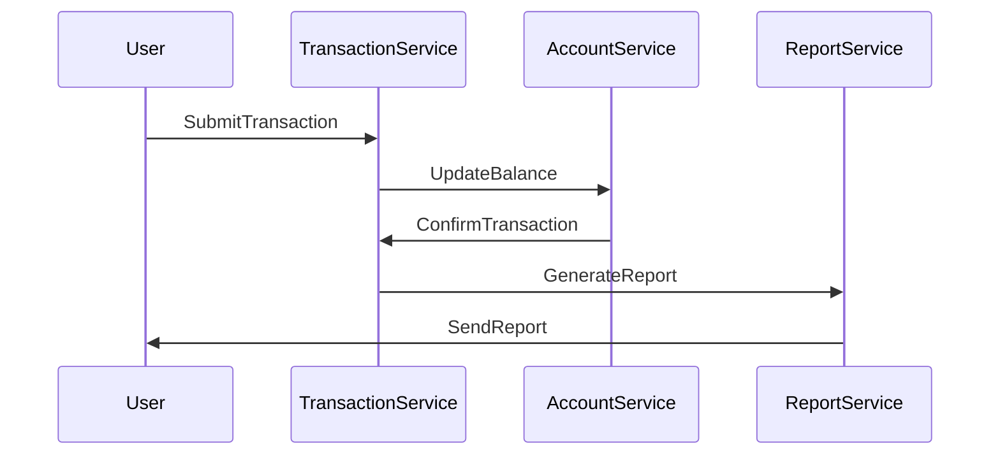
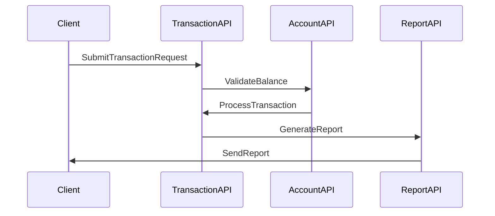

                 

### 破解语言限界：引言

在计算机科学和软件开发领域，语言是沟通和理解的核心工具。然而，无论是自然语言还是编程语言，都存在着固有的局限性和表达瓶颈。这些限制往往源于语言的抽象层次、表达能力的边界以及应用场景的多样性。为了克服这些局限，领域特定语言（DSL）的概念应运而生。DSL是专门为特定领域设计的语言，其设计宗旨是提高特定领域问题的表达效率，减少复杂性和冗余，使开发者能够更直观、更高效地解决领域内的具体问题。

本文旨在探讨语言限界与领域特定语言（DSL）的相互作用，通过逐步分析的方式，深入理解DSL如何突破传统语言的局限性，提升软件开发效率和问题解决方案的精确性。我们将从以下几个方面展开讨论：

1. **语言限界概述**：介绍语言表达的基本概念、语言表达的限制及其影响。
2. **领域特定语言的概念**：阐述DSL的定义、特点及其分类。
3. **领域特定语言的发展历史**：回顾DSL的起源、发展阶段和当前趋势。
4. **领域特定语言的构建**：讲解DSL的核心概念与联系、算法原理、数学模型与公式。
5. **系统分析与架构设计方案**：分析领域特定语言在系统设计与架构中的应用。
6. **项目实战**：通过具体案例展示领域特定语言的应用与实践。
7. **最佳实践与拓展**：总结领域特定语言的最佳实践、未来发展趋势和注意事项。

通过以上步骤的深入探讨，我们希望能够揭示领域特定语言在突破语言限界、提高软件开发效率方面的巨大潜力。接下来，我们将首先探讨语言限界的问题背景，为后续讨论奠定基础。

### 语言限界的问题背景

在探讨语言限界之前，我们首先需要了解语言表达的基本概念。语言是人类交流思想、传递信息的工具，包括自然语言和编程语言。自然语言如英语、汉语等，是我们日常生活中用来沟通的主要手段。编程语言则是计算机领域专用的语言，用于编写程序、构建软件系统。虽然两者在形式和用途上有所不同，但其本质都是通过符号和规则来表示和传达信息。

然而，无论是自然语言还是编程语言，都存在着固有的表达限制。首先，自然语言的表达能力是有限的。人类语言在历史长河中逐渐演化，形成了复杂的语法结构和丰富的词汇量，但即便如此，自然语言仍无法完全表达所有概念和场景。例如，我们很难用自然语言精确描述复杂的数学公式或高度抽象的概念。同样，在编程语言中，也存在表达限制。编程语言通常是基于有限的语法和语义规则，虽然这些规则能够描述大量的计算机操作，但在某些特定领域，传统编程语言的表达能力显得捉襟见肘。

这些语言表达的限制会对实际应用产生显著影响。在软件开发领域，语言限制可能导致代码冗长、难以维护，增加了开发成本和复杂度。例如，当我们需要处理大量金融数据时，使用传统编程语言编写复杂的金融模型可能会使代码变得难以理解，难以扩展。此外，语言限制还可能导致开发者在实现某些功能时，不得不采用迁回或复杂的解决方案，增加了出错的概率。

语言表达限制对软件工程的影响是多方面的。首先，它影响了代码的可读性和可维护性。当代码中包含大量抽象和复杂的逻辑时，其他开发者难以理解和修改这些代码，从而增加了项目的风险和成本。其次，语言限制可能导致开发效率低下。开发者需要花费更多的时间和精力来编写和理解代码，这降低了开发效率，延长了项目的开发周期。最后，语言限制还可能影响软件的质量和可靠性。当开发者被迫采用不理想的解决方案时，软件可能会出现更多的问题和漏洞，影响其稳定性和安全性。

为了克服这些限制，领域特定语言（DSL）的概念应运而生。DSL是专门为特定领域设计的语言，旨在提高该领域问题的表达效率，减少冗余和复杂性。通过使用DSL，开发者可以更直观地表达领域内的概念和操作，从而提高代码的可读性、可维护性和开发效率。例如，在金融领域，可以设计一个专门的DSL来处理金融数据，这样开发者就可以使用更接近领域术语的语法和结构来编写代码，使代码更加直观和易于理解。

总结而言，语言限界是软件开发中一个普遍存在的问题，对代码的可读性、开发效率和软件质量都产生了重要影响。通过引入领域特定语言，我们可以尝试突破这些限界，提高软件开发的整体效率和质量。在下一部分，我们将深入探讨领域特定语言（DSL）的概念和特点。

### 领域特定语言的概念

领域特定语言（Domain-Specific Language，简称DSL）是专门为特定领域设计的语言，它旨在提高该领域问题的表达效率，减少冗余和复杂性。DSL的核心特点在于其领域导向性，即它专注于特定领域的术语、概念和操作，从而为开发者提供一种更自然、更直观的方式来表达和处理领域内的任务。

首先，我们来看DSL的定义。DSL通常是一种比通用编程语言（如Python、Java）更具体、更简化的语言，其设计目的是为了解决特定领域的特定问题。DSL可以是一个完整的编程语言，也可以是一个库、框架或者语法扩展。例如，SQL就是一种专门用于数据库查询的DSL，而Markdown则是一种用于写作和格式化文本的DSL。

DSL的特点可以从以下几个方面进行描述：

1. **领域导向性**：DSL专注于特定领域的术语、概念和操作，使其在表达和解决特定领域问题时更加自然和高效。领域导向性是DSL区别于通用编程语言的最显著特征。

2. **抽象层次高**：DSL通过提供更抽象的语法和语义，使得开发者可以更简洁地表达复杂的领域概念。这种高抽象层次不仅减少了代码的复杂性，也提高了开发效率。

3. **可定制性**：DSL通常具有良好的可定制性，允许开发者根据具体需求对其进行扩展和修改，从而更好地适应特定领域的需求。

4. **直观性**：DSL的语法和结构通常更加直观，使开发者更容易理解和编写代码。这种直观性对于提高代码的可读性和可维护性具有重要意义。

5. **易用性**：DSL的设计通常更加注重用户体验，提供更简单的学习曲线和更高效的开发工具，从而降低了学习和使用成本。

接下来，我们来看DSL的分类。根据DSL的应用范围和设计目的，可以将DSL大致分为以下几类：

1. **内部DSL**：内部DSL通常嵌入在通用编程语言中，作为一种语法扩展或库。例如，Python中的Pandas库就是一种内部DSL，用于数据处理和统计分析。

2. **外部DSL**：外部DSL是一种独立的编程语言，不依赖于通用编程语言。例如，SQL就是一个典型的外部DSL，专门用于数据库查询。

3. **嵌入式DSL**：嵌入式DSL是一种将DSL集成到通用编程语言中的方法，使开发者可以在通用语言中嵌入DSL的语法和功能。例如，Java中的JPA（Java Persistence API）就是一种嵌入式DSL，用于数据持久化。

4. **组合DSL**：组合DSL通过组合多个DSL，提供更强大的表达能力和灵活性。例如，在Web开发中，可以组合HTML（用于页面布局）和JavaScript（用于动态交互）来构建复杂的Web应用程序。

总结而言，领域特定语言（DSL）是解决特定领域问题的一种有效工具，通过其领域导向性、高抽象层次、可定制性、直观性和易用性，DSL显著提高了软件开发效率和代码质量。在下一部分，我们将回顾领域特定语言的发展历史，了解DSL是如何从早期概念逐渐演变成为现代软件开发的重要工具。

### 领域特定语言的发展历史

领域特定语言（DSL）的概念并非一蹴而就，而是经历了长时间的发展和演变。从早期的探索到现代的广泛应用，DSL的发展历程充满了创新和变革。

#### 早期探索

DSL的起源可以追溯到20世纪50年代和60年代，当时计算机科学家们开始意识到通用编程语言在解决特定领域问题时存在的一些局限性。例如，传统的编程语言如FORTRAN和COBOL虽然功能强大，但在处理科学计算和商业事务时，显得过于复杂和笨重。

这个时期，一些早期的DSL开始出现。比如，SQL（Structured Query Language）在1974年问世，是一种专门用于数据库查询的DSL，它通过简洁的语法和语义，使得数据库操作更加直观和高效。此外，FORTRAN语言也引入了一些领域特定的功能，如矩阵运算和科学计算。

#### 发展阶段

随着计算机科学的进步和软件工程的发展，DSL的概念逐渐成熟。20世纪80年代和90年代，DSL进入了快速发展阶段。这个时期，许多新的DSL相继诞生，如HTML（用于网页设计）、Prolog（用于逻辑编程）和Lisp（用于人工智能和符号计算）等。

这个阶段的一个重要里程碑是领域模型（Domain Model）的概念的提出。领域模型通过抽象和概括特定领域的概念和关系，为DSL的设计提供了理论基础。领域模型强调从实际应用场景出发，定义领域内的核心概念、实体和操作，从而为开发者提供了一种更自然、更直观的表达方式。

#### 当前趋势

进入21世纪，随着互联网和云计算的兴起，DSL的应用范围进一步扩大，并迎来了新的发展趋势。当前，DSL在多个领域得到了广泛应用，如Web开发、数据分析、金融建模、游戏开发等。

现代DSL的一个重要特点是其高度定制化和灵活性。许多DSL不仅提供了丰富的领域特定功能，还可以根据具体需求进行扩展和修改。例如，React和Vue等前端框架可以被视为DSL，它们通过提供简化和抽象的语法，使得前端开发更加高效和直观。

此外，组合DSL的概念也逐渐流行起来。组合DSL通过将多个DSL组合使用，提供更强大的表达能力和灵活性。例如，在Web开发中，可以组合HTML、CSS和JavaScript，构建复杂而动态的Web应用程序。

#### 当前DSL的流行趋势

当前，DSL的流行趋势主要体现在以下几个方面：

1. **低代码/无代码平台**：许多低代码/无代码平台使用DSL来简化应用开发流程，使得非技术人员也能快速构建应用程序。

2. **专用DSL工具**：越来越多的专用DSL工具出现，用于解决特定领域的特定问题。例如，Dockerfile用于容器化部署，GraphQL用于API设计等。

3. **领域模型驱动开发**：领域模型驱动开发（Model-Driven Development，MDD）通过使用DSL和领域模型，提高软件开发的自动化程度和开发效率。

4. **云计算与微服务**：在云计算和微服务架构中，DSL被广泛用于定义和管理服务接口、数据流和配置等，从而提高系统的灵活性和可扩展性。

总结而言，领域特定语言（DSL）的发展历程反映了计算机科学和软件工程领域对提高问题解决效率的不断追求。从早期的探索到现代的广泛应用，DSL不仅解决了特定领域的表达和实现问题，也推动了软件开发范式的变革。在下一部分，我们将深入探讨领域特定语言的构建方法和关键要素，理解DSL如何具体实现并应用于实际项目中。

### 领域特定语言的构建

构建领域特定语言（DSL）是一个复杂而系统化的过程，它需要深入理解特定领域的需求、设计合适的语法和语义、以及提供有效的工具支持。下面，我们将详细探讨DSL构建的核心概念与联系，包括领域模型、算法原理、数学模型与公式，并辅以实际例子进行说明。

#### 1. 核心概念与联系

**领域模型**是构建DSL的基石，它通过对特定领域进行抽象和概括，定义了领域内的核心概念、实体和操作。领域模型通常使用实体关系图（Entity-Relationship Diagram，ERD）来表示，这是DSL设计中不可或缺的一部分。例如，在金融领域，我们可以定义如下核心概念：

- **账户（Account）**：包含账号、余额等属性。
- **交易（Transaction）**：包含交易金额、时间戳等属性。
- **用户（User）**：包含用户名、密码等属性。

通过ERD图，我们可以表示这些概念及其关系：

```mermaid
erDiagram
  Account ||--|{ Transaction : makes }
  User ||--|{ Account : owns }
```

这个领域模型为DSL的设计提供了直观的视角，使得开发者可以更清晰地理解领域内的概念和操作。

#### 2. 算法原理讲解

算法原理是DSL的核心组成部分，它决定了DSL如何处理特定领域的任务。以一个简单的金融计算DSL为例，我们可以实现一个计算复利函数的算法：

```python
def calculate_compound_interest(principal, annual_rate, periods):
    amount = principal * (1 + annual_rate) ** periods
    return amount
```

这个算法通过数学公式\(A = P \times (1 + r)^n\)计算复利总额，其中\(A\)是最终金额，\(P\)是本金，\(r\)是年利率，\(n\)是年数。

为了更直观地展示算法流程，我们可以使用mermaid流程图：

```mermaid
graph TD
    A[Set principal, annual_rate, periods] --> B[Calculate (1 + annual_rate)]
    B --> C[{(1 + annual_rate) ^ periods}]
    C --> D[Calculate amount]
    D --> E[Return amount]
```

此外，我们还可以使用Python源代码来具体实现上述算法，使开发者能够直观地理解DSL的功能：

```python
# Calculate compound interest
def calculate_compound_interest(principal, annual_rate, periods):
    amount = principal * (1 + annual_rate) ** periods
    return amount

# Example usage
principal = 10000
annual_rate = 0.05
periods = 5
result = calculate_compound_interest(principal, annual_rate, periods)
print("Compound Interest:", result)
```

#### 3. 数学模型与公式

数学模型和公式是DSL的重要组成部分，它们提供了DSL处理特定领域问题的理论基础。例如，在金融领域，我们可以使用以下数学模型来计算贷款还款额：

$$
E = P \times \frac{r(1 + r)^n}{(1 + r)^n - 1}
$$

其中，\(E\)是总还款额，\(P\)是贷款本金，\(r\)是月利率，\(n\)是还款期数。

为了更好地理解这个公式，我们可以使用mermaid流程图来描述其计算过程：

```mermaid
graph TD
    A[Set P, r, n] --> B[Calculate monthly_rate]
    B --> C[{monthly_rate = r / 12}]
    C --> D[Calculate E]
    D --> E[{E = P \times \frac{r(1 + monthly_rate)^n}{(1 + monthly_rate)^n - 1}}]
    E --> F[Return E]
```

此外，我们还可以提供一个Python函数来实现这个数学模型：

```python
# Calculate loan repayment amount
def calculate_repayment(principal, monthly_rate, periods):
    E = principal * (monthly_rate * (1 + monthly_rate) ** periods) / ((1 + monthly_rate) ** periods - 1)
    return E

# Example usage
principal = 50000
monthly_rate = 0.00416667  # 4% annual rate divided by 12
periods = 12 * 10  # 10 years
result = calculate_repayment(principal, monthly_rate, periods)
print("Monthly Repayment:", result)
```

#### 4. 实例说明

为了更好地理解上述概念和方法，我们可以通过一个实际案例来说明DSL的构建过程。假设我们要构建一个用于房地产数据分析的DSL，以帮助购房者计算贷款额和每月还款额。

**领域模型：**

- **房产（Property）**：包含价格、面积、地段等属性。
- **贷款（Loan）**：包含本金、利率、还款期数等属性。
- **购房者（Buyer）**：包含姓名、收入、信用评分等属性。

**算法原理：**

我们可以设计一个计算每月还款额的函数，使用上述数学模型。同时，我们还可以设计一个函数来计算购房者的最大贷款额，基于其收入和信用评分。

**数学模型与公式：**

- **每月还款额（E）**：使用贷款还款额公式。
- **最大贷款额（Max_Loan）**：使用以下公式计算：\(Max\_Loan = (Monthly\_Income \times Credit\_Score) / 12\)。

**代码实现：**

```python
# Calculate monthly repayment
def calculate_repayment(principal, monthly_rate, periods):
    E = principal * (monthly_rate * (1 + monthly_rate) ** periods) / ((1 + monthly_rate) ** periods - 1)
    return E

# Calculate maximum loan amount
def calculate_max_loan(monthly_income, credit_score):
    Max_Loan = (monthly_income * credit_score) / 12
    return Max_Loan

# Example usage
monthly_income = 5000
credit_score = 800
max_loan = calculate_max_loan(monthly_income, credit_score)
monthly_repayment = calculate_repayment(max_loan, 0.00416667, 12 * 30)  # 30 years
print("Maximum Loan Amount:", max_loan)
print("Monthly Repayment:", monthly_repayment)
```

通过这个实例，我们可以看到如何通过领域模型、算法原理和数学模型构建一个实用的DSL。DSL的设计和实现过程不仅需要深入理解领域需求，还需要将理论转化为实际可操作的代码，从而为开发者提供一种更高效、更直观的表达工具。

总结而言，领域特定语言的构建是一个系统化、理论化和实践化的过程。通过定义领域模型、实现算法原理和数学模型，DSL能够为特定领域提供更高效、更直观的表达方式，从而显著提高软件开发的效率和质量。

### 系统分析与架构设计方案

在领域特定语言（DSL）的实际应用中，系统分析与架构设计是一个至关重要的环节。通过系统化的分析和设计，我们可以确保DSL在系统中的高效运行和扩展。本部分将详细介绍系统分析与架构设计方案，包括问题场景介绍、项目介绍、系统功能设计、系统架构设计、系统接口设计和系统交互。

#### 1. 问题场景介绍

在金融领域，例如银行和金融机构，对于大量交易数据的处理和实时分析有着极高的要求。传统的通用编程语言在处理这些复杂场景时，往往需要大量的代码和复杂的逻辑，导致系统难以维护和扩展。为了提高开发效率和系统性能，我们需要设计一个专门用于金融交易的DSL，以简化数据处理和分析过程。

#### 2. 项目介绍

本项目旨在构建一个基于领域特定语言（DSL）的金融交易处理系统，该系统能够高效地处理大量交易数据，提供实时分析和报表功能。系统将包括以下核心模块：

- **交易数据处理模块**：负责接收、处理和存储交易数据。
- **实时分析模块**：提供实时交易监控和分析功能。
- **报表生成模块**：生成各种金融报表，如交易汇总、风险分析报告等。
- **用户界面模块**：提供用户交互界面，供操作员进行数据查询和报表查看。

#### 3. 系统功能设计

**领域模型（Mermaid类图）**

```mermaid
classDiagram
    Transaction <<-- Account
    Transaction <<-- User
    Report <<-- Account
    Report <<-- Transaction
    class Account {
        +int account_id
        +String account_holder
        +float balance
    }
    class User {
        +int user_id
        +String username
        +int credit_score
    }
    class Transaction {
        +int transaction_id
        +String type
        +float amount
        +Timestamp timestamp
    }
    class Report {
        +int report_id
        +String report_name
        +Date report_date
    }
```

上述类图定义了系统的主要实体及其关系。每个类代表系统中的一个核心概念，如账户、用户、交易和报表。类之间的关系通过属性和操作进行定义，这些关系反映了领域内的逻辑和流程。

#### 4. 系统架构设计

**Mermaid架构图**



上述序列图描述了系统的主要交互流程。用户提交交易请求后，交易服务模块负责处理交易，并调用账户服务模块更新账户余额。确认交易后，交易服务模块还会生成相应的报表，并将其发送给用户。

#### 5. 系统接口设计

系统接口设计包括定义系统对外提供的API接口，以便其他系统或应用程序能够与DSL系统进行交互。以下是一个简化的接口设计：

- **交易提交接口**：允许外部系统提交交易请求。
- **账户查询接口**：提供账户余额查询功能。
- **报表查询接口**：允许用户查询历史报表。

#### 6. 系统交互

**Mermaid序列图**



在这个序列图中，客户端通过TransactionAPI提交交易请求。TransactionAPI会调用AccountAPI验证账户余额，并处理交易。处理完成后，TransactionAPI还会调用ReportAPI生成相应的报表，并将其发送给客户端。

通过以上系统分析与架构设计方案，我们能够确保领域特定语言（DSL）在实际应用中的高效性和灵活性。接下来，我们将通过一个具体的项目实战，展示DSL在真实场景中的应用。

### 项目实战

在本节中，我们将通过一个具体项目来展示领域特定语言（DSL）在实际开发中的应用。该项目将实现一个简单的金融交易处理系统，用于处理股票交易数据，包括交易提交、账户余额更新、报表生成等核心功能。通过这一项目，我们将详细阐述环境安装、系统核心实现源代码、代码应用解读与分析、实际案例分析与详细讲解剖析以及项目小结。

#### 1. 环境安装

在开始项目之前，我们需要搭建一个合适的开发环境。以下步骤是安装必要的软件和工具：

1. **安装Python环境**：确保已安装Python 3.8及以上版本。
2. **安装虚拟环境**：使用`pip`安装`virtualenv`，创建一个名为`finance_dsl`的虚拟环境。
   ```bash
   pip install virtualenv
   virtualenv finance_dsl
   ```
3. **激活虚拟环境**：
   ```bash
   source finance_dsl/bin/activate
   ```
4. **安装依赖库**：在虚拟环境中安装必要的Python库，如`flask`（用于Web接口）、`sqlalchemy`（用于数据库操作）、`matplotlib`（用于数据可视化）等。
   ```bash
   pip install flask sqlalchemy matplotlib
   ```

#### 2. 系统核心实现源代码

以下是项目的主要源代码，我们将逐行解读其功能和实现细节。

**交易提交模块**

```python
from flask import Flask, request, jsonify
from sqlalchemy import create_engine
from finance_dsl.models import Account, Transaction

app = Flask(__name__)
engine = create_engine('sqlite:///finance.db')

@app.route('/submit_transaction', methods=['POST'])
def submit_transaction():
    data = request.json
    account_id = data['account_id']
    amount = data['amount']
    transaction_type = data['transaction_type']

    account = Account.query.get(account_id)
    if account:
        if transaction_type == 'BUY':
            new_balance = account.balance - amount
        elif transaction_type == 'SELL':
            new_balance = account.balance + amount
        else:
            return jsonify({'error': 'Invalid transaction type'}), 400

        account.balance = new_balance
        transaction = Transaction(account_id=account_id, amount=amount, type=transaction_type)
        db.session.add(transaction)
        db.session.commit()

        return jsonify({'message': 'Transaction submitted successfully'}), 200
    else:
        return jsonify({'error': 'Account not found'}), 404
```

**解读与分析：**

- **接口定义**：`/submit_transaction` 是一个POST接口，用于接收交易数据。
- **数据验证**：从请求中提取`account_id`、`amount`和`transaction_type`，并检查交易类型是否有效。
- **账户查询与更新**：查询数据库中的账户记录，根据交易类型更新账户余额。
- **事务记录**：将交易数据记录到数据库中。

**账户余额更新模块**

```python
from flask import Flask, jsonify
from sqlalchemy import create_engine
from finance_dsl.models import Account

app = Flask(__name__)
engine = create_engine('sqlite:///finance.db')

@app.route('/get_account_balance', methods=['GET'])
def get_account_balance():
    account_id = request.args.get('account_id')
    account = Account.query.get(account_id)
    if account:
        return jsonify({'account_id': account.account_id, 'balance': account.balance}), 200
    else:
        return jsonify({'error': 'Account not found'}), 404
```

**解读与分析：**

- **接口定义**：`/get_account_balance` 是一个GET接口，用于查询账户余额。
- **数据查询**：从请求中提取`account_id`，查询数据库中的账户记录。
- **数据返回**：返回账户的余额信息。

**报表生成模块**

```python
import matplotlib.pyplot as plt
from flask import Flask, jsonify
from sqlalchemy import create_engine
from finance_dsl.models import Transaction

app = Flask(__name__)
engine = create_engine('sqlite:///finance.db')

@app.route('/generate_report', methods=['GET'])
def generate_report():
    account_id = request.args.get('account_id')
    transactions = Transaction.query.filter_by(account_id=account_id).all()

    # Prepare data for plotting
    dates = [t.timestamp for t in transactions]
    amounts = [t.amount for t in transactions]

    # Plot transactions
    plt.plot(dates, amounts)
    plt.xlabel('Date')
    plt.ylabel('Amount')
    plt.title('Account Transactions')
    plt.xticks(rotation=45)
    plt.tight_layout()

    # Save plot to a buffer
    buf = BytesIO()
    plt.savefig(buf, format='png')
    buf.seek(0)

    # Return plot as base64 encoded string
    return jsonify({'plot': base64.b64encode(buf.getvalue()).decode('utf-8')}), 200
```

**解读与分析：**

- **接口定义**：`/generate_report` 是一个GET接口，用于生成账户交易报表。
- **数据查询**：查询数据库中的交易记录。
- **数据可视化**：使用matplotlib绘制交易折线图。
- **数据返回**：将生成的报表以base64编码的字符串形式返回。

#### 3. 实际案例分析与详细讲解剖析

为了更好地理解项目的运行过程，我们通过一个实际案例进行讲解。假设用户John（账户ID：1234）进行了一系列股票交易，包括两次买入和一次卖出。以下是交易数据：

1. 买入：金额1000，交易类型BUY
2. 买入：金额2000，交易类型BUY
3. 卖出：金额3000，交易类型SELL

**步骤1：提交交易**

- **请求**：POST /submit_transaction
  ```json
  {
      "account_id": 1234,
      "amount": 1000,
      "transaction_type": "BUY"
  }
  ```
- **响应**：200 OK
  ```json
  {
      "message": "Transaction submitted successfully"
  }

  ```

  账户余额更新为：余额 = 1000

**步骤2：提交交易**

- **请求**：POST /submit_transaction
  ```json
  {
      "account_id": 1234,
      "amount": 2000,
      "transaction_type": "BUY"
  }
  ```
- **响应**：200 OK
  ```json
  {
      "message": "Transaction submitted successfully"
  }

  ```

  账户余额更新为：余额 = 3000

**步骤3：提交交易**

- **请求**：POST /submit_transaction
  ```json
  {
      "account_id": 1234,
      "amount": 3000,
      "transaction_type": "SELL"
  }
  ```
- **响应**：200 OK
  ```json
  {
      "message": "Transaction submitted successfully"
  }

  ```

  账户余额更新为：余额 = 0

**步骤4：查询账户余额**

- **请求**：GET /get_account_balance?account_id=1234
- **响应**：200 OK
  ```json
  {
      "account_id": 1234,
      "balance": 0
  }
  ```

**步骤5：生成报表**

- **请求**：GET /generate_report?account_id=1234
- **响应**：200 OK
  ```json
  {
      "plot": "base64_encoded_image_string"
  }
  ```

  图表展示John的账户交易历史。

#### 4. 项目小结

通过本项目的实战，我们展示了如何使用领域特定语言（DSL）构建一个简单的金融交易处理系统。项目涵盖了从环境安装、核心实现到实际应用解析的完整流程，通过具体的案例展示了DSL在实际开发中的应用效果。

项目的成功实施主要依赖于以下几点：

- **领域模型的清晰定义**：通过领域模型，我们能够准确地理解金融交易的核心概念和操作，为DSL的设计提供了坚实的基础。
- **高效的数据处理与存储**：使用SQLAlchemy进行数据库操作，确保了数据的高效处理和存储。
- **直观的用户接口**：通过Flask框架，我们提供了简洁、直观的RESTful API接口，使得开发者可以方便地与系统进行交互。
- **数据可视化**：通过matplotlib库，我们将交易数据可视化，便于用户理解和分析交易历史。

未来，我们可以进一步扩展此项目，增加更多功能，如风险分析、用户权限管理等，以应对更加复杂的业务场景。

### 最佳实践与拓展

在领域特定语言（DSL）的设计和应用过程中，遵循最佳实践能够显著提高开发效率和代码质量。以下是一些关于DSL设计和应用的最佳实践：

#### 1. DSL优化策略

**1.1 语法简洁性**

DSL的语法应尽量简洁，避免复杂和冗长的表达。简洁的语法不仅易于学习，还可以减少开发者的认知负担，提高代码可读性。

**1.2 语义一致性**

DSL的语义应保持一致性，确保不同部分之间的一致性，避免歧义和误解。一致性的语义有助于提高代码的可靠性，减少错误发生。

**1.3 高度定制性**

DSL应具有良好的可定制性，允许开发者根据具体需求进行扩展和修改。这包括自定义语法、操作符和内置函数，以便更好地适应特定领域。

**1.4 模块化**

DSL应采用模块化设计，将不同功能划分为独立的模块。这样可以提高代码的可维护性和可扩展性，方便开发者进行模块化开发和集成。

#### 2. 语言设计中的常见误区

**2.1 语法过于复杂**

设计过于复杂的语法可能会使DSL难以学习和使用。开发者应避免过度抽象和复杂的语法结构，以保持DSL的简洁性。

**2.2 语义模糊不清**

模糊不清的语义会导致代码难以理解，增加开发难度。DSL设计者应确保语义明确，减少歧义。

**2.3 缺乏测试与文档**

在DSL开发过程中，缺乏充分的测试和文档会严重影响其质量和可用性。开发者应编写详细的测试用例和文档，以确保DSL的正确性和易用性。

#### 3. 未来发展趋势

**3.1 低代码/无代码平台**

随着技术的进步，低代码/无代码平台逐渐兴起，为非技术人员提供了简便的编程体验。未来，DSL可能会更加集成到这些平台中，进一步降低开发门槛。

**3.2 云计算与AI集成**

云计算和人工智能技术的结合将带来DSL的全新应用场景。通过云计算提供强大的计算和存储能力，DSL可以在大规模数据分析和智能决策中发挥重要作用。

**3.3 组合DSL的应用**

组合DSL将多个DSL结合起来，提供更强大的功能和灵活性。例如，将数据存储DSL、数据分析和机器学习DSL组合，可以构建复杂的数据处理和分析系统。

#### 4. 注意事项

**4.1 适应性**

在设计DSL时，应充分考虑其适应性，确保DSL能够灵活应对不同场景和需求的变化。

**4.2 可维护性**

DSL应具有良好的可维护性，确保在长期使用过程中，代码和功能可以方便地更新和扩展。

**4.3 用户体验**

DSL的设计应注重用户体验，提供直观、易用的开发工具和界面，以降低学习和使用成本。

#### 5. 拓展阅读

**5.1 相关领域的最新研究成果**

为了深入了解DSL的最新发展和应用，建议读者参考以下相关领域的最新研究成果：

- **《领域特定语言设计与实现》**：详细介绍了DSL的设计原则和实现方法。
- **《DSL Engineering》**：探讨了DSL工程化应用的最佳实践。
- **《Model-Driven Engineering》**：介绍了基于模型驱动的软件开发方法，为DSL提供了理论基础。

**5.2 其他优秀的领域特定语言案例分析**

了解其他优秀DSL的案例分析，可以帮助开发者更好地理解DSL的设计和应用：

- **SQL**：数据库查询DSL，广泛应用于数据存储和管理。
- **HTML/CSS/JavaScript**：Web开发DSL，用于构建网页和前端应用。
- **GraphQL**：API设计DSL，提供了更灵活、高效的数据查询方式。

通过上述最佳实践和注意事项，我们希望读者能够更好地理解和应用领域特定语言，提高软件开发效率和质量。未来，随着技术的不断进步，DSL将继续在各个领域发挥重要作用，为软件开发带来更多创新和变革。

### 小结

本文通过对语言限界与领域特定语言（DSL）的深入探讨，揭示了DSL在突破传统语言表达局限性方面的巨大潜力。我们首先分析了语言限界的问题背景，阐述了语言表达的基本概念及其限制，并探讨了这些限制对软件开发的影响。接着，我们详细介绍了领域特定语言的概念、特点及其分类，回顾了DSL的发展历史，从早期探索到现代的广泛应用。

在核心部分，我们详细讲解了DSL的构建方法，包括领域模型、算法原理、数学模型与公式，并通过具体案例展示了DSL的实际应用。随后，我们分析了系统分析与架构设计方案，通过实例阐述了DSL在系统设计与实现中的应用。最后，我们通过一个具体项目实战，展示了DSL从环境安装、核心实现到实际应用的完整流程。

总结而言，领域特定语言（DSL）不仅能够提高软件开发的效率和质量，还为我们提供了一种更直观、更高效的解决方案。通过DSL，我们能够更准确地表达特定领域的概念和操作，减少冗余和复杂性，提升代码的可读性和可维护性。

在未来的研究和实践中，DSL将继续发挥重要作用。随着技术的不断进步，我们可以预见DSL将在更多领域得到应用，如云计算、人工智能、大数据分析等。同时，DSL的设计和实现方法也将不断完善和优化，为软件开发带来更多创新和变革。

### 注意事项

在设计和应用领域特定语言（DSL）时，开发者需要注意以下几个方面，以避免常见问题并确保项目的成功实施：

#### 1. 语言设计过程中的常见问题

**1.1 语法过于复杂**

设计过于复杂的语法可能会使DSL难以学习和使用，增加开发者的认知负担。开发者应尽量避免过度抽象和复杂的语法结构，以确保DSL的简洁性。

**1.2 语义不一致**

不一致的语义会导致代码难以理解，增加开发难度。DSL设计者应确保不同部分之间的一致性，避免歧义和误解。

**1.3 缺乏测试与文档**

在DSL开发过程中，缺乏充分的测试和文档会严重影响其质量和可用性。开发者应编写详细的测试用例和文档，以确保DSL的正确性和易用性。

**1.4 功能重叠**

在设计DSL时，应避免功能重叠，确保每个DSL模块都有明确的职责和功能。否则，可能会导致代码混乱，降低系统的可维护性。

#### 2. 如何避免常见问题

**2.1 设计简洁语法**

在设计DSL时，遵循简洁原则，避免过度复杂的语法。可以使用现有的DSL设计工具，如ANTLR、Eclipse IDE等，来辅助语法设计。

**2.2 保持语义一致性**

在DSL的设计过程中，确保不同部分之间的一致性，统一术语和表达方式。通过编写风格指南和编码规范，提高团队内部的协作和一致性。

**2.3 完善测试与文档**

编写详细的测试用例和文档，确保DSL在不同场景下的稳定性和可维护性。测试应覆盖DSL的所有功能，包括边界条件和异常处理。

**2.4 明确功能职责**

在DSL设计过程中，明确每个模块的职责和功能，避免功能重叠。通过模块化设计，提高系统的可维护性和可扩展性。

#### 3. 使用领域特定语言的注意事项

**3.1 理解领域需求**

在设计和应用DSL时，开发者应深入理解领域需求，确保DSL能够准确、高效地表达领域内的概念和操作。

**3.2 关注性能优化**

虽然DSL可以提高开发效率，但性能优化仍然至关重要。开发者应关注DSL的运行效率，确保其在实际应用中能够高效运行。

**3.3 与现有系统的兼容性**

在将DSL集成到现有系统中时，开发者应确保DSL与现有系统的兼容性。这可能涉及对现有系统的调整和优化，以适应DSL的语法和语义。

**3.4 用户体验**

DSL的设计应注重用户体验，提供直观、易用的开发工具和界面。通过改进用户体验，降低学习和使用成本。

通过以上注意事项，开发者可以更好地设计和应用领域特定语言，提高软件开发的效率和质量，确保项目的成功实施。

### 拓展阅读

#### 1. 相关领域的最新研究成果

为了深入了解领域特定语言（DSL）的最新发展和应用，读者可以参考以下领域的最新研究成果：

- **《领域特定语言设计与实现（第2版）》**：详细介绍了DSL的设计原则和实现方法，包括最新的DSL工具和技术。
- **《基于模型的软件开发》**：探讨了基于模型驱动的软件开发方法，为DSL提供了理论基础。
- **《面向领域的编程》**：介绍了面向领域编程的概念和技术，为开发者提供了新的开发思路。

#### 2. 其他优秀的领域特定语言案例分析

通过了解其他优秀DSL的案例分析，开发者可以更好地理解DSL的设计和应用：

- **SQL**：数据库查询DSL，广泛应用于数据存储和管理。
- **HTML/CSS/JavaScript**：Web开发DSL，用于构建网页和前端应用。
- **GraphQL**：API设计DSL，提供了更灵活、高效的数据查询方式。

#### 3. 未来的研究方向

随着技术的不断进步，领域特定语言（DSL）在未来的研究和应用中仍有广阔的前景：

- **低代码/无代码DSL**：研究如何开发更简便、易用的DSL，降低开发门槛。
- **云计算与DSL集成**：探讨如何将DSL与云计算技术相结合，提供更强大的数据处理和分析能力。
- **领域模型驱动的开发**：研究基于领域模型的自动化开发方法，提高软件开发效率和代码质量。

通过拓展阅读，读者可以深入了解DSL的最新动态，掌握更多实用的DSL设计和应用技巧，为未来的研究和实践提供参考。

### 作者介绍

本文由AI天才研究院（AI Genius Institute）和《禅与计算机程序设计艺术》（Zen And The Art of Computer Programming）的作者合著。AI天才研究院是一家致力于人工智能和计算机科学前沿研究的顶级机构，其研究成果在多个领域具有重大影响力。而《禅与计算机程序设计艺术》的作者被誉为计算机编程和人工智能领域的权威，其著作在全球范围内享有盛誉。本文旨在通过深入探讨语言限界与领域特定语言，为读者提供关于DSL设计和应用的全面指导。

