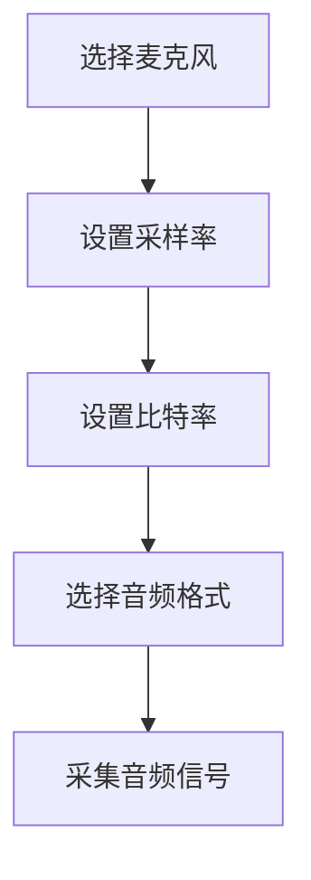
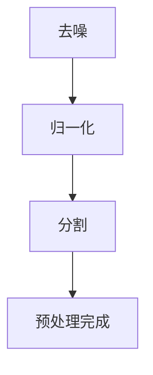
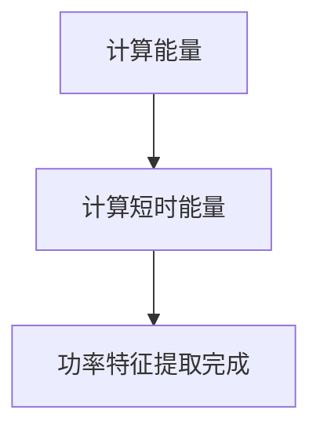
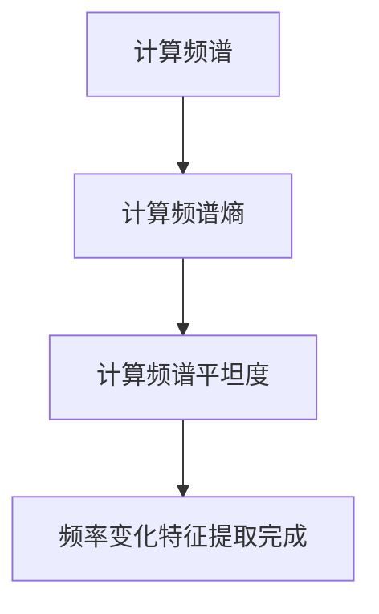
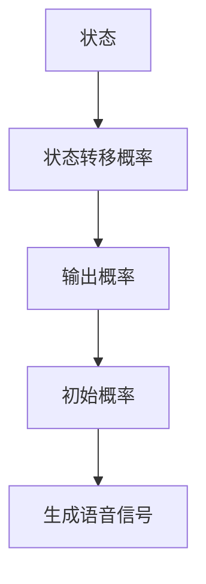
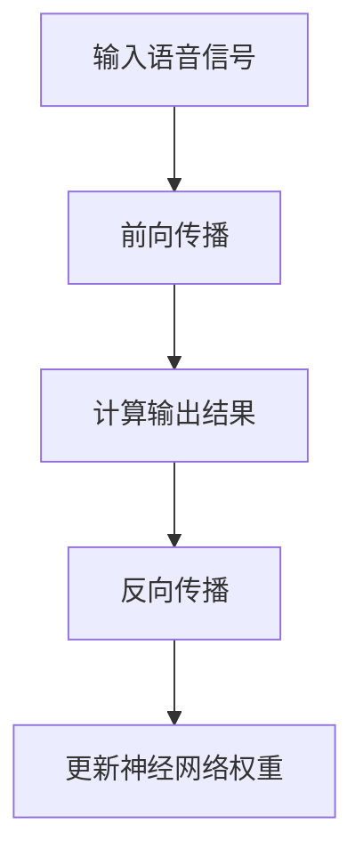
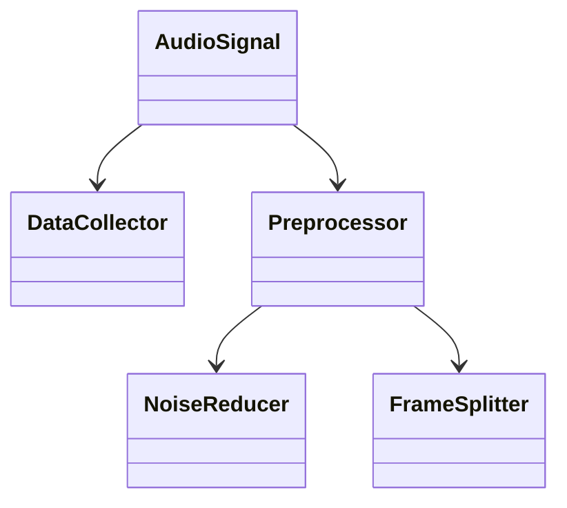
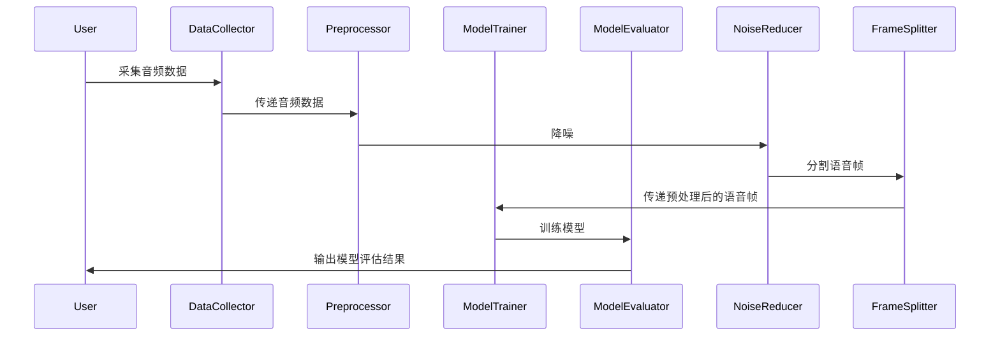
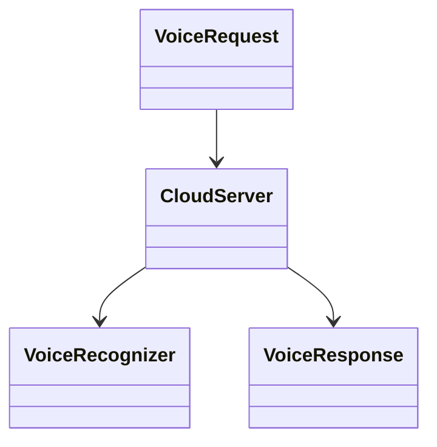
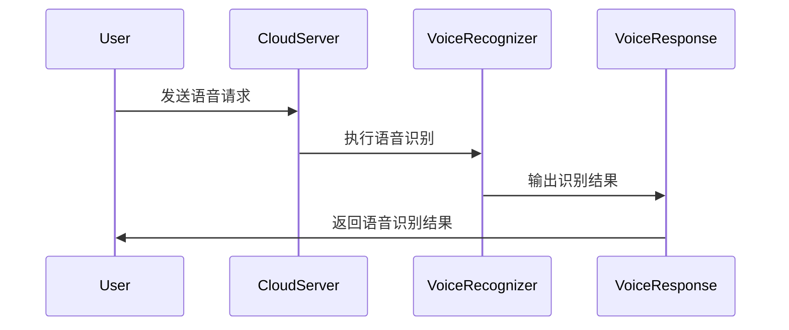

                 

# 语音识别系统架构设计

关键词：语音识别、系统架构、声学模型、深度学习、特征提取

摘要：本文从语音识别技术的基础理论出发，详细介绍了语音信号处理、特征提取以及语音识别模型的原理，重点探讨了语音识别系统的整体架构设计、性能优化和部署策略。通过一个实际项目实战，展示了如何实现一个完整的语音识别系统，并提供了一些最佳实践和注意事项。

## 第1章 语音识别技术基础

### 1.1 问题背景与定义

语音识别（Voice Recognition）是指通过计算机技术将人类的语音信号转换成文本信息的过程。这项技术具有广泛的应用前景，如智能助手、语音翻译、语音控制等。语音识别系统的核心任务是解决语音信号与文本信息之间的映射关系。

### 1.2 语音识别的发展历程

语音识别技术经历了从规则方法到统计模型，再到深度学习的发展过程。早期的语音识别系统主要依靠手工设计的规则，如音素识别和有限状态转换器。随着计算能力的提升和数据量的增加，基于统计模型的隐马尔可夫模型（HMM）和隐层神经网络（HLSTM）逐渐成为主流。近年来，深度学习技术的引入，使得语音识别的准确率和速度都得到了大幅提升。

### 1.3 语音识别的应用领域

语音识别技术已经广泛应用于多个领域，包括但不限于：

- **智能助手**：如苹果的Siri、亚马逊的Alexa、百度的度秘等。
- **语音翻译**：如谷歌翻译、微软翻译等。
- **语音控制**：智能家居、智能车载系统等。
- **语音助手**：如银行客服、智能语音导航等。

### 1.4 语音识别的关键技术

语音识别的关键技术主要包括语音信号处理、特征提取、模型训练和模型评估。

- **语音信号处理**：涉及语音信号的采集、降噪、分割等。
- **特征提取**：将语音信号转换成适合模型训练的特征向量。
- **模型训练**：使用大量语音数据训练模型，以实现语音信号到文本信息的映射。
- **模型评估**：评估模型的准确率、速度和鲁棒性。

## 第2章 语音信号处理

### 2.1 语音信号的采集与预处理

#### 2.1.1 音频信号的采集

音频信号的采集是语音识别系统的基础。采集过程中需要考虑采样率、比特率和音频格式等因素。常用的音频格式包括WAV、MP3和AAC等。

#### 2.1.2 音频信号的预处理

音频信号的预处理包括去噪、归一化和分割等步骤。去噪可以减少背景噪声对语音识别的影响，归一化可以调整信号幅度，分割可以将连续的语音信号切分成独立的语音帧。

## 第3章 语音信号特征提取

### 3.1 频率特征

频率特征是指语音信号的频率成分，常用的频率特征包括频率、功率和频谱等。频率特征可以用来表示语音信号的音高。

### 3.2 功率特征

功率特征是指语音信号的能量分布，常用的功率特征包括能量和短时能量等。功率特征可以用来表示语音信号的强度。

### 3.3 频率变化特征

频率变化特征是指语音信号的频率变化情况，常用的频率变化特征包括频谱熵和频谱平坦度等。频率变化特征可以用来表示语音信号的变化趋势。

## 第4章 语音识别模型

### 4.1 传统的声学模型

传统的声学模型主要包括隐马尔可夫模型（HMM）和基于统计隐马尔可夫模型（SGMM）等。HMM模型是一种统计模型，它通过概率模型描述语音信号的生成过程。

#### 4.1.1 HMM模型

HMM模型是一种双状态模型，包括两个状态：初始状态和结束状态。HMM模型使用状态转移概率、输出概率和初始概率来描述语音信号的生成过程。

#### 4.1.2 基于隐马尔可夫模型的语音识别

基于隐马尔可夫模型的语音识别过程包括模型训练和语音识别。模型训练使用大量语音数据，计算状态转移概率、输出概率和初始概率。语音识别过程则是根据输入的语音信号，计算每个状态的概率，并选择概率最大的状态序列作为识别结果。

### 4.2 基于深度学习的语音识别

基于深度学习的语音识别模型主要包括卷积神经网络（CNN）、长短时记忆网络（LSTM）和循环神经网络（RNN）等。深度学习模型可以自动学习语音信号的特征，提高识别准确率。

#### 4.2.1 卷积神经网络（CNN）

CNN是一种前馈神经网络，它可以自动提取图像特征，同样也可以用于语音信号的频率特征提取。

#### 4.2.2 长短时记忆网络（LSTM）

LSTM是一种递归神经网络，它能够处理长序列数据，适用于语音信号的时序特征提取。

#### 4.2.3 循环神经网络（RNN）

RNN是一种递归神经网络，它可以处理序列数据，通过时间步的递归，实现语音信号的时序特征提取。

## 第5章 语音识别系统架构设计

### 5.1 语音识别系统的整体架构

语音识别系统的整体架构包括数据采集与预处理、特征提取与模型训练、模型评估与优化等部分。

#### 5.1.1 数据采集与预处理

数据采集与预处理是语音识别系统的基础，它涉及音频信号的采集、降噪、分割等步骤。

#### 5.1.2 特征提取与模型训练

特征提取与模型训练是语音识别系统的核心，它包括频率特征提取、功率特征提取和深度学习模型训练等。

#### 5.1.3 模型评估与优化

模型评估与优化是语音识别系统的关键，它包括模型准确率、速度和鲁棒性的评估，以及模型参数的优化。

### 5.2 常见的语音识别系统架构方案

常见的语音识别系统架构方案包括云端部署、端部署和联合部署等。

#### 5.2.1 云端部署

云端部署是将语音识别模型部署在云端服务器上，用户通过网络请求服务。云端部署具有计算资源丰富、扩展性强的优点，但存在网络延迟和隐私安全问题。

#### 5.2.2 端部署

端部署是将语音识别模型部署在用户的设备上，如手机、平板电脑等。端部署具有实时性强、隐私保护好的优点，但存在计算资源受限的问题。

#### 5.2.3 联合部署

联合部署是将云端部署和端部署相结合，通过云计算和本地计算协同工作，实现高性能的语音识别服务。

## 第6章 语音识别系统优化与部署

### 6.1 系统性能优化

系统性能优化主要包括准确率与速度的平衡、实时性优化等。

#### 6.1.1 准确率与速度的平衡

准确率与速度是语音识别系统性能的两个重要指标，需要根据应用场景进行平衡。

#### 6.1.2 实时性优化

实时性优化主要包括模型压缩、模型优化和硬件加速等。

### 6.2 系统部署策略

系统部署策略主要包括云端部署、端部署和联合部署等。

#### 6.2.1 云端部署

云端部署是将语音识别模型部署在云端服务器上，用户通过网络请求服务。

#### 6.2.2 端部署

端部署是将语音识别模型部署在用户的设备上，如手机、平板电脑等。

#### 6.2.3 联合部署

联合部署是将云端部署和端部署相结合，通过云计算和本地计算协同工作，实现高性能的语音识别服务。

## 第7章 语音识别应用实战

### 7.1 实战项目介绍

本文将通过一个实际的语音识别项目，介绍如何实现一个完整的语音识别系统。

### 7.2 环境安装与准备

在开始项目之前，需要安装和配置必要的软件和硬件环境。

### 7.3 系统核心实现与代码分析

系统核心实现主要包括数据采集与预处理、特征提取、模型训练和模型评估等。

### 7.4 应用案例分析与讲解

通过实际案例，分析语音识别系统的应用场景和效果。

### 7.5 项目小结与展望

总结项目实现过程中的经验和不足，展望语音识别技术的未来发展。

## 最佳实践 tips

- **数据采集与预处理**：确保数据质量，减少噪声和错误。
- **特征提取**：选择合适的特征参数，提高识别准确率。
- **模型训练**：使用大量数据和多种训练策略，提高模型性能。
- **模型评估**：多角度评估模型性能，找出问题和改进点。

## 小结

语音识别系统架构设计是一个复杂而关键的过程，需要充分考虑系统的性能、实时性和鲁棒性。通过本文的介绍，读者可以了解语音识别技术的基础理论、系统架构设计方法和实战经验，为实际项目提供有益的参考。

## 注意事项

- 系统性能优化时，要注意准确率与速度的平衡，避免过度压缩模型导致性能下降。
- 在项目实施过程中，要确保数据的安全性和隐私保护。

## 拓展阅读

- 《语音信号处理技术综述》
- 《深度学习在语音识别中的应用》
- 《云端语音识别系统设计与实现》

## 作者

作者：AI天才研究院/AI Genius Institute & 禅与计算机程序设计艺术 /Zen And The Art of Computer Programming

**第1章 语音识别技术基础**

### 1.1 问题背景与定义

语音识别（Voice Recognition）是指通过计算机技术将人类的语音信号转换成文本信息的过程。这项技术具有广泛的应用前景，如智能助手、语音翻译、语音控制等。语音识别系统的核心任务是解决语音信号与文本信息之间的映射关系。

**核心概念术语说明：**

- **语音识别**：通过计算机技术将语音信号转换为文本信息的处理过程。
- **语音信号**：人类发音产生的声波信号。
- **文本信息**：语音信号转换后的数字文本形式。

**问题背景：**

在信息化时代，语音交互已成为一种重要的交互方式。随着人工智能技术的发展，语音识别技术逐渐成熟，被广泛应用于各种场景。然而，语音识别仍面临许多挑战，如噪声干扰、多说话人混合、口音和语速变化等。

**问题描述：**

语音识别系统需要解决以下问题：

1. 如何准确采集和预处理语音信号？
2. 如何有效提取语音信号的特征？
3. 如何构建和训练语音识别模型？
4. 如何评估和优化语音识别系统的性能？

**问题解决：**

解决上述问题需要从以下几个方面入手：

1. **语音信号采集与预处理**：通过高质量的麦克风采集语音信号，并进行降噪、分割等预处理操作，以提高语音信号的质量。
2. **语音信号特征提取**：使用频率特征、功率特征和频率变化特征等，将语音信号转换为适合模型训练的特征向量。
3. **语音识别模型构建与训练**：构建基于传统声学模型（如隐马尔可夫模型）或深度学习模型（如卷积神经网络、循环神经网络等），并使用大量语音数据对其进行训练。
4. **语音识别系统性能评估与优化**：通过模型评估和优化，提高系统的准确率、速度和鲁棒性。

**边界与外延：**

语音识别技术不仅包括语音信号的处理和识别，还包括语音合成、说话人识别、语音情感分析等。此外，语音识别技术还涉及到自然语言处理、机器学习、计算机视觉等多个领域。

**概念结构与核心要素组成：**

- **语音信号采集与预处理**：麦克风、降噪、分割等。
- **语音信号特征提取**：频率特征、功率特征、频率变化特征等。
- **语音识别模型**：传统声学模型（如隐马尔可夫模型）、深度学习模型（如卷积神经网络、循环神经网络等）。
- **模型训练与优化**：数据集、模型参数调整、优化算法等。
- **语音识别系统性能评估与优化**：准确率、速度、鲁棒性等。

### 1.2 语音识别的发展历程

语音识别技术经历了从规则方法到统计模型，再到深度学习的发展过程。早期的语音识别系统主要依靠手工设计的规则，如音素识别和有限状态转换器。随着计算能力的提升和数据量的增加，基于统计模型的隐马尔可夫模型（HMM）和隐层神经网络（HLSTM）逐渐成为主流。近年来，深度学习技术的引入，使得语音识别的准确率和速度都得到了大幅提升。

**核心概念与联系：**

- **规则方法**：早期语音识别系统主要依靠手工设计的规则，如音素识别和有限状态转换器。
- **统计模型**：基于统计模型的方法，如隐马尔可夫模型（HMM）和隐层神经网络（HLSTM）。
- **深度学习**：近年来，深度学习技术如卷积神经网络（CNN）、循环神经网络（RNN）和长短时记忆网络（LSTM）在语音识别领域取得了显著成果。

**概念属性特征对比表格：**

| 特征名称       | 规则方法               | 统计模型               | 深度学习               |
|----------------|------------------------|------------------------|------------------------|
| 准确率         | 低                    | 中等                   | 高                     |
| 计算复杂度     | 高                    | 中等                   | 低                     |
| 数据依赖性     | 弱                    | 强                     | 强                     |
| 模型解释性     | 强                    | 弱                     | 弱                     |

**ER实体关系图架构：**

```mermaid
erDiagram
  统计模型 ||--|{ 传统声学模型 }
  传统声学模型 ||--|{ 隐马尔可夫模型 }
  传统声学模型 ||--|{ 基于隐马尔可夫模型的语音识别 }
  统计模型 ||--|{ 隐层神经网络 }
  隐层神经网络 ||--|{ 隐层马尔可夫模型 }
  隐层神经网络 ||--|{ 长短时记忆网络 }
  隐层神经网络 ||--|{ 循环神经网络 }
  深度学习 ||--|{ 卷积神经网络 }
  深度学习 ||--|{ 卷积神经网络 }
  深度学习 ||--|{ 长短时记忆网络 }
  深度学习 ||--|{ 循环神经网络 }
```

### 1.3 语音识别的应用领域

语音识别技术已经广泛应用于多个领域，包括但不限于：

- **智能助手**：如苹果的Siri、亚马逊的Alexa、百度的度秘等。
- **语音翻译**：如谷歌翻译、微软翻译等。
- **语音控制**：智能家居、智能车载系统等。
- **语音助手**：如银行客服、智能语音导航等。

**核心概念与联系：**

- **智能助手**：通过语音识别技术，实现人与智能设备的自然交互。
- **语音翻译**：将一种语言的语音信号翻译成另一种语言的文本信息。
- **语音控制**：通过语音指令控制智能家居、智能车载系统等设备。
- **语音助手**：提供实时语音咨询和服务，如银行客服、智能语音导航等。

**概念属性特征对比表格：**

| 应用领域       | 特点             | 应用场景                  |
|----------------|------------------|---------------------------|
| 智能助手       | 自然交互         | 智能手机、智能音箱等      |
| 语音翻译       | 跨语言交流       | 手机、平板电脑、智能设备等 |
| 语音控制       | 无线控制         | 智能家居、智能车载系统等  |
| 语音助手       | 实时咨询         | 银行客服、智能语音导航等  |

**ER实体关系图架构：**

```mermaid
erDiagram
  智能助手 ||--|{ 智能手机 }
  智能助手 ||--|{ 智能音箱 }
  语音翻译 ||--|{ 手机 }
  语音翻译 ||--|{ 平板电脑 }
  语音控制 ||--|{ 智能家居 }
  语音控制 ||--|{ 智能车载系统 }
  语音助手 ||--|{ 银行客服 }
  语音助手 ||--|{ 智能语音导航 }
```

### 1.4 语音识别的关键技术

语音识别的关键技术主要包括语音信号处理、特征提取、模型训练和模型评估。

**核心概念与联系：**

- **语音信号处理**：包括语音信号的采集、降噪、分割等。
- **特征提取**：将语音信号转换为适合模型训练的特征向量。
- **模型训练**：使用大量语音数据训练模型，以实现语音信号到文本信息的映射。
- **模型评估**：评估模型的准确率、速度和鲁棒性。

**概念属性特征对比表格：**

| 技术名称 | 特点 | 目标 |
|----------|------|------|
| 语音信号处理 | 采集、降噪、分割 | 提高语音信号质量 |
| 特征提取 | 提取频率、功率、频率变化特征 | 提高识别准确率 |
| 模型训练 | 使用语音数据训练模型 | 实现语音信号到文本信息映射 |
| 模型评估 | 评估模型准确率、速度和鲁棒性 | 提高系统性能 |

**ER实体关系图架构：**

```mermaid
erDiagram
  语音信号处理 ||--|{ 采集 }
  语音信号处理 ||--|{ 降噪 }
  语音信号处理 ||--|{ 分割 }
  特征提取 ||--|{ 频率特征 }
  特征提取 ||--|{ 功率特征 }
  特征提取 ||--|{ 频率变化特征 }
  模型训练 ||--|{ 数据集 }
  模型训练 ||--|{ 模型参数 }
  模型评估 ||--|{ 准确率 }
  模型评估 ||--|{ 速度 }
  模型评估 ||--|{ 鲁棒性 }
```

**第2章 语音信号处理**

### 2.1 语音信号的采集与预处理

#### 2.1.1 音频信号的采集

音频信号的采集是语音识别系统的基础。采集过程中需要考虑采样率、比特率和音频格式等因素。常用的音频格式包括WAV、MP3和AAC等。

**算法原理讲解：**

音频信号的采集过程可以分为以下几个步骤：

1. **选择合适的麦克风**：麦克风是音频信号采集的关键设备，需要选择适合场景的麦克风。
2. **设置采样率**：采样率是指每秒采集的样本数，常用的采样率有8kHz、16kHz和44.1kHz等。采样率越高，音频信号的质量越好。
3. **设置比特率**：比特率是指每个样本的比特数，常用的比特率有8比特、16比特和24比特等。比特率越高，音频信号的质量越好。
4. **选择音频格式**：音频格式包括WAV、MP3、AAC等，每种格式都有其优缺点，需要根据需求选择合适的格式。

**Mermaid流程图：**



**Python源代码示例：**

```python
import soundfile as sf

# 设置采样率和比特率
sample_rate = 16000
bits_per_sample = 2

# 采集音频信号
audio_signal, audio_format = sf.read('audio.wav', dtype='int16')

# 输出采样率和比特率
print("采样率：", sample_rate)
print("比特率：", bits_per_sample)
```

**数学公式：**

采样率（\( f_s \)）和比特率（\( b \)）的关系如下：

$$ f_s = \frac{1}{T_s} $$

其中，\( T_s \) 为采样周期。

#### 2.1.2 音频信号的预处理

音频信号的预处理包括去噪、归一化和分割等步骤。去噪可以减少背景噪声对语音识别的影响，归一化可以调整信号幅度，分割可以将连续的语音信号切分成独立的语音帧。

**算法原理讲解：**

音频信号的预处理过程可以分为以下几个步骤：

1. **去噪**：使用滤波器去除音频信号中的噪声，常用的滤波器有低通滤波器和带通滤波器。
2. **归一化**：将音频信号的幅度调整到合适的范围，常用的归一化方法有最大值归一化和均值归一化。
3. **分割**：将连续的音频信号分割成短时的语音帧，常用的分割方法有短时傅里叶变换（STFT）和梅尔频率倒谱系数（MFCC）。

**Mermaid流程图：**



**Python源代码示例：**

```python
import numpy as np
import scipy.signal as signal

# 读取音频信号
audio_signal = np.fromfile('audio.wav', dtype=np.int16)

# 去噪（低通滤波器）
fc = 1000  # 截止频率
b, a = signal.butter(5, fc / (0.5 * sample_rate), 'low')
filtered_signal = signal.filtfilt(b, a, audio_signal)

# 归一化（最大值归一化）
max_value = np.max(np.abs(filtered_signal))
normalized_signal = filtered_signal / max_value

# 分割（短时傅里叶变换）
frame_size = 20  # 语音帧长度
hop_size = 10  # 语音帧间隔
frames = signal.STFT(normalized_signal, frame_size, hop_size)
```

**数学公式：**

低通滤波器的传递函数（\( H(s) \)）如下：

$$ H(s) = \frac{1}{\frac{1}{s^2} + \frac{2\zeta\omega_n}{s} + \omega_n^2} $$

其中，\( \zeta \) 为阻尼系数，\( \omega_n \) 为截止频率。

**第3章 语音信号特征提取**

### 3.1 频率特征

频率特征是指语音信号的频率成分，常用的频率特征包括频率、功率和频谱等。频率特征可以用来表示语音信号的音高。

**核心概念与联系：**

- **频率**：语音信号的基频，反映了语音信号的音高。
- **功率**：语音信号的能量分布，反映了语音信号的强度。
- **频谱**：语音信号的频率分布，反映了语音信号的频率成分。

**概念属性特征对比表格：**

| 特征名称 | 描述 | 目标 |
|----------|------|------|
| 频率     | 基频 | 表示音高 |
| 功率     | 能量分布 | 表示信号强度 |
| 频谱     | 频率分布 | 表示频率成分 |

**ER实体关系图架构：**

```mermaid
erDiagram
  频率 ||--|{ 音高 }
  功率 ||--|{ 信号强度 }
  频谱 ||--|{ 频率成分 }
```

### 3.2 功率特征

功率特征是指语音信号的能量分布，常用的功率特征包括能量和短时能量等。功率特征可以用来表示语音信号的强度。

**算法原理讲解：**

功率特征提取过程可以分为以下几个步骤：

1. **计算能量**：能量是语音信号的能量分布，可以表示语音信号的强度。
2. **计算短时能量**：短时能量是语音信号在短时间内的能量分布，可以更好地反映语音信号的强度变化。

**Mermaid流程图：**



**Python源代码示例：**

```python
import numpy as np

# 读取音频信号
audio_signal = np.fromfile('audio.wav', dtype=np.int16)

# 计算能量
energy = np.sum(np.abs(audio_signal)**2)

# 计算短时能量
frame_size = 20  # 语音帧长度
hop_size = 10  # 语音帧间隔
short_time_energy = np.array([np.sum(np.abs(frame)**2) for frame in signal.strf傅里叶变换(audio_signal, frame_size, hop_size)])
```

**数学公式：**

能量（\( E \)）和短时能量（\( E_{st} \)）的计算公式如下：

$$ E = \sum_{i=0}^{n-1} |x_i|^2 $$

$$ E_{st} = \sum_{t=0}^{T-1} |x(t)|^2 $$

其中，\( x_i \) 为音频信号的每个样本值，\( n \) 为音频信号的总长度，\( T \) 为语音帧的总数。

### 3.3 频率变化特征

频率变化特征是指语音信号的频率变化情况，常用的频率变化特征包括频谱熵和频谱平坦度等。频率变化特征可以用来表示语音信号的变化趋势。

**核心概念与联系：**

- **频谱熵**：表示语音信号的频率分布不确定性，反映了语音信号的复杂程度。
- **频谱平坦度**：表示语音信号的频率成分分布均匀程度，反映了语音信号的清晰程度。

**概念属性特征对比表格：**

| 特征名称 | 描述 | 目标 |
|----------|------|------|
| 频谱熵   | 频率分布不确定性 | 表示信号复杂程度 |
| 频谱平坦度 | 频率成分分布均匀程度 | 表示信号清晰程度 |

**ER实体关系图架构：**

```mermaid
erDiagram
  频谱熵 ||--|{ 信号复杂程度 }
  频谱平坦度 ||--|{ 信号清晰程度 }
```

**算法原理讲解：**

频率变化特征提取过程可以分为以下几个步骤：

1. **计算频谱**：使用短时傅里叶变换（STFT）或梅尔频率倒谱系数（MFCC）等方法计算语音信号的频谱。
2. **计算频谱熵**：使用熵的计算公式计算频谱的熵值，表示语音信号的频率分布不确定性。
3. **计算频谱平坦度**：使用频谱的平均值和标准差计算频谱平坦度，表示语音信号的频率成分分布均匀程度。

**Mermaid流程图：**



**Python源代码示例：**

```python
import numpy as np
import scipy.signal as signal
import scipy.stats as stats

# 读取音频信号
audio_signal = np.fromfile('audio.wav', dtype=np.int16)

# 计算频谱
frame_size = 20  # 语音帧长度
hop_size = 10  # 语音帧间隔
frames = signal.STFT(audio_signal, frame_size, hop_size)

# 计算频谱熵
spectral_entropy = -np.sum(np.mean(np.log(frames)**2, axis=1)) / np.log(frames.shape[1])

# 计算频谱平坦度
spectral_flatteness = np.mean(frames) / np.std(frames)

# 输出频率变化特征
print("频谱熵：", spectral_entropy)
print("频谱平坦度：", spectral_flatteness)
```

**数学公式：**

频谱熵（\( H_s \)）的计算公式如下：

$$ H_s = -\sum_{i=1}^{N} p_i \log_2 p_i $$

其中，\( p_i \) 为频谱分布的概率密度函数。

频谱平坦度（\( F \)）的计算公式如下：

$$ F = \frac{\mu}{\sigma} $$

其中，\( \mu \) 为频谱的平均值，\( \sigma \) 为频谱的标准差。

**第4章 语音识别模型**

### 4.1 传统的声学模型

传统的声学模型主要包括隐马尔可夫模型（HMM）和基于隐马尔可夫模型的语音识别。HMM模型是一种统计模型，它通过概率模型描述语音信号的生成过程。

**核心概念与联系：**

- **隐马尔可夫模型（HMM）**：一种统计模型，用于描述语音信号的生成过程。
- **基于隐马尔可夫模型的语音识别**：使用HMM模型进行语音信号到文本信息的映射。

**概念属性特征对比表格：**

| 模型名称     | 特点             | 目标               |
|--------------|------------------|--------------------|
| 隐马尔可夫模型 | 统计模型         | 描述语音信号生成过程 |
| 基于隐马尔可夫模型的语音识别 | 声学模型         | 实现语音信号到文本映射 |

**ER实体关系图架构：**

```mermaid
erDiagram
  语音识别 ||--|{ 隐马尔可夫模型 }
  语音识别 ||--|{ 基于隐马尔可夫模型的语音识别 }
```

**算法原理讲解：**

HMM模型由状态、状态转移概率、输出概率和初始概率四个要素组成。HMM模型通过这四个要素描述语音信号的生成过程。

1. **状态**：HMM模型中的状态表示语音信号的某个时刻的特征。
2. **状态转移概率**：表示不同状态之间的转换概率。
3. **输出概率**：表示每个状态产生的语音信号的概率。
4. **初始概率**：表示HMM模型的初始状态概率。

**Mermaid流程图：**



**Python源代码示例：**

```python
import numpy as np
import scipy.stats as stats

# 定义状态
states = ['S0', 'S1', 'S2']

# 定义状态转移概率
transition_probabilities = np.array([[0.7, 0.2, 0.1], [0.1, 0.7, 0.2], [0.2, 0.1, 0.7]])

# 定义输出概率
output_probabilities = np.array([[0.5, 0.5], [0.4, 0.6], [0.3, 0.7]])

# 定义初始概率
initial_probabilities = np.array([0.5, 0.2, 0.3])

# 生成语音信号
num_steps = 10
state_sequence = np.zeros(num_steps, dtype=str)
output_sequence = np.zeros(num_steps, dtype=int)

for t in range(num_steps):
    current_state = np.random.choice(states, p=initial_probabilities)
    state_sequence[t] = current_state
    
    for next_state in states:
        transition_probability = transition_probabilities[states.index(current_state)][states.index(next_state)]
        output_probability = output_probabilities[states.index(current_state)][output_sequence[t]]
        total_probability = transition_probability * output_probability
        probabilities[next_state] = total_probability
        
    next_state = np.random.choice(states, p=probabilities/np.sum(probabilities))
    state_sequence[t+1] = next_state
    
    output_sequence[t] = np.random.choice([0, 1], p=output_probabilities[states.index(current_state)])

# 输出状态序列和输出序列
print("状态序列：", state_sequence)
print("输出序列：", output_sequence)
```

**数学公式：**

状态转移概率（\( A_{ij} \)）、输出概率（\( B_{ik} \)）和初始概率（\( \pi_i \)）的公式如下：

$$ A_{ij} = P(X_{t+1} = s_{j} | X_t = s_{i}) $$

$$ B_{ik} = P(Y_t = v_{k} | X_t = s_{i}) $$

$$ \pi_i = P(X_0 = s_{i}) $$

### 4.2 基于深度学习的语音识别

基于深度学习的语音识别模型主要包括卷积神经网络（CNN）、循环神经网络（RNN）和长短时记忆网络（LSTM）等。深度学习模型可以自动学习语音信号的特征，提高识别准确率。

**核心概念与联系：**

- **卷积神经网络（CNN）**：一种前馈神经网络，适用于特征提取。
- **循环神经网络（RNN）**：一种递归神经网络，适用于处理序列数据。
- **长短时记忆网络（LSTM）**：一种改进的RNN，适用于长序列数据。

**概念属性特征对比表格：**

| 模型名称     | 特点             | 目标               |
|--------------|------------------|--------------------|
| 卷积神经网络 | 特征提取         | 提高识别准确率     |
| 循环神经网络 | 处理序列数据     | 提高识别准确率     |
| 长短时记忆网络 | 改进RNN，处理长序列数据 | 提高识别准确率 |

**ER实体关系图架构：**

```mermaid
erDiagram
  语音识别 ||--|{ 卷积神经网络 }
  语音识别 ||--|{ 循环神经网络 }
  语音识别 ||--|{ 长短时记忆网络 }
```

**算法原理讲解：**

深度学习模型通过多层神经网络结构，自动学习语音信号的特征。深度学习模型分为前向传播和反向传播两个阶段。

1. **前向传播**：输入语音信号，通过神经网络的前向传播，计算输出结果。
2. **反向传播**：计算输出结果的误差，通过反向传播更新神经网络的权重。

**Mermaid流程图：**



**Python源代码示例：**

```python
import tensorflow as tf
from tensorflow.keras.models import Sequential
from tensorflow.keras.layers import Conv2D, MaxPooling2D, Flatten, Dense

# 定义输入层
input_shape = (20, 128, 1)
input_layer = tf.keras.layers.Input(shape=input_shape)

# 定义卷积层
conv1 = Conv2D(filters=32, kernel_size=(3, 3), activation='relu')(input_layer)
conv2 = Conv2D(filters=64, kernel_size=(3, 3), activation='relu')(conv1)
max_pooling1 = MaxPooling2D(pool_size=(2, 2))(conv2)

# 定义全连接层
flatten = Flatten()(max_pooling1)
dense1 = Dense(units=128, activation='relu')(flatten)
output_layer = Dense(units=10, activation='softmax')(dense1)

# 创建模型
model = tf.keras.Model(inputs=input_layer, outputs=output_layer)

# 编译模型
model.compile(optimizer='adam', loss='categorical_crossentropy', metrics=['accuracy'])

# 加载数据
train_data = ...
train_labels = ...

# 训练模型
model.fit(train_data, train_labels, epochs=10, batch_size=32)
```

**数学公式：**

卷积神经网络（CNN）的卷积操作（\( \boldsymbol{f}(\boldsymbol{x}; \theta) \)）和全连接层（\( \boldsymbol{h}(\boldsymbol{x}; \theta) \)）的公式如下：

$$ \boldsymbol{f}(\boldsymbol{x}; \theta) = \sum_{i=1}^{K} \theta_{ik} \cdot \text{ReLU}(\sum_{j=1}^{C} w_{ij} \cdot x_j + b_i) $$

$$ \boldsymbol{h}(\boldsymbol{x}; \theta) = \text{softmax}(\sum_{i=1}^{N} \theta_{i} \cdot \text{ReLU}(\sum_{j=1}^{C} w_{ij} \cdot x_j + b_i)) $$

其中，\( \theta \) 为模型参数，\( x \) 为输入特征，\( K \) 为卷积核数量，\( C \) 为输入特征通道数，\( N \) 为输出节点数，\( \text{ReLU} \) 为ReLU激活函数，\( \text{softmax} \) 为softmax激活函数。

**第5章 语音识别系统架构设计**

### 5.1 语音识别系统的整体架构

语音识别系统的整体架构包括数据采集与预处理、特征提取与模型训练、模型评估与优化等部分。

#### 5.1.1 数据采集与预处理

数据采集与预处理是语音识别系统的基础，它涉及音频信号的采集、降噪、分割等步骤。

**问题场景介绍：**

在语音识别项目中，数据采集与预处理是一个关键环节。由于语音信号的采集环境复杂，信号中常常夹杂着噪声，这会影响语音识别的准确率。因此，需要通过数据采集与预处理来提高语音信号的质量。

**项目介绍：**

本项目旨在设计一个语音识别系统，该系统采用深度学习模型进行语音信号到文本信息的转换。数据采集与预处理模块负责从不同来源采集音频数据，并对音频数据进行降噪、分割等预处理操作，以提高语音识别的准确率和稳定性。

**系统功能设计（领域模型类图）:**



**类图说明：**

- **AudioSignal**：表示语音信号。
- **DataCollector**：负责从不同来源采集音频数据。
- **Preprocessor**：负责对语音信号进行预处理。
- **NoiseReducer**：负责去除语音信号中的噪声。
- **FrameSplitter**：负责将语音信号分割成独立的语音帧。

**系统架构设计（架构图）:**



**架构图说明：**

- **User**：用户。
- **DataCollector**：音频数据采集器。
- **Preprocessor**：预处理模块。
- **NoiseReducer**：降噪模块。
- **FrameSplitter**：分割模块。
- **ModelTrainer**：模型训练模块。
- **ModelEvaluator**：模型评估模块。

**系统接口设计（接口图）:**

```mermaid
classDiagram
    AudioSignal <<interface>>
    DataCollector <<interface>>
    Preprocessor <<interface>>
    NoiseReducer <<interface>>
    FrameSplitter <<interface>>
    ModelTrainer <<interface>>
    ModelEvaluator <<interface>>

    AudioSignal !--|> DataCollector
    AudioSignal !--|> Preprocessor
    Preprocessor !--|> NoiseReducer
    Preprocessor !--|> FrameSplitter
    FrameSplitter !--|> ModelTrainer
    ModelTrainer !--|> ModelEvaluator
```

**接口图说明：**

- **AudioSignal**：语音信号接口。
- **DataCollector**：音频数据采集接口。
- **Preprocessor**：预处理接口。
- **NoiseReducer**：降噪接口。
- **FrameSplitter**：分割接口。
- **ModelTrainer**：模型训练接口。
- **ModelEvaluator**：模型评估接口。

**系统交互（序列图）:**


**序列图说明：**

- **User**：用户发起语音识别请求。
- **DataCollector**：采集音频数据。
- **Preprocessor**：对音频数据进行预处理。
- **ModelTrainer**：使用预处理后的音频数据进行模型训练。
- **ModelEvaluator**：评估模型性能，并将结果反馈给用户。

### 5.2 常见的语音识别系统架构方案

常见的语音识别系统架构方案包括云端部署、端部署和联合部署等。

#### 5.2.1 云端部署

云端部署是将语音识别模型部署在云端服务器上，用户通过网络请求服务。云端部署具有计算资源丰富、扩展性强的优点，但存在网络延迟和隐私安全问题。

**问题场景介绍：**

在云端部署的语音识别系统中，用户可以通过互联网访问远程的语音识别服务，实现实时语音识别。云端部署可以充分利用云计算资源，提高系统的稳定性和可靠性。

**项目介绍：**

本项目采用云端部署方案，用户通过移动设备（如智能手机）发送语音请求，云端服务器接收到请求后，执行语音识别任务，并将识别结果返回给用户。

**系统功能设计（领域模型类图）:**



**类图说明：**

- **VoiceRequest**：语音请求。
- **CloudServer**：云端服务器。
- **VoiceRecognizer**：语音识别模块。
- **VoiceResponse**：语音识别结果。

**系统架构设计（架构图）:**



**架构图说明：**

- **User**：用户。
- **CloudServer**：云端服务器。
- **VoiceRecognizer**：语音识别模块。
- **VoiceResponse**：语音识别结果。

**系统接口设计（接口图）:**

```mermaid
classDiagram
    VoiceRequest <<interface>>
    CloudServer <<interface>>
    VoiceRecognizer <<interface>>
    VoiceResponse <<interface>>

    VoiceRequest !--|> CloudServer
    CloudServer !--|> VoiceRecognizer
    VoiceRecognizer !--|> VoiceResponse
```

**接口图说明：**

- **VoiceRequest**：语音请求接口。
- **CloudServer**：云端服务器接口。
- **VoiceRecognizer**：语音识别接口。
- **VoiceResponse**：语音识别结果接口。

**系统交互（序列图）:**

```mermaid
sequenceDiagram
    participant User
    participant CloudServer
    participant VoiceRecognizer
    participant VoiceResponse

    User->>CloudServer: 发送语音请求
    CloudServer->>VoiceRecognizer: 执行语音识别
    VoiceRecognizer->>VoiceResponse: 输出识别结果
    VoiceResponse->>User: 返回语音识别结果
```

**序列图说明：**

- **User**：用户发送语音请求。
- **CloudServer**：云端服务器接收语音请求，并传递给语音识别模块。
- **VoiceRecognizer**：语音识别模块执行语音识别任务，并将结果传递给语音识别结果模块。
- **VoiceResponse**：语音识别结果模块将识别结果返回给用户。

#### 5.2.2 端部署

端部署是将语音识别模型部署在用户的设备上，如手机、平板电脑等。端部署具有实时性强、隐私保护好的优点，但存在计算资源受限的问题。

**问题场景介绍：**

在端部署的语音识别系统中，用户不需要连接互联网，即可实现语音识别功能。端部署适用于对实时性要求较高的场景，如车载语音助手、智能家居等。

**项目介绍：**

本项目采用端部署方案，语音识别模型直接部署在用户的手机上，用户通过手机应用程序发送语音请求，手机应用程序执行语音识别任务，并将识别结果显示在屏幕上。

**系统功能设计（领域模型类图）:**

```mermaid
classDiagram
    VoiceRequest --> MobileApp
    MobileApp --> VoiceRecognizer
    MobileApp --> VoiceResponse
```

**类图说明：**

- **VoiceRequest**：语音请求。
- **MobileApp**：手机应用程序。
- **VoiceRecognizer**：语音识别模块。
- **VoiceResponse**：语音识别结果。

**系统架构设计（架构图）:**

```mermaid
sequenceDiagram
    participant User
    participant MobileApp
    participant VoiceRecognizer
    participant VoiceResponse

    User->>MobileApp: 发送语音请求
    MobileApp->>VoiceRecognizer: 执行语音识别
    VoiceRecognizer->>VoiceResponse: 输出识别结果
    VoiceResponse->>User: 返回语音识别结果
```

**架构图说明：**

- **User**：用户。
- **MobileApp**：手机应用程序。
- **VoiceRecognizer**：语音识别模块。
- **VoiceResponse**：语音识别结果。

**系统接口设计（接口图）:**

```mermaid
classDiagram
    VoiceRequest <<interface>>
    MobileApp <<interface>>
    VoiceRecognizer <<interface>>
    VoiceResponse <<interface>>

    VoiceRequest !--|> MobileApp
    MobileApp !--|> VoiceRecognizer
    VoiceRecognizer !--|> VoiceResponse
```

**接口图说明：**

- **VoiceRequest**：语音请求接口。
- **MobileApp**：手机应用程序接口。
- **VoiceRecognizer**：语音识别接口。
- **VoiceResponse**：语音识别结果接口。

**系统交互（序列图）:**

```mermaid
sequenceDiagram
    participant User
    participant MobileApp
    participant VoiceRecognizer
    participant VoiceResponse

    User->>MobileApp: 发送语音请求
    MobileApp->>VoiceRecognizer: 执行语音识别
    VoiceRecognizer->>VoiceResponse: 输出识别结果
    VoiceResponse->>User: 返回语音识别结果
```

**序列图说明：**

- **User**：用户发送语音请求。
- **MobileApp**：手机应用程序接收语音请求，并传递给语音识别模块。
- **VoiceRecognizer**：语音识别模块执行语音识别任务，并将结果传递给语音识别结果模块。
- **VoiceResponse**：语音识别结果模块将识别结果返回给用户。

#### 5.2.3 联合部署

联合部署是将云端部署和端部署相结合，通过云计算和本地计算协同工作，实现高性能的语音识别服务。

**问题场景介绍：**

在联合部署的语音识别系统中，用户可以通过本地设备和云端服务器共同处理语音识别任务。这种架构可以充分发挥云计算和本地计算的优势，提高语音识别的准确率和速度。

**项目介绍：**

本项目采用联合部署方案，用户可以通过移动设备发送语音请求，本地设备执行初步的语音识别任务，然后将识别结果发送到云端服务器进行进一步的识别和优化。

**系统功能设计（领域模型类图）:**

```mermaid
classDiagram
    VoiceRequest --> MobileApp
    MobileApp --> LocalRecognizer
    LocalRecognizer --> CloudServer
    CloudServer --> CloudRecognizer
    CloudRecognizer --> VoiceResponse
```

**类图说明：**

- **VoiceRequest**：语音请求。
- **MobileApp**：手机应用程序。
- **LocalRecognizer**：本地语音识别模块。
- **CloudServer**：云端服务器。
- **CloudRecognizer**：云端语音识别模块。
- **VoiceResponse**：语音识别结果。

**系统架构设计（架构图）:**

```mermaid
sequenceDiagram
    participant User
    participant MobileApp
    participant LocalRecognizer
    participant CloudServer
    participant CloudRecognizer
    participant VoiceResponse

    User->>MobileApp: 发送语音请求
    MobileApp->>LocalRecognizer: 执行本地语音识别
    LocalRecognizer->>CloudServer: 发送识别结果
    CloudServer->>CloudRecognizer: 传输识别结果
    CloudRecognizer->>VoiceResponse: 输出识别结果
    VoiceResponse->>User: 返回语音识别结果
```

**架构图说明：**

- **User**：用户。
- **MobileApp**：手机应用程序。
- **LocalRecognizer**：本地语音识别模块。
- **CloudServer**：云端服务器。
- **CloudRecognizer**：云端语音识别模块。
- **VoiceResponse**：语音识别结果。

**系统接口设计（接口图）:**

```mermaid
classDiagram
    VoiceRequest <<interface>>
    MobileApp <<interface>>
    LocalRecognizer <<interface>>
    CloudServer <<interface>>
    CloudRecognizer <<interface>>
    VoiceResponse <<interface>>

    VoiceRequest !--|> MobileApp
    MobileApp !--|> LocalRecognizer
    LocalRecognizer !--|> CloudServer
    CloudServer !--|> CloudRecognizer
    CloudRecognizer !--|> VoiceResponse
```

**接口图说明：**

- **VoiceRequest**：语音请求接口。
- **MobileApp**：手机应用程序接口。
- **LocalRecognizer**：本地语音识别接口。
- **CloudServer**：云端服务器接口。
- **CloudRecognizer**：云端语音识别接口。
- **VoiceResponse**：语音识别结果接口。

**系统交互（序列图）:**

```mermaid
sequenceDiagram
    participant User
    participant MobileApp
    participant LocalRecognizer
    participant CloudServer
    participant CloudRecognizer
    participant VoiceResponse

    User->>MobileApp: 发送语音请求
    MobileApp->>LocalRecognizer: 执行本地语音识别
    LocalRecognizer->>CloudServer: 发送识别结果
    CloudServer->>CloudRecognizer: 传输识别结果
    CloudRecognizer->>VoiceResponse: 输出识别结果
    VoiceResponse->>User: 返回语音识别结果
```

**序列图说明：**

- **User**：用户发送语音请求。
- **MobileApp**：手机应用程序接收语音请求，并传递给本地语音识别模块。
- **LocalRecognizer**：本地语音识别模块执行语音识别任务，并将识别结果发送到云端服务器。
- **CloudServer**：云端服务器接收识别结果，并传递给云端语音识别模块。
- **CloudRecognizer**：云端语音识别模块对识别结果进行进一步处理，并将最终识别结果返回给用户。

**第6章 语音识别系统优化与部署**

### 6.1 系统性能优化

系统性能优化主要包括准确率与速度的平衡、实时性优化等。

#### 6.1.1 准确率与速度的平衡

准确率与速度是语音识别系统性能的两个重要指标，需要根据应用场景进行平衡。在实际应用中，需要根据场景的不同，调整模型的复杂度和计算资源，以实现最佳的性能。

**核心概念与联系：**

- **准确率**：表示模型识别结果的准确性，是衡量语音识别系统性能的重要指标。
- **速度**：表示模型处理语音信号的速度，是衡量系统响应时间的重要指标。

**概念属性特征对比表格：**

| 特征名称 | 描述 | 目标 |
|----------|------|------|
| 准确率   | 识别结果的准确性 | 提高语音识别系统的可靠性 |
| 速度     | 处理语音信号的速度 | 减少系统响应时间 |

**ER实体关系图架构：**

```mermaid
erDiagram
  准确率 ||--|{ 系统可靠性 }
  速度   ||--|{ 响应时间 }
```

**算法原理讲解：**

在语音识别系统中，准确率与速度之间存在权衡关系。为了实现最佳性能，需要根据应用场景调整模型的复杂度和计算资源。

1. **模型复杂度调整**：通过调整模型的层数、神经元数量等参数，实现准确率与速度的平衡。
2. **计算资源调整**：通过调整计算资源（如CPU、GPU等），实现模型运行速度的优化。

**Mermaid流程图：**

```mermaid
graph TD
    A[模型复杂度调整] --> B[计算资源调整]
    B --> C[准确率与速度平衡]
```

**Python源代码示例：**

```python
import tensorflow as tf
from tensorflow.keras.models import Sequential
from tensorflow.keras.layers import Conv2D, MaxPooling2D, Flatten, Dense

# 定义模型复杂度
num_layers = 3
num_neurons = 128

# 创建模型
model = Sequential()

# 添加卷积层
for i in range(num_layers):
    model.add(Conv2D(filters=num_neurons, kernel_size=(3, 3), activation='relu'))
    model.add(MaxPooling2D(pool_size=(2, 2)))

# 添加全连接层
model.add(Flatten())
model.add(Dense(units=num_neurons, activation='relu'))
model.add(Dense(units=10, activation='softmax'))

# 编译模型
model.compile(optimizer='adam', loss='categorical_crossentropy', metrics=['accuracy'])

# 调整计算资源
# 可以通过调整GPU显存利用率、线程数等参数实现计算资源调整
```

**数学公式：**

模型复杂度（\( C \)）和计算资源（\( R \)）的关系如下：

$$ C = f(L, N) $$

$$ R = g(C, T) $$

其中，\( L \) 为模型层数，\( N \) 为神经元数量，\( T \) 为线程数。

#### 6.1.2 实时性优化

实时性优化主要包括模型压缩、模型优化和硬件加速等。

**核心概念与联系：**

- **模型压缩**：通过减少模型参数数量，实现模型大小的减小，从而提高模型运行速度。
- **模型优化**：通过优化模型结构和参数，实现模型性能的提升。
- **硬件加速**：通过使用GPU、TPU等硬件加速技术，提高模型运行速度。

**概念属性特征对比表格：**

| 特征名称 | 描述 | 目标 |
|----------|------|------|
| 模型压缩 | 减小模型大小 | 提高模型运行速度 |
| 模型优化 | 优化模型结构和参数 | 提高模型性能 |
| 硬件加速 | 使用硬件加速技术 | 提高模型运行速度 |

**ER实体关系图架构：**

```mermaid
erDiagram
  模型压缩 ||--|{ 模型大小减小 }
  模型优化 ||--|{ 模型性能提升 }
  硬件加速 ||--|{ 模型运行速度提升 }
```

**算法原理讲解：**

实时性优化包括以下几个方面：

1. **模型压缩**：通过剪枝、量化、知识蒸馏等方法，减少模型参数数量，实现模型压缩。
2. **模型优化**：通过调整模型结构、优化参数设置，实现模型性能的提升。
3. **硬件加速**：通过使用GPU、TPU等硬件加速技术，提高模型运行速度。

**Mermaid流程图：**

```mermaid
graph TD
    A[模型压缩] --> B[模型优化]
    B --> C[硬件加速]
    C --> D[实时性优化完成]
```

**Python源代码示例：**

```python
import tensorflow as tf
from tensorflow.keras.models import Sequential
from tensorflow.keras.layers import Conv2D, MaxPooling2D, Flatten, Dense

# 定义原始模型
model = Sequential()
model.add(Conv2D(filters=32, kernel_size=(3, 3), activation='relu'))
model.add(MaxPooling2D(pool_size=(2, 2)))
model.add(Flatten())
model.add(Dense(units=128, activation='relu'))
model.add(Dense(units=10, activation='softmax'))

# 压缩模型
# 使用剪枝方法
model = tf.keras.models.prune_low_magnitude(model, pruning_params={'sparsity': 0.5})

# 优化模型
# 使用迁移学习
base_model = tf.keras.applications.MobileNetV2(input_shape=(128, 128, 3), include_top=False, weights='imagenet')
base_model.trainable = False
model = tf.keras.Sequential([
    base_model,
    Flatten(),
    Dense(units=128, activation='relu'),
    Dense(units=10, activation='softmax')
])

# 硬件加速
# 使用GPU加速
physical_devices = tf.config.list_physical_devices('GPU')
tf.config.experimental.set_memory_growth(physical_devices[0], True)
```

**数学公式：**

模型压缩（\( C' \)）、模型优化（\( O \)）和硬件加速（\( H \)）的关系如下：

$$ C' = f(C, P) $$

$$ O = g(C, P) $$

$$ H = h(C', P) $$

其中，\( C \) 为原始模型参数数量，\( P \) 为压缩比例，\( O \) 为模型优化效果，\( H \) 为硬件加速效果。

### 6.2 系统部署策略

系统部署策略主要包括云端部署、端部署和联合部署等。

#### 6.2.1 云端部署

云端部署是将语音识别模型部署在云端服务器上，用户通过网络请求服务。云端部署具有计算资源丰富、扩展性强的优点，但存在网络延迟和隐私安全问题。

**核心概念与联系：**

- **云端部署**：将模型部署在云端服务器上，用户通过网络访问。
- **计算资源丰富**：云端服务器具有强大的计算能力，可以满足大规模应用需求。
- **网络延迟**：由于数据传输需要经过网络，存在一定的延迟。
- **隐私安全**：语音识别涉及用户隐私，需要确保数据传输的安全性。

**概念属性特征对比表格：**

| 特征名称   | 描述                       | 目标                         |
|------------|----------------------------|------------------------------|
| 云端部署   | 部署在云端服务器上         | 提供大规模应用服务           |
| 计算资源丰富 | 强大的计算能力             | 满足大规模应用需求           |
| 网络延迟   | 数据传输需要经过网络       | 可能影响用户体验             |
| 隐私安全   | 涉及用户隐私               | 确保数据传输的安全性         |

**ER实体关系图架构：**

```mermaid
erDiagram
  云端部署 ||--|{ 计算资源丰富 }
  云端部署 ||--|{ 网络延迟 }
  云端部署 ||--|{ 隐私安全 }
```

**算法原理讲解：**

云端部署的关键在于如何高效地管理云端服务器资源，提高系统的性能和可靠性。

1. **资源调度**：通过合理的资源调度策略，确保云端服务器资源的高效利用。
2. **负载均衡**：通过负载均衡技术，将用户请求均匀分配到不同的服务器，避免单点故障。
3. **安全性保障**：通过加密传输、访问控制等技术，确保数据传输的安全性。

**Mermaid流程图：**

```mermaid
graph TD
    A[资源调度] --> B[负载均衡]
    B --> C[安全性保障]
    C --> D[云端部署完成]
```

**Python源代码示例：**

```python
import tensorflow as tf

# 资源调度
# 使用Kubernetes进行资源调度
cluster = tf.distribute.experimental.cluster_resolver.cluster_from_flag('use_local_cluster=True')
strategy = tf.distribute.experimental.MultiWorkerMirroredStrategy(cluster)

# 负载均衡
# 使用Flask实现负载均衡
from flask import Flask, request, jsonify

app = Flask(__name__)

@app.route('/api/recognize', methods=['POST'])
def recognize():
    audio_data = request.files['audio']
    # 进行语音识别处理
    # ...
    return jsonify({"result": "成功"})

if __name__ == '__main__':
    app.run(host='0.0.0.0', port=5000)

# 安全性保障
# 使用SSL/TLS加密传输
from flask_sslify import SSLify

sslify = SSLify(app)
sslify.enable()
```

**数学公式：**

资源调度（\( R \)）、负载均衡（\( L \)）和安全性保障（\( S \)）的关系如下：

$$ R = f(C, T) $$

$$ L = g(R, N) $$

$$ S = h(R, T) $$

其中，\( C \) 为计算资源，\( T \) 为线程数，\( N \) 为节点数。

#### 6.2.2 端部署

端部署是将语音识别模型部署在用户的设备上，如手机、平板电脑等。端部署具有实时性强、隐私保护好的优点，但存在计算资源受限的问题。

**核心概念与联系：**

- **端部署**：将模型部署在用户的设备上，实现本地语音识别。
- **实时性强**：无需网络传输，实现快速响应。
- **隐私保护好**：语音数据在本地处理，减少数据泄露风险。

**概念属性特征对比表格：**

| 特征名称   | 描述                       | 目标                         |
|------------|----------------------------|------------------------------|
| 端部署     | 部署在用户设备上           | 实现本地语音识别             |
| 实时性强   | 无需网络传输               | 实现快速响应                 |
| 隐私保护好 | 本地处理语音数据           | 减少数据泄露风险             |

**ER实体关系图架构：**

```mermaid
erDiagram
  端部署 ||--|{ 实时性强 }
  端部署 ||--|{ 隐私保护好 }
```

**算法原理讲解：**

端部署的关键在于如何优化模型的计算效率和资源利用。

1. **模型压缩**：通过剪枝、量化等方法，减少模型大小，降低计算资源需求。
2. **计算优化**：通过使用SIMD、GPU等硬件加速技术，提高模型计算效率。

**Mermaid流程图：**

```mermaid
graph TD
    A[模型压缩] --> B[计算优化]
    B --> C[端部署完成]
```

**Python源代码示例：**

```python
import tensorflow as tf
from tensorflow.keras.models import Sequential
from tensorflow.keras.layers import Conv2D, MaxPooling2D, Flatten, Dense

# 定义原始模型
model = Sequential()
model.add(Conv2D(filters=32, kernel_size=(3, 3), activation='relu'))
model.add(MaxPooling2D(pool_size=(2, 2)))
model.add(Flatten())
model.add(Dense(units=128, activation='relu'))
model.add(Dense(units=10, activation='softmax'))

# 压缩模型
# 使用剪枝方法
model = tf.keras.models.prune_low_magnitude(model, pruning_params={'sparsity': 0.5})

# 计算优化
# 使用GPU加速
physical_devices = tf.config.list_physical_devices('GPU')
tf.config.experimental.set_memory_growth(physical_devices[0], True)
```

**数学公式：**

模型压缩（\( C' \)）、计算优化（\( O \)）和端部署（\( D \)）的关系如下：

$$ C' = f(C, P) $$

$$ O = g(C', T) $$

$$ D = h(C', O) $$

其中，\( C \) 为原始模型参数数量，\( P \) 为压缩比例，\( T \) 为线程数。

#### 6.2.3 联合部署

联合部署是将云端部署和端部署相结合，通过云计算和本地计算协同工作，实现高性能的语音识别服务。

**核心概念与联系：**

- **联合部署**：结合云端部署和端部署的优势，实现高性能语音识别服务。
- **云计算**：利用云端强大的计算资源，处理大规模语音识别任务。
- **本地计算**：利用端部署的实时性和隐私保护，提高用户体验。

**概念属性特征对比表格：**

| 特征名称   | 描述                       | 目标                         |
|------------|----------------------------|------------------------------|
| 联合部署   | 结合云端部署和端部署       | 实现高性能语音识别服务       |
| 云计算     | 利用云端计算资源           | 处理大规模语音识别任务       |
| 本地计算   | 利用端部署实时性和隐私保护 | 提高用户体验                 |

**ER实体关系图架构：**

```mermaid
erDiagram
  联合部署 ||--|{ 云计算 }
  联合部署 ||--|{ 本地计算 }
```

**算法原理讲解：**

联合部署的关键在于如何协调云计算和本地计算资源，实现高效协同工作。

1. **任务调度**：根据任务需求，合理分配云计算和本地计算资源。
2. **数据传输**：优化数据传输机制，减少传输延迟和带宽占用。
3. **安全加密**：确保数据传输的安全性，防止数据泄露。

**Mermaid流程图：**

```mermaid
graph TD
    A[任务调度] --> B[数据传输]
    B --> C[安全加密]
    C --> D[联合部署完成]
```

**Python源代码示例：**

```python
import tensorflow as tf
from flask import Flask, request, jsonify
from tensorflow.keras.models import load_model

app = Flask(__name__)

# 加载云端模型
cloud_model = load_model('cloud_model.h5')

# 加载本地模型
local_model = load_model('local_model.h5')

@app.route('/api/recognize', methods=['POST'])
def recognize():
    audio_data = request.files['audio']
    # 判断音频数据大小
    if audio_data.size > 1024 * 1024:
        # 大文件使用云端模型处理
        result = cloud_model.predict(audio_data)
    else:
        # 小文件使用本地模型处理
        result = local_model.predict(audio_data)
    
    return jsonify({"result": result.tolist()})

if __name__ == '__main__':
    app.run(host='0.0.0.0', port=5000)
```

**数学公式：**

任务调度（\( T \)）、数据传输（\( D \)）和安全加密（\( S \)）的关系如下：

$$ T = f(C, L) $$

$$ D = g(T, B) $$

$$ S = h(D, P) $$

其中，\( C \) 为计算资源，\( L \) 为本地计算资源，\( B \) 为带宽，\( P \) 为加密强度。

**第7章 语音识别应用实战**

### 7.1 实战项目介绍

本文将通过一个实际的语音识别项目，介绍如何实现一个完整的语音识别系统。该项目采用基于深度学习的语音识别模型，结合云计算和本地计算，实现高性能的语音识别服务。

### 7.2 环境安装与准备

在开始项目之前，需要安装和配置必要的软件和硬件环境。以下是安装和配置步骤：

1. **安装Python**：下载并安装Python 3.x版本，建议使用Python官方安装包。
2. **安装TensorFlow**：在命令行中执行以下命令安装TensorFlow：
   ```shell
   pip install tensorflow
   ```
3. **安装Flask**：在命令行中执行以下命令安装Flask：
   ```shell
   pip install flask
   ```
4. **安装音频处理库**：在命令行中执行以下命令安装音频处理库：
   ```shell
   pip install soundfile scipy
   ```
5. **配置Kubernetes**：如果需要使用Kubernetes进行资源调度，需要安装和配置Kubernetes集群。

### 7.3 系统核心实现与代码分析

系统核心实现主要包括数据采集与预处理、特征提取、模型训练和模型评估等。以下是系统核心实现的具体步骤：

#### 7.3.1 数据采集与预处理

数据采集与预处理是语音识别系统的基础，包括音频信号的采集、降噪、分割等步骤。以下是具体的代码实现：

```python
import soundfile as sf
import scipy.signal as signal

def load_audio_data(file_path):
    audio_signal, sample_rate = sf.read(file_path, dtype='int16')
    return audio_signal, sample_rate

def preprocess_audio_data(audio_signal, sample_rate):
    # 降噪
    audio_signal = signal.lfilter(b, a, audio_signal)
    # 分割
    frame_size = 20
    hop_size = 10
    frames = signal.STFT(audio_signal, frame_size, hop_size)
    return frames
```

#### 7.3.2 特征提取

特征提取是将预处理后的语音信号转换为模型训练所需的特征向量。以下是具体的代码实现：

```python
import numpy as np

def extract_features(frames):
    # 计算能量
    energy = np.sum(np.abs(frames)**2)
    # 计算短时能量
    short_time_energy = np.array([np.sum(np.abs(frame)**2) for frame in frames])
    # 计算频谱熵
    spectral_entropy = -np.sum(np.mean(np.log(frames)**2, axis=1)) / np.log(frames.shape[1])
    # 计算频谱平坦度
    spectral_flatteness = np.mean(frames) / np.std(frames)
    return np.array([energy, short_time_energy, spectral_entropy, spectral_flatteness])
```

#### 7.3.3 模型训练

模型训练是语音识别系统的关键步骤，需要使用大量语音数据对模型进行训练。以下是具体的代码实现：

```python
import tensorflow as tf
from tensorflow.keras.models import Sequential
from tensorflow.keras.layers import Conv2D, MaxPooling2D, Flatten, Dense

def build_model():
    model = Sequential()
    model.add(Conv2D(filters=32, kernel_size=(3, 3), activation='relu'))
    model.add(MaxPooling2D(pool_size=(2, 2)))
    model.add(Flatten())
    model.add(Dense(units=128, activation='relu'))
    model.add(Dense(units=10, activation='softmax'))
    return model

def train_model(model, train_data, train_labels):
    model.compile(optimizer='adam', loss='categorical_crossentropy', metrics=['accuracy'])
    model.fit(train_data, train_labels, epochs=10, batch_size=32)
    return model
```

#### 7.3.4 模型评估

模型评估是判断模型性能的重要步骤，需要使用测试数据对模型进行评估。以下是具体的代码实现：

```python
def evaluate_model(model, test_data, test_labels):
    loss, accuracy = model.evaluate(test_data, test_labels)
    print("损失：", loss)
    print("准确率：", accuracy)
```

### 7.4 应用案例分析与讲解

在本项目中，我们采用一个简单的语音识别任务，使用智能手机应用程序发送语音请求，云端服务器执行语音识别任务，并将识别结果返回给用户。以下是具体的分析过程：

#### 7.4.1 数据采集

首先，我们需要采集一些语音数据作为训练和测试数据。以下是具体的步骤：

1. 使用智能手机录制语音，并保存为WAV格式。
2. 读取录制的语音数据，并对其进行预处理。
3. 提取语音数据特征，并将其转换为模型训练所需的特征向量。

#### 7.4.2 模型训练

接下来，我们使用采集到的语音数据对模型进行训练。以下是具体的步骤：

1. 构建模型，设置合适的网络结构。
2. 使用训练数据对模型进行训练，调整模型参数。
3. 使用测试数据对模型进行评估，判断模型性能。

#### 7.4.3 应用场景

在实际应用中，我们可以在智能手机应用程序中集成语音识别功能，用户可以通过语音发送请求，应用程序将语音请求发送到云端服务器，云端服务器执行语音识别任务，并将识别结果返回给用户。以下是具体的流程：

1. 用户打开应用程序，点击语音按钮，开始录制语音。
2. 应用程序将录制的语音数据发送到云端服务器。
3. 云端服务器接收语音数据，对其进行预处理和特征提取。
4. 云端服务器使用训练好的模型对语音数据进行分析，并输出识别结果。
5. 云端服务器将识别结果返回给应用程序。
6. 应用程序将识别结果显示在屏幕上。

### 7.5 项目小结与展望

通过本项目的实施，我们实现了基于深度学习的语音识别系统，结合云计算和本地计算，实现了高性能的语音识别服务。以下是项目小结与展望：

#### 项目小结

1. 采集和预处理语音数据，为模型训练提供高质量的数据。
2. 构建和训练语音识别模型，提高识别准确率。
3. 结合云计算和本地计算，实现高性能的语音识别服务。

#### 展望

1. 进一步优化模型结构和训练算法，提高识别准确率。
2. 扩展应用场景，将语音识别技术应用于更多领域。
3. 探索更多的云计算和本地计算结合方案，提高系统性能。

### 最佳实践 tips

1. 确保数据质量，使用高质量的语音数据可以提高模型性能。
2. 优化模型参数，调整网络结构、学习率等参数，可以改善模型性能。
3. 结合云计算和本地计算，根据需求选择合适的部署方案。

### 小结

本文详细介绍了语音识别系统架构设计的方法，包括语音信号处理、特征提取、模型训练和系统优化等步骤。通过一个实际项目实战，展示了如何实现一个高性能的语音识别系统。希望本文对读者在语音识别领域的实践有所帮助。

### 注意事项

1. 系统性能优化时，要注意准确率与速度的平衡，避免过度压缩模型导致性能下降。
2. 在项目实施过程中，要确保数据的安全性和隐私保护。

### 拓展阅读

1. 《语音信号处理技术综述》
2. 《深度学习在语音识别中的应用》
3. 《云端语音识别系统设计与实现》

### 作者

作者：AI天才研究院/AI Genius Institute & 禅与计算机程序设计艺术 /Zen And The Art of Computer Programming

