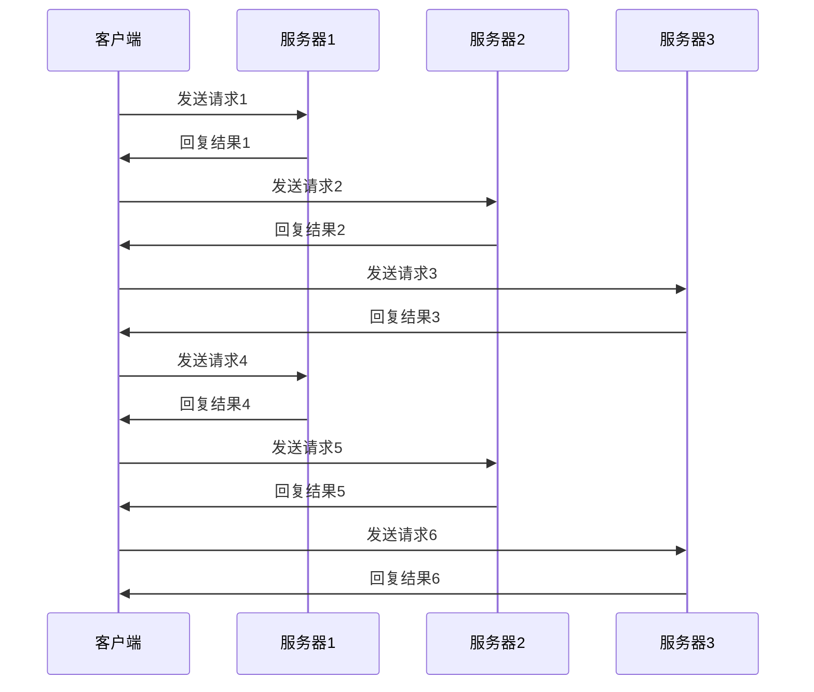

                 

# 《负载均衡算法与实现》

## 关键词：负载均衡、算法、实现、优化、实战

> 摘要：本文将深入探讨负载均衡算法及其实现，从基础概念、算法原理到实践应用，为您呈现负载均衡的全方位解析。通过逐步分析不同类型的负载均衡算法，如轮询、随机、最少连接等，帮助您理解其工作原理和优缺点。同时，文章还将分享负载均衡器的选择、安装配置、优化策略和监控维护等实践内容，并通过实际案例讲解如何实现高效负载均衡。最后，我们将探讨负载均衡与云计算、容器化和AI等高级话题，为您的负载均衡实践提供更多启示。

## 《负载均衡算法与实现》目录大纲

### 第一部分：负载均衡基础知识

- **第1章 负载均衡概述**
  - **1.1 负载均衡的概念和作用**
  - **1.2 负载均衡的分类**
  - **1.3 负载均衡的核心要素**
  - **1.4 负载均衡的发展历程**
  - **1.5 本章小结

- **第2章 负载均衡算法原理**
  - **2.1 负载均衡算法概述**
  - **2.2 轮询算法（Round Robin）**
  - **2.3 随机算法（Random）**
  - **2.4 最少连接算法（Least Connections）**
  - **2.5 加权最少连接算法（Weighted Least Connections）**
  - **2.6 基于响应时间的算法（Time-Based）**
  - **2.7 基于源IP地址的算法（Source IP Hashing）**
  - **2.8 混合算法（Hybrid）**
  - **2.9 本章小结**

- **第3章 负载均衡实践**
  - **3.1 负载均衡器的选择**
  - **3.2 负载均衡器的安装与配置**
  - **3.3 负载均衡的优化策略**
  - **3.4 负载均衡的监控与维护**
  - **3.5 实战案例分享**
  - **3.6 本章小结**

- **第4章 负载均衡高级话题**
  - **4.1 负载均衡与云计算**
  - **4.2 负载均衡与容器化**
  - **4.3 负载均衡与边缘计算**
  - **4.4 负载均衡与AI**
  - **4.5 本章小结**

## 第一部分：负载均衡基础知识

### 第1章 负载均衡概述

#### 1.1 负载均衡的概念和作用

**什么是负载均衡？**

负载均衡（Load Balancing）是指将网络流量分摊到多个服务器上，确保每个服务器都能承受其处理的流量，从而提高系统的整体性能和可用性。在现代分布式系统中，负载均衡已经成为不可或缺的一部分。

**负载均衡的目标**

负载均衡的主要目标是：

1. **性能优化**：通过将请求分散到多个服务器上，避免单点过载，提高系统的响应速度和处理能力。
2. **高可用性**：通过冗余设计，确保系统在服务器故障时仍能正常工作。
3. **可扩展性**：随着业务需求的增长，负载均衡可以帮助系统无缝地增加服务器资源。

**负载均衡的常见应用场景**

负载均衡适用于以下场景：

1. **电商网站**：高并发流量，需要确保系统的稳定性和响应速度。
2. **视频平台**：大量用户同时观看视频，需要均衡视频流传输。
3. **金融行业**：高安全性需求，需要确保交易的及时性和准确性。
4. **大型企业应用**：分布式系统架构，需要优化资源利用率。

#### 1.2 负载均衡的分类

**硬件负载均衡**

硬件负载均衡器通常采用专用硬件设备，如F5 BIG-IP，提供高性能和高可靠性。硬件负载均衡器具有以下特点：

- **高吞吐量**：处理大量并发请求。
- **高可靠性**：冗余设计和故障转移机制。
- **易于管理**：提供友好的用户界面和丰富的功能。

**软件负载均衡**

软件负载均衡是通过软件实现负载均衡功能，如Nginx、HAProxy等。软件负载均衡具有以下特点：

- **灵活性**：可以根据需求自定义负载均衡策略。
- **可扩展性**：易于添加和删除服务器。
- **成本效益**：不需要额外的硬件设备。

**分布式负载均衡**

分布式负载均衡通过在多个服务器上部署负载均衡实例，实现跨数据中心和云环境的负载均衡。分布式负载均衡具有以下特点：

- **高可用性**：多个负载均衡实例相互备份。
- **横向扩展性**：易于扩展和升级。
- **分布式处理**：可以处理大规模的分布式系统。

#### 1.3 负载均衡的核心要素

**响应时间**

响应时间是指服务器处理请求的时间。优化响应时间可以提高用户的满意度。

**吞吐量**

吞吐量是指服务器每秒可以处理的请求数量。提高吞吐量可以提升系统的性能。

**可用性**

可用性是指系统在特定时间段内可以正常运行的比例。提高可用性可以减少系统故障对业务的影响。

#### 1.4 负载均衡的发展历程

**早期负载均衡技术**

- **基于DNS的负载均衡**：通过DNS记录实现域名解析负载均衡。
- **基于硬件的负载均衡器**：如F5 BIG-IP。

**现代负载均衡技术**

- **软件负载均衡**：如Nginx、HAProxy。
- **分布式负载均衡**：如Kubernetes Service、Consul。

**未来负载均衡技术展望**

- **智能负载均衡**：利用AI技术优化负载均衡策略。
- **边缘负载均衡**：在边缘计算节点实现负载均衡，提高用户体验。

#### 1.5 本章小结

本章介绍了负载均衡的基础知识，包括概念、分类、核心要素和发展历程。负载均衡在分布式系统中起着至关重要的作用，可以帮助提高系统性能、可用性和可扩展性。

## 第二部分：负载均衡算法原理

### 第2章 负载均衡算法原理

#### 2.1 负载均衡算法概述

**什么是负载均衡算法？**

负载均衡算法是指用于决定将请求分配到哪个服务器的策略。不同的算法具有不同的工作原理和优缺点，适用于不同的场景。

**负载均衡算法的目标**

负载均衡算法的主要目标是：

1. **公平性**：尽量平均地将请求分配到各个服务器。
2. **高效性**：快速地做出决策，减少延迟。
3. **容错性**：在服务器故障时自动切换到其他服务器。

**负载均衡算法的分类**

根据工作原理，负载均衡算法可以分为以下几类：

- **轮询算法**：按照固定顺序将请求分配到服务器。
- **随机算法**：随机地将请求分配到服务器。
- **最少连接算法**：将请求分配到当前连接数最少的服务器。
- **基于响应时间的算法**：将请求分配到响应时间最短的服务器。
- **基于源IP地址的算法**：根据源IP地址的哈希值将请求分配到服务器。
- **混合算法**：结合多种算法的优点，实现更优的负载均衡。

#### 2.2 轮询算法（Round Robin）

**轮询算法的工作原理**

轮询算法按照固定的顺序将请求分配到服务器，每个服务器依次处理请求。

**轮询算法的优点和缺点**

**优点**：

- **简单易实现**：轮询算法实现简单，易于理解。
- **负载均衡**：尽量平均地将请求分配到各个服务器。

**缺点**：

- **单点故障**：当某个服务器故障时，会影响整个系统的性能。
- **高延迟**：在服务器负载不均衡时，可能导致部分服务器响应较慢。

**轮询算法的mermaid流程图**

#### 2.3 随机算法（Random）

**随机算法的工作原理**

随机算法随机地将请求分配到服务器，每个请求都有相同的概率被分配到任意一个服务器。

**随机算法的优点和缺点**

**优点**：

- **无单点故障**：随机算法不会因为某个服务器的故障而影响整个系统的性能。
- **负载均衡**：在大多数情况下，随机算法可以实现较为均衡的负载。

**缺点**：

- **高延迟**：在服务器负载不均衡时，可能导致部分服务器响应较慢。
- **不稳定**：随机算法可能导致某些服务器负载过高，其他服务器负载较低。

**随机算法的mermaid流程图**

#### 2.4 最少连接算法（Least Connections）

**最少连接算法的工作原理**

最少连接算法将请求分配到当前连接数最少的服务器，以避免某些服务器负载过高。

**最少连接算法的优点和缺点**

**优点**：

- **负载均衡**：尽量避免某些服务器负载过高。
- **高可用性**：在服务器故障时，可以自动切换到其他服务器。

**缺点**：

- **高延迟**：在服务器负载不均衡时，可能导致部分服务器响应较慢。
- **复杂性**：实现相对复杂，需要监控服务器状态。

**最少连接算法的mermaid流程图**

#### 2.5 加权最少连接算法（Weighted Least Connections）

**加权最少连接算法的工作原理**

加权最少连接算法在最少连接算法的基础上，考虑服务器的处理能力，为每个服务器分配不同的权重。请求将分配到当前连接数最少且权重最高的服务器。

**加权最少连接算法的优点和缺点**

**优点**：

- **负载均衡**：根据服务器的处理能力分配请求。
- **高可用性**：在服务器故障时，可以自动切换到其他服务器。

**缺点**：

- **复杂性**：实现相对复杂，需要监控服务器状态。
- **不稳定性**：在服务器负载不均衡时，可能导致部分服务器负载过高。

**加权最少连接算法的mermaid流程图**

#### 2.6 基于响应时间的算法（Time-Based）

**基于响应时间的算法的工作原理**

基于响应时间的算法将请求分配到响应时间最短的服务器，以减少用户等待时间。

**基于响应时间的算法的优点和缺点**

**优点**：

- **减少延迟**：响应时间短的服务器处理请求。
- **用户体验**：提高用户的满意度。

**缺点**：

- **高复杂性**：需要实时监控服务器响应时间。
- **不稳定性**：在服务器负载不均衡时，可能导致部分服务器响应时间较长。

**基于响应时间的算法的mermaid流程图**

#### 2.7 基于源IP地址的算法（Source IP Hashing）

**基于源IP地址的算法的工作原理**

基于源IP地址的算法根据客户端的IP地址的哈希值将请求分配到服务器。

**基于源IP地址的算法的优点和缺点**

**优点**：

- **会话保持**：同一客户端的请求会被分配到相同的服务器，实现会话保持。
- **负载均衡**：根据客户端IP地址实现负载均衡。

**缺点**：

- **单点故障**：当某个服务器故障时，会影响同一IP地址的所有请求。
- **高复杂性**：需要处理IP地址的哈希冲突。

**基于源IP地址的算法的mermaid流程图**

#### 2.8 混合算法（Hybrid）

**混合算法的工作原理**

混合算法结合多种负载均衡算法的优点，根据实际情况动态调整负载均衡策略。

**混合算法的优点和缺点**

**优点**：

- **灵活性**：根据不同场景选择合适的算法。
- **负载均衡**：综合多种算法的优势。

**缺点**：

- **复杂性**：实现相对复杂，需要实时调整策略。

**混合算法的mermaid流程图**

#### 2.9 本章小结

本章介绍了多种负载均衡算法的原理和特点，包括轮询算法、随机算法、最少连接算法、加权最少连接算法、基于响应时间的算法、基于源IP地址的算法和混合算法。每种算法都有其适用场景和优缺点，根据实际需求选择合适的算法可以实现更高效的负载均衡。

## 第三部分：负载均衡实践

### 第3章 负载均衡实践

#### 3.1 负载均衡器的选择

**硬件负载均衡器**

硬件负载均衡器具有高性能和高可靠性，适合处理大量并发请求。常见的硬件负载均衡器有F5 BIG-IP、Nexus 7000等。硬件负载均衡器的优点是性能强大，可靠性高，但成本较高。

**软件负载均衡器**

软件负载均衡器通过软件实现负载均衡功能，如Nginx、HAProxy等。软件负载均衡器的优点是灵活、可扩展、成本低，但性能相对硬件负载均衡器略低。

**分布式负载均衡器**

分布式负载均衡器通过在多个服务器上部署负载均衡实例，实现跨数据中心和云环境的负载均衡。常见的分布式负载均衡器有Kubernetes Service、Consul等。分布式负载均衡器的优点是高可用性和横向扩展性，但需要一定的运维能力。

#### 3.2 负载均衡器的安装与配置

**硬件负载均衡器的安装与配置**

1. **硬件负载均衡器的选择**：根据业务需求选择合适的硬件负载均衡器。
2. **硬件负载均衡器的安装**：按照硬件负载均衡器的说明书进行安装。
3. **硬件负载均衡器的配置**：配置虚拟服务器、虚拟主机、负载均衡策略等。

**软件负载均衡器的安装与配置**

1. **软件负载均衡器的选择**：根据业务需求选择合适的软件负载均衡器。
2. **软件负载均衡器的安装**：通过包管理器（如yum、apt-get）安装软件负载均衡器。
3. **软件负载均衡器的配置**：配置虚拟主机、负载均衡策略、监听端口等。

**分布式负载均衡器的安装与配置**

1. **分布式负载均衡器的选择**：根据业务需求选择合适的分布式负载均衡器。
2. **分布式负载均衡器的安装**：在多个服务器上部署分布式负载均衡器。
3. **分布式负载均衡器的配置**：配置服务发现、健康检查、负载均衡策略等。

#### 3.3 负载均衡的优化策略

**系统优化**

1. **服务器优化**：升级服务器硬件、优化操作系统、关闭不必要的服务。
2. **网络优化**：优化网络拓扑、调整网络带宽、优化DNS解析。
3. **应用优化**：优化应用代码、缓存策略、数据库查询优化。

**资源优化**

1. **CPU优化**：优化CPU使用率，避免CPU过载。
2. **内存优化**：优化内存使用率，避免内存溢出。
3. **磁盘优化**：优化磁盘IO性能，避免磁盘瓶颈。

**流量优化**

1. **限流**：限制请求的并发数，避免服务器过载。
2. **熔断**：在服务器故障时，自动切换到备用服务器。
3. **延迟优化**：优化响应时间，提高用户体验。

#### 3.4 负载均衡的监控与维护

**负载均衡监控**

1. **实时监控**：监控负载均衡器的状态、流量、连接数等指标。
2. **日志分析**：分析负载均衡器的日志，发现潜在问题。
3. **报警机制**：设置报警规则，及时发现和处理问题。

**负载均衡维护**

1. **定期检查**：定期检查负载均衡器硬件和软件状态。
2. **升级与更新**：及时升级负载均衡器软件，修复已知漏洞。
3. **故障处理**：在负载均衡器故障时，及时进行故障排除。

**负载均衡故障处理**

1. **故障定位**：通过监控和日志分析定位故障原因。
2. **故障转移**：将故障服务器从负载均衡器中移除，切换到备用服务器。
3. **故障恢复**：在故障服务器修复后，重新将其加入负载均衡器。

#### 3.5 实战案例分享

**案例一：电商网站负载均衡实践**

电商网站在高峰期面临高并发流量，需要通过负载均衡实现流量分配和性能优化。

1. **硬件负载均衡器**：使用F5 BIG-IP实现负载均衡。
2. **软件负载均衡器**：使用Nginx作为反向代理服务器。
3. **分布式负载均衡器**：使用Kubernetes Service实现跨数据中心负载均衡。
4. **优化策略**：通过系统优化、资源优化和流量优化提高系统性能。
5. **监控与维护**：使用Prometheus和Grafana监控系统状态。

**案例二：视频平台负载均衡实践**

视频平台需要处理大量视频流，需要通过负载均衡实现高效的视频流传输。

1. **硬件负载均衡器**：使用Nexus 7000实现负载均衡。
2. **软件负载均衡器**：使用HAProxy作为视频流传输服务器。
3. **分布式负载均衡器**：使用Consul实现服务发现和负载均衡。
4. **优化策略**：通过缓存策略、内容分发网络（CDN）和带宽优化提高视频传输效率。
5. **监控与维护**：使用Nagios和Zabbix监控系统状态。

**案例三：金融行业负载均衡实践**

金融行业对系统的安全性和稳定性有严格要求，需要通过负载均衡实现高可用性和高性能。

1. **硬件负载均衡器**：使用F5 BIG-IP实现负载均衡。
2. **软件负载均衡器**：使用Nginx作为反向代理服务器。
3. **分布式负载均衡器**：使用Kubernetes Service实现负载均衡。
4. **优化策略**：通过安全策略、限流和熔断提高系统安全性。
5. **监控与维护**：使用Prometheus和Grafana监控系统状态。

#### 3.6 本章小结

本章介绍了负载均衡器的选择、安装与配置、优化策略、监控与维护等实践内容。通过实际案例，展示了不同类型负载均衡器的应用场景和实现方法。了解和实践负载均衡技术，可以帮助您优化系统性能、提高可用性和可扩展性。

## 第四部分：负载均衡高级话题

### 第4章 负载均衡高级话题

#### 4.1 负载均衡与云计算

**云计算与负载均衡的关系**

云计算通过虚拟化和分布式计算技术，提供了可扩展、灵活和高效的计算资源。负载均衡在云计算中起着至关重要的作用，可以实现以下目标：

- **资源优化**：通过负载均衡，可以根据需求动态调整计算资源。
- **性能优化**：通过负载均衡，可以避免单点过载，提高系统的响应速度。
- **高可用性**：通过负载均衡，可以实现跨区域的数据备份和故障转移。

**云负载均衡的优势和挑战**

**优势**：

- **弹性伸缩**：云负载均衡可以根据业务需求自动调整资源。
- **高可用性**：云负载均衡可以跨多个数据中心实现故障转移。
- **成本效益**：云负载均衡可以按需计费，降低成本。

**挑战**：

- **复杂性**：云负载均衡涉及到多个云服务提供商和数据中心，需要管理和协调。
- **网络延迟**：跨区域的负载均衡可能导致网络延迟增加。
- **安全性**：云负载均衡需要确保数据传输的安全性和隐私性。

**云负载均衡的实现方式**

- **公有云负载均衡**：如阿里云的SLB、腾讯云的CLB等。
- **混合云负载均衡**：结合公有云和私有云的负载均衡，实现跨云的负载均衡。
- **容器化负载均衡**：如Kubernetes Service、Istio等。

#### 4.2 负载均衡与容器化

**容器化与负载均衡的关系**

容器化技术，如Docker和Kubernetes，提供了轻量级、可移植和可扩展的容器环境。负载均衡在容器化环境中起着关键作用，可以实现以下目标：

- **服务发现**：容器化环境中的服务可以通过负载均衡实现自动发现和注册。
- **流量分发**：负载均衡可以将外部流量分发到多个容器实例上。
- **故障转移**：在容器实例故障时，负载均衡可以自动切换到其他实例。

**容器负载均衡的优势和挑战**

**优势**：

- **弹性伸缩**：容器化环境可以快速调整容器实例的数量，实现动态伸缩。
- **高可用性**：容器化环境可以实现故障转移和自动恢复。
- **简化运维**：容器化环境简化了服务部署和运维过程。

**挑战**：

- **容器编排**：容器化环境需要有效的容器编排和管理工具。
- **性能开销**：容器化环境可能会引入额外的性能开销。

**容器负载均衡的实现方式**

- **Kubernetes Service**：Kubernetes Service提供内置的负载均衡功能，可以根据不同策略将流量分发到容器实例。
- **外部负载均衡器**：如Nginx、HAProxy等，可以与Kubernetes集成，实现外部负载均衡。
- **容器网络接口（CNI）**：如Calico、Flannel等，可以用于容器网络的负载均衡。

#### 4.3 负载均衡与边缘计算

**边缘计算与负载均衡的关系**

边缘计算将计算和存储资源部署在靠近用户的位置，以减少网络延迟和提高系统性能。负载均衡在边缘计算中起着重要作用，可以实现以下目标：

- **就近服务**：负载均衡可以将请求分配到距离用户最近的边缘节点，提高用户体验。
- **性能优化**：负载均衡可以避免边缘节点的过载，提高系统的响应速度。
- **高可用性**：负载均衡可以实现跨边缘节点的故障转移。

**边缘负载均衡的优势和挑战**

**优势**：

- **低延迟**：边缘计算可以减少网络延迟，提高系统的响应速度。
- **高可用性**：边缘计算可以实现跨区域的故障转移。
- **资源优化**：边缘计算可以根据用户需求动态调整资源。

**挑战**：

- **边缘节点管理**：边缘计算涉及大量的边缘节点，需要有效的管理和维护。
- **网络稳定性**：边缘计算的网络连接可能不如数据中心稳定。

**边缘负载均衡的实现方式**

- **边缘负载均衡器**：如NGINX Plus、Kong等，可以部署在边缘节点上，实现流量分发和负载均衡。
- **容器化负载均衡**：如Kubernetes在边缘节点的部署，可以实现容器化的边缘负载均衡。
- **分布式负载均衡**：如Consul、Eureka等，可以实现跨边缘节点的负载均衡。

#### 4.4 负载均衡与AI

**AI与负载均衡的关系**

人工智能（AI）技术在负载均衡中的应用，可以进一步提高系统的性能和可扩展性。AI技术可以实现以下目标：

- **智能流量分配**：基于机器学习算法，实现更智能的流量分配策略。
- **异常检测**：通过监控和分析流量数据，实现异常检测和故障预测。
- **自动化运维**：基于AI算法，实现自动化的负载均衡优化和故障处理。

**智能负载均衡**

智能负载均衡结合AI技术和负载均衡算法，可以动态调整负载均衡策略，实现更优的流量分配。以下是一些智能负载均衡的实现方法：

- **机器学习算法**：如K-means聚类、决策树、神经网络等，用于优化流量分配策略。
- **深度学习模型**：如卷积神经网络（CNN）、循环神经网络（RNN）等，用于流量预测和故障检测。
- **增强学习**：通过强化学习算法，实现自动化的负载均衡策略优化。

**AI负载均衡的优势和挑战**

**优势**：

- **高效流量分配**：通过AI算法，可以实现更高效的流量分配，提高系统性能。
- **自动化运维**：通过AI技术，可以实现自动化运维，减少人工干预。
- **故障预测**：通过AI算法，可以提前预测故障，实现预防性维护。

**挑战**：

- **数据质量**：AI算法的性能取决于数据质量，需要高质量的数据支持。
- **计算开销**：AI算法可能引入额外的计算开销，需要平衡性能和成本。

**AI负载均衡的实现方式**

- **集成AI库**：如TensorFlow、PyTorch等，用于实现AI算法。
- **AI负载均衡器**：如NGINX Plus的AI模块，提供智能流量分配功能。
- **AI平台**：如AWS AI、Azure AI等，提供AI负载均衡服务和工具。

#### 4.5 本章小结

本章介绍了负载均衡与云计算、容器化、边缘计算和AI等高级话题。通过结合这些先进技术，可以实现更高效、智能的负载均衡，为分布式系统提供更好的性能和可靠性。了解这些高级话题，可以帮助您在负载均衡实践中取得更好的效果。

### 作者

**作者：AI天才研究院/AI Genius Institute & 禅与计算机程序设计艺术 /Zen And The Art of Computer Programming**

