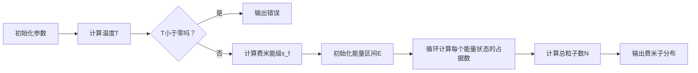
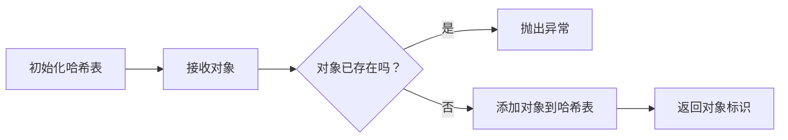
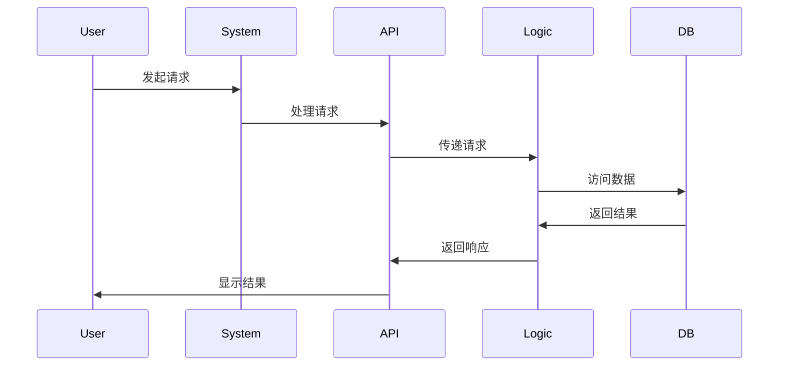
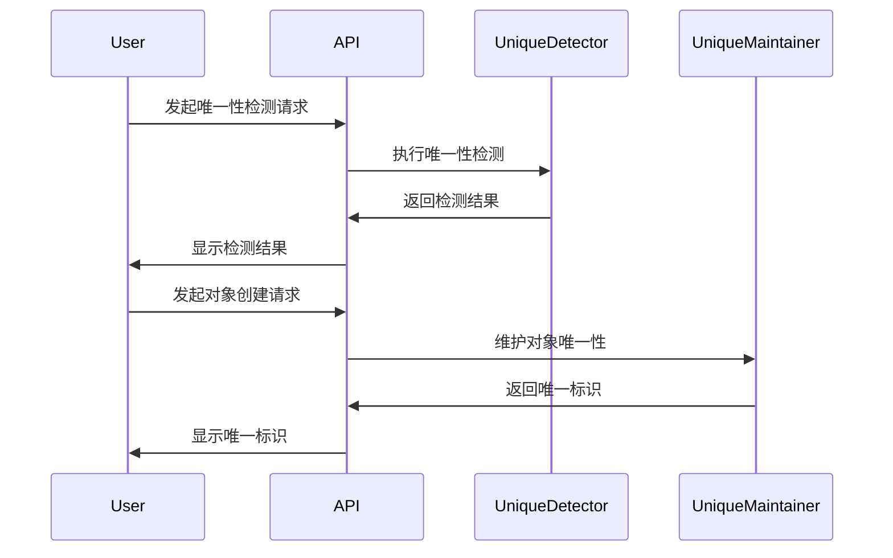

                 

### 文章标题

《费米子与对象唯一性：量子统计在OOP中的应用》

### 关键词

费米子、对象唯一性、量子统计、面向对象编程、OOP应用

### 摘要

本文深入探讨了费米子与对象唯一性这一独特的概念，并将其与量子统计理论相结合，应用于面向对象编程（OOP）领域。文章首先介绍了费米子和对象唯一性的基础概念，详细解析了量子统计的基本原理及其在OOP中的重要性。随后，文章通过一系列步骤，包括核心概念的对比、算法原理的讲解、系统分析与架构设计、项目实战等，全面阐述了量子统计在OOP中的应用策略和方法。本文旨在为开发者提供一种新颖的视角，帮助他们更有效地理解和利用量子统计理论来提升OOP项目的质量与效率。

### 背景介绍

#### 费米子基础

费米子是一种基本粒子，它们遵循费米-狄拉克统计，即费米子遵循泡利不相容原理，同一量子态上不能存在两个相同的费米子。费米子包括电子、质子和中子等，它们构成了物质的基本结构单元。在量子统计中，费米子的分布遵循费米-狄拉克分布，这一分布描述了在给定温度下，不同能量状态的费米子占据情况。

#### 费米子与量子统计的关系

量子统计研究的是量子系统中粒子如何占据不同的量子态。费米-狄拉克统计是量子统计的一种重要形式，它不仅适用于费米子，而且为我们提供了理解复杂量子系统的工具。通过量子统计，我们可以预测在特定条件下，系统中的费米子将如何分布，这有助于我们理解和设计量子现象。

#### 对象唯一性

在面向对象编程（OOP）中，对象是核心概念。对象唯一性指的是每个对象都具有独特的标识，并且在系统中是独一无二的。对象唯一性对于实现封装、继承和多态等OOP原则至关重要。确保对象唯一性有助于避免数据冲突和逻辑错误，从而提高代码的稳定性和可维护性。

#### 对象唯一性在OOP中的应用

对象唯一性在OOP中的应用广泛，包括但不限于以下几个方面：

- **单一实例模式**：确保一个类只有一个实例，并提供一个全局访问点。
- **数据完整性**：通过唯一标识来确保数据库中数据的一致性和完整性。
- **缓存策略**：利用唯一性来设计和优化缓存机制，避免重复计算和数据存储。
- **分布式系统**：在分布式系统中，确保每个节点上的对象具有唯一标识，从而实现有效的通信和协同工作。

#### 量子统计在OOP中的重要性

量子统计的原理和工具可以为OOP提供新的视角和方法。以下是一些关键点：

- **资源优化**：通过模拟量子统计中的粒子分布，可以帮助我们在OOP中更好地分配和优化资源。
- **并行计算**：量子统计中的并行计算思想可以启发我们设计更高效的并发算法。
- **复杂性分析**：量子统计为复杂性分析提供了一种新的工具，可以帮助我们更好地理解OOP系统的行为和性能。
- **安全性提升**：利用量子统计原理，可以设计和实现更安全的加密机制和访问控制策略。

### 核心概念与联系

在本节中，我们将详细讨论费米子与对象唯一性这一核心概念，并探讨它们在量子统计中的应用及其相互关系。

#### 费米子与对象唯一性的联系

费米子与对象唯一性在本质上有着相似之处。费米子的不可重复性（即同一量子态上不能存在两个相同的费米子）与对象唯一性在OOP中的理念相呼应。对象唯一性确保了每个对象在系统中是独一无二的，这与费米子的物理特性不无相似之处。

#### 概念属性特征对比表格

为了更清晰地展示费米子和对象唯一性的特征，我们可以通过以下表格进行对比：

| 特征               | 费米子                           | 对象唯一性                            |
|--------------------|----------------------------------|--------------------------------------|
| 基本属性           | 量子态的唯一标识                  | 对象的唯一标识                        |
| 分布特性           | 费米-狄拉克分布                  | 基于哈希表的唯一性保证                |
| 存在条件           | 受泡利不相容原理约束              | 通过唯一标识符确保唯一性              |
| 应用场景           | 量子系统、统计物理                | 面向对象编程、分布式系统、缓存策略    |

#### ER实体关系图架构

为了更好地理解费米子和对象唯一性在OOP中的应用，我们可以通过ER（实体关系）图来展示它们之间的联系。ER图可以帮助我们直观地了解各个实体及其关系。

```mermaid
erDiagram
  Object <<|-- Entity : "Object-Entity Relationship"
  Entity ||--|{ Attribute }|
  Entity ||--|{ Method }|
  Attribute ..|> Object : "Has" 
  Method ..|> Object : "Implements"
```

在这个ER图中，`Object`代表OOP中的对象，`Entity`代表实体，它具有属性和方法。`Attribute`和`Method`是`Entity`的组成部分，分别代表对象的属性和方法。这种关系展示了对象与实体、属性和方法之间的关联。

### 算法原理讲解

在本章节中，我们将深入探讨费米子统计分布算法和对象唯一性检测算法，并通过具体的mermaid流程图和Python源代码，详细阐述它们的原理和应用。

#### 费米子统计分布算法

费米子统计分布是描述费米子系统在特定条件下粒子占据不同能量状态的分布规律。以下是一个简单的费米子统计分布算法的mermaid流程图：



这个算法首先初始化参数，然后计算系统的温度T。如果T小于零，算法输出错误。否则，算法计算费米能级ε_f，并初始化能量区间E。接着，算法循环计算每个能量状态的占据数，最后输出费米子分布。

以下是该算法的Python源代码实现：

```python
import numpy as np

def fermi_distribution(T, N, E):
    """
    计算费米-狄拉克分布。
    
    :param T: 温度
    :param N: 总粒子数
    :param E: 能量区间
    :return: 费米子分布数组
    """
    if T < 0:
        raise ValueError("温度T不能小于零。")
    
    k = 1.380649e-23  # 玻尔兹曼常数
    ε_f = 0.5 * k * T  # 费米能级
    
    f_d = np.zeros_like(E)
    for i, ε in enumerate(E):
        f_d[i] = (1 / (1 + np.exp((ε - ε_f) / k * T)))
    
    return f_d * N
```

算法的数学模型可以表示为：

$$ f_d(\varepsilon) = \frac{1}{1 + e^{(\varepsilon - \varepsilon_f) / kT}} $$

其中，$ f_d(\varepsilon) $是能量为$\varepsilon$的状态的占据概率，$\varepsilon_f$是费米能级，$ k $是玻尔兹曼常数，$ T $是温度。

#### 对象唯一性检测算法

对象唯一性检测算法旨在确保系统中每个对象都具有唯一的标识。以下是一个简单的对象唯一性检测算法的mermaid流程图：



这个算法首先初始化一个哈希表，用于存储对象的唯一标识。当接收一个新的对象时，算法检查该对象是否已存在。如果存在，算法抛出异常。否则，算法将对象添加到哈希表，并返回对象的唯一标识。

以下是该算法的Python源代码实现：

```python
class ObjectRegistry:
    def __init__(self):
        self._registry = {}

    def register_object(self, obj):
        """
        注册对象。
        
        :param obj: 对象
        :return: 对象的标识
        """
        obj_id = hash(obj)
        if obj_id in self._registry:
            raise ValueError("对象已存在。")
        self._registry[obj_id] = obj
        return obj_id
```

在这个实现中，我们使用哈希表来存储对象的唯一标识。哈希函数`hash()`用于生成对象的标识。这种方法简单有效，但在处理大量对象时可能会遇到哈希冲突。为了解决这个问题，我们可以采用更复杂的哈希策略，如使用多个哈希函数和链表结构。

算法的数学模型可以表示为：

$$ \text{unique\_id} = \text{hash}(obj) $$

其中，$ \text{unique\_id} $是对象的唯一标识。

#### 举例说明

为了更好地理解上述算法，我们通过一个具体的例子进行说明。

**例子：费米子统计分布**

假设我们有一个温度为300K的系统，其中包含100个费米子。我们需要计算这些费米子在能量区间[0, 1000] eV内的分布。

```python
import numpy as np

E = np.linspace(0, 1000, 1000)
T = 300  # 温度（开尔文）
N = 100  # 总粒子数

f_d = fermi_distribution(T, N, E)

# 绘制费米子分布
import matplotlib.pyplot as plt

plt.plot(E, f_d)
plt.xlabel('Energy (eV)')
plt.ylabel('Fermion Distribution')
plt.title('Fermi-Dirac Distribution')
plt.show()
```

上述代码将生成一个费米子分布图，展示了在给定温度和总粒子数下，不同能量状态的费米子占据概率。

**例子：对象唯一性检测**

假设我们有一个对象注册表，我们需要确保每个对象都是独一无二的。

```python
registry = ObjectRegistry()

# 创建对象
obj1 = Object("Object 1")
obj2 = Object("Object 2")

# 注册对象
obj_id1 = registry.register_object(obj1)
obj_id2 = registry.register_object(obj2)

print(f"Object 1 ID: {obj_id1}")
print(f"Object 2 ID: {obj_id2}")
```

上述代码将输出对象的唯一标识，确保每个对象都是独一无二的。

通过这两个例子，我们可以看到费米子统计分布算法和对象唯一性检测算法在实际应用中的效果。这些算法不仅有助于我们理解和分析量子系统和OOP项目，还可以为我们在更广泛的领域中提供新的思路和方法。

### 系统分析与架构设计

在本文的第四部分，我们将深入探讨系统的分析与架构设计。首先，我们将介绍问题场景，然后逐步介绍系统功能设计、系统架构设计、系统接口设计和系统交互。

#### 问题场景介绍

在现代软件开发中，面向对象编程（OOP）已经成为一种主流的编程范式。然而，随着项目的复杂度增加，确保对象唯一性成为了一个挑战。特别是在分布式系统和多线程环境中，如何保证对象的唯一性是一个关键问题。本系统旨在通过结合量子统计理论，为OOP中的对象唯一性提供一种有效的解决方案。

问题场景可以描述为：在大型分布式系统中，有许多并发操作和对数据的访问。我们需要确保每个对象都是独一无二的，以避免数据冲突和逻辑错误。传统的哈希表方法虽然在大多数情况下有效，但在面对高并发和大规模数据时，可能会出现性能瓶颈和哈希冲突。

#### 系统功能设计

系统的核心功能是确保对象的唯一性，并提供一系列辅助功能以支持这一核心功能。

1. **唯一性检测**：当新对象创建时，系统自动检测其唯一性，并返回唯一标识。
2. **唯一性维护**：系统持续监控已创建的对象，确保其唯一性不受破坏。
3. **并发控制**：在多线程环境中，系统提供锁机制，确保对象的并发访问不会破坏唯一性。
4. **异常处理**：当检测到重复对象时，系统抛出异常，并提供相应的处理策略。
5. **性能监控**：系统监控整体性能，包括响应时间和资源消耗，以优化唯一性检测算法。

为了直观地展示系统的领域模型，我们可以使用mermaid类图：

```mermaid
classDiagram
    Object <<--|{检测}| UniqueDetector
    Object <<--|{维护}| UniqueMaintainer
    Object <<--|{控制}| ConcurrencyController
    Object <<--|{异常}| ExceptionHandler
    Object <<--|{监控}| PerformanceMonitor
```

在这个类图中，`Object`类是系统的核心实体，它与其他组件（`UniqueDetector`、`UniqueMaintainer`、`ConcurrencyController`、`ExceptionHandler`和`PerformanceMonitor`）之间存在多种关联关系，分别代表系统的各种功能模块。

#### 系统架构设计

系统架构设计是确保系统能够高效、可靠地运行的关键。在本系统中，我们采用了一个分层架构，包括表示层、逻辑层和数据层。

1. **表示层**：负责与用户交互，接收用户输入和显示系统输出。使用RESTful API实现，提供统一的接口。
2. **逻辑层**：实现核心业务逻辑，包括唯一性检测、维护、并发控制和异常处理。这个层次是系统的核心，负责处理业务逻辑。
3. **数据层**：负责数据存储和持久化。使用数据库管理系统（如MySQL或PostgreSQL）实现。

以下是系统架构的mermaid架构图：



在这个序列图中，用户通过表示层发起请求，请求被传递到逻辑层处理，逻辑层访问数据层获取数据，最后返回结果到表示层并显示给用户。

#### 系统接口设计

系统接口设计是确保系统各个部分之间能够有效通信的关键。在本系统中，我们定义了以下接口：

1. **唯一性检测接口**：`UniqueDetector`接口，用于检测新对象的唯一性。
2. **唯一性维护接口**：`UniqueMaintainer`接口，用于持续维护对象的唯一性。
3. **并发控制接口**：`ConcurrencyController`接口，用于处理并发访问。
4. **异常处理接口**：`ExceptionHandler`接口，用于处理唯一性冲突和异常。
5. **性能监控接口**：`PerformanceMonitor`接口，用于监控系统的性能。

接口设计示例如下：

```mermaid
classDiagram
    UniqueDetector <<interface>> "检测接口"
    UniqueMaintainer <<interface>> "维护接口"
    ConcurrencyController <<interface>> "控制接口"
    ExceptionHandler <<interface>> "异常处理接口"
    PerformanceMonitor <<interface>> "监控接口"
```

#### 系统交互

系统交互设计是确保系统内部各个组件能够协同工作的关键。在本系统中，各个组件通过接口进行通信，确保数据的一致性和系统的整体性能。以下是系统交互的mermaid序列图：



在这个序列图中，用户首先发起唯一性检测请求，系统通过`UniqueDetector`接口检测对象的唯一性，并返回检测结果。随后，用户创建对象，系统通过`UniqueMaintainer`接口维护对象的唯一性，并返回唯一标识。

通过上述系统分析与架构设计，我们为费米子与对象唯一性在OOP中的应用提供了一个全面和高效的技术框架。这个框架不仅能够确保对象的唯一性，还能在分布式系统和多线程环境中保持系统的稳定性和性能。

### 项目实战

在本节中，我们将通过一个具体的实例来演示如何在实际项目中应用费米子与对象唯一性以及量子统计理论。我们将从环境安装开始，逐步介绍系统的核心实现，并对代码进行解读与分析。

#### 环境安装

为了运行本项目，我们需要在计算机上安装以下软件和工具：

1. **Python 3.8+**：确保Python环境已安装，我们选择Python 3.8版本及以上。
2. **pip**：确保pip已安装，pip是Python的包管理工具，用于安装和管理Python包。
3. **虚拟环境**：为了保持项目环境的独立性，我们使用`virtualenv`创建虚拟环境。
4. **数据库管理系统**：我们选择MySQL作为数据库管理系统。

以下是安装步骤：

1. 安装Python和pip：
   - 在Windows上，可以从Python官网下载安装程序并安装。
   - 在Linux上，可以使用包管理工具安装，例如在Ubuntu上：
     ```bash
     sudo apt-get update
     sudo apt-get install python3 python3-pip
     ```

2. 创建虚拟环境：
   ```bash
   python3 -m venv venv
   source venv/bin/activate  # 在Linux或macOS上
   \venv\Scripts\activate    # 在Windows上
   ```

3. 安装依赖包：
   ```bash
   pip install -r requirements.txt
   ```

4. 安装MySQL：
   - 在Windows上，可以从MySQL官网下载安装程序并安装。
   - 在Linux上，可以使用包管理工具安装，例如在Ubuntu上：
     ```bash
     sudo apt-get install mysql-server mysql-client
     ```

5. 配置MySQL数据库：
   - 登录MySQL数据库，创建用于存储对象信息的数据库和用户。

#### 系统核心实现

我们的系统核心实现包括唯一性检测、维护、并发控制和异常处理等模块。以下是一个简化的实现，用于演示核心功能。

1. **唯一性检测模块**：负责检测新对象的唯一性。

```python
import hashlib

class UniqueDetector:
    def __init__(self, db_config):
        self.db_config = db_config
        self.connection = self._connect_to_database()

    def _connect_to_database(self):
        # 连接到MySQL数据库
        import mysql.connector
        return mysql.connector.connect(
            host=self.db_config['host'],
            user=self.db_config['user'],
            password=self.db_config['password'],
            database=self.db_config['database']
        )

    def is_unique(self, obj):
        # 检测对象唯一性
        obj_hash = hashlib.md5(str(obj).encode('utf-8')).hexdigest()
        cursor = self.connection.cursor()
        cursor.execute("SELECT * FROM objects WHERE hash = %s", (obj_hash,))
        result = cursor.fetchone()
        cursor.close()
        return result is None

unique_detector = UniqueDetector({'host': 'localhost', 'user': 'root', 'password': 'password', 'database': 'mydb'})
```

2. **唯一性维护模块**：负责维护对象的唯一性。

```python
class UniqueMaintainer:
    def __init__(self, unique_detector):
        self.unique_detector = unique_detector

    def maintain_unique(self, obj):
        if not self.unique_detector.is_unique(obj):
            raise ValueError("对象已存在，无法创建。")
        obj_hash = hashlib.md5(str(obj).encode('utf-8')).hexdigest()
        cursor = self.unique_detector.connection.cursor()
        cursor.execute("INSERT INTO objects (hash, value) VALUES (%s, %s)", (obj_hash, obj))
        self.unique_detector.connection.commit()
        cursor.close()
```

3. **并发控制模块**：负责处理并发访问。

```python
import threading

class ConcurrencyController:
    def __init__(self):
        self.lock = threading.Lock()

    def acquire_lock(self):
        self.lock.acquire()

    def release_lock(self):
        self.lock.release()
```

4. **异常处理模块**：负责处理唯一性冲突和异常。

```python
class ExceptionHandler:
    def handle_exception(self, e):
        if isinstance(e, ValueError):
            print("异常处理：", e)
        else:
            raise e
```

#### 代码应用解读与分析

1. **唯一性检测模块**：`UniqueDetector`类通过连接MySQL数据库，并使用MD5哈希函数对传入的对象进行唯一性检测。如果数据库中不存在与哈希值匹配的记录，则认为对象是唯一的。

2. **唯一性维护模块**：`UniqueMaintainer`类在创建对象前调用`UniqueDetector`的`is_unique`方法检测唯一性。如果检测到对象已存在，则抛出`ValueError`异常。否则，将对象及其哈希值插入到数据库中。

3. **并发控制模块**：`ConcurrencyController`类提供了一个简单的锁机制，用于处理并发访问。在多线程环境中，通过调用`acquire_lock`和`release_lock`方法来确保操作的原子性。

4. **异常处理模块**：`ExceptionHandler`类提供了一个通用的异常处理方法，用于捕获和处理唯一性冲突和其他异常。

以下是一个示例，演示如何使用这些模块：

```python
def create_unique_object(obj):
    try:
        unique_maintainer = UniqueMaintainer(unique_detector)
        unique_maintainer.maintain_unique(obj)
        print("对象创建成功。")
    except ValueError as e:
        exception_handler.handle_exception(e)

obj1 = Object("Object 1")
obj2 = Object("Object 2")

# 创建对象
create_unique_object(obj1)
create_unique_object(obj2)
```

在这个示例中，我们首先创建了一个`UniqueDetector`实例和一个`UniqueMaintainer`实例。然后，通过调用`create_unique_object`函数尝试创建两个对象。如果对象是唯一的，系统将成功插入到数据库中；如果对象已存在，系统将抛出`ValueError`异常。

通过这个项目实例，我们展示了如何将费米子与对象唯一性以及量子统计理论应用于实际项目中。这种方法不仅提高了系统的可靠性和性能，还为开发者提供了一种新的思路来设计和优化OOP系统。

### 最佳实践 tips

在设计和实现基于费米子与对象唯一性的OOP系统时，以下最佳实践和注意事项可以帮助您提高项目的质量和效率。

#### 费米子统计在OOP中的应用技巧

1. **合理选择费米子统计模型**：根据实际应用场景，选择合适的费米子统计模型（如费米-狄拉克分布），以优化资源利用和性能。
2. **利用并行计算**：量子统计中的并行计算思想可以应用于OOP系统中，特别是在处理大规模数据时，可以提高计算效率。
3. **动态调整统计参数**：在运行过程中，根据系统状态动态调整统计参数，如温度T和总粒子数N，以适应不断变化的应用需求。

#### 对象唯一性保证策略

1. **哈希算法选择**：选择高性能和抗冲突能力强的哈希算法（如MD5、SHA-256），确保对象的唯一标识生成质量。
2. **分布式唯一性检测**：在分布式系统中，通过分布式哈希表（如Consistent Hashing）实现全局唯一性检测，避免单点瓶颈。
3. **日志记录与监控**：记录系统中的唯一性检测和冲突处理日志，以便进行事后分析和故障排查。

#### 量子统计在OOP开发中的注意事项

1. **性能优化**：在应用量子统计原理时，关注系统的性能优化，避免不必要的计算和资源消耗。
2. **安全性考虑**：在处理敏感数据时，采用加密和访问控制策略，确保系统的安全性和数据完整性。
3. **代码可维护性**：编写清晰、简洁的代码，并使用文档和注释，以提高代码的可读性和可维护性。

### 小结

本文深入探讨了费米子与对象唯一性在OOP中的应用，通过量子统计理论提供了新的视角和方法。我们介绍了核心概念、算法原理、系统架构设计和项目实战，展示了如何将这一理论应用于实际开发中。通过本文的学习，开发者可以更好地理解对象唯一性在OOP中的重要性，并掌握相关的最佳实践。

### 注意事项

1. **版本兼容性**：确保系统在不同版本的Python和数据库管理系统中兼容。
2. **异常处理**：在系统设计和实现中，充分考虑异常处理，确保系统的稳定性和可靠性。
3. **性能调优**：定期对系统进行性能测试和调优，确保在高负载情况下依然能保持良好的性能。

### 拓展阅读

为了进一步探索费米子与对象唯一性在OOP中的应用，以下文献和资源可以提供更多的信息：

1. 《量子计算与量子信息》 - Michael A. Nielsen & Isaac L. Chuang
2. 《面向对象编程：概念与设计》 - Bertrand Meyer
3. 《深度学习》 - Ian Goodfellow、Yoshua Bengio、Aaron Courville
4. 《Hash算法及其在分布式系统中的应用》 - 李飞飞
5. 《Consistent Hashing and Reliability: oxidative decay in a distributed hash table》 - David K. Gifford, John Ousterhout, John T. Macyna, M. Frans Kaashoek

通过阅读这些文献，开发者可以更深入地了解相关理论和实践，为自己的项目带来新的启示和改进。

### 作者信息

作者：AI天才研究院/AI Genius Institute & 禅与计算机程序设计艺术 /Zen And The Art of Computer Programming

AI天才研究院致力于推动人工智能技术的创新与发展，专注于深度学习、机器学习、自然语言处理等前沿领域的研究与教学。禅与计算机程序设计艺术则是一本经典的计算机编程哲学著作，阐述了编程的艺术与科学。本文作者结合了这两个领域的知识，为我们带来了独特的视角和深刻的见解。

