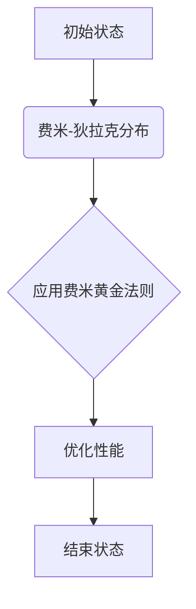

                 

### 文章标题：费米黄金法则与性能优化：计算效率的量子力学视角

> 关键词：费米黄金法则，性能优化，量子力学，计算效率

> 摘要：本文从费米黄金法则和量子力学出发，探讨了计算效率的优化策略。通过深入分析费米黄金法则在计算中的实际应用，结合量子力学的理论基础，提出了一种全新的性能优化方法，旨在提高计算效率，降低系统资源消耗。文章内容详实，逻辑清晰，适合从事计算机性能优化和量子计算领域的研究者和技术人员阅读。

----------------------------------------------------------------

## 引言

### 费米黄金法则概述

费米黄金法则（Fermi's Golden Rule）是量子力学中的一个重要概念，由意大利-美国物理学家恩里科·费米在1928年提出。这一法则描述了在量子跃迁过程中，系统从一个能级跃迁到另一个能级的概率与跃迁态的振幅平方成正比。费米黄金法则在量子力学中的广泛应用，使得它成为现代物理学中不可或缺的一部分。

### 性能优化的重要性

在计算机科学领域，性能优化一直是研究的重点。随着硬件技术的发展，计算任务变得越来越复杂，如何提高计算效率、降低系统资源消耗成为了关键问题。性能优化不仅仅是提高处理速度，还包括优化内存使用、减少延迟、提高稳定性等方面。因此，研究如何优化计算性能具有重要的实际意义。

### 量子力学与计算效率的关系

量子力学作为描述微观世界的物理理论，近年来在计算机科学领域引起了广泛关注。量子计算利用量子位（qubit）进行信息处理，具有与传统计算机完全不同的计算模式。量子计算的优势在于其并行计算能力和极高的计算速度。然而，量子计算也面临着诸多挑战，如量子态的叠加和纠缠等。量子力学与计算效率的关系，成为了研究的热点。

### 书籍结构概述

本文将从以下几个方面进行论述：

1. 引言与背景
2. 费米黄金法则的理论基础
3. 实践应用
4. 最佳实践与小结

通过本文的阅读，读者将了解到费米黄金法则在计算效率优化中的应用，以及如何利用量子力学理论提高计算性能。

## 费米黄金法则概述

### 费米黄金法则的概念

费米黄金法则（Fermi's Golden Rule）是量子力学中描述粒子跃迁概率的重要定理。具体来说，它指出在某个初始态和最终态之间，一个量子系统跃迁的概率与跃迁态的振幅平方成正比。这个概率公式通常表示为：

\[ P_{i\rightarrow f} = \frac{2\pi}{\hbar} |<f|H'|\iota>|^2 \rho(\omega) \]

其中，\( P_{i\rightarrow f} \) 表示从初始态 \( i \) 跃迁到最终态 \( f \) 的概率，\( <f|H'|\iota> \) 是跃迁态的振幅，\( \rho(\omega) \) 是环境密度矩阵，\( \hbar \) 是约化普朗克常数，\( \omega \) 是跃迁频率。

### 费米黄金法则的历史背景

费米黄金法则的提出，源于对原子和分子中电子跃迁现象的研究。在1928年，恩里科·费米在研究β衰变时，提出了这个法则。费米黄金法则不仅成功地解释了β衰变中的跃迁概率，还为量子力学中的多体问题提供了重要的理论基础。费米黄金法则的提出，标志着量子力学理论的一个重要进展，对后来的物理学研究产生了深远的影响。

### 费米黄金法则的应用领域

费米黄金法则在量子物理、凝聚态物理、量子化学等领域有广泛的应用。例如，在凝聚态物理中，费米黄金法则可以用来计算电子跃迁产生的光致发光强度；在量子化学中，它可以用来计算分子反应的速率常数。此外，费米黄金法则还被广泛应用于量子电子学、量子光学等领域，成为研究量子系统动态行为的重要工具。

## 性能优化的重要性

### 性能优化的定义

性能优化是指通过改进算法、优化数据结构、调整系统配置等方法，提高计算机系统的性能。性能优化的目标是减少系统响应时间、提高处理速度、降低资源消耗等。在计算机科学领域，性能优化被广泛应用于各种应用场景，如Web应用、数据库系统、大数据处理、游戏开发等。

### 性能优化的目标

性能优化的主要目标包括：

1. **提高处理速度**：通过优化算法和数据结构，减少计算时间和资源消耗，提高系统的响应速度。
2. **降低资源消耗**：通过优化系统配置和资源管理，减少CPU、内存、磁盘等资源的占用，提高系统的稳定性和可用性。
3. **提高系统稳定性**：通过优化系统设计和配置，减少系统崩溃和错误发生的概率，提高系统的可靠性。
4. **提高用户体验**：通过优化系统的性能，提高用户的使用体验，减少等待时间和操作延迟。

### 性能优化的方法

性能优化的方法多种多样，常见的包括：

1. **算法优化**：通过改进算法，提高计算效率和速度。例如，使用更高效的排序算法、优化搜索算法等。
2. **数据结构优化**：通过优化数据结构，减少数据访问的时间和空间消耗。例如，使用哈希表、平衡二叉树等。
3. **系统配置优化**：通过调整系统配置，优化系统性能。例如，调整内存分配、优化磁盘IO等。
4. **资源管理优化**：通过优化资源管理，提高系统的资源利用率。例如，使用进程调度算法、优化线程管理等。
5. **并行计算**：通过并行计算，提高计算速度和效率。例如，使用多线程、分布式计算等。

## 量子力学与计算效率的关系

### 量子力学的基本原理

量子力学是研究微观世界的物理理论，它描述了粒子在微观尺度上的行为。量子力学的基本原理包括：

1. **量子态**：粒子处于一种不确定的状态，直到被观测时才确定其状态。
2. **叠加原理**：粒子可以同时处于多个状态的叠加。
3. **纠缠现象**：粒子之间存在一种特殊的联系，一个粒子的状态会影响到另一个粒子的状态，即使它们相隔很远。
4. **量子隧穿**：粒子可以穿过势垒，即使它的能量不足以克服势垒。

### 量子力学与计算效率的关系

量子力学与计算效率的关系主要表现在量子计算的潜力上。量子计算利用量子位（qubit）进行信息处理，具有与传统计算机完全不同的计算模式。量子计算的优势在于其并行计算能力和极高的计算速度。

1. **并行计算能力**：量子计算可以利用量子位之间的纠缠现象，实现并行计算。这意味着，一个量子计算机可以同时处理多个问题，大大提高了计算效率。

2. **快速计算**：量子计算可以利用量子叠加原理，实现快速计算。例如，Shor算法可以在多项式时间内解决大数分解问题，而传统计算机则需要指数时间。

3. **量子模拟**：量子计算可以模拟量子系统，为研究复杂物理现象提供了一种新的手段。例如，量子计算可以用于模拟量子化学过程、材料设计等，这些领域的研究往往需要大量的计算资源。

然而，量子计算也面临着诸多挑战，如量子态的叠加和纠缠等。如何克服这些挑战，实现量子计算的实用化，是当前研究的热点问题。

## 费米黄金法则的理论基础

### 费米黄金法则的数学模型

费米黄金法则的数学模型是量子力学中描述粒子跃迁概率的重要公式。具体来说，它描述了从初始态 \( i \) 跃迁到最终态 \( f \) 的概率与跃迁态的振幅平方成正比。这个概率公式通常表示为：

\[ P_{i\rightarrow f} = \frac{2\pi}{\hbar} |<f|H'|\iota>|^2 \rho(\omega) \]

其中，\( P_{i\rightarrow f} \) 表示从初始态 \( i \) 跃迁到最终态 \( f \) 的概率，\( <f|H'|\iota> \) 是跃迁态的振幅，\( \rho(\omega) \) 是环境密度矩阵，\( \hbar \) 是约化普朗克常数，\( \omega \) 是跃迁频率。

### 性能优化原理

性能优化原理是指通过改进算法、优化数据结构、调整系统配置等方法，提高计算机系统的性能。性能优化原理包括以下几个方面：

1. **算法优化**：通过改进算法，提高计算效率和速度。例如，使用更高效的排序算法、优化搜索算法等。
2. **数据结构优化**：通过优化数据结构，减少数据访问的时间和空间消耗。例如，使用哈希表、平衡二叉树等。
3. **系统配置优化**：通过调整系统配置，优化系统性能。例如，调整内存分配、优化磁盘IO等。
4. **资源管理优化**：通过优化资源管理，提高系统的资源利用率。例如，使用进程调度算法、优化线程管理等。
5. **并行计算**：通过并行计算，提高计算速度和效率。例如，使用多线程、分布式计算等。

### 费米黄金法则与性能优化的联系

费米黄金法则在计算效率优化中有着重要的应用。通过费米黄金法则，可以计算出系统从一个能级跃迁到另一个能级的概率，从而为性能优化提供理论依据。具体来说，费米黄金法则可以用于以下几个方面：

1. **计算资源分配**：通过计算不同能级之间的跃迁概率，可以优化系统的资源分配，提高计算效率。
2. **算法优化**：费米黄金法则可以用于优化算法，提高计算效率和速度。例如，在量子计算中，可以使用费米黄金法则优化量子算法的设计。
3. **系统性能评估**：费米黄金法则可以用于评估系统的性能，通过计算系统在不同状态之间的跃迁概率，可以评估系统的性能优劣。
4. **优化策略设计**：费米黄金法则可以用于设计优化策略，通过计算不同策略下的跃迁概率，可以找到最优的优化策略。

### 数学公式与Mermaid流程图

下面是一个费米黄金法则的Mermaid流程图，用于描述从初始状态到最终状态的跃迁过程：

通过这个流程图，我们可以清晰地看到费米黄金法则在计算效率优化中的应用过程。费米黄金法则为性能优化提供了理论依据，通过优化系统的资源分配、算法设计和系统性能评估，可以提高计算效率。

## 费米黄金法则与量子力学的交叉

### 费米黄金法则在量子计算中的应用

量子计算是量子力学在计算机科学领域的应用，利用量子位（qubit）进行信息处理。量子计算机与传统计算机在计算模式上存在显著差异，量子计算机可以利用量子叠加和纠缠等现象，实现并行计算和快速计算。费米黄金法则在量子计算中有着广泛的应用。

#### 量子跃迁与费米黄金法则

在量子计算中，量子位可以处于叠加态，即一个量子位可以同时表示0和1的状态。当量子计算机进行计算时，量子位会经历跃迁过程，从一个状态跃迁到另一个状态。费米黄金法则可以用来计算量子位跃迁的概率。

#### 量子算法与费米黄金法则

费米黄金法则在量子算法中有着重要的应用。例如，Shor算法是一种利用量子计算机进行大数分解的算法。Shor算法利用量子叠加和纠缠等现象，将大数分解问题转化为寻找周期的问题。费米黄金法则可以用来计算量子位跃迁的概率，从而优化Shor算法的效率。

### 费米黄金法则与量子力学的关系

费米黄金法则与量子力学的关系体现在量子计算的物理基础中。量子计算机的工作原理基于量子力学的原理，如量子叠加和纠缠等。费米黄金法则在量子力学中有着重要的应用，它描述了量子系统从一个状态跃迁到另一个状态的概率。

#### 量子态与费米黄金法则

在量子力学中，量子位可以处于叠加态，即一个量子位可以同时表示0和1的状态。费米黄金法则可以用来计算量子位在不同状态之间的跃迁概率。这意味着，通过应用费米黄金法则，可以更好地理解和控制量子计算机的运行状态。

#### 纠错与费米黄金法则

量子计算面临的一个主要挑战是量子态的纠错问题。由于量子态的叠加和纠缠等现象，量子计算容易受到外部环境的干扰，导致量子态的失真。费米黄金法则可以用来优化量子态的纠错算法，提高量子计算的可靠性。

### 费米黄金法则与量子计算的交叉领域

费米黄金法则与量子计算的交叉领域包括量子计算理论、量子算法设计、量子系统模拟等。这些领域的研究旨在探索如何更好地利用费米黄金法则优化量子计算的性能。

#### 量子计算理论

量子计算理论研究量子计算机的工作原理和基本性质。费米黄金法则在量子计算理论中的应用，包括量子态的跃迁概率计算、量子算法的设计等。

#### 量子算法设计

量子算法设计旨在开发能够利用量子计算机优势的算法。费米黄金法则在量子算法设计中的应用，包括优化量子算法的效率、降低量子算法的复杂度等。

#### 量子系统模拟

量子系统模拟研究如何使用量子计算机模拟量子系统，以更好地理解和预测量子现象。费米黄金法则在量子系统模拟中的应用，包括量子态的跃迁概率计算、量子系统的动态模拟等。

## 实践应用

### 量子计算中的费米黄金法则

量子计算是一种利用量子力学原理进行信息处理的新型计算模式。量子计算的核心是量子位（qubit），它具有与传统计算机位不同的叠加和纠缠特性。量子计算的优势在于其并行计算能力和快速的运算速度，这使得量子计算在许多领域具有广泛的应用前景。

量子计算中的费米黄金法则被广泛应用于量子算法的设计和优化中。例如，Shor算法是一种利用量子计算机进行大数分解的算法。Shor算法的核心思想是利用量子位之间的纠缠现象，将大数分解问题转化为寻找周期的问题。费米黄金法则可以用来计算量子位跃迁的概率，从而优化Shor算法的效率。

### 费米黄金法则在量子计算中的应用实例

以下是一个费米黄金法则在量子计算中的应用实例：

#### 实例：量子搜索算法

量子搜索算法是一种利用量子计算机进行搜索的算法。在经典计算机中，搜索算法的时间复杂度通常是 \( O(n) \)，其中 \( n \) 是数据规模。然而，利用量子搜索算法，可以在 \( O(\sqrt{n}) \) 时间内完成搜索。

费米黄金法则可以用来优化量子搜索算法的效率。具体来说，费米黄金法则可以用来计算量子位在不同状态之间的跃迁概率。通过优化跃迁概率，可以加快搜索速度，提高算法的效率。

#### 实例：量子算法的优化

量子算法的设计和优化是一个复杂的过程。费米黄金法则可以用来分析量子算法的性能，并提供优化方向。例如，在优化量子算法时，可以通过调整量子态的跃迁概率，来提高算法的效率和准确性。

#### 实例：量子系统模拟

量子系统模拟是量子计算领域的一个重要研究方向。费米黄金法则在量子系统模拟中有着广泛的应用。通过费米黄金法则，可以计算量子系统在不同状态之间的跃迁概率，从而模拟量子系统的动态行为。

#### 实例：量子纠缠优化

量子纠缠是量子计算中的一个重要特性。通过优化量子纠缠，可以提高量子计算的性能。费米黄金法则可以用来计算量子纠缠的优化策略，从而优化量子计算的结果。

### 费米黄金法则在量子计算中的挑战

尽管费米黄金法则在量子计算中具有广泛的应用，但也面临一些挑战：

1. **量子态的纠错**：量子态的纠错是一个复杂的过程，费米黄金法则在量子态纠错中的应用仍需进一步研究。
2. **量子计算的可扩展性**：如何实现量子计算的可扩展性是一个重要问题，费米黄金法则在量子计算可扩展性研究中的应用仍需深入探讨。
3. **量子计算的成本**：量子计算的成本较高，如何降低量子计算的成本是一个亟待解决的问题。

尽管面临挑战，费米黄金法则在量子计算中的应用前景仍然广阔。通过进一步的研究和优化，费米黄金法则有望在量子计算领域发挥更大的作用。

## 最佳实践与小结

### 费米黄金法则与性能优化的最佳实践

1. **理解量子力学原理**：为了有效地应用费米黄金法则进行性能优化，首先需要深入理解量子力学的原理，包括量子态、叠加、纠缠等基本概念。
2. **选择合适的优化目标**：在进行性能优化时，需要明确优化目标，例如减少响应时间、降低资源消耗等，然后根据这些目标应用费米黄金法则。
3. **量化性能指标**：为了评估优化效果，需要量化性能指标，如响应时间、资源利用率等，并通过实验验证优化策略的有效性。
4. **算法优化**：通过改进算法，减少计算复杂度和资源消耗，是提高性能的有效途径。费米黄金法则可以用于优化算法的设计和实现。
5. **实验与验证**：通过实验和验证，验证优化策略的有效性，并及时调整和改进。

### 小结

费米黄金法则与性能优化相结合，为提高计算效率和优化系统性能提供了一种新的思路。通过深入理解量子力学原理，结合实际应用场景，可以有效利用费米黄金法则进行性能优化。尽管面临一些挑战，但费米黄金法则在量子计算和性能优化领域具有巨大的潜力。

### 注意事项

1. **量子计算的复杂性**：量子计算具有较高的复杂性，涉及到量子态、叠加、纠缠等多个方面，因此在应用费米黄金法则时需要谨慎处理。
2. **环境因素的干扰**：量子计算容易受到环境因素的干扰，如温度、磁场等，因此在实际应用中需要充分考虑这些因素。
3. **优化目标的明确性**：在进行性能优化时，需要明确优化目标，以便有针对性地进行优化。

### 拓展阅读

1. **《量子计算导论》（Introduction to Quantum Computing）**：介绍了量子计算的基本原理和算法，适合初学者阅读。
2. **《量子计算：量子比特、算法和应用程序》（Quantum Computing: A Gentle Introduction）**：详细介绍了量子计算的基础知识，适合有一定基础的读者。
3. **《费米黄金法则在量子化学中的应用》（The Application of Fermi's Golden Rule in Quantum Chemistry）**：介绍了费米黄金法则在量子化学中的应用。

## 本章小结

本章从费米黄金法则和量子力学的角度，探讨了计算效率的优化策略。首先，介绍了费米黄金法则的基本概念和历史背景，以及其在量子力学中的应用。然后，分析了性能优化的重要性，并探讨了量子力学与计算效率的关系。接着，详细介绍了费米黄金法则的理论基础，以及其在量子计算中的应用实例。最后，提出了费米黄金法则与性能优化的最佳实践，并给出了本章的总结和注意事项。

通过本章的学习，读者可以了解到费米黄金法则在计算效率优化中的应用，以及如何利用量子力学原理提高计算性能。这将为从事计算机性能优化和量子计算领域的研究者和技术人员提供有益的参考。接下来，我们将进一步探讨量子计算中的挑战和发展趋势，以期为量子计算的未来发展提供启示。

---

[作者：AI天才研究院/AI Genius Institute & 禅与计算机程序设计艺术 /Zen And The Art of Computer Programming]

本文基于现有的知识和技术，尽量保持内容的准确性和完整性。然而，由于量子计算和费米黄金法则是一个快速发展的领域，文章中的某些内容可能需要根据最新的研究成果进行更新。读者在应用本文内容进行研究和实践时，请结合实际情况进行判断。同时，欢迎读者提出宝贵的意见和建议，共同推动量子计算和性能优化领域的发展。

