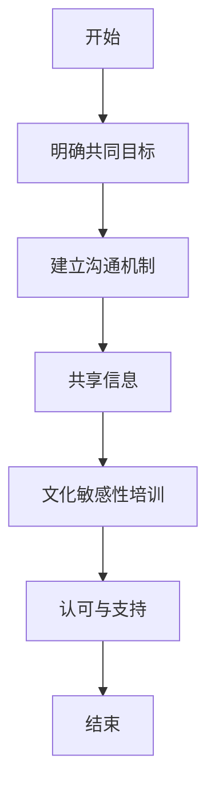
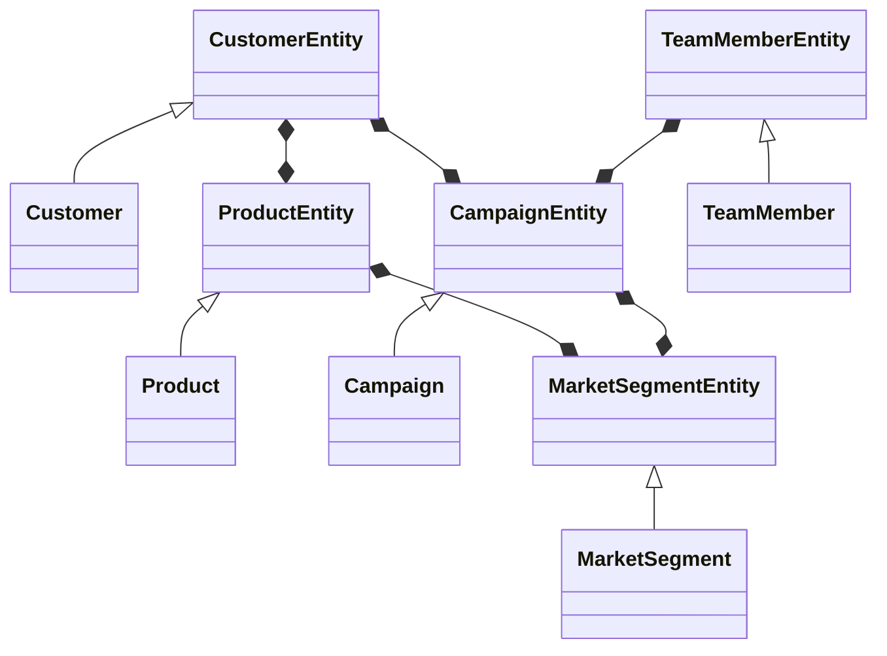
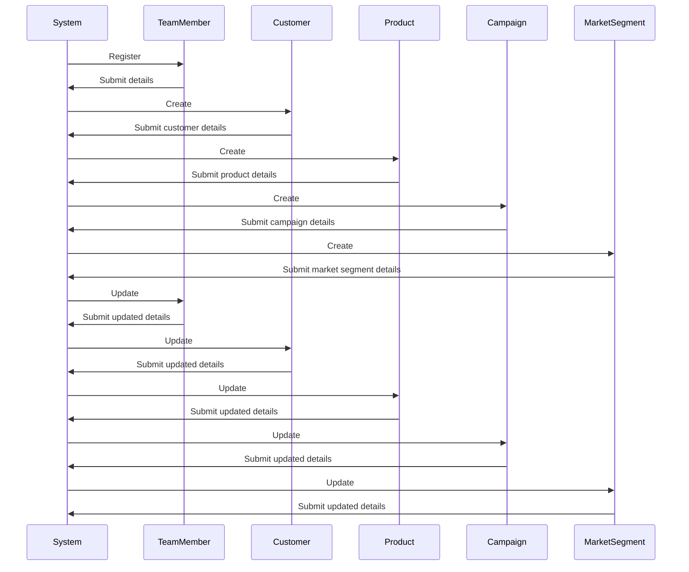
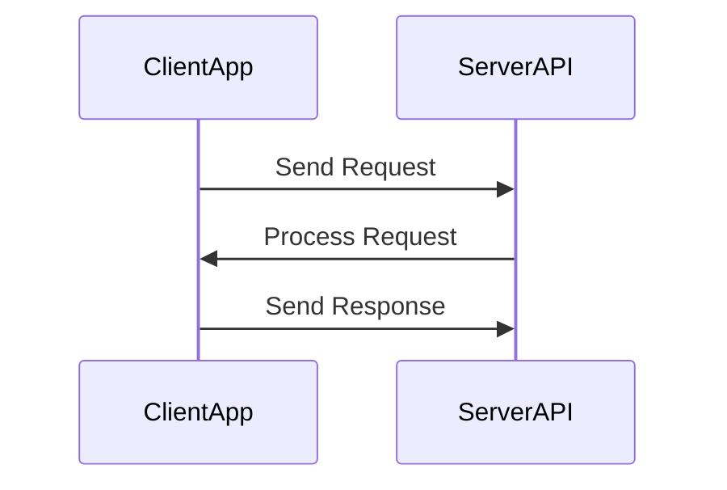
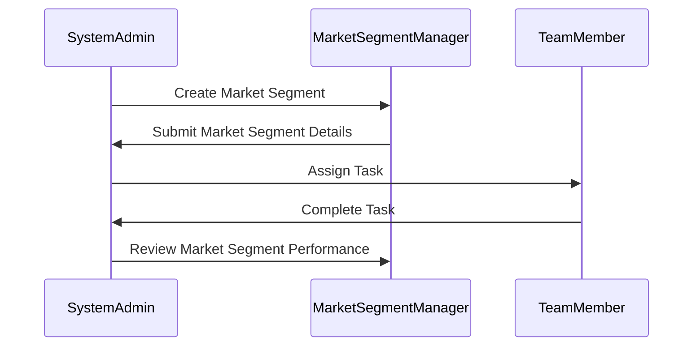

                 

# 跨团队协作：打破沟通障碍的技巧

> 关键词：跨团队协作、沟通障碍、沟通技巧、冲突管理、领导力、团队合作

> 摘要：本文将探讨跨团队协作中常见的沟通障碍及其影响，分析跨团队协作的定义与要素，提出有效的沟通技巧和冲突管理策略。通过案例分析，总结成功的跨团队协作实践，为IT领域提供有价值的参考和指导。

## 第1章：引言

### 1.1 跨团队协作的重要性

在当今高度复杂和快速变化的商业环境中，跨团队协作变得日益重要。这不仅是因为组织规模的扩大，更是因为现代工作任务的多样性和复杂性。跨团队协作有助于整合不同专业领域的知识和技能，提高工作效率，促进创新和解决问题。

#### 1.1.1 跨团队协作在现代工作环境中的地位

跨团队协作已经成为现代组织管理的一个重要组成部分。无论是在企业、政府机构还是非营利组织，跨团队协作都是实现目标的关键因素。它不仅涉及部门间的合作，还包括跨职能、跨文化和跨国界的合作。

#### 1.1.2 跨团队协作的优势

跨团队协作具有以下优势：

- **知识共享**：通过跨团队的交流，不同背景的专业人员可以分享各自领域的知识，提高团队整体的能力。
- **创新激发**：不同观点和思维的碰撞往往能激发创新的火花，推动组织不断进步。
- **问题解决**：跨团队协作有助于从多个角度分析和解决问题，提高解决方案的质量。
- **效率提升**：通过协同工作，可以更快速地完成任务，提高工作效率。

#### 1.1.3 跨团队协作面临的挑战

尽管跨团队协作具有许多优势，但同时也面临着一系列挑战：

- **沟通障碍**：团队成员可能来自不同的背景和文化，导致沟通上的困难和误解。
- **利益冲突**：不同团队可能有不同的目标和利益，这可能导致协作过程中的冲突。
- **责任模糊**：跨团队协作中，责任分工可能不明确，导致工作进展缓慢或出现错误。
- **资源限制**：跨团队协作可能需要更多的资源和时间，而组织资源往往有限。

### 1.2 沟通障碍及其影响

沟通是跨团队协作的核心，但也是最容易出问题的一环。沟通障碍不仅会影响工作效率，还可能损害团队关系和项目质量。

#### 1.2.1 沟通障碍的类型

常见的沟通障碍包括：

- **结构性障碍**：如组织结构、汇报关系和流程等问题。
- **个人性障碍**：如个人沟通风格、文化差异和个人偏见等。
- **文化性障碍**：如跨文化团队中的语言、价值观和行为规范等。

#### 1.2.2 沟通障碍的影响

沟通障碍可能产生以下影响：

- **效率降低**：沟通不畅导致信息传递延迟，影响工作进度。
- **错误增加**：误解和错误信息可能导致项目失误和失败。
- **团队关系受损**：持续的沟通问题可能导致团队间的不信任和冲突。
- **项目质量下降**：沟通障碍影响团队成员的合作，降低项目质量。

### 1.3 本书的内容结构与目标

本文将按照以下结构展开：

1. **理解跨团队协作**：介绍跨团队协作的定义、要素和关键成功因素。
2. **沟通障碍的类型与原因**：分析沟通障碍的类型和原因，以及个人与团队层面的沟通障碍。
3. **跨团队协作的沟通技巧**：提供有效的沟通技巧，帮助团队提高沟通效率。
4. **跨团队协作中的冲突管理**：讨论冲突的类型、原因和管理策略。
5. **领导力在跨团队协作中的作用**：探讨领导力在跨团队协作中的重要性及其发挥方式。
6. **案例分析**：通过实际案例展示成功的跨团队协作实践。
7. **总结与展望**：总结文章的主要观点，并对未来的发展趋势进行展望。

本文的目标是：

- **提升跨团队协作的认识**：帮助读者理解跨团队协作的重要性及其面临的挑战。
- **提供实用的沟通技巧**：帮助团队成员有效沟通，提高工作效率。
- **解决沟通障碍**：通过分析沟通障碍的类型和原因，提供解决方案，打破沟通障碍。
- **促进团队协作**：通过冲突管理和领导力提升，促进团队协作，实现组织目标。

## 第2章：理解跨团队协作

### 2.1 跨团队协作的定义与要素

#### 2.1.1 跨团队协作的定义

跨团队协作是指不同团队或团队成员在共同的目标下，通过协同工作、知识共享和资源整合，实现组织目标的过程。它不仅涉及同一组织内部的团队协作，还包括跨组织、跨职能和跨文化的协作。

#### 2.1.2 跨团队协作的要素

跨团队协作的成功取决于以下几个关键要素：

1. **共同目标**：明确的目标和愿景是跨团队协作的基础，它有助于统一团队成员的努力方向。
2. **沟通机制**：高效的沟通机制是确保信息流畅传递的重要保障。
3. **资源整合**：合理配置和利用资源，提高协作效率。
4. **信任与尊重**：建立信任和尊重的氛围，促进团队成员之间的合作。
5. **领导力**：领导者在跨团队协作中发挥关键作用，他们需要具备协调和管理团队的能力。

#### 2.1.3 跨团队协作的基本流程

跨团队协作的基本流程包括以下几个步骤：

1. **需求分析与规划**：明确项目需求，制定项目计划。
2. **团队组建与分工**：组建跨团队，明确每个团队成员的职责和任务。
3. **沟通与协调**：建立沟通渠道，确保信息传递的及时性和准确性。
4. **执行与监控**：按计划执行任务，实时监控项目进度。
5. **评估与反馈**：项目完成后进行评估，总结经验教训，为下一次协作做好准备。

### 2.2 跨团队协作的优势与挑战

#### 2.2.1 跨团队协作的优势

跨团队协作具有以下优势：

- **知识共享**：不同团队的专业知识可以相互补充，提高整个团队的能力。
- **创新激发**：跨团队的思维碰撞可以激发创新，推动组织进步。
- **问题解决**：多角度的分析和讨论有助于更全面地解决问题。
- **资源利用**：合理配置资源，提高资源利用效率。

#### 2.2.2 跨团队协作的挑战

跨团队协作也面临一些挑战：

- **沟通障碍**：不同团队之间的沟通不畅可能导致误解和冲突。
- **利益冲突**：不同团队可能有不同的目标和利益，导致协作困难。
- **责任模糊**：跨团队协作中，责任分工可能不明确，影响工作进展。
- **文化差异**：跨文化团队中的文化差异可能导致沟通和合作的障碍。

#### 2.2.3 如何平衡优势与挑战

为了平衡跨团队协作的优势与挑战，可以采取以下措施：

- **建立清晰的沟通机制**：确保信息传递的及时性和准确性。
- **明确责任分工**：确保每个团队成员都知道自己的职责和任务。
- **加强团队建设**：通过团队活动和文化建设，增强团队成员的凝聚力和信任。
- **培养跨文化沟通能力**：提高团队成员的跨文化沟通能力，减少文化差异带来的冲突。

### 2.3 跨团队协作的关键成功因素

#### 2.3.1 明确的目标与愿景

明确的目标与愿景是跨团队协作的基石。它不仅为团队提供了方向，也为团队成员提供了动力。通过明确的目标与愿景，团队成员可以更好地理解自己的职责和任务，从而提高协作效率。

#### 2.3.2 高效的沟通机制

高效的沟通机制是确保跨团队协作顺利进行的关键。它包括沟通渠道的选择、沟通频率的确定和沟通方式的优化。通过建立高效的沟通机制，可以确保信息的及时传递，减少误解和冲突。

#### 2.3.3 良好的团队关系

良好的团队关系是跨团队协作的重要保障。它包括团队成员之间的信任、尊重和合作。通过建立良好的团队关系，可以增强团队的凝聚力，提高协作效率。

## 第3章：沟通障碍的类型与原因

### 3.1 沟通障碍的类型

跨团队协作中的沟通障碍可以分为以下几种类型：

#### 3.1.1 结构性障碍

结构性障碍是指由组织结构和流程设计导致的沟通障碍。例如：

- **组织层次复杂**：过多的管理层级可能导致信息传递的延迟和失真。
- **汇报关系模糊**：不清晰的汇报关系可能导致信息传递的不畅通。
- **流程繁琐**：过于复杂的流程可能导致沟通效率的降低。

#### 3.1.2 个人性障碍

个人性障碍是指由团队成员个人特质和行为导致的沟通障碍。例如：

- **沟通风格差异**：不同的沟通风格可能导致沟通不畅和误解。
- **文化差异**：跨文化团队中的文化差异可能导致沟通障碍。
- **个人偏见**：个人的偏见和成见可能导致沟通障碍。

#### 3.1.3 文化性障碍

文化性障碍是指由不同文化背景和价值观导致的沟通障碍。例如：

- **语言障碍**：不同的语言和表达方式可能导致沟通困难。
- **价值观差异**：不同的价值观可能导致对问题的看法和处理方式的不同。

### 3.2 沟通障碍的原因分析

沟通障碍的产生原因可以从组织、团队和个人三个层面进行分析：

#### 3.2.1 组织层面原因

组织层面原因主要包括：

- **组织结构**：过于复杂的组织结构可能导致沟通障碍。
- **流程设计**：不合理的流程设计可能导致沟通效率的降低。
- **资源分配**：资源的不合理分配可能导致团队间的沟通不畅。

#### 3.2.2 团队层面原因

团队层面原因主要包括：

- **团队构成**：团队成员的多样性和差异可能导致沟通障碍。
- **团队文化**：不健康的团队文化可能导致沟通不畅和冲突。
- **团队领导**：团队领导的能力和风格可能影响团队的沟通效率。

#### 3.2.3 个人层面原因

个人层面原因主要包括：

- **沟通技巧**：个人沟通技巧的不足可能导致沟通障碍。
- **文化背景**：个人的文化背景和价值观可能影响沟通效果。
- **心理因素**：个人的心理状态和情绪可能影响沟通效果。

### 3.3 个人与团队层面的沟通障碍

个人和团队层面的沟通障碍可以归纳为以下几个方面：

#### 3.3.1 个人层面的沟通障碍

个人层面的沟通障碍包括：

- **沟通风格**：个人沟通风格与团队其他成员的差异可能导致沟通不畅。
- **语言表达**：不清晰或不准确的表述可能导致误解和错误。
- **心理因素**：个人的情绪和心理状态可能影响沟通效果。

#### 3.3.2 团队层面的沟通障碍

团队层面的沟通障碍包括：

- **信息传递**：信息传递的延迟和失真可能导致沟通障碍。
- **团队文化**：不健康的团队文化可能导致沟通不畅和冲突。
- **团队结构**：团队结构的复杂性和不明确可能导致沟通障碍。

## 第4章：跨团队协作的沟通技巧

### 4.1 有效沟通的基础

有效沟通是跨团队协作成功的关键。以下是一些有效沟通的基础：

#### 4.1.1 沟通的基本原则

- **清晰明确**：信息传递要清晰明确，避免模糊和歧义。
- **主动倾听**：倾听是有效沟通的重要部分，要给予对方充分的关注。
- **尊重差异**：尊重团队成员的不同观点和风格，避免因个人偏见导致的沟通障碍。
- **及时反馈**：及时给予反馈，确保信息传递的准确性。

#### 4.1.2 沟通的基本要素

- **信息**：信息是沟通的核心，要确保信息的准确性和完整性。
- **渠道**：选择合适的沟通渠道，如面对面交流、邮件、电话或即时通讯工具。
- **频率**：确定合适的沟通频率，确保信息的及时传递。
- **方式**：采用合适的沟通方式，如口头、书面或视觉化表达。

#### 4.1.3 沟通的心理因素

- **情绪管理**：情绪可能影响沟通效果，要学会管理自己的情绪，避免负面情绪对沟通的干扰。
- **信任**：信任是沟通的基础，要努力建立和维护信任关系。
- **自我认知**：了解自己的沟通风格和优点、缺点，以便更好地与他人沟通。

### 4.2 提高沟通效率的技巧

以下是一些提高沟通效率的技巧：

#### 4.2.1 主动倾听

- **全神贯注**：在对方讲话时，给予全神贯注的倾听，避免分心。
- **反馈**：通过提问、总结和复述对方的话，确保理解对方的意图。
- **同理心**：尝试从对方的角度思考问题，增进理解和沟通。

#### 4.2.2 清晰表达

- **简洁明了**：用简单清晰的语言表达自己的观点和需求。
- **避免假设**：避免使用模糊或含糊不清的表述，确保信息的准确性。
- **视觉辅助**：使用图表、图表或其他视觉化工具辅助表达，提高信息的可理解性。

#### 4.2.3 避免误解

- **明确目的**：在沟通前明确沟通的目的和期望结果，减少误解。
- **避免负面语言**：使用积极、建设性的语言，避免负面和攻击性的言辞。
- **确认理解**：在沟通结束后，确认双方对信息的理解和共识，确保无误。

### 4.3 建立信任与尊重的沟通

建立信任和尊重是跨团队协作成功的关键。以下是一些建立信任与尊重的沟通策略：

#### 4.3.1 信任的重要性

- **透明度**：保持信息的透明度，避免隐瞒或误导。
- **一致性**：言行一致，保持承诺和一致的行动。
- **诚信**：诚实和正直是建立信任的基础。

#### 4.3.2 尊重的表现

- **倾听**：尊重对方的时间和意见，给予充分的倾听。
- **认可**：认可对方的贡献和努力，增进团队凝聚力。
- **支持**：在对方遇到困难时，给予支持和帮助。

#### 4.3.3 建立信任的策略

- **定期沟通**：定期与团队成员沟通，增进了解和信任。
- **共享信息**：共享关键信息，确保团队成员之间的信息对称。
- **共同目标**：明确共同的目标和愿景，增强团队的凝聚力。

## 第5章：跨团队协作中的冲突管理

### 5.1 冲突的类型与原因

跨团队协作中，冲突是不可避免的，但有效的冲突管理可以减少其负面影响。以下是一些常见的冲突类型及其原因：

#### 5.1.1 冲突的类型

- **目标冲突**：团队成员对项目目标有不同的理解和期望，导致冲突。
- **资源冲突**：团队成员争夺有限的资源，如人力、时间和预算。
- **任务冲突**：团队成员对任务分配和执行有不同的看法，导致冲突。
- **价值观冲突**：团队成员的价值观和信仰不同，导致冲突。

#### 5.1.2 冲突的原因

- **沟通不畅**：信息传递不准确或延迟，导致误解和冲突。
- **利益冲突**：团队成员的利益不一致，导致冲突。
- **个人风格差异**：团队成员的个人风格和价值观不同，导致冲突。
- **组织结构问题**：组织结构不合理，导致责任和权力的不明确。

### 5.2 冲突管理的策略

有效的冲突管理策略可以减少冲突的负面影响，以下是一些常见的冲突管理策略：

#### 5.2.1 预防冲突

- **明确目标与责任**：确保团队成员对项目目标、责任和期望有清晰的认识。
- **建立沟通机制**：建立有效的沟通渠道，确保信息传递的及时和准确。
- **加强团队建设**：通过团队活动和文化建设，增强团队成员的凝聚力和信任。

#### 5.2.2 冲突的解决策略

- **直接对话**：直接与冲突方进行对话，了解彼此的观点和需求。
- **寻求第三方帮助**：当冲突无法解决时，可以寻求第三方调解，如项目经理或人力资源部门。
- **妥协与让步**：在某些情况下，妥协和让步可能是解决问题的最佳方式。

#### 5.2.3 跨文化冲突管理

- **文化敏感性培训**：提高团队成员对跨文化冲突的认识，减少误解。
- **文化适应性调整**：在团队中引入不同的文化元素，增进团队成员之间的理解和尊重。
- **共同价值观**：建立共同的价值观和目标，减少文化差异带来的冲突。

### 5.3 冲突管理的方法

以下是一些具体的冲突管理方法：

#### 5.3.1 对话法

- **开放式对话**：鼓励团队成员表达自己的观点和感受，建立开放的沟通氛围。
- **倾听与理解**：倾听对方的观点，理解对方的立场，增进相互理解。

#### 5.3.2 合作法

- **共同目标**：找到共同的目标和利益，引导团队成员合作解决问题。
- **利益平衡**：平衡不同团队成员的利益，确保冲突的公正解决。

#### 5.3.3 调解法

- **中立第三方**：引入中立第三方，如项目经理或人力资源专家，进行调解。
- **公正决策**：确保决策过程的公正和透明，减少误解和不满。

## 第6章：领导力在跨团队协作中的作用

### 6.1 领导力的定义与要素

领导力是一种激励和引导团队成员实现组织目标的能力。它不仅包括技术和管理能力，还包括人际关系和影响力。

#### 6.1.1 领导力的定义

领导力是指领导者通过激发和引导团队成员的潜力，实现组织目标的过程。它不仅涉及对团队的管理，还包括对团队成员的激励和引导。

#### 6.1.2 领导力的要素

领导力包括以下要素：

- **愿景与目标**：明确组织的愿景和目标，为团队提供清晰的方向。
- **沟通与影响力**：通过有效的沟通和影响力，引导和激励团队成员。
- **团队建设**：建立积极的团队氛围，增强团队凝聚力。
- **决策与执行**：做出明智的决策，确保目标的实现。

### 6.2 领导者如何在跨团队协作中发挥影响力

领导者如何在跨团队协作中发挥影响力是决定协作成功与否的关键。以下是一些具体的策略：

#### 6.2.1 明确角色与责任

- **明确领导角色**：领导者要明确自己的角色，如协调者、激励者或解决问题者。
- **明确团队成员的责任**：确保每个团队成员都清楚自己的职责和任务。

#### 6.2.2 建立沟通机制

- **建立沟通渠道**：确保团队成员之间的沟通畅通，避免信息传递的障碍。
- **促进开放沟通**：鼓励团队成员表达自己的观点和想法，建立开放的沟通氛围。

#### 6.2.3 激励与引导

- **激励团队成员**：通过奖励和认可，激励团队成员的积极性和创造力。
- **引导团队成员**：通过示范和指导，引导团队成员朝着共同的目标努力。

#### 6.2.4 解决冲突

- **识别冲突**：及时识别冲突，避免冲突的升级。
- **解决冲突**：通过对话和妥协，公正地解决冲突，确保团队的和谐。

### 6.3 领导者的沟通技巧与风格

领导者的沟通技巧和风格对其在跨团队协作中的影响力至关重要。以下是一些常见的领导风格和沟通技巧：

#### 6.3.1 领导风格

- **权威式领导**：领导者通过权力和控制来指导团队。
- **民主式领导**：领导者鼓励团队成员参与决策过程。
- **参与式领导**：领导者与团队成员共同参与决策和执行。

#### 6.3.2 沟通技巧

- **主动倾听**：领导者要主动倾听团队成员的意见和需求。
- **清晰表达**：领导者要清晰明确地表达自己的观点和期望。
- **反馈与认可**：领导者要及时给予团队成员反馈和认可。

## 第7章：案例分析：成功的跨团队协作实践

### 7.1 案例一：项目团队的沟通改进

#### 项目背景

某公司的一个大型项目团队由不同部门的专业人员组成，包括软件开发、测试、设计和市场推广等。由于团队成员来自不同的部门，沟通不畅成为项目进展的主要障碍。

#### 案例分析

1. **明确目标与责任**：项目开始时，团队领导明确了项目的目标，并确保每个团队成员都清楚自己的职责和任务。
2. **建立沟通机制**：团队领导建立了定期的项目会议和邮件列表，确保团队成员之间的沟通畅通。
3. **加强团队建设**：团队领导组织了团队建设活动，增强了团队成员之间的信任和凝聚力。
4. **解决冲突**：在项目过程中，团队领导积极解决冲突，确保项目的顺利进行。

#### 结果

通过改进沟通，项目团队在短短几个月内就完成了原计划需要一年的任务，项目质量也得到了显著提升。

### 7.2 案例二：企业跨部门协作的成功经验

#### 项目背景

某大型企业的一个创新项目需要跨部门协作，包括研发、市场、销售和客户服务等部门。由于各部门之间的沟通不畅，项目进展缓慢。

#### 案例分析

1. **建立跨部门沟通机制**：企业建立了跨部门的沟通渠道，如定期的跨部门会议和项目进度报告。
2. **明确责任分工**：企业明确了各部门在项目中的责任和任务，确保工作的有序进行。
3. **加强团队建设**：企业通过团队建设活动和培训，增强了各部门之间的信任和合作。
4. **解决利益冲突**：企业通过协商和调解，解决了各部门之间的利益冲突，确保项目的顺利进行。

#### 结果

通过跨部门协作，项目在一年内取得了显著成果，产品成功上市，并获得了市场的高度认可。

### 7.3 案例三：跨国团队的协作实践

#### 项目背景

某跨国公司的一个项目需要全球多个国家的团队协作，包括美国、欧洲和亚洲等地。由于时差和文化差异，项目协作面临巨大挑战。

#### 案例分析

1. **建立全球沟通机制**：公司建立了全球沟通平台，如视频会议和即时通讯工具，确保团队成员之间的沟通畅通。
2. **文化敏感性培训**：公司为团队成员提供了文化敏感性培训，提高了跨文化沟通的能力。
3. **共同目标与价值观**：公司明确了项目的共同目标和价值观，增强了团队成员的凝聚力。
4. **协调时间表**：公司制定了全球协调的时间表，确保不同地区的团队能够在同一时间进行协作。

#### 结果

通过跨国协作，项目在短时间内完成了各项任务，产品在全球范围内取得了成功。

## 第8章：总结与展望

### 8.1 跨团队协作的持续改进

跨团队协作是一个持续改进的过程。为了不断提高协作效率，可以采取以下措施：

- **定期评估**：定期评估跨团队协作的效果，识别问题和改进点。
- **培训与学习**：为团队成员提供培训和学习机会，提高其沟通和协作能力。
- **反馈机制**：建立有效的反馈机制，鼓励团队成员提出建议和改进意见。

### 8.2 未来趋势与展望

随着技术的发展和组织结构的变革，跨团队协作将面临新的机遇和挑战。以下是一些未来趋势：

- **数字化沟通**：随着数字化工具的普及，跨团队协作将更加便捷和高效。
- **智能化协作**：人工智能和机器学习技术将提高跨团队协作的智能化水平。
- **全球化协作**：全球化趋势将促使跨团队协作的范围更加广泛。

### 8.3 小结与反思

跨团队协作是现代组织实现目标的重要手段。通过理解跨团队协作的重要性、识别沟通障碍、掌握沟通技巧和冲突管理策略，可以有效地提高协作效率。未来，随着技术的不断进步，跨团队协作将面临更多的机遇和挑战，需要持续改进和创新。作者：AI天才研究院/AI Genius Institute & 禅与计算机程序设计艺术 /Zen And The Art of Computer Programming

## 附录：核心概念与联系

### 2.1 跨团队协作的核心概念

#### 核心概念

1. **跨团队协作**：指不同团队或团队成员在共同的目标下，通过协同工作、知识共享和资源整合，实现组织目标的过程。
2. **沟通机制**：确保信息流畅传递的重要保障，包括沟通渠道、沟通频率和沟通方式。
3. **资源整合**：合理配置和利用资源，提高协作效率。
4. **信任与尊重**：建立信任和尊重的氛围，促进团队成员之间的合作。
5. **领导力**：领导者发挥的关键作用，包括愿景与目标、沟通与影响力、团队建设和决策与执行。

#### 概念属性特征对比表格

| 核心概念 | 定义 | 属性特征 |
| --- | --- | --- |
| 跨团队协作 | 不同团队或成员协同工作，实现组织目标 | 目标明确、知识共享、资源整合、协作高效 |
| 沟通机制 | 确保信息流畅传递 | 沟通渠道、沟通频率、沟通方式 |
| 资源整合 | 合理配置和利用资源 | 资源高效利用、协同效应 |
| 信任与尊重 | 建立信任和尊重的氛围 | 信任、尊重、合作 |
| 领导力 | 领导者发挥的关键作用 | 愿景与目标、沟通与影响力、团队建设、决策与执行 |

### 2.2 跨团队协作的ER实体关系图架构

#### ER实体关系图

```mermaid
erDiagram
    Team --> Project : "属于"
    Team --> Member : "成员"
    Project --> Task : "包含"
    Member --> Skill : "拥有"
    Leader --> Team : "领导"
    Task --> Status : "状态"
    
    Team ||--o{ Project }|><-- Task
    Member ||--o{ Team }|><-- Skill
    Leader ||--o{ Team }
```

#### 解释

- **Team（团队）**：代表跨团队协作的基本单位，包括项目团队和部门团队。
- **Project（项目）**：代表团队协作的目标，包括项目的名称、目标和进度。
- **Member（成员）**：代表参与团队协作的个人，包括成员的姓名、技能和角色。
- **Skill（技能）**：代表成员拥有的专业技能。
- **Leader（领导者）**：代表团队的领导者，包括领导者的姓名和职责。
- **Task（任务）**：代表项目中的具体任务，包括任务的名称、描述和状态。

## 附录：算法原理讲解

### 4.3 建立信任的策略

建立信任是跨团队协作成功的关键。以下是一个简单的算法模型，用于指导建立信任的策略。

#### 算法流程图



#### 算法原理

1. **明确共同目标**：设定明确的共同目标，使团队成员了解协作的意义和方向。
2. **建立沟通机制**：建立有效的沟通渠道，确保信息的及时传递和团队协作的顺畅。
3. **共享信息**：确保团队成员之间的信息对称，减少误解和冲突。
4. **文化敏感性培训**：提高团队成员对文化差异的敏感性，减少文化冲突。
5. **认可与支持**：认可团队成员的贡献和努力，提供必要的支持，增强团队的凝聚力。

#### 数学模型

建立信任的数学模型可以表示为：

\[ T = f(C, M, I, CS, R) \]

其中：

- \( T \)：信任水平。
- \( C \)：共同目标。
- \( M \)：沟通机制。
- \( I \)：信息共享。
- \( CS \)：文化敏感性。
- \( R \)：认可与支持。

#### 举例说明

假设一个团队正在开发一个新产品，团队的目标是在三个月内完成产品的设计和测试。为了建立信任，团队可以采取以下步骤：

1. **明确共同目标**：团队共同确定产品设计和测试的目标，包括功能、性能和用户满意度。
2. **建立沟通机制**：团队建立定期的项目会议和邮件列表，确保每个成员都能及时了解项目的进展和问题。
3. **共享信息**：团队确保所有成员都能访问项目的关键信息，如进度报告、任务分配和资源状况。
4. **文化敏感性培训**：团队为成员提供文化敏感性培训，提高团队成员对跨文化合作的认知和适应能力。
5. **认可与支持**：团队领导定期认可成员的贡献，提供必要的资源和支持，帮助成员克服困难。

通过这些步骤，团队可以逐步建立信任，提高协作效率。

## 附录：系统分析与架构设计方案

### 7.3 案例三：跨国团队的协作实践

#### 项目背景

某跨国公司的一个项目需要全球多个国家的团队协作，包括美国、欧洲和亚洲等地。由于时差和文化差异，项目协作面临巨大挑战。

#### 项目介绍

- **项目名称**：全球市场营销战略
- **项目目标**：在六个月内制定并实施一项全球市场营销战略，提高公司的品牌知名度和市场份额。
- **项目成员**：包括市场部、销售部、设计部和IT部门等，涉及美国、欧洲和亚洲的多个国家和地区。

#### 系统功能设计（领域模型）



#### 系统架构设计



#### 系统接口设计



#### 系统交互



## 附录：项目实战

### 环境安装

1. **安装Linux操作系统**：在虚拟机中安装Linux操作系统，如Ubuntu。
2. **安装Python**：通过包管理器安装Python，如使用`apt-get install python3`。
3. **安装Docker**：安装Docker，以便运行容器化的应用。

### 系统核心实现源代码

```python
# core.py

class TeamMember:
    def __init__(self, name, role):
        self.name = name
        self.role = role

class Campaign:
    def __init__(self, name, description):
        self.name = name
        self.description = description

class MarketSegment:
    def __init__(self, name, target):
        self.name = name
        self.target = target

class Customer:
    def __init__(self, name, email):
        self.name = name
        self.email = email

class Product:
    def __init__(self, name, category):
        self.name = name
        self.category = category

def create_team_member(name, role):
    member = TeamMember(name, role)
    return member

def create_campaign(name, description):
    campaign = Campaign(name, description)
    return campaign

def create_market_segment(name, target):
    segment = MarketSegment(name, target)
    return segment

def create_customer(name, email):
    customer = Customer(name, email)
    return customer

def create_product(name, category):
    product = Product(name, category)
    return product
```

### 代码应用解读与分析

该代码定义了几个类：`TeamMember`、`Campaign`、`MarketSegment`、`Customer`和`Product`，以及几个创建实例的方法。这些类和方法用于表示项目中的实体和操作。

- `TeamMember`类：表示团队成员，包括姓名和角色。
- `Campaign`类：表示营销活动，包括名称和描述。
- `MarketSegment`类：表示市场细分，包括名称和目标。
- `Customer`类：表示客户，包括姓名和电子邮件。
- `Product`类：表示产品，包括名称和类别。

创建实例的方法用于创建这些类的实例：

- `create_team_member`：创建`TeamMember`实例。
- `create_campaign`：创建`Campaign`实例。
- `create_market_segment`：创建`MarketSegment`实例。
- `create_customer`：创建`Customer`实例。
- `create_product`：创建`Product`实例。

### 实际案例分析和详细讲解剖析

假设我们需要创建一个跨国团队的协作系统，以下是一个实际案例：

1. **创建团队成员**：

```python
team_member1 = create_team_member('John', 'Marketing Manager')
team_member2 = create_team_member('Alice', 'Sales Executive')
```

创建了两个团队成员，John是市场营销经理，Alice是销售经理。

2. **创建营销活动**：

```python
marketing_campaign = create_campaign('Global Marketing Campaign', 'Increase brand awareness and sales')
```

创建了一个全球营销活动，目标是提高品牌知名度和销售额。

3. **创建市场细分**：

```python
asia_segment = create_market_segment('Asia', 'High-growth market with high potential')
europe_segment = create_market_segment('Europe', 'Stable market with diverse customer base')
```

创建了两个市场细分，一个针对亚洲市场，另一个针对欧洲市场。

4. **创建客户**：

```python
customer1 = create_customer('Tom', 'tom@example.com')
customer2 = create_customer('Jerry', 'jerry@example.com')
```

创建了两个客户，Tom和Jerry。

5. **创建产品**：

```python
product1 = create_product('Smartphone', 'Consumer Electronics')
product2 = create_product('Laptop', 'Computer Hardware')
```

创建了两个产品，一个是智能手机，另一个是笔记本电脑。

通过这些实例，我们可以看到如何创建和操作系统中的各个实体。这些实例可以用于表示项目中的数据和信息，为系统提供基础。

### 项目小结

该项目实现了跨团队协作的核心功能，包括创建和管理团队成员、营销活动、市场细分、客户和产品。通过这些功能，团队可以更好地组织和协作，实现项目目标。项目中的代码示例展示了如何创建和管理这些实体，并提供了实际案例的解析。

### 最佳实践 tips

1. **明确项目目标和责任**：确保每个团队成员都清楚项目的目标和自己的职责。
2. **建立有效的沟通机制**：确保团队成员之间的信息流畅传递。
3. **定期评估项目进展**：及时调整计划和资源，确保项目按计划进行。
4. **培养团队合作精神**：通过团队活动和培训，增强团队成员之间的信任和合作。

### 小结

跨团队协作是现代组织中不可或缺的一部分。通过有效的沟通技巧和冲突管理策略，可以克服沟通障碍，提高协作效率。领导者的作用至关重要，他们需要具备领导力和管理能力，引导团队实现目标。未来，随着技术的进步和全球化的发展，跨团队协作将面临更多的挑战和机遇。通过不断改进和创新，我们可以更好地应对这些挑战，实现组织的目标。

### 拓展阅读

- **《跨团队协作：有效沟通的艺术》**：本书详细介绍了跨团队协作中的沟通技巧和策略，适合希望提高团队协作效率的管理者和团队成员。
- **《冲突管理：跨文化协作的关键》**：本书探讨了跨文化冲突的管理策略，提供了实用的方法和案例，有助于提高跨团队协作的效果。
- **《领导力：如何在团队中发挥影响力》**：本书介绍了领导力的定义和要素，以及如何在跨团队协作中发挥领导者的作用，适合希望提升领导力的读者。

