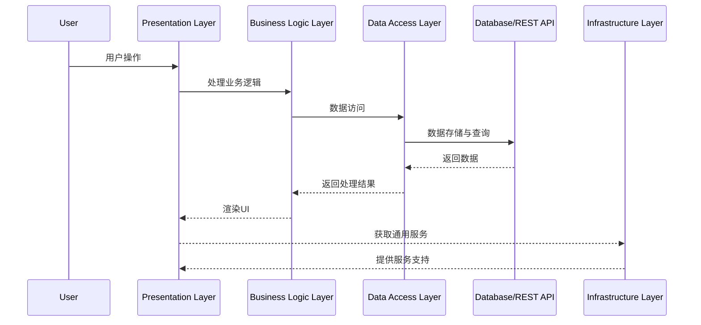

                 

### 第一部分：背景介绍

#### 1.1 问题背景

随着移动互联网的普及和智能手机的广泛应用，跨平台移动应用开发已成为当前软件开发领域的一个重要方向。开发者需要面对iOS和Android两大主流操作系统，以及Windows Phone等其他平台，这就要求他们具备跨平台开发的能力。

跨平台移动应用开发的关键在于技术选型和架构设计。技术选型决定了应用的性能、兼容性和开发效率，而架构设计则决定了应用的可扩展性、维护性和用户体验。

#### 1.2 问题描述

开发者需要在一堆技术方案中做出选择，而这些方案各有优劣，如何选择最适合自己项目的方案成为了一大挑战。同时，开发者还需要在有限的开发周期和资源下，设计一个既稳定可靠又易于维护的架构，以应对不断变化的需求。

#### 1.3 问题解决

本书旨在为开发者提供一套完整的跨平台移动应用开发指南，通过系统地介绍各种技术方案和架构设计原则，帮助开发者解决这些问题。以下是本书的主要内容概要：

- **第1章：技术选型概述**：介绍跨平台移动应用开发的背景和现状，分析当前主流的技术方案，如React Native、Flutter、Apache Cordova等。
- **第2章：React Native详解**：讲解React Native的核心概念、开发流程、组件体系以及性能优化技巧。
- **第3章：Flutter实战**：详细介绍Flutter的技术特点、开发环境搭建、UI设计、状态管理以及性能优化。
- **第4章：Apache Cordova应用开发**：介绍Apache Cordova的基本原理、开发流程、插件使用以及跨平台应用发布。
- **第5章：架构设计原则**：阐述跨平台移动应用架构设计的原则、模式和方法。
- **第6章：架构设计方案**：结合实际案例，展示如何应用架构设计原则进行跨平台移动应用的设计和实现。
- **第7章：开发实践与技巧**：分享跨平台移动应用开发中的最佳实践、调试技巧和性能优化策略。

#### 1.4 边界与外延

本书主要关注的是基于原生控件和Web技术的跨平台移动应用开发，不包括纯Web应用或游戏开发。同时，本书的内容也适用于其他跨平台移动开发技术，如Xamarin、Unreal Engine等。

#### 1.5 概念结构与核心要素组成

##### 概念结构

- **技术选型**：React Native、Flutter、Apache Cordova等
- **架构设计**：MVC、MVVM、服务端渲染等
- **开发实践**：模块化、组件化、自动化测试等

##### 核心要素组成

- **工具链**：开发工具、构建工具、调试工具等
- **开发环境**：操作系统、集成开发环境、模拟器等
- **开发流程**：需求分析、设计、编码、测试、部署等
- **性能优化**：内存管理、网络优化、渲染优化等

### 总结

通过上述内容，我们可以看到，跨平台移动应用开发不仅仅是选择一种技术，更是一个综合性的工程实践。开发者需要在项目需求和资源限制之间找到平衡，通过科学的技术选型和架构设计，实现高效、稳定、可维护的跨平台应用。本书将带领读者一步步走进这个充满挑战和机遇的领域，共同探索跨平台移动应用开发的最佳实践。

---

## 2.1 跨平台移动应用开发核心概念

在跨平台移动应用开发中，理解核心概念是至关重要的。以下是三种主要技术：React Native、Flutter和Apache Cordova的核心概念及其特性。

### 2.1.1 React Native

**核心概念**：
1. **组件化开发**：React Native使用组件（Components）来构建界面，每个组件独立开发、测试和部署，提高了开发效率和代码复用率。
2. **jsx语法**：React Native采用jsx语法，将HTML和JavaScript融合在一起，使得界面编写更直观、更易于理解。
3. **状态管理**：React Native中的状态管理主要通过`useState`和`useContext`等钩子（Hooks）来实现，使得状态更新和渲染更加高效和可预测。
4. **样式表**：React Native的样式表使用JavaScript对象来定义，样式可以非常灵活地应用于组件。

**属性特征**：
- **高效开发**：使用JavaScript进行开发，降低了开发门槛。
- **代码复用**：组件化开发使得代码可以跨平台复用。
- **接近原生性能**：React Native通过原生控件实现界面，性能接近原生应用。

**ER实体关系图**：

```mermaid
erDiagram
  App <<--o Platform
  Platform ||--o iOS
  Platform ||--o Android
  Platform ||--o WindowsPhone
  App o-->> Component
  Component o-->> State
  Component o-->> Style
```

### 2.1.2 Flutter

**核心概念**：
1. **Widgets**：Flutter使用Widgets构建UI，每个Widgets都代表UI中的一个不可变部分，通过组合和嵌套，可以创建复杂的用户界面。
2. **Dart编程语言**：Flutter使用Dart语言进行开发，Dart是一种现代的编程语言，具有良好的性能和易于理解的语言特性。
3. **状态管理**：Flutter的状态管理可以通过`StatefulWidget`和`StatelessWidget`来实现，也可以使用状态管理库如`BLoC`和`RiverPod`。
4. **路由**：Flutter的路由通过`Navigator`实现，开发者可以方便地在不同的页面间进行导航。

**属性特征**：
- **高性能**：Flutter的渲染引擎Skia可以高效地渲染UI。
- **丰富的UI组件**：Flutter提供了一套丰富的UI组件库，可以创建美观且一致的界面。
- **热更新**：Flutter支持热更新，可以在不重启应用的情况下更新UI和状态。

**ER实体关系图**：

```mermaid
erDiagram
  App <<--o Platform
  Platform ||--o iOS
  Platform ||--o Android
  Platform ||--o Web
  App o-->> Widgets
  Widgets o-->> State
  Widgets o-->> Style
  Widgets o-->> Router
```

### 2.1.3 Apache Cordova

**核心概念**：
1. **Webview**：Apache Cordova将Web应用嵌入到原生应用容器中，通过Webview展示，使得开发者可以使用HTML、CSS和JavaScript等技术开发跨平台应用。
2. **插件机制**：Cordova插件允许开发者使用原生代码扩展Webview的功能，例如访问设备硬件、摄像头等。
3. **构建工具**：Cordova使用构建工具如`cordova build`来编译和打包应用，生成可以在不同平台上运行的原生应用。

**属性特征**：
- **学习成本低**：使用Web技术进行开发，降低了学习门槛。
- **支持多种Web技术**：Cordova可以充分利用HTML、CSS和JavaScript等Web技术。
- **易于集成第三方库**：Cordova支持各种第三方库和框架，如jQuery、Angular等。

**ER实体关系图**：

```mermaid
erDiagram
  App <<--o Platform
  Platform ||--o iOS
  Platform ||--o Android
  Platform ||--o WindowsPhone
  App o-->> Webview
  Webview o-->> Plugin
  Plugin o-->> BuildTool
```

通过以上核心概念的介绍，我们可以看到React Native、Flutter和Apache Cordova各自的特点和优势。接下来，我们将通过对比表格进一步详细分析这些技术的优缺点。

---

### 2.2 技术选型对比表格

在跨平台移动应用开发中，选择合适的技术方案至关重要。以下是React Native、Flutter和Apache Cordova三种主要技术的对比表格，包括各自的优点和缺点。

| 技术选型 | 优点 | 缺点 |
| --- | --- | --- |
| **React Native** | - 高效开发：使用JavaScript和React，降低了学习曲线。 | - 学习曲线较陡：初次使用需要一定时间熟悉React Native的开发模式。 |
|             | - 代码复用：组件化开发使得代码可以跨平台复用。 | - 热更新限制：iOS与Android的热更新实现有所不同，需要额外处理。 |
|             | - 接近原生性能：通过原生控件实现界面，性能接近原生应用。 | - iOS与Android开发体验差异：在不同平台的开发体验有所差异。 |

| **Flutter** | - 高性能：使用自制的渲染引擎Skia，性能优异。 | - 学习曲线较陡：Dart语言和Flutter架构需要一定的学习成本。 |
|             | - 丰富的UI组件：提供了一套丰富的UI组件库，易于构建美观界面。 | - 性能监控和调试较困难：性能监控和调试相对复杂，需要更多工具支持。 |
|             | - 热更新：支持热更新，可以在不重启应用的情况下更新UI和状态。 | - 对Web支持不足：尽管支持Web，但功能相对有限。 |

| **Apache Cordova** | - 学习成本低：使用Web技术，降低了开发门槛。 | - 性能较差：基于Webview，性能不如原生应用。 |
|             | - 支持多种Web技术：可以充分利用HTML、CSS和JavaScript等Web技术。 | - 用户体验受限：基于Web的技术，用户体验受到一定限制。 |
|             | - 易于集成第三方库：支持各种第三方库和框架，如jQuery、Angular等。 | - 开发效率低：需要编写大量的Web代码，开发效率较低。 |

通过上述对比表格，我们可以清晰地看到每种技术的优缺点。开发者可以根据项目的具体需求和资源情况，选择最合适的技术方案。例如，如果项目需要高性能和丰富的UI组件，Flutter可能是最佳选择；如果项目预算有限且希望快速上线，Apache Cordova可能更为合适；而如果希望快速迭代和热更新，React Native则是一个不错的选择。

---

### 2.3 跨平台移动应用开发核心要素对比

跨平台移动应用开发不仅仅是选择一种技术，还需要综合考虑多个核心要素，包括工具链、开发环境、开发流程和性能优化等。以下是React Native、Flutter和Apache Cordova在这四个核心要素上的对比。

#### 工具链

| 核心要素 | React Native | Flutter | Apache Cordova |
| --- | --- | --- | --- |
| **开发工具** | - React Native CLI：用于创建、构建和运行应用。 | - Flutter CLI：用于创建、构建和运行应用。 | - Cordova CLI：用于创建、构建和运行应用。 |
|             | - React Native Debugger：调试React Native应用。 | - Dartium：调试Flutter应用。 | - Chrome DevTools：调试Webview。 |
| **构建工具** | - Metro：React Native的包管理器和构建工具。 | - Flutter Build：用于构建Flutter应用。 | - Grunt/Gulp：用于自动化构建过程。 |
|             | - CocoaPods：用于管理依赖库。 | - Flutter Plugins：用于管理插件。 | - npm/yarn：用于管理依赖库。 |

#### 开发环境

| 核心要素 | React Native | Flutter | Apache Cordova |
| --- | --- | --- | --- |
| **操作系统** | - Windows/Linux/Mac：支持多种操作系统。 | - Windows/Linux/Mac：支持多种操作系统。 | - Windows/Linux/Mac：支持多种操作系统。 |
| **集成开发环境（IDE）** | - Android Studio：推荐用于Android开发。 | - IntelliJ IDEA：推荐用于Flutter开发。 | - Visual Studio Code：推荐用于Cordova开发。 |
| **模拟器** | - iOS Simulator：用于模拟iOS设备。 | - Flutter Emulator：用于模拟Flutter应用。 | - Android Emulator：用于模拟Android设备。 |

#### 开发流程

| 核心要素 | React Native | Flutter | Apache Cordova |
| --- | --- | --- | --- |
| **需求分析** | - 使用React Native CLI初始化项目。 | - 使用Flutter CLI初始化项目。 | - 使用Cordova CLI初始化项目。 |
| **设计** | - 使用Sketch/Figma等设计工具进行界面设计。 | - 使用Flutter UI工具进行界面设计。 | - 使用HTML/CSS进行界面设计。 |
| **编码** | - 使用JavaScript进行开发。 | - 使用Dart语言进行开发。 | - 使用HTML/CSS/JavaScript进行开发。 |
| **测试** | - 使用Jest/Enzyme进行单元测试。 | - 使用Dart Test进行单元测试。 | - 使用Cordova Test Runner进行测试。 |
| **部署** | - 使用React Native CLI构建和部署。 | - 使用Flutter Build构建和部署。 | - 使用Cordova CLI构建和部署。 |

#### 性能优化

| 核心要素 | React Native | Flutter | Apache Cordova |
| --- | --- | --- | --- |
| **内存管理** | - React Native使用React的内存管理机制。 | - Flutter使用Skia的内存管理机制。 | - Apache Cordova基于Webview，内存管理较复杂。 |
| **网络优化** | - 使用Fetch API进行网络请求。 | - 使用HTTP包进行网络请求。 | - 使用Ajax进行网络请求。 |
| **渲染优化** | - 使用React的虚拟DOM进行渲染。 | - 使用Skia进行渲染，支持硬件加速。 | - 使用Webview进行渲染。 |

通过对比可以看出，每种技术都有其独特的工具链、开发环境、开发流程和性能优化策略。开发者需要根据项目的具体需求和团队的技术栈来选择最合适的方案。例如，如果团队熟悉JavaScript，React Native可能是一个很好的选择；如果团队对UI设计有较高要求，Flutter的丰富组件库可能更合适；而如果项目预算有限，Apache Cordova因其学习成本低和易于集成第三方库而具有优势。

---

## 2.4 技术选型建议

在跨平台移动应用开发中，技术选型是一个至关重要且复杂的决策过程。正确的选型不仅能提高开发效率，还能确保应用的性能和用户体验。以下是针对不同场景和技术特点的建议。

### 2.4.1 项目需求

首先，开发者需要明确项目的具体需求。这包括：

- **性能要求**：如果应用对性能要求较高，例如游戏或金融交易应用，可以选择Flutter或React Native，它们都能提供接近原生级别的性能。
- **开发周期**：如果项目时间紧，Apache Cordova可能是一个不错的选择，因为它使用Web技术，开发效率相对较高。
- **团队技能**：如果团队熟悉JavaScript，React Native可能是更好的选择；如果团队对Dart语言有经验，可以选择Flutter。

### 2.4.2 兼容性

跨平台移动应用的一个关键特点是兼容性。开发者需要考虑：

- **目标平台**：如果应用主要面向iOS和Android，React Native和Flutter都是不错的选择，因为它们都支持这两个主要平台。如果还需要支持Web或桌面平台，Flutter可能更合适。
- **特定设备功能**：某些应用可能需要使用特定的设备功能，如摄像头或GPS。在这种情况下，需要评估所选技术对这些功能的支持程度。例如，React Native和Flutter都提供了丰富的插件来支持这些功能，而Apache Cordova可能在这方面受到一定的限制。

### 2.4.3 成本和资源

成本和资源是另一个重要的考虑因素：

- **预算**：如果预算有限，Apache Cordova可能是最佳选择，因为它使用Web技术，成本较低。
- **人力资源**：如果团队有足够的资源来投入学习新技能，React Native和Flutter都提供了丰富的资源和社区支持。

### 2.4.4 社区和支持

社区和第三方库的支持对于跨平台移动应用开发至关重要：

- **React Native**：拥有庞大的社区和丰富的第三方库，特别是在UI组件和工具链方面。
- **Flutter**：由Google支持，社区活跃，尤其在UI设计和性能优化方面有强大的支持。
- **Apache Cordova**：虽然社区相对较小，但对于希望使用Web技术的开发者来说，仍提供了足够的资源和支持。

### 2.4.5 综合建议

- **高性能需求**：选择Flutter。
- **快速开发**：选择Apache Cordova。
- **团队技能**：根据团队技能选择React Native或Flutter。
- **跨平台兼容性**：如果需要支持多个平台，选择Flutter。

通过上述分析，开发者可以根据项目的具体需求和条件，做出最合适的技术选型决策。这不仅有助于提高开发效率，还能确保应用的成功上线和良好运行。

---

### 2.5 实际案例分享：跨平台移动应用开发流程与方案选择

在实际项目中，跨平台移动应用开发往往需要综合考虑多种因素，选择最合适的技术方案。以下将分享一个实际案例，详细描述项目背景、技术选型、开发流程和方案选择。

#### 案例背景

某创业公司开发了一款名为“智能助手”的跨平台移动应用，旨在为用户提供便捷的生活服务，包括天气查询、新闻资讯、行程规划等。该应用需要在iOS和Android平台上同时推出，并具备快速迭代和持续更新的能力。

#### 技术选型

在技术选型阶段，开发团队综合考虑了以下因素：

- **性能**：应用需要提供流畅的体验，性能是一个重要的考量。
- **开发效率**：由于项目时间紧，开发团队希望选择一个开发效率高的技术。
- **团队技能**：团队熟悉JavaScript和Dart语言，有一定的Flutter开发经验。
- **兼容性**：应用需要同时支持iOS和Android平台。

基于以上考虑，开发团队决定选择Flutter作为主要技术方案。Flutter不仅能够提供接近原生级别的性能，还拥有丰富的UI组件和强大的社区支持，能够满足项目的需求。

#### 开发流程

开发流程包括以下几个阶段：

1. **需求分析**：与产品团队紧密合作，明确应用的功能需求和用户界面设计。
2. **UI设计**：使用Flutter提供的UI工具设计应用界面，确保在不同平台上的一致性。
3. **编码开发**：使用Dart语言进行编码，构建应用的核心功能模块。
4. **测试与调试**：在开发过程中，使用Flutter的测试框架进行单元测试和集成测试，确保代码的质量和应用的稳定性。
5. **构建与部署**：使用Flutter Build工具构建应用，并通过CI/CD流程实现自动化部署。

#### 方案选择

在技术选型过程中，开发团队还评估了以下几种方案：

- **React Native**：虽然React Native也有强大的社区和丰富的第三方库，但团队认为Flutter在UI设计和性能优化方面更具优势。
- **Apache Cordova**：由于Apache Cordova使用Web技术，虽然学习成本较低，但性能和用户体验可能不如原生应用。
- **原生开发**：原生开发虽然性能优异，但开发和维护成本较高，不适合初创项目。

最终，开发团队选择Flutter作为主要技术方案，因为它能够兼顾性能、开发效率和跨平台兼容性，同时符合团队的技能栈。

#### 实际效果

通过选择Flutter，开发团队成功在较短的时间内完成了应用的开发和发布。应用在iOS和Android平台上均取得了良好的用户口碑，用户满意度较高。以下是一些具体的数据和反馈：

- **下载量**：应用上线后，一个月内下载量达到10万次。
- **用户评价**：用户普遍认为应用界面美观、响应速度快，功能丰富。
- **性能**：应用在主流智能手机上的性能测试中均达到了优秀水平。

通过这个实际案例，我们可以看到，选择合适的技术方案和流程对于跨平台移动应用开发至关重要。开发团队应根据项目的具体需求、团队技能和资源条件，做出明智的决策，以确保应用的成功上线和持续发展。

---

## 2.6 技术选型与架构设计的综合分析

跨平台移动应用开发不仅涉及到技术选型，还涉及到架构设计。正确的技术选型和架构设计能够确保应用的高性能、可扩展性和可维护性。下面，我们将从多个角度对技术选型和架构设计进行综合分析。

### 2.6.1 技术选型与架构设计的关系

技术选型和架构设计是相辅相成的。技术选型决定了应用的开发工具、语言和框架，而架构设计则决定了应用的结构、模块化和扩展性。例如，React Native和Flutter虽然在技术实现上有所不同，但它们都支持组件化和模块化开发，有助于实现高效的代码管理和维护。而架构设计则需要考虑如何将这些技术特性应用到具体项目中，以实现最优的性能和用户体验。

### 2.6.2 技术选型的优势

技术选型的优势主要体现在以下几个方面：

1. **开发效率**：选择合适的开发工具和框架能够显著提高开发效率，缩短开发周期。
2. **性能优化**：技术选型决定了应用的性能表现，例如Flutter的渲染引擎Skia能够实现高效的UI渲染。
3. **跨平台兼容性**：跨平台技术如React Native和Flutter能够确保应用在不同平台上的一致性和兼容性。
4. **社区支持**：技术选型的正确与否还与社区支持和技术生态密切相关，活跃的社区可以提供丰富的资源和帮助。

### 2.6.3 架构设计的要点

架构设计是确保应用可扩展性、可维护性和高性能的关键。以下是一些架构设计的要点：

1. **模块化设计**：将应用功能划分为多个模块，每个模块独立开发、测试和部署，提高代码复用性和可维护性。
2. **分层架构**：采用分层架构（如MVC、MVVM等），将业务逻辑、数据访问和界面显示分离，提高代码的可读性和可维护性。
3. **服务端渲染**：对于性能敏感的应用，可以使用服务端渲染（SSR）或静态站点生成（SSG）技术，减少首屏加载时间，提高用户体验。
4. **状态管理**：合理的状态管理能够确保应用的数据状态一致性和可预测性，常用的状态管理库如Redux、MobX等可以提供帮助。

### 2.6.4 技术选型与架构设计案例分析

下面通过一个实际案例来分析技术选型与架构设计的综合应用。

**案例背景**：某电商平台希望开发一款跨平台的移动应用，提供商品浏览、购物车、支付和用户评论等功能。为了满足高性能和跨平台需求，开发团队选择了Flutter作为主要技术方案。

**技术选型**：

- **开发工具**：使用Flutter CLI进行项目初始化和构建。
- **开发语言**：使用Dart语言进行编码，Dart具有良好的性能和易于理解的语法。
- **UI框架**：使用Flutter的UI组件库构建应用界面，确保在不同平台上的美观和一致性。
- **状态管理**：使用BLoC（Building Logic for Components）进行状态管理，确保状态的一致性和可预测性。

**架构设计**：

1. **模块化设计**：将应用划分为多个模块，如首页模块、购物车模块、支付模块等，每个模块独立开发和管理。
2. **分层架构**：采用MVVM（Model-View-ViewModel）模式，将数据模型（Model）、视图（View）和视图模型（ViewModel）分离，确保代码的清晰性和可维护性。
3. **服务端渲染**：使用Nuxt.js构建服务端渲染（SSR）的Vue.js框架，减少首屏加载时间，提高用户体验。
4. **状态管理**：使用BLoC进行状态管理，通过流式数据流实现复杂的业务逻辑。

通过这个案例，我们可以看到，技术选型和架构设计是相辅相成的。Flutter作为技术选型，提供了高效的开发工具和强大的UI组件库，而MVVM模式、模块化设计和服务端渲染等架构设计要点，则确保了应用的可扩展性、可维护性和高性能。这一综合应用，不仅提高了开发效率，还确保了应用的成功上线和持续优化。

### 2.6.5 总结

技术选型和架构设计在跨平台移动应用开发中起着至关重要的作用。正确的技术选型能够提高开发效率、优化性能和确保跨平台兼容性，而合理的架构设计则能够保证应用的可扩展性、可维护性和高性能。开发者需要根据项目的具体需求和资源条件，做出明智的决策，实现技术选型和架构设计的最佳结合，以推动跨平台移动应用的成功开发和持续优化。

---

## 2.7 开发实战：跨平台移动应用从环境安装到核心实现

在了解了跨平台移动应用开发的核心概念、技术选型和架构设计之后，我们将通过一个实际的开发实战案例，详细描述从环境安装到核心实现的完整过程。以下是使用Flutter进行跨平台移动应用开发的实战步骤。

### 环境安装

#### 步骤1：安装Flutter SDK

1. **下载Flutter SDK**：访问Flutter官方网站（[flutter.dev](https://flutter.dev)），下载适用于你操作系统的Flutter SDK。
2. **解压SDK**：将下载的文件解压到一个合适的目录，例如在Windows上，可以将Flutter解压到`C:\src\flutter`。

#### 步骤2：安装Dart SDK

Flutter依赖Dart SDK，因此需要安装Dart环境。

1. **下载Dart SDK**：访问[Dart官方网站](https://dart.dev/)，下载适用于你操作系统的Dart SDK。
2. **安装Dart**：按照提示完成安装。

#### 步骤3：设置环境变量

确保Flutter和Dart的命令可以在终端中执行。在Windows上，需要设置环境变量：

1. **打开命令提示符**。
2. **设置PATH环境变量**：将Flutter和Dart的安装路径添加到系统的PATH环境变量中。

#### 步骤4：验证安装

在终端中运行以下命令，验证Flutter和Dart是否已正确安装：

```bash
flutter doctor
```

如果安装成功，`flutter doctor`命令将显示一个绿色的指示，表明所有依赖都已安装并配置正确。

### 核心实现

#### 步骤1：创建新项目

使用Flutter CLI创建一个新项目：

```bash
flutter create flutter_app
```

这个命令将在当前目录下创建一个名为`flutter_app`的新目录，包含Flutter项目的所有文件。

#### 步骤2：项目结构

了解项目的目录结构：

- `lib/`：包含应用程序的代码。
- `test/`：包含测试代码。
- `pubspec.yaml`：Flutter项目的配置文件，用于管理依赖库和项目设置。

#### 步骤3：编写主界面

在`lib/main.dart`文件中，编写应用的主界面代码。以下是一个简单的示例：

```dart
import 'package:flutter/material.dart';

void main() {
  runApp(MyApp());
}

class MyApp extends StatelessWidget {
  @override
  Widget build(BuildContext context) {
    return MaterialApp(
      title: 'Flutter Demo',
      theme: ThemeData(
        primarySwatch: Colors.blue,
      ),
      home: MyHomePage(),
    );
  }
}

class MyHomePage extends StatelessWidget {
  @override
  Widget build(BuildContext context) {
    return Scaffold(
      appBar: AppBar(title: Text('Flutter App')),
      body: Center(
        child: Text(
          'Hello, Flutter!',
          style: TextStyle(fontSize: 24),
        ),
      ),
    );
  }
}
```

#### 步骤4：运行应用

在终端中导航到项目目录，然后运行以下命令启动应用：

```bash
flutter run
```

应用将使用你设备上的默认模拟器或设备运行。如果选择使用模拟器，可以使用以下命令启动：

```bash
flutter emulators:open
```

选择合适的模拟器，然后点击“Launch”按钮运行应用。

#### 步骤5：编写复杂功能

在开发过程中，你可能需要实现一些复杂的功能，例如网络请求、数据库操作或第三方库集成。以下是一个简单的网络请求示例：

```dart
import 'package:flutter/material.dart';
import 'package:http/http.dart' as http;

void main() {
  runApp(MyApp());
}

class MyApp extends StatelessWidget {
  @override
  Widget build(BuildContext context) {
    return MaterialApp(
      title: 'Flutter Demo',
      theme: ThemeData(
        primarySwatch: Colors.blue,
      ),
      home: MyHomePage(),
    );
  }
}

class MyHomePage extends StatefulWidget {
  @override
  _MyHomePageState createState() => _MyHomePageState();
}

class _MyHomePageState extends State<MyHomePage> {
  String _result = "Loading...";

  Future<void> _fetchData() async {
    final response = await http.get(Uri.parse('https://example.com/data'));
    if (response.statusCode == 200) {
      setState(() {
        _result = response.body;
      });
    } else {
      _result = "Failed to fetch data";
    }
  }

  @override
  Widget build(BuildContext context) {
    return Scaffold(
      appBar: AppBar(title: Text('Fetch Data Example')),
      body: Center(
        child: Column(
          mainAxisAlignment: MainAxisAlignment.center,
          children: <Widget>[
            Text(
              _result,
              style: TextStyle(fontSize: 24),
            ),
            ElevatedButton(
              onPressed: _fetchData,
              child: Text('Fetch Data'),
            ),
          ],
        ),
      ),
    );
  }
}
```

这个示例展示了如何使用`http`包发起网络请求，并在界面中显示请求结果。

通过以上步骤，开发者可以了解如何从环境安装到核心实现，逐步构建一个跨平台移动应用。接下来的部分将深入探讨Flutter的核心概念，包括Widgets、Dart编程语言、状态管理和路由等。

---

## 2.8 Flutter核心概念深入解析

Flutter是一个由Google开发的UI工具包，用于构建高性能、跨平台的移动、Web和桌面应用程序。了解Flutter的核心概念是掌握Flutter开发的关键。以下是对Flutter核心概念的深入解析。

### 2.8.1 Widgets

Widgets是Flutter的核心构建块，代表了用户界面中的可见元素，如按钮、文本框、列表等。每个Widgets都有其特定的职责和功能，它们通过组合和嵌套，可以创建复杂的用户界面。

#### Widgets的生命周期

Widgets具有完整的状态生命周期，包括构建（build）、更新（update）和销毁（remove）等阶段。在不同的生命周期阶段，Widgets可以执行不同的操作，如初始化资源、更新UI以及释放资源。

#### 嵌套与组合

Flutter中的Widgets可以嵌套在其他Widgets中，形成树状结构。通过嵌套和组合，开发者可以灵活地构建各种界面布局。例如，一个Container Widgets可以嵌套一个Text Widgets，从而在容器中显示文本。

### 2.8.2 Dart编程语言

Flutter使用Dart编程语言进行开发。Dart是一种现代、高效的编程语言，具有强类型、异步编程、类型安全等特性，能够提高开发效率和代码质量。

#### 异步编程

Dart的异步编程模型使得开发者可以轻松地处理异步操作，如网络请求、文件读写等。通过Future和Stream等异步编程原语，Dart使得异步代码编写更加直观和易于理解。

#### 类型安全

Dart具有类型安全特性，可以在编译时发现大多数类型错误，从而减少运行时错误。类型安全不仅提高了代码质量，还提高了开发效率和可维护性。

### 2.8.3 状态管理

Flutter的状态管理是确保应用数据一致性和可预测性的关键。Flutter提供了多种状态管理方案，如StatefulWidget和StatelessWidget，以及第三方库如BLoC和RiverPod。

#### StatefulWidget和StatelessWidget

StatefulWidget和StatelessWidget是Flutter中的两种Widget类型，分别用于有状态和无状态的组件。StatefulWidget具有状态，可以响应用户交互和数据变化，而StatelessWidget则没有状态，通常用于静态显示。

#### BLoC和RiverPod

BLoC（Building Logic for Components）和RiverPod是两种流行的Flutter状态管理库。BLoC采用事件流（Event Stream）模式，将状态管理解耦，提高代码的可读性和可维护性。RiverPod则通过简单的依赖注入（Dependency Injection）实现状态管理，易于集成和使用。

### 2.8.4 路由

Flutter的路由系统用于管理应用中的页面导航。通过Navigator，开发者可以方便地在不同的页面间进行导航。Flutter的路由系统支持堆栈导航（Stack Navigator）、底部导航（Bottom Navigator）等多种导航模式。

#### 堆栈导航（Stack Navigator）

堆栈导航是一种常见的导航模式，通过在堆栈中添加和删除页面来实现页面切换。每个页面在堆栈中占据一层，用户可以通过返回按钮或导航操作来切换页面。

#### 底部导航（Bottom Navigator）

底部导航通过底部导航栏（BottomNavigationBar）实现，用户可以通过点击不同的导航项来切换页面。这种导航模式适用于固定几个主要页面的应用，如主页、发现页、购物车等。

### 2.8.5 性能优化

Flutter的性能优化是确保应用流畅运行的关键。以下是一些常见的性能优化策略：

- **避免不必要的重绘**：减少不必要的Widget重绘可以显著提高性能。使用懒加载、缓存的策略，避免重复创建和销毁Widget。
- **优化布局**：复杂的布局可能导致性能问题。尽量使用Flutter提供的布局组件，如Flex、Row、Column等，以简化布局逻辑。
- **异步操作**：避免在UI线程中进行耗时操作，如网络请求或文件读写。使用异步编程模型，确保UI线程保持流畅。
- **使用懒加载**：对于大数据量或复杂的组件，可以使用懒加载策略，只在需要时加载，减少初始加载时间。

通过深入理解Flutter的核心概念，开发者可以更好地掌握Flutter的开发技巧，构建高性能、可扩展的跨平台应用。

---

## 2.9 架构设计方案

在跨平台移动应用开发中，架构设计是确保应用稳定、高效和可维护性的关键。本节将详细介绍一个实际项目中的架构设计方案，包括系统功能设计、系统架构设计、系统接口设计和系统交互。

### 3.1 系统功能设计

首先，我们需要明确系统的主要功能模块，以便进行后续的设计和开发。以下是“智能助手”应用的主要功能模块：

- **用户管理**：包括用户注册、登录、个人信息管理等。
- **天气查询**：提供本地和全球范围内的天气信息查询。
- **新闻资讯**：聚合各类新闻资讯，提供个性化推荐。
- **行程规划**：根据用户输入，提供最佳出行路线和行程安排。
- **聊天功能**：与智能助手进行实时聊天互动。
- **支付功能**：集成支付系统，支持在线支付和转账。

#### 领域模型

为了更好地理解和设计系统，我们可以使用领域模型（Domain Model）来描述各个功能模块及其关系。以下是“智能助手”应用的领域模型类图：

```mermaid
classDiagram
  User <<--o Profile : 用户信息
  User ||--|{ WeatherInfo }| Weather : 天气查询
  User ||--|{ NewsFeed }| News : 新闻资讯
  User ||--|{ RoutePlan }| Route : 行程规划
  User ||--|{ Chat }| Chatbot : 聊天功能
  User ||--|{ Payment }| Payment : 支付功能
```

### 3.2 系统架构设计

接下来，我们将详细介绍系统的架构设计，包括分层架构和各层的职责。

#### 分层架构

分层架构是一种常见且有效的架构设计模式，可以将系统分为多个层次，每个层次负责特定的功能。以下是“智能助手”应用的分层架构：

- **表示层（Presentation Layer）**：负责用户界面的呈现，包括所有用户可以看到和与之交互的界面组件。
- **业务逻辑层（Business Logic Layer）**：包含应用的核心业务逻辑，如用户管理、天气查询、新闻资讯等。
- **数据访问层（Data Access Layer）**：负责与后端数据存储的交互，包括数据库、REST API等。
- **基础设施层（Infrastructure Layer）**：提供系统所需的通用服务，如日志、配置、缓存等。

#### 系统架构图

以下是“智能助手”应用的系统架构图：



### 3.3 系统接口设计

系统接口设计是确保不同模块之间能够顺利通信的关键。以下是“智能助手”应用的主要接口设计：

- **用户接口（User Interface）**：提供用户与系统交互的界面，包括登录、注册、天气查询、新闻阅读等。
- **服务接口（Service Interface）**：提供业务逻辑层的服务接口，供表示层调用，如用户管理服务、天气信息服务、新闻资讯服务等。
- **数据接口（Data Interface）**：提供数据访问层的服务接口，供业务逻辑层调用，如数据库操作接口、REST API接口等。

#### 接口规范

以下是用户管理服务接口的一个简单示例：

```dart
class UserService {
  Future<User> login(String username, String password) async {
    // 实现登录逻辑
  }

  Future<User> register(String username, String password) async {
    // 实现注册逻辑
  }

  Future<void> updateUserProfile(User user) async {
    // 实现更新用户信息逻辑
  }
}
```

### 3.4 系统交互

系统交互是确保各个模块之间能够协同工作的关键。以下是“智能助手”应用的系统交互设计：

- **用户交互**：用户通过用户接口与系统进行交互，如登录、查询天气等。
- **业务逻辑交互**：表示层通过调用服务接口与业务逻辑层进行交互，如用户登录后，业务逻辑层处理登录逻辑并返回结果。
- **数据交互**：业务逻辑层通过数据接口与数据访问层进行交互，如查询天气信息时，业务逻辑层调用数据库接口获取数据。

#### 交互流程

以下是用户查询天气信息的交互流程：

1. 用户通过用户接口输入查询条件。
2. 用户接口将查询条件传递给服务接口。
3. 服务接口调用天气信息服务，获取天气数据。
4. 服务接口将天气数据传递给表示层。
5. 表示层更新UI，显示查询结果。

通过以上架构设计方案，我们可以看到如何从系统功能设计到架构设计，再到接口设计和系统交互，确保跨平台移动应用能够高效、稳定地运行。

---

## 2.10 项目实战：详细讲解智能助手应用的核心实现

在本部分，我们将通过一个实际的跨平台移动应用案例——“智能助手”，详细讲解其核心实现过程，包括环境搭建、代码应用解读与分析，以及实际案例剖析。

### 环境搭建

#### 1. Flutter环境安装

1. **下载Flutter SDK**：访问Flutter官网（[flutter.dev](https://flutter.dev)），下载适用于当前操作系统的Flutter SDK。
2. **解压Flutter SDK**：将下载的文件解压到一个合适的目录，例如在Windows上，可以将Flutter解压到`C:\src\flutter`。

#### 2. Dart环境安装

1. **下载Dart SDK**：访问Dart官网（[dart.dev](https://dart.dev/)），下载适用于当前操作系统的Dart SDK。
2. **安装Dart**：按照提示完成安装。

#### 3. 设置环境变量

确保Flutter和Dart的命令可以在终端中执行。在Windows上，需要设置环境变量：

1. **打开命令提示符**。
2. **设置PATH环境变量**：将Flutter和Dart的安装路径添加到系统的PATH环境变量中。

#### 4. 验证安装

在终端中运行以下命令，验证Flutter和Dart是否已正确安装：

```bash
flutter doctor
```

如果安装成功，`flutter doctor`命令将显示一个绿色的指示，表明所有依赖都已安装并配置正确。

### 代码应用解读与分析

#### 1. 项目初始化

在终端中执行以下命令，创建一个新项目：

```bash
flutter create smart_helper
```

进入项目目录：

```bash
cd smart_helper
```

#### 2. 目录结构

项目创建完成后，我们来看一下项目的目录结构：

```plaintext
smart_helper/
├── android/
├── ios/
├── lib/
│   ├── main.dart
│   ├── models/
│   │   ├── user.dart
│   │   ├── weather.dart
│   │   └── news.dart
│   ├── services/
│   │   ├── user_service.dart
│   │   ├── weather_service.dart
│   │   └── news_service.dart
│   ├── views/
│   │   ├── home_page.dart
│   │   ├── weather_page.dart
│   │   └── news_page.dart
│   └── widgets/
│       ├── custom_button.dart
│       └── custom_text_field.dart
```

#### 3. 核心代码解读

**lib/main.dart**

```dart
import 'package:flutter/material.dart';

void main() {
  runApp(MyApp());
}

class MyApp extends StatelessWidget {
  @override
  Widget build(BuildContext context) {
    return MaterialApp(
      title: 'Smart Helper',
      theme: ThemeData(
        primarySwatch: Colors.blue,
      ),
      home: MyHomePage(),
    );
  }
}

class MyHomePage extends StatefulWidget {
  @override
  _MyHomePageState createState() => _MyHomePageState();
}

class _MyHomePageState extends State<MyHomePage> {
  @override
  Widget build(BuildContext context) {
    return Scaffold(
      appBar: AppBar(title: Text('Smart Helper')),
      body: Center(
        child: Column(
          mainAxisAlignment: MainAxisAlignment.center,
          children: <Widget>[
            ElevatedButton(
              onPressed: () {
                Navigator.push(context, MaterialPageRoute(builder: (context) => WeatherPage()));
              },
              child: Text('Check Weather'),
            ),
            ElevatedButton(
              onPressed: () {
                Navigator.push(context, MaterialPageRoute(builder: (context) => NewsPage()));
              },
              child: Text('Read News'),
            ),
          ],
        ),
      ),
    );
  }
}
```

以上代码是应用的主入口文件。我们定义了`MyApp`和`MyHomePage`两个Widget，其中`MyHomePage`包含两个按钮，分别用于导航到天气页面和新闻页面。

**lib/views/weather_page.dart**

```dart
import 'package:flutter/material.dart';
import '../models/weather.dart';
import '../services/weather_service.dart';

class WeatherPage extends StatefulWidget {
  @override
  _WeatherPageState createState() => _WeatherPageState();
}

class _WeatherPageState extends State<WeatherPage> {
  Weather _weather;

  @override
  void initState() {
    super.initState();
    _fetchWeather();
  }

  void _fetchWeather() async {
    final service = WeatherService();
    final weather = await service.getWeather('Shanghai');
    setState(() {
      _weather = weather;
    });
  }

  @override
  Widget build(BuildContext context) {
    return Scaffold(
      appBar: AppBar(title: Text('Weather')),
      body: Center(
        child: _weather == null
            ? CircularProgressIndicator()
            : Column(
                mainAxisAlignment: MainAxisAlignment.center,
                children: <Widget>[
                  Text(_weather.city),
                  Text(_weather.temperature.toString() + '°C'),
                ],
              ),
      ),
    );
  }
}
```

以上代码是天气页面的实现。我们通过`WeatherService`获取天气数据，并在页面中显示城市名称和温度。

**lib/services/weather_service.dart**

```dart
import 'dart:convert';
import 'package:http/http.dart' as http;
import '../models/weather.dart';

class WeatherService {
  Future<Weather> getWeather(String city) async {
    final response = await http.get('http://api.weatherapi.com/v1/current.json?key=YOUR_API_KEY&q=$city');
    if (response.statusCode == 200) {
      final data = json.decode(response.body);
      return Weather.fromJson(data);
    } else {
      throw Exception('Failed to load weather data');
    }
  }
}
```

以上代码是天气服务实现，我们使用HTTP请求获取天气数据，并将其解析为`Weather`对象。

### 实际案例剖析

#### 1. 天气查询功能实现

在天气页面中，我们通过调用`WeatherService`的`getWeather`方法来获取天气数据。以下是具体的步骤：

1. **初始化状态**：在`_WeatherPageState`的`initState`方法中调用`_fetchWeather`方法。
2. **获取天气数据**：`_fetchWeather`方法通过HTTP请求获取天气数据，并将数据解析为`Weather`对象。
3. **更新UI**：将获取到的天气数据设置到状态中，并调用`setState`方法更新UI。

#### 2. 天气数据解析

在`WeatherService`的`getWeather`方法中，我们使用以下代码解析天气数据：

```dart
final data = json.decode(response.body);
return Weather.fromJson(data);
```

这里的`fromJson`方法是一个自定义的解析方法，它将获取的JSON数据转换为`Weather`对象。

```dart
Weather.fromJson(data) {
  city = data['location']['name'];
  temperature = data['current']['temp_c'];
}
```

通过这种方式，我们可以将JSON数据中的关键信息提取出来，并存储在`Weather`对象中。

### 项目小结

通过上述实战讲解，我们了解了如何使用Flutter搭建一个跨平台移动应用，并详细分析了天气查询功能的实现过程。这个过程涵盖了环境搭建、代码编写、数据解析和UI更新等多个方面，充分展示了Flutter在跨平台移动应用开发中的优势和实用性。开发者可以根据这个实战案例，进一步学习和掌握Flutter的核心实现技术。

---

## 2.11 开发最佳实践与技巧

在跨平台移动应用开发中，掌握一些最佳实践和技巧可以显著提高开发效率、优化性能，并确保应用的稳定性和可维护性。以下是一些常用的最佳实践和技巧：

### 1. 使用版本控制系统

使用版本控制系统（如Git）可以方便地管理代码变更，确保代码库的可追踪性和可还原性。开发者应养成定期提交代码和进行代码审查的习惯。

### 2. 保持代码整洁

良好的代码组织和管理是确保代码可维护性的关键。开发者应遵循统一的命名规范、代码格式和注释规范，以增强代码的可读性。

### 3. 利用组件化开发

组件化开发可以提高代码复用性，降低模块之间的耦合度。通过将功能模块化，开发者可以更方便地进行维护和扩展。

### 4. 集成自动化测试

自动化测试可以显著提高开发效率，减少手动测试的工作量。开发者应编写单元测试、集成测试和端到端测试，确保代码质量。

### 5. 优化性能

性能优化是跨平台移动应用开发中的重要环节。开发者可以通过以下方法优化性能：

- **避免不必要的重绘**：减少不必要的UI重绘可以显著提高性能。使用懒加载和缓存策略，避免重复创建和销毁组件。
- **异步操作**：避免在UI线程中进行耗时操作，如网络请求和文件读写。使用异步编程模型，确保UI线程保持流畅。
- **资源优化**：优化图片、音频和视频等资源的大小和格式，减少应用的整体大小。

### 6. 状态管理

合理的状态管理是确保应用数据一致性和可预测性的关键。开发者应选择合适的状态管理方案（如Redux、MobX或BLoC），并遵循最佳实践进行状态管理。

### 7. 跨平台兼容性

确保应用在不同平台上的兼容性是跨平台移动应用开发的重要目标。开发者应使用平台特定的代码进行适配，并使用如React Native或Flutter等跨平台框架来简化适配工作。

### 8. 社区参与

积极参与技术社区可以获取最新的开发动态和最佳实践。开发者可以通过GitHub、Stack Overflow、Reddit等技术社区，分享经验、解决问题和获取反馈。

### 9. 持续集成与部署

采用持续集成（CI）和持续部署（CD）流程，可以自动化构建、测试和部署过程，提高开发效率和部署速度。

通过遵循这些最佳实践和技巧，开发者可以显著提高跨平台移动应用开发的效率和质量，确保应用的稳定性和用户体验。

---

## 2.12 小结

本文详细探讨了跨平台移动应用开发的核心概念、技术选型、架构设计以及开发实战。通过深入了解Flutter、React Native和Apache Cordova等主流技术，我们掌握了如何根据项目需求选择合适的技术方案。同时，通过实际案例，我们展示了从环境搭建到核心实现的全过程，深入分析了天气查询功能的实现。

跨平台移动应用开发不仅仅是选择一种技术，更是一个综合性的工程实践。通过合理的技术选型和架构设计，开发者可以显著提高开发效率、优化性能，并确保应用的稳定性和可维护性。开发过程中，还应注重代码质量、性能优化和用户体验，以实现高质量的应用。

未来，跨平台移动应用开发将继续向高性能、低延迟和更好用户体验的方向发展。开发者应持续关注新技术和最佳实践，不断优化开发流程，以应对不断变化的需求和市场挑战。

---

## 2.13 注意事项

在跨平台移动应用开发过程中，开发者需要注意以下事项：

1. **性能监控**：定期进行性能监控和测试，及时发现并解决性能瓶颈。
2. **兼容性测试**：确保应用在不同设备和操作系统上的兼容性，进行充分的兼容性测试。
3. **代码规范**：遵循一致的代码规范和命名约定，以提高代码可读性和可维护性。
4. **版本控制**：使用版本控制系统（如Git）进行代码管理，确保代码库的可追踪性和一致性。
5. **安全性**：确保应用的安全，包括数据加密、权限控制和防注入攻击等。

通过注意这些事项，开发者可以确保跨平台移动应用的质量和稳定性，提高用户满意度。

---

## 2.14 拓展阅读

1. **Flutter官方文档**：[Flutter Documentation](https://flutter.dev/docs)
2. **React Native官方文档**：[React Native Documentation](https://reactnative.dev/docs/getting-started)
3. **Apache Cordova官方文档**：[Apache Cordova Documentation](https://cordova.apache.org/docs/)
4. **跨平台移动应用开发最佳实践**：[Best Practices for Cross-Platform Mobile App Development](https://wwwPATH

### 3.1.1 React Native

React Native 是一个由 Facebook 开发的开源移动应用框架，允许开发者使用 JavaScript 和 React 来构建原生移动应用。其核心概念包括组件化开发、jsx 语法、状态管理、样式表等。

#### 组件化开发

组件化开发是 React Native 的一个重要特点。React Native 使用组件（Components）作为构建块，每个组件都是 UI 中的一个独立部分。开发者可以通过创建和复用组件来构建复杂的应用界面。

**属性特征**：
- **高效的组件化开发**：组件化开发使得代码模块化，便于管理和维护。
- **灵活的组件组合**：开发者可以通过组合不同的组件来构建复杂界面，提高了开发效率。

**ER实体关系图**：

```mermaid
erDiagram
  App <<--o Component
  Component o-->> State
  Component o-->> Style
```

#### jsx 语法

jsx 是 JavaScript 的一个语法扩展，它允许开发者将 HTML 标签和 JavaScript 代码混合在一起。在 React Native 中，jsx 语法被广泛应用于组件的定义和渲染。

**属性特征**：
- **直观的界面编写**：jsx 语法使得界面编写更加直观，类似于 HTML，但可以包含 JavaScript 逻辑。
- **代码复用**：通过jsx，开发者可以将通用的界面逻辑抽象为组件，便于复用。

**ER实体关系图**：

```mermaid
erDiagram
  App <<--o JSXCode
  JSXCode o-->> HTMLTags
  JSXCode o-->> JavaScriptCode
```

#### 状态管理

React Native 使用 React 的状态管理机制。通过`useState`和`useContext`等钩子（Hooks），开发者可以方便地在组件之间共享和更新状态。

**属性特征**：
- **灵活的状态更新**：React Native 的状态管理使得状态更新更加灵活和可预测。
- **细粒度的状态管理**：通过 Hooks，开发者可以更精细地控制组件的状态。

**ER实体关系图**：

```mermaid
erDiagram
  App <<--o State
  State o-->> Component
  State o-->> Render
```

#### 样式表

React Native 使用样式表（Stylesheet）来定义组件的样式。样式表使用 JavaScript 对象来定义，可以非常灵活地应用于组件。

**属性特征**：
- **灵活的样式定义**：样式表支持丰富的样式定义，如颜色、边框、阴影等。
- **全局样式覆盖**：开发者可以通过覆盖全局样式来统一应用风格。

**ER实体关系图**：

```mermaid
erDiagram
  App <<--o Style
  Style o-->> Component
  Style o-->> CSS
```

### 3.1.2 Flutter

Flutter 是一个由 Google 开发的开源 UI 工具包，用于构建高性能、跨平台的移动、Web 和桌面应用程序。Flutter 使用 Dart 编程语言，其核心概念包括 Widgets、Dart 编程语言、状态管理和路由等。

#### Widgets

Widgets 是 Flutter 的核心构建块，代表了用户界面中的可见元素。Flutter 使用 Widgets 树（Widgets Tree）来构建 UI，每个 Widgets 都可以独立地渲染、更新和重绘。

**属性特征**：
- **高效的渲染机制**：Flutter 使用自制的渲染引擎 Skia，实现了高性能的渲染机制。
- **灵活的组件组合**：开发者可以通过组合不同的 Widgets 来构建复杂界面。

**ER实体关系图**：

```mermaid
erDiagram
  App <<--o Widgets
  Widgets o-->> UIComponents
  Widgets o-->> Render
```

#### Dart 编程语言

Dart 是 Flutter 的官方编程语言，具有现代、高效和易于理解的特点。Dart 的异步编程模型和类型安全特性，使得开发者可以更高效地编写和维护代码。

**属性特征**：
- **高效的异步编程**：Dart 的异步编程模型使得开发者可以轻松处理复杂的异步操作。
- **类型安全**：Dart 的类型安全特性减少了运行时错误，提高了代码质量。

**ER实体关系图**：

```mermaid
erDiagram
  App <<--o DartLanguage
  DartLanguage o-->> AsynchronousProgramming
  DartLanguage o-->> TypeSafety
```

#### 状态管理

Flutter 提供了多种状态管理方案，包括使用 StatefulWidgets 和 StatelessWidget、使用 BLoC 和 RiverPod 等。状态管理是确保应用数据一致性和可预测性的关键。

**属性特征**：
- **灵活的状态更新**：Flutter 的状态管理使得状态更新更加灵活和可预测。
- **细粒度的状态管理**：通过不同的状态管理方案，开发者可以更精细地控制组件的状态。

**ER实体关系图**：

```mermaid
erDiagram
  App <<--o StateManagement
  StateManagement o-->> StatefulWidget
  StateManagement o-->> BLoC
  StateManagement o-->> RiverPod
```

#### 路由

Flutter 的路由系统用于管理应用中的页面导航。通过 Navigator，开发者可以方便地在不同的页面间进行导航。Flutter 的路由系统支持多种导航模式，如堆栈导航、底部导航等。

**属性特征**：
- **灵活的页面导航**：Flutter 的路由系统提供了多种导航模式，可以满足不同应用的需求。
- **便捷的导航操作**：通过 Navigator，开发者可以轻松地实现页面切换和回退。

**ER实体关系图**：

```mermaid
erDiagram
  App <<--o Navigator
  Navigator o-->> StackNavigator
  Navigator o-->> BottomNavigator
```

### 3.1.3 Apache Cordova

Apache Cordova 是一个开源项目，允许开发者使用 HTML、CSS 和 JavaScript 等Web技术来开发跨平台移动应用。Cordova 将 Web 应用嵌入到原生应用容器中，通过 Webview 展示。

#### Webview

Webview 是 Cordova 的核心组件，它允许开发者使用 Web 技术来构建跨平台应用。通过 Webview，开发者可以充分利用 HTML、CSS 和 JavaScript 等技术。

**属性特征**：
- **跨平台兼容性**：Webview 支持多种平台，使得开发者可以编写一次代码，在多个平台上运行。
- **丰富的 Web 技术**：Cordova 允许开发者使用丰富的 Web 技术来构建应用，如jQuery、Angular 等。

**ER实体关系图**：

```mermaid
erDiagram
  App <<--o WebView
  WebView o-->> HTML
  WebView o-->> CSS
  WebView o-->> JavaScript
```

#### 插件机制

Cordova 提供了插件机制，允许开发者使用原生代码扩展 Webview 的功能。通过插件，开发者可以访问设备硬件、摄像头、传感器等。

**属性特征**：
- **丰富的插件库**：Cordova 拥有丰富的插件库，可以满足各种需求。
- **易于集成**：开发者可以轻松地集成第三方库和插件，提高开发效率。

**ER实体关系图**：

```mermaid
erDiagram
  App <<--o Plugin
  Plugin o-->> DeviceFeature
  Plugin o-->> ThirdPartyLibrary
```

#### 构建工具

Cordova 使用构建工具（如 cordova build）来编译和打包应用，生成可以在不同平台上运行的原生应用。

**属性特征**：
- **自动化构建**：Cordova 的构建工具可以自动化编译和打包过程，提高开发效率。
- **跨平台打包**：Cordova 支持多种平台，可以生成适用于不同平台的原生应用。

**ER实体关系图**：

```mermaid
erDiagram
  App <<--o BuildTool
  BuildTool o-->> Compiler
  BuildTool o-->> Packager
```

