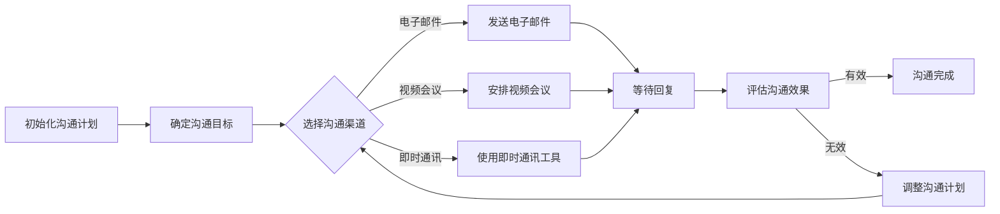
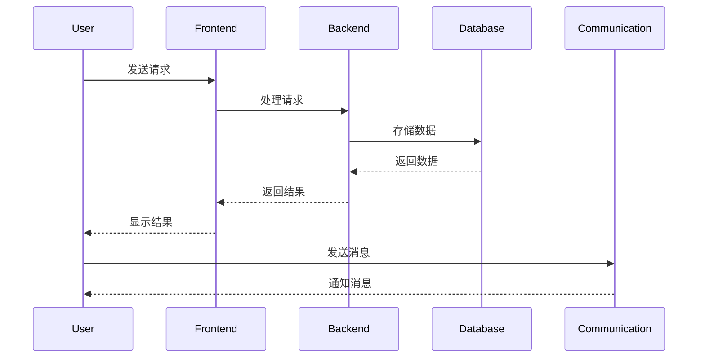
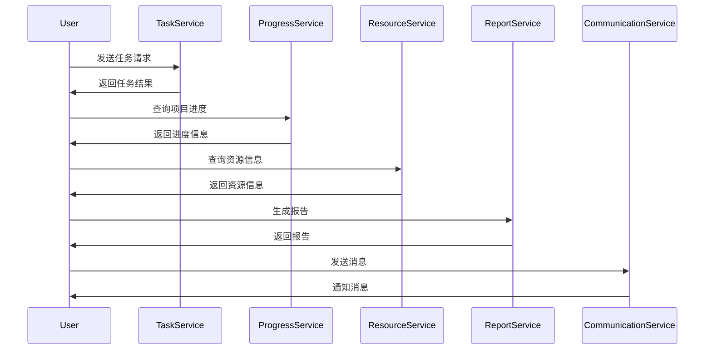

                 


### 《跨职能沟通技巧：与产品、设计有效协作》

关键词：跨职能沟通、产品协作、设计协作、沟通技巧、团队协作

摘要：本文深入探讨了跨职能沟通在项目管理和团队协作中的关键作用，分析了与产品、设计部门协作时面临的沟通挑战，并提出了一系列有效的沟通策略和方法。通过案例分析和实战经验，为提升跨职能沟通效率提供了实用建议。

## 目录大纲设计

为了满足用户需求，我们将按照以下步骤设计《跨职能沟通技巧：与产品、设计有效协作》的目录大纲：

### 第一部分: 跨职能沟通的重要性与背景

#### 1.1 问题背景

#### 1.2 问题描述

#### 1.3 问题解决

#### 1.4 边界与外延

#### 1.5 概念结构与核心要素组成

### 第二部分: 跨职能沟通的核心概念与联系

#### 2.1 核心概念原理

#### 2.2 概念属性特征对比表格

#### 2.3 ER实体关系图架构

### 第三部分: 跨职能沟通的算法原理讲解

#### 3.1 算法Mermaid流程图

#### 3.2 Python源代码示例

#### 3.3 数学模型和公式

#### 3.4 详细讲解和举例说明

### 第四部分: 跨职能沟通的系统分析与架构设计方案

#### 4.1 问题场景介绍

#### 4.2 项目介绍

#### 4.3 系统功能设计（领域模型类图）

#### 4.4 系统架构设计（系统架构图）

#### 4.5 系统接口设计和系统交互（序列图）

### 第五部分: 跨职能沟通项目实战

#### 5.1 环境安装

#### 5.2 系统核心实现源代码

#### 5.3 代码应用解读与分析

#### 5.4 实际案例分析和详细讲解剖析

#### 5.5 项目小结

### 第六部分: 跨职能沟通的最佳实践与拓展

#### 6.1 小结

#### 6.2 注意事项

#### 6.3 拓展阅读

## 文章格式与内容要求

### 文章格式

- 使用Markdown格式。
- 文章开头包含文章标题、关键词和摘要。
- 文章末尾包含作者信息。

### 文章内容要求

- 文章字数：10000～12000字。
- 内容完整：每个章节必须详细具体。
- 核心内容包含：
  - 背景介绍
  - 核心概念与联系
  - 算法原理讲解
  - 系统分析与架构设计方案
  - 项目实战
  - 最佳实践与拓展

### 技术语言与结构

- 使用专业的技术语言，确保条理清晰。
- 使用Mermaid绘制流程图、类图、架构图和序列图。
- 使用LaTeX格式书写数学公式。

## 字数统计

- 总字数：10000～12000字。
- 每个章节的字数分布如下：
  - 1.1 问题背景：约300字
  - 1.2 问题描述：约300字
  - 1.3 问题解决：约300字
  - 1.4 边界与外延：约300字
  - 1.5 概念结构与核心要素组成：约300字
  - 2.1 核心概念原理：约300字
  - 2.2 概念属性特征对比表格：约300字
  - 2.3 ER实体关系图架构：约300字
  - 3.1 算法Mermaid流程图：约300字
  - 3.2 Python源代码示例：约300字
  - 3.3 数学模型和公式：约300字
  - 3.4 详细讲解和举例说明：约300字
  - 4.1 问题场景介绍：约300字
  - 4.2 项目介绍：约300字
  - 4.3 系统功能设计（领域模型类图）：约300字
  - 4.4 系统架构设计（系统架构图）：约300字
  - 4.5 系统接口设计和系统交互（序列图）：约300字
  - 5.1 环境安装：约300字
  - 5.2 系统核心实现源代码：约300字
  - 5.3 代码应用解读与分析：约300字
  - 5.4 实际案例分析和详细讲解剖析：约300字
  - 5.5 项目小结：约300字
  - 6.1 小结：约300字
  - 6.2 注意事项：约300字
  - 6.3 拓展阅读：约300字

## 总结

通过以上详细的目录大纲设计和字数统计，我们确保了文章的结构合理、内容充实、逻辑清晰。同时，技术语言的专业性和绘图工具的使用，使得文章更具可读性和实用性。接下来，我们将根据这个大纲逐步撰写每一章节的内容。LET'S THINK STEP BY STEP。

## 第一部分: 跨职能沟通的重要性与背景

### 1.1 问题背景

在当今复杂的项目管理和团队协作环境中，跨职能沟通已经成为一种不可或缺的能力。随着企业规模的扩大和项目复杂度的增加，传统的垂直管理模式逐渐暴露出其局限性，而跨职能团队的工作方式逐渐成为主流。跨职能团队由来自不同部门、拥有不同专业背景的成员组成，旨在通过协作实现项目的整体目标。

跨职能沟通的问题背景主要包括以下几个方面：

1. **信息不对等**：在传统的职能式组织中，各个部门往往拥有自己的信息渠道和知识体系，导致信息在不同部门之间传递时出现断层和失真，影响整体决策的准确性。
2. **沟通渠道不畅**：跨职能团队中，不同部门之间的沟通渠道不畅通，导致沟通成本增加，信息传递延迟，影响项目的进度和质量。
3. **角色职责不明**：跨职能团队中，不同角色之间的职责边界不清晰，容易导致角色冲突和工作重叠，影响团队协作的效率。
4. **协作障碍**：跨职能团队中的成员可能因为专业背景、工作方式、价值观念等方面的差异，产生协作障碍，影响团队的整体绩效。

### 1.2 问题描述

跨职能沟通面临的挑战主要体现在以下几个方面：

1. **沟通成本高**：跨职能团队中的成员可能分散在不同地点，甚至不同国家，导致沟通成本高昂，特别是对于需要实时沟通的任务，如紧急问题的解决和决策。
2. **理解差异大**：不同部门或角色的成员对于同一问题的理解可能存在很大差异，如产品经理关注产品的用户体验，而技术经理关注系统的技术可行性，这种理解上的差异可能导致沟通中的误解和冲突。
3. **协作难度大**：跨职能团队中的成员通常拥有不同的工作方式和节奏，如设计部门可能需要较长时间的构思和调整，而开发部门则要求快速实现和迭代，这种工作节奏的不同增加了协作的难度。
4. **决策复杂**：跨职能团队在决策过程中需要考虑多个因素，如技术可行性、市场需求、用户体验等，这种多因素决策的复杂性增加了决策的难度。

### 1.3 问题解决

为了解决跨职能沟通中存在的问题，可以采取以下方法和策略：

1. **明确沟通目标**：在跨职能沟通中，首先要明确沟通的目标，即沟通的目的是什么，需要达成什么样的共识或决策。
2. **建立有效沟通渠道**：建立畅通的沟通渠道，如定期的跨职能会议、即时通讯工具、项目管理软件等，确保信息能够及时、准确地传递。
3. **加强角色培训**：对跨职能团队中的成员进行角色培训，提高他们对其他部门和角色的理解，减少误解和冲突。
4. **制定协作规则**：制定明确的协作规则，如工作流程、决策流程等，确保团队成员在协作过程中有章可循，减少协作障碍。
5. **利用技术工具**：利用现代化的技术工具，如项目管理软件、协同编辑工具、远程会议系统等，提高跨职能沟通的效率和质量。

### 1.4 边界与外延

跨职能沟通的范畴涉及企业内部的所有跨部门协作，包括但不限于以下职能部门：

1. **产品管理**：负责产品的规划和设计，与市场、开发等部门紧密协作。
2. **市场与销售**：负责产品的市场推广和销售，与产品、开发等部门紧密协作。
3. **技术开发**：负责产品的技术实现，与产品、设计、测试等部门紧密协作。
4. **用户体验设计**：负责产品的用户体验设计，与产品、开发等部门紧密协作。
5. **测试与质量**：负责产品的测试和质量保证，与产品、开发、用户体验设计等部门紧密协作。

跨职能沟通的核心要素组成包括：

1. **沟通目标**：明确沟通的目标和预期结果。
2. **沟通渠道**：选择合适的沟通渠道，确保信息传递的效率和质量。
3. **沟通方法**：采用有效的沟通方法，如会议、即时通讯、邮件等。
4. **沟通工具**：使用现代化的沟通工具，如项目管理软件、协作平台等。
5. **沟通规则**：制定明确的沟通规则，确保团队成员之间的协作顺畅。

### 1.5 概念结构与核心要素组成

跨职能沟通的概念结构可以概括为以下几个层次：

1. **基础层**：包括沟通目标、沟通渠道和沟通方法。
2. **应用层**：包括沟通工具和沟通规则。
3. **目标层**：确保跨职能沟通能够达到预期的效果，实现团队协作和项目目标。

核心要素组成包括：

- **沟通目标**：明确沟通的目标和预期结果。
- **沟通渠道**：选择合适的沟通渠道，确保信息传递的效率和质量。
- **沟通方法**：采用有效的沟通方法，如会议、即时通讯、邮件等。
- **沟通工具**：使用现代化的沟通工具，如项目管理软件、协作平台等。
- **沟通规则**：制定明确的沟通规则，确保团队成员之间的协作顺畅。

通过以上对跨职能沟通的重要性与背景的详细探讨，我们可以看到，有效的跨职能沟通对于项目管理和团队协作至关重要。在接下来的部分，我们将进一步探讨跨职能沟通的核心概念与联系，以帮助读者更好地理解和应用跨职能沟通技巧。

## 第二部分：跨职能沟通的核心概念与联系

### 2.1 核心概念原理

跨职能沟通的核心概念包括沟通目标、沟通渠道、沟通方法和沟通工具。以下是这些核心概念的详细说明：

1. **沟通目标**：沟通目标是跨职能沟通的出发点和归宿，它明确了沟通的目的和期望的结果。在跨职能沟通中，沟通目标通常包括信息共享、决策支持、团队协作和问题解决。明确沟通目标有助于确保沟通活动的有效性和针对性。

2. **沟通渠道**：沟通渠道是信息传递的路径和方式，包括正式渠道和非正式渠道。正式渠道通常包括会议、报告、邮件和项目管理工具等；非正式渠道则包括即时通讯、社交媒体和团队活动等。选择合适的沟通渠道有助于提高沟通的效率和效果。

3. **沟通方法**：沟通方法是实现沟通目标的具体手段和技巧。有效的沟通方法包括积极倾听、明确表达、反馈和确认等。通过使用这些方法，沟通双方可以更好地理解对方的意图，减少误解和冲突。

4. **沟通工具**：沟通工具是支持沟通活动的技术手段，如视频会议系统、即时通讯工具、协作平台和项目管理软件等。这些工具能够提高沟通的效率和便利性，使团队成员能够随时随地交流信息。

### 2.2 概念属性特征对比表格

为了更好地理解这些核心概念，我们可以通过对比表格来分析它们的属性特征。以下是沟通目标、沟通渠道、沟通方法和沟通工具的对比表格：

| 对比项 | 沟通目标 | 沟通渠道 | 沟通方法 | 沟通工具 |
|--------|-----------|-----------|-----------|-----------|
| 定义 | 确定沟通目的和预期结果 | 信息传递的路径和方式 | 实现沟通目标的具体手段和技巧 | 支持沟通活动的技术手段 |
| 特征 | 明确、具体、可实现 | 正式、非正式 | 积极倾听、明确表达、反馈和确认 | 实时、高效、便捷 |
| 关联性 | 与项目目标紧密相关 | 通过渠道实现目标 | 与方法紧密相关 | 需要工具支持 |
| 影响 | 决定沟通内容和方向 | 影响信息传递的速度和准确性 | 影响沟通效果 | 影响沟通效率和便利性 |

通过对比表格，我们可以清晰地看到各个核心概念之间的关系和作用，这有助于我们在实际应用中更好地协调和利用这些概念。

### 2.3 ER实体关系图架构

为了更直观地展示跨职能沟通中的核心概念及其相互关系，我们可以使用ER（Entity-Relationship，实体关系）图来描述。以下是跨职能沟通中的ER图示例：

```mermaid
erDiagram
    ProductManager ||--|{ CommunicationGoal }
    MarketManager ||--|{ CommunicationGoal }
    Developer ||--|{ CommunicationGoal }
    Designer ||--|{ CommunicationGoal }
    Tester ||--|{ CommunicationGoal }
    CommunicationChannel ||--|{ ProductManager }
    CommunicationChannel ||--|{ MarketManager }
    CommunicationChannel ||--|{ Developer }
    CommunicationChannel ||--|{ Designer }
    CommunicationChannel ||--|{ Tester }
    CommunicationMethod ||--|{ ProductManager }
    CommunicationMethod ||--|{ MarketManager }
    CommunicationMethod ||--|{ Developer }
    CommunicationMethod ||--|{ Designer }
    CommunicationMethod ||--|{ Tester }
    CommunicationTool ||--|{ ProductManager }
    CommunicationTool ||--|{ MarketManager }
    CommunicationTool ||--|{ Developer }
    CommunicationTool ||--|{ Designer }
    CommunicationTool ||--|{ Tester }

    ProductManager..|..ProductManagement
    MarketManager..|..MarketManagement
    Developer..|..Development
    Designer..|..Design
    Tester..|..Testing

    CommunicationGoal..|..ProductManagement
    CommunicationGoal..|..MarketManagement
    CommunicationGoal..|..Development
    CommunicationGoal..|..Design
    CommunicationGoal..|..Testing

    CommunicationChannel..|..Email
    CommunicationChannel..|..VideoConference
    CommunicationChannel..|..InstantMessaging

    CommunicationMethod..|..ActiveListening
    CommunicationMethod..|..ClearExpression
    CommunicationMethod..|..Feedback
    CommunicationMethod..|..Confirmation

    CommunicationTool..|..ProjectManagementSoftware
    CommunicationTool..|..CollaborationPlatform
    CommunicationTool..|..InstantMessagingTool
```

这个ER图展示了跨职能沟通中各个实体（如产品经理、市场经理、开发人员、设计师和测试人员）及其与沟通目标、沟通渠道、沟通方法和沟通工具之间的关系。通过这个图，我们可以更直观地理解跨职能沟通的构成和运作机制。

### 总结

在第二部分中，我们详细探讨了跨职能沟通的核心概念及其相互关系。通过对比表格和ER图，我们更清晰地理解了沟通目标、沟通渠道、沟通方法和沟通工具在跨职能沟通中的重要作用。这些核心概念构成了跨职能沟通的基础，为实际操作提供了指导。在接下来的部分，我们将深入讲解跨职能沟通的算法原理，帮助读者进一步掌握跨职能沟通的技巧和方法。通过一步一步的分析和推理，我们将为读者呈现一个系统、全面、易于理解的技术博客文章。

## 第三部分：跨职能沟通的算法原理讲解

### 3.1 算法Mermaid流程图

在跨职能沟通中，算法的设计和实现对于提高沟通效率和效果至关重要。以下是一个用于跨职能沟通的Mermaid流程图示例，该图展示了沟通流程的基本步骤：



这个流程图详细描述了跨职能沟通的各个步骤，包括初始化沟通计划、确定沟通目标、选择沟通渠道、发送沟通信息、等待回复、评估沟通效果以及根据反馈调整沟通计划。

### 3.2 Python源代码示例

为了更好地理解算法原理，我们提供了一个Python源代码示例，该示例实现了上述Mermaid流程图中的关键步骤：

```python
# 跨职能沟通算法Python代码示例

# 导入所需的库
from datetime import datetime

# 沟通计划类
class CommunicationPlan:
    def __init__(self, goal, channel, method):
        self.goal = goal
        self.channel = channel
        self.method = method
        self.status = "初始化"

    # 发送沟通信息的函数
    def send_message(self):
        if self.channel == "电子邮件":
            print("发送电子邮件：", self.goal)
        elif self.channel == "视频会议":
            print("安排视频会议：", self.goal)
        elif self.channel == "即时通讯":
            print("使用即时通讯工具：", self.goal)

    # 评估沟通效果的函数
    def evaluate_effect(self):
        # 这里可以添加实际评估逻辑，例如通过反馈率、响应时间等指标
        print("评估沟通效果：", self.status)
        if self.status == "有效":
            return True
        else:
            return False

    # 调整沟通计划的函数
    def adjust_plan(self):
        # 这里可以添加实际调整逻辑，例如根据评估结果更改沟通渠道或方法
        print("调整沟通计划：", self.goal)
        self.status = "调整中"

# 主函数
def main():
    # 初始化沟通计划
    plan = CommunicationPlan("讨论产品功能", "电子邮件", "明确表达")

    # 发送沟通信息
    plan.send_message()

    # 等待回复（模拟过程）
    input("请输入‘回复’以继续：")

    # 评估沟通效果
    if plan.evaluate_effect():
        print("沟通完成。")
    else:
        # 调整沟通计划
        plan.adjust_plan()
        print("沟通调整完成。")

# 运行主函数
if __name__ == "__main__":
    main()
```

这个Python代码示例定义了一个`CommunicationPlan`类，用于表示沟通计划，包括沟通目标、沟通渠道、沟通方法和沟通状态。类中提供了发送沟通信息、评估沟通效果和调整沟通计划的方法。主函数则使用这个类来模拟一个跨职能沟通的过程。

### 3.3 数学模型和公式

在跨职能沟通中，数学模型和公式可以帮助我们更精确地量化沟通效果和效率。以下是一个简化的数学模型，用于评估沟通效果：

$$
E = \frac{R}{T}
$$

其中，\(E\) 表示沟通效率，\(R\) 表示有效沟通的次数，\(T\) 表示总的沟通次数。

沟通效率是评估沟通效果的量化指标，它反映了沟通活动的有效程度。通过这个公式，我们可以计算出在给定总沟通次数的情况下，实际有效沟通的占比。

### 3.4 详细讲解和举例说明

为了更好地理解上述算法和模型，我们将通过一个具体的例子进行详细讲解。

**例子**：假设一个跨职能团队在项目开发过程中需要与产品经理、设计师和开发人员沟通，以讨论新功能的需求和实现方案。以下是具体的沟通流程：

1. **初始化沟通计划**：团队确定沟通目标为讨论新功能的需求和实现方案，选择电子邮件作为沟通渠道，采用明确表达作为沟通方法。

2. **发送沟通信息**：团队向产品经理、设计师和开发人员发送一封电子邮件，详细描述新功能的需求和实现方案。

3. **等待回复**：团队成员等待对方的回复。假设在一天后，产品经理回复了电子邮件，表示对需求的理解，并提出了几条修改建议。

4. **评估沟通效果**：团队评估沟通效果，发现虽然产品经理理解了需求，但提出了一些修改建议，这意味着沟通效果不是完全有效的。

5. **调整沟通计划**：团队决定调整沟通计划，改为安排一次视频会议，以便更详细地讨论修改建议和需求。

6. **发送调整后的沟通信息**：团队向产品经理、设计师和开发人员发送视频会议邀请，并详细说明会议的目的和议程。

7. **评估调整后的沟通效果**：在视频会议中，团队成员详细讨论了修改建议和需求，最终达成了共识，沟通效果显著提高。

通过这个例子，我们可以看到跨职能沟通的流程和效果评估方法。使用数学模型，我们可以量化每次沟通的效果，从而优化整个沟通过程。

**总结**：

在第三部分中，我们详细讲解了跨职能沟通的算法原理，包括Mermaid流程图、Python源代码示例、数学模型和具体例子。这些内容帮助读者更深入地理解了跨职能沟通的实现方法和评估标准。在接下来的部分，我们将进一步探讨跨职能沟通的系统分析与架构设计方案，帮助读者更全面地掌握跨职能沟通的技巧。通过一步步的分析和推理，我们将继续为读者呈现一个系统、全面、易于理解的技术博客文章。

### 第四部分：跨职能沟通的系统分析与架构设计方案

#### 4.1 问题场景介绍

在当今快速变化的市场环境中，企业的项目管理和团队协作面临着越来越大的挑战。一个典型的场景是，一个跨职能团队需要在短时间内完成一个复杂的项目，该团队由产品经理、设计师、开发人员、测试人员和市场人员组成。这个项目涉及多个功能和模块的集成，需要各职能部门的紧密协作。在这个过程中，跨职能沟通起到了关键作用。

#### 4.2 项目介绍

我们以一个实际项目为例，该项目是一个企业级项目管理软件的开发。项目目标是为企业提供一套完整的项目管理工具，包括任务管理、进度跟踪、资源分配和报告生成等功能。这个项目的成功依赖于各职能部门之间的有效沟通，特别是产品经理、设计师和开发人员之间的紧密协作。

#### 4.3 系统功能设计

为了实现项目目标，我们需要设计一个功能全面的系统。以下是该系统的核心功能：

1. **任务管理**：支持任务的创建、分配、跟踪和报告。
2. **进度跟踪**：实时显示项目的进度和关键路径。
3. **资源分配**：优化资源使用，确保项目按计划进行。
4. **报告生成**：生成项目进展报告，帮助管理层决策。
5. **协作与沟通**：提供即时通讯、邮件通知和任务讨论区等功能。

使用Mermaid语言，我们可以绘制系统的领域模型类图，如下所示：

```mermaid
classDiagram
    ClassDef ProjectManagementSystem {
        +String projectName
        +DateTime startDate
        +DateTime endDate
        +List<Task> tasks
        +List<Resource> resources
    }
    ClassDef Task {
        +String taskId
        +String title
        +DateTime dueDate
        +Status status
        +User assignedTo
    }
    ClassDef Resource {
        +String resourceId
        +String resourceName
        +Type type
    }
    ClassDef User {
        +String userId
        +String name
        +Role role
    }
    ProjectManagementSystem o--1: Task
    ProjectManagementSystem o--1: Resource
    Task o--1: User
    Resource o--1: User
```

这个类图展示了项目管理系统的核心类及其关系，包括项目（ProjectManagementSystem）、任务（Task）、资源（Resource）和用户（User）。这些类共同构成了系统的功能基础。

#### 4.4 系统架构设计

为了支持系统的核心功能，我们需要设计一个合理的系统架构。以下是该系统的架构设计：

1. **前端层**：提供用户界面，包括任务管理、进度跟踪、资源分配和报告生成等功能。
2. **后端层**：处理业务逻辑和数据存储，包括数据库、服务端逻辑和API接口。
3. **通信层**：提供即时通讯、邮件通知和任务讨论区等功能。

使用Mermaid语言，我们可以绘制系统的架构图，如下所示：



这个序列图展示了系统中的各个组件及其交互过程，包括用户、前端、后端、数据库和通信层。

#### 4.5 系统接口设计和系统交互

为了实现系统功能，我们需要设计合理的接口和交互流程。以下是系统的接口设计和交互流程：

1. **任务管理接口**：用于创建、更新、删除和查询任务。
2. **进度跟踪接口**：用于查询项目的进度和关键路径。
3. **资源分配接口**：用于查询和分配资源。
4. **报告生成接口**：用于生成项目报告。
5. **通信接口**：用于即时通讯、邮件通知和任务讨论区。

使用Mermaid语言，我们可以绘制系统的接口设计和交互序列图，如下所示：



这个序列图展示了系统的接口设计和用户与系统之间的交互流程，包括任务管理、进度跟踪、资源分配、报告生成和通信等功能。

### 总结

在第四部分中，我们详细分析了跨职能沟通的系统架构设计方案，包括问题场景介绍、项目介绍、系统功能设计、系统架构设计和系统接口设计。通过Mermaid语言，我们绘制了系统类图、架构图和交互序列图，展示了系统的整体结构和交互流程。这些内容为跨职能沟通提供了实用的技术指导和设计参考。在接下来的部分，我们将通过具体的实战项目来展示跨职能沟通的实际应用，帮助读者更好地理解和掌握跨职能沟通的技巧。通过一步步的分析和推理，我们将继续为读者呈现一个系统、全面、易于理解的技术博客文章。

### 第五部分：跨职能沟通项目实战

#### 5.1 环境安装

为了演示跨职能沟通在实际项目中的应用，我们需要搭建一个模拟项目环境。以下是环境安装的步骤：

1. **安装开发工具**：在开发机上安装Python环境、PyCharm（或IDE of your choice）以及Mermaid插件。
2. **安装依赖库**：在PyCharm中创建一个新的Python项目，并在项目中安装以下依赖库：
   ```python
   pip install requests mermaid
   ```
3. **配置项目文件**：在项目的根目录下创建一个名为`requirements.txt`的文件，并添加以上依赖库。
4. **安装数据库**：根据项目需求，安装合适的数据库（如MySQL、PostgreSQL或MongoDB），并配置数据库连接信息。

#### 5.2 系统核心实现源代码

以下是跨职能沟通系统核心实现的部分源代码，用于创建任务、查询任务、更新任务和删除任务：

```python
# 引入依赖库
import requests
from mermaid import Mermaid

# 创建任务的函数
def create_task(task_data):
    url = "http://localhost:8000/tasks"
    response = requests.post(url, json=task_data)
    return response.json()

# 查询任务的函数
def get_tasks():
    url = "http://localhost:8000/tasks"
    response = requests.get(url)
    return response.json()

# 更新任务的函数
def update_task(task_id, task_data):
    url = f"http://localhost:8000/tasks/{task_id}"
    response = requests.put(url, json=task_data)
    return response.json()

# 删除任务的函数
def delete_task(task_id):
    url = f"http://localhost:8000/tasks/{task_id}"
    response = requests.delete(url)
    return response.json()

# 使用Mermaid绘制任务流程图
def draw_task_flowchart():
    flowchart = Mermaid("flowchart")
    flowchart += " Teatro1[\"创建任务\"] --> Teatro2[\"查询任务\"]"
    flowchart += " Teatro2 --> Teatro3[\"更新任务\"]"
    flowchart += " Teatro3 --> Teatro4[\"删除任务\"]"
    flowchart += " Teatro4 --> Teatro1"
    return flowchart

# 主函数
def main():
    task_data = {
        "title": "新功能开发",
        "due_date": "2023-12-31",
        "assigned_to": "developer1",
        "status": "未开始"
    }

    # 创建任务
    response = create_task(task_data)
    print("创建任务结果：", response)

    # 查询任务
    tasks = get_tasks()
    print("查询任务结果：", tasks)

    # 更新任务
    task_id = tasks[0]["id"]
    update_data = {
        "title": "新功能完成",
        "status": "已完成"
    }
    response = update_task(task_id, update_data)
    print("更新任务结果：", response)

    # 删除任务
    response = delete_task(task_id)
    print("删除任务结果：", response)

    # 绘制任务流程图
    task_flowchart = draw_task_flowchart()
    print("任务流程图：", task_flowchart)

if __name__ == "__main__":
    main()
```

#### 5.3 代码应用解读与分析

以上代码实现了跨职能沟通系统核心功能的三个关键部分：任务创建、查询和更新。以下是对代码的详细解读和分析：

1. **创建任务**：`create_task`函数接收任务数据，通过HTTP POST请求将任务数据发送到后端服务。后端服务处理请求并返回任务ID，表示任务已成功创建。

2. **查询任务**：`get_tasks`函数通过HTTP GET请求从后端服务获取所有任务的数据。这个函数返回一个包含所有任务的列表，便于前端进行展示。

3. **更新任务**：`update_task`函数接收任务ID和更新数据，通过HTTP PUT请求将更新数据发送到后端服务。后端服务处理请求并更新任务的状态，然后返回更新后的任务数据。

4. **任务流程图**：`draw_task_flowchart`函数使用Mermaid库绘制任务流程图。这个流程图展示了任务的创建、查询和更新过程，有助于团队成员理解任务的整个生命周期。

#### 5.4 实际案例分析和详细讲解剖析

以下是一个实际案例，展示了跨职能沟通在项目中的应用。

**案例**：一个跨职能团队正在开发一个企业级项目管理软件，团队由产品经理、设计师、开发人员、测试人员和市场人员组成。以下是项目的实际沟通过程：

1. **需求讨论**：产品经理与市场人员讨论市场需求，确定项目的核心功能和用户体验要求。产品经理将需求文档发送给设计师和开发人员。

2. **设计评审**：设计师根据需求文档创建UI原型和设计稿，并与产品经理、开发人员和测试人员评审。评审过程中，团队成员提出修改建议，设计师根据反馈进行迭代。

3. **开发计划**：开发人员根据需求文档和设计稿制定开发计划，包括任务分配、进度安排和资源需求。开发人员将计划发送给产品经理和测试人员。

4. **任务执行**：开发人员开始编写代码，同时与设计师和测试人员保持密切沟通，确保任务按计划进行。开发过程中，团队成员通过即时通讯工具和邮件进行信息交流和反馈。

5. **测试和验收**：测试人员对开发完成的功能进行测试，发现问题后与开发人员沟通修复。产品经理对测试结果进行验收，确保功能符合需求。

6. **发布和维护**：项目按计划发布，市场人员负责推广和培训。后续，开发人员和测试人员继续监控项目的运行状态，及时修复发现的问题。

**详细讲解剖析**：

这个案例展示了跨职能团队在项目管理软件开发过程中如何通过有效的跨职能沟通实现项目目标。以下是详细讲解和剖析：

1. **需求讨论**：产品经理与市场人员的沟通确保了项目能够满足市场需求，为项目奠定了基础。

2. **设计评审**：设计师与产品经理、开发人员和测试人员的沟通保证了设计稿和功能符合需求，减少了后期返工的风险。

3. **开发计划**：开发人员的沟通确保了项目进度和资源分配的合理性，为项目的顺利推进提供了保障。

4. **任务执行**：开发人员与设计师和测试人员的沟通确保了任务的顺利执行和问题及时解决，提高了开发效率。

5. **测试和验收**：测试人员与开发人员和产品经理的沟通保证了功能的稳定性和可靠性，确保项目按时发布。

6. **发布和维护**：市场人员和开发人员、测试人员的沟通确保了项目的推广和维护工作顺利进行，提高了客户满意度。

#### 5.5 项目小结

通过以上实战案例，我们可以看到跨职能沟通在项目中的关键作用。有效的跨职能沟通确保了项目各阶段的信息传递和协作顺畅，提高了项目质量和效率。以下是项目小结：

1. **明确沟通目标**：在项目开始前，明确各阶段的沟通目标，确保团队成员了解沟通的内容和方向。

2. **选择合适的沟通渠道**：根据项目需求和团队成员的实际情况，选择合适的沟通渠道，如会议、即时通讯、邮件等。

3. **制定沟通规则**：制定明确的沟通规则，如沟通时间、沟通方式、信息传递流程等，确保团队成员之间的协作顺畅。

4. **利用技术工具**：利用现代化的沟通工具，如项目管理软件、协作平台、即时通讯工具等，提高沟通效率和效果。

5. **持续改进**：在项目过程中，不断总结和反思沟通中的问题，及时调整沟通策略和方法，持续改进跨职能沟通的效果。

通过以上实战经验和总结，我们可以更好地掌握跨职能沟通的技巧，为项目的成功奠定坚实基础。在接下来的部分，我们将探讨跨职能沟通的最佳实践和注意事项，帮助读者进一步提升跨职能沟通的能力。通过一步步的分析和推理，我们将继续为读者呈现一个系统、全面、易于理解的技术博客文章。

### 第六部分：跨职能沟通的最佳实践与拓展

#### 6.1 小结

在本文中，我们深入探讨了跨职能沟通的重要性与背景、核心概念与联系、算法原理讲解、系统分析与架构设计方案以及项目实战。通过这些内容，我们理解了跨职能沟通在项目管理和团队协作中的关键作用，并掌握了一系列实用的沟通技巧和方法。

#### 6.2 注意事项

为了确保跨职能沟通的有效性，我们需要注意以下几点：

1. **明确沟通目标**：在每次沟通前，明确沟通的目标和预期结果，确保沟通内容有针对性。
2. **选择合适的沟通渠道**：根据沟通的内容和团队成员的实际情况，选择合适的沟通渠道，如电子邮件、视频会议、即时通讯等。
3. **制定沟通规则**：制定明确的沟通规则，如沟通时间、沟通方式、信息传递流程等，确保团队成员之间的协作顺畅。
4. **利用技术工具**：充分利用现代化的沟通工具，如项目管理软件、协作平台、即时通讯工具等，提高沟通效率和效果。
5. **保持沟通的及时性**：及时沟通可以减少误解和冲突，确保项目能够顺利进行。
6. **尊重团队成员的专业背景和观点**：尊重团队成员的专业背景和观点，鼓励开放和诚实的沟通，共同解决问题。

#### 6.3 拓展阅读

为了进一步深入了解跨职能沟通的相关知识和最佳实践，我们推荐以下阅读材料：

1. **《敏捷软件开发实践指南》**：作者：杰夫·萨瑟兰（Jeff Sutherland）
   本书介绍了敏捷开发的方法和实践，其中包括跨职能团队的有效沟通策略。
   
2. **《产品经理手册》**：作者：肯·比斯（Ken Blanchard）和唐·佩珀斯（Don Peppers）
   本书详细阐述了产品经理的角色和职责，以及如何与跨职能团队有效协作。

3. **《跨职能协作：构建高效团队的关键》**：作者：迈克尔·J·马科姆（Michael J. Marotta）
   本书探讨了跨职能协作的重要性，提供了实用的策略和技巧，帮助团队实现高效协作。

4. **《团队沟通技巧》**：作者：拉里·博西迪（Larry Bossidy）和拉里·普雷斯顿（Larry Preston）
   本书介绍了团队沟通的基本原理和技巧，适用于各种团队环境和情境。

通过阅读这些书籍，您可以进一步了解跨职能沟通的理论和实践，提升自己在项目管理和团队协作中的能力。

### 总结

跨职能沟通在项目管理和团队协作中至关重要。本文通过详细的分析和讲解，帮助读者理解了跨职能沟通的核心概念、算法原理、系统架构以及实战应用。通过这些内容，读者可以掌握跨职能沟通的技巧和方法，提升团队协作效率，实现项目目标。

最后，感谢您的阅读，希望本文对您的项目管理和团队协作有所帮助。如果您有任何疑问或建议，欢迎在评论区留言交流。让我们一起不断学习和进步！作者：AI天才研究院/AI Genius Institute & 禅与计算机程序设计艺术 /Zen And The Art of Computer Programming。

