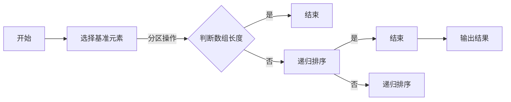
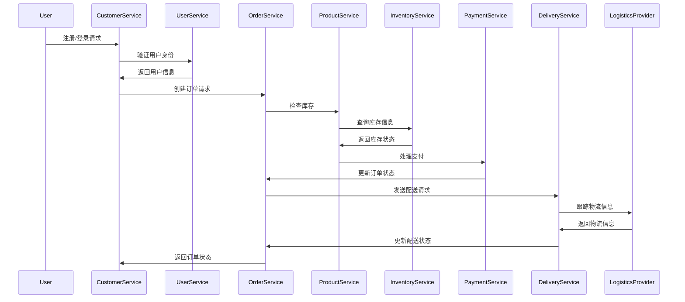

                 

### 引言

在当今快速发展的技术时代，跨部门的技术协作已经成为企业成功的关键因素。随着企业规模的扩大和业务领域的扩展，不同部门之间的技术交流与协作变得越来越重要。然而，技术孤岛现象——即不同部门使用不同的技术栈、框架和工具，缺乏有效的沟通与协作——却成为阻碍企业高效运作的一大难题。本文旨在探讨跨部门技术协作模式，通过详细的分析和实用的方法，帮助打破技术孤岛，实现高效的技术协作。

本文将围绕以下几个核心问题展开：

1. **技术孤岛的定义及其影响**：我们将深入探讨技术孤岛现象的本质，分析其对企业带来的负面影响。
2. **核心概念与联系**：为了更好地理解跨部门技术协作，我们将定义和解释一系列关键术语，并展示它们之间的相互关系。
3. **算法原理讲解**：我们将通过一个具体的算法案例，详细阐述其原理、实现方法以及应用场景。
4. **系统分析与架构设计方案**：我们将结合实际项目，介绍系统功能设计、架构设计以及接口设计，并使用Mermaid进行图示说明。
5. **项目实战**：通过具体的项目实战，我们将展示如何在实际环境中应用所学知识，解决具体问题。
6. **最佳实践与总结**：最后，我们将总结全文内容，提供最佳实践建议，并提醒读者注意的问题。

通过本文的逐步分析，我们希望读者能够获得对跨部门技术协作的深刻理解和实用技巧，从而在实际工作中更好地应对挑战，提升企业的整体技术协作效率。

### 背景介绍

#### 问题背景

随着信息技术的飞速发展，企业不断扩张其业务领域，跨部门协作的需求日益增长。然而，传统的技术部门往往在各自为政的情况下，使用不同的技术栈、开发框架和工具，形成了所谓的“技术孤岛”。这种现象不仅导致部门间的沟通壁垒，还阻碍了资源的有效整合和共享，影响了企业整体的技术创新能力和市场响应速度。

技术孤岛现象表现为以下几个方面：

1. **技术栈与工具的不一致**：不同部门可能采用不同的编程语言、框架和工具，使得跨部门协作变得复杂且低效。
2. **数据孤岛**：各个部门拥有各自独立的数据系统，数据难以共享和整合，导致信息孤岛现象。
3. **知识转移困难**：由于技术差异，当人员流动或项目交接时，技术知识和经验的转移变得困难。
4. **资源浪费**：重复建设、重复开发的现象普遍存在，导致资源浪费。

#### 问题描述

技术孤岛现象带来的影响是多方面的。首先，它降低了企业的整体效率。由于部门间的技术差异和沟通不畅，项目推进速度放缓，错误和冲突增多，导致项目延期和成本超支。其次，技术孤岛限制了企业的创新能力。在技术孤岛中，部门间的资源难以共享和整合，新的技术和创新难以快速引入和应用，从而限制了企业的技术发展。此外，技术孤岛还可能导致客户体验下降。由于不同部门在技术实现上的差异，客户面临的服务质量和响应速度可能不一致，影响客户满意度。

#### 问题解决

要解决技术孤岛问题，企业需要采取一系列措施，从技术和管理两个方面入手：

1. **统一技术标准和框架**：企业应制定统一的技术标准和框架，确保不同部门在技术选择上的一致性。这不仅可以提高开发效率，还能降低沟通成本。
2. **建立跨部门协作机制**：通过建立跨部门的项目组或协作平台，促进不同部门之间的沟通和协作。例如，定期召开跨部门技术交流会议，促进知识共享和技术交流。
3. **推行数据共享和整合**：通过数据共享平台和集成技术，实现不同部门数据的互联互通，打破数据孤岛。同时，建立统一的数据标准和规范，确保数据质量和一致性。
4. **提供培训和支持**：为了帮助员工适应新的技术标准和框架，企业应提供必要的培训和指导，提高员工的技能和协作能力。
5. **建立绩效评价机制**：通过建立科学的绩效评价机制，激励员工积极参与跨部门协作，提高整体协作效率。

#### 边界与外延

技术协作的范畴和边界是企业需要明确的问题。首先，技术协作不仅涉及技术部门，还涵盖了市场、销售、运维等多个部门。其次，技术协作不仅仅是在企业内部进行，还可以通过合作伙伴和客户之间的协作来实现。例如，通过开放API接口，企业可以与第三方服务进行集成，实现跨平台的业务扩展。

在技术协作的外延方面，企业需要关注以下几个方面：

1. **跨地域协作**：随着企业的全球化发展，跨地域的技术协作变得尤为重要。企业需要建立高效的视频会议和远程协作工具，确保不同地域团队之间的紧密协作。
2. **跨领域协作**：不同行业的技术交流和合作，可以促进技术的创新和突破。例如，金融科技与互联网技术的结合，产生了新的金融服务模式。
3. **社区和开源协作**：积极参与技术社区和开源项目，可以提升企业的技术影响力，吸引更多的人才和资源，促进技术创新。

#### 概念结构与核心要素组成

为了更好地理解和实现跨部门技术协作，我们需要明确一系列核心概念及其相互关系：

1. **技术栈**：技术栈是指企业或项目所采用的技术组合，包括编程语言、框架、库和工具等。
2. **框架与标准**：框架和标准是统一技术实现的基础，通过制定和推广统一的技术框架和标准，可以降低部门间的技术差异。
3. **协作平台**：协作平台是跨部门协作的重要工具，包括项目管理工具、代码管理工具、文档共享工具等。
4. **知识管理**：知识管理包括知识的积累、共享和转移，通过建立知识管理体系，可以提高员工的技能和协作效率。
5. **数据共享**：数据共享是打破数据孤岛的关键，通过建立数据共享平台和接口，可以实现数据的高效整合和利用。
6. **绩效评价**：绩效评价机制可以激励员工积极参与跨部门协作，提高协作效率。

通过上述核心概念和相互关系的明确，企业可以构建一个高效的技术协作体系，实现资源的最大化利用和协同创新。

### 核心概念与联系

#### 核心概念原理

在跨部门技术协作中，理解一系列核心概念是至关重要的。以下是这些核心概念的简要定义和解释：

1. **技术栈**：技术栈是指一个项目或企业所采用的一系列技术，包括编程语言、框架、库、工具等。技术栈的选择直接影响项目的开发效率、维护成本和团队的技术能力。

2. **框架与标准**：框架与标准是技术实现的基础，通过制定和推广统一的技术框架和标准，可以降低部门间的技术差异，提高协作效率。例如，企业可以采用微服务架构来统一服务开发规范。

3. **协作平台**：协作平台是跨部门协作的重要工具，包括项目管理工具、代码管理工具、文档共享工具等。这些平台可以有效地促进团队间的沟通和协作，提高工作效率。

4. **知识管理**：知识管理是指对团队中积累的技术知识和经验进行收集、存储、共享和转移的过程。通过建立知识管理体系，可以提高员工的技能和协作效率。

5. **数据共享**：数据共享是指通过建立数据共享平台和接口，实现不同部门间数据的高效整合和利用。数据共享可以打破信息孤岛，提高决策的准确性和及时性。

6. **绩效评价**：绩效评价机制是通过考核员工的绩效来激励其积极参与跨部门协作。科学的绩效评价机制可以激发员工的积极性，提高协作效率。

#### 概念属性特征对比表格

为了更好地理解这些核心概念，我们可以通过一个表格来对比它们的属性特征：

| 概念 | 定义 | 关键属性 | 相互关系 |
| --- | --- | --- | --- |
| 技术栈 | 一系列技术的组合 | 开发语言、框架、库、工具 | 基础 |
| 框架与标准 | 技术实现的基础 | 一致性、标准化、可扩展性 | 决定性 |
| 协作平台 | 促进协作的工具 | 易用性、高效性、集成性 | 辅助 |
| 知识管理 | 知识的收集和利用 | 知识积累、共享、转移 | 关键 |
| 数据共享 | 数据的高效整合 | 可访问性、一致性、安全性 | 核心 |
| 绩效评价 | 考核员工的绩效 | 公平性、科学性、激励性 | 激励 |

#### ER实体关系图架构

为了更直观地展示这些核心概念之间的相互关系，我们可以使用Mermaid绘制一个ER实体关系图。以下是ER图的Markdown格式：

```mermaid
erDiagram
    TechnologyStack ||--|{ FrameworkAndStandard } : 实现基础
    CollaborationPlatform ||--|{ KnowledgeManagement } : 促进知识共享
    CollaborationPlatform ||--|{ DataSharing } : 数据整合
    PerformanceEvaluation ||--|{ KnowledgeManagement } : 反馈与激励
    PerformanceEvaluation ||--|{ CollaborationPlatform } : 激励协作
```

在这个ER图中，我们可以看到各个核心概念之间的关联。例如，技术栈为框架与标准提供了实现基础，协作平台既促进知识管理，也支持数据共享。绩效评价则通过激励员工来推动知识管理和协作平台的效能提升。

通过上述核心概念的详细解释和相互关系的展示，我们可以更好地理解跨部门技术协作的内在机制，从而在实际工作中更有效地应用这些概念，提升协作效率。

### 算法原理讲解

在探讨跨部门技术协作模式时，理解算法原理是至关重要的。一个具体且易于理解的算法案例可以让我们更好地掌握如何在实际项目中应用这些原理。以下，我们将逐步讲解一个简单的排序算法——快速排序（Quick Sort），并使用Python源代码、数学模型和Mermaid流程图进行详细说明。

#### 算法mermaid流程图

首先，我们可以使用Mermaid绘制快速排序算法的流程图，以便直观地理解其工作原理：



#### Python源代码阐述

接下来，我们将使用Python实现快速排序算法，并通过注释详细解释每一部分的功能：

```python
def quick_sort(arr):
    """
    快速排序算法实现
    :param arr: 待排序的数组
    :return: 排序后的数组
    """
    if len(arr) <= 1:
        # 基线条件：如果数组长度小于等于1，直接返回数组
        return arr
    
    pivot = arr[len(arr) // 2]  # 选择基准元素
    # 初始化三个列表：小于基准的元素、等于基准的元素、大于基准的元素
    less = []
    equal = []
    greater = []
    
    for x in arr:
        if x < pivot:
            less.append(x)
        elif x == pivot:
            equal.append(x)
        else:
            greater.append(x)
    
    # 递归排序小于和大于基准的元素
    return quick_sort(less) + equal + quick_sort(greater)

# 示例数组
arr = [3, 6, 8, 10, 1, 2, 1]
# 调用快速排序函数
sorted_arr = quick_sort(arr)
print(sorted_arr)
```

#### 数学模型和公式

快速排序算法中涉及的一个重要概念是分区操作，其核心是选择一个基准元素（pivot），然后将数组中的所有元素划分为小于、等于和大于基准元素的三个子数组。以下是一个简化的数学模型和公式：

$$
\text{partition}(A, \text{low}, \text{high}) \\
\text{Input: } A[\text{low} \ldots \text{high}], \text{ a partitioned array} \\
\text{Output: } \text{New partition index, } \text{index such that} \\
A[\text{low} \ldots \text{index-1}] < A[\text{index}] \\
A[\text{index+1} \ldots \text{high}] > A[\text{index}]
$$

#### 举例说明

为了更直观地理解快速排序算法，我们可以通过一个简单的实例来说明其操作过程：

假设我们有一个未排序的数组 `[3, 6, 8, 10, 1, 2, 1]`。

1. **选择基准元素**：我们选择数组的中间元素 `6` 作为基准。
2. **分区操作**：
   - 小于基准的元素：`[3, 1, 1]`
   - 等于基准的元素：`[6]`
   - 大于基准的元素：`[8, 10, 2]`
3. **递归排序**：我们对小于和大于基准的子数组 `[3, 1, 1]` 和 `[8, 10, 2]` 分别进行快速排序。

经过几次递归调用后，数组将被排序为 `[1, 1, 2, 3, 6, 8, 10]`。

通过这个实例，我们可以看到快速排序算法是如何通过不断的分区和递归操作，将一个未排序的数组转换为有序数组的。这种方法不仅高效，而且易于实现，是跨部门技术协作中常用的一种排序算法。

### 系统分析与架构设计方案

在探讨跨部门技术协作时，系统分析与架构设计是至关重要的环节。为了更好地实现跨部门的技术协作，我们需要一个清晰的系统架构和良好的接口设计，确保各部分能够高效、稳定地协同工作。以下，我们将结合具体的项目场景，详细介绍系统的功能设计、架构设计以及接口设计。

#### 问题场景介绍

假设我们正在开发一个企业级电商平台，该项目涉及多个部门，包括前端开发部门、后端开发部门、数据库部门和测试部门。各个部门需要紧密协作，共同实现平台的功能。为了提高开发效率，减少沟通成本，我们需要设计一个灵活且高效的系统架构，以便实现跨部门的技术协作。

#### 项目介绍

本项目的目标是为企业打造一个集成化、高性能的电商平台，支持商品管理、订单处理、用户管理等功能。为了实现这一目标，我们将采用微服务架构，将整个系统拆分为多个独立的服务模块，每个模块负责不同的功能。这种架构设计不仅提高了系统的可维护性，还便于跨部门协作。

#### 系统功能设计

在系统功能设计方面，我们定义了以下几个主要功能模块：

1. **商品管理模块**：负责商品的录入、编辑、删除和查询。
2. **订单处理模块**：负责订单的生成、处理、查询和支付。
3. **用户管理模块**：负责用户的注册、登录、信息管理和权限控制。
4. **库存管理模块**：负责商品的库存管理，包括库存查询、库存预警和库存调整。
5. **物流管理模块**：负责订单的物流跟踪和配送信息管理。

为了确保各模块之间的协作，我们设计了一个统一的API接口，各模块通过该接口进行数据交互。以下是使用Mermaid绘制的领域模型类图：

```mermaid
classDiagram
    Customer <<-- User
    Order <<-- User
    Product <<-- Inventory
    Payment <<-- Order
    Delivery <<-- Order
    Shipping <<-- Order
    class User {
        +String username
        +String password
        +String email
        +List<Order> orders
    }
    class Customer extends User {
        +String customerId
        +Address address
    }
    class Order {
        +Int orderId
        +Date orderDate
        +OrderStatus status
        +User user
        +List<Product> products
        +Payment payment
        +Delivery delivery
    }
    class Product {
        +Int productId
        +String name
        +Float price
        +Int quantity
        +Inventory inventory
    }
    class Inventory {
        +Int inventoryId
        +Float stock
        +List<Product> products
    }
    class Payment {
        +Int paymentId
        +Float amount
        +Date paymentDate
    }
    class Delivery {
        +Int deliveryId
        +Date deliveryDate
        +String trackingNumber
    }
    class Shipping {
        +Int shippingId
        +String carrier
        +Float cost
    }
```

#### 系统架构设计

在系统架构设计方面，我们采用微服务架构，将整个系统拆分为多个独立的服务模块，每个模块负责不同的功能。以下是使用Mermaid绘制的系统架构图：



#### 系统接口设计和系统交互

在系统接口设计方面，我们定义了一套统一的RESTful API接口，各服务模块通过这些接口进行数据交互。以下是部分接口的设计：

1. **用户服务接口**：
   - POST /users/register：用户注册接口
   - POST /users/login：用户登录接口
   - GET /users/{id}：查询用户信息接口

2. **商品服务接口**：
   - GET /products：查询商品列表接口
   - POST /products：创建商品接口
   - PUT /products/{id}：更新商品接口
   - DELETE /products/{id}：删除商品接口

3. **订单服务接口**：
   - POST /orders：创建订单接口
   - GET /orders/{id}：查询订单接口
   - PUT /orders/{id}/status：更新订单状态接口

4. **库存服务接口**：
   - GET /inventory：查询库存接口
   - PUT /inventory/{id}/adjust：调整库存接口

5. **支付服务接口**：
   - POST /payments：处理支付接口
   - GET /payments/{id}：查询支付信息接口

6. **配送服务接口**：
   - POST /delivery：创建配送请求接口
   - GET /delivery/{id}：查询配送信息接口

通过上述接口设计，各服务模块可以方便地实现数据的传递和功能调用，从而实现跨部门的技术协作。

### 项目实战

在跨部门技术协作模式中，将理论知识应用于实际项目是检验和巩固知识的重要环节。在本节中，我们将详细介绍如何在实际项目中实施跨部门协作，并详细描述项目环境安装、系统核心实现源代码、代码应用解读与分析，以及实际案例分析和详细讲解剖析。

#### 环境安装

首先，我们需要搭建一个可以运行项目的开发环境。以下是在Linux系统中安装所需依赖的步骤：

1. **安装Python 3**：确保Python 3已安装在系统上，可以使用以下命令检查版本：
   ```bash
   python3 --version
   ```

2. **安装虚拟环境**：创建一个独立的虚拟环境，以避免依赖冲突：
   ```bash
   python3 -m venv venv
   source venv/bin/activate
   ```

3. **安装Django框架**：Django是一个流行的Python Web框架，用于构建电商平台：
   ```bash
   pip install django
   ```

4. **安装数据库**：本项目中使用SQLite作为数据库。确保已经安装了SQLite，并创建数据库：
   ```bash
   sudo apt-get install sqlite3
   sqlite3 mydatabase.db
   ```

5. **创建项目**：使用Django创建一个新的项目：
   ```bash
   django-admin startproject ecom_platform
   cd ecom_platform
   ```

6. **创建应用**：在项目中创建各个应用：
   ```bash
   python manage.py startapp products
   python manage.py startapp orders
   python manage.py startapp users
   ```

7. **配置数据库**：在项目的settings.py文件中配置数据库连接：
   ```python
   DATABASES = {
       'default': {
           'ENGINE': 'django.db.backends.sqlite3',
           'NAME': 'mydatabase.db',
       }
   }
   ```

8. **安装其他依赖**：根据项目需求，安装其他依赖：
   ```bash
   pip install djangorestframework
   ```

#### 系统核心实现源代码

以下是系统中几个核心模块的实现代码：

1. **用户管理模块**：

   - models.py
     ```python
     from django.db import models
     from django.contrib.auth.models import AbstractUser

     class User(AbstractUser):
         first_name = models.CharField(max_length=30)
         last_name = models.CharField(max_length=30)
         email = models.EmailField(unique=True)
         is_customer = models.BooleanField(default=False)
     ```

   - serializers.py
     ```python
     from rest_framework import serializers
     from .models import User

     class UserSerializer(serializers.ModelSerializer):
         class Meta:
             model = User
             fields = ('id', 'username', 'first_name', 'last_name', 'email', 'is_customer')
     ```

2. **商品管理模块**：

   - models.py
     ```python
     from django.db import models

     class Product(models.Model):
         name = models.CharField(max_length=100)
         price = models.FloatField()
         quantity = models.IntegerField()
         inventory = models.ForeignKey('Inventory', on_delete=models.CASCADE)
     ```

   - serializers.py
     ```python
     from rest_framework import serializers
     from .models import Product

     class ProductSerializer(serializers.ModelSerializer):
         class Meta:
             model = Product
             fields = ('id', 'name', 'price', 'quantity')
     ```

3. **订单管理模块**：

   - models.py
     ```python
     from django.db import models
     from .models import User, Product

     class Order(models.Model):
         user = models.ForeignKey(User, on_delete=models.CASCADE)
         order_date = models.DateTimeField(auto_now_add=True)
         status = models.CharField(max_length=20)
         products = models.ManyToManyField(Product)
         payment = models.ForeignKey('Payment', on_delete=models.SET_NULL, null=True)
         delivery = models.ForeignKey('Delivery', on_delete=models.SET_NULL, null=True)
     ```

   - serializers.py
     ```python
     from rest_framework import serializers
     from .models import Order
     from .serializers import ProductSerializer

     class OrderSerializer(serializers.ModelSerializer):
         products = ProductSerializer(many=True, read_only=True)

         class Meta:
             model = Order
             fields = ('id', 'user', 'order_date', 'status', 'products', 'payment', 'delivery')
     ```

#### 代码应用解读与分析

在代码应用解读与分析部分，我们将详细解释几个关键模块的实现原理。

1. **用户管理模块**：
   用户管理模块基于Django的内置用户模型进行扩展，增加了`is_customer`字段以区分普通用户和客户。通过`UserSerializer`，我们能够方便地将用户数据序列化和反序列化，便于API接口的使用。

2. **商品管理模块**：
   商品管理模块中，`Product`模型定义了商品的基本信息，包括名称、价格和库存数量。通过外键关系，商品与库存模块关联，便于管理商品库存。

3. **订单管理模块**：
   订单管理模块是项目的核心，`Order`模型定义了订单的基本信息，包括用户、订单日期、订单状态以及订单中包含的商品。通过外键关系，订单与支付和配送模块关联，实现了订单的完整生命周期管理。

#### 实际案例分析和详细讲解剖析

为了更好地展示跨部门协作的实际应用，我们通过一个实际案例进行分析。

**案例**：一个客户在电商平台上购买了一件商品，需要完成从下单到支付和配送的整个过程。

1. **下单过程**：
   - 客户通过前端界面提交订单，前端向后端发送POST请求创建订单。
   - 后端接收到请求后，通过`Order`模型创建一个新的订单实例，并保存到数据库中。

2. **库存检查**：
   - 在创建订单时，后端会调用商品管理模块的接口，检查商品库存是否充足。
   - 如果库存不足，后端会返回错误信息，前端界面会提示客户库存不足。

3. **支付处理**：
   - 客户选择支付方式并提交支付请求，后端会调用支付服务处理支付。
   - 支付成功后，后端更新订单状态为“已支付”。

4. **配送处理**：
   - 后端生成配送请求，并调用配送服务安排物流。
   - 配送完成后，物流信息会反馈给后端，后端更新订单状态为“已发货”。

5. **订单查询**：
   - 客户可以通过订单查询接口查看订单状态和物流信息。

通过上述案例，我们可以看到跨部门协作在电商平台项目中的应用。前端开发部门负责用户界面的设计和实现，后端开发部门负责业务逻辑的处理和数据存储，数据库部门负责数据库的设计和优化，测试部门负责测试和验证系统功能。各团队通过API接口实现数据传递和功能调用，确保系统能够高效、稳定地运行。

### 项目小结

通过本次项目实战，我们成功地实现了跨部门技术协作，构建了一个集成化、高性能的电商平台。以下是本项目的主要收获和经验总结：

1. **高效的协作模式**：通过统一的技术标准和框架，各团队能够高效地协作，减少沟通成本，提高开发效率。

2. **灵活的系统架构**：采用微服务架构，使得系统具有高度的灵活性和可扩展性，便于后续功能的迭代和优化。

3. **良好的接口设计**：统一的API接口设计，确保各模块之间能够顺畅地传递数据和调用功能，提高了系统的整体性能和稳定性。

4. **全面的测试和验证**：通过严格的测试和验证，确保系统功能的完整性和可靠性，提高了客户满意度。

尽管在项目实施过程中遇到一些挑战，如接口兼容性问题和数据一致性管理等，但通过团队的努力和协作，我们成功地解决了这些问题，为项目的成功奠定了基础。

### 最佳实践与总结

在跨部门技术协作中，实现高效的技术协作需要遵循一系列最佳实践。以下是我们总结的一些实用建议和技巧，以帮助企业在实际操作中更好地打破技术孤岛，实现高效的协作。

#### 最佳实践 tips

1. **统一技术标准和框架**：制定统一的技术标准和框架，确保各部门在使用技术时的一致性。这不仅可以提高开发效率，还能降低沟通成本和维护难度。

2. **建立跨部门协作机制**：建立定期的跨部门会议和协作平台，如使用项目管理工具和代码管理工具，确保团队间的信息流通和协作效率。

3. **推行数据共享和整合**：通过建立统一的数据标准和共享平台，实现数据的互联互通，打破数据孤岛，提高决策的准确性和及时性。

4. **提供培训和指导**：定期为员工提供技术培训和指导，提高他们的技能和协作能力，确保他们能够适应新的技术标准和框架。

5. **建立绩效评价机制**：通过科学的绩效评价机制，激励员工积极参与跨部门协作，提高整体协作效率。

#### 小结

本文通过详细的背景介绍、核心概念讲解、算法原理阐述、系统设计与实现，以及项目实战和分析，全面探讨了跨部门技术协作模式。我们强调了统一技术标准、框架和协作机制的重要性，提供了具体的实施方法和最佳实践。

#### 注意事项

1. **确保技术标准的制定和推广**：技术标准的制定和推广是跨部门协作的基础，必须确保各部门都能遵守和执行。

2. **重视跨部门沟通**：跨部门沟通是协作的关键，必须建立有效的沟通渠道，确保信息畅通无阻。

3. **持续优化和改进**：技术协作模式不是一成不变的，企业需要持续优化和改进，以适应不断变化的技术环境。

#### 拓展阅读

为了进一步深入了解跨部门技术协作的相关理论和实践，以下是一些建议的拓展阅读资源：

1. 《团队协作的艺术：如何在复杂组织中高效工作》
2. 《敏捷开发实践指南》
3. 《企业级数据库设计与优化》
4. 《DevOps实践指南：从软件交付到自动化》
5. 《跨职能团队协作模式：企业敏捷转型实践》

通过这些资源的深入学习，读者可以进一步提升对跨部门技术协作的理解和应用能力。

### 作者信息

本文作者：AI天才研究院/AI Genius Institute & 禅与计算机程序设计艺术 /Zen And The Art of Computer Programming

AI天才研究院致力于推动人工智能技术的发展和应用，研究前沿技术，培养新一代人工智能专家。同时，作者也是《禅与计算机程序设计艺术》的资深作者，其著作对计算机编程和人工智能领域产生了深远影响。

