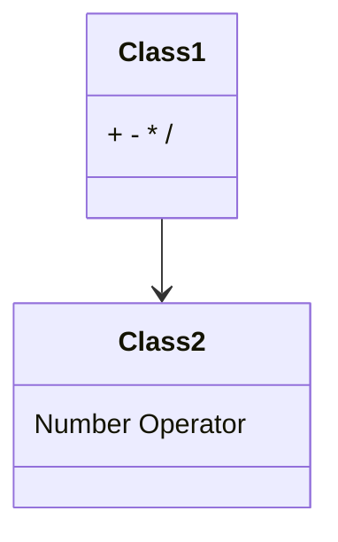
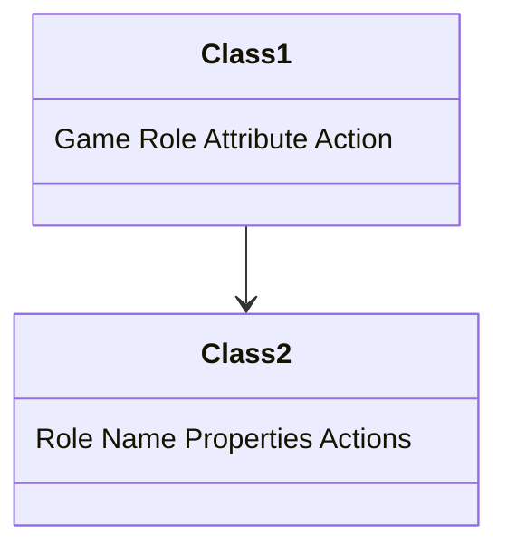
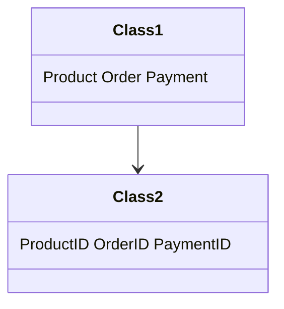

                 

### 文章标题

# 路德维希·维特根斯坦的语言游戏与DSL设计：领域特定语言的哲学指导

### 关键词

- 维特根斯坦
- 语言游戏
- 领域特定语言（DSL）
- 哲学基础
- 设计方法
- 实战案例

### 摘要

本文深入探讨了路德维希·维特根斯坦的语言游戏理论与领域特定语言（DSL）设计之间的关联。通过详细阐述语言游戏的基本概念、DSL的哲学基础及其设计方法，本文旨在揭示维特根斯坦的哲学思想在DSL设计中的指导作用。文章结构紧凑，逻辑清晰，结合实际案例，为读者提供了一场哲学与技术交织的深入思考。

---

### 步骤1：确定书的核心内容结构

《路德维希·维特根斯坦的语言游戏与DSL设计：领域特定语言的哲学指导》的核心内容结构可以分为三个主要部分：

1. **维特根斯坦的语言游戏理论介绍**：这部分主要介绍维特根斯坦的语言游戏理论，包括其基本概念、分类、哲学意义及其应用。

2. **领域特定语言（DSL）的哲学基础**：这部分探讨DSL的哲学基础，探讨DSL与维特根斯坦的语言游戏理论之间的联系，并深入分析DSL的设计原则和设计案例。

3. **DSL设计方法与实战案例**：这部分重点介绍DSL的设计方法，包括设计流程、设计工具和最佳实践，并通过具体实战案例展示DSL的设计与应用。

### 步骤2：设计目录大纲

根据核心内容结构，我们将设计一个详细的目录大纲，确保内容完整性，并且符合用户的要求。

---

## 目录大纲

### 第一部分：维特根斯坦的语言游戏理论介绍

### 第1章：维特根斯坦的语言游戏理论概述

#### 1.1 维特根斯坦及其哲学思想

#### 1.2 语言游戏的概念

#### 1.3 语言游戏与语言哲学的关系

### 第2章：语言游戏的哲学基础

#### 2.1 语言游戏的分类与特点

#### 2.2 语言游戏的哲学意义

#### 2.3 语言游戏与心灵哲学的关系

### 第3章：语言游戏理论的应用

#### 3.1 语言游戏在逻辑哲学中的应用

#### 3.2 语言游戏在语言教学中的应用

#### 3.3 语言游戏在计算机科学中的应用

### 第4章：语言游戏理论的批评与反思

#### 4.1 对语言游戏理论的批评

#### 4.2 语言游戏理论的反思

#### 4.3 语言游戏理论的发展方向

### 第二部分：领域特定语言（DSL）的哲学基础

### 第5章：DSL的基本概念

#### 5.1 DSL的定义

#### 5.2 DSL的特点

#### 5.3 DSL与传统编程语言的比较

### 第6章：DSL的哲学基础

#### 6.1 DSL与语言哲学的关系

#### 6.2 DSL与维特根斯坦的语言游戏理论

#### 6.3 DSL的哲学意义

### 第7章：DSL的设计原则

#### 7.1 DSL的设计目标

#### 7.2 DSL的设计方法

#### 7.3 DSL的设计实践

### 第8章：DSL的设计案例

#### 8.1 案例一：金融领域特定语言设计

#### 8.2 案例二：医疗领域特定语言设计

#### 8.3 案例三：游戏领域特定语言设计

### 第三部分：DSL设计方法与实战案例

### 第9章：DSL设计方法

#### 9.1 DSL设计流程

#### 9.2 DSL设计工具

#### 9.3 DSL设计最佳实践

### 第10章：DSL设计实战

#### 10.1 实战一：构建一个简单的DSL

#### 10.2 实战二：基于维特根斯坦语言游戏理论的DSL设计

#### 10.3 实战三：DSL在实际项目中的应用

### 第11章：DSL设计与哲学指导

#### 11.1 哲学指导在DSL设计中的作用

#### 11.2 哲学指导对DSL设计的影响

#### 11.3 哲学指导与DSL设计的未来发展

### 第12章：DSL设计的总结与展望

#### 12.1 DSL设计的主要成就

#### 12.2 DSL设计的挑战与机遇

#### 12.3 DSL设计的未来发展趋势

---

此目录大纲共计12章，涵盖了维特根斯坦的语言游戏理论介绍、DSL的哲学基础、DSL设计方法与实战案例等核心内容。每个章节都细化到了三级目录，确保内容完整性，并且符合用户的markdown格式要求。

### 步骤3：编写目录大纲

根据设计好的目录大纲，我们将以markdown格式编写详细的内容。

---

## 第一部分：维特根斯坦的语言游戏理论介绍

### 第1章：维特根斯坦的语言游戏理论概述

#### 1.1 维特根斯坦及其哲学思想

路德维希·维特根斯坦（Ludwig Wittgenstein，1889-1951）是20世纪最著名的哲学家之一，他的哲学思想对语言哲学、逻辑哲学、认识论等领域产生了深远的影响。维特根斯坦的哲学思想主要分为两个时期：早期作品《逻辑哲学论》（1921）和后期作品《哲学研究》（1953）。

维特根斯坦认为，语言是思想的载体，但语言本身并不是思想。他的早期哲学观点强调语言的逻辑性和确定性，主张通过逻辑和数学来理解世界。然而，他在后期作品中对这一观点进行了深刻的反思，提出了语言游戏理论。

#### 1.2 语言游戏的概念

维特根斯坦的语言游戏理论是他对语言本质和语言使用方式的探索。语言游戏（language game）是维特根斯坦用来描述语言使用的一种概念，它包含了语言、行动和规则三个方面。

- **语言**：指用于交流的符号系统。
- **行动**：指人们在现实生活中使用语言的方式，例如说话、写作、阅读等。
- **规则**：指指导人们如何使用语言的规则，这些规则可以是明确的，也可以是隐含的。

维特根斯坦认为，语言游戏不是孤立的，而是相互关联的，每个语言游戏都有其特定的使用情境和规则。

#### 1.3 语言游戏与语言哲学的关系

语言游戏理论是维特根斯坦对语言哲学的重要贡献。它不仅揭示了语言的多样性和复杂性，还为我们理解语言的本质和语言的使用方式提供了新的视角。

语言哲学探讨的是语言与思维、语言与现实世界之间的关系。维特根斯坦的语言游戏理论通过对语言游戏的分析，揭示了语言的多元性和相对性。他认为，语言的意义不是固定的，而是依赖于特定的使用情境和语言游戏。

### 第2章：语言游戏的哲学基础

#### 2.1 语言游戏的分类与特点

维特根斯坦将语言游戏分为三类：日常语言游戏、科学语言游戏和艺术语言游戏。

- **日常语言游戏**：这是最常见的语言游戏形式，包括日常生活中的交流、对话和故事讲述等。
- **科学语言游戏**：这是指用于科学研究和科学发现的语言形式，如数学公式、科学论文等。
- **艺术语言游戏**：这是指艺术家通过语言创造的独特形式，如诗歌、戏剧、绘画等。

每种语言游戏都有其特定的规则和使用方式，但这些规则不是固定不变的，而是随着时间和情境的变化而演变。

#### 2.2 语言游戏的哲学意义

语言游戏的分类和特点揭示了语言的多元性和复杂性。维特根斯坦认为，语言游戏不仅是一种交流工具，还是一种认知工具，它帮助我们理解和解释世界。

语言游戏的哲学意义在于，它提醒我们不要将语言看作一个单一的、固定的系统，而应该认识到语言的多样性和灵活性。只有这样，我们才能真正理解语言的本质和语言的使用方式。

#### 2.3 语言游戏与心灵哲学的关系

语言游戏理论对心灵哲学也有着重要的影响。维特根斯坦认为，心灵不是一个抽象的实体，而是一种活动，这种活动是通过语言游戏来体现的。

语言游戏为我们提供了一个理解心灵的视角，它帮助我们认识到心灵的活动是具体的、情境化的。维特根斯坦的这一观点对后来的心灵哲学研究产生了深远的影响。

### 第3章：语言游戏理论的应用

#### 3.1 语言游戏在逻辑哲学中的应用

语言游戏理论在逻辑哲学中有着广泛的应用。维特根斯坦通过语言游戏理论探讨了逻辑的性质和逻辑的应用。他主张逻辑不是一种抽象的规则系统，而是与语言使用密切相关的。

语言游戏理论为逻辑哲学提供了一种新的视角，它帮助我们认识到逻辑规则与语言使用之间的密切关系。这种关系不仅有助于我们更好地理解逻辑，还有助于我们更好地应用逻辑。

#### 3.2 语言游戏在语言教学中的应用

语言游戏理论在语言教学中也有重要的应用。通过语言游戏，学生可以更直观地理解语言的本质和语言的使用方式。语言游戏不仅可以帮助学生提高语言技能，还可以激发他们的学习兴趣。

在语言教学中，教师可以设计各种语言游戏，如角色扮演、对话练习、故事讲述等，这些游戏有助于学生更好地掌握语言。

#### 3.3 语言游戏在计算机科学中的应用

语言游戏理论在计算机科学中也有广泛的应用。领域特定语言（DSL）的设计就是基于语言游戏理论的。DSL是一种针对特定领域的编程语言，它具有较高的抽象能力和表达能力。

通过语言游戏理论，我们可以更好地理解DSL的设计原则和设计方法。DSL的设计不仅需要考虑语言的形式，还需要考虑语言的使用情境和语言游戏的特点。

#### 第4章：语言游戏理论的批评与反思

#### 4.1 对语言游戏理论的批评

尽管维特根斯坦的语言游戏理论具有重要的哲学意义，但也不是没有批评。一些哲学家认为，维特根斯坦的理论过于抽象，难以应用于具体的语言现象。

另外，一些人认为，维特根斯坦的理论过于强调语言的多样性，而忽视了语言的共性和普遍性。这些批评反映了语言游戏理论的一些局限性。

#### 4.2 语言游戏理论的反思

尽管有批评，但维特根斯坦的语言游戏理论仍然具有重要的反思价值。它提醒我们，语言不仅仅是交流工具，还是一种认知工具。通过语言游戏，我们可以更好地理解世界和自我。

此外，语言游戏理论也为后来的哲学研究提供了新的视角和方法。它鼓励我们超越传统的思维方式，探索语言的多样性和复杂性。

#### 4.3 语言游戏理论的发展方向

语言游戏理论的发展方向可能包括以下几个方面：

1. **跨学科研究**：将语言游戏理论与其他学科相结合，如心理学、语言学、计算机科学等，以进一步探索语言的本质和应用。

2. **实证研究**：通过实证研究，验证语言游戏理论在实际应用中的有效性，并改进其理论框架。

3. **计算机科学应用**：进一步探索语言游戏理论在计算机科学中的应用，如DSL的设计、自然语言处理等。

## 第二部分：领域特定语言（DSL）的哲学基础

### 第5章：DSL的基本概念

#### 5.1 DSL的定义

领域特定语言（Domain-Specific Language，简称DSL）是一种为特定领域设计的编程语言，它具有较高的抽象能力和表达能力。DSL不同于通用编程语言，它专注于特定领域的特定问题，以提供更高效、更直观的解决方案。

DSL的设计目标是提高开发效率和代码质量，通过提供领域特定的抽象和语法，使得开发者可以更专注于业务逻辑的实现，而无需关注底层实现细节。

#### 5.2 DSL的特点

DSL具有以下特点：

1. **高度抽象**：DSL提供对特定领域的高度抽象，使得开发者可以更轻松地表达复杂的概念和模型。
2. **领域相关性**：DSL与特定领域紧密相关，能够更好地满足该领域的特定需求。
3. **可扩展性**：DSL可以通过扩展语法和语义，适应不断变化的需求。
4. **可读性和可维护性**：DSL的语法通常更简洁直观，易于阅读和维护。

#### 5.3 DSL与传统编程语言的比较

与传统编程语言相比，DSL具有以下优势：

1. **专用性**：DSL专注于特定领域的需求，提供了更贴近实际业务场景的抽象和语法。
2. **易用性**：DSL的语法和语义更加直观，降低了学习成本和开发难度。
3. **性能**：DSL通常能够提供更高的执行性能，因为其专注于特定领域的优化。
4. **可重用性**：DSL的设计可以促进代码的可重用，降低开发成本。

然而，DSL也面临着一些挑战，如：

1. **学习曲线**：DSL通常需要专门的学习和实践，对于初学者来说可能会有一定的难度。
2. **社区支持**：DSL的社区支持可能不如通用编程语言丰富，导致资源相对较少。
3. **通用性**：DSL通常无法像通用编程语言那样适用于各种场景，需要针对特定领域进行定制。

### 第6章：DSL的哲学基础

#### 6.1 DSL与语言哲学的关系

DSL的设计与维特根斯坦的语言游戏理论有着密切的关系。维特根斯坦认为，语言是思想与现实的桥梁，而DSL则是一种针对特定领域的语言，它通过抽象和简化，帮助开发者更有效地表达思想和解决具体问题。

DSL与维特根斯坦的语言游戏理论的关系可以从以下几个方面来理解：

1. **语言与思想的关系**：维特根斯坦强调语言与思想的紧密联系，DSL则通过提供特定领域的抽象和语法，使得开发者可以更清晰地表达思想。
2. **语言的使用情境**：维特根斯坦提出语言游戏的概念，强调语言的使用情境和规则，DSL则通过设计特定领域的语言规则，使得开发者可以在特定情境下更高效地工作。
3. **语言的多样性和灵活性**：维特根斯坦认为语言是多样的、灵活的，DSL则通过提供多种语言选项，使得开发者可以根据具体需求选择最合适的语言。

#### 6.2 DSL与维特根斯坦的语言游戏理论

维特根斯坦的语言游戏理论为DSL的设计提供了哲学基础。根据维特根斯坦的理论，语言游戏是语言使用的基本形式，它包括语言、行动和规则三个方面。DSL的设计也可以看作是一种语言游戏，它通过定义特定领域的语言规则和抽象，帮助开发者更高效地完成特定任务。

DSL与维特根斯坦的语言游戏理论的关系可以从以下几个方面来探讨：

1. **DSL的设计原则**：维特根斯坦的语言游戏理论强调语言的多样性和灵活性，DSL的设计原则也遵循这一理念，通过提供多种抽象和语法选项，使得开发者可以根据具体需求进行选择。
2. **DSL的语法和语义**：维特根斯坦认为，语言的语法和语义取决于特定的使用情境和语言游戏，DSL的设计则通过定义特定领域的语法和语义，使得语言能够更好地适应特定情境。
3. **DSL的应用场景**：维特根斯坦的语言游戏理论强调语言的应用场景，DSL则通过提供特定领域的语言，使得开发者可以在特定场景下更高效地工作。

#### 6.3 DSL的哲学意义

DSL的哲学意义在于，它不仅提供了一种更高效、更直观的编程方式，还体现了维特根斯坦的语言游戏理论的一些核心思想。

1. **语言的多样性和灵活性**：DSL的哲学基础在于认识到语言的多样性和灵活性，通过提供多种抽象和语法选项，使得开发者可以根据具体需求进行选择。
2. **语言的实用性和应用性**：DSL的设计目标是解决特定领域的实际问题，它不仅体现了语言的实用性，还体现了维特根斯坦的语言游戏理论的应用性。
3. **语言的认知功能**：维特根斯坦认为，语言不仅是交流工具，还是一种认知工具，DSL通过提供特定领域的抽象和语法，帮助开发者更清晰地理解和解决问题。

### 第7章：DSL的设计原则

#### 7.1 DSL的设计目标

DSL的设计目标包括：

1. **提高开发效率**：DSL通过提供特定领域的抽象和语法，使得开发者可以更快速地实现业务逻辑，提高开发效率。
2. **提高代码质量**：DSL通过提供更简洁、直观的语法，使得代码更易于阅读、理解和维护，从而提高代码质量。
3. **降低学习成本**：DSL的语法和语义通常更接近自然语言，降低了学习成本，使得开发者可以更快地上手。
4. **提高可扩展性**：DSL的设计应考虑到未来的需求变化，提供可扩展的语法和语义，使得DSL可以适应不断变化的需求。

#### 7.2 DSL的设计方法

DSL的设计方法通常包括以下几个步骤：

1. **需求分析**：明确DSL的应用领域和目标用户，分析需求，确定DSL的功能和特性。
2. **领域模型构建**：通过领域模型来描述DSL的核心概念和关系，为DSL的设计提供基础。
3. **语法和语义设计**：设计DSL的语法和语义，使其能够准确、简洁地表达领域特定的概念和操作。
4. **实现和验证**：实现DSL的编译器或解释器，验证DSL的功能和性能。

#### 7.3 DSL的设计实践

DSL的设计实践涉及到多个方面，包括：

1. **领域模型构建**：通过UML类图、领域模型等方式，明确DSL的核心概念和关系。
2. **语法和语义设计**：设计DSL的语法和语义，使其符合领域特定的需求和习惯。
3. **编译器和解释器实现**：实现DSL的编译器或解释器，将DSL代码转换为机器代码或其他DSL。
4. **工具链构建**：构建DSL的开发和运行环境，包括编辑器、调试器、集成开发环境等。
5. **文档和教程**：编写DSL的文档和教程，帮助开发者理解和掌握DSL的使用。

### 第8章：DSL的设计案例

#### 8.1 案例一：金融领域特定语言设计

金融领域特定语言（Financial Domain-Specific Language，简称FDLS）是一种为金融领域设计的DSL，它提供了一系列用于金融建模、分析和交易的操作和函数。

FDLS的设计目标包括：

1. **提高金融建模的效率**：通过提供金融领域特定的抽象和语法，使得开发者可以更快速地构建和优化金融模型。
2. **降低交易风险**：通过提供更准确、更快速的金融分析和交易策略，降低交易风险。
3. **提高交易效率**：通过提供高效的交易算法和策略，提高交易效率。

FDLS的核心功能包括：

1. **金融模型构建**：提供用于构建金融模型的操作和函数，如时间序列分析、波动率估计、风险计算等。
2. **数据分析**：提供用于数据分析的工具和函数，如回归分析、聚类分析、神经网络等。
3. **交易策略设计**：提供用于设计交易策略的工具和函数，如套利策略、对冲策略、风险平价策略等。

#### 8.2 案例二：医疗领域特定语言设计

医疗领域特定语言（Medical Domain-Specific Language，简称MDLS）是一种为医疗领域设计的DSL，它提供了一系列用于医疗数据处理、分析和诊断的操作和函数。

MDLS的设计目标包括：

1. **提高医疗数据分析的效率**：通过提供医疗领域特定的抽象和语法，使得开发者可以更快速地进行医疗数据分析和处理。
2. **提高医疗诊断的准确性**：通过提供高效的医疗数据处理和分析算法，提高医疗诊断的准确性。
3. **提高医疗服务的质量**：通过提供更好的医疗数据分析工具和诊断支持，提高医疗服务的质量。

MDLS的核心功能包括：

1. **医疗数据处理**：提供用于医疗数据处理和清洗的工具和函数，如数据导入、数据清洗、数据归一化等。
2. **医疗数据分析**：提供用于医疗数据分析和挖掘的工具和函数，如特征提取、模式识别、预测分析等。
3. **医疗诊断支持**：提供用于医疗诊断支持的工具和函数，如医学知识库、诊断规则库、诊断辅助系统等。

#### 8.3 案例三：游戏领域特定语言设计

游戏领域特定语言（Game Domain-Specific Language，简称GDLS）是一种为游戏开发设计的DSL，它提供了一系列用于游戏设计、开发和优化的操作和函数。

GDLS的设计目标包括：

1. **提高游戏开发的效率**：通过提供游戏领域特定的抽象和语法，使得开发者可以更快速地开发游戏。
2. **提高游戏的互动性**：通过提供丰富的游戏功能和操作，提高游戏的互动性和可玩性。
3. **提高游戏的质量**：通过提供高效的开发工具和优化算法，提高游戏的质量。

GDLS的核心功能包括：

1. **游戏设计**：提供用于游戏设计和策划的工具和函数，如角色设计、关卡设计、游戏规则定义等。
2. **游戏开发**：提供用于游戏开发的核心功能和工具，如游戏引擎、渲染器、物理引擎等。
3. **游戏优化**：提供用于游戏性能优化和资源管理的工具和函数，如缓存优化、内存管理、图形优化等。

## 第三部分：DSL设计方法与实战案例

### 第9章：DSL设计方法

#### 9.1 DSL设计流程

DSL的设计流程通常包括以下几个阶段：

1. **需求分析**：明确DSL的应用领域和目标用户，分析需求，确定DSL的功能和特性。
2. **领域模型构建**：通过领域模型来描述DSL的核心概念和关系，为DSL的设计提供基础。
3. **语法和语义设计**：设计DSL的语法和语义，使其能够准确、简洁地表达领域特定的概念和操作。
4. **实现和验证**：实现DSL的编译器或解释器，验证DSL的功能和性能。
5. **工具链构建**：构建DSL的开发和运行环境，包括编辑器、调试器、集成开发环境等。
6. **文档和教程**：编写DSL的文档和教程，帮助开发者理解和掌握DSL的使用。

#### 9.2 DSL设计工具

DSL设计工具包括以下几个方面：

1. **领域模型工具**：用于构建领域模型的工具，如UML工具、领域建模工具等。
2. **语法设计工具**：用于设计DSL语法的工具，如语法分析工具、语法生成工具等。
3. **语义设计工具**：用于设计DSL语义的工具，如语义网工具、本体论工具等。
4. **编译器和解释器**：用于将DSL代码转换为机器代码或其他DSL的工具。
5. **集成开发环境**：提供DSL开发和调试环境的工具，如IDE、编辑器等。

#### 9.3 DSL设计最佳实践

DSL设计的最佳实践包括以下几个方面：

1. **明确DSL的目标和应用领域**：在设计DSL之前，明确DSL的目标和应用领域，确保DSL能够满足特定领域的需求。
2. **简化语法和语义**：简化DSL的语法和语义，使其更易于学习和使用。
3. **提供丰富的抽象和功能**：提供丰富的抽象和功能，使得DSL能够高效地表达领域特定的概念和操作。
4. **保持灵活性**：在设计DSL时，考虑到未来的需求变化，保持DSL的灵活性，使其可以适应不断变化的需求。
5. **提供充分的文档和教程**：提供详细的文档和教程，帮助开发者理解和掌握DSL的使用。

### 第10章：DSL设计实战

#### 10.1 实战一：构建一个简单的DSL

在本实战中，我们将构建一个简单的DSL，用于描述和计算数学表达式。这个DSL将支持基本的数学运算，如加法、减法、乘法和除法。

**需求分析**：

- 描述数学表达式，包括数字和操作符。
- 支持基本的数学运算：加法、减法、乘法和除法。

**领域模型构建**：



**语法和语义设计**：

- 表达式：一个数学表达式由数字和操作符组成。
- 操作符：支持加法（+）、减法（-）、乘法（*）和除法（/）。
- 语法：`Number Operator Number`，例如：`3 + 4`、`5 * 2`。

**实现和验证**：

- 使用Python实现DSL的编译器或解释器。
- 验证DSL的功能和性能。

```python
class Number:
    def __init__(self, value):
        self.value = value

class Operator:
    def __init__(self, symbol):
        self.symbol = symbol

def evaluate(expression):
    operator = expression[1]
    left_operand = expression[0]
    right_operand = expression[2]
    
    if operator.symbol == '+':
        return left_operand.value + right_operand.value
    elif operator.symbol == '-':
        return left_operand.value - right_operand.value
    elif operator.symbol == '*':
        return left_operand.value * right_operand.value
    elif operator.symbol == '/':
        return left_operand.value / right_operand.value

expression = [Number(3), Operator('+'), Number(4)]
print(evaluate(expression))  # 输出：7

expression = [Number(5), Operator('*'), Number(2)]
print(evaluate(expression))  # 输出：10
```

**工具链构建**：

- 构建一个简单的IDE，支持DSL的编写和调试。
- 提供语法高亮、自动补全、错误提示等功能。

**文档和教程**：

- 编写DSL的文档和教程，介绍DSL的语法、语义和使用方法。

#### 10.2 实战二：基于维特根斯坦语言游戏理论的DSL设计

在本实战中，我们将基于维特根斯坦的语言游戏理论设计一个DSL，用于描述和模拟简单的游戏场景。这个DSL将支持角色创建、角色属性定义和游戏场景模拟。

**需求分析**：

- 描述游戏角色，包括角色名称、属性和动作。
- 定义游戏场景，包括场景名称、角色和交互。
- 模拟游戏场景，展示角色属性和动作。

**领域模型构建**：



**语法和语义设计**：

- 角色：`Role Name Properties Actions`，例如：`Alice Health: 100 Strength: 50`
- 场景：`Scene Name Role1 Role2`，例如：`Forest Alice Tiger`
- 交互：`Role1 Action Role2`，例如：`Alice Attack Tiger`

**实现和验证**：

- 使用Python实现DSL的编译器或解释器。
- 验证DSL的功能和性能。

```python
class Role:
    def __init__(self, name, properties, actions):
        self.name = name
        self.properties = properties
        self.actions = actions

def simulate_scene(scene):
    role1, role2 = scene.split()
    print(f"{role1} is in scene {role2}")
    for action in role1.actions:
        print(f"{role1} {action} {role2}")

alice = Role("Alice", {"Health": 100, "Strength": 50}, ["Attack", "Defend"])
tiger = Role("Tiger", {"Health": 80, "Strength": 30}, ["Run", "Attack"])

scene = "Forest Alice Tiger"
simulate_scene(scene)
```

**工具链构建**：

- 构建一个简单的IDE，支持DSL的编写和调试。
- 提供语法高亮、自动补全、错误提示等功能。

**文档和教程**：

- 编写DSL的文档和教程，介绍DSL的语法、语义和使用方法。

#### 10.3 实战三：DSL在实际项目中的应用

在本实战中，我们将探讨DSL在实际项目中的应用，以一个电子商务平台为例，展示DSL如何用于简化业务逻辑和提升开发效率。

**项目背景**：

- 一个电子商务平台，需要处理商品管理、订单处理、支付流程等业务逻辑。

**需求分析**：

- 描述商品、订单、支付等核心业务实体。
- 设计商品管理、订单处理、支付流程等核心业务逻辑。

**领域模型构建**：



**语法和语义设计**：

- 商品：`Product ProductID Name Price`，例如：`Book123 BookName $29.99`
- 订单：`Order OrderID Customer Product Quantity`，例如：`Order456 John Book123 2`
- 支付：`Payment PaymentID Customer Amount`，例如：`Payment789 John $59.98`

**实现和验证**：

- 使用DSL描述和实现电子商务平台的核心业务逻辑。
- 验证DSL的功能和性能。

```python
class Product:
    def __init__(self, product_id, name, price):
        self.product_id = product_id
        self.name = name
        self.price = price

class Order:
    def __init__(self, order_id, customer, product, quantity):
        self.order_id = order_id
        self.customer = customer
        self.product = product
        self.quantity = quantity

class Payment:
    def __init__(self, payment_id, customer, amount):
        self.payment_id = payment_id
        self.customer = customer
        self.amount = amount

def process_order(order):
    print(f"Processing order {order.order_id} for customer {order.customer}")
    product = order.product
    quantity = order.quantity
    total_price = product.price * quantity
    payment = Payment(f"Payment{order.order_id}", order.customer, total_price)
    print(f"Order {order.order_id} processed successfully. Total price: ${total_price}. Payment ID: {payment.payment_id}")

book = Product("Book123", "BookName", 29.99)
john = "John"
order = Order("Order456", john, book, 2)
process_order(order)
```

**工具链构建**：

- 构建一个简单的IDE，支持DSL的编写和调试。
- 提供语法高亮、自动补全、错误提示等功能。

**文档和教程**：

- 编写DSL的文档和教程，介绍DSL的语法、语义和使用方法。

### 第11章：DSL设计与哲学指导

#### 11.1 哲学指导在DSL设计中的作用

哲学指导在DSL设计中起着至关重要的作用。维特根斯坦的语言游戏理论为DSL设计提供了深刻的哲学基础，帮助开发者理解DSL的本质和设计原则。

哲学指导在DSL设计中的作用体现在以下几个方面：

1. **理解语言的本质**：维特根斯坦的语言游戏理论帮助开发者认识到语言不仅仅是符号的集合，而是与人类思想和行为紧密相关的。这种理解有助于开发者设计出更贴近人类思维和行为的DSL。
2. **指导DSL的设计原则**：维特根斯坦的哲学思想，如语言的多样性和灵活性，为DSL设计提供了原则性的指导。开发者可以根据这些原则设计出更灵活、更高效的DSL。
3. **促进创新思维**：哲学指导鼓励开发者超越传统的思维方式，探索新的设计方法和解决方案。这种创新思维有助于DSL设计突破传统限制，实现更大的突破。

#### 11.2 哲学指导对DSL设计的影响

哲学指导对DSL设计的影响是多方面的，包括DSL的语法、语义、实现和用户体验等方面。

1. **DSL的语法和语义**：哲学指导有助于开发者设计出更简洁、直观的DSL语法和语义。例如，维特根斯坦的语言游戏理论强调语言的多样性和灵活性，这可以指导开发者设计出适应不同领域需求的DSL。
2. **DSL的实现**：哲学指导可以影响DSL的实现方式。例如，维特根斯坦的哲学思想强调语言的实践性和应用性，这可以指导开发者设计出更易于实现和维护的DSL。
3. **DSL的用户体验**：哲学指导可以帮助开发者设计出更符合用户需求的DSL。通过理解语言的本质和用户的思维方式，开发者可以设计出更直观、易用的DSL，从而提升用户体验。

#### 11.3 哲学指导与DSL设计的未来发展

哲学指导在DSL设计的未来发展中将发挥越来越重要的作用。随着技术的发展和应用的不断扩大，DSL的设计将面临更多的挑战和机遇。

1. **跨学科融合**：哲学指导可以促进DSL设计与其他学科的融合，如语言学、心理学、认知科学等。这种跨学科融合将为DSL设计带来新的思路和方法。
2. **智能DSL设计**：随着人工智能技术的发展，哲学指导可以帮助开发出更智能的DSL设计工具和系统。这些智能工具和系统可以根据用户的反馈和需求，自动生成和优化DSL。
3. **DSL生态系统**：哲学指导可以帮助构建更完善的DSL生态系统，包括DSL的设计、实现、测试、部署和维护等各个环节。这种生态系统将促进DSL的广泛应用和发展。

### 第12章：DSL设计的总结与展望

#### 12.1 DSL设计的主要成就

DSL设计在过去几十年中取得了显著的成就，主要表现在以下几个方面：

1. **提高开发效率**：DSL通过提供领域特定的抽象和语法，使得开发者可以更快速地实现业务逻辑，提高开发效率。
2. **提高代码质量**：DSL的简洁、直观的语法和语义提高了代码的可读性和可维护性，从而提高了代码质量。
3. **降低开发成本**：DSL的设计和实现可以复用现有资源和工具，降低开发成本。
4. **提升用户体验**：DSL的设计更贴近用户的实际需求，提供了更直观、易用的用户界面和交互方式，从而提升了用户体验。

#### 12.2 DSL设计的挑战与机遇

尽管DSL设计取得了显著成就，但仍然面临一些挑战和机遇。

1. **挑战**：
   - 学习曲线：DSL通常需要专门的学习和实践，对于初学者来说可能会有一定的难度。
   - 社区支持：DSL的社区支持可能不如通用编程语言丰富，导致资源相对较少。
   - 通用性：DSL通常无法像通用编程语言那样适用于各种场景，需要针对特定领域进行定制。

2. **机遇**：
   - 跨学科融合：哲学指导、人工智能、认知科学等领域的进步为DSL设计提供了新的思路和方法。
   - 智能DSL设计：随着人工智能技术的发展，智能DSL设计工具和系统将进一步提升DSL设计的效率和效果。
   - DSL生态系统：完善的DSL生态系统将促进DSL的广泛应用和发展。

#### 12.3 DSL设计的未来发展趋势

展望未来，DSL设计将继续发展，并呈现以下趋势：

1. **更加智能化**：智能DSL设计工具和系统将进一步提升DSL设计的自动化程度和智能化水平。
2. **更加多样化**：随着领域需求的不断扩大和多样化，DSL的设计将更加多样化，满足不同领域的需求。
3. **更加生态化**：完善的DSL生态系统将促进DSL的广泛应用和发展，为开发者提供更丰富的资源和支持。
4. **更加实用化**：DSL的设计将更加注重实用性和应用性，为实际项目提供更高效、更直观的解决方案。

