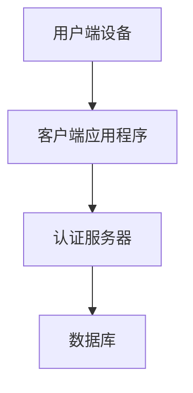
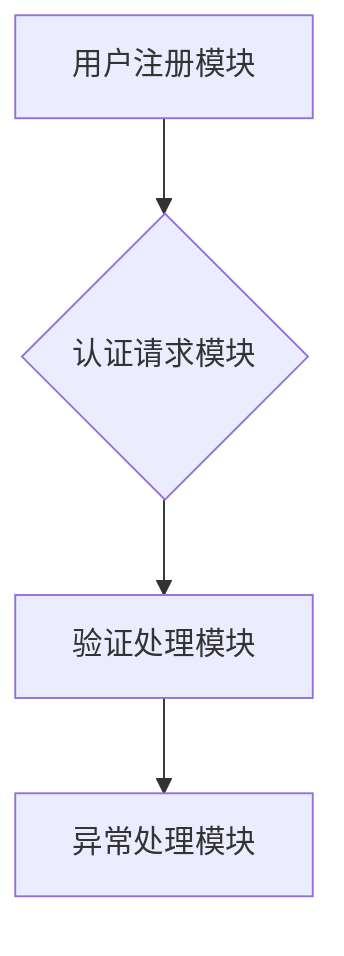
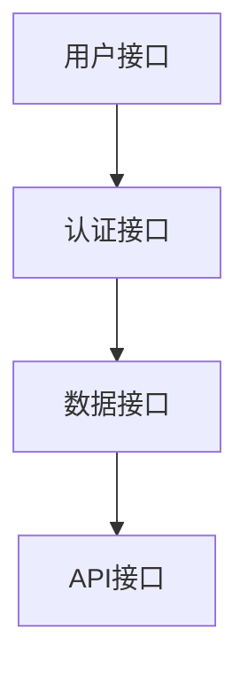

                 


### Introduction and Background

**Title:** Identity Authentication: Multi-Factor Authentication and Biometric Technologies

**Keywords:** Identity Authentication, Multi-Factor Authentication, Biometric Technologies, Security, Privacy

**Abstract:**
In today's digital age, identity authentication has become a cornerstone of security across various domains. This article delves into the concepts and applications of multi-factor authentication (MFA) and biometric technologies, essential tools in ensuring secure access to digital resources. We will explore the core principles, implementation strategies, and future trends of these technologies, addressing both their benefits and challenges.

### Core Concepts and Principles

**Definition and Importance of Identity Authentication:**
Identity authentication refers to the process of verifying the identity of a user or entity attempting to access a digital resource or system. It is crucial for maintaining security and preventing unauthorized access. With the rise of digital transformation, ensuring secure identity verification has become increasingly challenging due to the growing number of cyber threats.

**Introduction to Multi-Factor Authentication (MFA):**
Multi-factor authentication (MFA) is a security mechanism that requires users to provide two or more verification factors to gain access to a resource. These factors typically fall into three categories: something you know (e.g., passwords), something you have (e.g., a smartphone or security token), and something you are (e.g., biometric data). MFA significantly enhances security by adding layers of verification beyond a simple username and password.

**Fundamentals of Biometric Technologies:**
Biometric technologies involve the use of unique biological characteristics to verify identity. These include fingerprint recognition, facial recognition, iris recognition, and voice recognition. Each of these methods relies on capturing and analyzing specific physiological or behavioral traits to ensure accurate identification.

### Multi-Factor Authentication

**Types of Factors in MFA:**
- **Knowledge factors:** These include passwords, PINs, and answers to security questions.
- **Possession factors:** These include physical tokens (e.g., smart cards, USB keys) and digital tokens (e.g., one-time passwords sent via SMS or generated by apps like Google Authenticator).
- **Inherence factors:** These include biometric data like fingerprints, facial features, iris patterns, and voiceprints.

**Examples and Case Studies:**
- **Financial Institutions:** Many banks and financial services companies use MFA to secure their online banking platforms, combining passwords with one-time codes sent to users' smartphones.
- **Healthcare:** Electronic health records (EHR) systems often employ MFA to ensure that only authorized medical professionals can access sensitive patient information.

### Biometric Technologies

**Types of Biometric Technologies:**
- **Fingerprint Recognition:** Analyzes the unique patterns of ridges and valleys on a person's finger.
- **Facial Recognition:** Uses machine learning algorithms to identify facial features and match them against stored templates.
- **Iris Recognition:** Analyzes the patterns of the iris, the colored part of the eye, for identity verification.
- **Voice Recognition:** Compares a user's voice pattern to a stored sample to verify identity.

**Principles and Challenges:**
- **Fingerprint Recognition:** High accuracy and ease of use, but concerns about hygiene and the potential for fake fingerprints.
- **Facial Recognition:** Widely adopted for its convenience and non-intrusive nature, but prone to errors under varying lighting conditions and with changes in appearance.
- **Iris Recognition:** High accuracy and speed, but requires specialized equipment for scanning.
- **Voice Recognition:** Reliable under various acoustic conditions, but can be affected by noise and changes in voice quality.

### Implementations and Integrations

**Implementation Strategies:**
- **Hybrid Approaches:** Combining multiple factors for enhanced security, such as using a password and a biometric scan.
- **User Experience Considerations:** Ensuring that the authentication process is seamless and does not overly inconvenience users.

**Integration Challenges:**
- **Technical Integration:** Integrating MFA and biometric systems into existing infrastructure can be complex and require significant investment.
- **User Adoption:** Encouraging users to adopt new authentication methods can be challenging, especially if they perceive them as cumbersome.

### Security and Privacy Considerations

**Security Concerns:**
- **Data Breaches:** Ensuring that stored biometric data is securely encrypted and protected from unauthorized access.
- **Insider Threats:** Mitigating the risk of internal personnel exploiting authentication vulnerabilities.

**Privacy Concerns:**
- **Data Collection:** Clearly communicating to users what data is collected and how it is used.
- **Data Retention:** Implementing strict data retention policies to minimize the risk of data misuse.

### Future Trends and Challenges

**Future Trends:**
- **Advancements in AI and Machine Learning:** Enhancing the accuracy and efficiency of biometric technologies.
- **Wearable Technology:** Expanding the use of biometric authentication through wearable devices like smartwatches and earbuds.

**Challenges:**
- **Scalability:** Ensuring that MFA and biometric systems can handle large user populations.
- **Regulatory Compliance:** Navigating the evolving landscape of data protection regulations.

### Conclusion and Best Practices

**Summary:**
Identity authentication, through multi-factor authentication and biometric technologies, is crucial for securing digital resources in an era of increasing cyber threats. While these technologies offer significant advantages, they also pose challenges related to security, privacy, and user experience.

**Best Practices:**
- **Layered Approach:** Implement a multi-layered security strategy that combines various factors.
- **User Education:** Educate users about the importance of strong passwords and the proper use of biometric technologies.
- **Regular Updates:** Keep authentication systems and biometric algorithms up-to-date to counter emerging threats.

**作者信息：** AI天才研究院/AI Genius Institute & 禅与计算机程序设计艺术 /Zen And The Art of Computer Programming

## 文章标题：身份认证：多因素认证和生物识别技术

### 文章关键词：
- 身份认证
- 多因素认证
- 生物识别技术
- 安全
- 隐私

### 摘要：
本文深入探讨了身份认证在当今数字时代的重要性，详细阐述了多因素认证（MFA）和生物识别技术的核心概念、应用原理、实施策略以及未来发展趋势。文章旨在帮助读者理解这些技术在提高网络安全方面的作用，同时揭示其潜在的安全和隐私挑战。

## 目录

### 引言与背景
- 数字时代身份认证的重要性
- MFA和生物识别技术的应用场景

### 核心概念与原则
- 身份认证的定义与作用
- 多因素认证的基本原理
- 生物识别技术的定义与分类

### 多因素认证
- 知识因素、拥有因素与固有因素的探讨
- MFA在实际应用中的案例与效果

### 生物识别技术
- 指纹识别、面部识别、虹膜识别等技术的原理与挑战
- 各类生物识别技术的优缺点分析

### 实施与集成
- MFA和生物识别技术的实施策略
- 技术集成中的挑战与解决方案

### 安全与隐私考虑
- MFA和生物识别技术的安全挑战
- 隐私保护的最佳实践

### 未来趋势与挑战
- 人工智能与机器学习在生物识别技术中的应用
- 生物识别技术的发展方向与面临的挑战

### 结论与最佳实践
- MFA和生物识别技术的核心要点总结
- 实施身份认证系统的最佳实践建议

## 引言与背景

在当今的数字时代，身份认证已经成为维护网络安全和数据完整性的一项基本措施。随着网络犯罪手段的不断升级和用户对个人信息安全需求的日益增长，传统的单一身份验证方式（如用户名和密码）已不足以应对复杂的安全威胁。因此，多因素认证（MFA）和生物识别技术应运而生，成为现代网络安全体系中的重要组成部分。

### 数字时代身份认证的重要性

随着互联网的普及和电子商务的迅猛发展，人们的日常生活和工作越来越依赖数字平台。无论是银行转账、在线购物，还是访问企业资源，身份认证都是保障信息安全的第一道防线。身份认证的成功与否直接关系到用户的隐私、财务安全以及企业的数据完整性。以下是一些身份认证在数字时代的重要性体现：

1. **防止未经授权的访问**：有效的身份认证系统能够阻止恶意攻击者、间谍软件和黑客获取敏感信息，从而保护用户和企业的数据安全。

2. **增强用户信心**：在电子商务和在线服务领域，安全可靠的认证系统能够提升用户的信任度和满意度，促进业务的健康发展。

3. **合规性要求**：随着数据保护法规（如欧盟的《通用数据保护条例》（GDPR）和《加州消费者隐私法》（CCPA））的实施，许多企业需要采用多因素认证来符合法规要求。

4. **保护知识产权**：在研发和创新领域，知识产权的保护至关重要。有效的身份认证能够确保研发成果的安全，防止知识产权被侵犯。

### MFA和生物识别技术的应用场景

多因素认证（MFA）和生物识别技术作为现代身份认证体系的重要组成部分，各自具有独特的优势和适用场景。

**多因素认证（MFA）：**

MFA通过要求用户在登录时提供两种或两种以上的验证因素，从而极大地提高了安全级别。常见的MFA因素包括：

1. **知识因素**：如密码、PIN码、答案到安全问题等，用户知道的信息。
2. **拥有因素**：如手机、安全令牌、USB密钥等，用户拥有的物品。
3. **固有因素**：如指纹、面部识别、虹膜识别等，用户的生物特征。

MFA的应用场景非常广泛，以下是一些典型的例子：

- **金融领域**：银行和金融机构广泛使用MFA来确保用户在访问在线银行服务时的安全。
- **医疗保健**：医疗信息系统使用MFA来保护敏感的病人记录，确保只有授权的医疗人员能够访问。
- **云服务**：云服务提供商采用MFA来保护用户的云存储和数据。

**生物识别技术：**

生物识别技术利用人体的独特生物特征来进行身份验证，常见的生物识别技术包括：

- **指纹识别**：通过分析指纹的独特纹路进行身份验证。
- **面部识别**：通过识别面部特征，如眼睛、鼻子、嘴巴和面部轮廓。
- **虹膜识别**：通过分析虹膜的纹理和颜色模式。
- **声音识别**：通过分析声音的频谱和特征来识别个人。

生物识别技术在多个领域得到了应用：

- **安全门禁系统**：企业和组织使用指纹或面部识别门禁系统来控制人员出入。
- **移动支付**：手机支付服务如Apple Pay和Google Pay使用指纹或面部识别来确保交易的安全性。
- **公共安全**：警方和海关等部门使用面部识别技术来追踪犯罪嫌疑人或验证旅客身份。

### MFA和生物识别技术的结合

随着技术的发展，MFA和生物识别技术的结合逐渐成为一种趋势。通过将多种认证因素相结合，如要求用户输入密码并扫描指纹，或者使用面部识别后再发送手机验证码，可以极大地提高系统的安全性，同时确保用户体验的便捷性。这种多层次的认证方式不仅能够抵御各种类型的攻击，还能提高用户对服务的信任度。

总之，身份认证在数字时代的重要性不言而喻。MFA和生物识别技术作为现代身份认证体系的重要组成部分，不仅提高了安全级别，还为用户提供了更加便捷的身份验证方式。随着技术的不断进步，这些技术在未来的应用前景将更加广阔。

## 核心概念与原则

在深入探讨多因素认证（MFA）和生物识别技术之前，我们需要先明确一些核心概念和原理，以便为后续讨论奠定基础。

### 身份认证的定义与作用

身份认证是指验证用户身份的过程，确保只有授权用户能够访问受保护的资源。这一过程通常包括验证用户的用户名和密码、指纹、面部特征或其他生物特征。身份认证的核心作用是防止未经授权的访问，保护系统免受恶意攻击和数据泄露。

**身份认证的关键要素：**

- **唯一性**：每个用户都应有唯一的身份标识，以确保认证系统的准确性。
- **不可伪造性**：身份认证系统应能够有效识别并阻止伪造身份的企图。
- **不可复用性**：认证信息（如密码）应难以被复制或重复使用。

### 多因素认证的基本原理

多因素认证（MFA）是一种多层次的身份验证机制，要求用户在登录时提供两种或两种以上的验证因素，从而显著提高系统的安全性。MFA的基本原理可以概括为“知道、拥有、是”三类验证因素：

- **知道（Knowledge）**：用户知道的信息，如密码、PIN码、答案到安全问题等。
- **拥有（Possession）**：用户拥有的物品，如手机、安全令牌、USB密钥等。
- **是（Inherence）**：用户的生物特征，如指纹、面部识别、虹膜识别、声音识别等。

**MFA的工作流程：**

1. **第一步：用户提交用户名和密码（知识因素）进行初步验证。**
2. **第二步：系统要求用户进行额外验证，如短信验证码、指纹扫描或面部识别（拥有因素或固有因素）。**
3. **第三步：通过多因素验证后，用户获得访问权限。**

### 生物识别技术的定义与分类

生物识别技术是基于人类生物特征的识别和验证技术，旨在通过独特生物特征进行身份认证。常见的生物识别技术包括：

- **指纹识别**：通过分析指纹的纹理和特征进行身份验证。
- **面部识别**：通过识别面部特征，如眼睛、鼻子、嘴巴和面部轮廓进行身份验证。
- **虹膜识别**：通过分析虹膜的纹理和颜色模式进行身份验证。
- **声音识别**：通过分析声音的频谱和特征进行身份验证。

**生物识别技术的特点：**

- **高准确性**：生物特征具有高度的个体差异，使得生物识别技术具有很高的识别准确性。
- **非转移性**：生物特征是用户的固有属性，无法复制或转移，从而提高了认证的安全性。
- **便利性**：生物识别技术通常操作简便，用户无需记忆复杂的密码或携带额外的认证工具。

**生物识别技术的分类：**

- **生理特征**：如指纹、面部识别、虹膜识别。
- **行为特征**：如签名、声音识别。

### 多因素认证与生物识别技术的结合

多因素认证和生物识别技术的结合能够提供更全面的安全保护。通过将知识因素、拥有因素和固有因素相结合，可以构建一个多层防御的系统，从而有效抵御各种形式的攻击。例如，一个典型的结合方式是要求用户输入密码（知识因素），扫描指纹（固有因素），并接收短信验证码（拥有因素），这种多层次的验证方式极大地提高了系统的安全性能。

总之，了解多因素认证和生物识别技术的核心概念和原理是理解其在现代网络安全体系中重要作用的基础。随着技术的不断发展，这些概念和原理将继续推动身份认证技术的进步，为用户提供更加安全、便捷的认证体验。

### 多因素认证

多因素认证（MFA）是现代网络安全领域的重要手段，它通过结合不同类型的验证因素来增强身份验证的安全性。MFA的核心思想是，即使某一验证因素被攻破，攻击者仍需突破其他验证因素，从而大大提高了攻击的难度和系统的整体安全性。

#### 知识因素

知识因素是指用户知道的信息，如密码、PIN码、答案到安全问题等。这些因素通常是最常见的验证手段，因为用户易于记忆和使用。然而，传统的单因素验证（仅依靠知识因素）在面对恶意攻击时显得脆弱，例如密码泄露、社会工程攻击等。因此，引入额外的验证因素成为提升安全性的必要手段。

**常见知识因素的例子：**
- **密码**：用户在注册时设置的一串字符组合，用于访问系统。
- **PIN码**：用户在银行ATM机或其他支付终端使用的个人识别码。
- **安全问题**：如“你出生的城市是什么？”等，用于辅助密码找回。

**知识因素的优缺点：**
- **优点：** 易于使用，用户无需携带任何额外设备，记忆负担较小。
- **缺点：** 容易泄露或被破解，特别是当用户选择弱密码或重复使用密码时。

#### 拥有因素

拥有因素是指用户拥有的物品，如手机、安全令牌、USB密钥等。这些物品可以是物理设备，也可以是数字令牌，如短信验证码、手机应用生成的临时密码等。拥有因素提供了额外的安全保障，因为攻击者需要获取用户的物理设备或控制用户的数字设备才能进行攻击。

**常见拥有因素的例子：**
- **手机**：通过短信验证码或手机应用生成的临时密码进行验证。
- **安全令牌**：如硬件令牌或手机上的软件令牌，用于生成一次性密码。
- **USB密钥**：插入电脑或终端设备，作为验证的一部分。

**拥有因素的优缺点：**
- **优点：** 能够提供高安全性，因为攻击者需要实际的物理访问权。
- **缺点：** 用户可能需要携带额外的设备，使用过程可能较为繁琐。

#### 固有因素

固有因素是指用户的生物特征，如指纹、面部识别、虹膜识别、声音识别等。这些因素是用户的固有属性，具有高度的个体差异性和不可复制性，因此被认为是非常安全的验证方式。

**常见固有因素的例子：**
- **指纹识别**：通过扫描指纹的纹理进行身份验证。
- **面部识别**：通过摄像头捕捉面部特征，使用算法进行分析。
- **虹膜识别**：通过扫描眼睛的虹膜图案进行身份验证。
- **声音识别**：通过麦克风捕捉声音特征，使用算法进行分析。

**固有因素的优缺点：**
- **优点：** 安全性高，用户无需记忆密码或携带设备。
- **缺点：** 可能需要额外的硬件设备，且在某些环境下（如光线不足、声音嘈杂）可能影响识别准确性。

#### MFA的实际应用

多因素认证在实际应用中展现出了显著的优势，特别是在需要高安全级别的领域，如金融、医疗和政府等。以下是一些实际应用的案例：

- **金融领域**：银行和金融机构通常要求用户在访问网上银行或移动银行应用时，提供密码（知识因素）以及手机验证码（拥有因素），甚至在某些情况下，还要求进行指纹或面部识别（固有因素）。
- **医疗保健**：医生和医疗工作人员在访问电子健康记录系统时，通常需要输入密码（知识因素），然后使用指纹或面部识别（固有因素）进行二次验证。
- **政府机构**：政府系统的访问通常需要复杂的MFA，可能包括密码（知识因素）、智能卡（拥有因素）以及指纹或虹膜识别（固有因素）。

**案例研究：**

**案例1：** 一个在线银行系统要求用户在登录时输入用户名和密码（知识因素），然后发送到用户手机上的短信验证码（拥有因素），最后扫描用户的指纹（固有因素）。这种方式结合了三种验证因素，大大提高了系统的安全性。

**案例2：** 一家大型医院的电子健康记录系统采用MFA进行访问控制。医生在登录时需要输入用户名和密码（知识因素），然后使用医院提供的智能卡进行身份验证（拥有因素），最后扫描指纹（固有因素）。

#### 结论

多因素认证（MFA）通过结合知识因素、拥有因素和固有因素，提供了更加安全、可靠的身份验证方式。它不仅提高了系统的安全性，还确保了用户体验的便捷性。随着技术的不断进步，MFA将在未来的身份认证体系中发挥更加重要的作用。

## 生物识别技术

生物识别技术是现代身份认证系统中的重要一环，通过利用人类独特的生理和行为特征进行身份验证，提供了一种高度安全且方便的身份验证方法。本文将详细介绍几种常见的生物识别技术，包括指纹识别、面部识别、虹膜识别和声音识别，并分析每种技术的原理、优缺点及其在实际应用中的挑战。

### 指纹识别

**原理：**
指纹识别技术基于人类指纹的独特纹理，通过扫描和提取指纹的细节特征，将其转换为数字模板进行比对。指纹识别设备通常包含光学传感器、电容传感器和超声波传感器等，可以捕捉指纹的二维或三维图像。

**优点：**
- **高准确性**：每个人的指纹都是独一无二的，指纹识别具有较高的识别准确性。
- **非转移性**：指纹无法复制或转移，增加了认证的安全性。
- **使用方便**：用户无需记忆复杂的密码或携带额外设备，只需扫描手指即可完成认证。

**缺点：**
- **卫生问题**：由于指纹识别需要直接接触手指，可能存在卫生问题，特别是在公共场合。
- **伪指纹攻击**：虽然相对较难，但攻击者仍可能通过伪造指纹来欺骗系统。

**应用场景：**
- **门禁系统**：企业、学校、医院等场所常使用指纹识别来控制人员出入。
- **手机和电脑**：许多智能设备采用指纹识别作为解锁方式，提供额外的安全层。

### 面部识别

**原理：**
面部识别技术通过摄像头捕捉面部图像，使用算法分析面部特征，如眼睛、鼻子、嘴巴和面部轮廓，以生成面部模板并进行比对。面部识别系统通常利用深度学习算法来提高识别准确性。

**优点：**
- **非接触式操作**：用户无需与设备接触，适合在公共场合使用。
- **快速响应**：面部识别速度较快，适合需要快速认证的场景。
- **高适应性**：能够适应不同光线和环境条件。

**缺点：**
- **外观变化影响**：面部特征的变化（如化妆、佩戴眼镜、年龄增长）可能影响识别准确性。
- **隐私问题**：大规模采集和使用面部数据可能引发隐私保护方面的争议。

**应用场景：**
- **安全门禁**：在需要高安全级别的场所，如政府机构、科研实验室等。
- **移动支付**：如Apple Pay和Google Pay等移动支付服务，使用面部识别进行支付确认。
- **公共监控**：在机场、火车站等公共场所，用于监控和身份验证。

### 虹膜识别

**原理：**
虹膜识别技术通过扫描眼睛的虹膜纹理和颜色模式进行身份验证。虹膜是眼睛内色素层的一部分，具有高度独特的纹理结构，而且不会因年龄或环境变化而改变。

**优点：**
- **高安全性**：虹膜识别具有极高的识别准确性，因为每个人的虹膜都是独一无二的。
- **稳定性**：虹膜特征稳定，不受年龄、光线、环境等因素的影响。
- **非接触式操作**：用户无需与设备接触，增加了安全性。

**缺点：**
- **设备成本高**：虹膜识别设备较为昂贵，需要专业设备进行扫描。
- **操作难度**：虹膜识别需要用户配合，眼睛对准设备，可能不如其他技术方便。

**应用场景：**
- **安全门禁**：在要求极高安全级别的场所，如银行金库、军事基地等。
- **边境控制**：机场、海关等边境控制场所常使用虹膜识别技术进行身份验证。

### 声音识别

**原理：**
声音识别技术通过麦克风捕捉声音信号，分析声音的频谱特征和音色，以生成声纹模板进行比对。声纹识别通常利用机器学习和深度学习算法来提高识别准确性。

**优点：**
- **非接触式操作**：用户无需与设备接触，适合远程认证。
- **便捷性**：用户可以通过电话或语音命令进行身份验证，操作简便。
- **适应性**：能够适应不同说话速度、语调和背景噪声。

**缺点：**
- **识别准确性受环境因素影响**：声音识别在嘈杂环境中的准确性可能较低。
- **安全性**：可能存在声音伪造的问题，需要结合其他验证因素。

**应用场景：**
- **电话银行**：用户可以通过电话进行身份验证，方便快捷。
- **智能助理**：如Amazon Alexa、Google Assistant等智能助手，使用声音识别进行用户身份验证。

### 总结

生物识别技术通过利用人类独特的生理和行为特征，提供了一种安全、便捷的身份验证方法。尽管每种技术都有其独特的优势和局限性，但它们的结合可以提供更全面的身份验证解决方案。随着技术的不断进步，生物识别技术将在未来的身份认证体系中发挥越来越重要的作用，同时需要不断解决其在隐私和安全方面的挑战。

### 实施与集成

在实现多因素认证（MFA）和生物识别技术时，必须考虑系统的整体架构、接口设计以及用户交互体验等多个方面，以确保这些技术在各种应用场景中都能有效运作。

#### 系统架构设计

系统架构设计是确保MFA和生物识别技术有效实施的关键。一个典型的系统架构包括以下核心组件：

1. **用户端设备**：包括用户的计算机、手机或其他设备，用于输入用户信息和生物特征。
2. **认证服务器**：负责处理认证请求，验证用户提供的多种验证因素，如密码、短信验证码、指纹或面部扫描。
3. **数据库**：存储用户身份信息和生物特征模板，如指纹数据、面部图像、声纹等。
4. **客户端应用程序**：用于与用户交互，收集用户输入的验证信息，并将信息发送到认证服务器。

**系统架构图：**



#### 系统功能设计

系统功能设计包括以下几个关键模块：

1. **用户注册模块**：用户首次使用系统时，需要进行注册，录入个人信息和生物特征数据。
2. **认证请求模块**：当用户尝试登录时，系统会要求用户提供多种验证因素，如密码、指纹、短信验证码等。
3. **验证处理模块**：认证服务器接收并处理用户的认证请求，通过比对用户提供的验证信息与数据库中的信息来验证用户身份。
4. **异常处理模块**：系统在识别到可疑活动或认证失败时，会触发相应的异常处理机制，如锁定账户或发送安全警告。

**系统功能设计图：**



#### 系统接口设计

系统接口设计是确保MFA和生物识别技术能够与其他系统有效集成的关键。以下是一些关键接口：

1. **用户接口**：用户通过客户端应用程序与系统进行交互，输入验证信息，如密码、指纹等。
2. **认证接口**：客户端应用程序与认证服务器之间的接口，用于传输用户验证信息。
3. **数据接口**：认证服务器与数据库之间的接口，用于存储和检索用户信息及生物特征数据。
4. **API接口**：系统对外提供的API接口，允许第三方应用程序或系统集成商使用MFA和生物识别技术。

**系统接口设计图：**



#### 用户交互体验

用户交互体验是影响MFA和生物识别技术普及和接受程度的重要因素。以下是一些关键考虑因素：

1. **简洁性**：认证流程应简洁直观，避免用户因复杂的操作而放弃使用。
2. **引导性**：系统应提供清晰的引导，帮助用户完成注册和认证过程。
3. **错误处理**：系统应能够有效地处理认证失败和异常情况，并给出明确的错误提示。
4. **安全性**：确保用户数据在传输和存储过程中的安全性，避免信息泄露。

**用户交互体验设计图：**

```mermaid
graph TB
A[注册引导] --> B[登录界面]
B --> C{输入密码|指纹扫描|短信验证码}
C --> D[认证成功/失败提示]
```

#### 实际应用场景

以下是一些典型的实际应用场景，展示了如何实施和集成MFA和生物识别技术：

1. **银行系统**：用户在登录网上银行时，需要输入用户名和密码，然后通过短信验证码和指纹识别进行二次验证，确保账户安全。
2. **移动支付**：用户在支付时，需要输入支付密码，并通过面部识别或指纹识别确认支付，提高支付安全性。
3. **企业门禁系统**：员工在进入办公区域时，需要进行面部识别或指纹识别，确保只有授权人员可以进入。

总之，实施和集成MFA和生物识别技术需要综合考虑系统架构、接口设计和用户交互体验等多个方面，以确保技术能够有效运作并得到用户的广泛接受。通过精心设计和优化，这些技术可以为用户提供安全、便捷的身份认证体验。

### 安全与隐私考虑

在多因素认证（MFA）和生物识别技术的应用中，安全性和隐私保护是至关重要的考虑因素。这些技术涉及用户敏感信息的收集、存储和处理，因此必须采取严格的措施来确保数据的安全性和用户隐私的保护。

#### 数据安全

数据安全涉及保护用户身份验证信息，防止未经授权的访问和数据泄露。以下是一些关键的安全措施：

1. **加密传输**：在用户数据传输过程中，使用SSL/TLS等加密协议来保护数据不被截获或篡改。
2. **数据加密存储**：用户身份验证信息（如指纹、面部图像、密码等）在数据库中应进行加密存储，确保即使数据库被攻破，攻击者也无法直接获取敏感数据。
3. **访问控制**：对存储用户信息的数据库实施严格的访问控制策略，只有经过授权的系统组件才能访问这些数据。
4. **异常检测**：系统应配备异常检测机制，实时监控异常行为，如频繁的登录失败尝试、异常的地理位置等，并及时采取安全措施。

#### 隐私保护

隐私保护涉及确保用户数据的合法收集、使用和共享。以下是一些关键的隐私保护措施：

1. **透明度**：告知用户哪些数据将被收集，如何使用，以及数据将被存储多久。
2. **数据最小化**：仅收集和存储必需的用户数据，避免过度收集。
3. **数据匿名化**：对用户数据进行匿名化处理，确保无法直接追溯到具体用户。
4. **用户控制权**：用户应有权访问和修改自己的数据，包括删除不再需要的个人数据。

#### 例子与分析

以下是一些实际案例，展示如何在不同场景下实施安全与隐私保护措施：

**案例1：** 银行系统的MFA
- **加密传输**：银行在用户登录时使用HTTPS加密传输数据，确保传输过程中的数据安全。
- **数据加密存储**：用户指纹和面部图像等敏感数据在数据库中以加密形式存储，使用AES-256加密算法。
- **访问控制**：数据库的访问权限仅授予必要的系统管理员，且这些访问行为会被严格审计。
- **异常检测**：系统实时监控登录行为，如检测到异常登录活动（例如，来自未知的IP地址或频繁失败的登录尝试），会发送警报并锁定账户。

**案例2：** 移动支付平台的面部识别
- **透明度**：支付平台在用户注册时详细说明将收集的面部数据用于身份验证，并告知用户如何删除或修改这些数据。
- **数据最小化**：只收集和存储面部图像的必要部分，用于身份验证，而非整个面部图像。
- **数据匿名化**：面部图像在处理和分析时会进行匿名化处理，确保无法直接识别个人身份。
- **用户控制权**：用户可以随时开启或关闭面部识别功能，并在需要时删除相关数据。

总之，在应用MFA和生物识别技术时，必须采取严格的安全和隐私保护措施。通过加密传输、数据加密存储、访问控制和异常检测等手段，可以有效保护用户数据的安全。同时，通过透明度、数据最小化、数据匿名化和用户控制权等措施，可以确保用户隐私得到有效保护。只有在安全和隐私方面做好充分准备，MFA和生物识别技术才能得到广泛的接受和应用。

### 未来趋势与挑战

随着技术的不断进步，多因素认证（MFA）和生物识别技术在身份认证领域展现出了广阔的应用前景。然而，这些技术的发展也伴随着一系列挑战，需要行业和研究人员共同努力应对。

#### 人工智能与机器学习在生物识别技术中的应用

人工智能（AI）和机器学习（ML）技术的发展为生物识别技术带来了新的机遇。通过深度学习算法，生物识别系统可以更加准确地识别用户的生物特征，提高识别的效率和准确性。例如，卷积神经网络（CNN）在面部识别中的应用显著提升了识别率，使得系统可以在更复杂的环境中仍然保持高准确性。此外，AI和ML还可以用于实时监控和异常检测，识别潜在的攻击行为，增强系统的安全性。

**未来趋势：**
1. **更精准的生物特征识别**：随着AI算法的优化，生物识别系统的识别精度将继续提升。
2. **自适应识别技术**：生物识别系统将能够根据用户的生物特征变化（如年龄增长、身体变化）进行自适应调整，提高长期稳定性。

**挑战：**
1. **隐私和数据保护**：AI和ML算法的部署需要大量用户数据，如何平衡数据利用与隐私保护是一个重大挑战。
2. **算法透明性和可解释性**：复杂的AI算法往往缺乏透明性，难以解释其决策过程，这可能导致用户对系统的信任度下降。

#### 可穿戴设备与生物识别技术的融合

可穿戴设备如智能手表和健康监测器正在逐渐普及，这些设备具备采集用户生物特征的能力，为生物识别技术的应用提供了新的场景。例如，智能手表可以通过心率、步数等数据实现身份认证，提高用户日常生活的便捷性。此外，可穿戴设备还可以集成多种生物特征识别技术，如指纹识别、面部识别、心率识别等，提供更加全面的安全保障。

**未来趋势：**
1. **更广泛的普及**：随着技术的成熟和成本的降低，生物识别功能将在更多的可穿戴设备中得到应用。
2. **个性化健康管理**：通过生物识别技术，可穿戴设备可以提供个性化的健康监测和健康管理服务。

**挑战：**
1. **功耗与续航**：生物识别技术的集成需要更高的功耗，如何在保持设备续航的同时实现高效识别是一个关键问题。
2. **数据安全和隐私**：可穿戴设备采集的用户数据量庞大，如何确保这些数据的安全和隐私成为亟待解决的问题。

#### 多层次防御与自适应认证系统

随着网络攻击手段的不断升级，单一的认证方式已难以满足安全需求。多因素认证和生物识别技术的结合，通过多层次防御策略，可以提供更加坚固的安全保障。自适应认证系统则根据用户行为和上下文环境动态调整认证强度，实现灵活、高效的身份验证。

**未来趋势：**
1. **智能化认证**：自适应认证系统将更加智能化，通过机器学习和大数据分析，动态调整认证策略，提供最优的安全保障。
2. **零信任架构**：在零信任架构下，任何请求都需要经过严格的验证，即使内部用户也不例外，这为MFA和生物识别技术的应用提供了新的场景。

**挑战：**
1. **用户体验**：多层次的认证过程可能会增加用户的使用复杂度，影响用户体验，需要寻找平衡点。
2. **技术集成**：实现多种认证技术的无缝集成和协调，需要克服技术上的挑战。

#### 结论

MFA和生物识别技术在未来的发展中将继续发挥重要作用，为身份认证提供更安全、更便捷的解决方案。然而，这些技术也面临诸多挑战，需要行业各方共同努力，通过技术创新、法规制定和用户教育等手段，确保技术的可持续发展。

### 结论与最佳实践

通过本文的详细探讨，我们可以清晰地看到，身份认证在现代网络安全体系中的核心地位。多因素认证（MFA）和生物识别技术作为增强身份验证安全性的有效手段，不仅提升了用户访问资源的安全性，还优化了用户体验。以下是一些最佳实践建议：

1. **综合使用多种验证因素**：结合知识因素（如密码）、拥有因素（如手机验证码）和固有因素（如指纹识别），构建多层次的防御体系，以应对各种类型的攻击。

2. **注重用户体验**：在实施MFA和生物识别技术时，应确保认证流程简洁直观，避免不必要的复杂操作，同时提供清晰的错误处理机制，减少用户困扰。

3. **安全与隐私并重**：在数据传输和存储过程中，严格采用加密技术，确保数据安全。同时，明确告知用户数据收集和使用目的，尊重用户隐私，并赋予用户对个人数据的控制权。

4. **持续更新与监控**：定期更新认证系统和算法，以应对新的安全威胁。同时，建立实时监控机制，及时发现和应对异常活动。

5. **培训与教育**：加强对用户的教育，提高其对安全认证方式的认识和接受度，培养安全意识，从而更好地利用这些技术。

总之，身份认证技术的发展为我们提供了更安全、更便捷的身份验证手段。然而，随着技术的不断进步，我们也需要不断适应和优化，以确保这些技术能够在实际应用中发挥最大效能。

### 注意事项与拓展阅读

在实施多因素认证（MFA）和生物识别技术时，以下注意事项对于确保系统的有效性和安全性至关重要：

1. **设备兼容性**：确保所使用的认证设备与操作系统和应用程序兼容，避免因设备不兼容导致的认证失败。
2. **用户培训**：为用户提供详细的操作指南，确保他们能够正确使用MFA和生物识别技术，减少因误操作导致的认证问题。
3. **定期评估与更新**：定期评估认证系统的性能和安全性，根据评估结果及时更新认证算法和系统配置，以应对新的安全威胁。
4. **应急响应计划**：制定应急预案，以应对可能的认证系统故障或用户认证失败情况，确保系统的稳定运行。

为了进一步深入理解MFA和生物识别技术的应用和实践，以下是一些拓展阅读推荐：

1. **《多因素认证：设计、实施与安全》**：这本书详细介绍了MFA的设计、实施方法和安全注意事项，适合希望深入了解MFA技术的读者。
2. **《生物识别技术导论》**：本书涵盖了生物识别技术的基本原理、应用场景和发展趋势，对于希望全面了解生物识别技术的读者具有很高的参考价值。
3. **《人工智能与安全》**：这本书探讨了人工智能在安全领域的应用，包括如何利用AI技术提高MFA和生物识别系统的安全性，适合对AI和安全领域感兴趣的读者。

通过这些资源和最佳实践，读者可以更好地理解并有效利用多因素认证和生物识别技术，提升网络安全水平。

