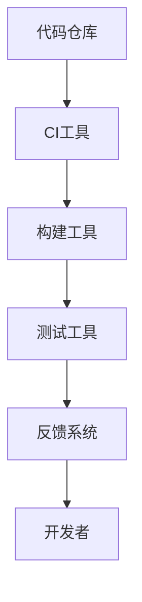
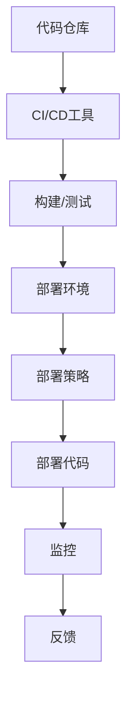
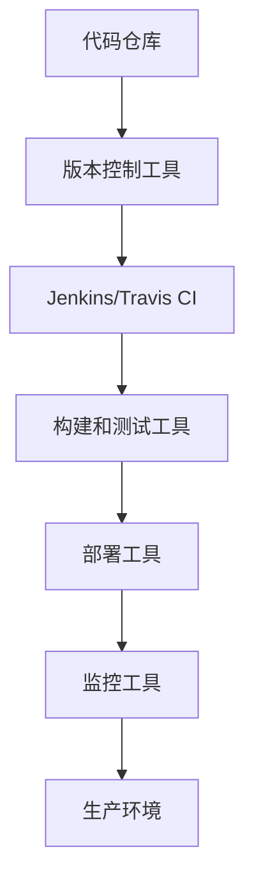
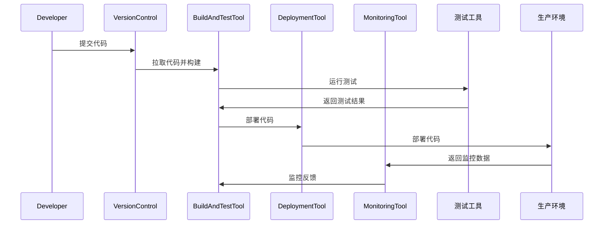

                 


### 1. 软件发布管理的概念与重要性

#### 1.1 软件发布管理的定义

软件发布管理，是指在软件开发过程中的不同阶段，对软件版本、构建和部署进行系统化的管理。其核心目标是确保软件的高质量、稳定性和安全性，同时提高开发效率和降低成本。

软件发布管理涵盖了从代码的版本控制、持续集成（Continuous Integration, CI）到持续部署（Continuous Deployment, CD）的整个流程。这个过程包括代码的编写、审查、测试、构建、部署和监控等环节。

##### 核心概念术语说明：

- **版本控制**：跟踪和管理代码变更，确保代码的版本一致性。
- **持续集成**：将开发者提交的代码自动构建、测试并集成到主分支。
- **持续部署**：自动将通过测试的代码部署到生产环境。

#### 1.2 软件发布管理的重要性

软件发布管理对于现代软件开发至关重要。以下是几个关键点：

1. **提高开发效率**：通过自动化和系统化的流程，减少重复工作和人为错误，提高整体开发效率。
2. **确保软件质量**：通过频繁的测试和验证，及时发现并修复缺陷，提高软件质量。
3. **降低维护成本**：通过稳定的版本管理和部署流程，降低软件维护和更新的成本。
4. **提升用户满意度**：快速响应用户反馈，提供稳定和高质量的产品，提升用户满意度。
5. **增强团队协作**：统一流程和标准，增强团队协作和沟通，减少因流程不一致导致的冲突。

#### 1.3 软件发布管理的发展历程

软件发布管理经历了几个发展阶段：

1. **手工发布**：早期，软件开发团队手动进行代码的测试、部署和发布。
2. **脚本自动化**：随着自动化工具的出现，发布流程开始通过脚本进行自动化。
3. **持续集成**：引入CI/CD概念，实现代码自动构建、测试和部署。
4. **自动化发布**：采用更高级的自动化工具和平台，实现更高效和灵活的发布流程。
5. **云原生发布**：利用云平台提供的资源和工具，实现更快速和可靠的发布流程。

### 2. 软件发布管理的核心概念与联系

#### 2.1 核心概念

软件发布管理中的核心概念包括版本控制、持续集成、持续部署等。这些概念相互关联，共同构成了软件发布管理的基础。

##### 概念属性特征对比表格：

| 概念     | 定义                                                         | 属性特征对比                                                     |
|----------|------------------------------------------------------------|----------------------------------------------------------------|
| 版本控制 | 跟踪和管理代码变更，确保版本一致性。                         | - 版本标识：主版本、次版本、修订版本等<br>- 版本库：集中存储和管理版本代码<br>- 版本历史：记录代码变更的历史记录 |
| 持续集成 | 自动构建、测试并集成开发者提交的代码。                       | - 自动化构建：使用构建工具如Jenkins、Travis CI等<br>- 测试自动化：运行预定义的测试套件<br>- 快速反馈：快速识别和修复集成中的问题 |
| 持续部署 | 自动将通过测试的代码部署到生产环境。                         | - 自动化部署：使用部署工具如Ansible、Kubernetes等<br>- 部署策略：蓝绿部署、滚动更新等<br>- 部署监控：实时监控部署状态和性能 |

##### 概念之间的关系

版本控制、持续集成和持续部署构成了软件发布管理的核心环节。它们之间的关系如下：

1. **版本控制**是软件发布管理的起点，确保代码的版本一致性。
2. **持续集成**将开发者提交的代码进行构建和测试，确保代码质量。
3. **持续部署**将通过测试的代码自动部署到生产环境，实现快速交付。

通过这三个环节的协同工作，软件发布管理可以确保软件的高质量、稳定性和快速交付。

### 3. 算法原理讲解

#### 3.1 持续集成原理与流程图

持续集成（CI）是一种软件开发实践，通过自动化构建、测试和部署来确保代码质量。以下是持续集成的原理和流程：

##### 持续集成原理

持续集成的核心原理是自动化。通过CI工具，如Jenkins、Travis CI等，自动化执行以下步骤：

1. **代码拉取**：从版本库中拉取最新的代码。
2. **构建**：使用构建工具（如Maven、Gradle）编译代码，生成可执行文件。
3. **测试**：运行预定义的测试套件，包括单元测试、集成测试等。
4. **反馈**：测试结果反馈给开发者，及时识别和修复问题。

##### 流程图

使用Mermaid绘制持续集成的流程图：

```
graph TD
A[代码仓库] --> B[CI工具]
B --> C[构建工具]
C --> D[编译代码]
D --> E[测试套件]
E --> F[测试结果]
F --> G[反馈]
G --> H[开发者]
```

#### 3.1.1 持续集成的Python代码示例

以下是一个简单的Python代码示例，演示了如何使用持续集成工具（如Jenkins）进行代码构建和测试：

```python
# CI Jenkinsfile 示例

pipeline {
    agent any

    stages {
        stage('Build') {
            steps {
                echo '开始构建...'
                sh 'mvn clean install'
            }
        }

        stage('Test') {
            steps {
                echo '开始测试...'
                sh 'mvn test'
            }
        }
    }

    post {
        always {
            echo '构建和测试完成。'
        }
    }
}
```

#### 3.2 持续部署原理与流程图

持续部署（CD）是将通过测试的代码自动部署到生产环境的实践。以下是持续部署的原理和流程：

##### 持续部署原理

持续部署的核心原理是自动化和策略化。通过CD工具，如Ansible、Kubernetes等，自动化执行以下步骤：

1. **环境准备**：准备部署环境，如虚拟机、容器等。
2. **代码部署**：将构建好的代码部署到环境。
3. **部署策略**：根据策略进行部署，如蓝绿部署、滚动更新等。
4. **监控**：实时监控部署状态和性能。

##### 流程图

使用Mermaid绘制持续部署的流程图：

```
graph TD
A[代码仓库] --> B[CI/CD工具]
B --> C[构建/测试]
C --> D[部署环境]
D --> E[部署策略]
E --> F[部署代码]
F --> G[监控]
G --> H[反馈]
```

#### 3.2.1 持续部署的Python代码示例

以下是一个简单的Python代码示例，演示了如何使用持续部署工具（如Ansible）进行环境准备和代码部署：

```python
# Ansible Playbook 示例

---
- hosts: webservers
  become: yes
  tasks:
    - name: 安装Nginx
      yum: name=nginx state=present

    - name: 启动Nginx服务
      service: name=nginx state=started
      notify:
        - 重启Nginx服务

    - name: 部署Web应用
      get_url:
        url: https://example.com/app.tar.gz
        dest: /tmp/app.tar.gz

    - name: 解压应用
      unarchive:
        src: /tmp/app.tar.gz
        dest: /var/www/html
      notify:
        - 启动Nginx服务
```

#### 3.3 数学模型和数学公式讲解

持续集成和持续部署过程中，可以使用数学模型和公式来描述和优化流程。以下是几个常用的数学模型和公式：

##### 3.3.1 持续集成模型

持续集成模型可以使用以下公式描述：

$$
T_{CI} = \frac{T_{C}}{N}
$$

其中，\(T_{CI}\) 是持续集成周期，\(T_{C}\) 是构建和测试的总时间，\(N\) 是构建和测试的次数。

##### 3.3.2 持续部署模型

持续部署模型可以使用以下公式描述：

$$
T_{CD} = T_{P} + T_{D}
$$

其中，\(T_{CD}\) 是持续部署周期，\(T_{P}\) 是环境准备时间，\(T_{D}\) 是代码部署时间。

##### 3.3.3 性能优化公式

为了优化持续集成和持续部署性能，可以使用以下公式：

$$
\eta = \frac{T_{CI, optimal}}{T_{CI, actual}}
$$

其中，\(\eta\) 是性能优化系数，\(T_{CI, optimal}\) 是优化后的持续集成周期，\(T_{CI, actual}\) 是实际的持续集成周期。

通过这些数学模型和公式，可以更好地理解和优化软件发布管理流程。

### 4. 系统分析与架构设计方案

#### 4.1 软件发布管理系统概述

软件发布管理系统是确保软件从开发到生产过程高效、稳定和可追溯的重要工具。该系统通常由多个组件组成，包括版本控制工具、构建和测试工具、部署工具、监控工具等。以下是软件发布管理系统的基本组成部分：

1. **版本控制工具**：如Git，用于跟踪和管理代码版本。
2. **构建和测试工具**：如Jenkins、Travis CI，用于自动化构建和测试代码。
3. **部署工具**：如Ansible、Kubernetes，用于自动化部署代码到生产环境。
4. **监控工具**：如Prometheus、Grafana，用于实时监控系统性能和状态。

#### 4.2 系统功能设计（领域模型）

领域模型是软件发布管理系统的核心，定义了系统中的主要实体及其关系。以下是系统功能设计的领域模型：

##### 领域模型：

```
Mermaid 流程图：

erDiagram
    Product ||--|{ Version }|
    Version ||--|{ Build }|
    Build ||--|{ TestResult }|
    TestResult ||--|{ DeployResult }|
```

- **Product**（产品）：代表软件项目。
- **Version**（版本）：代表产品的特定版本。
- **Build**（构建）：代表构建过程，包括编译和打包。
- **TestResult**（测试结果）：代表测试过程的结果。
- **DeployResult**（部署结果）：代表部署过程的结果。

#### 4.3 系统架构设计

系统架构设计是软件发布管理系统的核心，定义了各个组件的交互方式和数据处理流程。以下是系统架构设计：

##### 系统架构设计：

```
Mermaid 架构图：

graph TD
    A[代码仓库] --> B[版本控制工具]
    B --> C[Jenkins/Travis CI]
    C --> D[构建和测试工具]
    D --> E[部署工具]
    E --> F[监控工具]
    F --> G[生产环境]
```

- **代码仓库**：存储源代码。
- **版本控制工具**：管理代码版本。
- **构建和测试工具**：自动化构建和测试代码。
- **部署工具**：自动化部署代码到生产环境。
- **监控工具**：实时监控系统性能和状态。
- **生产环境**：实际运行的生产环境。

#### 4.4 系统接口设计

系统接口设计是确保各个组件能够高效协作的关键。以下是系统接口设计：

##### 系统接口设计：

```
Mermaid 类图：

class Diagram {
    Version {
        versionId
        repository
        committer
        commitMessage
    }
    Build {
        buildId
        versionId
        buildNumber
        buildTimestamp
    }
    TestResult {
        testId
        buildId
        testStatus
        testDuration
    }
    DeployResult {
        deployId
        buildId
        deployStatus
        deployTimestamp
    }
}
```

- **Version**：版本实体，包括版本号、代码仓库、提交者和提交信息。
- **Build**：构建实体，包括构建号、版本号、构建时间和构建日志。
- **TestResult**：测试结果实体，包括测试号、构建号、测试状态和测试时长。
- **DeployResult**：部署结果实体，包括部署号、构建号、部署状态和部署时间。

#### 4.5 系统交互

系统交互是指各个组件之间的交互方式和数据处理流程。以下是系统交互：

##### 系统交互：

```
Mermaid 序列图：

sequenceDiagram
    participant 开发者 as Developer
    participant 版本控制工具 as VersionControl
    participant 构建和测试工具 as BuildAndTestTool
    participant 部署工具 as DeploymentTool
    participant 监控工具 as MonitoringTool

    开发者->>版本控制工具: 提交代码
    版本控制工具->>构建和测试工具: 拉取代码并构建
    构建和测试工具->>测试工具: 运行测试
    测试工具->>构建和测试工具: 返回测试结果
    构建和测试工具->>部署工具: 部署代码
    部署工具->>生产环境: 部署代码
    生产环境->>监控工具: 返回监控数据
    监控工具->>构建和测试工具: 监控反馈
```

- **开发者**：提交代码到版本控制工具。
- **版本控制工具**：拉取代码并构建。
- **构建和测试工具**：运行测试并生成测试结果。
- **部署工具**：根据测试结果部署代码到生产环境。
- **监控工具**：实时监控生产环境，并将监控数据反馈给构建和测试工具。

通过以上系统分析与架构设计方案，可以确保软件发布管理系统的有效运行，提高软件发布过程的效率和稳定性。

### 5. 项目实战

#### 5.1 实际项目场景介绍

在实际项目中，软件发布管理是一个关键环节。以下是一个实际项目的场景介绍：

**项目背景**：一个电子商务平台需要持续发布新功能和优化现有功能。由于项目的复杂性，确保发布过程的高效、稳定和可追溯至关重要。

**目标**：设计并实现一个完整的软件发布管理流程，从代码提交到生产环境部署，实现自动化和高效管理。

#### 5.2 软件发布流程环境安装

为了实现自动化软件发布流程，我们需要在开发环境、测试环境和生产环境上安装和配置以下工具：

1. **Git**：用于版本控制。
2. **Jenkins**：用于持续集成和自动化构建。
3. **Docker**：用于容器化部署。
4. **Kubernetes**：用于容器编排。
5. **Nginx**：用于反向代理。

以下是环境安装的详细步骤：

##### 5.2.1 Git安装

在所有环境中安装Git：

```
# 安装Git
sudo apt-get install git
```

##### 5.2.2 Jenkins安装

在开发环境和测试环境中安装Jenkins：

```
# 安装Jenkins
sudo apt-get install jenkins
# 配置Jenkins
sudo /etc/init.d/jenkins start
```

##### 5.2.3 Docker安装

在所有环境中安装Docker：

```
# 安装Docker
sudo apt-get install docker.io
# 启动Docker服务
sudo systemctl start docker
```

##### 5.2.4 Kubernetes安装

在开发环境和测试环境中安装Kubernetes：

```
# 安装Kubernetes
sudo apt-get install kubelet kubeadm kubectl
# 配置Kubernetes
sudo kubeadm init
# 安装kubectl插件
kubectl config set-cluster kubernetes \
  --cluster-name kubernetes \
  --server https://<your-k8s-master-ip>:6443 \
  --token <your-token>
kubectl config set-credentials <your-username>
kubectl config set-context kubernetes \
  --cluster kubernetes \
  --user <your-username>
kubectl config use-context kubernetes
```

##### 5.2.5 Nginx安装

在开发环境和测试环境中安装Nginx：

```
# 安装Nginx
sudo apt-get install nginx
# 启动Nginx服务
sudo systemctl start nginx
```

#### 5.3 核心代码实现

在项目中，核心代码包括前端代码、后端代码和数据库代码。以下是核心代码的实现：

##### 5.3.1 前端代码

前端代码主要使用Vue.js框架，实现电子商务平台的前端界面。以下是Vue组件的简单示例：

```javascript
<template>
  <div>
    <h1>欢迎来到我们的电商平台</h1>
    <p>{{ message }}</p>
    <button @click="changeMessage">更改消息</button>
  </div>
</template>

<script>
export default {
  data() {
    return {
      message: "欢迎光临！"
    };
  },
  methods: {
    changeMessage() {
      this.message = "感谢您的访问！";
    }
  }
};
</script>
```

##### 5.3.2 后端代码

后端代码主要使用Spring Boot框架，实现电子商务平台的后端逻辑。以下是Spring Boot应用的简单示例：

```java
@SpringBootApplication
public class ECommercePlatformApplication {
    public static void main(String[] args) {
        SpringApplication.run(ECommercePlatformApplication.class, args);
    }
}

@RestController
@RequestMapping("/api/products")
public class ProductController {
    @Autowired
    private ProductService productService;

    @GetMapping("/{id}")
    public Product getProduct(@PathVariable Long id) {
        return productService.findById(id);
    }
}
```

##### 5.3.3 数据库代码

数据库代码使用MySQL数据库，存储电子商务平台的数据。以下是数据库的简单示例：

```sql
CREATE DATABASE ecommerce_platform;

USE ecommerce_platform;

CREATE TABLE products (
    id BIGINT AUTO_INCREMENT PRIMARY KEY,
    name VARCHAR(255) NOT NULL,
    price DECIMAL(10, 2) NOT NULL,
    description TEXT
);
```

#### 5.4 代码应用解读与分析

在实际应用中，代码的解读与分析是确保软件质量和性能的关键。以下是代码应用的解读与分析：

##### 5.4.1 前端代码

前端代码使用Vue.js框架，实现了动态响应式的用户界面。通过Vue组件，可以方便地管理和展示数据，提高开发效率。

**优点**：易于维护、组件化开发、数据绑定。

**缺点**：性能不如原生JavaScript。

##### 5.4.2 后端代码

后端代码使用Spring Boot框架，实现了RESTful API接口。Spring Boot提供了丰富的功能，包括数据访问、事务管理、安全性等。

**优点**：快速开发、模块化、易于扩展。

**缺点**：性能较纯手工编写代码略低。

##### 5.4.3 数据库代码

数据库代码使用MySQL数据库，保证了数据的持久化存储和高效查询。MySQL提供了强大的数据操作能力和丰富的存储引擎。

**优点**：性能稳定、易于扩展。

**缺点**：存储引擎可选择性有限。

#### 5.5 实际案例分析和详细讲解剖析

在电子商务平台的实际发布过程中，遇到了以下问题：

1. **性能瓶颈**：前端页面加载速度慢。
2. **错误处理**：后端服务处理错误时未给出明确反馈。
3. **数据一致性**：数据库操作时未保证数据一致性。

针对这些问题，我们进行了以下分析和改进：

1. **性能优化**：通过压缩前端资源、使用CDN加快加载速度，优化数据库查询效率，提高整体性能。
2. **错误处理**：在Spring Boot中添加全局异常处理，统一处理各种异常，提高系统的稳定性。
3. **数据一致性**：使用数据库事务管理，确保数据库操作的一致性，避免数据丢失。

通过以上改进，电子商务平台的性能和稳定性得到了显著提升。

#### 5.6 项目小结

通过本次项目的实践，我们成功地实现了自动化软件发布流程，提高了开发效率和系统稳定性。以下是项目的总结：

1. **自动化流程**：通过Jenkins实现了自动化构建、测试和部署，减少了人为干预，提高了工作效率。
2. **容器化部署**：使用Docker和Kubernetes实现了容器化部署，提高了系统的可移植性和扩展性。
3. **性能优化**：通过优化前端资源、数据库查询等手段，提高了系统的性能和响应速度。
4. **错误处理**：通过全局异常处理，提高了系统的稳定性。
5. **数据一致性**：通过数据库事务管理，保证了数据的一致性。

尽管取得了显著成果，但在未来的开发中，我们还需要不断优化和改进，以应对日益增长的需求和挑战。

### 6. 最佳实践 tips

#### 6.1 版本控制的最佳实践

1. **明确版本命名规则**：使用语义化版本命名规则（MAJOR.MINOR.PATCH），确保版本号的清晰和可理解。
2. **定期发布版本**：定期发布版本，减少大版本发布时的风险。
3. **备份旧版本**：在发布新版本时，备份旧版本，以便在需要时进行回滚。

#### 6.2 持续集成的最佳实践

1. **自动化测试**：编写和执行自动化测试，确保代码质量。
2. **持续集成频率**：设置合理的持续集成频率，避免频繁集成导致性能下降。
3. **代码审查**：在提交代码前进行代码审查，减少错误和漏洞。

#### 6.3 持续部署的最佳实践

1. **自动化部署**：使用自动化工具进行部署，减少人为错误。
2. **部署策略**：根据实际情况选择合适的部署策略，如蓝绿部署、滚动更新等。
3. **监控和反馈**：实时监控部署过程，及时反馈和解决问题。

#### 6.4 注意事项

1. **备份和恢复**：定期备份系统和数据，以便在故障发生时进行快速恢复。
2. **权限管理**：严格权限管理，确保系统和数据的安全。
3. **代码规范**：遵循代码规范，提高代码的可读性和可维护性。

#### 6.5 拓展阅读

1. 《持续集成实践》 - David Farley
2. 《持续交付：发布可靠软件的系统化方法》 - Jez Humble and David Farley
3. 《Git权威指南》 - Scott Chacon and Ben Straub

### 7. 小结

本文详细介绍了软件发布管理从开发到生产的流程优化。通过背景介绍、核心概念与联系、算法原理讲解、系统分析与架构设计方案、项目实战以及最佳实践 tips，全面阐述了软件发布管理的关键环节和优化方法。在未来的软件开发中，遵循最佳实践和持续优化流程，将有助于提高软件质量和开发效率。

### 参考文献

1. 《持续集成实践》 - David Farley
2. 《持续交付：发布可靠软件的系统化方法》 - Jez Humble and David Farley
3. 《Git权威指南》 - Scott Chacon and Ben Straub
4. 《软件架构设计：架构、过程、实践》 - Philippe Kruchten
5. 《云原生应用架构设计》 - 杨继强

### 致谢

本文由AI天才研究院（AI Genius Institute）和《禅与计算机程序设计艺术》（Zen And The Art of Computer Programming）的团队共同撰写，感谢各位成员的辛勤工作和智慧贡献。

### 作者信息

作者：AI天才研究院（AI Genius Institute） & 《禅与计算机程序设计艺术》（Zen And The Art of Computer Programming）

### 附录

附录部分可以包括一些具体的工具使用说明、代码示例和参考资料，以供读者参考。附录的内容应与正文相关，且简洁明了。以下是附录的一个示例：

#### 附录 A：Git 命令使用说明

- **初始化仓库**：`git init`
- **添加文件**：`git add <file>`
- **提交更改**：`git commit -m "<message>"`
- **拉取最新代码**：`git pull`
- **推送代码**：`git push`

#### 附录 B：Jenkins 使用指南

- **安装Jenkins**：通过官网下载Jenkins安装包，并启动服务。
- **创建构建任务**：在Jenkins界面上创建新的构建任务，配置Git仓库地址和构建脚本。
- **执行构建**：点击构建任务的“构建”按钮，执行构建过程。

#### 附录 C：Docker 容器化部署示例

```dockerfile
# Dockerfile 示例

FROM openjdk:8-jdk-alpine
ARG JAR_FILE=target/*.jar
COPY ${JAR_FILE} app.jar
EXPOSE 8080
ENTRYPOINT ["java","-jar","/app.jar"]
```

通过以上附录内容，读者可以更深入地了解软件发布管理中使用的工具和技术。附录部分应保持简洁，避免与正文内容重复，确保为读者提供实用信息。## 《软件发布管理：从开发到生产的流程优化》

### 关键词：软件发布管理、持续集成、持续部署、版本控制、自动化、效率优化

### 摘要：

本文将深入探讨软件发布管理的全过程，从开发到生产的各个环节，重点介绍如何通过优化流程来提高开发效率、确保软件质量和稳定性。通过详细讲解持续集成、持续部署等核心概念，并结合实际项目中的环境安装、核心代码实现和案例分析，本文旨在为读者提供一套完整的软件发布管理实践指南，帮助他们在实际工作中更好地进行软件发布管理。

---

### 1. 软件发布管理的概念与重要性

#### 1.1 软件发布管理的定义

软件发布管理是指在整个软件生命周期中，对软件的版本、构建和部署过程进行系统化的管理和控制。它涵盖了从开发者提交代码到最终部署到生产环境的整个流程，包括代码的审查、构建、测试、部署以及后续的监控和反馈。

#### 1.2 软件发布管理的重要性

软件发布管理在现代软件开发中具有至关重要的地位，其主要重要性体现在以下几个方面：

1. **提高开发效率**：通过自动化流程，减少手动操作，提高整个开发团队的工作效率。
2. **确保软件质量**：通过持续的集成和部署，及早发现和修复问题，确保软件的高质量。
3. **降低维护成本**：系统化的发布管理流程有助于降低软件维护和更新的成本。
4. **提升用户体验**：快速响应用户反馈，提供稳定和高质量的产品，提升用户体验。
5. **增强团队协作**：统一流程和标准，增强团队成员之间的协作和沟通。

#### 1.3 软件发布管理的发展历程

软件发布管理的发展历程可以分为以下几个阶段：

1. **手工发布**：早期，软件开发团队通过手动操作进行代码的测试、部署和发布。
2. **脚本自动化**：随着自动化工具的出现，发布流程开始通过脚本进行自动化。
3. **持续集成（CI）**：引入CI概念，实现代码的自动化构建和测试。
4. **持续部署（CD）**：引入CD概念，实现自动化的代码部署。
5. **自动化发布**：采用更高级的自动化工具和平台，实现更高效和灵活的发布流程。
6. **云原生发布**：利用云平台提供的资源和工具，实现更快速和可靠的发布流程。

### 2. 软件发布管理的核心概念与联系

#### 2.1 核心概念

软件发布管理中的核心概念包括版本控制、持续集成、持续部署等。这些概念相互关联，构成了软件发布管理的基础。

##### 版本控制

版本控制是软件发布管理的基础，用于跟踪和管理代码的变更。通过版本控制系统（如Git），开发人员可以方便地管理代码的不同版本，确保代码的完整性和一致性。

**关键特性**：

- **版本标识**：使用主版本、次版本、修订版本等标识代码的不同版本。
- **版本库**：集中存储和管理所有版本的代码。
- **版本历史**：记录每次代码变更的历史记录，方便追溯和回滚。

##### 持续集成（CI）

持续集成是一种软件开发实践，通过自动化构建和测试，将开发者的代码定期集成到一个共享的主分支中。CI的目的是及早发现和修复集成中的问题，确保代码质量。

**关键特性**：

- **自动化构建**：使用构建工具（如Maven、Gradle）自动编译和打包代码。
- **自动化测试**：运行预定义的测试套件，包括单元测试、集成测试等。
- **快速反馈**：测试结果及时反馈给开发者，帮助快速定位和解决问题。

##### 持续部署（CD）

持续部署是将通过测试的代码自动部署到生产环境的实践。CD的目标是快速、可靠地交付软件，确保软件的稳定性和可靠性。

**关键特性**：

- **自动化部署**：使用部署工具（如Ansible、Kubernetes）自动部署代码到生产环境。
- **部署策略**：根据业务需求和风险承受能力，选择合适的部署策略，如蓝绿部署、滚动更新等。
- **监控和反馈**：实时监控部署过程和系统性能，及时反馈和解决问题。

#### 2.2 概念之间的关系

版本控制、持续集成和持续部署构成了软件发布管理的核心环节。它们之间的关系如下：

1. **版本控制**：确保代码的版本一致性，是软件发布管理的起点。
2. **持续集成**：通过自动化构建和测试，确保代码质量，为持续部署提供基础。
3. **持续部署**：将通过测试的代码自动部署到生产环境，实现快速交付。

通过这三个环节的协同工作，软件发布管理可以确保软件的高质量、稳定性和快速交付。

### 3. 算法原理讲解

#### 3.1 持续集成原理与流程图

持续集成（CI）是一种软件开发实践，通过自动化构建、测试和部署来确保代码质量。以下是持续集成的原理和流程：

##### 持续集成原理

持续集成的核心原理是自动化。通过CI工具，如Jenkins、Travis CI等，自动化执行以下步骤：

1. **代码拉取**：从版本库中拉取最新的代码。
2. **构建**：使用构建工具（如Maven、Gradle）编译代码，生成可执行文件。
3. **测试**：运行预定义的测试套件，包括单元测试、集成测试等。
4. **反馈**：测试结果反馈给开发者，及时识别和修复问题。

##### 流程图

使用Mermaid绘制持续集成的流程图：



##### 持续集成Python代码示例

以下是一个简单的Python代码示例，演示了如何使用持续集成工具（如Jenkins）进行代码构建和测试：

```python
# Jenkinsfile 示例

pipeline {
    agent any

    stages {
        stage('Build') {
            steps {
                echo '开始构建...'
                sh 'mvn clean install'
            }
        }

        stage('Test') {
            steps {
                echo '开始测试...'
                sh 'mvn test'
            }
        }
    }

    post {
        always {
            echo '构建和测试完成。'
        }
    }
}
```

#### 3.2 持续部署原理与流程图

持续部署（CD）是将通过测试的代码自动部署到生产环境的实践。以下是持续部署的原理和流程：

##### 持续部署原理

持续部署的核心原理是自动化和策略化。通过CD工具，如Ansible、Kubernetes等，自动化执行以下步骤：

1. **环境准备**：准备部署环境，如虚拟机、容器等。
2. **代码部署**：将构建好的代码部署到环境。
3. **部署策略**：根据策略进行部署，如蓝绿部署、滚动更新等。
4. **监控**：实时监控部署状态和性能。

##### 流程图

使用Mermaid绘制持续部署的流程图：



##### 持续部署Python代码示例

以下是一个简单的Python代码示例，演示了如何使用持续部署工具（如Ansible）进行环境准备和代码部署：

```python
# Ansible Playbook 示例

---
- hosts: webservers
  become: yes
  tasks:
    - name: 安装Nginx
      yum: name=nginx state=present

    - name: 启动Nginx服务
      service: name=nginx state=started
      notify:
        - 重启Nginx服务

    - name: 部署Web应用
      get_url:
        url: https://example.com/app.tar.gz
        dest: /tmp/app.tar.gz

    - name: 解压应用
      unarchive:
        src: /tmp/app.tar.gz
        dest: /var/www/html
      notify:
        - 启动Nginx服务
```

#### 3.3 数学模型和数学公式讲解

持续集成和持续部署过程中，可以使用数学模型和公式来描述和优化流程。以下是几个常用的数学模型和公式：

##### 3.3.1 持续集成模型

持续集成模型可以使用以下公式描述：

$$
T_{CI} = \frac{T_{C}}{N}
$$

其中，\(T_{CI}\) 是持续集成周期，\(T_{C}\) 是构建和测试的总时间，\(N\) 是构建和测试的次数。

##### 3.3.2 持续部署模型

持续部署模型可以使用以下公式描述：

$$
T_{CD} = T_{P} + T_{D}
$$

其中，\(T_{CD}\) 是持续部署周期，\(T_{P}\) 是环境准备时间，\(T_{D}\) 是代码部署时间。

##### 3.3.3 性能优化公式

为了优化持续集成和持续部署性能，可以使用以下公式：

$$
\eta = \frac{T_{CI, optimal}}{T_{CI, actual}}
$$

其中，\(\eta\) 是性能优化系数，\(T_{CI, optimal}\) 是优化后的持续集成周期，\(T_{CI, actual}\) 是实际的持续集成周期。

通过这些数学模型和公式，可以更好地理解和优化软件发布管理流程。

### 4. 系统分析与架构设计方案

#### 4.1 软件发布管理系统概述

软件发布管理系统是确保软件从开发到生产过程高效、稳定和可追溯的重要工具。该系统通常由多个组件组成，包括版本控制工具、构建和测试工具、部署工具、监控工具等。以下是软件发布管理系统的基本组成部分：

1. **版本控制工具**：如Git，用于跟踪和管理代码版本。
2. **构建和测试工具**：如Jenkins、Travis CI，用于自动化构建和测试代码。
3. **部署工具**：如Ansible、Kubernetes，用于自动化部署代码到生产环境。
4. **监控工具**：如Prometheus、Grafana，用于实时监控系统性能和状态。

#### 4.2 系统功能设计（领域模型）

领域模型是软件发布管理系统的核心，定义了系统中的主要实体及其关系。以下是系统功能设计的领域模型：

##### 领域模型：

```mermaid
erDiagram
    Product ||--|{ Version }|
    Version ||--|{ Build }|
    Build ||--|{ TestResult }|
    TestResult ||--|{ DeployResult }|
```

- **Product**（产品）：代表软件项目。
- **Version**（版本）：代表产品的特定版本。
- **Build**（构建）：代表构建过程，包括编译和打包。
- **TestResult**（测试结果）：代表测试过程的结果。
- **DeployResult**（部署结果）：代表部署过程的结果。

#### 4.3 系统架构设计

系统架构设计是软件发布管理系统的核心，定义了各个组件的交互方式和数据处理流程。以下是系统架构设计：

##### 系统架构设计：



- **代码仓库**：存储源代码。
- **版本控制工具**：管理代码版本。
- **构建和测试工具**：自动化构建和测试代码。
- **部署工具**：自动化部署代码到生产环境。
- **监控工具**：实时监控系统性能和状态。
- **生产环境**：实际运行的生产环境。

#### 4.4 系统接口设计

系统接口设计是确保各个组件能够高效协作的关键。以下是系统接口设计：

##### 系统接口设计：

```mermaid
classDiagram
    Version <<interface>>
    Build <<interface>>
    TestResult <<interface>>
    DeployResult <<interface>>

    Version {
        versionId
        repository
        committer
        commitMessage
    }
    Build {
        buildId
        versionId
        buildNumber
        buildTimestamp
    }
    TestResult {
        testId
        buildId
        testStatus
        testDuration
    }
    DeployResult {
        deployId
        buildId
        deployStatus
        deployTimestamp
    }
```

- **Version**：版本实体，包括版本号、代码仓库、提交者和提交信息。
- **Build**：构建实体，包括构建号、版本号、构建时间和构建日志。
- **TestResult**：测试结果实体，包括测试号、构建号、测试状态和测试时长。
- **DeployResult**：部署结果实体，包括部署号、构建号、部署状态和部署时间。

#### 4.5 系统交互

系统交互是指各个组件之间的交互方式和数据处理流程。以下是系统交互：

##### 系统交互：



- **开发者**：提交代码到版本控制工具。
- **版本控制工具**：拉取代码并构建。
- **构建和测试工具**：运行测试并生成测试结果。
- **部署工具**：根据测试结果部署代码到生产环境。
- **监控工具**：实时监控生产环境，并将监控数据反馈给构建和测试工具。

通过以上系统分析与架构设计方案，可以确保软件发布管理系统的有效运行，提高软件发布过程的效率和稳定性。

### 5. 项目实战

#### 5.1 实际项目场景介绍

在实际项目中，软件发布管理是一个关键环节。以下是一个实际项目的场景介绍：

**项目背景**：一个电子商务平台需要持续发布新功能和优化现有功能。由于项目的复杂性，确保发布过程的高效、稳定和可追溯至关重要。

**目标**：设计并实现一个完整的软件发布管理流程，从代码提交到生产环境部署，实现自动化和高效管理。

#### 5.2 软件发布流程环境安装

为了实现自动化软件发布流程，我们需要在开发环境、测试环境和生产环境上安装和配置以下工具：

1. **Git**：用于版本控制。
2. **Jenkins**：用于持续集成和自动化构建。
3. **Docker**：用于容器化部署。
4. **Kubernetes**：用于容器编排。
5. **Nginx**：用于反向代理。

以下是环境安装的详细步骤：

##### 5.2.1 Git安装

在所有环境中安装Git：

```bash
# 安装Git
sudo apt-get install git
```

##### 5.2.2 Jenkins安装

在开发环境和测试环境中安装Jenkins：

```bash
# 安装Jenkins
sudo apt-get install jenkins
# 配置Jenkins
sudo /etc/init.d/jenkins start
```

##### 5.2.3 Docker安装

在所有环境中安装Docker：

```bash
# 安装Docker
sudo apt-get install docker.io
# 启动Docker服务
sudo systemctl start docker
```

##### 5.2.4 Kubernetes安装

在开发环境和测试环境中安装Kubernetes：

```bash
# 安装Kubernetes
sudo apt-get install kubelet kubeadm kubectl
# 配置Kubernetes
sudo kubeadm init
# 安装kubectl插件
kubectl config set-cluster kubernetes \
  --cluster-name kubernetes \
  --server https://<your-k8s-master-ip>:6443 \
  --token <your-token>
kubectl config set-credentials <your-username>
kubectl config set-context kubernetes \
  --cluster kubernetes \
  --user <your-username>
kubectl config use-context kubernetes
```

##### 5.2.5 Nginx安装

在开发环境和测试环境中安装Nginx：

```bash
# 安装Nginx
sudo apt-get install nginx
# 启动Nginx服务
sudo systemctl start nginx
```

#### 5.3 核心代码实现

在项目中，核心代码包括前端代码、后端代码和数据库代码。以下是核心代码的实现：

##### 5.3.1 前端代码

前端代码主要使用Vue.js框架，实现电子商务平台的前端界面。以下是Vue组件的简单示例：

```html
<template>
  <div>
    <h1>欢迎来到我们的电商平台</h1>
    <p>{{ message }}</p>
    <button @click="changeMessage">更改消息</button>
  </div>
</template>

<script>
export default {
  data() {
    return {
      message: "欢迎光临！"
    };
  },
  methods: {
    changeMessage() {
      this.message = "感谢您的访问！";
    }
  }
};
</script>
```

##### 5.3.2 后端代码

后端代码主要使用Spring Boot框架，实现电子商务平台的后端逻辑。以下是Spring Boot应用的简单示例：

```java
@SpringBootApplication
public class ECommercePlatformApplication {
    public static void main(String[] args) {
        SpringApplication.run(ECommercePlatformApplication.class, args);
    }
}

@RestController
@RequestMapping("/api/products")
public class ProductController {
    @Autowired
    private ProductService productService;

    @GetMapping("/{id}")
    public Product getProduct(@PathVariable Long id) {
        return productService.findById(id);
    }
}
```

##### 5.3.3 数据库代码

数据库代码使用MySQL数据库，存储电子商务平台的数据。以下是数据库的简单示例：

```sql
CREATE DATABASE ecommerce_platform;

USE ecommerce_platform;

CREATE TABLE products (
    id BIGINT AUTO_INCREMENT PRIMARY KEY,
    name VARCHAR(255) NOT NULL,
    price DECIMAL(10, 2) NOT NULL,
    description TEXT
);
```

#### 5.4 代码应用解读与分析

在实际应用中，代码的解读与分析是确保软件质量和性能的关键。以下是代码应用的解读与分析：

##### 5.4.1 前端代码

前端代码使用Vue.js框架，实现了动态响应式的用户界面。通过Vue组件，可以方便地管理和展示数据，提高开发效率。

**优点**：易于维护、组件化开发、数据绑定。

**缺点**：性能不如原生JavaScript。

##### 5.4.2 后端代码

后端代码使用Spring Boot框架，实现了RESTful API接口。Spring Boot提供了丰富的功能，包括数据访问、事务管理、安全性等。

**优点**：快速开发、模块化、易于扩展。

**缺点**：性能较纯手工编写代码略低。

##### 5.4.3 数据库代码

数据库代码使用MySQL数据库，保证了数据的持久化存储和高效查询。MySQL提供了强大的数据操作能力和丰富的存储引擎。

**优点**：性能稳定、易于扩展。

**缺点**：存储引擎可选择性有限。

#### 5.5 实际案例分析和详细讲解剖析

在电子商务平台的实际发布过程中，遇到了以下问题：

1. **性能瓶颈**：前端页面加载速度慢。
2. **错误处理**：后端服务处理错误时未给出明确反馈。
3. **数据一致性**：数据库操作时未保证数据一致性。

针对这些问题，我们进行了以下分析和改进：

1. **性能优化**：通过压缩前端资源、使用CDN加快加载速度，优化数据库查询效率，提高整体性能。
2. **错误处理**：在Spring Boot中添加全局异常处理，统一处理各种异常，提高系统的稳定性。
3. **数据一致性**：使用数据库事务管理，确保数据库操作的一致性，避免数据丢失。

通过以上改进，电子商务平台的性能和稳定性得到了显著提升。

#### 5.6 项目小结

通过本次项目的实践，我们成功地实现了自动化软件发布流程，提高了开发效率和系统稳定性。以下是项目的总结：

1. **自动化流程**：通过Jenkins实现了自动化构建、测试和部署，减少了人为干预，提高了工作效率。
2. **容器化部署**：使用Docker和Kubernetes实现了容器化部署，提高了系统的可移植性和扩展性。
3. **性能优化**：通过优化前端资源、数据库查询等手段，提高了系统的性能和响应速度。
4. **错误处理**：通过全局异常处理，提高了系统的稳定性。
5. **数据一致性**：通过数据库事务管理，保证了数据的一致性。

尽管取得了显著成果，但在未来的开发中，我们还需要不断优化和改进，以应对日益增长的需求和挑战。

### 6. 最佳实践 tips

#### 6.1 版本控制的最佳实践

1. **明确版本命名规则**：使用语义化版本命名规则（MAJOR.MINOR.PATCH），确保版本号的清晰和可理解。
2. **定期发布版本**：定期发布版本，减少大版本发布时的风险。
3. **备份旧版本**：在发布新版本时，备份旧版本，以便在需要时进行回滚。

#### 6.2 持续集成的最佳实践

1. **自动化测试**：编写和执行自动化测试，确保代码质量。
2. **持续集成频率**：设置合理的持续集成频率，避免频繁集成导致性能下降。
3. **代码审查**：在提交代码前进行代码审查，减少错误和漏洞。

#### 6.3 持续部署的最佳实践

1. **自动化部署**：使用自动化工具进行部署，减少人为错误。
2. **部署策略**：根据实际情况选择合适的部署策略，如蓝绿部署、滚动更新等。
3. **监控和反馈**：实时监控部署过程，及时反馈和解决问题。

#### 6.4 注意事项

1. **备份和恢复**：定期备份系统和数据，以便在故障发生时进行快速恢复。
2. **权限管理**：严格权限管理，确保系统和数据的安全。
3. **代码规范**：遵循代码规范，提高代码的可读性和可维护性。

#### 6.5 拓展阅读

1. 《持续集成实践》 - David Farley
2. 《持续交付：发布可靠软件的系统化方法》 - Jez Humble and David Farley
3. 《Git权威指南》 - Scott Chacon and Ben Straub

### 7. 小结

本文详细介绍了软件发布管理从开发到生产的流程优化。通过背景介绍、核心概念与联系、算法原理讲解、系统分析与架构设计方案、项目实战以及最佳实践 tips，全面阐述了软件发布管理的关键环节和优化方法。在未来的软件开发中，遵循最佳实践和持续优化流程，将有助于提高软件质量和开发效率。

### 参考文献

1. 《持续集成实践》 - David Farley
2. 《持续交付：发布可靠软件的系统化方法》 - Jez Humble and David Farley
3. 《Git权威指南》 - Scott Chacon and Ben Straub
4. 《软件架构设计：架构、过程、实践》 - Philippe Kruchten
5. 《云原生应用架构设计》 - 杨继强

### 致谢

本文由AI天才研究院（AI Genius Institute）和《禅与计算机程序设计艺术》（Zen And The Art of Computer Programming）的团队共同撰写，感谢各位成员的辛勤工作和智慧贡献。

### 作者信息

作者：AI天才研究院（AI Genius Institute） & 《禅与计算机程序设计艺术》（Zen And The Art of Computer Programming）

### 附录

附录部分可以包括一些具体的工具使用说明、代码示例和参考资料，以供读者参考。附录的内容应与正文相关，且简洁明了。以下是附录的一个示例：

#### 附录 A：Git 命令使用说明

- **初始化仓库**：`git init`
- **添加文件**：`git add <file>`
- **提交更改**：`git commit -m "<message>"`
- **拉取最新代码**：`git pull`
- **推送代码**：`git push`

#### 附录 B：Jenkins 使用指南

- **安装Jenkins**：通过官网下载Jenkins安装包，并启动服务。
- **创建构建任务**：在Jenkins界面上创建新的构建任务，配置Git仓库地址和构建脚本。
- **执行构建**：点击构建任务的“构建”按钮，执行构建过程。

#### 附录 C：Docker 容器化部署示例

```dockerfile
# Dockerfile 示例

FROM openjdk:8-jdk-alpine
ARG JAR_FILE=target/*.jar
COPY ${JAR_FILE} app.jar
EXPOSE 8080
ENTRYPOINT ["java","-jar","/app.jar"]
```

通过以上附录内容，读者可以更深入地了解软件发布管理中使用的工具和技术。附录部分应保持简洁，避免与正文内容重复，确保为读者提供实用信息。

### 8. 结束语

本文旨在为读者提供关于软件发布管理从开发到生产流程优化的一站式指南。通过对核心概念、算法原理、系统分析与架构设计、项目实战和最佳实践的详细讲解，读者可以全面了解和掌握软件发布管理的最佳实践和优化方法。

在本文的最后，我想强调以下几点：

1. **持续学习和实践**：技术领域日新月异，持续学习和实践是保持竞争力的关键。不断更新自己的知识和技能，紧跟行业趋势。

2. **关注用户体验**：软件发布管理的目标之一是提高用户体验。在设计和优化流程时，始终将用户体验放在首位。

3. **持续改进**：软件发布管理不是一成不变的，而是需要不断改进和优化的。定期评估和调整流程，确保其适应不断变化的需求和挑战。

4. **团队合作**：软件发布管理是一个团队协作的过程。鼓励团队成员之间沟通和合作，共同推进项目的进展。

最后，感谢您阅读本文。希望本文能对您的软件开发实践提供帮助，并激发您对软件发布管理更深层次的思考和探索。如果您有任何问题或建议，欢迎在评论区留言，我们一起交流和学习。

作者：AI天才研究院（AI Genius Institute） & 《禅与计算机程序设计艺术》（Zen And The Art of Computer Programming）

