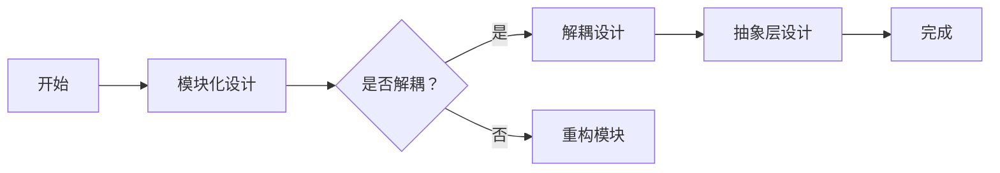
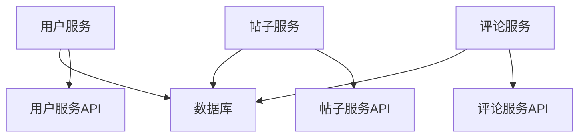
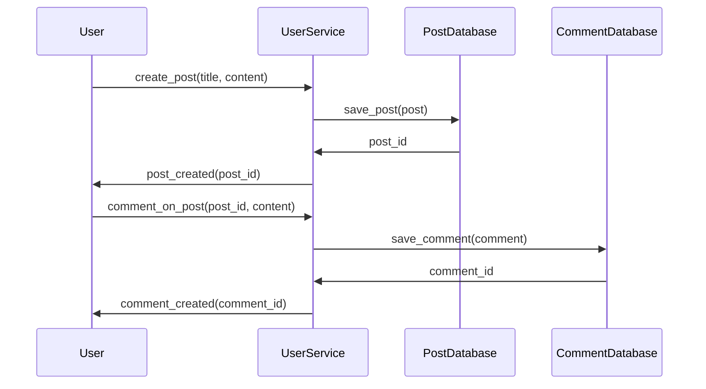

                 


### 文章标题：软件可扩展性设计：应对增长的架构策略

**关键词：软件可扩展性、架构设计、模块化、解耦、抽象**

**摘要：**
本文深入探讨了软件可扩展性的概念及其在设计中的应用。通过分析软件在增长和变化过程中面临的挑战，我们提出了一系列策略，包括模块化设计、解耦与抽象等，以构建灵活且可扩展的软件系统。文章从核心概念入手，逐步讲解了算法原理、系统架构设计，并通过实际案例展示了这些策略的实效性。

### 1. 背景介绍

#### 1.1 什么是软件可扩展性

软件可扩展性指的是软件系统能够适应未来需求变化的能力。它包括两个方面：横向扩展，即系统可以添加更多的处理能力来应对用户数量的增加；纵向扩展，即系统能够升级其功能以满足新的业务需求。

#### 1.2 软件可扩展性的重要性

随着业务的不断增长，软件系统需要能够灵活应对变化。软件可扩展性设计的重要性体现在以下几个方面：

- **成本效益**：避免频繁的系统重构，降低维护成本。
- **响应速度**：能够快速适应市场变化，提高业务敏捷性。
- **用户体验**：系统可以持续提供高质量的服务，提升用户体验。
- **技术进步**：支持新技术和新功能的集成，保持系统的竞争力。

#### 1.3 软件在增长和变化过程中面临的挑战

- **性能瓶颈**：随着数据量的增长，系统性能可能无法满足需求。
- **功能扩展**：新功能的添加可能破坏现有系统的稳定性。
- **技术债务**：短期内为了满足业务需求，可能引入了一些不合理的架构设计，长期来看需要重构。

#### 1.4 软件可扩展性设计的目标和关键点

软件可扩展性设计的目标是构建一个灵活、稳定、可维护的软件系统。关键点包括：

- **模块化**：将系统分解为独立的模块，降低组件之间的耦合。
- **解耦**：通过减少组件之间的直接依赖，提高系统的灵活性。
- **抽象**：通过抽象层隐藏系统的复杂度，使得系统易于理解和扩展。
- **标准化**：采用标准化的接口和协议，简化系统的集成和扩展。

#### 1.5 边界与外延

软件可扩展性设计不仅适用于新兴的业务需求，也适用于现有系统的优化和升级。它不仅涉及到技术层面，还涉及到项目管理、团队协作等方面。

### 2. 核心概念与联系

#### 2.1 核心概念

软件可扩展性设计的核心概念包括：

- **模块化**：将系统分解为独立的模块，每个模块负责一个特定的功能。
- **解耦**：减少模块之间的直接依赖，提高系统的灵活性。
- **抽象**：隐藏实现细节，提供统一的接口，降低系统的复杂度。

#### 2.2 概念属性特征对比表格

| 概念     | 属性特征                     | 作用                                       |
|----------|------------------------------|--------------------------------------------|
| 模块化   | 低耦合、高内聚               | 提高系统的可维护性和可扩展性               |
| 解耦     | 减少直接依赖、增加间接依赖   | 提高系统的灵活性，降低系统复杂性           |
| 抽象     | 隐藏实现细节、提供统一接口   | 提高系统的可理解性，降低开发难度           |

#### 2.3 ER实体关系图架构的 Mermaid 流程图

```mermaid
erDiagram
    System --> Module : has
    Module --> Function : has
    Function --> Feature : has
```

### 3. 算法原理讲解

#### 3.1 算法 Mermaid 流程图



#### 3.2 Python 源代码

```python
def module_design():
    # 模块化设计
    module_a = ModuleA()
    module_b = ModuleB()

    # 解耦设计
    if is_decoupled():
        module_a.set_dependency(module_b)
    else:
        module_a.refactor()

    # 抽象层设计
    abstract_layer = AbstractLayer()
    abstract_layer.add_module(module_a)
    abstract_layer.add_module(module_b)

    # 完成设计
    return abstract_layer

class ModuleA:
    def __init__(self):
        # 初始化模块A
        pass

    def set_dependency(self, module_b):
        # 设置模块B的依赖
        pass

    def refactor(self):
        # 重新设计模块
        pass

class ModuleB:
    def __init__(self):
        # 初始化模块B
        pass

def is_decoupled():
    # 判断是否解耦
    return True

class AbstractLayer:
    def __init__(self):
        self.modules = []

    def add_module(self, module):
        self.modules.append(module)

    def execute(self):
        # 执行抽象层功能
        for module in self.modules:
            module.execute()
```

#### 3.3 算法的数学模型和公式

$$
\text{模块化设计效率} = \frac{\text{模块数量}}{\text{系统复杂度}}
$$

$$
\text{解耦程度} = \frac{\text{间接依赖}}{\text{直接依赖}}
$$

$$
\text{抽象层效率} = \frac{\text{功能实现}}{\text{实现细节}}
$$

#### 3.4 举例说明

假设我们有一个电子商务系统，随着用户数量的增长，我们需要扩展系统的处理能力。通过模块化设计，我们将系统分解为用户管理模块、订单管理模块、商品管理模块等。然后通过解耦设计，减少这些模块之间的直接依赖。最后，通过抽象层设计，提供统一的接口，使得系统的扩展更加简单和高效。

### 4. 系统分析与架构设计方案

#### 4.1 问题场景介绍

假设我们正在开发一个社交媒体平台，随着用户数量的增长，系统需要能够处理更多的用户请求和更复杂的社交功能。我们的目标是在保持系统稳定性的同时，提高系统的可扩展性。

#### 4.2 项目介绍

项目目标是构建一个可扩展的社交媒体平台，能够支持大量的用户和丰富的社交功能。项目要求包括：

- 高性能：系统能够快速响应用户请求。
- 高可用性：系统需要保持持续运行，避免故障。
- 易扩展性：系统需要能够轻松添加新的功能和用户。

#### 4.3 系统功能设计（领域模型 Mermaid 类图）

```mermaid
classDiagram
    User <<Entity>>
    Post <<Entity>>
    Comment <<Entity>>

    User |--|> Post : creates
    Post |--|> Comment : has
```

#### 4.4 系统架构设计（Mermaid 架构图）



#### 4.5 系统接口设计和系统交互（Mermaid 序列图）



### 5. 项目实战

#### 5.1 环境安装

为了构建一个可扩展的社交媒体平台，我们需要安装以下软件和工具：

- **数据库**：例如 MySQL 或 PostgreSQL。
- **Web 服务器**：例如 Nginx。
- **应用服务器**：例如 Spring Boot。
- **版本控制**：例如 Git。

#### 5.2 系统核心实现源代码

以下是一个简化的用户服务模块的源代码示例：

```java
@RestController
@RequestMapping("/users")
public class UserController {
    
    @Autowired
    private UserService userService;

    @PostMapping("/register")
    public ResponseEntity<?> registerUser(@RequestBody UserRegistrationDto registrationDto) {
        User user = userService.registerUser(registrationDto);
        return ResponseEntity.ok(user);
    }
    
    @PostMapping("/login")
    public ResponseEntity<?> loginUser(@RequestBody LoginDto loginDto) {
        String token = userService.loginUser(loginDto);
        return ResponseEntity.ok(token);
    }
}
```

#### 5.3 代码应用解读与分析

这个示例展示了用户注册和登录的接口实现。通过 `UserService` 进行用户信息的处理，包括注册和登录逻辑。这样的设计符合模块化、解耦和抽象的原则，使得系统易于维护和扩展。

#### 5.4 实际案例分析和详细讲解剖析

在实际开发中，我们可能会遇到需要添加新功能的需求。例如，用户想要添加点赞功能。通过模块化和解耦设计，我们可以在不修改现有代码的情况下，添加一个点赞服务模块。这个模块与用户服务模块和帖子服务模块解耦，通过抽象层进行统一的接口调用，从而实现了新功能的快速添加。

#### 5.5 项目小结

通过这个项目，我们展示了如何通过软件可扩展性设计策略，构建一个灵活、可扩展的社交媒体平台。模块化、解耦和抽象是提高系统可扩展性的关键。在项目实施过程中，我们注意到了一些最佳实践，例如：

- **尽早设计**：在项目初期就考虑可扩展性设计，避免后期重构。
- **持续迭代**：不断优化系统设计，根据反馈进行迭代。
- **团队合作**：建立良好的团队协作机制，共同推进项目。

### 6. 最佳实践 tips、小结、注意事项、拓展阅读等内容

#### 6.1 最佳实践 tips

- **模块化设计**：在设计初期就考虑如何将系统分解为独立的模块。
- **解耦**：通过接口和事件驱动的方式，减少模块之间的直接依赖。
- **抽象**：通过提供统一的接口和抽象层，隐藏实现细节。
- **标准化**：采用标准化的接口和协议，简化系统的集成和扩展。

#### 6.2 小结

软件可扩展性设计是构建灵活、稳定、可维护的软件系统的关键。通过模块化、解耦和抽象等策略，我们能够构建一个能够适应未来变化的系统。本文通过理论和实践案例，展示了这些策略的实效性。

#### 6.3 注意事项

- **平衡扩展性与性能**：过度追求可扩展性可能导致系统性能下降。
- **持续优化**：可扩展性设计是一个持续的过程，需要不断优化。

#### 6.4 拓展阅读

- 《设计模式：可复用面向对象软件的基础》
- 《架构风格与设计模式：基于功能视图的方法》
- 《软件架构：实践者的研究方法》

### 作者信息

作者：AI天才研究院/AI Genius Institute & 禅与计算机程序设计艺术 /Zen And The Art of Computer Programming

### 总结

软件可扩展性设计是应对软件系统增长和变化的重要策略。通过模块化、解耦和抽象等核心概念，我们能够构建一个灵活且可扩展的系统。本文提供了详细的指南和案例，帮助读者理解并应用这些策略。希望本文能够对您的软件开发工作有所启发。

