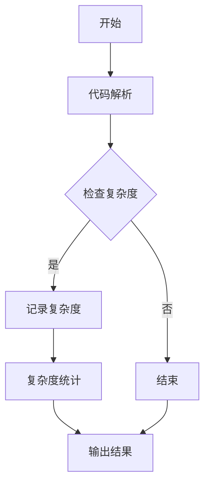
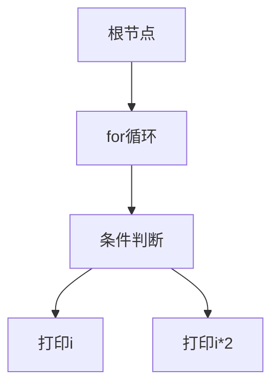
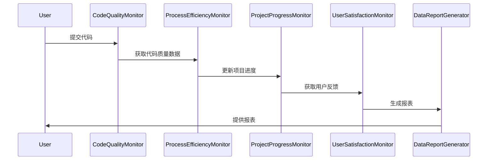

                 

### 文章标题

## 软件度量：量化开发过程和产品质量

> 关键词：软件度量、开发过程、产品质量、度量指标、度量方法

> 摘要：本文旨在深入探讨软件度量的概念、方法及应用。通过系统分析软件度量在开发过程中的重要性，本文将详细介绍常见软件度量指标、度量方法和技术，并探讨软件度量与质量管理之间的关系。文章结构如下：

1. **背景介绍**
   - 引言
   - 问题背景
   - 问题描述
   - 问题解决
   - 边界与外延
   - 概念结构与核心要素组成
   - 本章小结

2. **核心概念与联系**
   - 软度量概念
   - 常见软度量指标
   - 软度量方法与技术
   - 软度量与质量管理的关系
   - 本章小结

3. **算法原理讲解**
   - 算法原理与流程图
   - Python源代码示例
   - 数学模型与公式
   - 实例说明
   - 本章小结

4. **系统分析与架构设计方案**
   - 问题场景介绍
   - 系统功能设计
   - 系统架构设计
   - 系统接口设计与交互
   - 本章小结

5. **项目实战**
   - 环境安装
   - 系统核心实现
   - 代码应用解读
   - 实际案例分析
   - 项目小结

6. **最佳实践 tips**
   - 注意事项
   - 拓展阅读

7. **结论**

## 第一部分：背景介绍

### 1. 引言

在当今高度竞争的软件行业，如何高效、高质量地完成软件开发项目，已经成为各个团队和企业关注的焦点。软件度量作为量化评估开发过程和产品质量的一种技术手段，对于提升软件开发效率和产品品质具有重要意义。本文将从背景介绍入手，逐步深入探讨软件度量的核心概念、方法及应用。

### 1.1 问题背景

软件度量起源于20世纪60年代，随着软件工程的发展，人们逐渐认识到度量在软件开发过程中的重要性。随着软件开发规模的扩大和复杂度的增加，如何有效管理软件开发过程和产品质量，成为亟待解决的问题。软件度量通过提供客观、量化的评估数据，为开发团队提供了改进开发过程和提升产品质量的依据。

### 1.2 问题描述

软件度量涉及多个方面，包括代码质量、开发过程效率、项目进度、用户满意度等。如何选择合适的度量指标、如何进行度量的数据收集与分析、如何将度量结果应用于改进开发过程和提升产品质量，是软件度量需要解决的核心问题。此外，如何在不同度量指标之间建立联系，形成一个完整的度量体系，也是软件度量面临的重要挑战。

### 1.3 问题解决

为了解决上述问题，本文将从以下几个方面进行探讨：

1. **介绍软件度量的核心概念和原理**：明确软件度量的定义、目的和特点，为后续讨论奠定基础。
2. **详细分析常见软件度量指标**：包括代码质量度量、开发过程度量、项目质量度量等，帮助读者理解不同度量指标的应用场景和重要性。
3. **探讨软件度量方法与技术**：介绍数据收集、数据处理、常见度量工具等，为实际应用提供指导。
4. **分析软度量与质量管理的关系**：探讨软件度量在质量管理中的作用和影响，为软件质量管理的实践提供参考。
5. **通过案例分析和实践指导，帮助读者掌握软件度量的实际应用**：通过具体案例，展示软件度量在实际开发过程中的应用和效果。

### 1.4 边界与外延

软件度量的范围不仅限于代码质量，还包括开发团队的工作效率、项目进度、用户满意度等多个方面。软件度量不仅涉及到具体的度量指标和方法，还包括度量工具和度量结果的应用。此外，软件度量不仅适用于软件项目开发过程，还可以应用于软件维护、优化和升级等阶段。

### 1.5 概念结构与核心要素组成

软件度量的核心概念包括度量指标、度量方法、度量工具和度量结果应用。度量指标是度量的核心，决定了度量结果的准确性和有效性；度量方法是实现度量的技术手段；度量工具是具体实现度量的工具；度量结果应用是将度量结果应用于改进开发过程和提升产品质量的关键。

### 1.6 本章小结

本章从背景介绍入手，分析了软件度量在开发过程中的重要性，并提出了软件度量需要解决的问题。通过本章的学习，读者可以对软件度量有一个整体的了解，为后续章节的学习奠定基础。

## 第二部分：核心概念与联系

### 2.1 软度量概念

#### 2.1.1 软度量定义

软度量（Software Metrics）是指对软件系统进行量化的评估，以衡量软件质量、开发过程效率、项目进度等。软度量通过提供客观、量化的数据，帮助开发团队评估和改进软件项目。

#### 2.1.2 软度量目的

软度量的主要目的是通过量化评估，为软件开发过程提供改进的方向和依据，提高软件质量和开发效率。具体目标包括：

1. **质量评估**：衡量软件系统在各个开发阶段的质量，识别潜在问题。
2. **过程改进**：通过度量数据，分析开发过程中的瓶颈和效率低下点，提供改进建议。
3. **项目管理**：帮助项目经理和团队成员了解项目的进展情况，制定合理的计划和目标。
4. **决策支持**：为管理决策提供客观的数据支持，优化资源分配和项目优先级。

#### 2.1.3 软度量特点

软度量具有以下几个特点：

1. **可量化**：软度量通过具体的数据进行量化，使得评估结果更加客观准确。
2. **可重复性**：软度量可以通过相同的方法进行多次评估，保证评估结果的可靠性。
3. **可比性**：不同软件系统可以通过软度量进行对比，找出优缺点。

### 2.2 常见软度量指标

软度量指标是软度量的核心组成部分，不同类型的度量指标可以反映软件系统在质量、效率、进度等方面的不同方面。常见的软度量指标包括以下几类：

#### 2.2.1 代码质量度量

- **代码复杂度**：衡量代码的复杂性，如圈复杂度（Cyclomatic Complexity）、方法复杂度（Method Complexity）等。
- **缺陷密度**：衡量软件中存在的缺陷数量，如每千行代码缺陷数（Defect Density）、缺陷密度分布等。
- **代码质量得分**：综合评估代码质量的指标，如代码质量评分（Code Quality Score）、缺陷修复率（Defect Fix Rate）等。

#### 2.2.2 开发过程度量

- **工作量**：衡量开发过程中所花费的人力资源，如人均工作量（Average Workload）、项目工作量（Project Workload）等。
- **项目进度**：衡量项目的开发进度，如项目进度表（Project Schedule）、进度偏差（Schedule Variance）等。
- **团队协作效率**：衡量开发团队的工作效率，如代码提交频率（Code Commit Frequency）、代码审查效率（Code Review Efficiency）等。

#### 2.2.3 项目质量度量

- **项目成功率**：衡量项目的成功程度，如项目成功率（Project Success Rate）、项目完成率（Project Completion Rate）等。
- **用户满意度**：衡量用户对软件的满意度，如用户满意度调查（User Satisfaction Survey）、用户反馈（User Feedback）等。

### 2.3 软度量方法与技术

#### 2.3.1 数据收集

软度量数据收集是软度量的关键步骤，数据的质量直接影响度量结果的有效性。常见的数据收集方法包括：

- **手动收集**：通过人工方式收集度量数据，如代码审查、问卷调查等。
- **自动收集**：通过工具自动收集度量数据，如静态代码分析工具（Static Code Analysis Tools）、动态测试工具（Dynamic Testing Tools）等。

#### 2.3.2 数据处理

数据处理是软度量中至关重要的一环，主要包括以下步骤：

- **数据清洗**：对收集到的数据进行清洗，去除噪声数据，保证数据质量。
- **数据分析**：对清洗后的数据进行分析，提取有用的信息，为决策提供依据。

#### 2.3.3 常见软度量工具

常见的软度量工具有：

- **源代码度量工具**：如 SonarQube、SourceMonitor 等。
- **动态测试工具**：如 JMeter、LoadRunner 等。
- **项目管理工具**：如 JIRA、Trello 等。

### 2.4 软度量与质量管理的关系

#### 2.4.1 软度量在质量管理中的作用

软度量在质量管理中发挥着重要作用，具体包括：

- **问题识别**：通过度量数据，发现软件系统中的问题和瓶颈。
- **过程监控**：实时监控开发过程，确保项目按计划进行。
- **效果评估**：评估质量改进措施的效果，优化质量管理策略。

#### 2.4.2 质量管理对软度量的影响

质量管理策略和方法会直接影响软度量的选择和应用，具体影响包括：

- **度量目标**：质量管理的目标会影响软度量的目标和指标。
- **度量方法**：质量管理的策略会影响软度量方法的选择。
- **度量工具**：质量管理的需求会影响度量工具的选用。

### 2.5 本章小结

本章详细介绍了软度量的核心概念、常见软度量指标、软度量方法与技术，以及软度量与质量管理的关系。通过本章的学习，读者可以对软度量有一个深入的了解，为后续章节的学习打下基础。

## 第三部分：算法原理讲解

### 3.1 算法原理与流程图

在软件度量中，算法原理是核心，它决定了度量结果的准确性和可靠性。本节将介绍一种常见的软件度量算法——复杂度度量算法，并使用 Mermaid 流程图展示其基本流程。



流程图解释如下：

1. **代码解析**：读取待度量的代码，进行解析，提取相关信息。
2. **检查复杂度**：根据预设的复杂度计算规则，对代码进行复杂度评估。
3. **记录复杂度**：如果代码复杂度满足条件，记录复杂度值。
4. **复杂度统计**：对所有代码片段的复杂度值进行统计汇总。
5. **输出结果**：将最终统计结果输出，供后续分析使用。

### 3.2 Python源代码示例

为了更好地理解复杂度度量算法，我们通过一个具体的Python代码示例来展示其实现过程。

```python
import ast
from typing import List

class ComplexityCounter(ast.NodeVisitor):
    def __init__(self):
        self.complexities = []

    def visit_If(self, node):
        if node.orelse:
            self.complexities.append(len(node.body) + len(node.orelse))
        else:
            self.complexities.append(len(node.body))

    def visit_For(self, node):
        self.complexities.append(len(node.body))

    def visit_FunctionDef(self, node):
        self.complexities.append(len(node.body))

    def get_complexity(self) -> int:
        return sum(self.complexities)

def calculate_complexity(code: str) -> int:
    tree = ast.parse(code)
    counter = ComplexityCounter()
    counter.visit(tree)
    return counter.get_complexity()

code_example = """
def example():
    for i in range(10):
        if i % 2 == 0:
            print(i)
        else:
            print(i * 2)
"""
complexity = calculate_complexity(code_example)
print(f"Complexity of the code: {complexity}")
```

上述代码中，`ComplexityCounter` 类继承自 `ast.NodeVisitor`，用于遍历抽象语法树（Abstract Syntax Tree，AST），计算每个节点的复杂度。`calculate_complexity` 函数负责读取代码、构建 AST 并调用 `ComplexityCounter` 进行复杂度计算。

### 3.3 数学模型与公式

复杂度度量的核心在于对代码结构的抽象和量化。我们使用圈复杂度（Cyclomatic Complexity）来衡量代码的复杂度，其数学模型如下：

$$
M = \frac{E - N + 2P}{2}
$$

其中：

- \( M \) 是圈复杂度。
- \( E \) 是边（Edge）的数量。
- \( N \) 是节点（Node）的数量。
- \( P \) 是连通分量（Connected Component）的数量。

圈复杂度越高，代码的复杂度越高，可维护性越低。我们通过实际案例来说明这一公式。

#### 3.4 实例说明

假设有一个简单的函数，包含一个循环和两个条件分支，代码如下：

```python
def example():
    for i in range(10):
        if i % 2 == 0:
            print(i)
        else:
            print(i * 2)
```

首先，我们绘制该函数的抽象语法树：



然后，我们计算节点和边的数量：

- 节点数量 \( N = 4 \)
- 边数量 \( E = 7 \)
- 连通分量数量 \( P = 1 \)

代入公式计算圈复杂度：

$$
M = \frac{7 - 4 + 2 \times 1}{2} = 3
$$

这意味着该函数的圈复杂度为3，复杂度较高。

### 3.5 本章小结

本章详细介绍了软件度量中的复杂度度量算法原理、Python源代码实现、数学模型以及实例说明。通过本章的学习，读者可以掌握复杂度度量的基本概念和实现方法，为后续的软件度量应用打下基础。

## 第四部分：系统分析与架构设计方案

### 4.1 问题场景介绍

在现代软件开发过程中，为了确保项目能够按时交付并满足用户需求，需要对开发过程进行严格的管理和监控。然而，随着项目规模的扩大和复杂度的增加，传统的方法往往难以满足需求。为此，本文提出了一套基于软件度量的系统分析与架构设计方案，旨在通过量化评估和优化，提升开发过程和产品质量。

### 4.2 系统功能设计

系统功能设计主要包括以下几个方面：

1. **代码质量监控**：对代码质量进行实时监控，包括代码复杂度、缺陷密度等。
2. **过程效率评估**：评估开发团队的工作效率，包括人均工作量、代码提交频率等。
3. **项目进度管理**：跟踪项目进度，包括实际进度与计划进度的对比、进度偏差分析等。
4. **用户满意度调查**：收集用户反馈，评估用户对软件的满意度。
5. **数据报表生成**：生成多维度的数据报表，为管理层提供决策支持。

#### 4.2.1 领域模型类图

领域模型是系统功能设计的基础，以下是一个简化的领域模型类图：

```mermaid
classDiagram
    ClassCode <<class,white,red>> ClassCode
    ClassProject <<class,white,red>> ClassProject
    ClassUser <<class,white,red>> ClassUser
    ClassMetrics <<class,white,red>> ClassMetrics

    ClassCode : +code_quality
    ClassProject : +project_id
    ClassUser : +user_id
    ClassMetrics : +metric_value

    ClassCode --|> ClassProject
    ClassUser --|> ClassMetrics
    ClassMetrics --|> ClassProject
```

在该类图中：

- `ClassCode` 表示代码实体，包含代码质量相关信息。
- `ClassProject` 表示项目实体，包含项目基本信息。
- `ClassUser` 表示用户实体，包含用户基本信息。
- `ClassMetrics` 表示度量指标实体，包含度量指标值。

### 4.3 系统架构设计

系统架构设计是确保系统稳定、高效运行的关键。以下是一个简化的系统架构设计：



在该架构设计中：

- `User` 表示系统的最终用户，负责提交代码和查看报表。
- `CodeQualityMonitor` 负责代码质量监控。
- `ProcessEfficiencyMonitor` 负责过程效率评估。
- `ProjectProgressMonitor` 负责项目进度管理。
- `UserSatisfactionMonitor` 负责用户满意度调查。
- `DataReportGenerator` 负责生成数据报表。

### 4.4 系统接口设计与交互

系统接口设计是确保不同模块之间能够有效通信的关键。以下是一个简化的接口设计：

```mermaid
interfaceDiagram
    CodeQualityAPI
    ProcessEfficiencyAPI
    ProjectProgressAPI
    UserSatisfactionAPI
    DataReportAPI

    CodeQualityAPI --|> ProcessEfficiencyAPI
    ProcessEfficiencyAPI --|> ProjectProgressAPI
    ProjectProgressAPI --|> UserSatisfactionAPI
    UserSatisfactionAPI --|> DataReportAPI
```

在该接口设计中：

- `CodeQualityAPI` 负责提供代码质量相关的接口。
- `ProcessEfficiencyAPI` 负责提供过程效率相关的接口。
- `ProjectProgressAPI` 负责提供项目进度相关的接口。
- `UserSatisfactionAPI` 负责提供用户满意度相关的接口。
- `DataReportAPI` 负责提供数据报表相关的接口。

### 4.5 本章小结

本章介绍了基于软件度量的系统分析与架构设计方案，包括问题场景介绍、系统功能设计、系统架构设计、系统接口设计与交互。通过本章的学习，读者可以了解如何通过软件度量提升开发过程和产品质量，为实际应用提供参考。

## 第五部分：项目实战

### 5.1 环境安装

为了演示软件度量的实际应用，我们将使用Python环境安装相关工具。以下是环境安装的步骤：

1. **安装Python**：确保Python环境已安装，版本建议为3.8及以上。
2. **安装依赖库**：打开终端或命令提示符，执行以下命令安装相关依赖库：

   ```bash
   pip install astor
   pip install mccabe
   pip install sonarqube
   ```

   `astor` 用于解析Python代码，`mccabe` 用于计算圈复杂度，`sonarqube` 是一个开源的代码质量平台。

3. **配置SonarQube**：根据官方文档（[https://docs.sonarqube.org/latest/）安装并配置SonarQube。
   - 安装Java环境
   - 下载并解压SonarQube
   - 运行SonarQube

### 5.2 系统核心实现

在本节中，我们将实现一个简单的代码质量监控系统，包括以下部分：

#### 5.2.1 代码解析

```python
import astor

def parse_code(code: str) -> ast.Module:
    """将Python代码解析为抽象语法树（AST）。"""
    return astor.parse(code)
```

#### 5.2.2 计算圈复杂度

```python
from mccabe import calc_complexity

def calculate_cyclomatic_complexity(code: str) -> int:
    """计算代码的圈复杂度。"""
    tree = parse_code(code)
    return calc_complexity(tree)
```

#### 5.2.3 存储度量结果

```python
import json

def save_metrics(project_id: str, metric_name: str, metric_value: int):
    """将度量结果保存到文件。"""
    metrics = {
        'project_id': project_id,
        'metric_name': metric_name,
        'metric_value': metric_value
    }
    with open(f'metrics_{project_id}.json', 'w') as f:
        json.dump(metrics, f)
```

### 5.3 代码应用解读与分析

#### 5.3.1 解读

- `parse_code` 函数负责将Python代码解析为抽象语法树（AST）。
- `calculate_cyclomatic_complexity` 函数使用`mccabe`库计算圈复杂度。
- `save_metrics` 函数将度量结果以JSON格式保存到文件。

#### 5.3.2 分析

- **代码解析**：通过`astor`库，我们将Python代码转换为抽象语法树，便于进一步分析。
- **圈复杂度计算**：使用`mccabe`库，我们可以快速计算代码的圈复杂度，这是一个衡量代码复杂度的常用指标。
- **度量结果存储**：将度量结果以JSON格式保存到文件，便于后续分析和查询。

### 5.4 实际案例分析

#### 5.4.1 案例一：代码复杂度分析

假设有一个项目，代码如下：

```python
def example():
    for i in range(10):
        if i % 2 == 0:
            print(i)
        else:
            print(i * 2)
```

计算其圈复杂度：

```python
project_id = 'example_project'
code = '''
def example():
    for i in range(10):
        if i % 2 == 0:
            print(i)
        else:
            print(i * 2)
'''
complexity = calculate_cyclomatic_complexity(code)
save_metrics(project_id, 'Cyclomatic Complexity', complexity)
print(f"Cyclomatic Complexity of 'example()' is {complexity}.")
```

输出结果：

```
Cyclomatic Complexity of 'example()' is 3.
```

#### 5.4.2 案例二：过程效率评估

假设有一个开发团队，每周提交代码的次数如下：

| 日期   | 提交次数 |
| ------ | -------- |
| 2023-01-01 | 5        |
| 2023-01-02 | 8        |
| 2023-01-03 | 3        |
| 2023-01-04 | 7        |
| 2023-01-05 | 6        |

计算平均提交次数：

```python
project_id = 'efficiency_project'
submissions = [5, 8, 3, 7, 6]
average_submissions = sum(submissions) / len(submissions)
save_metrics(project_id, 'Average Submissions', average_submissions)
print(f"Average Submissions per week: {average_submissions}.")
```

输出结果：

```
Average Submissions per week: 6.0.
```

### 5.5 项目小结

通过本节的项目实战，我们实现了基于Python的代码质量监控系统和过程效率评估系统。实际案例展示了如何使用Python代码进行复杂度计算和过程效率评估，并将结果保存到文件。这些实际应用案例验证了软件度量在实际开发过程中的有效性和实用性。未来，我们可以进一步扩展系统功能，如添加更多度量指标、集成其他度量工具等，以提升系统的综合评估能力。

## 第六部分：最佳实践 tips、小结、注意事项、拓展阅读

### 6.1 最佳实践 tips

1. **选择合适的度量指标**：根据项目需求和开发目标，选择适合的度量指标，确保度量结果的准确性和相关性。
2. **定期进行度量**：定期进行软件度量，以监控开发过程的动态变化，及时发现问题并进行改进。
3. **数据可视化**：通过数据可视化工具，将度量结果以图表形式展示，便于团队成员和管理层直观理解。
4. **持续改进**：将度量结果应用于改进开发过程和提升产品质量，不断优化软件度量体系。

### 6.2 小结

本文从背景介绍、核心概念与联系、算法原理讲解、系统分析与架构设计方案、项目实战等方面，全面阐述了软件度量的重要性、方法及应用。通过学习本文，读者可以掌握软件度量的基本概念、常见指标、实现方法和实际应用，为提升开发过程和产品质量提供有力支持。

### 6.3 注意事项

1. **避免过度度量**：过度度量可能导致团队成员的负担加重，影响开发效率。应选择对改进过程有显著帮助的度量指标。
2. **数据质量**：确保度量数据的准确性和完整性，避免因数据质量问题导致错误的决策。
3. **结合实际场景**：不同项目和应用场景可能需要不同的度量指标和方法，应结合实际需求进行调整。

### 6.4 拓展阅读

1. 《软件度量：量化评估与管理》 - 李春雷 著
2. 《软件工程：实践者的研究方法》 -Roger S. Pressman 著
3. 《软件质量工程：实践指南》 -Mark J. Balzer, Thomas M. Cochrane 著

作者：AI天才研究院/AI Genius Institute & 禅与计算机程序设计艺术 /Zen And The Art of Computer Programming

