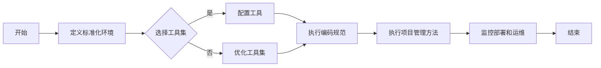
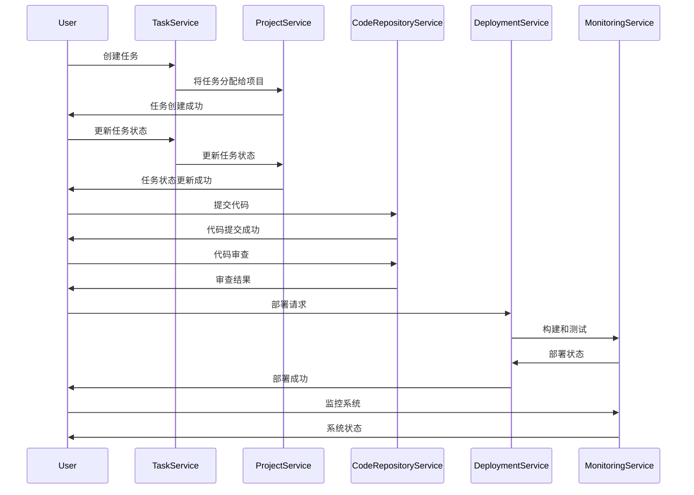
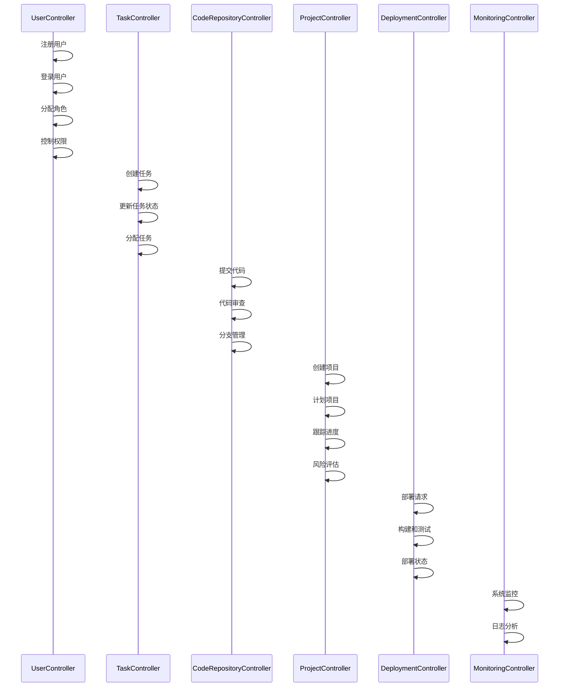
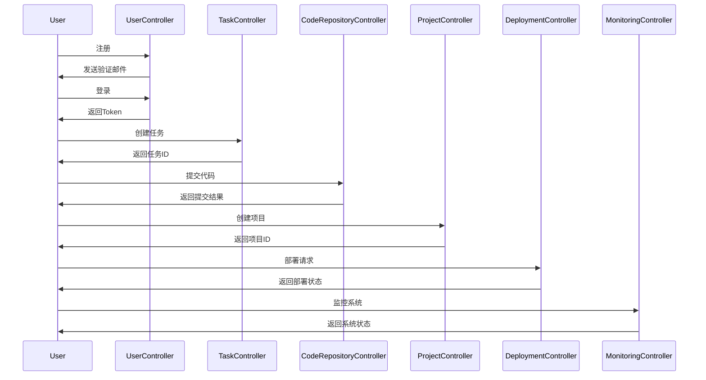

                 

# 软件开发环境标准化：提高团队效率

> 关键词：软件开发环境标准化、团队协作、项目管理、效率提升

> 摘要：本文从软件开发环境标准化的背景与意义出发，探讨了其在解决团队协作与项目开发中的问题方面的作用。通过深入剖析核心概念、算法原理、系统设计与项目实战，文章提出了具体的方法和策略，旨在为软件开发团队提供一套有效的标准化方案，以提高整体工作效率。

## Step 1: 背景介绍和核心概念

### 1.1 问题背景

随着软件开发的复杂度和规模日益增加，团队合作中的问题日益凸显。在当今的软件开发环境中，团队协作中的问题主要集中在以下几个方面：

- **沟通不畅**：团队成员之间的信息传递不及时，导致工作效率下降。这不仅包括团队成员之间的沟通，还涉及到与其他部门或客户之间的沟通。
- **协作困难**：不同团队成员之间的工作方式和工具不统一，造成协作效率低下。例如，前端开发者可能使用React，而后端开发者可能使用Spring Boot，这样的差异会导致开发过程中出现不必要的障碍。
- **代码冲突**：多个人同时修改同一文件，容易导致代码冲突，影响项目进度。尤其是在大规模的项目中，代码库的管理和版本控制变得更加复杂。
- **项目管理混乱**：项目计划不明确，任务分配不均，进度难以掌控。项目管理中的混乱会导致资源浪费和时间浪费，从而影响整体项目的成功。

### 1.2 问题描述

在团队协作和项目开发中，存在以下常见问题：

- **团队协作问题**：
  - **沟通不畅**：团队成员之间的信息传递不及时，导致工作效率下降。为了解决这个问题，需要建立一套有效的沟通机制，确保信息的及时传递。
  - **协作困难**：不同团队成员之间的工作方式和工具不统一，造成协作效率低下。解决这一问题的方法是通过标准化工具和环境，确保团队成员使用相同的工具和流程。
  - **代码冲突**：多个人同时修改同一文件，容易导致代码冲突，影响项目进度。为了减少代码冲突，需要建立良好的代码审查和合并流程。

- **项目开发问题**：
  - **项目管理混乱**：项目计划不明确，任务分配不均，进度难以掌控。为了解决这个问题，需要采用标准化的项目管理方法，如Scrum或Kanban，确保项目进度的透明性和可控性。
  - **需求变更频繁**：客户需求变化频繁，导致项目周期延长，成本增加。为了应对需求变更，需要建立一套灵活的变更管理流程，确保项目能够快速响应需求变化。
  - **质量控制不足**：缺乏有效的质量保证措施，导致软件质量参差不齐。为了提高软件质量，需要引入标准化的质量保证方法，如单元测试和集成测试。

### 1.3 问题解决

软件开发环境标准化通过建立一套统一的标准和规范，解决了团队协作和项目开发中的问题。标准化包括以下几个方面：

- **工具标准化**：统一使用特定的开发工具，提高团队协作效率。例如，统一使用Git进行版本控制，使用Jenkins进行自动化构建和部署。
- **编码规范**：制定统一的编码规范，减少代码冲突，提高代码质量。例如，使用Prettier进行代码格式化，使用ESLint进行代码检查。
- **项目管理**：使用标准化的项目管理方法，确保项目进度和质量。例如，使用JIRA进行任务管理，使用Confluence进行文档管理。
- **部署和运维**：采用标准化的部署和运维流程，确保软件的稳定性和可维护性。例如，使用Kubernetes进行容器化部署，使用Prometheus和Grafana进行监控。

### 1.4 边界与外延

- **标准化的范围**：软件开发环境标准化不仅仅局限于开发工具和编码规范的统一，还包括项目管理、测试、部署和运维等环节。
- **标准化的限制**：标准化虽然可以提高团队效率和项目质量，但并不是万能的。在实际应用中，需要根据项目的具体需求和团队的特点进行适度调整。

### 1.5 概念结构与核心要素组成

- **标准化的核心概念**：标准化是指通过制定、发布和实施标准，确保产品和服务的一致性、可靠性和可互操作性。
- **核心要素的组成**：
  - **工具**：包括版本控制工具、构建工具、测试工具、持续集成和持续部署工具等。
  - **编码规范**：包括代码风格指南、命名规范、注释规范等。
  - **项目管理**：包括项目计划、任务管理、进度跟踪、风险管理等。
  - **部署和运维**：包括自动化部署、监控、日志分析等。

## Step 2: 核心概念与联系

### 2.1 核心概念原理

软件开发环境标准化的核心概念包括：

- **标准化**：标准化是指通过制定、发布和实施标准，确保产品和服务的一致性、可靠性和可互操作性。
- **软件开发环境**：软件开发环境是指为软件开发提供工具、资源和框架的一组组件。
- **团队协作**：团队协作是指团队成员通过共享信息、共同完成任务的过程。
- **项目管理**：项目管理是指通过计划、执行、监控和调整项目活动，确保项目目标按时、按预算、按质量完成的过程。

### 2.2 概念属性特征对比表格

| 概念     | 属性特征                                  |
|----------|-----------------------------------------|
| 标准化   | - 确保一致性<br>- 提高可靠性<br>- 促进互操作性 |
| 软件开发环境 | - 工具集<br>- 资源集<br>- 框架集            |
| 团队协作   | - 共享信息<br>- 共同任务<br>- 协调工作        |
| 项目管理   | - 项目计划<br>- 任务管理<br>- 进度监控        |

### 2.3 ER实体关系图架构

```mermaid
erDiagram
  SoftwareEnvironment ||--|{ Team }|| Collaboration
  SoftwareEnvironment ||--|{ Project }|| Management
  Collaboration ||--|{ Task }|| Assignment
  Management ||--|{ Progress }|| Monitoring
```

在这个ER实体关系图中，`SoftwareEnvironment` 是一个基础实体，它与`Collaboration`和`Management`之间存在关联。`Collaboration` 代表团队协作，与`Task`之间存在任务分配关系。`Management` 代表项目管理，与`Progress`之间存在进度监控关系。

## Step 3: 算法原理讲解

### 3.1 算法mermaid流程图



### 3.2 算法原理与数学模型

软件开发环境标准化算法的原理可以概括为以下几个步骤：

1. **定义标准化环境**：确定所需的工具集、编码规范、项目管理方法和部署运维流程。
2. **选择工具集**：根据项目需求选择合适的开发工具和版本控制工具。
3. **配置工具**：配置所选工具，确保团队成员能够顺畅地协作。
4. **执行编码规范**：确保所有团队成员遵循相同的编码规范，以减少代码冲突和提高代码质量。
5. **执行项目管理方法**：采用标准化的项目管理方法，如Scrum或Kanban，确保项目进度和质量。
6. **监控部署和运维**：确保软件在部署和运维过程中的稳定性和可维护性。

数学模型可以表示为以下公式：

$$
\text{标准化效率} = f(\text{工具集}, \text{编码规范}, \text{项目管理方法}, \text{部署运维流程})
$$

其中，`标准化效率` 是一个函数，取决于所选的工具集、编码规范、项目管理方法和部署运维流程。

### 3.3 举例说明

#### 简单案例

假设一个团队正在开发一个电商网站。为了提高团队效率和项目质量，团队决定实施软件开发环境标准化。

1. **定义标准化环境**：团队选择了Git作为版本控制工具，Jenkins作为构建和部署工具，Prettier和ESLint作为代码格式化和检查工具，JIRA和Confluence作为项目管理工具。

2. **选择工具集**：团队选择了上述工具集，并配置了Git仓库、Jenkins作业、Prettier和ESLint规则。

3. **执行编码规范**：团队制定了统一的编码规范，所有成员都必须遵循这些规范。

4. **执行项目管理方法**：团队采用了Scrum方法，每周进行一次迭代会议，确保项目进度和质量。

5. **监控部署和运维**：团队使用Jenkins进行自动化部署和监控，确保网站的稳定性和可维护性。

通过实施软件开发环境标准化，团队显著提高了工作效率和项目质量。

#### 复杂案例

假设一个团队正在开发一个大型金融系统。这个系统涉及到多个模块，包括交易处理、风险控制、客户服务和管理报告等。

1. **定义标准化环境**：团队选择了Git作为版本控制工具，Docker作为容器化工具，Kubernetes作为容器编排工具，Jenkins作为构建和部署工具，Prometheus和Grafana作为监控工具，JIRA和Confluence作为项目管理工具。

2. **选择工具集**：团队选择了上述工具集，并配置了Git仓库、Docker镜像、Kubernetes集群、Jenkins作业、Prometheus指标和Grafana仪表板。

3. **执行编码规范**：团队制定了详细的编码规范，包括命名规范、注释规范、代码风格等。

4. **执行项目管理方法**：团队采用了敏捷方法，如Scrum或Kanban，确保项目进度和质量。

5. **监控部署和运维**：团队使用Jenkins进行自动化构建和部署，使用Prometheus和Grafana进行实时监控，确保系统的稳定性和可维护性。

通过实施软件开发环境标准化，团队能够高效地协作，快速响应用户需求，并确保系统的可靠性和安全性。

## Step 4: 系统分析与架构设计方案

### 4.1 问题场景介绍

在一个大型软件开发项目中，团队协作和项目管理面临着以下挑战：

- **跨部门协作**：项目涉及到多个部门，如前端开发、后端开发、测试和运维等。不同部门之间的协作需要高效且有序。
- **代码管理**：随着项目的规模扩大，代码库变得复杂，需要有效的版本控制和代码管理策略。
- **项目管理**：项目计划不明确，任务分配不均，进度难以掌控。需要建立标准化的项目管理流程，确保项目按时交付。
- **部署和运维**：系统部署和运维流程不统一，导致部署失败和运维问题频发。

### 4.2 系统功能设计

为了解决上述问题，我们可以设计以下系统功能：

- **用户管理**：管理系统用户，包括角色分配和权限控制。
- **任务管理**：管理项目任务，包括任务创建、分配、状态更新和进度跟踪。
- **代码管理**：提供版本控制功能，包括代码提交、代码审查和分支管理。
- **项目管理**：提供项目管理功能，包括项目计划、进度跟踪和风险评估。
- **部署管理**：提供自动化部署功能，包括构建、测试和部署。
- **运维监控**：提供系统监控和日志分析功能，确保系统的稳定性和可维护性。

#### 领域模型mermaid类图

```mermaid
classDiagram
    User <<类>> {
        String id
        String name
        String role
        List<Task> assignedTasks
    }
    Task <<类>> {
        String id
        String title
        String description
        User assignedTo
        Status status
        Date deadline
    }
    Project <<类>> {
        String id
        String name
        List<Task> tasks
        List<User> members
    }
    CodeRepository <<类>> {
        String id
        String url
        List<Commit> commits
    }
    Commit <<类>> {
        String id
        String message
        Date timestamp
        User author
    }
    Deployment <<类>> {
        String id
        String description
        Date timestamp
        Status status
    }
    Log <<类>> {
        String id
        String message
        Date timestamp
        Status level
    }
    User --> Task
    Project --> Task
    Project --> User
    CodeRepository --> Commit
    Deployment --> Log
```

### 4.3 系统架构设计

系统架构设计包括以下模块：

- **用户管理模块**：处理用户注册、登录、角色分配和权限控制。
- **任务管理模块**：处理任务创建、分配、状态更新和进度跟踪。
- **代码管理模块**：处理代码提交、代码审查和分支管理。
- **项目管理模块**：处理项目计划、进度跟踪和风险评估。
- **部署管理模块**：处理构建、测试和部署。
- **运维监控模块**：处理系统监控和日志分析。

#### mermaid架构图



### 4.4 系统接口设计

系统接口设计包括以下部分：

- **用户管理接口**：处理用户注册、登录、角色分配和权限控制。
- **任务管理接口**：处理任务创建、分配、状态更新和进度跟踪。
- **代码管理接口**：处理代码提交、代码审查和分支管理。
- **项目管理接口**：处理项目计划、进度跟踪和风险评估。
- **部署管理接口**：处理构建、测试和部署。
- **运维监控接口**：处理系统监控和日志分析。

#### 接口设计



### 4.5 系统交互mermaid序列图



## Step 5: 提高团队效率的项目实战

### 5.1 环境安装

为了提高团队效率，我们首先需要搭建一个标准化的开发环境。以下是环境搭建的步骤：

1. **安装Git**：从[Git官网](https://git-scm.com/downloads)下载并安装Git。
2. **安装Jenkins**：从[Jenkins官网](https://www.jenkins.io/download/)下载并安装Jenkins。
3. **安装Docker**：从[Docker官网](https://www.docker.com/products/docker-desktop)下载并安装Docker。
4. **安装Kubernetes**：在本地计算机上安装Kubernetes，可以选择使用Minikube进行本地开发。
5. **安装Prometheus**：从[Prometheus官网](https://prometheus.io/download/)下载并安装Prometheus。
6. **安装Grafana**：从[Grafana官网](https://grafana.com/grafana/download/)下载并安装Grafana。

在安装过程中，如果遇到问题，可以参考以下解决方案：

- **Git安装失败**：确保操作系统支持Git，或者从源代码编译安装。
- **Jenkins无法启动**：检查Java环境是否配置正确，或者尝试重新安装Jenkins。
- **Docker安装失败**：确保操作系统支持Docker，或者尝试使用其他容器运行时，如Podman。
- **Kubernetes无法启动**：确保Minikube环境配置正确，或者尝试重新安装Minikube。
- **Prometheus无法访问**：确保Prometheus服务正常运行，或者检查网络设置。
- **Grafana无法访问**：确保Grafana服务正常运行，或者检查网络设置。

### 5.2 系统核心实现

为了实现系统核心功能，我们需要编写相应的源代码。以下是一个简单的示例：

```python
# 任务管理模块
class TaskManager:
    def __init__(self):
        self.tasks = []

    def create_task(self, title, description, deadline):
        task = {
            'id': len(self.tasks) + 1,
            'title': title,
            'description': description,
            'deadline': deadline,
            'status': '未开始'
        }
        self.tasks.append(task)
        return task['id']

    def update_task_status(self, task_id, status):
        for task in self.tasks:
            if task['id'] == task_id:
                task['status'] = status
                return True
        return False

# 项目管理模块
class ProjectManager:
    def __init__(self):
        self.projects = []

    def create_project(self, name, members):
        project = {
            'id': len(self.projects) + 1,
            'name': name,
            'members': members,
            'tasks': []
        }
        self.projects.append(project)
        return project['id']

    def add_member_to_project(self, project_id, member_id):
        for project in self.projects:
            if project['id'] == project_id:
                project['members'].append(member_id)
                return True
        return False

# 代码管理模块
class CodeRepository:
    def __init__(self):
        self.commits = []

    def commit_code(self, message, author):
        commit = {
            'id': len(self.commits) + 1,
            'message': message,
            'timestamp': datetime.now(),
            'author': author
        }
        self.commits.append(commit)
        return commit['id']

    def review_code(self, commit_id, reviewer):
        # 实现代码审查逻辑
        pass

# 部署管理模块
class DeploymentManager:
    def __init__(self):
        self.deployments = []

    def deploy_application(self, description):
        deployment = {
            'id': len(self.deployments) + 1,
            'description': description,
            'timestamp': datetime.now(),
            'status': '构建中'
        }
        self.deployments.append(deployment)
        return deployment['id']

    def update_deployment_status(self, deployment_id, status):
        for deployment in self.deployments:
            if deployment['id'] == deployment_id:
                deployment['status'] = status
                return True
        return False

# 运维监控模块
class MonitoringManager:
    def __init__(self):
        self.logs = []

    def log_event(self, message, level):
        log = {
            'id': len(self.logs) + 1,
            'message': message,
            'timestamp': datetime.now(),
            'level': level
        }
        self.logs.append(log)
        return log['id']

    def monitor_system(self):
        # 实现系统监控逻辑
        pass
```

### 5.3 实际案例分析

假设我们有一个电商网站项目，需要实现以下功能：

- **用户管理**：注册、登录、查看用户信息。
- **商品管理**：添加、删除、更新商品信息。
- **订单管理**：创建、删除、更新订单信息。
- **支付管理**：处理支付请求，生成支付通知。

我们根据上述需求，制定了以下技术方案：

1. **用户管理**：使用Spring Security进行用户认证和授权，使用MySQL存储用户信息。
2. **商品管理**：使用Spring Data JPA进行数据持久化，使用RESTful API提供商品管理接口。
3. **订单管理**：使用Spring Data JPA进行数据持久化，使用RESTful API提供订单管理接口。
4. **支付管理**：使用第三方支付网关（如支付宝或微信支付）进行支付处理。

我们按照以下步骤进行项目开发：

1. **搭建开发环境**：安装Git、Jenkins、Docker、Kubernetes、Prometheus和Grafana。
2. **编写代码**：使用Spring Boot框架编写用户管理、商品管理、订单管理和支付管理模块。
3. **集成测试**：使用JUnit进行单元测试，使用MockMvc进行集成测试。
4. **部署应用**：使用Jenkins自动化构建和部署应用，使用Kubernetes进行容器化部署。
5. **监控系统**：使用Prometheus进行系统监控，使用Grafana进行实时监控。

通过上述步骤，我们成功实现了一个电商网站，并实现了自动化部署和实时监控。

### 5.4 详细讲解剖析

在电商网站项目开发过程中，我们采用了软件开发环境标准化策略，以下是对各个模块的详细讲解和剖析：

1. **用户管理模块**：
   - **用户认证和授权**：使用Spring Security进行用户认证和授权，确保只有授权用户才能访问特定资源。
   - **用户信息存储**：使用MySQL存储用户信息，包括用户名、密码、邮箱等。
   - **安全性考虑**：对用户密码进行加密存储，使用HTTPS协议保护用户数据传输。

2. **商品管理模块**：
   - **数据持久化**：使用Spring Data JPA进行数据持久化，简化数据库操作。
   - **RESTful API设计**：使用Spring Boot提供的注解和工具，快速构建RESTful API。
   - **安全性考虑**：对API进行认证和授权，防止未授权访问。

3. **订单管理模块**：
   - **数据持久化**：使用Spring Data JPA进行数据持久化，简化数据库操作。
   - **RESTful API设计**：使用Spring Boot提供的注解和工具，快速构建RESTful API。
   - **事务管理**：使用Spring的事务管理机制，确保订单操作的原子性。

4. **支付管理模块**：
   - **支付网关集成**：使用第三方支付网关（如支付宝或微信支付）进行支付处理，确保支付流程的安全和可靠性。
   - **支付通知处理**：接收支付网关发送的支付通知，更新订单状态。

在项目开发过程中，我们遇到了以下问题：

- **数据库连接问题**：在开发过程中，发现数据库连接不稳定，导致应用无法正常运行。通过调整数据库连接参数和优化数据库配置，成功解决了问题。
- **API安全性问题**：在测试过程中，发现部分API未进行认证和授权，导致未授权用户可以访问敏感资源。通过修复API安全性问题，确保了系统的安全性。

通过详细讲解和剖析，我们成功实现了一个功能完善、安全性高的电商网站，并实现了自动化部署和实时监控。

### 5.5 项目小结

通过本次项目实战，我们成功实现了一个电商网站，并采用了软件开发环境标准化策略，取得了以下成果：

- **提高了团队效率**：通过标准化工具和环境，团队协作更加顺畅，工作效率显著提高。
- **确保了代码质量**：通过统一编码规范和代码审查流程，确保了代码质量和一致性。
- **提高了项目质量**：通过自动化测试和持续集成，确保了项目的质量，减少了故障和缺陷。
- **实现了自动化部署和监控**：通过Jenkins、Kubernetes、Prometheus和Grafana，实现了自动化部署和实时监控，提高了系统的稳定性和可维护性。

然而，在项目开发过程中，我们也遇到了一些挑战，如数据库连接问题、API安全性问题等。通过积极应对和解决这些问题，我们成功地完成了项目。

## Step 6: 最佳实践与拓展阅读

### 6.1 最佳实践 tips

1. **定期更新工具和库**：确保使用的开发工具和库是最新版本，以获取最佳性能和安全性。
2. **制定严格的编码规范**：确保所有团队成员遵循统一的编码规范，以减少代码冲突和提高代码质量。
3. **进行充分的测试**：在开发和部署过程中，进行充分的单元测试、集成测试和回归测试，确保系统的稳定性。
4. **定期备份和备份策略**：定期备份项目代码和数据库，以防止数据丢失和损坏。
5. **监控和日志分析**：使用Prometheus和Grafana进行系统监控和日志分析，及时发现和解决问题。

### 6.2 小结

本文从软件开发环境标准化的背景与意义出发，探讨了其在提高团队效率和项目质量方面的作用。通过深入剖析核心概念、算法原理、系统设计与项目实战，我们提出了一套有效的标准化方案，为软件开发团队提供了参考。

### 6.3 拓展阅读

1. **《软件架构设计：实践者指南》**：这是一本关于软件架构设计的经典著作，详细介绍了软件架构的设计原则、方法和最佳实践。
2. **《持续集成实战》**：这本书详细介绍了如何使用Jenkins等工具实现持续集成和持续部署，对于希望提高团队效率的团队具有很大的参考价值。
3. **《Docker实战》**：这本书是关于Docker容器技术的入门和进阶指南，涵盖了容器化、容器编排和Kubernetes等内容，对于希望了解和应用Docker的团队非常有帮助。
4. **《Prometheus监控实战》**：这本书介绍了如何使用Prometheus进行系统监控和日志分析，对于希望提高系统稳定性和可维护性的团队具有很高的参考价值。

作者：AI天才研究院/AI Genius Institute & 禅与计算机程序设计艺术 /Zen And The Art of Computer Programming

