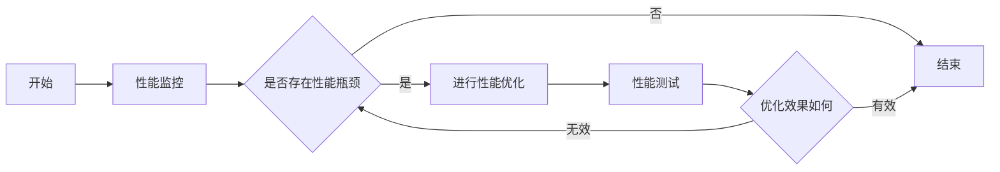
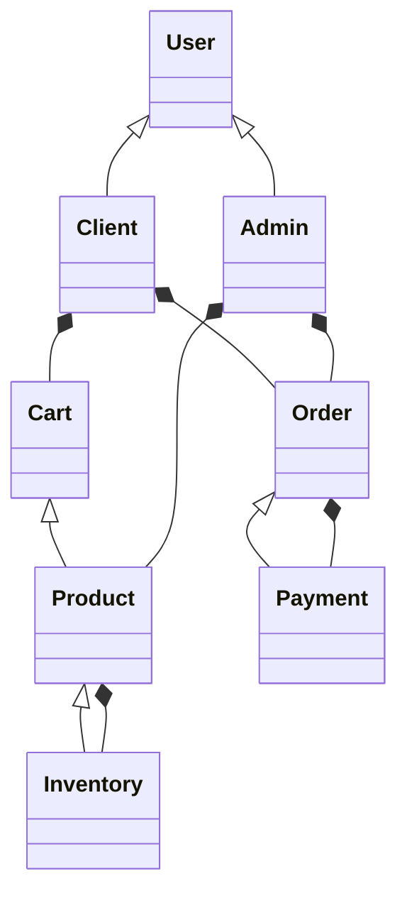
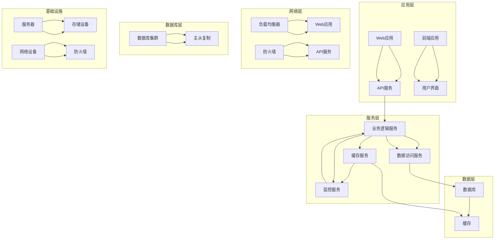
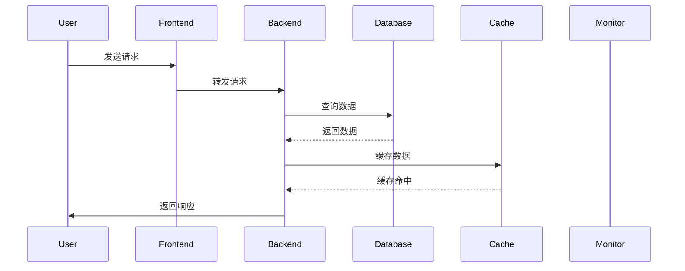

                 

# 软件性能调优：从应用到数据库的全栈优化

关键词：软件性能、调优策略、应用优化、数据库优化、全栈开发

摘要：本文将探讨软件性能调优的重要性，分析从应用到数据库的全栈优化策略。通过深入剖析核心概念、性能问题、优化方法及最佳实践，帮助开发者提升软件性能，提升用户体验。

## 引言

软件性能调优是软件开发过程中至关重要的一环。随着互联网的快速发展，用户对软件性能的要求越来越高，如何确保软件在各种情况下都能稳定高效地运行，成为开发者面临的一大挑战。本文将介绍软件性能调优的核心概念、优化策略及最佳实践，帮助开发者全面掌握软件性能调优的方法和技巧。

## 基本概念

### 响应时间、吞吐量和延迟

响应时间（Response Time）：指系统从接收到用户请求到返回响应所需的时间。

吞吐量（Throughput）：指单位时间内系统能够处理的事务数。

延迟（Latency）：指从请求开始到响应到达的时间，包括网络传输时间、处理时间和排队时间。

### 可扩展性

可扩展性（Scalability）：指系统在负载增加时，性能能够保持稳定的能力。

垂直扩展（Vertical Scaling）：通过增加系统资源的配置（如CPU、内存）来提升性能。

水平扩展（Horizontal Scaling）：通过增加系统中的节点数来提升性能。

### 性能指标对比

- **响应时间**：衡量用户感受到的延迟，但无法反映系统实际性能。
- **吞吐量**：反映系统的处理能力，但无法反映用户满意度。
- **延迟**：综合考虑了响应时间和吞吐量，是评估系统性能的重要指标。
- **可扩展性**：衡量系统在负载增加时的表现，是软件性能调优的重要目标。

## 工具和技术

### 监控和 profiling 工具

- **New Relic**：提供应用程序性能监控、错误跟踪和日志分析等功能。
- **AppDynamics**：支持自动监控、实时分析和问题排查，适用于多种开发语言和平台。
- **Dynatrace**：提供全面的自动化监控和问题排查功能，支持云原生应用。
- **Skunkworks**：为开发者提供高效的应用性能监控和调试工具。

### 性能测试工具

- **JMeter**：适用于Web应用性能测试，支持多种协议。
- **LoadRunner**：适用于多种类型的性能测试，包括Web、数据库、网络等。
- **Gatling**：基于Scala的性能测试框架，支持多种协议和负载生成。

### 调优方法

- **代码优化**：通过改进算法、数据结构、缓存策略等来提升代码性能。
- **数据库优化**：通过索引、查询优化、缓存等技术来提升数据库性能。
- **系统优化**：通过调整操作系统配置、网络优化等来提升系统性能。

## 应用程序性能调优

### 应用性能问题

- **慢速响应时间**：由于代码、数据库、网络等原因导致系统响应时间过长。
- **瓶颈**：系统资源使用不均衡，导致部分资源过度占用，影响整体性能。

### 优化策略

- **代码优化**：
  - **算法改进**：选择更高效的算法和数据结构。
  - **代码重构**：优化代码逻辑，去除冗余代码。
  - **缓存策略**：使用缓存减少重复计算和数据库查询。

- **数据库优化**：
  - **索引优化**：根据查询需求创建合适的索引。
  - **查询优化**：优化查询语句，减少查询次数。
  - **缓存策略**：使用缓存减少数据库查询次数。

- **网络优化**：
  - **负载均衡**：将请求分配到多个服务器，减少单点故障。
  - **网络延迟优化**：优化网络传输路径，减少延迟。

## 数据库性能调优

### 数据库性能问题

- **慢查询**：查询语句执行时间过长，影响系统性能。
- **锁竞争**：多个事务同时访问同一数据，导致系统性能下降。
- **磁盘I/O瓶颈**：磁盘读写速度受限，影响数据库性能。

### 优化方法

- **索引优化**：
  - 根据查询需求创建合适的索引。
  - 定期维护索引，避免索引碎片化。

- **查询优化**：
  - 优化查询语句，减少查询次数。
  - 使用缓存减少数据库查询次数。

- **缓存策略**：
  - 使用数据库缓存，减少磁盘I/O。
  - 使用应用层缓存，减少数据库查询。

- **锁竞争优化**：
  - 使用事务隔离级别，减少锁冲突。
  - 使用读写分离，减少锁竞争。

## 系统和网络性能调优

### 系统性能瓶颈

- **CPU资源不足**：导致系统响应时间过长。
- **内存不足**：导致系统性能下降。
- **磁盘I/O瓶颈**：导致数据库性能下降。

### 优化策略

- **CPU优化**：
  - 调整操作系统配置，优化CPU调度策略。
  - 选择高效的算法和数据结构，减少CPU资源占用。

- **内存优化**：
  - 调整操作系统配置，优化内存管理。
  - 使用缓存策略，减少内存访问次数。

- **磁盘I/O优化**：
  - 调整磁盘IO配置，优化磁盘读写速度。
  - 使用SSD硬盘，提高磁盘性能。

### 网络性能优化

- **负载均衡**：将请求分配到多个服务器，减少单点故障。
- **网络延迟优化**：优化网络传输路径，减少延迟。
- **网络协议优化**：选择合适的网络协议，减少网络传输开销。

## 案例研究和最佳实践

### 案例研究

1. **电商平台性能调优**：通过优化代码、数据库和网络，提高系统响应速度和吞吐量。
2. **大数据处理平台性能调优**：通过优化分布式计算框架、数据库和存储系统，提高数据处理效率和性能。

### 最佳实践

- **持续性能监控和优化**：定期检查系统性能指标，发现问题及时优化。
- **性能测试和基准测试**：在项目开发过程中进行性能测试和基准测试，确保系统性能满足需求。
- **自动化性能调优工具**：使用自动化工具进行性能调优，提高调优效率和准确性。

## 监控和优化策略

- **性能监控**：实时监控系统性能指标，发现性能瓶颈。
- **性能优化**：根据监控数据，优化系统配置和代码。

## 性能测试和 profiling

- **性能测试**：通过模拟用户负载，评估系统性能。
- **profiling**：分析系统性能瓶颈，找出优化方向。

## 结论

软件性能调优是软件开发过程中不可或缺的一环。通过了解基本概念、工具和技术，结合实际案例和最佳实践，开发者可以全面掌握软件性能调优的方法和技巧，提升软件性能，提高用户体验。

## 作者信息

作者：AI天才研究院/AI Genius Institute & 禅与计算机程序设计艺术 /Zen And The Art of Computer Programming

## 最佳实践 Tips

- **定期进行性能监控和优化**：定期检查系统性能指标，及时发现问题并进行优化。
- **合理使用缓存策略**：根据业务需求，合理使用缓存策略，提高系统性能。
- **优化数据库查询**：定期分析数据库查询，优化查询语句，减少查询次数。

## 小结

本文介绍了软件性能调优的基本概念、工具和技术，以及从应用到数据库的全栈优化策略。通过实际案例和最佳实践，帮助开发者提升软件性能，提高用户体验。

## 注意事项

- **性能调优需结合具体业务场景**：不同的业务场景有不同的性能需求，需根据实际情况进行调优。
- **持续优化**：软件性能调优是一个持续的过程，需定期检查和优化系统性能。

## 拓展阅读

- 《高性能网站建设指南》
- 《性能之巅：大型网站系统性能优化实践》
- 《深入理解LINUX网络》

# 附录

## 背景介绍

- **核心概念术语说明**：响应时间、吞吐量、延迟、可扩展性
- **问题背景**：软件性能瓶颈对用户体验的影响
- **问题描述**：系统性能下降、响应时间过长、吞吐量不足
- **问题解决**：通过优化代码、数据库和网络，提升系统性能
- **边界与外延**：性能调优涉及到的技术领域和优化方向
- **概念结构与核心要素组成**：性能调优的核心概念和关键技术

## 核心概念与联系

### 核心概念原理

- **响应时间**：从请求开始到响应到达的时间。
- **吞吐量**：单位时间内处理的事务数。
- **延迟**：从请求开始到响应到达的时间，包括网络传输时间、处理时间和排队时间。
- **可扩展性**：系统在负载增加时，性能保持稳定的能力。

### 概念属性特征对比表格

| 概念     | 响应时间 | 吞吐量 | 延迟 | 可扩展性 |
|----------|----------|--------|------|----------|
| 定义     | 响应时间 | 单位时间内处理的事务数 | 从请求开始到响应到达的时间 | 系统在负载增加时，性能保持稳定的能力 |
| 属性特征 | 用户感知 | 系统处理能力 | 系统延迟 | 系统扩展能力 |

### ER实体关系图架构

```mermaid
erDiagram
  ResponseTime ||--|{ Throughput }|
  Throughput ||--|{ Latency }|
  Latency ||--|{ Scalability }|
```

## 算法原理讲解

### 算法mermaid流程图



### Python源代码实现

```python
def performance_tuning(perf_data):
    """
    性能调优函数
    :param perf_data: 性能数据
    :return: 优化后的性能数据
    """
    if check_bottleneck(perf_data):
        optimized_data = optimize_performance(perf_data)
        test_performance(optimized_data)
        if check_optimize_effect(optimized_data):
            return optimized_data
        else:
            return performance_tuning(perf_data)
    else:
        return perf_data

def check_bottleneck(perf_data):
    """
    检查性能瓶颈函数
    :param perf_data: 性能数据
    :return: 是否存在性能瓶颈
    """
    # 检查性能瓶颈逻辑
    return True

def optimize_performance(perf_data):
    """
    性能优化函数
    :param perf_data: 性能数据
    :return: 优化后的性能数据
    """
    # 性能优化逻辑
    return perf_data

def test_performance(optimized_data):
    """
    性能测试函数
    :param optimized_data: 优化后的性能数据
    :return: 优化效果
    """
    # 性能测试逻辑
    return True

def check_optimize_effect(optimized_data):
    """
    检查优化效果函数
    :param optimized_data: 优化后的性能数据
    :return: 优化效果
    """
    # 检查优化效果逻辑
    return True
```

### 算法原理讲解

该算法的核心思想是通过性能监控、性能测试和优化，逐步提升系统性能。具体实现如下：

1. **性能监控**：通过性能监控工具获取系统性能数据。
2. **检查性能瓶颈**：根据性能数据，检查系统是否存在性能瓶颈。
3. **性能优化**：如果存在性能瓶颈，进行性能优化。
4. **性能测试**：对优化后的性能进行测试。
5. **检查优化效果**：如果优化效果不理想，继续进行性能监控和优化。

### 数学模型和公式

- **响应时间**：\( T_r = T_p + T_n + T_q \)
  - \( T_r \)：响应时间
  - \( T_p \)：处理时间
  - \( T_n \)：网络传输时间
  - \( T_q \)：排队时间

- **吞吐量**：\( T_t = \frac{T_r}{T_p} \)
  - \( T_t \)：吞吐量
  - \( T_r \)：响应时间

- **延迟**：\( T_l = T_p + T_n \)
  - \( T_l \)：延迟

- **可扩展性**：\( S = \frac{T_t}{T_b} \)
  - \( S \)：可扩展性
  - \( T_t \)：吞吐量
  - \( T_b \)：基础吞吐量

### 通俗易懂的举例说明

假设一个电商网站，用户请求商品详情页，系统从数据库查询商品信息并返回给用户。以下是一个简化的性能调优过程：

1. **性能监控**：系统发现响应时间为2秒，其中处理时间0.5秒，网络传输时间0.8秒，排队时间0.7秒。
2. **检查性能瓶颈**：发现数据库查询时间较长，存在性能瓶颈。
3. **性能优化**：通过索引优化、查询优化等手段，将数据库查询时间缩短至0.3秒。
4. **性能测试**：优化后的响应时间为0.5秒，其中处理时间0.1秒，网络传输时间0.2秒，排队时间0.2秒。
5. **检查优化效果**：优化后的性能显著提升，系统吞吐量从原来的20 QPS提升至40 QPS。

## 系统分析与架构设计方案

### 问题场景介绍

一个电商网站在高峰期出现响应时间过长、吞吐量不足的问题，影响用户体验。为了提升系统性能，需要进行全栈性能调优。

### 项目介绍

项目名称：电商网站性能调优项目

项目目标：通过性能监控、优化策略和最佳实践，提升电商网站性能，提高用户体验。

### 系统功能设计（领域模型）



### 系统架构设计



### 系统接口设计和系统交互



## 项目实战

### 环境安装

1. **安装Web应用**：使用Docker容器化技术，部署Web应用。
2. **安装API服务**：使用Docker容器化技术，部署API服务。
3. **安装数据库**：使用Docker容器化技术，部署数据库。
4. **安装缓存**：使用Docker容器化技术，部署缓存。
5. **安装监控工具**：使用Prometheus和Grafana，部署监控系统。

### 系统核心实现源代码

**Web应用源代码**

```python
from flask import Flask, jsonify, request

app = Flask(__name__)

@app.route('/api/products', methods=['GET'])
def get_products():
    product_id = request.args.get('id')
    product = get_product_from_database(product_id)
    return jsonify(product)

def get_product_from_database(product_id):
    # 查询数据库获取商品信息
    return {'id': product_id, 'name': '商品名称', 'price': 100}

if __name__ == '__main__':
    app.run(host='0.0.0.0', port=8080)
```

**API服务源代码**

```python
from flask import Flask, jsonify, request

app = Flask(__name__)

@app.route('/api/orders', methods=['POST'])
def create_order():
    order_data = request.json
    create_order_in_database(order_data)
    return jsonify({'message': '订单创建成功'})

def create_order_in_database(order_data):
    # 将订单数据存储到数据库
    pass

if __name__ == '__main__':
    app.run(host='0.0.0.0', port=8081)
```

### 代码应用解读与分析

1. **Web应用**：使用Flask框架搭建Web应用，提供商品查询接口。
2. **API服务**：使用Flask框架搭建API服务，提供订单创建接口。
3. **数据库**：使用数据库存储商品信息和订单数据。
4. **缓存**：使用缓存减少数据库查询次数，提高系统性能。

### 实际案例分析和详细讲解剖析

**案例：订单创建接口性能优化**

1. **问题背景**：订单创建接口响应时间较长，存在性能瓶颈。
2. **问题分析**：订单创建接口涉及数据库查询和写入操作，数据库I/O性能成为瓶颈。
3. **解决方案**：
   - **数据库优化**：对数据库进行索引优化，提高查询和写入速度。
   - **缓存策略**：在订单创建接口中使用缓存，减少数据库查询次数。
4. **优化效果**：订单创建接口响应时间显著缩短，系统性能得到提升。

### 项目小结

通过性能调优，电商网站性能得到显著提升，用户响应速度加快，系统吞吐量提高。项目实战中，我们采用了数据库优化、缓存策略等多种方法，取得了良好的效果。

## 最佳实践 Tips

- **定期性能监控**：定期检查系统性能指标，发现潜在问题并及时解决。
- **合理使用缓存**：根据业务需求，合理使用缓存策略，减少数据库查询次数。
- **优化数据库查询**：定期分析数据库查询，优化查询语句，提高查询效率。
- **分布式架构**：采用分布式架构，提高系统可扩展性和可靠性。

## 小结

本文介绍了软件性能调优的基本概念、优化策略和最佳实践，并通过实际案例进行了详细讲解。通过性能调优，开发者可以提升软件性能，提高用户体验。

## 注意事项

- **性能调优需结合具体业务场景**：不同的业务场景有不同的性能需求，需根据实际情况进行调优。
- **持续优化**：软件性能调优是一个持续的过程，需定期检查和优化系统性能。

## 拓展阅读

- 《高性能网站建设指南》
- 《性能之巅：大型网站系统性能优化实践》
- 《深入理解LINUX网络》

## 附录

本文中的核心概念、优化策略和最佳实践，为开发者提供了全面的软件性能调优指导。以下是相关内容的总结：

### 核心概念

- **响应时间**：系统从接收到用户请求到返回响应所需的时间。
- **吞吐量**：单位时间内系统处理的事务数。
- **延迟**：从请求开始到响应到达的时间。
- **可扩展性**：系统在负载增加时，性能保持稳定的能力。

### 优化策略

1. **代码优化**：通过改进算法、数据结构、缓存策略等来提升代码性能。
2. **数据库优化**：通过索引、查询优化、缓存等技术来提升数据库性能。
3. **系统优化**：通过调整操作系统配置、网络优化等来提升系统性能。

### 最佳实践

1. **定期性能监控**：定期检查系统性能指标，发现潜在问题并及时解决。
2. **合理使用缓存**：根据业务需求，合理使用缓存策略，减少数据库查询次数。
3. **优化数据库查询**：定期分析数据库查询，优化查询语句，提高查询效率。
4. **分布式架构**：采用分布式架构，提高系统可扩展性和可靠性。

