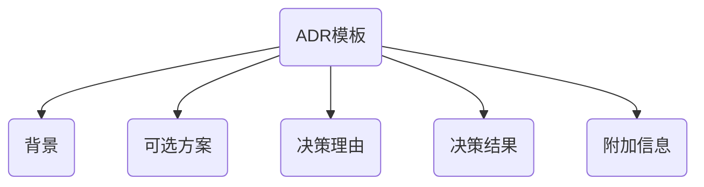
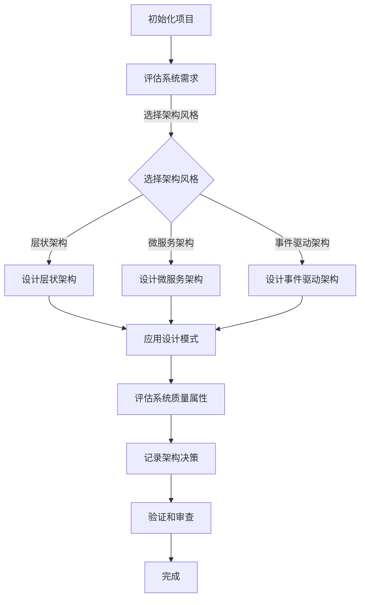
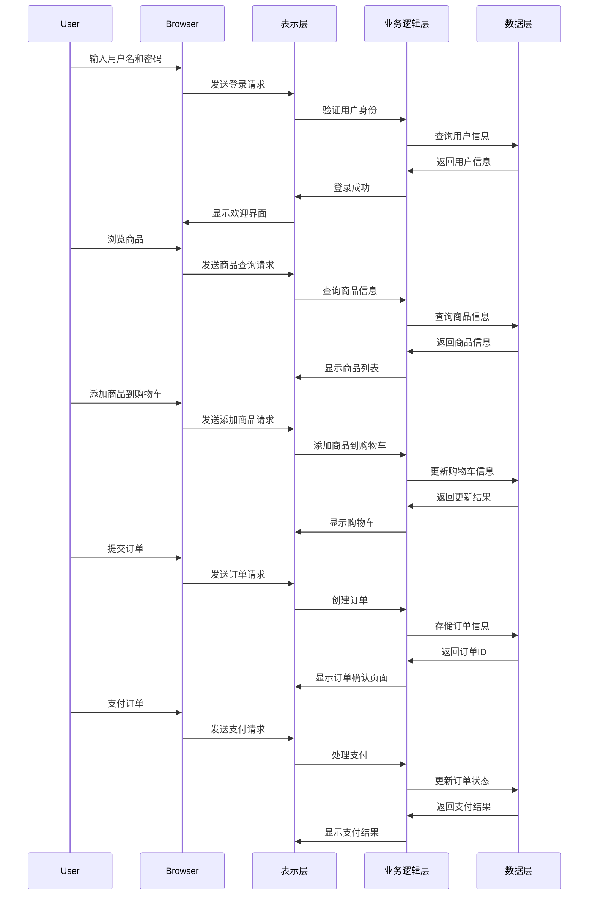
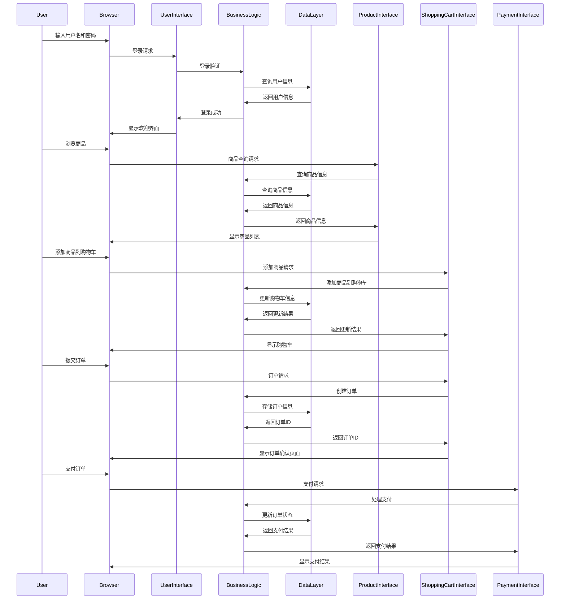

                 

# 软件架构决策记录（ADR）：记录和沟通架构决策

## 关键词：软件架构决策记录，架构决策，架构沟通，软件设计，软件工程

### 摘要：
本文深入探讨了软件架构决策记录（ADR）的概念、重要性及其应用。通过逐步分析，本文详细介绍了如何有效地记录和沟通架构决策，为软件开发团队提供了系统的指导和最佳实践。文章分为五个部分：引言、核心概念、决策记录与沟通方法、实践指导以及总结和拓展阅读。

## 引言

### 什么是软件架构决策记录（ADR）？

软件架构决策记录（ADR）是一种结构化的文档，用于记录软件架构设计过程中所做的关键决策。这些记录不仅帮助团队了解决策背景、选项和结果，还促进了团队间的沟通和协作。ADR的目的是确保架构决策的可追溯性、透明性和一致性。

### 为什么需要ADR？

软件架构的复杂性日益增加，单一的开发者或团队往往无法独立完成整个架构设计。ADR通过记录和分享决策过程，使得整个团队都能够理解和参与到架构设计中。此外，ADR还能在项目后期维护和升级过程中，帮助新成员快速了解现有架构的背景和设计理念。

## 核心概念

### 决策背景和上下文

在记录ADR之前，首先需要明确决策的背景和上下文。这包括当前系统的状态、项目目标、技术限制、业务需求等因素。通过清晰地描述背景，可以帮助团队成员理解决策的必要性和紧迫性。

### 决策选项

在ADR中，应该详细列出所有可行的架构决策选项。这有助于团队在决策过程中进行全面评估，并选择最佳方案。每个选项都应该包括其优点、缺点和潜在风险。

### 决策理由

记录决策理由是ADR的核心部分。这部分应详细阐述为什么选择某个特定选项，并分析其与项目目标的契合度。决策理由应基于技术、业务、用户体验等多方面考虑。

### 决策结果

最后，记录决策结果，即最终的架构决策。这部分应明确描述采纳的方案，以及其实施计划和时间表。此外，还应记录任何后续跟踪事项，以便在项目进行中持续关注和调整。

## 决策记录与沟通方法

### 文档实践

使用统一的ADR模板可以确保所有决策记录的格式和内容一致。模板应包括决策背景、选项、理由和结果等关键部分。

### 版本控制系统

版本控制系统（如Git）有助于跟踪ADR的版本历史，确保文档的完整性和可追溯性。团队成员可以通过Pull Request和Code Review来共同审核和确认决策记录。

### 协作工具

协作工具（如Jira、Confluence）提供了更便捷的ADR记录和管理功能。这些工具支持实时讨论、任务分配和进度跟踪，有助于提升团队协作效率。

### 可视化技术

可视化技术（如图表、UML类图和Mermaid流程图）可以帮助团队更直观地理解架构决策。这些工具不仅能简化复杂概念的表达，还能提高文档的可读性和易懂性。

## 实践指导

### 使用ADR的最佳实践

- **一致性**：确保所有团队成员都遵循统一的ADR模板和流程。
- **透明性**：鼓励团队成员参与ADR的创建和审查过程，确保决策过程的公开透明。
- **及时性**：在决策完成后尽快记录ADR，以避免遗忘关键信息。
- **审查与反馈**：定期审查ADR，确保其准确性和完整性，并收集团队成员的反馈。

### 案例研究

本文将探讨几个实际项目中的ADR案例，分析如何在不同场景下有效地记录和沟通架构决策。通过这些案例，读者可以了解ADR的具体应用方法和效果。

## 结论与拓展阅读

本文介绍了软件架构决策记录（ADR）的概念、核心概念、决策记录与沟通方法以及实践指导。通过ADR，软件团队可以更好地理解和沟通架构决策，提高项目的成功率和可持续性。为了进一步深入了解ADR，读者可以参考以下资源：

- **《软件架构决策记录：构建和传播软件架构知识》（Software Architecture Decision Records: Building and Sharing Knowledge About Software Architecture）**：由著名软件架构师Michael Feathers和John O'Neil合著，详细介绍了ADR的实践和方法。
- **《软件架构：实践者的研究和设计方法》（Software Architecture: Practical Research Techniques for Practitioners）**：由Rick Kazman、Markus Lukaschewskyj和John McGregor合著，探讨了软件架构设计的理论和实践。

作者：AI天才研究院/AI Genius Institute & 禅与计算机程序设计艺术 /Zen And The Art of Computer Programming

----------------------------------------------------------------

## 软件架构决策记录（ADR）的背景与定义

### 什么是软件架构决策记录（ADR）

软件架构决策记录（Architecture Decision Record，简称ADR）是一种结构化的文档，用于记录软件架构设计过程中所做的关键决策。ADR的目的是通过文档化决策过程，确保架构决策的可追溯性、透明性和一致性。每个ADR都包含决策的背景、可选方案、决策理由以及决策结果，使其成为软件开发团队中重要的知识资产。

### 软件架构决策记录的重要性

在软件工程领域，架构设计是一个复杂且持续的过程。一个大型项目的架构往往涉及多个子系统、组件和技术栈。随着项目的演进，团队规模扩大，团队成员更迭，架构设计的复杂性和不确定性也在增加。在这种情况下，ADR的重要性愈发凸显：

1. **确保可追溯性**：通过记录决策过程，可以追溯每个决策的来源和背景，有助于了解架构设计的演变过程，避免出现设计回溯或重复工作。

2. **提高透明性**：ADR促进了团队间的沟通，使团队成员能够清楚地了解每个决策的理由和依据，从而增强团队协作和共识。

3. **增强一致性**：使用ADR模板和流程，确保所有决策记录的结构和内容一致，减少信息遗漏和误解，提高文档的准确性和完整性。

4. **支持知识传承**：在团队成员更替或项目移交时，ADR提供了重要的知识传承工具，新成员可以通过阅读ADR快速了解项目背景和架构设计理念。

5. **辅助决策复用**：通过记录成功的决策案例，团队可以在未来的项目中复用这些决策，提高项目开发效率和质量。

### ADR的组成部分

一个典型的ADR包括以下关键部分：

- **背景（Background）**：描述决策的上下文、当前系统的状态、项目目标、技术限制和业务需求等。

- **可选方案（Options）**：列出所有可行的架构决策选项，并简要介绍每个选项的优缺点。

- **决策理由（Rationale）**：详细阐述每个选项的决策理由，包括技术、业务、用户体验等多方面的考虑。

- **决策结果（Decision）**：明确记录最终采纳的架构决策，并描述其实施计划和时间表。

- **附加信息（Additional Information）**：包括任何与决策相关的补充信息、参考链接、讨论记录等。

### ADR的边界与外延

虽然ADR主要应用于软件架构设计，但它的应用范围不仅限于此。实际上，ADR可以扩展到其他软件开发过程中的关键决策，如：

- **技术选型**：记录项目采用的关键技术和工具，包括其优点、缺点和适用场景。

- **架构风格**：记录项目的架构风格和设计模式，以及选择这些风格的理由。

- **性能优化**：记录性能优化策略和实现的细节，包括基准测试结果和优化效果。

- **安全性设计**：记录安全性相关的架构决策，包括身份验证、授权和数据加密等方面。

- **可维护性和可扩展性**：记录确保代码可维护性和系统可扩展性的措施，如代码规范、模块化设计等。

### 概念结构与核心要素组成

为了更清晰地理解ADR，我们可以将其核心要素组成表示为一个结构图（使用Mermaid绘制）：



在上面的结构图中，ADR模板作为整个文档的核心框架，包含背景、可选方案、决策理由、决策结果和附加信息等五个关键部分。每个部分都承载着不同的信息，共同构成了一个完整的ADR文档。

通过这种结构化的方法，ADR不仅能够帮助团队在架构设计过程中进行有效的沟通和协作，还能为项目的持续演进提供重要的参考和指导。在接下来的部分，我们将详细探讨ADR在实际软件架构决策中的应用和实践。

----------------------------------------------------------------

## 核心概念与联系

在软件架构决策过程中，理解并掌握一系列核心概念是至关重要的。这些概念不仅帮助我们设计出高效、可靠的系统，还能确保团队之间的沟通顺畅。本文将探讨几个关键概念，包括它们的原理、属性特征对比，以及如何使用ER实体关系图和Mermaid流程图进行可视化。

### 核心概念

1. **架构风格（Architecture Styles）**
2. **设计模式（Design Patterns）**
3. **系统质量属性（System Quality Attributes）**
4. **架构决策（Architecture Decisions）**
5. **架构视图（Architecture Views）**

### 原理

1. **架构风格**：架构风格是一种指导软件系统整体结构和组织方式的框架。常见的架构风格包括层状架构、微服务架构和事件驱动架构。每种风格都有其独特的优势和适用场景。

2. **设计模式**：设计模式是解决特定问题的一系列通用解决方案。设计模式遵循设计原则，如SOLID，以确保系统的可维护性和可扩展性。常见的模式包括工厂模式、单例模式和观察者模式。

3. **系统质量属性**：系统质量属性是衡量系统性能的关键指标，包括性能、可扩展性、可靠性和安全性等。这些属性直接影响系统的用户体验和业务价值。

4. **架构决策**：架构决策是在架构设计过程中做出的重要决策，包括技术选型、架构风格选择和设计模式应用等。这些决策通常基于系统需求、技术能力和团队共识。

5. **架构视图**：架构视图是系统不同方面的高层次抽象，通过视图可以全面了解系统的结构、行为和交互。常见的视图包括逻辑视图、物理视图和开发视图。

### 属性特征对比

以下是几个核心概念之间的属性特征对比表格：

| 核心概念 | 定义 | 主要属性特征 |
| --- | --- | --- |
| 架构风格 | 指导软件系统整体结构和组织方式的框架 | - 层状架构：层次分明、模块化、易于维护 |
| 设计模式 | 解决特定问题的一系列通用解决方案 | - 工厂模式：创建对象、降低耦合 |
| 系统质量属性 | 衡量系统性能的关键指标 | - 性能：响应时间、吞吐量 |
| 架构决策 | 架构设计过程中的重要决策 | - 技术选型：选择合适的技术栈 |
| 架构视图 | 系统不同方面的高层次抽象 | - 逻辑视图：功能模块、数据流 |

### ER实体关系图架构

实体关系图（ER图）是表示系统实体及其之间关系的图形工具。以下是一个简单的ER图示例，用于描述架构设计中的关键实体和关系：

```mermaid
erDiagram
  Project ||--|{ Architecture_Style }|| System
  Project ||--|{ Design_Pattern }|| System
  Project ||--|{ System_Quality_Attribute }|| System
  Architecture_Style ||--|{ Decision }|| Project
  Design_Pattern ||--|{ Decision }|| Project
  System_Quality_Attribute ||--|{ Decision }|| Project
```

在上面的ER图中，`Project`（项目）是核心实体，它与`Architecture_Style`（架构风格）、`Design_Pattern`（设计模式）和`System_Quality_Attribute`（系统质量属性）之间存在关联关系。每个架构决策（`Decision`）都与这些核心实体密切相关。

### Mermaid流程图

Mermaid流程图是一种使用Markdown语法绘制的流程图工具，可以清晰地展示架构决策的过程和步骤。以下是一个使用Mermaid绘制的架构决策流程图示例：



在这个流程图中，项目初始化后，首先评估系统需求，然后根据需求选择合适的架构风格。接下来，应用设计模式并进行系统质量属性评估，最后记录和审查架构决策，确保其有效性和一致性。

通过上述ER实体关系图和Mermaid流程图，我们可以更直观地理解和分析软件架构决策的核心概念及其关联关系。这些工具不仅帮助我们清晰表达架构决策过程，还为团队协作提供了有力的支持。在下一部分，我们将深入探讨算法原理和实现细节。

----------------------------------------------------------------

## 算法原理讲解

在软件架构决策过程中，算法的应用至关重要。通过算法，我们可以自动化决策过程，提高效率和准确性。本部分将介绍一种常用的算法——基于权重分析的架构决策算法，并使用Python代码进行详细阐述。

### 算法原理

基于权重分析的架构决策算法是一种多属性决策方法，它通过给每个决策选项分配权重，综合考虑各个属性的重要性，最终得出最佳决策。算法的基本步骤如下：

1. **确定决策属性**：首先，确定影响架构决策的关键属性，如性能、可扩展性、安全性、成本等。

2. **权重分配**：为每个决策属性分配权重，权重值反映了该属性在决策过程中的重要性。权重值通常在0到1之间，且所有权重的总和为1。

3. **评价决策选项**：对每个决策选项在各个属性上的表现进行评价，评价结果通常以分值表示。

4. **计算加权得分**：将每个决策选项的评价结果与相应属性的权重相乘，得到加权得分。

5. **选择最佳决策**：根据加权得分，选择得分最高的决策选项作为最佳决策。

### Python代码实现

以下是一个基于权重分析的架构决策算法的Python代码实现示例：

```python
import numpy as np

# 决策属性
attributes = ['性能', '可扩展性', '安全性', '成本']

# 权重分配
weights = {'性能': 0.4, '可扩展性': 0.3, '安全性': 0.2, '成本': 0.1}

# 决策选项
options = [
    {'名称': '选项A', '性能': 8, '可扩展性': 7, '安全性': 9, '成本': 6},
    {'名称': '选项B', '性能': 7, '可扩展性': 8, '安全性': 8, '成本': 5},
    {'名称': '选项C', '性能': 6, '可扩展性': 9, '安全性': 7, '成本': 7},
]

# 评价决策选项
def evaluate_option(option):
    scores = {attr: option[attr] for attr in attributes}
    return scores

# 计算加权得分
def calculate_weighted_score(scores, weights):
    weighted_scores = {attr: score * weight for attr, score, weight in zip(attributes, scores.values(), weights.values())}
    return sum(weighted_scores.values())

# 执行算法
for option in options:
    scores = evaluate_option(option)
    weighted_score = calculate_weighted_score(scores, weights)
    print(f"{option['名称']}: 加权得分 = {weighted_score}")

# 选择最佳决策
best_option = max(options, key=lambda x: calculate_weighted_score(evaluate_option(x), weights))
print(f"最佳决策：{best_option['名称']}")
```

在上面的代码中，我们首先定义了决策属性和权重，然后为每个决策选项计算加权得分。最后，根据加权得分选择得分最高的决策选项作为最佳决策。

### 数学模型与公式

基于权重分析的架构决策算法可以表示为一个数学模型。设 \( x_1, x_2, \ldots, x_n \) 为 \( n \) 个决策选项，\( y_1, y_2, \ldots, y_m \) 为 \( m \) 个决策属性，\( w_1, w_2, \ldots, w_m \) 为对应的权重，则每个决策选项的加权得分 \( s_i \) 可以表示为：

$$
s_i = \sum_{j=1}^{m} w_j \cdot y_{ij}
$$

其中，\( y_{ij} \) 表示决策选项 \( x_i \) 在决策属性 \( y_j \) 上的得分。

### 举例说明

假设我们需要在三个架构选项中选择一个最佳方案，三个决策属性分别是性能、可扩展性和安全性。各选项的属性得分如下表所示：

| 决策选项 | 性能 | 可扩展性 | 安全性 |
| --- | --- | --- | --- |
| 选项A | 8 | 7 | 9 |
| 选项B | 7 | 8 | 8 |
| 选项C | 6 | 9 | 7 |

权重分配如下：

| 决策属性 | 权重 |
| --- | --- |
| 性能 | 0.4 |
| 可扩展性 | 0.3 |
| 安全性 | 0.3 |

使用上述公式计算每个选项的加权得分：

$$
s_A = 0.4 \cdot 8 + 0.3 \cdot 7 + 0.3 \cdot 9 = 3.2 + 2.1 + 2.7 = 8.0
$$

$$
s_B = 0.4 \cdot 7 + 0.3 \cdot 8 + 0.3 \cdot 8 = 2.8 + 2.4 + 2.4 = 7.6
$$

$$
s_C = 0.4 \cdot 6 + 0.3 \cdot 9 + 0.3 \cdot 7 = 2.4 + 2.7 + 2.1 = 7.2
$$

根据加权得分，选项A得分最高，因此选择选项A作为最佳决策。

通过上述算法，我们可以系统地评估和选择最佳架构决策，提高决策过程的透明性和一致性。在下一部分，我们将探讨具体的系统分析与架构设计方案，并使用Mermaid流程图进行可视化。

----------------------------------------------------------------

## 系统分析与架构设计方案

### 问题场景介绍

假设我们需要设计一个在线购物系统，该系统需要支持用户注册、商品浏览、购物车管理、订单处理等功能。系统需要具备高可用性、高性能和良好的可扩展性，同时要确保用户数据的安全性和隐私性。

### 项目介绍

项目名称：在线购物系统（Online Shopping System）

项目目标：设计一个高效、可靠、易于扩展的在线购物平台，满足用户的基本购物需求。

项目范围：包括用户注册、登录、商品浏览、购物车管理、订单处理、支付和售后服务等功能模块。

### 系统功能设计（领域模型）

在领域模型中，我们定义了系统中的关键实体和它们之间的关系。以下是该系统的领域模型类图，使用Mermaid进行绘制：

```mermaid
classDiagram
    Customer <<-- User : 实体关联
    Product
    ShoppingCart <<-- Product : 实体关联
    Order <<-- User, OrderItem : 实体关联
    Payment <<-- Order : 实体关联

    User OvalArrow { username, password, email }
    Customer OvalArrow { firstName, lastName, address }
    Product OvalArrow { productId, productName, price }
    ShoppingCart OvalArrow { cartId, creationDate }
    Order OvalArrow { orderId, orderDate, status }
    OrderItem OvalArrow { itemId, quantity, unitPrice }
    Payment OvalArrow { paymentId, paymentDate, amount }

    User o--* Customer
    Product o--* ShoppingCart
    ShoppingCart o--* Order
    Order o--* Payment
```

在上面的类图中，我们定义了用户（User）、顾客（Customer）、产品（Product）、购物车（ShoppingCart）、订单（Order）和支付（Payment）等实体，并展示了它们之间的关系。

### 系统架构设计

在系统架构设计中，我们选择了一种三层架构风格，包括表示层、业务逻辑层和数据层。以下是该系统的架构设计图，使用Mermaid进行绘制：



在上面的序列图中，我们展示了用户从登录、浏览商品、添加商品到购物车、提交订单到支付订单的全流程。每个流程步骤都涉及到表示层、业务逻辑层和数据层的交互。

### 系统接口设计

在系统接口设计中，我们定义了各个功能模块之间的接口，包括用户接口、商品接口、购物车接口、订单接口和支付接口。以下是部分接口设计：

```mermaid
interfaceDefinition
    UserInterface {
        login(username: String, password: String): Boolean
        register(firstName: String, lastName: String, email: String, password: String): Boolean
        browseProducts(): List<Product>
        addToCart(productId: String, quantity: Integer): Boolean
        checkout(orderId: String): Boolean
        makePayment(paymentId: String, orderId: String): Boolean
    }

    ProductInterface {
        getProducts(): List<Product>
        getProduct(productId: String): Product
    }

    ShoppingCartInterface {
        getCartItems(userId: String): List<CartItem>
        updateCartItem(productId: String, quantity: Integer): Boolean
        createOrder(userId: String, cartItems: List<CartItem>): Order
    }

    OrderInterface {
        getOrders(userId: String): List<Order>
        getOrder(orderId: String): Order
        updateOrderStatus(orderId: String, status: String): Boolean
    }

    PaymentInterface {
        processPayment(paymentId: String, orderId: String, amount: Float): Boolean
    }
```

在上面的接口定义中，我们定义了用户接口、商品接口、购物车接口、订单接口和支付接口，每个接口都有明确的输入参数和返回值。

### 系统交互

在系统交互中，我们使用Mermaid序列图展示了不同模块之间的交互流程。以下是购物流程的交互序列图：



在上面的序列图中，我们展示了用户从登录到支付订单的全流程，每个步骤都涉及到不同的接口和模块之间的交互。

通过上述系统分析与架构设计方案，我们清晰地定义了系统的功能模块、接口设计和交互流程。这些设计文档为系统的开发、测试和维护提供了重要的参考和指导。

### 项目实战

#### 环境安装

为了实现上述系统设计，我们需要安装以下环境：

- Python 3.8 或更高版本
- Flask 框架（用于构建Web应用）
- SQLAlchemy（用于数据库操作）
- Flask-RESTful（用于构建RESTful API）

安装步骤如下：

1. 安装Python：

   ```bash
   sudo apt-get install python3
   ```

2. 安装虚拟环境：

   ```bash
   sudo apt-get install python3-venv
   ```

3. 创建虚拟环境并激活：

   ```bash
   python3 -m venv venv
   source venv/bin/activate
   ```

4. 安装依赖：

   ```bash
   pip install flask sqlalchemy flask-restful
   ```

#### 系统核心实现

以下是一个简单的购物车管理模块的实现，包括添加商品到购物车、获取购物车信息和删除购物车项的功能。

**购物车管理模块（cart.py）**

```python
from flask import Flask, request, jsonify
from models import ShoppingCart,CartItem

app = Flask(__name__)

@app.route('/cart/add', methods=['POST'])
def add_to_cart():
    cart_id = request.form.get('cart_id')
    product_id = request.form.get('product_id')
    quantity = int(request.form.get('quantity'))

    cart = ShoppingCart.query.get(cart_id)
    if cart is None:
        return jsonify({'error': '购物车不存在'}), 404

    item = CartItem(product_id=product_id, quantity=quantity)
    cart.items.append(item)
    cart.save()

    return jsonify({'message': '商品添加成功'})

@app.route('/cart/items', methods=['GET'])
def get_cart_items():
    cart_id = request.args.get('cart_id')
    cart = ShoppingCart.query.get(cart_id)
    if cart is None:
        return jsonify({'error': '购物车不存在'}), 404

    items = [{'product_id': item.product_id, 'quantity': item.quantity} for item in cart.items]
    return jsonify(items)

@app.route('/cart/item/delete', methods=['DELETE'])
def delete_cart_item():
    cart_id = request.form.get('cart_id')
    product_id = request.form.get('product_id')
    cart = ShoppingCart.query.get(cart_id)
    if cart is None:
        return jsonify({'error': '购物车不存在'}), 404

    item = CartItem.query.filter_by(product_id=product_id).first()
    if item is None:
        return jsonify({'error': '购物车项不存在'}), 404

    cart.items.remove(item)
    cart.save()

    return jsonify({'message': '购物车项删除成功'})

if __name__ == '__main__':
    app.run(debug=True)
```

**数据库模型（models.py）**

```python
from sqlalchemy import create_engine, Column, Integer, String, Float, ForeignKey
from sqlalchemy.ext.declarative import declarative_base
from sqlalchemy.orm import sessionmaker

DeclarativeBase = declarative_base()

engine = create_engine('sqlite:///shopping_cart.db')
Session = sessionmaker(bind=engine)

class ShoppingCart(DeclarativeBase):
    __tablename__ = 'shopping_cart'
    cart_id = Column(Integer, primary_key=True, autoincrement=True)
    creation_date = Column(String(50))
    items = []

class CartItem(DeclarativeBase):
    __tablename__ = 'cart_item'
    item_id = Column(Integer, primary_key=True, autoincrement=True)
    product_id = Column(String(50), ForeignKey('product.product_id'))
    quantity = Column(Integer)
    unit_price = Column(Float)
```

#### 代码应用解读与分析

上述代码实现了购物车管理模块的核心功能。在`add_to_cart`函数中，我们接收POST请求，获取购物车ID、商品ID和数量，然后查询数据库中对应的购物车，将商品添加到购物车中。在`get_cart_items`函数中，我们获取购物车ID，查询数据库中对应的购物车，返回购物车中的所有商品项。在`delete_cart_item`函数中，我们接收DELETE请求，获取购物车ID和商品ID，查询数据库中对应的购物车项，并将其从购物车中删除。

这些功能的实现依赖于数据库模型（`models.py`），其中定义了购物车（`ShoppingCart`）和购物车项（`CartItem`）的表结构和关系。通过使用SQLAlchemy，我们能够方便地进行数据库的创建、查询和更新操作。

#### 实际案例分析和详细讲解剖析

假设我们有如下案例：

- 用户ID为1的顾客在购物车ID为100的购物车中添加了商品ID为101的商品，数量为2。
- 用户ID为1的顾客查询购物车ID为100的购物车，应返回商品ID为101的商品，数量为2。
- 用户ID为1的顾客删除购物车ID为100的购物车中的商品ID为101的商品。

1. **添加商品到购物车**

   用户提交一个POST请求到`/cart/add`接口，请求体如下：

   ```json
   {
       "cart_id": "100",
       "product_id": "101",
       "quantity": 2
   }
   ```

   `add_to_cart`函数接收到请求后，查询数据库中的购物车，找到购物车ID为100的购物车，将商品ID为101的商品添加到购物车中。然后，更新数据库，保存购物车信息。

2. **查询购物车信息**

   用户提交一个GET请求到`/cart/items`接口，查询参数如下：

   ```url
   ?cart_id=100
   ```

   `get_cart_items`函数接收到请求后，查询数据库中的购物车，找到购物车ID为100的购物车，返回购物车中的商品项列表。

3. **删除购物车商品**

   用户提交一个DELETE请求到`/cart/item/delete`接口，请求体如下：

   ```json
   {
       "cart_id": "100",
       "product_id": "101"
   }
   ```

   `delete_cart_item`函数接收到请求后，查询数据库中的购物车项，找到商品ID为101的购物车项，将其从购物车中删除。然后，更新数据库，保存购物车信息。

#### 项目小结

通过上述实现和分析，我们可以看到购物车管理模块的核心功能是如何通过简单的接口和数据库操作来实现的。这个模块不仅支持添加商品到购物车、查询购物车信息和删除购物车商品，还展示了如何使用Flask和SQLAlchemy构建Web应用。在项目中，我们可以根据实际需求扩展这个模块，添加更多功能，如商品列表查询、订单管理和支付处理等。

此外，通过ADR（软件架构决策记录）的方式，我们系统地记录了架构设计、接口设计和实现细节，这有助于团队协作和项目维护。在未来的迭代中，我们可以根据ADR中的记录，快速理解现有架构和设计理念，进行有效的改进和扩展。

---

## 最佳实践 Tips、小结、注意事项、拓展阅读

### 最佳实践 Tips

1. **一致性**：在团队中推广统一的ADR模板和流程，确保所有成员遵循相同的文档标准。
2. **及时性**：在架构决策完成后尽快记录ADR，避免信息遗漏和误解。
3. **透明性**：鼓励团队成员参与ADR的创建和审查，提高决策过程的透明度。
4. **审查与反馈**：定期审查ADR，收集团队成员的反馈，确保文档的准确性和完整性。

### 小结

本文详细介绍了软件架构决策记录（ADR）的概念、核心概念、决策记录与沟通方法、实践指导以及系统分析与架构设计方案。通过ADR，软件开发团队能够更好地记录、沟通和复用架构决策，提高项目开发效率和质量。

### 注意事项

1. **边界定义**：在记录ADR时，明确界定决策的边界和适用范围，避免模糊性。
2. **文档维护**：定期更新和维护ADR文档，确保其与实际项目状态一致。
3. **团队协作**：鼓励团队成员参与ADR的创建和审查，提高团队共识和协作效率。

### 拓展阅读

1. **《软件架构决策记录：构建和传播软件架构知识》（Software Architecture Decision Records: Building and Sharing Knowledge About Software Architecture）**：由Michael Feathers和John O'Neil合著，详细介绍了ADR的实践和方法。
2. **《软件架构：实践者的研究和设计方法》（Software Architecture: Practical Research Techniques for Practitioners）**：由Rick Kazman、Markus Lukaschewskyj和John McGregor合著，探讨了软件架构设计的理论和实践。

作者：AI天才研究院/AI Genius Institute & 禅与计算机程序设计艺术 /Zen And The Art of Computer Programming

