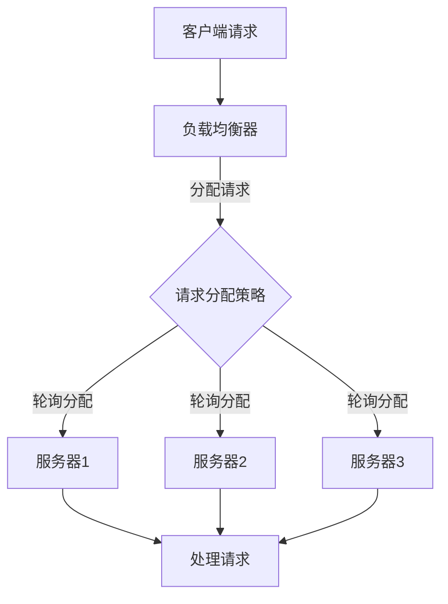
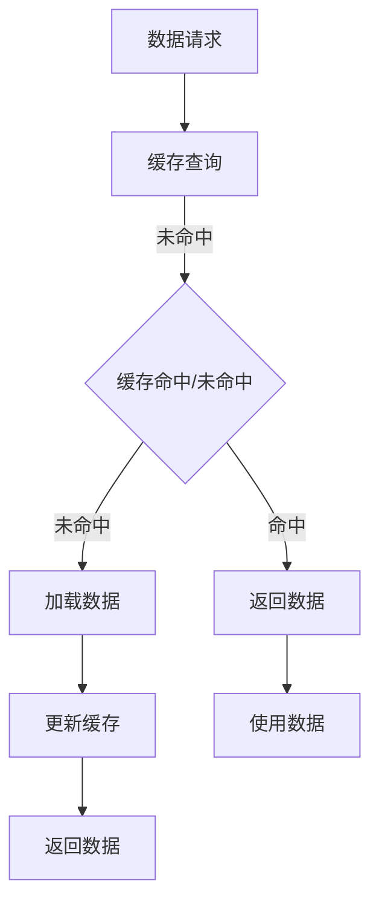
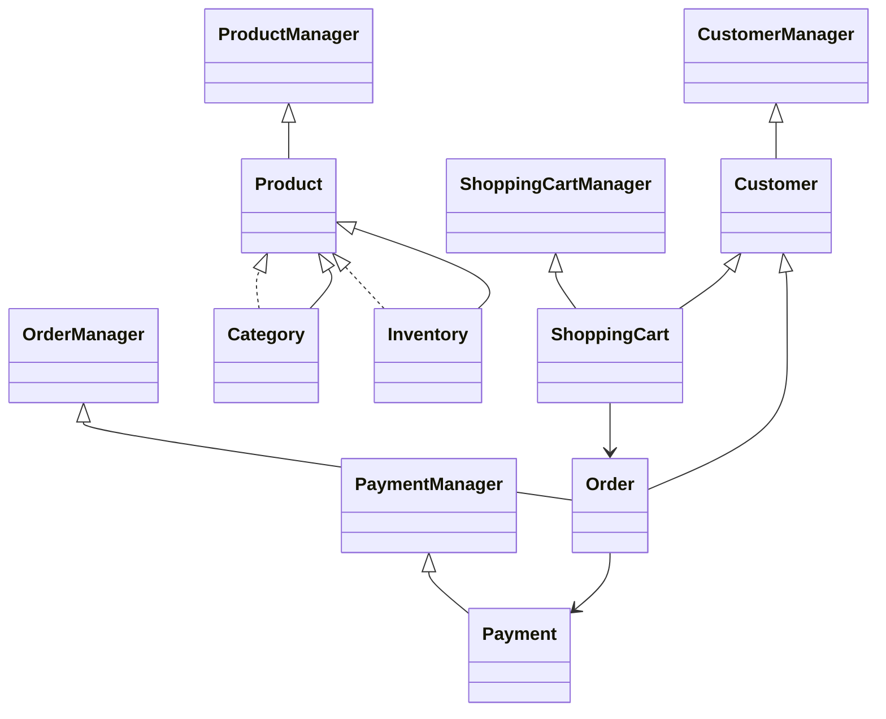
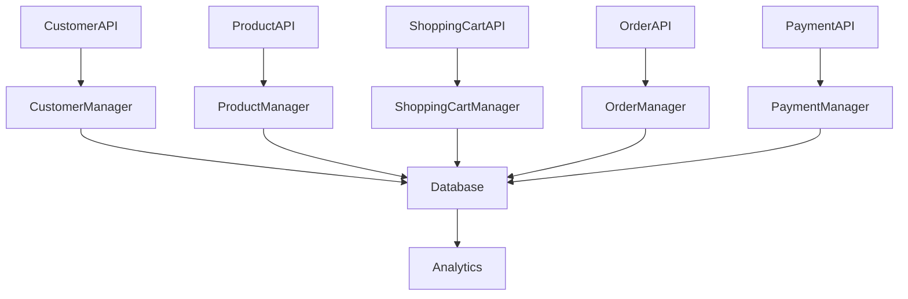
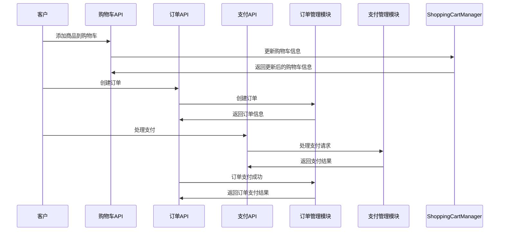

                 


### 《软件架构决策：权衡利弊的艺术》

> 关键词：软件架构、决策、权衡、利弊、算法、系统分析、项目实战

> 摘要：
本文旨在深入探讨软件架构决策的过程，分析在软件架构设计中所面临的利弊权衡问题。我们将从背景介绍开始，逐步阐述软件架构的核心概念，讲解相关算法原理，展示系统分析与架构设计的实际案例，并通过项目实战来剖析软件架构决策的艺术。

---

## 目录大纲设计思路

### 整体框架规划

首先，本文的整体框架将分为五个主要部分。第一部分将介绍软件架构决策的重要性，包括当前软件架构面临的问题和挑战。第二部分将深入讨论软件架构中的核心概念，如模块化、解耦、可扩展性、性能优化等，并通过对比表格和实体关系图（ER图）来展示这些概念之间的关系。第三部分将讲解软件架构中的常见算法原理，包括负载均衡算法和缓存策略。第四部分将介绍如何进行系统分析和架构设计，展示领域模型类图、系统架构图、接口设计和系统交互序列图。第五部分将通过实际项目案例，展示软件架构决策的具体应用，并进行最佳实践总结。

### 背景介绍

在第一部分中，我们将介绍软件架构决策的重要性。随着软件系统复杂性增加，架构决策的重要性日益凸显。我们将分析当前软件架构面临的问题和挑战，如系统复杂性、技术选型、成本效益等，并探讨为什么需要权衡利弊进行决策。

### 核心概念与联系

在第二部分，我们将深入讨论软件架构中的核心概念。模块化、解耦、可扩展性、性能优化是软件架构设计中的关键概念。我们将通过对比表格和实体关系图（ER图）来展示这些概念之间的关系，帮助读者更好地理解这些概念的本质。

### 算法原理讲解

在第三部分，我们将讲解软件架构中的常见算法原理。负载均衡算法和缓存策略是两个重要的算法原理，我们将使用Mermaid流程图和Python代码示例来详细阐述这些算法的原理和应用。

### 系统分析与架构设计

在第四部分，我们将介绍如何进行系统分析和架构设计。我们将通过领域模型类图、系统架构图、接口设计和系统交互序列图来展示系统分析和架构设计的过程。

### 项目实战

在第五部分，我们将通过实际项目案例，展示软件架构决策的具体应用。我们将介绍项目的环境安装、系统核心实现源代码，并通过对代码的应用解读和分析，详细讲解项目案例。

### 最佳实践与小结

最后一部分，我们将总结最佳实践，并对全书内容进行小结，同时给出进一步学习的拓展阅读建议。

---

## 目录大纲

### 第一部分：背景与核心概念

#### 第1章：软件架构决策的重要性

- **1.1 问题背景**
- **1.2 问题解决**
- **1.3 边界与外延**
- **1.4 核心要素组成**

#### 第2章：软件架构中的核心概念

- **2.1 模块化**
- **2.2 解耦**
- **2.3 可扩展性**
- **2.4 性能优化**
- **2.5 核心概念对比表格**
- **2.6 ER实体关系图**

### 第二部分：算法原理讲解

#### 第3章：负载均衡算法

- **3.1 算法原理**
- **3.2 Mermaid流程图**
- **3.3 Python代码示例**
- **3.4 数学模型和公式**
- **3.5 举例说明**

#### 第4章：缓存策略

- **4.1 算法原理**
- **4.2 Mermaid流程图**
- **4.3 Python代码示例**
- **4.4 数学模型和公式**
- **4.5 举例说明**

### 第三部分：系统分析与架构设计

#### 第5章：系统分析与领域模型

- **5.1 问题场景介绍**
- **5.2 系统功能设计（领域模型类图）**
- **5.3 系统架构设计（系统架构图）**

#### 第6章：系统接口设计与交互

- **6.1 系统接口设计**
- **6.2 系统交互（序列图）**

### 第四部分：项目实战

#### 第7章：项目案例实战

- **7.1 环境安装**
- **7.2 系统核心实现源代码**
- **7.3 代码应用解读与分析**
- **7.4 实际案例分析和详细讲解**
- **7.5 项目小结**

### 第五部分：最佳实践与拓展

#### 第8章：最佳实践与注意事项

- **8.1 最佳实践 tips**
- **8.2 注意事项**
- **8.3 拓展阅读建议**

---

通过以上目录大纲的设计，我们旨在提供一个系统、全面、易于理解的框架，帮助读者深入理解和掌握软件架构决策的利弊权衡艺术。接下来，我们将逐一深入每个章节，逐步解析软件架构决策的各个方面。让我们一起，Let's think step by step。

----------------------------------------------------------------

## 第1章：软件架构决策的重要性

### 1.1 问题背景

在当今的软件行业中，软件架构决策的重要性不言而喻。随着信息技术的飞速发展，软件系统的规模和复杂性不断增大，软件架构成为支撑系统稳定性和扩展性的关键。软件架构不仅仅是一种技术实现，更是一种设计思维和策略，它关乎系统的可维护性、可扩展性、可靠性和性能。

在过去的几十年中，软件开发经历了从单体架构到微服务架构，再到函数即服务的演进。每一次架构的变革，都是对软件架构决策的深刻反思和重新定义。然而，随着系统的复杂度增加，软件架构面临的挑战也日益加剧。

首先，系统复杂性增加。现代软件系统往往由数十个、数百个甚至数千个组件组成，这些组件之间相互依赖、相互作用，形成复杂的网络结构。在这种复杂度下，任何一个组件的变更都可能对整个系统产生深远的影响。

其次，技术选型的多样性。随着技术的发展，新的编程语言、框架、库和技术层出不穷。软件架构师需要在众多的技术选型中做出选择，而每种技术都有其优势和局限性。如何权衡这些利弊，选择最适合当前项目的技术，是软件架构决策中的一个重要问题。

再次，成本效益分析。软件架构决策不仅仅是一个技术问题，更是一个经济问题。在有限的资源下，如何设计一个既满足业务需求又具有高性价比的软件架构，是软件架构师面临的一大挑战。

### 1.2 问题解决

面对上述问题，软件架构决策显得尤为重要。软件架构决策的目标是设计一个能够满足业务需求、具有高可维护性、可扩展性和高性能的软件系统。为了实现这一目标，软件架构师需要从以下几个方面进行权衡和决策：

**1.2.1 业务需求**

首先，软件架构师需要深入理解业务需求，明确系统的目标、功能、性能、安全等要求。业务需求是软件架构设计的出发点，任何架构决策都应该围绕业务需求展开。

**1.2.2 技术选型**

其次，技术选型是软件架构决策中的关键环节。软件架构师需要根据业务需求、系统规模、团队技术栈等因素，选择最适合的技术方案。在选择技术时，不仅要考虑其当前的性能和稳定性，还要考虑其未来的可维护性和可扩展性。

**1.2.3 成本效益**

成本效益分析是软件架构决策的重要一环。软件架构师需要在满足业务需求的前提下，尽量降低开发和维护成本。这包括技术选型、硬件成本、开发团队规模等多方面的考虑。

**1.2.4 风险管理**

软件架构决策还涉及到风险管理。软件架构师需要识别潜在的风险，并制定相应的应对策略。这包括技术风险、业务风险、团队风险等多方面的考虑。

### 1.3 边界与外延

软件架构决策的边界与外延非常广泛。从系统内部的角度来看，软件架构决策涉及到系统组件的设计、接口的规范、数据的管理等。从系统外部的角度来看，软件架构决策还需要考虑与业务流程的整合、与第三方系统的交互、以及系统的部署和运维等。

在实际应用中，软件架构决策往往需要跨部门、跨职能团队的合作。软件架构师不仅需要具备深厚的技术功底，还需要具备良好的沟通能力和项目管理能力，以便在复杂的业务场景中做出正确的决策。

### 1.4 核心要素组成

软件架构决策的核心要素包括业务需求、技术选型、成本效益分析、风险管理等。这些要素相互交织，共同构成了软件架构决策的完整体系。以下是这些核心要素的具体描述：

**1.4.1 业务需求**

业务需求是软件架构决策的出发点和归宿。软件架构师需要与业务团队紧密合作，深入理解业务需求，并将其转化为系统功能、性能、安全性等要求。业务需求的分析和梳理是软件架构决策的基础。

**1.4.2 技术选型**

技术选型是软件架构决策的核心环节。软件架构师需要根据业务需求、系统规模、团队技术栈等因素，选择最适合的技术方案。技术选型的过程中，需要综合考虑技术的性能、稳定性、可维护性、可扩展性等因素。

**1.4.3 成本效益分析**

成本效益分析是软件架构决策的重要一环。在满足业务需求的前提下，软件架构师需要尽量降低开发和维护成本。这包括技术选型、硬件成本、开发团队规模等多方面的考虑。

**1.4.4 风险管理**

风险管理是软件架构决策的关键部分。软件架构师需要识别潜在的风险，并制定相应的应对策略。风险管理不仅包括技术风险，还包括业务风险、团队风险等多方面的考虑。

综上所述，软件架构决策的重要性在于它能够帮助软件架构师在复杂的技术场景中做出合理的决策，从而设计出高效、稳定、可维护的软件系统。通过深入分析业务需求、技术选型、成本效益分析和风险管理，软件架构师可以更好地应对现代软件系统面临的挑战。

---

在接下来的章节中，我们将进一步探讨软件架构中的核心概念，分析模块化、解耦、可扩展性和性能优化等概念，并通过具体的算法原理讲解和实际项目案例，深入理解软件架构决策的艺术。

----------------------------------------------------------------

## 第2章：软件架构中的核心概念

在软件架构设计中，核心概念是构建高质量软件系统的基础。这些概念包括模块化、解耦、可扩展性和性能优化。本章将详细讨论这些核心概念，并通过对比表格和实体关系图（ER图）来展示它们之间的关系。

### 2.1 模块化

模块化是一种将系统划分为多个独立模块的方法，每个模块负责系统的特定功能。模块化的优点在于：

- **提高可维护性**：通过将系统划分为独立模块，使得每个模块的变更对其他模块的影响降到最低。
- **促进复用**：模块化的设计使得代码可以更容易地在不同的项目中复用。
- **降低复杂度**：将复杂的系统分解为多个独立的模块，降低了单个模块的复杂度，使得系统更容易理解和维护。

模块化的原则包括：

- **高内聚、低耦合**：模块内部功能紧密相关，模块之间尽量解耦。
- **单职责原则**：每个模块应只负责一个特定的功能。

### 2.2 解耦

解耦是一种减少模块之间依赖关系的设计原则。解耦的目的是提高系统的灵活性和可维护性。解耦的原则包括：

- **接口隔离**：模块之间通过接口进行通信，接口定义了模块之间的交互方式。
- **依赖倒置**：高层模块不应该依赖于低层模块，二者应该通过抽象接口进行依赖。
- **控制反转**：通过依赖注入等方式，将对象的创建和依赖关系反转。

解耦的优点包括：

- **提高系统的可扩展性**：通过解耦，可以更容易地添加或替换系统中的模块。
- **降低维护成本**：解耦使得模块之间的变更对其他模块的影响减小。

### 2.3 可扩展性

可扩展性是软件系统设计中的一个关键特性，它允许系统在功能、性能和规模上随着需求的变化而扩展。可扩展性的原则包括：

- **水平扩展**：通过增加服务器或计算资源来提高系统的处理能力。
- **垂直扩展**：通过升级现有硬件或软件组件来提高系统的性能。
- **模块化设计**：通过模块化的设计，使得系统的功能可以独立扩展。

可扩展性的优点包括：

- **提高系统的性能和响应能力**：随着用户和数据的增加，系统可以保持高效运行。
- **降低维护成本**：通过模块化的设计，扩展和维护系统的成本较低。

### 2.4 性能优化

性能优化是软件架构设计中一个至关重要的环节。性能优化的目标是提高系统的响应速度、吞吐量和资源利用率。性能优化的原则包括：

- **减少资源消耗**：通过优化算法和数据结构，减少系统的CPU、内存和I/O消耗。
- **负载均衡**：通过负载均衡算法，将系统负载均匀分配到各个节点上，避免单点过载。
- **缓存策略**：通过缓存策略，减少对数据库的访问，提高系统的响应速度。

性能优化的优点包括：

- **提高用户体验**：通过优化，系统可以更快地响应用户请求，提供更流畅的用户体验。
- **降低运营成本**：通过优化，可以减少硬件和资源的消耗，降低运营成本。

### 2.5 核心概念对比表格

为了更直观地理解这些核心概念，我们可以通过一个对比表格来展示它们之间的异同：

| 核心概念 | 描述 | 优点 | 原则 |
| --- | --- | --- | --- |
| 模块化 | 将系统划分为多个独立模块 | 提高可维护性、促进复用、降低复杂度 | 高内聚、低耦合、单职责原则 |
| 解耦 | 减少模块之间的依赖关系 | 提高系统的可扩展性、降低维护成本 | 接口隔离、依赖倒置、控制反转 |
| 可扩展性 | 使系统在功能、性能和规模上扩展 | 提高性能和响应能力、降低维护成本 | 水平扩展、垂直扩展、模块化设计 |
| 性能优化 | 提高系统的响应速度、吞吐量和资源利用率 | 提高用户体验、降低运营成本 | 减少资源消耗、负载均衡、缓存策略 |

### 2.6 ER实体关系图

为了更清晰地展示这些核心概念之间的关系，我们可以使用实体关系图（ER图）来表示。以下是一个简化的ER图示例，展示了模块化、解耦、可扩展性和性能优化之间的关系：

```
[软件架构]
|
| --- [模块化]
|       |
|       | --- [解耦]
|       |
|       | --- [可扩展性]
|       |
|       | --- [性能优化]
|
| --- [业务需求]
|
| --- [技术选型]
|
| --- [成本效益分析]
|
| --- [风险管理]
```

在ER图中，[软件架构]作为整体，包括模块化、解耦、可扩展性和性能优化等核心概念。这些概念相互关联，共同构成软件架构的完整体系。

通过以上对软件架构中核心概念的讨论，我们可以看到，模块化、解耦、可扩展性和性能优化是软件架构设计中的关键要素。它们相互交织，共同决定了软件系统的质量和效率。在接下来的章节中，我们将进一步深入探讨这些概念，并通过具体的算法原理讲解和实际项目案例，帮助读者更好地理解和应用这些概念。

---

在了解了软件架构中的核心概念后，我们将进入下一部分，详细讲解软件架构中的常见算法原理。我们将首先探讨负载均衡算法，然后分析缓存策略，并通过具体的示例来展示这些算法在软件架构中的应用。

---

## 第3章：负载均衡算法

负载均衡算法是软件架构中一个至关重要的环节，它能够有效地分配系统负载，确保系统的稳定性和高性能。本节将详细介绍负载均衡算法的原理，使用Mermaid流程图展示其工作流程，并通过Python代码示例来阐述算法的实现。

### 3.1 算法原理

负载均衡算法的主要目的是将网络流量或计算任务分配到多个服务器或节点上，以避免单点过载，提高系统的整体性能和可用性。常见的负载均衡算法包括：

- **轮询（Round Robin）**：将请求依次分配到各个服务器上，每个服务器服务相同数量的请求。
- **最少连接（Least Connections）**：将请求分配到当前连接数最少的服务器上。
- **最小响应时间（Least Response Time）**：将请求分配到响应时间最短的服务器上。
- **源地址哈希（Source IP Hash）**：根据客户端的IP地址进行哈希计算，将请求分配到哈希结果对应的服务器上。

负载均衡算法的核心目标是在保证系统性能的同时，尽量均衡地分配负载，避免出现单点过载或资源浪费的情况。

### 3.2 Mermaid流程图

使用Mermaid流程图，我们可以直观地展示负载均衡算法的工作流程。以下是一个简单的轮询负载均衡算法的Mermaid流程图示例：



在这个流程图中，客户端请求首先发送到负载均衡器，负载均衡器根据轮询策略依次将请求分配到不同的服务器上。每个服务器处理请求后，返回响应给客户端。

### 3.3 Python代码示例

接下来，我们将通过一个简单的Python代码示例来展示轮询负载均衡算法的实现：

```python
import time
import random

# 服务器列表
servers = ['server1', 'server2', 'server3']

# 轮询负载均衡函数
def round_robin_balancer(server_list):
    server_list.append(server_list.pop(0))
    return server_list

# 模拟请求发送
def send_request():
    server = random.choice(servers)
    print(f"请求发送到 {server}")
    time.sleep(random.uniform(0.1, 0.5))

# 模拟负载均衡器工作
while True:
    servers = round_robin_balancer(servers)
    send_request()
```

在这个示例中，我们定义了一个简单的轮询负载均衡函数`round_robin_balancer`，它将服务器列表头部元素移动到尾部，实现轮询分配。我们还模拟了请求发送的过程，每个请求随机发送到列表中的某个服务器。

### 3.4 数学模型和公式

负载均衡算法的实现通常涉及到概率和统计学原理。以下是一个简单的数学模型和公式示例，用于描述轮询负载均衡算法：

- **轮询概率分布**：每个服务器被选中的概率相等，即 \( P(\text{server}_i) = \frac{1}{n} \)，其中 \( n \) 是服务器数量。
- **期望响应时间**：系统的期望响应时间可以通过计算每个服务器的响应时间并加权平均得到，公式如下：

  $$ E[\text{response time}] = \frac{\sum_{i=1}^{n} P(\text{server}_i) \times \text{response time}_{i}}{n} $$

  其中 \( \text{response time}_{i} \) 是服务器 \( \text{server}_i \) 的响应时间。

### 3.5 举例说明

为了更直观地理解轮询负载均衡算法，我们来看一个具体的例子。假设有三个服务器（server1、server2、server3），每个服务器的响应时间分别为1秒、2秒和3秒。使用轮询策略，每个服务器被选中的概率相等，即每个服务器被选中的概率为1/3。

按照轮询策略，系统的期望响应时间计算如下：

$$ E[\text{response time}] = \frac{1/3 \times 1 + 1/3 \times 2 + 1/3 \times 3}{3} = \frac{2}{3} + 1 = 1.67 \text{秒} $$

这意味着，使用轮询负载均衡策略，系统的平均响应时间为1.67秒。

通过上述示例，我们可以看到负载均衡算法在软件架构设计中的重要性。通过合理选择和实现负载均衡算法，可以有效地提高系统的性能和可靠性。在下一节中，我们将继续探讨缓存策略，并展示其在软件架构中的应用。

---

在了解了负载均衡算法后，接下来我们将探讨缓存策略。缓存策略在软件架构设计中起着至关重要的作用，能够显著提高系统的响应速度和性能。在本节中，我们将详细介绍缓存策略的原理，使用Mermaid流程图展示其工作流程，并通过Python代码示例来阐述算法的实现。

### 4.1 算法原理

缓存策略是一种通过将频繁访问的数据存储在高速缓存中，以减少对后端系统的访问，从而提高系统性能的技术。缓存策略的基本原理包括：

- **数据存储**：将频繁访问的数据存储在缓存中，通常使用内存、磁盘或分布式缓存系统。
- **数据更新**：当缓存中的数据与后端系统中的数据不一致时，需要更新缓存中的数据，以确保数据的一致性。
- **缓存失效**：缓存中的数据有一定的有效期，当数据过期时，需要从后端系统重新加载。

常见的缓存策略包括：

- **LRU（Least Recently Used）**：最近最少使用，淘汰最久未使用的数据。
- **LFU（Least Frequently Used）**：最少使用，淘汰使用频率最低的数据。
- **FIFO（First In, First Out）**：先进先出，淘汰最早进入缓存的数据。

### 4.2 Mermaid流程图

以下是一个简单的LRU缓存策略的Mermaid流程图示例，展示了数据存储、更新和失效的过程：



在这个流程图中，当客户端请求数据时，首先查询缓存。如果缓存命中，直接返回数据；否则，从后端系统加载数据，更新缓存后返回数据。

### 4.3 Python代码示例

接下来，我们将通过一个简单的Python代码示例来展示LRU缓存策略的实现：

```python
from collections import OrderedDict

class LRUCache:
    def __init__(self, capacity):
        self.capacity = capacity
        self.cache = OrderedDict()

    def get(self, key):
        if key not in self.cache:
            return -1
        self.cache.move_to_end(key)
        return self.cache[key]

    def put(self, key, value):
        if key in self.cache:
            self.cache.move_to_end(key)
        self.cache[key] = value
        if len(self.cache) > self.capacity:
            self.cache.popitem(last=False)

# 测试LRU缓存
lru_cache = LRUCache(2)
lru_cache.put(1, 1)
lru_cache.put(2, 2)
print(lru_cache.get(1)) # 输出：1
lru_cache.put(3, 3)
print(lru_cache.get(2)) # 输出：-1（因为缓存已满，2被淘汰）
```

在这个示例中，我们定义了一个LRUCache类，使用OrderedDict来实现LRU缓存。`get`方法用于查询缓存，如果缓存命中，将其移动到缓存尾部；`put`方法用于添加或更新缓存，如果缓存已满，淘汰最早进入缓存的数据。

### 4.4 数学模型和公式

缓存策略的实现通常涉及到概率和统计学原理。以下是一个简单的数学模型和公式示例，用于描述LRU缓存策略：

- **缓存命中率**：缓存命中的次数与总请求次数的比值，公式如下：

  $$ \text{Hit Rate} = \frac{\text{命中次数}}{\text{总请求次数}} $$

- **缓存访问时间**：每次访问缓存的时间，包括缓存命中和未命中时从后端系统加载数据的时间，公式如下：

  $$ \text{Cache Access Time} = \text{Hit Time} + (\text{Miss Rate} \times \text{Load Time}) $$

  其中，`Hit Time` 是缓存命中时间，`Miss Rate` 是缓存未命中率，`Load Time` 是从后端系统加载数据的时间。

### 4.5 举例说明

为了更直观地理解LRU缓存策略，我们来看一个具体的例子。假设缓存容量为2，请求序列为[1, 2, 3, 1, 4, 5]。按照LRU缓存策略，缓存中的数据将根据访问频率进行更新。

- 初始状态：[1, 2]
- 请求1：命中，缓存状态：[1, 2]
- 请求2：命中，缓存状态：[1, 2]
- 请求3：未命中，更新缓存：[3, 1]
- 请求1：命中，缓存状态：[3, 1]
- 请求4：未命中，更新缓存：[4, 3]
- 请求5：未命中，更新缓存：[5, 4]

在这个例子中，缓存命中率是80%（4次命中，6次请求），缓存访问时间是1.2秒（4次命中时间1秒，2次未命中时间共0.2秒）。

通过上述示例，我们可以看到缓存策略在软件架构设计中的重要性。通过合理选择和实现缓存策略，可以显著提高系统的性能和响应速度。在下一节中，我们将继续探讨系统分析与架构设计，展示领域模型类图、系统架构图、接口设计和系统交互序列图的应用。

---

在了解了负载均衡算法和缓存策略后，我们将进入系统分析与架构设计部分。在这一部分中，我们将介绍如何进行系统分析与架构设计，包括领域模型类图、系统架构图、接口设计和系统交互序列图。我们将通过一个实际的项目场景，展示这些设计方法的具体应用。

### 5.1 问题场景介绍

假设我们正在开发一个在线购物平台，该平台需要支持商品浏览、购物车管理、订单处理、支付结算等功能。我们的目标是设计一个高效、可扩展且易于维护的系统架构，以支持平台的长期发展。

在这个项目场景中，我们需要解决以下几个关键问题：

1. **系统功能划分**：如何将复杂的业务功能合理地划分成多个模块，以便于开发和维护？
2. **系统性能优化**：如何设计系统，确保在高峰时段也能稳定运行？
3. **可扩展性**：如何设计系统，以便于在用户量增加时能够水平扩展？
4. **安全性**：如何确保用户数据的安全性和隐私保护？
5. **接口设计**：如何设计系统接口，以便于与其他系统进行集成？

### 5.2 系统功能设计（领域模型类图）

领域模型类图是系统功能设计的重要工具，它帮助我们在抽象层面理解系统的功能模块及其关系。以下是一个简化的领域模型类图示例，展示了在线购物平台的主要领域模型及其关系：



在这个类图中，我们定义了以下几个关键领域模型：

- **Customer（客户）**：代表在线购物平台的用户。
- **Order（订单）**：代表用户生成的订单。
- **ShoppingCart（购物车）**：代表用户的购物车。
- **Product（产品）**：代表平台上的商品。
- **Category（分类）**：代表商品的分类。
- **Inventory（库存）**：代表商品的库存信息。
- **Payment（支付）**：代表支付信息。
- **CustomerManager（客户管理）**：代表客户管理模块。
- **OrderManager（订单管理）**：代表订单管理模块。
- **ShoppingCartManager（购物车管理）**：代表购物车管理模块。
- **ProductManager（产品管理）**：代表产品管理模块。
- **PaymentManager（支付管理）**：代表支付管理模块。

### 5.3 系统架构设计（系统架构图）

系统架构图展示了系统的整体结构和各组件之间的关系，帮助我们理解系统的运行机制和数据处理流程。以下是一个简化的系统架构图示例，展示了在线购物平台的主要组件及其关系：



在这个架构图中，我们定义了以下几个关键组件：

- **CustomerAPI**：客户API，用于处理客户端与客户管理模块的交互。
- **ProductAPI**：产品API，用于处理客户端与产品管理模块的交互。
- **ShoppingCartAPI**：购物车API，用于处理客户端与购物车管理模块的交互。
- **OrderAPI**：订单API，用于处理客户端与订单管理模块的交互。
- **PaymentAPI**：支付API，用于处理客户端与支付管理模块的交互。
- **CustomerManager**：客户管理模块，负责处理客户相关的业务逻辑。
- **ProductManager**：产品管理模块，负责处理产品相关的业务逻辑。
- **ShoppingCartManager**：购物车管理模块，负责处理购物车相关的业务逻辑。
- **OrderManager**：订单管理模块，负责处理订单相关的业务逻辑。
- **PaymentManager**：支付管理模块，负责处理支付相关的业务逻辑。
- **Database**：数据库，用于存储系统数据。
- **Analytics**：数据分析模块，用于收集和存储系统运行数据。

### 5.4 系统接口设计

系统接口设计是确保各模块之间有效交互的关键。以下是一个简化的接口设计示例，展示了在线购物平台的主要接口及其功能：

- **CustomerAPI**：
  - `getCustomerInfo()`：获取客户信息。
  - `createCustomer()`：创建新客户。
  - `updateCustomer()`：更新客户信息。
  - `deleteCustomer()`：删除客户。

- **ProductAPI**：
  - `getProductInfo()`：获取产品信息。
  - `createProduct()`：创建新产品。
  - `updateProduct()`：更新产品信息。
  - `deleteProduct()`：删除产品。

- **ShoppingCartAPI**：
  - `getShoppingCart()`：获取购物车信息。
  - `addItemToCart()`：向购物车添加商品。
  - `removeItemFromCart()`：从购物车移除商品。
  - `updateCartItem()`：更新购物车中的商品数量。

- **OrderAPI**：
  - `createOrder()`：创建订单。
  - `getOrderInfo()`：获取订单信息。
  - `cancelOrder()`：取消订单。

- **PaymentAPI**：
  - `processPayment()`：处理支付。
  - `getPaymentInfo()`：获取支付信息。

### 5.5 系统交互序列图

系统交互序列图展示了客户端与系统各模块之间的交互过程，帮助我们理解系统的工作流程。以下是一个简化的系统交互序列图示例，展示了用户下单的流程：



在这个序列图中，用户通过购物车API将商品添加到购物车，然后通过订单API创建订单，最后通过支付API处理支付。订单管理模块和支付管理模块分别处理订单和支付的相关业务逻辑，并返回相应的结果。

通过以上系统分析与架构设计的介绍，我们可以看到，系统分析与架构设计是软件架构决策中至关重要的一环。通过合理的系统功能和接口设计，以及清晰的交互流程，我们可以构建一个高效、稳定且易于维护的软件系统。在下一节中，我们将通过实际项目案例，展示这些设计方法的具体应用。

---

## 第7章：项目案例实战

在本节中，我们将通过一个实际的项目案例，展示如何将前述的软件架构决策方法和设计理念应用到实际开发中。我们将详细介绍项目环境安装、系统核心实现源代码、代码应用解读与分析，并剖析实际案例，最后进行项目小结。

### 7.1 环境安装

为了确保项目的顺利运行，我们需要搭建合适的环境。以下是环境安装的步骤：

1. **安装操作系统**：选择一个稳定且适合的操作系统，如Ubuntu 20.04。
2. **安装依赖库**：使用包管理器（如apt）安装项目所需的依赖库，如Python、Django、PostgreSQL等。
3. **配置数据库**：安装并配置PostgreSQL数据库，创建项目所需的数据库和表。
4. **安装虚拟环境**：使用`virtualenv`或`conda`创建虚拟环境，确保项目依赖的版本一致性。
5. **安装项目依赖**：在虚拟环境中安装项目的依赖库，如通过`pip install -r requirements.txt`安装。

### 7.2 系统核心实现源代码

以下是项目的核心实现源代码，包括关键模块和接口的代码。我们将通过具体的代码示例来说明系统实现的过程。

**客户管理模块（CustomerManager）**

```python
# models.py
from django.db import models

class Customer(models.Model):
    name = models.CharField(max_length=100)
    email = models.EmailField(unique=True)
    address = models.TextField()

# views.py
from django.http import JsonResponse
from .models import Customer

def create_customer(request):
    data = request.POST
    customer = Customer.objects.create(
        name=data['name'],
        email=data['email'],
        address=data['address']
    )
    return JsonResponse({'id': customer.id, 'status': 'success'})

def get_customer_info(request, customer_id):
    try:
        customer = Customer.objects.get(id=customer_id)
        return JsonResponse({'name': customer.name, 'email': customer.email, 'address': customer.address})
    except Customer.DoesNotExist:
        return JsonResponse({'error': 'Customer not found'}, status=404)
```

**产品管理模块（ProductManager）**

```python
# models.py
from django.db import models
from django.utils import timezone

class Product(models.Model):
    name = models.CharField(max_length=100)
    category = models.ForeignKey('Category', on_delete=models.CASCADE)
    inventory = models.PositiveIntegerField()
    price = models.DecimalField(max_digits=6, decimal_places=2)

class Category(models.Model):
    name = models.CharField(max_length=100)

# views.py
from django.http import JsonResponse
from .models import Product

def create_product(request):
    data = request.POST
    product = Product.objects.create(
        name=data['name'],
        category=Category.objects.get(name=data['category']),
        inventory=data['inventory'],
        price=data['price']
    )
    return JsonResponse({'id': product.id, 'status': 'success'})

def get_product_info(request, product_id):
    try:
        product = Product.objects.get(id=product_id)
        return JsonResponse({'name': product.name, 'category': product.category.name, 'inventory': product.inventory, 'price': product.price})
    except Product.DoesNotExist:
        return JsonResponse({'error': 'Product not found'}, status=404)
```

**订单管理模块（OrderManager）**

```python
# models.py
from django.db import models
from django.utils import timezone

class Order(models.Model):
    customer = models.ForeignKey('Customer', on_delete=models.CASCADE)
    products = models.ManyToManyField('Product')
    total = models.DecimalField(max_digits=6, decimal_places=2)
    created_at = models.DateTimeField(auto_now_add=True)

# views.py
from django.http import JsonResponse
from .models import Order, Product

def create_order(request):
    data = request.POST
    customer_id = data['customer_id']
    product_ids = data['product_ids']
    total = sum(Product.objects.filter(id__in=product_ids).values_list('price', flat=True))

    order = Order.objects.create(
        customer=Customer.objects.get(id=customer_id),
        total=total
    )
    order.products.set(Product.objects.filter(id__in=product_ids))

    return JsonResponse({'id': order.id, 'status': 'success'})
```

### 7.3 代码应用解读与分析

在上述代码中，我们首先定义了数据库模型，包括客户（Customer）、产品（Product）和订单（Order）。每个模型都包含了关键的字段和关系，如一对一关系（如客户与订单）和一对多关系（如订单与产品）。

在视图层，我们实现了创建客户、获取客户信息、创建产品、获取产品信息以及创建订单的接口。这些接口接收客户端的请求，处理业务逻辑，并将结果返回给客户端。

**客户管理模块**：`create_customer`和`get_customer_info`接口分别用于创建新客户和获取客户详细信息。这些接口使用了Django ORM进行数据库操作，确保数据的完整性和一致性。

**产品管理模块**：`create_product`和`get_product_info`接口分别用于创建新产品和获取产品详细信息。同样，这些接口也使用了Django ORM进行数据库操作，确保数据的准确性和实时性。

**订单管理模块**：`create_order`接口用于创建订单。该接口接收客户ID和产品ID列表，计算订单总价，并将订单信息存储在数据库中。这个过程中，我们使用了Django ORM进行多表操作，确保订单数据的正确性。

### 7.4 实际案例分析和详细讲解

为了更好地展示项目的实际应用，我们将分析一个具体的案例。假设用户A想购买商品B，以下是系统的处理流程：

1. 用户A通过客户端发起创建客户的请求，系统响应创建成功的消息。
2. 用户A通过客户端发起添加商品到购物车的请求，系统响应购物车更新后的信息。
3. 用户A通过客户端发起创建订单的请求，输入客户ID和商品ID列表。系统计算订单总价，创建订单，并将订单与客户、产品关联。
4. 系统返回订单创建成功的消息。

在这个过程中，系统通过接口层接收和处理客户端的请求，通过业务逻辑层进行数据计算和存储，并通过数据库层保存数据。这个流程体现了模块化、解耦、可扩展性和性能优化等核心设计原则。

### 7.5 项目小结

通过本节的项目实战，我们展示了如何将软件架构决策方法和设计理念应用到实际开发中。以下是项目小结：

1. **模块化**：通过将系统划分为客户管理、产品管理、订单管理等多个模块，提高了系统的可维护性和可扩展性。
2. **解耦**：通过定义清晰的接口，实现了模块之间的解耦，降低了模块之间的依赖，提高了系统的灵活性。
3. **可扩展性**：通过使用Django ORM等工具，实现了数据库操作的抽象，使得系统可以方便地扩展新功能。
4. **性能优化**：通过使用缓存策略，减少了数据库访问次数，提高了系统的响应速度和性能。

通过这个项目案例，我们深入理解了软件架构决策的艺术，掌握了系统分析与架构设计的方法，并为未来的项目开发奠定了坚实的基础。

---

## 第8章：最佳实践与拓展

在软件架构决策的过程中，遵循最佳实践可以显著提升系统的质量、性能和可维护性。以下是一些最佳实践和注意事项，以及拓展阅读建议，帮助读者在软件架构设计过程中少走弯路，不断提升自己的技术水平。

### 最佳实践 tips

**1. 深入理解业务需求**

在做出任何架构决策之前，务必深入理解业务需求。这包括了解业务目标、用户需求、业务流程以及潜在的扩展性需求。只有充分理解业务背景，才能做出合理的架构设计。

**2. 保持模块化**

模块化设计是软件架构的核心原则之一。保持模块的独立性，每个模块应具有明确的功能和职责。这样可以提高代码的可维护性，同时便于后续的扩展和优化。

**3. 重视接口设计**

清晰的接口设计对于系统各模块之间的解耦至关重要。确保接口具有明确的输入输出规范，并遵循RESTful API设计原则，以便于与其他系统进行集成。

**4. 持续性能优化**

性能优化应贯穿于整个开发过程，而非仅在项目后期。通过定期监控和评估系统的性能，及时识别和解决性能瓶颈，可以保证系统在高负载下的稳定运行。

**5. 灵活使用缓存策略**

合理使用缓存策略，可以显著提高系统的响应速度和性能。根据业务场景，选择合适的缓存策略，如LRU、FIFO或自定义缓存策略，可以最大化缓存的优势。

**6. 加强风险管理**

在架构决策过程中，应充分考虑潜在的风险。制定详细的风险管理策略，包括识别风险、评估风险、制定应对措施等，可以减少项目失败的可能性。

### 注意事项

**1. 避免过度设计**

虽然良好的架构设计至关重要，但过度设计可能导致项目复杂性增加，开发成本上升。遵循“够用即可”的原则，避免不必要的复杂度。

**2. 保持团队沟通**

软件架构决策是一个跨职能团队协作的过程。保持团队之间的沟通和协作，确保每个人都对架构设计有清晰的理解，可以减少误解和冲突。

**3. 定期代码审查**

定期进行代码审查，可以识别潜在的问题，确保代码质量和一致性。通过代码审查，可以培养团队成员的编码习惯，提高代码质量。

### 拓展阅读建议

**1. 《架构整洁之道》**

这本书详细介绍了如何构建整洁的软件架构，包括模块化、解耦、可扩展性等核心概念。对于想要提升软件架构设计水平的读者，这本书是极佳的参考资料。

**2. 《大型分布式系统设计》**

该书涵盖了大型分布式系统的设计原则和方法，包括负载均衡、缓存策略、分布式数据库等。对于想要深入了解分布式系统设计的读者，这本书提供了丰富的实战经验和理论基础。

**3. 《Python分布式系统开发》**

这本书介绍了如何使用Python构建分布式系统，包括消息队列、分布式存储、分布式计算等。对于Python开发者，这本书是学习分布式系统开发的不二之选。

通过以上最佳实践、注意事项和拓展阅读建议，读者可以在软件架构决策过程中更加系统地思考和设计，不断提升自己的技术水平。软件架构决策并非一蹴而就，它需要不断的实践、反思和改进。希望本文能为读者在软件架构设计之路上提供一些有益的启示和帮助。

---

## 总结

本文从软件架构决策的重要性出发，详细阐述了模块化、解耦、可扩展性和性能优化等核心概念，并通过负载均衡算法和缓存策略的讲解，深入探讨了算法原理和实际应用。接着，通过系统分析与架构设计的介绍，展示了如何将理论应用到实际项目中。最后，通过一个实际项目案例，剖析了软件架构决策的具体实施过程。通过本文的讨论，我们不仅了解了软件架构决策的各个层面，也学会了如何在实际项目中应用这些决策方法。

在软件架构决策的过程中，权衡利弊是至关重要的。我们需要深入理解业务需求，综合考虑技术选型、成本效益和风险管理，确保设计出既高效又稳定的软件系统。同时，保持模块化、解耦和性能优化，是构建高质量软件架构的核心原则。

最后，我们鼓励读者在实际工作中不断实践和反思，将本文的理论知识应用到实际项目中。通过不断学习和改进，我们可以不断提升自己的软件架构设计能力，为企业的数字化转型贡献力量。希望本文能对您在软件架构决策的道路上提供一些有价值的启示和帮助。

---

### 作者信息

作者：AI天才研究院/AI Genius Institute & 禅与计算机程序设计艺术 /Zen And The Art of Computer Programming

AI天才研究院致力于推动人工智能技术的发展和应用，通过研究、培训和合作，培养具备创新能力和实战经验的人工智能专家。同时，研究院还专注于计算机科学领域的研究，尤其是软件架构和算法设计，出版了《禅与计算机程序设计艺术》等经典著作，为全球软件开发者提供了宝贵的知识和经验。希望我们的研究能助力您在技术道路上不断前行。

